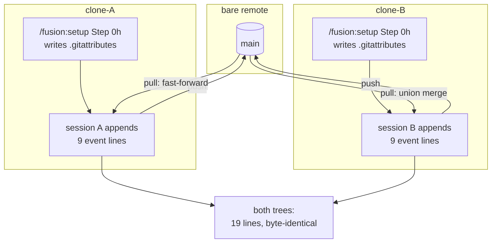
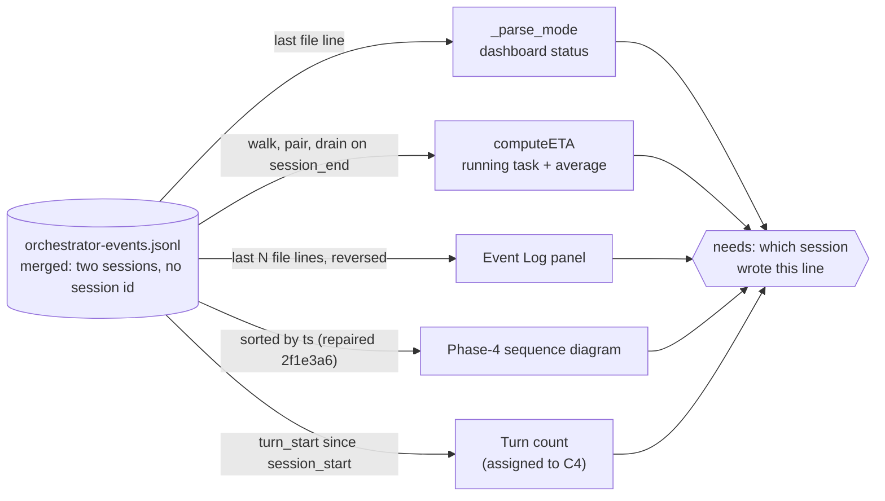

# Analysis: Two checkouts, one event log, and what the monitor makes of it

**Date:** 2026-08-23 13:02
**Type:** Feasibility
**Status:** Complete
**Requested by:** orchestrator, running step 9 of `circles/260823-0023-settle-what-travels-between-checkouts/planning/260823-0800_*_c2-what-travels-between-checkouts-is-settled.md`

## Verdict

**The transport criterion holds, and the monitor is the surface where it costs something.**

Two clones of one project, each running a session and each pushing, ended with byte-identical event logs holding every line from both sessions. No line was lost, no line was duplicated, no conflict reached a person, and both `git pull` invocations exited zero with an empty `git status`. The three tracked workbench root entries are the three the plan names, `portfolio.md` is in neither clone's index, and a second Setup run leaves `.fusion-setup` untouched down to its modification time.

The specification's open question about `bin/monitor` is answered yes, and the dependence is worse than the question assumed. It is not only that `computeETA` walks the log in file order. It is that the merged log holds two independent sessions and no line in it says which session it belongs to. Sorting by `ts` therefore does not repair the readers; in one measured case it turned a vague answer into a wrong one. Filed as a defect, not repaired.

| Criterion | Result |
|---|---|
| Every event line from both sessions in both trees | 19 of 19 lines in each, files byte-identical |
| Lines lost or duplicated | none |
| Conflicts resolved by hand | none; both pulls exited 0 |
| `.fusion-setup` diff on a second Setup run | none; content, hash and mtime unchanged |
| `portfolio.md` in either clone's index | absent from both |
| `bin/monitor` order dependence | real, user-visible, and not repairable by sorting |
| `npm test` in a fresh clone of this repository | 724 passed, 41 files |

## Question

Can a person produce two checkouts of one project, run a session in each, push both, pull each into the other, and find every event line from both sessions in both trees without resolving anything by hand? And does `bin/monitor`, which reads that same log, still tell the truth once the log has been merged?

## Scope

Measured on macOS 15.7.7 (Darwin 24.6.0), git 2.49.0, node v24.2.0, against this repository at HEAD `a76ee8f`. Everything was built under a scratch directory outside the repository and deleted at the end. Nothing was created inside `/Users/k1/Projects/productive/fusion`, and no source file was changed.

The harness follows C1's method (`circles/260822-1921-measure-what-two-checkouts-share/analyses/260822-2219-what-two-checkouts-of-one-project-actually-share.md` `## Scope`): a purpose-built scratch project with a full workbench, a local bare remote, and sibling clones. The project's `.gitignore` carries this repository's `fusion-workbench` block copied verbatim, so the tracked split under test is the one fusion's own tree applies, `portfolio.md` included.

**Two mechanisms were run rather than reproduced.** `/fusion:setup` Step 0h and the Step 0 marker write were extracted verbatim from `skills/setup/SKILL.md` by script and executed unmodified in each clone. Declaring the merge driver by hand would have verified a different thing. `computeETA` and `parseUTCTs` were extracted verbatim from `bin/monitor` and run under node, and the monitor itself was run as a server against a clone's workbench and read over its own HTTP interface.

**The sessions were simulated, and this is the bound C1 named for itself.** No orchestrator ran in either clone. Each session is a set of event lines written in the emitted schema (`ts`, `event`, `turn`, `task`, `agent`, `detail`) plus one record under a workbench store, appended and committed the way a session appends and commits. What that leaves untested is whether a live orchestrator emits the shapes assumed here and whether a real session's timing produces interleavings this one did not. Everything downstream of the lines, the merge, the readers, and the monitor, was exercised against real code.

Two things are outside this report. Nothing was measured on a network remote; both ends were local. And the workbench is small and clean, so behaviour that appears only at realistic size can be missed, which is the same gap C1 accepted.

## Findings

### 1. The transport shape



The driver reached the merge because `.gitattributes` is tracked and both clones wrote identical content, so git resolved the add against add without a conflict and without listing the file in the merge stat.

### 2. Step 0h behaves as its four-branch contract states

Both clones reported `merge: unspecified` before the step and `merge: union` after. A second run in each wrote nothing.

```
$ git check-attr merge -- fusion-workbench/orchestrator-events.jsonl        # before
clone-A: fusion-workbench/orchestrator-events.jsonl: merge: unspecified
clone-B: fusion-workbench/orchestrator-events.jsonl: merge: unspecified

$ bash step0h.sh                                                            # run 1
gitattributes: union merge driver written to .../clone-A/.gitattributes
$ bash step0h.sh                                                            # run 2
gitattributes: a union merge driver already applies, nothing written

$ git check-attr merge -- fusion-workbench/orchestrator-events.jsonl        # after
fusion-workbench/orchestrator-events.jsonl: merge: union
```

The two clones' `.gitattributes` are byte-identical (`cmp` silent).

A third clone taken after both pushes inherits the driver without running Setup at all, because the file git carries is the declaration:

```
$ git clone origin.git clone-C && cd clone-C
$ git check-attr merge -- fusion-workbench/orchestrator-events.jsonl
fusion-workbench/orchestrator-events.jsonl: merge: union
```

That is worth stating because it changes the exposure of the step's own risk. Setup writes the rule once, in the first checkout that runs it, and every later checkout of that project receives it whether or not a person there ever runs Setup.

### 3. Every line from both sessions is in both trees

Checkout B pulled A's session while holding its own:

```
$ git -c pull.rebase=false pull origin main
automatischer Merge von fusion-workbench/orchestrator-events.jsonl
Merge made by the 'ort' strategy.
 fusion-workbench/orchestrator-events.jsonl | 9 +++++++++
 ...
PULL EXIT=0
$ git status --porcelain
(empty)
$ grep -c -E '^(<<<<<<<|=======|>>>>>>>)' fusion-workbench/orchestrator-events.jsonl
0
```

Checkout A then pulled B's merge as a fast-forward, also exit 0 with an empty status. The accounting:

```
base lines            : 1
session A lines expect: 9   found in clone-A: 9   found in clone-B: 9
session B lines expect: 9   found in clone-A: 9   found in clone-B: 9
total lines           : clone-A 19   clone-B 19

$ cmp clone-A/.../orchestrator-events.jsonl clone-B/.../orchestrator-events.jsonl
identical (sha1 afbe858a9632180ce8bdf1cb54a78a58d4f8d095)

$ diff <(sort expected) <(sort clone-A-log)
clone-A: exact match, no line lost, no line duplicated
$ diff <(sort expected) <(sort clone-B-log)
clone-B: exact match, no line lost, no line duplicated

$ sort clone-A-log | uniq -d | wc -l
duplicate lines in clone-A: 0
```

`expected` is the base line plus the two session files as written, so the comparison is against the input rather than against one of the outputs. This answers the plan's last acceptance criterion.

### 4. The merged file is not in timestamp order, and the inversion sits at the block boundary

```
file order == chronological order: False
inversions: 1
  line 10 ts=2026-08-23T09:52:00  >  line 11 ts=2026-08-23T09:00:00
last line ts (what a positional reader calls 'now'): 2026-08-23T09:47:00
chronologically latest ts                        : 2026-08-23T09:52:00
```

The union driver emits the merging side's hunk before the incoming one, so a whole session's block lands intact and the disorder is one jump rather than a shuffle. That matters for the readers: a positional reader is not slightly out, it is reading a different session.

### 5. The monitor question, answered against a running monitor

The dependence is real. To test it under the condition that actually occurs, checkout A was left mid-session with one task started and none done, and pulled a completed session from checkout B. The union merge put A's in-flight lines first and B's block, ending in `session_end`, last.

```
{"ts":"2026-08-23T10:02:00","event":"task_start","tree":"A","task":"TA3", ... "A2/3 RUNNING NOW"}
{"ts":"2026-08-23T10:00:30","event":"session_start","tree":"B", ...}
{"ts":"2026-08-23T10:03:00","event":"task_start","tree":"B","task":"TB3", ...}
{"ts":"2026-08-23T10:18:00","event":"task_done","tree":"B","task":"TB3", ...}
{"ts":"2026-08-23T10:20:00","event":"session_end","tree":"B", ...}
```

**The running monitor called A's live session complete.** `bin/monitor` was started against clone-A's workbench and read over its own interface:

```
$ curl -s http://127.0.0.1:8791/api/dashboard
mode reported by the server : 'done'
events returned             : 26
last event in the payload   : session_end 2026-08-23T10:20:00 tree= B
payload in chronological order: False
```

`mode: 'done'` is what `updateStatus` renders as `Session complete`. Checkout A had a task in flight.

**The ETA vanished for as long as the other checkout's clock was ahead.** Checkout A carried on, finishing one task at 10:05 and starting another at 10:07, both before B's `session_end` timestamp of 10:20:

```
--- A's log as it stands ---
  computeETA() : '' (page renders 'ETA: —')
--- the same log with B's four lines removed ---
  computeETA() : ETA: 12:18 (12m avg, coder)
--- once A's own clock passes 10:20 ---
  computeETA() : ETA: 12:42 (17m avg, coder)
```

Two mechanisms inside `computeETA` produce that. A `session_end` clears the pending-task map, discarding the other session's in-flight starts. And `sessionBoundaryMs`, the later of the last `session_start` and the last `session_end`, rejects any running `task_start` older than itself. A finished session in another checkout therefore suppresses this checkout's ETA until local time passes that session's end.

**The average itself changes with the ordering.** Over one identical set of lines, read in file order the coder history held two pairs and averaged 16 minutes; read in timestamp order it held one pair and averaged 12 minutes. Whichever `session_end` comes first discards the other session's open start, so which pairs survive is decided by the interleaving.

**The event window is a file-order window.** The server takes the last N lines of the file. With `-n 4` against the merged log:

```
monitor window (last 4 file lines)      the 4 chronologically most recent
  10:00:30 session_start tree=B           10:02:00 task_start tree=A  A2/3 RUNNING NOW
  10:03:00 task_start   tree=B            10:03:00 task_start tree=B
  10:18:00 task_done    tree=B            10:18:00 task_done  tree=B
  10:20:00 session_end  tree=B            10:20:00 session_end tree=B
```

The running task's own `task_start` is among the four most recent events and outside the window the monitor uses. The Event Log panel renders that same array reversed as newest-first, so its ordering is wrong at the block boundary as well.

### 6. Sorting by `ts` is not the repair

The obvious fix was tested rather than assumed, and it fails. Over the identical lines:

```
--- FILE ORDER ---
  last line             : task_start ts=2026-08-23T10:07:00 tree=A
  _parse_mode -> status : (unset, falls back to file age)
--- CHRONOLOGICAL ORDER ---
  last line             : session_end ts=2026-08-23T10:20:00 tree=B
  _parse_mode -> status : done
```

The sort moved the dashboard status from vague to wrong. The reason is structural rather than incidental. The monitor asks what *this checkout's* session is doing now, and the emitted event carries `ts`, `event`, and some of `turn`, `task`, `agent`, `detail`. No field names the session or the checkout. No ordering of lines that carry no identity can separate one session's events from another's, which is `rules/critical-stance.md` §4: the mechanism lacks an input the question needs, so what changes is the mechanism.



Every reader of the log converges on one missing input. That is the shape of an integral repair rather than four separate ones, and it is why this report proposes a fork to the user rather than a patch.

### 7. The two supplementary measurements both hold

**`.fusion-setup` no longer produces a diff on a second Setup run.** The marker-write block from `skills/setup/SKILL.md` was extracted verbatim and run twice in a clone whose marker already carried the shipped version:

```
before : {"setup_at":"2026-08-23T08:00:00+0200","plugin_version":"10.6.0"}  mtime=1787482415
run 1  : mtime=1787482415   git status: (empty)
run 2  : mtime=1787482415   git status: (empty)   sha unchanged
```

The mtime is unchanged, which is the property `905a8a4` set out to get and which a byte-identical rewrite would not have given. Three controls confirm the condition is live rather than dead: a marker carrying `plugin_version` `9.9.9` was rewritten and produced ` M fusion-workbench/.fusion-setup`; a deleted marker was recreated; and no freshly written marker contains `setup_pwd`.

**`portfolio.md` is in neither clone's index.** After both merges, `git ls-files fusion-workbench | awk -F/ 'NF==2'` returns `.asset-provenance`, `.fusion-setup` and `orchestrator-events.jsonl` in both clones and nothing else. A playmaker-style full regeneration in clone-A left `git status --porcelain` empty for the whole tree, and `git check-ignore -v` names the ignore line that covers it.

### 8. `npm test` is green in a fresh clone

The blocker fixed at `e7454e3` stays fixed. A fresh clone of this repository at `a76ee8f` has no `portfolio.md` on disk and none in its index:

```
$ cd hooks && npm install && npm test
 Test Files  41 passed (41)
      Tests  724 passed (724)
   Duration  74.66s
```

### 9. A reproduction worth noting, not a new defect

Git carries no empty directory, so a fresh clone of a tracked workbench lacks every store that had no content at the time of the commit. Writing checkout A's record failed on the first attempt for exactly that reason:

```
$ printf '...' > fusion-workbench/shared/analyses/260823-0900-a-side-analysis.md
no such file or directory
$ for d in shared/analyses shared/issues shared/history shared/planning circles/<c>/analyses; ...
  every one: ABSENT
```

C1 recorded this as its own finding and named the consequence: `/fusion:setup` re-creates the `shared/` directories with its `mkdir -p`, and a Circle's own empty subdirectories are re-created by nothing. Nothing new is filed. It is reported here because it bites an agent writing into a second checkout before Setup has run there, which is the arrangement C2 makes ordinary.

## Implications

**C2's last acceptance criterion is met, and the transport half of the multi-checkout arrangement can be relied on.** Two checkouts exchange sessions through the event log without a person in the loop. The property that makes this cheap is that `union` is one of git's built-in drivers, so the tracked `.gitattributes` is the whole configuration and nothing is set up per machine.

**The cost the decision record predicted has landed on the one consumer that renders it to a person.** `rules/workbench-tracking.md` states that a positional reader reads a false order after a merge, and plan step 7 repaired the sequence diagram on that reading. The monitor is a harder case than the rule anticipated, because its failure is not order but attribution. It is a live surface, so the wrong answer is in front of somebody while they work rather than in a document they read later.

**Every remaining reader of the log needs the same missing input.** The dashboard status, the ETA, the event panel, the sequence diagram and the Turn count all need to know which session a line belongs to. Repairing them one at a time produces five local answers to one question, which is the special-case sprawl `rules/critical-stance.md` §2 names. The fork belongs in front of the user once, before any of the five is touched.

**The recorded repair direction for the Turn count is now half wrong.** Both `shared/issues/260822-1136_*_two-definitions-of-the-turn-count-disagree-and-the-resume-snippet-counts-every-session-in-the-log.md` and `circles/260823-0023-settle-what-travels-between-checkouts/issues/260823-1110_*_the-merge-driver-unsorts-a-second-event-log-reader-whose-repair-direction-is-positional.md` offer sorting by `ts` as a way out. The measurement above says sorting does not separate the sessions, so only the other half of that direction survives, a window that does not depend on file order.

**Setup's merge-driver write reaches further than the checkout that runs it.** Because `.gitattributes` is tracked, one Setup run declares the driver for every later checkout of that project. The step's own risk register treats the write as visible in the maintainer's next diff, which holds, but the reach is one project rather than one working copy.

## Recommendations

1. **User, at a gate: choose how a reader identifies a session before any reader is repaired.** Two shapes were named in the defect. Give each emitted line an identity for the session that wrote it, which changes the event schema and the orchestrator's emit sites and repairs all five readers at once. Or read live state from a file that does not travel, which `orchestrator-live.md` already is and which the monitor already reads for everything except the ETA and the event panel. The second is smaller and gives up cross-checkout history in the panel. Recommended: put the two to the user rather than pick one here, because the first changes a format that four surfaces read and the second changes what the dashboard is for.
2. **Planner, when the monitor is scheduled:** treat `bin/monitor` and the C4 Turn count as one piece of work with one input, not two. The defect filed below names the four readings and the fork.
3. **Nothing to do about the transport.** The criterion is met and the driver behaves as its contract states across three clones.

## Filed Issues

- `circles/260823-0023-settle-what-travels-between-checkouts/issues/260823-1302_*_the-monitor-attributes-a-merged-event-log-to-one-session-and-reports-another-checkouts-state.md` — the monitor reads a merged log as one session, so the dashboard status, the ETA, the paired-duration average and the event window each report another checkout's state; sorting by `ts` does not repair it.

## Sources

Measured, in a scratch tree outside this repository (deleted after the run):

- One scratch project with a full workbench and this repository's `fusion-workbench` `.gitignore` block, a local bare remote, and three clones.
- `/fusion:setup` Step 0h and the Step 0 marker write, extracted verbatim from `skills/setup/SKILL.md` by script and executed unmodified in each clone.
- Two simulated sessions of nine event lines each, plus one record per checkout under a workbench store; a third pair of sessions for the concurrent case.
- `git pull` in both directions, `git status`, `git ls-files`, `git check-attr`, `git check-ignore`, `cmp`, `diff` over sorted line sets, `uniq -d`.
- `computeETA` and `parseUTCTs` extracted verbatim from `bin/monitor` and run under node against four log states.
- `bin/monitor` run as a server against clone-A's workbench, read over `/api/dashboard` with `-n 100`, `-n 6` and `-n 4`.
- A fresh clone of this repository at `a76ee8f`, `npm install` and `npm test` in `hooks/`.

Read:

- `circles/260823-0023-settle-what-travels-between-checkouts/planning/260823-0800_*_c2-what-travels-between-checkouts-is-settled.md`, step 9 and `## Where this Circle stops`
- `circles/260822-1921-measure-what-two-checkouts-share/analyses/260822-2219-what-two-checkouts-of-one-project-actually-share.md` `## Scope` and `## Findings` section 7
- `circles/260823-0023-settle-what-travels-between-checkouts/issues/260823-1110_*_the-merge-driver-unsorts-a-second-event-log-reader-whose-repair-direction-is-positional.md`
- `shared/issues/260822-1136_*_two-definitions-of-the-turn-count-disagree-and-the-resume-snippet-counts-every-session-in-the-log.md`
- `skills/setup/SKILL.md` Step 0 and Step 0h
- `bin/monitor`: `computeETA`, `_parse_mode`, `_read_warnings`, `do_GET`, `updateStatus`
- `agents/orchestrator.md`: the event-emission convention and the Phase-4 diagram step
- `rules/workbench-tracking.md`, `rules/critical-stance.md` §2 and §4
- `.gitignore`, `fusion-workbench` block

## Open Questions

- [ ] Which of the two shapes repairs the log's readers, a session identity on every emitted line or live state read from a file that does not travel. Named in the filed defect; it needs the user and it binds C4.
- [ ] Whether a live orchestrator in a second checkout produces the interleavings assumed here. The sessions in this pass were simulated, and settling it needs a Claude Code session started in a second checkout. C1 left the same question open.
- [ ] Whether the transport holds at realistic size. The scratch workbench is small, and nothing measured here depends on size without ruling out a size-dependent effect.
