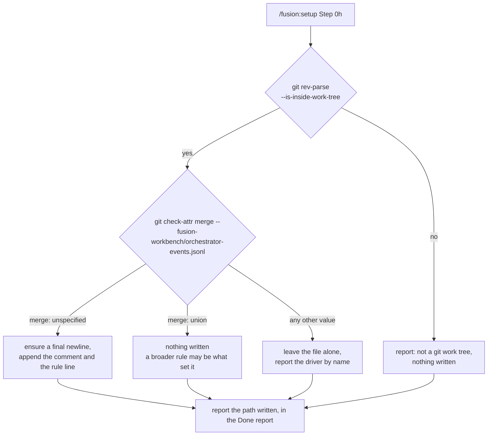
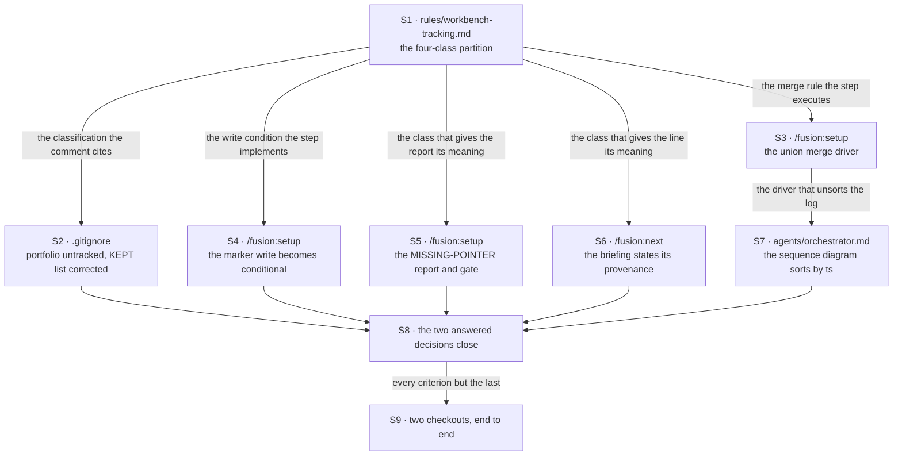

# Implementation Plan: C2 — what travels between checkouts is settled

**Date:** 2026-08-23
**Status:** Complete
**Spec:** `shared/planning/260822-1136_*_spec-fusion-becomes-a-multi-user-tool.md`, capability `### C2`
**Decidability:** The load-bearing question is *"does this project already declare a union merge driver for `fusion-workbench/orchestrator-events.jsonl`"*, and `/fusion:setup` asks it on every run. It is decidable from an input Setup can obtain. `git check-attr merge -- fusion-workbench/orchestrator-events.jsonl` returns git's own resolved attribute value rather than a guess about one, and it was verified in a scratch repository against five configurations: no `.gitattributes` at all, the exact rule line, a broader glob (`*.jsonl merge=union`), a different driver on the same path, and unrelated rules only. Each returned the correct answer. The undecidable form of the same question is the one a text search asks, *"does `.gitattributes` contain this line"*, which cannot see a broader pattern, a nested attributes file, a macro, or an `info/attributes` entry, and which therefore writes a duplicate rule whenever the driver arrived by any route but the literal one. The mechanism this plan uses is the decided question, not the predicted one. The second question the plan turns on, *"should the setup marker be written on this run"*, is decidable from two inputs Setup already holds: whether the file exists, and whether its `plugin_version` equals the version the plugin ships.

## Directive

This plan realises capability C2 of the approved multi-user specification, inside the active Circle `260823-0023-settle-what-travels-between-checkouts`. The Circle record's `## Directive` states the post-completion state and its `## Grounding snapshot` records every answer already given; neither is restated here.

Seven acceptance criteria are in scope, and they fall into three groups. The first group writes down what git carries between checkouts, in the rule and in the `.gitignore` that applies it, and moves `portfolio.md` out of the carried set. The second group makes the one file two checkouts both append to merge without a person's hand, and repairs the one reader whose output the merge would falsify. The third group stops `/fusion:setup` producing a diff on every run and has it report a Circle this checkout never activated.

## Current State

### The four measurements this plan depends on

Each was taken at HEAD `3ee8eaf` on 2026-08-23, and each is reproducible with the command named beside it.

| Fact | Value | How it was taken |
|---|---|---|
| Tracked entries at the workbench root | `.asset-provenance`, `.fusion-setup`, `orchestrator-events.jsonl`, `portfolio.md` | `git ls-files fusion-workbench \| awk -F/ 'NF==2'` |
| Head-room on the `skills/` byte budget | 4 338 bytes | `hooks/lib/__tests__/fixtures/surface-growth.golden` against `SKILL_BASELINE` and `SKILL_HEAD_ROOM` |
| Head-room on the `agents/` byte budget | 15 163 bytes | same golden against `AGENT_BASELINE` and `AGENT_HEAD_ROOM` |
| Head-room on the always-on rule budget | about 3 509 bytes | `hooks/lib/__tests__/fixtures/rules-emission.golden` (95 064) against `RULE_BASELINE` (86 573) and `GROWTH_BUDGET` (12 000) |

The hook-test line budget has 287 lines left. This plan adds no test file, so it never touches that budget; the reason is in `## Testing Strategy`.

### Where the claims to be retired currently stand

`rules/workbench-tracking.md:11` places `portfolio.md` in the records group on the ground that it is *"authored text, not machine-refreshed"*. `rules/workbench-tracking.md:12` lists the live-state group. Neither ranges over the layout tree as a partition; the file classifies root entries by one criterion (does a past version answer anything) and does not name the multi-checkout arrangement at all.

`.gitignore:69` reads `# KEPT: orchestrator-events.jsonl, portfolio.md, .fusion-setup.` Three entries against four tracked ones. The omitted entry is `.asset-provenance`, which is what defect `shared/issues/260822-1028_*_the-gitignore-kept-list-names-three-tracked-records-and-the-rule-it-cites-names-four.md` reports.

No `.gitattributes` exists at the repository root, re-checked at HEAD.

`skills/setup/SKILL.md:94` writes the setup marker with a truncating redirect on every run and includes `setup_pwd`. Nothing reads `setup_pwd`: `grep -rn setup_pwd` over `bin/`, `hooks/` and `skills/` returns the write site and workbench records about it, and every reader of `.fusion-setup` (`hooks/lib/workbench-root.ts`, `bin/fusion-workbench-root`, `hooks/lib/guard-state-file.ts`) tests only that the file exists.

`agents/orchestrator.md:876` and its format block in the Observability section build the Phase-4 Mermaid sequence diagram by reading the event log. Neither says anything about order, because until now file order was chronological order.

### Three findings that change what the plan has to do

**The Grounding's claim that this is Setup's first write outside the workbench does not hold.** `skills/setup/SKILL.md` Step 0g already writes two files at the project root: `.claude/settings.local.json`, and an appended line in `.gitignore` when neither `.claude/` nor that path is already ignored. The property the Grounding treats as intact was already gone before this Circle opened. The decision itself is unaffected, because the user chose the behaviour rather than the reasoning, but the consequence for this plan is the opposite of a complication. Step 0g is a worked convention for exactly this kind of write, and the merge-driver step reuses it rather than inventing a second shape: read first, add only, never overwrite, never remove an existing entry, write only in the directory Setup ran in, and report the outcome in the Done report either way. The inaccurate claim is filed as `circles/260823-0023-settle-what-travels-between-checkouts/issues/260823-0800_*_the-groundings-first-write-outside-the-workbench-claim-was-already-false-when-it-was-written.md`.

**The pointer condition already has a name, and the plan reuses it.** `agents/playmaker.md:95` defines `MISSING-POINTER` as *"`.active-circle` is absent but at least one `_t_` Circle exists"*, which is precisely the state a second checkout is in when it clones a Circle record marked active. `skills/next/SKILL.md:124` already renders that warning to the user. Setup's new report therefore uses the existing vocabulary and adds no second name for one condition. The single-checkout case where somebody deleted the pointer produces the same state, the same report and the same offer, so no case split is added either.

**The defect this Circle closes carries a fix direction that the Circle overrules.** `shared/issues/260816-1049_*_the-split-calls-portfolio-md-not-machine-refreshed-and-the-playmaker-regenerates-it-in-full.md` recommends keeping `portfolio.md` in the records group with a corrected ground. The user's answer 6 in the specification moves it to class L instead. The executor of step S1 must close that defect against the classification the Circle chose and not against the fix direction the record proposes. The step says so in its own text, because an executor that reads the record and follows it would undo the Circle's own answer.

## Approach

### One authoring home, and the bytes follow from it

The binding constraint on this Circle is 4 338 bytes of head-room on `skills/`, against three changes that land there. The design that fits inside it is not a terser way of saying the same things in the skill bodies. It is the project's own single-authoring-home convention applied to a topic that already has a home.

`rules/workbench-tracking.md` is the authoring home for what git carries between checkouts. A merge driver on a tracked workbench file is a statement of exactly that kind, and so is the reason `portfolio.md` stops travelling, and so is the condition under which the setup marker is rewritten. All of that reasoning belongs in the rule. The skill bodies then carry the executable block and one sentence citing the rule.

That placement is free in the sense the specification already states: `bin/fusion-rules` emits `rules/workbench-tracking.md` to no agent, so its bytes fall on no bounded surface. The saving is not a trick played on the instrument. It is the ordinary consequence of putting a definition where the project says definitions go, and the instrument is measuring per-dispatch context cost, which text emitted to nobody does not incur.

With that split, the estimated additions are roughly 2 500 bytes on `skills/setup/SKILL.md`, 450 on `skills/next/SKILL.md` and 400 on `agents/orchestrator.md`. The estimate is not the safeguard. Every step that touches a bounded surface measures the surface after its own edit, and `## Risks & Mitigations` says what happens if a step trips the bound.

### The merge-driver mechanism, verified rather than proposed

The step asks git what git will do, in three branches that exhaust the answer:



The branch set is disjoint and complete because `git check-attr` returns exactly one value for `merge` on that path, and the three branches partition the value space into `union`, `unspecified`, and everything else. `unset`, which a project produces by writing `-merge`, falls in the third branch and is left alone, which is correct: a project that switched the driver off said something deliberate.

Five behaviours were measured in a scratch repository before this plan was written, and each is a precondition of a step below.

1. `git check-attr` answers for a path that does not exist yet, so the step works in a fresh project where the event log has not been created.
2. A broader glob that already sets `merge=union` reports `union`, so the step writes nothing where a project has covered the path its own way.
3. A different driver on the same path reports that driver by name, so the step can name it in the report instead of overwriting it.
4. Run from a subdirectory of a git repository, `check-attr` resolves the path relative to the working directory, which is the same anchor the workbench and the write use. Setup below the git toplevel therefore asks and answers about the same file it would write about.
5. An existing `.gitattributes` whose last byte is not a newline is the one case that damages a neighbouring rule. Guarding the append with `[ -n "$(tail -c1 .gitattributes)" ] && printf '\n'` produced a correct file, and the pre-existing rule still applied afterwards (`git check-attr binary -- foo.png` returned `binary: set`).

The whole block was then run three times against a `.gitattributes` carrying a comment and one unrelated rule. The rule line appeared exactly once, the neighbour survived, and runs two and three wrote nothing.

### Step ordering



S1 points at five later steps, and the fan-out is the design rather than a symptom of one. Each of those five executes something the rule defines, and none of them defines anything itself. A graph in which the executable steps each carried their own reasoning would have fewer edges and one more copy of every claim.

## Implementation Steps

1. [DONE] **The four-class partition is written into `rules/workbench-tracking.md`**
   - Executor: `coder`
   - Files: `rules/workbench-tracking.md`, `shared/issues/260816-1049_*_the-split-calls-portfolio-md-not-machine-refreshed-and-the-playmaker-regenerates-it-in-full.md`
   - Changes: replace the two-bullet records-versus-live-state split with the four-class partition from the specification's `## The state partition` (R1 travels with one writer per file; R2 travels and is appended by many; R3 travels and is written once or per item; L stays in the checkout). Range it over **every** entry of the layout tree in `rules/fusion-workbench-conventions.md` `## fusion-workbench Layout`, including the two frozen stores a workbench may still hold, and state the tiling property: every entry falls in exactly one class, and a new root-anchored surface joins one of them in the commit that creates it. Move `portfolio.md` to class L and delete the clause calling it authored text rather than machine-refreshed. Keep the `.guard-state/` per-file split and the archive-roll paragraph, which the partition inherits rather than replaces. Add three statements this file becomes the home for: that a multi-checkout arrangement requires the project to track its workbench, and why; that `fusion-workbench/orchestrator-events.jsonl` carries a union merge driver, what the line is, why `git check-attr` is the question a mechanism asks about it, and what `/fusion:setup` does in each of the three branches; and that `.fusion-setup` is written when it is missing or when the plugin version changes rather than on every run. Close the defect with a `Resolved:` note and rename it to `_c_`.
   - **The defect's own fix direction is overruled and the note must say so.** It recommends keeping `portfolio.md` in the records group. The user's answer 6 moves it to class L. Write the `Resolved:` note against the Circle's answer and name the record's recommendation as superseded, so a later reader does not read the closure as agreement.
   - Acceptance: a reader can name the class of any entry in the layout tree from this file alone; the string "not machine-refreshed" no longer appears; the multi-checkout requirement, the merge rule and the marker write condition each appear once; the defect is `_c_` with a note that names its overruled recommendation; `npm test` is green, which includes the two citation gates over the new text.
   - Dependencies: none

2. [DONE] **`portfolio.md` leaves git tracking and the `KEPT:` comment names what is left**
   - Executor: `coder`
   - Files: `.gitignore`, `shared/issues/260822-1028_*_the-gitignore-kept-list-names-three-tracked-records-and-the-rule-it-cites-names-four.md`
   - Changes: `git rm --cached fusion-workbench/portfolio.md`, which removes it from the index and leaves the working-tree file untouched. Add `fusion-workbench/portfolio.md` to the ignored list in the `fusion-workbench` block, beside the entry for `monitor`, with the one-clause reason that it is regenerated in full on every playmaker run. Rewrite the `KEPT:` line to name the three tracked root entries exactly: `orchestrator-events.jsonl`, `.fusion-setup`, `.asset-provenance`. Leave the paragraph explaining why `.guard-state/events.jsonl` is deliberately absent from that list as it stands. Close the defect and rename it to `_c_`.
   - Acceptance: `git ls-files fusion-workbench | awk -F/ 'NF==2'` returns exactly those three paths; `fusion-workbench/portfolio.md` still exists on disk; `git status --porcelain fusion-workbench/portfolio.md` prints nothing; the `KEPT:` line and `rules/workbench-tracking.md` name the same three entries; the defect is `_c_`.
   - Dependencies: step 1, because the comment cites the rule and the two must agree

3. [DONE] **`/fusion:setup` declares the union merge driver, creating or amending `.gitattributes`**
   - Executor: `coder`
   - Files: `skills/setup/SKILL.md`
   - Changes: add Step 0h immediately after Step 0g, which is the project-root-write neighbourhood and the convention this step follows. The block guards with `git rev-parse --is-inside-work-tree`, asks `git check-attr merge -- fusion-workbench/orchestrator-events.jsonl`, and branches as the diagram in `## Approach` shows. On the write branch it guards the final newline, then appends a one-line comment and the rule `fusion-workbench/orchestrator-events.jsonl merge=union`. The prose in the skill body is two sentences and a pointer to `rules/workbench-tracking.md` for why; the reasoning is not repeated here. Add one line to the Done report naming which of the four outcomes occurred, and, on the write branch, the path written.
   - **Two properties to state in the step and not leave to be inferred.** The write lands outside `fusion-workbench/`, in the directory Setup ran in and never in a subfolder, which is Step 0g's own bound restated for a second consumer. And the step asks the user nothing, which is what keeps Step 0g's sentence about being the only step that asks on a normal run true.
   - Acceptance: run three times in a scratch repository whose `.gitattributes` already carries a comment and one unrelated rule, the rule line appears exactly once, the neighbour still applies, and runs two and three write nothing; against a `.gitattributes` with no final newline the pre-existing last rule still applies afterwards; against a path already covered by a broader glob nothing is written; against a different driver on that path nothing is written and the driver is named in the report; outside a git work tree nothing is written and the report says why; the `skills/` bound is measured after the edit and reported.
   - Dependencies: step 1

4. [DONE] **The setup marker is written only when it is missing or the plugin version changed, and `setup_pwd` goes**
   - Executor: `coder`
   - Files: `skills/setup/SKILL.md`
   - Changes: replace the unconditional `printf ... > ./fusion-workbench/.fusion-setup` at `skills/setup/SKILL.md:94`. Resolve the shipped version once, as the current block already does. Write the marker when the file is absent, or when the `plugin_version` it carries differs from the shipped one. Otherwise leave it untouched, writing nothing at all rather than writing identical bytes, because an identical write still moves the modification time and a tracked file's diff is not the only thing a second checkout notices. Drop `setup_pwd` from the emitted JSON; keep `setup_at` and `plugin_version`. Nothing reads `setup_pwd`, which `## Current State` records with the command that establishes it.
   - **The pre-v4 refusal above this point keeps its second reason.** That check stops Setup before the marker write precisely so `plugin_version` is not overwritten. The conditional write narrows when the overwrite happens and does not remove it, so the refusal still guards a real loss and its text stays as it is.
   - Acceptance: two Setup runs at one plugin version leave `.fusion-setup` byte-identical and with an unchanged modification time after the second; a run whose shipped version differs rewrites it; a fresh workbench gets one; no freshly written marker contains `setup_pwd`; `git status --porcelain fusion-workbench/.fusion-setup` is empty after a second run in a tracked-workbench project; the `skills/` bound is measured after the edit and reported.
   - Dependencies: step 1

5. [DONE] **`/fusion:setup` reports a Circle this checkout never activated, and offers activation**
   - Executor: `coder`
   - Files: `skills/setup/SKILL.md`, `rules/fusion-workbench-conventions.md`
   - Changes: add the detection and the gate to `skills/setup/SKILL.md`, after the workspace exists and before the Done report. Detection reads `fusion-workbench/.active-circle` and the records matching `circles/*/_t_circle.md`, using one of the two sanctioned marker-glob forms. When the pointer is absent and at least one such record exists, that is `MISSING-POINTER` in the vocabulary `agents/playmaker.md:95` already defines, and the step names it with the Circle's directory name and the first line of its `## Directive`. It then asks, once, whether to activate that Circle here. On yes it writes the directory name into `.active-circle`; on no it writes nothing and says the Circle stays inactive in this checkout. When the pointer is present, or no `_t_` record exists, the step reports nothing.
   - **Setup becomes the fifth writer of `.active-circle`, and that file's own rule prescribes what follows.** `rules/fusion-workbench-conventions.md` `## fusion-workbench Layout` enumerates the pointer's writer set and states that a new writer adds itself to the enumeration in the same commit. Add `/fusion:setup` there, in one clause naming the confirmed branch of this gate as the only condition under which it writes. This is not an override of decision `260806-0015_*_wem-gehoert-die-circle-aktivierung`; it is the procedure that decision's record prescribes for exactly this case.
   - Acceptance: with a `_t_` record present and no pointer, Setup names the Circle and asks; answering yes leaves `.active-circle` holding that directory name and answering no leaves it absent; with a pointer present nothing is reported and nothing is written; the conventions enumeration names `/fusion:setup` with its condition; the always-on rule bound is measured after the edit and reported; the `skills/` bound likewise.
   - Dependencies: step 1

6. [DONE] **The `/fusion:next` briefing says when the ranking was generated and what it covers**
   - Executor: `coder`
   - Files: `skills/next/SKILL.md`
   - Changes: extend the render in Step 5 with the portfolio's provenance. The `**Generated:**` value is already in the portfolio header, so the skill reads it rather than computing anything. The rendered line states the stamp and that the ranking reflects only what this checkout has pulled. Place it with the counts rather than at the top: the recommendation is what the user came for, and the provenance qualifies it.
   - Acceptance: the briefing carries the generation stamp and the checkout qualification; nothing else in the render moves; the `skills/` bound is measured after the edit and reported.
   - Dependencies: step 1

7. [DONE] **The Phase-4 sequence diagram sorts by `ts` instead of trusting file order**
   - Executor: `coder`
   - Files: `agents/orchestrator.md`
   - Changes: two sites, and both are needed because one is the instruction and the other is the format contract. At `agents/orchestrator.md:876`, the Phase-4 step gains the instruction to sort the events by their `ts` field before building the diagram. In the Observability section's `### 3. Post-Session Sequence Diagram`, the rules list gains the same requirement with its one-clause reason: after a union merge the log is no longer in chronological order, so a positional read produces a diagram that is wrong rather than untidy.
   - **The Turn count is out of scope and the step must not touch it.** `shared/issues/260822-1136_*_two-definitions-of-the-turn-count-disagree-and-the-resume-snippet-counts-every-session-in-the-log.md` is assigned to C4. The `grep -c` at `agents/orchestrator.md:91` is order-independent in any case, so nothing here forces its repair.
   - Acceptance: both sites require a `ts` sort and the Observability site carries the reason; no line concerning the Turn count is modified; the `agents/` bound is measured after the edit and reported.
   - Dependencies: step 3, so that the repair lands with the mechanism that causes the disorder

8. [DONE] **The two answered decision records close as implemented**
   - Executor: `coder`
   - Files: `shared/decisions/260822-1136_*_how-does-the-tracked-event-log-behave-when-two-checkouts-both-appended-to-it.md`, `circles/260822-1921-measure-what-two-checkouts-share/decisions/260822-2219_*_what-does-a-second-checkout-do-with-a-circle-record-marked-active-that-it-never-activated.md`
   - Changes: append an `Implemented:` line to each, naming the commit and the file the answer landed in, then rename `_a_` to `_i_`. The event-log record cites the commit from step 3 and `rules/workbench-tracking.md`; the activation record cites the commit from step 5. Both cite this Circle's record for the answer, which is where the user gave it.
   - Acceptance: both files carry the `_i_` marker and an `Implemented:` line whose commit hash resolves; no other annotation is added and no existing line is edited; `npm test` is green, which includes the citation gates over the renamed paths.
   - Dependencies: steps 2, 4, 5, 6, 7

9. [DONE] **Two checkouts, a session in each, and both logs whole afterwards**
   - Executor: `analyst`
   - Files: writes to `$OUT_ANALYSIS`; files defects to `$OUT_ISSUE` if it finds any
   - Changes: no source change. Build the harness the way C1 built its own, under a scratch directory outside this repository, with a local bare remote and two clones, and destroy it at the end. Reuse the C1 method rather than inventing one; `circles/260822-1921-measure-what-two-checkouts-share/analyses/260822-2219-what-two-checkouts-of-one-project-actually-share.md` `## Scope` is the worked description. Run `/fusion:setup`'s new Step 0h in each clone so the driver is declared by the mechanism under test rather than by hand. Produce session activity in each clone (appended event lines plus a record under a store), push both, pull each into the other, and account for every line.
   - **Two questions, one harness.** The first is the last acceptance criterion: every line from both sessions present in both trees, no line lost, no hand editing. The second is the specification's open question about `bin/monitor`, which reads the same log for the dashboard and whose ETA computation walks events in file order (`computeETA` in `bin/monitor`, which pairs `task_start` with `task_done` per id and rejects orphans against the most recent `session_start` it has seen). Feed the merged out-of-order log to the monitor and report whether the dependence is real and what it costs. File a defect if it is; change no code here, because repairing `bin/monitor` is not among C2's criteria.
   - **Say what was simulated.** C1 ran no live fusion session in a second tree and said so. If this pass simulates session output rather than running an orchestrator in each clone, the report names that bound in its own `## Scope`, the way C1's did.
   - Acceptance: a report exists under `$OUT_ANALYSIS` stating, with the commands that produced it, that both trees hold every event line from both sessions; the report answers the `bin/monitor` question with evidence rather than inference; any failure is filed as a defect rather than repaired in place; the scratch tree is removed.
   - Dependencies: step 8

## Where this Circle stops

Each clause is answerable yes or no by reading the tree or running the command it names.

- `rules/workbench-tracking.md` places every entry of the layout tree in exactly one of the four classes, and a reader can name any entry's class from that file alone.
- `git ls-files fusion-workbench | awk -F/ 'NF==2'` returns `.asset-provenance`, `.fusion-setup` and `orchestrator-events.jsonl`, and nothing else; the `KEPT:` comment names those same three.
- `fusion-workbench/portfolio.md` exists in the working tree and produces no entry in `git status`.
- Two consecutive `/fusion:setup` runs at one plugin version leave both `.gitattributes` and `fusion-workbench/.fusion-setup` byte-identical after the second run.
- A project whose `.gitattributes` already carried rules keeps every one of them, and the union line appears exactly once.
- The two checkouts of the step-9 verification hold every event line from both sessions, and no person resolved a conflict by hand.
- Both decision records carry an `Implemented:` line naming a commit, and both defect records carry a `Resolved:` note.
- No growth-bound baseline moved in this Circle, and `npm test` is green.

**Precondition on any release carrying this work.** No version is tagged or pushed for this Circle before step 9 has run and its report is on disk. The measured failure this clause exists to prevent is recorded in decision `260817-1613` under `$SCAN_DECISIONS`: a plan made its Circle's review pass a precondition of the tag, v10.0.0 went out without it, and a post-release reconciliation was what noticed.

## Data Structures

One file format changes and one gains a line.

`fusion-workbench/.fusion-setup` loses a field. Before: `{"setup_at":"…","setup_pwd":"…","plugin_version":"…"}`. After: `{"setup_at":"…","plugin_version":"…"}`. No consumer reads either field; every reader tests only that the file exists. An older marker carrying `setup_pwd` is left as it stands until a version change rewrites it, so no migration is needed and none is planned.

`.gitattributes` at the project root gains one comment line and one rule line:

```
# fusion: the orchestrator event log is append-only and two checkouts both append to it.
fusion-workbench/orchestrator-events.jsonl merge=union
```

`union` is one of git's built-in merge drivers, so it needs no `.git/config` entry and nothing is configured per machine. That is what makes a tracked `.gitattributes` sufficient, and it satisfies the third constraint of the decision record that chose it.

## API Changes

None. No helper signature, no exit code and no emitted key changes. `/fusion:setup` acquires one new write target outside the workbench, which is a change of reach rather than of interface, and `## Current State` records that Step 0g already had two.

## Testing Strategy

**The existing suite is the gate for every step but the last.** Six of the nine steps edit shipped text that four blocking gates already read: the two citation gates, the path-literal lint and the growth bounds. Running `npm test` from `hooks/` after each step is therefore the check, not an addition to it.

**Two goldens must be regenerated by hand, and each regeneration is reviewed.** A change to `agents/`, `skills/` or the hook tests makes `hooks/lib/__tests__/fixtures/surface-growth.golden` stale and the suite red; a change to an emitted rule file does the same to `hooks/lib/__tests__/fixtures/rules-emission.golden`. Both are regenerated with the environment flag their own headers name, and both runs fail on purpose so the flag cannot be left on. Regenerating a golden records growth and never absolves it, so a red bound is not cleared this way.

**No new test file is planned, and the reason is not the budget alone.** Steps 3, 4 and 5 change instructions in a skill body, which a model executes and no test runs. The suite's lints over `skills/*/SKILL.md` check text properties (path literals, marker forms, glob forms) and would need no extension. An integration test that spawned two clones and exercised the merge would be a genuinely new kind of check in this suite, and the hook-test surface has 287 lines left, which a test of that shape would spend most of. Whether such a check should exist is a real fork that outlives this plan, because C3 and C4 need the same verification; it is filed as a decision record and cited in `## Open Questions`.

**Step 9 is the only verification the suite cannot perform**, and its acceptance criterion is written as a set of commands and their expected output rather than as a judgement.

## Risks & Mitigations

| Risk | Mitigation |
|---|---|
| The `skills/` bound trips partway through steps 3 to 6. Estimated additions are about 2 950 bytes against 4 338, and the estimate could be wrong by more than the margin. | Each of those steps measures the surface after its own edit and reports the figure. The first step that trips the bound stops and puts the choice to the user, with the candidate cut sites named. No baseline moves, and no step cuts unrelated text on its own initiative: a Circle that traded a reduction against its own feature at the same gate is precisely what C0 exists to prevent. |
| The executor of step 1 follows the fix direction in defect `260816-1049` and keeps `portfolio.md` in the records group, undoing the Circle's own answer. | The step states the overrule in its own text and requires the `Resolved:` note to name the superseded recommendation. |
| The merge driver reaches a consuming project through Setup and a maintainer neither expected nor wanted a root `.gitattributes`. | The step writes only when the path has no merge driver at all, leaves any other driver alone, names what it did in the Done report, and adds one line to a file git tracks, so the change is visible in the maintainer's next diff. |
| `git rm --cached` is run with a mistyped path or without `--cached` and deletes the working-tree file. | The step's acceptance criterion checks that the file still exists on disk before the step is considered done, and the working-tree copy is regenerated by any playmaker run in any case. |
| Setup writing `.active-circle` in a second checkout produces two checkouts holding one Circle active. | Accepted and recorded at the shaping gate. The gate informs and does not prevent; what changes is that the person sees the condition before it happens rather than after. |
| The `bin/monitor` order dependence turns out to be real and user-visible, and this Circle ships the driver that triggers it. | Step 9 measures it against a genuinely merged log and files a defect. The repair is not in this Circle's criteria, so the user decides whether to widen the Circle or schedule it. |
| Closing defect `260816-1049` while two other surfaces still carry the retired classification. | Filed as its own defect (see `## Open Questions`) and named in the report to the user, so the scope decision is the user's rather than silently made here. |

## Open Questions

- [ ] Does the two-checkout transport verification become a shipped check, or stay a one-off measurement per Circle? Filed as `circles/260823-0023-settle-what-travels-between-checkouts/decisions/260823-0800_*_does-the-two-checkout-transport-verification-become-a-shipped-check.md`. It binds C3 and C4, which need the same verification, and it costs hook-test lines that are scarce. This plan proceeds on the one-off reading and is not blocked on the answer.
- [ ] Two further surfaces still classify `portfolio.md` as an authored record: `hooks/lib/staging-drift.ts` `ROOT_RECORDS`, whose comment repeats the retired ground and whose classification makes the file a staging fault, and the class table at `agents/orchestrator.md:1138`, which names it as an example of the same class. Both are out of this plan by the dispatch's own scope bound and are filed as `circles/260823-0023-settle-what-travels-between-checkouts/issues/260823-0800_*_two-further-surfaces-classify-portfolio-md-as-an-authored-record.md`. Widening this Circle to cover them is the user's call.
- [ ] `shared/decisions/260822-1154_*_does-a-cut-only-circle-re-baseline-the-surfaces-it-cuts.md` stands open. C0 proceeded on option 1, no re-baseline, which is why the head-room figures in `## Current State` are what they are. An answer of option 3 would change the arithmetic this plan's `skills/` risk rests on, though not any step's substance.
- [ ] The Grounding's claim about Setup's first write outside the workbench is inaccurate, filed as a defect. Whether the Circle record itself is corrected is the record's owner's call, not this plan's.

## Reconciliation Log

**260823-1446 (reconciler, domain `code`, range `3ee8eaf..7cd79f1`, 19 commits) — no marker moved and no
step marker changed. `_c_` and `**Status:** Complete` are both correct.**

*Every one of the nine steps was checked at its own site rather than read off its `[DONE]` marker.*

| Step | Verified at | Result |
|---|---|---|
| 1 | `rules/workbench-tracking.md:19-26`, `:13`, `:36-47`, `:59` | four-class table present; tiling re-counted 6+1+2+8 = 17 against 15 root entries plus 2 frozen stores; multi-checkout requirement, merge rule and marker-write condition each appear once; `shared/issues/260816-1049_c_*` closed with a note naming its own overruled fix direction |
| 2 | `git ls-files`, `.gitignore:62-75` | exactly the three tracked root entries; `portfolio.md` on disk at 14 963 bytes and absent from `git status`; `KEPT:` names the same three; `shared/issues/260822-1028_c_*` closed |
| 3 | `skills/setup/SKILL.md:315-345` | Step 0h present with the work-tree guard, `git check-attr`, the `tail -c1` newline guard and the four-outcome branch; the Done report at `:481` names which outcome occurred |
| 4 | `skills/setup/SKILL.md:92-96` | conditional write with the `[ -n "$V" ]` guard ahead of it; `setup_pwd` appears nowhere under `skills/`, `agents/`, `hooks/`, `rules/` or `bin/` |
| 5 | `skills/setup/SKILL.md:348-363`, `rules/fusion-workbench-conventions.md:82` | `MISSING-POINTER` reused from `agents/playmaker.md:95`; `MULTIPLE-ACTIVE` offers and writes nothing; the pointer's writer enumeration names `/fusion:setup` with its one condition |
| 6 | `skills/next/SKILL.md:122` | the `**Generated:**` stamp is read rather than computed, with the this-checkout qualification beside it |
| 7 | `agents/orchestrator.md:876`, `:1332` | both sites require the `ts` sort and the Observability site carries the reason; the Turn-count line at `:91` is untouched, as the step required |
| 8 | both decision records | `_i_` on both; `Implemented: c9eba48` and `Implemented: 25f60eb`; both commits resolve and both touch the files the notes name |
| 9 | `circles/260823-0023-settle-what-travels-between-checkouts/analyses/260823-1302-*.md` | report on disk; 19 of 19 lines in both clones, files byte-identical, both pulls exit 0; the `bin/monitor` question answered with a measurement and filed as a defect rather than repaired |

`cd hooks && npm test` at HEAD: 41 files, 724 tests, exit 0. No growth-bound baseline moved in the range.

*The stopping section.* Six of its eight clauses were re-verified directly against this tree. The two
remaining are answered by run records in scratch trees rather than by tree state, which is correct — this
repository cannot hold a two-checkout merge, and it still has no `.gitattributes` because Setup has not
been re-run here since the change landed. That is a bound on the evidence, not a gap in the work, and
`circles/260823-0023-settle-what-travels-between-checkouts/reviews/260823-1410-coderev-c2-turn-3.md`
already states it.

*One divergence between plan and tree, and it is in the plan's own `## Open Questions` rather than in a
step.* The fourth bullet defers the correction of the Grounding's false first-write claim to "the record's
owner's call" and names no deadline. The deadline exists and is the `_t_ → _c_` rename, after which
`## Grounding snapshot` has no sanctioned writer. Filed as
`circles/260823-0023-settle-what-travels-between-checkouts/issues/260823-1405_*_the-window-to-correct-the-groundings-false-claim-closes-with-the-circle-and-nothing-says-so.md`
and carried into this session's `## Coherence` verdict as the flagged edge.

*Review coverage, measured rather than accepted.* `bin/fusion-review-coverage` at HEAD reports
`commits=19 reviews=3 unusable=0 uncovered=2 verdict=uncovered`. The three reviews tile `3ee8eaf..a2a18f9`;
`1544224` and `7cd79f1` are outside every declared range. Applying the shipped-file filter of
`shared/decisions/260815-2109_a_may-a-circle-close-over-an-uncovered-review-range-and-who-decides.md` by
hand, since the helper still does not carry it: `1544224` touches only `fusion-workbench/` and drops out;
`7cd79f1` touches `rules/circle-records.md`, `hooks/lib/__tests__/workbench-citation-lint.test.ts`,
`hooks/lib/__tests__/reference-resolution-lint.test.ts` and two goldens, and stands. That record settles
coverage as advisory, so it does not flag a Coherence edge — it is a residual for the closure note to name.

*Nothing here is a repair.* Two tracking files were corrected in this pass and both are named in
`circles/260823-0023-settle-what-travels-between-checkouts/history/260823-1446-reconciliation.md`.
