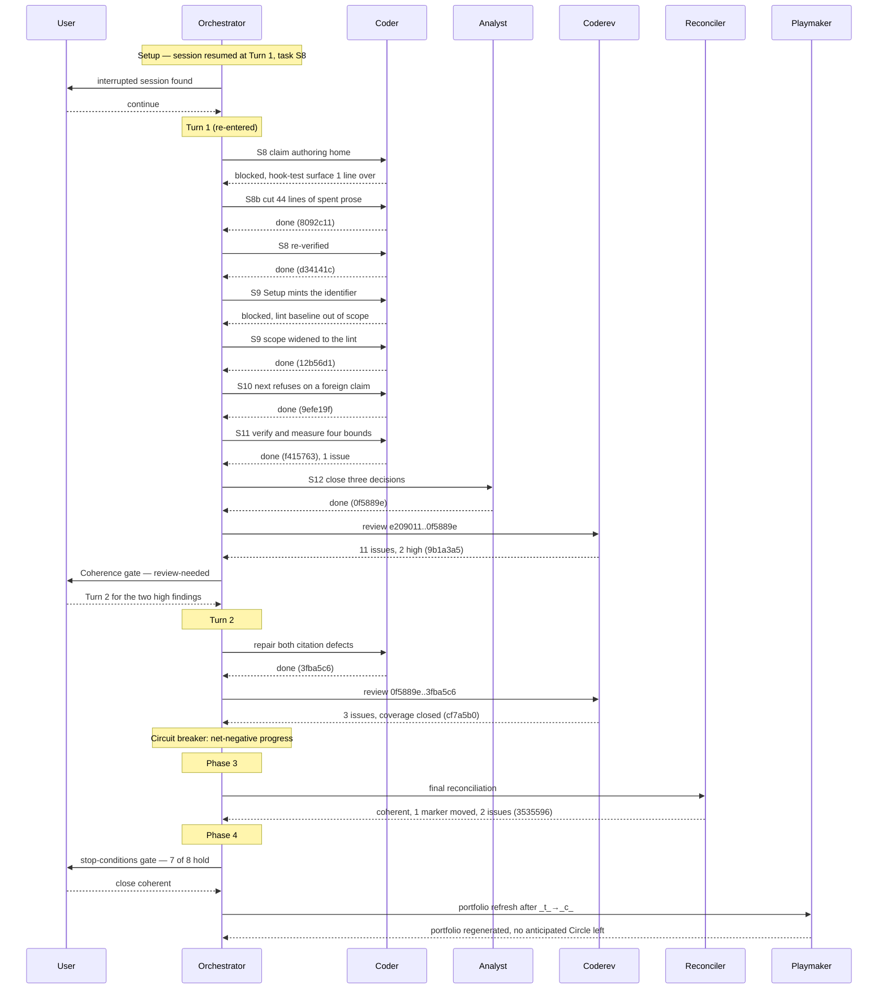

# Orchestrator Session — 260824-0539

**Directive:** Realise capability C3 of the multi-user specification: every record names the person who wrote it, and an active Circle names the checkout that holds it.
**Mode:** Circle (activated via /fusion:next)
**Status:** In progress

## Setup snapshot

- Workspace: /Users/k1/Projects/productive/fusion
- Plugin version: 10.6.0; source root is the work tree
- Turn budget: max_turns=12
- Git HEAD at start: e209011
- Active Circle: 260824-0530-record-attribution-and-circle-claim
- Detected workbench domain: **code** (code_files=103, data_files=10)
- Open defect records: 0 in the Circle store, 122 in shared/issues
- Open plans: 1 (the multi-user specification itself)
- Open decision records: 0 in the Circle store, 5 in shared/decisions, one of which this Circle answers
- Circle counts by marker: 1 active, 13 closed-coherent, 2 bounded, 1 superseded, 0 anticipated
- Interrupted session: none
- Legacy halt flag: absent
- Stylometric profiles: all four match the shipped copies
- **Step 0h ran for the first time in this repository**: `.gitattributes` created at the project root with the union merge rule for the event log. `git check-attr merge` now reports `union`. This is the mechanism C2 built, verified against the tree it ships from.
- Setup marker: unchanged, no diff produced. The conditional write from C2 works as designed.

## Coherence

<!-- RECONCILER-OWNED -->

**Verdict:** coherent

**Edges:**

- **Artifact↔Grounding:** 11 of 12 plan steps verified complete against the tree and step 12 half done by design; 7 of the 8 properties in `## Where this Circle stops` hold and 1 is false as written (`260824-1538_*_the-plans-stopping-clause-names-one-cut-and-two-landed.md`, where the clause contradicts the plan's own risk table and not the work); 14 open defect records in the Circle store, of which 12 are reviewer findings the user explicitly chose to leave open and 1 was filed by this pass. `npm test` green at `cf7a5b0` (42 files, 732 tests); `git diff e209011..HEAD` over both baseline files empty, so no growth baseline moved. `uncovered=1` at HEAD is the second review's own commit, which touches no shipped file, and does **not** flag this edge, per `260815-2109_*_may-a-circle-close-over-an-uncovered-review-range-and-who-decides.md` option 1, applied here for the fifth consecutive time.
- **Artifact↔Directive:** the 18 commits of `e209011..cf7a5b0` move **toward** the Directive and reach it in the artifact fusion ships. `3ba7a46` and `b7f8326` build and pin the one identity mechanism; `2b055a0`, `0a726b5` and `6d439ba` put the person into all three record templates from a single authoring home and make the citation form normative; `d34141c`, `12b56d1` and `9efe19f` make both activation routes write the claim and make `/fusion:next` refuse a Circle another checkout holds. Not one commit in the range is orthogonal to the Directive. **The capability is inert in this repository until the next release** — `[ -x "$FUSION_PLUGIN_ROOT/bin/fusion-identity" ]` is false, verified live, while `./bin/fusion-identity` in the work tree exits 0 and prints a person — so six records filed since `2b055a0`, including this pass's two, carry no person half. That is read as reaching the Directive rather than falling short of it: the Circle *predicted* this window and wrote the branch for it in `rules/fusion-workbench-conventions.md` `### Who filed it`, the residual is the deliberately-open part (c) of `260810-1544_*_should-prompt-called-bin-helpers-get-one-guarded-call-convention-and-does-the-work-tree-preference-extend-to-them.md`, and `fusion --update` is already the mandated step before rule work here. The contrary reading — that a Directive saying "every record names its author" is unmet while records in this tree name none — is stated so the user can overrule this one.
- **Grounding↔Directive:** 22 active decisions across `$SCAN_DECISIONS` (3 open and 19 answered in `shared/`, plus the Circle's one, which this pass moved to implemented). **0 conflict with the Directive.** Five are newly engaged by this Circle's work without moving, each annotated rather than renamed: `260815-2109_*` (coverage advisory, applied), `260810-1544_*_should-prompt-called-bin-helpers-get-one-guarded-call-convention-and-does-the-work-tree-preference-extend-to-them.md_*` (part (c), now load-bearing for a shipped capability for the first time), `260816-0119_*` (the rename-to-citation obligation, met by hand at `6d439ba` one commit ahead of the rename that would have staled it), and the two open budget decisions `260822-1154_*_does-the-hook-test-line-budget-cover-comment-prose.md` and `260822-1154_*_does-a-cut-only-circle-re-baseline-the-surfaces-it-cuts.md`, which are the unanswered subject of the second cut that falsifies stopping property 7.

**Rebalance recommendation:** none

**Residuals for the `## Closure note`.** Four, none of them a reason to hold the Circle open. One uncovered commit, `cf7a5b0`, touching no shipped file. Twelve reviewer findings left open by the user's decision, plus two filed by this pass. Stopping property 7 false as written, filed. The always-on rule budget at 431 bytes of head-room, which the second review names as this Circle's binding constraint and which three open records still want some of.

Full pass: `260824-1637-reconciliation.md`.

## Budget

| Metric | Count |
|--------|-------|
| Turns | 2 |
| Tasks resolved | 14 (12 plan steps, 1 unblocking cut, 1 two-defect repair) |
| Tasks skipped/deferred | 0 |
| Issues created | 18 |
| Issues resolved | 2 |
| Decisions answered (`_o_`→`_a_`) | 0 |
| Decisions implemented (`_a_`→`_i_`) | 4 |
| Commits | 20 |
| Agent errors | 0 |
| Human gates hit | 3 (interrupted-session choice, Coherence gate, stop-conditions gate) |

The four record counts are read off the stores rather than tallied, per
`agents/orchestrator.md` `## The record counts are computed, not tallied`. One
caveat belongs with them: the ordinary read through `bin/fusion-paths` returns
**4** filed issues rather than 18, because `.active-circle` was cleared at
Phase 4 step 4 and the Circle's own issue store left every scan set with it.
The figures above come from naming both stores explicitly. A session that
closes its Circle cannot measure its own records through the resolver
afterwards, which is the stranded-store condition the playmaker also reports.

## Per-Turn Log

### Turn 1
- Tasks attempted: S1 through S12, plus S8b
- Tasks completed: S1 through S12 (S12's Turn log half deferred to Phase 4 by design)
- Commits: `e4d53db`, `6d439ba`, `5b88eb9`, `3ba7a46`, `b7f8326`, `2b055a0`, `0a726b5`, `8092c11`, `d34141c`, `12b56d1`, `9efe19f`, `f415763`, `0f5889e`, `9b1a3a5`
- Review findings: 11 issues (2 high)
- Circuit breaker status: OK
- Coherence: review-needed

### Turn 2
- Tasks attempted: the two high-severity findings
- Tasks completed: both
- Commits: `3fba5c6`, `cf7a5b0`
- Review findings: 3 issues
- Circuit breaker status: **tripped** — net-negative progress, two consecutive Turns filing more defects than they closed (Turn 1: 13 created, 0 resolved; Turn 2: 3 created, 2 resolved)
- Coherence: not run per-Turn; the loop exited on the circuit breaker before Step 3c-bis. Phase 3 returned `coherent`.

The breaker is not a measurement artefact here. Each review pass found more
than the previous one repaired, and both passes plus the reconciliation name
one cause: no gate checks whether a citation's target carries what was cited.
The playmaker corrected that framing usefully — class (b) of the
reference-resolution lint does check that a cited heading *exists* by prefix
match; what nothing checks is whether the target's content supports the claim,
and the heading check additionally misses every `$VAR/`-rooted citation.

## Review coverage

**Range:** `e209011..46aa04c` — 20 commits
**Covered by:**
- `260824-1538-coderev-c3-attribution-and-claim-full-range.md` — `**Reviewed-range:** e209011..0f5889e`, covers 15, `**Not-opened:** none`
- `260824-1625-coderev-c3-two-fix-commits.md` — `**Reviewed-range:** 0f5889e..3fba5c6`, covers 2, `**Not-opened:** none`

**Not covered:**
- `cf7a5b0` docs(reviews): the second pass closes the Circle's coverage and finds the exit code the repaired rule forgot
- `3535596` docs(circles): the C3 reconciliation returns coherent, and finds a release precondition its own instrument can never satisfy
- `46aa04c` feat(circles): C3 closes coherent, and its closure note carries the two gaps rather than tidying them away

All three touch **zero** shipped files, measured: every path in all three is
under `fusion-workbench/`. Under
`260815-2109_*_may-a-circle-close-over-an-uncovered-review-range-and-who-decides.md`,
answered 2026-08-16, the uncovered set is filtered to commits touching shipped
files, so the filtered set is empty and coverage stays advisory with the gap
named in the closure note. Every commit carrying shipped text is reviewed.

The three are the structural residue the Circle filed against itself: a review's
own commit, the reconciliation that reads it, and the closure that records both
enter the range after the last review and no later review opens them.

**Carried out-of-scope files:** `none` — the last review declared `**Not-opened:** none`.

## Portfolio update

Regenerated by playmaker at `260824-1721-playmaker-orchestrator-phase4.md`.

**All seventeen Circle records now carry a terminal marker**: nothing active,
nothing anticipated. The next move is a filing act rather than an activation.
No dependency cycle, no `MULTIPLE-ACTIVE`, and no `## Parent grounding stale`
note owed: this Circle closed coherent, and the propagation scan needs a
non-terminal parent, of which there are none.

The portfolio's own recommendation is the backlog's rank 1,
`260814-1733_*_bounded-executor-dispatches.md`, whose analysis is
already on disk. The other candidate for regaining work is capability C4 of
`260822-1136_*_spec-fusion-becomes-a-multi-user-tool.md`, whose
sequencing behind C3 is now spent.

Two counts the playmaker flags: 94 open defects and 13 open decisions are now
stranded in terminal Circle stores, outside every agent's scan set while no
Circle is active, and `shared/issues/` stands at 126 open against 151 closed.

## Session Flow

