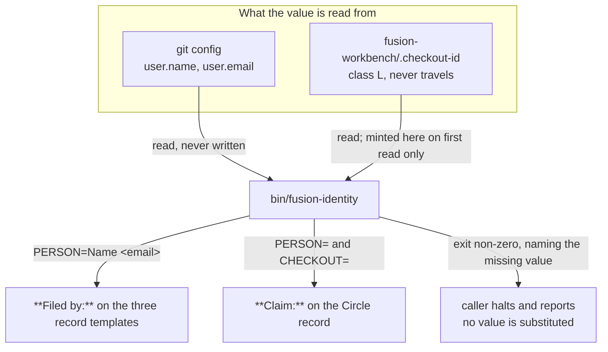
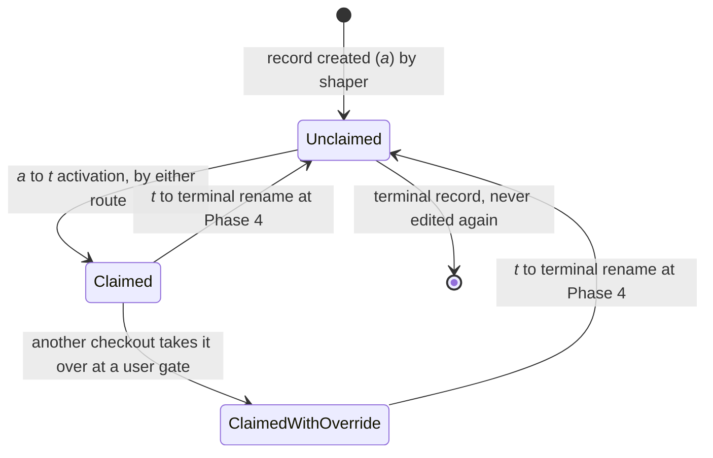
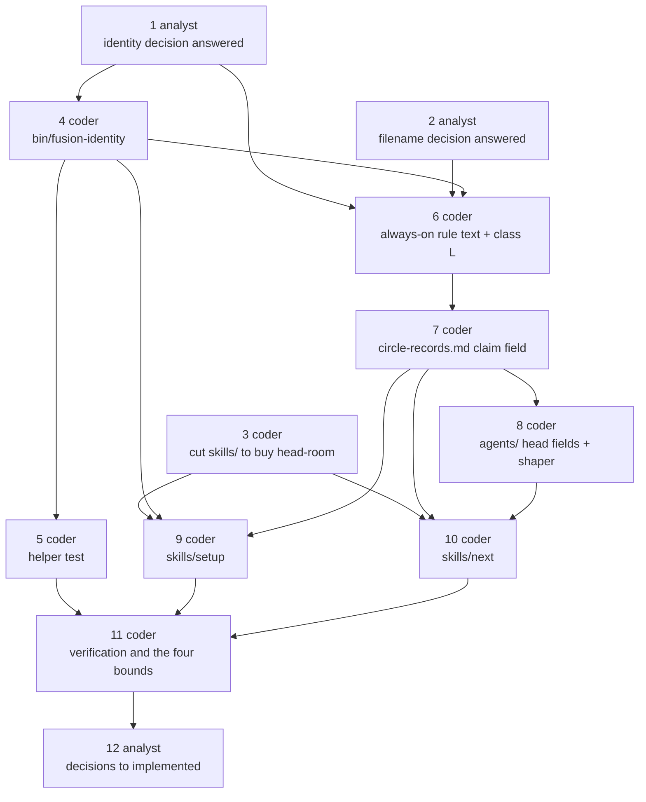

# Implementation Plan: every record names its author, and an active Circle names the checkout holding it

**Date:** 2026-08-24
**Status:** Ready for Review
**Spec:** `shared/planning/260822-1136_*_spec-fusion-becomes-a-multi-user-tool.md`, capability `### C3`, read under the binding correction in `circles/260824-0530-record-attribution-and-circle-claim/_t_circle.md` `## Grounding snapshot`
**Decidability:** The load-bearing question is whether a fusion run can name the person who wrote a record and the checkout that holds a Circle, from inputs the run can obtain where it stands. It splits in two, and the two halves have different answers. **The person is decidable**: `git config user.name` and `user.email` are readable in every tree that takes part in the git transport, and they are the same identity that transport already carries on every commit, so nothing is inferred. Where they are unset the question is not decidable from any input the run holds, and the mechanism does not approximate: it halts and says which value is missing. **The checkout is not decidable from any travelling input, and not reliably decidable from a derived one either.** Two checkouts of one person carry one git identity, which is the collision the field exists to prevent; and hostname plus workbench path, the obvious derivation, is not unique by construction, because two machines carrying a default hostname with the same clone path produce one value (`inference:`, not measured). So what changes is the mechanism rather than the precision of an estimate, which is what `rules/critical-stance.md` §4 asks for: the identifier is **minted locally once and stored where git never reaches**, and a created value is decidable by construction because nothing has to be read back out of ambiguous inputs. One residual case is genuinely open and is filed rather than assumed, namely a tree that is not a git work tree at all: `circles/260824-0530-record-attribution-and-circle-claim/decisions/260824-0613_*_does-a-filing-agent-halt-in-a-tree-that-is-not-a-git-work-tree-at-all.md`.

## Directive

Two questions that look like one get two mechanisms, because they are answered by different
evidence. **Attribution** asks who wrote a record, and the git identity answers it completely and
across machines, since it is one person at each of them. **The claim** asks which checkout holds a
Circle active, and the git identity cannot answer it, because one person's two checkouts carry the
same identity and would pass any check built on it. The claim therefore carries the git identity
plus a checkout identifier that never travels.

**The spec's third acceptance criterion is superseded, and a later reader should not read this plan
as a deviation.** That criterion reads: the value "is read from the environment the way
`/fusion:memo` reads it today, which is `$USER`. No second identity mechanism is introduced." The
user superseded it on 260824, on a measurement of his own working arrangement: `$USER` is not
unique across several instances on one machine, and an operating-system account name such as `k1`
or `ubuntu` is close to anonymous in a history read by somebody else. The Grounding snapshot in
`circles/260824-0530-record-attribution-and-circle-claim/_t_circle.md` carries the replacement and
is binding over the spec wherever the two disagree. `/fusion:memo`'s `$USER` filenames stay exactly
as they are, which the spec's condition 1 already required; the consequence the user accepted is
that fusion names a person two ways, by account name in the memo store and by git identity in the
records.

**A registry was proposed by the user and declined by him, and nothing here reintroduces one.**
`fusionusers.jsonl` with aliases would be a tracked file with many writers, which is the class the
Circle immediately before this one spent a full pass reducing to exactly one member. What the user
gives up is a stable alias surviving a changed git address, and he saw that before agreeing.

## Current State

Six measurements, all taken on 260824 against `HEAD` in this work tree. They are what the design
below is fitted to.

**fusion has no git-identity read anywhere.** `git config` appears in no file under `agents/`,
`skills/`, `rules/`, `bin/` or `hooks/`. Identity today is `$USER` and nothing else, read in three
skill bodies (`skills/memo/SKILL.md`, `skills/cadence/SKILL.md`, `skills/log-activity/SKILL.md`),
each of which uses it to name a file rather than to attribute a record.

**Almost nothing restates the `**Filed by:**` field, so the edit is concentrated in the rules.**
Exactly two shipped files instruct a write of it: `agents/shaper.md:93`, which fills a Circle
record's frontmatter in anticipated-circle mode, and `skills/memo/SKILL.md:117`, which fills a
backlog entry. Every other filing agent takes the field from the template it already loads. This is
the single most useful fact in the survey: putting the person into the templates *is* the
instruction to fifteen agents, and `agents/` is spared a fifteen-file edit.

**The defect record has no author field at all today.** `rules/fusion-workbench-conventions.md`
`## Issue and Decision Filing — MANDATORY` gives the issue file a three-part format with no head
block, and `### Issue files` under `## Inline State Tracking` defines only `Resolved:` and
`Revised by:`. The decision record and the Circle record both carry `**Filed by:**` already. So one
of the three record kinds gains a field that does not exist, and two gain a value inside a field
that does. The spec's second criterion places the defect format in `rules/circle-records.md`; that
is imprecise, and the defect format lives in the conventions file.

**The four growth bounds, measured file by file:**

| Surface | Baseline | Now | Head-room left |
|---|---|---|---|
| always-on rule core (5 files) | 86 573 bytes | 95 252 | **3 321 bytes** |
| `agents/*.md` | 399 843 bytes | 404 137 | 13 706 bytes |
| `skills/*/SKILL.md` | 220 439 bytes | 240 237 | **202 bytes** |
| hook tests and helpers | 17 875 lines | 20 187 | **188 lines** |

Two of the four are effectively spent. `skills/` has 202 bytes, and this capability has to write
into two skill bodies. The hook-test surface has 188 lines, and this capability wants one new test
file.

**The `skills/` overage is concentrated in one file, and it is the same file this work has to
write into.** Against the 2026-08-15 arming baseline, `skills/setup/SKILL.md` stands at +13 860
bytes, which is 70 per cent of the whole surface's head-room spent by one body. The next largest
are `help/SKILL.md` at +3 936 and `direct/SKILL.md` at +1 450; five bodies have shrunk. That
concentration is what makes the cut this plan requires a coherent act rather than an arbitrary tax:
the cut and the addition land in the same file.

**One shipped gate binds any new `bin/` helper.**
`hooks/lib/__tests__/derivable-enumerations-lint.test.ts` holds the `bin/` roster in set equality
with `CLAUDE.md`'s Layout table, so a helper without a Layout row turns `npm test` red. The
`.gitignore` carries the same obligation in prose: `bin/*` is excluded and every shipped helper
needs its own `!bin/<name>` exception or it is silently dropped from the distribution.

## Approach

One mechanism, one helper, two questions answered from its output.

`bin/fusion-identity` is the only place either value is obtained. It prints two `KEY=value` lines
in the shape `bin/fusion-paths` already established, so every consumer reads it the way it already
reads its path keys. It mints the checkout identifier on first read and never again, which gives
the Grounding's "generated once at Setup" property in the ordinary case, because `/fusion:setup`
calls it, while removing the failure mode a Setup-only minter would create: a checkout set up under
an older fusion would otherwise halt on every filing until Setup were re-run. One minter, one halt,
one message.

**Why the identifier is minted and not derived.** Deriving it from hostname and workbench path
needs no file, no layout entry, no class assignment and no Setup bytes, all of which matter against
a 202-byte budget, and it survives the loss of a class L file that a fresh clone loses anyway. It
was rejected on the one property the field exists for. A minted random value is unique by
construction; hostname plus path is unique only where hostnames are, and default hostnames repeat.
An identifier that can collide does not distinguish the two checkouts it was introduced to
distinguish. This is the Research Gate discharged rather than skipped, and the reuse candidate is
named so a later reader knows it was weighed.

**Why the claim does not inherit the activation-route divergence.**
`shared/issues/260822-2045_*_a-circles-head-fields-end-up-in-different-states-depending-on-which-of-the-two-activation-routes-ran.md`
records that the orchestrator and `/fusion:next` write `**Active spec/plan:**` differently. Its own
260823 correction narrowed it: both routes agree on both Circles measured, and the divergence now
stands with no measured instance. It is used here in that narrowed form. The claim rides the same
rename and still does not inherit the divergence, for a structural reason rather than a hopeful
one: the orchestrator's row carries a condition the skill cannot evaluate ("if one exists and the
record does not already cite it"), whereas the claim's value is one command's output that either
route can run. The plan therefore writes the claim as an unconditional row in the one authoring
home both routes already cite, and the defect stays open on its own subject.

**Why the filename convention does not change, and what does.** The plan is built on option 2 of
`shared/decisions/260822-1556_*_does-the-record-filename-convention-hold-when-several-checkouts-file-into-one-store.md`:
write the citation form down as normative and leave every filename alone. Option 3, a per-author
filename component, is foreclosed by the user's own condition. Option 1, change nothing, is what
the project does today and is defensible, but the failure it tolerates has already been observed
once under the easiest possible conditions, with one writer, in
`shared/issues/260819-1511_*_a-bare-stamp-citation-is-ambiguous-when-two-records-share-it-and-one-turn-log-resolves-to-the-wrong-record.md`,
and the corpus holds 84 stamps carried by two or more files. Several writers raise the rate of a
known failure, and the cheapest response to a higher rate is to make the mitigation normative
rather than habitual. **Approving this plan is the answer to that decision**, which is what the
spec and the record both mean by "C3's planning gate"; step 2 writes the answer into the record.
Taking option 2 also discharges the condition
`shared/decisions/260807-0158_*_how-is-a-unique-record-filename-obtained.md` set for itself in
2026-08-07 and has been waiting on since, so one paragraph of rule text closes two records.

### The identity mechanism



The two consumers draw different keys from one helper, which is the whole of the "two questions,
two identities" design. Attribution never reads `CHECKOUT`, so a record filed in a checkout whose
identifier was never minted is still attributable.

### The claim field's lifecycle



`Unclaimed` and `Claimed ` are literal openings of the field's value, so a reader classifies the
record by reading its first word, exactly as `(none yet)` and `Deliberately deleted ` already work
in `rules/circle-records.md`. The state a record written before this Circle sits in is `Unclaimed`
by rule rather than by content, because those records are not rewritten and carry no field at all.

### Step dependencies



## Implementation Steps

1. [DONE] **Record the identity answer, superseding the option set**
   - Executor: `analyst`
   - Files: `shared/decisions/260822-1136_*_which-identity-does-an-attributed-record-carry-when-the-transport-is-git.md`
   - Changes: add an `## Answer (user, 260824)` section stating that none of the three options is
     taken and why the question was cut wrong: attribution and claim are different questions and do
     not need the same identity. Attribution is the git identity alone. The claim is the git
     identity plus a locally minted checkout identifier. Record the registry proposal, that the user
     made it, that he declined it, and the cost he accepted, namely a stable alias surviving a
     changed git address. Fill the `Answered:` line with the Circle record's Grounding snapshot as
     the source, since the answer was given in chat. Rename `_o_` to `_a_`.
   - Dependencies: none
   - Acceptance: the record carries an `Answered:` line and the `_a_` marker; its body states that
     the answer supersedes the three options rather than selecting one; the registry is named as
     proposed-and-declined with its reason; no option is marked chosen.

2. [DONE] **Record the filename answer**
   - Executor: `analyst`
   - Files: `shared/decisions/260822-1556_*_does-the-record-filename-convention-hold-when-several-checkouts-file-into-one-store.md`
   - Changes: add an `## Answer (user, 260824)` section taking option 2, citing this plan as the
     gate at which it was taken. State that option 3 is foreclosed by the user's round-3 condition
     and was listed only to record that it was weighed, and that option 1 is what the project does
     today and is defensible on its own terms. Note that taking option 2 satisfies the condition
     `shared/decisions/260807-0158_*_how-is-a-unique-record-filename-obtained.md` set for itself,
     so that record moves at step 12. Rename `_o_` to `_a_`.
   - Dependencies: none
   - Acceptance: the record carries an `Answered:` line and the `_a_` marker; the answer names
     option 2, the rule text it implies and the file that text lands in; no filename pattern is
     changed anywhere in this step.

3. [DONE] **Cut `skills/` far enough to pay for steps 9 and 10**
   - Executor: `coder`
   - Files: `skills/setup/SKILL.md` primarily; any other `skills/*/SKILL.md` the measurement
     justifies
   - Changes: measure each skill body against `SKILL_BASELINE` in
     `hooks/lib/__tests__/surface-growth-bound.test.ts`, then cut **at least 2 000 bytes**, taken
     where the measurement says the growth is. `skills/setup/SKILL.md` stands at +13 860 bytes over
     its baseline and is the first place to look. Cut restatement rather than substance: several
     Setup steps restate reasoning that their own text says belongs elsewhere, Step 0h being the
     clearest case, since it cites `rules/workbench-tracking.md` as the authoring home and then
     paraphrases four of its outcomes underneath. **No baseline moves in this step or in any other
     step of this plan.** The commit message names the cut and the byte figure.
   - Dependencies: none
   - Acceptance: `skills/*/SKILL.md` measures at least 2 000 bytes below its 260824 figure of
     240 237; `npm test` is green; no Setup or `/fusion:next` behaviour is removed, only restated
     text; the commit message names the cut and the measured figure.

4. [DONE] **Add `bin/fusion-identity`, the one identity mechanism**
   - Executor: `coder`
   - Files: `bin/fusion-identity` (new), `.gitignore`, `CLAUDE.md`
   - Changes: a POSIX shell helper, no node half and no compiled half, following
     `bin/fusion-prose-metric` in shape. Its own header is the authoritative documentation, carrying
     the usage block and the exit-code table, and `CLAUDE.md`'s Layout row summarises rather than
     restates it. Behaviour: print `PERSON=<name> <<email>>` from `git config user.name` and
     `git config user.email`, and `CHECKOUT=<8 lowercase hex>` read from
     `fusion-workbench/.checkout-id`, minting that file from `/dev/urandom` when and only when it
     is absent, with an atomic create so two concurrent agents cannot mint two identifiers. Exit 0
     when both lines are printed. Exit 1 when the identity cannot be produced, printing which of
     name and email is missing and printing no `PERSON=` line; **substitute nothing.** Exit 2 on a
     usage error. Exit 3 when no workbench is found, so `CHECKOUT=` cannot be resolved; `PERSON=` is
     still printed in that case, because attribution does not depend on the workbench. Add
     `!bin/fusion-identity` to `.gitignore`'s helper exception list and a Layout row to `CLAUDE.md`,
     both in this commit, or `derivable-enumerations-lint` fails the suite.
   - Dependencies: step 1
   - Acceptance: `bin/fusion-identity` is executable and exits 0 in this repository, printing
     exactly two lines; a second run prints the same `CHECKOUT=` value; `git ls-files bin/` lists
     it; `npm test` is green, which is what proves the `CLAUDE.md` row landed; the header carries
     the usage block and the full exit-code table; the helper prints no value it did not read or
     mint.
   - **As built (260824), two departures from the step text above, both forced by the answer to the
     open decision, which the step text predates.** (a) **The exit table has six codes, not four.**
     The step folds "not a git work tree" into exit 1, and the decision's option 2 makes the two
     states opposite instructions to the caller, so they cannot share a code a prompt keys on.
     Exit 1 is now the only halting code; exit 4 is "no identity is owed", non-halting, person field
     absent rather than empty; 3 is the checkout half unresolved and 5 is both halves missing, so the
     2x2 of outcomes tiles. Reasoning in the helper's own header, `## Why 1 and 4 are different
     codes` and `## Why 3, 4 and 5 are three codes`. (b) **`.checkout-id`'s classification rode this
     commit, not step 6's.** `rules/workbench-tracking.md` binds a new root-anchored surface to a
     class "in the same commit that creates it", and `rules/fusion-workbench-conventions.md`
     `## fusion-workbench Layout` says the same of a `bin/` helper that adds one. This commit is the
     one that makes the surface exist, and an unclassified `.checkout-id` is a live defect rather
     than a documentation gap: untracked-but-not-ignored, it would travel between checkouts and
     hand two checkouts one identifier, which is the collision the field exists to prevent. Step 6
     therefore finds three of its bullets already done — the layout-tree line, the class L entry and
     the `.gitignore` class L line — and inherits a **spent 537 bytes** of its 2 400-byte always-on
     allowance (the five measured 95 252 before and 95 789 after; the step's 97 652 cap is
     unchanged, leaving 1 863 of the allowance).

5. **Test the helper, inside the hook-test line budget**
   - Executor: `coder`
   - Files: `hooks/lib/__tests__/fusion-identity.test.ts` (new)
   - Changes: cover the four exits and the mint-once property against temporary trees: both git
     values set; `user.email` unset; not a git work tree at all, whose expected behaviour is
     whatever step 6's rule text states after the open decision is answered; no workbench; and two
     successive calls returning one identifier. **The whole file is capped at 180 lines**, which is
     the surface's entire remaining head-room of 188. If the honest test exceeds that, the executor
     stops and reports rather than trimming coverage silently or moving a baseline, and the plan's
     risk table names what happens next.
   - Dependencies: step 4
   - Acceptance: the file is at most 180 lines; `npm test` is green; the hook-test surface measures
     at most 20 375 lines, which is its 260824 figure of 20 187 plus its remaining 188; no baseline
     in `surface-growth-bound.test.ts` has been edited.

6. **Put the person into the always-on rule text, and classify the new file, in one commit**
   - Executor: `coder`
   - Files: `rules/fusion-workbench-conventions.md`, `rules/decision-record-examples.md`,
     `rules/workbench-tracking.md`, `.gitignore`
   - Changes: five edits on the hard-bounded surface and two off it, and they share one budget, so
     one executor holds them all.
     - A short subsection under `## Issue and Decision Filing — MANDATORY` defining the person once:
       the value is `PERSON=` from `bin/fusion-identity`, written in git's own `Name <email>` form;
       every agent that files a record writes it; when the helper exits non-zero the agent **halts
       and reports the helper's reason and files nothing**, and substitutes no value. This one
       subsection is the instruction to all fifteen agents, because every agent loads this file.
     - `## Decision Record Template`: `**Filed by:** <agent name or "user">, <person>`.
     - The issue file format in the same section gains a `**Filed by:**` line in the same form. This
       is the field that does not exist today.
     - `## Filename Patterns` gains the citation rule option 2 requires: a record is cited by its
       full filename with the marker wildcarded, never by the bare stamp, because 84 stamps in this
       corpus are carried by more than one file. State that no filename pattern changes.
     - `## fusion-workbench Layout` gains `.checkout-id` in the tree beside `.active-circle` and
       `.fusion-setup`, with one sentence saying what it holds and that it never travels. It belongs
       above the root-anchored block, not inside it: no hook and no `bin/` consumer other than
       `fusion-identity` reads it.
     - `rules/workbench-tracking.md` class L gains `.checkout-id`, and this repository's
       `.gitignore` gains `fusion-workbench/.checkout-id` under its class L list. **Both land in
       this same commit as the layout-tree line**, which is what that rule requires of a new entry.
     - `rules/decision-record-examples.md`: the worked examples show the new `**Filed by:**` form,
       or the corpus's only worked example contradicts the template.
   - **Budget: the five always-on files may grow by at most 2 400 bytes in total**, leaving 921 of
     the 3 321 measured. `rules/workbench-tracking.md` and `.gitignore` are outside every bound.
   - Dependencies: steps 1, 2 and 4
   - Acceptance: the always-on five measure at most 97 652 bytes, which is 95 252 plus 2 400;
     `npm test` is green; the layout tree, the class L table and the `.gitignore` change are in one
     commit; the halt rule appears exactly once in the corpus; no agent prompt restates it; the
     citation rule is stated as normative rather than as practice.

7. **Give the Circle record its claim field**
   - Executor: `coder`
   - Files: `rules/circle-records.md`
   - Changes: add `**Claim:**` to `## Circle record template`, positioned directly after
     `**Filed by:**` so the two identity fields sit together and above the two path pointers. Define
     the value with two literal openings and nothing else:
     - `Unclaimed`, the value of an anticipated Circle and of a Circle that has reached a terminal
       marker.
     - `Claimed YYMMDD-HHMM: <person>, checkout <id>.`, written at the `_a_` to `_t_` rename.
     - An override appends a second sentence with its own literal opening,
       `Overridden YYMMDD-HHMM by <person>, checkout <id>.`, so both people stand in the field and
       the override is visible in the record, which is what the spec's fifth criterion requires.
     State the reader test explicitly: a reader tells a claimed Circle from an unclaimed one by the
     literal opening, the same shape of test `(none yet)` and `Deliberately deleted ` already carry
     in this file. State that a record written before this Circle carries no field at all and is
     read as `Unclaimed`, since records are not rewritten. Add the honest limit as its own
     paragraph, in the plain form the user required: two people who both pull, both see an empty
     claim and both activate will both write the field, and git will refuse the second push. **The
     collision is detected, not prevented.** A person who loses that race pulls, sees the claim, and
     picks another Circle. That is what answer 1 of the spec forecloses by choosing git as the
     transport, and it is stated as a property rather than softened.
   - Dependencies: step 6
   - Acceptance: `rules/circle-records.md` defines `**Claim:**` with exactly the two literal
     openings and the one override literal; the honest limit appears in that file and says
     "detected" and "not prevented" in a sentence a reader cannot mistake for a promise; the reader
     test is stated; the pre-Circle absence rule is stated; `npm test` is green.

8. **Make both activation routes write the claim from one authoring home**
   - Executor: `coder`
   - Files: `agents/orchestrator.md`, `agents/shaper.md`
   - Changes: `## Circle head fields` gains two rows and one paragraph. The rows: `_a_` to `_t_`
     activation, with the record rename, writes `**Claim:**` to the `Claimed ` form from
     `bin/fusion-identity`; the `_t_` to terminal rename at Phase 4 writes it back to `Unclaimed`,
     in the same command that deletes `.active-circle`. The paragraph states why this row carries no
     condition and the neighbouring `**Active spec/plan:**` row does: the claim's value is one
     command's output that either performer can run, so the route-dependence recorded in
     `shared/issues/260822-2045_*_a-circles-head-fields-end-up-in-different-states-depending-on-which-of-the-two-activation-routes-ran.md`
     cannot reach it. Cite that defect in its **narrowed** 260823 form, in which both routes agree
     on both Circles measured and the divergence stands with no measured instance, and do not
     restate the filed wording. `agents/shaper.md:93`'s frontmatter fill gains the person in
     `**Filed by:**` and `**Claim:** Unclaimed`, which is correct for a record created at `_a_`.
   - **Budget: `agents/` may grow by at most 3 000 bytes**, against 13 706 measured.
   - Dependencies: step 7
   - Acceptance: `## Circle head fields` carries both rows and states the no-condition reason;
     `agents/shaper.md` writes both fields at creation; the defect is cited in its narrowed form and
     is not closed by this step, because its subject is a different field; `agents/*.md` measures at
     most 407 137 bytes; `npm test` is green.

9. **`/fusion:setup` mints the identifier and reports a claim it does not hold**
   - Executor: `coder`
   - Files: `skills/setup/SKILL.md`
   - Changes: two small edits, both bounded by the head-room step 3 bought.
     - Call `bin/fusion-identity` once, guarded with `[ -x ]` the way every other helper call site is
       guarded, so an install copy predating this release does not exit 127 at a skill's first step.
       The call is what mints `.checkout-id` on a fresh checkout, which gives the Grounding's
       "generated once at Setup" property. Report the person and the identifier in the Done report,
       and report the helper's reason unchanged when it exits non-zero.
     - Step 0i already reports a `_t_` record this checkout never activated. It now reads that
       record's `**Claim:**` first. Where the field opens with `Claimed ` and names another
       identity, the report names the holder and the time **before** offering to activate here, and
       the offer becomes an override that writes the `Overridden ` sentence. Where the field opens
       with `Unclaimed` or is absent, the step behaves exactly as it does today.
   - **Budget: the two edits together add at most 900 bytes** to this file, inside what step 3 freed.
   - Dependencies: steps 3, 4 and 7
   - Acceptance: Setup mints `.checkout-id` on a checkout that has none and reports it; a second run
     reports the same value and writes nothing; Step 0i names the holder and the time when the claim
     names another identity, and is unchanged otherwise; the helper call is `[ -x ]`-guarded; the
     `skills/` surface is at or below 240 237 bytes; `npm test` is green.

10. **`/fusion:next` refuses, names the holder, and writes the claim on activation**
    - Executor: `coder`
    - Files: `skills/next/SKILL.md`
    - Changes: three edits.
      - Step 6.1's mismatch branch currently halts on a marker that is not `_a_` and says only that
        the marker is wrong. It now reads the record's `**Claim:**` and, where the value opens with
        `Claimed ` and names an identity other than this checkout's, refuses in those terms: it says
        **who** holds the Circle and **when** the claim was written, which is the spec's fifth
        criterion. The refusal offers an override at a user gate; taking it writes the `Overridden `
        sentence into the field, sets `.active-circle`, and leaves both identities standing in the
        record.
      - Step 6.2 currently states that the activation rename moves neither head field. It now names
        the one head field this act does move, `**Claim:**`, and delegates the value to
        `agents/orchestrator.md` `## Circle head fields` exactly as it already delegates the other
        two. Nothing about `**Active spec/plan:**` or `**Active session history:**` changes.
      - `## Boundaries` gains the claim write to its enumerated write set, since that section
        enumerates every write this skill performs.
    - **Budget: at most 1 100 bytes** added to this file, inside what step 3 freed.
    - Dependencies: steps 3, 7 and 8
    - Acceptance: an activation of an `_a_` Circle writes a `Claimed ` value naming this checkout; a
      `/fusion:next <dir>` against a `_t_` Circle claimed elsewhere refuses, naming the holder and
      the claim time, and offers exactly one override; the override writes the `Overridden `
      sentence and both identities remain readable; `## Boundaries` lists the new write; the
      `skills/` surface is at or below 240 237 bytes; `npm test` is green.

11. **Verify, and measure all four bounds**
    - Executor: `coder`
    - Files: none changed except `hooks/lib/__tests__/fixtures/surface-growth.golden`, regenerated
    - Changes: run `npm test` and `claude plugin validate .`. Regenerate the surface golden with
      `UPDATE_SURFACE_GOLDEN=1` and review the diff, which is the whole obligation that flag
      carries; regenerating moves no baseline. Run `bin/fusion-prose-metric` over every rule file
      this Circle changed and report the em-dash rate against the ceiling of one per 1 000 prose
      words. Report the four surface measurements as a table against the 260824 figures in this
      plan's `## Current State`, so the Circle's own consumption of each budget is on the record.
    - Dependencies: steps 5, 9 and 10
    - Acceptance: `npm test` green; `claude plugin validate .` reports passed; the four measured
      figures are reported and each is inside its budget; no baseline map differs from `HEAD` before
      this Circle; the prose metric is reported per changed rule file.

12. **Close the three decisions and write the Turn log**
    - Executor: `analyst`
    - Files: `shared/decisions/260822-1136_*_which-identity-does-an-attributed-record-carry-when-the-transport-is-git.md`,
      `shared/decisions/260822-1556_*_does-the-record-filename-convention-hold-when-several-checkouts-file-into-one-store.md`,
      `shared/decisions/260807-0158_*_how-is-a-unique-record-filename-obtained.md`,
      `circles/260824-0530-record-attribution-and-circle-claim/_t_circle.md`
    - Changes: fill each record's `Implemented:` line with the commits that realised it and rename
      `_a_` to `_i_`. The third is the record that has been waiting since 2026-08-07 for the
      citation rule to land in `## Filename Patterns`; its own reconciliation notes state that
      condition three times, and step 6 meets it. Append the Turn log entry to the Circle record in
      the format `rules/circle-records.md` prescribes.
    - Dependencies: step 11
    - Acceptance: all three records carry `_i_` and an `Implemented:` line naming a commit that
      exists; the Circle record's `## Turn log` carries one entry with the commit range and the
      Coherence verdict; no record written before this Circle has been rewritten for any other
      reason.

**No step routes to `ontocoder`, and that is a finding rather than an oversight.** This capability
changes normative rule text, two agent prompts, two skill bodies, one shell helper, one test and two
repository configuration files. Nothing here is ontology, manifest, schema or fixture data. The two
non-`.md` files touched, `.gitignore` and `CLAUDE.md`, are build and project configuration, which
`agents/orchestrator.md` `## Agent Routing Table` places with `coder`; the file's role decides, not
its extension.

## Where this Circle stops

- Every one of the three record templates names the person who wrote the record, and the form is
  defined in exactly one place.
- A Circle record carries a claim field whose value a reader classifies by its literal opening, and
  both activation routes write it from one authoring home.
- `/fusion:next` refuses to activate a Circle claimed by another identity, names the holder and the
  claim time, and offers an override that leaves both identities in the record.
- `rules/circle-records.md` states that the collision is detected and not prevented, in a sentence
  no reader can mistake for a promise.
- A run with no git identity halts and reports which value is missing, and no run anywhere
  substitutes one.
- The two decisions the Grounding named as this Circle's work carry an answer on disk, and the
  third, `shared/decisions/260807-0158_*_how-is-a-unique-record-filename-obtained.md`, has the
  condition it set for itself met.
- All four growth bounds pass with no baseline having moved, and the only cut made is the one step 3
  names in its own commit message.
- No record written before this Circle has been rewritten, and no filename pattern anywhere has
  changed.

**A precondition on any release or tag that carries this work.** The Circle's review must have run
over the full commit range before a tag is pushed, and `bin/fusion-review-coverage` must name no
uncovered commit in that range. This clause exists because a Circle whose review was made a
precondition of its tag was tagged and pushed without the pass, and only a post-release
reconciliation noticed. Binding decision:
`shared/decisions/260817-1613_*_does-a-plan-stated-precondition-get-any-mechanism-or-is-it-read-by-a-human-or-not-at-all.md`.

**One condition this Circle does not close.** The open decision this plan filed,
`circles/260824-0530-record-attribution-and-circle-claim/decisions/260824-0613_*_does-a-filing-agent-halt-in-a-tree-that-is-not-a-git-work-tree-at-all.md`,
must be answered before step 6 writes the halt rule, because that rule is the answer written down.
It is answerable at this plan's gate.

## Data Structures

Two new values and one new file. Nothing else in the workbench changes shape.

| Name | Where | Form | Class |
|---|---|---|---|
| `PERSON` | printed by `bin/fusion-identity` | `Name <email>`, git's own form | not stored |
| `CHECKOUT` | printed by `bin/fusion-identity` | 8 lowercase hex characters | stored, class L |
| `.checkout-id` | `fusion-workbench/.checkout-id` | one line, the identifier, newline-terminated | **L**, never travels |

Three record fields change or appear:

| Record kind | Field | Before | After |
|---|---|---|---|
| decision | `**Filed by:**` | `<agent name or "user">` | `<agent name or "user">, <person>` |
| defect | `**Filed by:**` | absent | `<agent name or "user">, <person>` |
| Circle | `**Filed by:**` | `<agent name or "user">` | `<agent name or "user">, <person>` |
| Circle | `**Claim:**` | absent | `Unclaimed` or `Claimed YYMMDD-HHMM: <person>, checkout <id>.` |

## API Changes

One new shell interface, in the `KEY=value` shape `bin/fusion-paths` established.

```
bin/fusion-identity
  stdout   PERSON=Kai Stalmann <kai@qantr.com>
           CHECKOUT=3f9a2c14
  exit 0   both values produced
  exit 1   no git identity; names which of name and email is missing; prints no PERSON line
  exit 2   usage error
  exit 3   no workbench found, so CHECKOUT cannot be resolved; PERSON is still printed
```

No existing helper's signature changes. `bin/fusion-paths` gains no key, deliberately: it resolves
paths, and an identity is not a path.

## Testing Strategy

`hooks/lib/__tests__/fusion-identity.test.ts` covers the helper's four exits and its mint-once
property against temporary trees, capped at 180 lines by the surface budget. Everything else this
Circle changes is text, and it is checked by the gates the repository already runs on every
`npm test`: `derivable-enumerations-lint` proves the `CLAUDE.md` Layout row landed,
`reference-resolution-lint` and `workbench-citation-lint` prove every citation added here resolves,
`marker-format-lint` proves no bracket marker crept into a prompt, `path-literal-lint` proves no
store literal was written into a prompt, and the two growth-bound tests prove each surface stayed
inside its budget. Step 11 runs `claude plugin validate .` because two agent prompts change, and
that is what catches frontmatter breakage before it ships.

What is deliberately not tested by a machine: the claim's two literal openings. A lint over them
would be a fourth citation-shaped gate on a two-word prefix, and the surface it would live on has
188 lines left. The reader test is stated in `rules/circle-records.md` instead, and the human at the
plan gate is the enforcement, which `rules/critical-stance.md` already names as the honest position
for a rule that lives in prose.

## Risks & Mitigations

| Risk | Mitigation |
|---|---|
| **A step trips a growth bound.** The three most likely are step 5 against 188 hook-test lines, step 6 against 3 321 always-on bytes, and steps 9 and 10 against whatever step 3 freed. | The executor **stops and reports**; it does not edit a baseline. The way out is a cut, in a commit that names it, exactly as step 3 does. Each step above carries its own byte or line cap so the overage is caught by the executor's own measurement rather than by a red suite at step 11. |
| **Step 3 cuts substance rather than restatement**, and a Setup behaviour is quietly lost. | The step's acceptance criterion names the property: no behaviour removed, only restated text, and `npm test` green. `skills/setup/SKILL.md` stands at +13 860 bytes over baseline, so restatement is available in quantity and substance need not be touched. |
| **The halt withdraws a supported case.** A single user in a directory that was never a git repository can no longer file a defect. | Filed as a decision, not assumed: `circles/260824-0530-record-attribution-and-circle-claim/decisions/260824-0613_*_does-a-filing-agent-halt-in-a-tree-that-is-not-a-git-work-tree-at-all.md`. Step 6 writes whichever rule the user's answer gives, and step 5 tests that branch. The plan does not proceed past step 6 with the question open. |
| **A checkout that loses `.checkout-id` no longer recognises its own claim** and is refused by `/fusion:next` against a Circle it holds. | The override path is the recovery, and it is a user gate rather than a failure. The claim then records both identities, which is the correct history: the checkout genuinely is not the one that wrote the claim. The `.active-circle` pointer already covers the ordinary case, since `/fusion:next` short-circuits when a Circle is active in this checkout. |
| **Two agents mint two identifiers concurrently.** | The mint is an atomic create in step 4, so the second writer loses and reads the first value. `bin/fusion-commit-lock` is the precedent in this repository for exactly that idiom. |
| **The claim silently diverges between the two activation routes**, which is the shape of the defect this Circle inherits. | Step 8 puts the claim's row in the one authoring home both routes already cite, and writes down why this row carries no condition where the neighbouring one does. The divergence is structural in the other field and structurally absent in this one. |
| **The person field spreads to a fourth record kind by accident.** The backlog entry already carries `**Filed by:** <username>` from `$USER` (`skills/memo/SKILL.md:117`). | Out of scope and left alone. The spec names three record kinds, and the memo store keeps `$USER` by the user's own condition. Step 6 changes no backlog text. |
| **A citation added by this Circle dangles** and reddens `npm test` for somebody who touched nothing. | That gate recomputes its corpus on every run and has no approvable baseline by design. Every path this plan cites was resolved against the tree on 260824 before the plan was written, and step 11's `npm test` is the check for everything the executors add. |

## Open Questions

- [ ] **Does a filing agent halt in a tree that is not a git work tree at all, or only in a git tree
      whose identity is unset?** Filed as
      `circles/260824-0530-record-attribution-and-circle-claim/decisions/260824-0613_*_does-a-filing-agent-halt-in-a-tree-that-is-not-a-git-work-tree-at-all.md`.
      It blocks step 6, whose rule text is the answer written down, and step 5, which tests that
      branch. The recommendation there is to halt only inside a git work tree, so that the
      obligation and the transport share one boundary; the user's call, because what is at stake is
      which users fusion serves.
- [ ] **Approving this plan answers
      `shared/decisions/260822-1556_*_does-the-record-filename-convention-hold-when-several-checkouts-file-into-one-store.md`
      as option 2.** If the user prefers option 1, change nothing, then step 2 records that instead,
      step 6 drops its `## Filename Patterns` edit and gains roughly 450 bytes of head-room, and
      `shared/decisions/260807-0158_*_how-is-a-unique-record-filename-obtained.md` stays `_a_`
      rather than moving at step 12. Nothing else in this plan changes.
