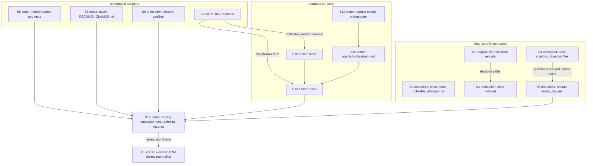

# Implementation Plan: close every open defect in the workbench

**Date:** 2026-08-24
**Status:** In Progress
**Spec:** none — planned from the Circle record `circles/260824-1853-close-every-open-defect/_*_circle.md` (anticipated-circle mode wrote no spec)
**Decidability:** The load-bearing question is "which of the three endings does this record get, judged from the tree at HEAD `2cdd372`?" It is decidable from the inputs the executor has for 214 of the 220 records: the record's own text against the file it names, and `git log` for whether the subject still exists. For six records (48, 145, 163, and the measurement halves of 36, 90, 129) the condition lives on a host or an interactive session this tree cannot reach, so the question "does it still hold?" is undecidable from here. The mechanism changes for those six: they close as unfixable from this repository, with the measurement command stated in the note, and never as fixed. No record's ending is left to the executor's guess; every one is assigned below.

## Directive

Every defect record carrying `_o_` or `_p_` anywhere in the workbench (126 in `shared/issues/`, 94 in the sixteen terminal Circles' `issues/` stores, plus what this Circle files) ends at `_c_` with a `Resolved:` note naming one of three endings: **fixed**, **moot or unfixable** with the reason, or **referred** to a decision record, a backlog idea the user files, or capability C4 of `shared/planning/260822-1136_*_spec-fusion-becomes-a-multi-user-tool.md`. `cd hooks && npm test` is green at the end. The four growth bounds stay green, and a fix that needs bytes on a bounded surface pays with a cut on the same surface in the same step. Nothing of C1 to C3 is reversed. One closing review round, then one Turn that closes what it filed. The full text is the Circle record's `## Directive`.

## Current State

Measured at HEAD `2cdd372` on 260824, from the tree rather than from the records.

- **Suite:** `cd hooks && npm test` exits 0: 42 files, 732 tests. The role rule-text report prints on stderr for `playmaker` and `shaper` without failing (record 210).
- **Head-room on the four bounded surfaces**, computed as each bound's own `budget − total` from its baseline map: `agents/*.md` **10 745 bytes**; `skills/*/SKILL.md` **3 220 bytes**; hook tests (`hooks/lib/__tests__/**.ts`) **40 lines**; the always-on rule core (the five unindented `emit_if_exists` files in `bin/fusion-rules`) **431 bytes**. The hook-test surface is the tightest in practice: it counts every `.ts` under `__tests__/`, helpers included, so a test case added anywhere needs a comment-prose cut of at least the same line count in the same commit. `bin/`, `docs/`, `README*`, `CLAUDE.md`, `stilwerk/` and workbench records are on no bound.
- **Prose metric:** the five always-on rule files each read `ok` under `bin/fusion-prose-metric`; `CLAUDE.md` reads 126 em-dashes at 13.7 per 1000, which decision `circles/260820-2051-style-rules-arrive-and-get-measured/decisions/260820-2314_*_is-claude-md-inside-the-corpus-this-circle-repairs.md` (open) keeps out of scope.
- **Open decisions:** three `_o_` in `shared/decisions/`, thirteen `_o_` in three terminal Circles' decision stores. None blocks a fix below; where a record's fix *is* a decision, the record is referred. Answered (`_a_`) decisions this plan realises or cites: `shared/decisions/260810-2145_*_should-a-repeated-skill-body-snippet-become-a-bin-helper-now-that-one-fact-lives-in-four-executable-copies.md` (step 7), `shared/decisions/260815-2109_*_may-a-circle-close-over-an-uncovered-review-range-and-who-decides.md` (steps 8, 12), `shared/decisions/260816-0119_*_can-anything-carry-the-rename-to-citation-obligation-when-a-record-marker-moves.md` (step 3).
- **Backlog store:** two live entries the user already filed, `shared/backlog/260814-1733_*_attach-the-rule-to-the-act.md` and `shared/backlog/260814-1733_*_bounded-executor-dispatches.md`; four referred records point at them. Six further ideas are collected for the user under `## Open Questions`.
- **Already true at HEAD:** thirteen records describe a state a later commit has since repaired (43, 66, 77, 84, 86, 96, 102, 107, 137, 191, and the instances of 93, 119, 201). They close as fixed with the verifying command in the note; nothing is edited for them.
- **Three phantom files** carry a literal `*` in their name under two terminal Circles' `decisions/` stores (record 92). They are the one Grounding change this plan makes, and it is a repair of a filing accident, not an answer to a question.

**Three readings this plan works under, stated once.** (1) A defect record in a terminal Circle's `issues/` store is a store entry with its own marker vocabulary; renaming it edits nothing in `_c_circle.md`, so `rules/circle-records.md`'s "a terminal record is never edited" is not touched by any closure here. Where a record's *only* fix would be an edit to a terminal Circle record itself (127, 128, 153, 171), it closes as moot: the record stands as the correction beside it. (2) `CLAUDE.md` edits in step 8 go through `coder` under this plan's approval gate: the curator's user gate is the reconciliation path, and this plan's approval is the user gate for the eight named sentences. (3) A record whose body says "this is a decision" closes as referred, never as fixed by an executor's silent choice; a record that offers options with a stated recommendation is fixed with that option and the `Resolved:` note names it.

## Approach

**One integral mechanism: the record's `Resolved:` note is the whole justification, and the plan assigns every record its ending before any executor runs.** The `## Triage` table at the end of this document is the substance of the plan; the fifteen steps are the table grouped by surface and ending, in the order the user set: record-only closures first (cheap, no bound), then the surfaces from least bounded (`hooks/`, `bin/`, `docs/`) to most bounded (`rules/`, 431 bytes).

Each executor closes the records its step names, in the same commit as the fix, with a `Resolved:` note of the shape `Resolved: <fixed | moot | unfixable | referred (decision | backlog | C4)> — <one clause>; <path or command that verifies it>`. The rename is `mv`, never a glob, and the executor names both halves of every rename in its report so the orchestrator's staging list carries them (record 47's fix lands in step 12, so until then the orchestrator checks `git diff --cached --name-only` by hand).

**Budget rule, applied per step.** Before a bounded step starts and after it ends, the executor computes that surface's head-room from its own baseline map and states both figures in its report. A step that would end over budget cuts on the same surface in the same commit, and names the cut in the commit message. No baseline map moves. The hook-test surface has 40 lines; step 6 is the only step that adds test lines and is told what to cut.

The graph has one intentional fan-in at S14 (every surface batch precedes the measurement) and no cycles. Steps with no edge between them run in parallel: S1 with S2, S4 and S6; S3 with S5, S7, S8, S9; S10 and S11 together.

## Implementation Steps

Every step: **Closes** names the rows of `## Triage` it closes, and the table names the record paths. An executor reads every record it closes in full before touching anything; the table's note is the ending, not the evidence.

1. **File the eight decision records this Circle refers to**
   - Executor: `analyst`
   - Files: `$OUT_DECISION/YYMMDD-HHMM_o_<topic>.md`, eight records, per the decision-record template
   - Changes: one record each, options and constraints from the referring defect records, no recommendation where the referring record gave none. The eight, with the short names the table uses: **D-license** (does fusion ship a `LICENSE`, given `plugin.json` says MIT, or does the installer's copy list drop the entry; from 144, 166); **D-origin** (does the dispatch prompt carry the task's origin, and does a sub-agent's history follow it or the pointer; from 6, 121); **D-record-writers** (who writes the reverse `## Dependencies` citation on an earlier anticipated Circle, whether `/fusion:next` fills `**Active spec/plan:**`, and whether shaper mode 3 gets a Grounding-only scope; from 41, 116, 206); **D-rename-staging** (is a marker rename `git mv` or `mv`, may a sub-agent leave the index dirty, and is append-and-rename one act; from 12, 16, and the class of 47, 177); **D-dialog-allowlist** (does the orchestrator's `tools:` grant of `AskUserQuestion` go; from 125); **D-dialog-skills** (do the nine skill bodies that present dialogs follow the ban, and what the interactive-parent measurement would settle; from 125, 90); **D-report-baseline** (does the executor report contract get a form for a named pre-existing failure, or a per-change test selection; from 11); **D-scan-scope** (do `archive/` and terminal Circles' stores enter any `SCAN_*` set, or is the exclusion written down; from 2, 204).
   - Dependencies: none
   - Acceptance: eight `_o_` files in `$OUT_DECISION`, each with `**Cross-references:**` naming its referring defect records in wildcard form; `npx vitest run lib/__tests__/workbench-citation-lint.test.ts` green.

2. **Close the records that are moot, unfixable from here, or already true at HEAD**
   - Executor: `ontocoder`
   - Files: the 33 records the table marks S2; nothing else
   - Changes: append `Resolved:` with the reason and, for "already true", the verifying command and its output at HEAD; rename to `_c_`.
   - Dependencies: none
   - Closes: 9, 39, 43, 45, 48, 66, 76, 77, 84, 86, 96, 102, 106, 107, 111, 127, 128, 136, 137, 145, 151, 153, 156, 158, 163, 171, 176, 181, 182, 183, 191, 192, 208
   - Acceptance: none of the 33 carries `_o_`; every note names one of the three endings; the citation lint is green.

3. **Close the records that are referred**
   - Executor: `ontocoder`
   - Files: the 32 records the table marks S3; `shared/decisions/260822-1154_*_does-a-cut-only-circle-re-baseline-the-surfaces-it-cuts.md` (one `Also seen:` line for 173)
   - Changes: `Resolved: referred …` naming the decision record's path (from step 1 or an existing one), the backlog entry's path, or `### C4` of the spec; for backlog referrals with no entry yet, the note says "backlog entry to be filed by the user" and names the idea in one clause.
   - Dependencies: step 1
   - Closes: 1, 2, 3, 4, 6, 7, 11, 12, 16, 32, 33, 34, 36, 41, 44, 103, 116, 118, 121, 125, 143, 144, 157, 166, 169, 170, 173, 193, 202, 203, 204, 206
   - Acceptance: every note's target path resolves; the six backlog ideas appear verbatim in the executor's report for the closure note.

4. **Repair stale citations in decision records and the three phantom files**
   - Executor: `ontocoder`
   - Files: the nine `shared/decisions/` records 131 enumerates; `shared/decisions/260811-2009_*_is-the-hooks-suite-meant-to-be-run-concurrently-with-itself-and-if-not-who-serialises-it.md`; `circles/260815-0007-remove-eight-mechanisms-and-cap-growth/decisions/260815-0007_*_does-fusion-cleanup-block-at-the-claude-md-gate-or-leave-the-ledger.md`; the three `_a_` records and three `_i_*.md` phantoms under `circles/260801-1244-curator/decisions/` and `circles/260815-0007-remove-eight-mechanisms-and-cap-growth/decisions/`
   - Changes: marker positions to `_*_` where the record is a pointer (131, 152, 155); for 92 append each phantom's text to its record under a `---` separator, add the `Implemented:` line, `mv` the record `_a_` to `_i_`, delete the phantom; 139's footer block lands in the same edit.
   - Dependencies: none
   - Closes: 92, 131, 139, 152, 155
   - Acceptance: `find fusion-workbench -name '*\**'` returns nothing; every citation of the three records still resolves; the citation lint is green.

5. **Correct counts, notes and clauses inside workbench records**
   - Executor: `ontocoder`
   - Files: the 28 records the table marks S5 and the files each row names (histories, reviews, analyses, plans, the spec, two open decision records)
   - Changes: appended corrections, never rewrites of what a run recorded (`Revised by:` on a closed record, a dated note on a history or review, an amended clause on a plan); the spec gains one sentence (115); 63 and 67 close on the corrected progress note.
   - Dependencies: step 4 (92's merged records are read, not rewritten, here)
   - Closes: 13, 24, 38, 63, 64, 65, 67, 79, 83, 87, 104, 112, 113, 114, 115, 132, 133, 134, 135, 172, 190, 194, 195, 199, 200, 207, 216, 220
   - Acceptance: each named file carries the appended text; the citation lint is green; no file outside `fusion-workbench/` changes.

6. **`hooks/`: source, tests and their comments**
   - Executor: `coder`
   - Files: `hooks/lib/config.ts`, `hooks/lib/domain-cascade.ts`, `hooks/lib/events.ts`, `hooks/lib/__tests__/helpers/citation-scan.ts`, and the test files rows 10, 18, 27, 28, 42, 49, 50, 62, 109, 123, 124, 142, 162, 167, 168, 175, 209, 212 name; `README-hooks.md` where `describeReach()` renders into it; `hooks/dist/` via `npm run build`
   - Changes: per row. Line budget: 40 lines of head-room; the additions (18, 27, 28, 50, 109, 142, 212, 209) cost about 70 lines, so the step cuts at least the difference from comment prose in the same files it touches, the way `8092c11` did, and names each cut in the commit message. `BASELINE` in the reference lint moves with a re-approval comment (123, 209) and by no more than the four anchors 123 measured. 42 is net negative; 62 removes an exact pin.
   - Dependencies: none
   - Closes: 10, 18, 27, 28, 40, 42, 49, 50, 62, 109, 123, 124, 142, 154, 162, 167, 168, 175, 209, 212
   - Acceptance: `npm test` green; `surface-growth-bound.test.ts` green with the hook-test head-room stated before and after; `committed-dist.test.ts` green; every negative control added calls the production function it controls.

7. **`bin/` helpers and `install.sh`**
   - Executor: `coder`
   - Files: `bin/monitor`, `bin/fusion-rules`, `bin/fusion-paths`, `bin/fusion-prose-metric`, `bin/fusion-turn-budget`, `hooks/turn-budget.ts`, `bin/fusion-identity`, new `bin/fusion-session-domain`, `.gitignore`
   - Changes: per row. The new helper prints `domain=` and `source=` in the `KEY=value` shape, reads `session.domain` from `agentstate.yaml`, falls back to `code` naming the fallback, carries the usage and exit table in its own header, and gets its `!bin/` line (27's test then pins it). `bin/fusion-paths` takes the fabricated placeholder form for 72. `install.sh` is not edited: the `LICENSE` entry waits on D-license.
   - Dependencies: none
   - Closes: 20, 35, 60, 91, 99, 101, 108, 159, 179, 185, 214
   - Acceptance: each helper's header still matches what it prints; `bin/monitor` served against this workbench renders the two new warning classes and the staleness mark; `bin/fusion-identity` in a tree with no `git` on `PATH` prints its own sentence and the code its header names.

8. **`docs/`, `README*`, `CLAUDE.md`**
   - Executor: `coder`
   - Files: `CLAUDE.md`, `README-agents.md`, `docs/upgrading-to-v9.md`
   - Changes: per row; eight sentences in `CLAUDE.md`, three rows in `README-agents.md`, one preamble in the v9 note. `derivable-enumerations-lint` reads `CLAUDE.md`, so the new rule-file row (120) follows the shape of its neighbours.
   - Dependencies: none
   - Closes: 14, 54, 56, 110, 120, 129, 140, 160
   - Acceptance: `npm test` green; `bin/fusion-prose-metric CLAUDE.md` reports no more em-dashes than at HEAD.

9. **`stilwerk/` profiles, shipped and workbench copies**
   - Executor: `ontocoder`
   - Files: `stilwerk/chat-voice-en.yaml`, `stilwerk/chat-voice-de.yaml`, `stilwerk/default-voice-en.yaml`, `stilwerk/default-voice-de.yaml`, and the four under `fusion-workbench/stilwerk/`
   - Changes: per row; every edit lands in both copies byte-identically, verified by `diff -q`; the id namespace change (98) is one new id in both languages; YAML parses (`ruby -ryaml -e 'YAML.safe_load'` or equivalent); `bin/fusion-prose-metric stilwerk/*.yaml` stays `ok`.
   - Dependencies: none
   - Closes: 94, 97, 98, 100, 187, 188
   - Acceptance: `rules-voice-profile.test.ts` green; the four `diff -q` pairs print nothing; `grep -c '–'` over the two German files is 0 outside `examples:`.

10. **`skills/*/SKILL.md`**
    - Executor: `coder`
    - Files: `skills/setup/SKILL.md`, `skills/next/SKILL.md`, `skills/direct/SKILL.md`, `skills/cleanup/SKILL.md`, `skills/archive/SKILL.md`, `skills/curate/SKILL.md`; `README-agents.md` and `agents/shaper.md` for 51 only
    - Changes: per row. Head-room 3 220 bytes; 19 (three copies become three guarded calls), 205 and 215 shrink the surface; 52, 189, 219, 213's read and 149's relay add. The step states the surface's head-room before and after.
    - Dependencies: step 7 (the domain helper)
    - Closes: 19, 46, 51, 52, 53, 75, 78, 119, 180, 186, 189, 205, 219
    - Acceptance: `path-literal-lint`, `turn-budget-lint` and `surface-growth-bound` green; `skills/` head-room not below zero and stated.

11. **`agents/*.md` except the orchestrator**
    - Executor: `coder`
    - Files: `agents/reconciler.md`, `agents/analyst.md`, `agents/bugfixer.md`, `agents/curator.md`, `agents/planner.md`, `agents/shaper.md`, `agents/playmaker.md`, `agents/coder.md`, `agents/ontocoder.md`, `agents/coderev.md`, `agents/ontorev.md`
    - Changes: per row. The reconciler edit is one edit for 70, 71 and 122 (a disjoint, complete verdict set with its mapping). 146 adds `$OUT_DECISION` to five prompts, which `fusion-paths.test.ts` then covers; 147 and 90 shrink.
    - Dependencies: none
    - Closes: 37, 70, 71, 88, 89, 90, 105, 117, 122, 146, 147, 148, 150, 174, 178
    - Acceptance: `bin/fusion-paths <agent>` emits `OUT_DECISION` for the five; `playmaker-backlog-mandate-lint` green; `agents/` head-room stated before and after.

12. **`agents/orchestrator.md`**
    - Executor: `coder`
    - Files: `agents/orchestrator.md`
    - Changes: per row, twenty-four edits in one file; 73, 161, 69 and 22 cut, 47, 138, 141 and 15 add. The two dialog decisions from step 1 are cited from `## How you ask the user anything` (125). Every `path:N` the file carries in the edited regions is checked against the file, per 8.
    - Dependencies: step 11 (the reconciler's verdict names, which the Coherence gate reads)
    - Closes: 15, 21, 22, 23, 29, 30, 31, 47, 55, 58, 59, 69, 73, 80, 81, 93, 126, 138, 141, 161, 164, 165, 177, 218
    - Acceptance: `turn-budget-lint`, `executor-verification-report-lint`, `domain-cascade` tests and `surface-growth-bound` green; `agents/` head-room stated before and after; `grep -c 'monitor-reset\|260810-1205\|counts 88 files' agents/orchestrator.md` prints 0 for the instruction sites.

13. **`rules/`: the always-on core and the conditional files**
    - Executor: `coder`
    - Files: `rules/fusion-workbench-conventions.md`, `rules/user-facing-output.md`, `rules/critical-stance.md`, `rules/decision-record-examples.md`, `rules/agent-setup.md` (verify only), `rules/circle-records.md`, `rules/review-contract.md`, `rules/commit-lock.md`, `rules/design-diagrams.md`, `rules/workbench-tracking.md`
    - Changes: per row. Always-on head-room 431 bytes: the placeholder footer cut (85, about 300 bytes) is made **first** and pays for 61, 8, 95 and 217; 196 costs the block-quote markers only; 211 and 68 are neutral; 198 and 197 are punctuation. `rules-emission-golden.test.ts` is run after each file. Conditional files are outside the bound and inside the role report; 26, 149 and 213 add to `rules/circle-records.md`, which already reports over for `playmaker` and `shaper` (210), so the step names the new figure in its report. Every edit under `rules/` keeps the `**Provenance:**` header and the heading spellings other files cite (the coder greps each heading it touches across the tree first, per 193).
    - Dependencies: steps 7, 10, 12 (placeholder form, claim reads)
    - Closes: 5, 8, 17, 26, 57, 61, 68, 72, 74, 82, 85, 95, 130, 149, 184, 196, 197, 198, 201, 211, 213, 215, 217
    - Acceptance: `rules-emission-golden.test.ts` green with the always-on head-room stated before and after; `bin/fusion-prose-metric` over the five core files reads `ok`; `provenance-header-lint` and `reference-resolution-lint` green.

14. **Closing measurement and the umbrella records**
    - Executor: `coder`
    - Files: `shared/issues/260811-1734_*_reduce-the-surface-so-a-claim-cannot-go-stale-in-several-places-at-once.md`, `circles/260824-0530-record-attribution-and-circle-claim/issues/260824-1538_*_a-fifth-budget-crossed-in-this-range-and-the-verification-step-measured-four.md`
    - Changes: run the suite; compute the four head-rooms and the role report; confirm all four baseline maps are byte-identical to `2cdd372`; write the figures into the two records' `Resolved:` notes (210's note names the two role crossings and their sizes) and into the step report for the closure note.
    - Dependencies: steps 5, 6, 8, 9, 13
    - Closes: 25, 210
    - Acceptance: `npm test` exit 0; `git diff 2cdd372 -- hooks/lib/__tests__/surface-growth-bound.test.ts hooks/lib/__tests__/rules-emission-golden.test.ts` shows no baseline line changed; `find fusion-workbench -path '*/issues/*' -name '*_[op]_*' -not -path '*/archive/*'` prints nothing.

15. **Close what the review round filed**
    - Executor: `coder`
    - Files: whatever the `coderev` and `ontorev` passes over this Circle's range name, and their records in `$OUT_ISSUE`
    - Changes: the orchestrator dispatches the review round after step 14 (its Step 3c over the whole Circle range); this step then fixes or closes every record it filed, under the same three endings and the same budget rule; a finding whose fix is a decision is referred to a record this step files.
    - Dependencies: step 14 and the review round
    - Closes: every record filed into this Circle's `issues/` by the review round
    - Acceptance: the review files declare a `**Reviewed-range:**` that, together, tiles the Circle's range or the closure note names the gap per `shared/decisions/260815-2109_*_may-a-circle-close-over-an-uncovered-review-range-and-who-decides.md`; `$OUT_ISSUE` holds no `_o_`; `npm test` green.

## Where this Circle stops

- `find fusion-workbench -path '*/issues/*' -name '*_[op]_*' -not -path '*/archive/*'` prints nothing, this Circle's own `issues/` included.
- Every record this Circle closed carries a `Resolved:` line whose first word after the colon is `fixed`, `moot`, `unfixable` or `referred`, and every `referred` line names a path that resolves or the phrase "backlog entry to be filed by the user".
- `cd hooks && npm test` exits 0 at the closing HEAD.
- The four baseline maps (`AGENT_BASELINE`, `SKILL_BASELINE`, `TEST_LINE_BASELINE`, `RULE_BASELINE`) are byte-identical to their state at `2cdd372`, and the two bound tests pass.
- The eight decision records of step 1 exist as `_o_` in this Circle's `decisions/` and are cited by the records referred to them.
- The closure note lists the six backlog ideas for the user to file, the six unfixable-here measurements with their commands, and the role-budget crossings step 14 measured.
- One review round ran over the Circle's whole commit range after step 14, and the records it filed are closed by step 15.
- No commit in the Circle's range touches `.gitattributes`, `rules/workbench-tracking.md`'s class table, `bin/fusion-identity`'s exit table, or the `**Claim:**` field's form, beyond the edits rows 201, 213, 214 and 217 name (C1 to C3 stand).
- Precondition on a release carrying this work: none beyond the suite; review coverage is advisory and is stated in the closure note per the answered decision above.

## Data Structures

None new. The three phantom decision files (row 92) are removed and their text merged into the records they belong to.

## API Changes

One new helper, `bin/fusion-session-domain` (step 7): prints `domain=<code|data>` and `source=<agentstate|default>`, exit 0; exit 2 on usage; its header is the authoritative usage block, as every `bin/` helper's is. Three skill bodies call it guarded by `[ -x ]` (step 10). `hooks/lib/config.ts` gains `churn` in `RETIRED_TOP_LEVEL_KEYS` (row 154), which is an advisory, not an API.

## Testing Strategy

- `cd hooks && npm test` after every step; the two bound tests and the two citation lints are run per file inside steps 6, 12 and 13.
- Every test case step 6 adds is shown failing on the defect it exists for before it passes (the negative-control rule the records themselves state), and the step report names the cut that paid for it.
- Steps 2 to 5 run `npx vitest run lib/__tests__/workbench-citation-lint.test.ts` after every batch of renames, because a `Resolved:` note that quotes a marker spelled literally reddens the gate.
- Step 9 parses all eight YAML files and diffs the four pairs.
- Step 14 is the whole-Circle measurement and is the last step before the review round.

## Risks & Mitigations

| Risk | Mitigation |
|------|------------|
| The hook-test surface (40 lines) goes red on the first test step 6 adds | Step 6 is the only step that adds test lines, and it cuts comment prose in the same files first; the report states the line count before and after |
| The always-on core (431 bytes) goes red mid-step 13 | The placeholder-footer cut (85) is the first edit of the step and buys the room for the four additions; the golden test runs after each file |
| A `Resolved:` note or a repaired citation spells a marker and reddens `workbench-citation-lint` for a later step | Every record step runs the lint before it reports; the wildcard form is mandated in the step text |
| A `mv` in a shared store collides with a parallel executor (records 15, 16) | Steps 2 to 5 touch disjoint record sets and each names every path it renames; no glob is used |
| An executor "fixes" a record the table marks referred, or silently picks an option on a record whose body says decision | The table is binding: an ending other than the assigned one is reported back, not executed |
| The review round (step 15) files more than one Turn can close | The Directive allows one final Turn; what it cannot close is filed against this Circle and named in the closure note as the residual, per the same three endings |
| Terminal Circle records are edited to satisfy a closure | Reading (1) above: those four records close moot; the acceptance for steps 2 and 5 forbids a `_*_circle.md` in the diff |

## Open Questions

- [ ] Row 92 moves three decision records from `_a_` to `_i_` on the strength of `Implemented:` notes the orchestrator wrote on 260821 into wrongly named files. That is Grounding-Historie, not an answer. If the user wants those three left `_a_`, step 4 merges the notes and deletes the phantoms without renaming.
- [ ] Step 8 edits `CLAUDE.md` through `coder` under this plan's approval rather than the curator's gate (reading (2)). If the user prefers the curator route, rows 14, 54, 56, 120, 129 move to a `/fusion:cleanup --only claude-md` pass after the Circle and close as referred.
- [ ] Six backlog ideas are collected for the user to file (rows 1/118, 3, 4, 34, 36, 169); this plan files none, per `rules/fusion-workbench-conventions.md` `## Backlog entries`.
- [ ] Row 214 has the coder choose exit 1 for an unreachable `git`; the record calls the code a choice. It is the only exit-table edit in the plan and is reversible in one line if the user disagrees.
- [ ] Records 70, 71, 122 are fixed with the options their bodies recommend (a fourth verdict value, a no-Directive case, two readings of one edge). They change the reconciler's vocabulary that `agents/orchestrator.md` reads at the Coherence gate; the user sees the new names in the first Phase 3 of the next Circle.

## Triage

All 220 open records, in store order (`shared/issues/` first, then the sixteen Circles' `issues/` stores), each with the step that closes it, its ending, the files the fix touches ("record only" when nothing outside the record changes), and the one-clause reason the `Resolved:` note carries. Short names D-… are the decision records step 1 files.

| # | Record | Step | Ending | Files | Note |
|---|---|---|---|---|---|
| 1 | `shared/issues/260801-1020_*_plane-mirror-circle-closed-with-empty-turn-log.md` | S3 | referred (backlog) | record only | the Circle is archived, so part 1 is moot; part 2 (a closure that detects an unwritten Turn log) is the freeze-detection idea the user files, with 118 |
| 2 | `shared/issues/260801-1020_*_scan-keys-never-reach-the-archive-store.md` | S3 | referred (decision) | record only | D-scan-scope |
| 3 | `shared/issues/260801-1410_*_unattributed-edit-to-ontocoder-prompt-during-session.md` | S3 | referred (backlog) | record only | part 1 is unanswerable from disk; part 3 (the orchestrator diffs its tree after a dispatch) is the idea the user files |
| 4 | `shared/issues/260803-1837_*_no-route-turns-existing-pre-circle-work-into-a-circle.md` | S3 | referred (backlog) | record only | a route that adopts pre-Circle work is Circle-sized |
| 5 | `shared/issues/260804-1702_*_the-diagram-self-check-tests-shape-and-never-tests-agreement-with-the-prose.md` | S13 | fixed | `rules/design-diagrams.md` | add one agreement question to the self-check: every edge is a declared dependency and every declared dependency is an edge |
| 6 | `shared/issues/260805-0629_*_dispatch-prompt-carries-no-origin-so-a-sub-agents-history-lands-by-pointer-alone.md` | S3 | referred (decision) | record only | D-origin |
| 7 | `shared/issues/260807-2154_*_the-writing-profile-carries-no-handle-for-the-reference-that-now-points-at-it.md` | S3 | referred (decision) | record only | `circles/260820-2051-style-rules-arrive-and-get-measured/decisions/260820-2314_*_does-the-scope-key-go-into-the-two-long-form-writing-profiles.md` |
| 8 | `shared/issues/260808-0030_*_line-number-citations-into-rule-files-go-stale-and-no-gate-reads-them.md` | S13 | fixed | `rules/fusion-workbench-conventions.md` | one clause under `## Filename Patterns`: cite a rule file by heading anchor, never by line number; closes 74 with it, and says that no gate resolves `path:N` |
| 9 | `shared/issues/260808-0030_*_the-coderev-pass-filed-four-issues-and-left-no-review-file.md` | S2 | moot | record only | the obligation now lives in `rules/review-contract.md` and `bin/fusion-review-coverage` names a range no review file covers |
| 10 | `shared/issues/260810-0510_*_two-of-the-queue-ground-lints-negative-controls-re-implement-the-logic-instead-of-calling-it.md` | S6 | fixed | `hooks/lib/__tests__/executor-verification-report-lint.test.ts` | fixture comment says the heading is supplied so the parser reaches the assertion; part 1's file is gone (104) |
| 11 | `shared/issues/260810-0703_*_the-report-contract-derives-blocked-from-a-suite-exit-code-so-a-known-red-baseline-blocks-every-task.md` | S3 | referred (decision) | record only | D-report-baseline |
| 12 | `shared/issues/260810-0819_*_head-carries-six-records-twice-and-the-class-fix-was-deferred-to-a-decision-never-filed.md` | S3 | referred (decision) | record only | D-rename-staging; the instance is gone at HEAD |
| 13 | `shared/issues/260810-0820_*_the-turn-1-review-totals-table-says-fourteen-findings-and-the-body-carries-seventeen.md` | S5 | fixed | `shared/reviews/260810-0512-coderev-turn-1-range-8960e1a-to-head.md`, `shared/reviews/260810-0752-coderev-turn-2-range-ff70d3a-to-head.md` | append a correction note under each: 3/7/7/17, and 5 commits; totals stay typed, said in the note |
| 14 | `shared/issues/260810-1618_*_a-release-was-tagged-and-pushed-while-its-own-review-pass-was-still-running.md` | S8 | fixed | `CLAUDE.md` | release step 0 gains: run `bin/fusion-review-coverage --since <previous tag>` and state the result before tagging; advisory per `shared/decisions/260815-2109_*_may-a-circle-close-over-an-uncovered-review-range-and-who-decides.md` |
| 15 | `shared/issues/260810-1820_*_an-executor-verified-a-gate-by-mutating-a-file-another-executor-held-in-the-live-tree.md` | S12 | fixed | `agents/orchestrator.md` | the dispatch fence says the not-to-touch list covers temporary writes and a destructive verification runs against a scratch copy (the user's chosen option) |
| 16 | `shared/issues/260810-2024_*_a-marker-rename-is-claimed-by-two-prompts-and-one-executor-moved-seven-other-executors-records.md` | S3 | referred (decision) | record only | D-rename-staging |
| 17 | `shared/issues/260810-2025_*_the-lock-rules-worked-example-names-a-site-that-no-longer-uses-the-form-it-illustrates.md` | S13 | fixed | `rules/commit-lock.md` | drop the false worked example, leave the criterion bare; "before staging" becomes "in the held command" |
| 18 | `shared/issues/260810-2027_*_the-monitors-browser-gap-line-has-no-executable-gate.md` | S6 | fixed | `hooks/lib/__tests__/monitor-warnings-panel.test.ts` | two cases reading the monitor's stderr (launcher exits non-zero; no launcher on PATH); paid by a comment-prose cut in the same commit |
| 19 | `shared/issues/260810-2110_*_the-domain-capture-one-liner-is-now-copied-into-a-fourth-skill-body-and-the-copying-is-the-stated-justification.md` | S10 | fixed | `bin/fusion-session-domain` (new, S7), `.gitignore`, `skills/next/SKILL.md`, `skills/direct/SKILL.md`, `skills/cleanup/SKILL.md` | S7 adds the helper (prints `domain=` and `source=`, exit table in its header); S10 replaces the three copies with a guarded call; realises `shared/decisions/260810-2145_*_should-a-repeated-skill-body-snippet-become-a-bin-helper-now-that-one-fact-lives-in-four-executable-copies.md` |
| 20 | `shared/issues/260811-1143_*_staging-drift-and-review-coverage-events-are-emitted-into-a-log-nothing-reads.md` | S7 | fixed | `bin/monitor` | `review_coverage` and `staging_drift` join the warning event set with their own labels and caps |
| 21 | `shared/issues/260811-1301_*_the-orchestrators-routing-table-omits-cargo-toml-from-the-build-manifests.md` | S12 | fixed | `agents/orchestrator.md` | `Cargo.toml` in the coder row of the routing table |
| 22 | `shared/issues/260811-1547_*_the-orchestrator-prompt-cites-a-fusion-monitor-reset-skill-that-does-not-exist.md` | S12 | fixed | `agents/orchestrator.md` | drop the `/fusion:monitor-reset` witness; the instruction stands on the append-only property alone |
| 23 | `shared/issues/260811-1613_*_four-prompts-now-defer-to-a-routing-table-that-still-carries-the-gap-260811-1301-names.md` | S12 | fixed | `agents/orchestrator.md` | closes with 21: the tiebreaker states the role-not-extension rule in the words the four prompts quote |
| 24 | `shared/issues/260811-1617_*_record-260811-1547-states-its-proposed-lint-has-no-exceptions-and-a-shipped-skill-already-is-one.md` | S5 | fixed | `shared/issues/260811-1547_*_the-orchestrator-prompt-cites-a-fusion-monitor-reset-skill-that-does-not-exist.md` | append the correction: the exception at `skills/setup/SKILL.md` exists and the proposed lint is not built |
| 25 | `shared/issues/260811-1734_*_reduce-the-surface-so-a-claim-cannot-go-stale-in-several-places-at-once.md` | S14 | fixed | record only | umbrella: all three named instances now have one home (Turn budget, churn, routing table via 21/23); closes on the measurement |
| 26 | `shared/issues/260811-2105_*_circle-records-carry-the-same-silent-citation-form-and-a-third-of-their-citations-are-stale.md` | S13 | fixed | `rules/circle-records.md` | the record template names the wildcard citation form once, beside the head-field rule that already exists |
| 27 | `shared/issues/260811-2147_*_nothing-pins-the-gitignore-bin-exception-list-against-the-contents-of-bin-and-the-failure-is-a-helper-missing-from-the-tarball.md` | S6 | fixed | `hooks/lib/__tests__/` (one case in an existing gitignore-adjacent lint file) | `git ls-files bin/` equals `ls bin/`; failure names the file and the `.gitignore` line |
| 28 | `shared/issues/260811-2245_*_no-test-pins-that-the-project-language-cases-are-cited-by-content-so-the-next-ordinal-ships-unnoticed.md` | S6 | fixed | `hooks/lib/__tests__/deliverable-language-lint.test.ts` | one case: no shipped surface cites a `## Project language` case by ordinal |
| 29 | `shared/issues/260811-2306_*_setup-step-6-tells-a-resumed-session-to-create-a-history-file-that-step-1-tells-it-not-to-create.md` | S12 | fixed | `agents/orchestrator.md` | Setup step 6 creates the history file on fresh and Restart only; Continue reads `session.history_file` |
| 30 | `shared/issues/260811-2306_*_the-check-in-emits-three-gate-response-decisions-outside-the-vocabulary-the-event-table-documents.md` | S12 | fixed | `agents/orchestrator.md` | the `gate_response` row names the check-in's three values; "either way" becomes "whichever the user chose" |
| 31 | `shared/issues/260811-2306_*_the-check-in-opt-out-is-session-scoped-but-lives-only-in-the-history-file-so-the-resume-the-same-range-defines-as-the-same-session-loses-it.md` | S12 | fixed | `agents/orchestrator.md` | the opt-out is stated as not surviving a resume; a resumed session asks once more |
| 32 | `shared/issues/260812-0253_*_agents-answer-a-question-the-user-did-not-ask-and-the-length-caps-do-not-hold.md` | S3 | referred (backlog) | record only | the after-measurement needs twenty unprimed sessions; the structural half is `shared/backlog/260814-1733_*_bounded-executor-dispatches.md`; the closing act stays the user's and is named in the note |
| 33 | `shared/issues/260812-0253_*_rules-lose-their-effect-during-a-long-dispatch.md` | S3 | referred (backlog) | record only | `shared/backlog/260814-1733_*_attach-the-rule-to-the-act.md` and `shared/backlog/260814-1733_*_bounded-executor-dispatches.md` carry both remedies |
| 34 | `shared/issues/260812-0253_*_setup-takes-far-too-long-and-nothing-measures-it.md` | S3 | referred (backlog) | record only | Setup's shell cost was measured at 593 ms; a timing of the full Setup is an idea the user files |
| 35 | `shared/issues/260812-0253_*_the-monitors-eta-is-not-computed-and-the-user-has-never-seen-one.md` | S7 | fixed | `bin/monitor` | guard the `localStorage` read in the warning render; the `task_start` half is stated as the orchestrator's emission obligation, not repaired here |
| 36 | `shared/issues/260812-0253_*_the-orchestrators-instructions-to-sub-agents-are-often-wrong.md` | S3 | referred (backlog) | record only | unmeasured; the git-status-over-report convention exists; a measurement design is the user's idea to file |
| 37 | `shared/issues/260812-1152_*_an-analysis-of-another-project-recorded-no-head-and-turned-a-three-day-old-snapshot-into-a-claim-about-now.md` | S11 | fixed | `agents/analyst.md` | the `## Scope` template carries HEAD, commit date, branch and tracking state of every tree read |
| 38 | `shared/issues/260812-1720_*_the-migration-premise-in-the-circle-placement-decision-does-not-match-the-workbench.md` | S5 | fixed | `shared/decisions/260812-0254_*_where-do-a-circles-spec-and-plan-belong-when-the-circle-exists-before-them.md` | append the corrected premise (ten of twelve Circles held their own planning documents; step 12 never ran) |
| 39 | `shared/issues/260812-1720_*_the-reference-resolution-lint-does-not-scan-the-workbench-where-citations-are-densest.md` | S2 | moot | record only | `hooks/lib/__tests__/workbench-citation-lint.test.ts` scans the workbench since 260819 under `circles/260819-1645-four-constraints-on-deep-change/decisions/260819-1645_*_what-defines-the-citation-gates-corpus-and-what-happens-when-a-marker-move-changes-it.md` |
| 40 | `shared/issues/260812-2136_*_the-citation-grammar-reads-one-ellipsis-and-one-marker-syntax-and-the-workbench-uses-two-of-each.md` | S6 | fixed | `hooks/lib/__tests__/helpers/citation-scan.ts` | ASCII `...` reads as the ellipsis; the bracket form stays unread on purpose (retired syntax, `/fusion:migrate` rewrites it) and the header says so |
| 41 | `shared/issues/260813-0913_*_a-dependency-between-two-circles-can-only-be-recorded-on-one-side-because-nobody-may-write-the-other.md` | S3 | referred (decision) | record only | D-record-writers |
| 42 | `shared/issues/260814-1001_*_the-skills-array-in-fusion-paths-test-is-hand-written-and-omits-two-skills.md` | S6 | fixed | `hooks/lib/__tests__/fusion-paths.test.ts` | `SKILLS` derived from `skills/*/` the way `derivable-enumerations-lint` does; net negative lines |
| 43 | `shared/issues/260814-1419_*_the-shipped-chat-voice-profiles-changed-and-the-workbench-copies-agents-actually-load-did-not.md` | S2 | fixed | record only | verified at HEAD: all four `stilwerk/` copies are byte-identical to the shipped ones (Setup Step 0e); the unattributed commit is history and not repairable |
| 44 | `shared/issues/260814-2118_*_the-hooks-suite-fails-differently-on-repeated-full-runs-and-does-so-on-clean-head.md` | S3 | referred (decision) | record only | `shared/decisions/260811-2009_*_is-the-hooks-suite-meant-to-be-run-concurrently-with-itself-and-if-not-who-serialises-it.md`; two of three shapes are fixed, the load-sensitivity residual is named there |
| 45 | `shared/issues/260814-2258_*_a-tracked-install-sh-vanished-from-the-working-tree-mid-task-with-no-cause-established.md` | S2 | moot | record only | not reproducible: no second occurrence in ten days, its own closing condition |
| 46 | `shared/issues/260816-0025_*_the-archive-skills-never-archive-list-omits-the-migration-backup-store-while-naming-its-twin.md` | S10 | fixed | `skills/archive/SKILL.md` | safety filter 1 names `.migration-v2-backup/` beside `stashes/`, as every other consumer does |
| 47 | `shared/issues/260816-0105_*_a-sub-agents-staged-rename-is-absorbed-by-the-orchestrators-next-commit-and-the-staging-list-cannot-prevent-it.md` | S12 | fixed | `agents/orchestrator.md` | Step 3b compares `git diff --cached --name-only` against the staging list before the commit and unstages the surplus; the class question is D-rename-staging |
| 48 | `shared/issues/260816-0110_*_the-macos-local-network-listener-claim-is-unverified-at-head-and-still-justifies-a-harness-constraint.md` | S2 | moot | record only | unfixable here: needs a macOS host with Local Network denied, a user's system change; the measurement command is in the record |
| 49 | `shared/issues/260816-0119_*_the-lints-newly-widened-surface-still-stops-at-hooks-lib-tests-where-real-citations-have-gone-stale.md` | S6 | fixed | `hooks/lib/__tests__/surface-growth-bound.test.ts`, `hooks/lib/__tests__/reference-resolution-lint.test.ts` | star the stale markers in the two named comments; scanning `__tests__/` stays out of scope per `shared/decisions/260816-0119_*_can-anything-carry-the-rename-to-citation-obligation-when-a-record-marker-moves.md` |
| 50 | `shared/issues/260816-0133_*_the-setup-and-migrate-probes-are-byte-identical-in-three-copies-with-no-gate-against-the-next-drift.md` | S6 | fixed | `hooks/lib/__tests__/path-literal-lint.test.ts` | one assertion: the three probe strings are byte-identical |
| 51 | `shared/issues/260816-0138_*_the-direct-skills-relay-landed-in-the-body-and-not-in-the-tone-section-or-the-dispatch-parameter-roster.md` | S10 | fixed | `skills/direct/SKILL.md`, `README-agents.md`, `agents/shaper.md` | Tone section describes the relay; `**Answers:**` row in the roster and the parse line in shaper; the Domain row cites both pass sites |
| 52 | `shared/issues/260816-0140_*_setup-step-0g-has-no-branch-for-a-malformed-settings-file-and-skips-the-allow-list-for-a-project-already-bypassing.md` | S10 | fixed | `skills/setup/SKILL.md` | Step 0g: a settings file that does not parse is reported and left alone; an already-bypassing project still gets the allow list unioned |
| 53 | `shared/issues/260816-0715_*_setups-domain-detection-bullet-names-two-retired-inputs-and-two-of-the-three-agents-that-take-the-parameter.md` | S10 | fixed | `skills/setup/SKILL.md` | drop the retired input names, name `playmaker` |
| 54 | `shared/issues/260816-0716_*_the-circles-bullet-in-claude-md-ends-a-sentence-with-two-full-stops-after-the-plane-removal-edit.md` | S8 | fixed | `CLAUDE.md` | one character; closes the text half of 174 |
| 55 | `shared/issues/260816-0717_*_the-resume-paragraph-still-names-the-old-phase-2-step-numbers-and-now-points-at-the-emission-it-forbids.md` | S12 | fixed | `agents/orchestrator.md` | verify the resume paragraph against the Phase 2 numbering at HEAD; renumber by what the steps do, or close as fixed at HEAD if the rewrite already did |
| 56 | `shared/issues/260816-0718_*_two-shipped-surfaces-still-say-the-check-in-fires-at-every-turn-boundary-and-the-lint-added-with-the-move-scans-neither.md` | S8 | fixed | `README-agents.md`, `CLAUDE.md` | both sentences say the check-in runs at the start of a Turn; the lint surface stays the orchestrator (widening was weighed and declined) |
| 57 | `shared/issues/260816-0719_*_review-sender-cannot-parse-the-per-topic-review-filename-both-reviewer-prompts-mandate.md` | S13 | fixed | `rules/review-contract.md` | the per-topic working-file pattern takes the `YYMMDD-HHMM-<sender>-<topic>` form the parser reads; one pattern on every surface |
| 58 | `shared/issues/260816-0720_*_phase-2-step-1-states-the-check-in-absolutely-while-step-3d-exempts-turn-1.md` | S12 | fixed | `agents/orchestrator.md` | Phase 2 step 1 states the Turn-1 exemption in one clause |
| 59 | `shared/issues/260816-0721_*_the-four-routes-sentence-enumerates-phase-2-entries-and-two-real-ones-are-missing.md` | S12 | fixed | `agents/orchestrator.md` | "four routes create a Turn"; the two non-creating entries are named |
| 60 | `shared/issues/260816-0722_*_runs-this-script-misses-an-interpreter-invoked-through-env-and-the-docstring-names-only-two-residuals.md` | S7 | fixed | `bin/monitor` | the docstring names `env` as a third residual |
| 61 | `shared/issues/260816-0724_*_the-filing-rules-duplicate-check-gives-no-criterion-for-a-hit-and-forbids-the-read-that-would-settle-one.md` | S13 | fixed | `rules/fusion-workbench-conventions.md` | one sentence naming the hit test and where the `Also seen:` line goes; paid by the cut in 85 |
| 62 | `shared/issues/260816-0725_*_the-citation-gates-new-exact-count-pin-is-coupled-to-workbench-contents-so-the-archive-step-can-turn-it-red.md` | S6 | fixed | `hooks/lib/__tests__/reference-resolution-lint.test.ts` | the `records` class is no longer pinned exactly against workbench contents (the workbench gate owns that corpus); the archive step cannot redden this file |
| 63 | `shared/issues/260816-0740_*_the-always-on-rule-corpus-runs-at-sixteen-times-the-em-dash-ceiling-it-states.md` | S5 | referred (decision) | record only | `circles/260820-2051-style-rules-arrive-and-get-measured/decisions/260820-2314_*_is-claude-md-inside-the-corpus-this-circle-repairs.md` holds the one untouched member; the five rule files measure under the ceiling at HEAD; the progress note is corrected by 67 |
| 64 | `shared/issues/260816-1051_*_the-main-session-history-states-the-reverted-four-entry-kept-line-as-what-landed.md` | S5 | fixed | `shared/history/260816-1030-coder-tracked-workbench-split-remainder.md` | item 1 corrected to the three-entry line; pointer to the 1040 file appended |
| 65 | `shared/issues/260816-1330_*_the-override-record-names-the-shipped-chat-profiles-cap-and-the-copy-every-agent-loads-says-otherwise.md` | S5 | fixed | `shared/history/260816-1251-curator-run.md` | one appended sentence: the profile in force read 8 and 12; the shipped 6 was never emitted |
| 66 | `shared/issues/260816-1330_*_the-repunctuation-replaced-three-em-dashes-with-three-vague-pronoun-openers-the-same-blacklist-bans.md` | S2 | fixed | record only | verified at HEAD: none of the three openers stands in `rules/user-facing-output.md` (`grep -n '^Those belong\ |
| 67 | `shared/issues/260816-1330_*_the-repunctuations-evidence-paragraph-carries-a-token-count-nobody-can-reproduce-and-an-inverted-capitalisation-claim.md` | S5 | fixed | `shared/issues/260816-0740_*_the-always-on-rule-corpus-runs-at-sixteen-times-the-em-dash-ceiling-it-states.md` | append the corrected statement: identity without a total; ten tokens gained a capital, none lost one |
| 68 | `shared/issues/260816-1330_*_two-of-the-twenty-nine-replacements-chose-a-mark-weaker-than-the-clause-it-replaced.md` | S13 | fixed | `rules/user-facing-output.md` | colon at the locked-phrasing clause, parentheses at the exemplar boundary |
| 69 | `shared/issues/260816-1918_*_the-orchestrators-setup-names-planner-among-the-domain-parameterised-dispatches.md` | S12 | fixed | `agents/orchestrator.md` | one word deleted |
| 70 | `shared/issues/260817-1613_*_the-reconcilers-verdict-vocabulary-has-no-case-for-a-directive-that-is-reachable-but-deliberately-not-reached.md` | S11 | fixed | `agents/reconciler.md` | a fourth verdict value for a Directive reachable and deliberately not reached, mapped to accept Bounded Closure (the record's option 1); one edit with 71 and 122 |
| 71 | `shared/issues/260817-1836_*_the-three-edge-verdict-has-no-case-for-a-session-that-stated-no-directive-and-two-of-its-three-edges-are-then-unevaluable.md` | S11 | fixed | `agents/reconciler.md` | a stated case for a session with no Directive: the two Directive edges read `not evaluable`, the verdict says so, and the recommendation is to state the Directive first |
| 72 | `shared/issues/260818-0715_*_four-shipped-surfaces-use-a-real-fusion-circle-directory-name-as-the-format-example.md` | S13 | fixed | `bin/fusion-paths` (S7), `skills/next/SKILL.md` (S10), `rules/fusion-workbench-conventions.md` (S13) | one fabricated placeholder form at all four sites, built with template syntax the citation lint already treats as such |
| 73 | `shared/issues/260818-0715_*_the-orchestrator-prompt-names-a-fusion-record-inside-the-instruction-for-what-to-report-to-the-user.md` | S12 | fixed | `agents/orchestrator.md` | the record identifier leaves the instruction bullet; the rationale keeps it |
| 74 | `shared/issues/260818-1637_*_no-gate-resolves-a-path-line-citation-and-thirteen-drifted-in-a-single-change.md` | S13 | fixed | `rules/fusion-workbench-conventions.md` | closes with 8 |
| 75 | `shared/issues/260818-1637_*_the-next-skill-still-asserts-a-directive-read-the-orchestrator-does-not-perform-and-the-precedence-is-unstated.md` | S10 | fixed | `skills/next/SKILL.md` | the handoff stops asserting a Directive read; the Coherence gate's three-source chain is the whole resolution |
| 76 | `shared/issues/260818-2210_*_a-defect-record-cites-a-verification-run-that-no-copy-of-the-code-it-names-can-produce.md` | S2 | moot | record only | the fabrication is corrected in the store; the commit message is immutable |
| 77 | `shared/issues/260819-0028_*_the-project-language-rule-names-a-record-status-pairing-that-no-record-kind-still-has.md` | S2 | fixed | record only | verified at HEAD: the `**Status:**` pairing is gone from the head-labels paragraph |
| 78 | `shared/issues/260819-0822_*_the-fifth-source-root-call-site-drops-the-diagnostic-four-siblings-carry-and-reopens-a-closed-defect.md` | S10 | fixed | `skills/archive/SKILL.md` | the four-line guarded shape its siblings carry |
| 79 | `shared/issues/260819-0823_*_the-installed-base-premise-behind-leaving-the-migration-gap-open-is-contradicted-by-install-shs-default-ref.md` | S5 | fixed | `shared/history/260818-2301-orchestrator-session.md` | append the corrected reasoning: the version string, not the tag, is what does not distinguish who has the change |
| 80 | `shared/issues/260819-0824_*_the-stub-guard-holds-only-for-a-section-that-is-nothing-but-the-stub-and-the-closure-claims-otherwise.md` | S12 | fixed | `agents/orchestrator.md` | Phase 4 step 2b skips any clause wholly inside angle brackets and asks nothing when none is left |
| 81 | `shared/issues/260819-0825_*_the-fixed-gate-reason-string-is-absent-from-the-observability-row-a-grep-builder-reads.md` | S12 | fixed | `agents/orchestrator.md` | the `gate_hit` row names the fixed reason string |
| 82 | `shared/issues/260819-0826_*_the-fold-replaced-a-four-name-exclusion-list-with-a-phrase-the-cited-tree-does-not-use.md` | S13 | fixed | `rules/workbench-tracking.md`, `rules/fusion-workbench-conventions.md` | verify at HEAD; where the scope sentence still cites the tree, the tree's comment column labels `archive/` and `stilwerk/` as artifact stores |
| 83 | `shared/issues/260819-0827_*_the-fold-note-credits-the-header-table-with-carrying-verbatim-what-the-rule-files-own-lede-carries.md` | S5 | fixed | `shared/issues/260819-0042_*_the-move-turned-an-adjacent-duplicate-enumeration-of-the-root-entries-into-a-cross-file-one.md` | `Revised by:` line naming `rules/workbench-tracking.md` as the verbatim carrier |
| 84 | `shared/issues/260819-0828_*_the-stopping-section-is-made-mandatory-for-plans-whose-only-stated-reader-never-runs.md` | S2 | fixed | record only | verified at HEAD: `hooks/lib/__tests__/plan-stopping-section-lint.test.ts` reads every live plan for presence, so the no-Circle case has a reader and `agents/planner.md` says so |
| 85 | `shared/issues/260819-0836_*_the-status-field-closure-answers-one-of-the-defects-two-halves-and-the-templates-footer-stub-stands.md` | S13 | fixed | `rules/fusion-workbench-conventions.md` | the five-line placeholder footer leaves the template (option 1); existing records keep theirs; this is the cut that pays for 61, 8 and 95 |
| 86 | `shared/issues/260819-1511_*_a-bare-stamp-citation-is-ambiguous-when-two-records-share-it-and-one-turn-log-resolves-to-the-wrong-record.md` | S2 | fixed | record only | verified at HEAD: `## Filename Patterns` states that a bare stamp is not a citation; the Turn-log instance sits in a terminal record and stays |
| 87 | `shared/issues/260819-1511_*_a-session-history-file-is-left-at-status-in-progress-after-its-session-ended.md` | S5 | fixed | `shared/history/260815-2147-orchestrator-session.md` | status line set to Complete with a dated note |
| 88 | `shared/issues/260819-2227_*_a-plan-step-can-state-a-narrow-reading-that-does-not-exist-as-a-half-measure-and-nothing-asks.md` | S11 | fixed | `agents/planner.md` | one clause in the step format: a step's stated endpoint is a state the artifact can occupy, or the step says what write makes it one |
| 89 | `shared/issues/260820-1133_*_the-playmaker-writes-the-portfolio-citing-a-history-file-it-has-not-written-yet.md` | S11 | fixed | `agents/playmaker.md` | write the history log first, then the portfolio that cites it |
| 90 | `shared/issues/260820-1755_*_five-agent-prompts-tell-a-top-level-run-it-holds-askuserquestion-and-a-headless-one-does-not.md` | S11 | fixed | `agents/analyst.md`, `agents/bugfixer.md`, `agents/curator.md`, `agents/planner.md`, `agents/shaper.md` | the five sentences stop asserting a tool: top-level runs ask in chat, dispatched runs return questions in the report; the measurement is not needed for that wording |
| 91 | `shared/issues/260821-0018_*_fusion-rules-calls-the-diagram-agents-the-five-producers-and-its-own-case-lists-four.md` | S7 | fixed | `bin/fusion-rules` | drop the numeral (with 159) |
| 92 | `shared/issues/260821-0430_*_three-decision-records-were-split-in-two-by-an-unexpanded-wildcard-and-their-implemented-notes-are-detached.md` | S4 | fixed | `circles/260801-1244-curator/decisions/`, `circles/260815-0007-remove-eight-mechanisms-and-cap-growth/decisions/` | each phantom's note is appended to its record, the record moves `_a_` to `_i_`, the three `*`-named files are deleted; every citation of the three keeps resolving through the wildcard form |
| 93 | `shared/issues/260821-1810_*_activating-a-circle-turns-the-suite-red-because-its-own-decision-records-cite-the-anticipated-marker.md` | S12 | fixed | `agents/orchestrator.md` | the four instances are already starred at HEAD; the filing instruction for records against an anticipated Circle names the wildcard form |
| 94 | `shared/issues/260821-2206_*_the-german-voice-profiles-name-en-dash-as-the-character-to-avoid-while-every-other-surface-counts-em-dash.md` | S9 | fixed | `stilwerk/chat-voice-de.yaml`, `stilwerk/default-voice-de.yaml`, workbench copies | U+2014 at the instruction, the sketch and the second example |
| 95 | `shared/issues/260821-2207_*_the-rules-inventory-of-the-chat-profile-names-eight-of-nine-blacklist-entries-and-four-of-six-whitelist-entries.md` | S13 | fixed | `rules/user-facing-output.md` | the two inventory bullets name all nine and all six entries, by name and id |
| 96 | `shared/issues/260822-0035_*_two-installed-copies-report-the-same-version-and-differ-in-which-bin-helpers-they-carry.md` | S2 | fixed | record only | v10.6.0 shipped the helpers the record measured as unreleased; the class is the release process's bump rule and is stated there |
| 97 | `shared/issues/260822-0115_*_the-german-chat-profile-names-the-referent-three-ways-where-the-english-names-it-once.md` | S9 | fixed | `stilwerk/chat-voice-de.yaml`, workbench copy | one German term for the referent, `Bezugswort`, in C02 and AI05 |
| 98 | `shared/issues/260822-0118_*_ai04-denotes-two-different-rules-in-the-two-profiles-a-prose-agent-loads-together.md` | S9 | fixed | `stilwerk/default-voice-en.yaml`, `stilwerk/default-voice-de.yaml`, workbench copies | the tricolon rule gets its own id so `AI04` means one rule across the family |
| 99 | `shared/issues/260822-0119_*_the-prose-metrics-worked-exhibit-reports-six-em-dashes-in-a-file-that-carries-four.md` | S7 | fixed | `bin/fusion-prose-metric` | the worked figure is stated as of a named revision |
| 100 | `shared/issues/260822-0120_*_the-german-blacklist-forbids-an-ordinary-connective-where-the-english-forbids-a-discourse-marker.md` | S9 | fixed | `stilwerk/chat-voice-de.yaml`, workbench copy | `Das heißt,` replaced by a German stock phrase; `signifikantesten` to `treffendsten` |
| 101 | `shared/issues/260822-0849_*_the-dashboard-poll-swallows-every-failure-so-a-dead-page-keeps-showing-its-last-warnings-forever.md` | S7 | fixed | `bin/monitor` | the panel records its last successful poll and marks itself stale past a small multiple of the interval (option 1) |
| 102 | `shared/issues/260822-0900_*_the-config-templates-own-worked-example-of-its-only-setting-is-not-valid-json.md` | S2 | fixed | record only | verified at HEAD: no `N` or `<n>` placeholder in `templates/fusion.json` or `fusion.json` |
| 103 | `shared/issues/260822-1136_*_two-definitions-of-the-turn-count-disagree-and-the-resume-snippet-counts-every-session-in-the-log.md` | S3 | referred (C4) | record only | C4's acceptance criteria name it; 202's note binds the derivation to sort by `ts` |
| 104 | `shared/issues/260822-1154_*_an-open-defect-cites-a-test-file-deleted-eleven-days-ago-and-half-of-it-is-unfixable.md` | S5 | fixed | `shared/issues/260810-0510_*_two-of-the-queue-ground-lints-negative-controls-re-implement-the-logic-instead-of-calling-it.md` | the note is appended; part 2 closes in S6 |
| 105 | `shared/issues/260822-1226_*_the-executor-report-contract-cites-bugfixer-as-its-author-and-bugfixer-defines-a-different-shape.md` | S11 | fixed | `agents/coder.md`, `agents/ontocoder.md` | the sentence names where the contract is authored (the two prompts and the lint), option 2 |
| 106 | `shared/issues/260822-1227_*_plan-step-4-names-a-duplication-record-whose-own-fix-direction-forbids-the-cut-the-step-asks-for.md` | S2 | moot | record only | the plan is closed; the judgement it carries stands in the record for the next cut Circle |
| 107 | `shared/issues/260822-1503_*_claude-mds-docs-row-says-fusion-help-points-at-every-upgrade-note-and-the-cap-made-that-false.md` | S2 | fixed | record only | verified at HEAD: the `docs/` row no longer claims `/fusion:help` points at every note |
| 108 | `shared/issues/260822-1506_*_the-prose-metric-counts-a-bare-em-dash-as-a-prose-word-and-only-the-test-says-so.md` | S7 | fixed | `bin/fusion-prose-metric` | the `words` line states the tokeniser and that a bare em-dash counts as one |
| 109 | `shared/issues/260822-1506_*_the-prose-metric-test-pins-every-header-rule-except-the-two-the-header-calls-limits.md` | S6 | fixed | `hooks/lib/__tests__/fusion-prose-metric.test.ts` | three assertions: indented block, multi-line span, total row; paid by a cut |
| 110 | `shared/issues/260822-1506_*_the-v9-upgrade-notes-preamble-calls-six-checks-optional-and-check-2-describes-a-silent-behaviour-change.md` | S8 | fixed | `docs/upgrading-to-v9.md` | the preamble splits four dead-file checks from two silent behaviour changes |
| 111 | `shared/issues/260822-1506_*_two-of-the-c0-plans-stopping-clauses-cannot-both-be-answered-yes-for-a-repair-the-first-one-demands.md` | S2 | moot | record only | the plan is closed; the tension is recorded and the review repair it names was correct |
| 112 | `shared/issues/260822-1510_*_five-of-fifteen-not-opened-entries-name-records-that-do-not-exist-and-no-gate-reads-that-field.md` | S5 | fixed | `shared/reviews/260822-1421-coderev-c0-cut-only-circle.md` | the five entries are corrected to real paths; the class is `shared/decisions/260823-1414_*_does-the-workbench-citation-gates-corpus-cover-review-files.md` |
| 113 | `shared/issues/260822-1556_*_the-closure-measurement-assigns-610-bytes-of-the-five-claim-cut-to-the-reviewer-contract-relocation.md` | S5 | fixed | `shared/history/260822-1540-coder-c0-step-9-closure-measurement.md` | appended correction: 8 894 relocation, 610 the reviewers' share of the five-claim cut |
| 114 | `shared/issues/260822-1556_*_the-cut-ledger-states-a-head-anchor-two-commits-behind-where-it-ran.md` | S5 | fixed | `shared/analyses/260822-1226-cut-ledger-for-three-bounded-surfaces.md` | appended correction: measured at `faac921`; what stood between it and `370bfc5` |
| 115 | `shared/issues/260822-1556_*_the-spec-names-five-circles-and-the-workbench-holds-none-of-them-so-c0-closed-with-nothing-to-transition.md` | S5 | fixed | `shared/planning/260822-1136_*_spec-fusion-becomes-a-multi-user-tool.md` | one appended sentence under the Circle sequence: C0 ran as a plan in `shared/` with no Circle; C1 to C3 have theirs |
| 116 | `shared/issues/260822-2045_*_a-circles-head-fields-end-up-in-different-states-depending-on-which-of-the-two-activation-routes-ran.md` | S3 | referred (decision) | record only | D-record-writers |
| 117 | `shared/issues/260822-2050_*_the-portfolio-generator-spelled-a-marker-again-and-the-citation-died-at-the-next-transition.md` | S11 | fixed | `agents/playmaker.md` | the activation-proposals section points at the citation rule; the heading level in the citation is corrected |
| 118 | `shared/issues/260822-2236_*_the-four-session-bookkeeping-surfaces-froze-again-and-the-detection-that-closed-the-first-record-has-been-removed.md` | S3 | referred (backlog) | record only | freeze detection is the idea the user files (with 1); nothing this Circle can build without re-adding a removed mechanism |
| 119 | `shared/issues/260823-0510_*_the-activation-chain-hands-off-to-a-parent-thread-that-is-the-same-thread.md` | S10 | fixed | `skills/next/SKILL.md` | verify at HEAD; Step 6.5 tells the user to say the word (option 1) if the imperative rewrite did not already |
| 120 | `shared/issues/260823-0645_*_claude-mds-layout-table-enumerates-rule-files-and-gained-no-row-for-the-one-v10-6-adds.md` | S8 | fixed | `CLAUDE.md` | a row for `rules/review-contract.md`: conditional emission to `coderev` and `ontorev` behind `IS_REVIEWER_AGENT` |
| 121 | `shared/issues/260823-0700_*_every-sub-agent-files-its-history-into-the-active-circle-because-the-resolver-cannot-make-the-origin-rules-judgement.md` | S3 | referred (decision) | record only | D-origin |
| 122 | `shared/issues/260823-1446_*_the-rebalance-recommendation-maps-from-the-flagged-edge-and-has-no-case-for-a-grounding-that-states-a-false-fact.md` | S11 | fixed | `agents/reconciler.md` | `Artifact↔Grounding` gets two readings mapped separately (option 2); one edit with 70 and 71 |
| 123 | `shared/issues/260824-1506_*_the-anchor-gate-silently-skips-every-var-rooted-citation-on-an-assumption-the-path-gate-falsifies.md` | S6 | fixed | `hooks/lib/__tests__/reference-resolution-lint.test.ts` | `scanHeadingAnchors` strips a `ROOT_VARS` prefix the way `scanPluginPaths` does; `BASELINE.anchors` moves by the four with a re-approval comment |
| 124 | `shared/issues/260824-1538_*_a-lint-asserts-the-orchestrator-must-use-the-tool-the-prompt-now-bans-and-passes-on-the-ban-itself.md` | S6 | fixed | `hooks/lib/__tests__/turn-budget-lint.test.ts` | the assertion is restated on the chat-asking shape the prompt defines |
| 125 | `shared/issues/260824-1538_*_two-design-forks-from-the-dialog-ban-were-put-to-the-user-in-chat-and-recorded-only-in-a-history-log.md` | S3 | referred (decision) | record only | D-dialog-allowlist and D-dialog-skills; S12 cites both from `## How you ask the user anything` |
| 126 | `shared/issues/260824-1637_*_an-always-loaded-prompt-states-that-the-uncovered-range-decision-is-unfiled-eight-days-after-it-was-answered.md` | S12 | fixed | `agents/orchestrator.md` | Step 3c states the answered position and cites `shared/decisions/260815-2109_*_may-a-circle-close-over-an-uncovered-review-range-and-who-decides.md`; the helper header is verified clean at HEAD |
| 127 | `circles/260801-1244-curator/issues/260814-0813_*_the-circle-records-title-and-dependencies-still-describe-the-conventions-file-as-the-validation-case.md` | S2 | moot | record only | a terminal Circle record is not edited; this record is the correction beside it |
| 128 | `circles/260801-1244-curator/issues/260814-0828_*_the-grounding-and-the-spec-still-call-the-growth-bound-decision-open-after-it-was-answered.md` | S2 | moot | record only | a terminal Circle record is not edited; the spec half is fixed |
| 129 | `circles/260801-1244-curator/issues/260814-1200_*_the-proof-run-cannot-be-dispatched-from-the-session-that-built-the-agent.md` | S8 | fixed | `CLAUDE.md` | the between-releases paragraph states the two-session shape: an agent built in a session is dispatched from the next |
| 130 | `circles/260801-1244-curator/issues/260814-1332_*_the-voice-profile-fallback-is-performed-by-the-helper-so-the-agent-cannot-record-it.md` | S13 | fixed | `rules/fusion-workbench-conventions.md` | with 184: the paragraph states that the helper names a fallback on standard error and restores the one-line history note for agents that keep a history |
| 131 | `circles/260801-1244-curator/issues/260814-1419_*_nine-open-marker-citations-were-left-literal-on-lines-where-their-siblings-were-starred.md` | S4 | fixed | the nine `shared/decisions/` records the record enumerates | the nine marker positions become `_*_` |
| 132 | `circles/260801-1244-curator/issues/260814-1419_*_the-golden-regeneration-history-states-eighteen-agent-blocks-and-five-rule-files-and-the-artefact-has-seventeen-and-three.md` | S5 | fixed | `circles/260801-1244-curator/history/260814-1352-coder-golden-regeneration.md` | both counts restated without a number |
| 133 | `circles/260801-1244-curator/issues/260814-1450_*_the-turn-3-bookkeeping-says-no-review-ran-in-the-commit-that-landed-the-review.md` | S5 | fixed | `shared/history/260813-2345-orchestrator-session.md` | `## Turns` filled from the per-Turn log; the two false bullets get a dated correction beneath them |
| 134 | `circles/260801-1244-curator/issues/260814-1450_*_the-turn-3-review-states-five-findings-and-a-three-two-split-while-carrying-six-and-a-four-two-split.md` | S5 | fixed | `circles/260801-1244-curator/reviews/260814-1419-coderev-curator-turn-3.md` | the two summary sentences are corrected to six and four-two, beside the existing annotation |
| 135 | `circles/260801-1244-curator/issues/260814-1850_*_the-answered-footer-cites-a-location-that-does-not-hold-the-answer-and-a-trigger-that-postdates-the-gate.md` | S5 | fixed | `shared/decisions/260813-0027_*_should-the-orchestrator-be-able-to-dispatch-the-shapers-portfolio-activation-mode.md` | appended `Answered:` correction naming the `gate_response` and `rebalance_grounding` events at 13:13:35 and the true ordering |
| 136 | `circles/260801-1244-curator/issues/260814-1850_*_the-final-reconciliation-emitted-no-reconciliation-event-and-the-gate-it-is-recorded-as-triggering-fired-first.md` | S2 | moot | record only | the event log is append-only and the event is not written after the fact |
| 137 | `circles/260801-1244-curator/issues/260814-1850_*_the-halt-that-guards-the-audit-trail-rests-on-a-self-test-the-inheritance-model-denies.md` | S2 | fixed | record only | verified at HEAD: the `AskUserQuestion` discriminator is gone from `agents/shaper.md`; the decision moves to `_i_` in S4 (92) |
| 138 | `circles/260801-1244-curator/issues/260814-1850_*_the-new-dispatch-contract-is-reachable-from-no-flow-step-and-no-surface-offers-the-choice-it-waits-for.md` | S12 | fixed | `agents/orchestrator.md` | Phase 4 step 5 offers "re-sharpen first" when playmaker recommends it; one gate row |
| 139 | `circles/260801-1244-curator/issues/260814-2017_*_the-newest-decision-record-carries-no-answered-implemented-footer-block-so-its-next-transition-has-nowhere-to-land.md` | S4 | fixed | `circles/260801-1244-curator/decisions/260814-1915_*_should-mode-3-require-the-audit-line-on-every-run-instead-of-testing-whether-it-was-dispatched.md` | the footer block is appended with 92's `Implemented:` line |
| 140 | `circles/260801-1244-curator/issues/260814-2022_*_initiated-by-carries-quoted-user-dialogue-and-no-surface-bounds-it-to-one-line.md` | S8 | fixed | `README-agents.md` | the `**Initiated by:**` row says the value ends at the next `**<Keyword>:**` line and the preamble names it as the third |
| 141 | `circles/260801-1244-curator/issues/260814-2033_*_a-resume-that-re-enters-at-phase-3-never-asks-whether-the-turn-it-skips-past-was-reviewed.md` | S12 | fixed | `agents/orchestrator.md` | the resume branch reads `bin/fusion-review-coverage` guarded; a non-zero uncovered count over the interrupted Turn routes back through step 3c |
| 142 | `circles/260801-1244-curator/issues/260814-2128_*_the-drift-checks-cut-helper-is-exercised-by-one-input-shape-and-its-last-entry-branch-by-none.md` | S6 | fixed | `hooks/lib/__tests__/config.test.ts` | one table-driven case over five synthetic inputs; paid by a cut |
| 143 | `circles/260801-1244-curator/issues/260814-2153_*_the-commit-that-closes-the-last-reviews-own-high-finding-is-the-one-commit-no-review-opens.md` | S3 | referred (decision) | record only | `shared/decisions/260815-2109_*_may-a-circle-close-over-an-uncovered-review-range-and-who-decides.md`, option 1 governs the cadence |
| 144 | `circles/260801-1244-guard-rules-write/issues/260805-1839_*_install-sh-will-eine-license-kopieren-die-das-repo-nicht-hat.md` | S3 | referred (decision) | record only | D-license |
| 145 | `circles/260801-1244-guard-rules-write/issues/260805-2323_*_die-emissionsmessung-auf-der-unite-cocreator-maschine-steht-noch-aus.md` | S2 | moot | record only | unfixable here: a machine this repository cannot reach; the record names the command to run there |
| 146 | `circles/260807-0923-guard-misst-statt-orakelt/issues/260807-0952_*_ontocoder-kann-keinen-entscheidungssatz-ablegen.md` | S11 | fixed | `agents/coder.md`, `agents/ontocoder.md`, `agents/bugfixer.md`, `agents/coderev.md`, `agents/ontorev.md` | each names `$OUT_DECISION` beside `$OUT_ISSUE`, so the resolver emits it |
| 147 | `circles/260813-0858-playmaker-maintains-backlog-store/issues/260813-1545_*_the-phase-4-mandate-is-stated-a-third-time-in-the-prompt-and-the-new-lint-holds-only-two-of-the-three.md` | S11 | fixed | `agents/playmaker.md` | the third statement becomes a pointer |
| 148 | `circles/260813-0858-playmaker-maintains-backlog-store/issues/260813-1545_*_the-relay-reads-its-operation-lines-out-of-report-prose-when-it-already-holds-the-fixed-form-portfolio.md` | S11 | fixed | `skills/next/SKILL.md` (S10), `agents/playmaker.md` | Step 5b reads the operation lines from the portfolio section; playmaker states the four lines are a structured artifact |
| 149 | `circles/260813-0858-playmaker-maintains-backlog-store/issues/260813-1545_*_the-split-line-form-cannot-express-a-partial-split-which-is-the-only-case-the-store-actually-holds.md` | S13 | fixed | `rules/circle-records.md`, `skills/next/SKILL.md` (S10) | one line per produced entry under a `split <entry path>:` header |
| 150 | `circles/260813-0858-playmaker-maintains-backlog-store/issues/260813-1617_*_the-prompt-says-originates-three-times-where-the-conventions-lead-now-says-files.md` | S11 | fixed | `agents/playmaker.md` | two words |
| 151 | `circles/260815-0007-remove-eight-mechanisms-and-cap-growth/issues/260815-0803_*_the-plans-step-3-file-list-says-fourteen-fixture-files-and-the-tree-held-fifteen.md` | S2 | moot | record only | the plan is closed; the count is history |
| 152 | `circles/260815-0007-remove-eight-mechanisms-and-cap-growth/issues/260815-0804_*_a-decision-records-cross-reference-points-at-an-a-circle-md-that-activation-renamed.md` | S4 | fixed | `circles/260815-0007-remove-eight-mechanisms-and-cap-growth/decisions/260815-0007_*_does-fusion-cleanup-block-at-the-claude-md-gate-or-leave-the-ledger.md` | the citation takes the wildcard form |
| 153 | `circles/260815-0007-remove-eight-mechanisms-and-cap-growth/issues/260815-0804_*_the-circle-records-dependencies-section-announces-five-bound-artifacts-and-lists-six.md` | S2 | moot | record only | a terminal Circle record is not edited |
| 154 | `circles/260815-0007-remove-eight-mechanisms-and-cap-growth/issues/260815-1247_*_the-churn-leaves-were-removed-without-a-retirement-entry-and-the-retirement-table-could-not-have-held-one.md` | S6 | fixed | `hooks/lib/config.ts` | `churn` joins `RETIRED_TOP_LEVEL_KEYS` |
| 155 | `circles/260815-0007-remove-eight-mechanisms-and-cap-growth/issues/260815-1247_*_the-implemented-decision-records-two-cross-references-were-broken-by-the-commit-that-transitioned-it.md` | S4 | fixed | `shared/decisions/260811-2009_*_is-the-hooks-suite-meant-to-be-run-concurrently-with-itself-and-if-not-who-serialises-it.md` | two marker positions become `_*_` |
| 156 | `circles/260815-0007-remove-eight-mechanisms-and-cap-growth/issues/260815-1339_*_step-7-named-a-review-coverage-sender-set-that-does-not-exist-and-orphaned-scan-investigations.md` | S2 | moot | record only | the plan is closed; `REVIEW_SENDERS` is a declared constant at HEAD |
| 157 | `circles/260815-0007-remove-eight-mechanisms-and-cap-growth/issues/260815-1455_*_design-diagrams-md-fell-839-bytes-below-its-baseline-and-the-doctrine-has-no-event-for-a-shrink.md` | S3 | referred (decision) | record only | `shared/decisions/260822-1154_*_does-a-cut-only-circle-re-baseline-the-surfaces-it-cuts.md` |
| 158 | `circles/260815-0007-remove-eight-mechanisms-and-cap-growth/issues/260815-1455_*_plan-step-9s-mechanical-acceptance-grep-fails-at-head-on-a-step-marked-done.md` | S2 | moot | record only | the plan is closed; the residue is deliberate and documented in `hooks/lib/domain-cascade.ts` |
| 159 | `circles/260815-0007-remove-eight-mechanisms-and-cap-growth/issues/260815-1455_*_the-emission-comment-says-five-diagram-producers-and-the-selector-two-hundred-lines-above-it-picks-four.md` | S7 | fixed | `bin/fusion-rules` | with 91 |
| 160 | `circles/260815-0007-remove-eight-mechanisms-and-cap-growth/issues/260815-1501_*_four-cardinal-words-still-count-items-the-removals-deleted-and-no-gate-reads-a-cardinal-word.md` | S8 | fixed | `README-agents.md`, `bin/fusion-rules` (S7) | "One side loop"; "the other agents" |
| 161 | `circles/260815-0007-remove-eight-mechanisms-and-cap-growth/issues/260815-1501_*_setup-step-5s-worked-example-says-this-repository-counts-88-source-files-and-the-helper-beside-it-returns-118.md` | S12 | fixed | `agents/orchestrator.md` | the worked example drops the number and keeps the shape |
| 162 | `circles/260815-0007-remove-eight-mechanisms-and-cap-growth/issues/260815-1501_*_the-reach-gate-is-blind-to-a-copy-written-only-in-the-retired-domain-names-and-reach-holes-does-not-say-so.md` | S6 | fixed | `hooks/lib/domain-cascade.ts`, `README-hooks.md` | `DOMAIN_LITERAL_RE` includes `RETIRED_DOMAINS` if the two derivation checks hold, else a `REACH.holes` entry |
| 163 | `circles/260815-0007-remove-eight-mechanisms-and-cap-growth/issues/260815-1617_*_re-measure-whether-a-fresh-project-still-raises-approval-dialogs-before-setup-keeps-asking.md` | S2 | moot | record only | unfixable here: needs an interactive scratch Setup on the current Claude Code, a user action |
| 164 | `circles/260815-0007-remove-eight-mechanisms-and-cap-growth/issues/260815-1631_*_one-of-the-four-derivation-rows-points-at-a-hand-maintained-field-in-the-same-file.md` | S12 | fixed | `agents/orchestrator.md` | the `work_queue` row states its criterion narrowly: hand-written, derivable from `task_done` events for the done count only |
| 165 | `circles/260815-0007-remove-eight-mechanisms-and-cap-growth/issues/260815-1631_*_the-control-block-is-documented-as-holding-no-counts-beside-a-field-defined-as-an-integer-counter.md` | S12 | fixed | `agents/orchestrator.md` | the block's explanation draws the control-state versus tally distinction |
| 166 | `circles/260815-0007-remove-eight-mechanisms-and-cap-growth/issues/260815-1631_*_the-installer-copy-list-names-a-license-file-the-tree-has-never-shipped.md` | S3 | referred (decision) | record only | D-license |
| 167 | `circles/260815-0007-remove-eight-mechanisms-and-cap-growth/issues/260815-1631_*_two-test-fixtures-still-build-agentstate-yaml-with-the-progress-block-step-11-retired.md` | S6 | fixed | `hooks/lib/__tests__/review-coverage.test.ts`, `hooks/lib/__tests__/staging-drift.test.ts` | fixtures model the `control:` block |
| 168 | `circles/260815-0007-remove-eight-mechanisms-and-cap-growth/issues/260815-1633_*_eight-shipped-surfaces-still-present-the-three-demoted-skill-names-as-user-commands.md` | S6 | fixed | `hooks/lib/events.ts`, `hooks/lib/__tests__/monitor-warnings-panel.test.ts`, `hooks/dist/` | the two comments name the pipeline step; `npm run build` refreshes the mirrors |
| 169 | `circles/260815-0007-remove-eight-mechanisms-and-cap-growth/issues/260815-1848_*_step-14-landed-without-its-done-marker-and-the-issue-that-closed-this-for-three-earlier-steps-did-not-hold.md` | S3 | referred (backlog) | record only | a `Task: P-<n>` to `[DONE]` check is the idea the user files |
| 170 | `circles/260815-0007-remove-eight-mechanisms-and-cap-growth/issues/260815-1913_*_closing-the-plan-dangles-thirty-four-workbench-citations-that-spell-its-open-marker.md` | S3 | referred (decision) | record only | `shared/decisions/260816-0119_*_can-anything-carry-the-rename-to-citation-obligation-when-a-record-marker-moves.md`, option 1: literal historical citations stay |
| 171 | `circles/260815-0007-remove-eight-mechanisms-and-cap-growth/issues/260815-1913_*_the-closure-measurements-two-prose-rows-went-stale-in-the-two-commits-that-followed-it.md` | S2 | moot | record only | a terminal Circle record is not edited |
| 172 | `circles/260815-0007-remove-eight-mechanisms-and-cap-growth/issues/260815-1913_*_the-session-history-file-carries-an-empty-duplicate-per-turn-log-stub-above-the-real-one.md` | S5 | fixed | `shared/history/260814-2306-orchestrator-session.md` | the empty stub is removed |
| 173 | `circles/260815-0007-remove-eight-mechanisms-and-cap-growth/issues/260815-1942_*_nothing-detects-a-raised-growth-baseline-and-the-only-bound-on-one-is-a-comment.md` | S3 | referred (decision) | record only | `shared/decisions/260822-1154_*_does-a-cut-only-circle-re-baseline-the-surfaces-it-cuts.md`, with an `Also seen:` line on it naming the raise question |
| 174 | `circles/260815-0007-remove-eight-mechanisms-and-cap-growth/issues/260815-1943_*_the-curators-applied-text-carries-two-characters-the-approved-text-did-not.md` | S11 | fixed | `agents/curator.md`, `CLAUDE.md` (S8) | the apply phase re-reads each region against the ledger's `**After:**` block |
| 175 | `circles/260816-1741-guard-becomes-observation-only/issues/260816-2319_*_the-answer-site-case-in-hook-fail-open-cannot-fail-on-the-violation-its-describe-block-names.md` | S6 | fixed | `hooks/lib/__tests__/hook-fail-open.test.ts` | the comment states the bound the record proves; no assertion added |
| 176 | `circles/260816-1741-guard-becomes-observation-only/issues/260817-1417_*_one-commit-in-this-circles-range-is-written-in-german-while-the-artifact-language-is-en.md` | S2 | moot | record only | the commit is published; the language rule already states the convention and no gate is added |
| 177 | `circles/260816-1741-guard-becomes-observation-only/issues/260817-1502_*_a-sub-agent-left-renames-staged-and-the-orchestrators-next-commit-absorbed-them.md` | S12 | fixed | `agents/orchestrator.md` | closes with 47; the class stays in D-rename-staging |
| 178 | `circles/260816-1741-guard-becomes-observation-only/issues/260817-1505_*_the-curator-and-its-skill-still-say-a-projects-guard-configuration-can-deny-a-write.md` | S11 | fixed | `agents/curator.md`, `skills/curate/SKILL.md` (S10) | the guard clause goes from both; a `failed` entry carries the reason the write failed |
| 179 | `circles/260816-1741-guard-becomes-observation-only/issues/260817-1507_*_the-turn-budget-helpers-authoritative-header-still-scopes-its-stderr-to-dropped-keys.md` | S7 | fixed | `bin/fusion-turn-budget`, `hooks/turn-budget.ts` | both comments take the every-diagnostic wording and name the retired file |
| 180 | `circles/260816-1741-guard-becomes-observation-only/issues/260817-1508_*_the-archive-skills-event-log-description-names-three-retired-event-types-and-omits-both-live-ones.md` | S10 | fixed | `skills/archive/SKILL.md` | the sentence names the three live types and the three historical ones |
| 181 | `circles/260816-1741-guard-becomes-observation-only/issues/260817-1509_*_no-test-pins-the-repeat-to-the-user-mandate-that-already-shipped-narrow-once.md` | S2 | moot | record only | declined: a lint pinning a universal quantifier in prose is the gate class this project removed for its alarm rate; the text is correct at HEAD |
| 182 | `circles/260819-1645-four-constraints-on-deep-change/issues/260819-2250_*_a-decision-records-cross-reference-names-a-defect-record-that-was-never-filed-and-the-intended-target-is-not-recoverable.md` | S2 | moot | record only | the target is not recoverable; the repair that dropped the token is complete |
| 183 | `circles/260819-1645-four-constraints-on-deep-change/issues/260820-0906_*_the-deletion-annotation-form-was-not-applied-to-the-surviving-reference-of-the-circle-it-uses-as-its-worked-example.md` | S2 | moot | record only | the two remaining tokens name a consuming project's files and no convention fences them |
| 184 | `circles/260820-2051-style-rules-arrive-and-get-measured/issues/260821-0042_*_the-always-on-rule-states-two-things-about-the-voice-profile-fallback-that-stopped-being-true.md` | S13 | fixed | `rules/fusion-workbench-conventions.md` | with 130 |
| 185 | `circles/260820-2051-style-rules-arrive-and-get-measured/issues/260821-0142_*_the-voice-profile-fallback-commit-cites-a-golden-that-cannot-observe-the-code-it-changed.md` | S7 | fixed | `bin/fusion-rules` | the comment names `rules-voice-profile.test.ts` and its two cases |
| 186 | `circles/260820-2051-style-rules-arrive-and-get-measured/issues/260821-0143_*_the-provenance-record-is-verified-with-a-command-whose-answer-depends-on-the-cwd-nobody-states.md` | S10 | fixed | `skills/setup/SKILL.md`, `rules/fusion-workbench-conventions.md` (S13), `rules/workbench-tracking.md` (S13) | verify at HEAD; wherever the one-command claim stands it names `fusion-workbench/` as the working directory |
| 187 | `circles/260820-2051-style-rules-arrive-and-get-measured/issues/260821-0146_*_the-four-voice-profiles-are-shipped-text-every-agent-loads-and-no-lint-gate-reads-them.md` | S9 | fixed | `stilwerk/chat-voice-en.yaml`, `stilwerk/chat-voice-de.yaml`, workbench copies | the cap pointer names the rule and section in prose without a path token, so no citation stands ungated |
| 188 | `circles/260820-2051-style-rules-arrive-and-get-measured/issues/260821-0147_*_the-english-em-dash-entry-lost-its-inline-demonstration-and-the-german-one-still-breaks-its-own-rule.md` | S9 | fixed | `stilwerk/chat-voice-en.yaml`, `stilwerk/chat-voice-de.yaml`, workbench copies | the English entry names the mark instead of using it (the `:29` form); the German one does the same |
| 189 | `circles/260820-2051-style-rules-arrive-and-get-measured/issues/260821-0148_*_step-0e-stamps-a-replace-that-may-have-failed-and-a-declined-offer-becomes-a-permanent-conflict.md` | S10 | fixed | `skills/setup/SKILL.md` | Step 0e guards the `cp` and stamps the destination; the case-4 text names the two ways out |
| 190 | `circles/260820-2051-style-rules-arrive-and-get-measured/issues/260821-0149_*_the-repunctuation-records-evidence-paragraph-carries-a-count-that-does-not-reconcile-with-its-own-table.md` | S5 | fixed | `circles/260820-2051-style-rules-arrive-and-get-measured/history/260821-0112-ontocoder-gloss-and-repunctuation-of-the-four-profiles.md` | appended correction: three colons, three commas |
| 191 | `circles/260820-2051-style-rules-arrive-and-get-measured/issues/260821-0205_*_step-6s-acceptance-criterion-names-a-file-the-step-does-not-touch-and-is-unreachable-from-inside-it.md` | S2 | fixed | record only | verified at HEAD: `grep -ril "long-form writing profile" stilwerk/` names all four profiles |
| 192 | `circles/260820-2051-style-rules-arrive-and-get-measured/issues/260821-0242_*_step-12s-two-acceptance-criteria-cannot-both-hold-because-21-of-the-115-em-dashes-are-in-table-cells.md` | S2 | moot | record only | the plan is closed; the reading applied is recorded |
| 193 | `circles/260820-2051-style-rules-arrive-and-get-measured/issues/260821-0250_*_three-of-four-section-headings-carry-58-citations-and-no-gate-notices-when-one-is-renamed.md` | S3 | referred (decision) | record only | `circles/260819-1645-four-constraints-on-deep-change/decisions/260819-1645_*_what-defines-the-citation-gates-corpus-and-what-happens-when-a-marker-move-changes-it.md`; shipped anchors are gated, workbench anchors are that decision's corpus question |
| 194 | `circles/260820-2051-style-rules-arrive-and-get-measured/issues/260821-0257_*_the-repunctuation-record-claims-three-commas-where-five-were-made-and-one-sits-on-a-clause-boundary.md` | S5 | fixed | `circles/260820-2051-style-rules-arrive-and-get-measured/history/260821-0217-coder-three-always-on-rule-files-reach-their-ceiling.md` | appended correction: five commas, two on clause boundaries; the heading comma stays |
| 195 | `circles/260820-2051-style-rules-arrive-and-get-measured/issues/260821-0258_*_six-headings-were-renamed-in-the-earlier-commit-of-the-same-turn-with-no-census-and-two-citations-are-now-dead.md` | S5 | fixed | `circles/260807-0923-guard-misst-statt-orakelt/planning/260807-0931_*_plan-guard-misst-statt-orakelt.md`, `circles/260807-0923-guard-misst-statt-orakelt/history/260807-0955-coder-s8-mece-prinzip.md` | the two heading citations take the current spelling |
| 196 | `circles/260820-2051-style-rules-arrive-and-get-measured/issues/260821-0259_*_the-flattery-specimen-lost-the-em-dash-that-is-the-specimen-while-its-sibling-two-lines-below-kept-one.md` | S13 | fixed | `rules/critical-stance.md` | the Before/After pair and the two quoted specimens move into block quotes; both keep their em-dash and the metric stays at permit |
| 197 | `circles/260820-2051-style-rules-arrive-and-get-measured/issues/260821-0300_*_four-replacements-stack-a-second-colon-in-one-sentence-which-the-pass-states-it-avoided.md` | S13 | fixed | `rules/fusion-workbench-conventions.md`, `rules/critical-stance.md`, `rules/agent-setup.md` | three full stops and a capital each; the agent-setup site left as is |
| 198 | `circles/260820-2051-style-rules-arrive-and-get-measured/issues/260821-0301_*_the-decision-marker-table-loses-its-parallelism-at-one-of-five-rows.md` | S13 | fixed | `rules/fusion-workbench-conventions.md` | the `_i_` row takes the colon the other four use |
| 199 | `circles/260820-2051-style-rules-arrive-and-get-measured/issues/260821-0413_*_the-decision-record-the-measurement-reports-on-does-not-cite-the-protocol-that-defines-it.md` | S5 | fixed | `shared/decisions/260816-0740_*_does-the-prose-register-get-a-measurable-gate-and-which-surface-does-it-measure.md` | appended block: protocol path, pre-repair row, threshold, window condition; marker stays `_a_` |
| 200 | `circles/260820-2051-style-rules-arrive-and-get-measured/issues/260821-0413_*_the-final-measurement-note-means-two-different-sets-by-always-on-and-its-headline-delta-is-the-smaller-one.md` | S5 | fixed | `circles/260820-2051-style-rules-arrive-and-get-measured/history/260821-0350-coder-the-final-state-is-measured.md` | appended clause: section 4 is the five rule files, the emitted set is six at +2 265 |
| 201 | `circles/260822-1921-measure-what-two-checkouts-share/issues/260822-2219_*_the-tracked-setup-marker-is-rewritten-by-every-setup-and-carries-the-checkouts-absolute-path.md` | S13 | fixed | `rules/workbench-tracking.md` | `setup_pwd` is gone from the marker at HEAD; the classification says the marker is rewritten with the same content per plugin version |
| 202 | `circles/260823-0023-settle-what-travels-between-checkouts/issues/260823-1110_*_the-merge-driver-unsorts-a-second-event-log-reader-whose-repair-direction-is-positional.md` | S3 | referred (C4) | record only | a plan input for C4: sort by `ts` before any session window |
| 203 | `circles/260823-0023-settle-what-travels-between-checkouts/issues/260823-1302_*_the-monitor-attributes-a-merged-event-log-to-one-session-and-reports-another-checkouts-state.md` | S3 | referred (C4) | record only | the session identity on emitted lines is C4's first measurement |
| 204 | `circles/260823-0023-settle-what-travels-between-checkouts/issues/260823-1403_*_closing-a-circle-removes-its-open-records-from-every-agents-scan-set-and-no-closure-step-says-so.md` | S3 | referred (decision) | record only | D-scan-scope; this Circle closes the 94 stranded records, so the live instance ends here |
| 205 | `circles/260823-0023-settle-what-travels-between-checkouts/issues/260823-1406_*_step-0is-pointer-present-branch-reads-a-count-as-an-identity-and-a-stale-pointer-passes-both-checks.md` | S10 | fixed | `skills/setup/SKILL.md` | the branch text says what it does: reports nothing when a pointer is present (the cheaper form) |
| 206 | `circles/260823-0023-settle-what-travels-between-checkouts/issues/260823-1455_*_the-shapers-mode-3-has-no-scope-value-for-a-grounding-only-correction-and-halts-on-the-only-case-that-needs-one.md` | S3 | referred (decision) | record only | D-record-writers |
| 207 | `circles/260823-0023-settle-what-travels-between-checkouts/issues/260823-1640_*_the-corpus-decisions-measured-block-declares-an-anchor-whose-tree-gives-different-file-counts.md` | S5 | fixed | `shared/decisions/260823-1414_*_does-the-workbench-citation-gates-corpus-cover-review-files.md` | the anchor becomes the filing commit; "90 exist today" reconciled |
| 208 | `circles/260823-0023-settle-what-travels-between-checkouts/issues/260823-1641_*_the-wildcard-records-claim-that-every-other-circle-record-spells-a-hard-marker-is-false-six-already-star-it.md` | S2 | moot | record only | the closed record's rule is right; this record stands as the correction beside it |
| 209 | `circles/260824-0530-record-attribution-and-circle-claim/issues/260824-1512_*_one-of-the-seven-citation-pin-moves-in-this-circle-carries-no-re-approval-comment.md` | S6 | fixed | `hooks/lib/__tests__/reference-resolution-lint.test.ts` | one re-approval comment between the step-3 and step-6 entries |
| 210 | `circles/260824-0530-record-attribution-and-circle-claim/issues/260824-1538_*_a-fifth-budget-crossed-in-this-range-and-the-verification-step-measured-four.md` | S14 | fixed | record only | the closure measurement names the two role-budget crossings (`playmaker`, `shaper`) and by how much |
| 211 | `circles/260824-0530-record-attribution-and-circle-claim/issues/260824-1538_*_an-always-on-rule-files-worked-example-carries-a-real-address-composed-by-hand.md` | S13 | fixed | `rules/decision-record-examples.md` | a fictional identity at `example.com` |
| 212 | `circles/260824-0530-record-attribution-and-circle-claim/issues/260824-1538_*_the-checkout-identifier-is-never-overwritten-and-no-test-holds-that-property.md` | S6 | fixed | `hooks/lib/__tests__/fusion-identity.test.ts` | one case: a malformed `.checkout-id` is not overwritten; paid by a cut |
| 213 | `circles/260824-0530-record-attribution-and-circle-claim/issues/260824-1538_*_the-claim-has-no-defined-value-when-the-identity-helper-produces-one-half-or-neither.md` | S13 | fixed | `rules/circle-records.md`, `agents/orchestrator.md` (S12), `skills/next/SKILL.md` (S10) | a third opening for a partial identity, read from the rule by both activation routes |
| 214 | `circles/260824-0530-record-attribution-and-circle-claim/issues/260824-1538_*_the-identity-helpers-exit-4-message-names-a-cause-it-never-established.md` | S7 | fixed | `bin/fusion-identity` | the `else` splits on `command -v git`; an unreachable `git` prints its own sentence and exits 1, stated in the header |
| 215 | `circles/260824-0530-record-attribution-and-circle-claim/issues/260824-1538_*_the-new-layout-row-is-misaligned-and-a-cut-left-a-line-holding-one-space.md` | S13 | fixed | `rules/fusion-workbench-conventions.md`, `skills/setup/SKILL.md` (S10) | the row is padded to column 46; the whitespace line is deleted |
| 216 | `circles/260824-0530-record-attribution-and-circle-claim/issues/260824-1538_*_the-plans-stopping-clause-names-one-cut-and-two-landed.md` | S5 | fixed | `circles/260824-0530-record-attribution-and-circle-claim/planning/260824-0613_*_c3-attribution-on-records-and-a-claim-on-the-circle.md` | the clause is restated as "every cut is named in its own commit message" |
| 217 | `circles/260824-0530-record-attribution-and-circle-claim/issues/260824-1621_*_the-filing-rules-residual-branch-promises-a-person-line-that-exit-5-does-not-print.md` | S13 | fixed | `rules/fusion-workbench-conventions.md` | exit 5 is named beside exit 4 |
| 218 | `circles/260824-0530-record-attribution-and-circle-claim/issues/260824-1622_*_a-fourth-bare-call-of-the-identity-helper-sits-in-the-orchestrator-and-the-repair-did-not-reach-it.md` | S12 | fixed | `agents/orchestrator.md` | the row takes the rooted, guarded form and cites `### Who filed it` |
| 219 | `circles/260824-0530-record-attribution-and-circle-claim/issues/260824-1623_*_setups-claim-branch-leaves-a-circle-claimed-by-this-checkout-unstated-where-nexts-states-it.md` | S10 | fixed | `skills/setup/SKILL.md` | Step 0i names the third case and says it behaves as today |
| 220 | `circles/260824-0530-record-attribution-and-circle-claim/issues/260824-1637_*_the-circles-release-precondition-is-written-against-a-measurement-that-cannot-read-zero-at-closure.md` | S5 | fixed | `circles/260824-0530-record-attribution-and-circle-claim/planning/260824-0613_*_c3-attribution-on-records-and-a-claim-on-the-circle.md` | the clause is amended to the answered decision's substance (option 1) |
