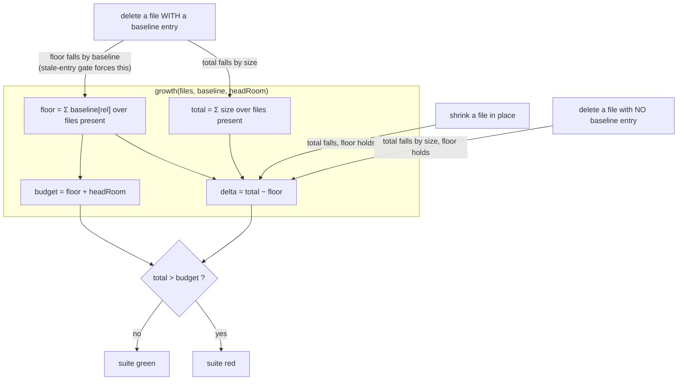

# Analysis: cut candidates for the hook-test and `agents/` growth bounds

**Date:** 2026-08-26 07:15
**Type:** Feasibility / Impact
**Status:** Complete
**Requested by:** orchestrator (Circle `260825-2023-presence-travels-monitor-filters-own-checkout`, Turn 2, task A-1)

## Question

Two of the four growth-bounded shipped surfaces are at their budget, and plan steps 10 and 11 cannot land without a cut. Which cuts pay for those steps, ranked by what the project loses rather than by how many lines or bytes they free, and does the ranked list reach the two totals the task asks for?

## Scope

Read: `hooks/lib/__tests__/**` in full or in the parts named below, `hooks/lib/__tests__/helpers/growth-bound.ts`, `hooks/lib/__tests__/surface-growth-bound.test.ts`, `hooks/lib/__tests__/fixtures/surface-growth.golden`, `README-hooks.md` `### Growth bounds on the shipped text`, `agents/orchestrator.md`, `rules/commit-lock.md`, `rules/circle-records.md`, `rules/critical-stance.md`.

Not read in full: `agents/` other than `orchestrator.md`, and `skills/`. The `skills/` surface has 7 bytes free and no plan step spends it, so it is out of scope by the task's own framing; it is noted once under **Implications**.

Nothing was modified. No whole-tree git command was run. The one measurement script written for this analysis lives in the session scratchpad and reads only.

**Tree state.** HEAD `753932b32181aba68f0b1e70d347a4af78f7f220`, committed 2026-08-26 06:51:07 +0200, branch `main`, `## main...origin/main [ahead 10]`, working tree carrying one machine-written modification (`fusion-workbench/orchestrator-events.jsonl`). Every present-tense claim below is dated by that commit.

## Findings

### 1. The three surfaces, re-measured

Verified. Measured with the same readers `surface-growth-bound.test.ts` uses (recursive `.ts` walk under `hooks/lib/__tests__` counting newline characters; `statSync().size` over `agents/*.md` and `skills/*/SKILL.md`), and the baseline maps parsed out of that same file.

| Surface | Floor | Head room | Budget | Current | Free |
|---|---|---|---|---|---|
| `hooks/lib/__tests__/` (lines) | 17 875 | 2 500 | 20 375 | 20 375 | **0** |
| `agents/` (bytes) | 399 843 | 18 000 | 417 843 | 417 695 | **148** |
| `skills/` (bytes) | 220 439 | 20 000 | 240 439 | 240 432 | 7 |

The orchestrator's figures reproduce exactly. The hook-test surface is not over its bound: `growth()` reports `over` only on `total > budget`, and 20 375 is the budget itself. One added line turns the suite red.

### 2. The arithmetic a cut has to respect, and the trap inside it

Verified, from `helpers/growth-bound.ts`. This is the finding most likely to waste a step, so it comes before the candidates.

`floor` is the baseline map summed **over the files present today**. A file with no baseline entry contributes 0 to the floor and its whole size to `total`. Two consequences follow, and they point in opposite directions:

- **Shrinking a file in place frees head room one for one.** The floor does not move, so every line removed is a line of `delta` removed. This is the ordinary case and it is what every candidate below does.
- **Deleting a whole baselined file frees only `size − baseline`.** The stale-entry assertion in `surface-growth-bound.test.ts` requires the baseline entry to go in the same commit, which drops the floor by that entry. A baselined file sitting exactly at its baseline can be deleted in full and free nothing at all.

Eight hook-test files carry no baseline entry and therefore count as growth in full: `sentence-identifier-containment.test.ts` (425), `workbench-citation-lint.test.ts` (376), `committed-dist.test.ts` (332), `plan-stopping-section-lint.test.ts` (284), `fusion-identity.test.ts` (200), `fusion-prose-metric.test.ts` (174), `fenced-code-exemption.test.ts` (168), `fusion-session-domain.test.ts` (80). Together they account for 2 039 of the 2 500 lines the surface has spent. Each of the eight is the only executable coverage of a live gate or a live helper, so none of them is a candidate; they are named here because they are where a reader hunting for slack will look first, and the answer is that the slack is not there.

### 3. Hook-test candidates, ranked

Every count in the "frees" column is a verified line span of the file at HEAD. The "keeps" figure inside each entry is an estimate of the replacement text, and the freed figure is stated net of it.

| # | Candidate | Frees (net lines) | Class |
|---|---|---|---|
| 1 | `guard-bash-integration.test.ts:296-393`: the revert-strategy block | 98 | tests a third party, not fusion |
| 2 | `guard-project-config-integration.test.ts:307-423`: the retired-FILE block | 74 to 84 | duplicated coverage |
| 3 | `guard-project-config-integration.test.ts:82-147`: the harness-capability block | 66 | meta-test with a loud consequence elsewhere |
| 4 | `domain-cascade-order-lint.test.ts`: two of five negative controls | 36 | duplicated coverage |
| 5 | `rules-emission-golden.test.ts:1122-1144`: three `growth()` property cases | 23 | duplicated coverage |
| 6 | `rules-voice-profile.test.ts:262-298`: three of five malformed-code cases | 28 | over-specified against incidental detail |
| 7 | `sentence-identifier-containment.test.ts:394-425`: three of seven import forms | 22 | over-specified against incidental detail |
| 8 | `fusion-paths.test.ts:595-598`: a duplicated `OUT_MEMO` case | 5 | duplicated coverage |

**Total: 352 to 362 net lines.** Candidates 1 to 3 alone give 238 to 248; candidates 1 to 5 give 297 to 307.

#### 1. The revert-strategy block, `guard-bash-integration.test.ts:296-393`: 98 lines

Verified: the block spans the banner at line 296 to the end of file at 393, and dropping it also frees the now-unused `spawnSync` import while requiring one line back in the innocuous list, so 98 is net.

The block does two things. Its verdict half asserts that `git checkout HEAD -- <path>` is not blocked, in two forms and under two shells. Its effect half writes a file, runs the command through `/bin/bash` or `/bin/zsh` directly (line 368), and asserts that git put the file back.

**What stops being checked.** The effect half tests git's own semantics: `runBash` is not called there, the guard is never in the path, and no fusion code can change the outcome. The shell dimension exists only for that half, because the hook receives a JSON payload and never a shell. The verdict half is already carried by the innocuous-command case at line 258, whose list includes `git checkout HEAD -- notes.txt` and which asserts that the whole eight-command run leaves `.guard-state/` untouched. Only the `.` form is unique to the block, and one line added to that list restores it. What is genuinely given up is the "the revert is not a delete" case at 377, which guards against a git that satisfied a content comparison by removing the file.

**What still covers it.** `guard-bash-integration.test.ts:237-273` for the verdict on both forms once the `.` spelling is added; nothing for git's own behaviour, and nothing needs to. The block's own header argues that it is "the case that would notice a third policy arriving on this surface and taking it out": the innocuous list is that tripwire, and it survives.

#### 2. The retired-FILE block, `guard-project-config-integration.test.ts:307-423`: 74 to 84 lines

Verified: banner, prose header and describe span lines 307 to 423, 117 lines. Collapsing to one transport case plus the negative case keeps roughly 33 to 43.

**What stops being checked.** Four cases assert the migration advisory's text phrase by phrase: the absolute path, `is no longer read`, `orchestrator.maxTurns`, the destination filename, `first`, `Then delete this file`, the ordering against a complaint about the file that is read, and the probe-not-parse behaviour on invalid JSON.

**What still covers it.** `config.test.ts:404-476`, case for case and phrase for phrase, under the same titles. The two files' own division of labour, stated in the integration file's header, is that `config.test.ts` proves `loadConfig` returns the right diagnostics and this file proves the hook turns them into a visible `guard_advisory`. That transport claim is one assertion, and the other two describes in the same file already make it twice, for an unparseable file and for a retired key. This block re-proves the loader instead.

**Residual to name in the commit.** The negative case at 411 is the strongest live guard on the harness seeding a retired filename (issue `260816-2122`), so keep it rather than the migration-text case; that is the difference between 74 and 84. With it kept, the regression is held here and at `guard-bash-integration.test.ts:180`.

#### 3. The harness-capability block, `guard-project-config-integration.test.ts:82-147`: 66 lines

Verified span, banner at 82 through the describe close at 147.

**What stops being checked.** That `withProject`'s `files` option adds a path not in the seed set, replaces one that is, and leaves the rest of the seed intact; and that `PROJECT_CONFIG` is not the retired filename.

**What still covers it.** Both properties are held by consequence rather than by assertion, and loudly. A `files` option that dropped the caller's file would leave every configuration case with no configuration, and each of them asserts an exact advisory list that would then be empty. A harness that seeded the retired filename would add one advisory to every project in the suite, which is precisely what `guard-bash-integration.test.ts:180` asserts against with an exact single-element list, and what candidate 2 leaves standing at line 411. This is the weakest of the top three, because it trades a direct assertion for an indirect one; it is ranked third for that reason and not lower, because no coverage of the product is lost at all.

#### 4. Two of five negative controls, `domain-cascade-order-lint.test.ts`: 36 lines

Verified: the `historicalPreFix` fixture at 155-166 with its case at 227-233, and the `commentTokenCascade` fixture at 190-199 with its case at 219-225.

**What stops being checked.** That the two position helpers in this file reject the historical pre-fix cascade and the trailing-comment decoy.

**What still covers it.** `domain-cascade.test.ts` drives both shapes end to end against the production parser: `HISTORICAL_PRE_FIX` is carried there verbatim and asserted to throw `/retired/` at line 411, and the trailing-comment decoy is `DEFEATS[3]`, checked both for rejection and for the defect it restores. Keep `dataAloneLifted` and `countAboveAbsent`: those two fixtures are what stop each of this file's own helpers from being vacuous, which is the failure issue `260810-0503` recorded.

#### 5. Three `growth()` property cases, `rules-emission-golden.test.ts:1122-1144`: 23 lines

Verified. Two of the three titles are byte-identical to titles in `surface-growth-bound.test.ts:553-586`.

**What stops being checked.** That `growth()` reports zero delta at baseline, goes over once head room is spent, and never goes over on a shrink, as called through `ruleGrowth` rather than through `growth` directly.

**What still covers it.** `surface-growth-bound.test.ts:553-586` asserts all three of the same properties on the same pure function, across three baseline maps instead of one. Keep the two cases in `rules-emission-golden.test.ts` that are about that file's own composition rather than about the instrument: the core/role disjointness at 1146 and the `hardBoundMessage` text at 1155.

#### 6. Three of five malformed-code cases, `rules-voice-profile.test.ts:262-298`: 28 lines

**What stops being checked.** Three of the five ways an unsupported `**Artifact language:**` value can be malformed: a capitalised code, a spelled-out language name, and a word that merely begins with a supported code.

**What still covers it.** The remaining two cases assert the same fallback through the same path. Honest statement of the loss: these five are not purely redundant. Case-sensitivity, prefix anchoring and region qualification are three distinct properties of one regex, and a change to that pattern could break one while the others hold. This is ranked sixth because the loss is real, not because the lines are few.

#### 7. Three of seven import forms, `sentence-identifier-containment.test.ts:394-425`: 22 lines

**What stops being checked.** That the registry-completeness check reads an aliased import keeping its suffix, a multi-line import block with an inline type specifier, and a namespace import of a package or builtin.

**What still covers it.** The remaining four cases: the control, the plain named import (the only form `hooks/tracker.ts` actually uses), one aliased form, and the namespace-import refusal, which is the fail-loud branch and the one worth keeping. The three dropped cases probe a parser against shapes no shipped file has.

#### 8. A duplicated `OUT_MEMO` case, `fusion-paths.test.ts:595-598`: 5 lines

**What stops being checked.** Nothing. The case activates a Circle and asserts `memo`'s `OUT_MEMO` is `shared/memos`. `fusion-paths.test.ts:155-161` performs the identical activation and the identical assertion, alongside `OUT_CONSULT`.

### 4. Large candidates that should not be cut

Flagged deliberately, because each is big enough to attract a cut and each would cost more than it frees.

| Candidate | Size | Why not |
|---|---|---|
| `legacy-halt-clearing.test.ts` | 213 lines | It guarantees that a halt flag left by a removed mechanism blocks nothing and that nothing rewrites the file. That is a live migration promise to installed consumers, not coverage of dead code. |
| The `RULE_BASELINE` movement log, `rules-emission-golden.test.ts:285-460` | roughly 175 lines | `helpers/growth-bound.ts` `## Re-baselining` requires that a re-baseline name the cut that produced it and that an arming reproduce as text what it absolved. This log is that record. Cutting it converts every past re-baseline into a silent raise after the fact. |
| The arming and cleanup logs, `surface-growth-bound.test.ts:1-200` | roughly 200 lines | Same rule, same reason, and this file is the one that states it. |
| `monitor-warnings-panel.test.ts` browser-launch and wildcard-bind blocks | roughly 250 lines | Each case is traced to a filed defect the suite was blind to, including the bind-versus-name defect that stayed green for as long as it stood. The `guard_block` and `guard_halt` fixtures in the same file look like tests of removed mechanisms and are not: `orchestrator-events.jsonl` is append-only and the monitor is read against logs older than itself. |
| `hook-fail-open.test.ts` | 624 lines | Three of its four blocks assert the marker on stderr precisely so that they cannot pass vacuously on a filesystem that ignores mode bits. Nothing in it is a second copy of anything. |
| `guard-state-shape.test.ts` | 251 lines | The only coverage of the coercion seam in `lib/guard-state-file.ts`, which still ships and still has two callers. |
| `agents/orchestrator.md:613` (the `/tmp` rationale) | 1 055 bytes | `commit-message-path.test.ts:191` asserts that Step 3b states *why* the location is `/tmp`, not merely that it is. Cutting the reason turns the suite red. |
| `agents/orchestrator.md` Setup Step 5 prose | roughly 6 000 bytes | `domain-cascade.test.ts` holds this as the sole definition site and runs a detector over its own prose. A cut here risks three gates at once. |

### 5. `agents/` candidates, ranked

All three are second copies of text authored in `rules/commit-lock.md`, which `bin/fusion-rules orchestrator` emits, verified by running it. A rule the agent already loads on every dispatch, restated in the prompt it loads alongside, is the duplication `rules/critical-stance.md` §2 names as a defect, so each of these cuts improves the text.

| # | Candidate | Line bytes (verified) | Est. kept | Est. freed |
|---|---|---|---|---|
| 1 | `agents/orchestrator.md:628`: the absolute-pathspec derivation | 1 246 | 250 | 996 |
| 2 | `agents/orchestrator.md:637`: "Which lock form, and why this one" | 905 | 180 | 725 |
| 3 | `agents/orchestrator.md:1158`: the second telling of the `git add -u` measurement | 627 | 200 | 427 |

**Total: roughly 2 148 bytes**, against a need of about 400. Candidate 1 alone covers it two and a half times over.

#### 1. `agents/orchestrator.md:628`: 996 bytes

**What a reader stops being told.** That `fusion-commit-lock with` resolves the workbench root and `cd`s there; that neither the caller's directory nor the git toplevel governs the pathspecs; that a toplevel-relative staging list exits 128 with nothing staged; and the scratch-repository measurement behind that.

**What still says it.** `rules/commit-lock.md:44`, under `### Helper`, in a paragraph headed **`with` performs a `cd`**, which states the resolution, the three-way distinction, the absolute-pathspec obligation and the exit-128 consequence. Keep the operative instruction ("write every path out absolute") and the `A pathspec failure is not repaired with a directory argument or -A` clause, which belongs to step 4's own shape rule rather than to the lock.

**Gate note.** This line carries one plugin-path token, `bin/fusion-commit-lock`. Keep that citation in the rewrite and `reference-resolution-lint.test.ts`'s pinned `paths: 1424` does not move.

#### 2. `agents/orchestrator.md:637`: 725 bytes

**What a reader stops being told.** That `with` is canonical, that it releases on every exit path via a trap, that the 60-second stale threshold is what a non-releasing form would cost, and that the sole criterion for the explicit `acquire`/`release` pair is internal control flow inside the held region.

**What still says it.** `rules/commit-lock.md:39` for the canonical form and release-on-any-exit, `:42` for the criterion verbatim, and the `### Mechanism` and `### Failure modes` sections for the 60-second threshold on both stale paths. Keep the one clause that is genuinely local: this region has no internal control flow, so `with` applies.

**Gate note.** No plugin path and no heading anchor on this line. The pinned counts do not move.

#### 3. `agents/orchestrator.md:1158`: 427 bytes

**What a reader stops being told.** Nothing that the same file does not say 528 lines earlier. The `git add -u` incident, the three deletions, the three `_o_` records leaving HEAD and the repair commit `f38f37d` are told at line 630 as the reason for step 4's shape, and told again here. This is one prompt carrying one measurement twice.

**What still says it.** `agents/orchestrator.md:630`. Keep the pointer and the shape restatement, which is the sentence the section needs, and drop the retold measurement.

**Gate note.** No plugin path and no heading anchor. The Circle citation on the line belongs to the `records` class, which the lint counts and does not pin.

### 6. What a cut obliges the cutter to do afterwards

Verified from the gate sources.

- Regenerate `hooks/lib/__tests__/fixtures/surface-growth.golden` with `cd hooks && UPDATE_SURFACE_GOLDEN=1 npx vitest run lib/__tests__/surface-growth-bound.test.ts`, then re-run without the flag. The run rewrites the fixture and fails on purpose.
- **Do not move a baseline.** These are cuts, so head room comes from the falling total, not from a rising floor. `TEST_LINE_BASELINE`, `AGENT_BASELINE` and `SKILL_BASELINE` stay exactly as they are.
- Re-approve `BASELINE` in `reference-resolution-lint.test.ts` only if a cut removes a plugin-path or heading-anchor token. On the three `agents/` candidates as scoped above, none does.

## Implications

The hook-test surface has no slack at all, and the eight unbaselined files show why: the last cleanup re-baseline was taken on 2026-08-17, and everything added since is a new gate rather than growth in an old one. That is the instrument working as designed, and it means the cut has to come out of the older files. Every candidate above does.

The two totals are reachable, but the margins differ sharply. On `agents/`, one candidate covers the need several times over and the cut makes the prompt better rather than merely smaller. On the hook tests, the list reaches 352 to 362 net lines against a 350 target, and it gets there only by including candidates 6 and 7, whose losses we are least comfortable with. If plan step 10 lands at the low end of its 200 to 300 estimate and step 11's second branch is small, candidates 1 to 4 (238 to 248 lines) are enough and the two over-specification cuts need not be taken. We would take them last.

The `skills/` surface has 7 bytes free. No step in this Circle's plan touches a skill body, so it is not a blocker today, but it is one edit away from being one and this analysis proposes nothing for it.

## Recommendations

1. Take hook-test candidates 1 to 3 first (238 to 248 lines). They are the three where nothing about fusion's own behaviour stops being checked. Route to `coder`.
2. Take candidates 4 and 5 if more is needed (a further 59 lines). Both are duplicated coverage with a stronger sibling still standing.
3. Hold candidates 6 to 8 in reserve. Candidate 8 is free; 6 and 7 have a real, named loss and should be taken only if the first five fall short of what steps 10 and 11 actually consume.
4. Take `agents/` candidate 1 alone. It frees roughly 996 bytes against a need of about 400, and it removes a restatement rather than a reason. Candidates 2 and 3 are available if the orchestrator wants the margin. Route to `coder`.
5. Measure the surfaces again after the cut and before writing the new test file. The cut and the addition are two commits, and the bound is evaluated on the tree, so the order matters only if the intermediate state has to be green.

## Filed Issues

None. Every finding here is a candidate for a step already planned, not a defect. The nearest thing to a defect is the twice-told measurement at `agents/orchestrator.md:630` and `:1158`, and it is candidate 3 of the `agents/` list rather than a separate record.

## Sources

- `hooks/lib/__tests__/helpers/growth-bound.ts:60-118`: the `growth()` arithmetic and the `Growth` contract; `:26-56`: the two re-baselining events.
- `hooks/lib/__tests__/surface-growth-bound.test.ts:242-300` (`AGENT_BASELINE`, `SKILL_BASELINE`), `:302-345` (`TEST_LINE_BASELINE`), `:347-349` (head rooms), `:553-608` (the synthetic bounds).
- `hooks/lib/__tests__/fixtures/surface-growth.golden`: per-file sizes.
- `README-hooks.md` `### Growth bounds on the shipped text`: the four surfaces, the regeneration commands, and what no bound covers.
- `hooks/lib/__tests__/guard-bash-integration.test.ts:237-273, 296-393`.
- `hooks/lib/__tests__/guard-project-config-integration.test.ts:1-48, 82-147, 307-423`.
- `hooks/lib/__tests__/config.test.ts:404-476`.
- `hooks/lib/__tests__/domain-cascade-order-lint.test.ts:41-63, 153-234`; `hooks/lib/__tests__/domain-cascade.test.ts:296-470`.
- `hooks/lib/__tests__/rules-emission-golden.test.ts:1104-1165`.
- `hooks/lib/__tests__/rules-voice-profile.test.ts:254-299`.
- `hooks/lib/__tests__/sentence-identifier-containment.test.ts:351-425`.
- `hooks/lib/__tests__/fusion-paths.test.ts:155-161, 595-598`.
- `hooks/lib/__tests__/reference-resolution-lint.test.ts:479` (`BASELINE`), `:524-526` (the pinned-count assertion), `:60-72` (what the three classes count).
- `hooks/lib/__tests__/workbench-citation-lint.test.ts:262-300`: the corpus, which excludes analyses.
- `hooks/lib/__tests__/commit-message-path.test.ts:191`: the pinned `/tmp` rationale.
- `hooks/lib/__tests__/legacy-halt-clearing.test.ts:114-213`; `hooks/lib/__tests__/guard-state-shape.test.ts:1-80`; `hooks/lib/__tests__/hook-fail-open.test.ts:169-300`; `hooks/lib/__tests__/monitor-warnings-panel.test.ts:625-1102`.
- `agents/orchestrator.md:613, 628, 630, 637, 1158`.
- `rules/commit-lock.md:19-64`.
- `rules/critical-stance.md` §2, §3.
- `hooks/guard.ts:1-80`: what the hook still does.
- `bin/fusion-rules orchestrator`: verified that `rules/commit-lock.md` is emitted to this agent.

## Open Questions

- [ ] Whether plan steps 10 and 11 land at the low or the high end of their 200-to-300-line estimate decides whether candidates 6 and 7 are taken at all. That is the orchestrator's call once the new test file exists, not ours.
- [ ] The `skills/` surface stands at 7 bytes free and nothing in this Circle spends it. Whether that warrants a cut of its own before the next skill edit is unanswered here.
