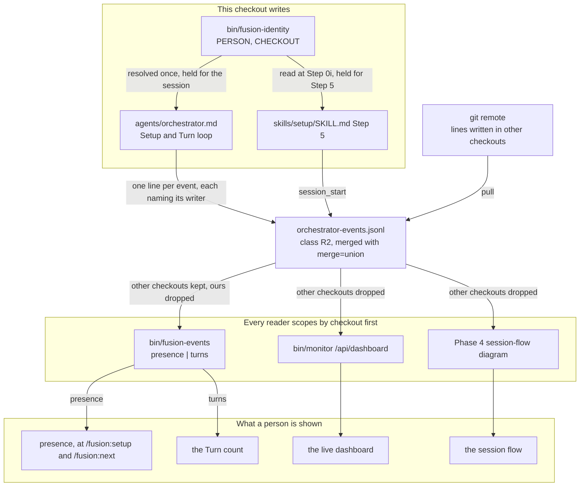
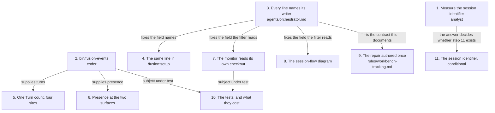

# Implementation Plan: C4 — presence travels, and the monitor reads its own checkout

**Date:** 2026-08-25
**Status:** Complete
**Spec:** `260822-1136_*_spec-fusion-becomes-a-multi-user-tool.md` `### C4: Presence travels, after the fact`, read against `260825-2023-presence-travels-monitor-filters-own-checkout`, which governs where the two disagree
**Decidability:** The load-bearing question is *which session does an event-log line belong to*. Read from the inputs the readers have today, it is undecidable: a line carries `ts`, `event` and some of `turn`, `task`, `agent`, `detail`, and after a union merge another checkout's block can stand anywhere relative to this session's `session_start`, so neither position nor timestamp separates one session's lines from another's. The measurement in `260823-1302_*_the-monitor-attributes-a-merged-event-log-to-one-session-and-reports-another-checkouts-state.md` establishes that sorting moves one reading from vague to wrong rather than repairing it. The mechanism changes rather than the derivation: each line carries the identity of the checkout and person that wrote it, so membership is **read off the line** instead of inferred from its neighbours. Under that mechanism the question is decidable, with one residual stated in `## Risks & Mitigations`: two orchestrators running in **one** checkout at once make it undecidable again, and that case is out of scope in the specification and is what the advisory session marker exists to warn about.

## Directive

After this Circle a person who has pulled can see that another person, or another of their own checkouts, ran a session against this project, when it ran, and which Circle it was on. `bin/monitor` reads the merged log as this checkout's session alone. The Turn count has one definition. No capability reads another session's queue, dashboard or live state, and no file that stays in the checkout becomes tracked.

The Circle record's `## Directive` is the governing statement. This plan adds nothing to it and narrows it in one place, stated in `## Approach`: the record names `session_start` and `session_end` as the lines that carry the identity, and the monitor repair needs every line to carry the checkout, so every line carries both fields.

## Current State

**The identity mechanism exists and is not re-decided here.** `bin/fusion-identity` prints `PERSON=` in git's `Name <email>` form and `CHECKOUT=` as eight hex characters minted once into `fusion-workbench/.checkout-id`, with a six-code exit table that separates the two halves and names exit 1 as the only code that means stop. `agents/orchestrator.md` `## Circle head fields` and `skills/setup/SKILL.md` Step 0i already call it behind an `[ -x ]` guard. The specification names `$USER` in C4's acceptance criteria and in its `## Constraints`; that half is stale and `260822-1136_*_which-identity-does-an-attributed-record-carry-when-the-transport-is-git.md` overrides it.

**The event log is the only workbench file two checkouts both write.** `rules/workbench-tracking.md` classifies it as class R2 and declares `merge=union` for it, which `/fusion:setup` Step 0h installs per checkout. That section already states the cost in its own terms: after a merge the file is not chronological, and "the repair belongs to the reader rather than to the file". The repair the readers need is what this Circle supplies.

**The emit sites are two, not one, and they disagree.** `agents/orchestrator.md` Setup step 8 appends `session_start` with `history_file` and `detail`; `skills/setup/SKILL.md` Step 5 appends the same event with `history_file` alone, against a vocabulary that declares both. Filed as `260825-2140_*_the-two-session-start-emit-sites-disagree-on-the-detail-field-and-the-vocabulary-names-one.md`.

**The Turn count has four sites, and the record that referred it here names three.** `agents/orchestrator.md` Setup Step 1 counts every `turn_start` in the file; Phase 2 step 3 and the Persistent-State derivation table both define the figure as the events since this session's `session_start`; and `skills/setup/SKILL.md` Step 1 carries the whole-file count a second time, byte for byte. The fourth site appears in no record, and it is filed as `260825-2140_*_the-turn-count-defect-names-three-sites-and-a-fourth-carries-the-identical-whole-file-count.md`. The prose definition is the one that survives, and `260823-1110_*_the-merge-driver-unsorts-a-second-event-log-reader-whose-repair-direction-is-positional.md` adds the constraint that its proposed derivation, finding the last `session_start` and counting after it, is positional and does not survive the merge.

**The monitor's four false readings all issue from one read.** `bin/monitor` takes `lines[-MAX_EVENTS:]` of the raw file at `/api/dashboard`, and `_parse_mode`, `computeETA`, the paired-duration average and the Event Log panel are all downstream of that one array. Repairing the array repairs all four.

**Four bounded surfaces, measured at HEAD on 260825** by summing each bound's own baseline map against the tree:

| Surface | Now | Budget | Remaining |
|---|---|---|---|
| Always-on rule core | 98 559 bytes | 98 573 | **14 bytes** |
| `agents/*.md` | 414 836 bytes | 417 843 | 3 007 bytes |
| `skills/*/SKILL.md` | 238 516 bytes | 240 439 | 1 923 bytes |
| Hook test suite | 20 375 lines | 20 375 | **0 lines** |

**Two gates fire on additions this plan makes.** `derivable-enumerations-lint.test.ts` holds `CLAUDE.md`'s Layout table in set equality with `bin/*`, and `README-hooks.md`'s `hooks/lib` table in set equality with `hooks/lib/*.ts`. A new helper without both rows turns `npm test` red. `committed-dist.test.ts` requires `hooks/dist/` to be the compilation of the committed source.

**A helper this repository adds is unreachable in the session that adds it.** Every call site is written `"$FUSION_PLUGIN_ROOT/bin/<name>"`, which is the installed copy and is pinned for the whole session, so the `[ -x ]` guard takes its miss branch until `fusion --update` and a restart. Measured over a 21-hour window on `bin/fusion-identity` in `260825-1329_*_every-session-runs-one-release-behind-on-a-bin-helper-the-same-repository-just-added.md`. The plan is arranged so that every miss branch is honest rather than silent, and the proof run belongs to the next session.

## Approach

One mechanism, applied once and read by three readers: **every emitted line names the person and the checkout that wrote it, and every reader scopes the merged log by checkout before it asks anything else.**

The asymmetry between the readers is the design's core, and it is deliberate. Presence is the one question whose answer lives in the lines this checkout did **not** write, so `bin/fusion-events presence` keeps them and drops our own. Every other reader wants this session, so it drops theirs and keeps ours. A line carrying no checkout identifier counts as this checkout's own, which the user settled: the existing 2 331-line log carries none, no record is rewritten, and the degradation is exact, because a reader that cannot resolve its own identifier keeps every line and behaves as it does today.

Three choices follow from reuse rather than from invention.

**The Circle is derived from `history_file`, and no field is added for it.** The specification asks the presence report to name the Circle. `history_file` is already on every `session_start` line, as a workbench-relative path, so a value beginning `circles/` names its Circle in the second segment and anything else is shared work. The prompt already calls that field the session's identity, and this is the second thing it decides.

**The Turn count becomes a program rather than four pieces of prose.** Four sites cannot agree by being edited four times; that is the shape the defect record already measured once. `bin/fusion-events turns` reads `session.history_file` from `agentstate.yaml`, filters the log to this checkout, sorts by `ts`, finds the **first** `session_start` naming that file, and counts `turn_start` lines from its timestamp on. The window is a timestamp within one checkout's own lines, which is genuine chronology, rather than a position in a merged file. `bin/fusion-review-coverage` already defaults its anchor out of the same state file, so the input convention is not new either.

**The rule text lands where its bytes are free.** `rules/workbench-tracking.md` already owns class R2, the union merge driver, and the sentence that the repair belongs to the reader. It is emitted to no agent, so it falls on no bounded surface, and the identity contract is the completion of a paragraph that is already there rather than a new home.



## Implementation Steps

1. [DONE] **Measure whether a hook can obtain the Claude Code session identifier**
   - Executor: `analyst`
   - Files: `$OUT_ANALYSIS/YYMMDD-HHMM-can-a-hook-obtain-the-session-identifier.md`
   - Changes: answer three questions by measurement, each with the command and its output in the report. (a) Does the SessionStart hook's stdin payload carry a `session_id` field, and is it non-empty? (b) Can a SessionStart hook put a value in front of the model, and does the model reproduce it verbatim when asked? The channel to test is plain stdout, which `CLAUDE.md` records as `additionalContext`, and `hookSpecificOutput.systemMessage`, which `hooks/session-start.ts` already uses for the user. (c) Is `session_id` non-empty on PreToolUse and PostToolUse at run time? Both hooks declare the field (`hooks/guard.ts` `interface HookInput`, `hooks/tracker.ts` `interface HookInput`) and neither reads it. **Method: a throwaway project created outside this repository**, with its own `.claude/settings.json` declaring hooks that write their stdin to a file, driven with `claude -p`. Instrument nothing in this repository: the installed hooks are pinned for the session and a change here would not be the thing measured. The report states, for each of (a), (b) and (c), the answer and what it permits. It proposes nothing.
   - Surface: none bounded.
   - Dependencies: none. This is the Circle's stated first step and nothing waits on it except step 11.

2. [DONE] **`bin/fusion-events`, the identity-scoped reader of the event log**
   - Executor: `coder`
   - Files: `hooks/lib/events-query.ts` (new), `hooks/events-query.ts` (new entry point), `bin/fusion-events` (new), `hooks/dist/events-query.js` and `hooks/dist/lib/events-query.js` (built and committed), `README-hooks.md` (one row in the `hooks/lib` table), `CLAUDE.md` (one row in the Layout table)
   - Changes: build the reader described in `## API Changes`, with two subcommands. Follow the three-part shape `bin/fusion-turn-budget`, `bin/fusion-review-coverage` and `bin/fusion-staging-drift` already use: a thin bash wrapper resolved relative to itself over a compiled entry point, with the logic in `hooks/lib/`. **The wrapper calls its sibling `"$here/fusion-identity"` and passes `PERSON`, `CHECKOUT` and that helper's exit code into the node program by environment variable**, so identity is obtained in exactly one place in the tree and `hooks/lib/events-query.ts` stays a pure function of the log text, the reading identity and the current time. Reuse `findWorkbenchRoot` from `hooks/lib/workbench-root.ts` and the `session.history_file` read from `hooks/lib/state-file.ts`; add no second reader of either. The script's own header is the authoritative documentation, carrying the usage block, the output shape and the exit table, as every other `bin/` helper's does. **Parse `ts` by appending the `Z` designator**: the emit convention writes UTC without it, and `CLAUDE.md`'s symptom table names the resulting off-by-one-timezone bug as a trap every consumer of this file has to defend against.
   - Surface: none bounded. `bin/` and `hooks/lib/*.ts` fall outside all four bounds; only `hooks/lib/__tests__/**.ts` is counted, and that is step 10.
   - Dependencies: none.

3. [DONE] **Every emitted line names its writer**
   - Executor: `coder`
   - Files: `agents/orchestrator.md`
   - Changes: in `### 2. Structured Event Log`, add `person` and `checkout` to the schema example and state in one sentence that both stand on **every** line, with their values read once at Setup from `bin/fusion-identity` behind `[ -x ]` and composed nowhere else, per `rules/fusion-workbench-conventions.md` `### Who filed it`. In Setup step 2, add the resolution of that pair to the helper calls already made there, held for the session beside the Turn budget. In Setup step 8, carry both fields in the `session_start` example. In the `Cleanup` step, carry both in `session_end`. In `**Emitting events:**`, state that the single `echo` carries them. Say plainly what an unresolved half means: the field is **absent rather than empty**, which is the same rule the record templates already follow, and an absent `checkout` reads as this checkout's own to every reader.
   - Surface: `agents/*.md`, estimated +1 100 to +1 400 bytes of the 3 007 available. Step 5 returns bytes to the same surface.
   - Dependencies: none.

4. [DONE] **`/fusion:setup` emits the same line**
   - Executor: `coder`
   - Files: `skills/setup/SKILL.md`
   - Changes: in Step 5, carry `person`, `checkout` and `detail` on the `session_start` line, taking the first two from the values Step 0i already read and stating that they are held for this step. The `detail` field closes `260825-2140_*_the-two-session-start-emit-sites-disagree-on-the-detail-field-and-the-vocabulary-names-one.md`; the contract it satisfies is authored in step 3 and is cited, never restated.
   - Surface: `skills/*/SKILL.md`, estimated +300 to +400 bytes of the 1 923 available. Step 5 returns bytes to the same surface.
   - Dependencies: step 3, which fixes the field names and their absence rule.

5. [DONE] **One Turn count, one implementation, four sites**
   - Executor: `coder`
   - Files: `agents/orchestrator.md`, `skills/setup/SKILL.md`
   - Changes: replace the `grep -c` block in `agents/orchestrator.md` Setup Step 1 sub-step 3 and the identical block in `skills/setup/SKILL.md` Step 1 sub-step 2 with a guarded call to `bin/fusion-events turns`. Keep the surrounding care that a figure which could not be taken is reported as `unavailable` and never as `0`, and that `turns=0` is a real figure. In `agents/orchestrator.md` Phase 2 step 3 and in the Persistent State File derivation table, state the definition once and cite the helper as the implementation of it, rather than restating the derivation in a second place. **Where the helper is unreachable, report `unavailable` and name the reason; never fall back to the whole-file count**, because that is the defect being repaired. Both defect records named in `## Current State` close with this step.
   - Surface: `agents/*.md` and `skills/*/SKILL.md`, both expected **negative**: each file loses roughly 700 bytes of shell block and gains roughly 300 bytes of guarded call and explanation. State the measured before-and-after per surface in the commit.
   - Dependencies: step 2, which supplies `turns`.

6. [DONE] **Presence at the two surfaces where activation is decided**
   - Executor: `coder`
   - Files: `skills/setup/SKILL.md`, `skills/next/SKILL.md`
   - Changes: add a presence report to `/fusion:setup` Step 0c, after the existing marker check and without changing it, and to the `/fusion:next` briefing in Step 5, beside the counts and the generated stamp the briefing already renders. Both call `bin/fusion-events presence` behind `[ -x ]` and render its output in the project's chat language per `rules/user-facing-output.md`. The report is one line in the ordinary case and states four things: the count of other people, the count of further checkouts of the reading person, reported separately in the shape *"1 other person, 1 further checkout of your own"*; the person, the Circle and the time for each, taken from the helper's `party=` lines; the seven-day window; and that the report reflects only what this checkout has pulled, so a session started since the last pull is invisible. **Print nothing at all when the counts are zero**, which keeps the ordinary run quiet, and follow the same reasoning the briefing already applies to an empty backlog. **A read that failed says so and never prints a zero**: exit 3 renders as *"presence could not be read: this checkout has no identifier"*, exit 4 as the counts with the note that the two kinds could not be told apart, and a missing helper as the statement that presence was not read because the installed plugin does not carry it.
   - Surface: `skills/*/SKILL.md`, estimated +700 to +900 bytes across the two files, against the 1 923 available plus whatever step 5 returns.
   - Dependencies: step 2, which supplies `presence`.

7. [DONE] **The monitor reads its own checkout**
   - Executor: `coder`
   - Files: `bin/monitor`
   - Changes: at `/api/dashboard`, parse **every** line rather than the last `MAX_EVENTS`, drop the lines whose `checkout` is present and differs from this checkout's, sort what remains on the raw `ts` string, and then take the last `MAX_EVENTS`. Sorting on the raw string is correct for the same reason `_read_warnings` already gives for the guard log: the emit convention writes a fixed-width UTC stamp, so lexical order is chronological order, a line missing `ts` sorts oldest rather than raising, and the sort is stable. Read this checkout's identifier from `BASE_DIR/.checkout-id` as a plain file read, and **never mint it**: minting belongs to `bin/fusion-identity`, and a dashboard process must not create workbench state. An unreadable identifier keeps every line, which is today's behaviour exactly. One change repairs all four false readings, because `_parse_mode`, `computeETA`, the paired-duration average and the Event Log panel are all downstream of the one array. Add a comment naming the four and the record that measured them.
   - Surface: none bounded.
   - Dependencies: step 3, which fixes the field name the filter reads.

8. [DONE] **The session-flow diagram draws one checkout**
   - Executor: `coder`
   - Files: `agents/orchestrator.md`
   - Changes: in the Phase 4 generation step and in Observability section 3, filter to this checkout before the existing sort by `ts`. The record that measured the monitor calls this the smaller instance of the same missing identity: the diagram sorts correctly today and still draws two checkouts' sessions as one interaction.
   - Surface: `agents/*.md`, estimated +150 bytes.
   - Dependencies: step 3.

9. [DONE] **The reader's repair is authored once**
   - Executor: `coder`
   - Files: `rules/workbench-tracking.md`
   - Changes: extend `## The event log carries a union merge driver` where it already states that the repair belongs to the reader. Name what the repair is after this Circle, in two clauses: every line carries the checkout that wrote it, and a reader scopes by that field before it sorts by `ts`. Name the rule that an absent identifier reads as the reading checkout's own, and name the cost the user accepted with it, that another checkout's pre-C4 lines already merged in read as this checkout's. Name the three readers by path and say which of them keeps other checkouts and which drop them.
   - Surface: none bounded. `bin/fusion-rules` emits this file to no agent, so it falls outside the always-on core that has 14 bytes left.
   - Dependencies: step 3, which is the contract this documents.

10. [DONE] **The tests, and what they cost**
    - Executor: `coder`
    - Files: `hooks/lib/__tests__/fusion-events.test.ts` (new), and either a new file or a new block for the monitor's event window
    - Changes: exercise `hooks/lib/events-query.ts` against fixture log text, which needs no git and no workbench because step 2 makes the module a pure function of its inputs. Cover the case split in `## Data Structures` clause by clause: a line with no checkout counted as ours, another person's line, a further checkout of the same person, a line past the window, an empty log, a missing `agentstate.yaml`, a history file with no `session_start`, and `turns=0` as a real figure. For the monitor, extract the event-window read the way `monitor-warnings-panel.test.ts` extracts the warnings read, and assert that another checkout's lines are absent from the served array and that an unreadable identifier serves everything.
    - Surface: **hook test suite, which has 0 lines.** Estimated 200 to 300 lines, from the sizes of the comparable existing files: `fusion-session-domain.test.ts` at 80, `fusion-identity.test.ts` at 200, `fusion-count-sources.test.ts` at 442. **This step cannot begin until the question in `## Open Questions` is answered.** Steps 1 through 9 touch no test line, so the whole capability can be built and read while it is open; what waits on the answer is whether it is gated.
    - Dependencies: steps 2 and 7, the two subjects under test.

11. [DONE] **The session identifier, if the measurement permits it**
    - Executor: `coder`
    - Files: `agents/orchestrator.md`, and `hooks/lib/events.ts` with `hooks/guard.ts` and `hooks/tracker.ts`, each only under its own branch of step 1's answer
    - Changes: two independent conditionals, and neither is taken without its own answer. If step 1 finds that the SessionStart hook receives `session_id` **and** can put it in front of the model verifiably, add `session_id` as a third field on the orchestrator's own emitted lines, obtained through that channel and through no other. If step 1 finds `session_id` non-empty on PreToolUse and PostToolUse, add it to `GuardEvent` and to the rows the two hooks write. **If the measurement comes back negative, add nothing and substitute nothing weaker.** The specification's own criterion requires the Circle to say so in its closure note, which is where the negative result is recorded. Note for whoever executes this: `history_file` and `checkout` already identify a session within a checkout, and a resumed session keeps its history file while it would receive a fresh `session_id`, so the third field may buy less than it looks like. State that finding rather than acting on it; the criterion asks for the measurement, not for a judgement about the field's worth.
    - Surface: `agents/*.md` under the first branch, estimated +250 bytes. The second branch touches `hooks/lib/__tests__/guard-state-shape.test.ts` and therefore falls under step 10's constraint.
    - Dependencies: step 1.



## Where this Circle stops

One clause per condition, each answerable yes or no. The last clause is a precondition on a later act rather than on this Circle.

1. Every `session_start` and `session_end` line written from this checkout names the person and the checkout that wrote it, and every other emitted line names the checkout. Read the tail of `fusion-workbench/orchestrator-events.jsonl` after one full session to answer it.
2. `/fusion:setup` and `/fusion:next` each report presence over the last seven days, counting other people and further checkouts of the reading person separately, and each states that the report covers only what this checkout has pulled.
3. A presence surface that could not read the log, or could not identify this checkout, says so and does not report a count of zero.
4. `bin/monitor` serves `/api/dashboard` from this checkout's lines alone, and a line carrying no checkout identifier is among them.
5. The Turn count has one definition and one implementation, and all five sites that print or define it read that one implementation. *This clause was written saying four, and the arithmetic was wrong.* The Turn 2 code review, reading the range that closed the four, found a fifth at `agents/reconciler.md:21`: it derived the count from the whole log, unscoped by checkout, and named no implementation. It was filed as `260826-0906_*_a-fifth-turn-count-definition-site-still-reads-the-whole-file-and-names-no-implementation.md` and converted in `6deeb33`, which also re-ran the record's grep over `bin/`, `docs/`, `README-hooks.md`, `CLAUDE.md` and the hook sources and found no sixth. What the clause requires is unchanged and is met; only its count moved from four to five.
6. The seven defect records this plan refers by path above the `## Reconciliation Log` carry a closing note citing the commit that discharged them, or state which part was not discharged and why. *This clause was written saying three, was corrected to six, and refers seven;* the second miscount was made by the very commit that fixed the first, `287f7ff`, which added the seventh to criterion 5 in the same edit — so the number was true of the file it read and false of the file it wrote. It is corrected the same way again, by moving the number and leaving the requirement alone, and this time the count carries the boundary it is taken over, because the Reconciliation Log below is appended after closure and names further records that are the pass's own findings rather than this Circle's referred work. Five are discharged. `260823-1110_*_the-merge-driver-unsorts-a-second-event-log-reader-whose-repair-direction-is-positional.md` and `260823-1302_*_the-monitor-attributes-a-merged-event-log-to-one-session-and-reports-another-checkouts-state.md` were closed in the Circle that filed them, before this one opened. `260825-2140_*_the-turn-count-defect-names-three-sites-and-a-fourth-carries-the-identical-whole-file-count.md` and `260825-2140_*_the-two-session-start-emit-sites-disagree-on-the-detail-field-and-the-vocabulary-names-one.md` were closed here. Two are not discharged and keep the `_o_` marker: `260825-1329_*_every-session-runs-one-release-behind-on-a-bin-helper-the-same-repository-just-added.md` and `260825-1430_*_the-event-log-froze-at-turn-2-while-the-dashboard-stayed-current-inverting-the-diagnostic-six-instances-rest-on.md`. This Circle witnessed a second instance of each and appended the repeat-sighting line plus a paragraph naming what was not discharged and why, which is the second branch of this clause rather than an exemption from it. The seventh is `260826-0906_*_a-fifth-turn-count-definition-site-still-reads-the-whole-file-and-names-no-implementation.md`, named in criterion 5 above and discharged in `6deeb33`.
7. Where the session-identifier measurement came back negative, the closure note says so and names what was therefore not added. Nothing weaker stands in its place. *(condition did not arise: the measurement at `260825-2214-can-a-hook-obtain-the-session-identifier.md` came back positive on every branch, so the identifier was added and no closure note was owed)*
8. `cd hooks && npm test` exits 0, and every growth-bound baseline map is byte-identical to its state at the Circle's first commit.
9. `git ls-files fusion-workbench | awk -F/ 'NF==2'` returns the same three entries it returned before this Circle, so no file that stays in the checkout became tracked.
10. **Before any release tag is pushed**, this Circle's review pass has run over its own commit range and `bin/fusion-review-coverage --since <the Circle's first commit>` has been run and its result stated. The binding record is `260817-1613_*_does-a-plan-stated-precondition-get-any-mechanism-or-is-it-read-by-a-human-or-not-at-all.md`, filed after a tag went out over an unrun review pass.

## Data Structures

**The event line, after step 3.** Two fields are added to the object `agents/orchestrator.md` `### 2. Structured Event Log` declares, and no field is removed or renamed.

```json
{
  "ts": "2026-08-25T19:23:38",
  "event": "session_start",
  "person": "Kai Stalmann <ks@qantr.com>",
  "checkout": "5e8248d7",
  "history_file": "circles/260825-2023-.../history/260825-2123-orchestrator-session.md",
  "detail": "<Directive and mode>"
}
```

`person` and `checkout` stand on every line. A half that `bin/fusion-identity` could not resolve is **absent**, never empty, which is the rule the record templates already follow.

**How a line is classified, for the presence report.** The split is over `session_start` lines inside the window, by the pair of fields, and it is disjoint and complete.

| Condition | Class |
|---|---|
| `checkout` absent, or equal to this checkout's | this checkout's own; not presence |
| `checkout` differs, `person` equals the reading person's | a further checkout of your own |
| `checkout` differs, `person` differs or is absent | another party; named as a person where the field is present, and as a checkout whose person was not recorded where it is not |

The first row is what carries the whole existing 2 331-line log, none of whose lines has either field, and it is what makes the dashboard fully populated on day one.

**The Circle a session ran on** is read off `history_file` and not from a field of its own. A value beginning `circles/` names its Circle in the second path segment; any other value is shared work; an absent field is `unknown`.

## API Changes

`bin/fusion-events <subcommand> [options]`. Output on stdout in the `KEY=value` shape `bin/fusion-paths` established, one line per key, with reasons on stderr.

**`presence [--days N]`**, default 7:

```
window_days=7
scope=pulled
other_people=1
other_checkouts=1
party=person<TAB>Jane Roe <jane@example.com><TAB>4f21ab90<TAB>2026-08-24T09:12:00<TAB>260824-0530-record-attribution-and-circle-claim
party=checkout<TAB>Kai Stalmann <ks@qantr.com><TAB>9c30ee11<TAB>2026-08-25T07:40:00<TAB>shared
```

One `party=` line per distinct pair of person and checkout other than this one's, carrying the class, the person, the checkout, the timestamp of the most recent `session_start` from that pair, and the Circle. The separator is a tab, because the person value contains spaces by construction.

**`turns`** prints `turns=<n>` and the history file the count was scoped to. It reads `session.history_file` from `agentstate.yaml`, so it takes no argument and cannot be pointed at a session that is not this one.

**Exit codes.** The `0/1/2` core is shared with `bin/fusion-paths` and `bin/fusion-rules`; 3 and 4 are this helper's own and differ per subcommand, which the header states.

| Code | Meaning |
|---|---|
| 0 | measured. `other_people=0` is a real answer and reaches this code |
| 1 | usage error |
| 2 | no fusion workbench above the working directory |
| 3 | `presence`: this checkout could not be identified, so no line can be classified, and no count is printed. `turns`: no `agentstate.yaml`, or no `session.history_file` in it, so there is no session to scope to |
| 4 | `presence`: the person half could not be read, so another person cannot be told from a further checkout of your own. `other_checkouts` is printed and `other_people` is not. `turns`: no `session_start` in this checkout's lines names that history file, which is itself a finding rather than a zero |

Exit 4 on `turns` earns its own code because of `260825-1430_*_the-event-log-froze-at-turn-2-while-the-dashboard-stayed-current-inverting-the-diagnostic-six-instances-rest-on.md`, which measured a session whose Turn-2 boundary events never reached the log. A count of zero and a session that emitted nothing must not read the same.

## Testing Strategy

**What step 2's shape buys.** `hooks/lib/events-query.ts` takes the log text, the reading person, the reading checkout and the current time as arguments, and returns a value. Every case in `## Data Structures` is therefore a fixture string and an assertion, with no git, no temporary workbench and no subprocess. The wrapper's own contract, mapping `bin/fusion-identity`'s exits onto this helper's 3 and 4, is the one part that needs a subprocess, and `fusion-identity.test.ts` is the pattern for it.

**What the monitor needs.** `monitor-warnings-panel.test.ts` already extracts the Python that reads the guard log and runs it against fixture content. The event window is the same shape of test against the same file, and two assertions carry it: another checkout's lines are absent from the served array, and an unreadable identifier serves every line.

**What no test can reach, stated rather than covered.** Whether a real second checkout's lines merge and read correctly end to end was measured for C2 in `260823-1302-two-checkouts-one-event-log-and-what-the-monitor-makes-of-it.md`, with two clones and a local bare remote. Repeating that measurement for the presence report is a manual pass, not a unit test, and it belongs in the Circle's own verification rather than in the suite.

**The blocking condition.** Every line written under this heading falls on the surface with 0 lines of head-room. See step 10 and `## Open Questions`.

## Risks & Mitigations

| Risk | Mitigation |
|---|---|
| The hook-test surface has no room, so the capability ships ungated | Steps 1 through 9 are arranged to need no test line, so the question blocks one step instead of the Circle. The choice is filed as a decision record and cited in `## Open Questions` |
| `bin/fusion-events` is unreachable from `$FUSION_PLUGIN_ROOT` in the session that adds it, so every call site takes its miss branch | Every call site is `[ -x ]`-guarded per `260810-0921_*_how-should-a-prompt-call-a-bin-helper-that-the-installed-copy-may-not-have.md`, and each miss branch is specified to report rather than to substitute: the Turn count says `unavailable`, and presence says it was not read. The proof run belongs to the next session, after `fusion --update` and a restart, which is the two-session shape `260825-1329_*_every-session-runs-one-release-behind-on-a-bin-helper-the-same-repository-just-added.md` measured |
| A presence report that cannot read the log prints "nobody else has been here" | Step 6 specifies the failure text per exit code, and clause 3 of `## Where this Circle stops` is the check. Absence of evidence must not render as evidence of absence on a report a person uses to decide whether to activate a Circle |
| The log grows by roughly 70 bytes per line, close to half again on the current 359 KB file | Accepted rather than mitigated. The specification forbids a line or byte ceiling on this file, because every ceiling expressible in lines discards the oldest lines first, and the archive roll of `/fusion:cleanup` is what bounds it instead |
| Presence reports only what was emitted, and emission is not enforced | `260825-1430_*_the-event-log-froze-at-turn-2-while-the-dashboard-stayed-current-inverting-the-diagnostic-six-instances-rest-on.md` measured a session whose Turn-2 events never reached the log while the dashboard stayed current. This Circle does not repair that, and clause 6 of the stopping conditions does not claim it does. The `turns` exit 4 is the one place the plan refuses to render a missing emission as a zero |
| Two orchestrators in one checkout make the Turn window ambiguous again | Out of scope in the specification, and the advisory marker at `/fusion:setup` Step 0c is what warns about it. The plan adds no lock and claims none |
| Another checkout's pre-C4 lines, already merged in, read as this checkout's own | The cost the user accepted with decision 3. It is bounded and shrinking: it applies only to lines written before this Circle, and no line written after it is affected |
| Editing one of the two Setup renderings and not the other | Steps 3 and 4 are ordered and adjacent, steps 5 touches both files in one step, and two defect records now stand as the evidence that this divergence has already happened twice |

## Open Questions

- [ ] **Where do this Circle's hook-test lines come from?** The surface has 0 lines of head-room, the cut-only Circle's 302 lines are spent, and step 10 needs an estimated 200 to 300. Three options are set out with their costs in `260825-2140_*_where-do-c4s-hook-test-lines-come-from-when-the-cut-only-circles-room-is-spent.md`. The answer blocks step 10 and nothing else.
- [ ] **Does the estimate in step 3 hold?** `agents/*.md` has 3 007 bytes and steps 3, 8 and 11 spend against it while step 5 returns to it. Measure the surface after step 5 rather than after step 3, and if the sum comes out over, the material to cut is in the same files the plan is already editing.

## Reconciliation Log

**2026-08-26, reconciler, session-end pass over `8119fc2..7774d56`, HEAD `7774d56`, working tree
clean apart from `fusion-workbench/orchestrator-events.jsonl`.**

**Status confirmed.** All eleven steps read `[DONE]` and all eleven are done on disk. `**Status:**
Complete` and the `_c_` marker are correct. Verified per step, not per header:

| Step | Verified at |
|---|---|
| 1 | `260825-2214-can-a-hook-obtain-the-session-identifier.md`, findings (a), (b), (c), each with its command and output |
| 2 | `hooks/lib/events-query.ts`, `hooks/events-query.ts`, `bin/fusion-events`; run from the work tree, `presence` exits 0 and `turns` prints `turns=3 scope=checkout` |
| 3 | `agents/orchestrator.md:139` (`<ID>` defined), `:235`, `:953`, `:1322` (carried) |
| 4 | `skills/setup/SKILL.md:480`, `:483` — `<ID>` plus `detail` |
| 5 | five call sites read `bin/fusion-events turns`: `agents/orchestrator.md:101`, `:558`, `:1122`, `skills/setup/SKILL.md:388`, `agents/reconciler.md:21` |
| 6 | `skills/setup/SKILL.md:150-156` (Step 0c), cited from `skills/next/SKILL.md:117` |
| 7 | `bin/monitor:1230-1310`, `_read_checkout_id` and `_read_events` |
| 8 | `agents/orchestrator.md:915` and `:1376` |
| 9 | `rules/workbench-tracking.md` `## The event log carries a union merge driver`, last two paragraphs — **with one defect, below** |
| 10 | `hooks/lib/__tests__/fusion-events.test.ts` (166 lines), `monitor-warnings-panel.test.ts` (+34); the cut in `c649556` |
| 11 | `agents/orchestrator.md:140`, `:1269`, `:1279`; `hooks/lib/__tests__/guard-state-shape.test.ts`, the session-id row test passes |

**Acceptance criteria, read one by one against the tree.** 1, 2, 3, 4, 5, 8 and 9 are met. Criterion
8 measured directly: `cd hooks && npm test` exits 0 (44 files, 776 tests), and
`git diff 73ca11c..HEAD` over `hooks/lib/__tests__/surface-growth-bound.test.ts`,
`rules-emission-golden.test.ts` and `helpers/growth-bound.ts` is empty, so no baseline map moved.
Criterion 9 measured directly: `git ls-files fusion-workbench | awk -F/ 'NF==2'` returns the same
three entries at `8119fc2` and at HEAD. Criterion 10 is a precondition on a release tag and is not
this Circle's to discharge; `bin/fusion-review-coverage --since 73ca11c` reads
`commits=17 reviews=3 uncovered=4`, and all four uncovered commits touch only `fusion-workbench/`
records (three review filings and this plan's closure), so every code-touching commit in the range
falls inside a review's declared range.

**Criterion 6, one residual.** Six of the seven referred defect records satisfy it. The seventh,
`260823-1110_*_the-merge-driver-unsorts-a-second-event-log-reader-whose-repair-direction-is-positional.md`,
carries only `Resolved: referred (C4)`, written before this Circle opened. C4 did discharge its
direction — `bin/fusion-events turns` opens its window on a timestamp inside one checkout's own
lines rather than on a position in the merged file (`hooks/lib/events-query.ts:374-434`, commit
`97407df`), which is the "window that does not depend on file order" the record asked for — and no
note in that record says so. Its sibling `260823-1302_*_…` did get such a note appended here. The
record lives in a closed Circle's store, outside this pass's scan set, so it is named rather than
edited.

**Criterion 6 also undercounts by one, and the correcting commit is what made it wrong.** The clause
reads "the plan refers **six** by path". At HEAD the plan refers **seven** defect records by path:
`grep -o` over this file for the record-path shape returns the six the clause enumerates plus
`260826-0906_*_a-fifth-turn-count-definition-site-still-reads-the-whole-file-and-names-no-implementation.md`,
which `287f7ff` added to criterion 5 in the same edit that corrected criterion 6 from three to six.
Six was true of the file the commit read and false of the file it wrote. The requirement is
unaffected: the seventh is closed and its `Resolved:` note describes the discharging change. Only the
number is wrong, which is the third time in this Circle that a count was right when written and wrong
one commit later. Recorded here rather than corrected in the clause, so the reader sees the pattern
rather than a tidy number.

**Criterion 7 is vacuously satisfied, and that reading is stated rather than assumed.** The clause is
conditional on the session-identifier measurement coming back negative. It came back positive on all
three questions (analysis `260825-2214`, findings (a) yes and non-empty, (b) plain stdout yes and
verbatim, (c) yes on both PreToolUse and PostToolUse), so nothing was withheld and the antecedent
never fires. Both branches of step 11 were therefore built. One sub-result *was* negative —
`hookSpecificOutput.systemMessage` does not reach the model — and it changed the shape of the answer
rather than withholding it: `session-id.ts` is a fourth SessionStart command precisely because one
process writes one stdout and the two channels are needed in opposite directions
(`README-hooks.md:184`, `CLAUDE.md:29`). The closure note the orchestrator writes at Phase 4 should
carry that positive result and that one negative channel, or criterion 7 passes without anyone ever
reading the measurement. Filed as a fourth sighting on
`260825-1250_*_a-conditional-acceptance-criterion-has-no-notation-for-a-false-antecedent-so-three-passes-re-derived-the-same-explanation.md`.

**One defect found in step 9's output and filed.** `rules/workbench-tracking.md` says "Three readers
apply that scoping" and names three; four apply it, the fourth being the Phase-4 session-flow
diagram that step 8 of this same plan converted. Step 9's own instruction said "three", so the
executor followed the plan and the plan was wrong. Filed as
`260826-1127_*_the-repairs-authoring-home-says-three-readers-scope-by-checkout-and-this-circle-built-a-fourth.md`.

**One further count filed.** Five shipped sites say `turns` replaced "four copies of a whole-file
`grep -c turn_start`"; there were two at `8119fc2`, and five sites now read the one implementation.
Filed as
`260826-1127_*_five-shipped-sites-say-the-turn-count-helper-replaced-four-whole-file-grep-copies-and-there-were-two.md`.

**One residual this plan already names and still carries.** The exit table in `## API Changes` gives
one cause for `turns` exit 4, and the authoritative `bin/fusion-events` header now gives two. The
closure of
`260826-0132_*_the-turns-exit-4-has-two-causes-and-the-authoritative-header-names-one.md`
named this and left it deliberately, `planning/` being outside that task's file scope. Unchanged
here, for the same reason.

**Records.** Sixteen defect records in this Circle's store carry `_c_`; thirteen carried `_o_` before
this pass and fifteen do after it. Fourteen of the sixteen closures were checked against the tree
rather than against their own prose — every one that makes a claim a `grep` can settle — and all
fourteen hold; the two not independently re-measured (`260826-0132_*_…exit-4-has-two-causes` and
`260826-0134_*_other-checkouts-counts-two-different-sets`) changed documentation text only and state
so. One closed record's reasoning was overtaken and gained a `Revised by:` line without a rename
(`260826-0136_*_…three-emit-templates`). The Circle's one decision record moved `_a_` → `_i_`, its
answer realised in `c649556` and `46de871`.
