# Implementation Plan: repair the twenty open defect records

**Date:** 2026-08-27
**Status:** Draft
**Spec:** none: planned from the dispatch directive; the Circle record `circles/260826-1613-cardinality-answered-cut-once-nineteen-cleared/_t_circle.md` carries the Directive
**Decidability:** Two questions carry this plan. First, for each of the twenty records, does it resolve to a fix, to a recorded no-change, or to a direction the user gives at the gate? That is decidable from the records themselves: every one names its site and its close condition, and the split below is complete over the twenty by enumeration. Second, for every step that adds bytes to a growth-bounded surface, is there a named source for those bytes? That is decidable from the four bounds' own instruments, measured at `0fb5085` in `## Current State`, and the answer is that two surfaces need no cut and two need one, so the plan carries one measured cut under one gate. What is not decidable from the plan's inputs is the right answer to the six choice points planning surfaced; those are filed as decision records in this Circle's store and are answered by the user at the gate, not approximated here.

## Directive

Close the twenty defect records that stand open in this workbench: the four in the active Circle's issue store and the sixteen in `shared/issues/`. Each closes by a fix, by a recorded no-change with the reason written into the record, or by the direction the user gives at this plan's gate. The Circle's Directive foresees one measured cut of the growth-bounded shipped surfaces under one user gate; every surface-spending step here fits inside that cut.

**Scope note, stated because the Circle record says something different.** The Circle's Grounding enumerates nineteen inherited records, thirteen of which stand open inside the closed C4 Circle (`circles/260825-2023-presence-travels-monitor-filters-own-checkout/issues/`, twelve `_o_` plus the one the Grounding lists as `260826-0906` EPIPE, which closed at `15ef0a7`). The dispatch names the twenty as the set, and this plan plans the twenty. The thirteen are named in `## Open Questions` because one decision about them changes the size of the one cut.

## Current State

### The twenty records, by the kind of close each admits

| # | Record | Site | Close kind |
|---|---|---|---|
| 1 | `circles/…/issues/260826-1815_*_a-ranking-rationale-asserts-a-resolver-behaviour-that-does-not-exist-and-it-stands-in-the-active-record.md` | `_t_circle.md` `## Activation proposal` ¶3 | record edit, gate-sanctioned |
| 2 | `circles/…/issues/260826-1901_*_the-playmakers-rationale-contract-requires-a-citation-and-caps-the-read-that-would-check-it.md` | `agents/playmaker.md:104`, `:129`, `:270` | fix |
| 3 | `circles/…/issues/260826-1902_*_the-activation-proposal-section-has-no-content-contract-on-the-one-surface-that-is-never-regenerated.md` | `agents/playmaker.md:177`, `:113`, `:52`/`:56` | fix |
| 4 | `circles/…/issues/260826-1903_*_the-false-scan-set-claim-also-stands-in-the-portfolio-and-in-the-history-log-as-a-warning-name.md` | `shared/history/260826-1705-playmaker-direct-dispatch.md:46`; the portfolio half is already gone (regenerated 260827-1637, the name retired in its `## Warnings`) | record append |
| 5 | `shared/issues/260825-1019_*_nothing-checks-that-a-tracked-workbenchs-gitignore-matches-the-four-class-partition.md` | `skills/setup/SKILL.md` (new step; both decisions answered) | fix, spends `skills/` |
| 6 | `shared/issues/260825-1250_*_a-bounded-circle-holds-a-draft-spec-with-49-unreconciled-criteria-that-no-scan-reaches.md` | a spec inside a `_b_` Circle | user direction |
| 7 | `shared/issues/260825-1250_*_a-conditional-acceptance-criterion-has-no-notation-for-a-false-antecedent-so-three-passes-re-derived-the-same-explanation.md` | two plan/spec instances; template home | decision, then fix |
| 8 | `shared/issues/260825-1250_*_twenty-eight-records-filed-since-the-attribution-rule-landed-carry-no-person-half-and-no-stated-reason.md` | `rules/fusion-workbench-conventions.md` `### Who filed it` | decision, then fix; no gate |
| 9 | `shared/issues/260825-1259_*_the-rebalance-gate-mandates-four-options-and-the-output-rule-caps-a-gate-at-three.md` | `rules/orchestrator-rebalance.md` `### Rebalance Gate` (moved there by the 260827-1210 partition; not `agents/orchestrator.md:992` any more) | decision, then fix |
| 10 | `shared/issues/260825-1329_*_every-session-runs-one-release-behind-on-a-bin-helper-the-same-repository-just-added.md` | `CLAUDE.md` `## Release process`; `skills/setup/SKILL.md` Step 2 | fix (options 2 and 3); option 1 stays with `260810-1544` part (c) |
| 11 | `shared/issues/260825-1430_*_the-event-log-froze-at-turn-2-while-the-dashboard-stayed-current-inverting-the-diagnostic-six-instances-rest-on.md` | `hooks/lib/orchestrator-events.ts` (v10.8.0 repaired tasks and commits) | recorded no-change on the mechanism; decision filed |
| 12 | `shared/issues/260825-1440_*_the-archive-safety-filter-checks-only-claude-md-while-the-citation-lint-guards-a-corpus-thirty-one-files-wider.md` | `skills/archive/SKILL.md` filter 3, Step 4 | decision, then fix, spends `skills/` |
| 13 | `shared/issues/260825-1456_*_three-shipped-surfaces-say-the-retired-configuration-key-set-is-three-and-the-loader-holds-four.md` | `fusion.json:9`, `templates/fusion.json:8`, `agents/orchestrator.md:114` | fix, two executors |
| 14 | `shared/issues/260826-1305_*_the-closure-note-reporting-seven-wrong-counts-states-an-eighth-in-the-paragraph-that-reports-them.md` | a terminal record, unedited by design | recorded no-change |
| 15 | `shared/issues/260826-1330_*_the-citation-pin-note-says-hooks-dist-is-scanned-records-only-and-it-is-not-scanned-at-all.md` | `hooks/lib/__tests__/reference-resolution-lint.test.ts:479`, comment | fix, zero lines |
| 16 | `shared/issues/260826-1332_*_the-layout-trees-consumer-column-omits-the-event-log-reader-this-circle-built.md` | `rules/fusion-workbench-conventions.md` `## fusion-workbench Layout` | fix, spends always-on bytes; pin moves |
| 17 | `shared/issues/260826-1445_*_the-playmakers-ranking-rewards-a-stale-grounding-because-no-criterion-asks-whether-the-directive-is-still-true.md` | `agents/playmaker.md` Step 2 cap, Step 3 criteria | decision, then fix |
| 18 | `shared/issues/260827-0315_*_the-guard-state-rule-accounts-for-one-inert-leftover-and-the-directory-holds-three.md` | `rules/workbench-tracking.md` `## The four classes`; `skills/setup/SKILL.md` Step 3 | fix, half of it spends `skills/` |
| 19 | `shared/issues/260827-0410_*_the-machine-written-event-rows-ship-with-wiring-asserts-only-because-the-hook-test-surface-is-full.md` | `hooks/lib/__tests__/` (285 lines) | fix, spends hook-test lines |
| 20 | `shared/issues/260827-1741_*_tier-1-archives-a-terminal-circle-as-one-directory-and-never-reads-the-open-issues-inside-it.md` | `skills/archive/SKILL.md` Tier 1, filter 2, survey; `skills/cleanup/SKILL.md` Step 4 | fix, spends `skills/` |

`circles/…/` abbreviates `circles/260826-1613-cardinality-answered-cut-once-nineteen-cleared/`.

### The four bounded surfaces, measured at `0fb5085`

Measured with the readers the two gate tests use (`statSync().size` over `agents/*.md` and `skills/*/SKILL.md`; newline count over every `.ts` under `hooks/lib/__tests__/` recursively; `RULE_BASELINE` summed over the three core files in `rules-emission-golden.test.ts:1125`), and the baseline maps parsed out of those same files. The shipped tree carried no uncommitted change at the measurement, so these are HEAD's figures.

| Surface | Floor | Head room | Budget | Current | Free |
|---|---|---|---|---|---|
| `hooks/lib/__tests__/` (lines) | 17 875 | 2 500 | 20 375 | 20 374 | **1** |
| `agents/` (bytes) | 399 843 | 18 000 | 417 843 | 403 639 | 14 204 |
| `skills/` (bytes) | 220 439 | 20 000 | 240 439 | 240 351 | **88** |
| always-on rule core (bytes) | 65 498 | 12 000 | 77 498 | 64 285 | 13 213 |

The Circle's Grounding was measured at `2ff5030` and read 26 lines, 47 bytes and 16 bytes free on the first three. The bookkeeping-cost releases of 260827 (`refactor/260827-0335-bookkeeping-cost-repair-plan.md`, commits `15847b7..05fd2d2` and the partitions after them) changed two of the three: `agents/orchestrator.md` shed 241 lines and the always-on core shed the language, backlog and worked-example text. **So the cut the Directive foresees is now needed on two surfaces, `skills/` and the hook tests, and on neither of the other two.** The `agents/` steps below (2, 3, 17) fit in 14 204 bytes with room to spare; the always-on step (16) fits in 13 213. `skills/` at 88 bytes and the hook tests at 1 line cannot take a single step.

**The ranked cut reserve is mostly spent.** Of the eight hook-test candidates in `circles/260825-2023-presence-travels-monitor-filters-own-checkout/analyses/260826-0715-cut-candidates-for-two-growth-bounded-surfaces.md`, candidates 1 to 4 were taken at C4's closure (`guard-bash-integration.test.ts` now 304 lines against the 393 the analysis read; `guard-project-config-integration.test.ts` 250 against 423; `domain-cascade-order-lint.test.ts` 234). Candidates 5 to 8 stand (the three `growth()` cases at `rules-emission-golden.test.ts:1131-1146`, the malformed-code cases in `rules-voice-profile.test.ts`, the import forms in `sentence-identifier-containment.test.ts`, the duplicate `OUT_MEMO` case at `fusion-paths.test.ts:595`), worth 78 lines together against a need of 285. The analysis proposed nothing for `skills/` and said so. Finding the rest is step 21's work, and it is the reason the cut is a measured step rather than a lookup.

### Two things already true that the records do not yet say

- `shared/issues/260826-1315_*` and `260826-1331_*` closed at the 260827-1528 reconciliation, and `260826-0906_*` (the EPIPE) closed at `15ef0a7`. None of the three is among the twenty.
- `hooks/lib/__tests__/hooks-wiring.test.ts:75` cites `shared/issues/260827-0410_o_*` with the marker spelled. Closing record 19 renames that file, and `workbench-citation-lint.test.ts` recomputes its corpus on every run, so the closure reddens the suite unless the citation is starred in the same commit (step 24).

### Decision records this planning filed

Six choice points, each a record in `circles/260826-1613-cardinality-answered-cut-once-nineteen-cleared/decisions/`, all stamped `260827-1756`, each carrying a recommendation:

- R1 `260827-1756_*_how-does-the-rebalance-gate-present-four-moves-under-a-three-option-cap.md` (record 9)
- R2 `260827-1756_*_how-does-a-checkbox-criterion-say-that-its-condition-never-arose.md` (record 7)
- R3 `260827-1756_*_which-surface-is-authoritative-when-the-event-log-and-the-dashboard-disagree.md` (record 11)
- R4 `260827-1756_*_does-the-playmaker-rank-a-circle-whose-grounding-has-gone-stale-and-how-is-stale-read.md` (record 17)
- R5 `260827-1756_*_which-citation-corpus-does-the-archive-safety-filter-protect.md` (record 12)
- R6 `260827-1756_*_which-record-kinds-owe-the-person-half-of-filed-by.md` (record 8)

Two further questions already have records and are cited rather than refiled: `circles/260824-1853-close-every-open-defect/decisions/260824-2013_*_do-archive-and-terminal-circles-stores-enter-any-scan-set-or-is-the-exclusion-written-down.md` (record 6) and part (c) of `shared/decisions/260810-1544_*_should-prompt-called-bin-helpers-get-one-guarded-call-convention-and-does-the-work-tree-preference-extend-to-them.md` (record 10, option 1).

## Approach

Five bundles, each a set of commits that stands on its own. Bundles A to C spend no surface that needs a cut and can land in any order, today. Bundle D is the one cut and everything it pays for: an analyst sizes and ranks it, the user approves it once, a coder performs it, then the `skills/` and hook-test steps land behind it. Bundle E realises the decisions the user answers at the gate. Every record edit rides on the executor of its fixing step; a standalone record closure goes to `coder`, because the routing table has no record-only executor and a marker rename is not data.

```mermaid
flowchart TD
    subgraph A["Bundle A: record-only closures"]
        direction TB
        S1["1  1815 record clause"]
        S4["4  1903 history append"]
        S14["14 1305 no-change"]
        S11["11 1430 no-change + R3"]
        S6["6  1250-spec: analyst measures 49 criteria"]
    end
    subgraph B["Bundle B: small shipped fixes, no cut"]
        direction TB
        S13a["13a fusion.json + template"]
        S13b["13b orchestrator.md:114"]
        S15["15 lint note :479"]
        S16["16 layout tree + pin"]
        S18a["18a workbench-tracking.md"]
        S10a["10a CLAUDE.md helpers paragraph"]
    end
    subgraph C["Bundle C: playmaker prompt"]
        direction TB
        S2["2+3 grounding contract"]
        S17["17 stale-grounding warning"]
    end
    subgraph D["Bundle D: the one cut and what it pays for"]
        direction TB
        S21["21 analyst: rank cuts on skills/ and hook tests"]
        GATE{{"user gate: approve the cut"}}
        S22["22 coder: perform the cut"]
        S12["12 archive filter 3 corpus"]
        S20["20 tier-1 open-record exclusion"]
        S5["5  setup .gitignore repair"]
        S18b["18b + 10b setup Step 3 and Step 2"]
        S19["19 integration cases (285 lines)"]
    end
    subgraph E["Bundle E: decisions realised"]
        direction TB
        S9["9  Rebalance gate shape"]
        S7["7  conditional-criterion notation"]
        S8["8  Filed-by reach sentence"]
    end
    S2 -->|"same read-cap sentence"| S17
    R4["R4 answered"] --> S17
    S21 --> GATE --> S22
    S22 --> S12
    S22 --> S20
    S22 --> S5
    S22 --> S18b
    S22 --> S19
    R5["R5 answered"] --> S12
    R1["R1 answered"] --> S9
    R2["R2 answered"] --> S7
    R6["R6 answered"] --> S8
    R3["R3 answered"] --> S11
    S13a -->|"same commit"| S13b
```

The graph declares every dependency the steps below state and no other. Bundles A, B and C have no edge into D or E; D's edges all run through the gate; E's all run from an answered record. No cycle.

## Implementation Steps

Numbering follows the record table, so step *n* closes record *n*; steps 21 to 24 are the cut and its bookkeeping. Each step names its executor, files, changes, dependencies and acceptance.

### Bundle A: record-only closures

1. [DONE] **Correct the false scan-set clause in the active Circle record** (record 1)
   - Executor: `coder`, acting on the user's explicit approval at this gate. The section is playmaker-appended and the orchestrator writes none of it; the record is `_t_`, so the no-edit rule for terminal records does not apply.
   - Files: `circles/…/_t_circle.md`, `## Activation proposal`, third paragraph.
   - Changes: replace the clause "the Circle's inheritance is currently stranded, in the sense that closing its parent removed all nineteen records from every agent's scan set; activation is what brings them back into scope" with the true statement (records inside a non-active Circle are in another Circle's scan set only when a run names that Circle as `fusion-paths`' second argument; nothing was removed and nothing is brought back), and append at the paragraph's end `Corrected 260827 per circles/260826-1613-cardinality-answered-cut-once-nineteen-cleared/issues/260826-1815_*_a-ranking-rationale-asserts-a-resolver-behaviour-that-does-not-exist-and-it-stands-in-the-active-record.md`. Close the record with `Resolved:` and rename to `_c_`.
   - Dependencies: none.
   - Acceptance: `grep -c "removed all nineteen records" circles/…/_t_circle.md` returns 0; the corrected paragraph cites the issue; the issue carries `_c_`.

4. [DONE] **Append the correction to the 260826-1705 playmaker history log** (record 4)
   - Executor: `coder`.
   - Files: `shared/history/260826-1705-playmaker-direct-dispatch.md`.
   - Changes: append one dated line after the `## Warnings` list: the warning name `stranded-records-in-terminal-circles` encoded a mechanism `bin/fusion-paths` does not have; the 260827-1637 run retired the name and stated the true reading under `records-reachable-only-under-their-terminal-circle`. The log's original lines stay as written. The portfolio needs nothing: verify that `fusion-workbench/portfolio.md` (`**Generated:** 260827-1637`) carries no copy, and say so in the `Resolved:` note. Rename to `_c_`.
   - Dependencies: none.
   - Acceptance: the history file ends with the correction line naming the issue; `grep -c stranded-records portfolio.md` returns 0.

6. [DONE] **Measure the 49 criteria of the bounded Circle's spec, once** (record 6)
   - Executor: `analyst`.
   - Files: reads `circles/260820-2051-style-rules-arrive-and-get-measured/planning/260820-2249_*_spec-style-rules-arrive-and-get-measured.md` and the tree; writes `$OUT_ANALYSIS/YYMMDD-HHMM-the-style-rules-spec-measured-against-the-tree.md`.
   - Changes: for each of the 49 criteria, state met / not met / not applicable with a `path:line` or command; no edit to the spec. The spec's disposition (ticked in place by a reconciler dispatch outside this plan, or declared history by rule text) is the user's direction under `260824-2013_*`, taken at the gate; the record closes with `Resolved:` citing the analysis and the direction.
   - Dependencies: none for the measurement; the closure waits for the gate direction.
   - Acceptance: the analysis carries 49 rows, each with evidence; the issue's `Resolved:` cites it and the direction given.

11. [DONE] **Close the event-log inversion record on the v10.8.0 repair, and file the surface question** (record 11)
    - Executor: `coder` (record only).
    - Files: the issue file; R3 already filed.
    - Changes: append `Resolved:` stating that `task_start`/`task_done` are written by the hooks (`hooks/lib/orchestrator-events.ts`, commits `94ad2f4`, `d7cdfa7`) and the `commit` row by `bin/fusion-commit-lock with` (`2bea3ac`), that `turn_start`/`turn_end` remain prompt-emitted by construction (no hook sees a Turn) and that freeze mode stays reachable, and that item 2 of `## What to consider` is R3. Restate the diagnostic in the note as an observed frequency with one counter-example, since no shipped text states it as a law. Rename to `_c_`.
    - Dependencies: none (R3 need not be answered for the closure; it needs to exist).
    - Acceptance: the `Resolved:` note cites the three commits and R3 by starred path.

14. [DONE] **Record the no-change on the closure note's eighth count** (record 14)
    - Executor: `coder` (record only).
    - Files: the issue file.
    - Changes: append `Resolved:` stating that the record's own `## Fix direction` foresaw no edit, that the terminal record stays as the specimen, and that the decision it was filed to inform is answered: `circles/260825-2023-presence-travels-monitor-filters-own-checkout/decisions/260826-1252_a_*` `## Answer` (options 2 and 3, `rules/critical-stance.md` §5, commit `ae00e84`). Rename to `_c_`.
    - Dependencies: none.
    - Acceptance: the note cites the decision's `## Answer` and `ae00e84`.

### Bundle B: small shipped fixes that need no cut

10a. **Extend the two-session paragraph to helpers** (record 10, option 3)
    - Executor: `coder` (documentation describing the release mechanism).
    - Files: `CLAUDE.md` `## Release process`, the paragraph beginning "The same pin makes any Circle that builds an agent…".
    - Changes: one added sentence: a `bin/` helper added in a session is absent from `$FUSION_PLUGIN_ROOT` until `fusion --update`, so every `[ -x ]` call site takes its miss branch for the rest of that session; cite the issue. Not bounded.
    - Dependencies: none. Record 10 closes at step 10b.
    - Acceptance: the paragraph names helpers beside agents and cites the record by starred path.

13a. [DONE] **Name the fourth retired key in both configuration files** (record 13)
    - Executor: `ontocoder`.
    - Files: `fusion.json` `_retired`, `templates/fusion.json` `_retired`, edited identically in one commit.
    - Changes: "the three top-level keys that held it — guard, decisions, escalation" becomes the four, `churn` last, with its retirement date; the source of truth is `RETIRED_TOP_LEVEL_KEYS` in `hooks/lib/config.ts:349`.
    - Dependencies: none; 13b lands in the same commit.
    - Acceptance: `npx vitest run lib/__tests__/config.test.ts` green (the two files stay byte-identical outside `PROJECT_SET_KEYS`); both `_retired` strings name four keys.

13b. [DONE] **Name the fourth retired key in the orchestrator's Setup Step 2 parenthesis** (record 13)
    - Executor: `coder`.
    - Files: `agents/orchestrator.md:114`.
    - Changes: the parenthesis `(guard, decisions, escalation)` gains `churn`. About 8 bytes on `agents/`. The record's "worth considering" pin between the JSON prose and the loader is declined: the hook-test surface has 1 line free, and `shared/decisions/260811-1522_a_*` is the same question, answered and unrealised; say so in the `Resolved:` note. Rename to `_c_`.
    - Dependencies: same commit as 13a.
    - Acceptance: `grep -c churn agents/orchestrator.md` rises by one at line 114.

15. **Correct the reason in the citation pin's re-approval note** (record 15)
    - Executor: `coder`.
    - Files: `hooks/lib/__tests__/reference-resolution-lint.test.ts:479` (the single comment line carrying the `2026-08-26 (C4 Turn 3 task Z-2)` entry).
    - Changes: replace the clause "`hooks/**.ts` is scanned for class (c) record citations only, and that docstring's one record citation was left untouched" with the two separate facts: `hooks/dist/` contributes nothing because `surface()`'s two hook loops are non-recursive and `isFile()`-filtered, so no compiled artifact is read; `hooks/lib/*.ts` contributes no paths because those files are `recordsOnly`. Same line, so the line count is unchanged; no path or anchor token is added, so `BASELINE` does not move.
    - Dependencies: none.
    - Acceptance: line count of the file unchanged; `npx vitest run lib/__tests__/reference-resolution-lint.test.ts` green without a re-approval.

16. **Complete the layout tree's consumer column and its row set** (record 16) [DONE]
    - Executor: `coder` (a rule file describing code consumers).
    - Files: `rules/fusion-workbench-conventions.md` `## fusion-workbench Layout`; `hooks/lib/__tests__/reference-resolution-lint.test.ts` `BASELINE` (re-approval on the same line).
    - Changes: add `bin/fusion-events` (and `hooks/events-query.ts`) to the `orchestrator-events.jsonl` row; extend the `agentstate.yaml` row's parenthetical to name events-query beside review-coverage and staging-drift. Then check the whole column once, by `grep -n 'fusion-workbench/' hooks/*.ts hooks/lib/*.ts bin/*` against the tree: at `0fb5085` the tree lacks a `.cadence-anchors` row although `rules/workbench-tracking.md:24` classifies it as a root-anchored class L entry (v10.8.1); add the row with `bin/fusion-cadence-anchor` as its consumer. Spends always-on bytes (about 250 of 13 213 free). The citation pin moves by the plugin-path tokens added; measure the delta by single-file revert and re-approve on the `BASELINE` line with a note in the established form. Rename to `_c_`.
    - Dependencies: none.
    - Acceptance: the two rows name `bin/fusion-events`; a `.cadence-anchors` row exists; `npx vitest run lib/__tests__/reference-resolution-lint.test.ts lib/__tests__/rules-emission-golden.test.ts` green after the re-approval.

18a. **Account for all three inert leftovers in the guard-state paragraph** (record 18, rule half)
    - Executor: `coder`.
    - Files: `rules/workbench-tracking.md` `## The four classes`, the paragraph beginning "`.guard-state/` is not one thing".
    - Changes: the sentence "and they are the whole of it" becomes an enumeration of the live set (the two throttle records, `dispatch-map.json`, `events.jsonl`) followed by the three leftovers a workbench set up under an older fusion may hold, each with the commit that retired its writer: `escalation.json` (260816), `churn.json` (`a69d56e`), `state-drift.json` (`f45f76a`). Not bounded (emitted to no agent).
    - Dependencies: none. The record closes at 18b.
    - Acceptance: `grep -c 'churn.json' rules/workbench-tracking.md` is at least 1; the paragraph names no count word for the set.

### Bundle C: the playmaker prompt (`agents/`, 14 204 bytes free, no cut needed)

2. **Bind the rationale to a read, and give the appended block a content contract** (records 2 and 3, one step: the same file, overlapping sentences) [DONE]
   - Executor: `coder`.
   - Files: `agents/playmaker.md` at `:104`, `:129`, `:177`, `:113`, `:52` or `:56`, `:270`; delete `:12` and its blank line (the consultant boundary paragraph, restated at `:276`, which back-references it; that back-reference is reworded to stand alone).
   - Changes, in the records' own words: at `:104` the cap's criterion becomes "enough to rank, and enough to check what you state", with the verifying read named as inside scope; at `:129` and `:270` a path in a rationale names a file this run opened, or the clause is marked `inference:` per `rules/critical-stance.md` §3 (pointed at, not restated); at `:177` the `## Activation proposal` block is bounded to the one-paragraph rationale, the proposed timestamp and the run id, and a clause asserting a mechanism or the content of a named file is written as a quotation with its path or not at all; `:113`'s per-sentence traceability sentence gets a wider subject (every sentence you write into a Circle record, the portfolio or your log traces to something on disk); one clause at `:52` says a Circle-record append is permanent and a later run cannot correct it, so the checking budget goes there first. Net bytes: measured by `wc -c` before and after, expected under +600 after the `:12` deletion. Close both records with `Resolved:` citing the commit; rename to `_c_`.
   - Dependencies: none. Step 17 edits the same `:104` sentence and follows this one.
   - Acceptance: `grep -niE "read enough|no more" agents/playmaker.md` shows the amended cap; `grep -c "Activation proposal" agents/playmaker.md` unchanged or higher with the block bounded at `:177`; `npx vitest run lib/__tests__/surface-growth-bound.test.ts lib/__tests__/playmaker-backlog-mandate-lint.test.ts` green.

17. [DONE] **Add the stale-Grounding warning and the archive-resolving dependency report** (record 17)
    - Executor: `coder`.
    - Files: `agents/playmaker.md` Step 3 (criteria and dependencies-closed flag), Step 4/5 warnings list at `:158`, and the `:104` cap carve-out from step 2.
    - Changes: per R4's answer. Under the recommendation: for each `_a_` Circle, count the records its `## Grounding snapshot` cites that carry a terminal marker or resolve under the archive store (filename markers and `find`, no bodies); at half or more, append `stale-grounding: <circle-dir>: <n> of <m> cited records terminal or archived; HEAD <k> commits past the snapshot's recorded commit` to `## Warnings` with a recommendation to re-sharpen via the shaper's portfolio-activation mode; rank unchanged. A dependency resolving under `archive/` is reported as `archived`, never counted as closed. Close with `Resolved:`; rename to `_c_`.
    - Dependencies: step 2 (same sentence); R4 answered.
    - Acceptance: the verification the record states: a Circle whose Grounding cites only archived records, run through `/fusion:next`, appears in `## Warnings` with `stale-grounding`. Since the installed copy does not carry the edited prompt in the session that edits it, the acceptance run is `claude --plugin-dir . --agent fusion:playmaker` against a scratch workbench, or the next session after `fusion --update` (`CLAUDE.md` `## Release process`, the two-session shape).

### Bundle D: the one measured cut, and the steps it pays for

21. **Size the need and rank the cut candidates on `skills/` and the hook tests** (the Directive's "measure once")
    - Executor: `analyst`.
    - Files: reads `skills/*/SKILL.md`, `hooks/lib/__tests__/**`, `hooks/lib/__tests__/helpers/growth-bound.ts`, the C4 analysis `circles/260825-2023-presence-travels-monitor-filters-own-checkout/analyses/260826-0715-cut-candidates-for-two-growth-bounded-surfaces.md`, this plan's steps 5, 12, 18b/10b, 19, 20; writes `$OUT_ANALYSIS/YYMMDD-HHMM-cut-candidates-for-skills-and-the-hook-tests.md`.
    - Changes: (a) state the byte need of steps 5, 12, 18b/10b and 20 as drafted text sizes, and the line need of step 19 (285 by its record, re-measured); (b) rank `skills/` candidates by what the project loses, each with a verified byte span. Seeds measured for this plan, unranked: `skills/archive/SKILL.md:137-153` `### Rolling the guard event log`, 2 452 bytes, which restates `rules/workbench-tracking.md` and decision `260811-1534_*` and could shrink to a citation; `skills/setup/SKILL.md:183-252` Step 0e, 6 762 bytes; `skills/setup/SKILL.md:346-372` Step 0i, 2 828 bytes; `skills/setup/SKILL.md` grew 12 693 bytes over its baseline and is where the head room went. (c) rank hook-test candidates: the 78 lines of the C4 reserve's candidates 5 to 8 that still stand, plus new ones; respect the arithmetic the C4 analysis states (shrinking in place frees one for one; deleting a baselined file frees only size minus baseline) and its list of large candidates that must not be cut. (d) If the user has said at the gate that the C4's five hook-test-needing records join this Circle, add their line need to (a) so the cut is sized once.
    - Dependencies: none (it reads the drafts of the later steps as text estimates; the drafting is the executor's at those steps).
    - Acceptance: the analysis states two totals (bytes on `skills/`, lines on the hook tests) and a ranked list reaching each, with what is lost per candidate.

22. **Perform the cut, under the one user gate** (the Directive's "cut once")
    - Executor: `coder`.
    - Files: the candidates the user approved from step 21's list; `hooks/lib/__tests__/fixtures/surface-growth.golden` (regenerated with `UPDATE_SURFACE_GOLDEN=1`, then re-run without); `reference-resolution-lint.test.ts` `BASELINE` only if a cut removes a plugin-path or anchor token.
    - Changes: the approved cuts, and nothing else in the same commit. **No baseline map moves**: `shared/decisions/260822-1154_o_does-a-cut-only-circle-re-baseline-the-surfaces-it-cuts.md` is open with option 1 recommended (a cut never re-baselines), and this step follows the recommendation rather than pre-empting the record; the commit message names the cut and the analysis.
    - Dependencies: step 21; the user's approval of its list.
    - Acceptance: `npm test` green; `skills/` free bytes and hook-test free lines each at or above the need step 21 stated; the commit message cites the analysis by path.

5. **Setup repairs a tracked workbench's `.gitignore` and reports the rest** (record 5)
   - Executor: `coder`.
   - Files: `skills/setup/SKILL.md`, a new Step 0j after 0i (or folded into 0h, which already asks git the neighbouring question).
   - Changes: per the two answered decisions `shared/decisions/260825-1030_a_*`: in a git work tree where `fusion-workbench/` is tracked, ask `git check-ignore -q` per root entry; an excluded class R2 or R3 entry (`orchestrator-events.jsonl`, `.fusion-setup`, and the other R2/R3 entries `rules/workbench-tracking.md` lists) is repaired by a negation line appended to `.gitignore`; a tracked class L entry is reported in the Done report, except `.checkout-id`, which is handled as the second decision's `## Answer` states; an R1 exclusion is never touched. The step asks nothing (Step 0g stays the one question). The reasoning is cited from `rules/workbench-tracking.md`, not restated. Close with `Resolved:`; rename to `_c_`.
   - Dependencies: step 22.
   - Acceptance: against a scratch consuming root whose `.gitignore` excludes `orchestrator-events.jsonl`, Setup appends the negation and reports it; against one tracking `portfolio.md`, Setup reports and does not edit; `npx vitest run lib/__tests__/surface-growth-bound.test.ts lib/__tests__/path-literal-lint.test.ts` green.

12. **Widen the archive safety filter to the corpus the citation gate guards** (record 12)
    - Executor: `coder`.
    - Files: `skills/archive/SKILL.md` filter 3 and Step 4's grep; one comment line in `hooks/lib/__tests__/workbench-citation-lint.test.ts` naming the skill as the filter's twin (same line count).
    - Changes: per R5's answer. Under the recommendation, filter 3's grep runs over a positive enumeration of the shipped corpus (`CLAUDE.md`, `README*.md`, `rules/`, `agents/`, `skills/`, `hooks/lib/`, `hooks/*.ts`, `bin/`, `docs/`) plus the project's `rules/` and `.claude/rules/`, each guarded by existence so a consuming project without them collapses to `CLAUDE.md` and its own rules. The filter's report line names the citing file. Close with `Resolved:`; rename to `_c_`.
    - Dependencies: step 22; R5 answered.
    - Acceptance: in this repository, `/fusion:cleanup --only archive --dry-run` (tier-1 survey) keeps every Circle the record's table names as cited from outside the workbench, and names the citing file; `npm test` stays green after a real tier-1 run.

20. **Exclude a terminal Circle that carries open records from every tier** (record 20)
    - Executor: `coder`.
    - Files: `skills/archive/SKILL.md` (Tier 1 first row, filter 2, the survey in Step 3, the report in Step 5); `skills/cleanup/SKILL.md` Step 4.
    - Changes: the record's proposed line, verbatim in substance: a terminal Circle is archivable when its own directory holds no `_o_`/`_p_` issue or plan and no `_o_`/`_a_` decision; one that fails is excluded from every tier mode, listed in the survey with its open count, and left in place; natural-language mode may override at `refine`. Cleanup Step 4's summary names the excluded Circles and their counts. Close with `Resolved:`; rename to `_c_`.
    - Dependencies: step 22.
    - Acceptance: the record's three criteria: a `_c_` Circle with one `_o_` issue inside is listed as excluded with the count and not moved; a `_c_` Circle with only terminal records inside is selected as before; the cleanup summary names what was left behind. Run against a scratch workbench.

18b. **Setup's leftover offer covers all three inert files, and Step 2 names the helpers the install lacks** (records 18 and 10, options 2)
    - Executor: `coder`.
    - Files: `skills/setup/SKILL.md` Step 3 (the `escalation.json` offer) and Step 2 (Rules check).
    - Changes: Step 3 probes the three leftovers `rules/workbench-tracking.md` now names and offers them in the one existing question, listing what was found; the `legacy-halt-clearing.test.ts` promise (the offer exists for the halt flag) is unchanged. Step 2 adds one line: in this repository (`bin/fusion-plugin-cwd` exit 0), list `bin/` executables present in the work tree and absent from `$FUSION_PLUGIN_ROOT/bin/`, and name them in the Done report; nothing changes behaviour. Close records 18 and 10 with `Resolved:` (record 10's note cites part (c) of `260810-1544_*` as the deliberately unanswered remainder); rename both to `_c_`.
    - Dependencies: step 22; step 18a.
    - Acceptance: with a `churn.json` in a scratch workbench's `.guard-state/`, Setup's question lists it; in this repository with a helper missing from the install, the Done report names it; `npx vitest run lib/__tests__/legacy-halt-clearing.test.ts` green.

19. **Restore the ten integration cases for the machine-written rows** (record 19)
    - Executor: `coder`.
    - Files: a new `hooks/lib/__tests__/orchestrator-events-integration.test.ts` (or the cases folded into `hooks-wiring.test.ts`); `hooks/lib/__tests__/surface-growth-bound.test.ts` gains no baseline entry for the new file (it counts as growth in full, which is the instrument working).
    - Changes: the seven dispatch cases (one row per hook with identity, `task`, `session_id`; the `agentstate.yaml` gate; absent-key-never-empty; heartbeat refresh and its negative) and the three `fusion-commit-lock` cases (row on landed HEAD; no row without HEAD movement; no row outside a session), as the record's `## Acceptance` lists them, against a scratch consuming root. Also star the citation at `hooks-wiring.test.ts:75` (`260827-0410_o_*` → `260827-0410_*_`), same line, so the record's rename does not redden `workbench-citation-lint`. Close with `Resolved:`; rename to `_c_`.
    - Dependencies: step 22.
    - Acceptance: `npm test` green with the new file present; the ten cases named in the record each exist by title; the surface stays inside its bound.

### Bundle E: decisions realised after the gate

7. **Give a conditional criterion a home and a notation** (record 7) [DONE]
   - Executor: `coder`.
   - Files: per R2's answer. Under the recommendation: `agents/shaper.md` spec template (a `## Stops when` section beside the criteria) and `agents/planner.md` (one sentence at `## Where this Circle stops`); the two existing instances, `shared/planning/260822-1136_*` C1 criterion 7 and the C4 plan's clause 7, each gain the inline clause `(condition did not arise: <one clause>)`.
   - Changes: about 400 bytes on `agents/` (14 204 free). Close with `Resolved:`; rename to `_c_`.
   - Dependencies: R2 answered.
   - Acceptance: both instances carry the clause; the templates state where a conditional goes; `npx vitest run lib/__tests__/plan-stopping-section-lint.test.ts lib/__tests__/surface-growth-bound.test.ts` green.

8. [DONE] **Write the reach of the person-half obligation** (record 8)
   - Executor: `coder`.
   - Files: per R6's answer. Under the recommendation: `rules/fusion-workbench-conventions.md` `### Who filed it` (one sentence: the field is owed by every record kind whose template carries it, and those kinds are named), `rules/review-contract.md` (the line joins its mandated fields), `## History Logging` (the line joins the history entry).
   - Changes: about 300 always-on bytes (13 213 free); `rules/review-contract.md` is conditional and reported, not bounded. No gate is added, and the `Resolved:` note says why (1 line free; the miss branch closed by the v10.8.0 identity export in `hooks/session-start.ts`). Rename to `_c_`.
   - Dependencies: R6 answered.
   - Acceptance: `grep -n 'Filed by' rules/review-contract.md` returns a mandated-field line; the conventions sentence names the kinds; `npx vitest run lib/__tests__/rules-emission-golden.test.ts lib/__tests__/review-coverage-mandate.test.ts` green.

9. **Reshape the Rebalance gate to fit the caps** (record 9)
   - Executor: `coder`.
   - Files: `rules/orchestrator-rebalance.md` `### Rebalance Gate` and `#### Rebalance bounding`; `agents/orchestrator.md` only where it names the four options by count (grep `four explicit`); `rules/user-facing-output.md` only under R1 option 1.
   - Changes: per R1's answer. Under the recommendation, the gate becomes two: first whether the Directive stands (Revise Directive, Accept Bounded Closure, Keep it), then, on Keep it, what to revise (Artifact, Grounding); every option keeps its foreclosure line; the bounding section names the second gate as the re-entry point. `rules/orchestrator-rebalance.md` is unbounded; the orchestrator edit is a few bytes on `agents/`. Close with `Resolved:`; rename to `_c_`.
   - Dependencies: R1 answered.
   - Acceptance: no gate in the rule exceeds three options; every one of the four moves is reachable from the two gates; `grep -c "four explicit options" agents/orchestrator.md rules/orchestrator-rebalance.md` returns 0.

### Bookkeeping steps

23. **Re-approve the citation pin once per bundle that moves it**
    - Executor: `coder`, inside steps 16 and 22 (and 12 if the corpus enumeration adds path tokens); no separate commit. Listed so the obligation has a number.
    - Acceptance: every `BASELINE` change carries a note in the established form on the same line.

24. **Close every record in the same commit as its fix**, `Resolved:` line then rename, per `rules/fusion-workbench-conventions.md` `## Inline State Tracking`; a record closed by a decision cites the record's `## Answer` as the resolution. Where a record's closure renames a file that shipped text cites with a spelled marker (`hooks-wiring.test.ts:75` is the one instance found), the citation is starred in that commit.

## Where this Circle stops

- Each of the twenty records in `## Current State` carries `_c_` with a `Resolved:` line citing a commit, an analysis, or a decision's `## Answer`.
- The one cut has landed in one commit that names its analysis, and no baseline map in `surface-growth-bound.test.ts` or `rules-emission-golden.test.ts` moved in this Circle.
- After the cut and the steps it paid for, `npm test` is green at HEAD and each of the four bounds stands at or below its budget by its own instrument.
- The six decision records of `260827-1756` each carry `_a_` or `_d_`, and every `_a_` one whose realisation is a step here carries `_i_` citing the commit.
- The Circle's first capacity is already realised (`260826-1252_a_*` answered; `rules/critical-stance.md` §5 at `ae00e84`); the closure note states it and does not re-derive it.
- The thirteen open C4 records are either in this Circle's scope by the user's direction at this gate, with their closure recorded as above, or named in the closure note as outside it, with the reason.
- Before a release tag: `bin/fusion-review-coverage --since 0fb5085` has been run and its result stated in the release commit or the session log (`CLAUDE.md` `## Release process`, step 0).

## Data Structures

None. No new type, schema or file format; the new test file in step 19 uses the existing scratch-root harness.

## API Changes

None. `bin/` helpers keep their signatures; `skills/setup` gains a step, `skills/archive` gains a filter clause, and neither changes an argument.

## Testing Strategy

- Steps 13, 15, 16, 19 and 22 are verified by the gate tests they touch, named per step; `npm test` at the end of each bundle.
- Steps 5, 12, 18b and 20 are skill bodies and have no unit test; each is exercised once against a scratch consuming root (as the release checklist requires for hook work) and the run is cited in the `Resolved:` note.
- Steps 2 and 17 change a prompt the running session cannot dispatch (the installed copy is pinned); acceptance is a headless `claude --plugin-dir . --agent fusion:playmaker` run or the next session after `fusion --update`, and the plan says so rather than discovering it at closure.
- Bundle D is measured before and after: `wc -c skills/*/SKILL.md`, the recursive newline count over `hooks/lib/__tests__/`, and `git diff --stat` on the cut commit.

## Risks & Mitigations

| Risk | Mitigation |
|---|---|
| The `skills/` need of steps 5, 12, 18b and 20 exceeds what step 21 can find without a real loss | Step 21 ranks by loss and states it; the user sees the list at one gate and may hold a step back (step 5 and 18b's Step 2 line are the two with the weakest claim to this Circle). |
| The hook-test need of step 19 (285 lines) exceeds the reserve (78 lines standing) | Step 21 is charged with finding the remainder; if it cannot without cutting live coverage, step 19 splits: the three `fusion-commit-lock` cases first, the seven dispatch cases when room exists, and the record stays `_o_` naming the split. |
| A cut removes a plugin-path token and the citation pin goes red mid-bundle | Step 23; the cut commit measures the pin delta by single-file revert as every re-approval note in the file does. |
| Step 1 edits a Circle record that no agent's prompt permits it to edit | The step runs on the user's explicit approval at this gate and says so in the record; the alternative is the user's own edit. |
| The C4's five hook-test-needing records are pulled into scope after the cut was sized | `## Open Questions` asks before step 21 runs; the cut is sized once, with or without them. |
| Record 6's direction changes rule text (`rules/circle-records.md`) rather than the spec | That file is conditional (reported, not bounded); the step is added to bundle E if the user chooses it. |

## Open Questions

- [ ] **Do the thirteen open C4 records join this Circle's scope?** The Circle record's Grounding says nineteen inherited records; the dispatch names twenty current ones, and the two sets overlap in five. Five of the thirteen need hook-test lines (`260826-0847`, `-0848`, the three `-0906` `_o_`), and two are direction calls (`260826-0154`, `-0158`). If they join, step 21 sizes the cut for them too; if not, the closure note says so. Answer before step 21.
- [ ] **R1 to R6** (`## Current State` → *Decision records this planning filed*): each carries a recommendation; steps 7, 8, 9, 12 and 17 wait on one, step 11 on none.
- [x] **Record 6's direction** (answered 260827: option 5, in `rules/circle-records.md`), under `circles/260824-1853-close-every-open-defect/decisions/260824-2013_*_do-archive-and-terminal-circles-stores-enter-any-scan-set-or-is-the-exclusion-written-down.md`: reconcile the bounded Circle's spec in place after step 6's measurement, or state once in `rules/circle-records.md` that a terminal Circle's spec is history. That record is `_o_` and can be answered where it lives.
- [ ] **Step 1's executor.** The plan assigns `coder` on gate approval; the user may prefer to make the one-clause edit by hand, in which case step 1 is the user's and the record closes on it.
- [ ] Part (c) of `shared/decisions/260810-1544_a_*` (does the work-tree preference reach helper resolution) stays deliberately unanswered; record 10 closes on options 2 and 3 and cites it as the remainder.
