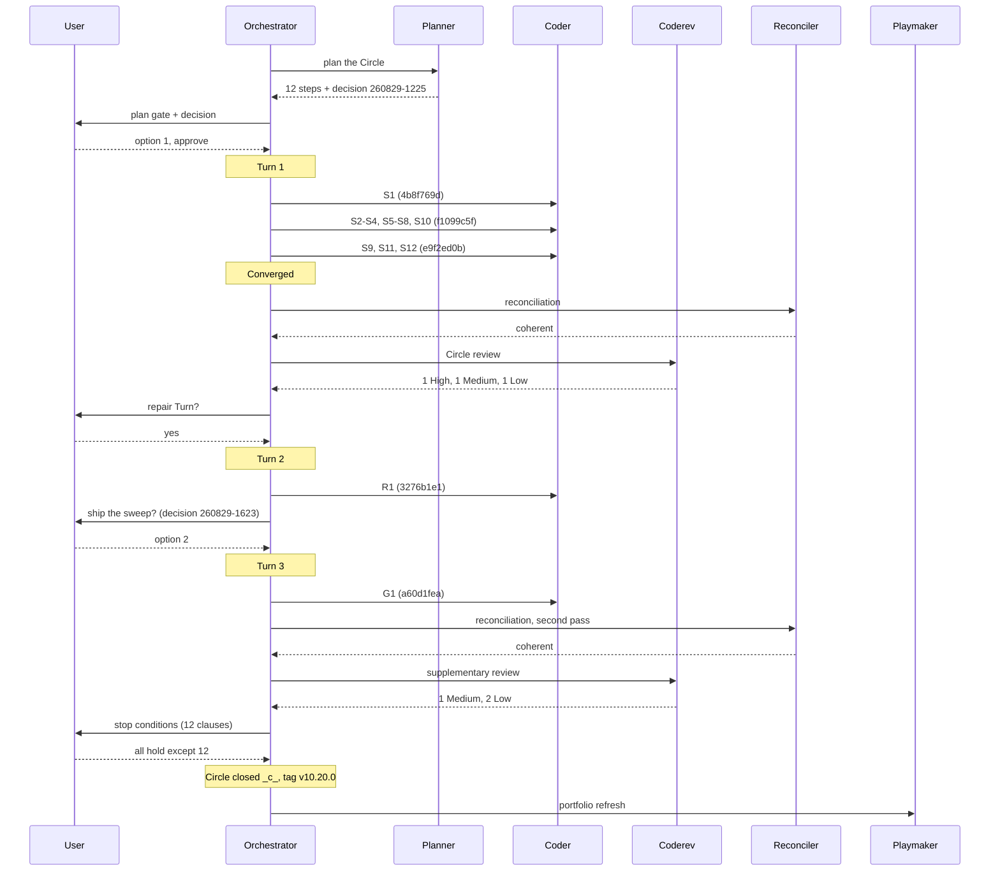

# Orchestrator Session — 260829-1133-orchestrator-session.md

**Filed by:** orchestrator, Kai Stalmann <ks@qantr.com>
**Directive:** See `**Active spec/plan:**` of the Circle record once a plan exists; until then the record's `## Directive` prose: citation form drops the store segment (260828-2342-citation-form-drops-store-segment).
**Mode:** custom (Circle run: shape done, plan next)
**Status:** Complete

## Snapshot at start

- HEAD: f659b04b; Circle activated this session via /fusion:next (record renamed, claim written, pointer set)
- Open issues (shared): 8; open plans: 1 (shared); open decisions (shared): 1; Circle stores empty
- Domain: code (121 source / 10 data files at Setup 260828-0846-orchestrator-session.md; unchanged tree)
- Turn budget: 12

## Log

- Activation committed with the session's first commit.
- S1 done, commit 4b8f769d (895 hook-test lines freed). S2-S4 dispatched as one coder bundle.
- S2-S4 done, uncommitted (commit B pending the sweep): 821 store-prefixed live citations and 112 shipped ones red as planned; sweep dry-run 16283 rewrites in 2115 files. S5-S8 dispatched.
- S5-S8 done, uncommitted: 20 $SCAN_* lines rewritten (plan said 19), lint, uniqueness test, archive filter probe, bin/fusion-citation-check (8227 store-prefixed on this repo before the sweep). S10 dispatched.
- S10 done; commit B f1099c5f: 2240 files, 794 tests green. Sweep not idempotent, filed as an issue in this Circle. S9, S11, S12 dispatched (commit C).
- S9, S11, S12 done; commit C e9f2ed0b. Plan marked Complete/_c_. Turn 1 ends: 12/12 tasks, 3 commits; coherence ok; queue converged. Phase 3 next.

## Coherence
<!-- RECONCILER-OWNED -->

**Verdict:** coherent

**Edges:**
- Artifact↔Grounding: 12 claims verified / 0 drift items / 0 open coderev+ontorev issues (no review filed this session: `bin/fusion-review-coverage --since 66b486e0^` uncovered=4; `npm test` 794 green at e9f2ed0b; one residual filed, `260829-1343_*_fifty-nine-marker-tails-the-sweep-produced-still-stand-in-terminal-records.md`).
- Artifact↔Directive: commits move toward the stated Directive: 4b8f769d (grammar to hooks/lib), f1099c5f (storeless form, gate, sweep, uniqueness test, `$SCAN_*` lint, helper), e9f2ed0b (cleanup verdict line, release texts, record bookkeeping); every Directive clause has a commit and none is orthogonal. The tag precondition (stopping clause 12) is outside the Directive and not yet met.
- Grounding↔Directive: 6 active decisions consistent / 0 conflicting (the five `260828-0904_*` and `260829-1225_*` are now `_i_` and realised as answered; `260815-2109_*_may-a-circle-close-over-an-uncovered-review-range-and-who-decides.md` applies to the uncovered range and leaves the choice to the user).

**Rebalance recommendation:** none
- Phase 3 coherent; Circle review (260829-1345) found 1 High, 1 Medium, 1 Low. User chose a repair Turn (Revise Artifact). Turn 2: R1 dispatched.
- R1 done, commit D 3276b1e1 (42 head fields, 239 tails, 9 filenames repaired; dry-run rewrites=0; 797 tests). Issue filed for the starred shell illustration; decision filed on shipping the sweep. Turn 2 ends.
- Decision 260829-1450 answered option 2. Turn 3: G1 dispatched.
- G1 done, commit E a60d1fea; decision 260829-1623 implemented (_i_). Turn 3 ends; queue converged; Phase 3 re-run.
## Coherence
<!-- RECONCILER-OWNED -->
**Reconciled:** 260829-1805, second pass, HEAD a60d1fea
**Verdict:** coherent
**Edges:**
- Artifact↔Grounding: 14 claims verified (12 plan steps + R1 + G1) / 0 drift items / 1 open coderev issue (`260829-1348_*`, Low, rule text on playmaker; the High and Medium findings closed at `3276b1e1`). Sweep dry-run `rewrites=0`, `bin/fusion-citation-check` `store-prefixed=0`, `npm test` 805 green. Residual: `260829-1623_*_the-sweep-starred-both-markers-of-a-shell-illustration-in-a-terminal-circle-record.md` still open (line 104 of the `260805-2005` record unchanged).
- Artifact↔Directive: commits move toward the stated Directive: `3276b1e1` repairs what the Turn-1 sweep damaged and fixes the grammar's marker slot, `a60d1fea` ships the sweep behind the three guards decision `260829-1623` chose; none orthogonal. Clause 12 (the `v10.20.0` tag) is outside the Directive and still unmet: no tag at HEAD, `bin/fusion-review-coverage --since 66b486e0^` `uncovered=3`.
- Grounding↔Directive: 7 active decisions consistent / 0 conflicting (`260829-1225_*` and `260829-1623_*` `_i_`, the five `260828-0904_*` `_i_`; `260815-2109_*` leaves the uncovered-range choice to the user, as before).
**Rebalance recommendation:** none

## Budget

| Metric | Count |
|--------|-------|
| Turns | 3 (`bin/fusion-events turns`) |
| Tasks resolved | 14 (12 plan steps, R1, G1) |
| Tasks skipped/deferred | 0 |
| Issues created | 10 (`filed issue`, Circle and shared stores) |
| Issues resolved | 8 (`now_c issue`) |
| Decisions answered (`_o_`→`_a_`) | 2 filed this session, both since implemented |
| Decisions implemented (`_a_`→`_i_`) | 7 (`now_i decision`) |
| Commits | 9 (`git rev-list --count f659b04b..HEAD`) |
| Agent errors | 0 |
| Human gates hit | 5 (plan gate, repair Turn, sweep-shipping decision, stop conditions, plus the decision at the plan gate) |

## Per-Turn Log

### Turn 1
- Tasks: S1-S12, all done; commits 4b8f769d (A), f1099c5f (B), e9f2ed0b (C)
- Review findings: Circle review 260829-1345 filed 3 (1 High, 1 Medium, 1 Low)
- Circuit breaker: OK; Coherence: ok

### Turn 2
- Task R1 (repair the sweep damage and the grammar boundary); commit 3276b1e1; 4 issues closed, 1 filed; Coherence: ok

### Turn 3
- Task G1 (bin/fusion-citation-sweep with three guards, idempotency test); commit a60d1fea; decision 260829-1623 implemented; supplementary review 260829-1813 filed 3 (1 Medium, 2 Low); Coherence: ok

## Review coverage

**Range:** `f659b04b..HEAD` — 9 commits
**Covered by:** 260829-1345-coderev-circle-closure-storeless-citation-form.md (66b486e0..e9f2ed0b), 260829-1813-coderev-supplementary-repair-turns-sweep-ships.md (e9f2ed0b..a60d1fea)
**Not covered:** dfd567c4, 66b486e0, 60592fa3, 89f67d66 (workbench bookkeeping only)
**Carried out-of-scope files:** none

## Remaining Work

Open in the closed Circle, for a follow-on: 260829-1348_*_ (playmaker head-field rule text, Low); 260829-1623_*_ (starred shell illustration in a terminal record); 260829-1810_*_ (--repair rewrites two unfenced exhibits, Medium); 260829-1811_*_ (stack trace on a nonexistent extra path, Low); 260829-1812_*_ (three head-field counts in one file, Low); the marker-plus-wildcard double-star defect filed at closure. Shared store: 260827-0410, 260828-0044, 260828-0853, 260828-1041 unchanged.

## Commits

| Hash | Message | Task |
|------|---------|------|
| dfd567c4 | activate the Circle | activation |
| 66b486e0 | plan lands, record cites it, reach decision answered | plan |
| 4b8f769d | grammar moves to hooks/lib | S1 |
| f1099c5f | citation form drops the store segment | S2-S8, S10 |
| e9f2ed0b | v10.20.0, cleanup verdict line, records realised | S9, S11, S12 |
| 3276b1e1 | the sweep repairs what it broke | R1 |
| a60d1fea | the sweep ships behind three guards | G1 |
| 60592fa3, 89f67d66 | Circle closes coherent; closure note | closure |

## Session Flow

## Portfolio update

Playmaker run 260829-1840-playmaker-orchestrator-phase4.md regenerated the portfolio after the closure: 0 anticipated, 0 active, 16 closed, 3 bounded, 1 superseded; recommendation is to shape the backlog entry 260814-1733_*_bounded-executor-dispatches.md; warnings name the six open defects left in this Circle and the checker's dangling=245.
