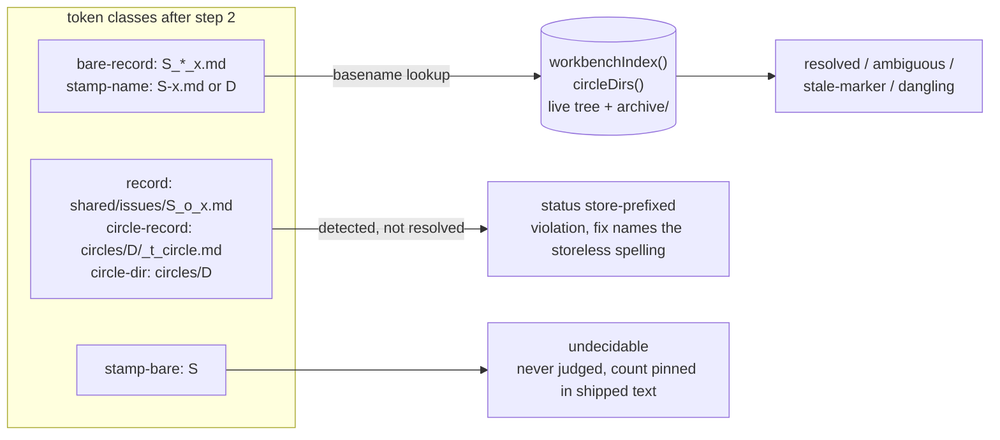
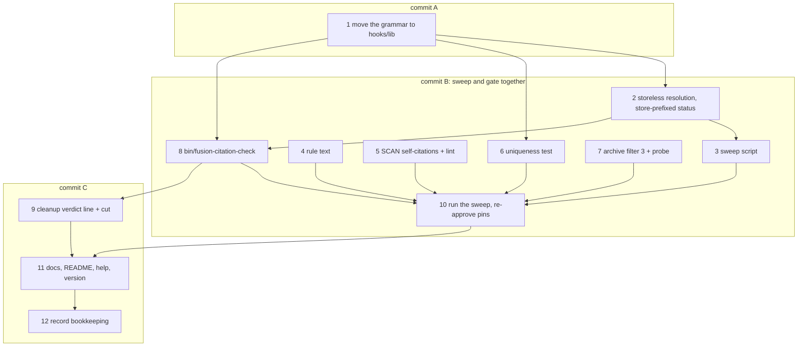

# Implementation Plan: the citation form drops the store segment, and every gate, helper and shipped line reads the storeless form

**Date:** 2026-08-29
**Status:** Complete
**Spec:** none; the Directive is `## Directive` of `260828-2342-citation-form-drops-store-segment`, written by the shaper into the record, and it is not restated here
**Decidability:** Two questions carry the mechanism. *Is a citation token decidable from the text?* Yes for every class the gates judge: a store segment, a marker letter and a slug are literal characters, so "carries a store" is decided by the regex that already tokenises it, and resolution becomes one basename lookup over the whole workbench index with no path arithmetic. The one class that is not decidable stays outside the mechanism: a bare stamp names a minute, not a file. Measured at HEAD `dfd567c4`, the shipped text carries 43 distinct bare stamps; 26 match exactly one stamped artifact or Circle directory and are rewritten mechanically, 14 match two to twelve, and 3 match nothing (two fabricated examples in exempt files and one template value). Those 17 are rewritten by a reader of the sentence, never by the script, and after the sweep the reference-resolution gate pins the residual so a new one is reported rather than guessed. *Is (stamp, slug) unique across live tree and archive?* Yes, measured with the commands in `## Current State`: 721 marked records live and 721 distinct pairs, 1 258 and 1 258 with `archive/`, 977 markerless stamped artifacts and 977 distinct basenames, and 0 collisions over all 2 235 marker-normalised stamped basenames. Step 6 turns that measurement into a test so the answer is re-taken on every run.

## Directive

See the Circle record's `## Directive`. In one sentence: after this Circle, a record is cited as `YYMMDD-HHMM_*_<topic>.md` and nothing in the shipped text or in fusion's own workbench, `archive/` included, cites one any other way; the gates report a store-prefixed citation as a violation instead of resolving it through `archive/`; the shipped `$SCAN_*` self-citations say the record is fusion's own; a uniqueness test pins the claim the form rests on; `bin/fusion-citation-check` reports the same grammar's verdict over a consuming project; and `/fusion:cleanup` prints that verdict.

## Current State

All figures below were measured on 2026-08-29 at HEAD `dfd567c4`. The Circle record's Grounding carries the figures of 2026-08-28; where they differ, the tree moved (a tier-1 sweep on `260829-1110` archived 142 records).

**The grammar.** `hooks/lib/__tests__/helpers/citation-scan.ts` (947 lines) tokenises six kinds: `record` (`REC_RE`, store-prefixed), `circle-record` (`CIRCLE_REC_RE`), `bare-record` (`BARE_RE`, the storeless form with a marker), `circle-dir` (`CIRCLE_RE`), `stamp-name` (`STAMP_RE` with a dashed name) and `stamp-bare`. It resolves against `workbenchIndex()`, a recursive listing of the whole workbench including `archive/`, and against `circleDirs()`, which indexes live and archived Circle directories. Store-anchored resolution goes through `anchoredUnder()` and `unsweep()`, the shape-1 archive tolerance of 2026-08-19; a storeless `bare-record` already resolves by basename alone through `findRecord({ citedBase })`. The file is test-scoped by its own header, excluded from `tsc` (`hooks/tsconfig.json` excludes `lib/__tests__`), so nothing of it ships. Its baseline in `TEST_LINE_BASELINE` is 574 lines.

**The three gates.** `workbench-citation-lint.test.ts` (376 lines) judges Circle records in every state, `_o_` issues, `_o_`/`_a_` decisions, `_o_`/`_p_` plans and `portfolio.md`, excludes `archive/`, `stashes/` and `.migration-v2-backup/` at the root, and carries no baseline. `reference-resolution-lint.test.ts` (990 lines) scans `rules/`, `agents/`, `docs/`, `templates/`, `skills/*/SKILL.md`, `README*.md`, `CLAUDE.md`, the comment lines of `bin/*` shebang scripts, `install.sh`, `hooks/*.ts` and `hooks/lib/*.ts`; it pins `{ paths: 1514, anchors: 213 }` at line 479 and judges class (c) through `GATE_KINDS`, which excludes `stamp-bare`; one case at lines 834-858 asserts an archived Circle directory resolves to its archive path. `portfolio-citation-form-lint.test.ts` holds `agents/playmaker.md` to `_*_`; it reads no store segment and needs no change beyond confirming green.

**What the sweep touches.**

| Surface | Store-prefixed record tokens | Files |
|---|---|---|
| live workbench (`fusion-workbench/` minus `archive/`), `*.md` | 6 842 | 1 308 |
| `fusion-workbench/archive/`, `*.md` | 2 087 | 460 |
| shipped text as the reference-resolution gate defines it | 109 across 40 files (`CLAUDE.md` 9, `rules/circle-records.md` 9, `README-hooks.md` 6, `bin/monitor` 6, the rest one to five each) | 40 |
| `hooks/lib/__tests__/**.ts` | 117 in 21 files, outside the gate's surface, and several are fixtures the tests assert on (`shared/issues/260101-0000_o_foo.md`) | not swept, see `## Approach` |

Command for the first three rows: `grep -rohE '(circles/[0-9]{6}-[0-9]{4}-[a-z0-9-]+/|shared/)(planning|issues|decisions|history|reviews|analyses|investigations|consult|memos|backlog)/[0-9]{6}-[0-9]{4}' <root> --include='*.md' | wc -l`, with `--exclude-dir=archive` for the live row. The live tokens by kind: 1 506 issues with `_*_`, 1 001 issues with a literal `_o_`, 946 history files, 748 decisions with `_*_`, 383 plans with `_*_`, 342 issues with `_c_`, 333 analyses, 267 plans with `_o_`, 261 decisions with `_a_`, 194 with `_o_`, 194 with `_i_`, 190 reviews, 153 issues with no marker, and smaller counts down to 1 issue with `_d_`. 98 live annotation lines (`Answered:` through `Deferred:`) carry a store-prefixed record path.

**The `$SCAN_*` self-citations.** 19 lines at HEAD, not 21: the curator rewrote `rules/fusion-workbench-conventions.md:218` and `rules/review-contract.md:45` in `f659b04b`. Command: `grep -nE '[0-9]{6}-[0-9]{4}.{0,160}(in|under) .\$SCAN_' rules/*.md agents/*.md skills/*/SKILL.md README*.md CLAUDE.md`; hits per file: `agents/orchestrator.md` 14, `skills/archive/SKILL.md` 2, `agents/curator.md` 1, `agents/planner.md` 1, `skills/next/SKILL.md` 1.

**Bare stamps in the shipped text.** 91 tokens over `rules/`, `agents/`, `skills/*/SKILL.md`, `README*.md`, `CLAUDE.md`, `docs/`, of which `agents/orchestrator.md` 25, `CLAUDE.md` 19, `README-hooks.md` 7, `docs/upgrading-to-v10-14.md` 7, `README-agents.md` 6, `rules/circle-records.md` 5, `skills/setup/SKILL.md` 4; 43 distinct stamps, resolvability as in the Decidability line. Command: `grep -noE '(^|[^0-9A-Za-z_/-])[0-9]{6}-[0-9]{4}([^0-9_-]|$)' <files>`.

**The archive safety filter.** `skills/archive/SKILL.md:198-199` builds `bn` from the live basename and runs `grep -r -l -F -e "$bn" -e "$rel"`, so a record cited in the mandated `_*_` form is invisible to it (issue `260828-0901_*_the-archive-safety-filter-greps-the-literal-basename-and-cannot-match-the-wildcard-citation-form-the-rule-mandates.md`, simulation only).

**Growth bounds**, computed with the instrument's own arithmetic over the baseline maps in `surface-growth-bound.test.ts` and `rules-emission-golden.test.ts`:

| Surface | Delta against baseline | Head-room | Free |
|---|---|---|---|
| `agents/*.md` | +6 914 bytes | 18 000 | 11 086 bytes |
| `skills/*/SKILL.md` | +19 907 bytes | 20 000 | 93 bytes |
| hook tests (`hooks/lib/__tests__/**.ts`, lines) | +2 438 | 2 500 | 62 lines |
| always-on rule core (`agent-setup.md`, `fusion-workbench-conventions.md`, `critical-stance.md`) | −345 bytes | 12 000 | 12 345 bytes |

The 433 lines the dispatch named for the hook tests is what the tree had before the last two days' commits; 62 is what it has now, and the coder re-measures before the sweep commit. `helpers/citation-scan.ts` alone stands 373 lines above its baseline entry.

**Helper shape to copy.** `bin/fusion-staging-drift` is a bash wrapper resolving `hooks/dist/staging-drift.js` relative to itself (exit 3 when the build is missing); `hooks/staging-drift.ts` is the entry (usage, `findWorkbenchRoot()`, exit 2 on no workbench, `KEY=value` lines then rows, `verdict=` on stdout and never in the exit code, `exitZeroOnStdoutEpipe()` first). `README-hooks.md` carries one row per `hooks/lib` module (`derivable-enumerations-lint` holds the table equal to the directory) and one per entry point; `CLAUDE.md`'s Layout table carries one row per `bin/` helper (the same lint); `.gitignore` re-includes each helper by name (`committed-dist.test.ts` holds `git ls-files bin/` equal to the listing).

**Open decisions read.** The five `260828-0904_a_*` records are the inputs and are realised by this plan (`_a_` → `_i_` in step 12). `260816-0119_*` and `260823-1414_*` are out of scope per the record. The one decision this plan files is `260829-1225_*_which-path-shaped-tokens-does-the-storeless-form-reach-beyond-a-record-citation.md`; the plan proceeds on its recommendation (option 1) and says at each affected step what changes under option 2.

## Approach

One grammar, moved once and changed once; one script that rewrites through that grammar; one commit that lands the rewrite and the gate together.

- **The grammar becomes a shipped module.** Decision `260828-0904_*_does-fusion-ship-a-citation-checker-to-consuming-projects.md` needs the grammar in `hooks/dist/`, which the test-scoped file cannot provide (an install ships no `node_modules`, so `tsx` is not an option). So `hooks/lib/citation-scan.ts` becomes the home, parameterised by workbench root, and the test helper becomes a thin shim binding fusion's own roots so the existing gate imports do not churn. That move is required by the helper; its side effect on the hook-test budget is named in step 1 rather than left to be noticed.
- **Resolution is a basename lookup.** With no store in a citation there is nothing to anchor: `findRecord` matches the basename over the whole index, `archive/` included, and `anchoredUnder`, `unsweep`, `anchoredAt`, `ARCHIVE_SWEEP_RE` and the `wrong-store` status are deleted. The three store-prefixed token shapes stay in the grammar as detectors and get one new status, `store-prefixed`, which the gates report as a violation with the storeless spelling in the `fix` line. A markerless artifact (history, analysis, review) is cited as `<stamp>-<slug>.md`, the existing `stamp-name` class, which learns to match exactly when the token ends in `.md`. A Circle is cited by its bare directory name, which `stamp-name` already resolves through `circleDirs()`.
- **The sweep is a token rewrite, not a reconciliation.** It rewrites citation strings through the scanner's own token walk and touches nothing else on a line. That is what lets it reach `archive/` and the terminal Circles without contradicting `rules/circle-records.md` `### Worked transitions` ("a terminal Circle's spec and plan are history ... never reconciled in place"): no step mark, criterion, header or content changes, only the spelling of pointers, and the user chose that reach at shaping. The script skips every token the scanner exempts (fenced code, blockquote lines, footer templates, placeholders, fabricated names, globs), because in those places the spelling is the datum. `hooks/lib/__tests__/**.ts` is not swept: it is outside the gate's surface, and its store-prefixed strings are fixtures the tests assert on.
- **The gate change and the sweep land in one commit** (commit B below), because `workbench-citation-lint` has no baseline and either half alone leaves the suite red. Commit A (the move, behaviour-preserving) precedes it; commit C (the helper, the cleanup line, the docs, the version) follows.
- **Budgets are paid by cuts, never by baseline edits.** Skills has 93 bytes; step 9 names the cut that pays for the cleanup verdict line, and step 7 keeps the filter-3 change inside what it deletes. The hook-test surface is paid by step 1's move and step 2's deletions.

## Implementation Steps

Commit boundaries: **A** = step 1. **B** = steps 2 to 8 and 10, one commit. **C** = steps 9, 11, 12. Steps inside B may be worked in parallel where the dependency lines allow, but nothing from B is committed until step 10 reports `npm test` green.

1. [DONE] **Move the grammar to `hooks/lib/citation-scan.ts`, behaviour unchanged**
   - Executor: `coder`
   - Files: `hooks/lib/citation-scan.ts` (new), `hooks/lib/__tests__/helpers/citation-scan.ts` (becomes a shim), `README-hooks.md` (`hooks/lib` table row), `CLAUDE.md` (`bin/fusion-prose-metric` row and `bin/fusion-prose-metric:96`, which cite the helper's old path), `hooks/dist/` (rebuilt)
   - Changes: the grammar, the exemptions, `fencedContentLines`, the index, the token walk, `scanRecordCitations`, `scanCitationTokens`, `scanCorpus`, `partition`, `markdownFilesUnder`, `shippedPrompts` and `agentNames` move into the lib module. The two memoised indexes and every resolver take the workbench root as a parameter; export `createScanner(workbenchRoot)` returning the bound functions, so a caller binds once. The shim keeps `pluginRoot`, `workbenchRoot`, `WORKBENCH_PRESENT` and re-exports the bound functions and the types under their current names; no test import changes. The lib module's header states why it left the test tree (decision `260828-0904_*_does-fusion-ship-a-citation-checker-to-consuming-projects.md`) and drops the "test-scoped on purpose" paragraph. The CLI `main` at the tail moves to step 8's entry point; the shim keeps no CLI. `npm run build`, `npm test` green, `committed-dist` green.
   - Budget note, stated so the next reader does not have to reconstruct it: the shim is roughly 40 lines against a 574-line baseline entry, so this surface's delta falls by about 530 lines. The move is required by the helper; the room it frees is what steps 2, 5, 6, 7 and 8 spend, and no baseline entry is edited.
   - Dependencies: none

2. [DONE] **The grammar resolves storelessly and reports a store segment as a violation**
   - Executor: `coder`
   - Files: `hooks/lib/citation-scan.ts`, `hooks/lib/__tests__/reference-resolution-lint.test.ts`, `hooks/lib/__tests__/workbench-citation-lint.test.ts` (header comment only)
   - Changes: (a) `findRecord` takes only `citedBase` and matches over the whole index; delete `anchoredUnder`, `unsweep`, `anchoredAt`, `ARCHIVE_SWEEP_RE` and their headers, and `circleDirs()`'s archive paragraph shrinks to one sentence (it keeps indexing archive sweeps, because a bare directory name resolves wherever the directory is). (b) A `record`, `circle-record` or `circle-dir` token gets status `store-prefixed`, `problem` naming the segment, `fix` giving the storeless spelling (`<stamp>_*_<slug>.md`, or the bare directory name); `CitationStatus` gains `store-prefixed` and loses `wrong-store`; `scanRecordCitations` and `partition` count it as a violation. (c) `STAMP_RE` admits an optional `.md` and, when present, `stamp-name` matches the basename exactly instead of by prefix. (d) Under decision `260829-1225` option 1 no line-shape exemption is added; under option 2 add one exemption reason, `path-field`, for tokens on a line opening with one of the seven annotation labels or the two head-field labels, resolved as spelled with no archive tolerance. (e) The header's grammar paragraph is rewritten to the storeless form. (f) Tests: delete the archived-Circle-directory case (`reference-resolution-lint.test.ts:834-858`); add cases that a store-prefixed token in each of the three shapes is `store-prefixed`, that a `bare-record` whose only copy sits under `archive/<sweep>/` resolves with no path arithmetic, that `stamp-name` with `.md` matches exactly, and that `GATE_KINDS` is unchanged. Keep the additions under 40 lines; the deletions in (a) are in the lib module and cost the test surface nothing.
   - Dependencies: 1

3. [DONE] **The sweep script, `hooks/scripts/citation-sweep.mjs`**
   - Executor: `coder`
   - Files: `hooks/scripts/citation-sweep.mjs` (new), `hooks/lib/__tests__/citation-sweep.test.ts` (new, under 45 lines)
   - Changes: a one-shot rewriter that imports the compiled grammar from `hooks/dist/lib/citation-scan.js`, so the fixer and the checker share one tokeniser and no second detector exists. Arguments: `--root <workbench-root>` (default: walk up from cwd), `--dry-run`, and an optional list of files or directories to include beyond the workbench. For every `.md` under the workbench (`archive/` included) and every file named, it runs `scanCitationTokens` per line and rewrites, right to left within the line, each hit whose `status` is not `exempt`: `record` → `<stamp>_*_<slug>.md` (any literal marker becomes `_*_`; a token with no marker and no `.md` keeps its tail unchanged after the store is dropped); `circle-record` and `circle-dir` → the bare directory name; `bare-record` with a literal marker → `_*_`; `stamp-bare` → the basename of the one artifact or directory it matches, only when the match count is exactly one, else left and listed. Lines the scanner marks `fenced-code`, `blockquote`, `footer-template`, `announced-illustration`, `placeholder`, `fabricated-name`, `glob` or `record-example-file` are never rewritten. Output: per-file counts, then the residual list (ambiguous and unmatched bare stamps with file and line), then a summary line in `KEY=value` form. `--dry-run` prints the same and writes nothing. It never touches a file outside what was named or the workbench, never rewrites a `.ts` under `hooks/lib/__tests__`, and never edits anything but the token span. The test drives it over a scratch workbench with one fenced token, one blockquote token, one store-prefixed token, one literal-marker token, one unique bare stamp and one ambiguous bare stamp, and asserts exactly the three rewrites and the one residual line.
   - Dependencies: 1, 2

4. [DONE] **The rule text states the form, the violation, the scope of uniqueness, and the reach**
   - Executor: `coder`
   - Files: `rules/fusion-workbench-conventions.md` (`## Filename Patterns`, the paragraph opening "Cite a record by its full filename"), `rules/circle-records.md` (`### Citation form in the portfolio`, `### Citation form in a Circle record's head field`, the paragraph opening "`Active spec/plan:` and `Active session history:` hold workbench-relative paths", the record template's `**Active spec/plan:**` line), `rules/decision-record-examples.md` (the `Cross-references:` and `Superseded by:` examples), `rules/orchestrator-resume.md`, `agents/shaper.md:57`, `agents/orchestrator.md` (`## Circle head fields` rows and Step 0b.2 step 3), `skills/next/SKILL.md:219`, `skills/migrate/SKILL.md:99`
   - Changes: the conventions paragraph says: cite a record by its storeless basename with the marker wildcarded, `YYMMDD-HHMM_*_<topic>.md`; a citation carrying a store segment (`shared/<store>/`, `circles/<dir>/<store>/`, `circles/`) is a violation the gates report; a markerless artifact is cited as `YYMMDD-HHMM-<topic>.md` and a Circle by its directory name; the reader resolves by a workbench-wide lookup, which is correct because no two stamped artifacts share a marker-normalised basename, measured over the live tree and `archive/` at commit `<the sweep commit>` (2 235 basenames, 0 collisions) and pinned by `hooks/lib/__tests__/workbench-citation-lint.test.ts`; the `path:line` sentence gains the clause that on an annotation line the `:line` suffix stays and the path half of a record is its storeless basename. The circle-records paragraphs drop the cross-store argument (a workbench-wide lookup resolves both of its cases), say the two head fields carry the storeless basename, and the consumers named there resolve it with `find "$WORKBENCH" -name '<basename>'`; the resume rule and the three prompts that write the fields say the same in one clause each. The examples file's fabricated records take the storeless form so the worked examples teach it. Under decision `260829-1225` option 2 the circle-records, resume, shaper, orchestrator, next and migrate edits are dropped and the conventions paragraph names the three path-shaped exemptions instead. Measure the always-on core with the golden test after editing; 12 345 bytes are free and this step should cost under 600.
   - Dependencies: none (lands in commit B)

5. [DONE] **The 19 `$SCAN_*` self-citations say the record is fusion's own, and a lint keeps the key away from a stamp**
   - Executor: `coder`
   - Files: `agents/orchestrator.md` (14 lines), `skills/archive/SKILL.md:142,290`, `agents/curator.md:115`, `agents/planner.md:160`, `skills/next/SKILL.md:167`, `hooks/lib/__tests__/reference-resolution-lint.test.ts`
   - Changes: each line names the record in the storeless form and says it is fusion's own (`fusion's own record `<stamp>_*_<slug>.md``), and drops "in `$SCAN_DECISIONS`" / "under `$SCAN_ISSUES`"; where the sentence was "read record X under `$SCAN_*` to settle Y", pull the one-clause substance into the sentence, since a consuming agent cannot open the record. The lint is one `it` in the reference-resolution file, walking the same `surface()`: no line outside a fenced block carries both a `YYMMDD-HHMM` stamp and a `$SCAN_` token, and the failure prints file, line and the storeless rewrite it expects. Under 25 lines. Acceptance is the widened grep in `260828-0907_*` returning nothing, and the lint being the thing that keeps it empty. In `skills/`, keep the rewrite byte-neutral or shorter (the dropped key text is longer than "fusion's own").
   - Dependencies: none (lands in commit B; the lint is green only after this step's rewrites)

6. [DONE] **The uniqueness test**
   - Executor: `coder`
   - Files: `hooks/lib/__tests__/workbench-citation-lint.test.ts`
   - Changes: one `describe` over `markdownFilesUnder(workbenchRoot)` **without** the frozen-store exclusion: every basename matching `^[0-9]{6}-[0-9]{4}(_[a-z]_|-).+\.md$`, marker normalised to `_*_`, must be unique; the failure names every colliding pair with both paths. A second `it` confirms the walk saw `archive/` (at least one path under it), so the scope claim in the rule is what the test measures. Under 30 lines. This is what decision `260828-0904_*_should-the-uniqueness-claim-state-its-scope.md` asked for.
   - Dependencies: 1

7. [DONE] **The archive safety filter matches the storeless form, and a probe pins it**
   - Executor: `coder`
   - Files: `skills/archive/SKILL.md:198-199`, `hooks/lib/__tests__/archive-filter-key.test.ts` (new, under 40 lines)
   - Changes: derive one search key from the candidate's basename, escaped for `grep -E`, with the marker position generalised: `key="$(printf '%s' "$bn" | sed -E 's/[][\\.^$*+?(){}|]/\\&/g; s/^([0-9]{6}-[0-9]{4})_[a-z]_/\1_[a-z*]_/')"`, then `grep -r -l -E -e "$key" "$@"`. Drop `-e "$rel"`: the basename key is a substring of every store-prefixed spelling, so the old form is still matched in a consumer that has not swept, and a Circle-directory candidate (no marker) escapes to a literal. The probe test extracts the `key=` derivation from the skill body by regex, runs it through `bash` on `260811-1534_i_foo.md`, and asserts the printed regex matches `260811-1534_*_foo.md` and `260811-1534_c_foo.md` and not `260811-1535_i_foo.md`, so the skill's own text is what is tested. Keep the skill edit at or under the bytes it replaces (the two-key form is longer than the one-key form).
   - Dependencies: none (lands in commit B)

8. [DONE] **`bin/fusion-citation-check`**
   - Executor: `coder`
   - Files: `bin/fusion-citation-check` (new), `hooks/citation-check.ts` (new), `.gitignore` (`!bin/fusion-citation-check`), `CLAUDE.md` (Layout row), `README-hooks.md` (entry-point row), `hooks/lib/__tests__/fusion-citation-check.test.ts` (new, under 70 lines)
   - Changes: the wrapper is `bin/fusion-staging-drift` with the name changed. The entry: `findWorkbenchRoot()` (exit 2 with a stderr line when none); corpus = every `.md` under the workbench except `archive/`, `stashes/`, `.migration-v2-backup/`, plus, at the directory the workbench root names, `CLAUDE.md`, `rules/*.md`, `.claude/rules/*.md`, `docs/**/*.md` where present; `createScanner(workbenchRoot)` from step 1; output on stdout: `anchor=workbench-root`, `root=<dir>`, `files=`, `tokens=`, `judged=`, `resolved=`, `dangling=`, `store-prefixed=`, `undecidable=`, `exempt=`, `verdict=clean|violations` (violations = dangling + stale-marker + store-prefixed > 0), then one row per violation `<file>:<line>  '<token>'  <status>  <problem>` and, behind `--undecidable`, one per bare stamp. No `--fix`; the sweep script is the rewriter and the docs name it. Exit 0 whenever the check ran; the verdict never reaches the exit code (the rule `bin/fusion-review-coverage` and `bin/fusion-staging-drift` carry). Header carries the usage block, the corpus, the exit table and the sentence that it decides nothing per line about pointer versus statement (fencing does). Tests spawn the built entry over a scratch project with a workbench and a `rules/` file, and assert the corpus rows, the verdict on one store-prefixed token, and exit 2 outside a workbench. The `CLAUDE.md` row summarises the header and names the one-release-behind cost.
   - Dependencies: 1, 2

9. [DONE] **`/fusion:cleanup` prints the verdict line, paid for by one cut**
   - Executor: `coder`
   - Files: `skills/cleanup/SKILL.md` (Step 8 report, Step 3 bullet at line 164)
   - Changes: Step 8 gains one bullet, `Citations: <verdict line>`, produced by `[ -x "$FUSION_PLUGIN_ROOT/bin/fusion-citation-check" ] && "$FUSION_PLUGIN_ROOT/bin/fusion-citation-check" | grep -E '^(verdict|store-prefixed|dangling)='`, else `citations: helper-missing`. The cut that pays for it: the Step 3 domain bullet (845 bytes) keeps its first two sentences and drops the account of how `domain-cascade.test.ts` and the README block once disagreed, which is spent reasoning of the kind the C3 cut removed from `skills/setup/SKILL.md` on 2026-08-24. Measure `skills/` with the growth-bound golden before and after; the surface must end at or below where it started plus 93 bytes, and the coder reports both numbers.
   - Dependencies: 8

10. [DONE] **Run the sweep, hand-finish the residual, re-approve the pins, and commit B**
    - Executor: `coder`
    - Files: every file the sweep rewrites (the workbench, `archive/` included; the shipped surface: `rules/`, `agents/`, `skills/*/SKILL.md`, `README*.md`, `CLAUDE.md`, `docs/`, `templates/`, the comment lines of `bin/*`, `install.sh`, `hooks/*.ts`, `hooks/lib/*.ts`), `hooks/lib/__tests__/reference-resolution-lint.test.ts` (line 479 and a new `stampBare` pin), `hooks/lib/__tests__/fixtures/*.golden`
    - Changes: run `node hooks/scripts/citation-sweep.mjs --dry-run` with the shipped surface named, read the census, then run it for real. Hand-rewrite the residual: the 14 ambiguous shipped stamps by reading each sentence (the surrounding words say whether a decision, a session log or a Circle is meant), and the workbench residual only where the citing record is live (a bare stamp in a terminal record stays bare: a rewrite there would be an act of interpretation, which the terminal-states statement forbids). Then: `cd hooks && npx tsx lib/__tests__/helpers/citation-scan.ts` over the workbench and over the shipped surface reports `dangling ... store-prefixed=0`; the widened `$SCAN_*` grep returns nothing; `npm test` is red only on the reference-resolution pin, which is re-approved on line 479 with the measured shares (the storeless rewrite moves `paths` where a `circles/<dir>/...` token stops counting as a path; the bare-stamp rewrite moves the record count) and gains `stampBare: <residual>` so a new bare stamp in the shipped text moves a pin; the four growth goldens are regenerated and no baseline map is edited. Commit B carries steps 2 to 8 and this step, with the commit message naming the sweep's counts from the script's summary line.
    - Dependencies: 2, 3, 4, 5, 6, 7, 8

11. [DONE] **Release texts and version**
    - Executor: `coder`
    - Files: `docs/upgrading-to-v10-20.md` (new), `README.md` (`## Install`, one paragraph, the oldest of the three rotated out), `skills/help/SKILL.md` (update topic, one paragraph in and the oldest out, byte-neutral or shorter), `.claude-plugin/plugin.json` (`10.20.0`)
    - Changes: the note says what a consuming project meets: the storeless form, the helper and its verdict in the cleanup report, that nothing is rewritten in the project by fusion, and that a project which wants its own corpus swept runs `node "$FUSION_PLUGIN_ROOT/hooks/scripts/citation-sweep.mjs" --dry-run` first and reads the census. It names the one-release-behind cost: the helper is absent from an installed copy until `fusion --update`, and the cleanup line prints `helper-missing` until then.
    - Dependencies: 8, 9, 10

12. [DONE] **Bookkeeping of the records this Circle realises**
    - Executor: `coder`
    - Files: the five `shared/decisions/260828-0904_a_*` records (`Implemented:` line, rename to `_i_`), `shared/issues/260828-0900_o_*`, `260828-0901_o_*`, `260828-0907_o_*` (`Resolved:` line, rename to `_c_`), `shared/issues/260828-0828_o_*` (`Resolved:` line citing the five implementations and the two fixes, rename to `_c_`), `circles/260828-2342-citation-form-drops-store-segment/decisions/260829-1225_o_*` (`Implemented:` line once the user has answered it; the answer is recorded by the orchestrator at the gate)
    - Changes: each annotation line in the storeless form the rule now mandates, citing commit B or C. A renamed record leaves the workbench gate's corpus; the citations of it elsewhere already carry `_*_` after step 10.
    - Dependencies: 10, 11

Coherence check on the DAG: every edge is a dependency a step declares and every declared dependency is an edge; step 8 is drawn in B because the gate commit ships the grammar the helper compiles against, though it could also land in C without affecting the gate. No cycles; the layering is A, B, C top-down.

## Where this Circle stops

- `hooks/lib/citation-scan.ts` exists, compiles into `hooks/dist/lib/`, and `hooks/lib/__tests__/helpers/citation-scan.ts` is a shim that adds no grammar of its own.
- `npm test` is green at commit B's HEAD with `workbench-citation-lint`, `reference-resolution-lint` and `portfolio-citation-form-lint` all reporting a store-prefixed token as a violation, and `npx tsx lib/__tests__/helpers/citation-scan.ts` reports `store-prefixed=0` over the workbench, `archive/` included, and over the shipped surface.
- `rules/fusion-workbench-conventions.md` `## Filename Patterns` states the storeless form, states that a store segment is a violation, and states the uniqueness scope (live tree and archive) with the commit it was measured at; the uniqueness test in `workbench-citation-lint.test.ts` walks `archive/`.
- The widened grep `grep -nE '[0-9]{6}-[0-9]{4}.{0,160}(in|under) .\$SCAN_' rules/*.md agents/*.md skills/*/SKILL.md README*.md CLAUDE.md` returns nothing, and a test fails when a stamp and `$SCAN_` share a line in the shipped surface.
- `reference-resolution-lint.test.ts` pins the count of bare stamps in the shipped text, and the count at commit B is the residual the hand pass could not resolve, each one listed in the commit message.
- `skills/archive/SKILL.md` filter 3 keeps a candidate cited in `_*_` form, and `archive-filter-key.test.ts` proves it from the skill's own text.
- `bin/fusion-citation-check` prints a `verdict=` line over a scratch consuming project in its test, and `/fusion:cleanup` Step 8 prints that line or `helper-missing`.
- Every growth bound is green with no baseline map edited; the `skills/` surface ends at or under its starting size plus 93 bytes, and both numbers are in commit C's message.
- Decision `260829-1225_*` has been answered by the user at the plan gate, and the gate change follows the answer (option 1 as planned, or the option-2 exemption in step 2).
- The five `260828-0904_*` decisions carry `Implemented:` and the `_i_` marker; issues `260828-0828_*_fusion-citation-bookkeeping-defect-report.md`, `260828-0900_*_twelve-shipped-lines-tell-a-consuming-agent-that-one-of-fusions-own-records-sits-in-its-scan-store.md`, `260828-0901_*_the-archive-safety-filter-greps-the-literal-basename-and-cannot-match-the-wildcard-citation-form-the-rule-mandates.md`, `260828-0907_*` carry `Resolved:` and `_c_`.
- Precondition for the `v10.20.0` tag: `bin/fusion-review-coverage --since v10.19.2` has been run and its result stated in the release commit, per `CLAUDE.md` `## Release process` step 0; the proof run of `bin/fusion-citation-check` through a `[ -x ]` call site belongs to the next session after `fusion --update`, and the closure note says so rather than claiming it.

## Data Structures

`CitationStatus` in `hooks/lib/citation-scan.ts`: `resolved | ambiguous | stale-marker | store-prefixed | dangling | exempt | unresolved-no-workbench` (`wrong-store` removed). `createScanner(workbenchRoot: string)` returns `{ workbenchIndex, circleDirs, scanCitationTokens, scanRecordCitations, scanCorpus, partition }`. `BASELINE` in `reference-resolution-lint.test.ts` becomes `{ paths, anchors, stampBare }`.

## API Changes

New CLI `bin/fusion-citation-check` (stdout `KEY=value` block and violation rows; exit 0 ran, 1 usage, 2 no workbench, 3 build missing). New one-shot `hooks/scripts/citation-sweep.mjs` (`--root`, `--dry-run`, paths). The test shim's exports keep their names.

## Testing Strategy

Each step names its test. The order of proof at commit B: the scanner CLI over both corpora reports zero store-prefixed tokens; the three gates green; the growth goldens regenerated with no baseline edit; the `$SCAN_*` grep empty. At commit C: the helper's own test, the cleanup body's `[ -x ]` branch exercised by hand in this repository (the installed copy lacks the helper until `fusion --update`, so the `helper-missing` branch is what this session can see, and that is recorded rather than worked around).

## Risks & Mitigations

| Risk | Mitigation |
|------|------------|
| The sweep rewrites a token that was a statement about a citation rather than a pointer (the class `260820-0530_*` closed by fencing) | The script rewrites nothing the scanner marks `exempt`; the dry-run census is read before the real run; the conventions already require such statements to be fenced or to name file and line |
| A bare stamp that names a session log is "resolved" to the wrong artifact because one other file happens to share the minute | The script rewrites only on a match count of exactly one across artifacts and Circle directories; the 14 ambiguous shipped stamps go through a reader; workbench residuals in terminal records stay bare |
| The hook-test budget is spent before step 8's tests land | Step 1 is measured first; if the freed room is under what steps 2 to 8 need, the coder rolls the pin re-approval prose of `reference-resolution-lint.test.ts:479` into a `shared/analyses/` entry (the mechanism decision `260822-1229_*_where-does-the-reference-resolution-pins-re-approval-attribution-log-live.md` option 2 established) before adding a line |
| `skills/` goes over its bound on step 9 | The cut is named and measured in the same step; if it is short, the second candidate is `skills/archive/SKILL.md:290`'s decision citation, which shrinks under the storeless form |
| Commit B is large (about 1 800 files) and a concurrent session's commit lands between the dry run and the real run | The sweep is re-run after any pull; it is idempotent, and the scanner CLI's `store-prefixed=0` is the check that it finished |
| A consumer's cleanup prints `helper-missing` for one release | Stated in the docs note and the CLAUDE.md row; it is the standing cost of every `bin/` helper (`260825-1329_*_every-session-runs-one-release-behind-on-a-bin-helper-the-same-repository-just-added.md`) |
| The reference-resolution pin moves by a number nobody measured | Step 10 measures shares by single-file revert as every prior re-approval did, and the line names them |

## Open Questions

- [ ] Decision `260829-1225_*_which-path-shaped-tokens-does-the-storeless-form-reach-beyond-a-record-citation.md`: whether Circle-directory citations, the two head fields and the annotation lines take the storeless form (recommended) or are exempted by line shape. Steps 2 and 4 say what changes under each answer; nothing else moves.
- [ ] Whether the residual bare-stamp pin should be zero at commit B. The plan pins whatever the hand pass leaves and lists each one; if the user wants zero, the coder replaces each residual with the plain words ("a decision of 2026-08-27") rather than a citation.

## Reconciliation Log

**260829-1343, reconciler (domain code), HEAD e9f2ed0b.** All twelve steps verified against the tree; `Status: Complete` and the `_c_` marker stand. Evidence: `hooks/lib/citation-scan.ts` and `hooks/dist/lib/citation-scan.js` exist, the test shim is 52 lines (step 1, `4b8f769d`); `bin/fusion-citation-check` on this repo prints `store-prefixed=0` (steps 2, 8, 10); `hooks/scripts/citation-sweep.mjs` and its test exist (step 3); `rules/fusion-workbench-conventions.md` `## Filename Patterns` states form, violation and scope, measured at `4b8f769d` (step 4; commit B's message says `dfd567c4`, the same workbench tree, commit A touched only `hooks/`); the widened `$SCAN_*` grep returns nothing and `reference-resolution-lint.test.ts:542` pins it (step 5); `workbench-citation-lint.test.ts:313` walks `archive/` (step 6); `skills/archive/SKILL.md` filter 3 carries the `_[a-z*]_` key and `archive-filter-key.test.ts` exists (step 7); `skills/cleanup/SKILL.md:221` prints the verdict line and commit C's message carries both `skills/` numbers, 240 365 -> 239 859 against 240 439 (step 9); `BASELINE` at `reference-resolution-lint.test.ts:480` carries `stampBare: 12` and commit B's message names the twelve (step 10); `plugin.json` 10.20.0, `docs/upgrading-to-v10-20.md` (step 11); five `shared/decisions/260828-0904_i_*`, four `shared/issues/260828-0*_c_*` and the Circle's `260829-1225_i_*` carry their annotation lines citing `f1099c5f` (step 12). `npm test`: 47 files, 794 tests green at HEAD, no baseline map edited in the session range.

Stopping clauses, per clause, for the user: clauses 1 to 11 hold on the evidence above. Clause 12 (precondition for the `v10.20.0` tag) is not yet met: no tag points at HEAD (`git tag --points-at HEAD` empty, latest `v10.19.2`), and `bin/fusion-review-coverage --since 66b486e0^` reports `uncovered=4` over the session's four commits with no review filed in this Circle; the release commit states no coverage result. The Circle's Grounding cites `260815-2109_*_may-a-circle-close-over-an-uncovered-review-range-and-who-decides.md` (option 1: the user decides).

Divergence noted, not drift: the risk table calls the sweep idempotent; it is not (issue `260829-1333_*_the-citation-sweep-is-not-idempotent-a-truncated-citation-gains-a-marker-tail-on-rewrite.md`, and a dry run over the swept tree at HEAD still offers `rewrites=208`). The `$SCAN_*` count was 19 in `## Current State` and 20 rewritten (commit B message); the acceptance criterion is the empty grep, which holds.

**260829-1805, reconciler (domain code), second pass, HEAD a60d1fea.** All twelve steps still `[DONE]`; `Status: Complete` and `_c_` stand. Divergence from the step text, not from the Directive: step 3's `hooks/scripts/citation-sweep.mjs` no longer exists; commit `a60d1fea` retired it into `hooks/citation-sweep.ts` (compiled to `hooks/dist/citation-sweep.js`) behind `bin/fusion-citation-sweep`, per decision `260829-1623_*_does-fusion-ship-the-citation-sweep-or-only-the-checker-and-under-which-guards.md` (option 2, `_i_`). The risk-table claim that the sweep is idempotent is true at this HEAD: `bin/fusion-citation-sweep` dry-run over the swept tree prints `rewrites=0` (was 208 at `e9f2ed0b`), and `hooks/lib/__tests__/citation-sweep.test.ts:124` pins it. `npm test` 805 green at `a60d1fea`. Stopping clauses, per clause: 1 to 11 hold (clause 1 now reads through `hooks/citation-sweep.ts` rather than the retired script; clause 2 `store-prefixed=0` re-confirmed by `bin/fusion-citation-check`). Clause 12 (precondition for the `v10.20.0` tag) still not met: `git tag --points-at HEAD` empty, latest `v10.19.2`; `bin/fusion-review-coverage --since 66b486e0^` reports `commits=6 uncovered=3` (the Circle review `260829-1345-coderev-circle-closure-storeless-citation-form.md` covers `66b486e0..e9f2ed0b`; `3276b1e1` and `a60d1fea` have no review). The choice rests with the user per `260815-2109_*_may-a-circle-close-over-an-uncovered-review-range-and-who-decides.md`.
