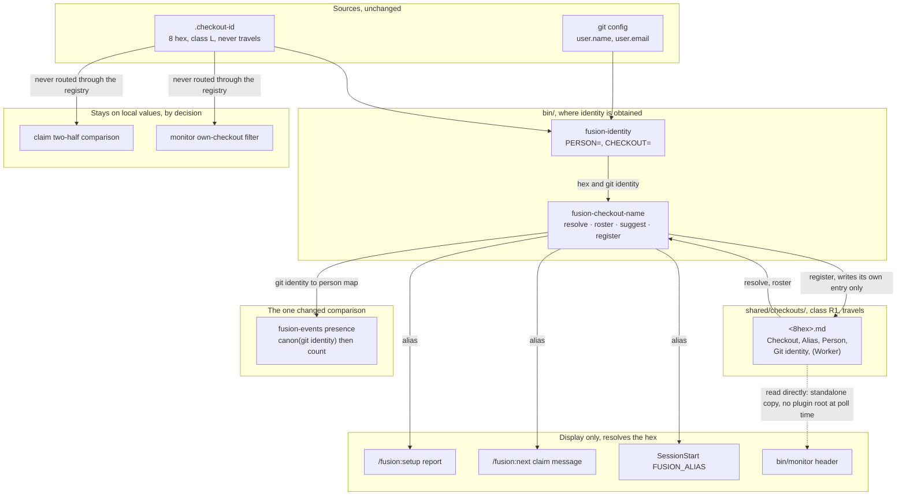
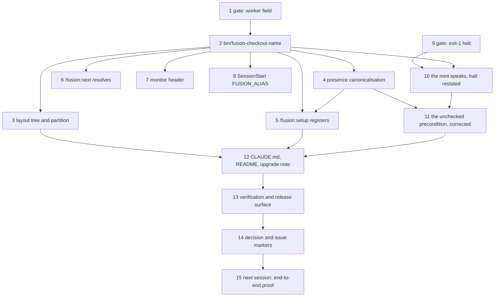

# Implementation Plan: the checkout registry names each instance, and one person's identities count as one

**Date:** 2026-09-04
**Status:** Draft
**Spec:** none; the Directive is `## Directive` of `260904-1619-tracked-checkout-registry-names-each-instance`, written by the shaper into the record, and it is not restated here
**Decidability:** Two questions carry the mechanism, and they have opposite answers. *Given two event lines, is this one person or two?* Decidable, from a table a human wrote: each registry entry states one git identity and the person who claims it, so the classification becomes `canon(g) = map[g] ?? g` over the git identities the log carries, and `other_people` is the size of the set of canonical values rather than of raw strings. The function is total over every input the log can hold, and on an empty map it is the identity function, so a project with no entries gets the figures HEAD gives, from the same code path rather than from a fallback branch. *Did this checkout previously hold a different identifier?* **Not decidable**, and the plan says so rather than answering it. After `git clean -xdf` no local file distinguishes a first mint from a re-mint, and no tracked surface says which of the identifiers it carries belonged to this tree; the registry entry does not help, because the pointer that named it is the file that was deleted. So the repair changes mechanism instead of strengthening the claim: the mint stops being silent and reports two facts that *are* decidable, that the file did not exist before this call, and how many other checkout identifiers this workbench already carries, leaving the inference to the human whose tree it is. Step 10's acceptance criterion is that stated outcome and not a detection.

## Directive

See the Circle record's `## Directive`. In one sentence: after this Circle a registered checkout carries a name a reader recognises instead of eight hex characters, one person's several git identities count as one person wherever fusion reports presence, and neither costs a migration, a rewritten record, or a halt that does not exist today.

## Current State

Measured 2026-09-04 at HEAD `8437e365`, in this checkout (`5e8248d7`, `Kai Stalmann <ks@qantr.com>`). The Circle record's Grounding snapshot carries the code sites; the figures below are the budgets and the shapes the steps have to fit into, which it does not.

**The one comparison that changes.** `hooks/lib/events-query.ts` classifies a party by `line.person === identity.person` (lines 260-266), adds a `person` party to a `Set` keyed on that string (line 293), and reports the set's size as `otherPeople` (line 304). The module is a pure function of the log text, the reading identity and the current time, stated in its own header as the property that lets every case be a fixture string. `bin/fusion-events` obtains the identity in the wrapper and passes it in through `FUSION_EVENTS_PERSON` / `FUSION_EVENTS_CHECKOUT`, with an early `exec` when the SessionStart export already resolved both halves.

**The five display sites.** `/fusion:next` Step 6.1 (`skills/next/SKILL.md:202` and the paragraph around it), `/fusion:setup` Step 0c's presence line (`skills/setup/SKILL.md:152-155`) and Step 0i's identity report (`:336-345`), `bin/monitor`'s header, and the SessionStart identity export, which is the fifth command in `hooks/hooks.json` and today seds `PERSON=` and `CHECKOUT=` out of one `bin/fusion-identity` run.

**Two comparisons that must not move**, each already argued in the record: the claim's two-half test in `/fusion:next` and `/fusion:setup` Step 0i, and `bin/monitor`'s own-checkout filter (`bin/monitor:1350-1357`, reading `_read_checkout_id()`). Both read values the checkout holds locally, and routing either through a pulled file makes it answer differently before and after a fetch.

**Growth bounds**, computed with the instrument's own arithmetic (`hooks/lib/__tests__/helpers/growth-bound.ts`: total of current sizes against the sum of baseline entries, plus head-room):

| Surface | Delta against baseline | Head-room | Free |
|---|---|---|---|
| always-on rule core | −7 115 bytes | 12 000 | 19 115 bytes |
| `agents/*.md` | +8 798 bytes | 18 000 | 9 202 bytes |
| `skills/*/SKILL.md` | +19 394 bytes | 20 000 | **606 bytes** |
| hook tests (`hooks/lib/__tests__/**.ts`, lines) | +2 052 | 2 500 | **448 lines** |

Two of the four are tight, and both are surfaces this plan adds to. Within `skills/`, `setup/SKILL.md` is +11 254 bytes against its baseline, the largest grown file on that surface, so the instrument's own rule ("cut where the growth is") points at the file this plan is about to grow. Step 5 carries the budget as an acceptance criterion and names how it is paid.

**Gates a new `bin/` helper trips.** `.gitignore` excludes `bin/*` and re-includes each helper by name (lines 28-47); `committed-dist.test.ts:321` holds `git ls-files bin/` equal to the directory listing. `CLAUDE.md`'s Layout table carries one row per helper. `reference-resolution-lint` scans the comment lines of `bin/*` shebang scripts, so every citation in the new header has to resolve in the storeless form. No `bin/` helper is inside any growth bound.

**What the resolver is not asked for.** `bin/fusion-paths` gains no key. Its key set is derived by grepping the consumer's own prompt, and no agent prompt and no skill body will name the new store: the helper is the only namer, exactly as `bin/fusion-identity` and `bin/monitor` are the only namers of `.checkout-id` today. `path-literal-lint.test.ts` therefore stays green without an entry in `DEFINITION_SITES`.

**Open decisions read.** The two the record scopes into this Circle are steps 1 and 9 and are answered by the user at those steps, not by this plan. `260904-1058_*_does-fusion-gain-a-tracked-checkout-registry-and-in-which-shape.md` and `260904-1058_*_is-the-checkout-alias-the-identifier-or-an-attribute-of-the-minted-one.md` are answered and are realised here, moving `_a_` to `_i_` at step 14. One decision this plan files is `260904-1651_*_may-a-project-declare-that-it-does-not-want-a-checkout-registry.md`; the plan proceeds on its option 1 and step 5 says what changes under option 2.

## Approach

One store, one program that reads and writes it, and every other surface asking that program rather than parsing an entry for itself.

- **The store is `fusion-workbench/shared/checkouts/`, one file per checkout named `<8hex>.md`, class R1.** It travels in git like every other record store, it has one writer per file by construction, and it needs no merge driver, no lock and no exception in the four-class partition.
- **The entry is an ordinary fusion record head-field block.** Fields are `**Checkout:**`, `**Alias:**`, `**Person:**`, `**Git identity:**`, `**Registered:**`, `**Refreshed:**`, and, under step 1's answer, `**Worker:**`. First occurrence of a key wins, an absent field is absent rather than empty. The grammar is one anchored regex in bash, in TypeScript and in Python, and it is authored once, in the new helper's own header, which is where this project documents a `bin/` program.
- **`bin/fusion-checkout-name` is the store's only writer and its principal reader.** Four subcommands, each answering one question: `resolve <hex>`, `roster`, `suggest [<hex>]`, `register`. Skill bodies, `bin/fusion-events` and the SessionStart export all go through it, which keeps the grammar, the collision rule and the refresh semantics in one place and keeps the additions to the two tight surfaces small.
- **The presence correction is a canonicalisation, not a branch.** `bin/fusion-events` passes the roster in as it already passes the identity in, `hooks/events-query.ts` parses it into a git-identity-to-person map, and `hooks/lib/events-query.ts` applies `canon()` to both sides of the comparison it already makes. The module stays a pure function. An empty map makes `canon` the identity function, so the no-registry case runs the same code and returns HEAD's figures.
- **The join column for aggregation is the git identity, not the hex.** The hex is the key of the entry and the key of every display lookup, which is what the answered decision fixed. Person aggregation joins on the git identity because that is the field an *unregistered* line also carries: joining on the hex would leave an unregistered checkout of the reading person, which today classifies as a further checkout of your own, classifying as another person. That regression is the reason the join column is stated here rather than assumed.
- **No alias reaches an event line.** The `party=` report line gains a sixth TAB-separated field carrying the alias or `-`, which is a rendering of a report and not a write to `orchestrator-events.jsonl`. A consumer reading five fields is unaffected.
- **The `git clean` repair is a spoken mint, not a detection.** Step 10 makes the mint report itself and report how many other checkout identifiers the workbench already holds. Nothing halts, no exit code moves.
- **Two operating constraints shape the order rather than surprising it.** A `bin/` helper added in this session is absent from `$FUSION_PLUGIN_ROOT` until `fusion --update`, so every `[ -x ]` call site takes its miss branch for the rest of this session; steps 5, 6 and 8 are therefore proven by unit test and by direct invocation from the work tree, and their end-to-end proof is step 15, which belongs to the next session (`260825-1329_*_every-session-runs-one-release-behind-on-a-bin-helper-the-same-repository-just-added.md`). And the two tight growth bounds are paid inside the steps that spend them, never by editing a baseline.

### The mechanism

Three readings of that graph, stated because the coherence check rewards a graph with fewer edges and this one keeps three on purpose. **The cycle between `NAME` and `ENTRY` is intentional**: one program is the store's only writer and its principal reader, which is what keeps the entry grammar, the collision rule and the refresh semantics from being implemented twice. **`NAME`'s fan-out of five is the design and not a god-node**: resolution is one operation asked by five callers, and the alternative measured in the analysis is five parsers of one file format. **The dotted edge runs against the grain and is the one concession**: `bin/monitor` is a verbatim copy served out of the workbench with no reliable `$FUSION_PLUGIN_ROOT` at poll time, and it already reads `.checkout-id` directly for the same reason, so it reads one field from one file and cites the helper header for the grammar.

### Step dependencies

Commit boundaries: **A** = steps 2 and 3. **B** = steps 4 to 8. **C** = steps 10 and 11. **D** = steps 12, 13 and 14. Steps 1 and 9 write only a decision record and land with the commit that follows them.

## Implementation Steps

1. **Gate: does a registry entry carry hostname, account name and folder path?**
   - Executor: `analyst`
   - **Human gate:** yes, and the gate is the decision record's own option set rather than the Proceed / Skip / Defer / Modify pattern, because the options are already written and the answer decides an interface rather than whether to run a task. Put `260904-1058_*_does-a-registry-entry-carry-hostname-account-name-and-folder-path.md` to the user as it stands: its four options, its recommendation of option 2, and the three values measured in this checkout that option 2 would publish (`k1i9`, `k1`, `/Users/k1/Projects/productive/fusion`). Do not compose a fifth option.
   - Files: this Circle's copy of `260904-1058_*_does-a-registry-entry-carry-hostname-account-name-and-folder-path.md`, renamed from `_o_` to `_a_`
   - Changes: record the user's answer verbatim, with the `Answered:` annotation citing this session's history file and the Turn it was given in. Add one sentence stating what step 2 must therefore do: option 1, no `**Worker:**` field and no `--worker` flag exist; option 2, the field and the flag exist, `register` never writes it unless the flag is given, and step 5's question offers it once with the three values named; option 3, the field is written by default from `hostname`, `$USER` and the workbench root, and step 5's question offers to leave it out; option 4, `register` writes the field as a hash of the triple.
   - Acceptance: `ls` shows the record under `_a_`, its `Answered:` line names a history file that exists, and the added sentence names exactly one of the four options. If the user defers, the record is renamed `_d_` and step 2 proceeds under option 1, which is the only answer that requires nothing.
   - Dependencies: none

2. **`bin/fusion-checkout-name`, the registry's only writer and principal reader**
   - Executor: `coder`
   - Files: `bin/fusion-checkout-name` (new, bash, executable), `hooks/lib/__tests__/fusion-checkout-name.test.ts` (new), `.gitignore` (one `!bin/fusion-checkout-name` line), `CLAUDE.md` (one Layout-table row)
   - Changes: a self-contained bash program in the shape of `bin/fusion-identity` and `bin/fusion-cadence-anchor`. It resolves the workbench through its sibling `bin/fusion-workbench-root` and this checkout's hex through its sibling `bin/fusion-identity`; it never calls back into anything that calls it. Store: `<workbench>/shared/checkouts/<8hex>.md`, created on first `register` and never otherwise. Subcommands:
     - `resolve <8hex>` prints `alias=`, `person=`, `git_identity=` and, where present, `worker=`, one `KEY=value` line each, omitting a line whose field the entry does not carry.
     - `roster` prints `entries=<n>` and one `entry=` line per file, TAB-separated: hex, alias, person, git identity. Fields are flattened the way `renderParty` flattens, every control character to one space, for the reason stated there.
     - `suggest [<8hex>]` prints `suggested_alias=<word>-<word>`, derived deterministically from the hex over two short word lists carried in the script, so the same checkout is offered the same name on every run and the default needs no randomness to test around. With no argument it uses this checkout's hex.
     - `register [--alias A] [--person P] [--worker W]` writes or refreshes this checkout's own entry and no other. On a first write it sets every field it has and stamps `**Registered:**`. On a refresh it rewrites `**Git identity:**` and `**Refreshed:**` unconditionally and the other fields only where a flag was given, so a changed git configuration is picked up while the person and the alias stand. It prints `entry=<workbench-relative path>`, `action=created|refreshed`, and one `collision=<hex>` line per *other* entry holding the same alias. It reports a collision and never renames, because a checkout that has not pulled cannot see an entry that has not been pushed, so enforcement is not available and the claim field's stated limit is the precedent: detected, not prevented. `--worker` exists only under step 1's answer.
   - The header is the authoritative documentation, as every other `bin/` helper's is: the usage block, the exit-code table, the entry grammar with a worked example, why the alias is an attribute and never the key, why a collision is reported rather than enforced, and why a resolution failure is never a substituted value. The exit table is disjoint and complete over the outcome space: 0 the answer was produced (`entries=0` and a roster of nothing are answers), 2 usage, 3 no entry for the hex asked about with nothing on stdout, 4 the checkout half did not resolve so there is nothing to register or resolve against, 5 no workbench above the working directory. Nothing here halts a caller; `[ -x ]` at every call site is the third branch, per `260810-0921_*_how-should-a-prompt-call-a-bin-helper-that-the-installed-copy-may-not-have.md`.
   - The test drives the real script against a scratch workbench: register writes the six fields, a refresh with a changed git identity rewrites two fields and leaves alias and person standing, `resolve` on an unknown hex exits 3 printing nothing, `roster` over an empty store prints `entries=0` and exits 0, `suggest` is stable across two calls on one hex and differs across two hexes, a second entry carrying the same alias produces exactly one `collision=` line, and a field holding a TAB reaches `roster` flattened. Keep it under 170 lines.
   - Acceptance: `bash bin/fusion-checkout-name --help` prints the usage block and exits 2; the new test passes; `git ls-files bin/` equals the directory listing (`committed-dist.test.ts`); `derivable-enumerations-lint` and `reference-resolution-lint` stay green, the latter meaning every record this header cites resolves in the storeless form.
   - Dependencies: 1

3. **The layout tree and the four-class partition gain the store, and each still tiles**
   - Executor: `coder`
   - Files: `rules/fusion-workbench-conventions.md` (`## fusion-workbench Layout`, the tree and the paragraph on what `shared/` holds), `rules/workbench-tracking.md` (`## The four classes`, the R1 row)
   - Changes: `checkouts/` joins the `shared/` block of the tree with a one-line comment saying it is written by `bin/fusion-checkout-name` and by nothing else; the paragraph that lists the four shared-only stores gains it as a fifth, with its reason, which is that a checkout is not produced by executing a Directive and so cannot originate in a Circle. In `rules/workbench-tracking.md` the R1 row's entry list gains `shared/` unchanged (the store is inside `shared/`, so the row already covers it) and one sentence states explicitly that the new store is R1 by the same reasoning as the shared decision store, one writer per file by construction, so the partition owes no exception. Neither file defines the entry grammar; both cite the helper header for it.
   - Acceptance: the diff adds the store to the tree and to the `shared/`-only paragraph; a reader can point at exactly one class for `shared/checkouts/` and at no entry of the tree that falls in none; the always-on rule core measures under its bound, with 19 115 bytes free before this step and the step costing under 1 200.
   - Dependencies: 2

4. **`presence` counts one person as one person, and the empty registry runs the same code**
   - Executor: `coder`
   - Files: `hooks/lib/events-query.ts`, `hooks/events-query.ts`, `bin/fusion-events`, `hooks/lib/__tests__/fusion-events.test.ts`, `hooks/dist/` (rebuilt)
   - Changes: `PresenceOptions` gains `identityMap: Record<string, string>`, a map from a git identity to the person who claims it, and `renderParty` gains an `aliasOf: (hex: string) => string | null`. `measurePresence` applies `canon(g) = identityMap[g] ?? g` to `identity.person` and to `line.person` at the classification (lines 260-266) and at the `people` set (line 293), and nowhere else: the party key, the sort and the `checkouts` set stay on the raw values, because they are about lines rather than about people. `renderParty` appends a sixth TAB field carrying the alias or `-`. The wrapper builds both from one `bin/fusion-checkout-name roster` call, guarded with `[ -x ]`, exported as `FUSION_EVENTS_ROSTER` **before** the early `exec` as well as after it, so the SessionStart-export path is not the one that silently loses the map; `hooks/events-query.ts` parses that string and passes both in. `hooks/lib/events-query.ts` opens no file and runs no subprocess, which is the property its own header claims and this step preserves.
   - Two things stated at the site rather than smoothed over, in the module header: the map is a table a human wrote, so a person who registers a second identity changes what `other_people` counted yesterday over the same window, and that is the correction landing; and where two entries map one git identity to two different persons, the first by filename order wins and the conflict is named on stderr, so the figure is deterministic and the disagreement is visible.
   - Tests: an empty map reproduces the existing expectations byte for byte (assert against the current fixtures, unchanged); two lines carrying two git identities that the map sends to one person give `other_people=0` and `other_checkouts=1`; the same two lines with an empty map give `other_people=1`, which is HEAD; a reading person that is registered and a foreign line carrying the reader's own raw git identity still classifies as `checkout`, which is the regression the git-identity join column exists to prevent; a `party=` line carries six fields, the sixth being `-` when the hex has no entry. Keep the additions under 90 lines.
   - Acceptance: `npm test` green; `bin/fusion-events presence` in this tree, which has no registry entries yet, prints the same stdout it prints at HEAD; the diff shows no new file read inside `hooks/lib/events-query.ts`.
   - Dependencies: 2

5. **`/fusion:setup` registers this checkout, once, and reports what it wrote**
   - Executor: `coder`
   - **Human gate:** no. The step asks the *user* a question at run time; it needs no approval to be written.
   - Files: `skills/setup/SKILL.md` (Step 0i, and one clause in Step 0c)
   - Changes: Step 0i gains one act after the identity read it already performs, using the hex that read produced. Where `bin/fusion-checkout-name resolve <hex>` exits 3, this checkout has no entry: run `roster` and `suggest`, then ask **one** question and write the entry from the answer. The question is plain chat text with a numbered list, not a dialog, because the alias and the person are free text and a dialog discards a typed answer (the reason `agents/orchestrator.md` gives for the ban it places on itself); this step takes no position on the nine existing dialogs, which are `260824-2013_*_do-the-nine-skill-bodies-that-present-dialogs-follow-the-dialog-ban.md`. It offers, for the person: each distinct `**Person:**` the roster already holds, this checkout's git identity, or a name the user types. It offers, for the alias: the suggested one or a typed replacement. Under step 1's option 2 it offers the worker note once, naming the three values it would publish. An answer that declines everything writes the entry with the suggested alias and the git identity as the person, and that is deliberate: the entry is what records that the question was asked, so the question is asked once per checkout and never again, it exposes nothing that is not already in every commit and on every event line the checkout has written, and its content reproduces today's behaviour exactly, because a person equal to the git identity makes `canon` the identity function for that line. Where `resolve` exits 0 the entry exists: run `register` with no flags, which refreshes the git identity silently and leaves person and alias standing, and ask nothing unless a `collision=` line came back, in which case name the other checkout and offer a rename, which the user may decline. Where the identity read produced no hex (exits 3 and 5) or the helper is not installed, write nothing and report `checkout-registry=unread` or `helper-missing`; where it produced a hex and no person (exit 4, not a git work tree), register with no `**Git identity:**` field, because absent is the honest value there. Step 0c's presence line renders a party's alias where the sixth `party=` field is not `-`. The sentence in Step 0i reading "It **asks only in that condition**, which is not a normal run, so Step 0g stays the only step that asks on one" is now false as written and is rewritten to name two conditions that each occur at most once per checkout.
   - **Under decision `260904-1651_*_may-a-project-declare-that-it-does-not-want-a-checkout-registry.md` option 2** the whole act is preceded by one guarded read of a `checkouts.register` leaf from the project's `fusion.json`, and a `false` skips the step reporting `checkout-registry=declined`. Nothing else in this plan changes, because every consumer already falls back on an absent entry.
   - **Budget, and it is an acceptance criterion and not a note.** `skills/` has 606 free bytes at HEAD. Measure before and after with `cd hooks && npx vitest run lib/__tests__/surface-growth-bound.test.ts`. The additions are kept small by construction: the roster offer's mechanics, the collision wording and the refresh semantics live in the helper header, and Step 0i carries the branch names, the question's substance and a closing pointer, which is the shape Step 0c already uses ("The rest: that helper's header."). If the surface still goes over, pay it inside `skills/setup/SKILL.md`, the largest grown file on the surface, by relocating prose into the helper header and citing it, never by removing a branch and never by editing a baseline. If it cannot be paid that way, stop and report it rather than proceeding.
   - Acceptance: the surface-growth test passes with no baseline edited; running `./bin/fusion-checkout-name register --alias <a> --person 
` by hand in this tree produces `shared/checkouts/5e8248d7.md` carrying the six fields; the diff shows the false sentence rewritten; `path-literal-lint` stays green, meaning the skill body names the helper and never the store path.
   - Dependencies: 2, 4

6. **`/fusion:next` names the holder's checkout instead of its hex**
   - Executor: `coder`
   - Files: `skills/next/SKILL.md` (Step 6.1)
   - Changes: the refusal message resolves the claim's hex through `bin/fusion-checkout-name resolve`, guarded with `[ -x ]`, and reads "held by <person> on <alias>" where an entry exists and exactly what it reads today where none does. **The comparison itself is untouched**, and the step adds one sentence saying so and why: it runs on the hex and on the person as written, both values the two sides hold locally, and a comparison depending on a pulled file would answer differently before and after a fetch.
   - Acceptance: the diff shows a rendering change and no change to any test in the claim comparison; the surface-growth test passes.
   - Dependencies: 2

7. **The monitor header carries this checkout's name**
   - Executor: `coder`
   - Files: `bin/monitor`
   - Changes: a reader beside `_read_checkout_id()` that reads `<workbench>/shared/checkouts/<own hex>.md` and returns the first `**Alias:**` value, cached like the identifier is and re-read per request so an alias written mid-session is honoured on the next poll. The header shows the alias beside the hex where one is found and the hex alone where none is. Its docstring states why the file is read directly rather than through the helper (a verbatim copy served out of the workbench, with no reliable plugin root at poll time, reading `.checkout-id` directly today for the same reason) and cites the helper header as the grammar's authoritative home. **The own-checkout filter at `bin/monitor:1350-1357` is not touched**, and the docstring says so: it reads a class L file and must not acquire a dependency on a pulled one.
   - Acceptance: with an entry present the header renders the alias, with the store absent it renders exactly what it renders at HEAD; `grep -n "_read_checkout_id" bin/monitor` shows the filter still calling it; `monitor-warnings-panel.test.ts` stays green.
   - Dependencies: 2

8. **SessionStart exports `FUSION_ALIAS` beside the three values it already exports**
   - Executor: `coder`
   - Files: `hooks/hooks.json` (the fifth SessionStart command), `hooks/lib/__tests__/hooks-wiring.test.ts`
   - Changes: the command that already runs `bin/fusion-identity` and seds `PERSON=` and `CHECKOUT=` gains one clause: where `$c` is non-empty and `bin/fusion-checkout-name` is executable, run `resolve "$c"`, sed `alias=`, and append `export FUSION_ALIAS=%q` when it is non-empty. Every existing failure path is unchanged, including the trailing `|| true` that keeps a failed identity read from failing the hook. No fourth command is added: one process already holds the hex, and a second run of `bin/fusion-identity` would evaluate the criterion twice.
   - Acceptance: `hooks-wiring.test.ts` asserts the fifth command mentions `fusion-checkout-name`, guards it with `[ -x ]`, and still exports the two values it exported before; a session started in a tree with no entry exports no `FUSION_ALIAS` rather than an empty one.
   - Dependencies: 2

9. **Gate: does the identity helper's exit-1 halt survive a registry that can name the person?**
   - Executor: `analyst`
   - **Human gate:** yes, on the same terms as step 1. Put `260904-1058_*_does-the-identity-helpers-exit-1-halt-survive-a-registry-that-can-name-the-person.md` to the user as it stands: its three options, its recommendation of option 1, the two clauses of the halt's stated reason, and the analysis's `speculation:` that option 2's failure is invisible by construction because a record naming a person and joined to no commit reads identically to one that is joined. Do not compose a fourth option.
    - Files: this Circle's copy of `260904-1058_*_does-the-identity-helpers-exit-1-halt-survive-a-registry-that-can-name-the-person.md`, renamed from `_o_` to `_a_`
   - Changes: record the answer verbatim with its `Answered:` annotation, and one sentence stating what step 10 must therefore do: option 1, behaviour unchanged and the helper's header plus `### Who filed it` restate the reason as the first clause alone; option 2, the halt becomes a warning where an entry names the person, which requires stating what distinguishes such a record downstream; option 3, the halt goes and the registry becomes the person's source.
   - Acceptance: the record carries `_a_` (or `_d_`), its `Answered:` line names a history file that exists, and the added sentence names exactly one option. A deferral leaves step 10's behaviour half untouched and its mint half unaffected, since the two are independent.
   - Dependencies: none

10. **The mint stops being silent, and the halt's reason says what it now rests on**
    - Executor: `coder`
    - Files: `bin/fusion-identity`, `rules/fusion-workbench-conventions.md` (`### Who filed it`, the exit-1 paragraph), `hooks/lib/__tests__/fusion-identity.test.ts`
    - Changes, two independent halves. **The mint half, unconditional.** On the branch that writes `.checkout-id`, after the read-back confirms what the file holds, print two stderr lines: that an identifier was minted because the file did not exist, naming it, and, where the workbench already carries other checkout identifiers, how many and where they were seen. The evidence is two counts and no parsing: distinct `"checkout":"…"` values in `orchestrator-events.jsonl` other than the new one, and `*.md` filenames under `shared/checkouts/` other than the new one, both cheap and both surviving `git clean -xdf` because both are tracked. The second line names the two causes it cannot tell apart, a first identity in a workbench others have written to and a re-mint after `.checkout-id` was swept, and points at the sweep. **Exit codes, stdout and the halt condition are untouched**: nothing here can make a caller halt where it does not halt today, which the constraint requires and the test pins. The helper's `## Minting` header paragraph gains the reason, citing `260904-1058_*_git-clean-deletes-the-checkout-identifier-and-the-next-read-mints-a-new-one-in-silence.md`. **The halt half, per step 9's answer.** Under option 1 the header's two-clause sentence becomes one clause, that a tree which intends to commit and cannot is misconfigured and its records reach no other checkout, and the `### Who filed it` paragraph gains the same clause with one sentence saying a registry does not weaken it; behaviour does not move. Under option 2 or 3 the behaviour change is written here, together with what step 9's record says distinguishes such a record downstream.
    - Acceptance: the issue's own test, run by hand in a scratch workbench and asserted in the test file: delete `.checkout-id` in a workbench that has already written event lines, run the helper, and the outcome is stated on stderr rather than silent, while stdout and the exit code are what they were. A separate case asserts exit 1 fires in exactly the cases it fires in at HEAD. Keep the additions under 45 lines.
    - Dependencies: 2, 9

11. **The unchecked precondition is corrected to what is now true, and to what is still not**
    - Executor: `coder`
    - Files: `rules/fusion-workbench-conventions.md` (the `### Who filed it` paragraph beginning "One precondition, and no code checks it")
    - Changes: the sentence claims one precondition and names one consequence, and after step 4 exactly half of it is false. It is rewritten to say both halves: where two git identities are registered to one person, `bin/fusion-events presence` counts them as one person and the precondition no longer binds that reading; the claim comparison in `/fusion:next` still compares the identity as written, so a person on a second machine whose git configuration differs is still refused their own Circle, and that is deliberate rather than unfinished, because routing the comparison through a pulled file would make it answer differently before and after a fetch. The paragraph says where the repair is (the registry) and what a person does about the residual (register, and use the override the refusal already offers).
    - Acceptance: the diff replaces the sentence rather than appending to it; no other sentence in the section changes; the always-on rule core measures under its bound.
    - Dependencies: 4, 10

12. **The shipped documentation gains one helper, one store and one upgrade note**
    - Executor: `coder`
    - Files: `CLAUDE.md` (the `bin/fusion-checkout-name` Layout row from step 2, plus one sentence in the workbench row naming the new store), `README-hooks.md` (only if step 4 changed a `hooks/lib` module's stated contract), `docs/upgrading-to-v<next>.md` (new), `.claude-plugin/plugin.json` (version), `<marketplace>/.claude-plugin/marketplace.json` (version), `install.sh` and `README.md` (the `FUSION_REF=tags/v<version>` examples)
    - Changes: the CLAUDE.md row follows the house form, summarising rather than restating the helper header, and states the two things a reader should carry away from here: the alias is an attribute and the hex stays the key everywhere, and a resolution failure renders the hex rather than a substituted name. The upgrade note says what a consuming project sees on its next Setup, that one file appears under `shared/checkouts/` for this checkout and nothing else changes, that no existing record or event line is rewritten, and that deleting the store restores the previous behaviour exactly. Bump the version across the four surfaces the release process names, and read `plugin.json`'s `description` against the marketplace entry's before pushing.
    - Acceptance: `derivable-enumerations-lint` green, meaning CLAUDE.md's Layout table has one row per `bin/` helper; `reference-resolution-lint` green; the four version strings equal.
    - Dependencies: 3, 5, 11

13. **Verification, measured rather than asserted**
    - Executor: `coder`
    - Files: none beyond what earlier steps wrote; this step runs commands and records their output in the session history
    - Changes: run and record `cd hooks && npm run build && npm test`, which covers the four growth bounds, `committed-dist`, `path-literal-lint`, `derivable-enumerations-lint`, `reference-resolution-lint`, `workbench-citation-lint` and `plan-stopping-section-lint`; `bin/fusion-citation-check` over this project; `bin/fusion-review-coverage --since <previous tag>`, whose result is stated in the release commit or the session log per the release process, advisory and not a gate; and `claude plugin validate .`. Then the two before-and-after readings that are this Circle's own claim: `bin/fusion-events presence` with the store absent, and again with two entries mapping two git identities to one person, recording both outputs.
    - Acceptance: `npm test` green with no baseline edited, which the diff shows; the two presence readings differ in `other_people` and in nothing else; the review-coverage result recorded whatever it says.
    - Dependencies: 12

14. **The decision and issue markers move to what happened**
    - Executor: `coder`
    - Files: `260904-1058_*_does-fusion-gain-a-tracked-checkout-registry-and-in-which-shape.md` and `260904-1058_*_is-the-checkout-alias-the-identifier-or-an-attribute-of-the-minted-one.md`, both in the shared decision store; the two records steps 1 and 9 answered, in this Circle's; `260904-1058_*_git-clean-deletes-the-checkout-identifier-and-the-next-read-mints-a-new-one-in-silence.md`, in the shared issue store
    - Changes: the two answered decisions move `_a_` to `_i_` with an `Implemented:` line naming the commit that realised each. The two records answered at steps 1 and 9 move `_a_` to `_i_` where their answer required code, and stay `_a_` where it did not. The issue moves `_o_` to `_c_` with the outcome named in the terms of its own acceptance test, that the second branch was taken and the first was ruled out by the Directive's no-migration constraint, or to `_d_` with the reason if step 9 or step 10 left it unmet.
    - Acceptance: no `_o_` or `_a_` record in this Circle's decision store names work this Circle completed; each `Implemented:` line names a commit that exists.
    - Dependencies: 13

15. **Next session, after `fusion --update`: the end-to-end proof**
    - Executor: `coder`
    - Files: none; this step runs the four call sites through the installed copy and records the result
    - Changes: this session cannot prove steps 5, 6 and 8 end to end. `$FUSION_PLUGIN_ROOT` is the installed copy and is pinned for the whole session, so `bin/fusion-checkout-name` is absent there and every `[ -x ]` guard takes its miss branch until `fusion --update` and a restart. Those steps are proven here by unit test and by direct invocation from the work tree, which is a weaker claim and is stated as one. In the next session, run `/fusion:setup` and confirm it registers and reports; open `/fusion:next` against a claimed Circle and confirm the message names the alias; confirm `FUSION_ALIAS` is exported; open the monitor and confirm the header. Record all four.
    - Acceptance: four recorded outcomes, each naming what was observed. A failure here is a defect filed against the step that produced it, not a reopening of the Circle's design.
    - Dependencies: 14

## Where this Circle stops

- Every consumer the Directive names resolves the hex for display, and none of them writes an alias into a record, into `orchestrator-events.jsonl`, or into any comparison.
- `bin/fusion-events presence` counts two registered git identities of one person as one person, and over a workbench with no registry entries it prints exactly what it prints at HEAD `8437e365`.
- No file that was on disk before this Circle has been rewritten by it, and no migration ran.
- The four classes in `rules/workbench-tracking.md` still tile the layout tree in `rules/fusion-workbench-conventions.md`, with `shared/checkouts/` in exactly one class and no entry in none.
- `bin/fusion-identity` halts in exactly the cases it halts in at HEAD, and no filing agent gained a halt anywhere.
- The `git clean` sweep no longer produces a silent new identifier: the mint states that it happened and what it could not establish.
- Both decisions the record scoped into this Circle carry `_a_` or `_d_`, each answered by the user at its gate, and neither was answered by an agent.
- `npm test` is green with no growth-bound baseline edited in this Circle's commits.
- **Precondition on the release.** The tag is not pushed before `bin/fusion-review-coverage --since <previous tag>` has been run and its result stated in the release commit or the session log. It is advisory and may report a gap; what this clause requires is that the gap is visible before the tag, not that there is none.
- **Precondition on closure.** Step 15 belongs to a session after `fusion --update`. The Circle does not close on unit tests alone unless the user, at the closure gate, says it may.

## Data Structures

**The registry entry**, one file per checkout at `<workbench>/shared/checkouts/<8hex>.md`:

| Field | Written by | Value | Absent when |
|---|---|---|---|
| `**Checkout:**` | `register`, once | the eight lowercase hex, equal to the filename stem | never |
| `**Alias:**` | `register` | the suggested name or the user's replacement | never |
| `**Person:**` | `register` | the human's claim, free text | never; defaults to the git identity |
| `**Git identity:**` | `register`, refreshed on every run | git's `Name <email>` as read | not a git work tree |
| `**Worker:**` | `register --worker` | hostname, account name, folder path, plain | always, unless step 1 answered otherwise |
| `**Registered:**` | `register`, once | `YYMMDD-HHMM` | never |
| `**Refreshed:**` | `register`, on refresh | `YYMMDD-HHMM` | first write |

**The two maps the roster produces**, both derived from the same glob and neither stored:

| Map | Key | Value | Used by | Empty-map behaviour |
|---|---|---|---|---|
| identity to person | `**Git identity:**` | `**Person:**` | `measurePresence`, through `canon()` | identity function; HEAD's figures |
| hex to alias | filename stem | `**Alias:**` | `renderParty`, the four display sites | returns null; the hex renders |

## API Changes

`bin/fusion-checkout-name` is new; its four subcommands and its five exit codes are step 2. `bin/fusion-events presence` gains a sixth TAB field on `party=`, appended so a consumer reading five is unaffected. `hooks/lib/events-query.ts` gains one field on `PresenceOptions` and one argument on `renderParty`, both data and neither a file read. `hooks/hooks.json` exports a fourth value. No signature is removed and no exit code moves.

## Testing Strategy

Four new or extended test files, budgeted against the 448 free lines the hook-test surface has: `fusion-checkout-name.test.ts` new and under 170 lines, `fusion-events.test.ts` plus 90, `fusion-identity.test.ts` plus 45, `hooks-wiring.test.ts` plus 10. The budget is measured with `npx vitest run lib/__tests__/surface-growth-bound.test.ts` before the commit, and a step that would exceed it is cut rather than baselined.

The property every test set has to hold, and the one worth naming because it is what makes the Circle shippable: **with an empty registry, every changed reader produces the output it produces at HEAD.** That is asserted directly, against the existing fixtures unchanged, rather than inferred from the code path.

## Risks & Mitigations

| Risk | Mitigation |
|---|---|
| The presence correction regresses an unregistered checkout of the reading person into "another person" | The join column is the git identity, which an unregistered line also carries, not the hex. Step 4 names this case and pins it with a test. |
| `skills/` goes over its bound and the fix becomes a baseline edit | Step 5 carries the budget as an acceptance criterion, names the file to cut in and the kind of cut allowed, and requires a stop-and-report rather than a baseline move. |
| Three programs parse the entry format and drift | The grammar is one anchored regex over `**Key:** value`, authored once in the helper header; two of the three readers ask the helper, and the third (`bin/monitor`) cites the header in its docstring and reads one field. |
| The alias resolution creeps into a comparison | Steps 6 and 7 each add a sentence at the site saying which comparison stays local and why; step 4 keeps the party key, the sort and the checkout set on raw values. |
| A collision is reported and the user expects it to be prevented | The helper reports and never renames, with the reason in its header: a checkout that has not pulled cannot see an entry that has not been pushed. Same shape as the claim field's stated limit. |
| This session cannot prove the four call sites | Step 15 states it, and the closure clause makes it a precondition rather than a discovery at the gate. |
| Step 1 or step 9 is deferred and the plan stalls | Neither blocks the rest. A deferred step 1 leaves option 1, which requires nothing; a deferred step 9 leaves step 10's mint half, which is independent of the halt half. |

## Open Questions

- [ ] `260904-1651_*_may-a-project-declare-that-it-does-not-want-a-checkout-registry.md`, filed with this plan. The analysis named it and left it unfiled because it arises only under option 1, which is now the answer in force. The plan proceeds on that record's option 1 and step 5 states what changes under option 2.
- [ ] Whether the `/fusion:cadence` per-person grouping is wanted at all. Out of scope by the Directive and belongs to its own Circle; noted here because this Circle builds its prerequisite and a reader will ask why nothing consumes it.
- [ ] `260904-1058_*_four-tracked-workbench-filenames-are-keyed-by-the-os-account-name-the-identity-decision-rejected.md` stays an open shared issue. The registry gives that defect a repair route it did not have, since `**Person:**` is a claimed name where `$USER` is an accident of the machine. Nothing in this plan takes that route, and the issue is not this Circle's.
