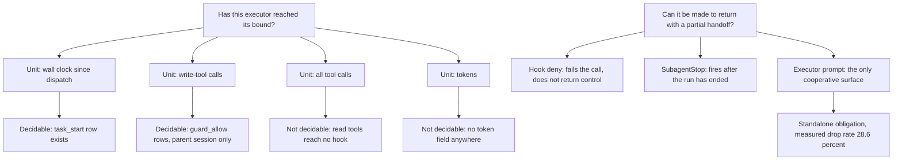

# Analysis: is the bounded-dispatch Directive planable for autonomous execution

**Date:** 2026-09-07 07:10
**Type:** Gap
**Status:** Complete
**Requested by:** user, via orchestrator dispatch (Phase 0b spec review)

## Question

The Circle record `260906-2258-bounded-executor-dispatches/_t_circle.md` is the only document that
counts as this Circle's specification. Does its `## Directive` plus `## Grounding snapshot` carry
enough, and enough that is true, for a planner to write a plan detailed enough to run autonomously?
Three sub-questions decide it: does every factual claim in the Grounding snapshot hold, is the
calculation that the Directive makes the sole closure criterion reconstructible from what is
written down, and can the load-bearing question of the future plan be decided from inputs the
mechanism actually has.

## Scope

Read in full: the Circle record; `260812-0303-simplify-speed-and-why-rules-do-not-hold.md`; the
backlog origin `260814-1733_*_bounded-executor-dispatches.md`; the shaper's session log
`260906-2258-shaper-bounded-executor-dispatches.md`; `hooks/guard.ts`, `hooks/hooks.json`,
`hooks/subagent-stop.ts`, `hooks/lib/orchestrator-events.ts`; the two prior hook-payload
measurements `260825-2214-can-a-hook-obtain-the-session-identifier.md` and
`260827-0740-subagentstop-payload-measurement.md`; the bundled `claude-api` skill's
`shared/prompt-caching.md`. Measured: `fusion-workbench/orchestrator-events.jsonl` (2953 lines) and
`fusion-workbench/.guard-state/events.jsonl` (431 lines at the start of this run). One live probe
was run inside this dispatch, described in Finding 6.

Nothing was written outside this report. No issue and no decision was filed.

**Tree read.** HEAD `3639813c`, committed 2026-09-06 20:16 +0200, branch `main`, `git status -sb`
reports `## main...origin/main` with no ahead or behind marker and five modified or untracked
workbench paths, the Circle directory among them. Every present-tense claim below is dated by that
commit.

## Findings

### 1. Belegprüfung: the Grounding snapshot claim by claim

| Claim in `## Grounding snapshot` | Status | Evidence |
|---|---|---|
| 15.9M against 3.9M non-cacheable suffix tokens, factor four | **Verified as arithmetic, refuted as a saving** | See Finding 2 and Finding 3 |
| Handoff between dispatches measured at zero | **Refuted as used** | The source measures minutes, not tokens. Finding 4 |
| 36 percent for the standalone `task_start` mandate | **Refuted** | 177 of 248 is 28.6 percent. Finding 5 |
| 248 of 248 for the obligation that rides an act | **Not checkable, and tautological as stated** | Finding 5 |
| The event log carries no token field and no per-tool-call event | **Verified** | Finding 6 |
| A dispatch produces one `task_start` and one `task_done` and nothing between them | **Refuted, without consequence** | Finding 6 |
| The PreToolUse hook is observation-only since 260816 and writes `{}` on every path | **Verified** | Finding 6 |

### 2. The calculation reconstructs exactly, and its factor is a free parameter

`260812-0303-simplify-speed-and-why-rules-do-not-hold.md` states the remedy row as: one 200-call
dispatch re-sends 15.9M non-cacheable suffix tokens, four 50-call dispatches re-send 3.9M. The
report gives the growth law nowhere, but it gives the one parameter it needs, in a different
section: *"At 800 tokens of output per tool call"* (same file, the compaction section). With that
figure and a quadratic re-send law the two numbers fall out to the digit:

- 800 x 200 x 199 / 2 = 15,920,000, printed as 15.9M
- 4 x (800 x 50 x 49 / 2) = 3,920,000, printed as 3.9M

So the calculation **is** reconstructible: accumulated tool output of 800 tokens per call, re-sent
in full on every subsequent call, summed over the run. The model is never named and no price ever
enters, which is consistent, because the figure is a token volume and not a cost.

What follows from the law is the first-order finding. Splitting a run of N calls into k dispatches
of N/k re-sends approximately N^2/(2k) x 800 tokens, so the ratio to the unsplit run is exactly k.
**The factor four is the number of dispatches that were chosen for the example, not a measured
saving.** Eight dispatches of 25 calls would have printed "about 8x" from the same input. The
Directive makes that number the closure criterion while the record leaves the bound's value and its
unit open under `## Not put to the user`. The criterion therefore depends on the quantity the
specification declines to fix.

Two parameters are asserted rather than sourced. The 800 tokens per tool call carries no
measurement anywhere in the source analysis, and the 200-call run length is an illustration, not a
figure taken from any dispatch fusion has recorded. `inference:` neither could have been taken from
the event log, since Finding 6 shows the log records no tool call inside a dispatch at all.

### 3. The premise the calculation rests on is refuted at the API level

The Circle record names the cost argument in one sentence: *"the API is stateless, the prompt and
rules prefix is cacheable, accumulated tool output is not and is re-sent on every call. That last
sentence is the whole cost argument."* The word "non-cacheable" is what turns a token volume into a
cost.

Verified against the bundled `claude-api` skill, `shared/prompt-caching.md`:

- `cache_control` goes on any content block, `tool_result` blocks explicitly included (API
  reference section).
- The multi-turn pattern is to place a breakpoint on the last content block of the most recently
  appended turn, so *"each subsequent request reuses the entire prior conversation prefix"* and
  *"hits accrue incrementally as the conversation grows"* (Multi-turn conversations section).
- The documented healthy signature of an agent loop is a cache read covering everything accumulated
  so far, with the write billing only the delta the last turn added (Diagnosing section).
- Cache reads cost about 0.1x base input price, cache writes 1.25x at the five minute TTL
  (Economics section).

Accumulated tool output is re-sent on the wire on every call, which is true and follows from a
stateless API. It is not therefore billed at input price. The cost argument's load-bearing word is
false as a general statement about the API.

There is a second effect, and it runs against the remedy rather than merely weakening it. Four
dispatches are four fresh contexts. Each one re-writes the prefix, which for a fusion executor is
the always-on rule floor plus the agent prompt plus the dispatch text, at the 1.25x write price,
and none of them can read the previous dispatch's accumulated tail, because that tail is not in
their prompt at all. The default TTL is five minutes measured from the start of the writing
request, so an orchestrator round-trip between two dispatches that takes longer than five minutes
drops the entry outright. **A split can lower re-sent token volume and raise the bill at the same
time.** How large either effect is in fusion's actual runs cannot be measured from anything in this
tree: `speculation:` on the direction of the net effect, and the honest statement is that nobody
here has the numbers.

`inference:` whether Claude Code, the harness fusion runs under, applies the multi-turn breakpoint
pattern to a sub-agent's growing tail is not verifiable from this repository. The API facts above
are verified; how this harness bills a fusion dispatch is not.

### 4. "Handoff measured at zero" is a duration, used as a token claim

The source states it under the heading *"Cost that does not exist"*: `dispatch -> dispatch` is
**0.0 minutes** at the median in both projects, 1.28 hours in total across 60 fusion transitions
(`260812-0303-simplify-speed-and-why-rules-do-not-hold.md`, section 2). That is wall clock between
two event rows.

The Circle record turns it into the evidence obligation for closure: *"what this Circle owes is a
check of the assumptions that calculation rests on, the zero-cost handoff between dispatches first
among them"*, and *"the Circle's evidence obligation reduces to checking whether a bound that forces
returns keeps the handoff free."*

The calculation is denominated in tokens. The measurement is denominated in minutes. A handoff that
takes no measurable wall clock still costs a fresh prefix, an executor report the orchestrator must
read, and a re-dispatch prompt that restates the state, all of which are tokens. So the assumption
the Circle names as the first thing it owes a check of has, on disk, no evidence in the currency
the argument uses. That is not a reason to reopen the cut. It is a reason the closure criterion has
to say which currency it is written in.

### 5. The 36 percent is wrong, and the "248 of 248" is a tautology

Measured today over the same window the source analysis used, every row of
`orchestrator-events.jsonl` with `ts` before `2026-08-12T03:03`, which is 1265 rows and reproduces
the source's own stated scope figure exactly:

- `task_start` 177, `task_done` 248. Dropped share: (248 - 177) / 248 = **28.6 percent**.
- Paired by the row's own `task` field over the same window: 172 matched, 76 unmatched, **30.6
  percent**.

Neither is 36 percent, and no combination with the krk figures the source also gives (95 and 79)
produces 36 percent either. The number does not reconstruct from any input the analysis states.
Over the whole file as it stands today the counts are 450 and 565, which is 20.4 percent, but that
file now carries two checkouts' merged rows and is not the same population.

The companion figure is a different problem. "248 of 248" reads as a measured compliance rate for
the attached obligation. It cannot be one: the denominator is the `task_done` count itself, and
there is no independent census of dispatches anywhere in that window against which either event
could be scored. The contrast the source draws is supported by its other two instances, the frozen
session bookkeeping and the rule broken three commits after it landed. The "248 of 248" adds
nothing to it. This matters here because the Circle record cites exactly that pairing as the reason
a bound expressed as a prompt sentence will be dropped.

### 6. The event log, the hook, and the open measurement, which this run closes

**Verified: the field roster.** Over all 2953 lines of `orchestrator-events.jsonl` at HEAD, the
keys present are exactly the fifteen the Circle record names: `ts`, `event`, `detail`, `agent`,
`turn`, `task`, `verdict`, `history_file`, `person`, `checkout`, `session_id`,
`artifact_grounding`, `artifact_directive`, `grounding_directive`, `clause`. No token field. The
event roster holds 46 distinct event names and none of them is a tool call. Both halves of the
claim hold. The line count moved from 2951 to 2953 while this Circle was being drafted, which is
the log doing its job.

**Refuted, without consequence: "nothing between them".** Restricting to the 131 machine-written
dispatch pairs, the ones whose `task` is a `toolu_` identifier, rows do fall between a `task_start`
and its `task_done`: 52 `commit` rows, nested dispatch pairs, `turn_start`, `turn_end` and others.
The operative half of the sentence, that no row records a tool call, is what the Circle needs and
it holds.

**Verified: the hook decides nothing.** `hooks/guard.ts` has one stdout writer, `allow()`, which
writes `{}`; every branch of `main` reaches it, directly or through `answer`, `bestEffort` and
`failOpen`. The header states the three removals and their dates, including the 2026-08-16 removal
of the halt and the decision-governed check. The claim in the Circle record is exact.

**Measured, and this closes the record's open third point.** The record states: *"Whether the hook
also sees the tool calls made inside a sub-agent's run is unmeasured here."* It is measured now, by
a probe inside this dispatch. This analyst run is a dispatched sub-agent. It performed one `Write`
to a scratchpad path at 05:00:39Z, and one row appeared in `fusion-workbench/.guard-state/events.jsonl`:

```
{"ts":"2026-09-07T05:00:39.360Z","event":"guard_allow",
 "session_id":"32aa7a68-e386-464a-9593-3cc705f6e3b3","tool":"Write",
 "file":".../scratchpad/hook-visibility-probe.txt"}
```

**Answer: yes, the hook fires for a tool call made inside a sub-agent run, and the row carries the
parent orchestrator's `session_id`**, the same value the orchestrator's own rows in that file carry
for this session. The historical log agrees: the file holds `guard_allow` rows for artifacts only a
sub-agent writes, including two review files, eight shared analyses and 67 history files.

Three limits come with that answer, and a plan needs all three:

1. **Only write tools produce a row.** The PreToolUse matcher in `hooks/hooks.json` is
   `Write|Edit|MultiEdit|NotebookEdit|Bash|Task|Agent`. `Read`, `Grep`, `Glob`, `WebFetch` and skill
   invocations never reach the hook at all, and `Bash` reaches it but takes a bare allow that writes
   no row by design (`hooks/guard.ts`, the Bash branch and the two issues cited there). Of 431 rows
   in this project's guard log, the tools are `Edit` 278 and `Write` 147. A bound counted in "tool
   calls" is therefore not observable today; a bound counted in "write-tool calls" is.
2. **The row cannot name the executor.** It carries the parent `session_id` and nothing else that
   identifies who made the call. The measured PreToolUse payload
   (`260825-2214-can-a-hook-obtain-the-session-identifier.md`) carries no agent field, and the
   agent identity is available only at launch, through `tool_response.agentId`, and at
   `SubagentStop`, as `agent_id` and `agent_type`
   (`260827-0740-subagentstop-payload-measurement.md`). `inference:` a counter could be attributed
   to a dispatch by bracketing between the launch row and the SubagentStop row, which is the
   mechanism `.guard-state/dispatch-map.json` already implements for the `task_done` pairing. Two
   concurrently running sub-agents could not be separated that way.
3. **Seeing is not stopping.** A PreToolUse hook can return a deny verdict, which fusion's does not
   and has not since 260816. `inference:` a deny fails the tool call; it does not make the sub-agent
   return to its dispatcher with a partial handoff. Nothing in the hook surface can force a return.
   `SubagentStop` fires when a sub-agent has already stopped, which is the wrong end of the run.

### 7. Decidability

The load-bearing question of the plan that follows this specification:

> Has this executor reached its bound, and can it be made to return at that point with its work in
> whatever state it has reached?

It is two questions and they have different answers.

**Has it reached its bound** is decidable from inputs the mechanism has, for two units and not for
the others. Wall clock since dispatch is decidable, from the `task_start` row the hook already
writes. Write-tool calls since dispatch is decidable, from the `guard_allow` rows, subject to limit
2 above. Total tool calls is not decidable today, because the read tools never reach a hook. Tokens
are not decidable at all: no source in fusion carries a token figure, which the Circle record
itself states and Finding 6 confirms.

**Can it be made to return** is not decidable by any mechanism fusion has. The only surface that
can end a sub-agent's run cooperatively, with a handoff, is the sub-agent's own prompt. The
Grounding snapshot already names the consequence: an obligation stated as a sentence in an agent
prompt is the standalone kind, and the snapshot cites the measured drop rate for exactly that kind.
The correction in Finding 5 moves that rate from 36 to 28.6 percent and leaves the conclusion
standing.

So the honest shape of the mechanism is: **a requested bound in the executor prompt, plus an
observer that can tell afterwards whether the request was honoured.** That is not the same design
as an enforced bound, and a plan written without the distinction will either promise enforcement it
cannot deliver or discover the gap at its own proof step. The specification has to state which of
the two it is buying. Where the answer is the requested form, the source analysis's own finding
applies and is available cheaply: attach the obligation to an act the executor performs anyway,
rather than stating it as a standalone one.



### 8. Contradictions and gaps a planner would have to guess

- **The re-entry is unspecified.** The Directive requires the executor to hand back work "in
  whatever state it has reached, half finished included" and the orchestrator to "re-dispatch to
  continue". Nothing says what is handed back, where it is written, or what the continuing dispatch
  reads. A report in chat text and a resume note in a workbench store are different designs with
  different costs, and the second is exactly the bookkeeping the source analysis names as the
  largest measured cost in the project. A planner cannot pick one from the record.
- **The closure criterion is stated but not operationalised.** "Closure requires no new
  measurement" and "the fourfold saving counts as the evidence" describe what will not be done. What
  will be done, namely a check of the assumptions, has no acceptance form: what a passed check looks
  like, and who decides it, is nowhere in the record.
- **The two reserved questions block the plan rather than the spec.** "Which executors the bound
  covers" and "what unit the bound is expressed in" are marked open for the spec at activation. The
  Circle is now activated and the spec is this record, so they are open in the specification a
  planner would work from. Finding 7 shows the unit question is not a matter of taste: three of the
  four candidate units differ in whether any mechanism can read them.

## Implications

The Circle's cut is sound and this report does not touch it. Shorter runs on cost grounds, the
bound inside the run, no before-and-after measurement: all three answers hold, and nothing measured
here argues for reopening the re-injection half.

What does not hold is the specific evidentiary construction the Directive builds on top of that
cut. The Directive elevates one calculation to sole closure criterion and then names one assumption
under it as the thing to check. Both the calculation's headline factor and the named assumption
turn out to be weaker than the record presents them: the factor is the split count, the assumption
is measured in the wrong currency, and the premise that makes the token volume into a cost is
refuted at the API level. A plan written against the record as it stands would close on a criterion
that cannot be evaluated.

The construction question is the second half. The record already suspects that a prompt sentence
will be dropped and defers the hook measurement to the plan. That measurement is now made, and it
says the hook sees the calls but cannot force the return. A specification that does not state
whether it is buying an enforced bound or a requested one hands the planner the design decision,
which is the decision the user should make.

## Recommendations

1. Route this report to the shaper, with the gap list below, for one rework round on the Circle
   record. All eight items are spec-level; none needs code.
2. Two of the eight need the user, and they are named in the list: the currency of the closure
   check, and the unit plus scope of the bound.
3. Dispatch the planner only after the record carries the unit, the covered executors, the handoff
   form and an operational closure criterion. With those four in place a plan detailed enough to run
   autonomously can be written, and Finding 6 supplies the mechanism facts it needs.

## Filed Issues

None. Every finding is a gap in a specification that is about to be reworked, and filing them as
issues would put the same content in two stores. Nothing here reopens the cut.

## Sources

- `260906-2258-bounded-executor-dispatches/_t_circle.md`, `## Directive` and `## Grounding snapshot`
- `260812-0303-simplify-speed-and-why-rules-do-not-hold.md`, headline, section 2 ("Cost that does
  not exist"), section 3 ("The four remedies, weighed", the compaction paragraph), the observations
  table
- `260814-1733_*_bounded-executor-dispatches.md`; `260906-2258-shaper-bounded-executor-dispatches.md`
- `hooks/guard.ts` (header, the Bash branch, the write trace); `hooks/hooks.json` (PreToolUse
  matcher); `hooks/subagent-stop.ts`; `hooks/lib/orchestrator-events.ts` (header)
- `260825-2214-can-a-hook-obtain-the-session-identifier.md`, section (c);
  `260827-0740-subagentstop-payload-measurement.md`, findings (a) and (c)
- `fusion-workbench/orchestrator-events.jsonl`, 2953 lines, field and event rosters, the pre-cut
  1265-row window, the 131 machine-written dispatch pairs
- `fusion-workbench/.guard-state/events.jsonl`, 431 rows before the probe and 432 after, tool
  distribution, the sub-agent-written artifact paths
- Bundled `claude-api` skill, `shared/prompt-caching.md`: API reference, Multi-turn conversations,
  Diagnosing, Economics, Choosing the TTL

## Open Questions

- [ ] In which currency is the closure check written: tokens, money, or wall clock? Only the user
      can settle it, because it decides what "the assumptions hold" means.
- [ ] What unit is the bound expressed in, and which executors does it cover?
- [ ] Is the bound requested in the executor prompt, observed by a hook after the fact, or both?

## Verdict

**Verdict:** rework needed — 8 gaps.

1. **`## Directive`, the closure criterion.** The fourfold saving is not a measured saving. The
   calculation reconstructs exactly (800 tokens per tool call, quadratic re-send, 200 calls against
   4 x 50), and the factor is arithmetically identical to the number of dispatches chosen for the
   example. Restate the criterion so it does not name a constant the specification leaves open.
   *Question for the user:* the saving is a function of the bound you set. Does closure check the
   calculation at a stated bound, or check the law rather than the factor?
2. **`## Grounding snapshot`, "handoff between dispatches measured at zero".** The source measures
   0.0 minutes of wall clock, not tokens; the calculation is in tokens. Say which currency the
   handoff is claimed free in. *Question for the user:* does a handoff measured in minutes discharge
   the assumption, or must the check be token-side?
3. **`## Grounding snapshot`, "accumulated tool output is not cacheable".** Refuted against the API
   documentation: `cache_control` goes on `tool_result` blocks and the documented multi-turn pattern
   reuses the whole accumulated prefix at about 0.1x input price. Correct the sentence, and record
   the counter-effect: four dispatches each pay a 1.25x prefix write and cannot read the previous
   dispatch's tail, and the default cache TTL is five minutes, shorter than many orchestrator
   round-trips.
4. **`## Grounding snapshot`, "36 percent".** Wrong. 177 of 248 is 28.6 percent, and pairing by the
   rows' own `task` field over the same window gives 30.6 percent; both measured today over the
   1265-row pre-cut window. Replace the figure. The conclusion it supports is unaffected.
5. **`## Grounding snapshot`, "248 of 248".** Not a measurement. The denominator is the `task_done`
   count itself and no independent dispatch census exists for that window. Either drop the pairing
   or restate it as the qualitative contrast the source's other two instances actually support.
6. **`## Not put to the user`, the unit.** Unit is not a detail: wall clock and write-tool calls are
   readable from rows fusion already writes; total tool calls are not (read tools reach no hook) and
   tokens are not (no field anywhere). *Question for the user:* wall clock, write-tool calls, or
   something else, given that the last two candidates cannot be measured?
7. **`## Not put to the user`, the covered executors.** Still unnamed, and it decides whether the
   bound is one prompt edit or nine. *Question for the user:* all dispatched agents, or only the
   long-running executors (coder, ontocoder, bugfixer, analyst)?
8. **`## Directive`, the return and the re-entry.** The Directive requires a half-finished handback
   and a re-dispatch that continues, and specifies neither what is handed back nor what the next
   dispatch reads. Add the handoff form. Note for the shaper: a resume note written to a workbench
   store is bookkeeping, which the same source analysis measures as the project's largest cost, so
   this choice has a cost the closure criterion should not ignore.

**Closed by this run, and to be written into the record rather than asked:** the third reserved
question. The PreToolUse hook does fire for tool calls made inside a sub-agent run, measured live in
this dispatch, and the row carries the parent orchestrator's `session_id`. Three limits belong in
the record with it: only write tools produce a row (`Read`, `Grep`, `Glob` reach no hook; `Bash`
reaches it and writes nothing by design), the row carries no agent identity, and a hook can deny a
call but cannot make a sub-agent return with a handoff.
