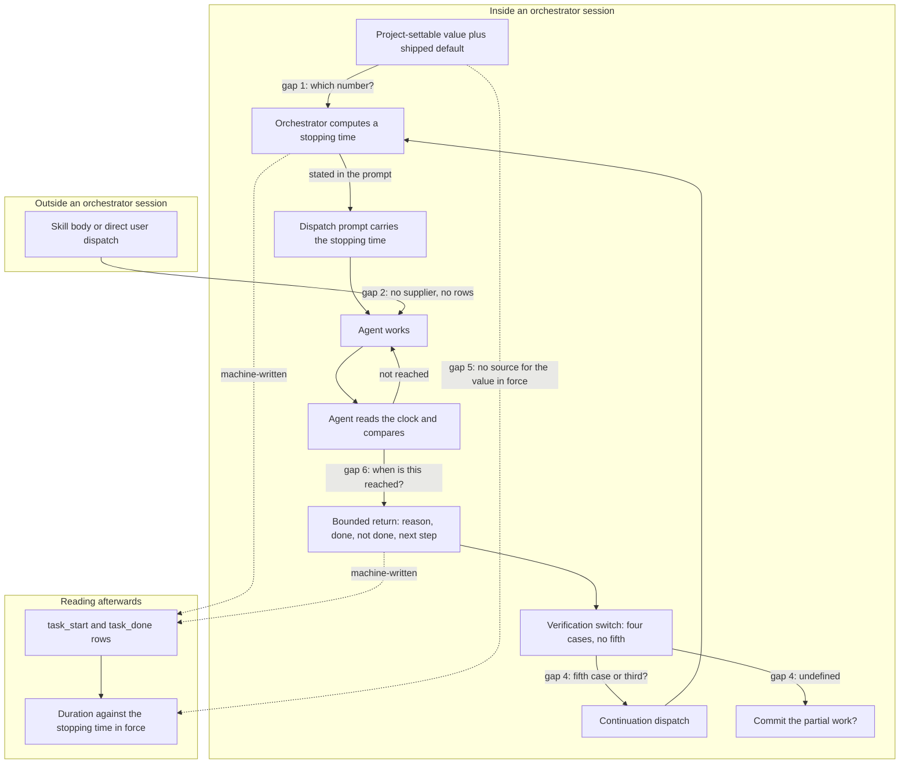

# Analysis: second planability check of the bounded-dispatch specification

**Date:** 2026-09-07 08:36
**Type:** Gap
**Status:** Complete
**Requested by:** user, via orchestrator dispatch (second spec review)

## Question

The specification is now its own document, `260907-0820_*_spec-bounded-executor-dispatches.md`, and the
Circle record carries a rewritten `## Grounding snapshot`. Does the pair close the eight gaps the first
check filed, does the rework introduce claims that do not hold, and can a planner now write a plan
detailed enough to run without asking a question? The criterion is unchanged from the first check and
the second round is not judged more leniently for being the second.

## Scope

Read in full: the new specification; the rewritten `## Grounding snapshot` in
`260906-2258-bounded-executor-dispatches/_t_circle.md`; the first check
`260907-0710-planability-of-the-bounded-dispatch-spec.md`; the source analysis
`260812-0303-simplify-speed-and-why-rules-do-not-hold.md` (the three-largest-costs table, the
upper-bound section, the conflicts section, section 3); `agents/orchestrator.md` Phase 2 Step 3a and
Step 3b; `agents/taskplanner.md` and `agents/analyst.md` write targets;
`hooks/lib/orchestrator-events.ts` (the in-flight gate); the bundled `claude-api` skill's
`shared/prompt-caching.md` (API reference, Economics, Choosing the TTL).

Measured today over `fusion-workbench/orchestrator-events.jsonl`: the pre-cut window of 1265 rows, the
131 machine-written dispatch pairs and their durations, the 97 handoff gaps between a completion and the
next dispatch, and the four pairing methods reported in Finding 2.3. Also run:
`bin/fusion-citation-check` over the workbench.

Nothing was written outside this report. No issue and no decision was filed.

**Tree read.** HEAD `3639813c`, committed 2026-09-06 20:16 +0200, branch `main`, `git status -sb`
reports `## main...origin/main` with no ahead or behind marker and ten modified, deleted or untracked
workbench paths, this Circle's directory among them. The pre-cut event window is byte-identical between
HEAD and the working copy, so the historical figures below are not affected by the working tree. Every
present-tense claim is dated by that commit.

## Findings

### 1. The eight filed gaps, one by one

| # | First check | Status now | Where |
|---|---|---|---|
| 1 | Closure names a factor the spec leaves open | **Closed** | C5 decision, "the law rather than the factor" |
| 2 | Handoff measured in minutes, argument in tokens | **Closed** | C5 criterion 4 and its decision; Grounding paragraph 4 |
| 3 | "Accumulated tool output is not cacheable" refuted | **Closed** | Grounding paragraph 3; C5 criterion 3 |
| 4 | "36 percent" wrong | **Closed, with a new defect in its place** | Grounding paragraph 5; see Finding 2.3 |
| 5 | "248 of 248" is not a measurement | **Closed** | Grounding paragraph 5, the claim is withdrawn by name |
| 6 | The unit is undecided | **Closed** | C1 decision, wall clock, with the rejected units and why |
| 7 | The covered agents are unnamed | **Closed in letter, consequence not drawn** | C1 criterion 4; see Finding 3.1 |
| 8 | The return and the re-entry are unspecified | **Partially closed** | C2 and C3 specify the content, not the landing; see Finding 4.4 |

Four of the eight were closed by user decisions, and the specification renders all four correctly.

**Point 1.** The Directive no longer names a factor. C5's decision reads: *"Closure asks whether re-sent
volume falls with the dispatch count and whether that effect survives caching. It does not ask anyone to
defend the number four, which is arithmetically identical to the split count that example chose."* The
law is what closure checks, and the criteria under C5 operationalise it.

**Point 2, checked for smoothing because that was the instruction.** The restriction is written out and
not glossed. C5's fourth criterion requires the check to state *"plainly that the free-handoff evidence
is a wall-clock measurement of 0.0 minutes at the median while the volume argument is denominated in
tokens, so the two do not meet."* The clause "so the two do not meet" is the sharp form, not a softened
one. The decision block repeats it in the user's own terms: *"The user took this knowing the evidence is
not denominated in the currency of the argument, and asked for the limitation to be written down rather
than left implicit."* The Grounding snapshot carries the same limitation in its fourth paragraph, with
the token-side costs of a handoff named individually. Two independent statements, neither of which a
later reader can miss.

**Point 6** records not only the answer but the three rejected units and the reason each was rejected,
which is the part a planner needs when it meets a temptation to count tool calls.

**Point 7** is closed as asked, and its consequence for C2 is not drawn. Finding 3.1 takes that up.

### 2. The new claims, checked

#### 2.1 The cache counter-calculation: verified in all four parts

Every figure the shaper added is in the bundled `claude-api` skill, `shared/prompt-caching.md`:

| Claim in the new text | Source | Verdict |
|---|---|---|
| `cache_control` sits on `tool_result` blocks | API reference: "Goes on any content block: system text blocks, tool definitions, message content blocks (`text`, `image`, `tool_use`, `tool_result`, `document`)" | Verified |
| A cache read costs about a tenth of plain input price | Economics: "Cache reads cost ~0.1x base input price" | Verified |
| A write costs about 1.25 times input price | Economics: "Cache writes cost 1.25x for 5-minute TTL" | Verified |
| The entry expires five minutes after the writing request begins | Choosing the TTL: "The lifetime is measured from the start of the request that writes or reads the entry" | Verified, and the wording is exact |

One qualification the source carries and neither document mentions: a cache read refreshes the timer at
no cost. Inside one long dispatch the entry therefore stays warm, and the expiry bites only across the
gap between dispatches, which is where the specification uses it. The claim is not weakened, but a
reader who takes "expires after five minutes" as an absolute will misapply it.

The specification also asserts that five minutes is *"shorter than many orchestrator round trips"* and
gives no figure. Measured today over the 97 gaps between a machine-written completion and the next
machine-written dispatch: median 2.37 minutes, mean 38.4, and **38 of 97 gaps, 39.2 percent, exceed five
minutes**, carrying 97.7 percent of all handoff minutes. The claim holds. It should carry that figure,
because the same project's source analysis reports `dispatch to dispatch` at 0.0 minutes at the median,
and a reader who meets both sentences without the distribution will think one refutes the other.

#### 2.2 The bookkeeping figures: verified, including the ceiling qualification

C2's decision states that bookkeeping is *"the largest cost this project has measured in itself, up to 28
percent of session time"*. The source's three-largest-costs table ranks it first at "76.5 h, up to 28% of
session time (51.2 h fusion, 25.3 h krk)", and a section headed "The 28 percent is an upper bound"
instructs the reader to "Treat 28 percent as the ceiling and the direction as sound." The specification's
"up to" preserves that. Verified.

C3's decision states that the source is explicit that bookkeeping is per Turn. It is, verbatim:
*"Bookkeeping is already up to 28 percent of session time and it is per-Turn. Shortening by adding Turns
would make the largest cost larger. Shorten within a Turn, by bounding executor dispatches, not by
cutting Turns smaller."* The source names this Circle's own remedy in that sentence. Verified, and it is
the strongest single piece of grounding the specification has.

#### 2.3 The 28.6 and 30.6 percent: one holds, one does not, and the second is my error

**28.6 percent reproduces exactly.** Over the 1265 rows with `ts` before `2026-08-12T03:03`: 177
`task_start`, 248 `task_done`, and `(248 - 177) / 248 = 28.63` percent. Confirmed against both the
committed and the working copy of the log, which are identical in that window.

**30.6 percent does not reproduce, and it entered the specification from my own first report.** I wrote
"172 matched, 76 unmatched, 30.6 percent" for pairing by the rows' own `task` field. Re-run today, no
pairing method yields it:

| Pairing method over the same 1265-row window | Matched | Unmatched | Rate |
|---|---|---|---|
| Set membership, `task` required on both sides | 173 | 75 | 30.2 percent |
| Set membership, rows with no `task` field allowed to match each other | 177 | 71 | 28.6 percent |
| Consuming multiset, a start consumed once, order-aware | 156 | 92 | 37.1 percent |
| Distinct `task` values on the completion side | 130 | 69 | 34.7 percent |

The window carries 18 start rows and 26 completion rows whose `task` value repeats, and 5 start rows and
4 completion rows with no `task` field at all, which is why the method changes the answer by nine
percentage points. The figure I filed was wrong, and the specification and the Grounding snapshot now
both carry it as a measurement. The fix is to drop the second figure rather than to replace it: the first
one is method-free and carries the argument on its own.

**A second precision defect sits in the surviving figure's wording.** The specification says *"28.6
percent of dispatches were announced finished having never been announced started"*. The denominator is
the count of announced completions, so a dispatch that announced neither row is invisible to the
measurement. 28.6 percent is therefore a floor on the drop rate of the standalone obligation, not a point
estimate. That is the same denominator problem the first check filed as gap 5 against "248 of 248", and
the withdrawal of that claim did not carry over to this sentence.

#### 2.4 "At or above the median of the recorded dispatch durations"

The new criterion is checkable and it does not survive the check as a way of getting to a number. Two
separate problems, and Finding 3.2 draws the consequence.

Measured over the 131 machine-written dispatch pairs (a `task` field that is a `toolu_` identifier, a
non-negative duration under 24 hours): median **9.35** minutes, p75 14.27, p90 22.28, max 90.83, mean
11.50 over 1506 minutes in total. Over the wider population of every pairable `task` value, 401 pairs,
the median is **11.93** minutes. The specification does not say which population it means, and the two
answers differ by 27 percent.

The criterion's own purpose clause disagrees with its bound:

| Stopping time | Dispatches it cuts | Share of all dispatch minutes beyond the cut |
|---|---|---|
| 9.35 min (the median) | 65 of 131, 50 percent | 37.7 percent |
| 15 min | 32 of 131, 24 percent | 19.8 percent |
| 20 min | 15 of 131, 11 percent | 11.9 percent |
| 30 min | 6 of 131, 5 percent | 5.4 percent |

At the median exactly, half of every dispatch this project has recorded returns unfinished. The criterion
says the value exists *"so an ordinary dispatch is untouched and only the long tail is cut"*. Only the
last two rows of that table describe a long tail. The floor and the purpose point at different numbers,
and the interval the floor opens has no upper end.

### 3. The shaper's two own decisions

#### 3.1 The report-only handoff: sound where work lands on disk, unestablished elsewhere

The reasoning for the decision is good and both halves of it check out. A continuation note in a
workbench store is bookkeeping, bookkeeping is the project's largest measured cost (Finding 2.2), and a
note written to a store would be a second standalone obligation of exactly the kind measured at a 28.6
percent drop rate, while the return report cannot be skipped without the dispatch visibly producing
nothing. Nothing in that argument is weak.

What the argument does not cover is the population the user's own decision let in. C2's criteria assume
the work is on disk: *"Work already on disk stays on disk. The return names the paths it touched and does
not copy their content into itself."* For `coder`, `ontocoder` and `bugfixer` that is the whole state, and
the report only has to point at it. For the agents whose product exists only at the end, there is nothing
on disk to point at:

- `agents/taskplanner.md` states it outright: *"Your product is the queue itself, returned in your
  report ... It is not a file. The one thing you write to disk is your history entry."* A bounded
  taskplanner has literally nothing on disk and its half-built queue exists only in a context that ends.
- `agents/analyst.md` writes one report at the end. A bounded analyst at 20 minutes has read its sources
  and holds its measurements nowhere. Analyst dispatches do reach the tail: 8 in the measured set, median
  11.27 minutes, 2 of them past 20 minutes.
- `shaper`, `playmaker`, `curator`, `consultant` and `editor` have the same shape.

Since the bound covers all dispatched agents, the majority of the roster by count is in this group. For
them the return report is not a pointer to the state, it is the state, and C2's third criterion tells the
agent not to copy content into the report. The specification does not say what a bounded analyst hands
back or what its continuation dispatch carries. This is where the two decisions, the user's and the
shaper's, meet without either having been asked about the other.

#### 3.2 Naming the property instead of the number: a planner cannot get a number out of it

Direct answer: no. "At or above the median" is a half-open interval, the population that fixes the median
is unnamed and moves the value by 27 percent (Finding 2.4), and the sentence that follows the floor
describes an effect that the floor does not produce. A planner that picks 9.35, one that picks 15 and one
that picks 22.28 have each satisfied the criterion as written and have built three different mechanisms:
one that fires on half of all dispatches, one that fires on a quarter, one that fires on a tenth. That is
the definition of guessing.

The decision to name a property rather than a number is right in principle, and the project has a
precedent for it. The property has to select a number. "At or above the median" does not; "the value at
which no more than one dispatch in ten is cut" would, and would fix the population in the same sentence.

### 4. Autonomous executability, read as a planner would read it

#### 4.1 Which files change: answerable

C1's fourth criterion, *"Every agent that can be dispatched carries the return obligation, with no
exemptions"*, plus the orchestrator's own dispatch step, names the set without a decision: the fourteen
dispatchable agent prompts, `agents/orchestrator.md` Step 3a, one configuration leaf, and whatever
surface C4's reading takes. The specification lists file order as open for the planner and it is properly
open. No gap here.

#### 4.2 How the bound reaches the agent: answerable inside a session, unanswered outside one

Inside an orchestrator session the path is clear. Step 3a item 4 of `agents/orchestrator.md` already
lists what a dispatch prompt carries, and a stopping time is one more bullet there.

Outside one it breaks, and the break is measurable rather than hypothetical.
`hooks/lib/orchestrator-events.ts` gates every machine-written row on Setup's state file: *"An
orchestrator session is in flight iff Setup's state file exists"*, and the header states the consequence,
*"A dispatch outside that window ... writes nothing here"*. So the specification's premise in the
governing section, *"the machine already writes a `task_start` row at every dispatch"*, is true only
inside a session. Three consequences the specification does not draw:

1. A dispatch made by a skill body or by a user running an agent directly has no orchestrator to compute
   its stopping time, and C1 says every dispatch carries one.
2. What an agent does when it is dispatched without a stopping time is unspecified. The project has one
   precedent for a missing dispatch parameter, the editor's halt, and one for a default, the domain
   parameter. They point in opposite directions and the planner would have to choose.
3. C4's reading is structurally blind to those dispatches, since no rows exist for them.

#### 4.3 What the agent does when it reaches the bound: content specified, trigger not

C2's first criterion fixes the content of the return in four parts, which is enough to write prompt
wording against. When the agent looks at the clock is nowhere. A wall-clock comparison needs a fresh
reading each time, so the agent must run a command repeatedly, at moments the specification does not
name.

That gap sits directly under a claim the specification makes about itself. Its governing section names
two mitigations and asserts both are effective: *"the agent compares a clock reading against a fixed time
it was handed, rather than keeping a running count of anything, and the obligation is restated in the
dispatch prompt next to the act instead of living only in the agent's own prompt file."* Neither is
established.

- The first rests on the sentence *"this project's measurements say a running count over an agent's own
  work is never kept, while a comparison against a constant is a single act."* The measurement behind it
  is about the orchestrator's hand-maintained session counters, which the source analysis names as
  `agentstate.yaml`'s progress fields, the Circle Turn-log tallies and the persisted queue file. That is
  a different subject from a dispatched agent counting its own tool calls, and the second half of the
  sentence has no measurement behind it at all. It is an inference and is not labelled as one.
- The second says the obligation is restated *"next to the act"*. The finding the specification builds on
  is that an obligation holds when it rides an act the agent performs anyway, the way the completion
  event rides finishing. Moving a sentence from the agent's prompt file into the dispatch prompt changes
  where it is written, not what it rides. A clock check rides no act, which is precisely why the trigger
  question in the paragraph above is load-bearing rather than cosmetic.

#### 4.4 What the orchestrator does with a half-finished return: it collides with the loop it lands in

C3 says what happens conceptually and the specification never puts it into the loop that exists. Two
concrete collisions in `agents/orchestrator.md` Phase 2:

- **Step 3a item 5 is an exhaustive switch that declares itself closed.** It reads the executor's
  `Verification:` line and enumerates *"Four cases, and there is no fifth"*. A bounded return matches the
  third case, `did not finish`, whose written handling is to run the project's validation and re-enter
  with the resulting exit code, which routes a perfectly healthy bounded return toward the blocked path
  and, through Step 3b, toward a bugfixer dispatch. Either a bounded return is a fifth case, which means
  editing a passage that states there is no fifth, or it reuses the third, which means the continuation
  is preceded by a validation run and a possible self-heal attempt. The two plans differ in what gets
  dispatched and in what the user sees.
- **Step 3b commits after each completed task, and step 6 marks completion.** A bounded return reaches
  neither. Whether the partial work is committed before the continuation dispatch is a real choice, since
  uncommitted partial work sits in a tree other executors may touch, and the specification's constraint
  against writing files does not answer it.

#### 4.5 How it is read at the end: C4 has no source for the value it compares against

C4's second criterion requires the reading to report *"whether it exceeded the stopping time in force"*.
Nothing carries that value. `task_start` rows do not, adding a field is excluded by Out of Scope (*"any
new event field"*), and the project deliberately removed the one precedent for holding a budget in
session state when `agentstate.yaml` stopped carrying `max_turns` on 2026-08-15. The reading must
therefore take the threshold as a parameter, which makes it a reading of today's configured value against
yesterday's durations, and it has no way to know which dispatches were made after the mechanism landed.
Run over the log as it stands, it would report every long dispatch from before this Circle as a
violation. A planner has to invent both the parameter and the window.

Two cycles are in that graph and both are intended: the work loop between the agent and its clock check,
and the continuation loop from a bounded return back to a fresh dispatch. Every other edge runs downward.
Five of the nine gaps sit on an edge, which is the shape of the finding: the capabilities are each
well-formed and the joins between them are where the plan would have to guess.

### 5. The requested bound, and whether the consequence is fully drawn

On the saving itself the consequence is drawn, and drawn well. The governing section says the expectation
is that the stopping time *"will be honoured some of the time, at a rate this project's own history puts
well short of always, and the saving is therefore an expected value rather than a guarantee."* C5 checks
the law and not a factor. The Constraints forbid enforcement and forbid a new measurement. Out of Scope
excludes the token-side work. C4 is explicitly not a gate. No quantity anywhere in the document is
promised on the assumption that the bound is obeyed.

Two residues remain, one in the sentence that matters most and one in the section that ends the work.

**The Directive states as an outcome what the same paragraph then says cannot be made to happen.** Its
first sentence: *"After this work every dispatched agent runs under a wall-clock stopping time it is
given when it is dispatched, and returns to the orchestrator when it reaches that time."* Its third:
*"The bound is requested rather than enforced, because nothing fusion has can make a sub-agent give back
control."* The Directive is the sentence the per-Circle coherence pass tiles the Circle's artifacts
against, so an indicative outcome there is measured against reality at closure. One sentence fixes it.

**The second stopping condition asks for a determination the specification says cannot be made.** It
reads: *"If the check in C5, working from the dispatch durations already recorded, finds that the caching
counter-effect dominates for the dispatch lengths this project actually runs, then the bound is not
turned on by default."* Two problems. Dominance is a comparison of magnitudes in tokens or money, and the
Grounding snapshot states that *"The size and even the sign of the net effect cannot be established from
anything in this tree"*, while C5 makes an undetermined cache half a passing outcome. Durations alone
answer how often a gap exceeds the cache lifetime, which I measured at 39.2 percent, and nothing more.
And "not turned on by default" names an off state that no capability defines: C1 says every dispatch
carries a stopping time and that a project setting nothing gets a shipped default.

## Implications

The rework is substantial and most of it holds. Five of the eight filed gaps are closed outright, the
four user decisions are rendered correctly and without smoothing, the cache figures are all verifiable,
and the two decisions the shaper took instead of asking were both reasoned from evidence rather than
convenience. The document is a specification now rather than a record with a Directive in it, and the
section that states what is being bought is the single most useful thing in it.

What stands between it and a plan is a different class of thing from the first round. The first round
found claims that were false. This round finds joins that are undefined: between the default's property
and a number, between a bounded return and the loop that receives it, between the reading and the value
it compares against, between the agent's obligation and the moment it applies, and between the bound and
the dispatches no orchestrator makes. A planner meeting any one of them writes a different plan depending
on which way it guesses, and four of the five changes what gets dispatched at run time.

One item belongs to me rather than to the shaper. The 30.6 percent figure was mine, it does not
reproduce, and it is now in two documents as a measurement. Filing a wrong number once put it into the
record twice.

## Recommendations

1. Route this report to the shaper for a second rework round. Seven of the nine items are spec-level and
   need no code; two need the user and are marked.
2. Take the numbers in Findings 2.3, 2.4 and 2.1 into the documents directly rather than re-measuring
   them: the dispatch-duration distribution, the handoff-gap distribution and the pairing table are all
   in this report with their populations named.
3. Dispatch the planner once gaps 1 through 5 carry answers. The rest are corrections that do not change
   what a plan would contain.

## Filed Issues

None. Every item is a gap in a specification about to be reworked, and filing them as issues would put
the same content in two stores.

## Sources

- `260907-0820_*_spec-bounded-executor-dispatches.md`: the Directive, the governing section, C1 through
  C5 with their decision blocks, Stops when, Constraints, Out of Scope, Open for Planner
- `260906-2258-bounded-executor-dispatches/_t_circle.md`, `## Grounding snapshot`, all eight paragraphs
- `260907-0710-planability-of-the-bounded-dispatch-spec.md`, the Verdict's eight items
- `260812-0303-simplify-speed-and-why-rules-do-not-hold.md`: the three-largest-costs table, "The 28
  percent is an upper bound", the conflicts section ("Shorter dispatches conflict with the bookkeeping
  cost"), section 3's standalone-obligation figures
- `agents/orchestrator.md`: Phase 2 Step 3a items 4 and 5, Step 3b, Step 3a item 6;
  `agents/taskplanner.md` (the product is the report); `agents/analyst.md` (write targets)
- `hooks/lib/orchestrator-events.ts`: the in-flight gate and `orchestratorSessionInFlight`
- Bundled `claude-api` skill, `shared/prompt-caching.md`: API reference, Economics, Choosing the TTL
- `fusion-workbench/orchestrator-events.jsonl`: the 1265-row pre-cut window, four pairing methods, 131
  machine-written dispatch pairs and their duration distribution, 97 handoff gaps
- `bin/fusion-citation-check`: `edited-violations=0`, and no violation in this Circle's files

## Open Questions

- [ ] What share of dispatches should the bound touch? The answer fixes the default and the answer is the
      user's, because it is a choice about how aggressively to cut and not a measurement.
- [ ] Does the report-only handoff hold for the agents whose product exists only at the end, or are those
      agents exempt? The second answer narrows the "all dispatched agents" decision the user took today.
- [ ] Is the bound switchable off, and if so by what?

## Verdict

**Verdict:** rework needed — 9 gaps.

1. **C1, the default's property does not select a number.** "At or above the median" is a half-open
   interval; the population is unnamed and moves the median from 9.35 to 11.93 minutes; and the purpose
   clause ("only the long tail is cut") describes a value near 20 minutes, where 11 percent of dispatches
   are cut, not the median, where 50 percent are. Restate the property so it selects one number and fixes
   its population in the same sentence. *Question for the user:* what share of dispatches should the bound
   touch? At 9.35 minutes it fires on half of them, at 15 on a quarter, at 22 on a tenth.
2. **The bound has no supplier and no reading outside an orchestrator session.** Machine-written rows are
   gated on Setup's state file (`hooks/lib/orchestrator-events.ts`), so a dispatch made by a skill body or
   directly by a user gets no stopping time and produces no row. Say who supplies the stopping time there,
   what an agent does when dispatched without one (the editor halts on a missing parameter, the domain
   parameter defaults; the precedents disagree), and that C4 cannot see those dispatches.
3. **C2 does not cover the agents whose product exists only at the end.** The user's decision put all
   dispatched agents under the bound. `taskplanner` writes no file by design, and `analyst`, `shaper`,
   `playmaker`, `curator`, `consultant` and `editor` write theirs at the end, so for them there is no work
   on disk for the return to point at and the report is the state itself. Say what a bounded return
   carries in that case. *Question for the user:* accept a fuller report for those agents, or exempt them
   from the bound?
4. **C3 has no landing in the loop that receives it.** `agents/orchestrator.md` Step 3a item 5 is an
   exhaustive four-case switch that says "there is no fifth", and a bounded return currently matches the
   `did not finish` case, which routes it toward validation and a bugfixer dispatch. Say whether a bounded
   return is a fifth case or reuses the third, and say whether the partial work is committed before the
   continuation.
5. **C4 has no source for the stopping time it compares against.** No row carries it, a new event field is
   out of scope, and the one precedent for holding a budget in session state was removed on 2026-08-15.
   Say where the reading gets the threshold and how it scopes itself to dispatches made after this work,
   or the reading will report every long dispatch in the log's history as a violation.
6. **The clock-check trigger is missing and both claimed mitigations are unestablished.** Say at which
   moments the agent takes a reading. Then either evidence or mark as inference the two claims in the
   governing section: the measurement behind "a running count is never kept" is about the orchestrator's
   session counters, not an agent counting its own work, and moving a sentence into the dispatch prompt
   changes where it is written, not what act it rides.
7. **Two figures do not hold.** Drop "30.6 percent": it does not reproduce under any of four pairing
   methods (28.6, 30.2, 34.7, 37.1 over the same window), and it came from my first report, which was
   wrong. Keep 28.6 percent, which reproduces exactly, and state it as a floor: its denominator is the
   count of announced completions, so a dispatch that announced neither row is invisible to it.
8. **The second stopping condition cannot be evaluated and names an off state nothing defines.**
   "Dominates" is a magnitude comparison the Grounding snapshot says cannot be established from this tree,
   while durations answer only how often a gap exceeds the cache lifetime, which is 39.2 percent of 97
   measured handoffs. And "not turned on by default" implies a switch C1 does not provide. Either restate
   the condition in terms durations can settle or drop it.
9. **The Directive's first sentence states an enforced outcome.** "every dispatched agent ... returns to
   the orchestrator when it reaches that time" is the sentence the coherence pass tiles this Circle's
   artifacts against, and the same paragraph then says nothing can make an agent give back control. Put
   the request into the first sentence.

**Two corrections worth taking without a question, since the evidence is in this report:** the handoff
distribution behind "shorter than many orchestrator round trips" (median 2.37 minutes, 39.2 percent of 97
gaps over five minutes, carrying 97.7 percent of all handoff minutes), and the note that a cache read
refreshes the entry's timer, so the five-minute expiry bites between dispatches and not inside one.
