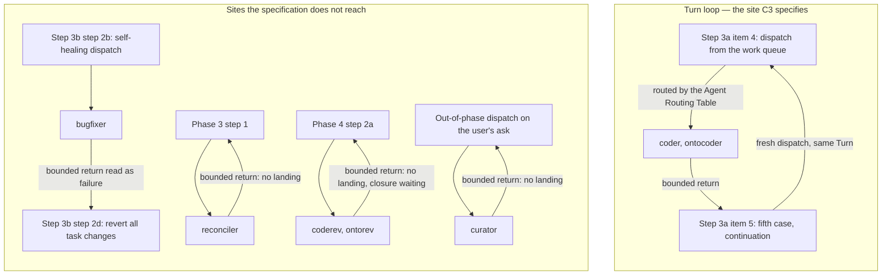

# Analysis: third planability check of the bounded-dispatch specification

**Date:** 2026-09-07 14:01
**Type:** Gap
**Status:** Complete
**Requested by:** user, via orchestrator dispatch (third spec review)

## Question

The second check filed nine gaps, the user closed two of them by decision, and the shaper reworked the
specification a second time. Does the pair — the specification and the Circle record's
`## Grounding snapshot` — now carry the five settled points correctly and without contradiction, do
the nine filed gaps close, and can a planner write a plan against it without asking a question? The
five settled points are not reopened here; only their rendering is checked.

## Scope

Read in full: `260907-0820_*_spec-bounded-executor-dispatches.md`; the rewritten
`## Grounding snapshot` in this Circle's `_t_circle.md`; the second check
`260907-0836-second-planability-check-of-the-bounded-dispatch-spec.md`. Read against the prompts the
specification's exemption argument cites: `agents/orchestrator.md` (the Agent Routing Table, Phase 2
Steps 3a and 3b, Phase 3 step 1, Phase 4 step 2a, the `curator` paragraph, the dashboard status
vocabulary), `agents/planner.md`, `agents/playmaker.md`, `agents/taskplanner.md`,
`agents/consultant.md`, `agents/curator.md`, `agents/reconciler.md`, `rules/review-contract.md`;
`hooks/lib/orchestrator-events.ts` (the in-flight gate and its stated residual);
`hooks/lib/__tests__/surface-growth-bound.test.ts` with `helpers/growth-bound.ts`;
`hooks/lib/__tests__/derivable-enumerations-lint.test.ts`; the bundled `claude-api` skill's
`shared/prompt-caching.md`.

Re-measured today over `fusion-workbench/orchestrator-events.jsonl`: the 131 machine-written dispatch
pairs and their durations, the 114 pairs belonging to a bound agent, the 97 handoff gaps, the
1265-row pre-cut window, and the per-agent breakdown of the long dispatches. Also measured: the
`agents/` growth bound's remaining head-room.

Nothing was written outside this report and the session history entry. No issue and no decision was
filed.

**Tree read.** HEAD `3639813c`, committed 2026-09-06 20:16 +0200, tag `v10.24.0`, branch `main`.
`git status -sb` reports `## main...origin/main` with no ahead or behind marker, five modified or
deleted workbench paths and five untracked ones, this Circle's directory among them. Every
present-tense claim below is dated by that commit.

## Findings

### 1. The nine filed gaps, one by one

| # | Second check | Status now | Where |
|---|---|---|---|
| 1 | The default's property selects no number | **Closed** | C1 criteria 2 and 3, "a shipped default of **20 minutes**" |
| 2 | No supplier and no reading outside a session | **Partially closed** | C1's last decision; the third population is missing, Finding 3 |
| 3 | C2 does not cover end-product agents | **Closed** | C1 criterion 5, the exemption list |
| 4 | C3 has no landing in the loop | **Partially closed** | C3 criteria 1 to 4 answer Step 3a; four other sites unanswered, Finding 2 |
| 5 | C4 has no source for its threshold | **Closed** | C4 criteria 2 and 3 |
| 6 | Clock trigger missing, two mitigations unestablished | **Closed** | C1 criterion 7; governing section items 1 and 3 |
| 7 | Two figures do not hold | **Closed** | "Measured, and not open", last bullet; snapshot paragraph 6 |
| 8 | Second stopping condition unevaluable | **Closed** | "Stops when", the withdrawal paragraph |
| 9 | The Directive states an enforced outcome | **Closed** | Directive, first sentence |

**Point 9, read closely because it was named for close reading.** The first sentence now reads:
*"After this work every dispatched agent that carries the bound is asked, at the moment it is
dispatched, to stop at a named wall-clock time and hand back the work in whatever state it has
reached."* The verb is `is asked`. The outcome claim is gone and the third sentence no longer
contradicts the first. The second sentence, *"The orchestrator continues that work in a fresh
dispatch built from the return"*, is indicative but describes fusion's own orchestrator prompt, which
is what this work changes, so the coherence pass has an artifact to tile it against. Closed.

**Point 4, the other one named.** Closed for the site it names and open for four others. C3 fixes the
fifth case, its disjointness, the non-commit and the non-completion, and it draws the consequence for
Step 3b and step 6 that the accepted decision demanded. What it does not do is reach the dispatch
sites the other bound agents return into. Finding 2 takes that up, and it is this round's largest
item.

**Point 6, checked for the labelling it was asked for.** The governing section's first item now
carries `inference:` in front of the running-count claim and states what the measurement behind it
actually covers. Its third item withdraws the earlier claim by name: *"an earlier draft of this
specification claimed that moving the sentence out of the agent's prompt file made it stick better,
and that claim is withdrawn."* The trigger is named in C1 criterion 7: immediately before starting
the next unit of work, and at no finer grain. Closed as asked.

**Point 7, re-measured rather than accepted.** Over the 1265 rows with `ts` before
`2026-08-12T03:03`: 177 `task_start`, 248 `task_done`, `(248 - 177) / 248 = 28.63` percent. The
withdrawal of 30.6 percent stands in both documents with the four pairing rates beside it.

### 2. The bound covers seven agents and the specification lands one of them

C3's whole landing mechanism is written for one place: *"A bounded return is recognised at Step 3a
item 5 of `agents/orchestrator.md` as a **fifth case**."* Five of the seven bound agents never pass
through Step 3a.

`agents/orchestrator.md`'s Agent Routing Table routes queue tasks to `coder`, `ontocoder`, `analyst`
and `editor`, and to nothing else. Step 3a item 4 dispatches the routed agent. So the seven bound
agents reach the orchestrator from five different places:

| Bound agent | Dispatch site | What C3 says about that site |
|---|---|---|
| `coder`, `ontocoder` | Step 3a item 4, from the work queue | Everything. The fifth case is written for exactly this return. |
| `bugfixer` | Step 3b step 2b, the self-healing branch | Nothing. C3 says a bounded return "does not enter Step 3b"; a bugfixer return is already inside it. |
| `reconciler` | Phase 3 step 1, and `/fusion:cleanup` Step 3 | Nothing. |
| `coderev`, `ontorev` | Phase 4 step 2a, and the `review` scope mode | Nothing. |
| `curator` | The out-of-phase paragraph under `## Agents the Orchestrator Invokes`, and `/fusion:curate` | Nothing. |

Three of C3's criteria are undefined away from Step 3a. *"A bounded return does not reach step 6"*
and *"does not enter Step 3b"* name steps that a Phase 3 or Phase 4 dispatch never reaches anyway.
*"Continuation happens inside the same Turn"* names a container that Phase 3, Phase 4 and the curator
paragraph sit outside of: a Turn has ended by then, and Phase 4 is renaming the Circle record.

**The bugfixer case is the damaging one.** Step 3b step 2d reads: *"If bugfixer reports failure
(unable to fix or verification still fails): revert all task changes with `git checkout HEAD --
<files>`."* A bounded bugfixer return reports neither success nor failure. Read as failure — which is
the branch it falls into, since 2c requires a passing verification — the orchestrator reverts the
task's changes, which destroys the partial work the whole handoff exists to preserve. That is the
same class of collision the second check found at the `did not finish` case, one step further down,
and the rework fixed the first without reaching the second.

**How much of the bound this reaches, measured rather than asserted.** Of the 131 machine-written
dispatch pairs, 15 ran past 20 minutes; 13 of those belong to a bound agent. By agent: `coder` 10,
`reconciler` 2, `bugfixer` 1. So 3 of the 13 dispatches the bound would have fired on are dispatches
whose return has no specified landing, and both `reconciler` cases are among the longest in the log
(33.7 and 28.1 minutes).

The three cycles in the lower subgraph are the continuations the specification implies and never
writes; each runs back into a caller that has no rule for receiving it. The one cycle in the upper
subgraph is the intended work loop.

### 3. The dispatch population has three values and the specification splits it in two

C1's decision reads: *"Machine-written rows are gated on Setup's state file
(`hooks/lib/orchestrator-events.ts`: 'An orchestrator session is in flight iff Setup's state file
exists'), so a dispatch made by a skill body or by a user running an agent directly has no
orchestrator to compute a stopping time and no continuation mechanism behind it."* The premise is
true and the inference joins two different questions.

The same module's header states the residual the specification does not carry: *"a plain session's
dispatches DURING a live orchestrator session do land in the log."* Rows are gated on the state
file's existence, not on who made the dispatch. So there are three populations, not two:

| Population | Rows written? | Stopping time supplied? |
|---|---|---|
| Orchestrator's own dispatch inside a session | Yes | Yes, under C1 |
| Skill body or plain session dispatching while a session is in flight | Yes | No — nothing computes one |
| Any dispatch with no orchestrator session at all | No | No |

The middle row is where `curator` and `reconciler` are ordinarily dispatched: `/fusion:curate` and
`/fusion:cleanup` both dispatch the curator, and `/fusion:cleanup` Step 3 dispatches the reconciler.
The specification's binary treatment produces two defects at once.

**C1 criterion 1 cannot be satisfied as written.** It reads *"Every dispatch of a bound agent carries
a stopping time"*, with no restriction to the orchestrator's own dispatches, while Out of Scope
excludes *"Supplying a stopping time to dispatches made outside an orchestrator session"* — a phrase
that does not even name the middle row. A planner has to decide whether a skill body acquires the
obligation, and the two sentences point opposite ways.

**C4 will report violations that nobody asked for.** Its criteria have the reading cover *"only
dispatches of the seven bound agents, told apart by the `agent` field"* and report *"whether it
exceeded the value it was given"*. A skill-body dispatch of the curator inside a live session writes
rows carrying the same `agent` field, the same `session_id` and no marker of any kind that it carried
no stopping time. The reading cannot separate a bound dispatch from an unbound one, and the only
statement C4 makes about coverage is the one about dispatches it cannot see at all.

### 4. The two re-bookings, checked at the prompts

Both verdicts hold. The reason given for one of them is a partial reading.

**`planner`, moved to exempt: correct.** `agents/planner.md`'s Planning Process writes the plan at
step 5 — *"**Document** in `$OUT_PLAN/YYMMDD-HHMM_o_<topic>.md` — this is mandatory, never skip
it"* — after understand, analyse, research and design. Nothing of the plan exists on disk before
then. Measured: 4 planner dispatches in the event log, at 15.1, 16.6, 17.1 and 19.2 minutes, none
past 20.

**`curator`, moved to bound: correct.** `agents/curator.md` Pass 2 re-reads each entry's before-text,
writes it, re-reads the region to compare, then *"append[s] the outcome per entry to the same run
file: `applied`, `skipped`, `stale`, or `failed`"*. Work lands entry by entry, and the run file is a
pointer the return can name. The curator has no recorded dispatch in the event log, so the
classification rests on the prompt alone, which is the right basis and worth stating.

**The sorting criterion does not decide the two agents it would be re-applied to first.** It reads:
*"an agent is bound when its work product lands on disk as it goes ... It is exempt when its product
comes into existence only at the end of the run, or is not a file at all."* Two exempt agents write
to disk throughout their runs:

- `planner` files decision records and issues while planning: *"A choice point or design fork that
  planning surfaces is a decision record ... Write the record to
  `$OUT_DECISION/YYMMDD-HHMM_o_<topic>.md`"*. Those land before step 5.
- `playmaker` appends `## Activation proposal`, `## Dependency warning` and `## Parent grounding
  stale` sections onto Circle records one record at a time, renames backlog markers autonomously, and
  creates its history file *before* the portfolio: *"**Create this file before you write
  `$PORTFOLIO`**, with its header and the counts you already hold, and append the rest as the run
  proceeds."* The specification's stated reason, that it *"overwrites the portfolio whole on each
  run"*, describes one of its four write products.

Both stay exempt on the reading that counts only the primary deliverable. The criterion does not say
that is the reading, and it was written to be re-applied by a later reader to an agent this roster
does not yet have.

For `playmaker` there is a stronger reason the specification does not give, and it argues the same
way: its appends carry no idempotence guard, and its own prompt says so about a two-dispatch relay —
*"running them again leaves two identical blocks on the very record `/fusion:next` is about to
activate."* A continuation dispatch of a bounded playmaker would double every append the first run
made.

### 5. The set against the project's actual roster

`agents/` holds 15 prompts. The two lists hold 7 and 7.

`orchestrator` is in neither list, correctly: no `tools:` allowlist in the tree names
`Agent(fusion:orchestrator)`, so it is a dispatch target nowhere. The specification does not say this,
and a planner enumerating "every dispatchable agent prompt" has to work it out.

`consultant` sits on the exempt list and is dispatched by nothing. `agents/consultant.md` states it:
*"**Not dispatched by the orchestrator.** You are user-initiated only. The orchestrator does not route
tasks to you."* It is absent from the orchestrator's `tools:` allowlist, which names 13 agents.
Listing it as exempt changes no behaviour, but C1's criterion *"the two together are the whole
dispatchable roster"* is then false in letter, and the criterion is a checkbox somebody has to tick.

### 6. The new figures, re-measured

Every number in the two documents reproduces exactly.

| Claim | Where | Re-measured today |
|---|---|---|
| 131 machine-written dispatch pairs; 15 past 20 minutes, 11.5 percent | C1 criterion 3, "Measured, and not open" | 131 pairs; 15 past 20; 11.45 percent |
| 114 pairs of a bound agent; 13 past 20 minutes, 11.4 percent | same | 114 pairs; 13 past 20; 11.40 percent |
| median 9.35, p75 14.27, p90 22.28, max 90.83 | "Measured, and not open" | identical to two decimals |
| Four of the seven exempt agents appear: `analyst` 8, `playmaker` 4, `planner` 4, `shaper` 1 | same, and snapshot paragraph 9 | identical; 17 pairs, and 131 − 114 = 17 |
| The exemption removes 2 of the 15 long dispatches | snapshot paragraph 9 | both are `analyst`, at 33.9 and 35.2 minutes |
| 97 handoff gaps, median 2.37, 38 past five minutes, 39.2 percent, 97.7 percent of handoff minutes | C5 criterion 4, snapshot paragraph 4 | 97 gaps; median 2.37; 38 past five; 39.18 percent; 97.74 percent |
| At least 28.6 percent, from 177 `task_start` against 248 `task_done` in 1265 rows | governing section, "Measured, and not open" | 1265 rows; 177 and 248; 28.63 percent |
| A cache read refreshes the entry's timer at no cost | C5 criterion 4, snapshot paragraph 4 | `prompt-caching.md`: "A cache read refreshes the entry's timer at no additional cost, on either TTL" |

The 28.6 percent is stated as a floor in both documents, with the denominator argument spelled out.
The withdrawal of 30.6 percent names the four rates that stand in its place.

**One cache sentence overstates its source.** Both documents say the entry stays warm *"inside one
long dispatch ... however long the dispatch runs"* (snapshot) and *"inside one long dispatch the entry
stays warm"* (C5). The source makes warmth a property of the request cadence, not of the dispatch's
length: *"Requests that share a prefix and start less than 5 minutes apart keep the 5-minute cache
warm indefinitely"*, and *"generation time counts against it, so a 4-minute generation leaves about 1
minute for the next request to start before a 5-minute entry expires."* A single tool call that runs
longer than five minutes — a test suite, a build, a long generation — expires the entry inside the
dispatch. The direction of the claim survives; its unconditional form does not.

### 7. Read as a planner would read it

Most of the plan is now writable without a question. The files are enumerable: one configuration leaf
with the built-in default beside it, one reader for it, `agents/orchestrator.md`, the seven bound
agent prompts, the C4 reading, and the C5 check filed as an analysis in this Circle. The order is
properly left open. Acceptance criteria exist per capability and most are checkable as written.

Four places would make a planner guess, and two of them change what gets dispatched at run time.
Findings 2 and 3 carry them: where a bounded return lands for five of the seven bound agents, and
whether a skill body supplies a stopping time. Two smaller ones:

**The fifth case's placement is stated two ways.** C3 criterion 1 puts it *"added to the four that
step enumerates"* and amends the passage *"to say five"*. C3 criterion 2 has it *"tested before the
`Verification:` line is consulted"*. Those are different edits. The four cases are values of the
`Verification:` line, and that sub-bullet is scoped to three agents — *"`coder`, `ontocoder` and
`bugfixer` report in one shape"* — while the bound covers seven. A fifth member that is not a value
of the line and applies to agents the line was never written for is a guard in front of the switch,
not a fifth value of it. Written inside the sub-bullet, a bounded `coderev` return matches nothing at
all. The behaviour is determined by criterion 2; the wording of the edit is not, and the two readings
differ in what a bounded return from the four non-verifying agents hits.

**What the orchestrator emits and shows for a bounded return is unspecified.** C3 says step 6 is not
reached. Step 6's own not-reached branch prescribes a treatment: *"leave its source marker at `_p_`,
emit `task_error`, **REFRESH DASHBOARD** showing it as `[ERROR]`."* A bounded return is not an error,
and the dashboard's status vocabulary is fixed at `[DONE]`, `[RUNNING]`, `[QUEUED]`, `[ERROR]` and
`[GATE]`, none of which names a continuation. Whether `task_error` is emitted, what the dashboard
shows through a continuation chain, and what the `work_queue` entry in `agentstate.yaml` says are
three decisions the planner would make alone.

**What the planner must measure before writing a step, and the specification cannot tell him.** The
work adds wording to eight files under `agents/`, and that surface carries a blocking growth bound.
Measured today: `agents/` stands 13 382 bytes above its baseline against 18 000 bytes of head-room,
so **4 618 bytes remain** before `npm test` fails, and the documented way out of a red bound is a cut,
never an edit to the baseline. Eight prompt paragraphs of ordinary length exhaust it. Two adjacent
gates cost a line each in the same plan: a new `bin/` helper needs a row in `CLAUDE.md`'s Layout table
in the same commit (`derivable-enumerations-lint.test.ts`, "every bin/ helper has a Layout row"), and
a new `hooks/lib/*.ts` module needs a row in `README-hooks.md`'s table under the same lint.

## Implications

The rework closed seven of the nine filed gaps outright, and the two settled values are rendered
without smoothing: the 20 minutes carries its measurement and its population in the criterion that
sets it, and the narrowed agent set records the superseded answer beside the new one rather than
overwriting it. Every figure in both documents reproduces. The three shaper decisions the user
accepted — the fifth case, the non-commit, the unbounded run on a missing value — are each carried
into a criterion, and the second stopping condition is withdrawn with its reasoning left on the page.

What remains is one shape of defect, and it is a consequence of the change this round made. Narrowing
the bound from every dispatched agent to seven named ones moved five of those seven outside the one
dispatch site the specification models. The specification still describes a mechanism that lives in
the Turn loop, while `reconciler`, `coderev`, `ontorev` and `curator` are dispatched at Phase 3, at
Phase 4 and out of phase entirely, and `bugfixer` from inside the step C3 tells a bounded return to
stay out of. The same narrowing put two agents under the bound whose ordinary dispatcher is a skill
body, which is the population the specification's two-way split does not name.

Neither is a wrong claim. Both are joins that the narrowing opened and the rework did not walk.

## Recommendations

1. Put Findings 2 and 3 to the shaper as a third and much smaller rework. Both are answerable in the
   specification alone: one paragraph naming what each of the five dispatch sites does with a bounded
   return, and one sentence scoping C1 criterion 1 and C4's coverage to the dispatches an orchestrator
   makes.
2. Take the four smaller items without a question. They are corrections, not decisions: the fifth
   case's placement, the events and dashboard treatment, the unconditional cache sentence, and the
   `consultant` line in C1's roster criterion.
3. Have the planner measure the `agents/` head-room as its first act, whatever the shaper does. 4 618
   bytes is the constraint the plan is written under, and it decides whether the obligation is eight
   paragraphs or one shared sentence plus a rule file.

## Filed Issues

None. Every item is a gap in a specification under active rework, and filing them as issues would put
the same content in two stores.

## Sources

- `260907-0820_*_spec-bounded-executor-dispatches.md`: the Directive, the governing section, C1 to C5
  with their decision blocks, Stops when, Constraints, Out of Scope, Open for Planner, "Measured, and
  not open"
- `260906-2258-bounded-executor-dispatches/_t_circle.md`, `## Grounding snapshot`, all nine paragraphs
- `260907-0836-second-planability-check-of-the-bounded-dispatch-spec.md`, the Verdict's nine items
- `agents/orchestrator.md`: the `tools:` allowlist, the Agent Routing Table, Phase 2 Step 3a items 4
  to 6, Step 3b steps 2b to 2d, Phase 3 step 1, Phase 4 step 2a, the `curator` paragraph under
  `## Agents the Orchestrator Invokes`, the dashboard status vocabulary
- `agents/planner.md` (the Planning Process, and the decision-filing section);
  `agents/playmaker.md` (the write scope, the history-file ordering, the duplicate-append warning);
  `agents/taskplanner.md` (the product is the report); `agents/consultant.md` (user-initiated only);
  `agents/curator.md` (Pass 2); `agents/reconciler.md` (Step 3); `rules/review-contract.md` (the
  per-topic working files)
- `hooks/lib/orchestrator-events.ts`: the in-flight gate and its stated residual about a plain
  session's dispatches during a live one
- `hooks/lib/__tests__/surface-growth-bound.test.ts` and `helpers/growth-bound.ts`: the `agents/`
  baseline, the 18 000-byte head-room, the net-sum arithmetic
- `hooks/lib/__tests__/derivable-enumerations-lint.test.ts`: the `bin/` roster and `hooks/lib` table
  checks
- Bundled `claude-api` skill, `shared/prompt-caching.md`: Economics, Choosing the TTL
- `fusion-workbench/orchestrator-events.jsonl`: 131 machine-written pairs, 114 of them bound, the
  per-agent breakdown of the 15 long dispatches, 97 handoff gaps, the 1265-row pre-cut window

## Open Questions

- [ ] What does a bounded return do at Phase 3, at Phase 4 step 2a, at the out-of-phase curator
      dispatch, and inside Step 3b's self-healing branch? Four sites, and the last one currently
      reverts the work.
- [ ] Does a skill body supply a stopping time to the bound agent it dispatches, or is a skill-body
      dispatch unbounded and excluded from C4's reading?

## Verdict

**Verdict:** rework needed — 7 gaps.

1. **C3 lands one of the five sites the seven bound agents return into.** `blocks the plan.`
   The Agent Routing Table sends only `coder` and `ontocoder` through Step 3a. `bugfixer` returns
   inside Step 3b step 2b, `reconciler` at Phase 3 step 1, `coderev` and `ontorev` at Phase 4 step 2a,
   `curator` at the out-of-phase dispatch. Say what a bounded return does at each. Three of C3's
   criteria — not entering Step 3b, not reaching step 6, continuing inside the same Turn — are
   undefined at four of the five sites. Measured: 3 of the 13 recorded long dispatches of a bound
   agent were `reconciler` or `bugfixer`.
2. **A bounded `bugfixer` return is currently reverted.** `blocks the plan.` Step 3b step 2d reverts
   all task changes when the bugfixer reports failure, and a bounded return reaches that branch
   because 2c requires a passing verification. The handoff exists to preserve partial work and this
   path deletes it. This is a sub-case of gap 1 and is listed separately because it is the one place
   where the mechanism as specified is worse than no mechanism.
3. **The dispatch population has three values and C1 splits it in two.** `blocks the plan.` Rows are
   written whenever Setup's state file exists, by any dispatcher — `hooks/lib/orchestrator-events.ts`
   states it: "a plain session's dispatches DURING a live orchestrator session do land in the log". So
   a skill-body dispatch inside a live session writes rows and carries no stopping time, and that is
   the ordinary path for `curator` and `reconciler`. C1 criterion 1 ("Every dispatch of a bound agent
   carries a stopping time") cannot be met without the work Out of Scope excludes, and C4 will report
   those dispatches as violations with no field to tell them apart. Scope criterion 1 to the
   orchestrator's own dispatches and say what C4 does with the rest.
4. **The fifth case's placement is stated two ways.** `rides along, if the plan states which reading
   it took.` C3 criterion 1 makes it a fifth member of the `Verification:` switch; criterion 2 has it
   tested before that line is read. The switch is scoped to three agents and its four cases are values
   of that line. Written inside the sub-bullet, a bounded `coderev` return matches nothing.
5. **The events and dashboard treatment of a bounded return is unspecified.** `rides along.` Step 6's
   not-reached branch prescribes `task_error` and an `[ERROR]` dashboard line; a bounded return is not
   an error, and the fixed status vocabulary has no word for a continuation. Say whether an event is
   emitted, what the dashboard shows, and what the `work_queue` entry says.
6. **The sorting criterion does not decide `planner` and `playmaker`.** `rides along.` Both write to
   disk throughout their runs — `planner` files decision records and issues before its plan,
   `playmaker` appends per Circle record, renames backlog markers and creates its history file before
   the portfolio. Both stay exempt on a reading that counts only the primary deliverable, which the
   criterion does not state. The criterion was written for a later reader to re-apply, so it should
   say which writes it reads.
7. **Two claims overstate their sources.** `rides along.` The cache entry stays warm inside a dispatch
   only while that dispatch's own requests start less than five minutes apart, not "however long the
   dispatch runs" — a tool call longer than five minutes expires it. And C1's criterion that the two
   lists are "the whole dispatchable roster" carries `consultant`, which `agents/consultant.md` says
   is never dispatched, and omits `orchestrator`, which is a dispatch target nowhere; both are
   harmless in behaviour and wrong as a checkbox.

**Residuals the user has bought, listed so the plan keeps them visible.** The exemption removes the
two longest non-`coder` dispatches in the log, both `analyst`, at 33.9 and 35.2 minutes; the bound
will never touch them. The bound's effective resolution is the size of an agent's own unit of work,
which the planner defines per agent, so the overshoot past 20 minutes is unbounded and unmeasured. A
bound agent stopped before its first write hands back no paths and its continuation redoes the
reading; the specification names this and no capability treats it as an exemption. And the whole
saving is an expected value at a compliance rate this project's own history puts at least 28.6 percent
short of always.
