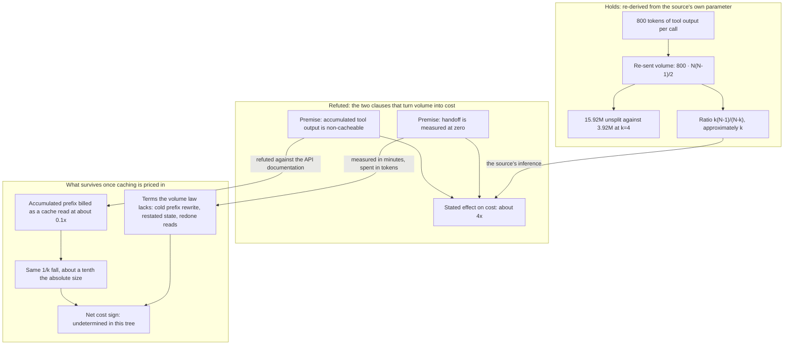

# Analysis: the C5 check of the re-sent-volume cost argument

**Date:** 2026-09-07 16:57
**Type:** Document Study
**Status:** Complete
**Requested by:** user, via orchestrator dispatch (Step 1 of `260907-1450_*_plan-bounded-executor-dispatches.md`)

## Question

Does the cost argument that motivates the bounded-dispatch work say what is true? The argument sits
in one table cell of `260812-0303-simplify-speed-and-why-rules-do-not-hold.md`, and the
specification `260907-0820_*_spec-bounded-executor-dispatches.md` makes it the Circle's closure
condition: if the re-sent-volume law does not hold in the form the source states it, the work stops
and nothing is built. This check re-derives the law from the parameters the source itself gives,
prices it against what the project has since established about caching, names the currency of each
piece of evidence, and records what cannot be settled from anything in this tree.

The answer, stated first and defended below: the volume arithmetic is exact and reproduces to the
digit, and the two clauses that carry it from a token count to a cost saving are both false as
written. The verdict sentence the plan requires closes the report.

## Scope

Read in full: `260812-0303-simplify-speed-and-why-rules-do-not-hold.md` (the source analysis, 434
lines); the `## Grounding snapshot` of this Circle's record; C5 and `## Stops when` in
`260907-0820_*_spec-bounded-executor-dispatches.md`; step 1 of
`260907-1450_*_plan-bounded-executor-dispatches.md`;
`260907-0820_*_is-a-token-side-measurement-of-the-splits-net-cost-worth-building.md`; Findings 2 to 4
of `260907-0710-planability-of-the-bounded-dispatch-spec.md`.

Not done, by the step's own instruction and by C5's seventh criterion: no new measurement, no
instrumentation, no before-and-after comparison. Every figure below is either arithmetic performed
on a parameter already stated in a filed document, or a figure quoted from one. The arithmetic is
derivation, not measurement.

Not done, deliberately: the break-even calculation that option 3 of
`260907-0820_*_is-a-token-side-measurement-of-the-splits-net-cost-worth-building.md` proposes. That
decision is open and performing its recommended option here would pre-empt it. What this check does
instead is show the structural shape that makes such a break-even exist, and name the three inputs it
would need.

**Tree read:** HEAD `223f916a871b4140150417387f4e4e736a64942f`, committed 2026-09-07 16:50:12 +0200,
branch `main`, `git status -sb` reporting `## main...origin/main [ahead 1]` and a clean working tree.
A second session is committing into this checkout during this run. No file this check read moved
under it; the analysis and history files written by this check are the only two it wrote.

## Findings

### 1. The volume law reproduces exactly, and the ratio is not quite k

The source states the remedy at line 246, in the "Effect on cost" column of `## The four remedies,
weighed`: "About 4x. One 200-call dispatch re-sends 15.9M non-cacheable suffix tokens; four 50-call
dispatches re-send 3.9M. Handoff is measured at zero." The growth law is never written down. The one
parameter it needs sits in a different section, at line 254: "At 800 tokens of output per tool call".

On a stateless API each request carries everything accumulated before it. Call *i* of a run therefore
carries 800(*i* − 1) tokens of prior tool output, and the run's total re-sent volume is

> V(N) = Σ 800(*i* − 1) for *i* = 1..N  =  800 · N(N − 1) / 2

which is quadratic in the call count. Both printed figures fall out of it:

| Case | Arithmetic | Result | Source prints |
|---|---|---|---|
| One 200-call dispatch | 800 × 200 × 199 / 2 | 15 920 000 | 15.9M |
| Four 50-call dispatches | 4 × (800 × 50 × 49 / 2) | 3 920 000 | 3.9M |

Splitting a run of N calls into k dispatches of N/k calls each re-sends

> k · V(N/k)  =  800 · N(N − k) / (2k)

so the **ratio** between the unsplit run and the k-way split is exactly k(N − 1) / (N − k). For the
worked example that is 4 × 199 / 196 = 4.061, printed as "about 4x". The ratio approaches k from
above as N/k grows, and it exceeds k for every k greater than one. Eight dispatches of 25 calls give
8 × 199 / 192 = 8.292 on the same input.

So the **1/k dependence** holds: re-sent volume falls as approximately 1/k with the split count, and
the number four in the source is the split count that example chose rather than a saving anybody
measured. The Circle record's second snapshot paragraph says this and it is right.

One correction to a filed artifact. `260907-0710-planability-of-the-bounded-dispatch-spec.md` line 67
writes that "the ratio to the unsplit run is exactly k". It is exactly k(N − 1) / (N − k) and
approximately k; the difference is 1.5 percent at N = 200, k = 4, and it grows as k approaches N. The
snapshot's "approximately k" is the correct form and the first check's "exactly" is not. Nothing in
the argument turns on the gap, and it is noted so the two documents do not sit in contradiction.

**Two quantities the source never separates, and they behave differently.** The absolute saving from
a k-way split is

> V(N) − k · V(N/k)  =  400 · N² · (1 − 1/k)

which is 12.0M tokens for the worked example, and 8.0M at k = 2, 14.0M at k = 8. The ceiling as k
grows without bound is 400 · N², here 16.0M. **The first split captures half of everything a split
can ever save, four dispatches capture three quarters, eight capture seven eighths.** The returns to
further splitting fall away fast, while every added split adds a handoff. Nothing in the source, the
specification or the Circle record states this, and it bears directly on the value chosen for the
bound: a bound that merely halves the longest dispatches already collects the larger half of the
available volume saving.

A second quantity the summed volume hides: the **peak** payload of a single request. The last call of
a 200-call run carries 159 200 tokens of accumulated tool output; the last call of a 50-call dispatch
carries 39 200. The source's own compaction section (line 254) reads the same parameter as filling a
200k window after about 157 calls, which it converts to roughly 23 minutes at the measured median
inter-call gap. That is a different consequence of the same arithmetic and it is not a cost claim.
Finding 6 returns to it.

### 2. The premise that turns volume into cost is false, and it is false as a determined matter

The source's cell calls the re-sent tokens "non-cacheable", and line 395 states the reasoning: "The
API is stateless. The prompt and rules prefix is cacheable; accumulated tool output is not, and it is
re-sent on every call. That is the cost argument for the user's own remedy."

The first half is true and the second is false. Accumulated tool output is re-sent on the wire on
every call, which follows from a stateless API. It is not therefore billed at plain input price.
`260907-0710-planability-of-the-bounded-dispatch-spec.md` Finding 3 verified against the bundled API
documentation that `cache_control` goes on `tool_result` blocks, that the documented multi-turn
pattern places a breakpoint on the last block of the most recently appended turn so that each request
reuses the entire prior conversation prefix, and that a cache read costs about 0.1 times base input
price against a write at 1.25 times.

This check adds no new verification of those API facts and takes them from that finding. What it adds
is what follows for the law:

- **Caching changes the price of the re-sent volume and not the volume itself.** A cached token is
  still transmitted; it is billed differently. So the volume law of Finding 1 is untouched by
  caching, and every ratio in it survives unchanged.
- **The proportional saving therefore survives.** Applying a uniform 0.1 discount to the dominant
  quadratic term leaves the ratio k(N − 1) / (N − k) exactly where it was.
  The **caching counter-effect** does not attack the 1/k dependence; it attacks the size of the
  saving and the identification of that saving with the bill.
- **The absolute saving does not survive.** The 12.0M tokens the worked example appears to save are
  billed at roughly a tenth of what the cell implies, so the saving is of the order of 1.2M
  input-equivalent tokens rather than 12.0M. An argument that reads as an order-of-magnitude claim is
  off by an order of magnitude.
- **The stated cost factor does not follow at all.** "Effect on cost: about 4x" is a claim about a
  total bill. The 4.06 ratio is a claim about one term of it. The two are the same number only if
  that term is the whole bill, which is what "non-cacheable" asserted and what is false.

### 3. The costs a split adds, which the volume law has no term for

Splitting is not free of new terms, and the caching counter-effect is where they enter. Three of
them, none with a token figure anywhere in this tree:

**A cold prefix rewrite.** Each continuation dispatch re-establishes its own static prefix, which for
a bound agent is the always-on rule floor plus the agent prompt plus the dispatch text. If it starts
within five minutes of the request that last wrote or read that prefix, it is a cache read at about
0.1 times input price. Otherwise it is a write at 1.25 times. The extra cost of a cold handoff is
therefore about 1.15 times the prefix size, once per split.

Here this check refines a snapshot paragraph rather than contradicting it. The third snapshot
paragraph states that "each writes its own prefix at about 1.25 times input price" without a
condition. Read on its own that is too strong: the static prefix of two dispatches of the same agent
is byte-identical, so a warm continuation reads it rather than writing it. The paragraph that follows
in the same record supplies the condition, so the record taken as a whole is right and the third
paragraph read alone is not. The conditional reading is the correct one.

**Re-established context.** The continuation prompt restates the state the return report carried.
Residual 3 of the specification records the sharper case: an agent stopped before its first write
hands back no paths and its continuation redoes the reading. Redone reads are fresh tool output,
which re-enters the quadratic on the new dispatch's own clock.

**Orchestrator-side round trips.** Each split adds one report the orchestrator reads and one
continuation prompt it composes, inside the largest context in the system. The source measures that
context at 74 362 tokens before the orchestrator's first task (line 144).

The structural point matters more than any of the three individually. **The saving grows as N² and
the added cost grows as k.** A quadratic term and a linear term cross somewhere, so there is a run
length above which splitting pays and below which it does not, and the sign of the net effect is a
question about where that crossing sits relative to the dispatch lengths fusion actually runs. Three
inputs would locate it: the static prefix size for a bound agent, the token size of a return report
plus its continuation prompt, and the volume of reading a continuation redoes. None is on file. This
is the arithmetic that option 3 of
`260907-0820_*_is-a-token-side-measurement-of-the-splits-net-cost-worth-building.md` proposes, and
this check names its shape without performing it, because that decision is open.

### 4. Where the five-minute lifetime bites, stated conditionally

A cache read refreshes the entry's timer at no additional cost. An entry therefore stays warm for as
long as that dispatch's own requests keep starting less than **five minutes** apart, which is a
property of the request cadence and not of how long the dispatch runs. Generation time counts against
the window, so a single tool call, build or generation that outlives five minutes expires the entry
**inside** a dispatch that is otherwise busy. Across the gap between dispatches nothing refreshes the
timer, and that gap is exactly where the split argument uses the expiry.

Measured over the 97 machine-written handoff gaps in this workbench's event log that are shorter than
24 hours, and quoted from the Circle record rather than re-taken: the median gap is 2.37 minutes, 38
of them (39.2 percent) exceed five minutes, and those 38 carry 97.7 percent of all handoff minutes.

Two qualifications on how far that measurement reaches, neither of which contradicts the snapshot.

**Only one of the three figures bears on the cache question.** Losing a cache entry is a binary event
per handoff, and it costs the same whether the gap was six minutes or six hours. So the 39.2 percent
of handoffs is the figure that prices the cold rewrite, and the 97.7 percent of handoff *minutes* is a
statement about where elapsed time concentrates. The snapshot presents all three together under "the
whole of what durations can settle about the cache question"; of the three, the share of long gaps and
the median are what settle it, and the share of minutes settles something else.

**The measured population is today's handoffs, not the ones this mechanism would create.** The 97 gaps
are gaps between dispatches as the orchestrator makes them now, and they include gaps in which it
committed, reconciled, or waited on a person. A continuation handoff after a bounded return is a
population that does not yet exist. Whether it resembles the measured one is unknown, and the
direction is not obvious in either sense: a continuation may be composed faster than an ordinary next
task, or slower, because the orchestrator has a report to read first.

### 5. The currency of each piece of evidence, and the one place two of them meet wrongly

| Evidence | Currency | What it can support |
|---|---|---|
| V(N) = 800 · N(N−1)/2 and its ratios | tokens re-sent | the 1/k dependence, and nothing about price |
| Cache read at about 0.1x, write at 1.25x | price per token | the repricing in Finding 2 |
| Handoff gap: median 2.37 min, 39.2 percent past five minutes | wall-clock minutes | how often a continuation starts cold |
| `dispatch → dispatch` at 0.0 minutes median, 1.28 hours over 60 transitions (source, line 154) | wall-clock minutes | that handoffs consume little elapsed time |
| Dispatch durations: median 9.35 min, 15 of 131 past 20 minutes | wall-clock minutes | which dispatches a 20-minute bound would reach |
| Standalone-obligation drop, at least 28.6 percent | share of event rows | how often the bound would be honoured |

The source's cell ends "Handoff is measured at zero", and section 2 of the source states the fuller
form at line 156: "There is no queueing overhead to reclaim, and, more usefully, splitting work into
more dispatches is free."

**The free-handoff evidence is a wall-clock measurement of 0.0 minutes at the median, while the volume
argument is denominated in tokens, so the two do not meet.** A handoff that consumes no measurable
wall clock still costs a fresh prefix, a report the orchestrator reads, and a re-dispatch prompt that
restates the state, all of which are tokens and none of which a minute measurement can see. The word
"free" in line 156 carries a minute figure into a token argument with no bridge. The user accepted the
minute measurement as sufficient evidence on 260907, knowing it is not in the currency of the
argument, and asked that the limitation be written down rather than left implicit; it is written down
here, in the specification's C5, and in the Circle record's fifth snapshot paragraph.

There is a second problem with that clause, and it lives inside the minute currency rather than across
currencies. The source's 0.0-minute median and the Circle's 2.37-minute median are two readings of the
handoff, and they do not agree. They are not the same population: the source reads 60 transitions
across both projects for a total of 1.28 hours, and the Circle reads 97 machine-written gaps in fusion
alone under a 24-hour cutoff. This check takes no new measurement to reconcile them, and it does not
need to. What matters is that the project's own later and narrower reading does not reproduce the
zero, and that there is a reason to prefer the later one: the source measured over a log in which, by
its own Finding at line 206, at least 28.6 percent of `task_start` rows were never written, so any
pairing over that log has holes exactly where a handoff begins. **The claim "handoff is measured at
zero" is therefore unsupported in its own currency as well as in the argument's.**

### 6. What the closure clause's premise assumes

The specification's `## Stops when` reasons that "the bound has no other rationale, and the scope
excludes rule adherence, so nothing is left to build". The first half is a scoping decision rather
than a fact, and the source itself names a second candidate that the scoping put outside.

The source's compaction section (lines 252 to 263) reads the same 800-token parameter as filling a
200k window after about 157 calls, roughly 23 minutes at the measured median inter-call gap, and notes
that compaction summarises the oldest part of the context, which is where the rules sit. It labels the
consequence `inference:`, says it cannot explain the flat within-document measurement, and concludes
that the corpus was not being followed in the first place so the second mechanism is not yet worth
measuring.

The observation is recorded here and deliberately not used. Two reasons. The specification put rule
adherence out of scope by decision, and a check has no standing to scope it back in. And the source's
own verdict on the compaction thread is that it is unmeasured and second in line. What the observation
does establish is narrower: the closure clause's "nothing is left to build" holds under the scope this
Circle chose, not as a statement about the world. A later Circle that wants the bound for a different
reason would have to establish that reason on its own evidence.

### 7. What is undetermined, and what would answer it

The net cost effect of splitting a dispatch is undetermined from anything in this tree. Nothing in
fusion carries a token figure, the event log has no token field, and no event records a tool call
inside a dispatch. C5's sixth criterion makes an undetermined cache half a passing outcome, and this
check records it as one rather than scoring it.

What would answer it, in the order
`260907-0820_*_is-a-token-side-measurement-of-the-splits-net-cost-worth-building.md` recommends:
option 3 first, deriving a break-even split count from the published price ratios and the prefix size
the project already measures for itself, which needs one pass and no instrumentation; then option 2,
reading per-request cache-read and cache-write counts from the harness, only if the arithmetic puts
the break-even near the dispatch lengths fusion runs. That decision is open, it does not block this
work, and this check does not answer it.

### Where the source's argument holds and where it breaks

## Implications

The check itself passes. C5's seven process criteria are each satisfiable by a named passage above,
and the criterion that permits an undetermined cache half is exercised rather than evaded: the
undetermined net sign is recorded as undetermined in Finding 7 and is not used to fail anything.

**The verdict on the law is a separate matter from whether the check passes, and it is negative.** The
source states the law inside a cost column, and its statement has three parts. The volumes and their
ratio are exact. The premise that those tokens are non-cacheable is false, determined, and it is the
premise that carries the sentence from a token count to a bill. The companion clause that the handoff
is measured at zero is unsupported in the currency the argument uses and is not reproduced by the
project's own later measurement in the currency it was taken in. Two of the three parts fail, and the
two that fail are the two that make the cell a cost claim rather than an arithmetic exercise.

The failure rests on determined findings and not on the undetermined half. If the only problem were
that nobody can price the net effect, this check would report a passing law with an open question
beside it. The problem is that the sentence on file asserts something about the API that is not so.

**What survives is real and it is smaller than advertised.** Splitting a long run does reduce the
dominant re-sent term by approximately 1/k, that reduction survives caching as a proportion, and the
first split collects half of everything available. Set against it are three added terms nobody has
sized. A mechanism built across the agent prompts, the rule corpus, the configuration loader, the
event reader and the test suite on that footing would be resting on a saving whose magnitude is
overstated by roughly an order of magnitude in the only document that states it, and whose sign is not
established.

Under the specification's `## Stops when`, a negative verdict closes the Circle and Steps 2 to 15 of
the plan are not run. That consequence is the specification's, not this check's, and this check does
not soften it.

**One defect in the plan, worth correcting whatever the gate decides.** C5 carries **nine**
acceptance criteria, not eight. The plan's step 1 refers to "C5's criteria 1 to 7" and then calls the
user's acceptance "criterion 8"; the user's acceptance is criterion 9, and the criterion the count
skips is criterion 8, "the corrected figures replace the wrong ones in this Circle's own record". That
criterion is already satisfied: the record's `## Grounding snapshot` carries the corrections, and this
check did not edit it, since an analyst does not write the Circle record. The miscount hides a
criterion rather than an unmet obligation, but a numbering that skips a line is how an obligation goes
missing the next time somebody reads the list.

## Recommendations

1. **Put this check to the user at the closing gate**, which is C5's ninth criterion and the closure
   event. The gate decides, not this report.
2. **If the user accepts the verdict**, close the Circle on the finding and do not run Steps 2 to 15.
   Carry into the closure note what survives: the 1/k dependence, the diminishing returns past the
   first split, and the three unsized terms that run the other way.
3. **Answer the held decision before reviving the work.** Option 3 of
   `260907-0820_*_is-a-token-side-measurement-of-the-splits-net-cost-worth-building.md` costs one pass
   and would put a break-even run length beside the dispatch durations the project has already
   measured. That is the cheapest thing that could turn the rationale from unestablished to
   established, in either direction. Route it to `analyst`.
4. **If the user rejects the verdict** and reads the closure clause as bearing on the volume law
   alone, Steps 2 to 15 remain runnable, and Finding 1's diminishing-returns arithmetic belongs in
   the record as an input to the bound's value: halving the longest dispatches collects the larger
   half of the available volume saving, and further splitting collects progressively less against one
   added handoff each.
5. **Correct the plan's criterion count** from eight to nine at step 1, whichever way the gate goes,
   so that criterion 8 is not skipped by a later reader. Route to `planner`.

## Filed Issues

None. The two defects this check found are each a correction inside a document that another agent
owns, and neither is a defect in code, data or shipped text. The ratio wording in
`260907-0710-planability-of-the-bounded-dispatch-spec.md` is a correction to a superseded check and is
recorded in Finding 1 rather than filed. The criterion count in
`260907-1450_*_plan-bounded-executor-dispatches.md` is recorded in the Implications and belongs to the
planner if the plan runs at all; filing an issue against a plan the gate may abandon would leave a
record nobody closes.

## Sources

- `260812-0303-simplify-speed-and-why-rules-do-not-hold.md`: line 246 (the remedy row and the cost
  cell), line 254 (800 tokens of output per tool call, and the 157-call window), lines 252 to 263 (the
  compaction section), lines 154 to 156 (the free-handoff claim), line 144 (74 362 tokens of context
  reload), line 206 (177 `task_start` against 248 `task_done`), line 395 (the statelessness premise).
- `_t_circle.md`, `## Grounding snapshot`: the paragraphs headed "What the cost claim rests on,
  corrected", "The premise that turned volume into cost is false as stated", "Where the five-minute
  lifetime bites, and where it does not", and "The free handoff is measured in minutes".
- `260907-0820_*_spec-bounded-executor-dispatches.md`: C5 with its nine criteria and its decision
  block, `## Stops when`, `## Measured, and not open`.
- `260907-1450_*_plan-bounded-executor-dispatches.md`: step 1, and the step-dependency graph that
  makes step 1 the gate.
- `260907-0710-planability-of-the-bounded-dispatch-spec.md`: Finding 2 (the arithmetic
  reconstruction), Finding 3 (the API verification of cacheability and the price ratios), Finding 4
  (the currency of the handoff measurement).
- `260907-0820_*_is-a-token-side-measurement-of-the-splits-net-cost-worth-building.md`: the three
  options and the recommendation of option 3 first.

## Open Questions

- [ ] Does the user accept this check at the closing gate? C5's ninth criterion, and the closure
      event.
- [ ] What is the break-even run length above which splitting pays, given the three unsized terms in
      Finding 3? Held by
      `260907-0820_*_is-a-token-side-measurement-of-the-splits-net-cost-worth-building.md` and not
      answered here.
- [ ] Does a continuation handoff after a bounded return resemble the 97 measured handoff gaps?
      Unanswerable before the mechanism exists, and it decides how often a continuation starts on a
      cold prefix.

## Verdict

**The law does not hold in the form the source analysis states it.**
