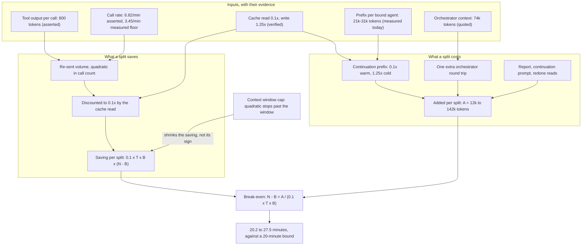

# Analysis: the break-even arithmetic for splitting a dispatch

**Date:** 2026-09-07 20:12
**Type:** Comparative
**Status:** Complete
**Requested by:** user, executing option 3 of `260907-0820_*_is-a-token-side-measurement-of-the-splits-net-cost-worth-building.md`

## Question

Is there a run length above which splitting one dispatch into several saves money net of what the
split costs, and where does that length sit relative to the dispatch lengths fusion actually runs?
The C5 check established that the source's cost claim is false as written and left the net sign
undetermined. This report closes the sign by arithmetic rather than by measurement, which is
option 3 of the held decision, and reports the break-even against the 20-minute bound the user chose.

## Scope

Derived here: a cost model for one dispatch under the documented prompt-caching pattern, its
break-even condition solved for run length and split count, and the comparison against the 131
machine-written dispatch pairs in this workbench's event log.

Measured here, all of it from what is already on disk: the always-on rule floor and the seven bound
agents' prompt sizes, the dispatch duration distribution re-derived from
`orchestrator-events.jsonl`, and the inter-write-call gap re-derived from `.guard-state/events.jsonl`.

Not done, by the dispatch's own bound: no instrumentation, no measurement against a running dispatch,
no before-and-after comparison. No file was changed except this report and its history entry.

Read in full: `260907-0820_*_is-a-token-side-measurement-of-the-splits-net-cost-worth-building.md`;
`260907-1657-c5-cost-argument-check.md`; the `## Grounding snapshot` of `_t_circle.md`; Findings 2 to
4 of `260907-0710-planability-of-the-bounded-dispatch-spec.md`; sections 1, 2 and the compaction
section of `260812-0303-simplify-speed-and-why-rules-do-not-hold.md`; the bundled `claude-api`
skill's `shared/prompt-caching.md` Economics and TTL sections and its current-models table.

**Tree read:** HEAD `223f916a871b4140150417387f4e4e736a64942f`, committed 2026-09-07 16:50:12 +0200,
branch `main`, `git status -sb` reporting `## main...origin/main [ahead 1]`.

**A file moved under this run and it is reported rather than worked around.** At the start of the
run the working tree carried one modification, `rules/circle-records.md`. By the time the prefix
measurement was taken it carried six, including `agents/playmaker.md`,
`hooks/lib/__tests__/fixtures/rules-emission.golden` and `skills/setup/SKILL.md`. A second session is
editing this checkout. None of the moved files is an input to this calculation: `playmaker` is exempt
from the bound, `circle-records.md` is emitted to no bound agent, and the coder rule floor was
re-measured after the drift and reproduced 75 696 bytes unchanged. The seven bound agents' figures in
Finding 2 were taken after that re-check.

## Findings

### 1. The cost model, with every assumption labelled

Let *N* be the number of tool calls in a run, *T* the tokens of tool output per call, *P* the static
prefix a dispatch establishes (rule floor plus agent prompt), *B* the bound expressed in calls, and
*A* the cost one split adds. All costs are in input-price-equivalent tokens: a cache read of *x*
tokens counts as 0.1*x*, a cache write as 1.25*x*.

**The assumptions, one per line.**

| # | Assumption | Label | Source |
|---|---|---|---|
| 1 | The Messages API is stateless, so every request carries the whole accumulated conversation | `verified` | `260907-0710` Finding 3, against the bundled API documentation |
| 2 | `cache_control` applies to `tool_result` blocks, and the multi-turn pattern reuses the entire prior prefix | `verified` | Same finding, same source |
| 3 | Cache read costs 0.1x base input price, cache write 1.25x at the 5-minute TTL | `verified` | Read directly: `claude-api/shared/prompt-caching.md:144` |
| 4 | A cache read refreshes the timer at no cost, and the lifetime runs from the start of the writing or reading request | `verified` | `claude-api/shared/prompt-caching.md:148` |
| 5 | Tool output averages *T* = 800 tokens per call | `speculation:` | Asserted at `260812-0303-simplify-speed-and-why-rules-do-not-hold.md:254`, with no measurement anywhere in that document or this tree |
| 6 | Bytes convert to tokens at 4.0 | `inference:` | The source's own 74 362-token figure divides its stated 297 448 bytes by exactly 4.000; its `tasklist.md` figure implies 3.757, a 6 percent spread that changes no conclusion below |
| 7 | Tool calls arrive at a median gap of 8.8 seconds, so 6.82 per minute | `inference:` | Quoted from `260812-0303:254`; this report's own independent floor is in Finding 3 |
| 8 | Claude Code bills a sub-agent dispatch the way the API bills a conversation, and a continuation dispatch starts from a fresh context that cannot read the previous dispatch's tail | `speculation:` | Not verifiable from this repository. The decision record names this as option 3's weakness, and Finding 6 prices it |

**The cost of one dispatch of *n* calls.** Under assumptions 1 to 3, request *i* reads everything the
previous request established and writes only the delta the last turn added:

> C(*n*) = 1.25·P + 0.1·Σi=2..n[P + T(i−2)] + 1.25·T·n

The dominant term is quadratic and discounted: 0.05·T·n². Everything else is linear in *n*.

**The saving from one split at the bound.** A run of *N* calls that stops at *B* and continues in a
second dispatch of *N*−*B* calls re-sends, in place of T·N(N−1)/2, the sum
T·B(B−1)/2 + T·(N−B)(N−B−1)/2. The difference is exact and the linear terms cancel:

> volume saved by one split = T·B·(N − B)

Priced at the cache-read rate, the saving is 0.1·T·B·(N − B). For *k* dispatches, with *k*−1 of them
full and a remainder *r*, the general form is 0.1·T/2·[N² − (k−1)B² − r²].

**The cost one split adds.** Three terms, none of which the volume law has:

> A = cP·P + 0.1·Xorch + 1.25·R + 1.25·S

where cP is 1.25 when the continuation starts cold and 0.1 when it starts warm,
Xorch is the orchestrator's own context re-read on the extra round trip, *R* is the return
report plus the continuation prompt, and *S* is the reading a continuation redoes.

### 2. The prefix the project measures for itself, taken today

`bin/fusion-rules coder | xargs wc -c` prints 75 696 bytes, which is the three always-on rule files
plus this project's chat voice profile and no conditional emission. Added to each bound agent's own
prompt:

| Bound agent | Rule bytes | Prompt bytes | Prefix bytes | Prefix tokens |
|---|---|---|---|---|
| coder | 75 696 | 9 649 | 85 345 | 21 336 |
| ontocoder | 75 696 | 13 262 | 88 958 | 22 239 |
| bugfixer | 75 696 | 11 509 | 87 205 | 21 801 |
| coderev | 82 516 | 8 141 | 90 657 | 22 664 |
| ontorev | 82 516 | 7 094 | 89 610 | 22 402 |
| reconciler | 80 648 | 22 825 | 103 473 | 25 868 |
| curator | 89 601 | 34 554 | 124 155 | 31 038 |

`coder` is 84 of the 131 machine-written pairs and 10 of the 13 long ones, so its 21 336 tokens carry
the optimistic case and `curator`'s 31 038 the pessimistic one. The project's `CLAUDE.md` adds a
further 87 481 bytes, 21 870 tokens, but it arrives through a Read call at Setup rather than in the
injected prefix, so it belongs to *S* and not to *P*.

### 3. The dispatch lengths, re-derived rather than quoted

Pairing `task_start` to `task_done` on exact agreement of `session_id`, `agent` and `task`, over the
542 rows that carry a `session_id` and are therefore machine-written, reproduces the Circle record's
population to the digit: **131 pairs, median 9.35 minutes, p90 22.28, max 90.83, 15 past 20 minutes
(11.5 percent)**. Restricted to the seven bound agents the population is 114 pairs with 13 past 20
minutes (11.4 percent). The window is 2026-08-27 13:21 to 2026-09-07 13:06, 10.99 days.

The 13 long bound-agent dispatches, in minutes: 20.57, 22.28, 22.48, 23.27, 23.33, 25.37, 25.62,
28.07, 28.25, 30.55, 33.70, 36.58, 90.83.

**One independent floor on the call rate.** The guard event log carries one `guard_allow` row per
write-tool call. Over its 538 rows the median gap between consecutive write calls is **17.4 seconds**.
Reads, greps, globs and Bash reach no hook, so the true inter-call gap is shorter than that, and the
source's 8.8 seconds implies about two tool calls per write call. The two figures agree in direction.
This report therefore carries both: 6.82 calls per minute as the source's figure and 3.45 as the
write-only floor, and reports every result in both.

### 4. The break-even condition, solved

Setting the saving from one split equal to what the split costs:

> 0.1·T·B·(N − B) = A   →   **N − B = A / (0.1·T·B)**

The run must exceed the bound by A/(0.1·T·B) calls, and the split count drops out. That is the first
substantive result: how many pieces a run is cut into does not move the break-even, because the
saving and the added cost both scale with the number of splits. What moves it is the bound's own
value, and it moves it inversely, so a *shorter* bound raises the run length at which splitting
starts to pay. Finding 5 measures that against three candidate bounds.

**A, in four cells.** The optimistic cell takes a warm continuation of `coder` with no redone reading;
the pessimistic cell takes a cold continuation of `curator` that re-reads `CLAUDE.md` and its plan.

| Cell | cP·P | 0.1·Xorch | 1.25·R | 1.25·S | A |
|---|---|---|---|---|---|
| optimistic | 2 134 | 7 436 | 2 500 | 0 | **12 070** |
| pessimistic | 38 799 | 7 436 | 5 000 | 43 000 | **94 235** |
| extreme | 38 799 | 50 000 | 10 000 | 43 000 | **141 799** |

Xorch = 74 362 tokens is the orchestrator's context before its first task
(`260812-0303:144`); the extreme cell raises it to 500 000 to represent a deep session. *R* is
`speculation:` at 2 000 to 8 000 tokens, since no return report or continuation prompt exists to
measure.

**The break-even run length at the 20-minute bound:**

| Call rate | A | Bound in calls | Break-even excess | Break-even run length | Long dispatches that pay |
|---|---|---|---|---|---|
| 6.82/min | 12 070 | 136 | 1.1 calls | **20.16 min** | 13 of 13 |
| 6.82/min | 94 235 | 136 | 8.6 calls | **21.27 min** | 12 of 13 |
| 6.82/min | 141 799 | 136 | 13.0 calls | **21.91 min** | 12 of 13 |
| 3.45/min | 12 070 | 69 | 2.2 calls | **20.63 min** | 12 of 13 |
| 3.45/min | 94 235 | 69 | 17.1 calls | **24.95 min** | 8 of 13 |
| 3.45/min | 141 799 | 69 | 25.7 calls | **27.45 min** | 6 of 13 |

The last column counts by the discrete formula rather than the continuous break-even, so a dispatch
whose remainder piece is only a few calls long can fall on the losing side of a break-even it nominally
clears.

### 5. The comparison with the lengths fusion runs

The break-even sits between 20.2 and 27.5 minutes. Seven of the 13 long dispatches fall inside that
band: 20.57, 22.28, 22.48, 23.27, 23.33, 25.37 and 25.62 minutes. Whether splitting those seven pays
depends on which cell is right, and the best and worst cells disagree about all seven. Above 28
minutes every cell agrees, and the six dispatches from 28.07 to 90.83 minutes pay in all six.

**The bound's own value, checked against four candidates.** Because a shorter bound buys more splits
at a smaller saving each, the break-even moves with it, and not in the direction intuition suggests.
Net over the same 13 dispatches, in input-equivalent tokens priced at $5 per million:

| Bound | Best cell | Worst cell | Long dispatches that pay, worst cell |
|---|---|---|---|
| 10 min | $120.26 | $5.79 | 2 of 13 |
| 20 min | $89.55 | $11.81 | 6 of 13 |
| 25 min | $71.75 | $11.42 | 3 of 13 |
| 30 min | $57.28 | $10.49 | 2 of 13 |

The best cell rewards a short bound and the worst cell punishes it. The 20-minute value the user chose
sits at the maximum of the worst cell and gives up a quarter of the best cell's figure to get there,
which is what a robust choice looks like when the inputs span an order of magnitude.

**The aggregate is not a close call, and that is the load-bearing distinction.** Applying the general
*k*-split formula to the 13 dispatches with a 20-minute bound, which produces 16 splits in total:

| Call rate | Gross saving | Cost of 16 splits | Net | Net at $5/MTok |
|---|---|---|---|---|
| 6.82/min, A = 12 070 | 18.10M | 0.19M | **17.91M** | $89.55 |
| 6.82/min, A = 141 799 | 18.10M | 2.27M | **15.83M** | $79.17 |
| 3.45/min, A = 12 070 | 4.63M | 0.19M | **4.44M** | $22.19 |
| 3.45/min, A = 141 799 | 4.63M | 2.27M | **2.36M** | $11.81 |

All figures are input-price-equivalent tokens over the 10.99-day window. The price is Claude Opus 5
input at $5.00 per million tokens, read from the bundled skill's current-models table; the model this
session runs on is `claude-opus-5[1m]`, so `inference:` that fusion's dispatches bill at that rate.

**The net reaches zero only at a per-split cost of 289 405 tokens at the write-only rate and
1 131 462 at the source's rate.** The most pessimistic *A* this report could construct is 141 799.
The aggregate verdict therefore carries a margin of 2.0x in the worst cell and 8.0x in the best.

**How wrong the 800-token parameter would have to be.** The gross saving is linear in *T*, so the
aggregate turns negative when tool output averages less than 392 tokens per call in the worst cell
and less than 8.5 in the best. The source asserts 800. The parameter would have to be overstated by a
factor of 2.0 in the worst cell and 94 in the best. It is the least evidenced input in this model,
and only in the cell that combines the write-only call rate with the extreme added cost does it come
within one doubling of deciding anything.

### 6. What could still flip the sign, and what could not

Only one assumption inverts the result, and it is verified against it. If the harness kept
server-side conversation state, no accumulated tail would be re-sent, the quadratic would vanish, and
splitting would be pure cost. Assumption 1 rules that out: the Messages API is stateless and every
request carries the whole conversation.

The remaining unverifiable assumption, number 8, is bounded rather than open. It enters the model
only through *A*, and *A* would have to be twenty times the extreme cell's value before the aggregate
turned negative. An error in how this harness bills a sub-agent dispatch is therefore an error in the
*size* of the saving, not in its sign, unless that error is of a magnitude no plausible accounting
produces.

Two assumptions that could be wrong in the other direction, both favouring the split further. If the
harness places no cache breakpoint on the growing tail, the quadratic bills at full input price and
the saving is ten times larger. If a sibling sub-agent shares the parent's cached prefix, *A* falls
by its largest single term.

**One correction to the source that cuts the other way, and it is the largest single caveat here.**
The compaction section of `260812-0303` reasons from a 200 000-token window filling after about 157
calls. A run beyond that point compacts, its per-call payload stops growing, and the volume law stops
being quadratic. Under a 200 000-token window the longest measured dispatch, 90.83 minutes and about
619 calls at the source's rate, would carry 496 000 tokens of accumulated tool output and could not
run uncompacted; the unsplit run's cost would be roughly 59 percent lower than the quadratic
predicts, and the saving from splitting it about four times smaller. Two things keep the conclusion.
The window on this session's model is 1M rather than 200k, read from the bundled skill's models
table, so the whole measured population fits uncompacted. And even under the 200k assumption the
capped saving for that one dispatch is 3.09M input-equivalent tokens against at most 0.57M of added
cost, so the sign holds while the magnitude shrinks.

### Where the terms of the model meet

## Implications

The net sign is positive and the argument that carries it is not the one the source made. The source
claimed a fourfold effect on the bill from tokens it called non-cacheable. Those tokens are
cacheable, the effect on the bill is about a tenth of what the cell implies, and what survives is
still enough: the term that splitting attacks grows as the square of the run length while everything
splitting adds grows linearly, so the two cross, and at a 20-minute bound they cross between 0.2 and
7.5 minutes past the bound itself.

The quantity worth carrying forward is the money rather than the ratio. Over the 10.99 days the
machine-written log covers, a 20-minute bound applied to the 13 long dispatches would have saved
between 2.4M and 17.9M input-price-equivalent tokens, $12 to $90 at Opus 5 input pricing. Annualised
at the same cadence that is $400 to $3 000 for one developer on one project. Set against it is a
15-step plan touching eight agent prompts with 4 618 bytes of growth-bound head-room, and the C5
finding that the mechanism buys a requested bound rather than an enforced one, so the saving is
realised only when an agent honours the request. The measured floor on how often a standalone
obligation is honoured in this project is 28.6 percent dropped.

The break-even's position also says something about the bound's value that the Circle has not
recorded. A shorter bound buys more splits at a smaller saving each, so it raises the run length at
which splitting starts to pay rather than lowering it. Finding 5's third table puts the 20-minute
value at the maximum of the worst cell, ahead of 10, 25 and 30 minutes, at the price of a quarter of
what the best cell would pay at 10 minutes. The user picked that value on grounds that had nothing to
do with this arithmetic, and the arithmetic agrees with it.

## Recommendations

1. **Take the verdict below to the closing gate alongside the C5 check.** The C5 check found the
   source's law false as stated and left the sign open; this report closes the sign as positive and
   sizes the saving. The two together say the mechanism would save money, that the saving is roughly
   a tenth of what the motivating document implied, and that the sum is small. Whether that justifies
   the build is the user's call at the gate, not this report's.

2. **Do not build option 2.** The measurement it proposes would replace inputs 5, 7 and 8 with
   measured figures. The aggregate verdict survives a twofold error in input 5 and a twentyfold error
   in input 8, so a measurement would sharpen a number whose sign is already settled in every cell.
   Recommendation 3 tests that against the record's own criterion rather than against this report's
   preference.

3. **On the record's criterion, the honest reading is split and the split matters.** The record says
   to reach for option 2 if the arithmetic puts the break-even near the dispatch lengths fusion
   actually runs. Read literally, it does: the break-even at 20.2 to 27.5 minutes falls inside the
   cluster of seven dispatches between 20.6 and 25.6 minutes, and the cells disagree about all
   seven. Read for what the criterion was for, which is an uncertain sign, it does not: the aggregate
   is positive in all six cells with a 2x to 8x margin, because the six dispatches past 28 minutes
   dominate and every cell agrees about those. What is uncertain is which of the seven marginal
   dispatches pay, and that question is worth at most the difference between $11.81 and $89.55 over
   eleven days. A measurement is the wrong instrument for a quantity that small. If the marginal case
   is worth acting on at all, the lever is the bound's value, and Finding 5 shows 20 minutes is
   already the worst-cell optimum among the four candidates tested.

4. **Correct the compaction assumption in the Circle record if the work proceeds.** The record and
   the source both reason from a 200 000-token window. This session's model carries 1M. The window
   determines where the quadratic stops, which is the one input that shrinks the saving materially,
   and the Circle should not carry the smaller figure as if it were current. Route to `shaper`.

5. **Carry the split-count result into the bound's rationale.** The break-even does not depend on how
   many pieces a run is cut into, and it moves inversely with the bound, so a shorter bound is worse
   rather than better. Together with the C5 check's diminishing-returns finding, that the first split
   collects half of everything available, the two say the bound's value is the only parameter worth
   arguing about, and that arguing it downward is the wrong direction. Route to `planner` if steps 2
   to 15 run.

## Filed Issues

None. This report answers an open decision rather than finding a defect. The compaction correction in
recommendation 4 belongs to the Circle record, which the shaper owns, and the decision record's own
marker is the orchestrator's to move.

## Sources

- `260907-0820_*_is-a-token-side-measurement-of-the-splits-net-cost-worth-building.md`: option 3, its
  two stated cons, and the recommendation's criterion.
- `260907-1657-c5-cost-argument-check.md`: Finding 1 (the volume law and the diminishing returns),
  Finding 2 (the repricing), Finding 3 (the three unsized terms and the structural crossing),
  Finding 4 (the five-minute lifetime), Finding 7 (what would answer it).
- `260907-0710-planability-of-the-bounded-dispatch-spec.md`: Finding 3, the API verification of
  `tool_result` cacheability, the multi-turn breakpoint pattern and the 0.1x/1.25x price ratios.
- `260812-0303-simplify-speed-and-why-rules-do-not-hold.md`: line 144 (74 362 tokens of orchestrator
  context, and the byte-to-token ratio it implies), line 246 (the remedy row), line 254 (800 tokens
  per tool call, the 8.8-second median gap, the 157-call window fill), line 206 (28.6 percent).
- `_t_circle.md` `## Grounding snapshot`: the seven bound agents, the 20-minute value, the 131 pairs
  and the 13 long bound-agent dispatches.
- Bundled `claude-api` skill: `shared/prompt-caching.md:144` (cache read 0.1x, write 1.25x at the
  5-minute TTL), `:148` (the read refreshes the timer, lifetime from request start), and the
  current-models table (Claude Opus 5 input $5.00 per million tokens, 1M context).
- Measured today at HEAD `223f916a`: `bin/fusion-rules coder | xargs wc -c` (75 696 bytes),
  `wc -c agents/*.md`, `orchestrator-events.jsonl` (131 machine-written pairs),
  `.guard-state/events.jsonl` (538 `guard_allow` rows, 17.4-second median gap).

## Open Questions

- [ ] Does Claude Code bill a sub-agent dispatch the way the API bills a conversation? Assumption 8,
      unverifiable from this repository, bounded in Finding 6 rather than answered.
- [ ] What is the token size of a bounded return report plus its continuation prompt? The one input
      here with no anchor of any kind, carried as a range and not deciding the result.
- [ ] Which of the two call rates is right? The source's 8.8-second median gap and this report's
      17.4-second write-only floor differ by a factor of two, and that factor is what separates a
      break-even of 21.3 minutes from one of 27.5. Answering it needs a per-tool-call record the
      event log does not keep.

## Verdict

**Splitting saves from a run length of 21 minutes under the source's own call rate and 25 minutes
under this report's measured floor, with the six-cell range running from 20.2 to 27.5 minutes against
a 20-minute bound.**
