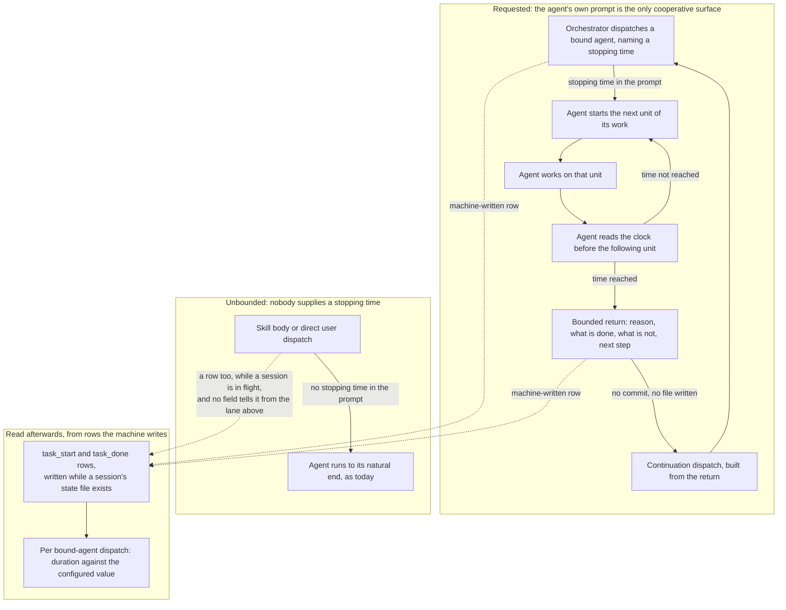
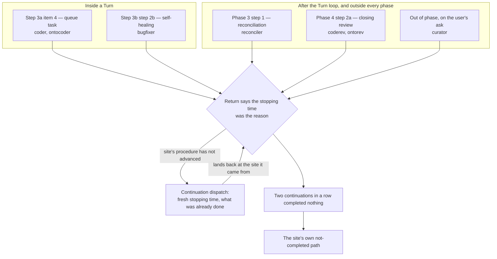

# Spec: bound how long a dispatched agent runs before it returns

**Date:** 2026-09-07
**Status:** Draft
**Activated from Circle:** 260906-2258-bounded-executor-dispatches
**Source:** the Circle's filed Directive of 260906, reworked three times. The first planability check
`260907-0710-planability-of-the-bounded-dispatch-spec.md` found eight gaps and the user closed four of
them in chat on 260907. The second check
`260907-0836-second-planability-check-of-the-bounded-dispatch-spec.md` found nine, of which the user
closed two on 260907 and the second revision closed the remaining seven. The third check
`260907-1401-third-planability-check-of-the-bounded-dispatch-spec.md` found seven more, three of them
blocking, and this revision closes all seven. It changes no scope, no value and no agent assignment;
every one of the seven was a join the narrowing to seven agents opened and the second revision did not
walk.

## Directive

After this work every dispatched agent that carries the bound is asked, at the moment it is
dispatched, to stop at a named wall-clock time and hand back the work in whatever state it has
reached. The orchestrator continues that work in a fresh dispatch built from the return, and writes
no continuation file anywhere. The bound is a request and not an enforcement, because nothing fusion
has can make a sub-agent give back control; what is enforced is only the reading afterwards of
whether the request was honoured. The bound exists for cost, and this work closes when the cost
argument on file says what is true about the saving it claims.

## What this specification is buying: a requested bound, not an enforced one

This section is first because it governs every capability below, and because the record this
specification replaces did not state it.

Two questions sit inside "the agent stops at its bound", and they have different answers. *Has this
agent reached its stopping time* is decidable: the machine already writes a `task_start` row at
every dispatch made inside an orchestrator session, so elapsed time is readable from data fusion
holds. *Can the agent be made to give back control at that point* is decidable by nothing fusion
has. A PreToolUse hook can refuse a tool call, which fails that call and leaves the agent running. A
SubagentStop hook fires after the run has already ended. The only surface that can end a run
cooperatively, with the half-finished work handed back, is the agent's own prompt.

An obligation stated as a sentence in a prompt is the standalone kind, and this project has measured
what happens to that kind. Over the 1265 event rows written before 2026-08-12, the orchestrator
emitted 177 `task_start` rows against 248 `task_done` rows. **At least 28.6 percent of dispatches
were announced finished having never been announced started.** The figure is a floor and not a point
estimate: its denominator is the count of announced completions, so a dispatch that announced
neither row is invisible to it and the true drop rate can only be higher. Both instructions sat in
one prompt file. The one that rides the act of finishing held, and the one that had to be recalled
before the act did not.

So the honest expectation is this. The stopping time will be honoured some of the time, at a rate
this project's own history puts well short of always, and the saving is therefore an expected value
rather than a guarantee. Three things shape that exposure, and the spec is explicit about how much
each is worth:

1. **The agent compares a clock reading against a fixed time it was handed**, rather than keeping a
   running count of anything. `inference:` the project has measured that the orchestrator's
   hand-maintained session counters were not kept, and a comparison against a constant is a smaller
   act than maintaining a counter. No measurement in this tree covers a dispatched agent counting
   its own work, so this is reasoning from an adjacent case rather than evidence about this one.
2. **The reading is taken at a named moment that the agent reaches anyway** — immediately before it
   starts the next unit of its work (C1). This is the ride the project's finding actually turns on.
   It is weaker than the ride the completion event gets, because starting a unit of work produces no
   observable event, and the spec claims no more for it than that.
3. **The stopping time travels in the dispatch prompt.** This is where the value has to be, since it
   differs per dispatch and no prompt file can hold it. It is not a second mechanism for making the
   obligation hold: an earlier draft of this specification claimed that moving the sentence out of
   the agent's prompt file made it stick better, and that claim is withdrawn. Moving a sentence
   changes where it is written, not what act it rides.

Nothing here turns a request into an enforcement. Nothing available in this tree does.

The one cycle in that graph is the work loop and its continuation, and both are intended. The dotted
edge from the unbounded lane is the join the second revision of this specification missed. Rows are
written whenever an orchestrator session's state file exists, whoever made the dispatch, so a skill
body's dispatch during a live session lands in the same log as the orchestrator's own and carries no
field that separates them. The reading lane therefore reports durations against a configured value
and states that limit, rather than claiming to know which dispatch was bound; C4 says so rather than
pretending otherwise.

## Capabilities

### C1: A dispatched agent is told when to stop

**Description:** Every dispatch of an agent that carries the bound names a stopping time. The agent
reaching it stops working and returns, rather than continuing to the natural end of its task.

**Acceptance criteria:**

- [ ] Every dispatch of a bound agent **that the orchestrator itself makes** carries a stopping time
      expressed as a clock time the agent can compare a single reading against. It is never expressed
      as a duration the agent has to track while it works.
- [ ] A dispatch of a bound agent made by anything else carries no stopping time and runs to its
      natural end. That covers a skill body, and `/fusion:curate` and `/fusion:cleanup` are the
      ordinary dispatchers of `curator` and `reconciler`. It covers a user running an agent directly
      too, and it holds whether or not an orchestrator session happens to be in flight at the time.
- [ ] The stopping time derives from one project-settable value. A project that sets nothing gets a
      shipped default of **20 minutes**.
- [ ] The measurement behind the 20 minutes is stated where the number is set, together with the
      population it was taken over, so a later reader can re-take it. That statement reads: over the
      131 machine-written dispatch pairs in this project's own event log, 15 of them, 11.5 percent,
      ran longer than 20 minutes; over the 114 of those pairs made by an agent the bound covers, 13,
      11.4 percent, did.
- [ ] The bound covers exactly these seven agents: `coder`, `ontocoder`, `bugfixer`, `reconciler`,
      `coderev`, `ontorev`, `curator`.
- [ ] These seven agents are exempt and their dispatches carry no stopping time: `analyst`,
      `consultant`, `editor`, `planner`, `playmaker`, `shaper`, `taskplanner`.
- [ ] The two lists together name 14 of the 15 prompt files in `agents/` (counted in the tree at
      `abcaa823`), and every agent appears in at most one of them. Two entries are stated here so the
      criterion can be ticked truthfully rather than approximately. `orchestrator` is in neither list,
      because no `tools:` allowlist in the tree names `Agent(fusion:orchestrator)`, so it is a
      dispatch target nowhere. `consultant` stands on the exempt list although
      `agents/consultant.md` says it is user-initiated only and the orchestrator's own allowlist
      omits it; listing it changes no behaviour and keeps the roster tileable against the directory.
- [ ] A bound agent takes its clock reading immediately before starting the next unit of its work,
      and at no finer grain. What a unit is, is that agent's own to name: the next file, the next
      review topic, the next tracking record, the next approved ledger entry, the next step of a
      plan.
- [ ] The obligation is stated in the dispatch prompt, which is where the stopping time itself has to
      travel, and once more in one text that all seven bound agents read before they start work. It
      is not copied into each of the seven prompt files; the Constraints section says why.
- [ ] An agent dispatched with no stopping time runs to its natural end, exactly as it does today.
      It does not halt, and it does not invent a bound of its own.

**Decisions made:**

- Unit of the bound: wall-clock time (user, 260907). The alternatives were not a matter of taste.
  Write-tool calls are readable from the hook's rows but count only part of what an agent does;
  total tool calls are not readable at all, because reads reach no hook; tokens are readable nowhere
  in fusion.
- The value: 20 minutes (user, 260907, second round). This replaces the property that stood here in
  the first revision, "at or above the median duration of the dispatches already recorded", which
  did not select a number: it left a half-open interval, and the median moved between 9.35 and 11.93
  minutes depending on which population was read. A fixed number decides it. At 20 minutes the bound
  cuts about one dispatch in nine, which is what "only the long tail is cut" was reaching for; at the
  median it would have cut half of them.
- **Who the bound covers: the seven agents named above (user, 260907, second round). This supersedes
  the decision taken earlier the same day, "all dispatched agents", which is no longer in force.**
  The narrowing came from a finding the earlier decision could not have taken into account: for an
  agent whose product exists only at the end of its run, the return report is not a pointer to the
  work but the work itself, which contradicts C2's rule that a return names paths and does not copy
  content into itself.
- The criterion that sorts the two lists, so that a later reader can re-apply it to an agent this
  roster does not yet have. It has two parts, applied in that order, and the second can only move an
  agent from bound to exempt.

  1. **An agent is bound when the deliverable its dispatch was made for accumulates on disk as the
     run proceeds**, so a run stopped halfway leaves a usable part of that deliverable behind for the
     return to point at. It is exempt when that deliverable comes into existence only at the end of
     the run, is written whole in a single act, or is not a file at all. **What a run writes beside
     its deliverable does not sort it.** A decision record, an issue, a history file or an annotation
     on somebody else's record is a side product, and an agent that files those while working is
     still exempt when its own deliverable arrives whole. That is what keeps `planner` exempt, which
     files decision records and issues well before its plan reaches disk at step 5 of its own
     process, and `playmaker` exempt, which appends to Circle records, renames backlog markers and
     creates its history file before it overwrites the portfolio in one act. The first revision of
     this criterion read "its work product lands on disk as it goes" and did not say which product,
     so re-applied to those two it sorted them the wrong way.
  2. **An agent whose partial writes cannot safely be made twice is exempt whatever part 1 says.** A
     continuation is asked, not enforced, to skip what the previous run completed, so a write the
     agent's own prompt says must not be repeated is a write no continuation may risk. The test reads
     the writes a stopped run has **already** made, not a closing act it never reached: the
     reconciler's single `## Coherence` append is the run's last act and does not enter the test.
     `playmaker` fails part 2 on its own and would be exempt on that ground alone: its appends carry
     no idempotence guard, and `agents/playmaker.md` says a repeat leaves "two identical blocks on
     the very record `/fusion:next` is about to activate". `curator` passes it, because its apply
     pass re-reads each entry's before-text and records `stale` rather than applying a second time.
- The seven bound agents, each checked against its own prompt: `coder` and `ontocoder` edit source
  and data files as they work; `bugfixer` applies its fix to the tree; `reconciler` updates each
  tracking file in turn (`agents/reconciler.md` Step 3); `coderev` and `ontorev` write one working
  file per topic through the run and consolidate at the end (`rules/review-contract.md`); `curator`
  in its apply pass writes each approved entry and records its outcome per entry
  (`agents/curator.md` Pass 2).
- The seven exempt agents, each checked the same way: `taskplanner` writes no product file at all,
  by design, and says so (`agents/taskplanner.md`: the queue is the report, "It is not a file");
  `analyst`, `consultant`, `shaper`, `planner` and `editor` each produce one document, written at
  the end of the run; `playmaker` overwrites the portfolio whole on each run and fails part 2 of the
  criterion besides, so it is exempt twice over. Two of these differ from the list the second
  planability check proposed, and both departures were checked at the prompt. `planner` was not on that list and is exempt here, because its plan document is step 5 of
  its own process and nothing of it exists on disk before then. `curator` was on that list and is
  bound here, because its apply pass is the pass that does the work and it lands entry by entry.
- The residual this leaves, stated rather than hidden: **a bound agent stopped before its first
  write hands back no paths either, and its continuation redoes that reading.** That is the ordinary
  cost of a requested bound and applies to any agent early in its run. It is not a further exemption,
  and no capability below treats it as one.
- **Who supplies a stopping time: the orchestrator, and nothing else.** The reasoning that stood here
  in the second revision was too coarse and its correction is this revision's third blocking repair.
  It read the machine-written rows as marking the orchestrator's own dispatches; they do not. Rows
  are gated on Setup's state file (`hooks/lib/orchestrator-events.ts`: "An orchestrator session is in
  flight iff Setup's state file exists"), which is a condition on the *session*, not on the
  dispatcher, and the same module states the residual: "a plain session's dispatches DURING a live
  orchestrator session do land in the log". So the population has three values, not two.

  | Who dispatches | Rows written | Stopping time |
  |---|---|---|
  | The orchestrator, inside its own session | yes | yes, under this capability |
  | A skill body or a plain session, while an orchestrator session is in flight | yes | no; nothing computes one |
  | Anything at all, with no orchestrator session running | no | no |

  Only the first row carries the bound. The middle row is where `curator` and `reconciler` are
  ordinarily dispatched, by `/fusion:curate` and by `/fusion:cleanup` Step 3, and it is left unbounded
  for the reason the third row is: a bound with nothing to continue it truncates work instead of
  saving cost. C4 says what the reading afterwards does with the middle row, which is the half a
  binary split had no word for. The project's two precedents for a missing dispatch parameter point
  in opposite directions, and they are
  distinguishable: the editor halts because a silently defaulted language delivers a finished
  document that is wrong, whereas a missing stopping time delivers exactly today's behaviour, which
  is not wrong at all. So the domain parameter's shape applies here, not the editor's.

### C2: A bounded return hands back half-finished work

**Description:** A bound agent stopping at its bound returns something the orchestrator can continue
from, and writes nothing extra to do it.

**Acceptance criteria:**

- [ ] A bounded return states four things: that the stopping time was the reason for returning, what
      was completed, what was left unfinished and how far it got, and what the next step is.
- [ ] Nothing is written to any workbench store for the purpose of the handoff. No new file, no new
      directory, no new record kind, no new field in an existing record.
- [ ] Work already on disk stays on disk. The return names the paths it touched and does not copy
      their content into itself.
- [ ] Where the agent had not yet written anything, the return says so and names what it had read or
      established. It still copies no content, and the continuation dispatch accepts that this
      reading will be redone.
- [ ] A return that was not caused by the stopping time is unchanged by this work.

**Decisions made:**

- The handoff rides the return report the agent already makes, and no continuation note is written
  anywhere. Two things decided this. A resume note in a workbench store is bookkeeping, and
  bookkeeping is the largest cost this project has measured in itself, up to 28 percent of session
  time; a specification that buys a cost saving by adding to the project's largest cost item is
  arguing against itself. And a note written to a store would be a second standalone obligation of
  exactly the kind measured above at a drop rate of at least 28.6 percent, whereas the return report
  rides the act of returning and cannot be skipped without the dispatch visibly producing nothing.
- This capability is written for the seven bound agents only. The agents whose product exists only
  at the end are exempt under C1 precisely so that this capability does not have to carry them.

### C3: The orchestrator continues the work

**Description:** After a bounded return the orchestrator dispatches again to carry the same work
forward, without the user having to intervene and without the agent redoing what is already done.

**The bound covers seven agents and they return into five different places.** The orchestrator's
Agent Routing Table routes queue tasks to `coder`, `ontocoder`, `analyst` and `editor` and to nothing
else, so only two of the seven bound agents come back through the Turn loop's execution step. The
other five come back somewhere else, and the second revision of this specification wrote the
continuation for the first site only.

| Bound agent | Where it is dispatched |
|---|---|
| `coder`, `ontocoder` | Step 3a item 4, from the work queue |
| `bugfixer` | Step 3b step 2b, the self-healing branch |
| `reconciler` | Phase 3 step 1 |
| `coderev`, `ontorev` | Phase 4 step 2a, the closing review |
| `curator` | Outside every phase, on the user's ask |

**One rule covers all five.** A bounded return is continued **from the site it was dispatched at,
before that site's own procedure advances**. The orchestrator dispatches the same agent again, with a
fresh stopping time and with what the previous run completed, and nothing else at that site moves in
between: no marker is renamed, no commit is made, no completion or error event is emitted, no
dashboard line is overwritten, and no gate is put to the user. The second revision stated three
conditions: not entering Step 3b, not reaching step 6, and continuing inside the same Turn. They are
that one rule read at the first site. They name steps and a container that four of the five sites do
not have, which is why they are stated as instances below rather than as the rule.

The one cycle is the continuation loop and it is intended; the stall guard is what bounds it. The
five sites converge on one node because there is one rule, not five. That is a fan-in and not a
god-node.

**Acceptance criteria:**

- [ ] A bounded return is recognised by the return's own statement that the stopping time was the
      reason for returning, and by nothing else. That test is read **before** the site's own handling
      of a run that did not complete, at every one of the five sites.
- [ ] At Step 3a the test sits at item 5 as a **guard in front of** the `Verification:` line, not as a
      fifth value of it. The four cases are values of that line and report what a verification
      returned; the bounded test reads something else entirely, the reason the agent returned. The two
      are orthogonal rather than mutually exclusive: an agent that stopped at its bound may well have
      run a passing verification on the part it finished, so `exit 0` and "stopped at the bound" can
      both be true of one return. A fifth value of a switch cannot express that and a guard above the
      switch can, which is also what makes the two tests disjoint by construction rather than by
      hope. The passage reading "Four cases, and there is no fifth" stays true of the line's values
      and is not amended; what is added is a test above it. This is the single reading, and the
      second revision stated two.
- [ ] A bounded return at Step 3a therefore never reaches the `did not finish` case, which would run
      the project's validation and carry a healthy partial return into the self-healing branch toward
      a bugfixer dispatch.
- [ ] Each of the five sites states what a bounded return does there, per the table below. The
      Step 3a row is the second revision's wording unchanged.
- [ ] A continuation dispatch states what the previous run completed, so the continuing agent does
      not repeat it.
- [ ] Where a bounded return also carries a failed verification, the failure travels into the
      continuation dispatch as the first thing the continuing agent is asked to address. It is not
      routed to the bugfixer, because the task is still in flight.
- [ ] Each continuation carries its own stopping time, computed fresh at its own dispatch.
- [ ] A run may be continued more than once, and nothing caps the count in advance.
- [ ] If two consecutive continuations return having completed nothing, the orchestrator stops
      dispatching and falls through to that site's own not-completed path, per the table's last
      column.
- [ ] A bounded return raises no gate for the user at any of the five sites.
- [ ] A bounded return emits no event and overwrites no dashboard line. `task_error` is not emitted,
      because the task is not blocked; no new event type is added, because the machine already writes
      a `task_start` and a `task_done` row for every dispatch, so a continuation chain reads back as
      consecutive pairs naming the same agent. The dashboard's own cadence rule already settles the
      display: a bounded return is not a task outcome, so the task keeps the `[RUNNING]` view the
      machine-written rows give it and the fixed status vocabulary gains no word.
- [ ] The `work_queue` entry in `agentstate.yaml` is not written at a bounded return. Step 3b step 7
      writes that entry when a task completes, and the task has not completed.

**What each site does with a bounded return:**

| Site | Where the continuation is dispatched | What must not happen | If the stall guard fires |
|---|---|---|---|
| Step 3a item 4, queue task | At item 5, inside the same Turn | Item 6 is not reached, so the task is not marked complete and its source marker stays at `_p_`. Step 3b is not entered: the partial work is not committed and the return triggers no validation run | The orchestrator reports the stall to the user; the task keeps its `_p_` marker and its queue entry |
| Step 3b step 2b, self-healing | Inside step 2b, before step 2c is read | **Step 2d does not run.** No `git checkout HEAD -- <files>`, no `bugfix_failure` and no `revert` event. A bounded return is not a reported failure, and step 2e's one-attempt budget counts attempts rather than dispatches, so a continuation does not consume it | Step 2d runs then, on a failure the bugfixer has actually reported |
| Phase 3 step 1 | At step 1 again, before step 2 reads anything | Steps 2 to 4 are not entered, and no Coherence verdict is read off a run that did not finish writing one | Phase 3 step 3's defensive case takes over on its own terms: no parseable `## Coherence` section, so the verdict reads `review-needed` and the Rebalance gate fires |
| Phase 4 step 2a, closing review | At step 2a again, before step 2b | The record is not renamed at step 3, `.active-circle` is not cleared, and `review_done` is not emitted for a bounded return | Closure proceeds and the coverage gap is named in the `## Closure note` at step 3, which is what an uncovered range already does, since coverage is advisory and never blocks a closure |
| Out of phase, on the user's ask | At the same dispatch point, with the same mode | No approval is taken or re-taken on the user's behalf, and the survey pass's gate is not put to the user twice. A continuation of the apply pass carries the same approved ids minus those the run file already records as `applied`, `skipped`, `stale` or `failed` | The orchestrator reports the stall to the user and names the curator's run file |

The second row is the one that changes behaviour rather than adding it. Read as a reported failure, a
bounded `bugfixer` return falls into step 2d and the orchestrator reverts every file the task touched,
which destroys exactly the partial work the handoff exists to preserve. Nothing else in this
specification makes the mechanism worse than having no mechanism, and this row is why the exclusion is
written as its own line rather than left to follow from the general rule.

**Decisions made:**

- Continuation is automatic and raises no gate, at all five sites. Inside the Turn loop it is also
  inside the Turn, not a new Turn: the source analysis is explicit that bookkeeping is per Turn, so
  shortening by adding Turns would enlarge the project's largest cost. At the four sites outside the
  Turn loop there is no Turn to stay inside, and what carries over is the half that is not about
  Turns: the continuation is dispatched by the orchestrator without asking, at the point the
  procedure already stands.
- Each site falls back to its own not-completed path when the stall guard fires, rather than to a new
  one this work invents. Three of the five already have such a path and it does the right thing: the
  bugfixer's revert is correct once the failure is real, Phase 3's defensive case is written for
  exactly a reconciler output it cannot read, and a closure over an uncovered review range is
  already permitted with the gap named. Adding a sixth treatment beside them would be the pile of
  special cases this specification is trying not to become.
- A test in front of the switch rather than a reuse of the third case. The third case, `did not
  finish` or `none`, is
  written for a report where nothing has been checked and something may be wrong; its handling runs
  the project's validation and carries the result into the self-healing branch. A bounded return is
  the opposite situation, an agent that stopped on request with its work in a known state, and
  sending it down that path costs a validation run and risks a bugfixer dispatch against work that
  is merely unfinished. The second revision reached the same behaviour by two incompatible routes,
  calling the test a fifth value of the switch in one criterion and a guard in front of it in the
  next; the guard is the reading, and the switch keeps its four values. Nothing is amended there,
  because the switch never acquired a fifth member. It acquired a question asked before it.
- The partial work is not committed. Step 3b commits after each *completed* task, and a commit of
  half-finished work would put a state into history that no verification passed. Between a bounded
  return and its continuation the tree is in exactly the state it is in between any two tool calls of
  an unbounded dispatch, so nothing new is exposed: a session interrupted at that moment loses the
  partial work, which is what happens today when a dispatch is interrupted mid-run.
- The stall guard exists because a requested bound cannot distinguish an agent that ran out of time
  from one that is stuck, and an unbounded continuation chain would convert a cost saving into a
  cost multiplier.

### C4: Whether the bound was honoured is readable afterwards

**Description:** Someone reviewing a session can tell which dispatches of a bound agent ran longer
than the configured stopping time, without any agent having been asked to record anything.

The description says "longer than the configured value" rather than "past their stopping time"
because the second is not answerable from the data. A row carries `ts`, `event`, `task`, `agent`,
`person`, `checkout`, `session_id` and `detail` and nothing else, read at
`hooks/lib/orchestrator-events.ts`. So inside one orchestrator session a skill body's dispatch of
`curator` and the orchestrator's own carry identical fields, and only the first of the two was given
a stopping time. Asking which dispatches overran their own bound is undecidable from the inputs this
reading has; asking which ran longer than the configured value is decidable, and it serves the same
purpose as long as the reading says which question it answered.

**Acceptance criteria:**

- [ ] The reading uses only rows the machine already writes at dispatch and at completion. No agent
      acquires a new obligation to make it work, and no event field is added.
- [ ] The stopping time it compares against is an explicit input, defaulting to the project's
      currently configured value. The reading states which value it used, so a reader can tell a
      comparison against today's setting from a comparison against the one in force at the time.
- [ ] The reading covers only dispatches whose `task_start` timestamp is at or after a cutoff the
      implementation carries as a constant, set to the date this mechanism lands. Without it the
      reading would report every long dispatch in the log's history as a violation.
- [ ] The reading covers only dispatches of the seven bound agents, told apart by the `agent` field
      the rows already carry.
- [ ] The reading covers only dispatches whose `session_id` matches a `session_start` row in the same
      log. That is what separates an orchestrator session from a plain session running alongside it,
      and `hooks/lib/orchestrator-events.ts` names it as the separator. A dispatch whose `session_id`
      matches no such row is reported as unattributable, not dropped and not counted.
- [ ] It reports, per dispatch, how long that dispatch ran and whether it ran longer than the value
      the reading was given. **It calls no dispatch a violation**, because it cannot tell from the
      rows whether that dispatch was one the orchestrator bounded.
- [ ] The reading states, in its own output, the one thing it cannot separate: inside a single
      orchestrator session a skill body's dispatch and the orchestrator's own carry the same `agent`,
      the same `session_id` and no field that distinguishes them. So a long `curator` or `reconciler`
      dispatch may be one that never carried a stopping time, and the reading says that beside its
      figures instead of scoring it against the bound.
- [ ] Where a dispatch cannot be paired with its completion, the reading says so for that dispatch
      rather than counting it as compliant or reporting a zero.
- [ ] The reading states that it cannot see dispatches made with no orchestrator session running,
      since no rows exist for them.
- [ ] The reading is available on demand. Nothing in this work makes it a gate on anything.

**Decisions made:**

- Reading only, no gate. A gate would have to act on a number whose meaning is unsettled until C5 is
  finished, and this Circle is not buying enforcement.
- The reading answers the question the rows can answer, rather than approximating the one they
  cannot. Three ways of closing the gap were rejected. Marking the orchestrator's own dispatches in
  the `detail` field puts a new standalone obligation on the orchestrator, of the kind measured in
  this specification's opening section at a drop rate of at least 28.6 percent, and changes what that
  field means. Adding an event field is out of scope and is the second thing C4's first criterion
  forbids. Dropping `curator` and `reconciler` from the reading would hide the two agents whose long
  dispatches are actually recorded. What is left is to report the duration, name the threshold, and
  state the limit, which is what the criteria above require.
- The threshold is a parameter rather than a recorded value. No row carries it, a new event field is
  out of scope, and the one precedent for holding a budget in session state was removed on
  2026-08-15 when `agentstate.yaml` stopped carrying `max_turns`. The honest consequence is that the
  reading compares yesterday's durations against today's setting, and the criterion above requires it
  to say so rather than to imply otherwise.

### C5: The cost argument on file says what is true

**Description:** The claim that motivates the whole change gets checked and corrected, and the
corrected version is what the project keeps. This is the Circle's closing artifact.

**Acceptance criteria:**

- [ ] A written check is filed in this Circle that re-derives the re-sent-volume law from its own
      stated parameters and states the ratio between one unsplit run and a k-way split.
- [ ] The check states the ratio's dependence: splitting a run of N calls into k dispatches divides
      the re-sent volume by approximately k, so the number four in the source analysis is the split
      count chosen for that example and not a measured saving.
- [ ] The check states the caching counter-effect and does not bury it: each of the k dispatches
      writes its own prefix at above plain input price, none of them reads the previous dispatch's
      accumulated tail, and the cache entry expires five minutes after the request that wrote or
      last read it began. A split can lower the volume and raise the bill at the same time.
- [ ] The check states where the five-minute lifetime does and does not bite, and states it
      conditionally. A cache read refreshes the timer at no cost, so an entry stays warm for as long
      as that dispatch's own requests keep starting less than five minutes apart, and not for as long as
      the dispatch runs. Generation time counts against the window, so a single tool call, build or
      generation that outlives five minutes expires the entry inside the dispatch. Across the gap
      between dispatches the expiry applies with nothing to refresh it, and that is where the split
      argument uses it. Measured over the 97 machine-written handoff gaps in
      this project's event log that are shorter than 24 hours: the median gap is 2.37 minutes, 38 of
      them, 39.2 percent, exceed five minutes, and those 38 carry 97.7 percent of all handoff
      minutes. That is the whole of what durations can settle about the cache question.
- [ ] The check names the currency each piece of evidence is denominated in, and states plainly that
      the free-handoff evidence is a wall-clock measurement of 0.0 minutes at the median while the
      volume argument is denominated in tokens, so the two do not meet.
- [ ] Where a question cannot be answered from anything in this tree, the check records it as
      undetermined and names what would answer it. An undetermined cache half does not fail the
      check.
- [ ] The check takes no new measurement, adds no instrumentation, and runs no before-and-after
      comparison.
- [ ] The corrected figures replace the wrong ones in this Circle's own record.
- [ ] The user accepts or rejects the check at the closing gate. Acceptance is the closure event.

**Decisions made:**

- What closure checks: the law rather than the factor (user, 260907). Closure asks whether re-sent
  volume falls with the dispatch count and whether that effect survives caching. It does not ask
  anyone to defend the number four, which is arithmetically identical to the split count that
  example chose.
- Currency of the free-handoff evidence: the existing minute measurement is accepted (user, 260907).
  The user took this knowing the evidence is not denominated in the currency of the argument, and
  asked for the limitation to be written down rather than left implicit. It is written down here and
  again in C5's criteria.
- An undetermined cache half is a passing outcome. Nothing in this tree carries a token figure, and
  a criterion that demanded one would be unmeetable without the instrumentation the user excluded.

## Stops when

- If the check in C5 finds that the re-sent-volume law does not hold in the form the source analysis
  states it, the work stops there and the Circle closes on that finding. The bound has no other
  rationale, and the scope excludes rule adherence, so nothing is left to build.

A second stopping condition stood here in the first revision and is withdrawn. It read that the work
stops if the check finds the caching counter-effect dominates for the dispatch lengths this project
runs. It cannot be evaluated and it named a state no capability provides. Dominance is a comparison
of magnitudes in tokens or money, and this Circle's own Grounding snapshot records that neither the
size nor the sign of the net effect can be established from anything in this tree, while C5 makes an
undetermined cache half a passing outcome. Durations settle only how often a handoff gap outlives the
cache entry, which is measured and now sits in C5 as a criterion rather than as a trigger. And "not
turned on by default" named an off state that nothing here defines: C1 gives one project-settable
value and no separate switch. A project that wants no bound sets that value high enough to reach no
dispatch, which is the only off state this work provides and needs no further mechanism.

## Constraints

- The bound is requested, never enforced. No hook changes, and nothing is built that tries to force
  a sub-agent to return.
- No new measurement, no instrumentation, and no before-and-after run may be required for closure.
- No new workbench store, and no file written per bounded return. The handoff travels in the return
  report and the continuation dispatch.
- The work claims nothing about rule adherence. The saving is a cost claim, and the source analysis
  refutes shorter dispatches as a remedy for adherence.
- The shortening happens within a Turn, never by cutting Turns smaller.
- Existing behaviour for a dispatch that finishes before its stopping time is unchanged, as is
  existing behaviour for every dispatch that carries no stopping time at all.
- **The wording this work adds under `agents/` is not written eight times.** Measured on 2026-09-07
  over the working tree at `abcaa823`: the `agents/` surface stands 13 382 bytes above the baseline in
  `hooks/lib/__tests__/surface-growth-bound.test.ts`, against 18 000 bytes of head-room, leaving
  **4 618 bytes** before `npm test` fails on that bound. The documented way out of a red bound is a
  cut, never an edit to the baseline (`hooks/lib/__tests__/helpers/growth-bound.ts`). This work would
  otherwise touch eight files there, the orchestrator's prompt and the seven bound agents', and
  eight paragraphs of ordinary prompt length exhaust the remaining bytes. So the obligation reaches
  the seven through one shared text, and only the orchestrator's own prompt takes new wording of its
  own. If the planner's own measurement at plan time shows less head-room than this, the constraint
  tightens rather than lifts.

## Out of Scope

- Re-sending rules and Circle goals with every request. The second half of the original backlog
  filing stays out, refuted by `260812-0303-simplify-speed-and-why-rules-do-not-hold.md`.
- Any change to the PreToolUse or SubagentStop hooks.
- Any token-side measurement, any new event field, any per-tool-call event row.
- Bounding Turns, sessions, or anything other than a single dispatch.
- Supplying a stopping time to any dispatch the orchestrator did not make. That covers a skill body's
  dispatch inside a live orchestrator session as well as a dispatch with no session running at all,
  and it covers telling the first of those apart from the orchestrator's own in the reading
  afterwards.
- Changing the queue, the portfolio, or any other planning surface.
- Making the honoured-rate reading a gate on a commit, a release, or a closure.

## Open for Planner

- Measure the `agents/` head-room first, before writing a step. It is the constraint the whole plan is
  written under and the figure above is a week old the moment anything else lands in that directory.
- Where the project-settable value is configured and how it is read.
- How the stopping time reaches a dispatch prompt, and where the one shared statement of the return
  obligation lives so that all seven bound agents read it. The project's established shape for a text
  a named subset of agents reads is a rule file emitted conditionally by `bin/fusion-rules` behind an
  `IS_*_AGENT` predicate, as `rules/review-contract.md` reaches `coderev` and `ontorev`; a
  conditionally emitted rule sits outside the always-on floor that `rules-emission-golden.test.ts`
  bounds. Two gates ride that choice and belong in the same commit: a conditionally emitted rule file
  must be co-mentioned in `README-agents.md` with its full derived agent set
  (`derivable-enumerations-lint.test.ts`), and every file under a `rules/` directory carries a
  `**Provenance:**` header (`rules/rule-file-provenance.md`). Another shape that meets the constraint
  is open; eight paragraphs under `agents/` is not.
- What counts as a unit of work for each bound agent, in that agent's own terms, for the clock
  reading C1 requires.
- Whether the C4 reading is a helper, a report line, or part of an existing surface.
- Which prompt files change and in what order.
- How the C5 check is filed and by which agent.

## Residuals the user has bought

Four of them, gathered here so the plan carries them instead of rediscovering them. None is a defect
and none reopens a decision; each is a limit of what this work can buy, accepted with the decisions
that produced it.

1. **The exemption removes the two longest non-`coder` dispatches in the log.** Both are `analyst`
   runs, at 33.9 and 35.2 minutes, and the bound will never touch them. Narrowing the bound to seven
   agents was the right call for the reason C1 records, and this is what it costs.
2. **The bound's effective resolution is the size of an agent's own unit of work, so the overshoot
   past 20 minutes is unbounded and unmeasured.** The clock is read immediately before the next unit
   starts (C1) and never inside one, so an agent that enters a 30-minute unit at minute 19 returns at
   minute 49. What a unit is, is that agent's own to name and the planner defines it per agent; no
   figure in this tree says how long a unit runs, so nothing here bounds the overshoot or measures it.
3. **A bound agent stopped before its first write hands back no paths, and its continuation redoes
   the reading.** This is the ordinary cost of a requested bound for any agent early in its run. It is
   not a further exemption, and no capability treats it as one.
4. **The whole saving is an expected value, not a guarantee.** The bound is a request that this
   project's own history puts at least 28.6 percent short of always being honoured, and the opening
   section says so with the measurement behind it.

## Measured, and not open

Written here so that no plan re-opens it. The hook facts were measured on 2026-09-07 during the
first planability check; the event-log figures were re-taken on 2026-09-07 during this revision and
reproduce the second check's numbers exactly.

- The PreToolUse hook does fire for tool calls made inside a sub-agent's run. The row it writes
  carries the parent orchestrator's `session_id`, measured live at 05:00:39Z.
- Only write tools produce a row. `Read`, `Grep` and `Glob` reach no hook at all; `Bash` reaches it
  and writes nothing, by design.
- The row carries no agent identity. The `task_start` and `task_done` rows do carry an `agent`
  field, which is what C4 reads to tell a bound agent's dispatch from an exempt one's.
- A hook can deny a tool call. It cannot make a sub-agent return with a handoff.
- The event log carries no token field, and no event records a tool call inside a dispatch.
- Dispatch durations, over the 131 machine-written pairs (a `task` field that is a `toolu_`
  identifier, a non-negative duration under 24 hours): median 9.35 minutes, p75 14.27, p90 22.28,
  max 90.83. Past 20 minutes: 15 pairs, 11.5 percent. Restricted to the seven bound agents, 114
  pairs: 13 past 20 minutes, 11.4 percent. Only four of the seven exempt agents appear in that log
  at all (`analyst` 8 dispatches, `playmaker` 4, `planner` 4, `shaper` 1); the other three have no
  recorded dispatch. The exemption therefore removes 17 pairs and 2 of the 15 long dispatches from
  the bound's reach, and both of those two are `analyst` runs, at 33.9 and 35.2 minutes, the longest
  in the log that are not `coder`.
- By agent, the 13 long dispatches the bound would have fired on: `coder` 10, `reconciler` 2,
  `bugfixer` 1. Three of the 13 therefore return at a site the second revision of this specification
  did not model, and both `reconciler` cases are among the longest in the log at 33.7 and 28.1
  minutes.
- The machine-written dispatch row carries `ts`, `event`, `task`, `agent`, `person`, `checkout`,
  `session_id` and `detail`, and nothing else (`hooks/lib/orchestrator-events.ts`). Nothing on it
  names the dispatcher, so inside one orchestrator session a skill body's dispatch and the
  orchestrator's own are indistinguishable. Across sessions `session_id` separates them.
- The `agents/` growth bound: 13 382 bytes above baseline against 18 000 of head-room, so 4 618
  remain. Measured on 2026-09-07 over the working tree at `abcaa823`.
- Handoff gaps, over the 97 machine-written gaps under 24 hours between a completion and the next
  dispatch: median 2.37 minutes, 38 gaps past five minutes, 39.2 percent, carrying 97.7 percent of
  all handoff minutes.
- The standalone-obligation drop rate is at least 28.6 percent, from 177 `task_start` against 248
  `task_done` rows in the 1265-row window before 2026-08-12. A figure of 30.6 percent stood in the
  first revision of this specification and is withdrawn: it reproduces under none of four pairing
  methods over the same window, which give 28.6, 30.2, 34.7 and 37.1 percent.

## User Decisions Pending

None. Six questions have been put to the user across two rounds and all six were answered: what
closure checks, the currency of the handoff evidence, the unit of the bound, and who the bound
covers, on 260907 in the first round; the numeric value of the bound and the exemption for agents
with nothing on disk, on 260907 in the second. The third round asked none: each of its seven items
followed from a decision already taken, and the two blocking ones followed from the Directive itself:
a handoff that exists to preserve partial work cannot have a site that deletes it, and a criterion
about who is bound cannot be met by a dispatcher that has no way to bind anyone.

One question this specification raises is filed as a decision record rather than left here:
`260907-0820_*_is-a-token-side-measurement-of-the-splits-net-cost-worth-building.md`. It does not
block this work, because C5 permits an undetermined cache half.
