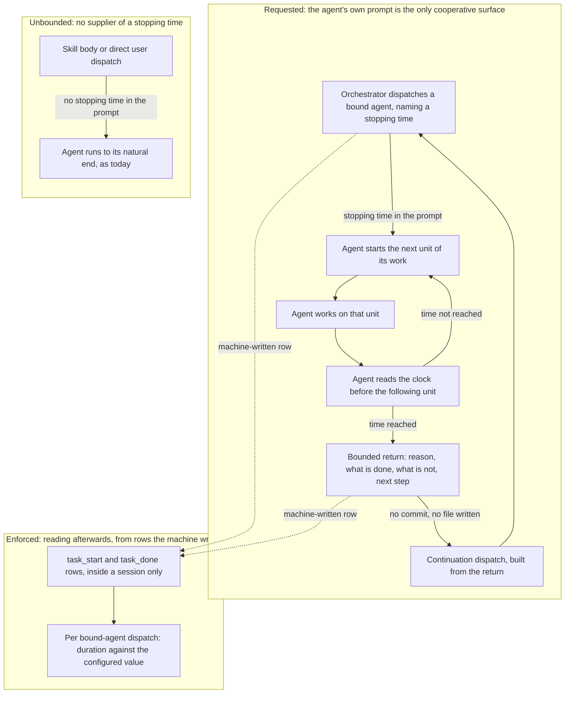

# Spec: bound how long a dispatched agent runs before it returns

**Date:** 2026-09-07
**Status:** Draft
**Activated from Circle:** 260906-2258-bounded-executor-dispatches
**Source:** the Circle's filed Directive of 260906, reworked twice. The first planability check
`260907-0710-planability-of-the-bounded-dispatch-spec.md` found eight gaps and the user closed four of
them in chat on 260907. The second check
`260907-0836-second-planability-check-of-the-bounded-dispatch-spec.md` found nine, of which the user
closed two on 260907 and this revision closes the remaining seven.

## Directive

After this work every dispatched agent that carries the bound is asked, at the moment it is
dispatched, to stop at a named wall-clock time and hand back the work in whatever state it has
reached. The orchestrator continues that work in a fresh dispatch built from the return, and writes
no continuation file anywhere. The bound is a request and not an enforcement, because nothing fusion
has can make a sub-agent give back control; what is enforced is only the reading afterwards of
whether the request was honoured. The bound exists for cost, and this work closes when the cost
argument on file says what is true about the saving it claims.

## What this specification is buying: a requested bound, not an enforced one

This section is first because it governs every capability below, and because the record this
specification replaces did not state it.

Two questions sit inside "the agent stops at its bound", and they have different answers. *Has this
agent reached its stopping time* is decidable: the machine already writes a `task_start` row at
every dispatch made inside an orchestrator session, so elapsed time is readable from data fusion
holds. *Can the agent be made to give back control at that point* is decidable by nothing fusion
has. A PreToolUse hook can refuse a tool call, which fails that call and leaves the agent running. A
SubagentStop hook fires after the run has already ended. The only surface that can end a run
cooperatively, with the half-finished work handed back, is the agent's own prompt.

An obligation stated as a sentence in a prompt is the standalone kind, and this project has measured
what happens to that kind. Over the 1265 event rows written before 2026-08-12, the orchestrator
emitted 177 `task_start` rows against 248 `task_done` rows. **At least 28.6 percent of dispatches
were announced finished having never been announced started.** The figure is a floor and not a point
estimate: its denominator is the count of announced completions, so a dispatch that announced
neither row is invisible to it and the true drop rate can only be higher. Both instructions sat in
one prompt file. The one that rides the act of finishing held, and the one that had to be recalled
before the act did not.

So the honest expectation is this. The stopping time will be honoured some of the time, at a rate
this project's own history puts well short of always, and the saving is therefore an expected value
rather than a guarantee. Three things shape that exposure, and the spec is explicit about how much
each is worth:

1. **The agent compares a clock reading against a fixed time it was handed**, rather than keeping a
   running count of anything. `inference:` the project has measured that the orchestrator's
   hand-maintained session counters were not kept, and a comparison against a constant is a smaller
   act than maintaining a counter. No measurement in this tree covers a dispatched agent counting
   its own work, so this is reasoning from an adjacent case rather than evidence about this one.
2. **The reading is taken at a named moment that the agent reaches anyway** — immediately before it
   starts the next unit of its work (C1). This is the ride the project's finding actually turns on.
   It is weaker than the ride the completion event gets, because starting a unit of work produces no
   observable event, and the spec claims no more for it than that.
3. **The stopping time travels in the dispatch prompt.** This is where the value has to be, since it
   differs per dispatch and no prompt file can hold it. It is not a second mechanism for making the
   obligation hold: an earlier draft of this specification claimed that moving the sentence out of
   the agent's prompt file made it stick better, and that claim is withdrawn. Moving a sentence
   changes where it is written, not what act it rides.

Nothing here turns a request into an enforcement. Nothing available in this tree does.

The one cycle in that graph is the work loop and its continuation, and both are intended. The
unbounded lane is deliberately disconnected from the reading lane: a dispatch made outside an
orchestrator session writes no row, so it cannot be read afterwards, and C4 says so rather than
pretending otherwise.

## Capabilities

### C1: A dispatched agent is told when to stop

**Description:** Every dispatch of an agent that carries the bound names a stopping time. The agent
reaching it stops working and returns, rather than continuing to the natural end of its task.

**Acceptance criteria:**

- [ ] Every dispatch of a bound agent carries a stopping time expressed as a clock time the agent
      can compare a single reading against. It is never expressed as a duration the agent has to
      track while it works.
- [ ] The stopping time derives from one project-settable value. A project that sets nothing gets a
      shipped default of **20 minutes**.
- [ ] The measurement behind the 20 minutes is stated where the number is set, together with the
      population it was taken over, so a later reader can re-take it. That statement reads: over the
      131 machine-written dispatch pairs in this project's own event log, 15 of them, 11.5 percent,
      ran longer than 20 minutes; over the 114 of those pairs made by an agent the bound covers, 13,
      11.4 percent, did.
- [ ] The bound covers exactly these seven agents: `coder`, `ontocoder`, `bugfixer`, `reconciler`,
      `coderev`, `ontorev`, `curator`.
- [ ] These seven agents are exempt and their dispatches carry no stopping time: `analyst`,
      `consultant`, `editor`, `planner`, `playmaker`, `shaper`, `taskplanner`.
- [ ] Every agent that can be dispatched appears in exactly one of those two lists, and the two
      together are the whole dispatchable roster.
- [ ] A bound agent takes its clock reading immediately before starting the next unit of its work,
      and at no finer grain. What a unit is, is that agent's own to name: the next file, the next
      review topic, the next tracking record, the next approved ledger entry, the next step of a
      plan.
- [ ] The obligation is restated in the dispatch prompt, which is where the stopping time itself has
      to travel, and also stands in the agent's own prompt file.
- [ ] An agent dispatched with no stopping time runs to its natural end, exactly as it does today.
      It does not halt, and it does not invent a bound of its own.

**Decisions made:**

- Unit of the bound: wall-clock time (user, 260907). The alternatives were not a matter of taste.
  Write-tool calls are readable from the hook's rows but count only part of what an agent does;
  total tool calls are not readable at all, because reads reach no hook; tokens are readable nowhere
  in fusion.
- The value: 20 minutes (user, 260907, second round). This replaces the property that stood here in
  the first revision, "at or above the median duration of the dispatches already recorded", which
  did not select a number: it left a half-open interval, and the median moved between 9.35 and 11.93
  minutes depending on which population was read. A fixed number decides it. At 20 minutes the bound
  cuts about one dispatch in nine, which is what "only the long tail is cut" was reaching for; at the
  median it would have cut half of them.
- **Who the bound covers: the seven agents named above (user, 260907, second round). This supersedes
  the decision taken earlier the same day, "all dispatched agents", which is no longer in force.**
  The narrowing came from a finding the earlier decision could not have taken into account: for an
  agent whose product exists only at the end of its run, the return report is not a pointer to the
  work but the work itself, which contradicts C2's rule that a return names paths and does not copy
  content into itself.
- The criterion that sorts the two lists, so that a later reader can re-apply it to an agent this
  roster does not yet have: **an agent is bound when its work product lands on disk as it goes, so a
  half-finished run leaves usable partial work behind for the return to point at.** It is exempt when
  its product comes into existence only at the end of the run, or is not a file at all.
- The seven bound agents, each checked against its own prompt: `coder` and `ontocoder` edit source
  and data files as they work; `bugfixer` applies its fix to the tree; `reconciler` updates each
  tracking file in turn (`agents/reconciler.md` Step 3); `coderev` and `ontorev` write one working
  file per topic through the run and consolidate at the end (`rules/review-contract.md`); `curator`
  in its apply pass writes each approved entry and records its outcome per entry
  (`agents/curator.md` Pass 2).
- The seven exempt agents, each checked the same way: `taskplanner` writes no product file at all,
  by design, and says so (`agents/taskplanner.md`: the queue is the report, "It is not a file");
  `analyst`, `consultant`, `shaper`, `planner` and `editor` each produce one document, written at
  the end of the run; `playmaker` overwrites the portfolio whole on each run. Two of these differ
  from the list the second planability check proposed, and both departures were checked at the
  prompt. `planner` was not on that list and is exempt here, because its plan document is step 5 of
  its own process and nothing of it exists on disk before then. `curator` was on that list and is
  bound here, because its apply pass is the pass that does the work and it lands entry by entry.
- The residual this leaves, stated rather than hidden: **a bound agent stopped before its first
  write hands back no paths either, and its continuation redoes that reading.** That is the ordinary
  cost of a requested bound and applies to any agent early in its run. It is not a further exemption,
  and no capability below treats it as one.
- What happens outside an orchestrator session: the agent runs unbounded. Machine-written rows are
  gated on Setup's state file (`hooks/lib/orchestrator-events.ts`: "An orchestrator session is in
  flight iff Setup's state file exists"), so a dispatch made by a skill body or by a user running an
  agent directly has no orchestrator to compute a stopping time and no continuation mechanism behind
  it. A bound with nothing to continue it truncates work instead of saving cost. The project's two
  precedents for a missing dispatch parameter point in opposite directions, and they are
  distinguishable: the editor halts because a silently defaulted language delivers a finished
  document that is wrong, whereas a missing stopping time delivers exactly today's behaviour, which
  is not wrong at all. So the domain parameter's shape applies here, not the editor's.

### C2: A bounded return hands back half-finished work

**Description:** A bound agent stopping at its bound returns something the orchestrator can continue
from, and writes nothing extra to do it.

**Acceptance criteria:**

- [ ] A bounded return states four things: that the stopping time was the reason for returning, what
      was completed, what was left unfinished and how far it got, and what the next step is.
- [ ] Nothing is written to any workbench store for the purpose of the handoff. No new file, no new
      directory, no new record kind, no new field in an existing record.
- [ ] Work already on disk stays on disk. The return names the paths it touched and does not copy
      their content into itself.
- [ ] Where the agent had not yet written anything, the return says so and names what it had read or
      established. It still copies no content, and the continuation dispatch accepts that this
      reading will be redone.
- [ ] A return that was not caused by the stopping time is unchanged by this work.

**Decisions made:**

- The handoff rides the return report the agent already makes, and no continuation note is written
  anywhere. Two things decided this. A resume note in a workbench store is bookkeeping, and
  bookkeeping is the largest cost this project has measured in itself, up to 28 percent of session
  time; a specification that buys a cost saving by adding to the project's largest cost item is
  arguing against itself. And a note written to a store would be a second standalone obligation of
  exactly the kind measured above at a drop rate of at least 28.6 percent, whereas the return report
  rides the act of returning and cannot be skipped without the dispatch visibly producing nothing.
- This capability is written for the seven bound agents only. The agents whose product exists only
  at the end are exempt under C1 precisely so that this capability does not have to carry them.

### C3: The orchestrator continues the work

**Description:** After a bounded return the orchestrator dispatches again to carry the same work
forward, without the user having to intervene and without the agent redoing what is already done.

**Acceptance criteria:**

- [ ] A bounded return is recognised at Step 3a item 5 of `agents/orchestrator.md` as a **fifth
      case**, added to the four that step enumerates, and it is recognised by the return's own
      statement that the stopping time was the reason. The passage that currently reads "Four cases,
      and there is no fifth" is amended to say five.
- [ ] The fifth case is disjoint from the other four: it is decided on the reason for returning,
      which the other four do not read, and it is tested before the `Verification:` line is
      consulted. A bounded return therefore never reaches the `did not finish` case, which would run
      the project's validation and route a healthy partial return toward a bugfixer dispatch.
- [ ] A bounded return does not reach step 6, so the task is not marked complete and its source
      marker stays at `_p_`.
- [ ] A bounded return does not enter Step 3b. The partial work is **not committed** before the
      continuation dispatch, and no validation run is triggered by the return itself.
- [ ] Where a bounded return also carries a failed verification, the failure travels into the
      continuation dispatch as the first thing the continuing agent is asked to address. It is not
      routed to the bugfixer, because the task is still in flight.
- [ ] A continuation dispatch states what the previous run completed, so the continuing agent does
      not repeat it.
- [ ] Continuation happens inside the same Turn and raises no additional gate for the user.
- [ ] Each continuation carries its own stopping time, computed fresh at its own dispatch.
- [ ] A run may be continued more than once, and nothing caps the count in advance.
- [ ] If two consecutive continuations return having completed nothing, the orchestrator stops
      dispatching and reports the stall to the user instead of starting a third.

**Decisions made:**

- Continuation is automatic and inside the Turn, not a new Turn and not a user gate. The source
  analysis is explicit on the point: bookkeeping is per Turn, so shortening by adding Turns would
  enlarge the project's largest cost, and the shortening has to happen within a Turn.
- A fifth case rather than a reuse of the third. The third case, `did not finish` or `none`, is
  written for a report where nothing has been checked and something may be wrong; its handling runs
  the project's validation and carries the result into the self-healing branch. A bounded return is
  the opposite situation, an agent that stopped on request with its work in a known state, and
  sending it down that path costs a validation run and risks a bugfixer dispatch against work that
  is merely unfinished. Amending a passage that declares itself closed is the smaller price. A case
  split that has acquired a fifth member is incomplete until it says five.
- The partial work is not committed. Step 3b commits after each *completed* task, and a commit of
  half-finished work would put a state into history that no verification passed. Between a bounded
  return and its continuation the tree is in exactly the state it is in between any two tool calls of
  an unbounded dispatch, so nothing new is exposed: a session interrupted at that moment loses the
  partial work, which is what happens today when a dispatch is interrupted mid-run.
- The stall guard exists because a requested bound cannot distinguish an agent that ran out of time
  from one that is stuck, and an unbounded continuation chain would convert a cost saving into a
  cost multiplier.

### C4: Whether the bound was honoured is readable afterwards

**Description:** Someone reviewing a session can tell which dispatches ran past their stopping time,
without any agent having been asked to record anything.

**Acceptance criteria:**

- [ ] The reading uses only rows the machine already writes at dispatch and at completion. No agent
      acquires a new obligation to make it work, and no event field is added.
- [ ] The stopping time it compares against is an explicit input, defaulting to the project's
      currently configured value. The reading states which value it used, so a reader can tell a
      comparison against today's setting from a comparison against the one in force at the time.
- [ ] The reading covers only dispatches whose `task_start` timestamp is at or after a cutoff the
      implementation carries as a constant, set to the date this mechanism lands. Without it the
      reading would report every long dispatch in the log's history as a violation.
- [ ] The reading covers only dispatches of the seven bound agents, told apart by the `agent` field
      the rows already carry.
- [ ] It reports, per dispatch, how long that dispatch ran and whether it exceeded the value it was
      given.
- [ ] Where a dispatch cannot be paired with its completion, the reading says so for that dispatch
      rather than counting it as compliant or reporting a zero.
- [ ] The reading states that it cannot see dispatches made outside an orchestrator session, since
      no rows exist for them.
- [ ] The reading is available on demand. Nothing in this work makes it a gate on anything.

**Decisions made:**

- Reading only, no gate. A gate would have to act on a number whose meaning is unsettled until C5 is
  finished, and this Circle is not buying enforcement.
- The threshold is a parameter rather than a recorded value. No row carries it, a new event field is
  out of scope, and the one precedent for holding a budget in session state was removed on
  2026-08-15 when `agentstate.yaml` stopped carrying `max_turns`. The honest consequence is that the
  reading compares yesterday's durations against today's setting, and the criterion above requires it
  to say so rather than to imply otherwise.

### C5: The cost argument on file says what is true

**Description:** The claim that motivates the whole change gets checked and corrected, and the
corrected version is what the project keeps. This is the Circle's closing artifact.

**Acceptance criteria:**

- [ ] A written check is filed in this Circle that re-derives the re-sent-volume law from its own
      stated parameters and states the ratio between one unsplit run and a k-way split.
- [ ] The check states the ratio's dependence: splitting a run of N calls into k dispatches divides
      the re-sent volume by approximately k, so the number four in the source analysis is the split
      count chosen for that example and not a measured saving.
- [ ] The check states the caching counter-effect and does not bury it: each of the k dispatches
      writes its own prefix at above plain input price, none of them reads the previous dispatch's
      accumulated tail, and the cache entry expires five minutes after the request that wrote or
      last read it began. A split can lower the volume and raise the bill at the same time.
- [ ] The check states where the five-minute lifetime does and does not bite. A cache read refreshes
      the timer at no cost, so inside one long dispatch the entry stays warm and the expiry applies
      only across the gap between dispatches. Measured over the 97 machine-written handoff gaps in
      this project's event log that are shorter than 24 hours: the median gap is 2.37 minutes, 38 of
      them, 39.2 percent, exceed five minutes, and those 38 carry 97.7 percent of all handoff
      minutes. That is the whole of what durations can settle about the cache question.
- [ ] The check names the currency each piece of evidence is denominated in, and states plainly that
      the free-handoff evidence is a wall-clock measurement of 0.0 minutes at the median while the
      volume argument is denominated in tokens, so the two do not meet.
- [ ] Where a question cannot be answered from anything in this tree, the check records it as
      undetermined and names what would answer it. An undetermined cache half does not fail the
      check.
- [ ] The check takes no new measurement, adds no instrumentation, and runs no before-and-after
      comparison.
- [ ] The corrected figures replace the wrong ones in this Circle's own record.
- [ ] The user accepts or rejects the check at the closing gate. Acceptance is the closure event.

**Decisions made:**

- What closure checks: the law rather than the factor (user, 260907). Closure asks whether re-sent
  volume falls with the dispatch count and whether that effect survives caching. It does not ask
  anyone to defend the number four, which is arithmetically identical to the split count that
  example chose.
- Currency of the free-handoff evidence: the existing minute measurement is accepted (user, 260907).
  The user took this knowing the evidence is not denominated in the currency of the argument, and
  asked for the limitation to be written down rather than left implicit. It is written down here and
  again in C5's criteria.
- An undetermined cache half is a passing outcome. Nothing in this tree carries a token figure, and
  a criterion that demanded one would be unmeetable without the instrumentation the user excluded.

## Stops when

- If the check in C5 finds that the re-sent-volume law does not hold in the form the source analysis
  states it, the work stops there and the Circle closes on that finding. The bound has no other
  rationale, and the scope excludes rule adherence, so nothing is left to build.

A second stopping condition stood here in the first revision and is withdrawn. It read that the work
stops if the check finds the caching counter-effect dominates for the dispatch lengths this project
runs. It cannot be evaluated and it named a state no capability provides. Dominance is a comparison
of magnitudes in tokens or money, and this Circle's own Grounding snapshot records that neither the
size nor the sign of the net effect can be established from anything in this tree, while C5 makes an
undetermined cache half a passing outcome. Durations settle only how often a handoff gap outlives the
cache entry, which is measured and now sits in C5 as a criterion rather than as a trigger. And "not
turned on by default" named an off state that nothing here defines: C1 gives one project-settable
value and no separate switch. A project that wants no bound sets that value high enough to reach no
dispatch, which is the only off state this work provides and needs no further mechanism.

## Constraints

- The bound is requested, never enforced. No hook changes, and nothing is built that tries to force
  a sub-agent to return.
- No new measurement, no instrumentation, and no before-and-after run may be required for closure.
- No new workbench store, and no file written per bounded return. The handoff travels in the return
  report and the continuation dispatch.
- The work claims nothing about rule adherence. The saving is a cost claim, and the source analysis
  refutes shorter dispatches as a remedy for adherence.
- The shortening happens within a Turn, never by cutting Turns smaller.
- Existing behaviour for a dispatch that finishes before its stopping time is unchanged, as is
  existing behaviour for every dispatch that carries no stopping time at all.

## Out of Scope

- Re-sending rules and Circle goals with every request. The second half of the original backlog
  filing stays out, refuted by `260812-0303-simplify-speed-and-why-rules-do-not-hold.md`.
- Any change to the PreToolUse or SubagentStop hooks.
- Any token-side measurement, any new event field, any per-tool-call event row.
- Bounding Turns, sessions, or anything other than a single dispatch.
- Supplying a stopping time to dispatches made outside an orchestrator session, and making those
  dispatches readable afterwards.
- Changing the queue, the portfolio, or any other planning surface.
- Making the honoured-rate reading a gate on a commit, a release, or a closure.

## Open for Planner

- Where the project-settable value is configured and how it is read.
- How the stopping time reaches a dispatch prompt, and in what wording the return obligation is
  stated there and in each of the seven bound agent prompts.
- What counts as a unit of work for each bound agent, in that agent's own terms, for the clock
  reading C1 requires.
- Whether the C4 reading is a helper, a report line, or part of an existing surface.
- Which prompt files change and in what order.
- How the C5 check is filed and by which agent.

## Measured, and not open

Written here so that no plan re-opens it. The hook facts were measured on 2026-09-07 during the
first planability check; the event-log figures were re-taken on 2026-09-07 during this revision and
reproduce the second check's numbers exactly.

- The PreToolUse hook does fire for tool calls made inside a sub-agent's run. The row it writes
  carries the parent orchestrator's `session_id`, measured live at 05:00:39Z.
- Only write tools produce a row. `Read`, `Grep` and `Glob` reach no hook at all; `Bash` reaches it
  and writes nothing, by design.
- The row carries no agent identity. The `task_start` and `task_done` rows do carry an `agent`
  field, which is what C4 reads to tell a bound agent's dispatch from an exempt one's.
- A hook can deny a tool call. It cannot make a sub-agent return with a handoff.
- The event log carries no token field, and no event records a tool call inside a dispatch.
- Dispatch durations, over the 131 machine-written pairs (a `task` field that is a `toolu_`
  identifier, a non-negative duration under 24 hours): median 9.35 minutes, p75 14.27, p90 22.28,
  max 90.83. Past 20 minutes: 15 pairs, 11.5 percent. Restricted to the seven bound agents, 114
  pairs: 13 past 20 minutes, 11.4 percent. Only four of the seven exempt agents appear in that log
  at all (`analyst` 8 dispatches, `playmaker` 4, `planner` 4, `shaper` 1); the other three have no
  recorded dispatch.
- Handoff gaps, over the 97 machine-written gaps under 24 hours between a completion and the next
  dispatch: median 2.37 minutes, 38 gaps past five minutes, 39.2 percent, carrying 97.7 percent of
  all handoff minutes.
- The standalone-obligation drop rate is at least 28.6 percent, from 177 `task_start` against 248
  `task_done` rows in the 1265-row window before 2026-08-12. A figure of 30.6 percent stood in the
  first revision of this specification and is withdrawn: it reproduces under none of four pairing
  methods over the same window, which give 28.6, 30.2, 34.7 and 37.1 percent.

## User Decisions Pending

None. Six questions have been put to the user across two rounds and all six were answered: what
closure checks, the currency of the handoff evidence, the unit of the bound, and who the bound
covers, on 260907 in the first round; the numeric value of the bound and the exemption for agents
with nothing on disk, on 260907 in the second.

One question this specification raises is filed as a decision record rather than left here:
`260907-0820_*_is-a-token-side-measurement-of-the-splits-net-cost-worth-building.md`. It does not
block this work, because C5 permits an undetermined cache half.
