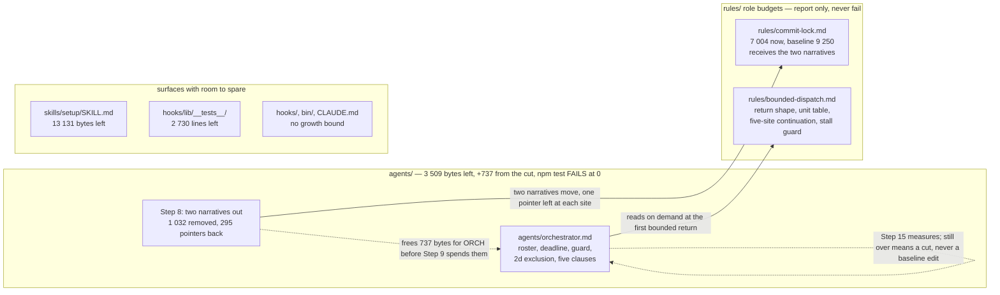
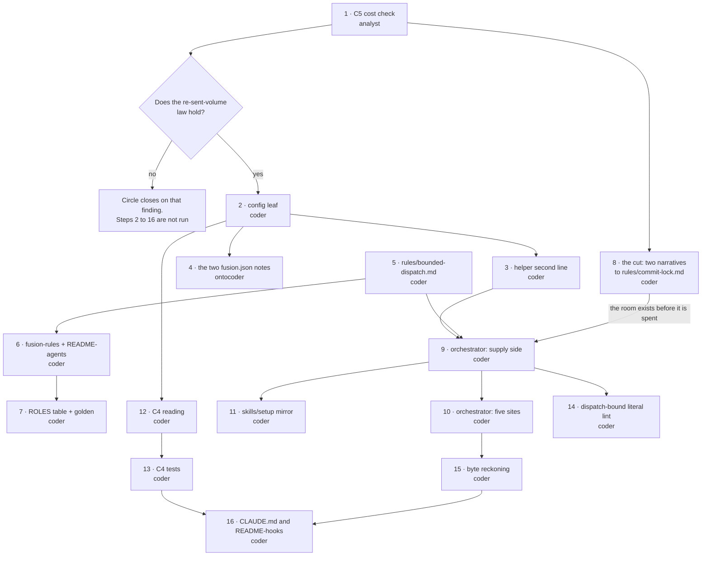
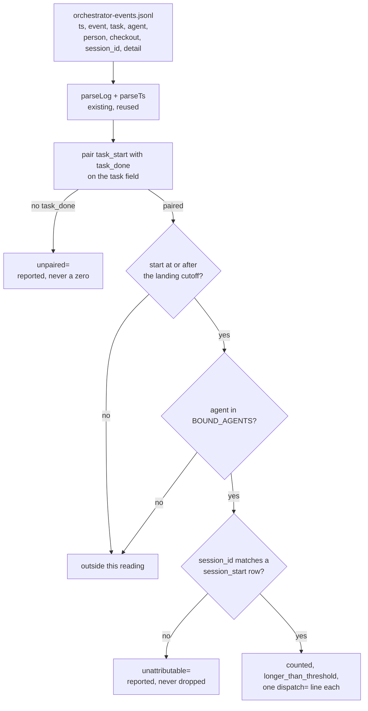

# Implementation Plan: bound how long a dispatched agent runs before it returns

**Date:** 2026-09-07
**Status:** In Progress
**Spec:** `260907-0820_*_spec-bounded-executor-dispatches.md`
**Revised:** 2026-09-08, on the answer to `260908-0025_*_the-agents-budget-is-281-bytes-short-after-another-sessions-growth-so-what-gives.md`, which the user ruled option 1. The cut that stood inside the old Step 14 as a fallback is now **Step 8**, a step of its own that runs before a byte of the mechanism is written, and the plan has sixteen steps rather than fifteen. Every step from the old 8 upward is renumbered by one and every dependency, cross-reference and node of the dependency graph moved with it. The byte reckoning is recomputed with the cut as income: `## Current State`, the new Step 8, the byte-reckoning step (now Step 15) and the risk table all carry the new arithmetic. The old Step 14 keeps its name and its measurement and loses its fallback, which is now spent; what it does when it comes up short is stated there in the changed terms. Nothing else moved: the gate at Step 1 and its execution note, the 20 minutes, the seven bound agents, the executors of every existing step and the substance of `## Where this Circle stops` are as they were.

**Revised:** 2026-09-07, against the specification's fourth revision, at the three places its `## Open for Planner` names. Step 2's prescribed comment now carries both sentences of C1's fourth criterion; Step 1 records that it has run, what its verdict was, and what released its gate, and no longer states a count of C5's criteria; `## Where this Circle stops` is rewritten onto the byte reckoning. The fifteen steps, their order, their executors, the 20 minutes, the seven bound agents and the gate at Step 1 are unchanged. One figure moved under the plan while it was being brought up to date and the update says where: the `agents/` head-room, in `## Current State`, the byte-reckoning step (Step 14 at that revision, Step 15 now) and the risk table.
**Decidability:** The load-bearing question splits in two, and the two halves have opposite answers. *Has this agent reached its stopping time* is decidable from wall-clock time, which every agent can read with one `date` call and which the machine already stamps on every dispatch row. *Can this agent be made to give back control at that point* is decidable by no mechanism fusion has: a PreToolUse hook can refuse a tool call and leave the run going, a SubagentStop hook fires after the run has already ended, and neither ends a run with the half-finished work handed back. The mechanism this plan builds therefore answers only the first question and **asks** for the second. That is not an approximation of enforcement dressed as one: nothing here claims a guaranteed saving, C4's reading calls no dispatch a violation, and the compliance floor this project has measured for obligations of this class, 28.6 percent short of always, is carried in the plan's own risk table rather than left in the specification. The change of mechanism §4 asks for, where the answer is no, is exactly this: the plan stops trying to bound the run and instead measures afterwards whether the request was honoured.

## Directive

Build what `260907-0820_*_spec-bounded-executor-dispatches.md` specifies: seven named agents, dispatched by the orchestrator and by nothing else, are handed a wall-clock stopping time; one reaching it returns half-finished work through the report it already makes; the orchestrator continues from the site the dispatch was made at; and a reading afterwards says which dispatches ran longer than the configured value without calling any of them a violation. The specification is not restated here. Where this plan states a figure the specification also states, it is because an executor needs the figure at that step.

Four review passes stand behind the specification (`260907-0710-planability-of-the-bounded-dispatch-spec.md`, `260907-0836-second-planability-check-of-the-bounded-dispatch-spec.md`, `260907-1401-third-planability-check-of-the-bounded-dispatch-spec.md`, `260907-1434-fourth-targeted-check-of-the-bounded-dispatch-spec.md`). The fourth reports `spec passes` and leaves three items for this plan to write rather than send back. All three are written here: step 2e's attempt-versus-dispatch line (Step 10), the Step 3a stall's event treatment (Step 10), and the summary row at `agents/orchestrator.md:896` amended in the same commit as step 2d (Step 10).

## Current State

**Measured on 2026-09-07 over the working tree at `abcaa823`, with `agents/` unmodified.** Every figure below was taken by this planner, not carried from the specification.

| Fact | Value | How it was taken |
|---|---|---|
| `agents/` growth head-room | 4 618 bytes at `abcaa823`; **3 509 bytes at `223f916a`, re-confirmed unchanged on 2026-09-08** | `AGENT_BASELINE` in `hooks/lib/__tests__/surface-growth-bound.test.ts` sums to 399 843 over 15 files; at `abcaa823` the tree held the same 15 at 413 225, net 13 382 against `AGENT_HEAD_ROOM` 18 000. Re-taken on 2026-09-07 at `223f916a` with the working tree as it then stood: 414 334, net 14 491. The 1 109-byte difference is one uncommitted growth of `agents/playmaker.md` by another session in this checkout, and no other file in the directory moved. **Taken twice again on 2026-09-08, at the start and at the end of the revision that added Step 8, and both readings are 414 334.** The second session wrote nothing into `agents/` in that window, so the figure this plan is written to is the figure that stood when it was finished. Step 8 is where the room comes from and Step 15 is where it is reckoned |
| The cut at Step 8, as bytes | **1 032 removed, about 295 written back, so about 737 net** | `sed -n '514p;518p' agents/orchestrator.md \| wc -c` gives 1 032 for the two narrative lines together, 578 and 454 taken singly. The two pointer lines that replace them are written out verbatim in Step 8 and come to about 295. Step 8 requires the executor to measure rather than to carry these figures |
| Where the cut lands, and what it costs there | **nothing that can fail** | `rules/commit-lock.md` weighs 7 004 bytes against a `RULE_BASELINE` entry of 9 250, so it sits 2 246 **below** its own baseline and about 1 250 bytes of arriving text leaves it below still. It is a conditional emission (`bin/fusion-rules` block `1e.`, `orchestrator` only), so it is outside the always-on core the hard bound measures. The orchestrator's whole rule load is 123 964 bytes against a `DRIFT_CEILING` of 145 144. Measured with `bin/fusion-rules orchestrator \| xargs wc -c` from a neutral working directory |
| `skills/` head-room | 13 131 bytes | same instrument, `SKILL_BASELINE` 240 614 against a tree of 247 483, head-room 20 000 |
| hook-test-line head-room | 2 730 lines | `TEST_LINE_BASELINE` 20 766 against 20 536 lines today, head-room 2 500. The surface currently sits **below** its baseline |
| Growth arithmetic | **net across the surface** | `growth()` in `hooks/lib/__tests__/helpers/growth-bound.ts`: `delta = total - floor` summed over all files, so a shrink anywhere in `agents/` pays for growth anywhere else in `agents/`, and never for growth in another surface |
| `session_start` rows carrying `session_id` | **9 of 93** | `fusion-workbench/orchestrator-events.jsonl`, counted today. The fourth check read 9 of 92; the extra row is a session started since |
| Machine dispatch rows resolving to a `session_start` | **263 of 263** | same file: every `task_start`/`task_done` row whose `task` is a `toolu_` identifier carries a `session_id`, and every one of those matches a `session_start` row in the log |
| Rule emission, per agent, from a neutral working directory | see below | `bin/fusion-rules <agent>` run from an empty directory with `FUSION_PLUGIN_ROOT` pointed at this tree |

The last row is what decides four of this plan's steps, so it is written out. `bin/fusion-rules` emits, beyond the always-on core:

- **nothing** to `coder`, `ontocoder`, `bugfixer`: these three and no others are the `(core only)` role
- `decision-record-examples.md` to `reconciler`, and to no other agent alone
- `review-contract.md` to `coderev` and `ontorev`, and to no other agent
- `user-facing-output.md` to `curator` **and** `consultant`

The seven bound agents are therefore spread across four role keys in `rules-emission-golden.test.ts`, three of which have **no member outside the bound set**. Emitting one new rule file to the seven empties those three, and that test fails the suite on a `ROLES` entry nothing matches any more. Step 7 handles it; nothing else in this plan would have discovered it.

**The `Verification:` switch at `agents/orchestrator.md` Step 3a item 5 is pinned by a gate.** `hooks/lib/__tests__/executor-verification-report-lint.test.ts` slices the prompt from `5. **Verify output.**` to `6. **Mark complete.**` and requires four literal strings inside that slice: `` `Verification:` line ``, `the line is absent`, `"done" is not a verification result`, and `Never advance to Step 3b's commit on a report whose verification you cannot name`. A guard inserted above the switch is compatible with all four; a rewrite of the switch is not.

**The configuration loader takes a new leaf without a new mechanism.** `hooks/lib/config.ts` merges the project's `fusion.json` over `DEFAULTS`, per leaf, with a `CONTAINER_LEAF_RULES` table giving each leaf a declared type and dropping-and-naming anything else. `orchestrator.maxTurns` is the existing sibling and `explainPositiveInteger` is the validator it already uses. `PROJECT_SET_KEYS` in `hooks/lib/__tests__/config.test.ts` is `["orchestrator", "citations"]`, so the whole `orchestrator` object is cut out of the byte-identity comparison between `fusion.json` and `templates/fusion.json`. The underscore-prefixed documentation notes are **not** cut, and any note added must be added to both files identically.

**The event log already has a reader.** `hooks/lib/events-query.ts` is a pure function of the log text, the reading identity and the current time, with `parseLog`, `parseTs` and `isOurs` already written and already tested against fixture strings with no workbench on disk. It does not yet carry `agent`, `task` or `session_id` in `STRING_FIELDS`. The C4 reading is a third function in that module and a third subcommand on `bin/fusion-events`, not a new file: `hooks/lib/*.ts` is held in exact set equality with a table in `README-hooks.md` by `derivable-enumerations-lint.test.ts`, so a new module there costs a documentation row that a new function does not.

## Approach

Four commitments, each of which decides several steps.

**One rule file carries the obligation, and the seven prompts are not touched.** `rules/bounded-dispatch.md`, emitted conditionally behind a new `IS_BOUND_AGENT` flag in `bin/fusion-rules`. This is the shape the specification's `## Open for Planner` names and the shape `rules/review-contract.md` already occupies for `coderev` and `ontorev`. A conditionally emitted rule sits outside the always-on floor that `rules-emission-golden.test.ts` fails on, and outside the `agents/` bound entirely. **Eight paragraphs under `agents/` would not fit**: at ordinary prompt-paragraph length they exhaust the 4 618 bytes the specification's Constraints section measured, and the measurement above puts the figure lower again, at 3 509.

**The prompt carries what must be known before the rule file is read; the rule file carries the rest.** The orchestrator does not receive `rules/bounded-dispatch.md` by emission, because the flag's name would then be false of it and `derivable-enumerations-lint` would require `README-agents.md` to name it inside the bound set. It reads the file on demand, the way it reads `rules/orchestrator-rebalance.md` at the Rebalance gate. Three things cannot wait for that read and stay in the prompt: **which** seven agents get a stopping time, because the orchestrator needs that at every dispatch; **how** the stopping time is computed, for the same reason; and **the exclusion at Step 3b step 2d**, because by the time the orchestrator has read a rule file the revert has already destroyed the partial work the handoff exists to preserve. Everything else is in the file: the five-site table, the stall guard, the return's four statements, the per-agent unit of work.

**The reading answers the question the rows can answer.** No event field is added, no agent acquires an obligation, and no dispatch is called a violation. Where the reading cannot separate two cases it says so on its own stdout rather than scoring one of them.

**Nothing in this plan promises a saving.** The bound is requested. The orchestrator asks; a sub-agent that keeps working violates nothing any mechanism here can see. This plan's `## Risks & Mitigations` table carries that as the first row and the specification's four bought residuals as the next four.

**The room this work needs is made before it is spent, not found afterwards.** Step 8 moves two narratives off `agents/orchestrator.md` and onto a rule file the orchestrator already receives, and it runs before Step 9 writes the first byte of the mechanism. That ordering is the whole of what the answer to `260908-0025_*_the-agents-budget-is-281-bytes-short-after-another-sessions-growth-so-what-gives.md` changed, and the reason it matters is in that record: taking a planned cut as a planned edit is a different act from taking it as a repair under a red suite, and it is the second shape this project's own re-baselining history turns on.

### Where each artifact's bytes land



Both rule files sit in the reported half and neither can fail the suite there. `bounded-dispatch.md` is new, so its whole size counts as growth against a role budget that warns; `commit-lock.md` is 2 246 bytes under its own baseline and stays under it after the move. The hard bound in `rules-emission-golden.test.ts` measures the universal core alone, and neither file is in it.

### Step dependency



The graph is acyclic. Step 1 is the only gate, and it was written that way because the specification's `## Stops when` then made a refuted law a closure condition, so the check ran **before** anything was built rather than at the end where a closing artifact would ordinarily sit. **The graph is drawn as the plan was written and the gate is left in it, but Step 1 has since run and its `no` branch was taken and then released by the user** (Step 1, `## Status` and `## Gate`). An executor entering this plan today starts at Step 2 and never evaluates `STOP`. Step 5 has no dependency on Step 2 and may run in parallel with the configuration half.

**Step 8 hangs off Step 1 and off nothing else, and the only edge that matters is the one into Step 9.** It touches no file any other step touches except `agents/orchestrator.md`, which it only shortens, and it regenerates the emission golden itself, so it may run at any point before Step 9 without disturbing Step 7 — see the ordering note in Step 8. An executor working strictly in numerical order needs none of that; it is written down for one working two threads.

## Implementation Steps

### 1. File the C5 cost-argument check

- **Status: run on 2026-09-07, and it stands. Do not re-run it.** The report is `260907-1657-c5-cost-argument-check.md`, and its `## Verdict` section reads, in full: *the law does not hold in the form the source analysis states it.* That is one of the two forms this step's own verdict sentence permits, so the step was performed as written; the finding is that the motivating claim is false, not that the step failed. What follows in this step is kept as the record of what was commissioned and against what, and the build resumes at Step 2.
- **Executor:** `analyst`
- **Files:** one new report in this Circle's analysis store, at the path the analyst's own `fusion-paths` resolution gives it. Reads `260812-0303-simplify-speed-and-why-rules-do-not-hold.md` (the source analysis) and `260906-2258-bounded-executor-dispatches`'s own record, `## Grounding snapshot`.
- **Dependencies:** none. This is the first step and it gates every other one.
- **Changes:** Write the check C5 requires. Its acceptance criteria are in the specification and are not restated here; what an executor needs beyond them is below. The criteria are not all this step's, and which ones are is settled under **Acceptance criterion**.
  - The source analysis's claim is at `260812-0303-simplify-speed-and-why-rules-do-not-hold.md` line 246, the "Shorter dispatches" row of `## The four remedies, weighed`: one 200-call dispatch re-sends 15.9M non-cacheable suffix tokens against 3.9M for four 50-call dispatches, printed as "About 4x". The parameter to re-derive it from, 800 tokens of output per tool call summed quadratically over the run, is elsewhere in the same document. Line 395 carries the statelessness premise.
  - **The Circle record already carries the correction**, in `## Grounding snapshot` paragraphs headed "What the cost claim rests on, corrected", "The premise that turned volume into cost is false as stated", and "Where the five-minute lifetime bites". Read them first. The check's job is to be the **filed, standalone re-derivation** those paragraphs summarise, not to discover them again. Where the check disagrees with a snapshot paragraph, say so explicitly and say which is right.
  - Take **no new measurement**, add no instrumentation, run no before-and-after comparison. The handoff-gap figures the check needs are already taken and are in the snapshot's third paragraph: 97 machine-written gaps under 24 hours, median 2.37 minutes, 38 past five minutes at 39.2 percent, carrying 97.7 percent of all handoff minutes.
  - Name the currency of each piece of evidence and state plainly that the free-handoff evidence is a wall-clock measurement of 0.0 minutes at the median while the volume argument is denominated in tokens, so the two do not meet.
  - An **undetermined cache half is a passing outcome**. Say what would answer it and cite `260907-0820_*_is-a-token-side-measurement-of-the-splits-net-cost-worth-building.md`, which holds that question and does not block this work.
  - Close with an explicit verdict sentence in one of exactly two forms: *the law holds in the form the source analysis states it*, or *it does not*.
- **Verification:** the report exists at the path the analyst names; its verdict sentence takes one of the two forms above; `grep -c` over it confirms it states the ratio, the ~1/k dependence, the caching counter-effect and the five-minute conditionality.
- **Acceptance criterion:** the criteria of C5 that are about the check itself are each satisfiable by a named passage of the report, and they are the specification's first seven, running from *a written check is filed* through *the check takes no new measurement*. The rest are not this step's, and each is met by something this step did not commission. *The corrected figures replace the wrong ones in this Circle's own record* is met by the record's `## Grounding snapshot`, which already carried the correction before the check was written. *A second filed derivation closes the net sign* is met by `260907-2012-break-even-arithmetic-for-the-dispatch-split.md`, which executes option 3 of `260907-0820_*_is-a-token-side-measurement-of-the-splits-net-cost-worth-building.md`. *What the project keeps is the corrected argument together with what it cost to correct it* is met by the specification's fourth revision, in `## What the saving actually is, now that it has been checked` and in `## Stops when`. **The user's acceptance is not among them any more.** The criterion that made acceptance the closure event was struck in that revision; closure now hangs on the byte reckoning at Step 15, which is what `## Where this Circle stops` below asks.
- **Gate:** **if the verdict is that the law does not hold, Steps 2 to 16 are not run.** The work stops and the Circle closes on that finding, per the specification's `## Stops when`. The bound has no other rationale and the scope excludes rule adherence, so nothing is left to build.
- **This gate fired on 2026-09-07, and it was the user who released it, not the plan.** The verdict was negative and the build halted here as written. It did not resume on a re-reading of the same evidence: `260907-2012-break-even-arithmetic-for-the-dispatch-split.md` derived a term the source's cell had no place for — a saving that grows as the square of the run length against a split cost that grows linearly — and closed the sign positive in every cell it evaluated, at $12 to $90 over the log's 10.99 days. On that footing the user re-cut the goal rather than closing the Circle. The gate is left standing as written because it is the record of what halted the build, and because a plan that deleted it would read as though the rationale had never been in doubt. **It is not re-evaluated, and Step 2 is where an executor picks the work up.**

### 2. [DONE] Add `orchestrator.dispatchMinutes` to the configuration loader

- **Executor:** `coder`
- **Files:** `hooks/lib/config.ts`
- **Dependencies:** Step 1 (the gate).
- **Changes:** four edits, in one file, each beside its existing sibling.
  1. `interface GuardSettings`, the `orchestrator` object: add `dispatchMinutes: number;` with a docstring saying it is the requested stopping time in minutes that the orchestrator hands to a bound agent's dispatch, read by `bin/fusion-turn-budget` at Setup and by no hook.
  2. `const DEFAULTS`, `orchestrator`: add `dispatchMinutes: 20,`. **The measurement goes in the comment beside it, verbatim, because C1's fourth criterion requires the number's basis to stand where the number is set — and that basis has two parts, both of which stand there, because either one alone reads as an arbitrary round figure.** Copy the criterion's own wording. Do not rephrase it and do not carry only the first sentence, which is what this step did before the specification's fourth revision; a rephrasing leaves the project holding two versions of one statement.

     > Over the 131 machine-written dispatch pairs in this project's own event log, read on
     > 2026-09-07, 15 of them, 11.5 percent, ran longer than 20 minutes; over the 114 of those pairs
     > made by an agent the bound covers, 13, 11.4 percent, did. Of four candidate values checked
     > against the break-even arithmetic, 10, 20, 25 and 30 minutes, 20 is the one that maximises
     > the pessimistic cell, and the break-even run length sits at 20.2 to 27.5 minutes, just past
     > the bound itself.

     The first sentence is a reading of this project's own event log; name the log and the date in the comment so a later reader can re-take it. The second is derived arithmetic and came from `260907-2012-break-even-arithmetic-for-the-dispatch-split.md`; cite that report in the comment, because nothing in the tree reproduces the four-candidate check or the break-even band without it.
  3. `const CONTAINER_LEAF_RULES`, `orchestrator`: add `dispatchMinutes: { explain: explainPositiveInteger },`. Reuse that function; write no new validator. Its docstring's reasoning about `0`, negatives and decimals transfers unchanged, and so does the deliberate absence of an upper bound.
  4. `loadConfig`'s returned `value`, `orchestrator`: add `dispatchMinutes: pickOrchestrator("dispatchMinutes"),`. `pickOrchestrator` is already generic over the container's keys and needs no change.
- **Do not:** add a container, add a second validator, restate the default anywhere else, or touch `RETIRED_TOP_LEVEL_KEYS`.
- **Verification:** `cd hooks && npm run build && npm test`, exit code in hand. `hooks/lib/__tests__/config.test.ts` must stay green without being edited; if it reddens, the leaf was added outside `PROJECT_SET_KEYS`' cut and the edit is wrong.
- **Acceptance criterion:** a project declaring `{"orchestrator": {"dispatchMinutes": 35}}` resolves 35; one declaring `0`, `-1`, `2.5` or `"20"` is dropped, named in one diagnostic, and inherits 20; one declaring nothing gets 20. The comment beside the default carries both sentences of C1's fourth criterion word for word, and a `diff` of the comment text against that criterion's block quote is empty.

### 3. [DONE] Print the resolved value from `bin/fusion-turn-budget`

- **Executor:** `coder`
- **Files:** `hooks/turn-budget.ts`, `bin/fusion-turn-budget`
- **Dependencies:** Step 2.
- **Source:** `260907-1450_*_which-program-hands-the-orchestrator-the-dispatch-bound-at-setup.md`. **This step is written against option B of that record and the record is open.** If the user rules for option A, this step creates `bin/fusion-dispatch-bound` and `hooks/dispatch-bound.ts` instead, modelled line for line on the two files named here, and Step 9 gains a second guarded call block rather than a sentence. Nothing else in the plan changes.
- **Changes:**
  - `hooks/turn-budget.ts` `main()`: after the existing `max_turns=` write, add `process.stdout.write(\`dispatch_minutes=${config.dispatchMinutes-bearing value}\n\`)`. Two `KEY=value` lines, in that order, from one process. The diagnostics loop above stays exactly as it is and stays that wide, because it runs **once**, which is the whole reason this value rides this program rather than a second one.
  - Rewrite the module docstring's `## Output and exits` section so it names two lines rather than one, and its opening section so the program is described as resolving the orchestrator's configured values rather than the Turn budget alone.
  - `bin/fusion-turn-budget`: the same two corrections to the header's `Output on stdout` block. **That header is the authoritative documentation for this helper**, so it is the one place the two lines are specified; `CLAUDE.md`'s row cites it rather than restating it (Step 16).
  - The exit codes do not change. 0 resolved, 1 usage, 2 no workbench, 3 compiled hooks missing.
- **Do not:** rename the script, change the order of the two lines, narrow the diagnostics loop, or make either line conditional on the other.
- **Verification:** `cd hooks && npm run build` then, from the project root, `bin/fusion-turn-budget`, asserting that stdout is exactly `max_turns=12` and `dispatch_minutes=20` on two lines, and that `bin/fusion-turn-budget >/dev/null` still leaves the loader's diagnostics on stderr. Then `npm test` for `turn-budget-lint.test.ts` and `committed-dist.test.ts`, the second of which fails if `hooks/dist/` was not rebuilt.
- **Acceptance criterion:** one process, two lines, one diagnostic stream; `turn-budget-lint.test.ts` green with no edit to it.

### 4. [DONE] Document the setting in the two `fusion.json` files

- **Executor:** `ontocoder`
- **Files:** `templates/fusion.json`, `fusion.json`
- **Dependencies:** Step 2 (the leaf must exist before it is documented as existing).
- **Why this executor:** both are structured data files carrying settings and prose documentation keys. The routing table gives `coder` build manifests and build configuration; nothing builds from either of these, and `hooks/lib/__tests__/config.test.ts` treats them as a data pair held byte-identical rather than as source.
- **Changes:**
  1. Add a new top-level documentation key `"_dispatchBound"` to **both** files, with **byte-identical** content. It states: what the setting is (`"orchestrator": {"dispatchMinutes": 35}`, the wall-clock minutes after which the orchestrator asks a bound agent to stop and hand back), that it merges by the per-leaf rule in `_override`, that it is read once per session by `bin/fusion-turn-budget` at the orchestrator's Setup and by no hook, that fusion's own default of 20 minutes is defined in exactly one place (`DEFAULTS` in `hooks/lib/config.ts`) and restated in no shipped JSON file and no agent prompt, that a value which is not a whole number of 1 or more is dropped, named and inherits, and that **the bound is requested and never enforced**, so that a project setting a value large enough to reach no dispatch is the only off state this mechanism provides and it needs no second switch.
  2. Amend `"_what"` in **both** files, identically, so its sentence naming what the file configures covers three settings rather than two.
  3. Do **not** add `dispatchMinutes` to this repository's own `fusion.json` `"orchestrator"` object. This project takes the shipped default, and an unnecessary declaration is a second copy of a number.
- **The invariant that makes this delicate:** `config.test.ts` cuts only the top-level `orchestrator` and `citations` entries out of the comparison. Every other byte of the two files, blank lines and key order included, must match. Add the new key at the same position in both, with the same surrounding blank lines.
- **Verification:** `cd hooks && npm test -- config`, exit code in hand. Then `python3 -c "import json;[json.load(open(p)) for p in ['fusion.json','templates/fusion.json']]"` to prove both still parse.
- **Acceptance criterion:** `config.test.ts`'s drift check green; both files parse; the two new `_dispatchBound` values compare equal byte for byte.

### 5. [DONE] Write `rules/bounded-dispatch.md`

- **Done 2026-09-08**, history `260908-1614-coder-bounded-dispatch-rule.md`. Two notes for whoever takes Steps 6 and 7. **This step leaves `reference-resolution-lint.test.ts` red** on its pinned-count assertion, which no step of this plan accounts for: the new file adds 8 resolvable paths and 5 anchors, so `BASELINE` must be re-approved to `paths: 1721, anchors: 242` in that test file, which its own failure message names as the expected response. And the section's `30-minute` illustration was **not** written, because the same section's acceptance criterion forbids any number of minutes; the residual is stated without numerals instead.

- **Executor:** `coder`
- **Files:** `rules/bounded-dispatch.md` (new)
- **Dependencies:** Step 1. Independent of Steps 2 to 4.
- **Read first:** `rules/rule-file-provenance.md`, before creating the file. `hooks/lib/__tests__/provenance-header-lint.test.ts` fails the suite on any `rules/**/*.md` carrying no `**Provenance:**` line **within its first ten lines**, and every existing rule file places it at line 3, above the lede. There is no exemption list and adding one is not the fix.
- **Header:** `**Provenance:** 260906-2258-bounded-executor-dispatches` at line 3.
- **Changes:** the file has five sections and a stated audience.
  - **Opening.** Who reads this and how it arrives: `bin/fusion-rules` emits it to the seven bound agents; the orchestrator reads it on demand through `$FUSION_PLUGIN_ROOT` at the first bounded return of a session. Say both, because the two halves below have different readers and a reader who does not know which half is theirs reads the wrong one.
  - **`## What a stopping time in your dispatch prompt means.`** A dispatch prompt may carry `**Stop by:** <YYYY-MM-DDTHH:MMZ>` on its own line, ahead of the directive body, in the same parameter-line shape every other dispatch parameter takes. It is a UTC clock time. Read the clock with `date -u +%Y-%m-%dT%H:%MZ` and compare the two as **strings**: ISO-8601 UTC sorts lexicographically in chronological order, so no arithmetic is needed and none is done. **A dispatch carrying no such line has no bound and runs to its natural end, exactly as today.** It does not halt and it does not invent a bound of its own.
  - **`## When you read the clock.`** Once, immediately before starting the next unit of your work, and at no finer grain. Never inside a unit. State the cost of that plainly, because it is a residual the user bought: an agent that enters a 30-minute unit at minute 19 returns at minute 49, and nothing here bounds or measures that overshoot.
  - **`## What one unit is, for you.`** A seven-row table. This is the specification's `## Open for Planner` item answered in one place rather than in seven prompts, and each row cites the passage of that agent's own process it was read against.

    | You are | One unit is | Read against |
    |---|---|---|
    | `coder` | the next file in the dispatch's Files list, carried to the end of the edit that file needs | `agents/coder.md` `## Implementation Process` step 3 |
    | `ontocoder` | the next data file **together with every ripple update it requires** | `agents/ontocoder.md` `## Editing Process` steps 5 and 6 |
    | `bugfixer` | the next root-cause hypothesis, carried from trace through fix to verification | `agents/bugfixer.md` Phases 2 to 5 |
    | `reconciler` | the next tracking record: one plan, one issue, one decision, or one review file | `agents/reconciler.md` `### Step 3: Update every tracking file` |
    | `coderev` | the next review topic, which is one per-topic working file | `rules/review-contract.md` `## Per-topic session files` |
    | `ontorev` | the same | the same |
    | `curator` | the next approved ledger entry of the apply pass | `agents/curator.md` `### Pass 2, apply` |

    **The `ontocoder` row is wider than the others on purpose and the file says why.** That prompt's step 6 requires the edit and all its ripple updates "in one coherent pass", and a unit that stopped between a file and its ripples would hand back a dataset its own validation refuses, which is a worse state than the unfinished one the handoff exists to preserve. The unit is the coherent pass, not the file.
  - **`## The bounded return.`** Four statements and nothing else, in this shape:

    ```
    **Bounded return:** stopping time <the time you were given> reached at <your clock reading>
    **Completed:** <what is finished, named by path>
    **Unfinished:** <what is not, and how far it got>
    **Next step:** <the one thing a continuation should do first>
    ```

    Then the rules that make it a handoff rather than a report. **Write nothing to any workbench store for the purpose of the handoff**: no new file, no new directory, no new record kind, no new field in an existing record. **Work already on disk stays on disk**: name the paths you touched and do not copy their content into the return. **Where you had written nothing yet**, say so and name what you had read or established; still copy no content, and accept that the continuation will redo that reading. **A return that was not caused by the stopping time carries none of these four lines** and is unchanged by any of this.

    Say once, plainly, that the return is what the continuation is built from and that a `Completed:` line which overstates what landed causes the continuation to skip work that was never done.
  - **`## For the orchestrator: continuing a bounded return.`** The half the orchestrator reads on demand. It carries: the recognition rule (a bounded return is recognised by the return's own statement that the stopping time was the reason, and by nothing else); the one continuation rule (continue **from the site the dispatch was made at, before that site's own procedure advances**, so: same agent, fresh stopping time, and what the previous run completed, with nothing else at that site moving in between: no marker renamed, no commit, no completion or error event, no dashboard overwrite, no gate); the five-row site table copied verbatim from the specification's C3 `## What each site does with a bounded return`; the stall guard (two consecutive continuations completing nothing, then fall through to that site's own not-completed path); and the four cross-cutting rules from C3's criteria 6, 7, 10 and 11. A failed verification travels into the continuation as the first thing to address and is never routed to the bugfixer; each continuation computes its own stopping time; no event is emitted and no dashboard line overwritten, because a bounded return is not a task outcome; and `agentstate.yaml`'s `work_queue` entry is not written, because Step 3b step 7 writes it when a task completes and the task has not completed.
- **Do not:** state the 20 minutes anywhere in this file. The value is configured and reaches the agent inside the dispatch prompt.
- **Verification:** `cd hooks && npm test -- provenance`, exit code in hand. Then `bin/fusion-prose-metric rules/bounded-dispatch.md` and read the reported em-dash rate against the ceiling of one per 1000 prose words; it reports and does not gate.
- **Acceptance criterion:** the provenance lint passes; each of the seven table rows cites a passage that exists at the cited heading; nothing in the file states a number of minutes.

### 6. [DONE] Emit the rule to the seven, and say so in `README-agents.md`

- **Executor:** `coder`
- **Files:** `bin/fusion-rules`, `README-agents.md`
- **Dependencies:** Step 5.
- **Both files in one commit.** `hooks/lib/__tests__/derivable-enumerations-lint.test.ts` derives each conditional emission's agent set from the script and requires **one single line** of `README-agents.md` naming the rule file together with **every** agent in that derived set, each in backticked form. A commit carrying only the script fails the suite.
- **Changes:**
  1. `bin/fusion-rules`, beside the `IS_REVIEWER_AGENT` block: a new flag block. **The case arm must match the lint's parser**, which is `/^\s*([a-z|]+)\)\s*IS_([A-Z_]+)_AGENT=1/gm`, so the alternation carries no spaces and the assignment sits on the same line:

     ```
     case "$AGENT" in
       coder|ontocoder|bugfixer|reconciler|coderev|ontorev|curator) IS_BOUND_AGENT=1 ;;
       *)                                                           IS_BOUND_AGENT=0 ;;
     esac
     ```

     Write a comment above it naming the criterion the seven were sorted by, in one sentence: an agent is bound when the deliverable its dispatch was made for accumulates on disk as the run proceeds, and exempt when that deliverable arrives whole at the end or when a partial write of its own cannot safely be made twice. Cite the specification rather than restating both parts.
  2. `bin/fusion-rules`, beside the `1f.` emission block: an **indented** `emit_if_exists "$PLUGIN_RULES_DIR/bounded-dispatch.md"` inside `if [ "$IS_BOUND_AGENT" -eq 1 ]; then`. Indentation is not cosmetic. The same lint splits always-on from conditional emissions on it, and an unindented line here would be read as a new always-on rule and charged to the hard bound.
  3. `bin/fusion-rules`, the header's filename-pattern convention block: one bullet naming the new file and its audience, in the shape the `review-contract.md` bullet already uses.
  4. `README-agents.md` line 197, the `**Conditional:**` bullet: append one clause naming `bounded-dispatch.md` with all seven agent names backticked, on that same line. The line is already long and already carries several such clauses; do not start a new line, because the lint requires the file name and all seven names on **one** line.
- **Verification:** `bin/fusion-rules coder | grep bounded-dispatch` returns the path, and the same for the other six; `bin/fusion-rules planner | grep -c bounded-dispatch` returns 0, and the same for the other seven exempt agents plus the orchestrator. Then `cd hooks && npm test -- derivable-enumerations`, exit code in hand.
- **Acceptance criterion:** exactly seven of the fifteen agents receive the file; the enumeration lint is green; `bin/fusion-rules` exits 0 for every agent name.

### 7. [DONE] Repair the role table and regenerate the emission golden

- **Executor:** `coder`
- **Files:** `hooks/lib/__tests__/rules-emission-golden.test.ts`, `hooks/lib/__tests__/fixtures/rules-emission.golden`
- **Dependencies:** Step 6. **This step exists because Step 6 breaks the suite and nothing else in the plan would find it.**
- **What breaks.** That test derives a *role* per agent as the set of rule files it loads which not every agent loads, then asserts two things: no role exists without a `ROLES` entry, and no `ROLES` entry exists that no agent matches. Step 6 moves all seven bound agents into new roles. Measured today from a neutral working directory, three existing entries lose their entire membership and four new keys appear.
- **Changes:**
  1. **Delete three `ROLES` entries**, each of which now matches no agent: `"(core only)"` (was `coder`, `ontocoder`, `bugfixer`, all three bound), `"review-contract.md"` (was `coderev` and `ontorev`, both bound), `"decision-record-examples.md"` (was `reconciler` alone, and bound). Keep `"user-facing-output.md"`: `consultant` is not bound and still matches it.
  2. **Add four `ROLES` entries**, keyed by the sorted `" + "` join the test builds:

     | New key | Members | What the entry says |
     |---|---|---|
     | `"bounded-dispatch.md"` | `coder`, `ontocoder`, `bugfixer` | the three agents that edit the tree as they work and carry nothing else; this replaces the old `(core only)` entry and the comment should say so, since that entry was the floor the other roles were read against |
     | `"bounded-dispatch.md + decision-record-examples.md"` | `reconciler` | |
     | `"bounded-dispatch.md + review-contract.md"` | `coderev`, `ontorev` | |
     | `"bounded-dispatch.md + user-facing-output.md"` | `curator` | |

     Each entry says what the role buys and why that agent applies it, in the shape the surviving entries use. **None needs an `overRelease` reason:** that assertion fires only when a role's *floor* stands above `RELEASE_CAP` (105 354), the floor is `RULE_BASELINE` summed over the role's files, and a newly added file has no baseline entry and contributes 0. The highest new floor is the curator's, unchanged from today.
  3. **Regenerate the golden:** `cd hooks && UPDATE_RULES_GOLDEN=1 npx vitest run lib/__tests__/rules-emission-golden.test.ts`. That run rewrites the fixture and then fails on purpose so the flag cannot be left on in a green run. Review the diff: exactly eight blocks should change, one per bound agent each gaining one file, and no eighth. If any other block moved, Step 6's case arm is wrong.
  4. **Do not touch `RULE_BASELINE`.** The new file has no entry there and must not get one. It then counts as growth in full against the per-role budget report, which is correct, since nobody granted it a budget, and that report warns rather than fails.
- **Verification:** `cd hooks && npm test -- rules-emission` twice: once to confirm the regeneration failed on purpose, once with the flag off to confirm green. Then the full `npm test`, exit code in hand.
- **Acceptance criterion:** the suite is green with `RULE_BASELINE`, `GROWTH_BUDGET`, `RELEASE_CAP` and `DRIFT_CEILING` all unedited; the golden diff touches exactly the seven bound agents' blocks.

### 8. [DONE] Make the room: move the two commit-procedure narratives to `rules/commit-lock.md`

- **Executor:** `coder`
- **Files:** `agents/orchestrator.md`, `rules/commit-lock.md`, `hooks/lib/__tests__/fixtures/rules-emission.golden`
- **Dependencies:** Step 1. Nothing else, and see the ordering note below.
- **Source:** `260908-0025_*_the-agents-budget-is-281-bytes-short-after-another-sessions-growth-so-what-gives.md`, answered on 2026-09-08 by the user, option 1.
- **Why this step exists, and it is not this Circle's own doing.** The `agents/` growth bound had 4 618 bytes of head-room when this plan was written and has 3 509 today, against ten budgets that sum to 3 790. The build was 281 bytes over before its first byte. The whole 1 109-byte difference is one uncommitted growth of `agents/playmaker.md` by a second session running in this checkout, and no other file in that directory moved. So a reader who meets two paragraphs about the commit lock being moved in the middle of a Circle about dispatch bounds is meeting the growth bound doing exactly what it was armed to do: it charges the next arrival for the surface's condition, whoever caused it. The cited record carries the four options and why this one was taken.
- **What moves.** Two bullets of `agents/orchestrator.md`, each a "why this is a rule and not a preference" narrative recounting one measured defect at length. They are the **only** two lines this step removes.

  | Line today | Opens with | Bytes, newline included |
  |---|---|---|
  | 514, under Step 3b step 3 | the bullet led in by **Why this is a rule and not a preference.** and continuing "Measured in this repository: commit `045a14f` landed cut off mid-sentence at the apostrophe" | 578 |
  | 518, under Step 3b step 4 | the bullet led in by **Why the shape and not just a ban on `-A`.** and continuing "Measured in this repository: a `git add -u` given the directory a batch of records had just been renamed inside" | 454 |
  | **Removed** | | **1 032** |

  **Find them by their opening text, never by the line number.** Both numbers are as of `223f916a` and any earlier step of this plan that edits the file moves them. `grep -n 'Why this is a rule and not a preference\|Why the shape and not just a ban' agents/orchestrator.md` returns exactly two lines; if it returns any other number, stop and report rather than guessing which is meant.
- **Where it lands.** A new section at the **end** of `rules/commit-lock.md`, after `### Cross-reference`, at `##` level so it sits beside `## Commit lock` rather than inside it. The two narratives are about the commit procedure the lock is taken around, not about the lock's own mechanism, and burying them under `## Commit lock` would misfile them.

  ```markdown
  ## Two measured defects behind this procedure

  Two instructions in the orchestrator's Step 3b read as preferences and are not. Each is
  the residue of a defect measured in this repository, and each is recorded here rather
  than in the prompt because the prompt is charged to every dispatch and this file is not.

  ### The commit message goes to a file

  <the text of the removed line 514, verbatim from `Measured in this repository:` onward>

  ### The staging list is written out path by path

  <the text of the removed line 518, verbatim from `Measured in this repository:` onward>
  ```

  Carry the prose **verbatim**, including the commit hashes `045a14f`, `4f16c60`, `f38f37d` and `7ae6aae` and the record citation `260810-1535_*_the-orchestrators-commit-procedure-truncates-any-message-containing-an-apostrophe.md`. Drop only the leading `- ` and the bolded lead-in phrase, which the new subheadings replace. Do not summarise, do not shorten and do not modernise the wording: this move must be provably lossless, since that is the property the answered record was given to rule on.
- **What stays behind.** One pointer line at each site, replacing the removed line at the same indent, written exactly as below. They are inside the byte reckoning, so their length is not free.

  ```
     - **Why this is a rule and not a preference.** The measured defect is in `rules/commit-lock.md` `## Two measured defects behind this procedure`.
     - **Why the shape and not just a ban on `-A`.** The measured defect is in `rules/commit-lock.md` `## Two measured defects behind this procedure`.
  ```

  About 147 bytes each, about 295 together, so the step's **net yield is about 737 bytes**. Measure it; do not carry the figure.
- **Why no reader loses anything.** `bin/fusion-rules` emits `rules/commit-lock.md` to `orchestrator` and to no other agent (block `1e.`), so the one agent that read these narratives in its prompt still receives them, in the same dispatch, in a file it already loads. That is what makes this a move rather than a deletion, and it is why the specification's `## Stops when` does not fire: nothing is dropped that a reader would otherwise have had.
- **Why the receiving file can absorb it without a second red gate**, all four checked before this step was written:
  1. `rules/commit-lock.md` weighs 7 004 bytes against a `RULE_BASELINE` entry of **9 250**. It is 2 246 bytes under its own baseline and about 1 250 bytes of arriving text leaves it about 1 000 under still, so it does not even register as growth in the role report.
  2. That report warns and never fails, and the assertion that **does** fail measures the universal core alone. `commit-lock.md` is a conditional emission and is not in the core.
  3. `RELEASE_CAP`'s justification duty compares a role's **floor**, which is `RULE_BASELINE` summed, a constant map. Growing a file does not move a floor, so this step cannot trip it.
  4. `DRIFT_CEILING` is 145 144 bytes for one agent. The orchestrator loads 123 964 today and about 125 200 after the move, leaving about 20 000.
- **Regenerate the emission golden.** `hooks/lib/__tests__/fixtures/rules-emission.golden` records each emitted file's byte size, and `commit-lock.md` appears there at `7004`. Run `cd hooks && UPDATE_RULES_GOLDEN=1 npx vitest run lib/__tests__/rules-emission-golden.test.ts`. That run rewrites the fixture and then fails on purpose so the flag cannot be left on in a green run. **The diff must touch exactly one block, `[orchestrator]`, at exactly two numbers**: `commit-lock.md`'s size and the block's total. Anything else moved means something other than this step is in your working tree.
- **Ordering, so this step and Step 7 do not collide.** Both regenerate the same fixture. Because this step regenerates its own, each run's diff is exactly what that step's verification names, whichever order the two are taken in: run this step first and Step 7's later diff still shows only the seven bound agents' blocks; run Step 7 first and this step's diff still shows only `[orchestrator]`. What is **not** permitted is taking this step without the regeneration, which would leave Step 7 facing an eight-block diff and no account of the eighth.
- **Do not:** edit `AGENT_BASELINE` or `RULE_BASELINE`; delete either narrative instead of moving it; move any third passage on the grounds that it is also long; take more room than the two lines yield on the reasoning that a margin is useful.
- **Verification:** in order, exit codes in hand.
  1. `wc -c agents/orchestrator.md` before and after. The file must **shrink** by about 737 bytes.
  2. `wc -c rules/commit-lock.md`, which must grow by about 1 250 and stay under 9 250.
  3. `grep -c '045a14f\|f38f37d' rules/commit-lock.md` returns 2 and the same grep over `agents/orchestrator.md` returns 0. The narratives are in one file and one file only.
  4. `cd hooks && npm test`, with `surface-growth-bound.test.ts`, `rules-emission-golden.test.ts`, `provenance-header-lint.test.ts` and `reference-resolution-lint.test.ts` all green.
  5. Sum `wc -c agents/*.md`, subtract 399 843, subtract from 18 000, and **write the resulting head-room into the commit message.** Step 15 reads it back against what Steps 9 and 10 actually spent.
- **Acceptance criterion:** the two narratives are readable in full by an orchestrator dispatch, with no sentence lost and no hash or citation dropped; `agents/` head-room measured after this step is about 4 246 bytes; the golden diff touches one block; `AGENT_BASELINE` and `RULE_BASELINE` are byte-identical to what they were before the step (`git diff` over both test files shows no change to either map).

### 9. The orchestrator's supply side

- **Executor:** `coder`
- **Files:** `agents/orchestrator.md`
- **Dependencies:** Steps 3, 5 and 8. **Step 8 is not optional and not reorderable after this one**: it is where the bytes this step spends come from, and without it the surface bound fails on this step's own commit.
- **Byte budget for this step: 1 600 bytes.** Measure with `wc -c agents/orchestrator.md` before and after. Step 15 reconciles.
- **Changes:** two edits.
  1. **Setup Step 2, inside the existing Turn-budget bullet** (the block that runs `bin/fusion-turn-budget` behind `[ -x ]`). Do not add a second code block and do not add a second guarded call. Extend the sentence that reads "It prints one line, `max_turns=<n>`" so it names both lines, and add one short paragraph for the second value: the resolved `dispatch_minutes=<n>` is held for the session as `<dispatch-minutes>`, and **all three of the failure branches already written for the Turn budget carry over unchanged, with a different consequence.** State that consequence in one sentence: an unresolved dispatch bound means **no stopping time travels in any dispatch prompt and every dispatch runs to its natural end, which is exactly today's behaviour**. So unlike an unresolved Turn budget it needs no check-in, no dashboard change and no substitute, and the orchestrator says so once in the Setup-complete summary and proceeds. Budget: **700 bytes.**
  2. **A new short block, `### Bounded dispatches`, placed immediately before `### Step 3a`.** It carries only what must be in context at every dispatch:
     - **Which agents.** `coder`, `ontocoder`, `bugfixer`, `reconciler`, `coderev`, `ontorev`, `curator` carry a stopping time. Every other agent's dispatch carries none. **You are the only supplier**: a dispatch a skill body or a plain session makes carries no stopping time even while your session is in flight, because nothing there computes one and a bound with nothing to continue it truncates work instead of saving cost.
     - **How to compute it.** One line, portable, using the node runtime the hooks already require:

       ```bash
       node -e 'console.log(new Date(Date.now()+<dispatch-minutes>*60000).toISOString().slice(0,16)+"Z")'
       ```

       Say why it is node and not `date`: `date` cannot add minutes portably (`-d "+N minutes"` is GNU, `-v+NM` is BSD) and a prompt naming one form breaks on the other half of the installed base. Then put the result in the dispatch prompt as `**Stop by:** <that value>` on its own line, ahead of the directive body, in the same shape every other dispatch parameter takes. Compute it **fresh at each dispatch**, continuations included.
     - **Recognising a bounded return, and where the rest of this lives.** A bounded return says the stopping time was the reason it returned. Read that **before** the site's own handling of a run that did not complete, at every site. Then: *before acting on one, read `$FUSION_PLUGIN_ROOT/rules/bounded-dispatch.md` `## For the orchestrator: continuing a bounded return` in full. It holds the five sites, the stall guard and the four rules that hold across them. Do not act from memory. If the file is absent (older install), continue the work in a fresh dispatch at the same site and say so to the user.* This is the shape the Rebalance gate already uses for `rules/orchestrator-rebalance.md`.
     Budget: **900 bytes.**
- **Do not:** write `20` or any other number of minutes into this file; state the five sites here; or restate the return's four statements here.
- **Verification:** `wc -c agents/orchestrator.md` before and after, difference at or under 1 600. `grep -n "Stop by:" agents/orchestrator.md` returns the one site. `grep -cE '\b20 minutes\b' agents/orchestrator.md` returns 0. Then `cd hooks && npm test`, exit code in hand; `surface-growth-bound.test.ts` must still be green.
- **Acceptance criterion:** every dispatch of the seven that the orchestrator makes can be constructed from this block alone, with no rule-file read; a reader of the block can tell which agents are bound and which are not.

### 10. The orchestrator's five continuation sites

- **Executor:** `coder`
- **Files:** `agents/orchestrator.md`
- **Dependencies:** Step 9.
- **Byte budget for this step: 2 190 bytes.** Measure before and after.
- **That figure was 2 050 until 2026-09-08 and was wrong by exactly one item.** The nine changes below carry per-item budgets summing to 2 190; 2 050 is their sum with change 9, the error-handling table row at 140 bytes, left out. Change 9 arrived with the fourth planability check's third recommendation and the step total was not brought along. The reckoning table in Step 15 was right throughout: it lists all ten edits and sums to 3 790, which is 1 600 for Step 9 plus 2 190 for this step. An executor measuring this step against 2 050 would have failed its own verification while writing exactly what was asked.
- **Changes:** seven edits at named sites. Each is a clause or a short bullet, not a paragraph; the reasoning behind each is in `rules/bounded-dispatch.md` and is not repeated here.
  1. **Step 3a item 5, as the first sub-bullet, above `**Read the `Verification:` line.**`** A guard, not a fifth case:

     > **First, is this a bounded return?** If the report says the stopping time was the reason it returned, continue it per `### Bounded dispatches` and do not read the rest of this step. The two tests are orthogonal, not exclusive: an agent that stopped at its bound may well have run a passing verification on the part it finished, so `exit 0` and "stopped at the bound" can both be true of one return, which a fifth value of one line cannot express and a question asked above it can.

     **The switch keeps its four values and the passage reading "Four cases, and there is no fifth" is not amended.** `executor-verification-report-lint.test.ts` slices this step from `5. **Verify output.**` to `6. **Mark complete.**` and requires four literal strings inside it; leave all four exactly as they stand. Budget: **550 bytes.**
  2. **Step 3a item 5, one further clause:** a bounded return never reaches the `did not finish` case. That case runs the project's validation and carries the result into the self-healing branch, which would send a healthy partial return toward a bugfixer dispatch. Fold this into the bullet above if it fits the budget. Included in the 550.
  3. **Step 3b step 2b, after the bugfixer dispatch sentence.** The one exclusion that changes behaviour rather than adding it:

     > **A bounded return from the bugfixer does not run step 2d.** No `git checkout HEAD -- <files>`, no `bugfix_failure`, no `revert`. Read as a reported failure it would revert every file the task touched, destroying exactly the partial work the handoff exists to preserve. Continue inside step 2b, before step 2c is read. Step 2d runs later, on a failure the bugfixer has actually reported.

     Budget: **400 bytes.**
  4. **Step 3b step 2e.** This is the fourth check's first reservation and **the plan writes the definition, because the prompt does not carry one.** Step 2e reads in full "**Budget:** One bugfixer attempt per task. No retries." and defines neither term. Append one clause:

     > An **attempt** is one bugfixer task, however many dispatches its bounded returns take; a **retry** is a second attempt after the bugfixer has reported failure. A continuation is neither and consumes no budget.

     Do not present this as something the prompt already said. It is a stipulation this work makes. Budget: **250 bytes.**
  5. **Step 3b step 7, one clause:** the `work_queue` entry is not written at a bounded return, because this step writes it when a task completes and the task has not completed. Budget: **160 bytes.**
  6. **Phase 3 step 1, one clause:** a bounded `reconciler` return is continued at step 1 again, before step 2 reads anything; steps 2 to 4 are not entered and no Coherence verdict is read off a run that did not finish writing one. On the stall, Phase 3 step 3's defensive case takes over on its own terms: no parseable `## Coherence` section, so the verdict reads `review-needed` and the Rebalance gate fires. Budget: **220 bytes.**
  7. **Phase 4 step 2a, one clause:** a bounded reviewer return is continued at step 2a again, before step 2b; the record is not renamed at step 3, `.active-circle` is not cleared, and `review_done` is not emitted. On the stall, closure proceeds and the gap is named in the `## Closure note`, which is what an uncovered range already does. Budget: **220 bytes.**
  8. **The `curator` paragraph** (the one beginning "A `curator` dispatch is asked for by the user"), one clause: a bounded curator return is continued at the same dispatch point with the same mode; **no approval is taken or re-taken on the user's behalf** and the survey pass's gate is not put to the user twice; a continuation of the apply pass carries the same approved ids minus those the run file already records as `applied`, `skipped`, `stale` or `failed`. On the stall, report it and name the curator's run file. Budget: **250 bytes.**
  9. **The `## Error Handling` table row** for "Validation fails after agent work". This is the fourth check's third recommendation: amending step 2d without touching this summary leaves it silent about bounded returns rather than wrong about them. Append to that row's Response cell: *a bounded return is not a reported failure and does not reach the revert*. Budget: **140 bytes.**
- **The Step 3a stall's event treatment, decided here** because the fourth check asked for it and nobody else can. The stall falls through to **that site's own not-completed path**, which at Step 3a is step 6: the source marker stays at `_p_`, `task_error` is emitted, and the dashboard shows `[ERROR]`. So `task_error` **is** emitted at the stall and is **not** emitted at a bounded return. Write that distinction into `rules/bounded-dispatch.md`'s site table rather than into the prompt, and make sure the site table's Step 3a stall cell says it.
- **Verification:** `wc -c agents/orchestrator.md` before and after, difference at or under 2 190. `cd hooks && npm test`, exit code in hand, with `executor-verification-report-lint.test.ts` and `surface-growth-bound.test.ts` both green.
- **Acceptance criterion:** all five sites named in C3's table carry a clause; the one site whose omission would destroy work (Step 3b step 2d) carries its exclusion in the prompt and not only in the rule file.

### 11. Mirror the Setup change in the setup skill

- **Executor:** `coder`
- **Files:** `skills/setup/SKILL.md`
- **Dependencies:** Step 9.
- **Changes:** the skill's Turn-budget paragraph (the one beginning "**The Turn budget is resolved here too.**") already names `agents/orchestrator.md` Setup Step 2 as the canonical implementation and deliberately does not restate its branches. Extend its first sentence so it says the same block resolves **two** values, and add one clause naming the dispatch bound and its harmless unresolved state. Keep the pointer; do not copy the branches across.
- **Do not:** write a number of minutes here. `turn-budget-lint.test.ts` scans this file for budget literals and a future sibling lint (Step 14) will scan it for minute literals.
- **Verification:** `cd hooks && npm test -- turn-budget`, exit code in hand. `wc -c skills/setup/SKILL.md` before and after; the `skills/` surface has 13 131 bytes of head-room, so the constraint is not tight here.
- **Acceptance criterion:** the skill names two resolved values and restates neither's branches.

### 12. The C4 reading

- **Executor:** `coder`
- **Files:** `hooks/lib/events-query.ts`, `hooks/events-query.ts`, `bin/fusion-events`
- **Dependencies:** Step 2 (the reading's default threshold is the configured value).
- **Why here and not in a new module:** `hooks/lib/events-query.ts` already parses this log and already owns `parseLog`, `parseTs` and `isOurs`; `derivable-enumerations-lint.test.ts` holds `README-hooks.md`'s `hooks/lib` table in exact set equality with `hooks/lib/*.ts`, so a new module there costs a documentation row that a new function does not.
- **Changes:**
  1. **`hooks/lib/events-query.ts`, the line parser.** Add `agent`, `task` and `session_id` to `interface EventLine` and to `STRING_FIELDS`. Both are additive: existing consumers read named fields and are unaffected.
  2. **`hooks/lib/events-query.ts`, a new exported constant `BOUND_AGENTS`**, holding the seven in the order `bin/fusion-rules` lists them. Write a comment saying the set is pinned against the script's `IS_BOUND_AGENT` case arm by a test (Step 13), the way `REVIEW_SENDERS` in `hooks/lib/review-coverage.ts` is pinned against `IS_REVIEWER_AGENT`. Two copies of one set, one gate holding them equal, and no third copy.
  3. **`hooks/lib/events-query.ts`, a new exported `measureDispatchDurations(text, opts)`**, a pure function like its two siblings: it opens no file, runs no subprocess and phrases no sentence for a user. `opts` carries `thresholdMinutes`, `cutoffIso` and `agents`. It:
     - parses once with `parseLog`, keeping `malformed`;
     - collects the `session_id` of every `session_start` row into a set;
     - pairs a `task_start` with a `task_done` **on the `task` field**, and only where `task` is present. A `task_start` with no matching `task_done` is reported as `unpaired`, **never counted as compliant and never reported as a zero duration**;
     - keeps only pairs whose `task_start` timestamp parses and is at or after `cutoffIso`;
     - keeps only pairs whose `agent` is in `agents`;
     - marks a pair whose `session_id` matches **no** `session_start` row as `unattributable`. **It is reported, not dropped and not counted**. This is where the fourth check's second reservation becomes visible in the product;
     - returns, per surviving pair, the agent, the task id, the start timestamp as written, the duration in minutes, and whether it exceeded `thresholdMinutes`. **It labels no pair a violation**, because the rows cannot say whether that dispatch was one the orchestrator bounded.
     - Use `parseTs` for every timestamp. Never `Date.parse` directly: the log's emit convention writes UTC without the `Z` designator and ECMA-262 reads such a string as local time, which is the standing trap `CLAUDE.md`'s symptom table carries.
  4. **`hooks/events-query.ts`, a third subcommand `dispatches [--minutes N] [--since YYYY-MM-DD]`.** Extend `USAGE` to three lines and the two-name subcommand check to three. It resolves the workbench, reads the log through the existing `readLog`, calls `loadConfig({ projectRoot: root })` for the default threshold, and writes to stdout:

     ```
     threshold_minutes=<n>
     threshold_source=configured|argument
     cutoff=<YYYY-MM-DD>
     counted=<n>
     longer_than_threshold=<n>
     unattributable=<n>
     unpaired=<n>
     limit=dispatcher-unknown	<one sentence>
     limit=threshold-is-todays	<one sentence>
     limit=no-session-invisible	<one sentence>
     dispatch=<agent>	<task>	<start ts>	<minutes>	<longer|within>
     ```

     - The **three `limit=` lines are on stdout, not stderr, and the code comment says why.** This module's standing rule is values to stdout and reasons to stderr, and these are neither: they are qualifications of figures that *were* taken, and C4's seventh criterion requires the reading to state them "in its own output... beside its figures". A qualification that lands on a stream the figures do not is a qualification nobody reads.
     - Their content, one sentence each. **`dispatcher-unknown`:** inside a single orchestrator session a skill body's dispatch and the orchestrator's own carry the same `agent`, the same `session_id` and no field that distinguishes them, so a long `curator` or `reconciler` dispatch may be one that never carried a stopping time; no dispatch here is called a violation. **`threshold-is-todays`:** the threshold is a parameter and no row records the value in force at the time, so yesterday's durations are compared against today's setting. **`no-session-invisible`:** a dispatch made with no orchestrator session running writes no rows and cannot be seen here at all.
     - `unattributable>0` additionally puts one line on **stderr** naming the cause: a `session_start` row that lost its `session_id` renders every dispatch of that session unattributable, and that field is model-written. State today's coverage in the message's wording so the reader knows the failure is real rather than hypothetical.
     - **Identity is not used by this subcommand.** The wrapper supplies it for the other two; say in the code that this reading is deliberately not identity-scoped, because a bound dispatch made from another checkout is still a bound dispatch.
     - Exit codes follow the existing vocabulary: 0 figures printed, 2 no workbench, 3 the log absent or unreadable.
  5. **`hooks/events-query.ts`, the cutoff constant.** `const BOUND_LANDED = "<YYYY-MM-DD>"`, set to the UTC date this step's commit is made, obtained with `date -u +%Y-%m-%d`. C4's third criterion requires it: without it the reading reports every long dispatch in the log's history. `--since` overrides it.
  6. **`bin/fusion-events`**: extend the header's usage block, output shape and exit table to cover the third subcommand. That header is the authoritative documentation for this helper, so it is the one place the subcommand is specified.
- **Do not:** add an event field, write to the log, make this a gate on anything, or drop `curator` and `reconciler` from the reading, since they are the two agents whose long dispatches are actually recorded.
- **Verification:** `cd hooks && npm run build` then, from the project root, `bin/fusion-events dispatches` against this project's own log, expecting exit 0 and stdout carrying all three `limit=` lines. Then `bin/fusion-events dispatches --minutes 5` to confirm `threshold_source=argument`, and `bin/fusion-events dispatches --since 2020-01-01` to confirm the cutoff is overridable. Then `npm test`, exit code in hand.
- **Acceptance criterion:** each of C4's ten criteria maps to a named line of the output or a named branch of the function; no output line calls a dispatch a violation.

### 13. Tests for the reading and for the bound-agent set

- **Executor:** `coder`
- **Files:** `hooks/lib/__tests__/fusion-events.test.ts` (extend), and either that file or a new sibling for the set pairing
- **Dependencies:** Steps 6 and 12.
- **Changes:**
  1. **Unit cases for `measureDispatchDurations`**, driven by fixture strings with no workbench on disk, which is what the module's purity buys. Cover, one case each: a paired dispatch inside the threshold; one over it; a `task_start` with no `task_done` reaching `unpaired` and not `counted`; a pair whose `session_id` matches no `session_start` reaching `unattributable` and not being dropped; a pair before the cutoff being excluded; a pair by an exempt agent being excluded; a malformed line counted in `malformed` and not silently skipped; and a `ts` written without a `Z` designator being read as UTC rather than local.
  2. **The set pairing.** Derive the seven names from `bin/fusion-rules`'s `IS_BOUND_AGENT` case arm with the same regex the enumeration lint uses, and assert exact set equality against `BOUND_AGENTS`. Model it on `review-coverage-mandate.test.ts`, which pins `REVIEW_SENDERS` against `IS_REVIEWER_AGENT`. The failure message must say which side to change and why the two exist separately.
  3. **One case asserting the three `limit=` lines are on stdout**, since their being on the other stream is the failure C4's seventh criterion is about.
- **Verification:** `cd hooks && npm test`, exit code in hand. `wc -l` over `hooks/lib/__tests__/*.test.ts`; the surface has 2 730 lines of head-room, so this step is not budget-constrained.
- **Acceptance criterion:** every branch listed in Step 12's change 3 has a case; the pairing test fails if a name is added to either side alone.

### 14. A lint against the dispatch bound returning to the prose

- **Executor:** `coder`
- **Files:** `hooks/lib/__tests__/dispatch-bound-lint.test.ts` (new)
- **Dependencies:** Step 9.
- **Why this exists, stated plainly: it is not required by the specification.** It is added because this project has measured the exact failure it prevents. The Turn budget was written into `agents/orchestrator.md` as `5` in seven places and four spellings, one of which already called itself a default while no source could override it (`260811-1712_*_max-turns-is-hardcoded-in-eight-places-and-cannot-be-set-per-project.md`). The eighth would have arrived the same way. The dispatch bound has the identical shape, a number a prompt wants in a sentence, and nothing today would catch `20 minutes` appearing in the orchestrator prompt. **Dropping this step costs the plan nothing else**; no other step depends on it.
- **Changes:** a gate modelled on `turn-budget-lint.test.ts`, over `agents/orchestrator.md` and `skills/setup/SKILL.md`:
  - fail on a bound stated as a literal count of minutes near a stopping-time word: patterns for `\b\d+\s*minutes?\b` occurring on a line that also names `Stop by`, `stopping time`, `dispatch_minutes` or `dispatchMinutes`; and on `\b(?:dispatch_minutes|dispatchMinutes)`?\s*[:=]\s*\d+`;
  - assert **anti-vacuity**: the orchestrator prompt must still name `<dispatch-minutes>`, so deleting the subject is not a way to pass;
  - assert the helper is called behind `[ -x ]`, reusing the existing check rather than writing a second one if the two can share;
  - carry a `REMEDY` string, as the sibling does, naming the two legitimate routes: one project declares `{"orchestrator": {"dispatchMinutes": <n>}}` in its own `fusion.json`; fusion's own default is `DEFAULTS.orchestrator.dispatchMinutes` in `hooks/lib/config.ts`. In neither case does a number belong in a prompt.
  - State in the header what the gate is honestly worth: it checks the number is not in the prose, and it cannot check that a dispatched orchestrator read the configured value. Nothing here runs at dispatch time.
- **Verification:** `cd hooks && npm test -- dispatch-bound`, exit code in hand. Prove it fires: temporarily insert `stopping time of 20 minutes` into a scratch copy of the prompt, run the gate against that copy, confirm it fails, and discard the copy. **Run that experiment against a scratch copy, never against the live file.**
- **Acceptance criterion:** the gate is green on the tree as this plan leaves it, and red on a prompt carrying a minute literal.

### 15. The byte reckoning

- **Executor:** `coder`
- **Files:** measurement only. **This step no longer makes a cut**, because the cut it used to name is Step 8 and has already been taken.
- **Dependencies:** Step 10. Run this **before** Step 16 and before any commit that closes the work.
- **The arithmetic this plan is written to.** The ten edits below sum to 3 790, which is the figure in the table's own `Sum` row and is 1 600 for Step 9 plus 2 190 for Step 10. A stray `3 650` stood in this sentence until 2026-09-07; the 2026-09-08 revision found what it was, namely the sum of the two **step-level** budgets while Step 10's own total was 140 bytes short of its nine items. Step 10 now states 2 190 and the two agree:

  | Edit | Step | Budget |
  |---|---|---|
  | Setup Step 2, the second value | 9 | 700 |
  | `### Bounded dispatches` block | 9 | 900 |
  | Step 3a item 5 guard | 10 | 550 |
  | Step 3b step 2b exclusion | 10 | 400 |
  | Step 3b step 2e attempt clause | 10 | 250 |
  | Step 3b step 7 `work_queue` clause | 10 | 160 |
  | Phase 3 step 1 clause | 10 | 220 |
  | Phase 4 step 2a clause | 10 | 220 |
  | `curator` paragraph clause | 10 | 250 |
  | Error-handling table row | 10 | 140 |
  | **Sum** | | **3 790** |

- **What the surface is expected to do across the build.** Every figure is a `wc -c` reading, and the two the executor takes are the ones that decide the step.

  | | Bytes | Where it comes from |
  |---|---|---|
  | Head-room before Step 8 | 3 509 | measured twice on 2026-09-08, at the start and the end of that revision, both 414 334 against the `AGENT_BASELINE` sum of 399 843 and `AGENT_HEAD_ROOM` 18 000 |
  | Step 8 removes | −1 032 | the two narrative lines, 578 and 454 |
  | Step 8 writes back | +295 | the two pointer lines, about 147 each |
  | **Head-room after Step 8** | **about 4 246** | **the first reading this step compares against, and Step 8's commit message carries it** |
  | Steps 9 and 10 spend | −3 790 | the ten budgets above, each a cap |
  | **Margin at this step** | **about 456** | **the second reading, taken here** |

  **Every one of those budgets is a cap and not an estimate**, so an underrun is real slack and the margin is a floor rather than a forecast. What it is not is a cushion against anything else landing in `agents/`: the 1 109 bytes that produced the 281-byte deficit this plan was re-cut around arrived from a second session in this checkout in a single day, and 456 bytes is less than half of that.
- **Changes:**
  1. Re-measure: sum `wc -c agents/*.md`, subtract the `AGENT_BASELINE` sum of 399 843, and compare against `AGENT_HEAD_ROOM` of 18 000. Do not read the figure off this plan; the plan's figure is a week old the moment anything else lands in that directory.
  2. Compare it against the head-room Step 8's commit message recorded. The difference is what Steps 9 and 10 actually spent, and it is the figure to write into this step's own commit message beside the budget of 3 790. A build that came in under is worth saying so; this project has no other record of a text budget being met.
  3. Run `cd hooks && npm test -- surface-growth`. If green, this step is done.
  4. **If red, there is one relief left and then the work stops.** Never edit a baseline: `hooks/lib/__tests__/helpers/growth-bound.ts` names exactly three moments at which one moves, this is none of them, and a Circle that needed room asked for a fourth on 2026-08-22 and did not get it (`260822-1102_*_what-happens-when-a-planned-circles-required-work-exceeds-the-remaining-head-room.md`, option 1: the room was cut first).
- **The fallback that used to be here is spent, and what stands in its place is smaller.** Through every earlier revision this step held a named cut in reserve: the two commit-lock narratives, worth about 737 net bytes. The answer to `260908-0025_*_the-agents-budget-is-281-bytes-short-after-another-sessions-growth-so-what-gives.md` moved that cut to Step 8, where it pays for another session's growth rather than for this build's overrun. **This Circle now holds no second cut of that kind, and none has been identified.** What remains, in order:
  1. **Write the ten edits tighter.** Each budget is a cap, so a step that came in over can be revised down against its own cap without losing an obligation. This is a rewrite of this Circle's own new text and costs no reader anything. It is the first and probably the only place to look.
  2. **Beyond that, nothing.** No further lossless cut has been found in `agents/orchestrator.md`, and the bytes Steps 9 and 10 place there are the ones this plan argues cannot wait for a rule-file read, so moving them into `rules/bounded-dispatch.md` would drop something a reader would otherwise have had at the moment they need it. **That is the specification's `## Stops when` condition, word for word, and reaching it closes this Circle unbuilt.** The stopping condition at this step is therefore real and no longer formal, which it was for as long as the reserve existed.
  3. **What is not a fallback, though it may happen:** the second session may commit or trim `agents/playmaker.md` and return up to 1 109 bytes. That was option 4 of the answered record, worth asking in parallel and never something to plan on, since it is another Circle's work and nobody here can answer for it. Do not wait on it, do not assume it, and do not treat its absence as a surprise.
- **Verification:** `cd hooks && npm test` for the full suite, exit code in hand, with `surface-growth-bound.test.ts` green and `AGENT_BASELINE` unedited (`git diff hooks/lib/__tests__/surface-growth-bound.test.ts` empty).
- **Acceptance criterion:** the growth bound passes on a tree whose baseline map is byte-identical to `abcaa823`'s, and this step's commit message states the head-room measured here, the head-room Step 8 recorded, and the difference between them.

### 16. Documentation

- **Executor:** `coder`
- **Files:** `CLAUDE.md`, `README-hooks.md`
- **Dependencies:** Steps 13 and 15.
- **Changes:**
  1. `CLAUDE.md`, the `bin/fusion-turn-budget` Layout row: it currently says the helper prints "the `KEY=value` line it prints" in the singular and describes the program as the Turn budget alone. Correct both, keeping the row's standing shape of citing the script's own header as authoritative rather than restating the usage block. Name the second setting and its default's one definition site.
  2. `CLAUDE.md`, the `bin/fusion-events` Layout row: it opens "Two subcommands". Make it three and describe the new one in one sentence, in the row's existing register. **`rules/critical-stance.md` §5 applies here**: the number beside the list is a second copy of the list's length, so either write all three names or drop the numeral.
  3. `CLAUDE.md`, the `rules/` rows: add a row for `rules/bounded-dispatch.md` naming its audience, the seven bound agents by emission and the orchestrator on demand, and its authoring scope.
  4. `CLAUDE.md`, the `fusion.json` row: it names the loader's live leaves as `orchestrator.maxTurns` and `citations.extraPaths`. Add the third.
  5. `README-hooks.md`: if it carries a description of `bin/fusion-events`' subcommands, extend it. **Do not add a row to the `hooks/lib` table**, because no file was added there, and that table is held in exact set equality with `hooks/lib/*.ts`.
  6. `CLAUDE.md`, the `bin/fusion-commit-lock` Layout row, **because of Step 8 and not because of the mechanism.** That row names what `rules/commit-lock.md` authors: who acquires, the two stale-lock paths, the noclobber holder write, the failure modes. Step 8 adds a section that is none of those, so append one clause naming it: the file now also carries the two measured defects behind the orchestrator's commit procedure, the truncated message and the `git add -u` staging loss, which the prompt cites rather than restates. Keep the row's standing shape of citing the file rather than restating it, and state no byte figure.
- **Do not:** state the byte figures from Step 15 in `CLAUDE.md`. That file's own guidance records twice that hand-written counts of a moving quantity go stale invisibly.
- **Verification:** `cd hooks && npm test` — full suite, exit code in hand, with `derivable-enumerations-lint.test.ts`, `reference-resolution-lint.test.ts` and `workbench-citation-lint.test.ts` green.
- **Acceptance criterion:** every surface this work changed is described where that surface is documented, and no count in prose disagrees with the tree.

## Where this Circle stops

The closure condition moved on 2026-09-07. Through three revisions of the specification it was the C5 check's verdict, and the clauses that stood here asked about that verdict and about the user's acceptance of it. That condition fired, the user re-cut the goal on the break-even arithmetic, and the specification's fourth revision moved closure to the byte reckoning this plan's Step 15 performs. The clauses below are written against the new footing; none of them asks about the refuted rationale, and Step 1 records what happened to the old condition rather than this section.

- Does the byte reckoning at Step 15 show the mechanism inside the `agents/` growth bound on the tree this Circle leaves? The measurement is `wc -c` over `agents/*.md` against `AGENT_BASELINE` and `AGENT_HEAD_ROOM` in `hooks/lib/__tests__/surface-growth-bound.test.ts`, taken on that tree and never read off this plan.
- If it does not fit, was the only remaining way inside a cut that drops something a reader would otherwise have had, or an edit to a baseline? **A yes here is where the work stops, and the Circle closes on that finding with every clause below answered "condition did not arise".** The clause is unchanged in substance and its footing has moved: the lossless cut it used to point forward to has been taken, at Step 8, and is spent on another session's growth rather than on this build. Step 8 itself is a pass by this clause, since `rules/commit-lock.md` is emitted to the orchestrator and no reader loses a sentence. What is left at Step 15 is writing the ten edits tighter, which loses nothing, and past that there is no identified cut that does not lose something. So a yes here is now a live outcome rather than a formality.
- Does `npm test` pass on the tree this Circle leaves, with `AGENT_BASELINE`, `RULE_BASELINE`, `RELEASE_CAP` and `DRIFT_CEILING` all byte-identical to what they were at `abcaa823`? A green suite bought by moving a baseline does not answer this clause yes. The four are unchanged from `abcaa823` through `223f916a` and in the working tree as this plan is written, so the anchor is a live comparison and not a historical one.
- Does an orchestrator dispatch of each of the seven bound agents carry a `**Stop by:**` line, and does a dispatch of any other agent, and any dispatch made by a skill body or by the user, carry none?
- Does `bin/fusion-events dispatches` run against this project's own event log, print a figure for every dispatch it counted, and print all three of its `limit=` lines?
- Is the corrected cost argument on file in this Circle, as the Directive's closing clause requires — the check `260907-1657-c5-cost-argument-check.md` with the verdict it returned, and the derivation `260907-2012-break-even-arithmetic-for-the-dispatch-split.md` that closed the sign the check left open?
- Is the decision record `260907-1450_*_which-program-hands-the-orchestrator-the-dispatch-bound-at-setup.md` no longer open, either answered and realised, or answered and confirmed as already realised by Step 3?
- Precondition on any release that carries this work: has the `npm test` clause above been answered yes **on the exact commit the tag names**, rather than on some earlier commit of the same session? A plan made a Circle's review pass a precondition of a tag once before, v10.0.0 was tagged and pushed without it, and a post-release reconciliation was what noticed.

## Data Structures

Three, and each is small on purpose.

**The configuration leaf.** `GuardSettings["orchestrator"]` gains `dispatchMinutes: number`, defaulting to 20, validated by the existing `explainPositiveInteger`. No new container, no new validator, no new merge rule.

**The dispatch parameter.** `**Stop by:** <YYYY-MM-DDTHH:MM>Z` is one markdown parameter line, in the shape the seven other dispatch parameters already take (`README-agents.md` `## Dispatch parameters` is that roster's single authoring home and gains a row for it). It is UTC with an explicit `Z` designator, which is a **deliberate departure** from the event log's convention of UTC without one: that convention exists because one writer serves many parsers, while this value is written and read inside one comparison, and the designator removes exactly the local-time misreading `CLAUDE.md`'s symptom table records as a standing trap. Comparison is lexicographic on the two strings; ISO-8601 UTC sorts chronologically, so no arithmetic is performed by any agent.

**The reading's per-dispatch row.** Returned by `measureDispatchDurations`, rendered as one TAB-separated `dispatch=` line: agent, task id, start timestamp as written, duration in minutes, and `longer` or `within`. Three counts sit above the rows, `counted`, `unattributable` and `unpaired`, and they partition every pair the cutoff and agent filters admitted, which is what keeps a missing figure from reading as a zero.



Every pair admitted by the cutoff and the agent filter lands in exactly one of `OUT`, `UNATTR` or `UNPAIR`, and the two rejections leave the reading entirely. The split is disjoint by construction and complete because the three predicates are evaluated in a fixed order with no fallthrough.

## API Changes

- `hooks/lib/config.ts`: `GuardSettings["orchestrator"]` gains one field. Additive; every existing caller compiles unchanged.
- `hooks/lib/events-query.ts`: `EventLine` gains three optional string fields; `BOUND_AGENTS` and `measureDispatchDurations` are new exports. All additive.
- `bin/fusion-turn-budget`: stdout goes from one `KEY=value` line to two, in a fixed order, with `max_turns` first. A consumer that reads the first line is unaffected; one that asserts on the whole stream must be updated, and the only such consumer in the tree is `turn-budget-lint.test.ts`, which does not.
- `bin/fusion-events`: a third subcommand. The two existing ones are untouched.
- No hook changes. No event field. No new event type. No new workbench store.

## Testing Strategy

| What | Where | How it fails |
|---|---|---|
| The configuration leaf resolves, validates and inherits | `hooks/lib/__tests__/config.test.ts`, extended | a declared value not taken, or a bad one not dropped-and-named |
| The two `fusion.json` files stay byte-identical outside the project-set keys | `config.test.ts` drift check, unedited | the `_dispatchBound` note added to one file only |
| The reading's every branch | `fusion-events.test.ts`, extended, on fixture strings with no workbench | a dropped pair, a zero standing in for a figure not taken, a `limit=` line on the wrong stream |
| `BOUND_AGENTS` equals the script's `IS_BOUND_AGENT` arm | a new pairing test, modelled on `review-coverage-mandate.test.ts` | a name added to one side alone |
| The rule reaches exactly seven agents | `rules-emission-golden.test.ts` golden, regenerated | an eighth block moves in the diff |
| Every role has an entry and every entry a role | `rules-emission-golden.test.ts` | the three emptied entries left in place |
| `README-agents.md` names the file with all seven | `derivable-enumerations-lint.test.ts` | the script and the doc committed apart |
| The rule file carries a provenance header | `provenance-header-lint.test.ts` | the header below line 10, or absent |
| `agents/` stays inside its bound | `surface-growth-bound.test.ts` | the prompt edits overrun the head-room Step 15 measures on the tree it runs against: 3 509 bytes when this plan was last brought up to date, about 4 246 once Step 8 has run |
| The commit-lock move loses no reader anything | no test, and none is possible | the two narratives are summarised rather than carried verbatim, or the pointer at either prompt site is dropped. Step 8's `grep` for the commit hashes catches the file they ended up in, never whether a sentence survived the move. A reviewer reads the diff |
| The four pinned strings survive at Step 3a item 5 | `executor-verification-report-lint.test.ts` | the switch rewritten rather than guarded |
| No minute literal returns to the prose | a new `dispatch-bound-lint.test.ts` | a number written into a prompt sentence |
| The compiled output matches the source | `committed-dist.test.ts` | `npm run build` not run before committing |

**What no test here covers, stated rather than left to be discovered.** Nothing in this list executes at dispatch time, and nothing can. No test can establish that a dispatched agent read its stopping time, compared a clock against it, or returned when it passed. Every gate above checks that the contract is present in the text for an agent to follow; whether it is followed is what C4's reading measures afterwards, and what the compliance floor in the risk table below bounds. A green suite is not evidence that the bound is honoured, and this plan claims it as none.

## Risks & Mitigations

| Risk | Mitigation |
|---|---|
| **The bound is requested, never enforced, and this project's own history puts obligations of this class at least 28.6 percent short of always being honoured.** The whole saving is an expected value and not a guarantee | None available, and none attempted. Nothing fusion has can make a sub-agent return: a PreToolUse hook fails a call and leaves the run going, a SubagentStop hook fires after the run has ended. The mitigation is honesty: C4 calls no dispatch a violation, no step promises a saving, and this row is the first one in the table |
| **The exemption gives up the two longest non-`coder` dispatches in the log**, both `analyst` runs, at 33.9 and 35.2 minutes | Accepted with the narrowing to seven agents. Recorded, not repaired |
| **The overshoot past the stopping time is unbounded and unmeasured.** The clock is read between units, never inside one, so an agent entering a 30-minute unit at minute 19 returns at minute 49 | Accepted. No figure in this tree says how long a unit runs. `rules/bounded-dispatch.md` `## When you read the clock` states the example rather than softening it |
| **An agent stopped before its first write hands back no paths, and its continuation redoes that reading** | Accepted as the ordinary cost of a requested bound. C2's fourth criterion makes the return say so and name what it had read; it is not treated as a further exemption anywhere |
| **The `agents/` budget was 281 bytes short before the build began**, and not through this Circle's doing: 3 509 bytes of head-room against 3 790 budgeted, where the 1 109 bytes that closed the gap are one uncommitted growth of `agents/playmaker.md` from another session in this checkout | Resolved as a planned edit rather than a repair, per the user's ruling on `260908-0025_*_the-agents-budget-is-281-bytes-short-after-another-sessions-growth-so-what-gives.md`. Step 8 takes the cut before Step 9 writes a byte, yielding about 737 and leaving about 456 of margin. Step 15 still re-measures rather than trusting any figure here, and still refuses a baseline edit in as many words |
| **The margin after that is about 456 bytes, and this Circle now holds no reserve.** The cut that was the fallback is spent. Another session put 1 109 bytes into this same directory in one day, which is more than twice the margin | Named rather than mitigated, because nothing here can mitigate it. Step 15 states the one relief that remains, writing the ten edits tighter against caps that are already caps, and states plainly that past it the specification's `## Stops when` fires for real. The `agents/playmaker.md` growth may be trimmed by its own Circle and that would return the room; Step 15 forbids planning on it |
| **A `session_start` row that loses its `session_id` renders every dispatch of that session unattributable to C4.** That field is model-written and stands on 9 of the 93 rows in this log today | Specified to degrade rather than mislead: such a dispatch is reported as `unattributable`, never dropped and never counted, on stdout, with the cause named on stderr. The criterion holds for all 263 machine rows today, and the cutoff constant keeps the historical rows out of scope entirely |
| **Three `ROLES` entries go stale the moment the rule is emitted**, and nothing but Step 7 would find it | Step 7 exists for it, names the three by key, and its verification runs the regeneration twice |
| **The unit-of-work grain could split an `ontocoder` ripple set**, handing back a dataset its own validation refuses | The unit is defined as the coherent pass, not the file, and the rule file says why in the row itself |
| **Two copies of the seven-agent set** exist, in `bin/fusion-rules` and in `hooks/lib/events-query.ts` | One gate holds them equal (Step 13), modelled on the pairing that already holds `REVIEW_SENDERS` against `IS_REVIEWER_AGENT`. No third copy is created; `README-agents.md`'s line is itself derived and checked by the enumeration lint |
| **The helper's name under-describes what it prints** after Step 3 | Open decision `260907-1450_*_which-program-hands-the-orchestrator-the-dispatch-bound-at-setup.md`, with option A costed. The mitigation inside option B is prose: the script's header and `CLAUDE.md`'s row are both rewritten in the same commit |

## Open Questions

- [x] **The `agents/` budget no longer fits, and the shortfall arrived from outside this Circle.** Head-room was 3 509 bytes at `223f916a` against 3 790 budgeted, a deficit of 281, and the 1 109 bytes that closed it are an uncommitted growth of `agents/playmaker.md` from another session in this checkout. Filed as `260908-0025_*_the-agents-budget-is-281-bytes-short-after-another-sessions-growth-so-what-gives.md` with four options and a recommendation. **Answered on 2026-09-08, option 1, the recommendation**: take the named cut up front. It is Step 8 of this plan, it runs before Step 9 writes a byte, and this revision is what carries it. The record's own caveat stands and is now Step 15's third relief: option 4, asking whether the other session's growth was needed, was worth raising in parallel and never blocking.
- [ ] **C5's acceptance criteria number ten, not the nine the specification's `## Open for Planner` states nor the eight this plan carried.** Counted with `grep -c '^- \[ \]'` over C5's own section on 2026-09-07. The plan no longer states a count at all and names the criteria it means instead, so nothing here turns on it; the specification's own sentence is a defect filed against that file, not against this plan, as `260908-0020_*_the-specs-open-for-planner-states-nine-c5-criteria-where-c5-carries-ten.md`.
- [ ] **Which program hands the orchestrator the dispatch bound at Setup.** Filed as `260907-1450_*_which-program-hands-the-orchestrator-the-dispatch-bound-at-setup.md`, with a recommendation. Steps 3 and 9 are written against option B; a ruling for option A changes those two steps and nothing else. This does not block execution.
- [ ] **Should `bin/fusion-events dispatches` eventually be identity-scoped?** It deliberately is not, because a bound dispatch from another checkout is still a bound dispatch, while `presence` and `turns` are both scoped. Not filed as a record: nothing in this Circle turns on it, and the code comment states the choice where a later reader meets it.
- [ ] **Step 14 is planner-added and not specification-required.** It is the one step in this plan that no acceptance criterion asks for. It is included because the failure it prevents has been measured in this repository once already, at eight copies of one number. Dropping it costs the plan nothing else.

## Reconciliation Log

**2026-09-08, reconciler, domain `code`.** Verified every step of this plan against the working
tree at `43fe1bc1`, not against the markers.

**Steps 2 and 3 are done and were already marked.** Both verified on disk rather than from the
marks. Step 2: `hooks/lib/config.ts` carries all four prescribed edits, at lines 187
(`dispatchMinutes: number;`), 251 (`dispatchMinutes: 20,` with the measurement comment), 429
(`{ explain: explainPositiveInteger }`) and 629 (`pickOrchestrator("dispatchMinutes")`); commit
`e1e625ae`. Step 3: `hooks/turn-budget.ts:121` writes the second `KEY=value` line, `bin/fusion-turn-budget`
line 15 documents it, and `hooks/dist/turn-budget.js:109` is the rebuilt artifact; commit `7e7708cf`.

**Steps 1 and 4 to 16 are unstarted, and each was checked rather than assumed.** Step 1 ran on
2026-09-07 and its own note stands. Step 4: `grep -c '_dispatchBound'` returns 0 in both `fusion.json`
and `templates/fusion.json`. Step 5: `rules/bounded-dispatch.md` does not exist. Step 6:
`grep -c 'IS_BOUND_AGENT' bin/fusion-rules` returns 0 and `grep -c 'bounded-dispatch' README-agents.md`
returns 0. Step 8: both narratives are still in `agents/orchestrator.md` (`grep -c` returns 2) and
`rules/commit-lock.md` carries no `## Two measured defects behind this procedure`. Step 9:
`grep -c 'Bounded dispatches\|Stop by:' agents/orchestrator.md` returns 0. Steps 12 to 14: no
`dispatches` subcommand in `bin/fusion-events`, no dispatch-bound test file under
`hooks/lib/__tests__/`.

**Two marks were wrong and are corrected by this pass.** The header read `**Status:** Draft` with
two steps done, and the filename marker read `_o_` where an agent had begun work; the header now
reads `In Progress` and the file is renamed to `_p_` per
`rules/fusion-workbench-conventions.md` `## State Markers — issues and planning`.

**No step drifted from its written approach.** Where the plan and the tree disagree at all, it is the
plan being ahead of the tree, not the tree departing from the plan.

**The session stopped short of Steps 4 to 16 at the user's direction**, recorded in
`260907-0657-orchestrator-session.md` `## Why this session stopped` and carried in `agentstate.yaml`'s
`work_queue` as `SUITE-REPAIR` and `S4` onward, both `queued`. That is a filed shortfall, not
abandoned work.
