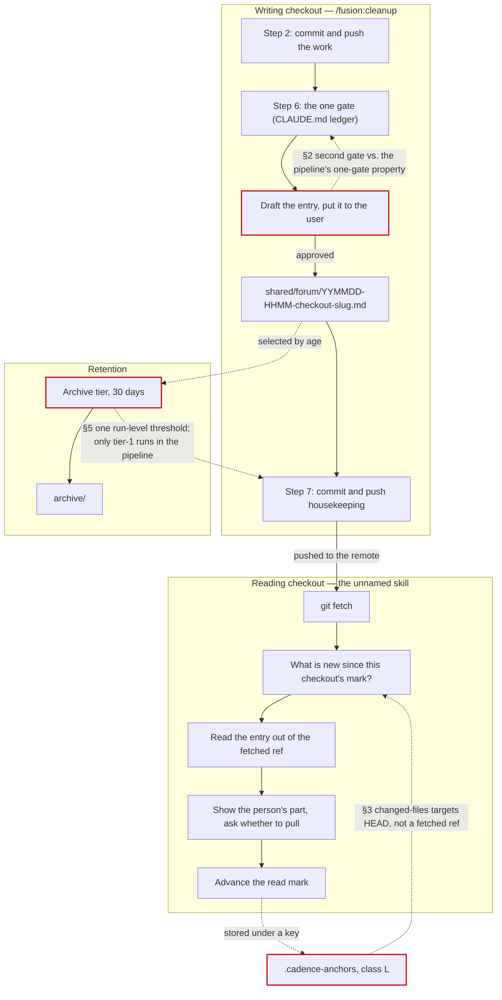

# Analysis: does the anticipated Circle's Directive hit the intention, and is it correctly and completely specified?

**Date:** 2026-09-07 08:40
**Type:** Gap
**Status:** Complete
**Requested by:** user, in chat

## Question

The shaper filed `260907-0829-message-between-checkouts-read-before-pull` as an anticipated
Circle. Three things were asked of it. Does the Directive express the intention the
consultation and the user's rulings established? Is what it states correct against the code
and rules it names? And is it complete enough that a planner could work from it without
re-deciding the design?

The short answer is that the **intention is hit and the shape is right**, that **two of the
Directive's load-bearing reuse claims are false when measured**, and that **the write step as
placed collides with a binding property of the pipeline it is placed into**. Nine further
gaps are enumerated below, most of them small.

## Scope

Read: the Circle record and its shaping history; the consultation
`260907-0729-git-versioned-broadcast-slot-between-checkouts.md`; the blocking decision record
`260907-0733_*_does-the-cross-checkout-message-get-its-own-store-or-two-sections-in-the-session-history.md`;
`skills/cleanup/SKILL.md`, `skills/archive/SKILL.md`, `skills/setup/SKILL.md` `## Step 0k`;
`bin/fusion-paths`, `bin/fusion-cadence-anchor`; `rules/fusion-workbench-conventions.md`,
`rules/circle-records.md`, `rules/workbench-tracking.md`, `rules/user-facing-output.md`,
`rules/critical-stance.md`; `hooks/lib/__tests__/surface-growth-bound.test.ts`,
`helpers/growth-bound.ts`, `derivable-enumerations-lint.test.ts`, `path-literal-lint.test.ts`;
`agents/shaper.md` mode 4. The growth-bound and citation-gate figures were run, not recalled.

Not read: the two dependency Circles' records beyond confirming their directories exist.

**Tree the claims are dated by.** HEAD `3639813c`, committed 2026-09-06T20:16+02:00, branch
`main`, `git status -sb` reports `## main...origin/main` with no ahead/behind marker, so the
branch is level with its remote as of this checkout's last fetch. Every present-tense
statement below is a statement about that tree.

## Findings

### 1. The intention is hit, and the record is formally clean

The Directive states the same design the consultation settled and the user ruled on: the
store, its placement and name, one entry per session, the two parts and their languages, the
gate, the fetch-show-ask reading flow, the read mark, retention by age, and the resolver keys.
Nothing in it contradicts the consultation, and the four corrections and six decisions carried
in the Grounding snapshot match the shaping history line for line.

The record is compliant with the contract that governs it. `agents/shaper.md:93-98` mandates
the frontmatter (`**Domain:** code`, the `**Filed by:**` form, `**Claim:** Unclaimed`, both
`(none yet)` fields), a filled `## Grounding snapshot`, `## Dependencies` as bare Circle
directory names, an empty `## Turn log` and `## Closure note` omitted entirely. The record has
exactly that. Both dependency directories exist. `bin/fusion-citation-check` reports
`edited-violations=0` and `verdict=clean`, so every citation in the record resolves under the
storeless grammar.

One deviation is worth naming and is **not** this record's fault:
`rules/circle-records.md:151` says `## Grounding snapshot` is "Filled at `_a_ → _t_`
activation", while `agents/shaper.md:95` requires it filled at creation. The prompt is the
operative instruction and the record followed it. The rule file is the surface that has
drifted.

### 2. The write step collides with the pipeline's one-gate property

**This is the finding with the largest blast radius, and the Directive does not acknowledge
it.**

`skills/cleanup/SKILL.md:60` states, with a binding decision under it: "**The pipeline runs
unattended up to its one gate, and the gate is last** (decision
`260827-1311_*_where-in-the-cleanup-pipeline-does-the-one-gate-stand.md`)... **A run typed and
walked away from completes everything but that answer**: come back whenever, answer once, and
the apply pass and Step 7's housekeeping commits follow."

The Directive puts the message write "immediately before its housekeeping commit" — that is,
between Step 6 and Step 7 — and says "Nothing is written unless the user approves the draft at
the gate". Read as a second gate, that breaks "answer once" and reinstates exactly the
walked-away-run penalty the 260827-1311 decision was filed to remove. Read as an extension of
the existing Step 6 gate, it inherits three consequences the Directive never states:
`--skip claude-md` (documented at `:60` as running "gateless end to end") would silently
suppress the message; `--dry-run` stops after the curator's survey (`:189`) so the draft would
never be put; and the message question would arrive attached to a `CLAUDE.md` ledger it has
nothing to do with, against `## Questions and gates` in `rules/user-facing-output.md`, whose
line 65 caps a gate at three options.

The Directive says "the gate" as though there were no choice to make. There is one, it is
user-visible, and it is not made.

### 3. `bin/fusion-cadence-anchor` cannot express the delta the reading skill needs

The Grounding snapshot says the helper's "pathspec argument is exactly the read-the-delta
primitive the reading skill needs", and the consultation and the decision record say the same.
**Measured against the implementation, it is not.**

`bin/fusion-cadence-anchor:168` and `:172` hard-code the right-hand side of the range as the
literal `HEAD`. The caller supplies only the key (which resolves to the *left* side, out of
`.cadence-anchors`) and a pathspec, passed after `--` and therefore interpreted as a path and
never as a revision. The second half of the answer is `git status --porcelain` (`:169`,
`:173`), a working-tree read with no meaning against a remote ref. There is no argument, no
option and no environment variable that substitutes the target.

The reading skill's whole point is to read **before** merging: it must ask what changed
between this checkout's mark and a fetched ref that is ahead of `HEAD`. Two failures follow,
and the second is worse than the first.

- The helper cannot be asked that question at all.
- Asked the question it *can* answer, it returns the wrong answer confidently. After the mark
  advances to a fetched-but-unmerged commit, `HEAD` is *behind* the mark, so
  `git diff --name-only <mark>..HEAD` over the forum pathspec is empty and `changed-files`
  reports nothing new — the precise condition in which there is something new to report.

What survives of the reuse is `get` and `set` over an arbitrary key, which do work
(`:135-154`, unknown keys preserved at `:152`). That is a mark *store*, not a delta primitive.
The skill must run its own `git diff --name-only <mark>..<upstream-ref>`. The Circle should say
so, because the current wording tells a planner the work is already done.

Two further properties of the helper bear on the design and are not mentioned:
`.cadence-anchors` is class L (`rules/workbench-tracking.md:24`, `:28`) and never travels, which
is **correct** here — a per-checkout read mark must not be pulled — and a mark git cannot
resolve after a `gc` or a prune yields exit 4 / `changed=unknown` (`:164-165`, `:186-188`),
which for a mark pointing at an unmerged fetched commit is a live rather than a theoretical
case.

### 4. Reading a file out of a git ref is a new mechanism, not a reused one

There is **no existing mechanism in the plugin that reads a file's contents out of a named git
ref**, and no shipped surface runs `git fetch` at all. `git show <ref>:<path>` appears only as
instruction text (`agents/orchestrator.md:472`, `hooks/citation-sweep.ts:321`). The nearest
executable precedents are a test-only `git archive` materialisation
(`hooks/lib/__tests__/committed-dist.test.ts:168-199`) and an existence probe,
`git cat-file -e <commit>:<path>` (`agents/orchestrator.md:726`, `:748`), which reads no blob.

So the reading skill introduces the plugin's first network call and its first ref-content read.
`skills/setup/SKILL.md:403` names three costs of a fetch and the Circle answers all three
correctly for an interactive skill — that reasoning holds. What it does not price is that the
mechanism is new: there is no timeout convention for a skill-issued git command (the 5 s budget
in `hooks/lib/git.ts` binds the TypeScript runner, not a skill's bash block), no established
behaviour for a checkout with no remote or no upstream, and no stated choice of which ref to
show when a branch has several remotes.

**And the path handed to `git show` cannot come from the resolver.** `bin/fusion-paths` emits
workbench-relative values (`:423-424`), the script never invokes `git`, and the workbench root
is the `.fusion-setup` marker's directory, which need not be the git root
(`rules/fusion-workbench-conventions.md:93` states this explicitly). `git show <ref>:<path>`
needs a repo-root-relative path. The skill must derive it; nothing today does.

### 5. The retention answer is inoperative as designed

The Directive: "An entry older than thirty days leaves the live store through the existing
archive step of `/fusion:cleanup`, under a tier of its own". Three measured facts make that
unbuildable as an edit to an existing enumeration.

- **The archive step has one run-level age threshold, not a per-store one.**
  `skills/archive/SKILL.md:126` — "The default age threshold for 'aged' buckets is 14 days;
  override with `tier-N <D>d`". It is parsed once (`:165`) and applied to every aged bucket
  (`:189`). A forum-specific 30 days is a new mechanism, not a row.
- **The pipeline only ever runs tier-1.** `skills/cleanup/SKILL.md:173` — "execute its
  **tier-1** procedure (the safest tier) autonomously". Tier-1's buckets are marker-selected
  (`skills/archive/SKILL.md:132-138`); every age-selected bucket is tier-2 or tier-3
  (`:154`, `:158`). A forum bucket placed where age-selected buckets live **would never fire in
  an ordinary cleanup run**, and the store would grow exactly as the record feared. A forum
  bucket placed in tier-1 would be the first age-selected tier-1 bucket, against the tier's
  own safe-by-construction definition.
- **A forum entry carries no state marker**, so nothing but age can select it.

The consultation's claim that "the tier is an addition to an existing pass rather than a new
mechanism" is the sentence the Circle inherited, and it does not survive the measurement.

Second-order, and worth stating because the record chose age over reads deliberately: with a
30-day rule, an entry can be archived before a checkout dormant longer than that ever reads
it. That is the accepted cost of the ruling, and the Directive should carry it rather than
leave it to be met.

### 6. The context-freedom rule the Circle plans to cite does not bind a record

The Grounding says the person's part needs no new rule because "`rules/user-facing-output.md`
`## Vocabulary` forbids fusion-internal terms in anything a person reads".

`rules/user-facing-output.md:42` says the opposite of what is needed: "Binds chat, gates,
`AskUserQuestion` text and summaries; **not** workbench records (defects, decisions, history,
reviews), where the internal names are correct." `## Length` (`:69-73`) is scoped the same way,
to chat surfaces.

A forum entry **is** a workbench record. The rule as written exempts it. So the
context-freedom obligation is a *new* obligation, exactly as the line cap is, and the Circle
plans to cite where it must author. Either the skill body states the obligation for this store,
or `## Vocabulary` gains a named exception. That is a decision, and it is unmade.

### 7. The `--only` selector writes an entry nobody can receive

`skills/cleanup/SKILL.md:40` — "`--only <steps>` — run only the named steps". `:56` — Step 8
always runs; nothing else does. Step 2 and Step 7 are the only steps that commit or push
(`:247`). So a standalone `--only <forum>` run writes the file and **nothing commits or pushes
it**: it sits in the working tree, and the other checkout never sees it. The Directive's "adds
no git operation anywhere" is true of the in-pipeline case and is what breaks the standalone
case it also mandates.

The same hole has a second mouth: the Directive says "One entry covers both of that pipeline's
pushes", but the entry is written *after* Step 2's push. A reader who pulls between the two
pushes gets the work without its message.

And in a project that is not a git repository, `:248` skips Steps 2 and 7 entirely. A forum
entry there is written, never committed, and addressed to a checkout that cannot exist. The
Directive does not make it a no-op.

### 8. Two blocking test gates fire on a new skill directory, and neither is named

`hooks/lib/__tests__/derivable-enumerations-lint.test.ts:88` asserts both directions between
`skills/*/SKILL.md` and every `/fusion:<name>` token in `CLAUDE.md`; `:104-113` asserts
`README-agents.md`'s skill table has exactly one row per skill directory. A new skill directory
reddens `npm test` until **`CLAUDE.md` and `README-agents.md` are both edited**. The Directive
names neither file.

A third gate joins them: a new skill body trips the golden assertion in
`surface-growth-bound.test.ts:585-606`, whose fixture must be regenerated by a run that
deliberately fails so it cannot be left green (`:498`, `:549-558`).

### 9. The growth budget is tighter than "measure before writing" suggests

The Directive says the addition "is measured before it is written". Measured now, at HEAD:

| Surface | Baseline | Measured | Budget | **Remaining** |
|---|---|---|---|---|
| `skills/*/SKILL.md` | 240 614 B | 247 483 B | 260 614 B | **13 131 B** |
| `agents/*.md` | 399 843 B | 413 225 B | 417 843 B | 4 618 B |

A file with no baseline entry spends its **whole size** as growth
(`surface-growth-bound.test.ts:48-56`). The twelve shipped skill bodies run 6 298 B to
51 971 B, median about 19 000 B. Subtract a cleanup step (call it 1 500 B) and an archive tier
rule, and the reading skill has roughly 10–11 KB — smaller than every shipped body except
`/fusion:commit`.

That collides with the Directive's own mandate that the reasoning "has to survive into the
shipped text": the hook rejection, the Step 0k relationship, the read-without-merging rationale,
the no-threads-no-replies note, the cap enforcement, the fetch flow and the read-mark handling.
This is not a warning to heed later; it is a constraint that shapes what the skill body may
contain, and the Circle should carry the number.

### 10. The hard cap is not a number

"a hard cap in the order of fifteen lines, enforced in the skill body" — a cap enforced by a
body is an integer or it is not enforced. The six-line sub-cap is exact; the total is not. Nor
is "line" defined: source lines, rendered lines, or wrapped display lines give three different
caps for the same file.

### 11. Smaller gaps, each a thing a planner would have to decide

- **The reading skill has no name.** The Directive says "a skill the user invokes by name" and
  never gives the name. It is the string the user types.
- **The `--only` selector has no name** either, and `skills/cleanup/SKILL.md:44` calls its table
  "the selector's whole vocabulary" — a row is mandatory, and `:56`'s "three that replace
  commands", `:60`'s step enumeration and Step 8's report list (`:214-222`) each need an edit.
- **The argument form is undefined.** "invoked without an argument it shows only what is new"
  implies an argument that is never specified.
- **When the read mark advances** is unstated: on render, on the user declining to pull, or on
  a successful pull. The three give different behaviour on an interrupted run.
- **Two sites the Directive misses.** It names "the two places that enumerate the shared-only
  stores". `rules/workbench-path-resolution.md:54-83` is a third, carrying both the key table
  and the paragraph addressed to "whoever adds the fifth such kind". And
  `rules/fusion-workbench-conventions.md` `## Filename Patterns` (`:225-239`) is a fourth: the
  table enumerates artifact kinds and a forum entry is a new one. Separately, the resolver's
  header (`bin/fusion-paths:63-79`) enumerates shared-only **keys** (three) while the
  conventions enumerate shared-only **stores** (five); the Directive treats them as the same
  list.
- **One site the Directive names is not needed.** `rules/workbench-tracking.md:21` carries
  "`shared/` with every store inside it", and `:26` is the file's own worked precedent that a
  new store under `shared/` "needs no exception". Adding a note is conventional; the
  Directive states it as a cost the class table incurs, which it does not.
- **The pointer block's citations must take the storeless wildcard form.**
  `hooks/lib/__tests__/workbench-citation-lint.test.ts` recomputes its corpus from the tree on
  every run and carries no baseline, so one store-prefixed citation in one forum entry reddens
  `npm test` for everybody. The Directive says the block carries "the records filed by their
  citations" without saying in which form.
- **`bin/fusion-paths` implementation notes.** Both keys must enter `ORDER` (`:379-383`) or the
  resolver exits 4; `fusion-paths.test.ts:692-697` anchors on `PORTFOLIO` as the last `ORDER`
  token, so new keys go before it; `path-literal-lint.test.ts:41` `TYPE_FOLDERS` would need
  `forum` for the gate to police the new store name.

### What the design gets right, and should not be re-litigated

The store-versus-history-sections ruling, the single-writer class-R1 shape against an
append-merged log, the placement under `shared/` rather than at the root, the two-part
structure with the pointer block instead of a second narration, the hook rejection on both the
undecidable-trigger ground and the no-model ground, and the Step 0k relationship are all
argued from measurement and all hold under re-reading. Sections 2 through 11 are corrections
inside this design, not arguments against it.

### The mechanism, with the three broken edges marked

The graph reads cleanly in the write direction and in the read direction, which is the design
being right. Every edge that fights the grain is a dashed one, and each is a finding above.

## Implications

The Circle should be activated, not redrafted. The design is sound and the record is well
made. What the findings change is what has to be settled before or during planning, and three
of them change the shape of the work rather than its detail.

Finding 3 removes a component the Circle counted as already built, so the reading skill grows
its own delta computation. Finding 5 turns "add a tier row" into "add a per-store retention
mechanism, or place the bucket where the pipeline actually runs" — the larger of the two, and
the one most likely to be discovered late. Finding 2 is a user-visible design choice sitting
inside a sentence that reads as settled.

Findings 8, 9 and 11 are bookkeeping, but finding 9 bounds finding 11: the shipped text has
about 13 KB of head-room for a skill body, a cleanup step, an archive rule and whatever
reasoning the Directive mandates be carried into all three.

None of this argues for splitting the Circle. The consultation's recommendation to shape it as
one still holds: the write side, the read side and the retention rule share a file format and
fail separately into uselessness.

## Recommendations

1. **Settle the gate question before planning** (§2). One gate or two, and if one, what
   `--skip claude-md` and `--dry-run` do to the message. This is a user decision, not a
   planner's. A decision record is the right home.
2. **Correct the two false reuse claims in the Grounding snapshot** (§3, §6) — the shaper in
   portfolio-activation mode may edit that section in place (`agents/shaper.md:28`). A planner
   reading the current text will not go and check.
3. **Settle retention against the tier mechanism as it exists** (§5), which is a second
   decision record: a per-store threshold, an age-selected tier-1 bucket, or a different
   selector entirely.
4. **Name the skill, the selector and the argument form** (§11) at activation, with the user.
5. **Add the missing edit sites to the Directive's cost list** and drop the one that is not
   owed (§8, §11).
6. **State the line cap as an integer and define what a line is** (§10).
7. **Relay the user's store ruling into
   `260907-0733_*_does-the-cross-checkout-message-get-its-own-store-or-two-sections-in-the-session-history.md`**,
   which the shaping history already records as owed to the next orchestrator session.

Routing: shaper (portfolio-activation) for 2, 4, 5 and 6; orchestrator for 1, 3 and 7; planner
after those land.

## Filed Issues

None, and none is owed. Two decision records were filed after the user ruled; they are named
under `## Rulings taken after this report was written` below.

Every finding is a property of an unactivated Circle's record and is addressed by
editing that record or by filing a decision, not by fixing a defect elsewhere. The one
pre-existing inconsistency this pass found — `rules/circle-records.md:151` says the Grounding
snapshot is filled at activation while `agents/shaper.md:95` requires it at creation (§1) — is
outside this Circle's scope and is named here rather than filed, since it is one sentence in a
rule file and the curator's pass is the surface that reconciles those.

## Sources

- The Circle `260907-0829-message-between-checkouts-read-before-pull`, its `_a_` record, and
  its shaping history `260907-0829-shaper-message-between-checkouts-read-before-pull.md`
- `260907-0729-git-versioned-broadcast-slot-between-checkouts.md`
- `260907-0733_*_does-the-cross-checkout-message-get-its-own-store-or-two-sections-in-the-session-history.md`
- `260827-1311_*_where-in-the-cleanup-pipeline-does-the-one-gate-stand.md`
- `skills/cleanup/SKILL.md` `## Arguments`, `## Autonomy and safety`, `## Step 4`, `## Step 6`,
  `## Step 7`, `## Notes for the assistant`
- `skills/archive/SKILL.md` `### Tier 1`, `### Tier 2`, `### Tier 3`, and its safety filters
- `skills/setup/SKILL.md` `## Step 0k — Whether this checkout is behind its upstream (advisory)`
- `bin/fusion-cadence-anchor`, header and the `changed-files` / `changed-since` implementations
- `bin/fusion-paths`, header, `value_for()` and `ORDER`
- `rules/fusion-workbench-conventions.md` `## fusion-workbench Layout`,
  `## Origin Rule (Herkunftsregel)`, `## Path Resolution (Pfadauflösung)`, `## Filename Patterns`
- `rules/workbench-path-resolution.md`, the key table and the shared-only paragraph
- `rules/workbench-tracking.md` `## The four classes`
- `rules/user-facing-output.md` `## Vocabulary`, `## Questions and gates`, `## Length`
- `rules/circle-records.md` `## Circle record template`
- `agents/shaper.md`, anticipated-circle mode
- `hooks/lib/__tests__/surface-growth-bound.test.ts`, `helpers/growth-bound.ts`,
  `derivable-enumerations-lint.test.ts`, `path-literal-lint.test.ts`
- Commands run: `bin/fusion-citation-check` (verdict `clean`, `edited-violations=0`);
  `wc -c skills/*/SKILL.md`; the surface measurement reproduced from
  `surface-growth-bound.test.ts`

## Rulings taken after this report was written

The user read the report and ruled on 2026-09-07, in chat, on the three findings put to them.
Recorded here so the report is not read as still asking.

- **§2, the gate.** Folded into the existing Step 6 question. One stop, and the walk-away
  property survives. Filed as
  `260907-0902_*_where-does-the-message-approval-sit-now-that-the-cleanup-pipeline-has-exactly-one-stop.md`,
  with the two accepted consequences (`--skip claude-md` writes no message; `--dry-run` puts no
  draft) written into it.
- **§3, the delta.** Confirmed: the reading skill computes its own diff, and the anchor keeps
  only the mark. No record filed — this is a correction to the Grounding snapshot's claim, not
  a choice between options, and the correction is the shaper's write.
- **§5, retention.** Fourteen days is acceptable, so the bucket joins tier-1 and takes the
  run's own threshold. Filed as
  `260907-0902_*_how-is-the-message-stores-retention-expressed-against-an-archive-step-with-one-threshold-per-run.md`.
  The Directive's "thirty days" and "a tier of its own" both fall.

Both records carry `_o_`. The user has ruled on each; only an orchestrator session may move the
marker (`260905-1042_*_may-a-dispatched-agent-perform-the-open-to-answered-transition-at-all-and-under-which-bound.md`),
so the relay is owed to the next one, alongside the relay already owed for
`260907-0733_*_does-the-cross-checkout-message-get-its-own-store-or-two-sections-in-the-session-history.md`.

## Open Questions

- [x] One gate or two in `/fusion:cleanup`, and the behaviour of `--skip claude-md` and
      `--dry-run` on the message (§2). Ruled: folded into Step 6.
- [x] How retention is expressed against a mechanism with one run-level threshold and a
      pipeline that runs tier-1 only (§5). Ruled: tier-1, the run's own threshold.
- [ ] Whether `rules/user-facing-output.md` `## Vocabulary` gains a named exception for this
      store, or the skill body authors the obligation itself (§6).
- [ ] What a standalone `--only` run does about committing and pushing the entry it wrote, and
      whether a non-git project writes one at all (§7).
- [ ] The skill name, the selector name, the argument form, and the integer line cap (§10, §11).
</content>
</invoke>
