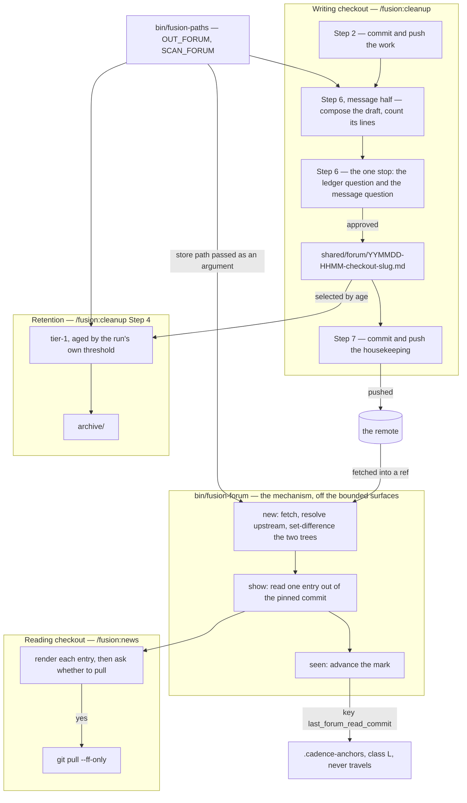
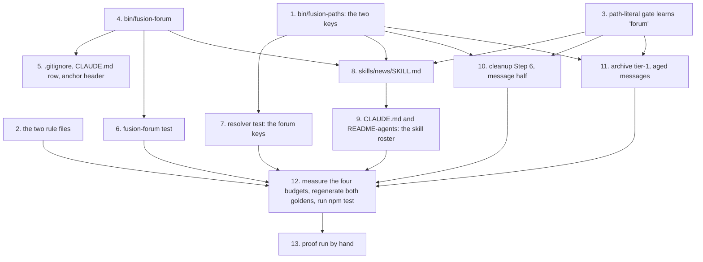

# Implementation Plan: a session that pushes leaves a message the other checkout reads before pulling

**Date:** 2026-09-07
**Status:** Complete
**Spec:** none. Planned from the Circle record `260907-0829-message-between-checkouts-read-before-pull`, whose Directive and Grounding snapshot stand in a spec's place, together with the pre-activation review `260907-0840-spec-review-message-between-checkouts.md`
**Decidability:** The load-bearing question is *what arrived from the remote that this checkout has not read yet*, and it is decidable from the inputs the reading mechanism has, provided the mechanism fetches first. After a fetch, both sides of the comparison are commits git holds locally: the commit this checkout's mark names, and the commit the branch's upstream ref names. The set difference of `git ls-tree -r --name-only <ref> -- <store>` taken at each is exact, with no rename detection and no working-tree read to make it approximate. The question that is **not** decidable is the one `bin/fusion-cadence-anchor changed-files` asks, and this plan does not ask it: that helper fixes the right-hand side of its range at the literal `HEAD` and folds in `git status --porcelain`, so once the mark stands on a fetched commit ahead of `HEAD` the diff is empty and the answer is "nothing new" in precisely the condition where something is. That is the §4 case exactly, since no re-cutting of the range makes a working-tree question answer a remote one, and the change of mechanism is to ask the other question against the two refs, which is what step 4 below builds.

## Directive

The Circle record states it in full and this plan does not restate it. What follows is the design that realises it, and the corrections the tree forced on the record's own cost list.

Three things the record settles shape every step below, repeated only because they are load-bearing here. `bin/fusion-cadence-anchor` is a **mark store** and nothing more, so the reading side computes its own delta. The approval sits inside `/fusion:cleanup`'s single existing stop, so the pipeline gains no second place to wait. And the write step is reachable alone under its own `--only` selector, where it touches git not at all.

## Current State

Measured at HEAD `abcaa823`, branch `main`, level with `origin/main`. Every present-tense claim below was read or run, not recalled.

**Nothing in the plugin fetches or reads a blob out of a ref.** `git fetch` appears in no shipped surface. `git show <ref>:<path>` appears once, as instruction text in `agents/orchestrator.md`. What does exist, and is directly reusable, is `skills/setup/SKILL.md` `## Step 0k — Whether this checkout is behind its upstream (advisory)`: it resolves the branch and its upstream with `git symbolic-ref -q --short HEAD` and `git for-each-ref --format='%(upstream:short)'`, enumerates seven outcomes including `upstream=none` and `upstream=no-work-tree`, and states in prose why it refuses to fetch. That refusal is where the time-budget answer comes from, below.

**There is no portable timeout.** Measured on the reference machine: neither `timeout` nor `gtimeout` is on `PATH`. `hooks/lib/git.ts` `GIT_TIMEOUT_MS = 5_000` is not a precedent that transfers. It is node's `execFileSync` timeout inside a PostToolUse hook, where property 3 of that module's own header gives the reason ("these run inside a PostToolUse hook, on the tool call's own latency budget"). A bash block in a skill body has neither that facility nor that constraint.

**The mark store works and the delta primitive does not.** `bin/fusion-cadence-anchor` `get` and `set` accept any key matching `[a-z_]+` and preserve unknown keys; its header says in as many words that "a future step adds its own key and this list gains a row". `changed-files` and `changed-since` are unusable here, for the reason the Decidability line gives.

**The git path is derivable in two commands, and the derivation names its own failure.** Verified by running it: `GITROOT="$(git rev-parse --show-toplevel)"`, then `REL="${WORKBENCH#"$GITROOT"/}"` yields `fusion-workbench`, and `git show "origin/main:$REL/shared/decisions/<file>"` returns the blob. When the workbench is not inside the repository, the prefix strip leaves an absolute path, which is a condition the code can test rather than a silent wrong answer.

**Four bounded surfaces, not one.** The Circle record prices the skill-body budget alone. Measured with each bound's own collector:

| Surface | Total | Floor | Budget | Head-room | Touched by this work |
|---|---|---|---|---|---|
| `skills/*/SKILL.md` (bytes) | 247 483 | 240 614 | 260 614 | **13 131** | three files, one of them new |
| always-on rule core (bytes) | 88 836 | 86 573 | 98 573 | **9 737** | `fusion-workbench-conventions.md` |
| hook tests (lines) | 21 748 | 20 766 | 23 266 | **1 518** | one new test file, two edited |
| `agents/*.md` (bytes) | 413 225 | 399 843 | 417 843 | 4 618 | none |

The skills figure is unchanged from the 13 131 the Circle record carries at `3639813c`, because the three commits since did not touch a skill body. The always-on core and the hook-test line budget are new information. `rules/fusion-workbench-conventions.md` sits inside the **hard** bound in `rules-emission-golden.test.ts`, which fails rather than reports, and a new test file spends its whole size the way a new skill body does.

**And no baseline may move to make room.** `260822-1102_*_what-happens-when-a-planned-circles-required-work-exceeds-the-remaining-head-room.md` is answered: option 1, a cut runs first, no baseline moves. If the per-file budgets in step 12 are exceeded, the answer is a cut, not an edit to `SKILL_BASELINE`.

**Six gates fire on this work**, four of them on files nobody would think to run tests over:

- `derivable-enumerations-lint.test.ts` asserts both directions between `skills/*/` and every `/fusion:<name>` token in `CLAUDE.md`, and exactly one `README-agents.md` table row per skill directory.
- The same file asserts both directions between the files in `bin/` and `CLAUDE.md`'s Layout table rows. **A new `bin/` helper with no Layout row reddens the suite.**
- `surface-growth-bound.test.ts` holds a golden that must be regenerated by a run that deliberately fails, and three baselines that must not move.
- `rules-emission-golden.test.ts` holds the always-on hard bound and its own golden.
- `fusion-paths.test.ts` asserts, for every agent and every skill read off the tree, that the emitted key set equals the set the prompt names. A skill naming `$SCAN_FORUM` before the resolver knows the key exits 4 and fails there.
- `reference-resolution-lint.test.ts` resolves every `` `file.md` `## Section` `` anchor and every plugin-file path in shipped text, so every anchor this work writes must exist.

**Three edit sites the Directive's cost list misses, and one it names that is not owed.** Missing: `.gitignore` needs `!bin/fusion-forum`, and its own comment warns in capitals that a helper without one is silently dropped from the distribution; `CLAUDE.md`'s Layout table needs a `bin/fusion-forum` row, which is gate-enforced; and `bin/fusion-cadence-anchor`'s header needs the new key's row, which its own text asks for. Not owed, and correctly dropped by the shaper already: `rules/workbench-tracking.md`, whose R1 row reads "`shared/` with every store inside it" and whose `shared/checkouts/` paragraph is the worked precedent that a new store under `shared/` needs no exception.

**One further site is deliberately not edited.** `skills/setup/SKILL.md` scaffolds the shared stores with one `mkdir -p` line, and `shared/checkouts/` is not in it: that store is created by its own writer. This plan follows that precedent, so the writing step creates `shared/forum/` with `mkdir -p` and setup's line is left alone. The reasons are that a store with no entries is better absent than present-and-empty for a reader, that the reading side reads out of a git ref and never needs the directory locally, and that the edit would spend skill-surface bytes the budget cannot spare.

**A defect in the pipeline this work edits.** `skills/cleanup/SKILL.md` carries its Step 6 section physically above its Step 5 section, and three references inside it name the wrong step; `README-agents.md` labels two rows "Cleanup Step 6". Filed as `260907-1942_*_the-cleanup-pipelines-step-numbering-has-drifted-in-its-own-body-and-in-readme-agents.md` in the shared store, because it was found beside this Directive rather than caused by it. Step 10 below may correct it in passing; the record is what tracks it either way.

## Approach

One store, one helper, one reading skill, one writing half of an existing step, one retention row. The design's single organising decision, and the one that answers both the git question and the budget question at once, is **where the mechanism lives**.

**The git work goes in `bin/fusion-forum`, not in the skill body.** `bin/fusion-cadence-anchor`'s own header states the project's established rule for exactly this situation: "The three bounded text surfaces (agents/, skills/, the always-on rules) are effectively full; bin/ is not a bounded surface, and the established pattern (fusion-turn-budget, fusion-session-domain, fusion-events) is that the mechanism and its contract live in the helper's header while the prompt carries one guarded call." Following it here buys three things and costs nothing this Circle was not already paying. It moves the fetch, the ref reads, the delta and the path derivation, which are the parts that need documenting at length, off a surface with 13 131 bytes left and onto one with no bound. It makes the mechanism executable and therefore testable by a hook test, where a body of shell prose in a Markdown file is not. And it costs no extra proof delay: the helper is absent from the installed copy until `fusion --update`, but so is the skill, so the session that builds this work could not have invoked `/fusion:news` anyway.

The helper takes the store path **as an argument** rather than knowing it. `bin/fusion-paths` stays the single resolution point, the skill body resolves `$SCAN_FORUM` and passes it in, and no fifth store-definition site is created.

**The time budget is not a timeout, because no timeout is portable.** What a git call issued from a skill must not do is wait for a human who is not going to answer. That is the failure `skills/setup/SKILL.md` `## Step 0k` names when it refuses to fetch: "against a remote that wants credentials it blocks a non-interactive shell at a prompt, with no timeout command that ships on every platform." So the fetch runs with `GIT_TERMINAL_PROMPT=0` and `GIT_SSH_COMMAND='ssh -oBatchMode=yes'`, which turn every credential prompt into an immediate, reportable failure. What remains is a slow network, and there the case differs from Step 0k's in the one way that matters: `news` is a foreground command the user typed and is watching, so an interruption is theirs to make. The split is disjoint and complete. A prompt-shaped hang fails at once and is reported, a slow transfer is visible and interruptible, and a reachable remote answers.

**This work is not bound by `260906-0035_*_what-should-the-git-helpers-budget-be-and-is-a-timeout-retried.md`, and does not answer it either.** That record governs `GIT_TIMEOUT_MS` in `hooks/lib/git.ts`: a different mechanism, on a different path (a PostToolUse hook on every guarded tool call, where a hang blocks the session), with a timeout facility this one does not have. Its constraint section says so itself, that "the hook must stay fail-open". Nothing decided here narrows or widens it, and nothing here should be read as having settled it.

**Which ref is shown is not a choice.** A branch has at most one upstream, by git's own data model (`branch.<name>.remote` plus `branch.<name>.merge`), so "several" never arises for a branch. A repository with several remotes and no configured upstream lands in the `no-upstream` state, where the helper says so and stops rather than guessing `origin`. A detached HEAD lands in `no-branch`, the same way.

**The delta is a set difference, not a diff.** `git ls-tree -r --name-only <upstream> -- <store>` minus the same at the mark. This is chosen over `git diff --diff-filter=A` deliberately: rename detection makes a diff's answer depend on what else moved in the range, and an archive sweep moving entries out of the store is exactly such a move, while two tree listings and `comm` depend on nothing but the two trees.

**The no-mark case needs no rule of its own, and that is the retention rule paying for itself.** With no mark, the seen set is empty and every entry in the upstream store is new. That is bounded, because the archive step prunes the store at fourteen days and the pruning commit travels: a fresh checkout sees about a fortnight of messages on its first run, which is the design's intent rather than a flood. Adding a first-run special case would be the rim of special cases §2 warns about, bolted onto a case the retention rule already bounds.

**One entry is not shown to the checkout that wrote it.** The filename carries the writing checkout's identifier, and `bin/fusion-identity` gives this one's; entries whose identifier matches are dropped. With the identifier unresolvable, nothing is dropped and the run says so, which is a degradation stated rather than hidden.

### The mechanism



Read against the coherence self-check: fourteen nodes and fifteen edges, no cycle, one direction throughout, and the only node with fan-out above two is `bin/fusion-paths`, which is the resolver and is supposed to be reached by everything that names a store. The helper is drawn as its own lane because the boundary is the design decision this plan is making. Every edge crossing into it is an argument passed in or an answer passed out, and none of them reaches around it into git.

### Step dependency ordering



Every edge is a dependency the step text below declares, and every dependency the step text declares is an edge. Step 3 precedes steps 8, 10 and 11 rather than following them, because a body written before the gate learns the store name is a body nobody checked for a path literal.

## Implementation Steps

1. [DONE] **`bin/fusion-paths` gains `OUT_FORUM` and `SCAN_FORUM`**
   - Executor: `coder`
   - Files: `bin/fusion-paths`
   - Changes: add two branches to `value_for()` beside the unconditionally-shared kinds, both written as literals, so that `OUT_FORUM` prints `shared/forum` and `SCAN_FORUM` prints `shared/forum`. Neither goes through `scan_value` or `$OUT_BASE`: the section of `rules/workbench-path-resolution.md` on the unconditionally-shared kinds states in its last paragraph that a literal in `value_for` is the general form, and it is what makes the keys immune to both the pointer and the `<circle-dir>` argument by construction. That heading is one step 2 renames, so this plan names the section rather than spelling it. Add `OUT_FORUM` to the `ORDER` string on the line that holds `OUT_BACKLOG` and `OUT_CIRCLE`, and `SCAN_FORUM` on the line that holds `SCAN_BACKLOG` and `SCAN_CIRCLES`. **The last `ORDER` line must remain exactly `       PORTFOLIO"`**, seven leading spaces and no other token: `fusion-paths.test.ts` patches that line by regular expression to drive the `value_for` fallthrough, and its own assertion says "ORDER injection did not apply — update the anchor" when it stops matching. Widen the header's shared-key paragraph from three keys to four, keeping the reason the paragraph gives (none of these kinds arises from executing a Directive) and adding the one that is this kind's: a message is addressed to another checkout rather than produced by this one's work.
   - Dependencies: none.

2. [DONE] **The two rule files learn the store**
   - Executor: `coder`
   - Files: `rules/fusion-workbench-conventions.md`, `rules/workbench-path-resolution.md`
   - Changes: in the conventions file, add `forum/` to the `shared/` block of the layout tree in `## fusion-workbench Layout` with a one-clause comment; add it to the sentence beneath the tree that lists the stores existing only in `shared/`, with its reason (a message is addressed to another checkout, so it is not produced by executing a Directive); add a `Forum entry` row to `## Filename Patterns`, written to `$OUT_FORUM`, pattern `YYMMDD-HHMM-<checkout>-<slug>.md`, no state marker, and name it in the sentence there that lists the markerless kinds a reader cites without a marker; and add `SCAN_FORUM` to the `## Path Resolution` invariant-2 paragraph that names `SCAN_CONSULT` and `SCAN_BACKLOG` as apparent exceptions. In `rules/workbench-path-resolution.md`, add `OUT_FORUM` and `SCAN_FORUM` rows to the key table, change the heading and opening sentence of the section on the unconditionally-shared kinds from three to four, and change that section's closing sentence from "whoever adds the fifth such kind" to the sixth. **Do not restate any cardinality as a bare numeral anywhere else** (`rules/critical-stance.md` §5): where the count is not the point, name the kinds.
   - Dependencies: none. Charged against the always-on hard bound, which has 9 737 bytes; budget ≤ 900 bytes for the conventions file.

3. [DONE] **The path-literal gate learns the new store name**
   - Executor: `coder`
   - Files: `hooks/lib/__tests__/path-literal-lint.test.ts`
   - Changes: add `"forum"` to `TYPE_FOLDERS`. From that commit on, no agent prompt and no skill body may write `forum/` followed by a glob, a placeholder, a variable, a filename or end-of-line, since every such site resolves through `$OUT_FORUM` or `$SCAN_FORUM`. `DEFINITION_SITES` is **not** touched, because `bin/fusion-forum` takes the store path as an argument and defines nothing, which is why step 4 is written that way.
   - Dependencies: none.

4. [DONE] **`bin/fusion-forum`: fetch, delta, read, mark**
   - Executor: `coder`
   - Files: `bin/fusion-forum` (new, `chmod +x`)
   - Changes: a pure-bash helper, no node half, on the shape of `bin/fusion-cadence-anchor`. **Its own header is the authoritative documentation**, so the usage block, the exit table, the state vocabulary and the reasoning below all live there, and no prompt restates them.

     `fusion-forum new <store-rel-path>`, where `<store-rel-path>` is the workbench-relative store, passed in by the caller and never known here. In order: resolve the workbench through the sibling `bin/fusion-workbench-root`; require a work tree; resolve the branch with `git symbolic-ref -q --short HEAD` and its upstream with `git for-each-ref --format='%(upstream:short)' "refs/heads/$B"`, the same two commands `skills/setup/SKILL.md` `## Step 0k` uses; fetch with `GIT_TERMINAL_PROMPT=0 GIT_SSH_COMMAND='ssh -oBatchMode=yes'`, passing git's stderr through on failure; derive the git-root-relative store path as `GITROOT="$(git rev-parse --show-toplevel)"` then `REL="${WORKBENCH#"$GITROOT"/}"`, refusing when the strip leaves an absolute path; read the mark by calling `bin/fusion-cadence-anchor get last_forum_read_commit`; list `git ls-tree -r --name-only "$UPSTREAM" -- "$REL/<store>/"` and the same at the mark when the mark resolves, and take `comm -13` of the two sorted lists; drop entries whose filename's checkout field equals this checkout's, read from `bin/fusion-identity`. Print `KEY=value` lines: `state=ok`, `branch=`, `ref=`, `head=` (the upstream's commit sha), `mark=` (the value, or `none`), `new=` (the count), then one `entry=<git-path>` line per new entry, oldest first, and a `note=` line when the self-filter could not run.

     `fusion-forum show <commit> <git-path>` runs `git show "<commit>:<git-path>"` and nothing else. The caller passes the `head=` sha from `new`, which pins the render to the exact tree the delta was computed against, so a concurrent fetch between the two calls cannot change what is shown.

     `fusion-forum seen <commit>` delegates to `bin/fusion-cadence-anchor set last_forum_read_commit <commit>`. It exists so that the key name is spelled in one place and never in a skill body.

     Exit codes, each a different sentence to the user and none of them a substituted value: `0` the printed answer is the answer; `2` usage error; `3` no fusion workbench above `pwd`; `5` nothing to read against, meaning not a work tree, a detached HEAD, or no upstream, with `state=` naming which; `6` the fetch did not complete, with git's own stderr passed through; `7` the workbench is not inside this repository, so no git path can be derived. `new=0` is a real answer and never an error.
   - Dependencies: none, but it is what steps 5, 6 and 8 are about.

5. [DONE] **The three sites a new `bin/` helper owes**
   - Executor: `coder`
   - Files: `.gitignore`, `CLAUDE.md`, `bin/fusion-cadence-anchor`
   - Changes: add `!bin/fusion-forum` to `.gitignore`'s exception list, whose comment warns in capitals that a helper without one is silently dropped from the plugin distribution and names `git ls-files bin/` as the verification. Add a `bin/fusion-forum` row to `CLAUDE.md`'s Layout table, in the same shape as the other helper rows: what it is, the two or three things a reader should carry away, the pointer to its own header as the authoritative documentation, and the standing `[ -x ]` guard note citing `260810-0921_*_how-should-a-prompt-call-a-bin-helper-that-the-installed-copy-may-not-have.md`. **That row is gate-enforced**, since `derivable-enumerations-lint.test.ts` asserts both directions between `bin/` and those rows. Add a `last_forum_read_commit` row to `bin/fusion-cadence-anchor`'s `## The keys the pipeline uses today` block, which its own text invites ("a future step adds its own key and this list gains a row"), saying that the mark names the commit whose forum entries this checkout has already been shown, and that an absent or unresolvable mark means the whole store reads as new, bounded by retention.
   - Dependencies: step 4.

6. [DONE] **A test that drives `bin/fusion-forum`**
   - Executor: `coder`
   - Files: `hooks/lib/__tests__/fusion-forum.test.ts` (new)
   - Changes: drive the real script against scratch repositories, on the shape `fusion-checkout-name.test.ts` and `fusion-identity.test.ts` use. Cover `new` in a tree that is not a work tree, on a detached HEAD, and with no upstream, each producing its own `state=` and exit 5; `new` with the workbench outside the repository, exit 7; `new=0` printed as a real answer with exit 0; a mark that resolves and a mark that does not, the second reading the whole store as new; the self-filter dropping this checkout's own entries, and the `note=` line when the identifier cannot be read; `show` returning the blob at the pinned commit; `seen` writing through `bin/fusion-cadence-anchor` and leaving unknown keys intact. Budget ≤ 220 lines against the 1 518 the hook-test surface has left.
   - Dependencies: step 4.

7. [DONE] **The resolver test learns the forum keys**
   - Executor: `coder`
   - Files: `hooks/lib/__tests__/fusion-paths.test.ts`
   - Changes: assert what the other unconditionally-shared kinds already have asserted, namely that `OUT_FORUM` and `SCAN_FORUM` resolve to `shared/forum` with no Circle active, with one active, and under a `<circle-dir>` target, in the shape of the existing `the backlog keys` block. The roster-wide assertions (`the emitted key set is exactly the set the prompt names`, `resolves every skill too, with no stderr`, the flat-namespace collision check) pick up `news` off the tree and need no edit. Budget ≤ 45 lines.
   - Dependencies: step 1.

8. [DONE] **`skills/news/SKILL.md`, the reading skill**
   - Executor: `coder`
   - Files: `skills/news/SKILL.md` (new)
   - Changes: the body carries the flow and the user-facing sentences, while the mechanism stays in the helper's header and is cited, not restated. Frontmatter `description`, no `argument-hint` (the skill takes no argument, settled), `allowed-tools: [Bash, Read, AskUserQuestion]`.

     Step 0 resolves the source root with the guarded `bin/fusion-source-root` block every other body uses, then `bin/fusion-workbench-root`, then `"$FUSION_PLUGIN_ROOT/bin/fusion-paths" news`, holding `$WORKBENCH` and `$SCAN_FORUM`. Step 1 guards `[ -x "$FUSION_PLUGIN_ROOT/bin/fusion-forum" ]` and, on the miss, says the helper is not in the installed copy yet and to run `fusion --update` and restart, never improvising the mechanism. Step 2 runs `fusion-forum new "$SCAN_FORUM"` and branches on `state=` and the exit code, one plain-language sentence per state, in the project's chat language. Step 3, on `new=0`, **says so in words**, that nothing is new since the last time you looked, naming the ref, and stops. Step 4 renders each entry with `fusion-forum show "$HEAD" "$ENTRY"`, showing the person's part as written, and resolving the writer's identifier to a name with a guarded `bin/fusion-checkout-name resolve <hex>`, falling back to the hex when that exits 3, which is the documented fallback and the reason the registry Circle is a dependency and not a precondition. Step 5 advances the mark with `fusion-forum seen "$HEAD"`, **after rendering and before the pull question**, which is the settled ordering, and whose accepted cost the body states: a message seen and then abandoned does not come back. Step 6 asks whether to pull, once, and on yes runs `git pull --ff-only`, refusing first when `git status --porcelain` is non-empty or a merge or rebase is in progress, and reporting a non-fast-forward as something for the user to resolve rather than merging for them. Step 7 reports.

     Three things the body must say aloud because nothing else will: that the mark advances on render, that a pull is the user's yes and never automatic, and that this skill reads a store and holds no thread, so there are no replies and a message that needs an answer gets one through the other person's own next message.

     **Every glob in a bash block goes through `find` or a command substitution**, never a bare `for f in <glob>`, because the Bash tool runs zsh with `nomatch` on, where an unmatched glob aborts the block before any guard inside it can fire (`rules/fusion-workbench-conventions.md` `## Marker globs`, and the same rule stated at `skills/cleanup/SKILL.md` Step 1). **And no path literal**: the store is named only as `$SCAN_FORUM`, which step 3's gate now enforces.

     Budget: **≤ 9 000 bytes**, smaller than every shipped body but `/fusion:commit`. Where the body wants to explain a mechanism, it cites the helper's header instead.
   - Dependencies: steps 1, 3 and 4.

9. [DONE] **`CLAUDE.md` and `README-agents.md` learn the skill**
   - Executor: `coder`
   - Files: `CLAUDE.md`, `README-agents.md`
   - Changes: `CLAUDE.md` must carry the literal token `/fusion:news`, since the enumeration gate reads every such token in the whole file and asserts both directions against `skills/*/`. Add it to the situational list in the `skills/<name>/SKILL.md` bullet of `## What this is`, and to the `skills/` Layout row's sentence naming the situational bodies. `README-agents.md` gains one table row in the exact parsed shape `` | `/fusion:news` | `skills/news/SKILL.md` | <description> | ``, and the sentence listing the situational skills gains `news`. Neither file is a bounded surface, so neither spends a budget.
   - Dependencies: step 8.

10. [DONE] **`/fusion:cleanup` gains the message half of Step 6, and a selector**
    - Executor: `coder`
    - Files: `skills/cleanup/SKILL.md`
    - Changes: Step 6 keeps its number and gains a second subject, and is renamed to name both. Its message half does four things. It **composes** the draft before the stop: a one-line subject, then the person's part in the chat language, then the pointer block in the artifact language carrying the commit range (from `session.git_head_at_start` in `agentstate.yaml` to `HEAD`), the session history basename, the records filed this session by their **storeless wildcard citations**, and one or two sentences on what the receiving side should not redo. It **enforces the cap by counting**: twenty lines in the file, allocated as one subject line, a blank, at most eight lines of the person's part, a blank, at most nine lines of pointer block, so the two caps compose to the total instead of fighting it. Counting is `wc -l` on the composed text before it is put; over the cap, the draft is cut and recounted, never put and trimmed afterwards. It **authors the context-freedom obligation in its own body** rather than citing `rules/user-facing-output.md` `## Vocabulary`, which exempts workbench records by name and therefore exempts this one: the person's part must read plainly to somebody who never saw the session, so no marker, no fusion noun, no agent name as a subject, no bare identifier. It **writes** the file on approval, at `$WORKBENCH/$OUT_FORUM/<YYMMDD-HHMM>-<checkout>-<slug>.md` after a `mkdir -p`, with the stamp from `date +%y%m%d-%H%M` and the checkout from the guarded `bin/fusion-identity`. The entry carries no `**Filed by:**` field: the reach of that obligation is fixed at four record kinds by `260827-1756_*_which-record-kinds-owe-the-person-half-of-filed-by.md`, this is a fifth, the filename already names the writing checkout, and the twenty-line cap is not spent on a field the registry can already resolve to a name.

      **The stop.** The draft is printed as ordinary output immediately before the gate, and printing is not stopping, so the walk-away property is untouched. The message question rides the existing `AskUserQuestion` call as a **second question in the same call**, keeping one stop, three options per question and eight lines per question. That reading of "one stop" is the one open point in this plan and is filed as `260907-1942_*_does-the-pipelines-one-stop-permit-a-second-question-in-the-same-askuserquestion-call.md`. If the user rules for that record's option 2 instead, this paragraph becomes "the ledger question's three options are re-labelled so each also decides the message", and the sentence below about the two decisions being independent is struck. `skills/curate/SKILL.md` is **not** edited either way: it owns the ledger question, it is reached alone under `--only claude-md` where there is no draft, and a conditional message option in its body would be a copy that drifts.

      **The selector and the flags.** The step table gains a row `| forum | Step 6, message half — leave a message for the other checkout |`, and the sentence beneath it that calls the table "the selector's whole vocabulary" keeps holding. Three consequences the body states aloud rather than leaving to be discovered, two of them the accepted costs the ruling carries. `--skip claude-md` skips Step 6 entirely, so **no message is written and none is offered**. `--dry-run` puts no draft and writes nothing, the same shape every other step takes under that flag. And `--only forum` runs the message half alone, where it composes, asks **its own** one-question confirmation, writes on yes, **touches git not at all**, and tells the user to carry the file in their next commit. That last shape is not new: `skills/archive/SKILL.md` `## Process` step 6 already reads "Confirm via `AskUserQuestion` — except inside the full cleanup pipeline", for exactly the same reason.

      **Two conditions under which nothing is written**, stated in the body: a project that is not a git repository, where the entry would be addressed to a checkout that cannot exist, and a run with nothing to say, meaning no commits in the range and no records filed. Step 7's split list gains `chore(workbench): leave a message for the other checkout`.

      **One accepted property the body names once**: the entry is written after Step 2's push and carried by Step 7's, so a reader who pulls between the two pushes gets the work without its message.

      Budget: **≤ 2 200 bytes** of growth on this file.
    - Dependencies: steps 1 and 3.

11. [DONE] **Retention: tier-1 gains its first age-selected bucket**
    - Executor: `coder`
    - Files: `skills/archive/SKILL.md`
    - Changes: the ruling in `260907-0902_*_how-is-the-message-stores-retention-expressed-against-an-archive-step-with-one-threshold-per-run.md` is option 1, so the bucket joins tier-1 and takes the run's own threshold, fourteen days by default. Add the row to the `### Tier 1` table: target `$SCAN_FORUM`, selection `*.md` whose `YYMMDD` filename prefix is older than the threshold, reason that a message is read once and soon and carries no marker, so age is the only signal that can select it. **Widen the tier's stated basis in its own text**, which the record requires explicitly ("a row alone would leave the heading claiming something the table no longer does"): the heading changes from terminal markers to terminal markers and age, and one sentence beneath it says what makes an aged message as safe as a terminal record, namely that it has one audience and one short lifetime by design, and that the archive moves rather than deletes. Add `$SCAN_FORUM` to the Step 1 sentence that exempts `$SCAN_BACKLOG` and `$SCAN_CONSULT` from `shared_of` derivation, since the kind exists only in the shared store. Add the forum entry to the markerless row of `## Marker vocabulary`. Name the accepted cost once: a checkout dormant longer than the threshold can lose an entry unread, which is what selecting by age buys.
      Budget: **≤ 900 bytes** of growth on this file.
    - Dependencies: steps 1 and 3.

12. [DONE] **Measure the four budgets, regenerate both goldens, run the suite**
    - Executor: `coder`
    - Files: `hooks/lib/__tests__/fixtures/surface-growth.golden`, `hooks/lib/__tests__/fixtures/rules-emission.golden`
    - Changes: regenerate each golden with the command its own header carries, `cd hooks && UPDATE_SURFACE_GOLDEN=1 npx vitest run lib/__tests__/surface-growth-bound.test.ts` and the `UPDATE_RULES_GOLDEN` equivalent for the rules golden. **Both runs fail on purpose**, so the flag can never be left on and a regeneration can never be mistaken for a pass; re-run without the flag and read the diff. Then `npm test` green. **No baseline map is edited.** If the skill surface is over, the answer is a cut, by `260822-1102_*_what-happens-when-a-planned-circles-required-work-exceeds-the-remaining-head-room.md`, and the cheapest cut is to move prose out of `skills/news/SKILL.md` and into `bin/fusion-forum`'s header, which is unbounded and is where the mechanism already lives. Report the four measured figures against the four recorded here, so the Circle's own head-room claim is verified rather than asserted.
    - Dependencies: steps 2, 6, 7, 9, 10, 11.

13. [DONE] **Prove what can be proved in this session, and name what cannot**
    - Executor: `coder`
    - Files: none. This step runs commands and reports.
    - Changes: run `./bin/fusion-forum new shared/forum` **from the work tree by path**, which reaches the new file even though `$FUSION_PLUGIN_ROOT/bin/` does not hold it yet, and record what each of its states prints against this repository's own `origin`. Execute the message half of Step 6 inline from the edited body: compose a draft against this session's own range, count its lines, write one entry into `shared/forum/`, and run `bin/fusion-citation-check` over it to prove the pointer block's citations resolve under the storeless grammar. Execute `skills/news/SKILL.md`'s procedure inline the same way, which is precisely what `/fusion:cleanup` already does for the archive and curate bodies. **What cannot be proved here**, and the report must say so rather than implying otherwise: `/fusion:news` cannot be invoked as a slash command in the session that creates it, because the roster is read from the installed copy at session start and never re-read, and `/fusion:cleanup` executes the installed body rather than the edited one for the same reason. Both belong to the next session, after `fusion --update` and a restart (`260825-1329_*_every-session-runs-one-release-behind-on-a-bin-helper-the-same-repository-just-added.md`).
    - Dependencies: step 12.

**No step is assigned to `ontocoder` or to `analyst`, and both absences are deliberate.** Nothing here is ontology, manifest, schema or fixture data that a person authors: the two golden files are machine-generated by a command, "Generated. Do not hand-edit.", so regenerating them is running a build rather than editing data. And no strategic deliverable is a precondition of any step. The comparative work was done before activation in `260907-0840-spec-review-message-between-checkouts.md`, and the four budget figures, the absence of a portable `timeout`, and the git path derivation were measured in the course of writing this plan rather than left for an analysis to establish.

## Where this Circle stops

- `bin/fusion-paths` emits `OUT_FORUM` and `SCAN_FORUM` as `shared/forum` for every consumer whose prompt names them, with no Circle active, with one active, and under a `<circle-dir>` target, and the last line of its `ORDER` string is still exactly `       PORTFOLIO"`.
- `bin/fusion-forum` has answered `new`, `show` and `seen` against this repository's own remote, and each of its non-zero exits has been produced at least once and reported as a named state rather than as a zero or an empty result.
- `skills/news/SKILL.md`, `skills/cleanup/SKILL.md` and `skills/archive/SKILL.md` together measure inside the skill surface's head-room as `surface-growth-bound.test.ts` measures it, and `rules/fusion-workbench-conventions.md` inside the always-on hard bound as `rules-emission-golden.test.ts` measures it, with no baseline map edited in either file. Where a bound is over, the room has been cut before this Circle closes.
- `npm test` is green with both goldens regenerated by their own failing-on-purpose runs.
- One forum entry written by the message half of Step 6 stands in this repository's workbench, inside the twenty-line cap counted in the file, and `bin/fusion-citation-check` resolves every citation in its pointer block.
- `/fusion:news` has been invoked as a slash command in a session started after `fusion --update` and a restart, and has rendered at least one entry read out of a fetched ref without merging the working tree. **This clause cannot be satisfied in the session that builds the work**, and step 13 is what makes that visible rather than discovered.
- `260907-1942_*_does-the-pipelines-one-stop-permit-a-second-question-in-the-same-askuserquestion-call.md` has been ruled, and the shape of Step 6's stop in the shipped body is the shape the ruling names.
- The three decision records the Grounding snapshot cites carry the marker the orchestrator's relay gives them, so no record in this Circle's store is still open on a question the user has already answered.
- **Precondition on a release:** no tag claiming this feature works goes out before the sixth clause above is answered yes, in writing, in the release commit or the session log. The measured cost of not writing such a precondition down is on the record: a plan made a review pass a precondition of a tag, v10.0.0 was tagged and pushed without the pass, and only a post-release reconciliation noticed.

## Data Structures

**The forum entry**, one file, at most twenty lines, `YYMMDD-HHMM-<checkout>-<slug>.md` in `$OUT_FORUM`:

```
<one-line subject>                                  1 line
                                                    1 blank
<the person's part, chat language>                  ≤ 8 lines
                                                    1 blank
<the pointer block, artifact language>              ≤ 9 lines
```

The pointer block carries the commit range, the session history basename, the records filed by their storeless wildcard citations, and one or two sentences on what not to redo. No frontmatter and no `**Filed by:**`, for the reason step 10 gives.

**The mark**, one line in `fusion-workbench/.cadence-anchors`, class L: `last_forum_read_commit=<sha>`. It names the commit whose forum entries this checkout has been shown, never a timestamp and never a count.

**`bin/fusion-forum new`'s output**, `KEY=value` on stdout, in the shape every other helper prints: `state`, `branch`, `ref`, `head`, `mark`, `new`, then one `entry` line per new entry, plus `note` when the self-filter could not run.

## API Changes

Two resolver keys, `OUT_FORUM` and `SCAN_FORUM`, both unconditionally `shared/forum`. One new executable, `bin/fusion-forum`, with three subcommands and six exit codes. One new anchor key. One new skill, `/fusion:news`. One new cleanup selector, `forum`. No agent prompt changes, and no change to any existing exit code, key or selector.

## Testing Strategy

`hooks/lib/__tests__/fusion-forum.test.ts` drives the real script against scratch repositories and covers every state and every exit code, because the states are the contract and a state nobody produced is a state nobody checked. `fusion-paths.test.ts` gains the forum-key block; its roster-wide assertions pick up the new skill off the tree without an edit, and they are what would catch a body naming `$SCAN_FORUM` before the resolver knows it. `path-literal-lint.test.ts` gains `forum` to `TYPE_FOLDERS`, which is itself the test that the three edited bodies resolve the store rather than naming it. The two enumeration gates and the two growth bounds are not tests this work writes but tests this work must satisfy, and step 12 is where that is measured rather than hoped for. What no test covers, and step 13 states instead, is the slash-command invocation, which no test harness in this repository performs.

## Risks & Mitigations

| Risk | Mitigation |
|---|---|
| The three skill-body additions exceed the 13 131 bytes of head-room, and the temptation is to move a baseline. | The budgets are per-file in steps 8, 10 and 11 and are measured in step 12 before anything is committed. The overflow answer is fixed by `260822-1102_*_what-happens-when-a-planned-circles-required-work-exceeds-the-remaining-head-room.md`, cut first and no baseline moves, and the design already gives the cut somewhere to go: prose belongs in `bin/fusion-forum`'s header, which is unbounded. |
| A body names `$SCAN_FORUM` before the resolver knows the key, and `fusion-paths` exits 4 across the whole suite. | Step 1 precedes steps 8, 10 and 11 in the dependency graph, and `fusion-paths.test.ts`'s roster-wide assertion is what would report it. |
| A `bin/` helper ships without its `.gitignore` exception and is silently absent from every install. | Step 5 makes it an explicit change with `git ls-files bin/` as the check, which is the verification `.gitignore`'s own comment names. |
| A forum entry carries a store-prefixed citation and reddens `npm test` for everybody, since the citation gate recomputes its corpus from the tree and holds no baseline. | Step 10 mandates the storeless wildcard form in the pointer block, and step 13 runs `bin/fusion-citation-check` over the first real entry rather than trusting the mandate. |
| A credential-wanting remote hangs the fetch, and no portable `timeout` exists to bound it. | `GIT_TERMINAL_PROMPT=0` and `GIT_SSH_COMMAND='ssh -oBatchMode=yes'` turn a prompt into an immediate failure with git's own stderr passed through. The residual is a slow transfer at a foreground command the user typed and can interrupt, which is stated rather than bounded. |
| The mark advances past entries the user never really read, on an interrupted run. | Settled and accepted: the mark advances after rendering, and the body says so. The alternative replays every message until a pull happens. |
| `git pull` from a skill merges over an unresolved state, or produces a conflict nobody asked for. | `--ff-only`, refused outright on a dirty tree or an in-progress merge or rebase, and a non-fast-forward is reported for the user to resolve rather than merged. |
| The reading skill is written, committed and released without ever having been invoked, because it cannot be invoked in the session that writes it. | The sixth stopping clause and its release precondition, plus step 13's explicit report of what it could not prove. |
| Step 6's two subjects break the one-stop property or the eight-line cap. | The draft is printed before the call, not inside the question, and each question keeps its own three options and its own cap. The reading of "one stop" that permits this is filed as a decision rather than assumed. |

## Open Questions

- [ ] Whether the pipeline's one stop permits a second question inside the same `AskUserQuestion` call, or the message must ride the ledger question's three options as a coupled choice. Filed as `260907-1942_*_does-the-pipelines-one-stop-permit-a-second-question-in-the-same-askuserquestion-call.md`, which names the one sentence of step 10 that changes under each answer. It does not block the other twelve steps.
- [ ] The three decision records the Grounding snapshot cites carry the user's ruling in their bodies and still read `_o_`. Planning treats all three as settled, as the dispatch directed; the relay to `_a_` is the orchestrator's act and is not a step of this plan.
- [ ] `260906-0035_*_what-should-the-git-helpers-budget-be-and-is-a-timeout-retried.md` stays open, and this work neither answers it nor is bound by it, for the reasoning under `## Approach`. If it is later ruled in a way that establishes a project-wide convention for git latency, `bin/fusion-forum`'s header is the surface that would have to be re-read against it.
- [ ] `260822-1154_*_does-the-hook-test-line-budget-cover-comment-prose.md` is open and bears on step 6's 220-line budget, since a helper test documented at this project's usual density spends much of its allowance on comments. It changes no step here, and is named so the next person measuring that surface knows the question exists.

## Reconciliation Log

**260908-0027, reconciler, domain `code`, verified at HEAD `9d99b19d` (range `abcaa823..9d99b19d`, 12 commits).**

**Status moved Draft to Complete, and the filename marker to `_c_`.** All thirteen steps read `[DONE]` and every one of them was checked against the tree rather than taken from the mark:

| Step | Evidence read |
|---|---|
| 1 | `bin/fusion-paths` `value_for()` prints `shared/forum` for both keys; both appear in `ORDER`; the last `ORDER` line is still exactly seven spaces and `PORTFOLIO"`. Commit `af3f23e2`. |
| 2 | `rules/fusion-workbench-conventions.md` carries the store in the layout tree, in the shared-only sentence, as a `## Filename Patterns` row and in the invariant-2 paragraph; `rules/workbench-path-resolution.md` heading now reads four kinds. Commit `97bc8b0b`. |
| 3 | `"forum"` stands in `TYPE_FOLDERS` of `hooks/lib/__tests__/path-literal-lint.test.ts`. Commit `6528b039`. |
| 4, 5 | `bin/fusion-forum` exists, is tracked by git and carries the `+x` bit; `.gitignore`, the `CLAUDE.md` Layout row and the `last_forum_read_commit` row in `bin/fusion-cadence-anchor` are all present. Commit `4a31cd57`. |
| 6, 7 | `hooks/lib/__tests__/fusion-forum.test.ts` added; the resolver test gained the forum block. Commits `09bd6755`, `3de741a0`. |
| 8, 9 | `skills/news/SKILL.md` is 8 766 bytes against a 9 000 budget; `CLAUDE.md` carries the `/fusion:news` token and `README-agents.md` the table row. Commit `5c240eb7`. |
| 10 | `skills/cleanup/SKILL.md` carries `### The message half` with the second question in the same call, the `forum` selector row and both flag consequences; Step 5 and Step 6 now stand in run order. Commit `4c421f29`. |
| 11 | The tier-1 table carries the `$SCAN_FORUM` row and the heading widened to terminal markers and age. Commit `97bc8b0b`. |
| 12 | Both goldens moved; no baseline file was touched anywhere in the range (`git diff abcaa823 HEAD` over the two bound files and the helper is empty), which is the clause the plan made non-negotiable. |
| 13 | `260908-0006-coder-s13-proof-run-by-hand.md` records the run; the entry it wrote stands at twenty lines in the shape `## Data Structures` specifies. |

**The `## Current State` always-on head-room figure is wrong and stays wrong in the table above; read this instead.** The row records 88 836 total, 86 573 floor, 98 573 budget and **9 737** of head-room. It summed the five files `RULE_BASELINE` in `hooks/lib/__tests__/rules-emission-golden.test.ts` labels the universal core. The hard bound measures the intersection of what every agent actually loads, and `bin/fusion-rules` emits exactly three files unconditionally — `agent-setup.md`, `fusion-workbench-conventions.md`, `critical-stance.md` — since `user-facing-output.md` and `decision-record-examples.md` moved to conditional audiences at the two gates of 2026-08-27. Re-measured here from the emitter and the file sizes: floor 65 498, budget 77 498, and at `abcaa823` a core of 73 000 with **4 498** free, not 9 737. The margin was overstated by 5 239 bytes, which is more than half of what was claimed. At HEAD the core is 73 317 with 4 181 free. Step 12 found this and its log states it (`260907-2336-coder-s12-measure-the-four-budgets.md`); the plan text was never corrected, so a later reader sizing work off this table would over-commit by a factor of two. The other three rows re-measure as recorded. The same wrong figure also stands in the commit message of `97bc8b0b`, where nothing can move it, and in `agentstate.yaml`'s `key_findings`, which the session's clean exit removes. The comment that produced the error is filed as `260908-0027_*_the-universal-core-comment-names-five-files-while-the-bound-measures-three.md`.

**The sixth stopping clause is unmet, deliberately, and is recorded rather than missed.** `/fusion:news` cannot be invoked as a slash command in the session that creates it: the skill roster is read from the installed copy at session start. The clause itself says so in bold, step 13 reports it under `## 4. What this session cannot prove`, and the release precondition below it forbids a tag claiming the feature works until the clause is answered yes in writing. Verified independently: the installed resolver exits 4 on `$SCAN_FORUM` for `news` while the work-tree resolver answers `shared/forum`. This is not an omission and is not filed as a defect.

**The other stopping clauses hold.** Both resolver keys answer `shared/forum` with a Circle active and under a `<circle-dir>` target; no baseline map was edited; the one forum entry stands at twenty lines and `bin/fusion-citation-sweep --dry-run` now reads `files=0 rewrites=0 bare-record=0`; the one-stop question was ruled and the shipped body carries the shape the ruling names; the three relayed decisions all carry the marker the relay gave them. Review coverage over the range is `reviews=0 uncovered=12` — the Circle review is Phase 4's and no clause claimed otherwise.

**One measurement the plan made and step 12 corrected in passing:** the hook-test spend was 266 lines against a claimed 265, the extra line being step 3's one-line addition to the path-literal gate, which the spend list did not name. Immaterial to the bound.
