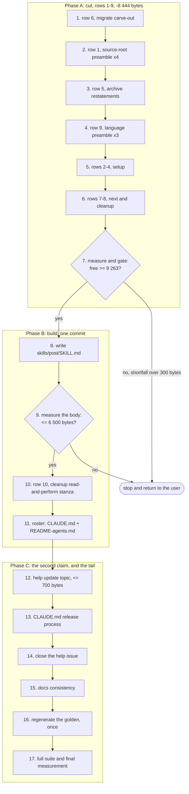

# Implementation Plan: cut the `skills/` surface, then add `skills/post/SKILL.md`

**Date:** 2026-09-08
**Status:** Draft
**Spec:** none. The Directive of `260908-1410-cut-skills-surface-add-post-body` plus the measured ledger `260908-1346-the-cut-ledger-for-the-skills-surface-and-what-the-post-body-owes.md` stand in a spec's place; the shaper's clarification round is recorded in `260908-1410-shaper-cut-skills-surface-add-post-body.md`.
**Decidability:** The load-bearing question is whether the `skills/*/SKILL.md` growth bound still passes once a new body is added, and it is decidable from the inputs the mechanism has. The bound is `total > floor + head_room`, where the floor is a literal map in `hooks/lib/__tests__/surface-growth-bound.test.ts` and the total is `wc -c` over a directory read off the tree. Nothing is predicted. The one quantity nobody can measure in advance is the new body's own size, and this plan does not estimate it either: Step 9 writes the body, measures it, and branches on the measurement, with the "too large" branch returning to the user rather than absorbing the overage. Two derived quantities carry the same property, since the ledger's before-figures were re-measured against this tree during planning and reproduce exactly.

## Directive

Cut ten measured passages out of the shipped skill bodies, then spend the freed room on `skills/post/SKILL.md`, the fourth body of the `/fusion:cleanup` pipeline. `/fusion:cleanup` Step 6's message half becomes a read-and-perform stanza pointing at the new body, so the composition contract for a cross-checkout message exists once rather than twice. The Circle record carries the full Directive and its Grounding; this plan does not restate them.

Two rulings are settled ahead of planning and are not reopened here: the inverted shape (the contract lives in `post`, cleanup reads it) and the rejection of the surface-count objection (a fourth step body, not a fourth administrative name).

## Current State

### The bound, re-measured

Measured at HEAD `94a262b0`, working tree clean except the machine-written `fusion-workbench/orchestrator-events.jsonl`:

| Quantity | Value | Where it comes from |
|---|---|---|
| `skills/*/SKILL.md` total | 259 495 | `wc -c skills/*/SKILL.md` |
| Floor | 240 614 | `SKILL_BASELINE` summed over the 12 files it names |
| Head-room | 20 000 | `SKILL_HEAD_ROOM` |
| Budget | 260 614 | floor + head-room |
| Free | **1 119** | budget minus total |

Every figure reproduces the ledger's exactly, so the ledger reads the tree this plan starts from. `skills/news/SKILL.md` carries no baseline entry and its whole 8 766 bytes already read as growth; `skills/post/SKILL.md` will enter the same way, which is why its full size lands against the free column.

### The ten cut rows, re-measured

Each "before" span was re-measured during planning. All nine that the ledger measured off drafted replacements reproduce byte for byte. Row 10 measures 2 069 against the ledger's 2 070, a one-byte difference in where the span's trailing blank line was counted.

| Row | Site | Before | After | Net |
|---|---|---|---|---|
| 1 | source-root preamble in `setup`, `cleanup`, `help`, `next` | 5 162 | 2 212 | −2 950 |
| 2 | `setup` layout bullets | 1 048 | 485 | −563 |
| 3 | `setup` Step 0j measurement rationale | 1 014 | 498 | −516 |
| 4 | `setup` Step 0k fetch-refusal reasons | 554 | 174 | −380 |
| 5 | `archive` container premise, marker table, glob note | 2 335 | 917 | −1 418 |
| 6 | `migrate` three-reason carve-out | 2 226 | 913 | −1 313 |
| 7 | `next` relay-provenance note | 608 | 354 | −254 |
| 8 | `cleanup` exit-3/exit-4 bullets | 353 | 172 | −181 |
| 9 | language preamble in `next`, `direct`, `curate` | 1 520 | 651 | −869 |
| 10 | `cleanup` Step 6 message half | 2 070 | 950 (est.) | −1 120 |
| | **Total** | | | **−9 564** |

### Four things planning found that the inputs get wrong or leave out

Each is carried into a step below rather than left for an executor to rediscover.

**The lint forces two edits, not one.** `hooks/lib/__tests__/derivable-enumerations-lint.test.ts` asserts a two-way match between `skills/*/` and the `/fusion:<name>` tokens in `CLAUDE.md` (the block at `describe("enumeration lint: the skill roster")`), and separately asserts that `README-agents.md` carries exactly one table row per skill directory, matched by the anchored pattern `` | `/fusion:<name>` | `skills/<name>/SKILL.md` | ``. The ledger's "What the new body owes" names only the `CLAUDE.md` token. Both land in the same commit as the directory or the suite is red at once.

**A third prose claim goes false, in a file nobody named.** `README-agents.md:235` reads "Three more bodies in the table, `archive`, `curate` and `log-activity`, are steps of the cleanup pipeline rather than commands of their own". With `post` that becomes four, and the enumeration itself is incomplete. Neither the ledger, nor the Circle record, nor the dispatch names this site. It carries a cardinality in words, which `rules/critical-stance.md` §5 treats exactly as it treats a numeral.

**Row 6's pointer target has no heading of its own.** The ledger verified the target at `rules/workbench-path-resolution.md` line 44, and that paragraph is real, but it sits inside `## The second argument: the Circle in scope` and carries no heading naming the carve-out. `hooks/lib/__tests__/reference-resolution-lint.test.ts` resolves a heading anchor only in the adjacent form `` `file.md` `## Section` ``, and `rules/fusion-workbench-conventions.md` `## Filename Patterns` forbids the line-number form in living text. So row 6's replacement cannot cite the paragraph precisely by any permitted spelling. The Directive forbids adding a byte to a rule file, so the plan cites the file without an anchor and names the paragraph in prose, and files the gap rather than fixing it.

**Three heading anchors in the ledger's verification table are spelled with a colon where the tree uses an em-dash.** The real headings are `## State Markers — issues and planning` and `## State Markers — decisions` in `rules/fusion-workbench-conventions.md`, and `## State Markers — circles` in `rules/circle-records.md`. The anchor lint does a prefix match, so a colon spelling resolves to nothing and fails. An executor copying the ledger's table verbatim reddens the suite on row 5.

### One claim in the dispatch that the tree qualifies

The dispatch says `skills/post/SKILL.md` defines both invocation shapes "matching the three existing step bodies". The three do not share one shape. `skills/archive/SKILL.md` `## Process` step 6 carries an explicit branch, asking for confirmation on a standalone run and skipping it inside the full pipeline. `skills/curate/SKILL.md` states that the caller holds the gate and asks nothing itself. `skills/log-activity/SKILL.md` has no branch at all, because it has no question to ask. `post` asks a question, so archive is the one precedent it copies, and cleanup's current text already says so at its `--only forum` clause. The other two are precedents for the frontmatter, the language line and the boundaries section, not for the branch.

### The exclusion in row 9, restated more narrowly than the inputs state it

`skills/migrate/SKILL.md:12` stays out of row 9, and the exclusion holds. The stated reason is stronger than the tree supports: the exemption category itself is authored in `rules/fusion-workbench-conventions.md` `## Project language`, which names "hook and CLI operator strings" among the universally exempt surfaces. What migrate states alone is the application of that category to its own shell blocks. The one-line form would drop that application, and whether a shortened form can keep it is unexamined, so the file is left alone and the question is filed as a decision record.

### The golden, and why it is regenerated once

`260815-2322_*_can-a-commit-stand-green-on-its-own-when-the-golden-is-a-per-file-inventory-of-a-multi-file-turn.md` answers this: the green unit is the Turn, not the commit, and `hooks/lib/__tests__/fixtures/surface-growth.golden` is regenerated once at Turn end. Neither the Circle record nor the ledger names that record, and an executor meeting the golden's failure mid-run will otherwise treat it as its own defect. Every dispatch in Phase A and B says in its own words that a stale golden inventory is expected until the last step.

## Approach

Cut first, build second, tidy last. The ordering is the substance of this plan, so the reason is written down here rather than left as a preference a later reader may reverse for convenience.

**Why the cut runs first.** Three reasons, and each would be sufficient. The bound is a failing gate, not a report: with `skills/post/SKILL.md` written before the cuts, the surface stands roughly 3 000 to 5 400 bytes over budget and the suite is red on the bound itself, which is the one signal that would otherwise tell an executor that a cut went wrong. Second, `260822-1102_*_what-happens-when-a-planned-circles-required-work-exceeds-the-remaining-head-room.md` already ruled that a Circle needing room cuts it rather than being granted it, and building first would put the same request back in a different order. Third, and the reason the ledger's do-not-cut list exists: with a red suite and a written body, the question "where do I cut another kilobyte" gets answered under time pressure, and the ten candidates that must not be cut are exactly where an executor in that state will reach.

**Why row 10 is not part of the cut phase.** Cutting cleanup's message half before `post` exists deletes the only statement of the composition contract. Row 10 and the new body are one unit of work and one commit.

**What is not re-derived.** The ledger's figures. Planning re-measured them to confirm the tree has not moved and found one one-byte discrepancy; the executors take the numbers as given and measure the result, not the premise.

**No growth baseline moves anywhere in this work.** `SKILL_BASELINE`, `AGENT_BASELINE` and `TEST_LINE_BASELINE` in `hooks/lib/__tests__/surface-growth-bound.test.ts` are untouched, and so is `RULE_BASELINE` in `hooks/lib/__tests__/rules-emission-golden.test.ts`. `260822-1154_*_does-a-cut-only-circle-re-baseline-the-surfaces-it-cuts.md` is open and a later reader will reach for it; it does not license a move here, because this Circle cuts in order to spend and a re-baseline would hand back the room the new body is meant to consume. The three events at which a baseline may move are authored in `hooks/lib/__tests__/helpers/growth-bound.ts` and none of them is this.

### Step dependencies

The graph is a chain with two decision nodes and no cycles. The chain is genuine rather than a drawing convenience: every step after 7 depends on the room 1 through 6 freed, steps 10 and 11 cannot stand without 8, and 16 measures the tree that 1 through 15 leave behind. Both branches out of a decision node are drawn, so neither stopping outcome is a case the diagram hides.

## Implementation Steps

Each step below names the files it touches. Where a row's span is a fraction of one line rather than a whole line range, the step says so: four of the ten rows (3, 4, 7 and 9) cut inside a line, and an executor taking the whole line destroys text the row does not touch. Measure the file after each step, never the line range.

### Phase A: cut

1. **[DONE] Row 6, migrate's carve-out (−1 313)**
   - Executor: `coder`
   - Files: `skills/migrate/SKILL.md`
   - Changes: replace the three numbered reasons under `## Why this skill does not call bin/fusion-paths` (lines 14 through 24 at this head, measured 2 226 bytes) with a short statement that this is the one consumer naming both layouts literally, plus a pointer at `rules/workbench-path-resolution.md`. **Cite the file without a heading anchor** and name the paragraph in prose, for the reason under `## Current State`: the carve-out sits inside `## The second argument: the Circle in scope` and no permitted spelling addresses it precisely. Do not add a heading to the rule file; the Directive forbids a rule file gaining a byte. Keep the closing sentence about `bin/fusion-workbench-root` still supplying the anchor, which is migrate's own fact.
   - Dependencies: none. Lowest risk and second-largest yield, which is why it goes first.

2. **[DONE] Row 1, the source-root preamble across four bodies (−2 950)**
   - Executor: `coder`
   - Files: `skills/setup/SKILL.md`, `skills/cleanup/SKILL.md`, `skills/help/SKILL.md`, `skills/next/SKILL.md`
   - Changes: in each, the three paragraphs following the source-root shell block (the `UNRESOLVED` paragraph, the why-the-branch line, the what-the-root-does-not-cover paragraph) collapse to one that cites `bin/fusion-source-root`'s own header. Per-site before-figures: setup 1 340, cleanup 1 327, help 1 179, next 1 316. Per-site targets: 683, 577, 555, 397. **Keep the shell block itself untouched in all four**, per do-not-cut item 7. **Keep each body's own consequence sentence**: cleanup names the three steps that would fail silently, help names the never-paraphrase-a-doc-you-could-not-read rule, and those are the bodies' own behaviour rather than restatement.
   - Dependencies: step 1. All four sites land in **one commit** so the four copies cannot diverge again.

3. **[DONE] Row 5, archive's three restatements (−1 418)**
   - Executor: `coder`
   - Files: `skills/archive/SKILL.md`
   - Changes: three spans. The container premise (lines 13 to 20, 917 bytes, to 321) becomes a citation of `rules/fusion-workbench-conventions.md` `## fusion-workbench Layout` plus the two rules that are archive's own. The marker-vocabulary table (lines 85 to 96, 961 bytes, to 472) becomes citations of `rules/fusion-workbench-conventions.md` `## State Markers — issues and planning` and `## State Markers — decisions`, and `rules/circle-records.md` `## State Markers — circles`. The glob note (line 180, 457 bytes, to 124) becomes a citation of `## Marker globs`. **The three heading anchors take an em-dash, not the colon the ledger's verification table spells**, or the anchor lint fails. **Verify that the marker table's terminal-state column survives as a claim in the replacement**: safety filter 2 depends on `_d_` being terminal and still excluded, and cutting the table without restating that leaves the filter resting on nothing. Do not touch the safety filters or the tier tables (do-not-cut items 2 and 7).
   - Dependencies: step 2.

4. **[DONE] Row 9, the language preamble in three bodies (−869)**
   - Executor: `coder`
   - Files: `skills/next/SKILL.md`, `skills/direct/SKILL.md`, `skills/curate/SKILL.md`
   - Changes: adopt the one-line form `skills/news/SKILL.md:18` already uses, verbatim in shape. The cut spans are **fractions of a line, not whole lines**: `next:263` measures 560 bytes of which 531 is the preamble and the tail "For this skill specifically:" stays; `direct:137` measures 768 of which 523 is the preamble and the Step-5 confirmation sentence after it stays; `curate:121` measures 467 and is the preamble alone. Per-site targets: 217 each. **`skills/migrate/SKILL.md` is excluded**, for the reason under `## Current State`; do not extend the row to it.
   - Dependencies: step 3.

5. **[DONE] Rows 2, 3 and 4, setup (−1 459 together)**
   - Executor: `coder`
   - Files: `skills/setup/SKILL.md`
   - Changes: row 2 replaces the three workbench-layout bullets (lines 84 to 86, 1 048 bytes, to 485) with a citation of `## fusion-workbench Layout` plus the two facts that are Setup's own, that `circles/` starts empty and Setup creates no Circle, and that only `.guard-state/` is pre-created. Row 3 cuts the `ls-files` measurement rationale inside Step 0j's opening paragraph (1 014 bytes, to 498), keeping the claim and pointing at `260905-2234_*_step-0js-new-unignored-branch-fires-on-a-directory-whose-contents-are-ignored-by-the-dir-star-form.md`; **the "Reported and not repaired" sentence that follows the cut span stays**. Row 4 cuts Step 0k's four reasons for refusing to fetch (554 bytes, to 174) and points at the closure note of `260905-1850_*_setup-does-not-notice-that-the-checkout-is-behind-its-remote.md`. **Step 0k's eight output branches are not touched** (do-not-cut item 1), and neither is Step 0e's per-block prelude (item 6) or any shell block (item 7).
   - Dependencies: step 4.

6. **[DONE] Rows 7 and 8 (−435)**
   - Executor: `coder`
   - Files: `skills/next/SKILL.md`, `skills/cleanup/SKILL.md`
   - Changes: row 7 replaces `next:167`'s restated comparison (608 bytes, to 354) with the pointer it already carries at `260813-1306_*_the-playmaker-maintains-the-backlog-store.md` `## Approach`; the Step 5b relay mechanics above it are do-not-cut item 3 and stay. Row 8 replaces `cleanup:88-89`'s two exit-code bullets (353 bytes, to 172) with one line naming whose fault each is; the surrounding sentence already cites `rules/fusion-workbench-conventions.md` `## Path Resolution` and stays.
   - Dependencies: step 5. Small and safe, taken while the files are open.

7. **Measure the cut, and gate on it**
   - Executor: `coder`
   - Files: none (measurement only)
   - Changes: run `wc -c skills/*/SKILL.md`. Expected total 251 051, free 9 563 against the budget of 260 614. Report the measured total, the free figure, and the per-row delta against the ledger. **If the measured total is more than 300 bytes above 251 051, stop and report before Phase B** rather than starting the build against room that is not there. A shortfall under 300 bytes is inside the drafting noise the ledger declares and continues.
   - Dependencies: step 6.

### Phase B: build, one unit of work and one commit

8. **Write `skills/post/SKILL.md`**
   - Executor: `coder`
   - Files: `skills/post/SKILL.md` (new)
   - Changes: the fourth cleanup-pipeline step body. It carries, and none of these is optional:
     - Frontmatter with `description` and `allowed-tools`. The description follows the two step bodies' shape: what it is, that it is reachable alone as `/fusion:cleanup --only forum`, and that it is kept as its own body rather than a command. `allowed-tools` is `[Bash, Read, Write, AskUserQuestion]`; it dispatches no agent.
     - The one-line language declaration in the form `skills/news/SKILL.md:18` uses, the same form step 4 adopts elsewhere.
     - Its own `"$FUSION_PLUGIN_ROOT/bin/fusion-paths" post` resolution with the exit-code handling that goes with it. The body **must spell `$OUT_FORUM` and `$WORKBENCH` literally**, because `bin/fusion-paths` derives a consumer's key set by grepping its prompt for `$(OUT|SCAN)_[A-Z][A-Z_]*`; a body that names no key gets none. Never write a store literal: `hooks/lib/__tests__/path-literal-lint.test.ts` forbids one in any `skills/*/SKILL.md`.
     - The composition contract, moved from `skills/cleanup/SKILL.md`'s `### The message half` without change of substance: twenty lines in the file, subject, blank, at most eight lines of the person's part in the chat language, blank, at most nine lines of pointer block in the artifact language; the commit range, the session history basename, this session's filed records as storeless wildcard citations, and a sentence on what the other side need not redo; `wc -l` before the write and never a put-then-trim; the person's part reading plainly to somebody who never saw the session; the write to `$WORKBENCH/$OUT_FORUM/<YYMMDD-HHMM>-<checkout>-<slug>.md` with the stamp from `date +%y%m%d-%H%M` and the checkout from the `[ -x ]`-guarded `bin/fusion-identity`; no `**Filed by:**`, per `260827-1756_*_which-record-kinds-owe-the-person-half-of-filed-by.md`.
     - **Both invocation shapes, on archive's pattern and not on curate's or log-activity's.** Inline, as Step 6's message half, the caller has already stopped once and this body asks nothing of its own. Standalone, under `--only forum` or invoked by name, it asks its own single confirmation, writes on yes, touches git not at all, and says to carry the file in the next commit. `skills/archive/SKILL.md` `## Process` step 6 is the worked precedent for the branch and the sentence to model.
     - A boundaries section, on `skills/curate/SKILL.md` `## Boundaries`' pattern: it writes exactly one file and nothing else, it dispatches no agent, it commits nothing, and it composes nothing when there is nothing to say.
   - Dependencies: step 7.

9. **Measure the new body, and stop if it is over**
   - Executor: `coder`
   - Files: none (measurement only)
   - Changes: run `wc -c skills/post/SKILL.md`. **If it measures above 6 500 bytes, the work stops here.** Report the measured figure and the head-room it leaves against the budget, and return the question to the user. Do not cut a further row, do not reach into the ledger's do-not-cut list, and do not trim the new body's statement of its own behaviour to fit. This is a step outcome, not a risk to be mitigated: cutting further under pressure is the failure the do-not-cut list exists to prevent, and the user ruled the branch before the Circle was activated.
   - Dependencies: step 8.

10. **Row 10, cleanup's read-and-perform stanza (−1 120)**
    - Executor: `coder`
    - Files: `skills/cleanup/SKILL.md`
    - Changes: `### The message half` (lines 200 to 212, 2 069 bytes) becomes a stanza of roughly 950 bytes that reads `$FUSION_SRC/skills/post/SKILL.md` and executes its procedure inline, in the shape Steps 4, 5 and 6 already use. **What stays behind is only what is cleanup's own**: that `--skip claude-md` drops the message with the step, that `--dry-run` puts no draft and writes nothing, that `--only forum` runs the half alone, and that the draft is a second question inside the same `AskUserQuestion` call so the walk-away property holds. Do not restate the twenty-line cap, the two language halves or the filename shape; that is the drift the inverted shape exists to prevent. Also correct `skills/cleanup/SKILL.md:11`, which enumerates the archive pass, the `CLAUDE.md` pass and the activity-log pass as the procedures this skill reads and performs: the message pass joins them, and the enumeration is incomplete without it. Leave line 57 alone: "the three that replace commands fusion used to expose on their own" stays true, because `post` replaces no former command. Leave the selector table alone: `forum` already has its row.
    - Dependencies: step 9.

11. **The roster obligations, in the same commit as the directory**
    - Executor: `coder`
    - Files: `CLAUDE.md`, `README-agents.md`
    - Changes: four edits, all forced or made false by step 8.
      - `CLAUDE.md`: a `/fusion:post` token, which `hooks/lib/__tests__/derivable-enumerations-lint.test.ts` requires and whose absence fails the suite with `skills/post/ exists but CLAUDE.md never mentions /fusion:post`.
      - `CLAUDE.md`, the same bullet: "Three further bodies are steps of the cleanup pipeline rather than commands" becomes four and names `post` (Step 6, message half); the selector list gains `--only forum`; "Two of those three selectors are the body's own name and one is not" becomes two of four, since `post`'s selector is `forum`; and "the three are listed here because `derivable-enumerations-lint` asserts a two-way match" becomes the four. Do not add `post` to the situational list: it is a step body.
      - `README-agents.md`: one table row, matching the anchored pattern the lint parses, `` | `/fusion:post` | `skills/post/SKILL.md` | <description> |``. Exactly one row, and the slash command and the file column must agree.
      - `README-agents.md:235`: "Three more bodies in the table, `archive`, `curate` and `log-activity`" becomes four and names `post`. **No input to this Circle names this site**, and no lint reads it.
    - **A hand edit to `CLAUDE.md` is correct here and needs no gate.** `README-agents.md`'s `/fusion:curate` row calls curate "the only path to `CLAUDE.md`", which is about the reconciliation pass rather than a lint-mandated same-commit token. The precedent is commit `5c240eb7`, which added `/fusion:news` to `CLAUDE.md` by hand in the same commit as `skills/news/`. The wording of that claim is filed as a defect rather than corrected here.
    - Dependencies: step 10. **Steps 8, 10 and 11 form one commit.** Split apart, the intermediate commit fails a lint rather than only the golden inventory, and `260815-2322_*_can-a-commit-stand-green-on-its-own-when-the-golden-is-a-per-file-inventory-of-a-multi-file-turn.md` excuses only the second.

### Phase C: the second claim on the same room, and the tail

12. **The help topic's update section (at most +700 bytes against `skills/`)**
    - Executor: `coder`
    - Files: `skills/help/SKILL.md`
    - Changes: swap the three release paragraphs at lines 101, 103 and 105 (measured 541, 947 and 809 including their newline) for three covering the current three releases. The paragraphs are **labelled by the install the reader is coming from and describe the releases after it**, which is what reconciles the issue's reading against the ledger's: today's labels are v10.14, v10.7 and v10.6 while the content covers v10.20, v10.14 and v10.7. The new labels are v10.24, v10.23 and v10.22, describing v10.25, v10.24 and v10.23, newest first. Source material is `docs/upgrading-to-v10-25.md`, `docs/upgrading-to-v10-24.md` and `docs/upgrading-to-v10-23.md`, all three present. The standing pointer paragraph beneath them does not change, and the three-paragraph cap is `CLAUDE.md`'s. **The net against `skills/` must not exceed +700 bytes**; measure it and report the figure. Per do-not-cut item 8, do not compress the topic's quotes of shipped source to make room. While the file is open, add `--only forum` to the selector list at `skills/help/SKILL.md:76`, which costs about 16 bytes and is counted separately from the 700.
    - Dependencies: step 11.

13. **`CLAUDE.md`'s release process names this surface**
    - Executor: `coder`
    - Files: `CLAUDE.md`
    - Changes: the second acceptance clause of `260906-2014_*_the-help-topic-on-updates-has-missed-two-releases-and-names-none-of-the-last-three.md`. The update topic in `skills/help/SKILL.md` joins the surfaces a release checks, so a third consecutive miss is a step somebody skipped rather than a step nobody has. **No cardinality in `CLAUDE.md` may go false as a side effect**: the release-process section carries "four version surfaces" and, below it, "A fifth thing to keep coherent". The update topic carries release paragraphs rather than a version string, so the cheapest true placement is a clause in release step 0's check list or a sentence after the fifth-thing paragraph. If the executor instead extends the four-surface enumeration, "four" becomes five and "A fifth thing" becomes a sixth in the same edit. This costs the `skills/` budget nothing.
    - Dependencies: step 12.

14. **Close the help-topic issue**
    - Executor: `coder`
    - Files: the record `260906-2014_*_the-help-topic-on-updates-has-missed-two-releases-and-names-none-of-the-last-three.md`, which stands in the shared issue store
    - Changes: append a `Resolved:` note naming both acceptance clauses and where each was met, then rename the marker `_o_` to `_c_`, per `rules/fusion-workbench-conventions.md` `## Inline State Tracking`. The note cites by heading anchor, never by line number.
    - Dependencies: step 13.

15. **Documentation consistency**
    - Executor: `coder`
    - Files: `docs/fusion-intro.md`
    - Changes: line 116's list of individually reachable steps ("Einzelne Schritte allein: `--only archive`, `--only log-activity`, `--only claude-md`") gains `--only forum`. The eight-step count in the same sentence does not change, because the message pass is Step 6's half rather than a ninth step. **Do not add `/fusion:post` to the command table at line 209**: that table lists the administrative and situational commands and carries no step body, so a row for `post` would contradict the ruling that this adds no administrative name. `docs/messages-between-checkouts.md:25` and `docs/upgrading-to-v10-25.md:53` already document `--only forum` correctly and need no edit.
    - Dependencies: step 14.

16. **Regenerate the golden, once**
    - Executor: `coder`
    - Files: `hooks/lib/__tests__/fixtures/surface-growth.golden`
    - Changes: run `cd hooks && UPDATE_SURFACE_GOLDEN=1 npx vitest run lib/__tests__/surface-growth-bound.test.ts`, which rewrites the fixture and then fails on purpose so the flag can never be left on in a green run. Read the whole diff and confirm every per-file change is one this plan intended, which is the entire obligation the flag exists to create. Then re-run without the flag. **This is the only regeneration in the whole Circle**, per `260815-2322_*_can-a-commit-stand-green-on-its-own-when-the-golden-is-a-per-file-inventory-of-a-multi-file-turn.md`: the green unit is the Turn, not the commit, and making the regeneration routine is what that record declined. **Regenerating the golden moves no baseline and clears no bound**; if the bound is red after this step, the answer is a cut and never an edit to `SKILL_BASELINE`.
    - Dependencies: step 15.

17. **Full suite, and the final measurement**
    - Executor: `coder`
    - Files: none (verification only)
    - Changes: run the full `npm test` from `hooks/`. Report the final `skills/*/SKILL.md` total, the floor of 240 614, the budget of 260 614 and the free figure, together with the measured size of `skills/post/SKILL.md` and the measured net of the help-topic swap. Confirm in the report that no baseline moved on any of the four surfaces, by naming the four constants and stating that each is unchanged. Also run `"$FUSION_PLUGIN_ROOT/bin/fusion-paths" post` and confirm it exits 0 and emits `WORKBENCH` and `OUT_FORUM`; the installed resolver reads the work tree's prompts in this repository, so the new body resolves in this session even though the installed copy does not carry it.
    - Dependencies: step 16.

## Where this Circle stops

- All ten ledger rows have been taken, and `wc -c skills/*/SKILL.md` measures within 300 bytes of 249 931 before the new body is counted.
- `skills/post/SKILL.md` exists, measures at most 6 500 bytes, and carries frontmatter, the one-line language declaration, its own `bin/fusion-paths post` resolution with exit-code handling, both invocation shapes, and a boundaries section.
- `skills/cleanup/SKILL.md` Step 6's message half is a read-and-perform stanza that restates no part of the composition contract, and the contract exists in exactly one file.
- `CLAUDE.md` carries a `/fusion:post` token, names four cleanup-pipeline step bodies, and says two of four selectors are the body's own name; `README-agents.md` carries exactly one `/fusion:post` table row and its line 235 names four step bodies.
- The update topic in `skills/help/SKILL.md` names the three most recent releases, `CLAUDE.md`'s release process names that surface among the ones a release checks, and issue `260906-2014_*_the-help-topic-on-updates-has-missed-two-releases-and-names-none-of-the-last-three.md` carries a `Resolved:` note and the marker `_c_`.
- `npm test` is green, and the run reports the `skills/` total, floor, budget and free figures.
- No baseline moved: `SKILL_BASELINE`, `AGENT_BASELINE` and `TEST_LINE_BASELINE` in `hooks/lib/__tests__/surface-growth-bound.test.ts` and `RULE_BASELINE` in `hooks/lib/__tests__/rules-emission-golden.test.ts` are byte-identical to their state at HEAD `94a262b0`.
- **Precondition on any later release.** `skills/post/SKILL.md` cannot be invoked as `/fusion:post` in the session that creates it, because a session reads its skill roster from the installed copy at start and never re-reads it. A release that claims the standalone shape works has to have proved it after a `fusion --update` and a restart, or say plainly that it has not. The same shape held for the Circle that built the `curator` and for `/fusion:news`.
- **Two branches end the Circle short, and each is a completed outcome rather than a failure.** Step 7 measuring a shortfall above 300 bytes, and step 9 measuring the new body above 6 500 bytes. In either case the work stops, reports the measured figure and the head-room it leaves, and returns the question to the user; no further row is cut and nothing in the new body is trimmed to fit.
- One condition is deliberately not here: whether `skills/migrate/SKILL.md`'s language preamble can adopt a shortened form is filed as a decision record and does not gate this Circle.

## Data Structures

None. No type, schema, interface or fixture format changes. `hooks/lib/__tests__/fixtures/surface-growth.golden` gains a `skills/post/SKILL.md` line and new sizes for eight existing entries, which is the fixture's own generated shape and not a format change.

## API Changes

None in code. One surface addition: `skills/post/SKILL.md` registers `/fusion:post` as a slash command, and `bin/fusion-paths post` becomes a valid resolution emitting `WORKBENCH` and `OUT_FORUM`. The `--only forum` selector in `/fusion:cleanup` keeps its name and its behaviour, so no documented flag changes.

## Testing Strategy

No new test file. Three shipped gates already cover the whole change, and adding a fourth would spend hook-test lines this plan does not need.

| What must hold | What proves it |
|---|---|
| `skills/` stays inside its budget | `hooks/lib/__tests__/surface-growth-bound.test.ts`, the `skills` bound |
| The fixture describes the tree | the same file's golden comparison, after step 16 |
| `/fusion:post` is on both rosters | `hooks/lib/__tests__/derivable-enumerations-lint.test.ts`, the skill-roster block |
| Every new pointer resolves | `hooks/lib/__tests__/reference-resolution-lint.test.ts`, classes (a) and (b) |
| No store literal entered a skill body | `hooks/lib/__tests__/path-literal-lint.test.ts` |
| Every record citation in this plan resolves | `hooks/lib/__tests__/workbench-citation-lint.test.ts` |
| This plan carries its stopping section | `hooks/lib/__tests__/plan-stopping-section-lint.test.ts` |

Two verifications the suite does not perform, and each is a named step above: the resolver actually emitting `OUT_FORUM` for the new body (step 17), and the per-row byte deltas matching the ledger (step 7).

## Risks & Mitigations

| Risk | Mitigation |
|---|---|
| An executor copies the ledger's heading anchors verbatim and the colon spelling fails the anchor lint | Step 3 names the em-dash spelling of all three headings explicitly |
| An executor takes a whole line where the row cuts inside it, destroying the skill-specific tail | Steps 4, 5 and 6 name the sub-line spans and give the per-site before-figures so the result is checkable |
| The golden failure mid-run is read as the executor's own defect and regenerated per commit | Every Phase A and B dispatch says a stale golden inventory is expected until step 16, citing `260815-2322_*_can-a-commit-stand-green-on-its-own-when-the-golden-is-a-per-file-inventory-of-a-multi-file-turn.md` |
| Steps 8, 10 and 11 land in separate commits and an intermediate commit fails a lint | Step 11 states the one-commit constraint and why the golden record does not excuse a lint failure |
| The help-topic swap runs over 700 bytes because a dense release paragraph runs to 946 | Step 12 requires the net to be measured and reported; the ledger's fit table leaves 3 483 bytes at the pessimistic end, so an overrun is visible rather than fatal |
| Row 5 drops the marker table and leaves safety filter 2 resting on nothing | Step 3 requires the terminal-state claim to survive in the replacement, and names the filter that depends on it |
| `bin/fusion-paths post` returns nothing because the new body names no resolver key | Step 8 requires `$OUT_FORUM` and `$WORKBENCH` spelled literally in the body, and step 17 runs the resolver |

## Open Questions

- [ ] Whether `skills/migrate/SKILL.md`'s language preamble can adopt the shortened form while keeping its shell-string clause. Filed as `260908-1612_o_can-migrates-language-preamble-adopt-the-shortened-form-and-keep-its-shell-string-clause.md` in this Circle's decision store, because the answer fixes whether the one-line form is the project's universal shape or one with a documented exception. Row 9 excludes migrate either way and this Circle does not wait on it.
- [ ] Where exactly `CLAUDE.md`'s release process should name the help topic (step 13). Two placements are true and cheap, and the choice is the executor's; only the constraint that no cardinality goes false is binding.
- [ ] Whether `skills/help/SKILL.md:76`'s selector list is an enumeration or an example. Step 12 adds `--only forum` on the reading that it is an enumeration, at a cost of about 16 bytes. Nothing turns on the answer.

## Filed alongside this plan

Three records, per `rules/fusion-workbench-conventions.md` `## Issue and Decision Filing`. None of them gates this Circle.

- `260908-1612_o_can-migrates-language-preamble-adopt-the-shortened-form-and-keep-its-shell-string-clause.md`, this Circle's decision store.
- `260908-1612_o_readme-agents-calls-curate-the-only-path-to-claude-md-while-a-lint-forces-a-hand-edit.md`, this Circle's issue store. Surfaced by step 11's obligation.
- `260908-1612_o_the-migrate-carve-outs-authoring-home-has-no-heading-a-citation-can-address.md`, this Circle's issue store. Surfaced by step 1's pointer.
- `260908-1612_o_log-activity-calls-itself-cleanups-step-6-and-it-is-step-5.md`, the shared issue store. Found next to this work rather than caused by it: `skills/log-activity/SKILL.md` is in no row of the ledger.
