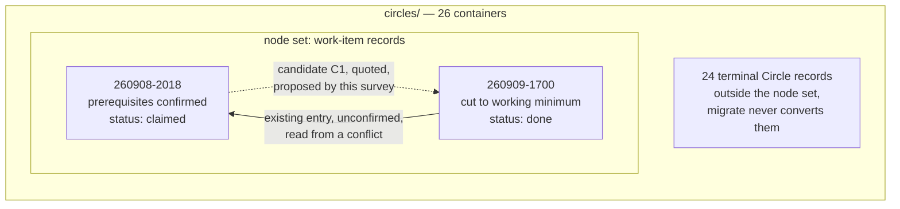

# Analysis: candidate prerequisite edges between work items

**Date:** 2026-09-11 19:15
**Type:** Document Study
**Status:** Complete
**Requested by:** orchestrator (step D1 of `260911-1833_*_implementation-prerequisites-confirmed-once-order-computed.md`)

## Headline

**One candidate prerequisite edge.** Quoted: 1. Inferred: 0.

That count is not a thin reading of a rich corpus. It is the largest number this corpus can
produce. The store holds two work items; one of them is `done` and therefore cannot be a dependent;
so exactly one ordered pair is available to propose, and this survey proposes it. The first stopping
condition in `260911-1528_*_spec-prerequisites-confirmed-once-order-computed.md` `## Stops when`
reads "fewer than three candidate edges the user confirms", and one is fewer than three whether or
not the user confirms this one.

**What the reader must not conclude from it.** The count says nothing about how densely fusion's
work carries prerequisite relations. It says the node set is currently too small for the question to
be asked. `## The corpus` states the arithmetic that forces the bound, and
`## Density outside the node set` gives the one figure that does bear on the underlying question,
clearly separated from the headline.

## Question

Over the work items in fusion's own workbench, which pairs stand in a prerequisite relation, where a
prerequisite means the dependent may start after the named item is done? Each candidate carries the
dependent, the item its `**Depends-on:**` entry would name, an evidence tier, and the sentence the
relation was read from. The count of candidates is the input to the spec's first stopping condition
and decides whether the proposal pass is built at all.

## Scope

Read: the 26 containers under `fusion-workbench/circles/`, the two work-item records inside them,
the two legacy flat entries under `fusion-workbench/shared/backlog/`, the decision and issue records
in the claimed item's own stores, its spec and its implementation plan, and
`rules/fusion-workbench-conventions.md` `## Backlog entries — work items`. The `## Dependencies`
section of each of the 24 terminal Circle records was read for the density figure only.

Written: this report, and nothing else. No head field of any record was edited and no marker moved.

**Tree state.** HEAD `a3977760`, committed 2026-09-11 18:45:28 +0200, branch `main`, tracking
`origin/main` and three commits ahead of it. Two files carry uncommitted modifications, the
implementation plan this step belongs to and the event log. Every present-tense claim below is dated
by that commit.

## The corpus

A work item is a directory under `circles/` whose record sits inside it under the directory's own
name, with no marker on either. That is the definition in
`rules/fusion-workbench-conventions.md` `## Backlog entries — work items`, and it is the one the
code holds as well, in `ITEM_RECORD_RE` in `hooks/lib/citation-corpus.ts`.

| Figure | Value | How taken |
|---|---|---|
| Containers under `circles/` | 26 | `ls fusion-workbench/circles/` |
| Containers holding a record at their own name | 2 | loop over each container testing for `<name>/<name>.md` |
| Containers holding a terminal Circle record instead | 24 | the complement; each holds `_c_circle.md`, `_b_circle.md` or `_s_circle.md` |
| Work items whose status admits them as a dependent | 1 | `260908-2018`, status `claimed`; the other is `done` |
| Ordered pairs available to propose | 1 | one admissible dependent, one other node, no self-edges |

The two nodes:

| Item | Status | `**Depends-on:**` today |
|---|---|---|
| `260908-2018-prerequisites-confirmed-once-order-computed` | `claimed` | absent |
| `260909-1700-cut-fusion-to-working-minimum` | `done` | `260908-2018-prerequisites-confirmed-once-order-computed.md` |

**The 24 terminal containers are outside the node set by construction, not by a judgement made
here.** Each holds a Circle record from the superseded layout, which carries a six-marker state and
no `**Status:**` field in the vocabulary `open | claimed | done | dropped`.
`/fusion:migrate` converts a live Circle record and never a terminal one, so these will not become
work items. A helper computing over the store reads two nodes, and a survey over two nodes is a
different statement from a survey over 26. This report makes the smaller statement.

**Two further files could be mistaken for work items and are not.**
`fusion-workbench/shared/backlog/` holds `260814-1733_c_bounded-executor-dispatches.md` and
`260814-1733_p_attach-the-rule-to-the-act.md`, flat files in the pre-container backlog form carrying
issue-vocabulary markers rather than a status field. They fail the container test, so no helper reads
them and neither can be an endpoint. That the flat form still appears in user-facing text is already
filed, at
`260911-1128_*_four-user-facing-documents-place-a-work-item-in-shared-backlog-as-a-flat-file.md`.

Coherence self-check. Three nodes, two edges, no fan-out above one, no cycle in the asserted
direction because the two edges are the same unordered pair read opposite ways and only one of them
is proposed. The terminal block is drawn as one node rather than 24 because nothing distinguishes
them for this question. The graph says what the prose says: one existing entry pointing the wrong
way, one candidate pointing the right way, and a large body of containers that participates in
neither.

## Findings

### The candidate

| # | Dependent | Entry would name | Tier | Sentence read from | Source |
|---|---|---|---|---|---|
| C1 | `260908-2018-prerequisites-confirmed-once-order-computed` | `260909-1700-cut-fusion-to-working-minimum.md` | quoted | "**Sequence it after the cut**, and re-sharpen the Directive and Grounding against what the cut leaves standing." | `260909-1808_*_the-ground-this-circle-was-measured-on-is-being-cut-away-and-its-design-must-move.md`, `## Options` option 1 |

**Why the tier is quoted rather than inferred.** Three sentences state the relation, each in a
different record, and none of them required reasoning about what the two items do.

The relation is named as a sequencing question and answered:

> "4. **The sequencing question.** Planning this Circle against surfaces the other Circle is removing
> would produce a plan invalidated before it runs."
> (`260909-1808_*_the-ground-this-circle-was-measured-on-is-being-cut-away-and-its-design-must-move.md`,
> `## What must change`)

The answer is recommended, and it is a split rather than a blanket deferral:

> "Option 2 for the dependency field alone, option 1 for the rest. The field is the only part that is
> cheap now and expensive later; everything else in this Circle reads a store that does not exist yet."
> (same record, `## Recommendation`)

And the dependent's own specification records the ordering as already carried out, naming the commit
in which the prerequisite delivered the carrier the dependent computes over:

> "The carrier's replacement already landed. At `76d833be` the work item gained `**Depends-on:**`, a
> comma-separated list of item basenames"
> (`260911-1528_*_spec-prerequisites-confirmed-once-order-computed.md`, `## What changed under the
> original shaping`)

That last sentence is what makes this a prerequisite and not a lineage note. The prerequisite
produced the field; the dependent's whole computation layer reads that field; the dependent's spec
is a re-shape dated after the prerequisite closed. The dependent could not have been planned in its
current form before the prerequisite was done, which is the definition the survey was given.

### The countervailing sentence, and why it does not sink the candidate

The same pair is described from the other side as a conflict, and that description is explicit about
refusing to be an ordering:

> "`260908-2018-prerequisites-confirmed-once-order-computed`. **Conflicting, and the conflict is
> substantive rather than an ordering nicety.**"
> (`260909-1700-cut-fusion-to-working-minimum.md`, `## Dependencies`)

> "If that Circle lands first, its output is built on a layer this one then removes. The two cannot
> both proceed as written, and which one gives way is the user's call at activation, not this
> record's."
> (same section)

Read at the moment it was written, that sentence is correct and the pair carried no direction. The
direction was supplied afterwards, by the user activating the cut and by the dependent being
re-shaped against what the cut left. A mutual exclusion whose resolution is recorded is an ordering;
a mutual exclusion whose resolution is still open is not. The candidate is offered on the strength of
the resolution, and the confirming user should see both sides, which is why both are quoted here.

### What is not proposed, and why

**No edge with `260909-1700` as dependent.** Its status is `done`, so the survey's own bound forbids
it. This matters because the store's one existing entry is exactly that edge, written by the
migration on resolvability alone and confirmed by nobody
(`260911-1747_*_the-migration-wrote-a-conflict-relation-into-depends-on-and-nobody-confirmed-it.md`).
This survey does not re-propose it in either the same or a softened form.

**No edge touching a terminal Circle record.** Those 24 are not nodes, so no entry naming one would
resolve in the node map the helper builds, and proposing one would manufacture the dangling edge the
mechanism exists to avoid.

**No edge read from a citation, a lineage or a shared subject.** The claimed item cites five binding
artifacts in its own record and its spec cites more; every one of them is a decision record, a rule
file or an analysis, none of which is a work item. The single largest source of apparent relations in
this workbench is precisely that kind of citation, and none of it is an ordering over work.

## Density outside the node set

One figure bears on the underlying question and must not be folded into the headline. The 24
terminal Circle records carry a `## Dependencies` prose section; 21 of them name at least one other
Circle there, and 49 distinct Circle names appear across the 24 sections, counted by extracting
stamped directory names from each section and deduplicating per record.

**That figure is not 49 candidate edges and must not be read as a proxy for one.** Three reasons,
each already measured elsewhere and each independently sufficient. Every dependent among the 24 is
terminal, so no entry could be written. The sections carry at least five distinct relation types with
nothing in the text to tell them apart, which is the finding in the claimed item's own
`## Grounding snapshot` and the reason this work exists. And at least one of those sections is
explicitly not an ordering, the same conflict quoted above.

What the figure does support is a narrower claim: the prose in this workbench carries relations
between units of work at a rate of roughly two names per record, so a store of live items at
comparable size would plausibly yield edges to confirm. The claim is about a hypothetical store, and
the confirm loop is being sized against the real one.

## Implications

**The first stopping condition is met.** One candidate is fewer than three, so by
`260911-1528_*_spec-prerequisites-confirmed-once-order-computed.md` `## Stops when`, the work stops
after C2 and the proposal pass is not built. Steps D2 and D3 of the implementation plan, the apply
pass and the five curator sites, have no work to justify them at this corpus size. The spec's stated
reasoning holds on the measurement: a confirm loop that produces one edge costs more to invoke than
to perform by hand, and performing this one by hand is a single field written into a single record.

**The count is a property of the backlog, not of the mechanism.** Nothing here argues that the
proposal pass is the wrong design. It argues that the store has two items in it and the pass has
nothing to do. If the backlog grows to a size where the density figure above starts to bite, the
condition should be re-read rather than treated as settled against the pass forever.

**The candidate is admissible but blocked, and by a question already filed.** Confirming C1 records a
prerequisite that is already satisfied, since the named item is `done`. Whether a satisfied
prerequisite is an edge at all, or no edge, is open at
`260908-2018_*_is-a-closed-prerequisite-a-satisfied-edge-or-no-edge-and-what-is-an-archived-one.md`,
which is question (c) of gate G1. Under the "no edge" answer, the count this report returns is
**zero** rather than one, and the stopping condition is met more decisively still. The gate therefore
reads this candidate and that decision together.

**One confirmation would repair the store's only edge rather than add to it.** The existing entry and
this candidate are the same unordered pair read in opposite directions. Striking the existing entry
and writing C1 would leave the store with one edge, correctly directed and user-confirmed, where it
now has one edge, wrongly directed and confirmed by nobody. Question (d) of G1, which asks whether a
`done` item's head field may be corrected, decides the first half of that; question (c) decides
whether the second half is written at all.

## Recommendations

1. **Put C1 to the user at gate G1, beside question (c) and question (d) rather than on its own.**
   The three are one decision at this corpus size. Presenting the candidate first invites a
   confirmation whose meaning depends on an answer not yet given.
2. **Report the count to the stopping condition as one, and do not build the proposal pass.** Steps
   D2 and D3 have no input. The orchestrator carries this to the gate; no agent dispatch follows from
   this report.
3. **Keep the density figure out of the stopping decision and in the record.** It belongs to whoever
   re-reads the condition after the backlog grows, and folding it into the headline now would turn a
   measurement about 24 terminal records into a claim about two live ones.

## Filed Issues

None. Every actionable finding this survey met is already filed: the unconfirmed migration entry at
`260911-1747_*_the-migration-wrote-a-conflict-relation-into-depends-on-and-nobody-confirmed-it.md`,
the terminal-field question at
`260911-1747_*_may-a-done-work-items-head-field-be-edited-at-all-and-under-what-bound.md`, the
satisfied-edge question at
`260908-2018_*_is-a-closed-prerequisite-a-satisfied-edge-or-no-edge-and-what-is-an-archived-one.md`,
and the flat-file backlog references at
`260911-1128_*_four-user-facing-documents-place-a-work-item-in-shared-backlog-as-a-flat-file.md`.
Filing a fifth record restating any of them would be the duplication the analyst standards forbid.

## Sources

- `fusion-workbench/circles/260908-2018-prerequisites-confirmed-once-order-computed/260908-2018-prerequisites-confirmed-once-order-computed.md`, head fields and `## Dependencies`
- `fusion-workbench/circles/260909-1700-cut-fusion-to-working-minimum/260909-1700-cut-fusion-to-working-minimum.md`, head field line 7 and `## Dependencies` lines 85 and 93
- `260909-1808_*_the-ground-this-circle-was-measured-on-is-being-cut-away-and-its-design-must-move.md`, `## What must change` item 4, `## Options` option 1, `## Recommendation`
- `260911-1528_*_spec-prerequisites-confirmed-once-order-computed.md`, head `**Source:**`, `## What changed under the original shaping`, `### C1`, `## Stops when`
- `260911-1833_*_implementation-prerequisites-confirmed-once-order-computed.md`, `## Current State` and step D1
- `260911-1747_*_the-migration-wrote-a-conflict-relation-into-depends-on-and-nobody-confirmed-it.md`
- `rules/fusion-workbench-conventions.md` `## Backlog entries — work items`
- `hooks/lib/citation-corpus.ts`, `ITEM_RECORD_RE`
- `fusion-workbench/shared/backlog/260814-1733_c_bounded-executor-dispatches.md` and `260814-1733_p_attach-the-rule-to-the-act.md`
- The `## Dependencies` section of each of the 24 terminal Circle records under `fusion-workbench/circles/`

## Open Questions

- [ ] Does a satisfied prerequisite count as an edge? Under "no edge" this survey's count is zero, not one. Open at `260908-2018_*_is-a-closed-prerequisite-a-satisfied-edge-or-no-edge-and-what-is-an-archived-one.md`.
- [ ] Should the stopping condition be re-read when the backlog next grows, or is the proposal pass foreclosed? The spec states the condition without a re-reading clause, and this report's count is a property of a two-item store.
