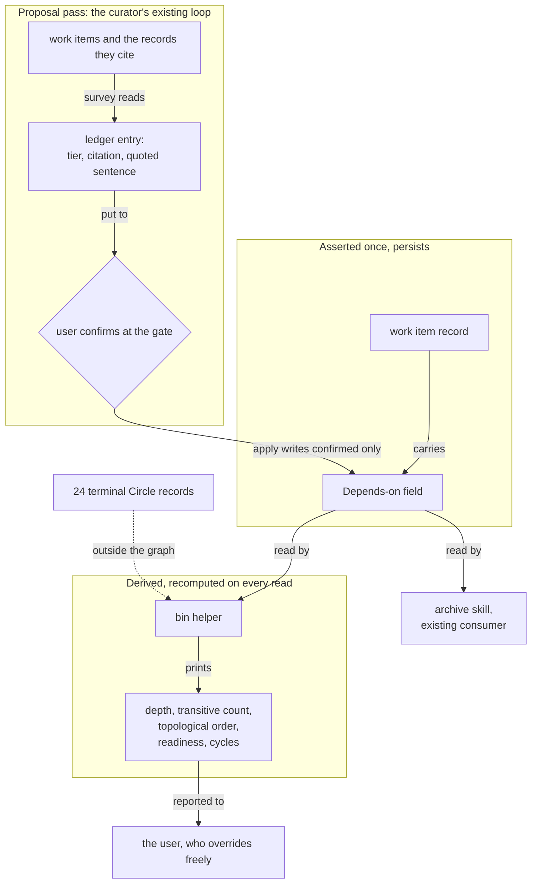

# Spec: prerequisites are confirmed once, and every ordering figure is computed from them

**Date:** 2026-09-11
**Status:** Draft
**Source:** Re-sharpen of the work item `260908-2018-prerequisites-confirmed-once-order-computed.md`,
shaped 2026-09-08 against a tree that no longer exists. The user still wants the mechanism. This
document replaces the item's own `## Grounding snapshot` as the ground the work is planned on, and
names each figure in that snapshot which is now false.

**Measurement anchor.** Every figure below was taken in this work tree at commit `1208ceb6` on
2026-09-11, by running the command named beside it or opening the file named beside it. Nothing is
carried over from the item's snapshot, whose anchor `de94102f` still does not resolve from HEAD
(`git merge-base --is-ancestor de94102f HEAD` exits 1). Where a re-measurement contradicts the
item's figure, the item's figure is printed next to the new one.

**Revision, 2026-09-11.** The user answered the four questions this spec returned, and the answers are
carried below as settled scope rather than as deferrals. The mechanism stays time-free
(`## Out of Scope`), the curator performs the proposal pass (`### C3`), a cut in the hook test suite
is a precondition of the helper's test (`## Preconditions`), and the one inherited edge is clarified
before any figure is computed (`### C1`). Two records were filed with this revision and are cited
where they bind. Every figure was re-measured at the same commit and none moved; figures taken for
the first time in this revision say so.

## Directive

fusion holds the prerequisite relation between its work items as a confirmed assertion in the
`**Depends-on:**` head field, and computes every ordering figure from it, storing none of them. A
helper under `bin/` reads the work-item store and reports depth, transitive blocking count,
topological order, readiness and cycles on demand, in the `KEY=value` shape its twenty-one siblings
use, reporting and gating nothing. The curator's existing survey, ledger and apply loop reads the
prose that already carries the relation, offers each candidate edge with an evidence tier and a
reason, and writes into a work item only what the user confirmed. What is asserted persists in one
field. What is derived is recomputed on every read.

## What changed under the original shaping

The item was shaped against four surfaces. Three are gone.

| Surface the 2026-09-08 design rested on | State at `1208ceb6` |
|---|---|
| The Circle record's `## Dependencies` section, the carrier for a confirmed edge | Removed. `rules/circle-records.md` is gone; `ls rules/` returns 15 files and none is it |
| `agents/playmaker.md`, the stated consumer of the computed order | Removed. `ls agents/` returns 11 prompts and none is it |
| `portfolio.md`, `.active-circle`, the six-marker Circle state vocabulary | Removed |
| `hooks/lib/citation-scan.ts` and `hooks/lib/citation-corpus.ts`, the two halves the design planned to reuse | Standing, and the second one improved: `citation-corpus.ts` gained `ITEM_RECORD_RE`, which matches a work-item record by structural equality between a container's name and the record inside it |

The carrier's replacement already landed. At `76d833be` the work item gained `**Depends-on:**`, a
comma-separated list of item basenames, and `rules/fusion-workbench-conventions.md`
`## Backlog entries — work items` carries the ruling this work is authorised by: the field carries
only edges the user has confirmed, a helper may read the whole store and report an order over them
with cycles named, and no agent asserts a ranking. So the assertion layer exists and the computation
layer does not.

## Grounding snapshot, re-measured

### What is now false in the item's own snapshot, and what replaces it

**1. The byte constraint has inverted, and the constraint that binds this work is a different one.**

The item states 698 bytes of head-room on `agents/*.md`, 902 on `skills/*/SKILL.md` and 1 695 lines
on the hook test suite, and its whole design is bent toward `bin/` by the first of those. Measured
at `1208ceb6` against the baseline maps and head-room constants in
`hooks/lib/__tests__/surface-growth-bound.test.ts`, summed against the per-file totals in
`hooks/lib/__tests__/fixtures/surface-growth.golden`:

| Surface | Item's figure | Now | Change |
|---|---|---|---|
| `agents/*.md` bytes | 698 | **61 153** | the v11 roster cut removed five prompts and merged two |
| `skills/*/SKILL.md` bytes | 902 | **457** | tighter |
| hook test lines | 1 695 | **1** | effectively spent |

The dispatch-path bound moved the same way. `hooks/lib/__tests__/fixtures/dispatch-path.baseline`
charges each agent's prompt plus its emitted rules plus `CLAUDE.md` at zero head-room. Re-measured
for this revision by the method that file documents, running `bin/fusion-rules <agent>` from the
repository root, the eleven paths hold between 591 and 97 821 bytes. The five that matter to this
work:

| Path | Row | Now | Room |
|---|---|---|---|
| `curator` | 227 066 | 217 199 | **9 867** |
| `reviewer` | 189 012 | 188 421 | **591** |
| `analyst` | 198 789 | 198 106 | 683 |
| `editor` | 202 739 | 201 733 | 1 006 |
| `planner` | 202 428 | 201 406 | 1 022 |

Two consequences, and both are prices this spec quotes rather than trades. A change to
`agents/curator.md` is paid twice, against 61 153 bytes on the agent surface and against 9 867 on the
curator path; the second figure is the one that binds. A change to
`rules/fusion-workbench-conventions.md` is always-on, so it is charged to all eleven paths at once and
priced against the smallest of them, 591 bytes at `reviewer`.

**Consequence for the design.** The reason the original design was forced into `bin/` is gone. It
should still go into `bin/`, because that is where a read-compute-print helper belongs and because
twenty-one siblings establish the shape, but the choice is now free rather than forced. What is not
free is the test. A new helper in this project conventionally ships with its own test file, and such
a file has no baseline entry, so it costs its whole size against the head-room. Six recent examples:
`plan-size.test.ts` 163 lines, `fusion-session-domain.test.ts` 140, `fusion-prose-metric.test.ts`
173, `fusion-claimed-item.test.ts` 192, `fusion-identity.test.ts` 217, `fusion-forum.test.ts` 220.
Against one line of head-room. The question the item filed as
`260908-2018_*_what-pays-for-the-playmaker-change-when-the-agent-surface-holds-698-bytes.md` is moot
in its subject and live in its substance: it has moved from the agent surface to the test surface.

**2. The node set is permanently small, and the survey of 23 record shapes describes a corpus this
mechanism can never read.**

`fusion-workbench/circles/` holds 26 containers. Two hold a work-item record in the current form.
Twenty-four hold a terminal Circle record (`_c_`, `_b_` or `_s_`) and will hold one forever:
`/fusion:migrate` converts a record only while it is live and never opens a terminal one, and
`hooks/lib/citation-corpus.ts` states the consequence in its own words, that both record forms stand
in one tree permanently by design, "24 marked records against 2 converted ones, and the ratio only
ever moves one way."

So the graph this mechanism computes over is the work-item store alone: two nodes today, growing
only forward. The item's acceptance test, "retrospective against the 23 existing records", cannot be
run. Its evidence about the relation's shape stays valid as evidence and is not re-derivable as a
test.

**3. The live graph is one edge, and that edge is not a prerequisite.**

| Item | Status | `**Depends-on:**` |
|---|---|---|
| `260908-2018-prerequisites-confirmed-once-order-computed` | claimed | absent |
| `260909-1700-cut-fusion-to-working-minimum` | done | `260908-2018-prerequisites-confirmed-once-order-computed.md` |

Read as an ordering edge, that says the finished work waited on work that has not started. It is not
an ordering edge. The cut's own `## Dependencies` prose, still in the body at line 84, calls the
relation "**Conflicting, and the conflict is substantive rather than an ordering nicety**", and
explicitly refuses to rank the two. The migration lifted the section's one resolvable name into the
machine-readable field, correctly under its own rule at `skills/migrate/SKILL.md` line 157, which
filters entries by whether they resolve and never by what relation they assert.

Three findings follow, and they are the sharpest evidence this re-sharpen produced.

- The five-relation-types defect the item measured across 23 prose sections is now inside the
  machine-readable field, at a rate of one in one.
- The field's stated rule, that it carries only edges the user has confirmed, is already untrue of
  the only value in it. No user confirmed this edge.
- A helper built today would report a violated prerequisite as its first and only finding, and the
  finding would be an artifact of the carrier rather than a fact about the work.

This warrants an issue in the item's own store. This spec names it and does not file it, the
dispatch having scoped this run to the spec and its questions.

**4. The ordering vocabulary is now at zero everywhere, not one.**

The item measured one occurrence of `topolog` across `agents/`, `rules/`, `skills/`, `bin/`,
`hooks/` and the three READMEs, at `agents/taskplanner.md:116`, and zero for `transitive`, `slack`,
`milestone` and `Gantt`. Re-measured: all five are zero, `taskplanner` having gone with the session
work queue. `readiness` returns two occurrences and neither is graph readiness (a consultant startup
line, a test comment about a port poll). fusion now holds no ordering over work at all, in prose or
in code.

Re-verified for this revision at `1208ceb6`, excluding `hooks/node_modules/`, where a bundled
`topologicalSort` in vite accounts for the only four hits in the tree. The consequence for C4 is that
the computed order has no incumbent to replace. Nothing in fusion recommends what to work on next, so
whoever reads the figures is making a statement the project has never made, and the question of who
makes it cannot be answered by pointing at an existing ranking.

**5. The consumer named in the item does not exist, and no surface replaced it.**

Nothing in `agents/` or `skills/` recommends which item to work on next. `agents/orchestrator.md`
`## Work items` lists six maintenance operations, each behind a per-operation confirmation, and
selects nothing. So the "next-work recommendation" the item names as a consumer is not a change to
an existing ranking. It is a new statement, and who makes it is open.

**6. One consumer of the field does exist, and it was not in the item's design.**

`skills/archive/SKILL.md` reads `**Depends-on:**` twice: filter 2 excludes from every archive tier
any item that a live item's field names, and the walk at line 146 collects those names from items
whose status is `open` or `claimed` only. So an archived prerequisite is already prevented by
construction for a live dependent, and is not prevented for a `done` one. That partly answers the
item's open decision
`260908-2018_*_is-a-closed-prerequisite-a-satisfied-edge-or-no-edge-and-what-is-an-archived-one.md`,
whose third option was argued down on the ground that 22 of 23 records were terminal. That argument
no longer holds, because terminal Circle records are outside the node set entirely and a `done` work
item is inside it.

**Whether the asymmetry is a second defect: not today, and the condition under which it becomes one
is checkable.** The clause protects a live item's prerequisite because a live item still needs its
ordering computed. A `done` item needs no future ordering, its record is history, and an entry of its
that resolves to nothing is already covered by the helper's dangling-edge rule, which reports the
entry by name, keeps the node and drops the edge (`### C2`). Under the answers carried in this
revision the asymmetry is therefore correct as written. It becomes a defect on one condition: if
`260908-2018_*_is-a-closed-prerequisite-a-satisfied-edge-or-no-edge-and-what-is-an-archived-one.md`
rules that a `done` item's edges stay inside the computed graph, then archiving such an item's
prerequisite turns a readable edge into a permanent reported dangle that nobody may repair, the
carrying record being terminal. The repair would be one added clause in that skill's filter 2, and it
is not specified here because the decision that triggers it is open.

### What in the item's snapshot still holds

- The two reusable halves stand. `createScanner(workbenchRoot)` in `hooks/lib/citation-scan.ts` is
  the one citation grammar five readers share, and `isLiveRecord()` in
  `hooks/lib/citation-corpus.ts` enumerates live records and knows the three frozen stores. A
  dependency reader is a further reader of the first, not a second parser.
- The `bin/` shape is unchanged: 21 helpers plus `monitor`, each reading, computing, printing
  `KEY=value` on stdout, reporting and never gating, guarded at every call site with `[ -x ]`.
- `agents/planner.md:121` still specifies `- Dependencies: <which earlier step(s) this depends on,
  or "none">`, an English clause with no step identifier scheme and no delimiter, and nothing
  consumes it. The plan step remains outside the graph.
- The source bound holds unchanged. The Excel workbook in `unite-co-creator` is evidence about the
  relation's shape, and its edge form is not a data model for fusion.

## Capabilities

### C1: the field means one thing, and the one value in it is clarified before any figure is computed

**Description:** `**Depends-on:**` carries an ordering prerequisite and nothing else. The relation
type is stated once, where the field is defined, so a reader and a program partition the store on
the same rule. The single inherited value is put to the user with the prose that contradicts it, and
is then confirmed as an edge or struck. That pass runs before the helper computes anything, so the
first computed figure reads a graph that is exact or empty rather than plausible.

**Acceptance criteria:**

- [ ] `rules/fusion-workbench-conventions.md` `## Backlog entries — work items` states, in one
      place, what relation an entry in `**Depends-on:**` asserts and what does not belong there. The
      statement is always-on text, charged to all eleven dispatch paths, so it fits inside the 591
      bytes the tightest path holds or is paid for by a removal of at least its own size on that same
      path.
- [ ] The user sees the entry on `260909-1700-cut-fusion-to-working-minimum.md` beside the sentence
      in that item's body which calls the relation a substantive conflict, and answers whether the
      entry is a prerequisite.
- [ ] The answer is carried out, and the form it takes for a `done` item is the one
      `260911-1747_*_may-a-done-work-items-head-field-be-edited-at-all-and-under-what-bound.md`
      settles. This work does not touch that item's head before that record is answered.
- [ ] After that pass, every entry in every item's field is one the user confirmed, and this is
      checkable by reading the items.
- [ ] `skills/migrate/SKILL.md` no longer writes an entry into the field on resolvability alone, or
      states in its own text that it converts an unconfirmed relation and names who confirms it
      afterwards.

**Decisions made:**

- The inherited edge is clarified first and then confirmed or struck, over leaving it in place and
  over striking it unread (user, 2026-09-11). The graph the mechanism first computes over is exact or
  empty, and which of the two it is depends on the user's answer rather than on this spec.
- The defect behind the value is filed as
  `260911-1747_*_the-migration-wrote-a-conflict-relation-into-depends-on-and-nobody-confirmed-it.md`,
  and the terminal-record question it raises as the decision record cited above. Neither is answered
  here.
- The relation-type question stays open as
  `260908-2018_*_does-the-new-field-name-only-the-ordering-edge-or-the-four-relation-types-beside-it.md`,
  whose evidence has changed: the corpus it surveyed is outside the node set, and the one live value
  is a counterexample rather than a survey finding.

### C2: a helper reports every ordering figure and stores none

**Description:** One program under `bin/` reads the work-item store and prints depth, transitive
blocking count, topological order, readiness and cycles. It writes nothing back. Running it twice on
an unchanged store prints the same thing twice.

**Acceptance criteria:**

- [ ] Running the helper at the project root prints `KEY=value` lines on stdout and changes no file
      in the workbench, verifiable with `git status` before and after.
- [ ] Every item in the store appears in the output exactly once, including items whose field is
      absent.
- [ ] An entry naming no existing item is reported by name, the item keeps its place in the output,
      and the edge is dropped, matching the ruling already on record.
- [ ] A cycle is named, with the items in it listed, and the program still exits successfully.
- [ ] No exit code carries the verdict, matching `bin/fusion-plan-size`, `bin/fusion-staging-drift`,
      `bin/fusion-review-coverage` and `bin/fusion-citation-check`.
- [ ] With no workbench above the working directory, the program says so and prints no figures.
- [ ] The program's own header documents its usage, its output and its exit codes, as its siblings
      do.

**Decisions made:** the output shape and the report-never-gate rule follow the established `bin/`
convention and need no new ruling.

### C3: the curator proposes edges, with evidence, and writes only what the user confirmed

**Description:** The curator performs this pass with the loop it already runs. Its survey reads the
workbench prose and proposes each candidate edge as a ledger entry carrying a tier and a citation;
the gate puts the ledger to the user; the apply pass writes the confirmed edges and nothing else. The
pass runs when the user invokes the command that dispatches the curator. A second run does not
re-ask about a settled edge, because the run file records what was proposed and what the user did
with it.

**What this costs, stated rather than assumed.** The curator's remit today is three normative
surfaces: decision records, the project's own rule files, and `CLAUDE.md`. A work item is a fourth
**subject**, not a fourth surface: the agent gains a write into one head field and no authority over
the rest of the record. Four sites in `agents/curator.md` change, and the evidence pass is not one of
them, because source 1 of the seven already reads work items and names "the Directive, the dependency
field, the status and the closure note":

| Site | What changes |
|---|---|
| `## Remit`, the three-surface list | names the fourth subject and bounds it to the one field |
| `## Scope`, the may-edit list | gains the `**Depends-on:**` field of a live work item, gated like every other change |
| `### Ledger entry schema`, the `**Surface:**` line | gains the work-item value |
| `### Boundary against agents/reconciler.md`, or a sibling of it | separates this write from the orchestrator's six maintenance operations |

The four comparable sections already in that prompt run 518 to 2 427 bytes. The change is expected in
that range, against 9 867 bytes on the curator dispatch path and 61 153 on the agent surface, so the
tighter of the two bounds holds it four times over at the top of the range.

**Acceptance criteria:**

- [ ] The survey's read corpus for an edge is stated in the prompt and is a subset of what the agent
      already reads: the work items themselves, and the records a work item cites. A reader can tell
      from the prompt what the pass looked at and what it did not.
- [ ] Each proposed edge is one ledger entry in the existing schema, naming the dependent item as the
      file, the item the entry would name, a tier saying whether the relation was quoted or inferred,
      and the sentence it was read from as the citation.
- [ ] A proposed edge is never in the constraint-removal group, and it is counted at the gate under a
      group of its own, so a user approving a normative change does not approve a graph edge with it.
- [ ] The apply pass writes the `**Depends-on:**` field of the dependent item and nothing else: no
      `**Status:**`, no `**Claim:**`, no body text, and no new item.
- [ ] Nothing is written into any item before the user answers, and rejecting everything leaves every
      item byte-identical.
- [ ] An edge the user declined carries that outcome in the run file and is not proposed again on the
      next run.
- [ ] A `done` or `dropped` item is never proposed as the dependent, which keeps the pass clear of the
      terminal-record question C1 defers.
- [ ] The prompt change is measured against both bounds after it is written, and the measurement is
      reported with the change.

**Decisions made:**

- The curator performs the pass (user, 2026-09-11), over `reconciler`, over the orchestrator, and
  over a by-hand reading with no agent at all. The survey, ledger-at-a-gate, apply sequence it
  already runs is the sequence this pass needs, and the gate granularity, the per-entry approval by
  id and the run file all come with it.
- Points 1 and 2 of `260909-1020_*_three-source-aspects-unnamed-and-the-proposal-pass-has-no-agent-or-surface.md`
  are answered by that choice: the pass has a performer, and it needs no new skill body, which is
  what the 457 bytes left on the skill surface would not have paid for. Its points 3, 4 and 5 are
  bounded by the curator's existing mechanics and are written into the criteria above. Its point 6,
  who fills the field when a new item is filed, stays open and is not answered here.

### C4: the computed order reaches a reader

**Description:** The figures the helper prints are read by somebody. What is open is whether that is
the user running one command, or a session that reads them and says what it found.

**Acceptance criteria:**

- [ ] A reader who has never seen this mechanism can obtain the current order in one command whose
      name and arguments are documented.
- [ ] Wherever the figures are quoted, the text says they are a report the user may override, and no
      text asserts a ranking.

### C5: the legacy corpus is named as outside the graph

**Description:** The 24 terminal Circle records and their prose `## Dependencies` sections are stated
to be outside the mechanism, with the reason, so a later reader cannot mistake the omission for an
oversight.

**Acceptance criteria:**

- [ ] One statement in the shipped text says the graph spans work items only, and why a terminal
      Circle record cannot enter it.
- [ ] No part of the mechanism reads a `_<marker>_circle.md` file.

## The shape

The graph has one storage node, and every figure hangs off it. That is the property the item exists
to produce, and the diagram is the check on it: no edge runs from a computed figure back into
storage.

## The acceptance test, restated

The item's stated test was retrospective: run the mechanism over the 23 existing records and compare.
It cannot be run, and the reason is permanent rather than a matter of timing. Twenty-four of the 26
containers hold a terminal Circle record, `/fusion:migrate` converts a record only while it is live,
and both record forms therefore stand in one tree for good. The corpus the test names sits outside the
node set by construction.

What replaces it is prospective, and it rests on the clarification pass in C1 leaving the live graph
exact or empty. Both of those are testable, and the four parts below are the whole of what "done"
means for the computation.

1. **The store's own graph is reported correctly.** The helper prints every item in the store exactly
   once, and every edge it reports is one a user confirmed. Where the inherited edge was struck, the
   helper reports no edge at all and says so as a count rather than by silence.
2. **The mechanism is proved on a fixture, not on the store.** A fixture store carrying a chain, a
   fan-out, a cycle and an entry naming no existing item exercises depth, transitive count,
   topological order, readiness, cycle naming and the dangling-edge rule. Two items cannot exercise
   any of them, and no growth of the real store is waited on.
3. **Two runs agree.** Over an unchanged store the helper prints the same bytes twice, and
   `git status` is unchanged across both runs.
4. **The proposal pass is proved on what it proposes, not on what it writes.** A survey over the
   current workbench yields a ledger whose every entry carries a tier and a quoted sentence, and a
   rejection at the gate leaves every item byte-identical.

The 23 records keep their evidentiary value. They are what established that one prose section carried
five relation types with nothing to tell them apart, and that finding is why C1 exists. Evidence and
test are two roles, and the item asked one corpus to fill both.

## Preconditions

**A cut in the hook test suite runs first, and it is separate work.** The helper's test is a new
file, and a file with no baseline entry costs its whole size against its surface's head-room. That
surface holds **one line** at `1208ceb6`. The six most recent helper tests in this repository run 140
to 220 lines, so the cut must free at least the size of the test this work writes, less that one
line: between 139 and 219 lines on the precedent range, with the exact figure known only once the
test is written.

Two things this spec deliberately does not do. It does not name which tests to cut. That judgement
belongs to the piece of work that performs the cut, which needs its own reading of what each test
holds and what the suite would stop catching. And it moves no baseline: the cut pays by lowering the
surface total, which is what creates the room, while the floor and the head-room constant stay where
they are. Whether any baseline moves afterwards is settled by
`hooks/lib/__tests__/helpers/growth-bound.ts` `## Re-baselining` and by nothing written here.

**Ordering.** C1 and C2 have no dependency on the cut, because neither writes a test file. The cut
gates the helper's test and therefore the point at which C2 can be called done.

## Stops when

- If the proposal pass, run over the whole workbench, yields fewer than three candidate edges the
  user confirms, the work stops after C2 and the proposal pass is not built. A confirm loop that
  produces one or two edges costs more to invoke than to perform by hand, and the store has two items
  in it today. Under the curator answer the count is obtainable before any prompt byte moves: one
  survey dispatch, told in its own dispatch prompt to read work items for prerequisite relations,
  yields the candidates and writes nothing.
- If the cut named in `## Preconditions` does not happen, or frees fewer lines than the helper's test
  costs, the work stops before the helper is written and the item says so. Shipping an untested
  helper is an outcome the user may choose and not one this work takes by default.
- If the user's answer in C1 leaves the terminal item's field as it stands, and
  `260908-2018_*_is-a-closed-prerequisite-a-satisfied-edge-or-no-edge-and-what-is-an-archived-one.md`
  then puts a `done` item's edges inside the computed graph, the helper would report an unasserted
  prerequisite on every run. The work stops at that point and the two answers are put back to the
  user together, because no amount of implementation makes that report true.

## Constraints

- The Excel workbook in `unite-co-creator` is a source of measurements and never a model to
  transplant. Its edge form, 27 nodes and 39 edges over tiers `Zitat` and `Ableitung`, is evidence
  about how dense and how inferential the relation is. It is not a schema.
- No agent asserts a ranking, and the computed order is a report the user overrides at will. Binding
  decision
  `260909-1808_*_may-a-helper-compute-an-order-over-work-items-after-the-portfolio-layer-goes.md`,
  option 3.
- No agent originates a work item. Filing stays the user's act.
- A terminal record is not edited back into a live shape, and a terminal Circle record is not opened
  at all.
- The four growth budgets are independent, and shrinking one buys nothing in another. The way out of
  a red bound is a cut, never an edit to a baseline outside the three events
  `hooks/lib/__tests__/helpers/growth-bound.ts` names.
- Every `bin/` call site guards with `[ -x ]`, because the installed copy runs one release behind the
  work tree.
- The helper reports and never gates. No exit code carries its verdict.
- The curator's eight exclusions stay intact. The fourth subject adds one gated write target and
  removes nothing: the agent still commits nothing, still writes no code, plan or defect record, and
  still advances no decision marker on ground-truth verification.
- The orchestrator keeps the six maintenance operations over a work item, each at the user's word and
  each separately confirmed. The curator's write touches one field none of the six touches.

## Out of Scope

- **Time, in every form. This is a settled bound, not a deferral.** No effort figure, no capacity
  figure, no lead time, no slack, no latest-start date. The order says what may start; it never says
  when anything finishes. Ruled by the user on 2026-09-11, over extending the mechanism to effort and
  capacity and over shipping order now with time to follow. A later reader should not reopen this
  from the spec: the relation the field carries is "may start after", and every time figure needs a
  second relation the field does not hold and this work does not add.
- The source workbook's Zeitbox and Übersicht sheets stay outside the mechanism, and so does its
  Vorlaufzeiten sheet, the one place that source computes a derived time figure. The third of those is
  the aspect `260909-1020_*_three-source-aspects-unnamed-and-the-proposal-pass-has-no-agent-or-surface.md`
  named as absent without being excluded, and the bound above excludes it explicitly.
- If fusion ever wants time over work, it is separate work with its own shaping, starting from what a
  fusion work item would measure a duration against; nothing about it is specified here.
- Measured status by executable probe. The progress source stays the `**Status:**` head field. The
  consultation that prompted this work proposed storing a probe and an expectation instead; that is
  a different mechanism and is not folded in here.
- The plan step's dependency field at `agents/planner.md:121`. It stays unparseable and read by
  nothing, and this work does not change it.
- The 24 terminal Circle records and their prose dependency sections.
- Any ordering over anything that is not a work item.

## Open for Planner

- Where the graph logic lives: a compiled module under `hooks/lib/` with a thin `bin/` wrapper, the
  shape `bin/fusion-plan-size`, `bin/fusion-events`, `bin/fusion-staging-drift`,
  `bin/fusion-review-coverage` and `bin/fusion-citation-check` all take, or a self-contained script
  in the shape of `bin/fusion-prose-metric`. The trade is a test file against the head-room, and the
  user's answer to the third pending decision below constrains it.
- How much of `hooks/lib/citation-scan.ts` the edge reader reuses, and whether resolving a
  `**Depends-on:**` entry goes through `createScanner` or through the one-line workbench-wide `find`
  the conventions specify for a markerless artifact.
- The exact `KEY=value` keys, the per-item row format, and how a cycle is rendered.
- Cycle detection algorithm, tie-break within a topological level, and what order equal items print
  in.
- Whether the proposal pass reuses `hooks/lib/domain-cascade.ts` as the precedent for executing a
  rule authored in Markdown rather than holding a second copy of it.
- Implementation order and which step measures the surfaces.
- The wording and placement of the four `agents/curator.md` sites in the table under `### C3`, and
  whether the fourth subject reads better as one new section or as additions to the four existing
  ones. The byte measurement afterwards is a step of the plan, not a judgement left to the writer.
- The shape of the fixture store the acceptance test's second part needs, and whether it is written
  as files on disk or built in the test.

## User Decisions Pending

The four questions this spec returned on 2026-09-11 are answered and carried above: the time-free
bound in `## Out of Scope`, the curator in `### C3`, the cut in `## Preconditions`, and the inherited
edge with its replacement acceptance test in `### C1` and `## The acceptance test, restated`. What is
listed here is inherited or newly filed, and every entry is genuinely open.

- [ ] `260908-2018_*_does-the-new-field-name-only-the-ordering-edge-or-the-four-relation-types-beside-it.md`
      stays open and its evidence has moved, from a survey of a corpus now outside the graph to a
      single live counterexample inside it. C1's first criterion cannot be written until it is
      answered.
- [ ] `260908-2018_*_does-the-record-template-mandate-the-prerequisite-field-or-merely-permit-it.md`
      stays open and is now decided against a different template. The work-item grammar already
      answers half of it, stating that the field is absent when there is nothing to say and never
      present and empty, which forecloses the third option's `(none)` literal.
- [ ] `260908-2018_*_is-a-closed-prerequisite-a-satisfied-edge-or-no-edge-and-what-is-an-archived-one.md`
      stays open, and the curator answer makes it blocking rather than background. It decides whether
      a `done` item's edges are inside the computed graph, which is what the second stopping condition
      turns on and what decides whether the archive skill's asymmetry is a defect.
- [ ] `260911-1747_*_may-a-done-work-items-head-field-be-edited-at-all-and-under-what-bound.md`, filed
      with this revision. It asks whether a terminal item's `**Depends-on:**` may be corrected at all,
      given that a terminal record is read as evidence and never reconciled in place. C1 does not
      touch that item's head before it is answered, and its four options are weighed against the
      record above rather than alone.

**Two records need a transition rather than an answer, and this spec moves no marker.**

- `260908-2018_*_what-pays-for-the-playmaker-change-when-the-agent-surface-holds-698-bytes.md` is moot
  in its subject and answered in its substance. `agents/playmaker.md` does not exist, the agent
  surface holds 61 153 bytes rather than 698, and what the question became, what pays on the test
  surface, the user answered on 2026-09-11 by choosing the cut. Nothing about it is still open to
  decide.
- `260909-1808_*_the-ground-this-circle-was-measured-on-is-being-cut-away-and-its-design-must-move.md`
  is answered in fact rather than on the record. Its recommendation was option 2 for the dependency
  field and option 1 for the rest. The field landed inside the cut at `76d833be`, which is option 2
  performed, and this spec is option 1 performed. Its four "what must change" points are each
  addressed above.

**One issue in this item's store is partly overtaken.**
`260909-1020_*_three-source-aspects-unnamed-and-the-proposal-pass-has-no-agent-or-surface.md` filed
six unspecified things about the proposal loop plus three unnamed source aspects. The curator answer
closes its points 1 and 2 outright and bounds points 3, 4 and 5; the time bound names the lead-time
aspect it reported as absent without exclusion. Its point 6, who fills the field when a new item is
filed, and its measured-status and node-granularity aspects are untouched by this revision. Closing
or narrowing it is the user's act, and this spec does not move its marker.
