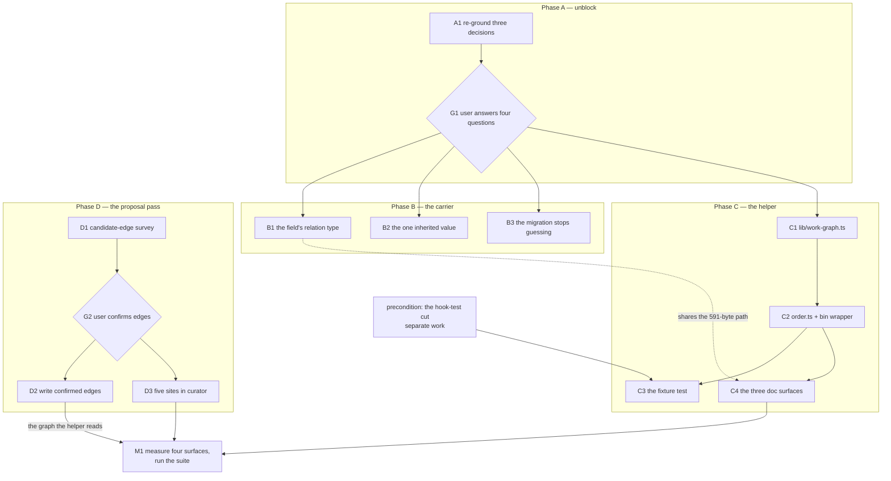

# Implementation Plan: prerequisites are confirmed once, and every ordering figure is computed from them

**Date:** 2026-09-11
**Status:** Draft
**Spec:** `260911-1528_*_spec-prerequisites-confirmed-once-order-computed.md`
**Decidability:** The load-bearing question is *what order does the work-item store impose on itself*, and the mechanism's only input is the `**Depends-on:**` head field. As the field stands the question is **not** decidable from it: the field is a bare comma-separated list of basenames with no relation verb, so nothing in a value distinguishes a prerequisite from any other relation a writer had in mind, and the live corpus is the proof rather than the worry, because one value exists in the whole store and it is a conflict relation (`260911-1747_*_the-migration-wrote-a-conflict-relation-into-depends-on-and-nobody-confirmed-it.md`). The plan does not approximate around that. It changes the mechanism, in step B1: the relation type is fixed by rule at the field's definition and every value is confirmed by a person once, so the field's assertion is decidable **by construction** rather than inferred from a value's text. Downstream of that change every figure this work computes is a pure function of the node set and the edge set, decidable by graph computation with no inference left in it. One residual question is decidable but **unanswered**: whether a prerequisite is satisfied reads `**Status:**`, and which statuses count is open at `260908-2018_*_is-a-closed-prerequisite-a-satisfied-edge-or-no-edge-and-what-is-an-archived-one.md`. That is a policy gap, not an undecidability, and steps C1 to C4 are blocked on it rather than written around it.

## Directive

The spec states it and this plan does not restate it. What the plan adds is the split the spec's `## Open for Planner` left: where the graph logic lives, how much of the existing citation machinery it reuses, the output shape, the cycle algorithm, the implementation order, and which step measures which surface.

## Current State

Measured in this work tree at `a78d017f`, 2026-09-11, by the command named beside each figure. The spec's anchor was `1208ceb6`; every figure below was re-taken rather than carried over, and **none moved**.

**The surfaces.**

| Surface | Room at `a78d017f` | How taken |
|---|---|---|
| `agents/*.md` bytes | 61 153 | baseline map + head-room constant in `hooks/lib/__tests__/surface-growth-bound.test.ts`, against the per-file sizes on disk |
| `skills/*/SKILL.md` bytes | 457 | same |
| hook test lines | 1 | same, over `hooks/lib/__tests__/**.ts` recursively |
| `curator` dispatch path | 9 867 | `bin/fusion-rules curator` from the repository root, prompt + emitted rules + `CLAUDE.md`, against `hooks/lib/__tests__/fixtures/dispatch-path.baseline` |
| `reviewer` dispatch path | 591 | same; the tightest of the eleven |

**A constraint the spec did not surface, and it is the tightest one in this work.** A new `bin/` helper is not free on the always-on floor. `hooks/lib/__tests__/derivable-enumerations-lint.test.ts` section 7 is a closed enumeration in both directions: a helper under `bin/` with no `| \`bin/<name>\` |` row in `CLAUDE.md`'s Layout table fails the suite, and a row naming no file fails it too. `CLAUDE.md` is a component of all eleven dispatch paths at zero head-room, so that mandatory row lands in the **same 591 bytes** as C1's rule sentence. The existing rows measure 288, 977, 1 418, 1 490, 1 832 and 1 970 bytes (`fusion-claimed-item`, `fusion-count-sources`, `fusion-plan-size`, `fusion-session-domain`, `fusion-prose-metric`, `fusion-citation-check`), so only the shortest precedent shape leaves room for anything else. This is priced in step B1 and carried as a stopping clause.

**What already exists and is reused rather than rebuilt.**

- `ITEM_RECORD_RE` in `hooks/lib/citation-corpus.ts`, which is `/^circles\/([^/]+)\/\1\.md$/`, a work-item record recognised by structural equality between a container's name and the record inside it. It is the project's one definition of what a work-item record is, and its own header says it was armed at zero files for the conversion that followed. This work is its second reader.
- `findWorkbenchRoot()` in `hooks/lib/workbench-root.ts`, `exitZeroOnStdoutEpipe()` in `hooks/lib/fail-open.ts`: what every sibling entry point already calls.
- The `bin/` shape: thin bash wrapper resolving `hooks/dist/<name>.js` relative to itself, usage and exit codes in the script's own header, `KEY=value` on stdout, report and never gate. Twenty-one helpers plus `monitor` establish it; `bin/fusion-plan-size` is the closest sibling in both purpose and exit table.

**What is deliberately not reused, with the reason.** `createScanner()` in `hooks/lib/citation-scan.ts` resolves a cited basename against a **whole-workbench** file index. That is the right grammar for a prose reference, which may name any record anywhere, and the wrong one for a dependency edge, which must resolve to a *work item* and to nothing else. Routing edges through it would let an entry resolve to a decision record, an archived copy or an analysis whose basename happens to match, and the scanner would report that as a clean resolution. The node set is the resolution domain here, so the edge reader looks an entry up in the node map it just built. The reuse is `ITEM_RECORD_RE`, which is the piece that carries the definition; the scanner is not the piece this needs. (Spec `## Open for Planner`, bullet 2.)

**The graph as it stands.** 26 containers under `circles/`, 2 holding a work-item record, 1 `**Depends-on:**` value in the store, and that value is the conflict relation named above. 24 containers hold a terminal Circle record and always will. Nothing in `agents/`, `skills/`, `bin/`, `hooks/` or the three READMEs carries `topolog`, `transitive`, `slack`, `milestone` or `Gantt`; fusion holds no ordering over work today.

**Three of the four open decisions are grounded on surfaces that no longer exist.** `260908-2018_*_does-the-new-field-name-only-the-ordering-edge-or-the-four-relation-types-beside-it.md` argues over a `## Dependencies` prose section in `rules/circle-records.md`; that rule file is gone and that section is outside the node set, so its option 2, two verbs in the section, is not writable against a field that has no verb slot. `260908-2018_*_is-a-closed-prerequisite-a-satisfied-edge-or-no-edge-and-what-is-an-archived-one.md` cites `agents/playmaker.md:130` and `:138` and reasons over the six-marker Circle vocabulary; the prompt is gone and the vocabulary is `open | claimed | done | dropped`. `260908-2018_*_does-the-record-template-mandate-the-prerequisite-field-or-merely-permit-it.md` decides against the Circle record template, and the work-item grammar has already foreclosed its third option's `(none)` literal. Putting any of the three to the user as written would be asking him to choose between options that do not apply. One re-grounding pass serves all three, and it is step A1.

## Approach

One storage node and every figure hanging off it, which is the property the work exists to produce. Four moves, in this order.

**Unblock before building.** One analyst pass re-grounds the three stale decisions and one gate answers all four open questions together, because two of them are coupled and the spec says answering them in the wrong order produces an answer that reads as settled and is not. Nothing in phases B, C or D starts before that gate.

**Fix the carrier before computing over it.** The field's relation type is stated once where the field is defined, the one inherited value is put to the user beside the sentence that contradicts it, and the migration stops converting an unconfirmed relation silently. Only then does anything compute.

**One program, one shape, one algorithm.** `hooks/lib/work-graph.ts` holds the computation as a pure function of a workbench root; `hooks/order.ts` prints it; `bin/fusion-work-order` is the wrapper. Tarjan's strongly-connected components over the whole edge set, then Kahn over the condensation. One traversal family answers cycles, topological order, depth and transitive blocking count, so there is no second algorithm and no special case for "a cycle exists": a cycle is a component of size greater than one, its members print together at the component's position, and the program still exits 0. The alternative shape the spec offered, a self-contained bash script like `bin/fusion-prose-metric`, buys nothing: the bounded surface is the **test**, and `fusion-prose-metric.test.ts` is 173 lines like every other, so the language choice is free and the compiled form wins on the two reuses above.

**The proposal pass is proved before it is built.** The count that decides whether the curator ever changes is obtainable with one analyst dispatch and zero prompt bytes, so it is taken first and the prompt work is gated on it.

## The shape



Coherence self-check, run before this was finalised. Thirteen nodes, fifteen edges, no node with fan-out above four, and the one node with four out-edges is the gate, which is what a gate is. No cycle. The direction is clean top-down with one dotted edge running sideways, and that edge is drawn dotted because it is a shared budget rather than a sequencing dependency: B1 and C4 do not order each other, they compete for the same 591 bytes, and drawing it as a solid arrow would assert an ordering the prose does not. `cut` is an orphan by intent, entering from outside because the plan does not plan it. Every edge here is a dependency the step list declares, and every dependency the step list declares is here.

## Implementation Steps

**G1 and G2 are gates, not steps, and carry no Executor.** Putting a question to the user is nobody's dispatch: `coder`, `ontocoder` and `analyst` each run non-interactively and none of them holds `AskUserQuestion`. The orchestrator proxies both. They are numbered so the blocked steps can name them.

1. [DONE] **A1: re-ground the three inherited decisions against the tree at HEAD**
   - Executor: `analyst`
   - Files: writes `$OUT_ANALYSIS/YYMMDD-HHMM-re-grounding-three-open-decisions.md`; reads the three records in this item's decision store, `rules/fusion-workbench-conventions.md` `## Backlog entries — work items`, `skills/archive/SKILL.md` filter 2, the two work-item records, and the git history of the removed surfaces each record argues over
   - Changes: for each of the three records, state which of its options are still writable against the current tree and which are not, and why; restate the live question in the current vocabulary. For the relation-type record, the specific finding to test is that the field has no verb slot, so its option 2 as written has no carrier. For the closed-prerequisite record, restate the three target states against `open | claimed | done | dropped` plus the archive, and carry forward the finding already in the spec that `skills/archive/SKILL.md` protects a live dependent's prerequisite and not a `done` one. For the template record, state what the work-item grammar has already foreclosed. **Edit none of the three records and move no marker**: the report is the input the gate reads, and the answer is what transitions them.
   - Dependencies: none

2. [DONE] **D1: the candidate-edge survey, which decides whether the proposal pass is built at all**
   - Executor: `analyst`
   - Files: writes `$OUT_ANALYSIS/YYMMDD-HHMM-candidate-prerequisite-edges.md`; reads the work items under `$SCAN_BACKLOG` and the records each one cites
   - Changes: propose each candidate prerequisite edge between two work items as one row carrying the dependent item, the item the entry would name, an evidence tier saying whether the relation was quoted or inferred, and the sentence it was read from. Write into no work item and propose no edge whose dependent is `done` or `dropped`. Report the count as the headline, because that count is what the first stopping condition turns on. **This is deliberately not a curator dispatch**: the curator's remit does not yet cover a work item as a subject, and dispatching it against a subject its own prompt excludes would be asking an agent to act outside its stated scope. The spec's point stands either way, which is that the count is obtainable before any prompt byte moves.
   - Dependencies: none

   **G1: the user answers four coupled questions.** The four are put together and in this order, because the spec's own recommendation says answering the last two in the wrong order produces an answer that reads as settled and is not: (a) what relation `**Depends-on:**` asserts, from A1's restated options; (b) whether the record template mandates the field or permits it; (c) whether a `done` item's edges are inside the computed graph; (d) whether a terminal item's head field may be corrected, and in what form, seeing the entry on `260909-1700-cut-fusion-to-working-minimum.md` beside the sentence in that item's body which calls the relation a substantive conflict. If (c) puts a `done` item's edges inside the graph and (d) leaves the field as it stands, the work stops here and both go back together.

3. **B1: the field's relation type, stated once where the field is defined**
   - Executor: `coder`
   - Files: `rules/fusion-workbench-conventions.md` `## Backlog entries — work items`; `CLAUDE.md` Layout table (the `bin/fusion-work-order` row, written here rather than in C4 because it competes for the same bytes)
   - Changes: state what an entry in `**Depends-on:**` asserts and what does not belong there, in the form G1 chose. **Measure first, write second.** Take the `reviewer` path total before the edit (`bin/fusion-rules reviewer` from the repository root, prompt plus every emitted path plus `CLAUDE.md`), subtract from the `reviewer` row in `hooks/lib/__tests__/fixtures/dispatch-path.baseline`, and spend what that leaves across this sentence and the Layout row together. The Layout row follows the `bin/fusion-claimed-item` shape, 288 bytes, whose whole body is "its own header is the authoritative documentation" plus the two facts a reader needs from the table; the long rows in that table are not a precedent this step may take. If the two together do not fit and no removal of at least their size is found on that same path, stop and report: see `## Where this work stops`. Report both totals with the change.
   - Dependencies: G1 (a), G1 (b)

4. **B2: carry out the user's answer on the one inherited value**
   - Executor: `ontocoder`
   - Files: the record of the work item `260909-1700-cut-fusion-to-working-minimum.md`, inside its own container under the backlog store, head field only, **and only if G1 (d) permits it**
   - Changes: whatever form G1 (d) settled. Under its option 1 or 4 this step writes no head field at all and the item is left as it stands; under option 2 or 3 the entry is struck or corrected and the reason is recorded where that option requires. Touch `**Status:**`, `**Claim:**` and the body not at all. After this step every entry in every item's field is one the user confirmed, and that is checkable by reading the two items.
   - Dependencies: G1 (d), G1 (a)

5. **B3: the migration stops converting an unconfirmed relation silently**
   - Executor: `coder`
   - Files: `skills/migrate/SKILL.md`, the `**Depends-on:**` bullet at the record-conversion step
   - Changes: either stop writing an entry on resolvability alone, or say in the body's own text that the conversion carries a relation nobody confirmed and name who confirms it afterwards. Which of the two is G1 (a)'s consequence. Charged to the **skills** surface, 457 bytes at `a78d017f`, which is a different budget from B1's and buys nothing from it; measure it before and after and report both.
   - Dependencies: G1 (a)

6. **C1: `hooks/lib/work-graph.ts`, the computation**
   - Executor: `coder`
   - Files: new `hooks/lib/work-graph.ts`
   - Changes: one exported pure function of a workbench root returning the report, plus the types. Node set: every `circles/<dir>/<dir>.md`, matched with `ITEM_RECORD_RE` imported from `hooks/lib/citation-corpus.ts`, never re-spelled here. Per node, parse `**Status:**` and `**Depends-on:**` out of the head; an entry is a basename `<dirname>.md` and resolves by lookup in the node map, so an entry naming no node is reported by name, the node keeps its place and the edge is dropped. Edge direction: `A **Depends-on:** B` is the edge A to B, "A may start after B". Cycles by Tarjan's strongly-connected components over the whole edge set, a component of size above one being a cycle and a self-edge a cycle of one; topological order by Kahn over the condensation, prerequisites first, ties broken on the item basename ascending, which is chronological then lexical and therefore stable across runs. `depth` is the longest path to a node with no prerequisites, 0 where there are none, and is taken on the condensation so a cycle does not make it unbounded. `blocks` is the size of the reverse-reachable set excluding self. `readiness` reads `**Status:**` by the rule G1 (c) settled. **The module header is where C5 lands**: it states that the graph spans work items only and why a terminal Circle record cannot enter it, in the shape the sibling library headers use. Whether a terminal item is a node at all is G1 (c)'s answer and it changes depth, blocks and the order as well as readiness, which is why this whole step is blocked on it and not only its last figure. Store nothing: no cache, no index file, no write of any kind.
   - Dependencies: G1 (c)

7. **C2: `hooks/order.ts` and `bin/fusion-work-order`**
   - Executor: `coder`
   - Files: new `hooks/order.ts`, new `bin/fusion-work-order`
   - Changes: the entry point prints the `KEY=value` block, then one row per item in topological order, then the cycle and unresolved rows. The block: `anchor=workbench-root`, `items=`, `edges=`, `unresolved-edges=`, `cycles=`, `ready=`, `roots=`, `verdict=` taking `acyclic`, `cyclic` or `empty`. Each item row carries its order index, depth, blocks, readiness and basename, at fixed column widths like `bin/fusion-plan-size`'s rows. A cycle is one `cycle=` row naming its members in basename order; an entry naming no node is one `unresolved=` row naming the dependent and the entry as written. **No exit code carries the verdict**: 0 the check ran, 1 usage, 2 no workbench above the working directory, 3 the compiled hooks are missing, which is the sibling table exactly and is deliberate, since "there are no items" is an answer about the project and a broken install must never be reported as one. `verdict=empty` reaches 0 like the other two. The wrapper resolves `hooks/dist/order.js` relative to itself so an install copy and a work tree each run their own build, and its own header carries the usage block, the output shape and the exit table. Run `npm run build` and commit `hooks/dist/`, or `committed-dist.test.ts` goes red.
   - Dependencies: C1

8. **C3: the fixture test**
   - Executor: `coder`
   - Files: new `hooks/lib/__tests__/work-graph.test.ts`
   - Changes: build a fixture store on disk under a scratch root carrying a chain, a fan-out, a cycle and an entry naming no existing item, and exercise depth, transitive count, topological order, readiness, cycle naming and the dangling-edge rule against it. Files on disk rather than an in-memory graph, because the parse of the head field is half of what can be wrong and an in-memory fixture skips it. Add the two assertions the spec's C2 and C5 ask for and the real store cannot make: that running twice over an unchanged fixture produces identical bytes, and that no path the module opens matches `_<marker>_circle.md`. **Blocked on the precondition cut, which this plan names and does not plan.** The hook-test surface holds 1 line at `a78d017f`; the six most recent helper tests run 140 to 220 lines, so the cut must free between 139 and 219 lines, the exact figure known only once this file is written. Identifying which tests to cut belongs to that other work, and no baseline moves here.
   - Dependencies: C2, and the precondition cut

9. **C4: the three documentation surfaces**
   - Executor: `coder`
   - Files: `README-hooks.md` (the entry-point table and the `hooks/lib` table), `docs/working-model.md`
   - Changes: one `README-hooks.md` row for `order.ts` and one for `lib/work-graph.ts`, both mandatory, the second gated by `derivable-enumerations-lint.test.ts` section 5 in both directions. In `docs/working-model.md`, beside the `**Depends-on:**` paragraph that already tells a reader the relation carries edges he confirmed, name the command and its arguments, and say the figures are a report he overrides at will. That is C4's whole surface, and it is chosen because none of these three files is on any dispatch path or in any bounded surface, so C4 competes with nothing. `/fusion:help` is deliberately not touched: the skills surface holds 457 bytes and C4's criterion is one documented command, which these three files satisfy. The `CLAUDE.md` Layout row is **not** here; it is in B1, with the bytes it competes for.
   - Dependencies: C2

   **G2: the user confirms edges from D1's candidate list.** Per edge, by the item pair and the quoted sentence. The count he confirms decides whether step D3 happens at all: fewer than three and the work stops after the helper, per `## Where this work stops`.

10. **D2: write the confirmed edges**
    - Executor: `ontocoder`
    - Files: the `**Depends-on:**` head field of each dependent work item G2 confirmed, and nothing else
    - Changes: write the confirmed entries, comma-separated, in the basename form the grammar states, absent rather than present and empty where nothing was confirmed for an item. No `**Status:**`, no `**Claim:**`, no body text, no new item. This is the pass that makes the acceptance test's first part runnable: after it, the helper's report is over a graph every edge of which a person confirmed.
    - Dependencies: G2

11. **D3: five sites in `agents/curator.md`**
    - Executor: `coder`
    - Files: `agents/curator.md`
    - Changes: the four sites the spec's `### C3` table names, plus a fifth the spec's table does not carry and its sixth criterion requires. `## Remit` names the fourth subject and bounds it to the one field. `## Scope`'s may-edit list gains the `**Depends-on:**` field of a **live** work item, gated like every other change, with `done` and `dropped` excluded as dependents so the pass stays clear of the terminal-record question. `### Ledger entry schema`'s `**Surface:**` line gains the work-item value, and a proposed edge is counted at the gate under a group of its own and is never in the constraint-removal group. `### Boundary against agents/reconciler.md`, or a sibling of it, separates this write from the orchestrator's six maintenance operations. **The fifth site is `### Pass 1 — survey`**: nothing there reads a prior run file, and the anchor bounds the pass by commit and date rather than by what has already been asked, so a `**Scope:** full` run re-proposes every declined edge. How the suppression is expressed is open at `260911-1833_*_how-does-the-curators-survey-know-not-to-re-propose-an-edge-the-user-declined.md`, filed with this plan, because the outcome vocabulary at `## The run file` has four values and none of them distinguishes an edge the user refused from one he never saw. The fourth subject reads better as additions to the four existing sections plus that one instruction than as a new section, because every one of the five is a qualification of a rule already stated there and a new section would state each rule twice. **Measure after writing**, against both bounds: the `curator` dispatch path (9 867 bytes of room) and the `agents/*.md` surface (61 153), and report both figures with the change. For scale, the sections being edited measure 551, 686, 1 338 and 1 584 bytes at `a78d017f`, and `### Pass 1 — survey` 806, so an addition in that range is held by the tighter bound several times over.
    - Dependencies: G2 (three or more confirmed edges), and `260911-1833_*_how-does-the-curators-survey-know-not-to-re-propose-an-edge-the-user-declined.md`

12. **M1: measure the four surfaces and run the suite**
    - Executor: `coder`
    - Files: none; this step writes no file and reports
    - Changes: run `npm test` in `hooks/` and report it green. Then take, and report as figures rather than as a claim that nothing broke: the three surface totals against their budgets, and all eleven dispatch-path totals against their baseline rows, by the method `hooks/lib/__tests__/fixtures/dispatch-path.baseline` documents. Run `bin/fusion-work-order` at the project root, take `git status` before and after, and report both. Run it twice and compare the bytes. This is the step that answers the spec's `### C3` criterion that the prompt change is measured and the measurement reported with it, and the acceptance test's parts 1 and 3.
    - Dependencies: C4, D3 where D3 ran, D2 where D2 ran

## Where this work stops

- The work stops after step C4 and D3 is not built, if G2 yields **fewer than three** candidate edges the user confirms. A confirm loop that produces one or two edges costs more to invoke than to perform by hand.
- The work stops before step C3 lands, and C2 is not called done, if the precondition cut in the hook test suite does not happen or frees fewer lines than the test costs. Shipping an untested helper is an outcome the user may choose and not one this work takes by default. **Two readings of the spec are carried here rather than resolved:** its `## Stops when` says the work stops "before the helper is written", and its `## Preconditions` says C1 and C2 have no dependency on the cut and that the cut gates the test alone. This plan follows the second, which is the more specific statement, and the discrepancy is in `## Open Questions` for the user to settle if he means the first.
- The work stops at G1, and questions (c) and (d) go back to the user together, if his answer to (d) leaves the terminal item's field as it stands **and** his answer to (c) puts a `done` item's edges inside the computed graph. The helper would then report an unasserted prerequisite on every run, and no amount of implementation makes that report true.
- The work stops before steps B1 and C4 write anything, if the field's relation sentence and the `bin/fusion-work-order` Layout row together exceed the room on the `reviewer` dispatch path and no removal of at least their combined size is found on that same path. What gives is the user's call, not the executor's: the candidates are a shorter rule sentence, a shorter Layout row, a cut elsewhere in `CLAUDE.md` or in an always-on rule, and none of them is a baseline edit.
- **A precondition of calling this work finished**, and it is a precondition of nothing else: every one of the four questions at G1 is answered and its record transitioned by whoever owns that transition. An unanswered record whose answer this work assumed is the failure mode `260908-2018_*_is-a-closed-prerequisite-a-satisfied-edge-or-no-edge-and-what-is-an-archived-one.md` warns about in its own recommendation.

## Data Structures

In `hooks/lib/work-graph.ts`. Nothing here is written to disk; the whole structure is built per run and discarded.

```
WorkItemNode   { dir, base, status, dependsOn: string[], rel }
ResolvedEdge   { from: dir, to: dir }
UnresolvedEdge { from: dir, entry: string }
CycleGroup     { members: dir[] }          // one SCC of size > 1, or a self-edge
ItemFigures    { order, depth, blocks, readiness }
WorkGraphReport {
  items: number, edges: number, unresolvedEdges: UnresolvedEdge[],
  cycles: CycleGroup[], rows: (WorkItemNode & ItemFigures)[],
  verdict: "acyclic" | "cyclic" | "empty"
}
```

`readiness` takes `ready`, `blocked` or `terminal`, and which statuses map to which is G1 (c)'s answer rather than a value chosen here.

## API Changes

No existing signature changes and no existing module gains an export. One import is added, `ITEM_RECORD_RE` from `hooks/lib/citation-corpus.ts` into `hooks/lib/work-graph.ts`, and it is an existing export with one existing reader. One new command-line surface, `bin/fusion-work-order`, taking no arguments in its first form. Every call site guards with `[ -x ]`, per `260810-0921_*_how-should-a-prompt-call-a-bin-helper-that-the-installed-copy-may-not-have.md`, and this work adds no call site in a prompt or a skill body: the helper is run by a person, like `bin/fusion-plan-size`.

## Testing Strategy

The spec's restated acceptance test has four parts and the plan places each.

1. **The store's own graph is reported correctly.** Step M1, after D2 has written whatever G2 confirmed. Where the inherited edge was struck, the helper reports the count as a count and not by silence, which is what `edges=0` in the `KEY=value` block is for.
2. **The mechanism is proved on a fixture, not on the store.** Step C3, files on disk under a scratch root. Two items cannot exercise any of the six behaviours and no growth of the real store is waited on.
3. **Two runs agree.** Step M1, byte comparison plus `git status` before and after.
4. **The proposal pass is proved on what it proposes, not on what it writes.** Step D1's report is the ledger-shaped artifact, and the check that a rejection leaves every item byte-identical is `git status` at G2 before D2 runs.

Two gates that fire on this work without anyone asking them to, named so an executor is not surprised: `derivable-enumerations-lint.test.ts` sections 5 and 7 fail the suite over a missing `README-hooks.md` row or a missing `CLAUDE.md` Layout row; `committed-dist.test.ts` fails unless `hooks/dist/` is the compilation of the committed source. `workbench-citation-lint.test.ts` judges this plan itself, since a live plan is in its corpus.

## Risks & Mitigations

| Risk | Mitigation |
|---|---|
| The `reviewer` path's 591 bytes cannot hold the rule sentence and the mandatory Layout row | B1 measures before it writes and stops rather than overrunning; the stopping clause names it and the shortest precedent row is 288 bytes |
| G1's four answers arrive piecemeal and step C1 is written against an assumed answer to (c) | C1 is blocked on (c) as a whole step, not on its last figure, because (c) decides whether a terminal item is a node at all |
| The re-grounding in A1 reads as re-opening a settled question | A1 edits no record and moves no marker; it restates options against the current tree and the gate is where anything changes |
| The fixture test is written, the cut does not arrive, and the file lands anyway and reddens the suite for everyone | C3 is the last code step and is explicitly gated; a red growth bound is fixed by a cut and never by a baseline edit |
| D1's candidate list is generous and G2 confirms three weak edges, so D3 is built on a threshold that was met by inference rather than by evidence | D1 carries a tier and the quoted sentence per candidate, so a `quoted` count is readable separately from an `inferred` one, and the user sees which kind he is confirming |
| The curator's declined-edge suppression is implemented on `skipped` and silently stops offering edges the user never saw | D3 is blocked on the decision filed with this plan; option 2 there is the one that produces exactly this failure and the record says so |

## Open Questions

- [ ] `260911-1833_*_how-does-the-curators-survey-know-not-to-re-propose-an-edge-the-user-declined.md`, filed with this plan;, open. Blocks step D3.
- [ ] `260908-2018_*_does-the-new-field-name-only-the-ordering-edge-or-the-four-relation-types-beside-it.md`: open, re-grounded by A1, answered at G1 (a). Blocks B1, B2, B3.
- [ ] `260908-2018_*_does-the-record-template-mandate-the-prerequisite-field-or-merely-permit-it.md`: open, re-grounded by A1, answered at G1 (b). Blocks B1.
- [ ] `260908-2018_*_is-a-closed-prerequisite-a-satisfied-edge-or-no-edge-and-what-is-an-archived-one.md`: open, re-grounded by A1, answered at G1 (c). Blocks C1 and everything after it.
- [ ] `260911-1747_*_may-a-done-work-items-head-field-be-edited-at-all-and-under-what-bound.md`: open, answered at G1 (d). Blocks B2.
- [ ] The spec's `## Stops when` and its `## Preconditions` give the hook-test cut two different reaches. This plan follows the narrower one, that the cut gates the test and not the helper. If the user means the wider one, steps C1 and C2 move behind the cut as well and the plan's step order changes.
- [ ] `260909-1020_*_three-source-aspects-unnamed-and-the-proposal-pass-has-no-agent-or-surface.md` is partly overtaken by the spec and this plan does not move its marker. Its point 6, who fills the field when a new item is filed, is untouched by anything planned here: no step in this plan writes a field at filing time, and `skills/memo/SKILL.md` still states the field is absent at filing.
