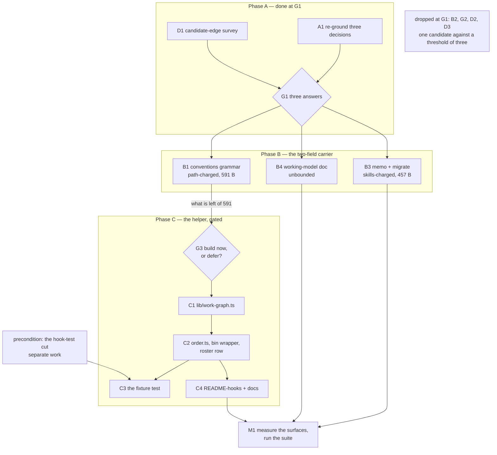

# Implementation Plan: prerequisites are confirmed once, and every ordering figure is computed from them

**Date:** 2026-09-11
**Revised:** 2026-09-11 21:41, against the three answers at gate G1 and the reports steps A1 and D1 produced. Step labels are stable across the revision and a retired label is never reused: `B2`, `D2`, `D3` and gate `G2` are gone, `B4` and gate `G3` are new, so every citation of a step in the reports and the records still names the step it named.
**Status:** Draft
**Amended:** 2026-09-12, citations only. The `bin/` helper roster left `CLAUDE.md`'s Layout table for `README-hooks.md` `### The bin/ helper roster` (decision `260911-2237_*_where-does-the-bin-helper-roster-belong-when-a-third-of-claude-md-is-pointers-charged-eleven-times.md`, option 1), so every instruction below that sent the helper's mandatory row to `CLAUDE.md` now sends it to the roster's new home. No figure taken at `ae172380` was rewritten and no step label moved; what the move dissolves is stated where those figures stand.
**Spec:** `260911-1528_*_spec-prerequisites-confirmed-once-order-computed.md`
**Decidability:** The load-bearing question is *what order does the work-item store impose on itself*, and after step B1 it is decidable by construction from inputs the mechanism holds. The answer at gate G1 fixed a two-field grammar: an entry in `**Depends-on:**` asserts one relation, stated by rule where the field is defined, and a citation that binds an item without ordering it sits in a second field, `**Cross-references:**`. Nothing then reads the text of a value to learn what the writer meant, which was the undecidability the first draft of this line named. The node set is decidable from `**Status:**`, which G1 also settled: `open` and `claimed` are nodes, `done` and `dropped` are not. Every figure downstream is a pure function of the node set and the edge set.

Two residuals are named rather than approximated past. **The first is a degeneracy, and it is why gate G3 exists.** On the store as it stands the graph is one node and zero edges, so `depth`, `blocks` and the topological order are determined without being computed, and no run over the real store separates a correct implementation from several wrong ones. The mechanism is decidable and the corpus cannot exercise it, which is a question about whether to build now rather than about whether the question has an answer; it goes to the user at G3 and is recorded at `260911-2141_*_is-the-order-helper-built-now-against-a-one-node-zero-edge-store-or-deferred-until-the-backlog-carries-one.md`. **The second is a genuine undecidability the user accepted at the gate**: an absent `**Depends-on:**` field and an item with no prerequisites are indistinguishable, so `ready` is optimistic by construction. Critical stance §4 says what follows, that the mechanism changes rather than the approximation, and here the change is to what the program claims. Step C2 has the helper count the items carrying no field and print a `note=` line saying absence is not a claim of independence.

## Directive

The spec states it and this plan does not restate it. What the plan adds is the split the spec's `## Open for Planner` left: where the graph logic lives, how much of the existing citation machinery it reuses, the output shape, the cycle algorithm, the implementation order, and which step measures which surface.

## What the gate answered

Three records left gate G1 on `_a_`. Each carries its own answer line, which is authoritative; this section states only what the executor needs and does not re-argue any of it.

**The dependent side** (`260908-2018_*_is-a-closed-prerequisite-a-satisfied-edge-or-no-edge-and-what-is-an-archived-one.md`): an item whose `**Status:**` is `done` or `dropped` is not a node and its outgoing edges are not read. A `done` target is not a node either, so an entry naming one is a dangle, reported by name with the node kept and the edge dropped; the node map reads `circles/` only. Two consequences were accepted at the gate and are carried rather than softened. The figures measure unfinished work only, so the graph is blind to what has closed. And on this store the graph is one node and zero edges, because the single candidate edge names a `done` item.

**The relation type** (`260908-2018_*_does-the-new-field-name-only-the-ordering-edge-or-the-four-relation-types-beside-it.md`), **and the answer is not the one step B1 was costed against**: option 1b of the re-grounding report's table rather than 1a. One relation in `**Depends-on:**`, stated by rule, plus `**Cross-references:**` as a defined work-item head field for the non-blocking citation, so the distinction rides on which field a basename sits in and never on a verb. A grammar change on three surfaces, and it closes `260911-1916_*_the-origin-rule-names-a-work-item-cross-references-header-the-item-template-does-not-define.md` as a side effect, which step B1 now owns.

**The template** (`260908-2018_*_does-the-record-template-mandate-the-prerequisite-field-or-merely-permit-it.md`): ratified as it stands, permitted and absent when there is nothing to say. No shipped surface changes for the ratification; the accepted con becomes a requirement on the helper in step C2.

**The fourth question left the gate without a subject.** `260911-1747_*_may-a-done-work-items-head-field-be-edited-at-all-and-under-what-bound.md` stays open, and under the dependent-side ruling nothing this plan builds reads the field it is about.

## Current State

Measured in this work tree at `ae172380`, 2026-09-11, by the command named beside each figure. The previous revision measured at `a78d017f`; every figure was re-taken and **none moved**.

**The surfaces.**

| Surface | Room at `ae172380` | How taken |
|---|---|---|
| `agents/*.md` bytes | 61 153 | baseline map plus head-room constant in `hooks/lib/__tests__/surface-growth-bound.test.ts`, against the per-file sizes on disk |
| `skills/*/SKILL.md` bytes | 457 | same |
| hook test lines | 1 | same, over `hooks/lib/__tests__/**.ts` recursively |
| `reviewer` dispatch path | 591 | `bin/fusion-rules reviewer` from the repository root, prompt plus emitted rules plus `CLAUDE.md`, against `hooks/lib/__tests__/fixtures/dispatch-path.baseline` |
| `analyst` dispatch path | 683 | same; the second tightest, and what a `CLAUDE.md` addition reaches next |

**The constraint that decides gate G3, measured rather than feared.** A new `bin/` helper is not free on the always-on floor. `hooks/lib/__tests__/derivable-enumerations-lint.test.ts` section 7 is closed in both directions: a helper under `bin/` with no `| \`bin/<name>\` |` row in `CLAUDE.md`'s Layout table fails the suite, and a row naming no file fails it too. `CLAUDE.md` is a component of all eleven dispatch paths at zero head-room.

Three figures, taken at `ae172380`, and their sum is the finding.

| Quantity | Bytes | How taken |
|---|---|---|
| Room on the `reviewer` path | 591 | above |
| B1's grammar change, minimal draft | 360 | a template line at 45, the amended absent-never-empty sentence at a net 26, the relation sentence and its cross-reference clause at 289, each measured with `wc -c` on the drafted text |
| Shortest Layout row in the table, `bin/fusion-claimed-item` | 291 | `grep -m1 '^| \`bin/fusion-claimed-item\` |' CLAUDE.md \| wc -c` |

360 plus 291 is 651 against 591. **The helper's mandatory Layout row is over the tightest path by at least 60 bytes before a byte of it is written**, and the 360 is a floor rather than a promise: any phrasing longer than the draft widens the deficit. The previous revision carried this as a risk; it is now a measurement and the sharpest input to G3. B1 alone fits, leaving 231 bytes, which is why the Layout row moved out of B1 into step C2 where its own gate can refuse it.

The remaining `bin/` rows measure 978, 1 421, 1 480, 1 493, 1 837 and 1 973 bytes, and none of them is a precedent this work may take.

**What the roster's move dissolves, 2026-09-12.** The three figures above stand exactly as taken at `ae172380`; what changed is where the row they measure is written. The whole `bin/` roster moved into `README-hooks.md` `### The bin/ helper roster`, which is on no dispatch path, so the helper's mandatory row is charged to the `reviewer` path at nothing and the 60-byte deficit is never paid. `CLAUDE.md` fell from 91 277 bytes to 61 925 in the same move, which every one of the eleven paths gains. The lint that obliges the row, `derivable-enumerations-lint.test.ts` section 7, is closed in both directions against the new home and is as strict as it was.

**What already exists and is reused rather than rebuilt.**

- `ITEM_RECORD_RE` in `hooks/lib/citation-corpus.ts`, `/^circles\/([^/]+)\/\1\.md$/`: a work-item record recognised by structural equality between a container's name and the record inside it. It is the project's one definition of the kind, and this work is its second reader.
- `findWorkbenchRoot()` in `hooks/lib/workbench-root.ts` and `exitZeroOnStdoutEpipe()` in `hooks/lib/fail-open.ts`: what every sibling entry point already calls.
- The `bin/` shape: thin bash wrapper resolving `hooks/dist/<name>.js` relative to itself, usage and exit codes in the script's own header, `KEY=value` on stdout, report and never gate. `bin/fusion-plan-size` is the closest sibling in purpose and exit table; `bin/fusion-forum`'s `note=` line is the precedent C2 reuses for the readiness caveat.

**What is deliberately not reused, with the reason.** `createScanner()` in `hooks/lib/citation-scan.ts` resolves a cited basename against a whole-workbench file index. That is the right grammar for a prose reference, which may name any record anywhere, and the wrong one for a dependency edge, which must resolve to a work item and to nothing else: an entry would resolve to a decision record, an archived copy or an analysis whose basename happens to match, and the scanner would report that as clean. The node set is the resolution domain here, so the edge reader looks an entry up in the node map it just built.

**The graph as it stands, re-taken under the ruling.** 26 containers under `circles/`, 2 holding a work-item record, of which one is `claimed` and one is `done`. The `done` one carries the store's only `**Depends-on:**` entry, and under the ruling its edges are not read. So the node set is one item and the edge set is empty. A run of the helper today would print `items=1`, `edges=0`, `unresolved-edges=0`, `cycles=0`, `ready=1`, `roots=1`, `verdict=acyclic`.

**Two things the ruling settled at zero cost, stated so nobody adds work that is not owed.** `skills/archive/SKILL.md` needs no change: its filter 2 walk at line 146 already collects dependency entries only from items whose status matches `open|claimed`, which is the ruling exactly. The new field earns no archive clause either, although filter 3's citing corpus is the shipped text and does not read the workbench. Filter 2's dependency clause exists because `**Depends-on:**` is machine-read, so an archived target becomes a dangle in a program's report; `**Cross-references:**` is read by no program by construction, so an archived target there degrades to the ordinary basename citation, which `rules/fusion-workbench-conventions.md` `## fusion-workbench Layout` says survives an archive move.

## What the two reports removed from this plan

**The proposal pass is not built, and phase D is gone.** `260911-1915-candidate-prerequisite-edges.md` returned **one** candidate edge against a stopping threshold of three, and the count is the corpus maximum rather than a thin reading: the store holds two items, one is `done` and cannot be a dependent, so exactly one ordered pair is available to propose. Steps D2 and D3 and gate G2 therefore have no input and are removed, the change to `agents/curator.md` does not happen, and the 9 867 bytes of `curator` path this plan had earmarked stay unspent.

The single candidate is weaker still under the ruling that arrived after it: it runs from the `claimed` item to the `done` one, and a `done` target is not a node, so writing it would manufacture a permanent dangle in every run. The survey anticipated this, and under the no-edge answer its own count is zero rather than one.

**The record filed with the previous revision has lost its subject.** `260911-1833_*_how-does-the-curators-survey-know-not-to-re-propose-an-edge-the-user-declined.md` asks how the curator's survey suppresses a declined edge, and no curator survey proposes edges now. It is not answered, not implemented and not superseded, and this plan transitions nothing. **The disposition it should get is `_d_`, deferred**, its target the re-reading of the first stopping condition after the backlog grows; the transition belongs to whoever holds it under `## Inline State Tracking`. Leaving it `_o_` reads to the next person as work somebody dropped, and dropping it silently discards a question that returns intact the day the pass is built.

**Step B2 has lost its trigger and is removed rather than blocked.** It was to carry out the user's answer on the one inherited value, the conflict relation the migration wrote into the `done` item's field. Under the ruling nothing reads that field, so no program will report the entry and no figure this plan computes is affected by it. The entry is still factually wrong and `260911-1747_*_the-migration-wrote-a-conflict-relation-into-depends-on-and-nobody-confirmed-it.md` is still an open defect gated on an open decision. Keeping B2 as a blocked step would make this plan's completion wait on a question it does not need answered. Both records stay open and outside this plan.

The claim B2 licensed is weakened accordingly, and the weaker one is written here rather than quietly retired: after phase B every entry **the mechanism reads** is one the user confirmed, checkable by reading the node set. It is not true that every entry in every item's field is confirmed, and the exception is the entry named above.

## Approach

One storage node and every figure hanging off it. Three moves now, where the first draft had four.

**Fix the carrier before computing over it, and the carrier is now two fields.** The relation type is stated once where the field is defined, a second field gives the non-blocking citation a home, and the two skill bodies that write and convert work items learn both. Phase B is unblocked and lands whatever G3 decides; it is the part `260909-1808_*_the-ground-this-circle-was-measured-on-is-being-cut-away-and-its-design-must-move.md` called cheap now and expensive later.

**The migration's repair and the new field are one change, not two.** B3's original subject was that `/fusion:migrate` writes a `**Depends-on:**` entry on resolvability alone, converting a relation nobody confirmed. The second field answers it directly: a conversion cannot confirm a prerequisite, so it writes nothing into `**Depends-on:**` and routes every surviving resolvable name into `**Cross-references:**`, which asserts no order. The live defect proves the rule right, since the entry that started this work is a conflict relation and a conflict is exactly a cross-reference. One rule replaces the drop-and-keep apparatus the bullet carries today, which is why B3 may cost the skills surface nothing.

**The helper is gated, not assumed.** Phase C is written against a store with one node and zero edges. The roster row a `bin/` helper obliges was measured over the tightest dispatch path's budget when this was written and is measured over no path since 2026-09-12, so what G3 still weighs is the degeneracy alone. It goes to the user before C1 is written, because the cost is not recovered by deleting the code afterwards.

**One program, one shape, one algorithm, unchanged where the ruling left it standing.** `hooks/lib/work-graph.ts` holds the computation as a pure function of a workbench root, `hooks/order.ts` prints it, `bin/fusion-work-order` wraps it. Tarjan's strongly-connected components over the whole edge set, then Kahn over the condensation. One traversal family answers cycles, topological order, depth and transitive blocking count, so there is no second algorithm and no special case for a cycle: a cycle is a component of size above one, its members print together at the component's position, and the program still exits 0.

## The shape



Coherence self-check, run before this was finalised. Twelve nodes, thirteen edges, no fan-out above three, and the one node with three out-edges is gate G1, which is what a gate is. No cycle. `B1` reaches `G3` by a solid arrow rather than the dotted budget edge the previous revision drew, and the change is substantive: what B1 leaves of the 591 bytes is an input the gate reads, which is a sequencing dependency. `cut` is an orphan by intent, entering from outside because this plan does not plan it, and `dropped` is unconnected because it records what left the graph at G1 and asserts no edge. Every other edge is a dependency the step list declares, and every dependency the step list declares is here.

## Implementation Steps

**G1 and G3 are gates, not steps, and carry no Executor.** Putting a question to the user is nobody's dispatch: `coder`, `ontocoder` and `analyst` each run non-interactively and none of them holds `AskUserQuestion`. The orchestrator proxies both.

1. [DONE] **A1: re-ground the three inherited decisions against the tree at HEAD**
   - Executor: `analyst`
   - Files: wrote `260911-1916-re-grounding-three-open-decisions.md`
   - Changes: delivered. It found the relation-type record's option 2 unwritable for want of a verb slot, cut the closed-prerequisite record into the three questions it actually contained, and established that the template record was a ratification rather than a choice. All three findings were carried at the gate.
   - Dependencies: none

2. [DONE] **D1: the candidate-edge survey, which decides whether the proposal pass is built at all**
   - Executor: `analyst`
   - Files: wrote `260911-1915-candidate-prerequisite-edges.md`
   - Changes: delivered. One candidate, quoted tier, and the arithmetic showing one is the corpus maximum. The first stopping condition is met and phase D is not built; see `## What the two reports removed from this plan`.
   - Dependencies: none

   **G1: answered 2026-09-11.** Three of the four questions were ruled and their records carry the answer lines; the fourth, whether a terminal item's head field may be corrected, left the gate without a subject when the dependent-side ruling put that item outside the node set. The record stays open and outside this plan.

3. [DONE] **B1: the two-field grammar, stated once where the fields are defined**
   - Executor: `coder`
   - Files: `rules/fusion-workbench-conventions.md`, the `## Backlog entries — work items` section and, if the sentence there is the one that resolves it, `## Origin Rule (Herkunftsregel)` corollary 2
   - Changes: three edits and one closure. Add `**Cross-references:** <basename>, <basename>` to the template block; amend the absent-never-empty sentence so it covers all three optional fields; state what an entry in `**Depends-on:**` asserts and where a non-blocking citation goes instead. **The relation sentence names both terminal values, not just `done`**, which is derived rather than open: under the ruling a `dropped` target is as absent from the node set as a `done` one, so "until the named item is `done`" would claim a distinction the mechanism does not make. Then close `260911-1916_*_the-origin-rule-names-a-work-item-cross-references-header-the-item-template-does-not-define.md`, whose acceptance test is that `rules/fusion-workbench-conventions.md` states in one place whether a work item carries the field; defining it in the template satisfies that test, and the executor checks the Origin Rule corollary reads consistently with the definition rather than editing it reflexively.
   - **Measure first, write second.** Take the `reviewer` path total before the edit (`bin/fusion-rules reviewer` from the repository root, prompt plus every emitted path plus `CLAUDE.md`), subtract from the `reviewer` row in `hooks/lib/__tests__/fixtures/dispatch-path.baseline`, and report what the edit spends and what it leaves. **The figure that is left is an input to gate G3** and must be in the step's report as a number, because G3 cannot be put to the user without it. The helper's roster row is **not** in this step: it belongs to the helper, and the helper is gated.
   - Dependencies: G1

4. [DONE] **B3: the two skill bodies learn the grammar, and the migration stops guessing**
   - Executor: `coder`
   - Files: `skills/migrate/SKILL.md`, the `**Depends-on:**` bullet at the record-conversion step; `skills/memo/SKILL.md`, the filing template and the sentence at line 127
   - Changes: in `/fusion:migrate`, replace the conversion rule rather than extending it. A conversion cannot confirm a prerequisite, so it writes **nothing** into `**Depends-on:**` and routes every name that survives the existing resolvability test into `**Cross-references:**` instead, absent when nothing survives. That one rule retires the keep-if-resolvable, drop-prose, drop-terminal-target apparatus the 730-byte bullet carries today, so the edit may take bytes off this surface rather than adding them. In `/fusion:memo`, add the field to the filing template's absent-at-filing sentence. **The cardinality in that sentence moves**: it reads "do not invent any of the three" and the three become four, which is the kind of prose count `rules/critical-stance.md` §5 is about.
   - Both files are charged to the **skills** surface, 457 bytes at `ae172380`, a different budget from B1's that buys nothing from it. One step rather than two because one budget measured once beats two executors each guessing what the other spent. Measure the surface before and after and report both.
   - Dependencies: G1, B1 (the definition B3's two bodies point at)

5. [DONE] **B4: the working model's own account of the item head**
   - Executor: `coder`
   - Files: `docs/working-model.md`, the head-field example around line 18 and the `**Depends-on:**` paragraph at line 42
   - Changes: add the field to the worked example and say in one clause what each of the two fields asserts, so a reader meets the same grammar `rules/fusion-workbench-conventions.md` defines. The document is on no dispatch path and in no bounded surface, so this step competes with nothing. It is separate from B3 because it is unbounded: mixing an unmeasured file into a step whose whole discipline is a byte measurement blurs the measurement.
   - Dependencies: B1

   **G3: does the helper get built now, against a store of one node and zero edges?** The question, the three options and the measurement behind them are in `260911-2141_*_is-the-order-helper-built-now-against-a-one-node-zero-edge-store-or-deferred-until-the-backlog-carries-one.md`, filed with this revision, and the gate reads that record rather than a restatement here. One figure goes to the user with it: what step B1 left of the `reviewer` path's 591 bytes. The second this gate carried, the 291-byte shortest Layout row, left the dispatch paths with the roster on 2026-09-12 and is a cost on nothing. Under the defer answer the work stops after B4 and the deferral names its trigger; under either build answer phase C proceeds in the shape the chosen option names.

6. [DONE] **C1: `hooks/lib/work-graph.ts`, the computation**
   - Executor: `coder`
   - Files: new `hooks/lib/work-graph.ts`
   - Changes: one exported pure function of a workbench root returning the report, plus the types. **The node set is `open` and `claimed` only**, which is the G1 ruling and what narrows this step from its first draft. Match every work-item record with `ITEM_RECORD_RE` imported from `hooks/lib/citation-corpus.ts`, never re-spelled here; parse its `**Status:**`, and drop a `done` or `dropped` item from the node set with its outgoing entries unread. Per node, parse `**Depends-on:**` out of the head; an entry is a basename `<dirname>.md` and resolves by lookup in the node map, so an entry naming no node, a terminal item included, is reported by name, the node keeps its place and the edge is dropped. Never read `archive/**/circles/`. Edge direction: `A **Depends-on:** B` is the edge A to B, "A may start after B". Cycles by Tarjan's strongly-connected components over the whole edge set, a component of size above one being a cycle and a self-edge a cycle of one; topological order by Kahn over the condensation, prerequisites first, ties broken on the item basename ascending, which is chronological then lexical and stable across runs. `depth` is the longest path to a node with no prerequisites, 0 where there are none, taken on the condensation so a cycle does not make it unbounded. `blocks` is the size of the reverse-reachable set excluding self. **`readiness` is two-valued and derived, not configured**: every node is non-terminal, so every resolved out-edge is an unmet prerequisite, and a node is `ready` exactly when it has none. Also count the nodes carrying no `**Depends-on:**` field, which is what C2 prints its caveat from. The module header states that the graph spans live work items only and why a `done` item and a terminal Circle record are both outside it. Store nothing: no cache, no index file, no write of any kind.
   - Dependencies: G3

7. **C2: `hooks/order.ts`, `bin/fusion-work-order`, and the roster row the helper obliges**
   - Executor: `coder`
   - Files: new `hooks/order.ts`, new `bin/fusion-work-order`, `README-hooks.md` `### The bin/ helper roster`
   - Changes: the entry point prints the `KEY=value` block, then one row per item in topological order, then the cycle and unresolved rows. The block: `anchor=workbench-root`, `items=`, `edges=`, `unresolved-edges=`, `cycles=`, `ready=`, `roots=`, `no-depends-on-field=` and `verdict=` taking `acyclic`, `cyclic` or `empty`. Each item row carries its order index, depth, blocks, readiness and basename, at fixed column widths like `bin/fusion-plan-size`'s. A cycle is one `cycle=` row naming its members in basename order; an entry naming no node is one `unresolved=` row naming the dependent and the entry as written. **One `note=` line is mandatory whenever `no-depends-on-field=` is above zero**, saying that an absent field is not a claim of independence and that `ready=` is optimistic by that count: it is the requirement the template ruling attached to its accepted con, and the line kind is `bin/fusion-forum`'s. **No exit code carries the verdict**: 0 the check ran, 1 usage, 2 no workbench above the working directory, 3 the compiled hooks are missing. `verdict=empty` reaches 0 like the other two, since "there are no items" is an answer about the project and a broken install must never be reported as one. The wrapper resolves `hooks/dist/order.js` relative to itself, and its own header carries the usage block, the output shape and the exit table. **The roster row lands here**, in `README-hooks.md` `### The bin/ helper roster`, because `derivable-enumerations-lint.test.ts` section 7 fails the suite the moment the `bin/` file exists without one. It follows the `bin/fusion-claimed-item` shape, 291 bytes, whose whole body is the header-is-the-documentation sentence plus the two facts a reader needs; the four-figure rows are not a precedent this step may take. **Measure the `reviewer` and `analyst` paths before and after and report both**, and if the row does not fit, stop rather than overrun: see `## Where this work stops`. Run `npm run build` and commit `hooks/dist/`, or `committed-dist.test.ts` goes red.
   - Dependencies: C1

8. **C3: the fixture test**
   - Executor: `coder`
   - Files: new `hooks/lib/__tests__/work-graph.test.ts`
   - Changes: build a fixture store on disk under a scratch root carrying a chain, a fan-out, a cycle, an entry naming no existing item, **and a `done` item carrying an outgoing entry**, then exercise depth, transitive count, topological order, readiness, cycle naming, the dangling-edge rule and the terminal-exclusion rule against it. The last is new and is the fixture's most valuable case: it is the one behaviour the real store cannot demonstrate and the one the G1 ruling turns on. Files on disk rather than an in-memory graph, because the parse of the head field is half of what can be wrong. Add the two assertions the spec asks for and the real store cannot make: that running twice over an unchanged fixture produces identical bytes, and that no path the module opens matches `archive/`. **Blocked on the precondition cut, which this plan names and does not plan.** The hook-test surface holds 1 line at `ae172380`; the six most recent helper tests run 140 to 220 lines, so the cut must free between 139 and 219 lines, the exact figure known only once this file is written. Identifying which tests to cut belongs to that other work, and no baseline moves here.
   - Dependencies: C2, and the precondition cut

9. **C4: the two documentation surfaces the helper adds**
   - Executor: `coder`
   - Files: `README-hooks.md` (the entry-point table and the `hooks/lib` table), `docs/working-model.md`
   - Changes: one `README-hooks.md` row for `order.ts` and one for `lib/work-graph.ts`, both mandatory, the second gated by `derivable-enumerations-lint.test.ts` section 5 in both directions. In `docs/working-model.md`, beside the paragraph B4 amended, name the command and say the figures are a report the user overrides at will. Neither file is on a dispatch path or in a bounded surface, so C4 competes with nothing. `/fusion:help` is deliberately not touched: the skills surface holds 457 bytes and C4's criterion is one documented command, which these two files satisfy. The helper's roster row is in C2, in this same file's `### The bin/ helper roster`.
   - Dependencies: C2

10. **M1: measure the surfaces and run the suite**
    - Executor: `coder`
    - Files: none; this step writes no file and reports
    - Changes: run `npm test` in `hooks/` and report it green. Then take, and report as figures rather than as a claim that nothing broke: the three surface totals against their budgets, and all eleven dispatch-path totals against their baseline rows, by the method `hooks/lib/__tests__/fixtures/dispatch-path.baseline` documents. **Where phase C ran**, also run `bin/fusion-work-order` at the project root, take `git status` before and after, report both, and run it twice and compare the bytes. Where phase C did not run, M1 covers the B-phase surfaces alone and says so, and the acceptance test's parts 1 and 3 are recorded as not run rather than as passed.
    - Dependencies: B3, B4, and C4 where phase C ran

## Where this work stops

- The work stops after step B4 and phase C is not built, if gate G3 rules to defer. The deferral names the trigger and the file that carries it, per `260911-2141_*_is-the-order-helper-built-now-against-a-one-node-zero-edge-store-or-deferred-until-the-backlog-carries-one.md`; a deferral written only into that record is a silent drop, because nothing reads a decision record on a schedule.
- The work stops before step B1 writes anything, if the two-field grammar change exceeds the 591 bytes on the `reviewer` dispatch path and no removal of at least its size is found on that same path. The minimal draft measures 360, so this clause is not expected to fire; it stands because the executor writes the real text and the measurement, not the draft, decides.
- The work stops before step C2 writes anything, if the `bin/fusion-work-order` Layout row exceeds what step B1 left on the `reviewer` path and no removal of at least its size is found there. **Measured at `ae172380` this clause fires**: 231 bytes left against a 291-byte shortest precedent row. What gives is the user's call at G3, not the executor's, and the candidates are a shorter Layout row than any in the table, a cut elsewhere in `CLAUDE.md`, a cut in an always-on rule, or the deferral. None of them is a baseline edit. **(The condition can no longer arise, 2026-09-12**: the roster moved to `README-hooks.md`, so the row is charged to nothing the `reviewer` path measures. The paragraph stands as the measurement that put G3 where it is.)
- The work stops before step C3 lands, and C2 is not called done, if the precondition cut in the hook test suite does not happen or frees fewer lines than the test costs. Shipping an untested helper is an outcome the user may choose and not one this work takes by default. Two readings of the spec are carried rather than resolved: its `## Stops when` says the work stops "before the helper is written", its `## Preconditions` says the cut gates the test alone. This plan follows the second, the more specific statement, and the discrepancy is in `## Open Questions`.
- The work stopped at the first stopping condition already, for phase D: fewer than three candidate edges. One was returned, phase D is not built, and the condition is recorded as **fired** rather than pending.
- **A precondition of calling this work finished**, and it is a precondition of nothing else: every question this plan assumed an answer to is answered and its record transitioned by whoever owns that transition. Three of the four G1 records carry their answer lines. The record filed with the previous revision of this plan needs the disposition `## What the two reports removed from this plan` recommends, and the record filed with this revision needs G3's answer. An unanswered record whose answer this work assumed is the failure mode `260908-2018_*_is-a-closed-prerequisite-a-satisfied-edge-or-no-edge-and-what-is-an-archived-one.md` warns about in its own recommendation.
- (condition did not arise: the previous revision stopped the work at G1 and sent questions (c) and (d) back together, if the terminal item's field were left as it stands **and** a `done` item's edges were put inside the computed graph. The ruling put them outside, so the antecedent is false and the clause never fired.)

## Data Structures

In `hooks/lib/work-graph.ts`. Nothing here is written to disk; the whole structure is built per run and discarded.

```
WorkItemNode   { dir, base, status, dependsOn: string[] }   // status is open | claimed only
ResolvedEdge   { from: dir, to: dir }
UnresolvedEdge { from: dir, entry: string }                 // includes an entry naming a terminal item
CycleGroup     { members: dir[] }                           // one SCC of size > 1, or a self-edge
ItemFigures    { order, depth, blocks, readiness }
WorkGraphReport {
  items: number, edges: number, unresolvedEdges: UnresolvedEdge[],
  cycles: CycleGroup[], rows: (WorkItemNode & ItemFigures)[],
  noDependsOnField: number,
  verdict: "acyclic" | "cyclic" | "empty"
}
```

`readiness` takes `ready` or `blocked`, and nothing else. The first draft reserved a third value, `terminal`, for a node whose own status was closed; the G1 ruling put such items outside the node set, so no node can carry it and a three-valued type would be an unreachable branch. `noDependsOnField` exists for the caveat line in step C2 and is the one figure in the report that describes what the store does **not** say.

## API Changes

No existing signature changes and no existing module gains an export. One import is added, `ITEM_RECORD_RE` from `hooks/lib/citation-corpus.ts` into `hooks/lib/work-graph.ts`, and it is an existing export with one existing reader. One new command-line surface, `bin/fusion-work-order`, taking no arguments in its first form, and it exists only if gate G3 says so. Every call site guards with `[ -x ]`, per `260810-0921_*_how-should-a-prompt-call-a-bin-helper-that-the-installed-copy-may-not-have.md`, and this work adds no call site in a prompt or a skill body: the helper is run by a person, like `bin/fusion-plan-size`.

## Testing Strategy

The spec's restated acceptance test has four parts. Two are placed, one is not runnable and one is gone.

1. **The store's own graph is reported correctly.** Step M1, where phase C ran. Today that report is one node, zero edges, `verdict=acyclic`, and the `note=` line about the absent field. **The part proves less than it was written to prove**: a one-node graph passes under several wrong implementations as readily as under the right one, and part 2 carries the proof.
2. **The mechanism is proved on a fixture, not on the store.** Step C3, files on disk under a scratch root. The fixture carries a terminal item with an outgoing entry, which is the one behaviour the ruling introduced and the real store cannot show.
3. **Two runs agree.** Step M1, byte comparison plus `git status` before and after, where phase C ran.
4. **The proposal pass is proved on what it proposes.** Not runnable: phase D is not built. Step D1's report stands as the record of what the pass would have proposed, and the part is withdrawn rather than passed.

Two gates fire on this work without anyone asking them to, named so an executor is not surprised: `derivable-enumerations-lint.test.ts` sections 5 and 7 both fail the suite over a missing `README-hooks.md` row, section 5 for `lib/work-graph.ts` and section 7 for the wrapper's roster row; `committed-dist.test.ts` fails unless `hooks/dist/` is the compilation of the committed source. `workbench-citation-lint.test.ts` judges this plan itself, since a live plan is in its corpus, and `plan-stopping-section-lint.test.ts` reads its stopping section for presence.

## Risks & Mitigations

| Risk | Mitigation |
|---|---|
| The `reviewer` path cannot hold the two-field grammar and the mandatory Layout row together | Measured rather than feared: 360 plus 291 against 591. The row is out of B1 and behind gate G3, and the stopping clause names what gives. Dissolved 2026-09-12: the roster left `CLAUDE.md` and the row is charged to no path |
| G3 is answered "build" and the Layout row is then written over budget to keep the work moving | The stopping clause fires before C2 writes, and the baseline is not editable: a dispatch-path addition is offset from the same path or it does not land. Dissolved with the row's move on 2026-09-12 |
| The one-node store makes the helper look correct when it is not | Part 1 of the acceptance test is explicitly downgraded above, and the fixture in C3 carries the terminal-item case the store cannot show |
| `readiness` is read as a claim that an item has no prerequisites | The `note=` line in C2 is mandatory whenever any node carries no field, and `no-depends-on-field=` makes the size of the doubt a number |
| The migration's new rule silently discards a relation the old one kept | It discards nothing: every name that survives the resolvability test moves to `**Cross-references:**`, and the conversion report already states what it dropped and why |
| The curator record is left `_o_` with no subject and reads as abandoned work | Its disposition is recommended above and belongs to whoever holds the transition; this plan names it rather than leaving it to be found |
| The fixture test is written, the cut does not arrive, and the file lands anyway and reddens the suite for everyone | C3 is the last code step and is explicitly gated; a red growth bound is fixed by a cut and never by a baseline edit |

## Open Questions

- [ ] `260911-2141_*_is-the-order-helper-built-now-against-a-one-node-zero-edge-store-or-deferred-until-the-backlog-carries-one.md`, filed with this revision, open. Gate G3 reads it, and it blocks steps C1 to C4.
- [ ] `260911-1833_*_how-does-the-curators-survey-know-not-to-re-propose-an-edge-the-user-declined.md`: open, and its subject is not built. `## What the two reports removed from this plan` recommends `_d_` with the re-reading of the first stopping condition as the deferral target. Blocks nothing here.
- [ ] `260911-1747_*_may-a-done-work-items-head-field-be-edited-at-all-and-under-what-bound.md`: open, and no longer a dependency of this plan. It gates the repair of `260911-1747_*_the-migration-wrote-a-conflict-relation-into-depends-on-and-nobody-confirmed-it.md`, which stays an open defect carried outside this work.
- [ ] Whether the first stopping condition is re-read when the backlog grows, or the proposal pass is foreclosed. `260911-1915-candidate-prerequisite-edges.md` asked for the re-reading and nothing has answered it; the trigger G3 asks for is the cheapest place to settle both.
- [ ] The spec's `## Stops when` and its `## Preconditions` give the hook-test cut two different reaches. This plan follows the narrower one, that the cut gates the test and not the helper. If the user means the wider one, steps C1 and C2 move behind the cut as well and the plan's step order changes.
- [ ] `260909-1020_*_three-source-aspects-unnamed-and-the-proposal-pass-has-no-agent-or-surface.md` is partly overtaken by the spec and this plan does not move its marker. Its point 6, who fills the field when a new item is filed, is touched by step B3 only to the extent that `/fusion:memo` now names a second absent field; no step here writes either field at filing time.
