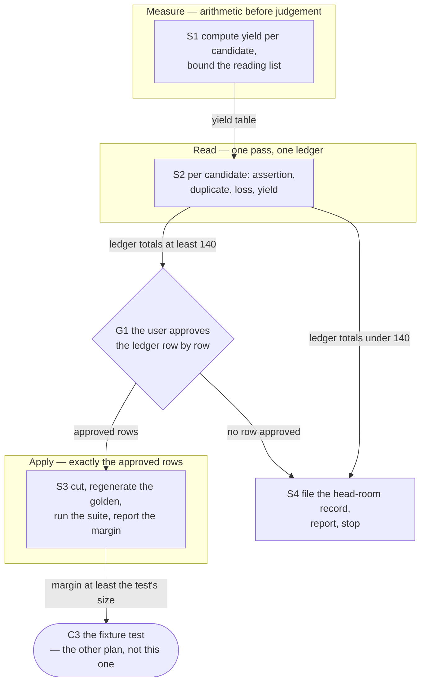

# Implementation Plan: cut the hook test surface so the work-graph fixture test can land

**Date:** 2026-09-12
**Status:** Draft
**Spec:** none for the cut itself. Its requirement is set by `260911-1528_*_spec-prerequisites-confirmed-once-order-computed.md` `## Preconditions` and by step C3 of `260911-1833_*_implementation-prerequisites-confirmed-once-order-computed.md`, both of which name this work and deliberately refuse to specify it.
**Decidability:** Two questions, and they separate cleanly. **How much margin a given removal frees** is decidable exactly, from inputs the mechanism holds: margin is `floor + headRoom - total`, and a removal's yield is a pure function of the tree and `TEST_LINE_BASELINE`, computable before a byte moves. Step S1 computes it. **Whether a given guarantee is worth its lines** is decidable by no mechanism at all: it is a reading of what a test holds against what a release would stop catching, and no count, ratio or heuristic decides it. So the mechanism does not try: S2 produces evidence per candidate and G1 puts the judgement to the user, one row at a time. A plan that had an agent pick the cut from a size ranking would be approximating exactly the question §4 of `rules/critical-stance.md` says not to approximate.

## Directive

Free enough lines on the hook test surface for `hooks/lib/__tests__/work-graph.test.ts` to land, without moving a baseline and without disabling a gate. The computation that test would cover, `hooks/lib/work-graph.ts`, was proved once against a scratch store that was then deleted; the proof survives only as prose in commit `0078ecc1`, and the live store is two nodes and zero edges, which passes under several wrong implementations. This work does not write that test. It makes room for it, or it establishes that no room is available at an acceptable price and says so.

## Current State

**Measured at HEAD, 2026-09-12**, by summing `TEST_LINE_BASELINE` over the files present and comparing against a recursive newline count over `hooks/lib/__tests__/**/*.ts` excluding `fixtures/`, the method `hooks/lib/__tests__/surface-growth-bound.test.ts` uses and the method the previous cut-only plan measured itself by:

```
total   21 823 lines      floor  19 228      headRoom  2 595
budget  21 823            margin      0
```

The bound is `total > budget`, so equality passes and one added line fails.

**The requirement is 140 to 220 lines, not 139 to 219.** The spec derived its range from a surface holding 1 line at `1208ceb6`. It holds 0 today, so the cut owes the whole size of the file C3 writes. The six most recent helper tests in this repository run 150 to 223 lines (`session-start-event` 150, `plan-size` 163, `fusion-claimed-item` 192, `fusion-forum` 220, `dispatch-bytes` 223, `fusion-checkout-name` 174), and `work-graph.test.ts` sits at the upper half of that by construction: it builds a fixture store on disk and exercises seven behaviours over it.

### The arithmetic that decides which candidates are real, and it is not the size ranking

`growth()` sums the baseline **over the files present**. A baseline entry for a file that is gone contributes nothing, and `surface-growth-bound.test.ts` `carries no baseline entry for a file that is gone` fails the suite unless the entry is dropped in the same commit. Two regimes follow, and they are far apart:

| Removal | Margin freed |
|---|---|
| Lines trimmed from a file that survives | the lines removed, 1 for 1 |
| A whole file deleted, plus its baseline line | `current size − baseline entry + 1` |

So a whole-file deletion returns **only the file's growth since the last re-baseline**, not its size. Read against the size table this work was dispatched with, that inverts the shortlist:

- `reference-resolution-lint.test.ts`, 1 003 lines, frees **0**.
- `monitor-warnings-panel.test.ts`, 1 222 lines, the second-largest file on the surface, frees **70**.
- `fusion-paths.test.ts`, 774 lines, **costs 98**: deleting it puts the bound further over than leaving it.

The arithmetic is not a discovery. `260822-1154_*_plan-c0-cut-only-circle-buys-head-room-on-four-bounded-surfaces.md` measured its own acceptance exactly this way. What is new is that the size ranking, read as a shortlist, contradicts it, and the instrument's own failure text does not: `boundMessage` says "Cut where the growth is" and prints the per-file growth, which under this arithmetic is the correct instruction. The instrument is right and the ranking is the thing to distrust.

### The three candidate classes, with their ceilings measured

**Class A, the eight files with no baseline entry.** Added since the 2026-09-05 merge re-baseline, so each counts in full as growth and each frees its whole size. 1 471 lines in total.

| File | Lines | Added |
|---|---|---|
| `citation-form.test.ts` | 376 | 2026-09-06 |
| `dispatch-bytes.test.ts` | 223 | 2026-09-10 |
| `fusion-forum.test.ts` | 220 | 2026-09-07 |
| `fusion-claimed-item.test.ts` | 192 | 2026-09-10 |
| `plan-size.test.ts` | 163 | 2026-09-10 |
| `session-start-event.test.ts` | 150 | 2026-09-09 |
| `live-circle-record-detection.test.ts` | 77 | 2026-09-11 |
| `declared-citation-paths.test.ts` | 70 | 2026-09-05 |

Arithmetically the richest class and, on guarantee grounds, the worst. Every one of these is seven days old or less, and each was written because something was found; the last of them, `live-circle-record-detection.test.ts`, is named in its own commit as "the owed regression". The presumption is against this class, and the reading has to overturn it per file rather than the plan waving it away.

**Class B, baselined files deleted whole.** Yield is growth plus one. Eligible top of the class, after excluding the instrument's own two files and the shared harness: `rules-emission-golden` 181, `citation-grammar-boundaries` 115, `guard-state-shape` 114, `config` 96, `fusion-events` 93, `citation-sweep` 87, `review-coverage` 73, `commit-message-path` 71, `monitor-warnings-panel` 70, `fusion-session-domain` 61, `sentence-identifier-containment` 48, `context-manifest` 47, `fusion-citation-check` 37, `executor-verification-report-lint` 22, `review-coverage-mandate` 16. Ceiling if every one went: 1 131 lines. Nobody is proposing that; the figure bounds the search.

**Class C, lines trimmed from files that survive.** 1 for 1, and the only class in which no assertion is lost. The reservoir is 6 417 comment lines and 1 912 blank, 38 per cent of the surface. `inference:` this is where the cut most likely comes from, because it is the one class whose cost is documentation rather than coverage, but it is an inference and S2 measures it, not this plan.

Class C is bounded by a rule taken straight from the previous cut-only plan and adopted here unchanged: **where a paragraph exists because a measured defect happened, it stays. This project's prose is frequently the mechanism, and a cut that removes a mechanism is a worse outcome than a red bound.** Two files are excluded from Class C by name, because their prose *is* the instrument: `hooks/lib/__tests__/surface-growth-bound.test.ts` (the arming and re-baseline logs) and `hooks/lib/__tests__/helpers/growth-bound.ts` (the `## Re-baselining` rule and its absolution text, which that rule requires to survive the number moving).

Class C also sits on an open question rather than a settled one. `260822-1154_*_does-the-hook-test-line-budget-cover-comment-prose.md` asks whether a comment line is the same kind of cost as a test line and is unanswered. **This work does not need it answered.** Its option 1, the status quo, is what the instrument does today: a line is a line, and removing a comment line lowers the total exactly like removing a test line. Nothing here changes what the surface counts, which is what options 2 and 3 would need a baseline recomputation for.

### What the constraints cost, measured rather than assumed

**The three gates.** `committed-dist.test.ts`, `workbench-citation-lint.test.ts` and `plan-stopping-section-lint.test.ts` are excluded by construction and the exclusion is nearly free: their whole-file yields are −3, 28 and −4. Ruling them out costs the cut at most 28 lines.

**The eight flaky files.** `260908-1719_*_three-harness-spawning-tests-fail-intermittently-so-the-suite-cannot-answer-the-circles-green-clause.md` names `staging-drift`, `fusion-commit-lock` and `guard-state-shape` in its title and adds five more in its 260912-1656 note: `fusion-citation-check`, `review-coverage`, `citation-sweep`, `hook-fail-open`, `monitor-warnings-panel`. Their combined whole-file yield is 372 lines, so the question is live rather than academic. **This plan's rule, and S2 applies it without discretion: flakiness is a reason to fix, never a reason to cut.** A flaky test is a test whose guarantee holds and whose harness does not; deleting it removes the guarantee and leaves the fault, and the suite then reports green because it stopped looking. One of the eight enters the ledger only where the reading finds its guarantee duplicated elsewhere, the same test every other candidate faces, and the row then says so in those words, never "it was flaky". The record's own cause is unmeasured and its title undercounts; neither fact makes a deletion a repair.

**Re-baselining.** None of the three events in `hooks/lib/__tests__/helpers/growth-bound.ts` `## Re-baselining` applies to this work, and the file says so about this work specifically. Event 1 is a cleanup that *settles* a surface, and the user refused on 2026-09-11 the reading under which a cut re-baselines what it cut: **a cut-only piece of work never re-baselines, whatever it cut, and its head-room is what the cut leaves.** Event 2 is an arming and nothing is being armed. Event 3 is a merge of two in-budget lines and there is no merge. `260822-1154_*_does-a-cut-only-circle-re-baseline-the-surfaces-it-cuts.md` is answered and implemented to the same effect, and `260822-1102_*_what-happens-when-a-planned-circles-required-work-exceeds-the-remaining-head-room.md` chose a cut-only piece of work running first over declaring a new re-baselining moment. The fourth named event, a head-room raise, moves no baseline and is a user decision this plan does not take.

## Approach

One integral shape, and it is the precedented one: **the previous cut-only plan's survey-ledger-gate-cut sequence, re-run against one surface instead of four.** Nothing here is a new mechanism.

**Arithmetic before judgement.** S1 computes yield per candidate and hands S2 a bounded reading list. Without it, S2 reads 56 files and ranks them by the wrong number.

**One reading, one ledger, one schema.** Every candidate gets the same four answers: what it asserts, whether anything else asserts it, what reaches a release unnoticed if it goes, and what it yields. A row with no authoring home for its guarantee and no statement of the loss does not enter the ledger. This is what stops the cut becoming a pile of point removals each justified its own way.

**The judgement is the user's, at one gate, per row.** Not because the agents are untrusted but because the question is undecidable by mechanism, which the Decidability line states.

**The honest no is a first-class outcome.** S4 exists to be taken. If the approved rows total under 140 lines, the cut does not happen, C3 stays blocked, and the question becomes whether `TEST_LINE_HEAD_ROOM` rises: a user decision, a separate record, and not this plan's to take.

## The shape



Coherence self-check, run before this was finalised. Six nodes inside the work and one outside it, seven edges, no cycle, maximum fan-out two, and both two-way splits are the same decision read at two points: does enough justified cut exist. The layering runs top-down with no edge against the grain. `C3` is drawn as an external terminal because this plan does not perform it and declares no step for it; it is reachable rather than orphaned, which is the honest shape for a precondition's consumer. Every edge is a dependency the step list declares, and every dependency the step list declares is an edge.

## Implementation Steps

**G1 is a gate, not a step, and carries no Executor.** `coder`, `ontocoder` and `analyst` all run non-interactively and none holds `AskUserQuestion`. The orchestrator proxies it.

1. [DONE] **S1: compute the yield per candidate and bound the reading list**
   - Executor: `coder`
   - Files: none; this step writes no file and reports. It may use a throwaway script under the session scratch directory.
   - Changes: re-derive, from the tree and from `TEST_LINE_BASELINE`, the three figures in `## Current State` (`total`, `floor`, `margin`) and a per-file table carrying current lines, baseline entry, whole-file yield (`size − baseline + 1`) and non-code line count (comment plus blank). Report, as figures: the Class A roster with its sum, the Class B eligible roster ordered by yield, and the Class C reservoir per file. **Report any disagreement with `## Current State` as a disagreement rather than silently substituting**: those figures were taken at 2026-09-12 20:45 and the tree may have moved. Exclude nothing from the table; exclusion is S2's judgement and the gate's, not a filter applied before either of them can see it. Do not edit a test, do not touch a baseline, do not commit.
   - Dependencies: none

2. [IN PROGRESS] **S2: the reading, and the ledger it produces**
   - Executor: `analyst`
   - Files: writes one analysis report to its own `$OUT_ANALYSIS`. Reads `hooks/lib/__tests__/**/*.ts`, S1's table, `README-hooks.md` `### Three gates that can fail the suite over text nobody compiled`, `hooks/lib/__tests__/helpers/growth-bound.ts` `## Re-baselining`, and the two records named below.
   - Changes: a ledger with one row per candidate, and **every row carries all five of these or it is not a row**: (a) the file and, for a Class C row, the line range; (b) what it asserts, in the terms of the behaviour it holds, not the API it calls; (c) whether anything else in the suite asserts the same thing, cited `file:line`, or the plain statement that nothing does; (d) **what would reach a release unnoticed if it went**: the guarantee, named as a failure that would ship; (e) the measured yield from S1's table. A row's verdict is one of `duplicate` (another test asserts it, cited), `superseded` (its subject no longer exists), `prose` (a Class C trim removing no assertion), or `load-bearing` (it stays). Only the first three enter the ledger's total.
     - **The presumption per class is stated and then overturned per row or not at all.** Class A rows carry, in addition, why a guarantee added inside seven days is nonetheless duplicated or superseded; a Class A row that says only "it is new and small" is not a row.
     - **Flakiness.** For each of the eight files named in `260908-1719_*_three-harness-spawning-tests-fail-intermittently-so-the-suite-cannot-answer-the-circles-green-clause.md`, the report states which it means, fix or cut, and never lets the two blur. A flaky file enters the ledger only on (c) and (d), on the same terms as any other, and the row says so in those words.
     - **Excluded by construction, and the report restates the exclusions rather than rediscovering them**: the three gates in the `README-hooks.md` table; `surface-growth-bound.test.ts` and `helpers/growth-bound.ts` for Class C trims; `helpers/guard-harness.ts` as a whole-file deletion, since three suites import it.
     - **Before proposing any whole-file deletion or any header removal, check `reference-resolution-lint.test.ts` and `derivable-enumerations-lint.test.ts`** for a reference that resolves into the file or into a `README-hooks.md` row naming it. A row whose removal reddens a lint states the accompanying edit.
     - The report states, **first, before anything else**, the ledger total against three marks: 140, the floor at which C3 can land only if the test is written at the small end of the precedent range; 220, the upper precedent; and 260, which leaves the C3 author room for the attribution conventions rather than writing against a wall, the failure `260822-1154_*_does-the-hook-test-line-budget-cover-comment-prose.md` records twice, where a piece of work spent its last lines on an attribution its own convention required and missed its stopping criterion as a result.
     - **If the total falls short of 140, the report says so plainly and proposes nothing to make up the difference.** Manufacturing a row to reach a number is the one failure this step is written to avoid.
   - Dependencies: S1

**G1 — the user reads the ledger and approves it row by row.** The gate is per row rather than per report because the rows are not alike: a `duplicate` row gives up nothing, a `superseded` row gives up something already gone, a `prose` row gives up documentation, and each is a different price. The orchestrator puts the ledger's total and its three marks first, then the rows in yield order, and asks which are approved. Approving none is a valid answer and routes to S4.

3. **S3: apply exactly the approved rows**
   - Executor: `coder`
   - Files: the test files named in the approved rows; `hooks/lib/__tests__/surface-growth-bound.test.ts` (the `TEST_LINE_BASELINE` map, **entry removals only**, for any file deleted whole); `hooks/lib/__tests__/fixtures/surface-growth.golden`
   - Changes: apply the approved rows and **nothing else**: no row the gate did not approve, no adjacent tidy-up, no assertion removed that no row names. For each file deleted whole, drop its `TEST_LINE_BASELINE` entry in the same commit, or `carries no baseline entry for a file that is gone` fails. **No other edit to that file:** `TEST_LINE_HEAD_ROOM` does not move, no baseline value changes, no head-room constant changes, and no comment in `## Re-baselining` or the arming logs is touched. Regenerate the golden with `cd hooks && UPDATE_SURFACE_GOLDEN=1 npx vitest run lib/__tests__/surface-growth-bound.test.ts`, read the diff, then run again without the flag; a regeneration run is deliberately never green. Then `cd hooks && npm test`.
     - **Report `npm test` as a figure, not as a claim.** Files and tests passed, and the failing set named if there is one. Where a failure is one of the eight files in the flakiness record, re-run that file alone and report both results; do not report it as green and do not report it as this cut's breakage until it fails alone.
     - Report the margin before and after by the method in `## Current State`, and state whether it clears 140, 220 and 260.
     - Commit under the project's commit lock, with the message stating the lines freed, the rows applied, and the guarantee given up per row. No baseline moved, and the message says that too.
   - Dependencies: S2, and G1

4. **S4: the honest no, file the record and stop**
   - Executor: `analyst`
   - Files: one decision record in its own `$OUT_DECISION`, `YYMMDD-HHMM_o_<slug>.md` per the decision-record template
   - Changes: **runs only when its antecedent fires**: the S2 ledger totals under 140, or G1 approves rows totalling under 140. The record asks whether `TEST_LINE_HEAD_ROOM` rises so `work-graph.test.ts` can land, or whether C3 does not land and the helper ships untested. It carries: the measured shortfall; what each rejected candidate would have given up, from the ledger; that a head-room raise moves no baseline and is the fourth named event in `## Re-baselining`, logged in `README-hooks.md` with the figure before and after and a dated reduction; and that `260822-1102_*_what-happens-when-a-planned-circles-required-work-exceeds-the-remaining-head-room.md` chose a cut-only piece of work over a declared new event, which a head-room raise is not. It proposes no answer. Then the work stops and reports: C3 stays blocked, and the stopping clause in `260911-1833_*_implementation-prerequisites-confirmed-once-order-computed.md` `## Where this work stops` fires as written.
   - Dependencies: S2, or G1

## Where this work stops

- The work stops before S3 writes a byte, and S4 runs instead, if the approved rows total under 140 lines of yield. There is then no cut, and the plan reports that rather than lowering the bar.
- The work stops before S3 writes a byte if the only path to 140 runs through Class A — the eight files added in the last seven days. The ledger says so in those words and the choice goes to the user as a choice between cutting guarantees earned this week and raising head-room, rather than being taken inside a step.
- The work stops, in every branch, without moving `TEST_LINE_BASELINE`, `TEST_LINE_HEAD_ROOM`, or any other baseline or head-room constant on any surface. None of the three re-baselining events applies, the user refused on 2026-09-11 the reading under which a cut re-baselines what it cut, and a head-room raise is a user decision and a different record.
- The work stops before applying any row that removes, disables, weakens or narrows one of the three gates in `README-hooks.md` `### Three gates that can fail the suite over text nobody compiled`, or that touches the re-baselining rule and arming logs in `surface-growth-bound.test.ts` and `helpers/growth-bound.ts`.
- **A precondition of calling this work finished:** `cd hooks && npm test` has been run after S3 and its result reported as a figure: files and tests passed, or the failing set named. A failure in one of the eight files in `260908-1719_*_three-harness-spawning-tests-fail-intermittently-so-the-suite-cannot-answer-the-circles-green-clause.md` is re-run alone and both results reported. A single run of this suite does not establish green, which is what that record says, and this work does not pretend otherwise.
- **A precondition of calling this work finished:** the margin after the cut is stated as a number against 140, 220 and 260, so whoever writes `work-graph.test.ts` knows what room exists before writing rather than after.
- This work stops at the room. It does not write `work-graph.test.ts`, does not touch `hooks/lib/work-graph.ts`, `hooks/order.ts` or `bin/fusion-work-order`, and does not advance step C3 or C2 of the other plan.

## Data Structures

None. This work removes text and writes one analysis report and, conditionally, one decision record.

## API Changes

None.

## Testing Strategy

The suite tests this work, and it tests it in the one direction that matters: after S3, every guarantee the ledger did not name is still asserted and `npm test` still exercises it. The three checks:

1. **The bound passes with room.** `holds hook-tests inside its own head-room of 2 595 lines` passes, and the margin is stated as a number rather than as "it is green".
2. **Nothing else went red.** The full suite, reported as figures, with the flakiness protocol above applied to any failure among the eight known files.
3. **Nothing was absolved.** `TEST_LINE_BASELINE` carries no value this work changed, and the only edits to it are entry removals for files deleted whole, readable in one `git diff` of `surface-growth-bound.test.ts`.

Two gates fire on this work without anyone asking them to. `workbench-citation-lint.test.ts` judges this plan itself, a live `_o_` plan being in its corpus. `plan-stopping-section-lint.test.ts` reads its `## Where this work stops` for presence. Neither is a candidate for cutting, and S3 touches neither.

## Risks & Mitigations

| Risk | Mitigation |
|---|---|
| The cut is chosen off the size ranking and frees far less than it appears to | S1 computes the yield before S2 reads anything, and `## Current State` states the three worked counter-examples: 1 003 lines freeing 0, 1 222 freeing 70, 774 costing 98 |
| A guarantee is deleted and nobody notices until it would have caught something | Every ledger row names what reaches a release unnoticed if it goes, and the gate is per row rather than per report. A row without that field is not a row |
| A flaky test is cut because cutting it makes the suite green | Named as this plan's one non-discretionary rule: flakiness is a reason to fix, never to cut. A flaky file enters the ledger only on duplication or supersession, and the row says so in those words |
| The shortfall is met by manufacturing rows | S2 is instructed to report the shortfall and propose nothing, and S4 exists as a planned outcome rather than a failure path |
| The cut succeeds and C3 is then written against a wall, spending its last lines on an attribution its own convention requires | The 260 mark, derived from the twice-measured instance in `260822-1154_*_does-the-hook-test-line-budget-cover-comment-prose.md`, is reported beside 140 and 220 so the gate can price the buffer |
| A whole-file deletion reddens a lint that resolves a reference into it | S2 checks `reference-resolution-lint.test.ts` and `derivable-enumerations-lint.test.ts` before proposing any such row, and the row states the accompanying edit |
| S3 drifts past the approved rows into adjacent tidy-up | The step says apply the approved rows and nothing else, and the commit message names the rows, so the diff is checkable against the ledger |
| The easy cuts were already taken and the reservoir is thinner than the class ceilings suggest | True and stated: `260822-1154_*_plan-c0-cut-only-circle-buys-head-room-on-four-bounded-surfaces.md` already harvested the duplicated per-file walks and the dead guard comment mass. The class ceilings bound the search; they are not a promise, and S2 measures what is left |

## Open Questions

- [ ] `260822-1154_*_does-the-hook-test-line-budget-cover-comment-prose.md` is open and bears directly on Class C. **This work does not need it answered**: it proceeds under option 1, the status quo, which is what the instrument does today, and changes nothing about what the surface counts. If the user wants it answered first, Class C is unavailable until then and the ledger's reachable total falls to what Classes A and B hold.
- [ ] `260908-1719_*_three-harness-spawning-tests-fail-intermittently-so-the-suite-cannot-answer-the-circles-green-clause.md` is open and its cause is unmeasured. This work is bounded by it rather than blocked: it applies the fix-not-cut rule and reports failures per the protocol above. Nothing here repairs the flakiness, and the record's own acceptance test, five consecutive agreeing runs, is not attempted.
- [ ] The decision record S4 would file does not exist yet, and filing it before its antecedent fires would put a question to the user that may never arise. If the user prefers it filed now regardless, that is a cheap change and S4 becomes an amendment to it rather than the filing.
- [ ] Whether this work should also leave a note in `README-hooks.md` recording the cut. No rule obliges one: the logs there are for armings and head-room raises, and a cut that moves no number has nothing to log. Left unwritten rather than invented.
