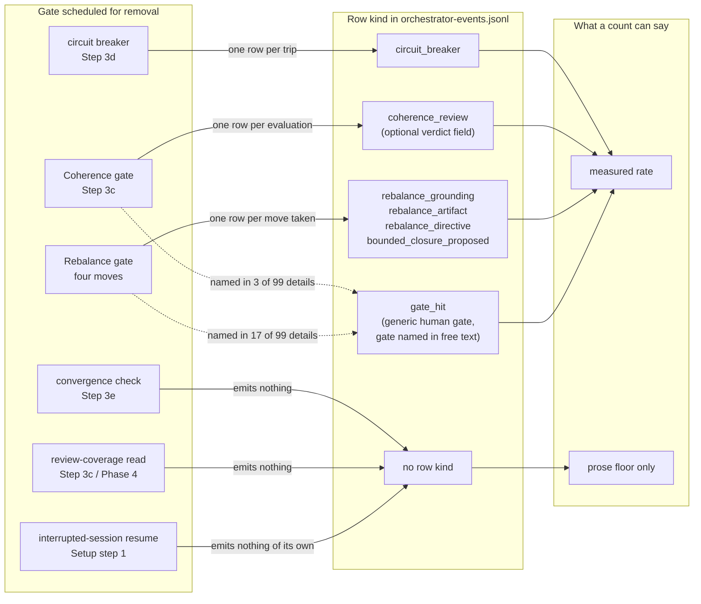

# Analysis: how often each gate scheduled for removal actually fired

**Date:** 2026-09-09 22:15
**Type:** Document Study (event-log measurement)
**Status:** Complete
**Requested by:** orchestrator, step A1 of `260909-1843_*_implementation-cut-fusion-to-a-working-minimum.md`
**Filed by:** analyst, Kai Stalmann <ks@qantr.com>

## Returns to the user

Two entries. Step C1 may not delete either on this step's authority.

**1. The per-Turn Coherence gate (`coherence_review`).** Above half in all three measured populations.

| Project | rows | population (`session_start` rows in scope) | rate |
|---|---|---|---|
| fusion | 87 | 94 | 92.6 % |
| krk | 54 | 57 | 94.7 % |
| unite-co-creator | 112 | 120 | 93.3 % |

In fusion it stays above half under two further denominators: 87 of 169 `turn_start` rows (51.5 %), and 45 of the 68 sessions that ran at least one Turn (66.2 %). **One reading puts it below:** 45 of all 94 sessions carry at least one such row (47.9 %). The gate is therefore above half under three of four denominators in fusion, and above half under the plan's own denominator in every project. Read the caveat under **What a `coherence_review` row does and does not say** before treating this as a measure of user interruption.

**2. The Rebalance gate, its four moves counted together, in krk only.** 29 rows against 57 sessions (50.9 %), and 23 of the 41 sessions that ran a Turn (56.1 %). Below half in fusion (33 of 94, 35.1 %), below half in unite-co-creator (38 of 120, 31.7 %), and below half in krk per Turn (29 of 131, 22.1 %). It is listed because the criterion is met in one of the three measured populations, not because it is met everywhere.

No other gate reaches half under any denominator in any project.

## Not measured, therefore not cleared

Three of the six gates named for removal have **no row kind at all**. Their firing rate is unmeasurable from the event log, which is not the same as zero, and the plan's rule is that nothing downstream may delete a gate this step has not measured.

- **The convergence check** (`agents/orchestrator.md` `### Step 3e: Convergence Check`). Emits nothing. It is the loop's ordinary exit.
- **The review-coverage read** (`agents/orchestrator.md` `### Step 3c: Review Coverage Read (per Turn)` and `### The review-coverage section is computed, not recalled`). Runs `bin/fusion-review-coverage` and prints to the session, writing no row. The same section states that no field for it goes into `agentstate.yaml` either, deliberately.
- **The interrupted-session resume procedure** (`agents/orchestrator.md`, Setup STEP 1, the interrupted-session check). A resumed session emits a second `session_start` naming the same history file (`agents/orchestrator.md`, Setup step 6, the `session.history_file` field), which is a distinguishable shape only when both rows carry `history_file`, and 45 of the 94 in-scope `session_start` rows carry no such field.

Each has a prose proxy below. A proxy is a count of what a model chose to write in a free-text `detail` field, so it is a floor and not a rate.

## Question

Before the cut deletes a set of gates and procedures, one question about them is answerable from data this project already holds: did each gate ever fire, and how often. This analysis answers it per gate, states the denominator with every numerator, names the command behind each pair, and separates the gates that have a machine-written row from the gates that have none.

It does not answer whether a gate is worth keeping. A gate that fired often may have been firing on noise, and a gate that never fired may have been unreachable rather than useless. Where the log or the code decides which case a zero is, this analysis says so.

## Scope

Three event logs, read in full. Every count below is scoped by each line's own `checkout` field, with an absent identifier read as the reading checkout's own, which is the rule `bin/fusion-events` implements and its header documents.

| Tree | HEAD | HEAD date | Branch | Tracking |
|---|---|---|---|---|
| fusion | `e8dbeb74` | 2026-09-09 22:11 +0200 | main | 7 ahead of origin/main |
| krk | `7f692708` | (working tree read) | main | in sync |
| unite-co-creator | `e337da91` | (working tree read) | main | in sync |

fusion and krk each carry one modified file, `fusion-workbench/orchestrator-events.jsonl`, which is the log this analysis reads: the figures include this session's own uncommitted rows.

**The scoping identifiers, and why each was chosen.**

| Tree | `.checkout-id` | scope applied | other checkouts present in the log |
|---|---|---|---|
| fusion | `5e8248d7` | `5e8248d7` plus absent | `1d05b0e4` (160 lines), `114caf11` (81 lines) |
| krk | `6c11b1f2` | `6c11b1f2` plus absent | none |
| unite-co-creator | none | whole file (`scope=all-checkouts`) | `ea89e647`, `6060498a`, `cb430046` |

unite-co-creator's workbench holds no `.checkout-id`, so this checkout's identifier does not resolve there and the count widens to every checkout in the file. That is the documented degradation `bin/fusion-events` names as `scope=all-checkouts`, and it is stated rather than hidden: unite's figures mix three checkouts and one other person, `Lay Flags <l@yfla.gs>`.

**A fourth candidate was excluded as a duplicate.** `/Users/k1/Projects/productive/fusion-news` is a second clone of `git@github.com:tenzoki/fusion.git`, not a separate project. Its log is the same union-merged file seen from checkout `1d05b0e4`. Counting it would count fusion twice.

**What was not used, and why.** `bin/fusion-events` has three subcommands, `presence`, `turns` and `dispatches`. None counts a gate row, so no gate figure here could be taken with it. What was reused is its reading rule, applied identically, and its malformed-line accounting as a cross-check (below).

## Findings

### The map from gate to row kind



The graph is bipartite by construction and carries no cycle. The two dotted edges are the one place a gate reaches a row kind it does not own: `gate_hit` is the generic row for any stop-and-ask, and which gate a given `gate_hit` belongs to is recoverable only from its free-text `detail`, so those two counts are text matches and are labelled as such in the table.

### The per-gate table, fusion

Population: **94** `session_start` rows in scope. Secondary denominators where a gate is per-Turn: **169** `turn_start` rows in scope, and **68** sessions that ran at least one Turn.

Every count below was produced by one command of this shape, with `EXPR` replaced by the row's Filter column:

```bash
jq -R 'fromjson? // empty' fusion-workbench/orchestrator-events.jsonl \
  | jq -r 'select((.checkout // "5e8248d7")=="5e8248d7") | select(EXPR) | .ts' | wc -l
```

| Gate | Filter (`EXPR`) | Numerator | Denominator | Rate | Reading |
|---|---|---|---|---|---|
| Circuit breaker, all conditions | `.event=="circuit_breaker"` | 8 | 94 | 8.5 % | fired in 8 sessions of 94, and in 8 of the 68 that ran a Turn (11.8 %) |
| Coherence gate, evaluated | `.event=="coherence_review"` | 87 | 94 | 92.6 % | the gate ran; 51.5 % per Turn, 45 of 68 Turn-running sessions carry one |
| Coherence gate, verdict `review-needed` | `.event=="coherence_review" and .verdict=="review-needed"` | 8 | 94 | 8.5 % | the gate diverted the session; readable on only 32 of the 87 rows |
| Coherence gate at a human gate | `.event=="gate_hit"`, detail matching `coherence` | 3 | 94 | 3.2 % | text match on a generic row, not a machine attribution |
| Rebalance, four moves together | `.event` matching `^rebalance_` or `bounded_closure_proposed` | 33 | 94 | 35.1 % | 27 sessions of 94 carry at least one (28.7 %) |
| Rebalance, revise Grounding | `.event=="rebalance_grounding"` | 12 | 94 | 12.8 % | |
| Rebalance, revise Artifact | `.event=="rebalance_artifact"` | 15 | 94 | 16.0 % | |
| Rebalance, revise Directive | `.event=="rebalance_directive"` | 2 | 94 | 2.1 % | the rarest move measured anywhere |
| Rebalance, bounded closure proposed | `.event=="bounded_closure_proposed"` | 4 | 94 | 4.3 % | |
| Rebalance at a human gate | `.event=="gate_hit"`, detail matching `rebalance` | 17 | 94 | 18.1 % | text match on a generic row |
| Convergence check | none exists | unmeasurable | 94 | n/a | 12 `turn_end` details name a convergence, a floor |
| Review-coverage read | none exists | unmeasurable | 94 | n/a | 18 details across 6 row kinds mention coverage, a floor |
| Interrupted-session resume | none of its own | unmeasurable | 94 | n/a | 8 `session_start` details name a resume, a floor |

The three proxy figures come from the same pipeline with `grep -ci` on `.detail` in place of `wc -l`, for example:

```bash
jq -R 'fromjson? // empty' fusion-workbench/orchestrator-events.jsonl \
  | jq -r 'select((.checkout // "5e8248d7")=="5e8248d7") | select(.event=="session_start") | .detail // ""' \
  | grep -ciE 'resum|interrupted'
```

### The circuit breaker, condition by condition

Eight rows, and the eight are enumerable rather than summarised. Read from the `detail` of each:

| Date | Condition |
|---|---|
| 2026-08-02 | net-negative progress, two consecutive Turns |
| 2026-08-04 | max Turns reached (5/5) |
| 2026-08-10 | net-negative progress, two consecutive Turns |
| 2026-08-11 | max Turns reached (5/5) |
| 2026-08-13 | max Turns reached (5/5) |
| 2026-08-14 | net-negative progress, three consecutive Turns |
| 2026-08-24 | net-negative progress, two consecutive Turns |
| 2026-09-06 | zero autonomous progress at loop 4 of a user cap of 10 |

So the **Max-Turns** breaker specifically fired 3 times in 94 sessions (3.2 %); net-negative progress 4 times (4.3 %); zero autonomous progress once. Every one of the eight is inside a 35-day window from 2026-08-02 to 2026-09-06, and none is earlier, in a log whose first `session_start` is 2026-07-06.

**A zero that is not a zero, verified.** In krk the breaker fired 4 times in 57 sessions and in unite-co-creator twice in 120. The Max-Turns condition is reachable only when a session actually spends its budget, and the low rates are consistent with sessions ending for other reasons rather than with the condition being unreachable. That is an inference from the condition's shape, not a reading of the log: nothing in the log records a Turn budget that was approached and not reached.

### What a `coherence_review` row does and does not say

This is the single most consequential reading in the analysis, and the plan's criterion and the plan's label disagree about it.

A `coherence_review` row records that the gate **was evaluated**. It does not record that the gate stopped the session and asked the user. The rows that record the latter are the verdict `review-needed` (8 in fusion) and the Rebalance rows the verdict feeds into (33). So:

- **The gate ran in most Turns.** 87 rows against 169 Turns.
- **It returned to the user in roughly one Turn in twenty.** 8 `review-needed` verdicts against 169 Turns is 4.7 %, and the verdict field is readable on only 32 of the 87 rows, so 8 of 32 (25 %) is the rate among rows that can be read at all. The true rate lies between those two figures and this log cannot narrow it further.

The plan's head-list criterion is mechanical: any gate whose **firing rate** exceeds half its population goes on the list, labelled **returns to the user**. The coherence gate's firing rate does exceed half its population, so it is on the list. Its rate of returning to the user does not exceed half under any denominator. Both facts are stated here rather than one of them resolved silently, because which of the two the protection is meant to attach to is the user's call and not the analyst's.

`inference:` the 55 rows carrying no `verdict` field predate the field rather than record a missing verdict. The first row carrying one and the first row of any kind share a timestamp, 2026-07-16T20:25:09, so the field was present from the start and its absence on later rows is a writer that omitted it. That weakens the "8 of 32" reading: the omitting writer may have omitted preferentially on the ordinary `ok` verdict, which would bias the readable subset toward `review-needed` and put the true rate below 25 %.

### The same gates across three projects

Rates against each project's own `session_start` population, on the plan's denominator.

| Gate | fusion (94) | krk (57) | unite (120) |
|---|---|---|---|
| Circuit breaker | 8 (8.5 %) | 4 (7.0 %) | 2 (1.7 %) |
| Coherence gate evaluated | 87 (92.6 %) | 54 (94.7 %) | 112 (93.3 %) |
| Coherence verdict `review-needed` | 8 (8.5 %) | 3 (5.3 %) | 6 (5.0 %) |
| Rebalance, four moves | 33 (35.1 %) | 29 (50.9 %) | 38 (31.7 %) |
| Rebalance, revise Directive | 2 (2.1 %) | 0 (0.0 %) | 5 (4.2 %) |
| Rebalance, bounded closure | 4 (4.3 %) | 11 (19.3 %) | 5 (4.2 %) |
| Convergence check | unmeasurable | unmeasurable | unmeasurable |
| Review-coverage read | unmeasurable | unmeasurable | unmeasurable |
| Resume procedure | unmeasurable | unmeasurable | unmeasurable |

**The one zero in this table, and which case it is.** krk logged no `rebalance_directive` in 57 sessions. It is not an unreachable branch: fusion logged 2 and unite 5, so the move is reachable in a project that uses the same orchestrator. `inference:` krk is the youngest of the three, first commit 2026-08-02 per the prior size analysis, and revising a Directive is a move a young Circle portfolio has less occasion to make. The log does not decide this, and the count is a genuine zero rather than an absent measurement.

**krk's bounded closure stands out.** 11 rows in 57 sessions against 4 in fusion's 94. `speculation:` a consuming project reaches Bounded Closure more often than the tool's own repository because its Circles are scoped to deliverables that can be partly met, while fusion's are scoped to changes that either land or do not.

### Corroboration against two prior measurements

Decision `260827-1210_*_do-the-rare-orchestrator-flows-stay-in-every-sessions-context.md` `## Question` reports, over the same log at an 83-session population: the resume ran in 7, and the Rebalance events were 13 Revise-Artifact, 8 Revise-Grounding, 1 Revise-Directive, 4 Bounded-Closure. This analysis, at a 94-session population thirteen days later, reads 8, 15, 12, 2 and 4. Every figure has grown or held, none has shrunk, and the ratios hold. That is independent confirmation that the per-checkout scoping used here reproduces the scoping used then.

`agents/orchestrator.md`, Setup STEP 1, carries the resume figure as "7 of 83 measured sessions". At this head the proxy reads 8 of 94. The prompt's number is stale by one against a population grown by eleven, which is within the drift a stamped figure is allowed and is not filed as a defect.

### The population, and an ambiguity in how the step names it

The step directs that the population be "the `session_start` rows carrying a session identifier". Read literally that is the rows carrying a `session_id` field, and in scope there are **11** of them, not 94. The field arrived with v10.8.0 and the earliest in-scope row carrying it is from 2026-08-26, while every gate numerator spans the log from 2026-07-06. Dividing a numerator taken over five months by a denominator taken over two weeks is a category error, and it would multiply every rate in this analysis by about 8.5.

The plan's own Current State resolves it: it reports the gate counts "against a `session_start` population of 97 before per-checkout scoping", and 97 is every `session_start` row in the file including those with no `session_id`. This analysis therefore uses all in-scope `session_start` rows, 94, and reports 11 here so the alternative reading is visible rather than buried. Filed as a defect against the step's wording.

### The log is not fully well-formed, and one reader hides it

unite-co-creator's log carries 3 886 lines of which 4 are not parseable JSON: lines 1512 to 1515, all four written in the same second, 2026-08-05T07:58:45 and :46, each a complete object missing only its closing brace. One append lost four braces.

The consequence is not the four lost rows. It is that `jq` reading the file as a stream **aborts at the first of them and exits reporting what it had**, which is 1 511 objects of 3 886. A first pass of this analysis took its unite figures that way and was wrong by a factor of two and a half before the parse error was noticed. `jq -R 'fromjson? // empty'` reads the same file per line and returns 3 882.

**Verified against the shipped reader.** `bin/fusion-events presence` run in that tree prints `fusion-events: 4 line(s) of the log were not a JSON object and were skipped.` on stderr and exits 0, which matches the per-line count exactly. `hooks/lib/events-query.ts` `parseLog` parses per line and counts what fails. So fusion's own reader is correct and reports the shortfall; the hazard is to any hand-written or future consumer that reaches for streaming `jq`. Filed as a defect.

fusion's own log and krk's each parse cleanly: 3 289 lines and 3 289 objects, 2 419 and 2 419. Both files were being appended to by live sessions while this analysis ran; every gate figure above was re-taken at the end and none had changed, since the rows this session added are `task_start` and `task_done`.

## Implications

**For step C1, three things follow.**

The Coherence gate is on the protected list under the plan's own criterion, in every project measured. Whether the protection was meant for a gate that *runs* often or for a gate that *interrupts* often is a distinction the plan's criterion and its label answer differently, and it needs a ruling before C1 acts on the list.

The Rebalance gate is protected in krk and not in fusion or unite. A cut decided on fusion's own log alone would have cleared it. Whichever way that is decided, it should be decided knowing that the three populations disagree.

Three of the six gates cannot be cleared by this step at all, because they leave no trace. That is a property of the gates, not of the measurement: the convergence check, the review-coverage read and the resume procedure were each built to do their work and say nothing. Any argument for deleting them has to come from somewhere other than this log.

**For the evidence chain generally.** The plan's Current State asserts that the log "carries every gate this cut removes as its own row kind, so step A1's read is a count and not an inference". Measured against the tree, half of the six named gates have no row kind, and for those three the read is exactly the inference the sentence says it is not. The rest of the plan does not depend on that sentence, but the sentence is what a later reader would rely on to decide the measurement was complete.

**A residual this step cannot close.** A gate that fired records the firing and not what it prevented. Nothing here says whether the 87 coherence evaluations were worth their cost, or whether the 2 Directive revisions were the two that saved a Circle. The plan's `**Decidability:**` line already says this and this analysis does not weaken it: what has been substituted is a countable question, and the countable answer is above.

## Recommendations

1. **Rule on which quantity the head list protects** before C1 runs: the gate's evaluation rate, or its rate of returning to the user. The two differ by a factor of about eleven on the coherence gate. Route: user, at the next gate. This is a decision, and the reading is set out under **What a `coherence_review` row does and does not say**.
2. **Decide whether a gate protected in one consuming project is protected in fusion's cut.** The Rebalance gate is the live instance. Route: user.
3. **Do not clear the convergence check, the review-coverage read or the resume procedure on this step's authority.** They were not measured. Route: whoever drafts C1.
4. **Correct the Current State sentence** claiming every removed gate has its own row kind. Route: planner, against the defect filed below.

## Filed Issues

- `260909-2215_*_the-plans-current-state-says-every-removed-gate-has-its-own-row-kind-and-three-of-six-have-none.md`
- `260909-2215_*_step-a1s-denominator-names-a-field-eleven-rows-carry-and-the-plans-own-figure-uses-ninety-four.md`
- `260909-2215_*_four-truncated-lines-make-a-streaming-jq-read-of-the-event-log-stop-at-forty-percent.md`

## Sources

- `fusion-workbench/orchestrator-events.jsonl` at `e8dbeb74`, 3 289 lines at read time, read per line
- `/Users/k1/Projects/productive/krk/fusion-workbench/orchestrator-events.jsonl` at `7f692708`, 2 419 lines
- `/Users/k1/Projects/productive/unite-co-creator/fusion-workbench/orchestrator-events.jsonl` at `e337da91`, 3 886 lines, 3 882 parseable
- `agents/orchestrator.md`: Setup STEP 1 (resume), `## Phase 2: Turn Loop` (the Turn number's only record), `### Step 3c: Review Coverage Read (per Turn)`, `### Step 3e: Convergence Check`, `### The review-coverage section is computed, not recalled` (no coverage field in the state file)
- `bin/fusion-events` header, the scoping rule and the `scope=all-checkouts` degradation
- `hooks/lib/events-query.ts` `parseLog`, the per-line parse and the malformed count
- `260909-1843_*_implementation-cut-fusion-to-a-working-minimum.md`, Current State and step A1
- `260827-1210_*_do-the-rare-orchestrator-flows-stay-in-every-sessions-context.md` `## Question`, the prior 83-session measurement
- `260827-1120_*_how-often-does-the-review-pass-run.md`, the coverage read's cadence
- `260909-1047-size-versus-bookkeeping-across-three-projects.md`, the three-project evidence chain this analysis extends

## Open Questions

- [ ] Which quantity does the head list protect, evaluation or user-return? (Recommendation 1)
- [ ] Does a gate protected in a consuming project bind fusion's own cut? (Recommendation 2)
- [ ] Is there any surviving record, outside this log, that could measure the convergence check, the coverage read or the resume? Nothing was found in `agentstate.yaml`, whose review-coverage field was deliberately never added (`agents/orchestrator.md` `### The review-coverage section is computed, not recalled`).
