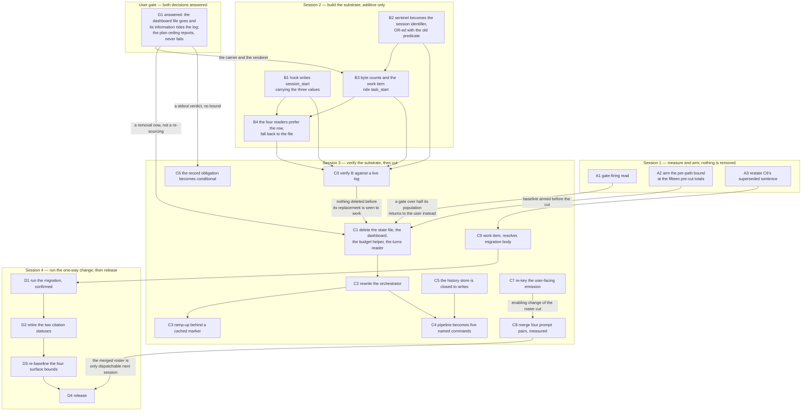
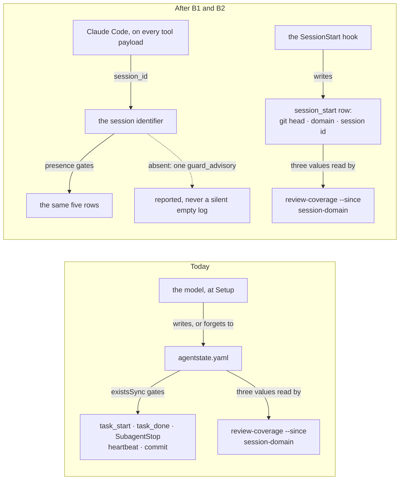

# Implementation Plan: cut fusion to a working minimum

**Date:** 2026-09-09
**Status:** In Progress (session 3 running: C0, C1, C2, C5 done, plus C1b added at a user ruling)
**Spec:** `260909-1615_*_spec-cut-fusion-to-a-working-minimum.md`, C1 to C9. Later rulings bind and one supersedes the spec's text: `260909-1808_*_may-a-helper-compute-an-order-over-work-items-after-the-portfolio-layer-goes.md` (option 3) and the two records this plan files, `260909-1843_*_which-sentinel-replaces-the-state-files-existence-as-the-gate-on-machine-written-rows.md` and `260909-1843_*_what-are-the-conditional-rule-emissions-keyed-on-once-they-are-not-keyed-on-the-agent-name.md`.
**Amended:** 2026-09-09, against the two answers at gate G1. `260909-1700_*_does-the-live-dashboard-file-survive-a-session-with-no-turns.md`: the dashboard file does not survive and its information does, which added one field to step B3, one renderer to step B4, one check to step C0, and turned C1's re-sourcing into a removal. `260909-1700_*_does-the-plan-size-ceiling-fail-hard-or-only-report.md`: report only, which resolved step C6's conditional to a stdout verdict. No step was renumbered and no session boundary moved.

**Decidability:** The load-bearing question of this whole cut — *does removing this ceremony cost the project anything it needs?* — is **not decidable from the inputs any mechanism here has**, and it cannot be made decidable by measuring harder. Every figure in the evidence chain counts bytes, steps or rows, which is the cost; the benefit would be a counterfactual about work not done worse, and the two traces that would carry it leave nothing behind. A history file that was read leaves no record of the read, and a gate that fired records the firing and not what it prevented. So the mechanism changes, per `rules/critical-stance.md` §4: this plan does not decide that question and no step is justified by an answer to it. It substitutes two questions that *are* decidable from inputs the project holds. **Did each removed gate ever fire, and how often** — countable in `orchestrator-events.jsonl`, and step A1 counts it before any gate is deleted. **Does the cut hold** — countable per dispatch path by the C8 bound, armed in step A2 at the fifteen pre-cut totals, which is the one thing the 2026-08-27 cut lacked and the reason it lasted thirteen days. What is left undecided stays undecided and is carried as risk, not as a claim: the removals are recoverable from git, and the single irrecoverable change, the workbench migration in D1, is confirmed by the user before a file moves.

## Directive

The spec states it. Nothing is restated here.

## Current State

Measured at `a1ecf86e`, and every figure below is a command's output rather than a reading of prose.

- Fifteen agent prompts, 417 145 bytes (`wc -c agents/*.md`); fourteen skill bodies, 259 786 bytes; nineteen rule files, 231 746 bytes; `CLAUDE.md`, 93 432 bytes. These reproduce the spec's C8 baseline table exactly, so the table is still the arming reference at this head.
- `orchestratorSessionInFlight(root)` in `hooks/lib/orchestrator-events.ts` is one `existsSync` on `agentstate.yaml` and gates five machine-written surfaces.
- `orchestrator-events.jsonl` carries every gate this cut removes as its own row kind, so step A1's read is a count and not an inference: `gate_hit` 102, `coherence_review` 93, `circuit_breaker` 8, `rebalance_grounding` 12, `rebalance_artifact` 16, `rebalance_directive` 2, against a `session_start` population of 97 before per-checkout scoping.
- `bin/fusion-rules` selects seven conditional emissions with seven `case` statements on the agent name (lines 209 to 285).

**The affected surface, derived against the tree rather than listed by hand** (this is the review's SF-19). Each cell is the output of one `grep -rln` over `bin/ hooks/ agents/ skills/ rules/`.

| Removed thing | `bin/` | `hooks/` | `rules/` |
|---|---|---|---|
| `agentstate.yaml` | `fusion-session-mark`, `fusion-session-domain`, `fusion-review-coverage`, `fusion-cadence-anchor`, `fusion-events`, `fusion-commit-lock`, `monitor` | `lib/orchestrator-events.ts`, `lib/state-file.ts`, `lib/review-coverage.ts`, `lib/staging-drift.ts`, `session-id.ts`, `turn-budget.ts`, `tracker.ts` | `fusion-workbench-conventions.md`, `commit-lock.md`, `bounded-dispatch.md`, `orchestrator-resume.md`, `orchestrator-rebalance.md`, `workbench-tracking.md` |
| `.active-circle` | `fusion-paths`, `fusion-rules`, `fusion-cadence-anchor` | `lib/review-coverage.ts`, `lib/staging-drift.ts` | `fusion-workbench-conventions.md`, `circle-records.md`, `workbench-path-resolution.md`, `workbench-tracking.md`, `agent-setup.md`, `bounded-dispatch.md`, `orchestrator-rebalance.md` |
| `orchestrator-live.md` | `monitor`, `fusion-cadence-anchor` | `lib/staging-drift.ts` | `fusion-workbench-conventions.md`, `workbench-tracking.md` |
| `$OUT_HISTORY` | `fusion-paths` | — | `fusion-workbench-conventions.md`, `workbench-path-resolution.md` |

Twelve of the fourteen skill bodies and thirteen of the fifteen agent prompts name at least one of the four; the two exceptions in each set are not worth enumerating because every prompt and body is opened anyway by C7 or C2/C3.

**The gates that go red on the way**, derived by grepping `hooks/lib/__tests__/` for each removed surface. Thirty-two test files reference at least one. They fall in three classes, and the class decides who fixes them and when:

- **Fail on the tree, no baseline, must land in the same commit as the change:** `workbench-citation-lint`, `plan-stopping-section-lint`, `committed-dist`, `derivable-enumerations-lint`, `reference-resolution-lint`, `path-literal-lint`, `marker-format-lint`, `glob-nomatch-lint`.
- **Pin a mechanism this cut removes, so the test goes with it:** `turn-budget-lint`, `playmaker-backlog-mandate-lint`, `portfolio-citation-form-lint`, `bound-agent-set`, `dispatch-bound-lint`, `review-coverage-mandate`, `executor-verification-report-lint`, `record-counts-measurement`.
- **Assert helper behaviour that changes:** `fusion-paths`, `fusion-events`, `fusion-session-domain`, `review-coverage`, `staging-drift`, `rules-emission-golden`, `surface-growth-bound`, `context-manifest`, `domain-cascade`, `domain-cascade-order-lint`, `commit-message-path`, `citation-grammar-boundaries`, `citation-sweep`, `fusion-citation-check`, `sentence-identifier-containment`, `provenance-header-lint`.

## Approach

Four sessions, because two of this project's own mechanisms make a single session impossible and both are documented in `CLAUDE.md` under the release process. A session reads its agent and skill roster once at start from the installed plugin copy and never re-reads it, so **the session that rewrites `agents/*.md` cannot dispatch the roles it wrote**. Hooks and `bin/` helpers resolve the same way, so **the session that changes a hook cannot observe the changed hook fire**. `bin/monitor` has the same shape with one extra hop, and the amendment turns on it: the workbench's copy is written at Setup Step 0b from the installed plugin, so **a monitor changed in session 2 reaches no workbench until `fusion --update` and the next session's Setup re-copies it**. The monitor change therefore falls in session 2 and is first observable in session 3, at step C0, which is the last moment before C1 deletes what it falls back to. Each boundary below is `fusion --update` plus a restart, and the plan says at each step which session it falls in rather than leaving it to be discovered at the last step.

Within that, one sequencing rule governs and it is the spec's: **nothing is deleted before what replaces it has been seen to work.** The substrate that replaces `agentstate.yaml` and `orchestrator-live.md` is built in session 2 while both files still exist, verified against a live log at the top of session 3, and only then removed. The C8 bound is armed in session 1 at the pre-cut totals, before a byte is cut, because a baseline armed at the cut absolves the cut.



**The sentinel replacement, which is the one design decision inside C1 that is not a deletion.** Answered in `260909-1843_*_which-sentinel-replaces-the-state-files-existence-as-the-gate-on-machine-written-rows.md`, option 2.



## Implementation Steps

### Session 1 — measure and arm. Nothing is removed.

1. [DONE] **A1: read how often each removed gate fired**
   - Executor: `analyst`
   - Files: reads `fusion-workbench/orchestrator-events.jsonl` and the two other project logs the user names; writes one analysis file to `$OUT_ANALYSIS`
   - Changes: count, per checkout via the `checkout` field so union-merged foreign lines are excluded, the firings of each gate C1 removes — the Max-Turns circuit breaker (`circuit_breaker`), the convergence check, the per-Turn coherence gate (`coherence_review`, `gate_hit`), the Rebalance gate (`rebalance_grounding`, `rebalance_artifact`, `rebalance_directive`), the review-coverage read and the resume procedure. Denominator is the `session_start` rows carrying a session identifier, stated with the count. Where a gate has no row kind, say so and report it as unmeasurable rather than as zero.
   - Dependencies: none
   - Verification: the analysis file names every gate scheduled for removal, each with a numerator, the denominator and the command that produced both. Any gate whose firing rate exceeds half its population is listed in the file's head as **returns to the user**, and step C1 may not delete it.

2. [DONE] **A2: arm the per-path byte bound at the pre-cut totals**
   - Executor: `coder`
   - Files: `hooks/lib/__tests__/rules-emission-golden.test.ts`, `hooks/lib/__tests__/fixtures/`
   - Changes: add a bound over the per-dispatch-path total — agent prompt plus emitted plugin rules plus `CLAUDE.md` — with the fifteen totals of the spec's C8 table as its baseline map and zero head-room. Reuse `helpers/growth-bound.ts` `growth()`; do not write second arithmetic. The failure text names the path, the component that grew, and the sentence that a shared component's addition must be offset once in a shared component or once per path, and states that no re-baselining event covers a growing `CLAUDE.md`.
   - Dependencies: none
   - Verification: three replays, all three required. Against the tree at `bb341360` the bound is green (total equals baseline). Replayed over 2026-08-27 to 2026-09-09 it goes red while the existing always-on core bound stays green over the same window. Replayed over a window in which no component grew it stays green. Each replay is a `git stash`-free checkout into a scratch worktree and one `npx vitest run rules-emission-golden`, and the three outputs are pasted into the commit message.

3. [DONE] **A3: restate the sentence the later ruling superseded**
   - Executor: `coder`
   - Files: the spec, `260909-1615_*_spec-cut-fusion-to-a-working-minimum.md`
   - Changes: in C6, replace `Order is the user's and is not computed.` with `Order is computed from confirmed prerequisite edges and reported; the user overrides it where he wants to.` and add one sentence to C6's `**Decisions made:**` recording that the work-item file carries a machine-readable dependency field from its first version, citing `260909-1808_*_may-a-helper-compute-an-order-over-work-items-after-the-portfolio-layer-goes.md`. Change nothing else in the spec. Do not plan or build the helper that computes the order; that is the other Circle's work.
   - Dependencies: none
   - Verification: `grep -c "is not computed" <spec>` returns 0, and the cited record's basename appears in C6.

**User gate G1 — answered on 2026-09-09; both records carry their `Answered:` line.**

`260909-1700_*_does-the-live-dashboard-file-survive-a-session-with-no-turns.md`: the file does not survive and its information does. The ruling's own measurement bounds the work — the ETA, the event list and the warnings panel read the two sources that survive, so what needs a carrier is the dashboard panel and the state panel alone. Both land in session 2, additive, while `orchestrator-live.md` still exists: the carrier in B3, the renderer in B4, the check in C0. C1 is then left with a removal and nothing to re-source.

`260909-1700_*_does-the-plan-size-ceiling-fail-hard-or-only-report.md`: report only, never a hard failure. Step C6 adds a stdout verdict and no test.

Neither record is realised yet. Each transitions to `_i_` when the step that carries it commits: B4 for the first, C6 for the second.

### Session 2 — build the substrate. Every step is additive; nothing is deleted.

4. [DONE] **B1: the SessionStart hook writes the `session_start` row**
   - Executor: `coder`
   - Files: `hooks/session-start.ts`, `hooks/lib/orchestrator-events.ts`
   - Changes: emit one `session_start` row per session, carrying `session_id` from the payload, `person` and `checkout` by the module's existing env-first rule, `git_head_at_start` from `hooks/lib/git.ts`, and `domain` by the existing `hooks/lib/domain-cascade.ts` resolution. Written once per session, keyed on the session identifier so a second SessionStart in the same session writes no duplicate. The model-written `session_start` row stays for now; the two are distinguishable by a `writer` field.
   - Dependencies: none
   - Verification: after `fusion --update` and a restart, `grep session_start fusion-workbench/orchestrator-events.jsonl | tail -1` shows a row carrying all five fields with `writer` naming the hook. Falls in session 3 (step C0).

5. [DONE] **B2: the sentinel becomes the session identifier**
   - Executor: `coder`
   - Files: `hooks/lib/orchestrator-events.ts`, `hooks/guard.ts`, `hooks/tracker.ts`, `bin/fusion-commit-lock`
   - Changes: replace `orchestratorSessionInFlight(root)` with a predicate that is satisfied when a workbench root was found and the payload carries a session identifier, **disjoined with the existing `existsSync` check** so that this step can remove nothing. An absent identifier emits one `guard_advisory` naming the condition and the row is written with `session_id` absent, per the module's own absent-key rule. Rewrite the module header: the gate's meaning changes from orchestrator-scoped to project-scoped, and the header is where that is authored.
   - Dependencies: none
   - Verification: `hooks/lib/__tests__/guard-state-shape.test.ts` and the guard harness gain a case with no `agentstate.yaml` and a payload session id, asserting the row is written; and a case with neither, asserting one advisory and no silent drop. `npm test` green.

6. [DONE] **B3: the byte counts and the claimed work item ride the `task_start` row**
   - Executor: `coder`
   - Files: `hooks/lib/orchestrator-events.ts`, `hooks/guard.ts`, a new `hooks/lib/dispatch-bytes.ts`
   - Changes: on each dispatch, add `bytes_prompt`, `bytes_rules`, `bytes_claude_md` and `bytes_total` to the `task_start` row. The two file counts are `statSync`. The rule count runs `bin/fusion-rules <agent>` **once per (agent, plugin root, newest mtime under the rule directories)** and memoises the result in `.guard-state/rule-sizes.json`; there is no second implementation of the emission list, which is what `rules/critical-stance.md` §2 forbids. A helper that is absent or non-zero makes `bytes_rules` and `bytes_total` **absent keys, never zero**, and emits one advisory. Per-project arming: the first row a project writes records its own totals under `.guard-state/byte-baseline.json`; later rows carry `bytes_delta` against it, and where none is armed the reader says so rather than comparing against fusion's.

     **The work item, per G1's first answer, and what "pending" still means.** After C1 removes the Turn loop and the work queue and C9 makes an item a file with its own `**Status:**` and `**Claim:**`, no session-scoped pending set exists at all. Two things stay renderable: the task now running, and the item the session claimed. The first is already carried in full by the row this step extends (`agent`, `detail`, and the `task` identifier that pairs a start with its done), so it gets no new field. The second is the only addition: `task_start` gains `work_item`, the basename named by a `**Work-item:**` line in the dispatch prompt, read from the payload the module already reads `description` out of. Absent when the dispatch names none: an absent key, never an empty string. **The hook does not scan the backlog store for claimed items.** That read returns a set, and a set rendered in a panel is the work queue coming back through the monitor's door; the row cites one basename and the item file stays the only authority on status and claim. The field is populated from session 3, when C2 puts the line in the orchestrator's dispatch prompt; through session 2 it is absent, which is a value the renderer must already handle.
   - Dependencies: B2 (the row must be written before it can carry fields)
   - Verification: measure the added cost and state it. `hyperfine` or ten timed dispatches, cold cache and warm, reported in the commit message; the acceptance criterion is that the warm path performs no subprocess, provable by `strace`-free means — assert in a test that the second call with an unchanged mtime spawns nothing, by counting `execFileSync` calls through a stub. Separately: a dispatch whose prompt carries a `**Work-item:**` line writes `work_item` carrying that basename, and one whose prompt carries none writes no `work_item` key at all — asserted on the emitted JSON, not on a rendered string.

7. [DONE] **B4: the four readers prefer the row and fall back to the file**
   - Executor: `coder`
   - Files: `bin/fusion-review-coverage`, `hooks/lib/review-coverage.ts`, `bin/fusion-session-domain`, `hooks/lib/domain-cascade.ts`, `bin/fusion-staging-drift`, `hooks/lib/staging-drift.ts`, `bin/monitor`
   - Changes: `--since` with no argument resolves `git_head_at_start` from the newest hook-written `session_start` row for this checkout, falling back to `agentstate.yaml` while it exists. `bin/fusion-session-domain` gains `source=event-log` ahead of `source=agentstate` ahead of `source=default`; its no-workbench exit 3 is unchanged. `bin/fusion-staging-drift` keeps classifying `agentstate.yaml` as in-flight and gains nothing here.

     **`bin/monitor` is the fourth reader and the renderer G1's first answer requires.** Its dashboard panel renders from `orchestrator-events.jsonl` instead of `orchestrator-live.md`: the running task is the newest `task_start` for this checkout whose `task` identifier has no matching `task_done`, shown in the format that panel already uses; beside it, that row's `work_item` when it carries one, and the line naming that the dispatch named none when it does not. The counters are counts over the same log, scoped to the session identifier: dispatches from paired `task_start`/`task_done` rows, commits from `commit` rows. The error counter goes: `task_error` is model-written and C2 removes the procedure that emits it, so a zero there would be a figure nobody takes. **Nothing renders under Up Next.** No pending set exists after C1 and C9, so the panel says so in one line and shows no list; an empty list standing where a queue used to be would claim a state that is not being read. Its `/api/state` panel renders the newest hook-written `session_start` row for this checkout (session identifier, git head, domain, person, checkout, start time), which is what `agentstate.yaml`'s `session:` block carried that anything read. Both panels keep the two files as fallbacks, so this step removes nothing.
   - Dependencies: B1, and B3 for the `work_item` field
   - Verification: `npx vitest run review-coverage fusion-session-domain staging-drift` green; and, run by hand against this repository with `agentstate.yaml` present, `bin/fusion-review-coverage` returns the identical range it returned before the change (diff the two outputs). The monitor's own verification is **not** available in this session: Setup Step 0b copies the monitor into the workbench from the installed plugin, so the changed file cannot be served until `fusion --update` and the next session's Setup. It is checked at step C0.

### Session 3 — verify the substrate against a live log, then cut.

8. [DONE] **C0: verify session 2 before anything is deleted**
   - Executor: `coder`
   - Files: none; writes its result into the commit message of step C1
   - Changes: none. Read the log this session is writing. Confirm the hook-written `session_start` row exists and carries all five fields; confirm every `task_start` in this session carries the four byte fields, and `work_item` wherever the dispatch named one; confirm `bin/fusion-review-coverage` and `bin/fusion-session-domain` return the same answers with the state file deliberately renamed away and restored; confirm the workbench monitor is the copy this session's Setup re-copied (`shasum` against `$FUSION_PLUGIN_ROOT/bin/monitor`) and that, with both files renamed away, it renders the running task, the named work item, the counters and the session fields from the log alone, no panel dark and no empty list under Up Next.
   - Dependencies: B1, B2, B3, B4
   - Verification: is the step. If any of the five fails, session 3 stops here and the failure returns to step B; **no deletion in C1 may proceed on a partial pass.** The monitor is the fifth and can be checked nowhere earlier, because the workbench copy of it is written at Setup from the installed plugin.

9. [DONE] **C1: delete the state file, the dashboard, the budget and the turns reader**
   - Executor: `coder`
   - Files: `hooks/lib/state-file.ts` (deleted), `hooks/lib/orchestrator-events.ts`, `hooks/turn-budget.ts` (deleted), `bin/fusion-turn-budget` (deleted), `bin/fusion-events`, `hooks/lib/events-query.ts`, `hooks/lib/config.ts`, `bin/monitor`, `bin/fusion-session-mark`, `bin/fusion-cadence-anchor`, `rules/workbench-tracking.md`, `rules/orchestrator-resume.md` (deleted), `rules/orchestrator-rebalance.md` (deleted), `rules/commit-lock.md`, `README-hooks.md`
   - Changes: drop the `existsSync` disjunct from B2's predicate; stop writing `agentstate.yaml` and `orchestrator-live.md`; remove `bin/fusion-events turns` and its `events-query.ts` half rather than porting it; retire `orchestrator.maxTurns` as a **leaf**, which the existing `RETIRED_TOP_LEVEL_KEYS` mechanism cannot express, so add a leaf-scoped retirement list whose advisory names the leaf and says the setting is not read; remove the four dead entries from `rules/workbench-tracking.md`. In `bin/monitor`, remove the two fallback halves and nothing else: the `orchestrator-live.md` reader, the `/api/state` file path, and the two placeholder messages that name those files. **Nothing is re-sourced in this step** — B4 landed the log-sourced panels a session earlier, and this deletes what they fell back to, which is all G1's first answer leaves here. **A gate A1 reported over half its population is not deleted here** and stays until the user has answered.
   - Dependencies: C0, A1, A2, G1
   - Verification: `npm test` green after `npm run build`; `turn-budget-lint.test.ts` and `record-counts-measurement.test.ts` are deleted with their subjects; a full session runs, dispatches, commits and ends with `test ! -e fusion-workbench/agentstate.yaml && test ! -e fusion-workbench/orchestrator-live.md` true throughout and `wc -l` on the event log rising by the expected rows, with the monitor's two panels populated throughout that session and neither removed file present. A project setting `orchestrator.maxTurns` produces exactly one advisory naming the leaf.

10. [DONE] **C2: rewrite the orchestrator prompt**
    - Executor: `coder`
    - Files: `agents/orchestrator.md`
    - Changes: replace the phase procedure with a dispatch loop — read the task, dispatch, commit, repeat until the user stops. No numbered phase, no Turn, no budget, no circuit breaker, no convergence check, no coherence gate, no Rebalance, no resume, no queue. Keep: dispatch, the commit procedure and its lock, the machine-written rows it no longer writes by hand, the `tools:` allowlist including `AskUserQuestion`, and the four backlog operations as edits the orchestrator performs at the user's word with no dispatch. Add one line to the dispatch prompt and no more: `**Work-item:** <basename>` when the session is working a claimed item, omitted when it is not. It is what B3's field reads, and it is the only model-written statement of what the session is doing that survives the cut.
    - Dependencies: C1
    - Verification: `grep -cE '^#+ *(Phase|Turn)|maxTurns|circuit breaker' agents/orchestrator.md` returns 0; `wc -c agents/orchestrator.md` is reported in the commit message against the pre-cut 155 302 and against the C8 bound, which must be green.

11. [DONE] **C3: the ramp-up keeps two steps; nine move behind a cached marker**
    - Executor: `coder`
    - Files: `skills/setup/SKILL.md`, a new `skills/check/SKILL.md`, `hooks/session-start.ts`
    - Changes: `.fusion-setup` gains a `checks` object recording, per selector, the date the check ran and the plugin version it ran against. Setup keeps Step 0 (the marker) and Step 0d (the profiles) on the critical path and defers Steps 0b, 0c, 0e, 0f, 0g, 0h, 0i, 0j, 0k behind that marker; they re-run when the plugin version differs or the recorded date is older than 30 days. All nine become one body with a per-step selector, `/fusion:check [--only <selector>]`. Step 1 and Step 4 are deleted outright, Step 3 moves off the critical path, Step 5's dashboard half goes and its row half is now hook-written.
    - Dependencies: C2
    - Verification: net bytes under `skills/` do not rise — `wc -c skills/*/SKILL.md | tail -1` before and after, both in the commit message; `surface-growth-bound.test.ts` green with its baseline untouched. A second session in an unchanged installation reaches its first dispatch with no model-written step other than the two prerequisites, checked by reading that session's own event log.
   - Done 2026-09-10. `skills/` 260 339 before, 260 329 after; `surface-growth-bound` green with
     both baseline maps untouched, only the golden fixture regenerated. `.fusion-setup` gains
     `checks`, one entry per selector carrying `at` (a date) and `version`; a selector re-runs when
     `version` differs from the shipped one or `at` is 30 days old, and both conditions were
     exercised in a scratch workbench together with the warm case (`checks_due=none`,
     `marker=unchanged`, modification time unmoved) and the four degradations. Ten selectors, not
     nine: Step 3's legacy-leftover probe is the only half of that step not already duplicated by
     the orchestrator's own Setup steps 3 to 5, so it became the tenth and the rest was dropped
     rather than moved. `path-literal-lint` cleared as the dispatch predicted, `derivable-
     enumerations-lint` gained the expected `CLAUDE.md` skill-roster failure for C4, and
     `README-agents.md` took its `/fusion:check` row here because its own roster check is a
     separate case. **Four things this step could not do.** The behavioural check is unrunnable in
     this session, because a session reads its skill roster from the installed copy at start;
     the shell was exercised instead. `hooks/session-start.ts` was left untouched: the due list has
     to reach the model, and `hooks/session-id.ts`'s own measurement says a SessionStart hook's
     `systemMessage` never does while `additionalContext` is unmeasured there, so the computation
     stays in Setup's marker block and a second copy in the hook would be a second answer.
     `hooks/lib/orchestrator-events.ts:535` still says the model's `session_start` row carries
     `history_file`, which C5 made false. And the cache's location is filed as open:
     `260910-1600_*_does-the-periodic-check-cache-belong-in-a-file-that-travels-between-checkouts.md`
     — `.fusion-setup` is class R3 and travels, so a pulled `checks` object suppresses checks a
     checkout never ran, which is the reason `.cadence-anchors` is class L.

12. **C4: the pipeline becomes five commands invoked by name**
    - Executor: `coder`
    - Files: `skills/cleanup/SKILL.md` (reduced to commit and push), `skills/archive/SKILL.md`, `skills/log-activity/SKILL.md`, `skills/curate/SKILL.md`, `skills/post/SKILL.md`, a new reconciliation body, `CLAUDE.md`
    - Changes: closing is commit and push under the existing lock, no dispatch and no other pass. The pipeline's scheduled issue-filing step is removed, not re-homed. The four existing bodies plus one new reconciliation body become five commands, each performing only its own procedure and triggering no other. The `CLAUDE.md` reconciliation keeps its user gate and the curator keeps the write authority the gate gates. The archive body keeps its standalone confirmation.
    - Dependencies: C2, C5
    - Verification: `grep -rn "only " skills/cleanup/SKILL.md` returns no selector vocabulary; invoking each of the five in a scratch project performs its own procedure and writes nothing another owns; `derivable-enumerations-lint.test.ts` green after `CLAUDE.md`'s skill listing is brought to the new set.

13. [DONE] **C5: the history store is closed to writes**
    - Executor: `coder`
    - Files: all fifteen `agents/*.md`, `bin/fusion-paths`, `rules/fusion-workbench-conventions.md`, `rules/workbench-path-resolution.md`, `skills/cadence/SKILL.md`, `skills/post/SKILL.md`, `hooks/lib/__tests__/fusion-paths.test.ts`, `hooks/lib/__tests__/executor-verification-report-lint.test.ts`
    - Changes: no agent prompt names `$OUT_HISTORY`; the resolver stops emitting `OUT_HISTORY` to any consumer and emits `SCAN_HISTORY` only to `/fusion:cadence`, which reads the frozen corpus and states in its output that coverage past the cut is nil rather than reporting a silent zero. The message pass omits the history basename from its pointer block rather than inventing an anchor, which is what its body already specifies for an unread element. **The existing corpus is not deleted.**
    - Dependencies: none within session 3
    - Verification: `bin/fusion-paths <each agent> | grep -c OUT_HISTORY` returns 0 for all; `grep -rl 'OUT_HISTORY' agents/` is empty; `ls fusion-workbench/*/history fusion-workbench/circles/*/history` still lists what it listed before, diffed.
    - Done 2026-09-10 (`260910-1501-coder-c5.md`). All three verification reads pass: every agent
      resolves neither key, `agents/` is clean, and the corpus diffs empty at 1046 entries. Two
      things the step could not reach and left named. The resolver keeps both arms valued, because
      `skills/setup/SKILL.md` and `skills/curate/SKILL.md` still name `$OUT_HISTORY` and removing an
      arm a shipped prompt names is exit 4; the arms go with those bodies in C3 and C4. And
      `path-literal-lint.test.ts` now fails, because it requires every key the setup body names to be
      one the orchestrator names — the orchestrator dropped `$OUT_HISTORY` here and the setup body is
      C3's, so this is the step-boundary class
      `260910-1033_*_step-c1s-acceptance-asks-for-a-green-suite-that-only-step-c2-can-deliver.md`
      records, arriving once more. The curator's run file moved to `$OUT_ANALYSIS` rather than
      disappearing, which the step did not specify: it is the ledger the apply pass reads back, so
      `/fusion:curate` rejects every ledger until C4 brings that body across.

14. [DONE] **C6: the record obligation becomes conditional and a plan gets a ceiling**
    - Executor: `coder`
    - Files: `rules/fusion-workbench-conventions.md`, the surviving `agents/*.md`, a new `bin/fusion-plan-size` with its `hooks/lib/` half
    - Changes: replace the per-commit and per-dispatch filing obligation with the five conditions of the spec's C5 table, one per record kind, non-overlapping. State that the commit message is the per-commit record and that a one-line fix may be committed with no record file. Add the plan-size ceiling as a stdout verdict and nothing else, per G1's second answer: `bin/fusion-plan-size` prints a `KEY=value` block and one `verdict=` line over the live plans, carries the ceiling in no exit code, and is wired into no test and no pipeline. It joins `bin/fusion-staging-drift`, `bin/fusion-review-coverage` and `bin/fusion-citation-check`, none of which has been promoted to a gate. **No `hooks/lib/__tests__/` bound is added.** No plan has a measured reader, so a bound here would be the first in this cut enforced without one, which is the shape the spec refuses everywhere else.
    - Dependencies: G1
    - Verification: `grep -rniE 'file (an? )?(issue|record) for (every|each)' agents/ rules/` returns nothing; a scratch one-line fix is committed with no record file and `npm test` stays green. `bin/fusion-plan-size` exits 0 over a plan above the ceiling and prints the verdict; its own unit test asserts that, and no other test reads it. The success measurement itself is deferred: record in the commit message the date at which the pair — share of commits whose message is the only record, against records filed — is to be read, one month out.

15. [DONE] **C7: re-key the user-facing emission off the agent name**
    - Executor: `coder`
    - Files: `bin/fusion-rules`, `README-agents.md`, `agents/*.md` (the Setup pointer), `hooks/lib/__tests__/rules-emission-golden.test.ts`
    - Changes: per `260909-1843_*_what-are-the-conditional-rule-emissions-keyed-on-once-they-are-not-keyed-on-the-agent-name.md`, add an optional `--audience=user` argument sourced from an `**Audience:**` dispatch parameter, with the existing `IS_USER_FACING_AGENT` case kept as the fallback for orchestrator, editor and curator. Add the parameter to the roster in `README-agents.md`, which is its single authoring home. The other six conditionals stay keyed on the name.
    - Dependencies: none within session 3
    - Verification: `bin/fusion-rules planner` and `bin/fusion-rules planner "" --audience=user` differ by exactly `user-facing-output.md`, 10 884 bytes; the emission golden is regenerated and its diff shows only that; the role-coverage assertion stays hard.

16. [DONE] **C8: merge four prompt pairs, each against its measured budget**
    - Executor: `coder`
    - Files: `agents/planner.md` (absorbs shaper), `agents/analyst.md` (absorbs consultant), a new `agents/reviewer.md` (absorbs coderev and ontorev), `agents/curator.md` (absorbs reconciler); `agents/shaper.md`, `agents/consultant.md`, `agents/coderev.md`, `agents/ontorev.md`, `agents/reconciler.md`, `agents/playmaker.md`, `agents/taskplanner.md`, `agents/bugfixer.md` deleted; `bin/fusion-rules` case lists; `.claude-plugin/plugin.json`; `README-agents.md`
    - Changes: eight prompts remain. Each states its write surface; the eight surfaces do not overlap; issue and decision filing is declared a shared surface rather than counted against exclusivity. `bugfixer`'s diagnose-before-editing instruction survives in `coder` and `ontocoder`. The `coder`/`ontocoder` split is kept.
    - Dependencies: C7
    - Verification: for each merge, the C8 bound must be green against the smallest pre-cut total among the paths it replaces — 202 428 for planner, 197 679 for analyst, 192 521 for reviewer, 206 384 for curator. **A merge that cannot reach its budget stops and those roles stay split**, and the stop is written into the commit message with the measurement that produced it. Three of the four are expected to be tight. Roster proof — `claude --plugin-dir . --agent fusion:reviewer -p "reply SMOKE-OK"` for each of the eight — falls in session 4.

    - Done 2026-09-10. **One merge of four landed; three stopped on the bound, which is this
      step's own instruction rather than a failure.** The roster is eleven, not eight.
      Budgets re-measured at this head, against the armed baseline rows (the plan's figures) and
      against the smallest pre-cut total re-measured on the tree, which are two different numbers
      because nine commits took bytes off the rule set without moving the fixture:
      **reviewer** (coderev+ontorev) 186 973 against 192 521 — **green**, 5 548 under; against the
      re-measured 181 449 (ontorev's total at this head) it is 5 524 over, and that reading is
      reported rather than resolved here. **planner**←shaper stopped: allowance 202 428 leaves
      2 160 bytes over planner's own 200 268 for a 28 942-byte role. **analyst**←consultant
      stopped: 1 046 bytes for a 13 855-byte role. **curator**←reconciler stopped hardest: the
      curator path measures 215 553 against a merge budget of 206 384, so it is 9 169 over before
      absorbing a byte of reconciler. Nothing was cut from a surviving prompt to reach a budget.
      `playmaker`, `taskplanner` and `bugfixer` were deleted with no absorber as planned;
      bugfixer's diagnose-before-editing contract is now eleven numbered steps in both `coder` and
      `ontocoder`, pinned by five assertions in `executor-verification-report-lint.test.ts`.
      **One thing this step did that the plan did not name:** `skills/next/SKILL.md` was deleted
      here rather than at C9, because its entire body dispatches `playmaker` and leaving a command
      that hard-fails for one step is worse than pulling one deletion forward. `skills/direct` and
      `skills/reconcile` needed no change — shaper and reconciler both survive the stops.
      All nine conditional emissions land on a surviving agent; `backlog-entries.md` moved from
      playmaker to orchestrator and `review-contract.md` from the two review prompts to `reviewer`.

17. **C9: the work item, the resolver, and the migration body**
    - Executor: `ontocoder` for the item grammar and the conventions text; `coder` for the resolver, the helper and the skill body. **Split into two commits in that order**, the second depending on the first.
    - Files: `rules/fusion-workbench-conventions.md`, `rules/backlog-entries.md` (folded into the conventions), `rules/circle-records.md` (deleted); `bin/fusion-paths`, `bin/fusion-rules`, `skills/migrate/SKILL.md`, `skills/next/SKILL.md` and `skills/direct/SKILL.md` (deleted), `hooks/lib/__tests__/path-literal-lint.test.ts`
    - Changes: a work item is one file per item in the existing backlog store, named in the unmarked stamped form `YYMMDD-HHMM-<slug>.md` that the citation grammar already resolves, with head fields `**Status:**`, `**Claim:**` carrying the eight-hex checkout identifier, and `**Depends-on:**` carrying a comma-separated list of item basenames — the machine-readable dependency field the later ruling requires from the first version. No marker on any filename. The filing rule survives: no agent originates an item. `bin/fusion-paths` keeps its `KEY=value` shape and exit codes 0, 1, 2 and 4, loses exit 3, the second argument and the Circle branch. `bin/fusion-rules` re-sources its topic to the claimed item's slug and takes no topic when none is claimed. `path-literal-lint.test.ts` loses `rules/circle-records.md` from `DEFINITION_SITES` in the same commit. `skills/migrate/SKILL.md` gains the Circle-to-item migration: survey, propose, confirm, then move — the precedent it already sets.
    - Dependencies: A3
    - Verification: `bin/fusion-paths <name>` for every surviving agent and skill resolves with no `.active-circle` present; `fusion-paths.test.ts` asserts exit 3 is gone and every key still values; two scratch checkouts each add an item and merge with no conflict; `grep -rlniE 'circle|active-circle' agents/ skills/` is empty.

### Session 4 — run the one-way change, then release.

18. **D1: run the migration**
    - Executor: the user, through `/fusion:migrate`; no agent dispatch
    - Files: `fusion-workbench/circles/**` moved to `fusion-workbench/shared/**` and the backlog store
    - Changes: each Circle directory becomes one work item carrying its Directive; its `planning/`, `issues/`, `decisions/`, `reviews/`, `analyses/` and `history/` contents move to the matching shared store under the Origin Rule's fallback. Terminal records are moved, never edited, per the terminal-states statement in the rule being deleted.
    - Dependencies: C9, and the whole of session 3 landed and installed
    - Verification: the survey is read and confirmed before a file moves. **If any artifact has no shared store that can hold it, or if the citation gate cannot be brought green in the same change, the migration stops and returns to the user.** After the move, `find fusion-workbench -type f | wc -l` is unchanged and `git status` shows renames only.

19. **D2: retire the two Circle citation statuses and bring the gate green**
    - Executor: `coder`
    - Files: `hooks/lib/citation-scan.ts`, `hooks/lib/citation-corpus.ts`, `hooks/lib/__tests__/workbench-citation-lint.test.ts`, `citation-grammar-boundaries.test.ts`, `citation-sweep.test.ts`, `portfolio-citation-form-lint.test.ts` (deleted), `plan-stopping-section-lint.test.ts`
    - Changes: remove `circle-record` and `circle-dir` from `CitationKind`, from `SHAPE_DECIDED_KINDS` and from the two patterns; remove `circleDirs()` and its archive indexing. Rename the mandated plan heading from `## Where this Circle stops` to `## Where this work stops` and update the lint, which judges presence only.
    - Dependencies: D1
    - Verification: `npm run build && npm test` green, with `workbench-citation-lint` recomputing its corpus over the migrated tree; `bin/fusion-citation-check` reports `verdict=` with zero unresolvable record citations, and any residual is named in the commit message rather than swept.

20. **D3: re-baseline the four surface bounds, and only then retire the old one**
    - Executor: `coder`
    - Files: `hooks/lib/__tests__/rules-emission-golden.test.ts`, `hooks/lib/__tests__/surface-growth-bound.test.ts`
    - Changes: re-baseline the `agents/`, `skills/`, always-on-rules and hook-test budgets under **event 1 of the three, after a cleanup**, each entry naming this cut as what produced it — never by editing a number to make a red bound pass. The always-on rule bound is retired only in this same commit, after the C8 per-path bound has been green through every step above, so **no window exists in which nothing is bound**.
    - Dependencies: D2, and every cut landed
    - Verification: `npm test` green; the baseline diff shows only downward movement, and each moved entry carries the comment naming the cut. The head-room figures are unchanged, so the head-room this cut creates is not silently spendable.

21. **D4: release**
    - Executor: `coder`
    - Files: `.claude-plugin/plugin.json`, `CLAUDE.md`, `README.md`, `README-agents.md`, `README-hooks.md`, `install.sh`, `docs/upgrading-to-v11.md`, the marketplace clone
    - Changes: the full release procedure in `CLAUDE.md`, including the four version surfaces and the two prose descriptions. `CLAUDE.md` is brought to the new shape through the curator's gate, not by hand — it is a normative surface and this is the one place a normative surface is changed on evidence. The upgrading note states what a consuming project must do: a workbench with Circles is migrated, `orchestrator.maxTurns` is retired, and the agent roster changed.
    - Dependencies: D3, C8
    - Verification: `claude plugin validate .` passes; the eight-role smoke test passes for each of the eight; `bin/fusion-review-coverage --since <previous tag>` is run and its result stated in the release commit, per the release process; `wc -c CLAUDE.md` is reported against 93 432 and against the C8 bound, which must be green.

## Where this Circle stops

- Every gate C1 removes was read for its firing rate before it was deleted, and every gate over half its stated population was returned to the user rather than removed.
- The C8 per-path bound is armed at the fifteen pre-cut totals, passes its three replays, and is green on every surviving path at the release commit.
- No merge in C8 landed over the smallest pre-cut total among the paths it replaces; a merge that could not is written down with its measurement and those roles are still split.
- A full session runs — start, dispatch, commit, end — writing no `agentstate.yaml`, no `orchestrator-live.md` and no agent-written history file, with every machine-written row still written.
- The monitor's two panels rendered from the event log alone through that session, with neither removed file present, no panel dark, and no empty list standing where the queue used to be.
- The workbench migration was confirmed by the user before a file moved, and `npm test` including `workbench-citation-lint` is green over the migrated tree.
- Net bytes under `skills/` did not rise across C3 and C4 together; if they did, the shape of the on-call commands returned to the user rather than being landed against that surface's budget.
- The four surface baselines moved once, under event 1, each naming this cut, and the always-on rule bound was retired in the same commit that re-baselined them.
- Two checkouts worked the project through a full cycle without either overwriting the other's records or taking the other's claimed item.

**Precondition of the release tag:** D3 is complete and D4's review-coverage read has been run and stated. A plan-stated precondition gets no mechanism here and is read by a human at the gate, per `260817-1613_*_does-a-plan-stated-precondition-get-any-mechanism-or-is-it-read-by-a-human-or-not-at-all.md`.

## Reconciliation Log

**260909-2107 (reconciler, session b47820a4):** Session 1's three steps verified against HEAD
`08e81db3`. A1 → `86e06783` (analysis `260909-2215-gate-firing-read-before-the-cut.md`, plus three
issue records: two filed in this Circle's issue store, one in `shared/issues/` for a truncated-line
defect in a consuming project's log). A2 → `303488a8` (`hooks/lib/__tests__/rules-emission-golden.test.ts`
and `fixtures/dispatch-path.baseline` added; `npx vitest run rules-emission-golden` reruns green, 21/21
at HEAD). A3 → `e8dbeb74` (`grep -c "is not computed"` on the spec returns 0; C6 now reads "Order is
computed from confirmed prerequisite edges..."). All three inline markers set to `[DONE]` above; none
were marked at all before this pass, despite being committed — the plan file itself entered no commit
until A3's, so this is the first reconciliation pass over it. `workbench-citation-lint` is green
(13/13) at HEAD; the basename collision the A3 and A2 commit messages both name as still-open
(`260909-1455_*_...`) was resolved by the session's last commit (`08e81db3`), which is untouched by
this Circle's own numbered steps and is not claimed as one. Top-level `**Status:**` moved from
`Draft` to `In Progress (session 1 of 4 complete)`, since no step in Sessions 2-4 has started.
No drift found between what the plan claims for session 1 and what is on disk.

**260910-0620 (reconciler, session b47820a4, Turn 2):** Session 2's four steps verified against HEAD
`d7b701d2`. B1 → `0160c449` (`hooks/session-start.ts` emits one `session_start` row per session
carrying `session_id`, `person`, `checkout`, `git_head_at_start`, `domain` and `writer`;
`hooks/lib/orchestrator-events.ts` gains the row's schema and the model-written row's coexistence
logic). B2 → `e257782d` (`eventRowsAdmitted(root, sessionId)` in `hooks/lib/orchestrator-events.ts`
line 195 disjoins the payload session identifier with the pre-existing `orchestratorSessionInFlight`
call; both arms pinned independently by mutation per the commit message). B3 → `9c4dbdbb` (`task_start`
rows gain `bytes_prompt`, `bytes_rules`, `bytes_claude_md`, `bytes_total`, `bytes_delta` and
`work_item`, all absent-not-zero on an unmeasurable read; `hooks/lib/dispatch-bytes.ts` is the new
file the step named). B4 → `34cd5bc2` (`bin/fusion-review-coverage`/`hooks/lib/review-coverage.ts`,
`bin/fusion-session-domain`, `bin/fusion-staging-drift` and `bin/monitor`'s two panels all read
`session_start` rows ahead of `agentstate.yaml`, confirmed by grep against each file; the monitor's
own dashboard and state-panel code read the event log with the file kept as fallback, matching the
step's text that nothing is removed here). Step 6 (B3) was marked in this pass — it carried no
`[DONE]` despite being fully committed at `9c4dbdbb`, the same drift class the session-1 pass found
on A1–A3; corrected above. Steps 4, 5 and 7 were already marked `[DONE]` correctly. Top-level
`**Status:**` moved from "session 1 of 4 complete" to "session 2 of 4 complete", above.

Two steps outside the plan's own text, R1 (`9c4dbdbb`, bundled into the B3 commit) and R2
(`c925fd9d`), cut 497 lines of duplicated hook-test comment prose. **The plan does not name R1 or
R2 anywhere** — `grep -n "R1\|R2\b"` over this file returns nothing — so they carry no step number
and no `[DONE]` marker to set; they are recorded only in the Circle record's Turn 2 log entry and in
issue `260910-0020_*_session-2s-own-additions-do-not-fit-the-hook-test-growth-bound-and-the-plan-does-not-say-so.md`,
which is itself the record of the gap. That issue and its follow-on
`260910-0445_*_deleting-a-test-file-at-its-baseline-frees-no-head-room-so-the-turn-budget-cut-cannot-pay-the-bound.md`
remain open at HEAD — neither is resolved by anything in session 2, and both are correctly still
`_o_`. `cd hooks && npm test` is green at 987/987 including `surface-growth-bound` (12/12) at HEAD,
confirming R1+R2 bought back the head-room B3 spent. `bin/fusion-citation-check` reports
`verdict=clean` over the whole workbench; nothing this Turn's writes touch is among the residual
pre-existing violations. The ruled-but-unexecuted step (pulling the Turn-budget removal forward out
of C1) changed no file on disk, matching `d7b701d2`'s own verification line ("no code or data changed
by this commit").

The two `_a_`→`_i_` decision transitions in `d7b701d2` are judged separately, see the session history
file's `## Coherence` section. No drift found between what the plan claims for session 2 and what
is on disk, once step 6's marker is corrected.

## Data Structures

**The work item** (C9), one file per item in the backlog store, `YYMMDD-HHMM-<slug>.md`, no filename marker:

```markdown
# <one-line directive>

---
**Domain:** code | data
**Status:** open | claimed | done | dropped
**Claim:** <8 hex> — <person>, <ISO date>   (absent when unclaimed)
**Depends-on:** <basename>, <basename>      (absent when none)
**Filed by:** user, <person>
---

## Directive
```

`**Depends-on:**` is machine-readable from the first version and is the enabling half of the anticipated Circle `260908-2018-prerequisites-confirmed-once-order-computed`. Nothing in this plan reads it; the helper that does is that Circle's work.

**The `session_start` row** (B1), added fields: `writer`, `git_head_at_start`, `domain`. **The `task_start` row** (B3), added fields: `bytes_prompt`, `bytes_rules`, `bytes_claude_md`, `bytes_total`, `bytes_delta`, and `work_item` carrying the basename the dispatch's `**Work-item:**` line named. An unresolvable value is an absent key, never a zero; an unnamed work item is an absent key, never an empty string. The running task needs no field: `agent`, `detail` and the `task` identifier that pairs a start with its done are on the row already.

## API Changes

- `bin/fusion-rules <agent> [<topic>] [--audience=user]` — new optional third argument (C7).
- `bin/fusion-paths <name>` — the second argument and exit 3 are removed; the `KEY=value` shape and exits 0, 1, 2, 4 are unchanged (C9).
- `bin/fusion-events` — `turns` removed; `dispatches` gains session-identifier scoping (C1).
- `bin/fusion-session-domain` — `source=` gains `event-log`; exit 3 unchanged (B4).
- `bin/fusion-turn-budget` — removed (C1).
- `bin/monitor` — the dashboard panel renders the running task, the named work item and the counters from `orchestrator-events.jsonl`, the state panel the newest `session_start` row; the two file readers survive as fallbacks through session 2 and are removed in C1 (B4, C1).
- `bin/fusion-plan-size` — new, a stdout verdict wired into nothing (C6).
- `**Work-item:** <basename>` — new optional dispatch-prompt parameter, read by the hook (B3), written by the orchestrator (C2).
- `/fusion:check [--only <selector>]` — new (C3). `/fusion:next`, `/fusion:direct` removed (C9); `/fusion:cleanup` reduced to commit and push (C4).

## Testing Strategy

Each step states its own check above, and the rule is that no step's acceptance is a reading of the text that step wrote. Three checks carry the plan rather than a step. **The three replays in A2** are what establish the new bound measures what C8 specifies; if any fails, work on C8 stops until the quantity is corrected. **The live-log verification in C0** is what permits the first deletion; a partial pass stops session 3. It covers five things, the fifth being the re-sourced monitor, which no earlier session can serve at all. **The eight-role smoke test in D4** is the only proof the merged roster loads, and it is structurally unavailable before session 4.

`npm run build` precedes every `npm test` where a hook source changed, because `committed-dist.test.ts` compares the committed `dist/` against the committed source.

## Risks & Mitigations

| Risk | Mitigation |
|---|---|
| The event log becomes the single point of failure for the whole session trace, merges by union, and already has one misattribution defect of that class | Readers key on the `checkout` field on each line, which `bin/fusion-events` already does; B3's fields are additive, so a reader that ignores them is unaffected; the corpus is not deleted anywhere |
| The sentinel change makes the log project-scoped, so a plain Claude session's dispatches land in it | Stated rather than hidden, in the decision record and in the module header. Rows carry `session_id`; scoping is the reader's. This is the fix filed as `260909-1454`, not a new fault |
| Three of the four C7 merges are outside budget before a byte is written | C7 is the enabling change and lands first; C8's per-merge check is a hard stop, and a merge that cannot reach its budget leaves those roles split |
| The migration is the one irrecoverable change | Survey, propose, confirm before any move; the spec's own stop returns it to the user if an artifact has no home or the citation gate cannot be brought green in the same change |
| The head-room this cut creates is spent within a fortnight, as it was after 2026-08-27 | The C8 bound is armed at pre-cut totals in A2, so head-room the cut creates is not grantable; D3 moves the four baselines down and leaves the head-room figures untouched |
| `work_item` is model-written, so a dispatch that omits the line renders no item and the panel is thinner than the dashboard was | The absence is a named absent key and the panel says the dispatch named none; the running task, the session fields and the counters are hook-written and unaffected. The alternative, a hook that scans the backlog store for claimed items, was rejected: it returns a set, and a set rendered in a panel is the work queue re-entering through the monitor |
| An approach tried and abandoned is now recorded nowhere | Accepted loss, named in the spec. The decision record catches deliberate choices and nothing catches this one |
| A removed gate prevented something the firing count cannot show | A1 converts most of the risk to a measurement and the rest is carried; every removal is recoverable from git |

## Open Questions

- [x] `260909-1700_*_does-the-live-dashboard-file-survive-a-session-with-no-turns.md` — answered at G1: the file goes and its information rides the log. Carried by B3 and B4, checked by C0, stripped of its fallback by C1. Transitions to `_i_` when B4 commits.
- [x] `260909-1700_*_does-the-plan-size-ceiling-fail-hard-or-only-report.md` — answered at G1: report only. Carried by C6. Transitions to `_i_` when C6 commits.
- [ ] Whether the second and third project logs A1 needs are available to this checkout, or whether the read is scoped to fusion's own log with the narrower denominator stated. A1 answers this by looking; if only one log is reachable, the analysis says so and the population is fusion's alone.
- [ ] `260909-1631`, `260909-1632` and `260909-1633` are answered inside the spec and still carry the open marker. They transition when C1, C7 and A2 respectively commit; nothing in this plan re-decides them.
