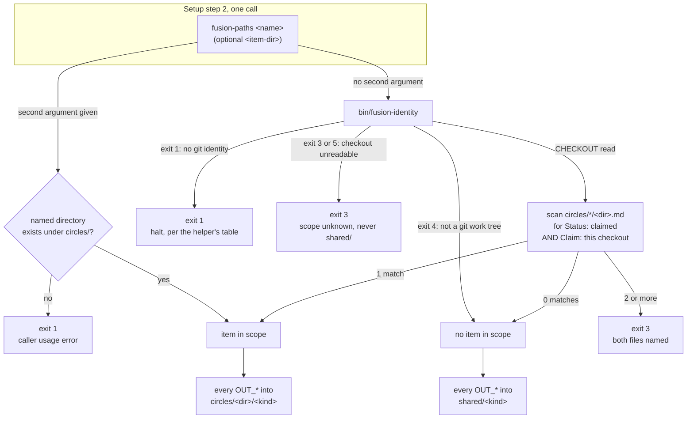
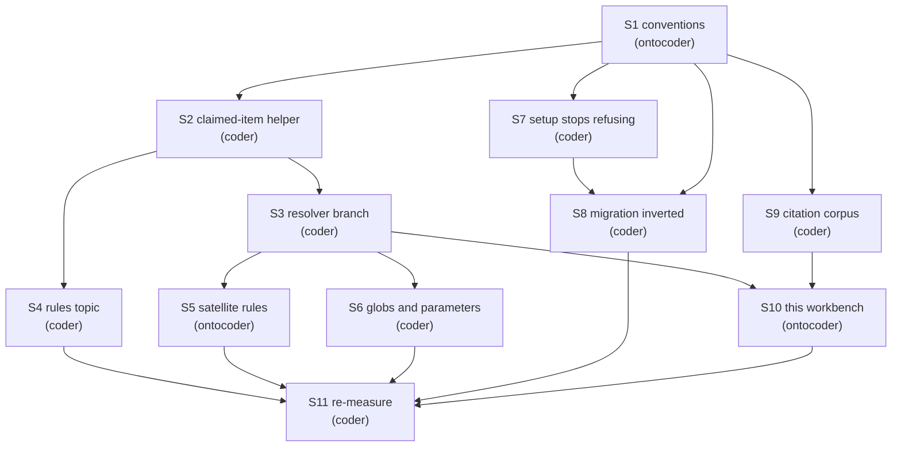

# Implementation Plan: restore the per-work-item container

**Date:** 2026-09-10
**Status:** Draft
**Spec:** none. Planned against the answered ruling `260910-2133_*_does-a-unit-of-work-keep-its-own-container-for-the-artifacts-it-produces.md` (option 1, ruled by the user) and the reasoning in `260910-0900-orchestrator-session.md` `## Ruling on the container`.
**Decidability:** The load-bearing question is *which container does this consumer's write belong in*, asked once per Setup. The recommended mechanism reads two inputs: this checkout's eight hex characters from `bin/fusion-identity`, and the set of item records carrying `**Status:** claimed`. It is decidable from those inputs **if and only if** the claim relation is a partial function from checkout to item, at most one claimed item per this checkout. Nothing in the store enforces that, and two claimed items is a state the store can reach, so the resolver may not assume it. **The mechanism therefore changes rather than the answer being approximated:** ambiguity is detected and refused with a new exit 3 naming both files, never resolved by picking one. With that refusal in place the question is total over every input, including the two cases that look alike and are not, a checkout identifier that cannot be read inside a git work tree (unknown, exit 3) against a project that is not a git work tree at all (no claim can exist, so `shared/` is the true answer, exit 0).

## Directive

Bring back the directory that bundles what one unit of work produced, without bringing back anything else that left with it. The portfolio layer and the six-state vocabulary stay removed. The work item's own shape stays exactly as step C9 wrote it, and is not paid for a second time: no marker on any filename, state as a head field, one file per item, the head fields `**Domain:**`, `**Status:**`, `**Claim:**`, `**Depends-on:**` and `**Filed by:**` as `rules/fusion-workbench-conventions.md` `## Backlog entries — work items` defines them.

Three things the ruling obliges, each of which this plan carries: the Origin Rule returns, because a placement decision exists again; `bin/fusion-paths` gains a per-work branch; and `skills/migrate/SKILL.md` is rewritten before D1 runs.

## Current State

Verified by reading the tree at `0c793392` plus the working-tree changes a concurrent `coder` is making. Sixteen commits are pushed, `npm test` is green.

- **The resolver has no branch.** `bin/fusion-paths` takes one argument, reads no workbench state, and every `OUT_*` prints a literal under `shared/`. Exit 3 was removed and the header states there is none.
- **The claim scan already exists**, in the other helper. `bin/fusion-rules` `resolve_topics` walks `shared/backlog/*.md`, tests `**Status:** claimed` and a `**Claim:**` whose first field equals this checkout's eight hex from `bin/fusion-identity`, and takes the item's tag line or slug as the context-manifest topic. It stops at the first match, which is right for a topic and wrong for a write target.
- **The Origin Rule is gone**, deleted at `76d833be`. Its text stands at `git show 91179f35:rules/fusion-workbench-conventions.md`, 2 895 bytes.
- **The workbench is untouched.** `fusion-workbench/circles/` holds 26 container directories and 1414 files. Their records carry markers: 20 `_c_`, 3 `_b_`, 1 `_s_`, 1 `_a_`, 1 `_t_`. So 24 are terminal and two are live. `fusion-workbench/.active-circle` still exists, 42 bytes. `shared/backlog/` holds two pre-C9 marked files, one `_c_` and one `_p_`.
- **Setup refuses this workbench.** `skills/setup/SKILL.md` Step 0 treats a `circles/` container holding anything at all as an out-of-format finding and routes to `/fusion:migrate`. That refusal is why the user has not updated their install, and under the ruling it is now wrong.
- **The migration inverts the ruling.** `skills/migrate/SKILL.md` Step 4b empties each container into the shared stores and writes one flat item. Its earlier passes, type folders to `shared/`, flat `circles/*.md` to directories, bracket markers to underscore, all move a workbench *toward* the container layout and are correct as they stand.
- **The citation grammar still knows Circles.** `hooks/lib/citation-scan.ts` carries the kinds `circle-record` and `circle-dir`; `hooks/lib/citation-corpus.ts` carries `CIRCLE_RECORD_RE`, anchored on `_[atcbsd]_circle.md`. `workbench-citation-lint.test.ts` asserts that at least one Circle record is selected, so the predicate is load-bearing rather than incidental. `bin/fusion-citation-check` reports `verdict=clean` at this head.
- **Six sites glob the item store at depth 1**: `agents/orchestrator.md` (the item read and the maintenance section), `agents/shaper.md`, `agents/curator.md`, `skills/memo/SKILL.md`, `skills/archive/SKILL.md` (two blocks).

## Approach

One shape, and everything else follows from it. **A work item is a directory, and its record lives inside it.** The container is `circles/<stamp>-<slug>/`, the record is `circles/<stamp>-<slug>/<stamp>-<slug>.md`, and the artifact subdirectories are created on first write. `OUT_BACKLOG` and `SCAN_BACKLOG` then name the container store, which is the same pair of keys the prompts already use, so no consumer learns a new key name.

That choice is the ruling's own wording ("the item record inside it"), and it earns two properties nothing else offers. Finding the item is finding the container, so a claim that resolves can never point at a missing directory. And a unit of work is one path, so `ls circles/<dir>/` is the overview the user asked for rather than a join between two stores.

**Scope resolution reads the claim field, not a pointer.** The full weighing, the failure modes and the recommendation are `260910-2145_*_how-does-the-resolver-learn-which-work-item-is-in-scope.md`. In one sentence: a pointer file stores one fact twice with nothing to reconcile the copies and no writer whose act it is, while the claim field is already the fact and is already read by the other helper called from the same Setup step.

**The criterion is implemented once.** A new `bin/fusion-claimed-item` answers "which item has this checkout claimed", and both `bin/fusion-paths` and `bin/fusion-rules` call it. `bin/fusion-rules` deliberately does not call `bin/fusion-paths` (that resolver derives a key set from a consumer prompt, and `fusion-rules` has no prompt of its own), so a third helper is the only place the two can share.

**The 26 existing containers do not move, and 24 of their records are not touched.** They are already the shape the ruling wants. The store keeps the directory name `circles/`; whether it is later renamed is `260910-2145_*_does-the-container-store-keep-the-directory-name-circles.md`, filed rather than settled here.



## What this costs in bytes, and which budget each step meets

Four bounds can go red. Measured at `0c793392` plus the concurrent `coder`'s uncommitted changes, so every figure below is a snapshot to be re-taken at the commit that lands, not a number to trust.

| Bound | Where | Budget | Measured now | Head-room |
|---|---|---|---|---|
| Per-path dispatch bytes, zero head-room over the row | `rules-emission-golden.test.ts`, fixture `dispatch-path.baseline` | the eleven rows | tightest path `reviewer` 182 800 against 189 012 | **6 212 bytes**, and this is what an always-on rule edit spends |
| Always-on core, hard | `rules-emission-golden.test.ts`, `RULE_BASELINE` core sum plus `GROWTH_BUDGET` | 77 498 | 69 156 | 8 342 bytes |
| `skills/` bytes | `surface-growth-bound.test.ts` | 222 397 | 216 562 | 5 835 bytes |
| hook-test lines | `surface-growth-bound.test.ts` | 21 728 lines | 21 494 | **234 lines** |

`agents/` has 64 720 bytes of head-room and does not constrain anything here.

**The always-on floor is the tight one, and it is paid by all eleven agents on every dispatch.** Only `rules/fusion-workbench-conventions.md` is on that floor among the files this plan edits; `workbench-tracking.md`, `workbench-path-resolution.md` and `context-manifest.md` are emitted to no agent and cost zero dispatch bytes. Step S1's whole budget is therefore **6 212 bytes**, and it must come in under that with the Origin Rule, the container in the layout tree, the rewritten invariants and the restored exit-3 row all inside it. The deleted rule was 2 895 bytes and the estimate for the full step is 2 500 to 3 300; it fits with margin, and the step measures rather than assuming.

**One step cannot meet its budget as stated, and it is the hook tests.** 234 lines is not enough for the resolver's new cases plus a test file for the new helper, and a new file with no baseline entry is charged its whole length. The way out of a red growth bound is a cut, never an edit to the baseline (`hooks/lib/__tests__/helpers/growth-bound.ts` `## Re-baselining`). This Circle has already taken two such cuts, `c925fd9d` being the second, both of them comment prose in test files that had another home. **S2 and S3 therefore carry an explicit instruction: fund the new lines from a comment-prose cut in the same commit, and if no honest cut is available, land the helper and the branch without the new cases, say so in the commit message, and add the cases at D3 where the four baselines move under event 1.** Do not edit a baseline to make this pass.

## Implementation Steps

1. [DONE] **S1: the conventions restore the container, the Origin Rule and the resolution contract**
   - Executor: `ontocoder`
   - Files: `rules/fusion-workbench-conventions.md`
   - Changes: (a) `## fusion-workbench Layout` gains `circles/<stamp>-<slug>/` with its own `planning/`, `issues/`, `decisions/`, `reviews/`, `analyses/`, and one clause saying the directory keeps a name whose concept left, citing the naming record. `shared/` keeps every store and loses `backlog/`. (b) A restored `## Origin Rule` section: the rule itself, the origin-not-durability reason, one worked example rather than three, and the two corollaries. The promotion-step paragraph does not come back; nothing in the current design has a promotion step, and it was the part that invited a second placement rule. (c) `## Path Resolution` → `### Contract` regains the optional second argument; `#### Exit codes` regains the 3 row with its new meaning, "the item in scope cannot be determined", and the "there is no exit 3" statement goes; the note that `bin/fusion-rules` exits 3 for its own reason stays. (d) The two invariants are rewritten: every `OUT_*` points into the container of the item in scope and into `shared/` when none is, which is the Origin Rule stated executably, and every `SCAN_*` names both the container store and the shared store for its kind. (e) `## Backlog entries — work items` re-homes the item into its container and states the filename twice over, directory and record, without touching a word of the head-field grammar or the four `**Status:**` values. (f) `## Filename Patterns` updates the work-item row's store.
   - Dependencies: none
   - Verification: `cd hooks && npx vitest run lib/__tests__/rules-emission-golden.test.ts` green, which is both byte bounds at once. Report the two deltas in the commit message. `bin/fusion-prose-metric rules/fusion-workbench-conventions.md` reported, not gated.

2. [DONE] **S2: one helper answers which item this checkout has claimed**
   - Executor: `coder`
   - Files: `bin/fusion-claimed-item` (new), `hooks/lib/__tests__/fusion-claimed-item.test.ts` (new, subject to the line budget above)
   - Changes: prints `ITEM=<workbench-relative path to the record>` and `CONTAINER=<workbench-relative directory>` in the `KEY=value` shape its siblings use, or nothing. Exit table, total by construction: 0 with both lines when exactly one item is claimed; 0 with no output when none is; 2 usage; 3 when the answer is unknown, which is two inputs and not one, either two or more claimed items (both paths named on stderr) or `bin/fusion-identity` exiting 3 or 5 inside a git work tree; 1 when `bin/fusion-identity` exits 1, which is the only code that means stop. `bin/fusion-identity` exit 4 is **not** an error here: no claim can exist in a tree that is not a git work tree, so no item in scope is the true answer and it reaches exit 0. Resolve the workbench through `bin/fusion-workbench-root`. The header carries the authoritative usage block and exit table, as every sibling's does.
   - Dependencies: S1
   - Verification: a scratch workbench with zero, one and two claimed items gives the three answers; a claim naming another checkout gives none; `**Status:** claimed` with no `**Claim:**`, and a `**Claim:**` on a `done` item, each give none. Every exit code is reached by a case.

3. [DONE] **S3: `bin/fusion-paths` gains the per-work branch and the second argument**
   - Executor: `coder`
   - Files: `bin/fusion-paths`, `hooks/lib/__tests__/fusion-paths.test.ts`, `hooks/lib/__tests__/paths.test.ts`
   - Changes: signature becomes `fusion-paths <name> [<item-dir>]`. With a second argument, that directory is the item in scope; it must already exist under `circles/`, and a name that does not is exit 1, a caller usage error and not a workbench fault. With no second argument, scope comes from `bin/fusion-claimed-item`, whose 1 and 3 pass straight through. `value_for()` gains the branch: an `OUT_*` resolves under the container when one is in scope and under `shared/` when none is; a `SCAN_*` emits both, space separated, container first, and collapses to the shared store alone when nothing is in scope. `OUT_BACKLOG` and `SCAN_BACKLOG` name `circles`. Every non-zero exit still yields no output at all. The header's "THERE IS NO EXIT 3" block is replaced by the new meaning.
   - Dependencies: S2
   - Verification: `fusion-paths <name>` for every agent and every skill exits 0 with no claimed item and resolves into `shared/`; with one claimed item every `OUT_*` is inside its container; with two, exit 3 and stdout is empty. No key ever emits an empty right-hand side. `npm test` green.

4. [DONE] **S4: `bin/fusion-rules` reads the claim through the shared helper**
   - Executor: `coder`
   - Files: `bin/fusion-rules`
   - Changes: `resolve_topics` drops its own store literal, its own `bin/fusion-identity` call and its own claim loop, and calls `bin/fusion-claimed-item` instead, reading `ITEM=`. The degradation stays exactly as documented: any non-zero from the helper resolves no topic rather than guessing one, because a missing topic costs optional manifest units and never a misplaced write. The `[ -x ]` guard stays. **Byte-identical output when no manifest is present** remains the acceptance property (`HYG-NO-REGRESS`).
   - Dependencies: S2
   - Verification: `bin/fusion-rules <agent>` output is byte-identical to `0c793392` for every agent with no manifest present; with a manifest and one claimed item the same units are emitted as before the change; `context-manifest.test.ts` green.

5. [DONE] **S5: the three satellite rule files follow**
   - Executor: `ontocoder`
   - Files: `rules/workbench-path-resolution.md`, `rules/workbench-tracking.md`, `rules/context-manifest.md`
   - Changes: the key table regains the second argument and the container-versus-shared reading of each key. `.active-circle` leaves class L, since nothing writes or reads it; `circles/` stays class R1 and the entry says why the container travels while a claim is the per-checkout half. The manifest's topic-source paragraph names the shared helper rather than restating the scan.
   - Dependencies: S3
   - Verification: `provenance-header-lint`, `reference-resolution-lint` and `path-literal-lint` green. Zero dispatch-byte cost: none of the three is emitted to an agent, which `rules-emission-golden` confirms by not moving.

6. [DONE] **S6: the six depth-1 globs become depth-2, and two prompts regain a target parameter**
   - Executor: `coder`
   - Files: `agents/orchestrator.md`, `agents/shaper.md`, `agents/curator.md`, `agents/planner.md`, `skills/memo/SKILL.md`, `skills/archive/SKILL.md`, `README-agents.md`
   - Changes: every `find "$WORKBENCH/$SCAN_BACKLOG" -mindepth 1 -maxdepth 1 -name '*.md'` becomes a depth-2 walk that takes each container's own record. `skills/memo/SKILL.md` creates `circles/<stamp>-<slug>/` and writes the record inside it. `skills/archive/SKILL.md` archives a terminal item's **whole container**, not the record alone, which is what stops an archive sweep separating a unit of work from its artifacts. `agents/planner.md` and `agents/shaper.md` regain a dispatch parameter naming a container to write into, spelled `**Item:** <directory-name>` and passed as the resolver's second argument; the paragraph in `agents/planner.md` saying the old `**Circle:**` parameter is gone is replaced by the new one. `README-agents.md` `## Dispatch parameters` gains the two rows, since it is the roster's single authoring home.
   - Dependencies: S3
   - Verification: each rewritten block is run against a scratch workbench holding two containers and returns both records. `path-literal-lint` green, which is what proves no store literal entered a prompt. `surface-growth-bound` green for `agents/` and `skills/`.

7. [DONE] **S7: Setup stops refusing a container workbench**
   - Executor: `coder`
   - Files: `skills/setup/SKILL.md`
   - Changes: the out-of-format probe drops the `circles/` clause and its accompanying paragraphs. The pre-v4 type-folder probe and the bracket-marker probe stay, both unchanged, and the bracket probe keeps walking `shared/` and `circles/` from depth 2, which is now the ordinary tree rather than a legacy one. Setup pre-creates `circles/` alongside `shared/`.
   - Dependencies: S1
   - Verification: `/fusion:setup` run against this workbench, with its 26 containers, completes rather than refusing; run against a scratch pre-v4 workbench it still refuses and still routes to `/fusion:migrate`.

8. [DONE] **S8: `skills/migrate/SKILL.md` stops flattening**
   - Executor: `coder`
   - Files: `skills/migrate/SKILL.md`
   - Changes: Step 4b is deleted and replaced by an in-place conversion. A container stays where it is and its stores are not emptied. Its record is converted **only when the record is live** (`_a_` or `_t_`): renamed from `_<m>_circle.md` to `<directory name>.md` and re-headed with `**Domain:**`, `**Status:**` (`_a_`→`open`, `_t_`→`claimed` when the record's own claim opens `Claimed `, else `open`), `**Claim:**`, `**Depends-on:**` and `**Filed by:**`, body carried verbatim from `## Directive` down. **A terminal record is not touched at all**, which is `## Terminal states are history` and also what keeps its citations resolving. `.active-circle` is deleted, as it already is. The survey, the per-container status proposal and the deferred-status question all survive, with the population narrowed to live records. Everything above Step 4b is unchanged: those passes move a workbench toward the container layout, which is what the ruling wants.
   - Dependencies: S1, S7
   - Verification: run against a scratch pre-v4 workbench, the result is the container layout with live records converted and terminal ones untouched; run twice, the second run reports nothing to do. Net bytes under `skills/` fall, and the figure is stated in the commit message because it is what funds S6 and S7.

9. [DONE] **S9: the citation corpus and grammar carry both record forms**
   - Executor: `coder`
   - Files: `hooks/lib/citation-corpus.ts`, `hooks/lib/citation-scan.ts`, `hooks/lib/__tests__/workbench-citation-lint.test.ts`
   - Changes: the corpus predicate keeps `CIRCLE_RECORD_RE` for the legacy marked form and gains the unmarked item-record form `circles/<dir>/<dir>.md`, so a live item record is judged and the 23 distinct legacy citations keep resolving. The `circle-record` and `circle-dir` citation kinds stay; D2's plan to remove them is superseded by the ruling and that supersession is written into the commit message rather than left for D2 to discover. The lint's non-vacuity assertion is widened to accept either form.
   - Dependencies: S1
   - Verification: `npx vitest run lib/__tests__/workbench-citation-lint.test.ts` green over the live tree; `bin/fusion-citation-check` still reports `verdict=clean` with `dangling` no higher than the 301 measured at `0c793392`.

10. [DONE] **S10: this workbench's two live records become item records**
    - Executor: `ontocoder`
    - Files: the live record inside each of the two live containers, `260909-1700-cut-fusion-to-working-minimum` (marker `_t_`) and `260908-2018-prerequisites-confirmed-once-order-computed` (marker `_a_`); the two files in the workbench's `shared/backlog/`; the workbench's `.active-circle`
    - Changes: each record is renamed to its own container's directory name, suffix `.md`, and re-headed. The `_t_` one takes `**Status:** claimed` and a `**Claim:**` naming this checkout's eight hex from `bin/fusion-identity`; the `_a_` one takes `**Status:** open` and no claim field. **The other 24 records are not touched**, and nothing under any container moves. The `_p_` file in `shared/backlog/` becomes a container with its record inside; the `_c_` one is terminal and is left where it is for the archive pass to take. `.active-circle` is deleted. Every citation of the two converted records is corrected in the same commit.
    - Dependencies: S3, S9
    - Verification: `bin/fusion-paths planner` with no argument resolves `OUT_PLAN` to `circles/260909-1700-cut-fusion-to-working-minimum/planning`; `bin/fusion-claimed-item` prints exactly one item; `npm test` green, `workbench-citation-lint` included; `find fusion-workbench/circles -type f | wc -l` is 1414 plus whatever this session filed, and `git status` shows two renames and no deletions under `circles/`.

11. [DONE] **S11: re-measure the four bounds and state the result**
    - Executor: `coder`
    - Files: none. The step writes a measurement into the closing commit message.
    - Changes: run the two bound tests and report, per surface, what this work spent: the always-on core delta, the per-path delta for the tightest of the eleven, the `skills/` net, and the hook-test line net. Name any step that had to be funded by a cut and say what was cut.
    - Dependencies: S1 through S10
    - Verification: `npm run build && npm test` green. No baseline and no fixture row was edited by any step in this plan; if one was, the step is wrong and is reverted rather than kept.



## What happens to the 26 existing containers

**Nothing moves.** They are already the shape the ruling wants: a directory per unit of work, holding that work's own `planning/`, `issues/`, `decisions/`, `history/`, `reviews/` and `analyses/`. No file leaves `circles/`, the directory keeps its name, and the 1414-file count is unchanged by this plan.

**Twenty-four of the 26 records are not touched either.** Twenty are `_c_`, three `_b_` and one `_s_`, all terminal. `## Terminal states are history` forbids editing them back, no helper reads their state, and renaming them would break the 23 distinct `circles/<dir>/_x_circle.md` citations the corpus carries in exchange for nothing. The corpus predicate keeps matching the marked form, which is S9.

**Two records are converted**, and only because a helper still reads their state: the `_t_` of `260909-1700-cut-fusion-to-working-minimum` and the `_a_` of `260908-2018-prerequisites-confirmed-once-order-computed`. Each is renamed to its directory's name and re-headed. That is the whole of the migration for this workbench, and it is S10.

**So the answer to "does D1 still need to run" is no, not in the form it was written.** D1's move of `circles/**` into the shared stores is cancelled by the ruling. What survives of D1 is S10, an in-place conversion of two records, and it is not a one-way mass move: a forward commit reverses it. The irreversibility that made the ruling urgent is gone with the flattening.

## Data Structures

No new file format. The item record's head block is unchanged from `## Backlog entries — work items`; only its path changes, from `shared/backlog/<stamp>-<slug>.md` to `circles/<stamp>-<slug>/<stamp>-<slug>.md`.

`bin/fusion-claimed-item` prints at most two lines:

```
ITEM=circles/<stamp>-<slug>/<stamp>-<slug>.md
CONTAINER=circles/<stamp>-<slug>
```

Both are workbench-relative, matching every other `KEY=value` helper. `CONTAINER` is derivable from `ITEM` and is emitted anyway, so no caller re-implements the `dirname`.

## API Changes

- `bin/fusion-paths <name>` becomes `bin/fusion-paths <name> [<item-dir>]`. Exit 3 returns with a new meaning. `SCAN_*` values become multi-valued when an item is in scope, which the contract already permits ("multi-value keys are space-separated") and which every consumer already handles, since that is how they read before C9.
- `bin/fusion-claimed-item` is new, and every call site is a sibling `bin/` script rather than a prompt, so the one-release-behind `[ -x ]` obligation does not arise: an install copy carries both helpers or neither.
- Two dispatch parameters are added, `**Item:**` on `planner` and on `shaper`.

## Testing Strategy

Three properties carry this work and each gets a case rather than an assertion in prose.

**The resolver is total.** Every exit code in the new table is reached by a case in `fusion-paths.test.ts`, including the two that look alike: `bin/fusion-identity` exit 3 or 5 inside a git work tree gives exit 3, and exit 4 outside one gives exit 0 with `shared/` paths.

**Ambiguity is refused, not resolved.** A scratch workbench with two items claimed by one checkout gives exit 3 and empty stdout. This is the case a first-match implementation passes silently and wrongly, so it is written before the branch is.

**No regression where none was intended.** `bin/fusion-rules <agent>` is byte-identical to `0c793392` for every agent with no manifest present, which is the property S4 must not break.

Every step's own verification line stands beside it above. `npm run build && npm test` is green at each of the eleven commits, not only at the last.

## Risks & Mitigations

| Risk | Mitigation |
|---|---|
| The hook-test line budget, 234 lines, is too small for S2 and S3 | Named in the budget table as a step that cannot meet its budget. Fund it by a comment-prose cut in the same commit, precedent `c925fd9d`; failing that, land the branch without the new cases, say so in the commit message, and add them at D3. Never edit a baseline. |
| A concurrent `coder` is editing `agents/orchestrator.md`, `bin/fusion-rules`, `docs/` and `README-hooks.md` right now | Every step names a file and a change, never a line number. Each executor re-reads its file before editing. The byte figures in this plan are a snapshot and each step re-measures. |
| S1's addition exceeds the 6 212-byte per-path head-room | The step's verification is the bound test itself, so it cannot land red. If the restored Origin Rule will not fit, cut its worked examples to one and its reasoning to a sentence before cutting anything else; the rule is the part that has to be there, the illustration is not. |
| S10 breaks citations of the two converted records | S9 lands first and widens the corpus predicate; S10 corrects every citation of the two records in the same commit; the verification is `workbench-citation-lint` over the live tree. |
| Someone reads `circles/` as the Circle coming back | One clause in the layout tree says the name outlived its concept, and `260910-2145_*_does-the-container-store-keep-the-directory-name-circles.md` carries the question. |
| D2 removes the two citation kinds this plan keeps | S9's commit message records the supersession explicitly, so D2 meets it in the log rather than in a red suite. |

## Open Questions

- [ ] Does the container store keep the directory name `circles/`? Filed as `260910-2145_*_does-the-container-store-keep-the-directory-name-circles.md`, recommendation: keep it, and rename later from a quiet tree if at all. This plan proceeds on the recommendation.
- [ ] How does the resolver learn which item is in scope? Filed as `260910-2145_*_how-does-the-resolver-learn-which-work-item-is-in-scope.md`, recommendation: the claim field, with ambiguity refused. **This plan is written against that recommendation and does not survive a different answer**, so it is the one question that gates execution rather than accompanying it.
- [ ] Does a container's `history/` stay write-frozen? The history store is closed to writes and this plan does not reopen it, so a restored container has a `history/` that only legacy files sit in. Nothing breaks, and stating it is cheaper than leaving the next reader to test it.

## Where this Circle stops

- The Origin Rule is back in `rules/fusion-workbench-conventions.md` and states what still applies; what does not apply, the promotion step, is absent and its absence is stated in the commit that restores the rest.
- `bin/fusion-paths` resolves into a container when this checkout has claimed exactly one item, into `shared/` when it has claimed none, and refuses with exit 3 when it has claimed two, with every exit code in its table reached by a test case.
- The claim criterion is implemented in exactly one place and both helpers call it; `grep -c` for a second `**Status:** claimed` scan across `bin/` returns one.
- `bin/fusion-rules <agent>` is byte-identical to `0c793392` for every agent with no context manifest present.
- `skills/migrate/SKILL.md` moves no file out of a container and converts only live records, verified by a run against a scratch workbench that leaves every terminal record untouched.
- `/fusion:setup` completes against a workbench holding 26 containers instead of refusing it.
- The 1414 files under `fusion-workbench/circles/` are still 1414 plus what this session filed, and `git status` shows renames only, no deletions.
- `npm run build && npm test` is green at every one of the eleven commits, and no baseline row and no golden fixture was edited by any of them.
- The four bounds are re-measured at the closing commit and the spend is stated per surface, with any step funded by a cut naming what was cut.

**Precondition of anything after this work:** D1 as written in `260909-1843_*_implementation-cut-fusion-to-a-working-minimum.md` is cancelled, not merely deferred, and D2's removal of the two Circle citation kinds is superseded. Both facts are written into the commits that cause them, so a reader of session 4 meets them in the log. A plan-stated precondition gets no mechanism and is read by a human at the gate, per `260817-1613_*_does-a-plan-stated-precondition-get-any-mechanism-or-is-it-read-by-a-human-or-not-at-all.md`.
