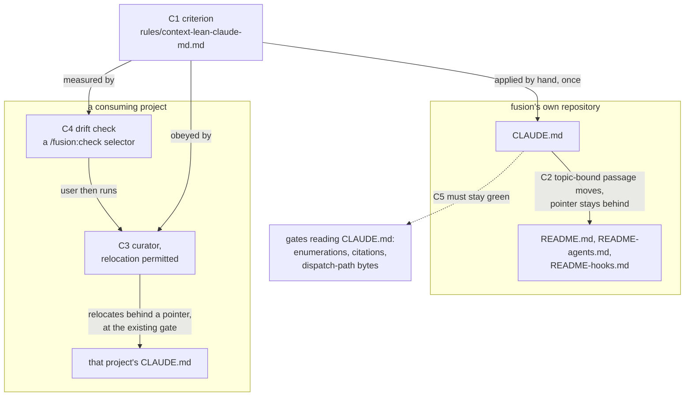

# Spec: human-directed documentation leaves `CLAUDE.md`

**Date:** 2026-09-16
**Status:** Draft
**Source:** Work item `260912-0438-human-facing-docs-leave-claude-md.md`. A project's `CLAUDE.md` should carry only what Claude genuinely needs under fusion in every session; everything else belongs behind links. The aim covers fusion's own repository and the convention fusion ships to other projects.
**Cross-references:** 260912-0438-human-facing-docs-leave-claude-md.md, 260916-1006_*_how-does-a-consuming-project-bring-its-claude-md-to-the-lean-convention-when-the-curator-asks-a-different-question.md, 260911-2237_*_where-does-the-bin-helper-roster-belong-when-a-third-of-claude-md-is-pointers-charged-eleven-times.md, 260822-1102_*_what-happens-when-a-planned-circles-required-work-exceeds-the-remaining-head-room.md

## Directive

A passage stays in a `CLAUDE.md` only when it binds every session whatever the work; anything that matters only when the work is about one topic moves behind a pointer. fusion applies that test to its own file, sharpens it in the convention it ships, and gives a consuming project two things it does not have today: a check that says its file has drifted, and a curator that may relocate a passage it is forbidden to delete.

## Starting state, measured

Three facts the planner should not re-derive, each taken at `92cd2491` with the command beside it.

**The `bin/` roster move is complete.** `CLAUDE.md`'s `bin/` row is a 307-byte pointer to `README-hooks.md` `### The bin/ helper roster`. That roster carries 23 rows (`grep -c '^| `bin/' README-hooks.md`) against 23 files in `bin/` (`ls -1 bin | wc -l`), and `hooks/lib/__tests__/derivable-enumerations-lint.test.ts` section 7 reads the plugin's `bin/` against `README-hooks.md` in both directions. The governing record `260911-2237_*_where-does-the-bin-helper-roster-belong-when-a-third-of-claude-md-is-pointers-charged-eleven-times.md` carries the implemented marker and an `Implemented: 4ba42bd8` line. Nothing in this spec revisits that work.

**fusion's own file still does not meet the convention.** `CLAUDE.md` is 62 505 bytes over 130 lines (`wc -c -l CLAUDE.md`), down from the 91 277 the roster record measured. By section head (`awk` over lines opening `## `): Layout 16 906, Conventions 16 524, Release process 10 372, "Where to look when something breaks" 9 648 across 19 table rows, "What this is" 5 779, "Testing during development" 202, and 3 074 bytes of preamble above the first head. What `rules/context-lean-claude-md.md` asks a project to keep is its identity, its language declarations, the rules that bind every edit whatever the topic, and a pointer table.

**No size gate currently forces the cut.** `hooks/lib/__tests__/fixtures/dispatch-path.baseline` charges `CLAUDE.md` to all eleven dispatch paths at 93 432 bytes and zero head-room, so every path carries roughly 31 000 bytes of slack the file no longer spends. Measuring four paths by hand puts the tightest of them, `reviewer`, near 164 600 against a row of 189 012. *Inference, not the suite's own figure:* the rule component was measured through the installed plugin copy, and the baseline's method reads the work tree. The planner should take the authoritative number from the test rather than from this paragraph. The consequence for scope is the same either way: this work is chosen, not forced, so its cost has to be justified against what it buys rather than against a red suite.

## Shape

## Capabilities

### C1: The criterion, authored once

**Description:** `rules/context-lean-claude-md.md` states a test a reader can apply to one section of a `CLAUDE.md` and get the same answer twice. The test is topic-scoped: a passage stays when it binds every session whatever the work, and moves behind a pointer when it matters only where the work is about one topic. The file already carries this wording under "How to tell always-on from on-demand", so the work sharpens it into something applicable rather than replacing it.

**Acceptance criteria:**
- [ ] The convention names the unit the test is applied to, and that unit is a heading, so two readers classifying the same file divide it the same way before they judge anything.
- [ ] The convention states what a passage that fails the test becomes: a pointer line naming the topic and the file that now holds the detail.
- [ ] The convention gives at least two worked classifications drawn from a real file, one that stays and one that moves, each naming why.
- [ ] A reader who has never seen fusion can classify a section of their own `CLAUDE.md` using only this file, without reading any agent prompt.
- [ ] The convention states that a passage moves rather than being deleted, and names the one exception (below, C2).

**Decisions made:**
- Criterion: topic-scoped, not "does an agent act on this". Chosen because the test has to be applied both by the check in C4 and by a person in a project fusion never sees. Whether a section is bound to a topic can be anchored to its heading; whether an agent acts on a sentence cannot be established from the file.
- No target size. The criterion decides each passage on its own, and a byte target would be a second rule that can disagree with the first. What the work reports instead is the before and after size per surface, which the curator already produces.

### C2: fusion's own `CLAUDE.md` meets the criterion

**Description:** Every section of the repository's own `CLAUDE.md` is classified under C1. Sections that bind every session stay. Sections bound to a topic move to the README that already covers that topic, leaving a pointer line. The default destination is the existing READMEs, following the precedent the `bin/` roster set. Deletion is a per-passage judgement and never the default: a passage is deleted only where a workbench record already carries the same account, and the ledger entry names that record.

**Acceptance criteria:**
- [ ] Every section head in `CLAUDE.md` carries a recorded classification, so no passage survives merely by not being looked at.
- [ ] Every passage that moved is readable at its new location, and the section it left carries a pointer naming where it went.
- [ ] Every passage that was deleted rather than moved names, in the run's ledger, the record that carries the same account.
- [ ] The two language declarations, the repository's identity paragraph, and every pointer to a source-of-truth file are present after the cut.
- [ ] The report states bytes and lines before and after for `CLAUDE.md` and for each README that received text.
- [ ] `npm test` is green.

**Decisions made:**
- Destination: the existing READMEs by default. `README.md`, `README-agents.md` and `README-hooks.md` sit on no size bound, ship with the plugin, and already hold two rosters of exactly this kind.
- Route: through the curator, at its existing gate, with its ledger and its blast-radius pause. Any cut of this size will exceed a fifth of the surface and will therefore reach that pause.
- The curator's preserve list is not suspended for this work. It is amended in C3 so that a preserved passage may be moved, which is what makes the two compatible.

### C3: The curator may relocate what it may not delete

**Description:** Relocation becomes a change type of its own in `agents/curator.md`, beside removal and consolidation. The preserve list then guards a passage's content rather than its location: a non-obvious failure mode, a hidden-coupling note, a critical procedure and an authoritative pointer may each be moved behind a pointer, and none of them may be deleted. Ruled in `260916-1006_*_how-does-a-consuming-project-bring-its-claude-md-to-the-lean-convention-when-the-curator-asks-a-different-question.md`.

**Acceptance criteria:**
- [ ] A relocation entry in the ledger names the passage, the file it leaves, the file it arrives in, and the pointer text left behind.
- [ ] The preserve list states that its five categories forbid deletion and permit relocation, and says so in the list itself rather than elsewhere in the prompt.
- [ ] A relocation carries no evidence tier, and the prompt says why: the tiers grade evidence that a statement is false, and a relocation makes no claim about truth.
- [ ] The clause forbidding a change justified only by re-reading the current text still forbids every deletion it forbids today, and the prompt states that a relocation is outside it.
- [ ] The two-pass safety already in place reaches a relocation unchanged: the before-text is re-read from disk at apply time, and the written region is compared byte for byte against the ledger afterwards, at both the source and the destination.
- [ ] Relocating a passage out of `CLAUDE.md` and into a file the curator does not otherwise write is either permitted explicitly or refused explicitly, and the prompt says which.

**Decisions made:**
- A relocation carries no tier. Adding a fourth tier for "this passage is topic-scoped" would put a placement judgement on a scale that measures how certain we are that a statement is false. The decision record makes the same distinction and this follows from it rather than extending it.
- *Derived from the ruling rather than asked, and the spec review is where to overturn it.* If the intent was a fourth tier, C3's third and fourth criteria change and nothing else in this spec does.

### C4: A consuming project learns that its file has drifted

**Description:** A `/fusion:check` selector measures a project's `CLAUDE.md` against the criterion and reports what it finds: which sections are bound to a topic, what each weighs, and what the file would weigh without them. It reports and never fails, and it never edits. The user who reads the report runs the curator to act on it.

**Acceptance criteria:**
- [ ] The selector names each topic-bound section by its heading and gives its size, so the reader can act on the report without opening the file.
- [ ] The selector reports a clean file as clean, in one line, and does not present a clean result as a warning.
- [ ] The selector changes no file, and the run reports that plainly.
- [ ] A project with no `CLAUDE.md` gets a stated zero rather than an error.
- [ ] Running the selector never fails the session, whatever it finds.
- [ ] The report names the curator as the tool that acts on what it found.
- [ ] Every statement of how many checks `/fusion:check` performs agrees with the tree, in the skill's own description, in its body, and in `README-agents.md`.

**Decisions made:**
- The check is the trigger and the curator is the tool, the two together and not as alternatives. Ruled in `260916-1006_*_how-does-a-consuming-project-bring-its-claude-md-to-the-lean-convention-when-the-curator-asks-a-different-question.md`.
- `CLAUDE.md` keeps exactly one writer. The check reports and the curator writes.

### C5: The gates that read `CLAUDE.md` stay closed

**Description:** Several tests read `CLAUDE.md`'s text and fail when a passage they depend on disappears. The cut says what happens to each one it touches, before it touches it. A gate is retargeted at the passage's new home, as section 7 of the enumeration lint was when the `bin/` roster moved, or the passage stays. A gate is never dropped to let a cut land.

**Acceptance criteria:**
- [ ] `CLAUDE.md` still names every skill directory in the `/fusion:<name>` form and names no directory that does not exist, or the check that asserts this reads the passage's new home instead.
- [ ] The three agent-count claims that the enumeration lint parses are present and equal to the number of agent prompts in the tree, or the parser reads their new home. The check fails loudly on an absent claim, so a silent removal is not available.
- [ ] The passage describing the path-literal lint's declared definition sites still names each of those sites, or the check reads its new home.
- [ ] The reference-resolution baseline is re-approved on its own line, with the movement measured by restoring each edited file to its committed state in place rather than by subtraction, which is the method that line mandates.
- [ ] Every citation that moved still resolves from its new file, and no moved citation acquires a store segment in front of a record name.
- [ ] The dispatch-path total for each of the eleven paths is at or below its row in the baseline, and no baseline and no head-room constant was edited to achieve that.

**Decisions made:**
- No gate is deleted, weakened, or re-baselined to accommodate this work. A gate follows the text it guards, or the text stays.

## Stops when

- If the classification pass in C2 finds that the curator's blast-radius pause is declined at the gate, the cut stops there with `CLAUDE.md` byte-identical, and the run reports the classification it produced so a later pass does not repeat it.
- If the drift check in C4 cannot be built within the room left on the skill-body size surface, the work stops and asks rather than cutting live substance out of another skill body. Measured at `92cd2491`: the surface stands at 213 067 bytes against a budget of 213 679, a floor of 188 768 plus head-room of 24 911, so 612 bytes remain. A head-room raise is the user's ruling to give, and `260822-1102_*_what-happens-when-a-planned-circles-required-work-exceeds-the-remaining-head-room.md` is the standing answer that the room is cut first.
- If applying the criterion to fusion's own file produces a classification the user rejects at review, C2 stops and C1 is revised before any text moves. The criterion is the deliverable; the cut is its first application.

## Constraints

- `CLAUDE.md` has one writer, the curator, behind a user gate. The session-learnings pass that also wrote the file was removed on 2026-08-15 and nothing replaced it.
- `agents/curator.md` sits on the `agents/*.md` size bound, and `skills/check/SKILL.md` on the skill-body bound. An addition to either is paid for by a removal on the same surface or by a head-room raise the user rules. The two budgets are independent and neither pays for the other.
- No baseline and no head-room constant moves to make a failing bound pass. Both move only at the events named in `hooks/lib/__tests__/helpers/growth-bound.ts` `## Re-baselining`, and a piece of work that only cuts is none of them.
- `/fusion:setup` seeds no `CLAUDE.md` and the installer copies none, so the only text fusion ships on this subject is `rules/context-lean-claude-md.md` and the pointers to it in `README-agents.md` and `skills/help/SKILL.md`.
- Artifact language is English for everything this work ships, which is every file it touches.
- A measurement that fires on its commonest path is one a reader learns to skip. The check in C4 is quiet on a clean file.

## Out of Scope

- The `bin/` helper roster. Its move is done and its record is implemented.
- Whether the container store keeps the directory name it has. Unrelated and separately open.
- Any change to what `rules/context-manifest.md` describes. The manifest is the other half of the lean convention and this work does not touch its mechanism.
- Rewriting passages for style. A passage that stays stays as it reads; a passage that moves moves as it reads. The only edit this work makes to surviving text is the pointer line left behind.
- Enforcing a size on a consuming project's `CLAUDE.md`. The check reports and the project decides.
- Bringing any other project's `CLAUDE.md` to the convention. fusion's own file is the only one this work edits.

## Open for Planner

- Whether the C4 check lives wholly in the skill body or delegates its measurement to a helper under `bin/`, which sits on no size bound. The 612 bytes of room on the skill surface make this a real fork, and the planner decides it against the head-room rule rather than against taste.
- The order of C2 against C3. C2 needs the relocation change to exist before the curator can propose a move, so a planner may sequence C3 first or accept that C2's first pass reports rather than applies.
- How the classification of `CLAUDE.md` in C2 is recorded so a later reader can check it: as part of the curator's run file, as a separate artifact, or in the commit message.
- Which README receives which topic. The spec fixes the default destination and not the assignment.
- Whether `/fusion:curate` gains a mode that runs only the placement question, or whether a relocation proposal simply arrives in the ordinary run.
- How the check derives the topic of a section, given that the criterion is anchored to headings.
- The exact wording of any retargeted test parser in C5.

## User Decisions Pending

- [ ] Confirm or overturn the reading in C3 that a relocation carries no evidence tier. It follows from the ruling rather than from a question the user was asked.
