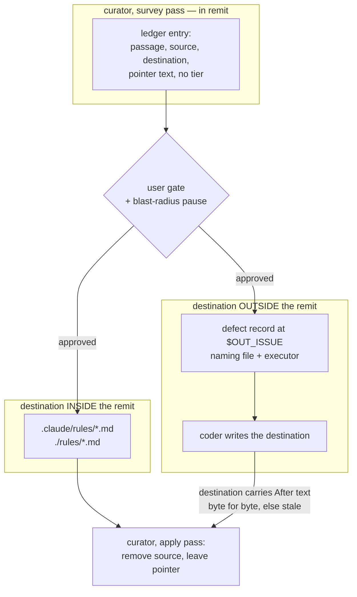
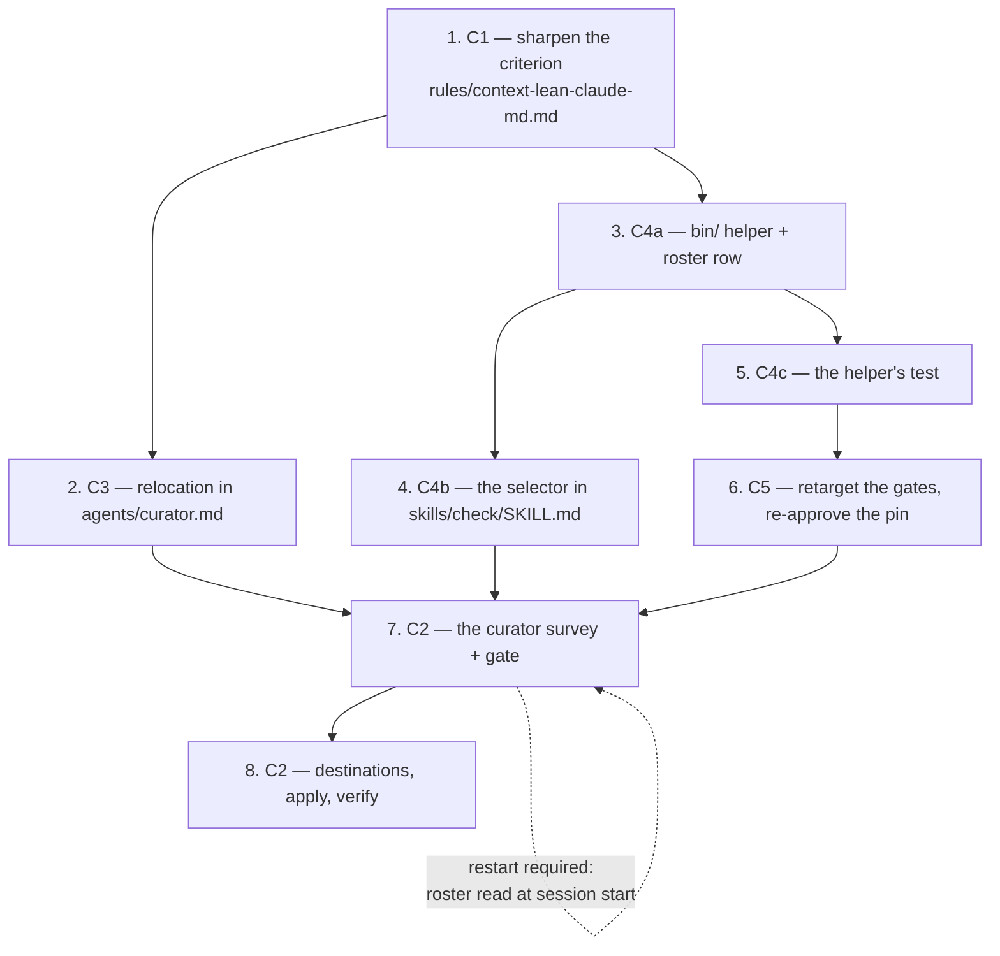

# Implementation Plan: human-directed documentation leaves `CLAUDE.md`

**Date:** 2026-09-16
**Status:** Draft
**Spec:** `260916-1058_*_spec-human-facing-docs-leave-claude-md.md`, approved as written; its one pending user decision was confirmed at the gate (a relocation carries no evidence tier), so no tier work is planned.
**Decidability:** The load-bearing question is *"is this section bound to a topic?"*, and it is **not decidable from the inputs a check has**. A topic is a property of the work a reader is doing, not of the text; the same heading classifies differently for two readers and no command settles it. The change of mechanism is therefore in this plan rather than deferred: **the C4 check stops answering that question.** It answers one its inputs do reach — *which headings carry the file's weight, and how much* — reports that with its own reporting threshold stated, renders no verdict about topics, and names the human and the curator's gate as where the topic judgement is made. The criterion itself stays a **human** test, applied with C1's worked examples, and that is decidable from the inputs a human has. The consequence for the spec is recorded in `260916-1126_*_may-the-drift-check-report-weight-when-it-cannot-decide-topic.md`, because it re-words C4's first acceptance criterion.

## Directive

See the spec. This plan does not restate it. What it adds is the sequence, the executor per step, the measurements the spec left to the planner, and the answers to the seven questions under `## Open for Planner`.

## Current State

Every figure below is measured at `92cd2491`, the same commit the spec measured, with the command named. Where the spec states a figure, mine is the one this plan uses.

**The dispatch-path bound is not binding, and the authoritative number is the test's, not the spec's paragraph.** `hooks/lib/__tests__/fixtures/dispatch-path.baseline` charges `CLAUDE.md` at 93 432 to all eleven rows. Re-running the test's own method — the prompt, plus every path `bin/fusion-rules <agent>` emits from the repository root, plus `CLAUDE.md` — the tightest path is `reviewer` at 164 628 against a row of 189 012, so **24 384 bytes of slack on the worst path**. The spec's "near 164 600" reproduces exactly. This work only takes bytes off `CLAUDE.md`, so no path can be pushed over by it.

**The `agents/` surface is not binding either, and the governing decision record's constraint on it does not hold today.** `agents/*.md` measures 269 252 bytes against a floor of 310 567 plus 18 000 head-room, i.e. **59 315 under budget**. `260916-1006_*_how-does-a-consuming-project-bring-its-claude-md-to-the-lean-convention-when-the-curator-asks-a-different-question.md` lists "an addition is paid for by a removal on the same surface" as a constraint; measured, no removal is needed for C3's addition to `agents/curator.md`.

**The `skills/` surface stands where the spec measured it.** 213 067 bytes against 188 768 + 24 911 = 213 679. **612 bytes.** The spec's figure reproduces to the byte.

**The binding surface is one the spec never measured: the hook-test line surface has NINE LINES of margin.** `hooks/lib/__tests__/**.ts` measures 21 814 lines against a floor of 19 228 plus 2 595 head-room = 21 823. This is not my inference — `reference-resolution-lint.test.ts:464` says so in its own re-approval entry ("BECAUSE THE hook-tests LINE SURFACE STANDS AT 9 LINES OF MARGIN"), and my count agrees with it. Every test line this work adds is charged against those nine. Filed as `260916-1126_*_the-specs-stop-clause-measures-the-skills-surface-while-the-binding-one-is-the-hook-tests.md`.

**`rules/context-lean-claude-md.md` is emitted to no agent.** `bin/fusion-rules` does not list it; it is reached through `README-agents.md:177` and `skills/help/SKILL.md`. So C1 costs nothing on any dispatch path and nothing on the always-on rule bound.

**The curator may not write `README*.md`.** `agents/curator.md` `### Explicitly not in your remit`, exclusion 5, names `README*.md` with agent prompts and skill bodies; exclusion 6 names `bin/`, `hooks/` and `docs/`. The spec's default relocation destination is exactly those READMEs. This is the fork C3's sixth criterion leaves open, and `## Approach` answers it.

**`CLAUDE.md` by section**, `awk` over lines opening `## `, 62 505 bytes over 130 lines: preamble 3 074, What this is 5 779, Layout 16 906, Conventions 16 524, Release process 10 372, Testing during development 202, Where to look when something breaks 9 648.

## Approach

Four commitments, then the steps.

**1. The check reports weight; the human and the curator judge topic.** Argued in the `**Decidability:**` line. The measurement is deterministic and lives in a `bin/` helper, not in prose the model re-derives per run.

**2. C4 delegates its measurement to a helper under `bin/`.** Decided against the head-room rule, not taste. The skill-body surface has 612 bytes and `helpers/growth-bound.ts` `## Re-baselining` names no event that a cut reaches, so the room is 612 and stays 612. A selector written wholly into `skills/check/SKILL.md` has to carry the division rule, the sizing rule, the threshold and the report shape as prose — drafted honestly that is well over 612 bytes, and it would make the answer a model's re-derivation rather than a measurement. With a helper, the body carries a table row, a heading, one fenced command and the reporting rule. `bin/` sits on no size bound. **The two-session shape applies**: a helper this repository adds is absent from `$FUSION_PLUGIN_ROOT` for the rest of the session that adds it, so the selector's text carries a miss branch on the `presence=unread` precedent already in that body, and the proof run belongs to a later session.

**3. C3 before C2, and C2's curator run belongs to a later session.** C2 cannot apply a relocation the curator does not understand, so C3 lands first. And the session that edits `agents/curator.md` cannot dispatch the changed curator: the agent roster is read at session start from the installed copy and never re-read. So C2's run is separated from C3's edit by `fusion --update` and a restart.

**4. Relocation out of the curator's remit is REFUSED, and the refusal is what keeps the design integral.** The curator relocates into a surface it already writes — a project rule file under `.claude/rules/` or `./rules/`, which is where the lean convention sends a consuming project's topic detail anyway. A destination outside its three surfaces is refused by the existing `## Reporting work you may not do` path: the ledger entry names the destination file and the executor, and the destination write is coder work. The source-side removal is then **gated on the destination already carrying the After text byte for byte**; where it does not, the entry is `stale` and nothing is removed. That ordering means the passage never exists nowhere, and it reuses the two-pass safety rather than adding a second one.

Permitting the destination write was the alternative and is rejected for one measured reason: exclusion 5 names `README*.md` in the same breath as agent prompts and skill bodies, both of which sit on growth bounds. A curator that may append to one of the three has to be told, case by case, which of the three — the rim of special cases `critical-stance.md` §2 names. Refusing all three is one rule. **The cost is stated rather than hidden:** C3's fifth acceptance criterion assumes the curator writes the destination and compares it afterwards. Under this answer the destination comparison is a **precondition** read instead of a post-write read. The check happens; its position in the sequence moves. The step says so in the prompt text.

### Destination assignment (C4's fourth open question)

Each README's existing subject decides. Per-passage disputes are settled at the curator's gate, not here.

| `CLAUDE.md` topic | Destination |
|---|---|
| guard and hook behaviour, the stand-down history, `fusion.json`, growth bounds, the suite's gates, `bin/` | `README-hooks.md` (`## Concept`, `## Files`, `### Growth bounds on the shipped text`) |
| agents, dispatch parameters, rules loading, voice profiles, skills, the workbench stores, plugin layout | `README-agents.md` (`## Plugin structure`, `## Dispatch parameters`, `### Adding rules`, `## Migration note`) |
| the release process and the four version surfaces | `README-agents.md`, a new `## Releasing` beside `## Adding a new agent` — that file already carries this repository's maintainer procedures, and `README.md` is the user's front door |
| the troubleshooting table | `README-hooks.md`, whole, as a new `## Where to look when something breaks`. One home beats a split across two files; the rows are a preserve-list category (non-obvious failure modes) and are relocated, never deleted |

What stays in `CLAUDE.md`: the identity paragraph, `**Language:** de` and `**Artifact language:** en`, the pointer table one line per path, the conventions that bind every edit whatever the topic (namespaced dispatch, agents write only to `fusion-workbench/`, the workbench bootstrap is exclusive to `/fusion:setup`, the `dir/*` `.gitignore` form, bump the manifest version on every change, critical procedures are skills and not "MUST" lines, a one-line growth-bound warning with its pointer), `## Testing during development`, and one pointer per moved topic. *Inference, not a target:* that residue reads at roughly 5 000 to 7 000 bytes. **It is not a goal and no step is measured against it** — C1's "no target size" decision holds, and the gate decides passage by passage.

### The other open questions

- **How the C2 classification is recorded.** In the curator's run file, as a new numbered item in `## The run file`, between the surface sizes and the comparison counts. The run file is already the single artifact for a run and the prompt forbids a second file duplicating its identity, so a separate artifact is the wrong shape and a commit message is not readable by a later run. The schema addition rides on C3's edit.
- **Whether `/fusion:curate` gains a placement-only mode.** No. A third `**Mode:**` value splits one gate into two and costs bytes on both `agents/curator.md` and `skills/curate/SKILL.md`. The filter already exists: the user approves relocation ids and rejects the rest, which is per-entry approval doing the job it was built for.
- **The exact wording of the retargeted parsers.** Given per gate in step 6.

## Implementation Steps

Steps 1 to 6 are one session; step 7 needs a restarted session; step 8 follows step 7.

1. [DONE] **C1 — sharpen the criterion into something two readers apply the same way**
   - Executor: `coder`
   - Files: `rules/context-lean-claude-md.md`
   - Changes: rewrite `## How to tell "always-on" from "on-demand"` so it (a) names the unit as a **heading** — `## ` or `### `, whichever the file uses at its top level — and says the file is divided by heading before anything is judged; (b) states that a passage failing the test becomes a **pointer line naming the topic and the file that now holds the detail**, and gives the line's shape; (c) carries two worked classifications from a real file, one that stays and one that moves, each naming why — use `CLAUDE.md`'s `**Language:**` declaration (stays: `bin/fusion-rules` reads it on every dispatch whatever the work) and its `## Release process` (moves: it binds only where the work is a release); (d) states that a passage **moves rather than being deleted**, and names the one exception — deletion only where a workbench record already carries the same account, with the ledger naming that record. Write it so a reader who has never seen fusion can apply it without opening an agent prompt.
   - Endpoint: the file states the unit, the pointer form, two worked classifications and the move-not-delete rule. That is a state the file occupies and a reader can check by reading it.
   - Dependencies: none. This file is emitted to no agent, so it is free on every bound.

2. [DONE] **C3 — relocation becomes a change type the curator understands**
   - Executor: `coder`
   - Files: `agents/curator.md`
   - Changes, all inside the existing sections rather than a new one:
     - `### Preserve list` — add, **inside the list**, that its five categories forbid **deletion** and permit **relocation behind a pointer**, because moving a non-obvious failure mode does not lose it and removing it does.
     - `### Never permitted` — state that a relocation is outside the clause forbidding a change justified only by re-reading the current text. That clause still forbids every deletion it forbids today; a relocation removes no constraint, it changes where the constraint is read.
     - `### Ledger entry schema` — `**Tier:**` gains the value `relocation`, and the entry gains `**Destination:**` and `**Pointer left behind:**`. State that **a relocation carries no evidence tier, and why**: the tiers grade evidence that a statement is false, and a relocation makes no claim about truth.
     - `### Blast-radius stop` — state that relocated bytes count toward the 20 percent, because the passage leaves the surface a session reads either way.
     - `### Explicitly not in your remit` / `## Reporting work you may not do` — state the refusal of `## Approach` commitment 4 explicitly: a relocation destination outside the three surfaces is **refused**, the ledger entry names the destination and the executor, a defect record is filed per the existing rule, and **the source-side removal is applied only when the destination already carries the After text byte for byte; otherwise the entry is `stale`**. Say in the same place that this is where the two-pass byte comparison happens at the destination — as a precondition rather than a post-write read — so a reader does not look for it after the write.
     - `## The run file` — add the classification item (see `## Approach`).
     - Fix the frontmatter `description`: it ends "or via `/fusion:cleanup --only claude-md`", a command form that no longer exists. The live command is `/fusion:curate`. Filed as `260916-1126_*_the-curators-description-names-a-cleanup-selector-that-no-longer-exists.md`.
   - Endpoint: the prompt states relocation as a change type with its ledger shape, its preserve-list permission, its blast-radius treatment and its out-of-remit refusal. Measured: `agents/` stays under 328 567 and the `curator` dispatch path under 227 066; both have room measured in `## Current State`.
   - Dependencies: step 1 (the prompt cites the criterion the rule now states).

3. **C4a — the measurement, in a `bin/` helper**
   - Executor: `coder`
   - Files: `bin/fusion-claude-md-weight` (new, executable, self-contained POSIX shell), `README-hooks.md` `### The bin/ helper roster`
   - Changes: the helper reads `CLAUDE.md` from the project root, divides it by top-level heading, and prints one row per section — heading, bytes, lines — plus the file total and the preamble. It prints the **reporting threshold it used** and marks the sections above it. It renders **no verdict about topic**. Contract:
     - No `CLAUDE.md` at the root: print a stated zero (`claude-md=absent`) and exit 0. Never an error.
     - Exit 0 on every path. It changes no file and says so in its own output.
     - A clean file — no section above the threshold — prints **one line** and nothing else.
     - Name `/fusion:curate` as what acts on a finding, in the report's last line.
     - The helper's own header states the threshold, that it is a **reporting cut-off and not a target**, and that the topic judgement is the reader's.
   - Add the roster row in `README-hooks.md`: `hooks/lib/__tests__/derivable-enumerations-lint.test.ts` section 7 reads `bin/` against that roster **in both directions**, so a helper with no row fails the suite.
   - Endpoint: the helper exists, is executable, and satisfies the five contract clauses above against this repository's own `CLAUDE.md` and against a scratch root with no `CLAUDE.md`.
   - Dependencies: step 1 (the threshold's framing cites the criterion).

4. **C4b — the selector in the skill body**
   - Executor: `coder`
   - Files: `skills/check/SKILL.md`, `README-agents.md`
   - Changes: one row in the selector table; one `## claude-md — ...` section carrying the heading, one fenced call to the helper, and the reporting rule (report what it prints; a clean file is one line and is not a warning; it writes nothing; it never fails the session; name `/fusion:curate`). **Carry a miss branch** for the session in which the helper does not yet exist in `$FUSION_PLUGIN_ROOT`, on the `presence=unread` precedent already in that body. Then bring every statement of how many checks `/fusion:check` performs to eleven: the frontmatter `description`, the body's opening sentence, and the `README-agents.md` row — which enumerates the ten by name and gains the eleventh, so the count stays derived rather than asserted.
   - **Hard budget: the addition to `skills/check/SKILL.md` is at most the room measured at the step.** 612 bytes at `92cd2491`; re-measure, do not assume. Over it, **stop and ask** — do not cut substance out of another skill body and do not edit `SKILL_HEAD_ROOM`.
   - Endpoint: `/fusion:check --only claude-md` runs the helper and reports; `npm test` is green, the `skills/` surface inside its budget.
   - Dependencies: step 3.

5. **C4c — the helper's test, and what pays for its lines**
   - Executor: `coder`
   - Files: `hooks/lib/__tests__/claude-md-weight.test.ts` (new)
   - Changes: cases for the five contract clauses of step 3, each against a scratch root rather than this repository's own `CLAUDE.md`, on the separation `plan-size.test.ts` and `plan-stopping-section-lint.test.ts` both make.
   - **The line budget is nine.** A new file with no baseline entry contributes its whole size as growth. What pays: the lines step 6 frees by retiring two `CLAUDE.md`-specific assertions in `derivable-enumerations-lint.test.ts`, estimated at about 31 lines and **measured at the step, not trusted from here**. If the measured free lines plus the nine do not cover the test, **stop and ask for a head-room raise on `hook-tests`**, naming the shortfall. Do not cut reasoning out of another test file to pay for this one, and do not edit `TEST_LINE_HEAD_ROOM` or any baseline.
   - Endpoint: the five clauses are pinned by a test, and `npm test` is green with the `hook-tests` surface inside its budget — or the step stopped at the gate above with the shortfall named.
   - Dependencies: step 3, and ordered after step 6's cut is measured.

6. **C5 — every gate that reads `CLAUDE.md` follows its text or the text stays**
   - Executor: `coder`
   - Files: `hooks/lib/__tests__/derivable-enumerations-lint.test.ts`, `hooks/lib/__tests__/reference-resolution-lint.test.ts`
   - Changes, gate by gate. **No gate is deleted, weakened or re-baselined to let the cut land.**
     - *Skill roster.* `claudeMdDrift` and its two `it` blocks assert a closed enumeration of `/fusion:<name>` tokens over `CLAUDE.md`. The same closed enumeration, in both directions, is **already** asserted against `README-agents.md`'s table (`it("README-agents' skill table has exactly one row per skill directory")`), and the open-set direction over `CLAUDE.md` is already carried by `it("no shipped doc cites a phantom skill")`, whose surface list includes `CLAUDE.md`. So the retarget is a **retirement of the redundant pair**, with a comment naming the assertion that now carries the closed direction and the record that moved the passage. Nothing is lost and the surface is cut.
     - *Agent counts.* The `CLAIMS` array carries three `CLAUDE.md` rows. Where the claim's sentence moves, change that row's `rel` to the destination file; where the destination already carries an equivalent claim (`README.md`'s "N specialized agents", `README-agents.md`'s "of the N prompts"), drop the row rather than duplicating it, and say which in the comment. The failure text already instructs a reader to update the parser rather than drop the check, so a dropped row carries its reason inline.
     - *DEFINITION_SITES echo.* It reads `CLAUDE.md` for the string `DEFINITION_SITES` and for each site's basename. The passage lives in the troubleshooting table, which moves whole to `README-hooks.md`, so swap the two `read("CLAUDE.md")` calls and the failure text's file name. Line-neutral.
     - *Reference-resolution pin.* `README*.md` and `CLAUDE.md` are both in that gate's corpus (`reference-resolution-lint.test.ts:108`), so a move between them is net zero on `paths`, `anchors` and `stampBare` **unless a moved citation interacts with an existing one**. Measure it the way that line mandates — restore each edited file to its committed state **in place**, every other working-tree change left standing, never by subtraction. If a count moved, re-approve. **Append the entry to the existing `BASELINE` comment line rather than opening a new one**: C5's criterion says "on its own line", and the last four entries did not, because an entry is an attribution and not a line and the surface stands at nine. That deviation is deliberate and is named here.
     - *Workbench citation lint.* Its corpus is recomputed every run and carries no approvable baseline. Every citation that moved must still resolve from its new file, and no moved record citation may acquire a store segment in front of its name. Both READMEs sit at the repository root, as `CLAUDE.md` does, so a root-relative path resolves unchanged — verify rather than assume.
     - *Dispatch-path bound.* Measure all eleven after the cut. It can only fall; confirm it did and that no baseline and no head-room constant was edited.
   - Endpoint: each gate either reads the passage's new home or the passage stayed, and the free-line count is measured and written down for step 5.
   - Dependencies: none of steps 1 to 4 strictly; it must land before step 8 applies the cut, and its measurement feeds step 5.

7. **C2 — the classification pass and the gate** *(new session: `fusion --update`, restart)*
   - Executor: `coder` — the step is a `/fusion:curate` run, which dispatches the curator and holds the gate; nothing here is a strategic deliverable, so it is not `analyst` work.
   - Files: none written by this step other than the curator's run file under the analysis store.
   - Changes: run `/fusion:curate` against this repository. The survey pass classifies **every** section head of `CLAUDE.md` under C1 and records the classification in the run file, proposes a relocation entry per moving passage with its destination from `## Approach` and its pointer text, and returns the four things a survey returns. The blast-radius pause **will** fire — any cut of this size exceeds a fifth of 62 505 — and it is put to the user before the ledger counts.
   - **This step cannot run in the session that performed step 2.** The agent roster is read at session start from the installed copy and never re-read, so the changed curator is not dispatchable until `fusion --update` and a restart.
   - Endpoint: a run file exists carrying a classification for every section head, a ledger of relocation entries, and the user's approval set — or the pause was declined, in which case `CLAUDE.md` is byte-identical and the classification is on disk so a later pass does not repeat it.
   - Dependencies: steps 2, 4, 6.

8. **C2 — destinations first, then the source removal, then the measurements**
   - Executor: `coder`
   - Files: `README.md`, `README-agents.md`, `README-hooks.md`, `CLAUDE.md`
   - Changes, in this order and no other:
     1. Write every approved relocation's After text into its destination README, **byte for byte from the ledger**. This is the out-of-remit half the curator refused; it is coder work by the rule step 2 wrote.
     2. Re-dispatch the curator in `apply` mode with the ledger path and the approved ids. It re-reads each before-text from disk, confirms the destination carries the After text, removes the source passage and leaves the pointer line. An entry whose destination does not match is `stale` and nothing is removed for it.
     3. Report bytes and lines before and after for `CLAUDE.md` and for each README that received text.
     4. Run `npm test`. Re-measure all eleven dispatch paths, the `skills/` surface and the `hook-tests` surface, and state each against its row.
   - Endpoint: every moved passage is readable at its new location, every section it left carries a pointer naming where it went, every deleted passage names the record carrying the same account, and the two language declarations, the identity paragraph and every source-of-truth pointer are present. `npm test` green.
   - Dependencies: step 7.

**No step is routed to `ontocoder`, and that is stated rather than left unsaid.** Nothing here touches ontology, a manifest, a schema, fixture data or a term mapping. The `.json` files in reach — `.claude-plugin/plugin.json`, `fusion.json` — are build and project configuration, which `coder` owns. **No step is routed to `analyst`** either: every step produces an edit or a gated run, and the one strategic artifact this work creates is the decision record filed alongside this plan.

## Where this work stops

- The classification pass in step 7 stops if the curator's blast-radius pause is declined at the gate. `CLAUDE.md` stays byte-identical, the run file keeps the classification it produced, and a later pass starts from it rather than repeating it.
- Step 4 stops and asks if the selector's text does not fit the room measured on the skill-body surface at that moment. It does not cut live substance out of another skill body and it does not edit `SKILL_HEAD_ROOM`. Re-measure at the step; 612 bytes is the figure at `92cd2491`.
- Step 1 stops, and nothing moves, if the user rejects the classification at review. The criterion is the deliverable and the cut is its first application, so C1 is revised before any text moves.
- **Step 5 stops and asks for a head-room raise on the `hook-tests` line surface** if the lines step 6 frees, plus the nine standing today, do not cover the helper's test. The shortfall is named in the ask. No baseline moves and no reasoning is cut out of another test file to pay for it. *(This clause is the plan's own; the spec measured the skills surface and not this one.)*
- Step 7 stops before dispatching if the session has not been restarted since step 2 landed. A curator dispatched from that session is the unchanged prompt, and a relocation entry it cannot produce reads as "nothing to relocate" rather than as an error.
- The work stops short of any edit to a baseline or a head-room constant made to clear a failing bound. Both move only at the events in `hooks/lib/__tests__/helpers/growth-bound.ts` `## Re-baselining`, and a cut is none of them.
- The decision record filed with this plan must be answered before step 4 ships the selector's report wording. Steps 1, 2, 3, 5 and 6 do not wait on it.

## Data Structures

No types and no schemas. Two text schemas change and both are documented above: the curator's ledger entry gains `**Destination:**` and `**Pointer left behind:**` and the value `relocation` on `**Tier:**` (step 2), and the run file gains a classification item (step 2). The helper's output is a plain text report, not a parsed format — nothing consumes it but a reader.

## API Changes

One new executable, `bin/fusion-claude-md-weight`, and one new `/fusion:check` selector, `claude-md`. Both are additive; no existing signature changes.

## Testing Strategy

- **Step 5** pins the helper's five contract clauses against scratch roots, never against this repository's own `CLAUDE.md`, so the file asserts what the mechanism does rather than what this file happens to weigh today.
- **Step 6** is the whole of the gate work. Its verification is `npm test` green with each retargeted parser reading the passage's new home, and each retarget carrying a comment naming what moved and why.
- **Step 8** verifies by measurement, not by assertion: bytes and lines per surface before and after, all eleven dispatch paths against their rows, and `npm test`.
- The three gates that fail over text nobody compiled are all in reach of this work — the citation lint recomputes its corpus, the plan-stopping lint reads this plan's own section above, and `committed-dist` fails if `hooks/dist/` is not the compilation of the committed source. Step 5 adds a test file but no `hooks/lib` module, so `npm run build` is not required by it; run it anyway before the final commit.

## Risks & Mitigations

| Risk | Mitigation |
|------|------------|
| The hook-test surface has nine lines and step 5 needs more than step 6 frees | The stop clause above. Measure the free lines at step 6 before writing the test, and ask for a raise with the shortfall named rather than cutting another file's reasoning |
| A relocation lands its source removal while its destination write failed, losing the passage | Step 8's fixed order, and the `stale` rule step 2 writes: the curator removes nothing until the destination carries the After text byte for byte |
| C3's fifth acceptance criterion assumes a post-write destination comparison the refusal makes impossible | Named in `## Approach` and written into the prompt at step 2. The comparison happens as a precondition; a reviewer who wants it after the write is asking to permit the destination write, which is the fork this plan closed and can reopen |
| The curator proposes a move the gate rejects piecemeal, leaving pointers to text that never arrived | Per-entry approval is the existing mechanism; step 8 writes destinations only for approved ids, and the `stale` path covers the rest |
| The skill-roster retirement in step 6 reads as weakening a gate | It is not a deletion of coverage: both directions survive, one on `README-agents.md`'s table and one on the phantom check. The comment says so at the site, and a reviewer can falsify it by deleting a skill directory and running the suite |
| The reporting threshold in the helper is read as the byte target C1 refuses | The helper's header and the report's own line state that it is a reporting cut-off, that the criterion decides each passage on its own, and that the topic judgement is the reader's |
| The helper is absent for the whole session that adds it, so step 4's selector looks broken | The miss branch, on the `presence=unread` precedent already in that body. The proof run belongs to a later session and step 4 says so |

## Open Questions

- [ ] `260916-1126_*_may-the-drift-check-report-weight-when-it-cannot-decide-topic.md` — the check cannot answer "is this section bound to a topic", so it reports weight instead. This re-words C4's first acceptance criterion and needs a user ruling before step 4 ships the report's wording.
- [ ] The refusal of out-of-remit relocation destinations (`## Approach` commitment 4) is a planner answer to C3's sixth criterion, which the spec left explicitly open in either direction. It is reviewable at the plan gate; overturning it changes step 2's prompt text and step 8's ordering and nothing else.
- [ ] Whether `## Release process` belongs in `README-agents.md` or in a `## Releasing` section of `README.md`. The plan assigns `README-agents.md` because that file already carries this repository's maintainer procedures; the curator's gate can overrule it per passage.
