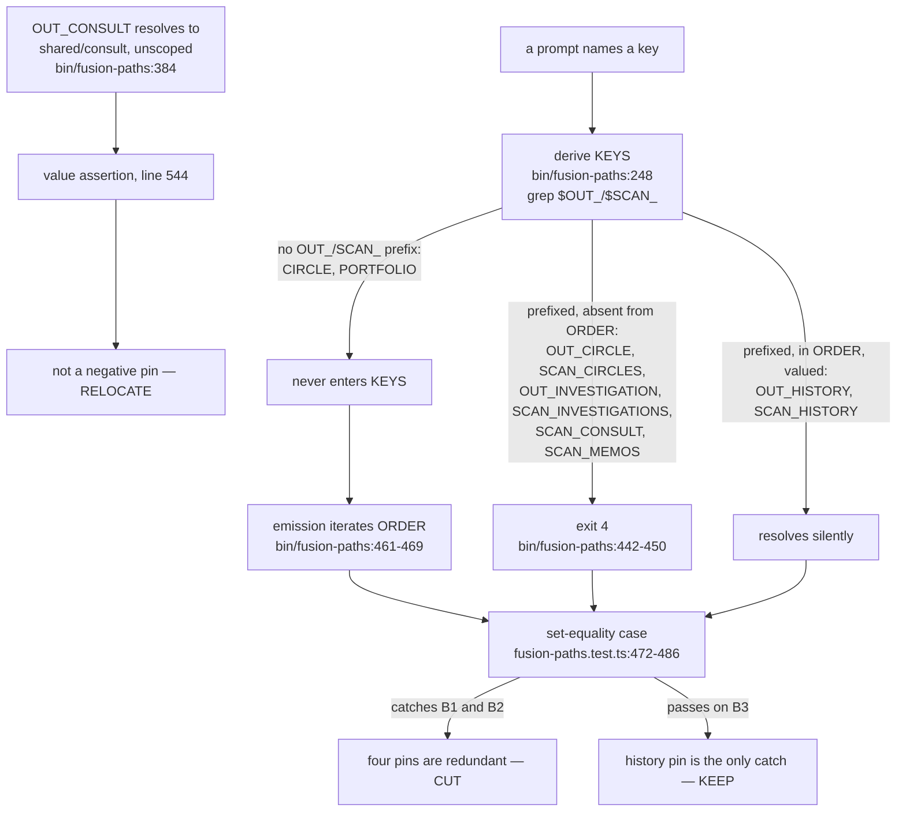

# Analysis: the cut search on both bounded surfaces

**Date:** 2026-09-17 15:08
**Type:** Gap
**Status:** Complete
**Requested by:** orchestrator (step B11 of `260917-1124_*_implementation-fusion-discuss-a-two-agent-discussion-loop.md`)

## Question

Commit B of the discuss work leaves two bounded surfaces red. Does a cut exist on either — one that removes dead subject matter or a duplicated assertion rather than reasoning somebody wrote — large enough to close the shortfall without a head-room raise? The user's ruling of 2026-09-17 is that the search happens first and is recorded the way the seven entries in `README-hooks.md` `#### The head-room raises, and the reduction read on 2026-10-10` record theirs: where the search fails, the impossibility is measured rather than asserted.

## Scope

Two surfaces, searched independently because their budgets are independent by construction (`hooks/lib/__tests__/helpers/growth-bound.ts`, `growth()`):

- `hooks/lib/__tests__/**.ts`, 60 files, measured in lines.
- `skills/*/SKILL.md`, 14 files, measured in bytes.

Read but not modified: `bin/fusion-paths`, `hooks/lib/__tests__/surface-growth-bound.test.ts`, `hooks/lib/__tests__/fusion-paths.test.ts`, `hooks/lib/__tests__/reference-resolution-lint.test.ts`, all fourteen skill bodies, `README-hooks.md`, and the prior analysis `260908-1346-the-cut-ledger-for-the-skills-surface-and-what-the-post-body-owes.md`.

Everything that mutated a file ran against a scratch copy of the tree under the session scratchpad. The live tree was read only.

**The tree these figures are dated by.** HEAD `c066bfd3058d8e4d6b2c35d721f35b06800bc2c1`, committed 2026-09-17T14:46:07+02:00, branch `main`, tracking `main...origin/main [voraus 4]` — four commits ahead of the remote, none behind, so nothing here is scoped to a stale tree. The working tree additionally carries the uncommitted output of steps B8 and B10: `skills/discuss/` is untracked (`git ls-files skills/discuss/` returns nothing) and `hooks/lib/__tests__/fusion-paths.test.ts` is modified. Every present-tense figure below is the working tree, not HEAD, because that is what the two bounds measure.

## Findings

### Both shortfalls re-measured, and both match the dispatch exactly

Read off `cd hooks && npx vitest run lib/__tests__/surface-growth-bound.test.ts` against the working tree:

| Surface | Total now | Floor | Head-room | Budget | Over by |
|---|---|---|---|---|---|
| `skills/*/SKILL.md` | 228 028 bytes | 188 768 | 24 911 | 213 679 | **14 349 bytes** |
| `hooks/lib/__tests__/**.ts` | 22 091 lines | 19 228 | 2 840 | 22 068 | **23 lines** |

Neither figure differs from the dispatch. Two subsidiary claims check out as well. `skills/discuss/SKILL.md` measures 14 350 bytes, so the surface without it stands at 213 678 — one byte inside its budget, which is the head-room the third `skills/` raise left. And the 23-line overage on the hook tests equals the addition B10 made, which is what a surface at exactly zero margin produces.

One correction to the dispatch, on a point that does not change either verdict. The dispatch describes "19 bytes added to `skills/cadence/SKILL.md` earlier in this work" as part of the present shortfall. That edit is already committed: `skills/cadence/SKILL.md` measures 22 271 bytes at HEAD and 22 271 in the working tree. The 19 bytes are inside the 5 348 that `cadence` stands above its baseline, and the working tree adds nothing further.

---

### Surface 1 — `hooks/lib/__tests__/**.ts`

#### The candidate the plan handed over, and what holds

The plan's reconnaissance named four negative pins in `fusion-paths.test.ts`. Its line numbers were taken before B10 inserted its case at line 225, so each block now sits 23 lines lower. Against the working tree:

| Pin | Lines now | Keys asserted absent |
|---|---|---|
| `it("emits no CIRCLE key, and no key naming the retired container")` | 156-167 | `CIRCLE`, `OUT_CIRCLE`, `SCAN_CIRCLES`, `PORTFOLIO` |
| `it("emits no investigation key to anyone — the kind lost both of them")` | 520-532 | `OUT_INVESTIGATION`, `SCAN_INVESTIGATIONS` |
| `it("emits no SCAN_CONSULT to anyone — the kind lost its read key")` | 534-545 | `SCAN_CONSULT` |
| `it("emits no SCAN_MEMOS to anyone — nothing reads memos")` | 547-551 | `SCAN_MEMOS` |

The plan's subsumption argument holds, and one half of it holds more strongly than the plan claims.

**The six prefixed keys exit 4.** `bin/fusion-paths:248` derives a consumer's key set by grepping its prompt for `\$(OUT|SCAN)_[A-Z][A-Z_]*`. `bin/fusion-paths:442-450` then rejects, with exit 4 and no output, any derived key absent from `ORDER` at `:416-419`. None of `OUT_CIRCLE`, `SCAN_CIRCLES`, `OUT_INVESTIGATION`, `SCAN_INVESTIGATIONS`, `SCAN_CONSULT`, `SCAN_MEMOS` appears in `ORDER` or has a `value_for()` arm. A prompt naming one therefore exits 4, and the parameterised case at `fusion-paths.test.ts:472-486` fails on its own `expect(r.status).toBe(0)` before it ever compares sets.

**`CIRCLE` and `PORTFOLIO` are barred twice, not once.** Neither carries an `OUT_`/`SCAN_` prefix, so the derivation regex at `:248` cannot admit either into `KEYS` whatever a prompt says; and emission at `:461-469` iterates `ORDER`, which holds neither. Two independent barriers, each sufficient. The pin asserts something no single-file edit can make false.

**The plan's decisive detail is correct.** The investigation pin's own comment claims it catches "re-adding an arm without a prompt to name it." Because the key set is derived from the prompt at `:248`, an arm added to `value_for()` and `ORDER` with no prompt naming it emits nothing, and the pin passes. It cannot catch what it says it exists to catch. The `SCAN_CONSULT` pin concedes the same redundancy in its own text at `:540`.

**The one pin to keep is genuinely load-bearing, and the distinction is real.** `it("emits no history key to any agent")` at 504-518 differs in the way the plan says. `OUT_HISTORY` has an arm at `bin/fusion-paths:369` and sits in `ORDER` at `:416`; `SCAN_HISTORY` has an arm at `:376` and sits in `ORDER` at `:418`. A prompt naming either resolves silently, the emitted set still equals the set the prompt names, and the parameterised case passes. Nothing else in the suite catches it. The pin stays.

#### Where the plan's cut is wrong, taken verbatim

Line 544, inside the `SCAN_CONSULT` block, is not a negative pin:

```
expect(parse(run(project, "consultant").stdout).OUT_CONSULT).toBe("shared/consult");
```

It is the **only** assertion anywhere in `hooks/lib/__tests__/` on the value `OUT_CONSULT` resolves to. A grep of the whole test directory returns two hits: the comment at `:537` and this line. The value matters more than most: `bin/fusion-paths:384` returns a bare `shared/consult` with no scope prefix, unlike every other `OUT_*` key, so `OUT_CONSULT` is the one output key that does not follow the work-item container rule. `it("emits no key it cannot resolve")` at 454-462 checks only that values are non-empty, and covers `orchestrator`, `reconciler` and `curator` rather than `consultant`.

Proved rather than argued. On a scratch copy with the plan's four pins removed exactly as written, `bin/fusion-paths:384` was mutated from `shared/consult` to `shared/consultation`. `fusion-paths.test.ts` ran **69 passed, 0 failed**. The plan's cut, taken verbatim, loses a real regression guard.

The repair costs one line. Moved into `it("routes writers to their own output kind")` at 447-452 — a case that is already four value assertions of exactly this shape, in a no-item scope where `shared/` is the right answer — the same mutation fails, on that case, with the rest of the file green.

#### Every other candidate opened, and why none was taken

| Candidate | Lines | Verdict |
|---|---|---|
| `it("emits no CIRCLE key…")` 156-167 | 12 | **Take.** Barred twice over; asserts nothing a live edit can falsify. |
| `it("emits no investigation key…")` 520-532 | 13 | **Take.** Subsumed by the exit-4 path; its stated rationale is false at HEAD. |
| `it("emits no SCAN_CONSULT…")` 534-545 | 12 | **Take, minus line 544.** The negative half is subsumed; the `OUT_CONSULT` value assertion is not, and moves. |
| `it("emits no SCAN_MEMOS…")` 547-551 | 5 | **Take.** Subsumed by the exit-4 path. |
| `it("emits no history key to any agent")` 504-518 | 15 | **Keep.** Both keys resolve; the set-equality case passes on them. Nothing else catches this. |
| `it("resolves the same values whatever the retired pointer holds")` 141-154 | 14 | **Keep.** Pins that the resolver does not open a leftover `.active-circle`. Live behaviour, asserted nowhere else. |
| `rules-emission-golden.test.ts`, the per-role overage block | 54 | **Refuse.** The plan already refused it: it is the deliberate output of decision 260805-1559, not an orphan, and taking it needs a ruling of its own. |
| `marker-format-lint.test.ts`, near-identical positive controls | 13 | **Refuse.** Same reason, and 13 lines does not reach the shortfall on its own in any case. |
| `it.skip` / `describe.skip` / `xit` / commented-out blocks, whole suite | 0 | **None exist.** The plan's reconnaissance found none; a fresh sweep agrees. |
| The ten files carrying no baseline entry, 1 811 lines in full | — | **Refuse.** `citation-form.test.ts` +352, `dispatch-bytes.test.ts` +223, `fusion-forum.test.ts` +220 and the rest are other subjects' reasoned tests. Thinning one to fund this is the trade decision 260805-1559 refuses and every previous entry re-refuses. |

#### The cut, and the suite that proves it

Applied to a scratch copy of the tree, bottom-up so the line numbers below hold as read:

1. Delete lines **519-551** — the blank separator and the three subsumed `it` blocks.
2. Insert one line after line **451**, inside `it("routes writers to their own output kind")`:
   `      expect(parse(run(project, "consultant").stdout).OUT_CONSULT).toBe("shared/consult");`
3. Delete lines **155-167** — the blank separator and the `CIRCLE` block.

46 lines out, 1 line in, **net 45 lines**. `hooks/lib/__tests__/fusion-paths.test.ts` goes 786 → 741 lines by the instrument's count.

The full hook suite ran on that scratch copy: **936 passed, 6 failed**. `fusion-paths.test.ts` is entirely green, and `holds hook-tests inside its own head-room of 2840 lines` passes. Of the six failures, three are in `committed-dist.test.ts` and one in `reference-resolution-lint.test.ts`; all four fail identically on an unmodified scratch copy, because the copy carries no `.git` and those cases shell out to git. The remaining two are the `skills` bound and the `skills` golden, which are surface 2's business and B13's. **The cut causes no new failure.**

It cannot move the reference-resolution baseline either: `surface()` in `reference-resolution-lint.test.ts:95-142` enumerates `hooks/lib/*.ts` and `hooks/*.ts` non-recursively, so `hooks/lib/__tests__/` is outside its scanned corpus.

#### What the surface stands at afterwards

22 091 − 45 = **22 046 lines** against an unmoved budget of 22 068, so **22 lines of margin**. This is the first margin above zero on this surface since the first of the four raises on 2026-09-16, each of which was spent to the line. The floor does not move: `fusion-paths.test.ts` keeps its baseline entry and the file still exists, so `floor` is 19 228 either way.

#### The relation the pins stand in



Coherence check: thirteen nodes, thirteen edges, no cycle, one clean top-down direction, no node fanning out past three. `V`/`G2`/`C3` form a second component rather than an orphan — the value assertion enters the block by position, not by the derivation path, which is the whole reason the plan's cut missed it, and the graph shows that separation rather than hiding it. Every edge is a relation the prose above states, and every relation the prose states is an edge.

#### Verdict, surface 1

**A cut exists, here it is, it is 45 lines.** Four negative pins in `hooks/lib/__tests__/fusion-paths.test.ts` come out (46 lines) and one value assertion moves into `it("routes writers to their own output kind")` (1 line back). The shortfall is 23 lines, so the cut covers it and leaves 22 lines of margin. **No raise is needed on this surface.** The plan's expectation that the cut would exceed the addition is met, with the one correction recorded above.

---

### Surface 2 — `skills/*/SKILL.md`

#### The shortfall, and the shape of the surface under it

228 028 bytes against a budget of 213 679: **over by 14 349**. Where the surface sits relative to its own floor, file by file:

| Body | Now | Baseline | Delta |
|---|---|---|---|
| `check` | 31 855 | — | **+31 855** |
| `discuss` | 14 350 | — | **+14 350** |
| `migrate` | 39 735 | 26 620 | +13 115 |
| `news` | 8 749 | — | **+8 749** |
| `reconcile` | 6 604 | — | **+6 604** |
| `post` | 6 228 | — | **+6 228** |
| `cadence` | 22 271 | 16 923 | +5 348 |
| `memo` | 12 969 | 12 336 | +633 |
| `commit` | 6 113 | 6 298 | −185 |
| `help` | 16 626 | 16 919 | −293 |
| `curate` | 11 863 | 12 398 | −535 |
| `archive` | 24 473 | 26 364 | −1 891 |
| `cleanup` | 6 768 | 23 674 | −16 906 |
| `setup` | 19 424 | 47 236 | −27 812 |
| **Total** | **228 028** | **188 768** | **+39 260** |

The nine bodies that carry a baseline entry measure 160 242 today against a floor of 188 768. **They already stand 28 526 bytes below their own floor.** `setup` has given back 27 812 and `cleanup` 16 906. The surface is over not because the budgeted bodies grew but because five bodies carrying no budget at all — `check`, `discuss`, `news`, `post`, `reconcile` — run to 67 786 bytes against head-room derived before any of them existed.

#### This surface has already been searched twice, and both searches were taken

The setup step asked me to cross-reference prior analyses rather than re-answer them, and one lands squarely here.

`260908-1346-the-cut-ledger-for-the-skills-surface-and-what-the-post-body-owes.md` (2026-09-08) is a full cut search over this surface. It produced a ten-row ledger totalling **−9 564 bytes**, every "after" figure measured off a drafted replacement, and a companion list of ten candidates it refused — `archive`'s tier tables, `help`'s per-topic quotes, `setup` Step 0k's output branches, cleanup's selector table, and every shell block anywhere. The ledger was taken: the source-root preamble it collapsed is gone from `cleanup` entirely, and the −27 812 and −16 906 in the table above are what a taken ledger looks like.

`README-hooks.md`, in the entry for the third `skills/` raise, records a second search eight days later: "a dead-text pass over the merged body banked 890 bytes and established that the remaining 2 211 do not exist as an honest cut." That search found 890 bytes and stopped.

The present shortfall, 14 349, is larger than either search's whole yield and larger than both together.

#### Every candidate opened in this search

A sweep over the six bodies most likely to carry residue — `check`, `news`, `post`, `reconcile`, `cleanup`, `cadence` — extracted every backticked `bin/…`, `agents/…`, `rules/…`, `skills/…`, `hooks/…`, `templates/…` and `docs/…` reference and every bare `fusion-*` helper mention, and tested each against the tree.

**Dead subject matter: 0 bytes.** Every path, helper, agent, rule, store and layout named in those bodies resolves. The things that read as dead and are not:

| Candidate | Bytes | Why it stays |
|---|---|---|
| `check` `## leftovers`, 309-332 | 2 466 | The three files it names are written by nothing at this version, but the section is live detection-and-removal behaviour for upgraded projects, and `rules/workbench-tracking.md` names all three. Cutting it deletes working code. |
| `check` line 231, the retired second identity condition | 580 | Narration of why a check is absent. Reasoning about a deliberate removal. |
| `cadence` line 73, the retired `o`/`c` codes | 604 | Marked "retired but still readable" — a live instruction for legacy logs. |
| `cadence` line 43, adopting a legacy `-$USER` log | 465 | A live rename procedure. |
| `check` line 8, the ramp-up history | 454 | Explains why a live marker cache exists. |
| `check` line 44, the concurrency cache caveat | 414 | A live warning about a live selector. |
| `cadence` line 15, churn counted in days | 347 | A live instruction. |
| `check` line 153, the `fusion-guard.json` sentence | 299 | Live: `hooks/lib/config.ts:418` still carries the file and `:521`/`:553` still emit the advisory. |
| `cleanup` line 13, the removed issue-sweep | 299 | Narration of a deliberate removal. |
| `migrate` and `setup`, everywhere they name a superseded layout | — | Those two bodies exist to recognise and convert superseded layouts. `CLAUDE.md` names them as the exemption. |
| `help`, the three stacked upgrade notes (11.5.0, 11.4.1, 11.3.0) | ~3 100 | Live user-facing text on a window the body already prunes — line 98 records the 11.3.0 paragraph dropping off the end. Shortening the window is a policy change, not a dead-matter cut, and 3 100 does not reach the shortfall anyway. |

Every one of the eleven rows in `check`'s selector table has a live backing binary, helper or template, and the eleven rows match the eleven `##` sections and `setup`'s `SEL` array in the same order.

**Cross-body duplication: at most 1 299 bytes, and the defensible residue is near zero.**

| Duplicated block | Copies | Cuttable | Verdict |
|---|---|---|---|
| The source-root resolve shell | `help` 19-30 (466), `news` 24-34 (465), `archive` 28-35 (412), `setup` 141-145 (315) | 877 | **Refuse.** Executable shell. A skill body cannot run shell that lives in another body, and the 2026-09-08 ledger's refusal 7 already rules on shell blocks. The surrounding prose differs in every copy and is each body's own. |
| The chat-language pointer | `post` 12, `news` 18, `curate` 125, identical at 141 each | 282 | **Refuse on substance.** Each copy is itself a one-line citation of `rules/fusion-workbench-conventions.md` `## Project language`. Deleting two removes pointers, not duplicated substance. |
| The workbench-root halt line | `cleanup` 36 and `reconcile` 27, identical at 140 | 140 | **Refuse.** Same shape: a one-line pointer each body needs to stand alone. |
| The exit-code recitations | `post` 21, `news` 45, `cadence` 31, `discuss` 22 | 0 | **Not duplication.** Each names a different key set and glosses only the exits its own body meets. All four already cite `## Path Resolution → Exit codes`. |
| `check` ↔ `setup` shared shell | ~660 across six lines | 0 | **Not citable.** Opposite procedures — setup seeds and computes due, check compares and stamps — and `skills/setup/SKILL.md:137` already states the citation was made. |

The bodies that could cite instead of restate already do, and say so in eight places: `post:37` ("that obligation is authored here rather than cited"), `post:8`, `cleanup:69`, `reconcile:73`, `check:205`, `check:233`, `setup:137`, `cadence:95`.

**Best case across the whole search: 1 299 bytes against 14 349. Short by 13 050.** Strip out anything whose removal would stop a body running standalone and the residue is 282 bytes of duplicated one-line pointers, which are citations rather than duplicated substance. The honest figure is closer to nothing.

#### The impossibility, measured the way the previous entries measure it

The addition is `skills/discuss/SKILL.md` at 14 350 bytes against 1 byte of margin.

Stripped of every blank line it is **14 273 bytes**, leaving the surface 14 272 over.

Stripped to its frontmatter, its nineteen headings and its fenced shell blocks — that is, with every sentence of reasoning in the body deleted, including the entry-block shape, the stopping rule and the inverted-assertion note that tells a later reader what they would be reversing — it is **2 557 bytes** (441 frontmatter, 565 headings, 1 717 fenced code). The surface would then measure 216 235 against a budget of 213 679: **still 2 556 bytes over**.

Deleting the whole of the new body's reasoning does not close the gap. No cut inside the addition can exist, whatever the trade one is willing to make, and the 14 349 would have to come out of other bodies' live prose — which is the trade decision 260805-1559 refuses, which the 2026-09-08 ledger refused in ten enumerated places, and which the 2026-09-16 pass refused again at a tenth of this size.

#### Verdict, surface 2

**No cut exists, and here is the measurement that says so.** Dead subject matter across the surface totals 0 bytes. Cross-body duplication tops out at 1 299 bytes, of which the defensible residue is 282 bytes of one-line pointers — against a shortfall of 14 349, short by at least 13 050. And stripped of every blank line the addition is still 14 273 bytes, stripped of every sentence of reasoning it is still 2 557, so deleting all of its reasoning leaves the surface 2 556 over and buys nothing. The nine budgeted bodies already stand 28 526 bytes below their own floor from two prior searches that were both taken. **A raise of exactly 14 349 bytes is the only branch left on this surface.**

---

### One finding outside both surfaces

`hooks/lib/__tests__/reference-resolution-lint.test.ts` is red on the live tree and no step of the plan covers it. `BASELINE` at `:464` pins `{ paths: 1625, anchors: 268, stampBare: 11 }`; the working tree resolves `{ paths: 1636, anchors: 272, stampBare: 11 }`, which is +11 paths and +4 anchors from B8's new body and B9's two edits to `README-agents.md`, both inside the gate's scanned surface. The gate's own failure text names re-approval as the expected response and says it belongs in the commit that caused the drift.

This is unrelated to the cut — the cut cannot move those counts, since `hooks/lib/__tests__/` is outside `surface()` — but step B13's acceptance criterion is that the full suite is green from a clean checkout, and it cannot be met until the pin is re-approved. Filed as an issue.

## Implications

The hook-test surface comes out of commit B better than it went in. Four raises on 2026-09-16 were each spent to the line, leaving zero margin three times over, and the fourth raise's own entry says the next line added anywhere in the suite turns the suite red. The cut gives that surface 22 lines of working room and takes back none of the accounting: no baseline moves, so every line added under the four raises still counts as growth above an unmoved floor.

The `skills/` surface tells the opposite story, and the numbers say why rather than leaving it to judgement. Two full searches have already been run and taken, the budgeted bodies sit 28 526 bytes below their floor, and the surface is still over — because five bodies worth 67 786 bytes carry no budget at all. That is a floor problem presenting as a head-room problem, and a fourth raise will not be the last one while it stands. It is not this work's to fix: moving a baseline is governed by three named events in `hooks/lib/__tests__/helpers/growth-bound.ts`, and none of them fires here.

One correction for whoever writes the raise entry. The third raise's entry states the four unbudgeted bodies at "52 842 bytes running in full." That figure is exact at `9d5b1e80`, the commit that landed it. Today the same four measure **53 436** — `check` +611, `news` −17 — so the entry's figure is 594 stale. Quoting it forward in the present tense is the error `260916-0734_*_the-head-room-raise-log-states-a-surface-total-and-two-margins-that-no-committed-tree-holds.md` was filed for.

## Recommendations

**Step B12, hook-test surface — take the cut, raise nothing.** Apply the three edits in `#### The cut, and the suite that proves it`, bottom-up. Do not take the plan's cut verbatim: line 544 must move, and the mutation result above is why. Write the search into `README-hooks.md` as a found-cut entry, with the margin read at the landing commit rather than from this document.

**Step B12, `skills/` surface — raise `SKILL_HEAD_ROOM` by exactly 14 349 bytes, 24 911 → 39 260, and no more.** That is the fourth raise of this constant and the eighth overall; the standing raise above the derived 20 000 goes +4 911 → +19 260, and the table at `README-hooks.md:545` and its restore-target column both read net of it. The entry carries the figure before and after, that no baseline moved with it, what it bought, what this search found — 0 bytes of dead matter, at most 1 299 of duplication — and the stripped measurement above. Correct the 52 842 to 53 436 while in that section, or date it.

**Step B13** — re-approve `BASELINE` in `reference-resolution-lint.test.ts` to `{ paths: 1636, anchors: 272, stampBare: 11 }` alongside the golden regeneration, checking the received numbers against B8's and B9's edits as the gate's text requires.

**Nobody, yet — but it needs an owner.** The five unbudgeted bodies are the standing cause of this surface's pressure. That is a baseline question under event 1 or event 2 in `helpers/growth-bound.ts`, needs its own ruling, and does not belong to the discuss work.

## Filed Issues

- `260917-1508_*_the-reference-resolution-pin-is-red-on-commit-bs-tree-and-no-step-re-approves-it.md`

## Sources

- `260917-1124_*_implementation-fusion-discuss-a-two-agent-discussion-loop.md:216-227` — step B11
- `hooks/lib/__tests__/surface-growth-bound.test.ts:346-364` (`SKILL_BASELINE`), `:377` (`TEST_LINE_BASELINE`), `:433`, `:435` (the two head-room constants)
- `hooks/lib/__tests__/helpers/growth-bound.ts` — `growth()`, and the three re-baselining events
- `hooks/lib/__tests__/fusion-paths.test.ts:141-154`, `:156-167`, `:447-452`, `:454-462`, `:470-486`, `:504-518`, `:520-532`, `:534-545`, `:547-551`
- `hooks/lib/__tests__/reference-resolution-lint.test.ts:95-142` (`surface()`), `:464` (`BASELINE`), `:511-513`
- `bin/fusion-paths:248` (key derivation), `:369`, `:376`, `:384` (arms), `:416-419` (`ORDER`), `:442-450` (exit 4), `:461-469` (emission)
- `README-hooks.md:541-...` — the seven prior head-room entries and the reduction table
- `260908-1346-the-cut-ledger-for-the-skills-surface-and-what-the-post-body-owes.md:83-102` (the ledger), `:159-207` (the ten refused candidates)
- All fourteen `skills/*/SKILL.md`
- `git show 9d5b1e80:skills/{check,news,reconcile,post}/SKILL.md` — the 52 842 figure at its own commit

## Open Questions

- [ ] The five unbudgeted skill bodies (67 786 bytes) are the standing cause of this surface's pressure and no event in `helpers/growth-bound.ts` currently addresses them. Whether that is an event-2 arming, an event-1 settle, or something the rule does not yet name is unruled and needs the user.
