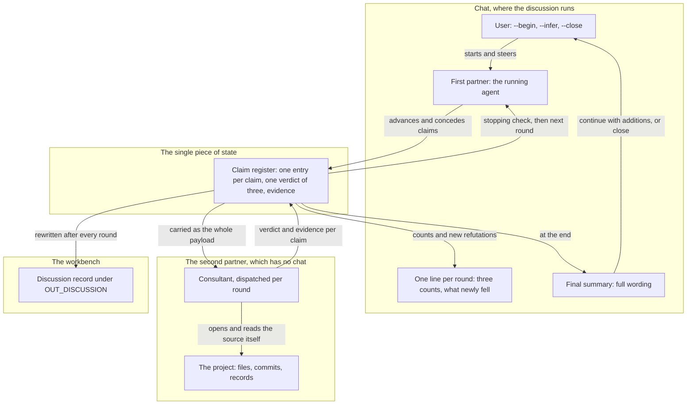

# Spec: `/fusion:discuss` — a two-agent discussion loop with a claim register

**Date:** 2026-09-17
**Status:** Draft
**Source:** Work item `260916-1050-neues-discuss-feature.md` `## Directive`, eight numbered points and two questions the user left open. Both open points were put back to him and answered on 2026-09-17; the answers are recorded under the capabilities they settle.

## Directive

A user at any point in a chat can start a discussion between the agent he is talking to and a second, independent one, and watch it converge or fail to converge over a bounded number of rounds. The discussion runs in the chat. A claim register carries every statement, its verdict and its evidence from the first round onward, and it is written to one file in a new `discussions/` store as it goes, so that losing the session loses nothing.

## Capabilities

### C1: The `/fusion:discuss` command and its three switches

**Description:** The user starts, inspects and closes a discussion from the chat, without naming a file or a path. A discussion begins at whatever point in the conversation he invokes it, optionally with a sentence saying what should be examined.

**Behaviour:**

- `--begin <reference from the chat>` starts a discussion on that reference. An invocation with no switch means `--begin`, taking whatever text follows as the topic and the preceding exchange as the reference.
- `--infer` prints the register's current conclusions in the chat and leaves the discussion open.
- `--close` writes the final recommendation, moves the record to its closed state, and ends the discussion.
- There is no `--continue`. Within one session the model carries the thread across operational interruptions by itself.
- One discussion is open per session. `--begin` while another is open reports the open discussion's topic and asks whether to close it first.
- `--infer` or `--close` with no discussion open reports that none is running and does nothing else.

**Acceptance criteria:**

- [ ] `/fusion:discuss --begin <reference>` produces a record file on disk before the first round's result reaches the chat.
- [ ] `/fusion:discuss` with no switch and a trailing sentence starts a discussion whose topic is that sentence.
- [ ] `/fusion:discuss --infer` prints conclusions and the record afterwards is still in its open state.
- [ ] `/fusion:discuss --close` leaves a record in its closed state carrying a recommendation.
- [ ] `/fusion:discuss --infer` in a session with no open discussion prints a statement that none is running and writes no file.
- [ ] `/fusion:discuss --begin` while a discussion is open names the open topic and waits for an answer before starting a second.
- [ ] The string `--continue` appears nowhere in the shipped body.

**Decisions made:**

- Switch set and the absence of `--continue`: fixed by the user in the directive.
- One open discussion per session, with `--begin` asking rather than silently starting a second: default, chosen because two open discussions would make `--infer` and `--close` ambiguous with no argument to disambiguate them.

### C2: The first discussion partner is the running agent

**Description:** The agent the user is already talking to is the first partner. Where that is neither the orchestrator nor the consultant, the ordinary session takes part.

The reason is structural rather than a preference. A skill body becomes a prompt to the assistant that is currently running, so the first partner is whoever received it. Naming a different agent would mean dispatching that agent as a sub-agent, and a sub-agent has no chat, which gives up the property the directive's first point requires.

**Acceptance criteria:**

- [ ] The shipped body names no parameter, switch or head field for selecting the first partner.
- [ ] A discussion started in a session running neither the orchestrator nor the consultant completes and produces a record.
- [ ] The record names both partners.

**Decisions made:**

- First partner is always the running agent (user's answer, 2026-09-17, to the first of the two questions the directive left open). Option 2, a named partner started as a sub-agent, was declined because it moves the discussion out of the chat. Option 3, refusing to run outside the orchestrator and the consultant, was declined because it removes availability and buys nothing.

### C3: The second partner is the consultant

**Description:** The second partner is the existing consultant agent, dispatched by the first partner with the claim register as its payload. It reads the project, returns a verdict per claim, and writes nothing.

No twelfth agent is created. The sentence in `agents/consultant.md` restricting the consultant to user invocation is deleted, together with the two sentences in `agents/orchestrator.md` that repeat it. That deletion brings three files into line with a ruling already made: the decision of 2026-09-13 dropped the dispatch ban and recorded that the consultant's exclusion survives only as prose on the same footing as every other agent's.

The consultant is the right agent for the job because its obligations already are the ones this loop needs. Its reliability mandate requires it to treat another agent's statements as evidence rather than as conclusions, and to open the underlying file before repeating a claim. Nothing has to be added to the prompt for that; the mandate that makes the consultant suitable is the mandate it already carries.

**Acceptance criteria:**

- [ ] No new agent prompt is added; `agents/` holds eleven files after the change as before.
- [ ] `agents/consultant.md` carries no sentence restricting the agent to user invocation.
- [ ] `agents/orchestrator.md` carries no sentence excluding the consultant from dispatch.
- [ ] The dispatch the first partner sends carries the register, the material the claims are about, and a statement that a claim holding up is a complete result.
- [ ] A round in which every claim comes back as checked is recorded as a completed round, and the loop treats it as progress toward stopping.
- [ ] The consultant writes no file during a discussion.

**Decisions made:**

- The consultant rather than a new agent: fixed by the user in the directive, on the ground that a twelfth prompt would mean a hand-written row in a measured file with no room.

### C4: The claim register

**Description:** One structure carries the whole state of a discussion. It is the payload of every dispatch to the second partner, which has no chat of its own; it is what the stopping rule is evaluated against; it is what `--infer` prints; and at the end it is the record. There is no second file and no pointer file.

**What one entry carries:**

| Field | Content |
|---|---|
| Identifier | A short stable label, unique within the discussion, so a later round can name an earlier claim |
| Claim | One sentence, stating something that could be false |
| Advanced by | The first partner or the second |
| Entered | The round the claim first appeared in |
| Verdict | Exactly one of the three classes below |
| Evidence | For checked and refuted, a citation to what was read: a file, a commit, a command and its result, or a record. For undecidable, the input that is missing |
| Last moved | The round the verdict last changed |
| Contested | Present only where the two partners disagree about the verdict and neither concedes |
| Conceded | Present only where a partner gave up the claim: which partner, in which round, and the evidence that felled it |

**The three verdict classes:**

1. **Checked.** The second partner opened the underlying source and the claim holds.
2. **Refuted.** The second partner opened the underlying source and the claim does not hold.
3. **Not decidable from the inputs at hand.** The entry names the input that would decide it.

The split is disjoint and complete over the entries a reader can ever see, and this is the argument that it is. A claim entering in round N receives a verdict in round N, because the round is the dispatch that returns verdicts for every entry. The register is read at three moments only: the stopping check, `--infer` and the write. All three fall after a round, so no entry is ever observed without a verdict.

Disagreement is not a fourth class. The verdict is the second partner's finding, and `contested` records that the first partner refuses it. Keeping the two separate is what keeps the three classes exhaustive, and it is also what lets the stopping rule count the third class without having to decide what a disputed entry counts as.

Conceding is allowed and wanted. A concession that does not name the claim that falls and the evidence that felled it is not recorded as a concession, because without those two the entry states only that somebody stopped arguing.

**Acceptance criteria:**

- [ ] Every entry in a written record carries an identifier, a claim, the partner who advanced it, the round it entered, a verdict and evidence.
- [ ] Every entry's verdict is one of exactly three values, and no entry carries two.
- [ ] An entry marked undecidable names the missing input.
- [ ] An entry marked conceded names the conceding partner, the round, and a citation.
- [ ] An entry marked contested carries both partners' positions.
- [ ] The dispatch to the second partner contains the register in full.

**Decisions made:**

- Contested as a flag beside the verdict rather than as a fourth verdict: default, chosen so that the three classes stay exhaustive and the stopping rule's count stays unambiguous.

### C5: The stopping rule

**Description:** The loop stops on one of two conditions, both decidable from the register alone, and the record says which one fired and after how many rounds.

**Condition A, convergence.** After a round, the register holds no entry with the undecidable verdict, and that round produced no new refutation: no entry entered at refuted, and no entry moved to refuted from another verdict.

**Condition B, the ceiling.** The round count reaches eight.

**Precedence and the edge cases:**

- Condition A is evaluated before condition B, so a discussion that converges on round eight is recorded as converged rather than as not converged.
- Where the ceiling fires, the outcome is "did not converge after eight rounds". That is a regular outcome and is recorded as one, not as a failure.
- The user may extend the ceiling by a number of rounds he names. Each extension and the ceiling it produced go into the record.
- A register holding no claims after round one stops under condition A and reports that there was nothing to check. Without this clause the degenerate case would be recorded as a convergence, which would be false.

The actual round count goes into the record in every case. The point of recording it is measurement: the count tells the project later what these discussions really cost, instead of leaving it to recollection.

**Acceptance criteria:**

- [ ] The stopping check reads only the register.
- [ ] A discussion whose last round left the undecidable class empty and produced no new refutation stops.
- [ ] A discussion in which each round produces a new refutation runs to exactly eight rounds and then stops.
- [ ] A discussion that reaches the ceiling produces a record stating that it did not converge and naming the round count.
- [ ] A discussion that converges on the eighth round is recorded as converged.
- [ ] A discussion whose register is empty after round one stops and states that there was nothing to check.
- [ ] Every record carries the round count actually run and the ceiling in force.
- [ ] An extension the user granted appears in the record with its new ceiling.

**Decisions made:**

- Both conditions, the ceiling of eight, the user's power to extend, and the round count in the record: fixed by the user in the directive.
- Condition A ahead of condition B, and the empty-register clause: defaults, each added because the directive's rule as written gives two answers or a false answer in that case.

### C6: What the user sees, and the record he gets

**Description:** During the rounds the chat carries one line per round. It states how many claims stand checked, how many refuted and how many not decidable, and what newly fell in that round. The full wording of the claims, the verdicts and the evidence comes at the end, with the summary on which the user decides whether to continue with additions of his own or to close.

**The record.** A new record kind, cut over the statement rather than over the process. It holds the reasoning that was disputed, what survived checking, what was given up, and a qualified recommendation that binds nothing. A decision record may rest on it; the discussion record itself decides nothing.

**File format:**

```markdown
# <one-line topic>

---
**Domain:** code | data
**Filed by:** <agent name>, <person>
**Partners:** <first partner> and consultant
**Rounds:** <count actually run>
**Ceiling:** <the ceiling in force, and each extension>
**Outcome:** converged | did not converge after <N> rounds | nothing to check
**Cross-references:** <basenames>

---

## Question

<What was put up for discussion, and the point in the conversation it came from.>

## What held up

<One block per entry whose verdict is checked: the claim, and the evidence it was checked against.>

## What fell

<One block per entry whose verdict is refuted: the claim, the evidence that felled it, and, where a partner gave it up, which partner and in which round.>

## What could not be decided

<One block per entry whose verdict is undecidable: the claim, and the input that would decide it.>

## Open dissent

<One block per contested entry: both positions, and what each rests on. Omitted when there is none.>

## Recommendation

<Qualified, and binding nothing. Written at --close.>
```

The record is markered on the filename, `YYMMDD-HHMM_o_<topic>.md` while the discussion is open and `_c_` once it closes, using the issues-and-planning vocabulary. It is the first record kind that lies on disk unfinished, which is what the markerless kinds do not do: a review, an analysis and a consultation are each written once and complete. A reader who finds an `_o_` discussion is reading an interrupted one, and the closed state is terminal, so re-opening a discussion means starting a new one that cites it.

**Write timing.** The whole file is rewritten after every round from the register. `--close` writes the recommendation and renames the marker, and does nothing else. A session that dies leaves a record in the open state carrying everything through the last completed round.

**Store.** `$OUT_DISCUSSION`, which resolves into the container of the work item in scope and into `shared/discussions/` when there is none. That follows the Origin Rule with no new judgment: a discussion started under an item's directive belongs to that item.

**Acceptance criteria:**

- [ ] Each round adds exactly one line to the chat, carrying three counts and what newly fell.
- [ ] The full wording appears once, at the end.
- [ ] A record exists on disk after round one, carrying every head field it will ever carry.
- [ ] Killing the session after round three leaves a record in the open state carrying three rounds.
- [ ] `--close` changes the marker from open to closed and adds a recommendation.
- [ ] Every claim in the register appears in exactly one of the four claim sections.
- [ ] The recommendation states that it binds nothing.
- [ ] A discussion run while a work item is claimed writes into that item's container.

**Decisions made:**

- One line per round, full wording at the end (user's answer, 2026-09-17). The literal reading of the directive's first point would be the full wording every round; it was declined because eight rounds of it make the chat unreadable, which costs the user the thread the visibility was meant to give him.
- The state marker rather than a markerless name: default, on the ground that no markerless kind is ever written unfinished and this one always is.
- `**Filed by:**` on the template: default. The record names positions held by named parties and a decision may rest on it, so the person half carries weight. Adding the line is what makes the kind owe it, under the 2026-08-27 ruling on which kinds owe that field.

### C7: The `discussions/` store's arrival

**Description:** A new store is not one edit. Every surface that enumerates the workbench's stores learns the new name in the same change, or it reports the store as unknown or fails to see its records.

**Surfaces that must change:**

1. `bin/fusion-paths` — a `value_for()` case arm for `OUT_DISCUSSION`, and the key added to `ORDER`. A key absent from `ORDER` is dropped silently.
2. `skills/discuss/SKILL.md` — must contain the literal `$OUT_DISCUSSION`. The resolver derives a consumer's key set by reading the consumer's own text, so a key no prompt names is never emitted.
3. `hooks/lib/__tests__/path-literal-lint.test.ts` — `"discussions"` added to `TYPE_FOLDERS`, the directory list the path check reads.
4. `rules/fusion-workbench-conventions.md` `## fusion-workbench Layout` — the layout tree, in both the container block and the `shared/` block.
5. `rules/fusion-workbench-conventions.md` `## Filename Patterns` — a row giving the kind, its write target, its pattern and its marker vocabulary.
6. `rules/fusion-workbench-conventions.md` `## Record filing` — a row in the kind-and-store table saying when a discussion record is owed.
7. `rules/workbench-path-resolution.md` — a row in the key table.
8. `hooks/lib/citation-scan.ts` — the store alternation the citation grammar reads, so that a citation carrying the new store segment is recognised as store-prefixed.
9. `hooks/lib/staging-drift.ts` — its own copy of the store list.
10. `hooks/lib/citation-corpus.ts` — whether a discussion record enters the citation corpus, which decides whether citations inside one are checked.
11. `README-agents.md` — the skills table. A lint reads every `/fusion:` token in that file, fails on one naming no directory, and asserts the match in the other direction, so a new skill directory that is not named there fails the suite.
12. `skills/cadence/SKILL.md` — the activity log's letter codes. Without a code for the new kind, a discussion filed on a day never appears in the activity log.

**Surfaces that deliberately do not change, each for a stated reason:**

- `skills/archive/SKILL.md` enumerates its tiers positively, so a kind it does not name is unreachable from a tier. A discussion record is therefore archive-class only on the user's explicit ask, which is how consultations and analyses already behave.
- `rules/workbench-tracking.md` classifies the workbench's root entries, and a work item's container travels whole in one class. A new subdirectory inside a container splits nothing.
- No `SCAN_DISCUSSIONS` key is added. No prompt reads past discussions in this version, and a key no prompt names restates nothing.

**Acceptance criteria:**

- [ ] `bin/fusion-paths discuss` prints an `OUT_DISCUSSION` line whose value ends in `discussions`.
- [ ] With a work item claimed, that value points inside the item's container; with none claimed, it points into the shared store.
- [ ] The full test suite passes after the change.
- [ ] A path literal naming the new store inside a shipped agent or skill body fails the path check.
- [ ] A citation carrying the new store as a path segment is reported as store-prefixed.
- [ ] A discussion record filed today appears in the activity log with its own code.
- [ ] No `SCAN_DISCUSSIONS` key is emitted for any consumer.

### C8: The byte budgets this work must pay

**Description:** Three of the plugin's four growth bounds are touched, and the figures in the directive's eighth point are out of date. Everything below was re-measured at commit `f0aa5b77`.

**The skill bodies.** `skills/*/SKILL.md` measures 213 659 bytes against a budget of 213 679, so **20 bytes of head-room, not the 612 the directive states**. A file with no baseline entry is charged at its whole size, so a new `skills/discuss/SKILL.md` lands in full. `SKILL_HEAD_ROOM` is raised by the shortfall the finished body actually measures, no baseline moves, and the raise is written into the log in `README-hooks.md` beside the seven before it, naming the figure before and after and what it bought. The user agreed to this raise in principle; only its size changes.

**The hook test suite.** `hooks/lib/__tests__/**.ts` measures 22 068 lines against a budget of 22 068, so **zero lines of head-room**. The directive does not name this bound. The user ruled on 2026-09-17 that a cut inside the suite covering the new test case is searched for first and the search is recorded, the way the seven previous entries record theirs. Where a cut is found it is taken instead of a raise. Where none is found, the impossibility is measured rather than asserted, and `TEST_LINE_HEAD_ROOM` is raised by what the new case actually measures.

**The eleven dispatch paths.** The deletions in `agents/consultant.md` and `agents/orchestrator.md` cost nothing, because they are deletions. The additions to `rules/fusion-workbench-conventions.md` are charged to all eleven paths, since every agent loads that file. The tightest path is `curator`, which stands 78 022 bytes below its baseline row, so the additions fit.

**That last figure rests on head-room the project's own bound says should not exist, and whoever plans against it should see what it stands on.** `CLAUDE.md` fell from 93 432 bytes to 8 114 on 2026-09-16 and no baseline moved with it. Every one of the eleven rows therefore stands about 85 000 bytes above what its path now measures, on a bound whose fixture header states that head-room is zero and that this is not a budget. The fixture header reasons about a discrepancy of exactly this kind and sizes it at 2 039 bytes; it does not argue for 85 318. The effect is the mirror image of the move the user refused for the rate surfaces on 2026-09-11, where a piece of work that only cuts never banks its savings as head-room. So point eight's conclusion holds, and it holds on slack the project may well decide to take back. Filed as `260917-1115_*_the-claude-md-cut-banked-85-kb-of-slack-into-a-bound-whose-header-says-head-room-is-zero.md`. If those rows are re-armed before this work lands, the dispatch-path arithmetic here must be re-measured rather than reused.

**Acceptance criteria:**

- [ ] The full test suite passes after the change.
- [ ] No baseline map and no baseline fixture is edited by this work.
- [ ] The `SKILL_HEAD_ROOM` raise is logged with the figure before, the figure after, what it bought, and the cut that was looked for first.
- [ ] Any `TEST_LINE_HEAD_ROOM` raise is logged the same way, and its entry states what the search for a cut in the suite found.
- [ ] The dispatch-path figures are re-measured at the commit the work lands on, not carried over from this spec.

## The shape



**Two cycles are drawn, and both are intended.** The inner one runs first partner to register to consultant and back, and it is the loop itself, bounded by the stopping rule in C5 rather than left open. The outer one runs user to discussion to summary and back to the user, and it is the directive's first point: the user decides whether to continue with additions of his own or to close.

**The register is a node with far more edges than any other, and that is the design rather than a flaw in the drawing.** Seven arrows touch it, against three at the first partner and two everywhere else. The directive's sixth point makes it the only state there is, so every other component reaches it: the first partner writes claims into it, the consultant writes verdicts into it, the chat line and the final summary read out of it, the stopping check reads it, and the record is it. A design in which one of those went somewhere else would be the design the sixth point rules out.

## Stops when

- If the search for a cut inside the hook test suite finds lines that cover the new test case, the raise of `TEST_LINE_HEAD_ROOM` does not happen and the cut is taken instead.
- If the eleven dispatch-path rows are re-armed before this work lands, the measurement in C8 is void and the work stops until the additions to `rules/fusion-workbench-conventions.md` have been measured against the new rows.
- If the finished `skills/discuss/SKILL.md` cannot be written inside the raise the user grants for it, the work stops and the size is put back to him rather than absorbed by a second raise nobody ruled.

## Constraints

- No twelfth agent. The consultant is the second partner, and the three sentences excluding it from dispatch are deleted rather than qualified.
- One file, one place, written from round one. `--close` only finalises. No pointer file, and a session that dies loses nothing.
- `--continue` is deliberately absent.
- Conceding is allowed and wanted, and a concession names the claim that falls and the evidence that felled it. For the second partner, a claim holding up is a complete and cost-free result. Nothing in the dispatch or the record rewards a refutation.
- Unresolved disagreement goes into the record as open dissent rather than being resolved by either partner.
- Storage stays inside `fusion-workbench/` in this version.
- What the plugin ships is English, whatever the project's two language declarations say. The record bodies follow the artifact language.
- A baseline never moves for this work. Head-room is raised, logged, and left above an unmoved floor.

## Out of Scope

- **Storage outside the workbench (`research/`, `logbook/`). Deferred, not dropped.** The user ruled on 2026-09-17 that it does not enter the first version. Two obstacles are recorded here so that a later job starts from them rather than rediscovering them. Such a path cannot come from `bin/fusion-paths`, so it would need an argument or a head field, and both bypass the single resolution point. And the citation check is rooted at `fusion-workbench/` with a fixed additional list covering `CLAUDE.md`, `rules/`, `.claude/rules/` and `docs/`, so citations inside a record stored anywhere else would never be checked.
- A `SCAN_DISCUSSIONS` key and any pass that reads past discussions.
- Naming the first partner, in any form.
- Resuming a closed discussion. A closed record is terminal; continuation is a new discussion citing it.
- Re-arming the eleven dispatch-path rows. The defect is filed and the choice belongs in a decision record of its own.
- Fixing the stale count in the dispatch bound's own prose, filed as `260917-1115_*_the-dispatch-path-bounds-prose-counts-fifteen-paths-against-a-fixture-holding-eleven-rows.md`.

## Open for Planner

- The register's representation between rounds. The spec fixes the fields an entry carries and says nothing about how the first partner holds it.
- The wording and structure of the dispatch the first partner sends to the consultant.
- The letter code the activity log gets for the new kind.
- Whether a discussion record enters the citation corpus, and what that costs in the citation gates.
- The order of the work, and which of the twelve surfaces in C7 can land in one commit.
- Where the new test case sits and what it asserts, within the bound C8 sets on it.

## User Decisions Pending

- [ ] None. All four questions from the clarification round are answered, and the two the directive left open are settled in C2 and the Out of Scope section.

---

**Cross-references:** `260916-1050-neues-discuss-feature.md`, `260917-1115_*_the-claude-md-cut-banked-85-kb-of-slack-into-a-bound-whose-header-says-head-room-is-zero.md`, `260917-1115_*_the-dispatch-path-bounds-prose-counts-fifteen-paths-against-a-fixture-holding-eleven-rows.md`, `260913-0909_*_may-the-orchestrator-reach-every-tool-and-may-an-agent-dispatch-another.md`, `260913-1108_*_the-positive-dispatch-rule-turns-on-an-undefined-word-and-leaves-both-exclusions-bound-to-the-orchestrator-alone.md`, `260909-1634_*_how-should-the-skill-surface-be-cut-once-the-agent-and-ceremony-cut-has-landed.md`, `260822-1154_*_does-a-cut-only-circle-re-baseline-the-surfaces-it-cuts.md`

---

## Corrections after approval

- **C6, the `**Outcome:**` head field.** The value set in C6's file format above is terminal-only, while C6's own acceptance criterion puts the record on disk from round one "carrying every head field it will ever carry". Between `--begin` and `--close` the field therefore had no legal value, and the three listed partition only the ways a discussion finishes. The implementation adds a fourth, `still running`, written at `--begin` and replaced at `--close` by the one the stopping rule produced; the four are disjoint and complete over the states a record can be in. Filed as `260917-1559_*_the-outcome-head-field-is-mandatory-at-begin-and-its-value-set-has-no-member-for-a-running-discussion.md`, fixed in `skills/discuss/SKILL.md`. The spec body above is left as approved.
