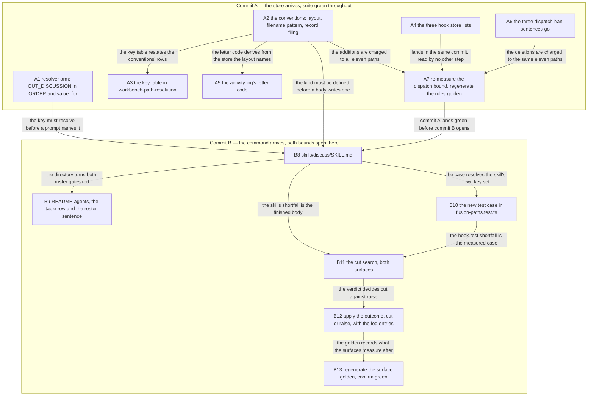
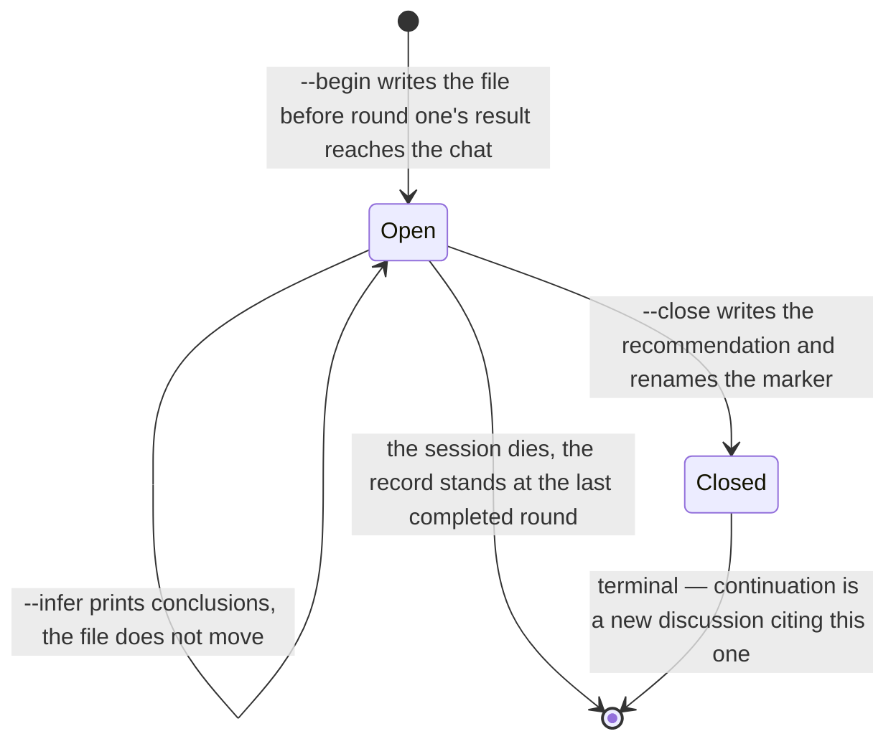

# Implementation Plan: `/fusion:discuss` — a two-agent discussion loop with a claim register

**Date:** 2026-09-17
**Status:** Draft
**Spec:** `260917-1119_*_spec-fusion-discuss-a-two-agent-discussion-loop.md`, approved by the user at 11:27 on 2026-09-17
**Decidability:** The load-bearing question is whether the loop's stop is decidable from the register alone. It is. Condition A reads two properties of the register (does any entry carry the undecidable verdict; did this round produce a refutation that was not there before) and condition B reads a counter. Both are total, because every entry is written carrying a verdict in the round it enters and the register is read only after a round. One field is *not* a settled fact when it is written, and the design keeps it out of the stop: `contested` means "neither partner has conceded as of this round", a per-round reading a later round may clear. A rule that asked "has anyone conceded for good" would be undecidable at every round but the last, the deciding input being a future round. C4 avoids that question rather than approximating it, by making the verdict the second partner's finding and `contested` a flag the stopping rule never reads. No change of mechanism is needed.

## Directive

Build `/fusion:discuss` as the spec defines it: a bounded discussion between the agent the user is already talking to and the consultant, with a claim register as the only state, written to a new `discussions/` store from round one. The spec carries eight capabilities and their acceptance criteria; this plan does not restate them. What it adds is the six answers the spec left under `## Open for Planner`, the order the twelve-plus surfaces land in, and the arithmetic of the three growth bounds this work touches.

## Current State

Everything below was measured at `f0aa5b77`, the commit this plan was written against.

**The two bounded surfaces this work spends.** `skills/*/SKILL.md` measures 213 659 bytes against a budget of 213 679, so 20 bytes of head-room. `hooks/lib/__tests__/**.ts` measures 22 068 lines against a budget of 22 068 (floor 19 228 plus `TEST_LINE_HEAD_ROOM` 2 840), so zero lines. Both figures confirm the spec's C8.

**The dispatch-path figures in C8 are stale, and the conclusion survives the correction.** C8 names `curator` as the tightest path at 78 022 bytes below its baseline row. Re-measured here by summing each path's three components against `hooks/lib/__tests__/fixtures/dispatch-path.baseline`, the tightest is `reviewer` at 81 471 bytes of slack, with `curator` second at 83 739; the rule component of both is confirmed against `hooks/lib/__tests__/fixtures/rules-emission.golden`. The additions this plan calls for are a few hundred bytes, so they fit against either figure. That slack is the 85 KB the `CLAUDE.md` cut banked, filed as `260917-1115_*_the-claude-md-cut-banked-85-kb-of-slack-into-a-bound-whose-header-says-head-room-is-zero.md`, and step A7 re-takes the measurement at the landing commit rather than trusting this paragraph.

**C7's list of twelve surfaces is missing one, and the gate that catches it is already armed.** `hooks/lib/__tests__/derivable-enumerations-lint.test.ts` holds *two* independent checks over the skill roster. The first asserts that `README-agents.md`'s skill table has exactly one row per skill directory, which is C7's eleventh surface. The second is anchored to a sentence rather than to the table: it finds the line in a shipped document carrying the claim "asserts the match in the other direction too", reads every `/fusion:<name>` token on that one line, and requires the set to equal the skill directories exactly. That line is the roster bullet in `README-agents.md`'s plugin-structure section, and it drifted on its own once before, naming no `post` while the table beside it was complete. So `README-agents.md` takes two edits in two places, gated separately. The plan carries it as surface 13.

**No `discussions` token exists anywhere in the tree.** Adding the store to the citation grammar's alternation and to the two hook store lists therefore changes no existing verdict, and its whole effect is on tokens somebody writes after the change.

**Three sentences ban the dispatch C3 needs.** `agents/consultant.md:150` ("Not dispatched by the orchestrator. You are user-initiated only. The orchestrator does not route tasks to you."), `agents/orchestrator.md:170` (a clause inside the sub-agent list), and `agents/orchestrator.md:604` (the `Never invokes` bullet). The decision that already retired the ban, `260913-0909_*_may-the-orchestrator-reach-every-tool-and-may-an-agent-dispatch-another.md`, stands at `_a_`: answered, unrealised. Step A6 realises it.

## Approach

The work is one design decision repeated at every surface: **the record file on disk is the register**, and everything else reads or rewrites that one file. No second representation exists in the model, in a scratch file, or in a pointer. From there the twelve-plus surfaces split cleanly into two commits by a single test: whether a surface's edit is gated on `skills/discuss/` existing.

Commit A is the store's arrival. Every surface in it is green with no skill directory present, because the resolver derives a consumer's key set by grepping that consumer's own prompt, so an `OUT_DISCUSSION` arm that no prompt names is emitted to nobody and costs nothing. Commit A therefore lands on a green suite and spends no head-room on either bounded surface.

Commit B is the command. It is the commit that cannot be subdivided: the moment `skills/discuss/` exists, both roster gates go red until `README-agents.md` carries the row and the sentence, and the skill body's bytes land against 20 bytes of head-room. Every head-room question this work raises is confined to commit B, which is what lets the two raises be measured against a finished artifact rather than against a projection.

### The six answers the spec left open

**1. The register's representation between rounds: the record file is the register.** C4 says one structure carries the whole state and there is no second file; C6 says the whole file is rewritten after every round. Read together, the only representation that satisfies both without holding state twice is the record itself. A round is a read of the file, a dispatch built from it, and a rewrite of it. `--infer` reads the same bytes. The stopping check reads the same bytes. C6's acceptance criterion that killing the session after round three leaves a record carrying three rounds then holds by construction, rather than resting on the model having remembered to project hidden state onto disk.

That answer forces a correction to C6's file format. C6 describes a section's block as "the claim, and the evidence it was checked against", which is narrower than the nine fields C4 requires an entry to carry, and C4's acceptance criterion ("every entry in a written record carries an identifier, a claim, the partner who advanced it, the round it entered, a verdict and evidence") settles the conflict in C4's favour. So there is **one entry-block shape**, used in all four claim sections:

```markdown
### <identifier> — <claim, one sentence>

- **Advanced by:** <first partner | consultant>
- **Entered:** round <N>
- **Last moved:** round <N>
- **Evidence:** <citation, or, under "could not be decided", the missing input>
- **Conceded:** <partner>, round <N> — <citation>
- **Both positions:** <first partner's> / <consultant's>
```

The verdict is **not** a field in the block. The section the block sits in is the verdict, which is what makes C6's criterion "every claim appears in exactly one of the four claim sections" the disjointness property rather than a second thing to check; writing the verdict twice would give the two copies somewhere to drift. `Conceded` and `Both positions` are present only in the cases C4 names for them and absent otherwise, following the convention `## Backlog entries — work items` already sets for a field with nothing to say.

**2. The dispatch to the consultant.** It carries a parameter block in the form this project's dispatches already use, then a body. The parameters are `**Round:**` (the number about to run) and `**Executors:** none` is not among them, since the consultant dispatches nobody. The body carries four blocks in this order:

- **The register, verbatim**, as the four claim sections stand after the previous round. C4's acceptance criterion requires it in full, so it is pasted rather than summarised or pointed at.
- **The material**, as paths, commit hashes and the point in the conversation the discussion came from. The consultant opens these itself; the dispatch does not quote conclusions from them.
- **The return contract.** One verdict per entry, from the three classes, with evidence for checked and refuted and the missing input for undecidable. The consultant may advance claims of its own, which enter at a verdict in the same round.
- **The symmetry statement**, which C3's acceptance criterion mandates: a claim that holds up is a complete and cost-free result, and nothing in this dispatch or in the record rewards a refutation over a confirmation.

Two instructions close it. **Write no file**: the consultant's own prompt gives it `$OUT_CONSULT` and a consultation-report mode, and C3 requires it to write nothing during a discussion, so the dispatch says so rather than relying on the consultant inferring it. And **you have no `AskUserQuestion`**: it runs non-interactively as a sub-agent, so a question it cannot resolve is an undecidable verdict naming the missing input, which is the third class doing exactly the job it exists for.

**3. The activity log's letter code: `s`.** The codes in use are `g h p i d r a n t b w`, with `o` and `c` retired but readable. `d` is decisions and `i` is issues, so `discussions` cannot take either. The precedent for a kind whose initial is taken is `consult`, which took `t`, its last letter; `investigations` took `n` on the same principle of reaching into the word. `discussions` takes `s`, its last letter, which is free in both the live and the retired set. The legend in `skills/cadence/SKILL.md` step 3 gains the row, and the derivation rule there already handles the rest: a code comes from the containing directory's basename, and a discussion record sits in `discussions/`.

**4. A discussion record does not enter the citation corpus, and the store does enter the citation grammar.** The two are separate surfaces answering separate questions, and C7 lists both without saying they diverge.

`hooks/lib/citation-corpus.ts` gains no clause, so `isLiveRecord` returns false for a discussion record by falling through, exactly as it does for the markerless kinds. The criterion that produces that answer is the one worth carrying forward: **a record kind enters the corpus when a person writes it and stops; a kind a mechanism rewrites is out, whatever marker it carries.** That binds every kind added after this one, so the reasoning and the two options refused are filed as a decision record rather than held here (`## Open Questions`), and the comment step A4 writes into the corpus file is where it lands in the tree.

The cost is real and is visible rather than hidden. `bin/fusion-citation-check` prints every row it finds in any file it walks and narrows only its verdict by the corpus, so a dangling citation inside a discussion record reaches whoever runs the checker and never fails the suite. That is the reporter-versus-verdict split the corpus file already defines, used here as intended rather than as a residual.

`hooks/lib/citation-scan.ts` is the other half and does change. `discussions` joins the store alternation, and the reason is citations *of* a discussion record written in live records, not citations inside one. Store-prefixing is read off a token's shape before any lookup, so without the alternation a decision record resting on a discussion and citing it with the store segment in front would carry a segment no gate reports, and that citation would die at the next archive sweep. With the alternation the writer is told to drop it. The cost today is zero, because no such token exists in the tree.

**5. The order of the work.** Two commits, split on whether a surface's edit is gated on `skills/discuss/` existing. The reasoning is in `## Approach` above and the edges are in the diagram below. Seven steps land commit A green; six land commit B.

**6. The new test case: one `it` in `hooks/lib/__tests__/fusion-paths.test.ts`, and most of the coverage is free.** That file's parameterised block asserts, for every agent and every skill, that the emitted key set equals the set the prompt names. `discuss` joins `[...AGENTS, ...SKILLS]` automatically the moment the directory exists, so C7's requirement that a key no prompt names is never emitted, and that a key the prompt names is never withheld, is covered at zero lines. What that block does not cover is the only genuinely new contract: the value `OUT_DISCUSSION` resolves to. The new case asserts three things, and the third is the one worth its lines:

- With no item claimed, `OUT_DISCUSSION` is `shared/discussions`.
- With the alpha work item claimed, which is the fixture the file's claimed-item block already builds, it is that item's container joined to the store segment, exactly as the block's existing `OUT_ISSUE` and `OUT_DECISION` assertions spell it.
- **No consumer receives `SCAN_DISCUSSIONS`.** This is an inverted assertion: it pins a deliberate absence, so adding a read key to a prompt fails here rather than silently widening the key set, and C7's last acceptance criterion becomes a gate rather than a sentence. It needs a comment saying it is inverted, on the precedent `claude-md-weight.test.ts` set, or a later reader "fixes" it into a positive assertion and reverses the spec's `## Out of Scope` ruling by accident.

The case sits inside the existing claimed-item `describe`, so it reuses that fixture and adds no setup. The measured cost is step B11's input, not this plan's projection.

## The shape

Two graphs. The spec's `## The shape` already draws the runtime architecture and is not redrawn here. What this plan adds is the dependency ordering of its own steps and the lifecycle of the record the work creates.



`A4` has one outgoing edge and it is an ordering edge into commit A's landing step, not a dependency: the three hook store lists are edits no other step reads. The graph is drawn top-down with no edge running against the grain and no cycle, which is the property the runtime graph deliberately does not have (its two cycles are the loop itself). The dependency claims in the prose above and the edges here are the same set.



The two self-loops on `Open` are the reason the kind needs a marker at all, and they are also the reason answer 4 keeps it out of the citation corpus: a state a record can occupy indefinitely, rewritten by a machine each time it is re-entered, is not a state a blocking gate can be armed over.

## Implementation Steps

Every step names exactly one executor from the active set. The routing criterion used throughout: markdown that defines the workbench's stores, record kinds and codes goes to `ontocoder`, because it is the workbench's data documentation; markdown that defines agent or skill behaviour, and every `.ts` and `bin/` file, goes to `coder`.

### Commit A — the store arrives

1. [DONE] **The resolver arm**
   - Executor: `coder`
   - Files: `bin/fusion-paths`
   - Changes: add `OUT_DISCUSSION) printf '%s' "$OUT_BASE/discussions" ;;` to `value_for()`, beside `OUT_ANALYSIS`, and add `OUT_DISCUSSION` to `ORDER` in the `OUT_*` group. No `SCAN_DISCUSSIONS` arm, in either place. Extend the header comment's note on kinds with a write key and no read key, which already carries `OUT_MEMO` and the retired `SCAN_CONSULT`, with the third case and its reason: no prompt reads past discussions in this version.
   - Dependencies: none
   - Acceptance: `bin/fusion-paths orchestrator` is unchanged, since no prompt names the key yet. The full suite is green. `grep -c SCAN_DISCUSSIONS bin/fusion-paths` is 0.

2. [DONE] **The conventions learn the kind**
   - Executor: `ontocoder`
   - Files: `rules/fusion-workbench-conventions.md`
   - Changes: three sections. In `## fusion-workbench Layout`, add `discussions/` to the container block and to the `shared/` block of the tree. In `## Filename Patterns`, add a row: kind "Discussion", written to `$OUT_DISCUSSION`, pattern `YYMMDD-HHMM_S_<topic>.md`, state marker "yes (issues/planning vocabulary, `_o_` and `_c_` only)". In `## Record filing`, add a row to the kind-and-store table: filed when a bounded discussion was run, whatever it concluded. State in the `## Filename Patterns` row's vicinity that this is the one marker-carrying kind written while unfinished, since `## State Markers — issues and planning` otherwise implies a marker moves only when somebody decides something.
   - Dependencies: none
   - Acceptance: the tree blocks and the two tables each name `discussions` exactly once. The file is charged to all eleven dispatch paths, so step A7 measures it. The full suite is green.

3. [DONE] **The key table**
   - Executor: `ontocoder`
   - Files: `rules/workbench-path-resolution.md`
   - Changes: one row in the key table, `OUT_DISCUSSION` with no read key and the value `<scope>/discussions`, with the note saying why there is no `SCAN_DISCUSSIONS`: a key set restates the prompts, and no prompt reads past discussions in this version. That is the same criterion the `OUT_MEMO` row already states, so the note cites it rather than re-arguing it.
   - Dependencies: A2 (this table restates the conventions' rows, so the conventions settle the wording first)
   - Acceptance: the row's value column matches `value_for()` in `bin/fusion-paths` exactly. The full suite is green.

4. [DONE] **The three hook store lists**
   - Executor: `coder`
   - Files: `hooks/lib/citation-scan.ts`, `hooks/lib/staging-drift.ts`, `hooks/lib/__tests__/path-literal-lint.test.ts`
   - Changes: add `discussions` to the `STORES` alternation in `citation-scan.ts`, to the `STORES` array in `staging-drift.ts`, and to `TYPE_FOLDERS` in `path-literal-lint.test.ts`. The comment on `staging-drift.ts`'s list says it is `TYPE_FOLDERS` minus the three retired review folders; that relation stays true and needs no edit. Add a clause to `citation-scan.ts` noting that the store's entry is for citations *of* a discussion record written elsewhere, since nothing reads citations written inside one.
   - Dependencies: none
   - Acceptance: `path-literal-lint.test.ts` now fails on a `discussions/` path literal in any agent or non-exempt skill body, provable by splicing one into a scratch copy. No existing citation in the tree changes verdict, provable by running `bin/fusion-citation-sweep` or `bin/fusion-citation-check` before and after and comparing the counts. The full suite is green, and the hook-test surface is unchanged in lines or grows by the comment lines this step adds, which must be counted into step B11's arithmetic if it grows.

5. [DONE] **The activity log's letter code**
   - Executor: `ontocoder`
   - Files: `skills/cadence/SKILL.md`
   - Changes: add `· \`s\` discussions` to the codes list in step 3, and the matching row to the legend table the digest writes. Nothing else: the code derivation rule in that body already reads a code from the containing directory's basename, so the store needs no special handling in the scan.
   - Dependencies: A2 (the code derives from a store the layout defines)
   - Acceptance: the codes list and the legend table agree. This edit grows a skill body, so its byte cost is counted into step B11's `skills/` arithmetic. The full suite is green.

6. [DONE] **The three dispatch-ban sentences go**
   - Executor: `coder`
   - Files: `agents/consultant.md`, `agents/orchestrator.md`
   - Changes: delete the `Not dispatched by the orchestrator` bullet from `agents/consultant.md`'s `## What the Consultant is NOT`. In `agents/orchestrator.md`, delete the `consultant` bullet from the `Never invokes` list, leaving the `orchestrator` recursion bullet and the introductory sentence that now governs one entry rather than two. In the sub-agent list, delete the clause "and `consultant` is not among them (**Never invokes** below)". **Do not add `consultant` to the orchestrator's routing table.** The routing table answers which executor a *task* goes to, and the consultant is not an executor; what this change enables is the orchestrator dispatching the consultant as the first partner when the user invokes `/fusion:discuss` in an orchestrator session. Adding a tenth routing row would move a cardinality this plan has no reason to move and would put a claim in the prompt that C3 does not make.
   - Source: `260913-0909_*_may-the-orchestrator-reach-every-tool-and-may-an-agent-dispatch-another.md`, at `_a_`. This step realises the recorded answer; the decision transitions to `_i_` once the work commits, with an `Implemented:` line citing that commit.
   - Dependencies: none
   - Acceptance: `grep -n "user-initiated only" agents/consultant.md agents/orchestrator.md` returns nothing. The word "nine" beside the sub-agent list still names nine agents, enumerated. The full suite is green, and both files shrank, which trips no bound.

7. [DONE] **Re-measure the dispatch bound and land commit A**
   - Executor: `coder`
   - Files: `hooks/lib/__tests__/fixtures/rules-emission.golden` (regenerated, not hand-edited)
   - Changes: regenerate with `cd hooks && UPDATE_RULES_GOLDEN=1 npx vitest run lib/__tests__/rules-emission-golden.test.ts`, which rewrites the fixture and then fails on purpose; review the diff and re-run. Then report, per path, the total against its baseline row, so the eleven figures are on record at the landing commit rather than carried from this plan. **No baseline and no head-room constant is touched by this step.**
   - Dependencies: A2 and A6 (the only two steps that change a dispatch path's bytes); A3 and A5 are ordered behind A2 and land in the same commit.
   - Acceptance: `DISPATCH_HEAD_ROOM` is still 0 and `hooks/lib/__tests__/fixtures/dispatch-path.baseline` is byte-identical to its state at `f0aa5b77`. Every one of the eleven paths is inside its row. The full suite is green. The report states the tightest path's remaining slack, and if any path is over, the work stops here under `## Where this work stops`.

### Commit B — the command arrives

8. **The skill body**
   - Executor: `coder`
   - Files: `skills/discuss/SKILL.md` (new)
   - Changes: the whole command. Frontmatter carries `description`, `argument-hint: "[--begin <reference>] [--infer] [--close]"` and `allowed-tools: [Bash, Read, Write, Edit, AskUserQuestion, Agent(fusion:consultant)]` — namespaced, or the dispatch does not resolve. The body carries: step 1, resolve `$OUT_DISCUSSION` through `bin/fusion-paths discuss` and halt on a non-zero exit with the code read against the conventions' table; the three switches and their no-switch default; the one-open-discussion rule and what `--begin` asks when one is open; the entry-block shape from answer 1 above and the record template from C6's `## File format`, corrected per answer 1; the dispatch to the consultant from answer 2; the stopping rule from C5 with condition A evaluated before condition B and the empty-register clause; the one-line-per-round chat output and the final summary. The string `--continue` appears nowhere. No store path literal appears anywhere: the body names `$OUT_DISCUSSION` and nothing else, which is also what makes the resolver emit the key.
   - Dependencies: A1 (the key must resolve), A2 (the kind must be defined)
   - Acceptance: `bin/fusion-paths discuss` prints `OUT_DISCUSSION=shared/discussions` with nothing claimed. `grep -c -- --continue skills/discuss/SKILL.md` is 0. `path-literal-lint.test.ts` passes over the new body. The body's byte size is measured and reported, since it is step B11's input. The two roster gates are **expected red** at the end of this step; B9 clears them.

9. **README-agents' two roster surfaces**
   - Executor: `coder`
   - Files: `README-agents.md`
   - Changes: two edits in two places, both gated separately. Add the table row in the exact shape the parser reads, `| \`/fusion:discuss\` | \`skills/discuss/SKILL.md\` | <what it does> |`. And add `/fusion:discuss` to the roster bullet in the plugin-structure section, the single line carrying the claim "asserts the match in the other direction too", where it belongs among the situational commands rather than among the three that are the ordinary session surface.
   - Dependencies: B8 (the directory must exist, or the gates fail in the other direction)
   - Acceptance: `derivable-enumerations-lint.test.ts` is green on both roster checks. `README-agents.md` is on no bounded surface, so the bytes cost nothing.

10. **The new test case**
    - Executor: `coder`
    - Files: `hooks/lib/__tests__/fusion-paths.test.ts`
    - Changes: one `it` inside the existing claimed-item `describe`, asserting the three properties in answer 6. The third assertion is inverted and carries a comment saying so, naming what a later reader would be reversing if they "fixed" it: the spec's `## Out of Scope` ruling that no pass reads past discussions in this version. Write it in full and run it green **before** anything is asked for on the head-room, which is the precedent every previous raise entry sets.
    - Dependencies: B8 (the skill's key set must resolve)
    - Acceptance: the case passes. The hook-test surface's new line count is measured exactly and reported, which is step B11's second input. The surface is **expected red** on `TEST_LINE_HEAD_ROOM` at the end of this step.

11. **The cut search, on both bounded surfaces**
    - Executor: `analyst`
    - Files: writes one analysis to `$OUT_ANALYSIS`; reads `hooks/lib/__tests__/**/*.ts` and `skills/*/SKILL.md`; changes nothing
    - Changes: two searches with one method and a stated outcome, not a formality. For each surface, the analysis must (a) state the exact shortfall measured off the working tree at that moment, (b) enumerate the candidates it opened and say for each whether removing it loses a real regression guard, and (c) return one of two verdicts per surface: *a cut exists, here it is, it is N lines or N bytes*, or *no cut exists, and here is the measurement that says so*.
      - The hook-test surface **starts from a candidate this plan already found and verified**, so the search opens it first rather than beginning cold. A reconnaissance pass over all 58 files at `f0aa5b77` returned exactly one cut it was willing to defend: four negative pins inside `fusion-paths.test.ts`, at lines 156-167, 497-509, 511-522 and 524-528, about 46 lines between them. They assert that no consumer receives `CIRCLE`, `OUT_CIRCLE`, `SCAN_CIRCLES`, `PORTFOLIO`, `OUT_INVESTIGATION`, `SCAN_INVESTIGATIONS`, `SCAN_CONSULT` or `SCAN_MEMOS`. All four sit inside the very `describe` whose parameterised case already asserts, for every agent and every skill, that the emitted set equals the set the prompt names, in both directions; and none of the eight keys has a `value_for()` arm or an `ORDER` entry, so a prompt naming one exits 4 and fails that case and two others. The decisive detail, verified here: the investigation pin's stated rationale is false at HEAD. It claims to catch "re-adding an arm without a prompt to name it", and since the key set is derived by grepping the prompt, such an arm emits nothing and the pin passes. It cannot catch what it says it exists to catch. The `SCAN_CONSULT` pin's own comment concedes the redundancy outright.
      - **One pin in the same block must be kept and the search says so explicitly.** `it("emits no history key to any agent")` at lines 481-496 is not redundant: `OUT_HISTORY` and `SCAN_HISTORY` *do* have arms and *are* in `ORDER`, so a prompt naming one would resolve silently and the set-equality case would pass. That case catches something nothing else catches.
      - The two weaker candidates are recorded so the search does not rediscover them and so its verdict can say why they were refused: 54 lines in `rules-emission-golden.test.ts` that compute a per-role overage and assert only `roles.size > 0`, which cannot fail since the universal-core bound was retired, and which are the deliberate output of decision 260805-1559 rather than an orphan; and 13 lines of near-identical positive controls in `marker-format-lint.test.ts`. Neither is taken without a ruling.
      - The search targets **dead subject matter and duplicated assertions**, not verbosity. A block that only reads as wordy is **not** a candidate, because deleting reasoning to fund another subject's cases is the trade the 2026-08-05 decision already refuses and every previous entry re-refuses. The reconnaissance found no `it.skip`, `describe.skip`, `xit` or commented-out block anywhere in the suite, and found that this project has consistently deleted a test file together with the mechanism it covered, so the retired mechanisms leave almost no residue. For context on the surface's shape, the ten files carrying no baseline entry are charged in full: `citation-form.test.ts` 352, `dispatch-bytes.test.ts` 223, `fusion-forum.test.ts` 220, `claude-md-weight.test.ts` 208, `fusion-claimed-item.test.ts` 192, `plan-size.test.ts` 163, `work-graph.test.ts` 156, `session-start-event.test.ts` 150, `live-circle-record-detection.test.ts` 77, `declared-citation-paths.test.ts` 70.
      - The `skills/` surface: the shortfall is the finished body from B8 plus A5's legend edit, against 20 bytes. A cut inside a skill body is looked for on the same terms, and the four bodies carrying no baseline entry (`check`, `news`, `reconcile`, `post`, 52 842 bytes running in full) are where the standing pressure is. Report whether a cut exists there that removes no live substance.
    - Dependencies: B8 and B10 (both shortfalls must be measured against artifacts that exist and run green, not projected)
    - Acceptance: the analysis names a figure, not an adjective, for each surface, and each verdict is one of the two forms above. It opens the named candidate first and either confirms it by taking the four pins out on a scratch branch and running the suite green, or says which of the subsumption claims above fails and why. Where it says no cut exists, it says so the way the previous entries do: stripped of every comment and blank line the addition is still N lines, so deleting all of its reasoning leaves the surface N over and buys nothing. **The likely outcome on the hook-test surface is a cut rather than a raise**, since 46 lines is larger than any reasonable measurement of B10's case, and the analysis should treat a contrary result as a finding worth explaining rather than as a routine shortfall.

12. **Apply the outcome, and write both log entries**
    - Executor: `coder`
    - Files: `hooks/lib/__tests__/surface-growth-bound.test.ts` (constants only), `README-hooks.md`, plus whatever files B11 named for a cut
    - Changes: for each surface, take the branch B11 returned. Where a cut exists, **take the cut and raise nothing**, and write the cut into the log all the same, because a search that found something is as much a part of the account as one that did not. Where none exists, raise that surface's head-room constant by exactly the measured shortfall and no more. On the hook-test surface the expected branch is the cut, and taking it leaves the surface with margin above zero for the first time in four raises, which the log entry states as a figure at the landing commit. Then write one entry per raise into `README-hooks.md` `### The head-room raises, and the reduction read on 2026-10-10`, matching the seven entries before it: the constant, the date, the figure before and the figure after, `+N`, the sentence that no baseline moved with it, the running total above the derived figure and the table update that follows from it, who ruled and when, what it bought, **what the search for a cut found**, and what is left of it. **No baseline map and no baseline fixture is edited by this step**, which is the constraint the whole of commit B is arranged around.
    - Dependencies: B11
    - Acceptance: `git diff` shows no change to `SKILL_BASELINE`, `TEST_LINE_BASELINE`, `AGENT_BASELINE`, `RULE_BASELINE` or `hooks/lib/__tests__/fixtures/dispatch-path.baseline`. Each raise's entry carries all four mandated facts. The table in `### Growth bounds on the shipped text` and the standing-raise column both read net of the change. If the finished body cannot be written inside the raise the user grants for `skills/`, the work stops under `## Where this work stops` rather than taking a second raise.

13. **Regenerate the surface golden and land commit B**
    - Executor: `coder`
    - Files: `hooks/lib/__tests__/fixtures/surface-growth.golden` (regenerated, not hand-edited)
    - Changes: `cd hooks && UPDATE_SURFACE_GOLDEN=1 npx vitest run lib/__tests__/surface-growth-bound.test.ts`, review the diff, re-run. Report the margin each of the two surfaces stands at after the landing, as a figure read at the landing commit rather than mid-way, which is the correction `260916-0734_*_the-head-room-raise-log-states-a-surface-total-and-two-margins-that-no-committed-tree-holds.md` was filed for.
    - Dependencies: B12
    - Acceptance: the full suite is green. `npm test` passes from a clean checkout. Every acceptance criterion in C7 and C8 is verifiable against the landed tree.

## Where this work stops

- Commit A lands with every one of the eleven dispatch paths inside its baseline row, and step A7 reports the tightest path's slack measured at that commit rather than quoted from this plan.
- If any dispatch-path row is re-armed before commit A lands, this plan's arithmetic is void and the work stops until the additions to `rules/fusion-workbench-conventions.md` have been re-measured against the new rows. The re-arming is out of scope here and belongs to `260917-1115_*_the-claude-md-cut-banked-85-kb-of-slack-into-a-bound-whose-header-says-head-room-is-zero.md`.
- Step B11 returns one of its two verdicts for each of the two bounded surfaces, and step B12 takes the branch that verdict names. Where a cut is found, the raise does not happen.
- Where a raise is taken, its entry in `README-hooks.md` carries the figure before, the figure after, what it bought, and what the search for a cut found. An entry missing any of the four is not a landed step.
- No baseline map and no baseline fixture is edited anywhere in this work. A `git diff` over `SKILL_BASELINE`, `TEST_LINE_BASELINE`, `AGENT_BASELINE`, `RULE_BASELINE` and `hooks/lib/__tests__/fixtures/dispatch-path.baseline` is empty at both landing commits.
- If the finished `skills/discuss/SKILL.md` cannot be written inside the raise the user grants for it, the work stops and the size goes back to the user rather than being absorbed by a second raise nobody ruled.
- The decision record on the citation corpus (`## Open Questions`) is answered before step A4 lands, or step A4 lands only its `citation-scan.ts` and `staging-drift.ts` halves and the corpus question stays open.
- Both commits leave `npm test` green from a clean checkout. A red suite at either landing is not a landed commit.
- The eight acceptance criteria of C7 and the five of C8 are each verified against the landed tree and reported, not assumed from a green suite.

## Data Structures

The claim register, which is the record file, is the only structure this work introduces; answer 1 gives its entry shape. Two of an entry's nine fields are carried structurally rather than written: the verdict is the section the block sits in, and the identifier is the block's heading. No type is added to any `.ts` file, and the three hook store lists gain a string each.

## API Changes

`bin/fusion-paths` gains one key, `OUT_DISCUSSION`, valued at `<scope>/discussions`. No key is removed, no existing value changes, and no `SCAN_DISCUSSIONS` is added, which the new case pins. `bin/fusion-citation-check` and `bin/fusion-citation-sweep` recognise one more store segment, with exit codes and output shape unchanged.

## Testing Strategy

One new case, in `hooks/lib/__tests__/fusion-paths.test.ts`, asserting the three properties in answer 6. Everything else rides gates that are already armed and that this work keeps green: the parameterised key-set block picks up `discuss` for free, `path-literal-lint.test.ts` picks up the store the moment `TYPE_FOLDERS` names it, `derivable-enumerations-lint.test.ts` holds both roster surfaces, `rules-emission-golden.test.ts` holds the dispatch-path bound, and `surface-growth-bound.test.ts` holds the two spent surfaces.

The cost of that leverage is a suite that is red for most of commit B by design. B8 and B10 each leave it red on purpose and B9 and B12 clear the two reds; an executor that starts repairing after B8 has misread the plan, and both steps say so in their acceptance criteria.

## Risks & Mitigations

| Risk | Mitigation |
|---|---|
| The dispatch-path slack is taken back between this plan and the landing, voiding C8's arithmetic | Step A7 re-measures at the landing commit and the work stops if any path is over; the plan never reuses this document's figures as fact |
| The executor reaches for `TEST_LINE_HEAD_ROOM` when B10 turns the suite red, skipping the search | B10's acceptance criterion states the red is expected; B11 is a separate dispatch to a separate executor, so the search cannot be folded into the step that feels the pressure |
| The cut search finds only verbose comments and is reported as "no cut exists" | B11's acceptance criterion requires the impossibility to be measured the way the previous entries measure it, as a stripped line count, not asserted; and it opens a named, pre-verified candidate first, so a "no cut" verdict has to refute something concrete |
| The four pins are cut and one of them was covering something after all | B11 confirms the cut by removing them on a scratch branch and running the whole suite green before B12 takes it; the one pin in that block that is genuinely load-bearing is named and excluded by hand |
| A second `skills/` raise is taken quietly when the first proves too small | The spec's stop condition is carried verbatim into `## Where this work stops`; the size goes back to the user |
| The executor adds `consultant` to the orchestrator's routing table while removing the ban | A6 states the distinction and forbids it explicitly, with the reason |
| C6's narrower block description is implemented instead of C4's nine fields | Answer 1 states the conflict and which capability settles it, and gives the block shape literally |
| `README-agents.md`'s roster sentence is missed, since C7 names only the table | Carried as surface 13 in `## Current State` and as its own change in step B9, with the prior drift cited |
| A discussion record's mid-loop citations turn a blocking gate red | Answer 4 keeps the kind out of the citation corpus; the reporter still prints the rows, so the cost stays visible |

## Open Questions

- [ ] **Does a machine-rewritten record kind enter the citation corpus?** Answered in this plan as no, with the reasoning in answer 4 above. The choice binds every record kind added after this one, so it is filed as a decision record rather than left here: `$OUT_DECISION/260917-1124_o_does-a-machine-rewritten-record-kind-enter-the-citation-corpus.md`. The plan implements the recommendation in that record; the user may overturn it at this plan's gate, in which case step A4 narrows as `## Where this work stops` says.
- [ ] **The skill surface's overall shape is an open question, and this work adds the fourteenth body to it.** `260909-1634_*_how-should-the-skill-surface-be-cut-once-the-agent-and-ceremony-cut-has-landed.md` stands at `_o_`. It does not block this work, and the plan does not answer it. It is surfaced because a command added while that question is open is a fact whoever answers it will want on record.
- [ ] Who rules each head-room raise, and when. The seven previous entries each record a user ruling in a named session. Step B12 needs the same, and the plan cannot supply it.

---

**Cross-references:** `260917-1119_*_spec-fusion-discuss-a-two-agent-discussion-loop.md`, `260916-1050-neues-discuss-feature.md`, `260917-1115_*_the-claude-md-cut-banked-85-kb-of-slack-into-a-bound-whose-header-says-head-room-is-zero.md`, `260917-1115_*_the-dispatch-path-bounds-prose-counts-fifteen-paths-against-a-fixture-holding-eleven-rows.md`, `260913-0909_*_may-the-orchestrator-reach-every-tool-and-may-an-agent-dispatch-another.md`, `260909-1634_*_how-should-the-skill-surface-be-cut-once-the-agent-and-ceremony-cut-has-landed.md`, `260822-1154_*_does-a-cut-only-circle-re-baseline-the-surfaces-it-cuts.md`, `260910-2256_*_may-the-growth-bounds-be-raised-for-the-duration-of-the-container-restoration.md`, `260916-0734_*_the-head-room-raise-log-states-a-surface-total-and-two-margins-that-no-committed-tree-holds.md`, `260819-1645_*_what-defines-the-citation-gates-corpus-and-what-happens-when-a-marker-move-changes-it.md`, `260830-2225_*_should-an-archived-violation-move-the-checkers-verdict-line.md`
