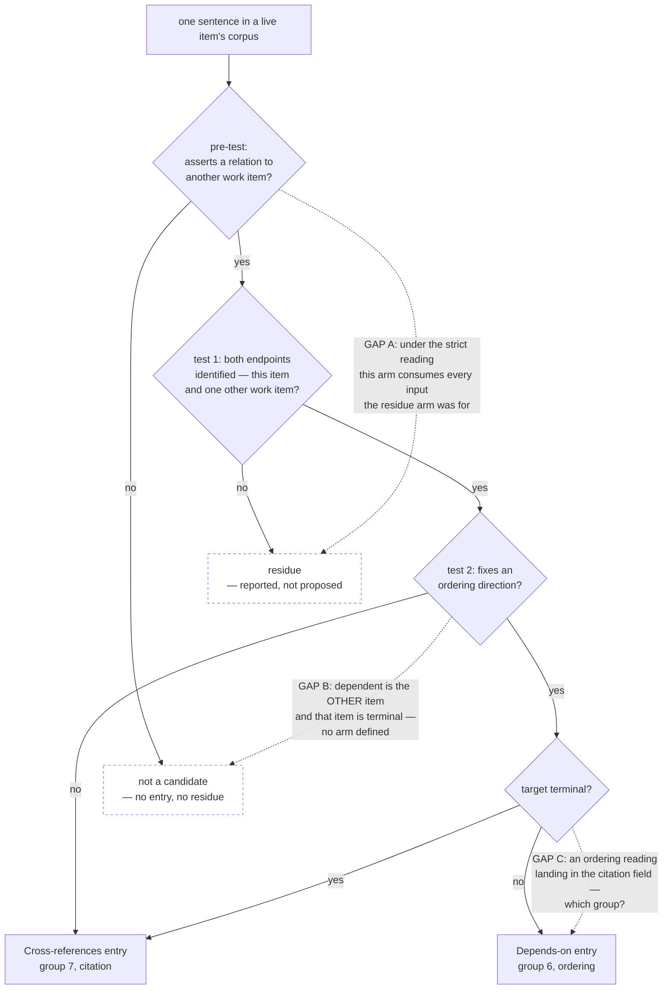

# Analysis: an adversarial read of the first edge run and the repairs it produced

**Date:** 2026-09-18 08:27
**Type:** Risk / Impact
**Status:** Complete
**Requested by:** orchestrator, step 8 of `260918-0712_*_implementation-depends-on-edges-proposed-and-confirmed.md`

**The one sentence, first.** The repair that closed the blocker removed the apply pass's staleness check for the two edge fields and put nothing in its place, so the one subject that writes into a user's own work-item record is now the only one whose approved write is verified against nothing at all before it lands.

## Question

Four passes have looked at the work-item edge subject and each found defects the last one missed. This one asks whether the design that shipped at `git:8fad8ead` is sound, or whether it looks sound because everyone who checked it shared an assumption. It attacks five things the dispatch named: the two proposals the first run produced, the seven repairs, the disjointness and completeness of the classification, the one finding left open, and whether the residue is actually bounded.

**What this analysis does not test, stated first because the plan's step 8 requires it.** The first run's whole yield was read out of text this session authored for this feature, so this read checks the plumbing — entry shape, citation resolution, before-text fidelity, residue handling, and the prompt text those rest on. It does not test the judgement half. `260917-2258_*_spec-depends-on-edges-zero-yield.md` claim C8 stands unchanged.

## Scope

Read in full: `260918-0738-curator-run.md`; `agents/curator.md` `## The fourth subject — work-item edges`, `### Pass 2 — apply`, `### The gate`, `### Ledger entry schema`; the diff of `git:8fad8ead`; `260917-2258_*_spec-depends-on-edges-zero-yield.md`; `260918-0712_*_implementation-depends-on-edges-proposed-and-confirmed.md`; the live item record; `260917-2256_*_spec-depends-on-edges-proposed-and-confirmed.md` `### C1` and `## Stops when`; `rules/critical-stance.md`; `rules/fusion-workbench-conventions.md` `## Backlog entries — work items`. Measured on disk: the citation graph of the live item's container, the status of every container the hop reaches, the head fields of all seven work-item records.

Not read: `260918-0806-curator-run.md` beyond confirming it is the `Retired:` cohort and carries no edge entry, so it suppresses nothing here.

**Tree.** HEAD `098112a00df7550470fef2159c940beebcc657d2`, 2026-09-18 08:18 +0200, branch `main`, `## main...origin/main [voraus 9]` — nine commits ahead of the remote, working tree carrying one modified event log and one untracked shared decision record. Every present-tense claim below is against that tree.

## Findings

Ranked by what each costs the user if left.

### 1. The apply pass no longer checks anything before writing an edge

Filed as `260918-0821_*_the-edge-exception-removed-the-apply-passs-staleness-check-and-put-nothing-in-its-place.md`.

The general rule says the before-text re-read "is what makes a two-dispatch run as safe as a one-dispatch run". The exception replaces it with four bullets, and the basename is either absent — append, `applied` — or present — write nothing, `applied`. **There is no input that yields `stale`**, while `stale` stays in the outcome vocabulary two paragraphs below. `rules/critical-stance.md` §4 calls an unreachable branch a defect of the same kind as a wrong result, and the section that carries it is the one that repaired a different §4 defect.

What passes through the hole, in the interval between the survey dispatch and the apply dispatch that a human answer separates:

- **the dependent reached a terminal status** — nothing re-reads `**Status:**`, so the bound "this subject writes into a live work item's head and nowhere else" is enforced at survey time only;
- **the field line was edited or removed by hand** — work-item maintenance is the orchestrator's at the user's word, and the user at the gate is exactly the user who might go and do it;
- **the item was split** — one was, in this session, on 260918-0706;
- **the field line does not exist.** "Appends that basename to the line as found" has no line. This is the **majority** case: of the seven work-item records in this workbench, four carry no `**Cross-references:**` line and six carry no `**Depends-on:**` line.

The exception's reasoning is right and its scope is wrong. Two entries into one comma-separated line do collide under a whole-line check; that required dropping the *whole-line* comparison, not every precondition. A per-basename test can stand beside a three-line precondition read — record resolves, dependent still live, field present or Before reads `(absent)` — at a cost of one read per entry, which is what the general rule already spends.

### 2. The post-write compare stopped comparing the bytes the user approved

Filed as `260918-0822_*_the-edge-entrys-post-write-compare-no-longer-checks-the-bytes-the-user-approved.md`.

The compare exists because approved text and written text once differed by two characters nobody saw (`260815-1943_*_the-curators-applied-text-carries-two-characters-the-approved-text-did-not.md`). On these two fields it is now a membership test over basenames, and the prompt calls that "the byte-for-byte check in the only form this shape admits". That claim is false. A set test passes a doubled comma, a lost space, a duplicated field line, a trailing separator — the whole class the 2026-08-15 record was filed for. A byte-exact test does exist for this shape: the line after the write equals the line as found with `, <basename>` appended. Both sides are known at write time, it survives per-id approval, and it was not taken.

And the **After** block has come loose from the write. The schema says After is "that line with this entry's basename added"; the apply pass says applying *appends*. `L10` and `L11` each **insert** their target in second position. So the bytes the user reads at the gate are demonstrably not the bytes the apply pass will produce, and after finding 2 nothing compares them. On these two fields the user approves a picture.

### 3. The classification is neither disjoint nor complete

Filed as `260918-0823_*_the-edge-classification-is-neither-disjoint-nor-complete-in-three-demonstrated-places.md`. The section claims "no candidate falls outside them or into two". Three inputs refute it.

The three dotted edges are the defects; every solid edge is a routing the prompt states.

**Gap A — the pre-test and test 1's *no* arm are the same test, or the residue is unbounded.** Read strictly, a sentence whose second endpoint is not an identified work item asserts no relation to another work item, so the pre-test consumes it and residue is dead code. Read loosely — "asserts a relation to *something*" — residue is unbounded, because every sentence naming a rule file, a commit, a helper or a person qualifies. The first run took the loose reading silently, and bolded the tell: "Each binds this unit of work to **something**".

**This answers the dispatch's residue question directly: the pre-test does not bound the residue.** What bounded the first run's residue to six was the run's own taste about which sentences were worth reporting, and a reader cannot see what it declined to count. On a corpus of a different size or shape the same text gives a different number by a different judgement.

**Gap B — the section's completeness claim rests on an unstated premise.** "The dependent is live in both arms, so no reading of either produces a write into a terminal item" assumes the corpus owner is always the dependent. Nothing establishes that. Test 1 identifies two endpoints without assigning roles; test 2 assigns direction by reading the sentence. A sentence saying some other item waits on this one makes that other item the dependent, and if it is terminal the entry is forbidden by two bounds and routed by none. The terminal-target repair covers a terminal **target**, not a terminal **dependent**.

**Gap C — the terminal-target repair completed the field routing and left the group routing open.** `### The gate` carries two edge groups so "a user can take the citations without the orderings". An entry produced by a *yes* on test 2 and written into `**Cross-references:**` is an ordering reading; under group 6 the citation-taking user loses it, under group 7 that user takes an ordering judgement after refusing exactly that. The section names neither. The run filed `L11` as `work-item citation edge` on no authority in the text. This is the most consequential of the three, because the two-group split is the only instrument the user has for distrusting the pass's direction calls, and the repair put entries into it that the split cannot classify.

### 4. The hop voided the only stated mitigation for flooding the gate

Filed as `260918-0824_*_the-container-hop-voided-the-only-stated-mitigation-for-flooding-the-gate.md`.

The plan mitigates gate flooding with one sentence: the arm "proposes only for a relation read between **two work items** — not for the decision, analysis and plan records an item cites, which have their own checkers." The hop says those records **do** identify work items. The mitigation is its own negation, and the risk row is false at HEAD with nothing marking it.

The repair names two things as holding the risk instead, and neither does. The **one-hop bound** stops recursion; it does not reduce the citations already standing in the corpus, which is where the count comes from. The **pre-test** excludes sentences asserting no relation to another work item — and after the hop, a sentence naming any record living in any container asserts one. The pre-test excludes *less* after the repair than before it.

Measured over the item record and every file in its container:

| Where the 70 distinct cited basenames resolve | Count |
|---|---|
| `shared/` stores — no container, so no work-item endpoint | 35 |
| into a container — 6 the item's own, 21 another's | 27 |
| unresolved | 8 |

Those 21 name **11 distinct containers other than the item's own**. Six fall out under the legacy-vocabulary rule the same commit added (five carry a pre-grammar status, one carries no `**Status:**` line at all). Five are work items, all terminal and so all admissible as citation targets; two the field already carries. So the real bound on this store is the legacy exclusion and the fact that the store holds seven items — neither of which the repair names, and neither of which scales.

**A second consequence nobody has recorded.** The plan's step 7 states its expected result in advance so a surprise is visible: "**two `**Cross-references:**` proposals**". At HEAD that figure is wrong. The hop reaches three not-yet-cited work items, and the run's residue items `R2` and `R3` now identify endpoints and become entries. A re-run against the repaired prompt would differ from its own stated expectation, and the difference would read as a defect rather than as the repair working.

### 5. Both endpoints are attributed by directory membership, and a split breaks that silently

Filed as `260918-0825_*_the-dependent-endpoint-is-read-off-which-container-a-file-sits-in-and-a-split-breaks-that-silently.md`.

The far endpoint is fixed carefully — by basename, or by the hop, with the hop's authority argued and bounded. The near endpoint is fixed nowhere: "this item" is only ever the item whose corpus is being read. That holds while a container's files are about that container's item, and a split separates the two without touching a file.

**The verdict the dispatch asked for, on the two proposals:**

**`L10` should be refused as written.** Its citation is `### C1`'s first acceptance criterion. C1 was split out on 260918-0706 to `260918-0706-strike-unconfirmed-depends-on-entry.md`, which reads `**Status:** done`, and the strike landed — `260909-1700-cut-fusion-to-working-minimum.md` carries no `**Depends-on:**` field today. The criterion describes work a different item did and finished. The *edge* may well be right: `260911-0715_*_a-depends-on-entry-asserts-an-ordering-where-the-section-it-was-derived-from-asserts-a-conflict.md` sits in `260909-1700-…`'s container and is already in this item's head, so the hop reaches the same target from a citation that is still true. But the reason offered is not the reason that holds, and the ledger's promise is that checking an entry is one file open. Refuse it and let it come back with a citation true at HEAD.

**`L11` should be taken.** Its citation is the spec head — "This spec takes C3 as its subject, inherits C3's settled decisions rather than re-opening them" — naming `260911-1528_*_spec-prerequisites-confirmed-once-order-computed.md`, which resolves into `260908-2018-prerequisites-confirmed-once-order-computed.md`'s container, that item's own spec. The relation is this item continuing that item's unbuilt C3, in the spec's own words. The hop it needed is now authorised, and the terminal-target route it took is now stated. Both of the run's two hedges have been answered in its favour. The one thing still unanswered is Gap C, which decides the group rather than the entry.

**Before-text fidelity, checked as step 8 requires.** Both entries' Before blocks are byte-identical to line 9 of the item record on disk (`diff` against the run file, no output). **Count of entries whose citation does not support the claim made: one of two — `L10`.**

### 6. The revert path does not run

Filed as `260918-0826_*_the-revert-path-on-an-edge-entry-does-not-run.md`.

Both edge entries carry `git checkout -- "$(find "$WORKBENCH" -name …)"`. `WORKBENCH` is emitted by `bin/fusion-paths` as a `KEY=value` line for an agent to read; it is not exported, and a shell the user pastes into has it empty. The command fails. The schema's repair bound the `**File:**` line to a basename and said the full path "is already on the `**Revert path:**` line" without checking that the line could carry one — the citation gate that forced the basename onto `**File:**` forces the same thing here, and the resolution taken there has run out of elsewhere to push the path to.

### 7. The finding left open, and why it is the same question as Gap B

`F4` — a quoted ordering between two work items neither of which owns the corpus is discarded before test 1 — was named and left. **Leaving it is right, and the reason given for leaving it is wrong.** The run justifies the pre-test as "what bounds the residue"; finding 3 shows it does not. So the trade the reader is asked to accept is not the one described.

Its cost is also narrower and better located than the run says. A record discussing two items usually sits in one of their containers, where the corpus-owner rule catches it. The real exposure is `shared/decisions/` — **27 of the 70 citations in this corpus resolve there** — which is precisely where cross-item relations get ruled on, and a shared record cited by a live item is read and then has its two-work-item sentences discarded.

And it is not an independent finding. Gap B asks whether the pass may propose an edge whose dependent is not the corpus owner; F4 asks whether it may propose one where *neither* endpoint is. Both turn on one ruling. A *no* closes both at the cost F4 already names. A *yes* closes both and needs a live-check on the dependent — which is the precondition read finding 1 asks for anyway. They should be ruled together, not carried as an open finding and an undiscovered gap of different severities.

## Implications

**The repairs did not all close what they claim.** Read against the findings they answer: `F1` (legacy vocabulary) is genuinely closed, by a rule rather than an accident, and the measurement above confirms it fires on six of eleven containers. `F2` (the corpus referent) is closed in wording but is not the saving the run implied — the narrow reading drops which files are *read*, while every citation standing in a container file still yields an endpoint, so the candidate count is unchanged and the pass may now propose an edge to an item whose record it never opened. `F5` (a confirmed edge whose target went terminal) and `F8` (the `**File:**` line) are closed, `F8` incompletely — it moved the collision to `**Revert path:**` (finding 6). `F6` (the *yes* arm on a terminal target) is closed for the field and opened for the group (Gap C). `F3` (the hop) is closed as a permission and left the flood unmitigated (finding 4). And `F7`, the blocker, is closed at the cost of two guarantees that were not part of the collision (findings 1 and 2).

**The shared assumption the dispatch predicted is real, and it is this:** every pass so far has treated the edge subject as a *reading* problem — which sentences yield which entries — and checked the classification hard. Nobody checked the *writing* side after the classification changed. The blocker was a writing defect, the repair was a writing repair, and it went through four rounds' worth of scrutiny on the reading side without anyone re-asking what the apply pass still guarantees. Findings 1, 2 and 6 all sit on that side, and all three were introduced or left by the commit that fixed the writing defect.

**The feature is not ready for a real run, and the reason is narrower than it sounds.** The survey side is sound enough to run behind a gate: it writes nothing, its worst failure is a bad proposal a user refuses, and finding 5 makes a bad proposal legible rather than silent. The apply side is where the cost sits, because it writes into the user's own record with no precondition and confirms the write against a set rather than bytes. A user could safely run `/fusion:curate --edges` in survey mode today and read the ledger; approving from it is what should wait.

## Recommendations

1. **Findings 1 and 2 before any gated apply of an edge entry.** Both are `coder` work on `agents/curator.md` and both are small: a three-line precondition read, and a computed comparison text. They are the difference between an approval that is verified and one that is not.
2. **Rule Gap B and F4 together**, as one decision record: may the pass propose an edge whose dependent is not the item whose corpus carried the sentence? Route to `shaper` or straight to a decision record; the answer sizes the live-check in finding 1 and closes the one finding the repair commit deliberately left.
3. **Gap C needs a sentence, not a design**: name the consequence group for an ordering reading routed to the citation field, and say whether the gate's two-group promise survives it. `coder`.
4. **Re-derive step 7's expected result at HEAD** before anyone runs the survey again, so the next run is measured against the design it is running rather than the one it was planned against. Cheap, and it prevents a correct run reading as a regression.
5. **Refuse `L10`, take `L11`** if the ledger goes to a gate before the above land — noting that `L11`'s group is the thing Gap C leaves undecided.
6. Finding 6 is low-cost and independent; fold it into whichever pass touches the schema next.

## Filed Issues

- `260918-0821_*_the-edge-exception-removed-the-apply-passs-staleness-check-and-put-nothing-in-its-place.md` — `stale` is unreachable for edge entries and no precondition replaced the whole-line check
- `260918-0822_*_the-edge-entrys-post-write-compare-no-longer-checks-the-bytes-the-user-approved.md` — set membership in place of a byte compare, and an After block that describes a write the pass need not perform
- `260918-0823_*_the-edge-classification-is-neither-disjoint-nor-complete-in-three-demonstrated-places.md` — the residue overlap, the terminal dependent, the unassigned consequence group
- `260918-0824_*_the-container-hop-voided-the-only-stated-mitigation-for-flooding-the-gate.md` — with the 70-citation measurement and the stale step-7 expectation
- `260918-0825_*_the-dependent-endpoint-is-read-off-which-container-a-file-sits-in-and-a-split-breaks-that-silently.md` — the near-endpoint proxy, and why `L10` carries a citation that no longer holds
- `260918-0826_*_the-revert-path-on-an-edge-entry-does-not-run.md` — `$WORKBENCH` is not exported

## Sources

- `260918-0738-curator-run.md` — the first run, read in full
- `agents/curator.md:186-242` (the fourth subject), `:286-312` (`### Pass 2 — apply`), `:253-269` (`### The gate`), `:397-437` (`### Ledger entry schema`)
- `git:8fad8ead` — the repair commit and its diff over `agents/curator.md`
- `260918-0712_*_implementation-depends-on-edges-proposed-and-confirmed.md` — `## Implementation Steps` 7 and 8, `## Risks & Mitigations`, `## Where this work stops`
- `260917-2256_*_spec-depends-on-edges-proposed-and-confirmed.md` — `### C1`, `## Stops when`
- `260917-2258_*_spec-depends-on-edges-zero-yield.md` — claims C8, D1, D4, H2, H5
- `260917-2253-depends-on-edges-proposed-and-confirmed.md` — line 9 and the closure note
- `rules/critical-stance.md` §4, §5; `rules/fusion-workbench-conventions.md` `## Backlog entries — work items`
- Measurements run in the work tree: the 70-basename citation resolution over the item's container; `**Status:**` of all 11 hop-reachable containers; head-field presence across all seven work-item records; `diff` of both Before blocks against line 9 on disk; `echo "[${WORKBENCH}]"` → empty

## Open Questions

- [ ] May the pass propose an edge whose dependent is not the corpus owner? (Gap B and F4, one ruling — user's)
- [ ] Which consequence group takes an ordering reading routed to the citation field? (Gap C — user's, since it is the gate's promise to the user that is at stake)
- [ ] Does the residue have a stated bound, or is it the run's judgement and said to be? (finding 3, Gap A)
