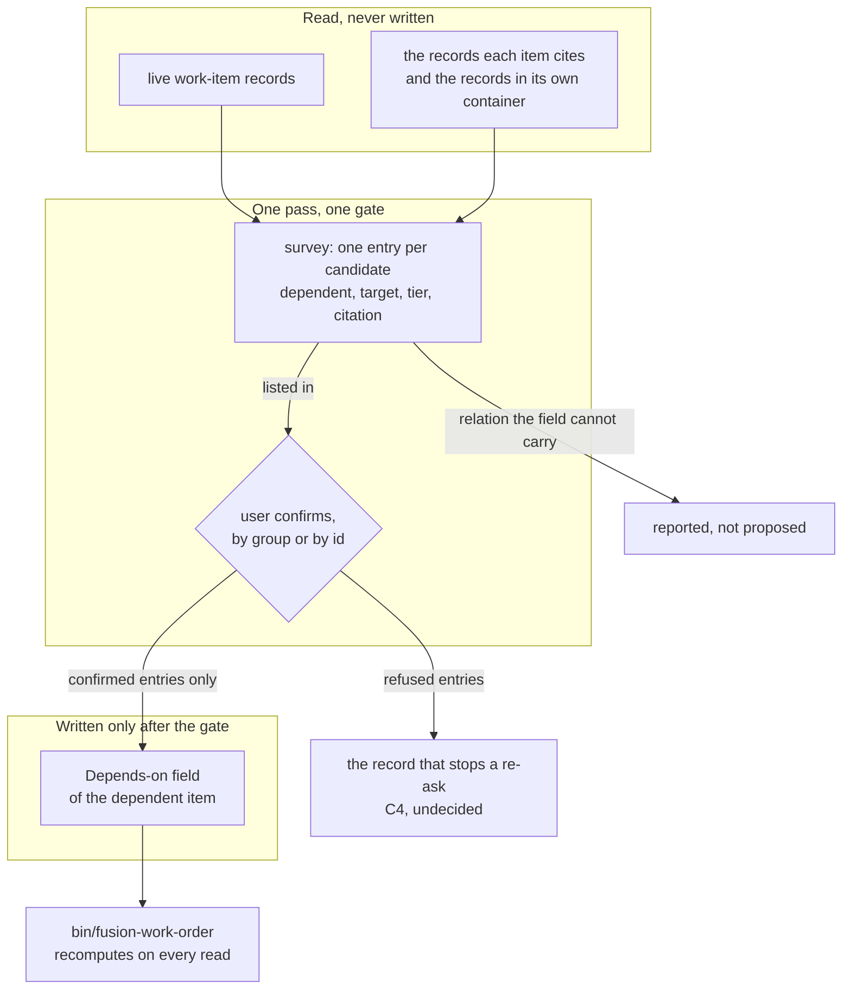

# Spec: Depends-on edges are proposed from the prose and confirmed by the user

**Date:** 2026-09-17
**Status:** Draft
**Source:** The work item `260917-2253-depends-on-edges-proposed-and-confirmed.md`, dispatched by the
orchestrator with the six unspecified points of
`260909-1020_*_three-source-aspects-unnamed-and-the-proposal-pass-has-no-agent-or-surface.md` and the
two open defects about the field's one live value named as the substance to settle.

**Measurement anchor.** Every figure below was taken in this work tree at commit `ee8508b0` on
2026-09-17, by running the command named beside it. The two growth figures the dispatch supplied were
re-taken rather than carried over, and both reproduce exactly. A third bound, which the dispatch did
not name and which binds this work harder than either, is measured here for the first time.

**This spec does not replace `260911-1528_*_spec-prerequisites-confirmed-once-order-computed.md`.** That
document specified the whole mechanism, and the half it specified as C2 is built and shipped as
`bin/fusion-work-order`. What stands unbuilt is its C3, the proposal pass, which stopped at its own
first stopping condition on a measurement. This spec takes C3 as its subject, inherits C3's settled
decisions rather than re-opening them, and settles the six points that C3 left bounded but unspecified.

## Directive

A user invoking the pass gets one list of proposed `**Depends-on:**` edges, each naming the dependent
item, the item it would name, whether the relation was quoted or inferred, and the sentence it was read
from. The user confirms at one gate, and only confirmed edges are written into the dependent records.
Nothing outside the workbench is read, nothing is written before the gate, and a relation the field
cannot carry is reported rather than converted.

## What the store measures today, and what that does to the stated acceptance

**The live graph is one node.** `bin/fusion-work-order` at `ee8508b0` prints `items=1`, `edges=0`. Six
work-item records exist; five are terminal, four `done` and one `dropped`, and the sixth is this item,
`claimed`.

An answered decision puts the terminal five outside the graph on both sides:
`260908-2018_*_is-a-closed-prerequisite-a-satisfied-edge-or-no-edge-and-what-is-an-archived-one.md`
rules that a `done` or `dropped` item is not a node, that its outgoing entries are not read, and that an
entry naming one is a dangle. A dependent must therefore be live, and a target must be live for its edge
to resolve. With one live item and no self-edges, **the number of ordered pairs the pass could propose
today is zero.** That is arithmetic over the node-set rule, not a judgement about the prose.

The consequence for the acceptance the dispatch carried, stated plainly: a run over the store *as it
stands* cannot propose an edge, so no confirmation can put an order over more than one node into
`bin/fusion-work-order`. The acceptance is reachable the moment the store carries live items in a
prerequisite relation, and it is unreachable before then by any amount of implementation. `## Stops
when` carries the condition, and the first entry of `## User Decisions Pending` puts the choice of route
to the user rather than taking it here.

The precedent is on record and pointed the same way. A survey run on 2026-09-11 against a two-item store
returned one candidate edge against a stopping threshold of three
(`260911-1915-candidate-prerequisite-edges.md`), the pass was not built, and the question of how a
second run suppresses a declined edge was deferred in the same breath
(`260911-1833_*_how-does-the-curators-survey-know-not-to-re-propose-an-edge-the-user-declined.md`) to
"the session that builds the curator's proposal pass". That is this session, and the store has since got
smaller rather than larger in the only dimension that matters: two live nodes then, one now.

## Where the bytes are, re-measured

| Surface | Total | Floor | Head-room constant | Budget | Left |
|---|---|---|---|---|---|
| `agents/*.md` (bytes) | 279 584 | 310 567 | 18 000 | 328 567 | **48 983** |
| `skills/*/SKILL.md` (bytes) | 227 854 | 188 768 | 39 260 | 228 028 | **174** |
| `hooks/lib/__tests__/**.ts` (lines) | 22 042 | 19 228 | 2 840 | 22 068 | **26** |

Taken by `cd hooks && npx vitest run lib/__tests__/surface-growth-bound.test.ts` (green at this commit)
and read off `hooks/lib/__tests__/fixtures/surface-growth.golden`. The first two reproduce the
dispatch's figures to the byte.

Two corrections to the framing the dispatch carried, neither of which changes its conclusion that a new
skill body is impossible.

**Attaching the invocation to an existing skill body is not free.** The skill bound measures the sum of
every `SKILL.md`, so a sentence added to `skills/curate/SKILL.md` is charged against the same 174 bytes
a new file would be charged against. One hundred and seventy-four bytes is two sentences. Any design
that edits a shipped skill body is therefore paid for by a cut in `skills/` of at least its own size, and
"attach it to an existing skill" is not the cheap option it reads as.

**A `bin/` helper is unmeasured, and its test is not.** No growth bound measures `bin/`. This project's
convention ships a helper with its own test file under `hooks/lib/__tests__/`, a file with no baseline
entry costs its whole size, and the six most recent helper tests run 140 to 220 lines against the 26
lines that surface holds. So a new helper carries a precondition of a cut between roughly 115 and 195
lines, which is the same precondition `260911-1528_*_spec-prerequisites-confirmed-once-order-computed.md`
`## Preconditions` named when that surface held one line.

**The agent surface is the one with room.** A change to an agent prompt is charged twice, against the
48 983 bytes above and against that agent's dispatch-path row, which carries zero head-room of its own.
The curator path measures 149 969 bytes against its row of 227 066, so it holds 77 097 bytes: prompt
44 558, rules emitted 97 297, `CLAUDE.md` 8 114, taken by the method
`hooks/lib/__tests__/fixtures/dispatch-path.baseline` documents in its own header. The room is large
because `CLAUDE.md` fell from the 93 432 bytes every row was armed on.

## The question standing in front: a relation the field cannot carry

The dispatch names two open defects as one question seen from two sides, and the question is now
answered on the definition side and open only on the pass's side.

What is settled. `260908-2018_*_does-the-new-field-name-only-the-ordering-edge-or-the-four-relation-types-beside-it.md`
is answered: an entry in `**Depends-on:**` asserts that the named item reaches a finished state before
this item may start, and nothing else. Every citation that binds an item without ordering it sits in
`**Cross-references:**`, which became a defined work-item head field in the same ruling. The field's
definition in `rules/fusion-workbench-conventions.md` `## Backlog entries — work items` states it, and
`hooks/lib/work-graph.ts` reads it that way. `skills/migrate/SKILL.md:162` has been repaired in the
direction the defects asked for: the migration now never writes `**Depends-on:**` at all, routes a
converted name to `**Cross-references:**`, and reports what it dropped.

What remains. The store's only live value is still the wrong one. `260909-1700-cut-fusion-to-working-minimum.md`,
status `done`, carries `**Depends-on:** 260908-2018-prerequisites-confirmed-once-order-computed.md`,
derived by the migration from a section whose own words are "Conflicting, and the conflict is substantive
rather than an ordering nicety". Striking it is authorised and not yet carried out:
`260911-1747_*_may-a-done-work-items-head-field-be-edited-at-all-and-under-what-bound.md` is answered
that a machine-readable head field is data rather than narrative, that such a field may be corrected
where it is factually wrong, and that this entry "may now be struck". Its `Answered:` line says the
consequence was not carried out there.

And the pass inherits the general form of the problem. Prose in this workbench carries at least three
relations with nothing in the text to tell them apart: this needs that first, this is blocked by that,
this contradicts that. The field carries one. C3 below says what the pass does with the other two.

## Capabilities

### C1: the store's one live edge is corrected before the pass proposes anything

**Description:** The single `**Depends-on:**` value in the store is a relation nobody confirmed and the
field does not carry. It is struck, with the reason recorded, so that the first run of the proposal pass
reads a graph that is exact or empty rather than plausible. Two open defect records close on that strike.

**Acceptance criteria:**

- [ ] `260909-1700-cut-fusion-to-working-minimum.md` carries no `**Depends-on:**` field, and the change
      is one line removed with nothing else in that record touched.
- [ ] The reason is recorded where a later reader meets it, naming the answered decision that authorises
      editing a terminal item's machine-readable head field.
- [ ] Every `**Depends-on:**` entry in the store is one the user confirmed, checkable by reading the
      work-item records.
- [ ] `260911-1747_*_the-migration-wrote-a-conflict-relation-into-depends-on-and-nobody-confirmed-it.md`
      and `260911-0715_*_a-depends-on-entry-asserts-an-ordering-where-the-section-it-was-derived-from-asserts-a-conflict.md`
      each carry a `Resolved:` note and close.
- [ ] `bin/fusion-work-order` reports the same figures before and after, because the entry it names is a
      terminal item's and was never read.

**Decisions made:**

- The strike is performed by the orchestrator at the user's word, not by a dispatched agent.
  `rules/fusion-workbench-conventions.md` `## Backlog entries — work items` puts work-item maintenance
  there, and the user is confirming the operation anyway.
- The strike happens whichever route `## User Decisions Pending` takes for the pass itself. It is the
  one piece of this work that the store as it stands can carry today.

### C2: one invocation proposes every edge it can read, with its evidence

**Description:** The user asks for edges. A single pass reads the workbench, proposes each candidate as
one entry naming the dependent item, the item the entry would name, whether the relation was quoted from
a sentence or inferred from what two items do, and the sentence or the reasoning it rests on. The user
sees one list at one gate and answers it. Confirmed entries are written into the dependent records and
nothing else is written anywhere.

**Acceptance criteria:**

- [ ] A user who has never seen this mechanism can invoke it in one documented step and receives a list
      of proposals without anything having been written into a work item.
- [ ] Each proposal names the dependent, the target, the tier (`quoted` or `inferred`) and the citation,
      and a reader can check the citation by opening the record it names.
- [ ] The corpus the pass read is stated in the output, so a reader can tell what was looked at and what
      was not.
- [ ] A `done` or `dropped` item is never proposed as a dependent, and an item whose status is not live
      is never proposed as a target.
- [ ] The gate presents the edges as their own group, separate from anything else the same pass may
      propose, and the user may approve the group, approve entries individually, or reject.
- [ ] Rejecting everything leaves every work item byte-identical, checkable with `git status`.
- [ ] After a confirmation, the confirmed entries stand in the dependent records and
      `bin/fusion-work-order` reports them as edges.
- [ ] The change is measured against the agent surface and against the changed agent's dispatch-path row
      after it is written, and both figures are reported with it.

**Decisions made:**

- The curator performs the pass. Ruled by the user on 2026-09-11 and carried in
  `260911-1528_*_spec-prerequisites-confirmed-once-order-computed.md` `### C3`, over the reconciler, over
  the orchestrator and over a by-hand reading. The survey, ledger-at-a-gate, apply sequence it already
  runs is the sequence this pass needs: per-entry ids, a run file, a staleness re-read before each write,
  and a byte-for-byte comparison after each one.
- A work item is a fourth **subject** and not a fourth surface. The agent gains a write into one head
  field of a live work item and no authority over anything else in the record: not `**Status:**`, not
  `**Claim:**`, not the body, and it never files an item.
- The edge proposal is its own consequence group at the gate and never sits in the constraint-removal
  group.
- The tier vocabulary is `quoted` and `inferred`, the two values the 2026-09-11 candidate survey used.
- No new `bin/` helper and no new test file. The pass is prompt text in an existing agent, which is the
  only one of the three surfaces with room (`## Where the bytes are, re-measured`).

### C3: a relation the field cannot carry is reported, never converted

**Description:** The pass reads prose that carries several relations between units of work, and the field
holds one of them. Where the pass reads a relation it cannot express, it says so and proposes nothing,
which is the behaviour the repaired migration rule already follows.

**Acceptance criteria:**

- [ ] A sentence asserting that two items conflict, contradict each other, or cannot both proceed
      produces no `**Depends-on:**` proposal.
- [ ] Every such sentence the pass read is named in the output with the record it came from, so the
      omission is visible as a decision rather than as a gap.
- [ ] A relation whose resolution is recorded somewhere in the workbench may be proposed as an ordering
      edge, and the proposal quotes both the conflict and the resolution so the confirming user sees both
      sides. The 2026-09-11 survey's treatment of the one candidate it found is the worked example.
- [ ] The pass proposes nothing into `**Cross-references:**` unless `## User Decisions Pending` settles
      otherwise.

**Decisions made:**

- The field's meaning is not re-opened here. It carries the ordering prerequisite and nothing else,
  answered at
  `260908-2018_*_does-the-new-field-name-only-the-ordering-edge-or-the-four-relation-types-beside-it.md`.
- "Report what you could not express" is the form the same problem already takes one surface over, at
  `skills/migrate/SKILL.md:162`. The pass reuses it rather than inventing a second treatment.

### C4: a second run does not re-ask a question the user has answered

**Description:** The pass is invoked more than once over a store that keeps growing. An edge the user
refused is not put again; an edge the user simply never reached is. Which mechanism separates those two
is the one decision in this spec that no evidence settles.

**Acceptance criteria:**

- [ ] An edge the user refused is not proposed by the next run, and a reader can see where that refusal
      is recorded.
- [ ] An edge that was proposed and never answered, because the user approved a different group or ran
      out of the run, is proposed again.
- [ ] A confirmed edge already standing in a record is never proposed a second time.
- [ ] Where the prose under a confirmed edge later changes, the pass reports the change and proposes
      nothing. Revising or retracting a confirmed edge stays the user's act, through the same maintenance
      route as C1.

**Decisions made:** none yet. The four options, the constraints on them and a recommendation are on
record at
`260911-1833_*_how-does-the-curators-survey-know-not-to-re-propose-an-edge-the-user-declined.md`,
deferred on 2026-09-11 to the session that builds this pass. It is the first entry of
`## User Decisions Pending`.

## The shape

Coherence self-check. Six nodes carry work and one, the C4 record, is drawn undecided on purpose;
nothing points back from `bin/fusion-work-order` into storage, which is the property the whole design
exists to keep. There is no cycle, the direction runs cleanly top-down, and the only fan-out above one is
the gate, which is where a confirmation is supposed to fan out. The one edge that would tangle the graph,
a write from the survey straight into the field, is absent from the picture because it is forbidden in
the prose.

## Stops when

- If the survey, run over the workbench as it stands, yields fewer than three candidate edges, the pass
  is not built and the work stops after C1. A confirm loop that produces one or two edges costs more to
  invoke than to write the entries by hand. **Measured at `ee8508b0` the yield is zero**, because the
  store holds one live node, so this condition is met before the survey runs unless the store changes
  first. The threshold of three is inherited from
  `260911-1528_*_spec-prerequisites-confirmed-once-order-computed.md` `## Stops when` and is not
  re-derived here.
- If the answer to C4 requires the curator's outcome vocabulary to be widened and the user judges that
  too much for one subject, the pass ships with the honest fallback named in the deferred record: it
  re-asks, and it says in its own output that it re-asks. The work does not stop, and it does not ship a
  silent suppression.
- If any part of the design comes to need a new file under `hooks/lib/__tests__/`, the work stops before
  that file is written and the cut is measured first. The surface holds 26 lines and the precedent range
  for such a file is 140 to 220.

## Constraints

- No agent originates a work item. Filing stays the user's act, and this pass writes one head field of an
  item that already exists.
- An entry stands on the user's confirmation. Nothing is written into any work item before the gate, and
  a rejection leaves every item byte-identical.
- No agent asserts a ranking. `bin/fusion-work-order` reports an order and the user overrides it at will,
  per `260909-1808_*_may-a-helper-compute-an-order-over-work-items-after-the-portfolio-layer-goes.md`
  option 3.
- A terminal record is read as evidence and never reconciled in place. The one exception this work uses is
  the answered narrow one: a machine-readable head field that is factually wrong may be corrected, and
  the body, the status and the claim stay exactly as they are.
- Nothing outside `fusion-workbench/` is read. The Excel workbook in `unite-co-creator` is evidence about
  how dense and how inferential the relation is, and never a schema to transplant.
- The curator's eight exclusions stay intact. The fourth subject adds one gated write target and removes
  nothing: the agent still commits nothing, writes no code, no plan and no defect record, and advances no
  decision marker on ground-truth verification.
- The three growth budgets are independent, and a cut in one buys nothing in another. The way out of a red
  bound is a cut, never an edit to a baseline.
- Every `bin/` call site guards with `[ -x ]`, because the installed copy runs one release behind the work
  tree.

## Out of Scope

- **Time, in every form.** No effort figure, no capacity figure, no lead time, no slack, no latest-start
  date. Ruled by the user on 2026-09-11 and restated here because a proposal pass over prose is exactly
  where a duration sentence would first be read. The order says what may start and never says when
  anything finishes.
- Any change to what `**Depends-on:**` means, to the node set `bin/fusion-work-order` computes over, or to
  the figures it prints. All three are answered and shipped.
- Any ordering over anything that is not a work item. The plan step's dependency line in
  `agents/planner.md` stays unparseable and read by nothing.
- The terminal Circle records and their prose `## Dependencies` sections. They are outside the node set by
  construction and the pass does not open them.
- Automatic filing of the items the pass would need in order to have work to do. Growing the backlog is
  the user's act.

## Open for Planner

- Whether the curator's fourth subject reads better as one new section in `agents/curator.md` or as
  additions to the existing `## Remit`, `## Scope`, `### Ledger entry schema` and `### Boundary against
  agents/reconciler.md`, and the exact wording of each site.
- The dispatch-parameter shape that turns the edge pass on, and whether it mirrors `**Placement:** on`,
  which is the closest precedent in the same prompt.
- Whether the edge survey can run without the normative survey beside it, and what that costs in the
  prompt.
- How the survey enumerates live items and gathers the text spans: a shell walk in the prompt, a reuse of
  `createScanner` in `hooks/lib/citation-scan.ts`, or a reuse of `ITEM_RECORD_RE` in
  `hooks/lib/citation-corpus.ts`.
- The exact ledger fields an edge entry fills, given that `**Surface:**`, `**Tier:**` and `**Consequence
  group:**` are declared for a different subject.
- Which step measures the two byte surfaces, and the order of the steps.
- Whether C1's strike lands before or inside the same commit as the prompt change.

## User Decisions Pending

- [ ] **The route to a store the pass can work on.** The live graph is one node and the yield is zero.
      Three routes: file the backlog first and then build and run the pass over it; build the pass now,
      prove it on a fixture, and accept that today's live yield is zero; or build nothing beyond C1 and
      return to the pass when the store has grown. The stopping condition above is written against
      whichever route is chosen.
- [ ] **Re-run semantics**, open at
      `260911-1833_*_how-does-the-curators-survey-know-not-to-re-propose-an-edge-the-user-declined.md`
      with four options, its own constraints and a recommendation. C4 cannot be written until it is
      answered.
- [ ] **The invocation surface.** `/fusion:curate` carrying a new parameter costs against the 174 bytes
      the skill surface holds; a direct curator dispatch from the orchestrator costs against the 48 983
      bytes the agent surface holds. The trade is what the user types against where the bytes come from.
- [ ] **Whether the pass may also propose `**Cross-references:**` entries** for the non-ordering relations
      it reads, or only report them. This spec assumes report-only.
