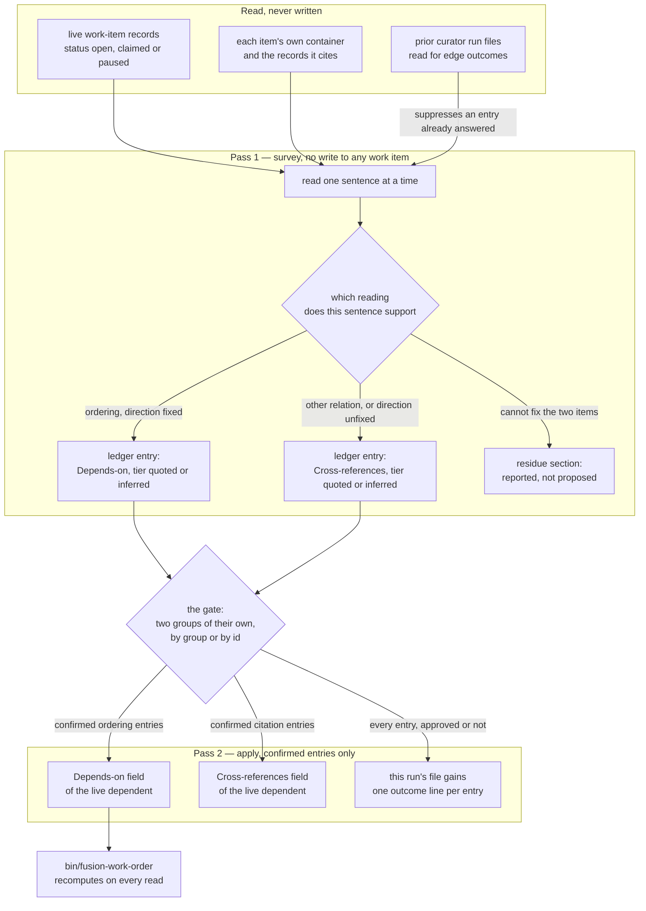
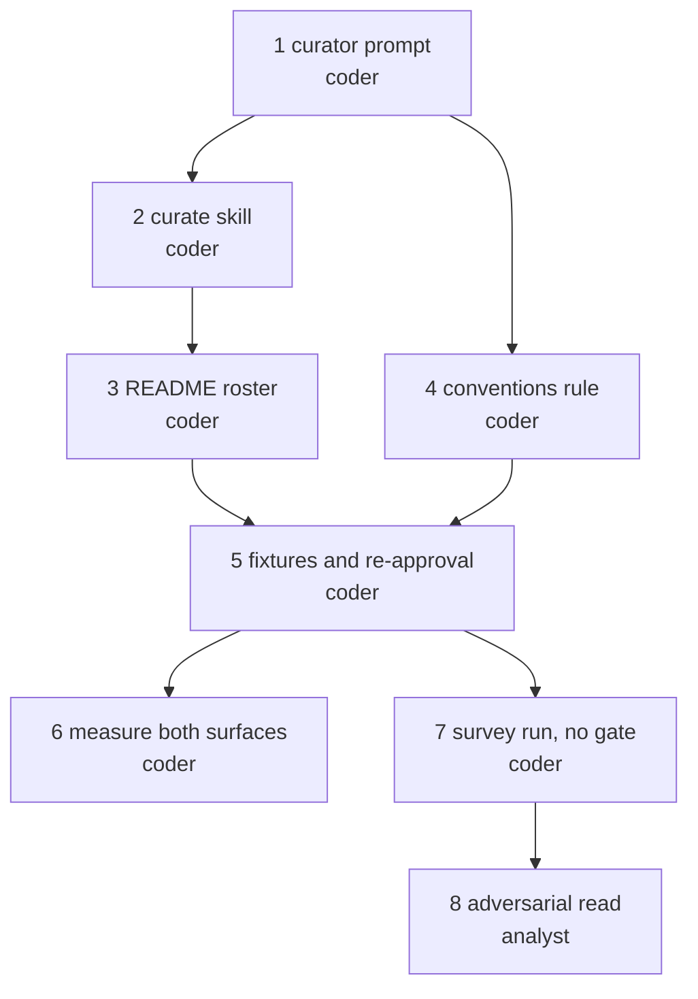

# Implementation Plan: the `**Depends-on:**` proposal pass

**Date:** 2026-09-18
**Status:** Draft
**Spec:** `260917-2256_*_spec-depends-on-edges-proposed-and-confirmed.md`, as corrected by
`260917-2258_*_spec-depends-on-edges-zero-yield.md` (three rounds, six conceded claims) and by
the seven binding corrections the dispatch carried. Where spec and discussion differ, the
discussion governs; where the dispatch differs from both, the dispatch governs.
**Decidability:** The load-bearing question is *which relation does this sentence assert between two units of work*, and it is **not decidable** from the inputs the mechanism has — `260911-1915-candidate-prerequisite-edges.md` measured at least five relation types carried by this workbench's prose with nothing in the text separating them, and `rules/critical-stance.md` §4 names exactly this shape (the write guard that predicted file writes from command text: 12 923 lines, 17 false alarms, 0 real hits). So the pass does not answer it and never predicts it. It answers the question it *can* decide by reading — *does a record in this item's corpus name another work item, and what are the exact words* — attaches `quoted` where the words state the relation and `inferred` where they do not, carries the citation so the sentence can be reopened, and hands the classification to the user at the gate, who can decide it. Nothing is written on the mechanism's reading; every entry is written on the user's word. Where the pass cannot fix which two items a sentence binds, it proposes nothing and reports the sentence. That substitution — a decidable extraction plus a human ruling, in place of an undecidable prediction — is the change of mechanism §4 requires, and it is why the tier field and the gate exist rather than being ornaments on a classifier. **A plan that claimed this classifier is reliable would be wrong; this one claims only that its output is checkable, because every entry carries the sentence it was read from.**

## Directive

Build the pass. One invocation of the curator surveys the workbench, proposes each candidate
edge between two units of work as a ledger entry naming the dependent, the target, the tier and
the citation, puts them to the user at one gate in groups of their own, and writes only what the
user confirmed — into `**Depends-on:**` where the relation orders the work, and into
`**Cross-references:**` where it binds without ordering. Nothing is written before the gate. A
rejection leaves every work item byte-identical.

The spec's three-candidate-edge stopping condition is **struck by the user** and is not
reinstated here in any form: a rule this project wrote itself, which forbids building the very
feature that would produce the edges the rule demands, is circular.

## Current State

### What already exists and is reused

The Research Gate finding is that **almost all of this already exists**, and the one integral
design is to add a fourth *subject* to a loop that already runs, rather than to build a second
loop beside it.

| Already built | What it gives this pass |
|---|---|
| `agents/curator.md` `### Pass 1 — survey` / `### Pass 2 — apply` | survey, run file with per-entry ids, gate, apply-only-what-was-approved, staleness re-read before each write, byte-for-byte compare after each write, outcome line per entry |
| `agents/curator.md` `### Ledger entry schema` | `**Surface:**`, `**Tier:**`, `**Citation:**`, `**Consequence group:**`, `**Revert path:**`, Before/After blocks |
| `skills/curate/SKILL.md` | the user surface, the gate (it holds `AskUserQuestion`), group and per-id approval, the two dispatches |
| `rules/fusion-workbench-conventions.md` `## Backlog entries — work items` | the field grammar, the five status values, the live/terminal split |
| `hooks/lib/work-graph.ts`, `bin/fusion-work-order` | the order over confirmed edges, recomputed per read, writing nothing |
| `agents/curator.md` evidence source 1 (`$SCAN_BACKLOG`) | the curator already reads every work item's directive, status, dependency field and closure note |

**No TypeScript changes, no new `bin/` helper, no new file under `hooks/lib/__tests__/`.** An
edge write is an ordinary one-region text replacement on one line of a work item's head, so
`### Pass 2 — apply` needs no new procedure at all; the node set comes from `**Status:**` on
records the survey already reads, so no helper is needed to enumerate it. This is the whole
reason the design fits: the pass is one added subject, not one added mechanism.

### What the store measures today, and what that does to the acceptance

Measured in this work tree at `2a9cd013` by running `bin/fusion-work-order`:

```
items=1  edges=0  unresolved-edges=1  ready=1  verdict=acyclic
unresolved=260917-2253-depends-on-edges-proposed-and-confirmed wants 260918-0706-strike-unconfirmed-depends-on-entry.md
```

Seven work items exist; six are terminal (five `done`, one `dropped`) and one is `claimed`. The
one live `**Depends-on:**` entry is the user-confirmed one C1 left behind, and it reports as
`unresolved` because its target reached `done` — which is the node-set ruling working as
designed, not a defect.

**Stated plainly, because the plan is worthless if it is not:** with one live node there are zero
ordered pairs of live items, so the `**Depends-on:**` half of the first run will propose **zero
edges**, and no implementation can change that. `bin/fusion-work-order` will not compute an order
over more than one node at the end of this work. That half of the item's own directive is
unreachable until the user files further live items, and `## Where this work stops` carries it as
a condition rather than pretending otherwise.

**What is reachable today is not nothing.** The `**Cross-references:**` half has real yield now
(see `## Approach`, the live/terminal bound), so the first run exercises the corpus walk, the
classification, the ledger, the gate, the apply write and the residue report end to end, on real
prose, with a non-zero result. That is a working function, not a demonstration on a fixture the
same session authored — which `260917-2258_*_spec-depends-on-edges-zero-yield.md` claim C8
correctly refused.

### The byte picture, re-measured at `2a9cd013`

| Surface | Total | Budget | Left | Taken by |
|---|---|---|---|---|
| `agents/*.md` (bytes) | 279 584 | 328 567 | **48 983** | `cd hooks && npx vitest run lib/__tests__/surface-growth-bound.test.ts` |
| `skills/*/SKILL.md` (bytes) | 227 854 | 228 028 | **174** | the same |
| `hooks/lib/__tests__/**` (lines) | 22 042 | 22 068 | **26** | the same |
| curator dispatch path (bytes) | 149 969 | 227 066 | **77 097** | prompt 44 558 + rules emitted 97 297 + `CLAUDE.md` 8 114, summed per file |

The tightest dispatch path of the eleven is the curator's own, at 77 097 bytes of room; the
smallest margin any path holds is therefore 77 097, so the one rule-file edit in step 4 —
charged eleven times at zero head-room — is affordable at the scale planned. The room exists
because `CLAUDE.md` fell to 8 114 bytes from the 93 432 every baseline row was armed on.

## Approach

### One parameter, one subject, additive

`**Edges:** on` on the survey dispatch **adds** the work-item subject to a curator run. It does
not replace the three normative surfaces and there is no edges-only mode. Reason: the run file,
the evidence anchor (`last_curator_run`) and the gate are one artifact per run, and a mode that
skipped the normative surfaces while still advancing the anchor would make the anchor lie about
what was read. The cost is stated honestly rather than designed around: a user who wants only
edges pays for the normative survey beside them, and the anchored pass is what keeps the second
run cheap.

The apply dispatch needs **no** parameter. It passes `**Mode:**`, `**Ledger:**` and
`**Approved:**` and follows the ledger, so `**Edges:**` is survey-side only.

### The corpus, and the live/terminal bound

The corpus is, for each **live** work item (`**Status:**` one of `open`, `claimed`, `paused`):

1. the item record itself;
2. every file inside that item's own container directory;
3. every record the item cites, resolved by the one workbench-wide lookup
   `rules/fusion-workbench-conventions.md` `## Filename Patterns` defines.

Nothing outside `fusion-workbench/` is read. A cited record that resolves into the archive store
is read as evidence exactly as the curator's evidence source 6 already reads it, and never
written.

**The live-only bound belongs to the ordering edge, not to the citation — and this is a
correction to the dispatch's own framing.** The dispatch says a `done` or `dropped` item "is
never a dependent and never a target". The first half holds for both fields and the second holds
only for `**Depends-on:**`:

- **`**Depends-on:**` — both endpoints live.** The node-set ruling
  (`260908-2018_*_is-a-closed-prerequisite-a-satisfied-edge-or-no-edge-and-what-is-an-archived-one.md`)
  puts a terminal item outside the graph on both sides, so an entry naming one is a dangle by
  construction. Proposing one would be proposing a dangle.
- **`**Cross-references:**` — dependent live, target any work item.** That field orders nothing,
  so the node-set ruling does not reach it, and a live item citing a finished one is the ordinary
  and correct case: this very work item cites four terminal records in its own head today. The
  dependent must still be live, because a terminal item's head is corrected only under the narrow
  answered exception C1 used, which is not this pass's business.

The dependent side is live in both cases, which is what keeps the single write bound honest: **the
pass writes into a live work item's head and nowhere else.**

### The classification, stated as a split that is disjoint and complete

The unit judged is a **reading** — one supportable interpretation of one sentence binding item A
(whose corpus carried the sentence) to work item B. One sentence may carry more than one reading,
and each reading is its own ledger entry; that is what keeps the split disjoint at the level that
matters, the entry.

1. **The words state that B must reach a finished state before A may start.** → a
   `**Depends-on:**` entry on A, tier `quoted`.
2. **The words do not state it, but what the two items do makes the ordering necessary** (A's
   directive changes an artifact B creates). → a `**Depends-on:**` entry on A, tier `inferred`.
3. **Any other relation between A and B, including an ordering whose direction the words do not
   fix.** → a `**Cross-references:**` entry on A, tier `quoted` or `inferred` by the same test.
4. **The pass cannot fix which two items the sentence binds, or whether it asserts a relation at
   all.** → nothing is proposed; the sentence is reported in the run file's residue section with
   the record it came from.

Branch 3 is where C7's reversal lands: a relation the ordering field cannot carry is **routed**
into the field that is defined widely enough to receive it (`rules/fusion-workbench-conventions.md`
`## Backlog entries — work items`, "work it merely touches"), as a proposal the user confirms —
never converted, and never silently dropped. Branch 4 is the residue the same correction leaves:
the pass reports only what it cannot resolve. The direction rule in branch 3 is load-bearing — an
ordering whose direction the sentence does not fix falls into the field that asserts no order, so
an ambiguity can never become a guessed ordering.

Where a sentence asserts a conflict *and* the workbench records the conflict's resolution, both
readings stand: the pass writes two entries, the cross-reference and the ordering edge, and the
ordering entry quotes the conflict and the resolution together so the confirming user sees both
sides. That is the spec's C3 worked example, unchanged.

### Re-run semantics: suppress on the outcome line

Built to deliver the recommendation of
`260911-1833_*_how-does-the-curators-survey-know-not-to-re-propose-an-edge-the-user-declined.md`
(option 1: separate a refusal from an unanswered proposal). **The separation is achieved without
option 1's fifth outcome value**, and the reason is a finding this plan reports rather than
assumes — see `## Open Questions` and the new decision record filed with this plan.

The survey reads every prior curator run file across `$WORKBENCH`, **unbounded by the evidence
anchor and not through `$SCAN_ANALYSES`**, and for each edge entry it finds:

| Prior outcome | Next run |
|---|---|
| `applied` | suppressed — and suppressed anyway, the field now carries the basename |
| `skipped` | **suppressed** — an outcome line exists, so a gate was put and answered, and this entry's group was on offer and not taken |
| `stale`, `failed` | **re-proposed** — the user approved it and the write did not land |
| no outcome line at all | **re-proposed** — no apply dispatch ran, so no gate was ever answered |

Both bounds on the read are defects waiting to happen if omitted, and both are measured facts
rather than caution: the anchor bounds the evidence pass by commit and date, and `**Scope:** full`
is exactly what a user runs after a decline; and `$SCAN_ANALYSES` resolves to the *claimed item's*
container plus `shared/`, so a run file written while a different item was claimed sits outside it
and its refusals would vanish silently.

Where the prose under an already-confirmed edge later changes, the pass **reports the change and
proposes nothing**. Revising or retracting a confirmed edge stays the user's act through work-item
maintenance.

### The shape of the pass



Coherence self-check, run rather than assumed. No cycle: `prior` and `outcome` are drawn as two
nodes on purpose, because this run's file becomes a prior one only for the *next* run, and
collapsing them into one node would draw a within-run cycle that does not exist. Direction runs
cleanly top-down. The only fan-out above one is the classification split and the gate, which are
the two places a fan-out is the design rather than a smell. Every node is reachable and connected.
The one edge that would tangle the graph — a write from the survey straight into a field — is
absent because it is forbidden in the prose. Every relation the prose above declares is an edge
here, and every edge here is declared above.

## Implementation Steps

The order, with the one fork it has — steps 6 and 7 are independent of each other and both wait
on a green suite:



1. **The fourth subject in `agents/curator.md`**
   - Executor: `coder`
   - Files: `agents/curator.md`
   - Changes, site by site:
     - **After the three-surfaces list** (`# Curator Agent`): one paragraph naming the work item
       as a fourth **subject** and not a fourth surface — the phrase "three normative surfaces"
       stays exactly as it is everywhere it appears, and the new text says why: the subject is
       two machine-readable head fields of a live work item, reached only on `**Edges:** on`,
       gated like every other change, and it widens the remit's two reasons not at all.
     - **New section `## The fourth subject — work-item edges`**, placed after `## Contradictions`
       and before `## The two passes and the gate`. It carries, in this order: the parameter gate;
       the corpus and the live/terminal bound as `## Approach` states them; the four-branch
       classification verbatim as a split; the direction rule; the two target fields; the residue
       section; the suppression read with both of its bounds; and the "prose changed under a
       confirmed edge" rule. **This section is the single authoring home for all of it** — no
       other file restates any part.
     - **`### Explicitly not in your remit`, exclusion 5.** Close the textual collision rather than
       assuming it away: the word `data` there means source-tree data (ontology, manifests,
       schemas, fixtures) and not a workbench record's machine-readable head field, which the
       authorising ruling calls "data rather than narrative"
       (`260911-1747_*_may-a-done-work-items-head-field-be-edited-at-all-and-under-what-bound.md`).
       One amendment covers **both** fields. The count stays eight; no exclusion is added or
       removed, and seven are untouched.
     - **`## Scope`.** The gated-edit list gains one row: the `**Depends-on:**` and
       `**Cross-references:**` head fields of a **live** work item. The "You may NOT edit" table's
       `Code, data, ontology` row takes the same qualifier as exclusion 5, and gains a row for
       everything else in a work-item record — `**Status:**`, `**Claim:**`, `**Active spec/plan:**`,
       the body, and filing an item at all — owner: the orchestrator at the user's word, per
       `rules/fusion-workbench-conventions.md` `## Backlog entries — work items`.
     - **`### The gate`.** The ordered group list gains two entries between `relocations` and
       `consolidations`: `work-item ordering edges`, then `work-item citation edges`. They sit
       there because an edge removes no constraint, which puts it below a relocation, and it
       orders work, which puts it above a consolidation. Two groups rather than one, so a user can
       take the citations without the orderings.
     - **`### Ledger entry schema`.** `**Surface:**` gains the value `work item head field`.
       `**Tier:**` gains `quoted | inferred`, with one sentence saying that on an edge entry the
       tier grades **how the relation was read** and never whether a statement is false — the same
       shape the `relocation` paragraph beside it already uses, reused rather than re-invented. One
       new line, `**Edge:** <dependent basename> -> <target basename>, into <field>`.
       `**Constraint removed:**` reads `none` on every edge entry. One paragraph says how an edge
       entry fills the shape: **File** is the dependent's record path, **Before** is the field line
       as it currently stands or `(absent)`, **After** is the field line the record must carry. That
       is an ordinary one-region replacement, so the staleness re-read, the byte-for-byte post-write
       compare and the outcome line all apply with no new procedure.
     - **`## The run file`.** The numbered list gains one item, written only on an `**Edges:** on`
       run and omitted entirely otherwise — parallel to the placement-classification item beside
       it. It holds the corpus statement (which items were live, what was read, what was not), the
       residue, and the suppression read (which prior run files were read, which entries were
       suppressed and on which outcome).
     - **`## Dispatch parameters`.** One table row: `**Edges:**` | `on` \| `off` | defaults to
       `off` — no work item is read as a subject, no edge entry is proposed, and the run file's
       edge section is omitted. Plus one sentence beside the `**Placement:**` paragraph on the same
       principle: the dangerous subject is the one that has to be asked for.
     - **`### Pass 1 — survey` and `### Pass 2 — apply`.** One sentence each: the survey writes into
       no work item; the apply pass writes an approved edge entry through the ordinary one-region
       path and no relocation-style second write exists for it.
   - Constraints the text must obey, each with the gate that enforces it:
     `path-literal-lint.test.ts` — no type-folder path literal (`analyses/…`, `decisions/…`); use
     the `$OUT_*` / `$SCAN_*` keys, and `$WORKBENCH` for the prior-run-file search.
     `marker-format-lint.test.ts` — no bracket-form state marker.
     `glob-nomatch-lint.test.ts` — no raw dotglob inside a bash fence.
     `reference-resolution-lint.test.ts` — every plugin path, heading anchor and record citation
     added here must resolve; see step 5 for the pin those additions move.
   - Dependencies: none.

2. **`--edges` on `/fusion:curate`, paid for by a cut in the same file**
   - Executor: `coder`
   - Files: `skills/curate/SKILL.md`
   - Changes:
     - The argument line gains `--edges` beside `--full`.
     - One line after the survey-dispatch block: add `**Edges:** on` when the user passed
       `--edges`, citing `agents/curator.md` `## Dispatch parameters`. Nothing is added to the apply
       dispatch.
     - **The cut that pays for it, and it is a repair rather than a sacrifice.** Step 3 and Step 5
       each carry a parenthetical copy of the consequence-group list
       (`constraint removals, tier-3, tier-2, tier-1, consolidations`). Both copies are **already
       wrong** — they omit `relocations`, which `agents/curator.md` `### The gate` has carried since
       the relocation entry landed. Replace both with a pointer to that authoring home. This is the
       single-source-of-truth fix the drift itself argues for, and it removes the need to edit two
       enumerations every time a group is added, which is what this step would otherwise have to do.
   - Budget: the survey-side draft was measured at 133 bytes against 174 of head-room; the two cuts
     return roughly 85. The step is not finished until step 6 reports the figure that actually
     landed.
   - Dependencies: step 1 (the parameter must be declared in the prompt before a skill passes it).

3. **The `**Edges:**` row in the dispatch-parameter roster**
   - Executor: `coder`
   - Files: `README-agents.md`
   - Changes: one row in `## Dispatch parameters` — the roster's single authoring home — in the
     same shape as the five `curator` rows already there: agent, line, accepted values, behaviour
     when absent, who passes it (`/fusion:curate`, only when the user passed `--edges`), and the
     prompt section it was read against. `CLAUDE.md` is **not** touched: it cites this section
     rather than restating it, and it is charged to all eleven dispatch paths at zero head-room.
   - Dependencies: steps 1 and 2 (the row cites both).

4. **Close the "unruled" sentence in the field's own definition**
   - Executor: `coder`
   - Files: `rules/fusion-workbench-conventions.md`
   - Changes: `## Backlog entries — work items` currently reads "**Whether an agent may propose an
     entry for the user to confirm is unruled**", citing
     `260909-1020_*_three-source-aspects-unnamed-and-the-proposal-pass-has-no-agent-or-surface.md`.
     That is no longer true once step 1 lands. Replace the clause — do not append beside it — with
     one naming the curator's `**Edges:** on` pass as the one agent route that may propose, and
     restating that the write still stands on the user's confirmation, which is the rule that did
     not move. Keep it to one clause: this file is emitted to every agent and is charged eleven
     times at zero head-room.
   - Constraint: `provenance-header-lint.test.ts` requires the `**Provenance:**` header to stay
     inside the first ten lines — do not disturb the head of the file.
   - Dependencies: step 1.

5. **The pinned fixtures and the re-approval log**
   - Executor: `coder`
   - Files: `hooks/lib/__tests__/fixtures/surface-growth.golden`,
     `hooks/lib/__tests__/fixtures/rules-emission.golden`,
     `hooks/lib/__tests__/reference-resolution-lint.test.ts`
   - Changes: no data file is hand-authored here — two goldens are rewritten by their own commands
     and the diff is reviewed, and one TypeScript literal is re-approved.
     - `cd hooks && UPDATE_SURFACE_GOLDEN=1 npx vitest run lib/__tests__/surface-growth-bound.test.ts`,
       then re-run without the flag. The run fails on purpose under the flag; reviewing the diff is
       the whole obligation.
     - `cd hooks && UPDATE_RULES_GOLDEN=1 npx vitest run lib/__tests__/rules-emission-golden.test.ts`,
       then re-run without the flag. Required because step 4 changes a rule file's byte size, which
       that golden pins per file.
     - `reference-resolution-lint.test.ts` carries `const BASELINE = { paths, anchors, stampBare }`
       as an **exact equality**, and steps 1 to 4 add resolving citations and heading anchors to
       scanned files. Re-measure by swapping each edited file back to `HEAD` in place, write the new
       figures in, and append the attribution to the existing one-line comment. **Keep it one
       physical line** — the hook-test surface is bounded in lines and holds 26.
     - `hooks/lib/__tests__/fixtures/dispatch-path.baseline` is **not** edited. It is hand-written
       with no regeneration flag, and every path holds at least 77 097 bytes; a plan that needed to
       move it would be a plan that had outgrown its design.
   - Acceptance: `cd hooks && npx vitest run` is green.
   - Dependencies: steps 1, 2, 3, 4.

6. **Measure both byte surfaces and report the figures**
   - Executor: `coder`
   - Files: none — this step writes no file; it runs commands and reports.
   - Changes: run and report, each figure beside the command that produced it:
     - `cd hooks && npx vitest run lib/__tests__/surface-growth-bound.test.ts` — the `agents/*.md`
       total and head-room left, and the `skills/*/SKILL.md` total and head-room left, before and
       after this work.
     - The curator dispatch path: `agents/curator.md` bytes, the sum over
       `bin/fusion-rules curator`, and `CLAUDE.md` bytes, against the `[curator]` row of
       `dispatch-path.baseline`.
     - The eleven-path minimum, so the rule-file edit of step 4 is charged where it is actually
       charged rather than where it is convenient.
     - The hook-test line count against its budget, to show that no line was spent that was not
       spent on the re-approval log.
   - The figures go in the commit message and in the report to the user. A step that only says
     "it fits" has not measured anything.
   - Dependencies: step 5.

7. **Run the survey end to end and check it against the store**
   - Executor: `coder`
   - Files: none written by this step; the curator writes its own run file under `$OUT_ANALYSIS`.
   - Changes: dispatch `fusion:curator` with `**Mode:** survey` and `**Edges:** on` and nothing
     else. The survey pass writes to no surface and no work item, so this is safe to run without a
     gate and it is the only part of the loop that can be exercised without the user. Then check,
     by running rather than by reading:
     - `git status --porcelain` names **no** work-item record. Nothing is written before the gate,
       and this is the check that proves it.
     - The run file carries the edge section: the corpus statement, the proposals, the residue, the
       suppression read.
     - `bin/fusion-work-order` prints the same figures as before the run.
     - Each proposal's citation opens to the sentence it names — checked by opening the record the
       entry cites.
   - Expected result, stated in advance so a surprise is visible: **zero `**Depends-on:**`
     proposals**, because the live node set is one item and there are no ordered pairs; a non-zero
     number of `**Cross-references:**` proposals, because the live item's container names work items
     its head does not yet cite. A run returning a `**Depends-on:**` proposal today would mean the
     live/terminal bound was implemented wrongly, and is a failure of this step rather than a bonus.
   - Dependencies: step 5.

8. **An adversarial read of what the first run proposed**
   - Executor: `analyst`
   - Files: a report under `$OUT_ANALYSIS`
   - Changes: read the run file step 7 produced and judge, entry by entry, whether the tier and the
     direction are supported by the citation the entry carries, and whether anything in the residue
     should have been an entry or anything that was an entry should have been residue. Report the
     count of entries whose citation does not support the claim made.
   - Why this step exists and why it is not the author's own check: the pass has a cheap half
     (survey, ledger, gate, apply) the curator already runs for three subjects, and a hard half
     (reading prose and telling relation types apart) that no same-session fixture can test, because
     the author already knows the intended answer — `260917-2258_*_spec-depends-on-edges-zero-yield.md`
     claim C8. A read by a party that did not write the pass, over prose nobody authored for it, is
     the only check of the hard half available in this session, and it is a weak one. It is named as
     weak rather than reported as proof.
   - Dependencies: step 7.

## Where this work stops

- The five text edits of steps 1 to 4 are written, and `cd hooks && npx vitest run` is green with
  no baseline moved except the two goldens regenerated by their own flags and the one re-approval
  log line.
- One `fusion:curator` survey dispatch carrying `**Edges:** on` completes, its run file carries the
  edge section with its corpus statement and its residue, and `git status --porcelain` names no
  work-item record after it.
- Both byte surfaces are measured after the text is written, and both figures are reported with the
  work — in the commit message and in the report — rather than asserted to fit.
- The new decision record
  `260918-0712_*_how-does-the-curators-edge-survey-know-not-to-re-propose-an-edge-the-user-declined.md`
  is on the user's table as `_o_`. **The work does not wait on the ruling.** If the user rules
  against option 5, the follow-on is one prompt and two sections and is a new item, not a reopening
  of this one.
- **A precondition on closing this item, which the user answers and no mechanism can.** The item's
  directive says a reader knows it was reached when a run proposes edges, the user confirms them,
  and `bin/fusion-work-order` computes an order over more than one node. The first two halves are
  reachable in this work; the third is not, because the store holds one live node and every route
  to a second is a user act. The item therefore closes either (a) after the user has filed further
  live items and a later `--edges` run has put a confirmed ordering edge between two of them, or
  (b) now, with a closure note stating which half was not met and why. The user picks, at the
  closing gate, reading this clause back.
- **A precondition on any release that claims this feature.** `/fusion:curate --edges` has been run
  by the user through its gate at least once, with a confirmation and with a rejection, and the
  rejection left every work item byte-identical. That has not happened when steps 1 to 8 finish,
  because step 7 deliberately stops before the gate.

## Data Structures

No schema, no type, no file format is added. Two existing structures gain values:

**The ledger entry** (`agents/curator.md` `### Ledger entry schema`) — an edge entry fills the
existing shape, with one added line:

```markdown
### L07 — 260917-2253 cites 260909-1700 as work it corrects

- **Surface:** work item head field
- **File:** <the dependent's record path>
- **Tier:** quoted
- **Edge:** 260917-2253-<slug>.md -> 260909-1700-<slug>.md, into **Cross-references:**
- **Citation:** <record and heading anchor, with the sentence quoted>
- **Consequence group:** work-item citation edge
- **Constraint removed:** none
- **Revert path:** `git checkout -- <path>`

**Before:**
> **Cross-references:** <the line as it stands, or "(absent)">

**After:**
> **Cross-references:** <the line the record must carry>
```

**The work-item head field** — unchanged in grammar. `bin/fusion-work-order` and
`hooks/lib/work-graph.ts` read exactly what they read today, which is why neither is touched.

## API Changes

One dispatch parameter, `**Edges:** on | off`, declared in `agents/curator.md`
`## Dispatch parameters`, rostered in `README-agents.md` `## Dispatch parameters`, passed by
`/fusion:curate --edges` on the survey dispatch only. Default `off`: an unparameterised curator
run behaves today exactly as it does now, reads no work item as a subject, and omits the run
file's edge section entirely.

## Testing Strategy

There is no new test file and no new `bin/` helper, and none is needed — **and if that changes,
the plan is wrong rather than the budget.** The design adds no executable code, so a unit test
would have nothing to call. What is checkable is checkable by running:

| What | Command | Passing looks like |
|---|---|---|
| the text obeys every shipped-surface gate | `cd hooks && npx vitest run` | green |
| the two byte surfaces | `cd hooks && npx vitest run lib/__tests__/surface-growth-bound.test.ts` | green, with the figures reported |
| every citation added resolves | the same run (`reference-resolution-lint.test.ts`) | green after the re-approval |
| nothing is written before the gate | `git status --porcelain` after step 7 | no work-item record named |
| the store is unchanged by a survey | `bin/fusion-work-order` before and after step 7 | identical output |
| a confirmed edge reaches the graph | `bin/fusion-work-order` after a gated apply | the edge appears in `edges=` |
| a rejection changes nothing | `git status --porcelain` after a rejected gate | clean |

The last two are the user's to run, and `## Where this work stops` carries them as preconditions
rather than as steps, because the gate needs a human.

**What none of this tests** is the hard half — whether the pass reads a relation correctly. Step 8
is the only instrument aimed at it and it is a weak one. Saying so is the honest position; claiming
the suite covers it would not be.

## Risks & Mitigations

| Risk | Mitigation |
|------|------------|
| The classifier proposes a wrong ordering and the user confirms it without checking | Every entry carries the sentence it was read from and the record it came from, so checking is one file open. The tier says whether the words stated the relation or the pass inferred it. An ambiguous direction goes to the field that orders nothing, never to a guessed ordering. |
| The pass floods the gate with citation proposals | Branch 3 proposes a `**Cross-references:**` entry only for a relation read between **two work items** — not for the decision, analysis and plan records an item cites, which are somebody else's subject and already have their own checkers. |
| The suppression read misses a refusal and the pass re-asks forever | Two bounds are stated explicitly in step 1 — unbounded by the anchor, and across `$WORKBENCH` rather than through `$SCAN_ANALYSES`. Both were derived from how those keys actually resolve, not from caution. |
| The full-rejection case is not remembered | Named, not hidden: the skill dispatches nothing on a full rejection, so no outcome line exists and the next run re-asks. It errs toward re-asking rather than toward silent suppression. Carried in the new decision record as option 5's one residual. |
| The skill surface's 174 bytes are exceeded | Step 2 cuts two duplicated enumerations that are already wrong, returning roughly 85 bytes against a 133-byte addition. Step 6 reports what actually landed; a red bound is answered with a further cut, never with a baseline edit. |
| Exclusion 5's `data` collision is assumed away instead of closed | Step 1 closes it in the drafting, in the same amendment that covers both head fields, and step 5's suite run is what proves the text still parses against every lint. |
| The user reads "built and working" and expects an order over two nodes | Stated three times in this plan — in `## Current State`, in step 7's expected result, and as a precondition in `## Where this work stops`. The arithmetic is the store's, not the implementation's. |

## Open Questions

- [ ] **Re-run semantics.** Filed as its own record, because it binds work beyond this plan:
      `260918-0712_*_how-does-the-curators-edge-survey-know-not-to-re-propose-an-edge-the-user-declined.md`.
      It carries forward the four options of the terminal
      `260911-1833_*_how-does-the-curators-survey-know-not-to-re-propose-an-edge-the-user-declined.md`
      and adds a fifth, which is what this plan builds. **The finding that moved it, reported rather
      than buried:** option 1's fifth outcome value `declined` is defined as "written on an entry the
      user refused by id or by refusing its group *with that group on offer*", and the gate as built
      puts **every** non-empty group on offer — so `declined` and the existing `skipped` name the
      same set of entries. A fifth value co-extensive with the fourth is the overlap
      `rules/critical-stance.md` §4 calls a defect, not a distinction. The separation option 1 wanted
      is already carried by whether an outcome line exists at all, because an outcome line is written
      only where an apply dispatch ran, and an apply dispatch runs only where a gate was answered.
      `inference:` this rests on reading `agents/curator.md` `### The gate` and
      `skills/curate/SKILL.md` `## Step 5 — The gate`, not on running the pass, which does not exist
      yet. The user's ruling settles it; a ruling for option 1 costs one prompt and two sections.
- [ ] **Does the ordering-edge group belong above or below `relocations` at the gate?** Step 1 places
      both edge groups below relocations and above consolidations, reasoning that an edge removes no
      constraint but does order work. It is a judgement about consequence, not a measurement, and the
      user may move it in one line.
- [ ] **Should a later run ever propose an ordering edge whose target is `paused`?** It should, and
      step 1 writes it that way, because `rules/fusion-workbench-conventions.md` makes `paused` live
      and a node. Flagged because it is the one live status the spec's prose never exercises, and the
      store has held no paused item to check it against.
