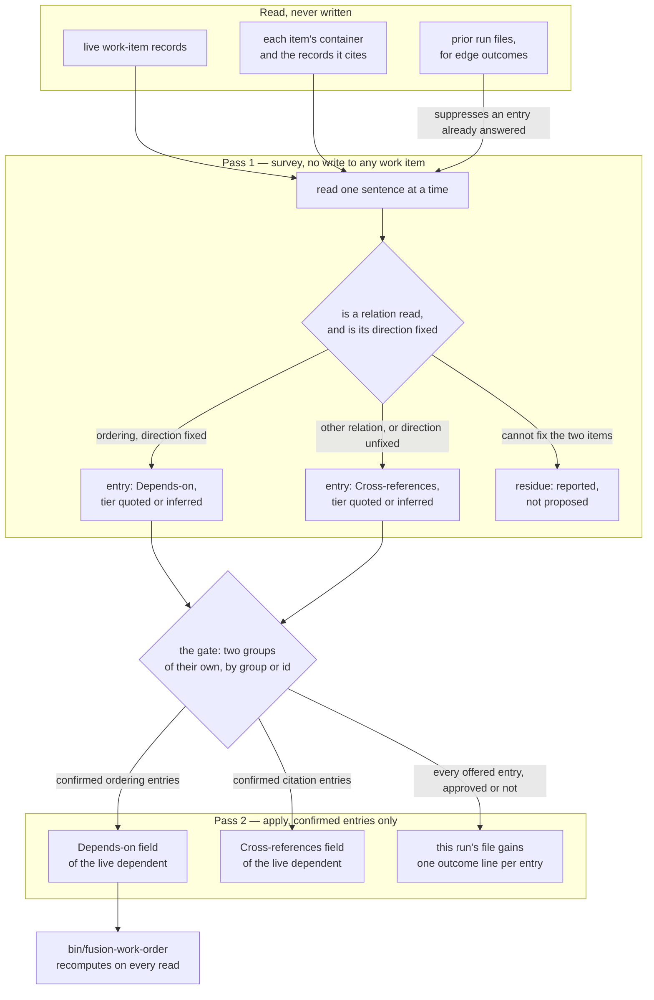

# Implementation Plan: the `**Depends-on:**` proposal pass

**Date:** 2026-09-18
**Status:** Draft
**Spec:** `260917-2256_*_spec-depends-on-edges-proposed-and-confirmed.md`, as corrected by
`260917-2258_*_spec-depends-on-edges-zero-yield.md` (three rounds, six conceded claims) and by the
binding corrections the dispatch carried. Where spec and discussion differ the discussion governs;
where the dispatch differs from both, the dispatch governs.
**Decidability:** The load-bearing question is *which relation does this sentence assert between two units of work*, and it is **not decidable** from the inputs the mechanism has — `260911-1915-candidate-prerequisite-edges.md` measured at least five relation types in this workbench's prose with nothing in the text separating them, and `rules/critical-stance.md` §4 names exactly this shape. **The pass therefore does predict, on one arm of its split, and says so rather than denying it.** What changes is not that the reading happens but what it may do: an ordering whose direction the pass fixed from what two items' artifacts and directives do is marked `inferred`, carries the sentence it rests on, and is **never applied on the mechanism's own say-so** — it is a proposal the user rules on, and a rejection leaves the store byte-identical. Where the direction is not fixed the entry goes to the field that orders nothing, so a prediction can never *silently* become an ordering; where the pass cannot fix which two items the sentence binds it proposes nothing and reports the sentence. That is the change of mechanism §4 requires: an undecidable prediction demoted to a labelled, citable proposal under a human ruling rather than promoted to a decision. **A plan claiming this classifier is reliable would be wrong; this one claims only that every entry is checkable and that no unchecked entry reaches a record.**

## Directive

Build the pass. One curator invocation surveys the workbench, proposes each candidate edge between
two units of work as a ledger entry naming the dependent, the target, the tier and the citation,
puts them to the user at one gate in groups of their own, and writes only what the user confirmed —
into `**Depends-on:**` where the relation orders the work, into `**Cross-references:**` where it
binds without ordering. Nothing is written before the gate; a rejection leaves every work item
byte-identical.

The spec's three-candidate-edge stopping condition is **struck by the user** and is not reinstated
here in any form: a rule that forbids building the feature that would produce the edges the rule
demands is circular.

## Current State

### What already exists and is reused

The Research Gate finding is that **almost all of this already exists**, so the integral design is
one added *subject* on a loop that already runs. Reused unchanged: the survey/gate/apply sequence,
the run file with per-entry ids, the staleness re-read and the byte-for-byte post-write compare
(`agents/curator.md` `### Pass 1 — survey`, `### Pass 2 — apply`); the ledger entry schema;
`/fusion:curate` as the user surface and gate-holder; the field grammar and the five status values
(`rules/fusion-workbench-conventions.md` `## Backlog entries — work items`); `bin/fusion-work-order`
for the order; and evidence source 1, through which the curator already reads every work item.

**No TypeScript changes, no new `bin/` helper, no new file under `hooks/lib/__tests__/`.** An edge
write is an ordinary one-region replacement on one line of a work item's head, so
`### Pass 2 — apply` needs no new procedure; the node set comes from `**Status:**` on records the
survey already reads.

### What the store measures today, and what that does to the acceptance

Measured in this work tree at `2a9cd013` by running `bin/fusion-work-order`:

```
items=1  edges=0  unresolved-edges=1  ready=1  verdict=acyclic
unresolved=260917-2253-depends-on-edges-proposed-and-confirmed wants 260918-0706-strike-unconfirmed-depends-on-entry.md
```

Seven work items exist; six terminal (five `done`, one `dropped`), one `claimed`. The one live
`**Depends-on:**` entry is the user-confirmed one C1 left behind; it reports `unresolved` because
its target reached `done`, which is the node-set ruling working as designed.

**Stated plainly, because the plan is worthless if it is not:** with one live node there are zero
ordered pairs, so the `**Depends-on:**` half of the first run proposes **zero edges**, and no
implementation changes that. `bin/fusion-work-order` will not compute an order over more than one
node at the end of this work. `## Where this work stops` carries that as a condition.

**The `**Cross-references:**` half yields 2, and what those 2 are matters more than the number.**
The live item's container names two work items its head does not yet cite,
`260909-1700-cut-fusion-to-working-minimum.md` and
`260908-2018-prerequisites-confirmed-once-order-computed.md`. Measured: both appear in exactly one
file, `260917-2256_*_spec-depends-on-edges-proposed-and-confirmed.md`, the spec this session wrote.
**So the entire first-run yield is this session's own text, and the round-1 objection to a
self-authored fixture lands on it unchanged**
(`260917-2258_*_spec-depends-on-edges-zero-yield.md` claim C8). The first run exercises the
plumbing — corpus walk, entry shape, ledger, residue, no-write-before-the-gate — and the judgement
half **not at all**. Worth running for the plumbing; not evidence that the pass reads relations
correctly, and nothing here may be read as claiming it is.

### The byte picture, re-measured at `2a9cd013`

| Surface | Total | Budget | Left | Taken by |
|---|---|---|---|---|
| `agents/*.md` (bytes) | 279 584 | 328 567 | **48 983** | `cd hooks && npx vitest run lib/__tests__/surface-growth-bound.test.ts` |
| `skills/*/SKILL.md` (bytes) | 227 854 | 228 028 | **174** | the same |
| `hooks/lib/__tests__/**` (lines) | 22 042 | 22 068 | **26** | the same |
| curator dispatch path (bytes) | 149 969 | 227 066 | **77 097** | prompt 44 558 + rules emitted 97 297 + `CLAUDE.md` 8 114, summed per file |

The tightest of the eleven dispatch paths is the curator's own, so no path holds less than 77 097
bytes and step 4's rule-file edit — charged eleven times at zero head-room — is affordable at the
scale planned. The room exists because `CLAUDE.md` fell to 8 114 bytes from the 93 432 each
baseline row was armed on.

## Approach

### One parameter, one subject, additive — and unanchored

`**Edges:** on` on the survey dispatch **adds** the work-item subject to a curator run. It does not
replace the three normative surfaces and there is no edges-only mode today. The apply dispatch
needs **no** parameter: it passes `**Mode:**`, `**Ledger:**` and `**Approved:**` and follows the
ledger, so `**Edges:**` is survey-side only.

**The edge subject is unanchored in both directions, and both halves are the design.** The
`### The seven evidence sources` pass is bounded by `last_curator_run` and sets it after the run
file is written.

- **The edge corpus is never bounded by the anchor.** A dependency relation is a *standing fact*,
  not a change event. The anchor answers "what normative text have I already surveyed", and an edge
  pass surveys none — an item nobody has touched since the last run can still be the target of an
  edge nobody has ever proposed. An anchored corpus would silently return nothing on every run but
  the first.
- **A run that did not survey the three normative surfaces never advances the anchor.** That is all
  the value claims. The conditional is unreachable while the parameter is additive, and is written
  in anyway, so the day an edges-only route arrives it does not arrive with a lying anchor.

The cost of the additive shape is stated rather than designed around: a user wanting only edges
pays for the normative survey beside them, and a *test* run advances the anchor for everyone —
which is why step 7 saves and restores it.

### The corpus, and the live/terminal bound

The corpus is, for each **live** work item (`**Status:**` one of `open`, `claimed`, `paused`): the
item record; every file inside its own container directory; and every record it cites, resolved by
the one workbench-wide lookup `rules/fusion-workbench-conventions.md` `## Filename Patterns`
defines. Nothing outside `fusion-workbench/` is read. A cited record resolving into the archive
store is read as evidence exactly as evidence source 6 already reads it, and never written.

**The live-only bound belongs to the ordering edge, not the citation — a correction to the
dispatch's own framing.** The dispatch says a `done` or `dropped` item "is never a dependent and
never a target". The first half holds for both fields, the second only for `**Depends-on:**`:

- **`**Depends-on:**` — both endpoints live.** The node-set ruling
  (`260908-2018_*_is-a-closed-prerequisite-a-satisfied-edge-or-no-edge-and-what-is-an-archived-one.md`)
  puts a terminal item outside the graph on both sides, so proposing one proposes a dangle.
- **`**Cross-references:**` — dependent live, target any work item.** That field orders nothing, so
  the ruling does not reach it, and a live item citing a finished one is the ordinary case: this
  work item cites three terminal records in its head today, beside one still open. The dependent
  must be live, a terminal item's head being corrected only under the narrow exception C1 used.

The dependent is live either way, which keeps the write bound honest: **the pass writes into a live
work item's head and nowhere else.**

### The classification, cut on direction

The unit judged is a **reading** — one supportable interpretation of one sentence binding item A
(whose corpus carried it) to work item B. One sentence may carry more than one reading, and each is
its own ledger entry.

The split is cut on **whether the direction is fixed**, and on nothing else. Two tests in order,
three branches, and no reading falls outside them or into two:

1. **Is a relation between A and B read at all, with both items identified?** No → **residue**:
   nothing proposed, the sentence reported in the run file with the record it came from.
2. **Does it fix an ordering direction — B reaches a finished state before A may start?** Yes → a
   **`**Depends-on:**`** entry on A. No → a **`**Cross-references:**`** entry on A.

**The tier is not a branch and never was.** It is recorded on whichever entry the split produced:
`quoted` where the words themselves fix what the test turned on, `inferred` where the pass fixed it
from what the two items' artifacts and directives do. An earlier draft cut on the source of
evidence instead, which put "the words do not state the ordering" and "an ordering whose direction
the words do not fix" in two branches holding the same readings — the overlap
`rules/critical-stance.md` §4 calls a defect of the same kind as a wrong result. The recut removes
it, and one branch.

Test 2's *no* arm is where C7's reversal lands: a relation the ordering field cannot carry is
**routed** into the field defined widely enough to receive it
(`rules/fusion-workbench-conventions.md` `## Backlog entries — work items`, "work it merely
touches"), as a proposal the user confirms — never converted, never silently dropped. Test 1's *no*
arm is the residue that correction leaves. The *yes* arm is read honestly in the
`**Decidability:**` line: an `inferred` ordering is a prediction, kept harmless by being labelled,
cited and inert until the user rules.

Where a sentence asserts a conflict *and* the workbench records its resolution, both readings
stand: two entries, and the ordering one quotes both sides. The spec's C3 worked example, unchanged.

### Re-run semantics: suppress on the outcome line

Built to deliver the recommendation of
`260911-1833_*_how-does-the-curators-survey-know-not-to-re-propose-an-edge-the-user-declined.md`
(option 1: separate a refusal from an unanswered proposal). **The separation is achieved without
option 1's fifth outcome value**, and the reason is a finding this plan reports rather than
assumes — see `## Open Questions` and the new decision record filed with this plan.

The survey reads every prior curator run file across `$WORKBENCH`, **unbounded by the evidence
anchor and not through `$SCAN_ANALYSES`**, and for each edge entry it finds:

| Prior entry | Next run |
|---|---|
| consequence group `candidate` | **re-proposed, always** — a candidate is never offered for approval, so whatever outcome line it carries records no answer |
| `applied` | suppressed — and suppressed anyway, the field now carries the basename |
| `skipped`, in a group the gate offers | **suppressed** — an outcome line exists, so a gate was put and answered, and this entry's group was on offer and not taken |
| `stale`, `failed` | **re-proposed** — the user approved it and the write did not land |
| no outcome line at all | **re-proposed** — no apply dispatch ran, so no gate was ever answered |

**The candidate row is read first, and it is not a rounding case.** `agents/curator.md`
`## Evidence tiers` makes a candidate an entry never offered for approval — yet
`### Pass 2 — apply` appends an outcome per entry, so a candidate edge entry can carry `skipped`
without having been put to anybody. Suppressing on that suppresses a question the user never saw,
the failure the 2026-09-11 record rejected option 2 for, and the route is ordinary: an unreadable
cited record downgrades a finding to a candidate under the thin-spot rule. **This plan takes the
narrow settlement** — the key reads the consequence group beside the outcome line, and a
`candidate` is never suppressed; nothing the other three subjects see changes. The alternative,
stopping the apply pass writing an outcome on entries never offered, is cleaner and touches all
four subjects; it is in the decision record as the second remedy.

Both bounds on the read are measured facts, not caution: the anchor bounds the evidence pass by
commit and date, and `**Scope:** full` is what a user runs after a decline; and `$SCAN_ANALYSES`
resolves to the *claimed item's* container plus `shared/`, so a run file written while a different
item was claimed sits outside it and its refusals vanish silently.

Where the prose under a confirmed edge later changes, the pass **reports the change and proposes
nothing**. Revising or retracting a confirmed edge stays the user's act.

### The shape of the pass



Coherence self-check, run rather than assumed. No cycle: `prior` and `outcome` are two nodes on
purpose, this run's file becoming a prior one only for the *next* run. Direction runs top-down,
every node is reachable, and the only fan-out above one is the split and the gate — the two places
a fan-out is the design. The one edge that would tangle it, a write from the survey straight into a
field, is absent because the prose forbids it. Every relation the prose declares is an edge here,
and the reverse.

## Implementation Steps

1. **The fourth subject in `agents/curator.md`**
   - Executor: `coder`
   - Files: `agents/curator.md`
   - Changes, site by site:
     - **After the three-surfaces list** (`# Curator Agent`): one paragraph naming the work item as
       a fourth **subject**, not a fourth surface — "three normative surfaces" stays exactly as it
       is everywhere it appears, and the new text says why: two machine-readable head fields of a
       live work item, reached only on `**Edges:** on`, gated like every other change, widening the
       remit's two reasons not at all.
     - **New section `## The fourth subject — work-item edges`**, after `## Contradictions` and
       before `## The two passes and the gate`. In this order: the parameter gate; the corpus and
       the live/terminal bound as `## Approach` states them; **the two anchor rules — the edge
       corpus is never bounded by `last_curator_run`, and a run that did not survey the three
       normative surfaces never advances it**; the classification **cut on direction**, two tests
       and three branches verbatim, with the tier recorded on the entry and never used as a branch;
       the two target fields; the residue; the suppression read with both bounds **and the candidate
       row read first**; and the "prose changed under a confirmed edge" rule. **The single authoring
       home for all of it** — no other file restates any part.
     - **`### Explicitly not in your remit`, exclusion 5.** Close the textual collision rather than
       assuming it away: `data` there means source-tree data (ontology, manifests, schemas,
       fixtures), not a workbench record's machine-readable head field, which the authorising ruling
       calls "data rather than narrative"
       (`260911-1747_*_may-a-done-work-items-head-field-be-edited-at-all-and-under-what-bound.md`).
       One amendment covers **both** fields; the count stays eight, seven untouched.
     - **`## Scope`.** The gated-edit list gains one row: the two head fields of a **live** work
       item. The "You may NOT edit" table's `Code, data, ontology` row takes exclusion 5's
       qualifier, and gains a row for everything else in a work-item record — `**Status:**`,
       `**Claim:**`, `**Active spec/plan:**`, the body, and filing an item at all — owner: the
       orchestrator at the user's word.
     - **`### The gate`.** The ordered group list gains two entries between `relocations` and
       `consolidations`: `work-item ordering edges`, then `work-item citation edges`. There because
       an edge removes no constraint, which puts it below a relocation, and orders work, which puts
       it above a consolidation. Two groups so a user can take the citations without the orderings.
     - **`agents/curator.md:326`, the `**Consequence group:**` union in `### Ledger entry schema`.**
       The **third** copy of the enumeration, and the one a drafter forgets: it must move with the
       gate list or the ledger writes a value the schema does not carry. Nothing goes red if it is
       missed — `derivable-enumerations-lint.test.ts` does not cover this list — which is why it is
       its own site.
     - **`### Ledger entry schema`.** `**Surface:**` gains `work item head field`. `**Tier:**` gains
       `quoted | inferred`, with one sentence saying that on an edge entry the tier grades **how the
       relation was read** and never whether a statement is false — the shape the `relocation`
       paragraph beside it already uses. One new line,
       `**Edge:** <dependent> -> <target>, into <field>`. `**Constraint removed:**` reads `none`.
       One paragraph on filling it: **File** is the dependent's record path, **Before** the field
       line as it stands or `(absent)`, **After** the line the record must carry — an ordinary
       one-region replacement, so the staleness re-read, the post-write compare and the outcome line
       apply unchanged.
     - **`## The run file`.** One new numbered item, written only on `**Edges:** on` — parallel to
       the placement-classification item beside it. It holds the corpus statement, the residue, and
       the suppression read (which prior run files were read, which entries suppressed, on which
       outcome).
     - **`## Dispatch parameters`.** One row: `**Edges:**` | `on` \| `off` | defaults to `off` — no
       work item read as a subject, no edge entry proposed, no edge section in the run file. Plus
       one sentence beside the `**Placement:**` paragraph, same principle: the dangerous subject is
       the one that has to be asked for.
     - **`### Pass 1 — survey` and `### Pass 2 — apply`.** One sentence each: the survey writes into
       no work item; the apply pass writes an approved edge through the ordinary one-region path,
       no relocation-style second write.
   - Constraints, each with its gate: no type-folder path literal — use the `$OUT_*` / `$SCAN_*`
     keys and `$WORKBENCH` (`path-literal-lint.test.ts`); no bracket-form state marker
     (`marker-format-lint.test.ts`); no raw dotglob in a bash fence (`glob-nomatch-lint.test.ts`);
     every plugin path, anchor and record citation added must resolve
     (`reference-resolution-lint.test.ts`, whose pin step 5 re-approves).
   - Dependencies: none.

2. **`--edges` on `/fusion:curate`, paid for by a cut in the same file**
   - Executor: `coder`
   - Files: `skills/curate/SKILL.md`
   - Changes:
     - The argument line gains `--edges` beside `--full`.
     - One line after the survey-dispatch block: add `**Edges:** on` when the user passed
       `--edges`, citing `agents/curator.md` `## Dispatch parameters`. Nothing is added to the apply
       dispatch.
     - **The cut that pays for it is a repair, not a sacrifice.** Step 3 and Step 5 each carry a
       parenthetical copy of the consequence-group list
       (`constraint removals, tier-3, tier-2, tier-1, consolidations`). Both are **already wrong** —
       they omit `relocations`, carried in `agents/curator.md` `### The gate` since the relocation
       entry landed. Replace both with a pointer to that authoring home.
   - Budget, measured rather than rounded: the draft is 133 bytes against 174 of head-room. Each
     enumeration is 59 bytes and the shortest usable pointer naming a file and a heading is 34, so
     two sites return **50**, not the 85 an earlier draft claimed. Net **+83**, leaving 91. A larger
     return needs a larger edit than "replace both with a pointer", and this step does not attempt
     one. Step 6 reports what landed.
   - Dependencies: step 1 (the parameter is declared before a skill passes it).

3. **The `**Edges:**` row in the dispatch-parameter roster**
   - Executor: `coder`
   - Files: `README-agents.md`
   - Changes: one row in `## Dispatch parameters` — the roster's single authoring home — shaped like
     the five `curator` rows already there: agent, line, values, behaviour when absent, who passes
     it (`/fusion:curate`, only on `--edges`), and the prompt section it was read against.
     `CLAUDE.md` is **not** touched: it cites this section rather than restating it, and it is
     charged to all eleven dispatch paths at zero head-room.
   - Dependencies: steps 1 and 2 (the row cites both).

4. **Close the "unruled" sentence in the field's own definition**
   - Executor: `coder`
   - Files: `rules/fusion-workbench-conventions.md`
   - Changes: `## Backlog entries — work items` reads "**Whether an agent may propose an entry for
     the user to confirm is unruled**", citing
     `260909-1020_*_three-source-aspects-unnamed-and-the-proposal-pass-has-no-agent-or-surface.md`.
     That stops being true once step 1 lands. Replace the clause — do not append beside it — with
     one naming the curator's `**Edges:** on` pass as the one agent route that may propose, and
     restating that the write still stands on the user's confirmation. One clause: this file is
     emitted to every agent and charged eleven times at zero head-room.
   - Constraint: keep the `**Provenance:**` header inside the first ten lines
     (`provenance-header-lint.test.ts`).
   - Dependencies: step 1.

5. **Regenerate the two record-keeping goldens; re-approve the one pin**
   - Executor: `coder`
   - Files: `hooks/lib/__tests__/fixtures/surface-growth.golden`,
     `hooks/lib/__tests__/fixtures/rules-emission.golden`,
     `hooks/lib/__tests__/reference-resolution-lint.test.ts`
   - **The three are not the same kind of act, and conflating them is how a bound gets cleared by
     accident.** Two goldens *record* what the tree weighs; one literal *is* a bound.
     - **Regeneration, which moves no baseline.**
       `cd hooks && UPDATE_SURFACE_GOLDEN=1 npx vitest run lib/__tests__/surface-growth-bound.test.ts`
       and
       `cd hooks && UPDATE_RULES_GOLDEN=1 npx vitest run lib/__tests__/rules-emission-golden.test.ts`,
       each re-run without the flag afterwards (the flagged run fails on purpose). Reviewing the
       diff is the whole obligation. **Neither clears a bound and neither is a re-approval:** the
       `agents` and `skills` budgets live in `surface-growth-bound.test.ts` itself
       (`SKILL_BASELINE`, `SKILL_HEAD_ROOM`, `TEST_LINE_HEAD_ROOM`, and their `AGENT_*`
       counterparts), `RULE_BASELINE` does not move with its golden, and each file's header says so.
       **If the suite is still red after regenerating, the surface is genuinely over and the answer
       is a cut** — never a baseline edit.
     - **The one re-approval.** `reference-resolution-lint.test.ts` carries
       `const BASELINE = { paths, anchors, stampBare }` as an **exact equality**, and steps 1 to 4
       add resolving citations and anchors to scanned files. Re-measure by swapping each edited file
       back to `HEAD` in place, write the new figures in, append the attribution to the existing
       comment. **Keep it one physical line** — that surface is bounded in lines, and holds 26.
     - `dispatch-path.baseline` is **not** edited: hand-written, no flag, every path holding at
       least 77 097 bytes.
   - Acceptance: `cd hooks && npx vitest run` is green.
   - Dependencies: steps 1, 2, 3, 4.

6. **Measure both byte surfaces and report the figures**
   - Executor: `coder`
   - Files: none — this step writes no file; it runs commands and reports.
   - Changes: run and report, each figure beside its command — from
     `cd hooks && npx vitest run lib/__tests__/surface-growth-bound.test.ts`, the `agents/*.md` and
     `skills/*/SKILL.md` totals and head-room, before and after; the curator dispatch path
     (`agents/curator.md` + the sum over `bin/fusion-rules curator` + `CLAUDE.md`) against its
     `dispatch-path.baseline` row; the eleven-path minimum, so step 4's edit is charged where it
     actually is; and the hook-test line count. The figures go in the commit message and the
     report. A step that says only "it fits" has measured nothing.
   - Dependencies: step 5.

7. **Run the survey end to end and check it against the store**
   - Executor: `coder`
   - Files: none written by this step; the curator writes its own run file under `$OUT_ANALYSIS`.
   - **Save the anchor first, restore it after.** `agents/curator.md`
     `### The seven evidence sources` has the survey pass set `last_curator_run` to HEAD once the
     run file is written, and the parameter is additive, so this test run would otherwise leave the
     user's first real `--edges` run reading nothing that predates it. Read the value with
     `[ -x "$FUSION_PLUGIN_ROOT/bin/fusion-cadence-anchor" ] && "$FUSION_PLUGIN_ROOT/bin/fusion-cadence-anchor" get last_curator_run`
     before the dispatch and write it back with the matching `set` after. **A workaround for a test
     run, not the design** — step 1's two anchor rules are the design, and the rule that would have
     saved this step is unreachable while the parameter is additive.
   - Changes: dispatch `fusion:curator` with `**Mode:** survey` and `**Edges:** on` and nothing
     else — the survey writes to no surface and no work item, so it is the one part of the loop that
     runs without the user. Then check by running, not reading: `git status --porcelain` names **no**
     work-item record; the run file carries the edge section with its corpus statement, proposals,
     residue and suppression read; `bin/fusion-work-order` and
     `fusion-cadence-anchor get last_curator_run` print what they printed before; and each
     proposal's citation opens to the sentence it names.
   - Expected result, stated in advance so a surprise is visible — **re-derived at HEAD on
     2026-09-18, because the figure first written here no longer holds.** The
     `**Depends-on:**` half is unchanged: **zero `**Depends-on:**` proposals**, the live node set
     being one item, and a `**Depends-on:**` proposal today still means the live/terminal bound
     was implemented wrongly — a failure of this step, not a bonus. The citation half read **two
     `**Cross-references:**` proposals**, the two items named in `## Current State`, and that was
     derived before the container hop landed at `git:8fad8ead`. With the hop, the citations
     standing in this item's corpus reach **five** work items, **two of which the field already
     carries**, so the derivable statement is an upper bound of **three new
     `**Cross-references:**` targets** rather than an exact two. A run returning fewer declined
     readings rather than failed; a run returning a target outside those five is the surprise
     this line exists to make visible. Measurement and the count it comes from:
     `260918-0824_*_the-container-hop-voided-the-only-stated-mitigation-for-flooding-the-gate.md`.
   - Dependencies: step 5.

8. **An adversarial read of what the first run proposed**
   - Executor: `analyst`
   - Files: a report under `$OUT_ANALYSIS`
   - Changes: read the run file step 7 produced and judge, entry by entry, whether tier and
     direction are supported by the citation; whether the `**Before:**` block matches the record's
     field line on disk; whether anything in the residue should have been an entry or the reverse.
     Report the count of entries whose citation does not support the claim made.
   - **What this step cannot check, stated because the premise changed.** An earlier draft justified
     it as a read "over prose nobody authored for it". That is false, and measured: the whole
     first-run yield comes from `260917-2256_*_spec-depends-on-edges-proposed-and-confirmed.md`,
     this session's own spec. The step checks the **plumbing** — entry shape, citation resolution,
     before-text fidelity, residue handling — on a corpus the session authored, and **not** the
     judgement half; `260917-2258_*_spec-depends-on-edges-zero-yield.md` claim C8 stands unchanged.
     Kept because the plumbing check is real and cheap; its report says in its first line what it
     did not test.
   - Dependencies: step 7.

## Where this work stops

- The four text edits of steps 1 to 4 are written, and `cd hooks && npx vitest run` is green with
  **no baseline moved at all** — the two goldens regenerate, which moves none, and the one
  hand-written pin is re-approved on its existing line.
- One `fusion:curator` survey dispatch carrying `**Edges:** on` completes, its run file carries the
  edge section with its corpus statement and residue, `git status --porcelain` names no work-item
  record after it, and `last_curator_run` reads what it read before.
- Both byte surfaces are measured after the text is written, and both figures reported in the
  commit message and the report rather than asserted.
- The new decision record
  `260918-0712_*_how-does-the-curators-edge-survey-know-not-to-re-propose-an-edge-the-user-declined.md`
  is on the user's table as `_o_`. **The work does not wait on the ruling.** A ruling against
  option 5 is one prompt and two sections, and a new item rather than a reopening of this one.
- **A precondition on closing this item, which the user answers and no mechanism can.** The item's
  directive says it is reached when a run proposes edges, the user confirms them, and
  `bin/fusion-work-order` computes an order over more than one node. The third half is unreachable
  here: the store holds one live node and every route to a second is a user act. The item closes
  either (a) after the user has filed further live items and a later `--edges` run has put a
  confirmed ordering edge between two of them, or (b) now, with a closure note stating which half
  was not met and why. The user picks at the closing gate, reading this clause back.
- **A precondition on any release claiming this feature.** `/fusion:curate --edges` has been run by
  the user through its gate at least once, with a confirmation and with a rejection, and the
  rejection left every work item byte-identical. That has not happened when step 8 finishes, because
  step 7 stops before the gate.

## Data Structures

No schema, no type, no file format is added. An edge entry fills the existing ledger shape
(`agents/curator.md` `### Ledger entry schema`) with one added line:

```markdown
### L07 — 260917-2253 cites 260909-1700 as work it corrects

- **Surface:** work item head field
- **File:** <the dependent's record path>
- **Tier:** quoted
- **Edge:** 260917-2253-<slug>.md -> 260909-1700-<slug>.md, into **Cross-references:**
- **Citation:** <record and heading anchor, with the sentence quoted>
- **Consequence group:** work-item citation edge
- **Constraint removed:** none
- **Revert path:** `git checkout -- <path>`

**Before:**
> **Cross-references:** <the line as it stands, or "(absent)">

**After:**
> **Cross-references:** <the line the record must carry>
```

**The work-item head field is unchanged in grammar.** `bin/fusion-work-order` and
`hooks/lib/work-graph.ts` read what they read today, which is why neither is touched.

## API Changes

One dispatch parameter, `**Edges:** on | off`, declared in `agents/curator.md`
`## Dispatch parameters`, rostered in `README-agents.md` `## Dispatch parameters`, passed by
`/fusion:curate --edges` on the survey dispatch only. Default `off`: an unparameterised run behaves
exactly as it does today.

## Testing Strategy

No new test file and no new `bin/` helper — **and if that changes, the plan is wrong rather than
the budget.** The design adds no executable code, so a unit test would have nothing to call. What
is checkable is checkable by running it:

| What | Command | Passing looks like |
|---|---|---|
| the text obeys every shipped-surface gate | `cd hooks && npx vitest run` | green |
| the two byte surfaces | `cd hooks && npx vitest run lib/__tests__/surface-growth-bound.test.ts` | green, with the figures reported |
| every citation added resolves | the same run (`reference-resolution-lint.test.ts`) | green after the re-approval |
| nothing is written before the gate | `git status --porcelain` after step 7 | no work-item record named |
| the store is unchanged by a survey | `bin/fusion-work-order` before and after step 7 | identical output |
| a confirmed edge reaches the graph | `bin/fusion-work-order` after a gated apply | the edge appears in `edges=` |
| a rejection changes nothing | `git status --porcelain` after a rejected gate | clean |

The last two are the user's to run; `## Where this work stops` carries them as preconditions rather
than steps, because the gate needs a human.

**What none of this tests** is the hard half — whether the pass reads a relation correctly. Step 8
does not test it either, the first run's whole yield being this session's own spec. **So this plan
ships a mechanism whose judgement half is untested by anything, and says so.** The first evidence
comes from the user's first real run, over prose somebody else wrote.

## Risks & Mitigations

| Risk | Mitigation |
|------|------------|
| A wrong ordering is proposed and confirmed unchecked | Every entry carries the sentence and the record, so checking is one file open, and the tier says whether the words fixed the direction or the pass did. **A mitigation, not a fix** — an `inferred` ordering is a prediction, and the gate is the only thing between it and a record. |
| The pass floods the gate with citation proposals | **This mitigation is false at HEAD and is struck rather than restated.** It read: the cross-reference arm proposes only for a relation read between two work items, not for the decision, analysis and plan records an item cites. The container hop landed at `git:8fad8ead` and makes a cited record identify the item whose container holds it, so those records *do* become endpoints and the sentence is its own negation. No replacement mitigation is claimed: measured, what bounds the yield on this workbench is the legacy-status exclusion and a store holding seven items, and neither scales. The gate is the bound, and it is the only one. `260918-0824_*_the-container-hop-voided-the-only-stated-mitigation-for-flooding-the-gate.md`. |
| The suppression read misses a refusal | Both bounds are stated in step 1 — unbounded by the anchor, and across `$WORKBENCH` rather than `$SCAN_ANALYSES` — each derived from how those keys actually resolve. |
| The full-rejection case is not remembered | Named, not hidden: the skill dispatches nothing on a full rejection, so no outcome line exists and the next run re-asks. It errs toward re-asking. Carried in the decision record as option 5's residual. |
| The skill surface's 174 bytes are exceeded | Step 2 returns **50** bytes against a 133-byte addition: net +83, leaving 91. Step 6 reports what landed; a red bound is answered with a further cut, never a baseline edit. |
| A candidate edge entry is suppressed forever without ever having been offered | The suppression key reads the consequence group beside the outcome line and never suppresses a `candidate` — the first row of the re-run table, and the reason it is first. The alternative remedy is in the decision record. |
| A test run of the pass eats the user's first real run | Step 7 saves and restores `last_curator_run`, and checks it afterwards. |
| Exclusion 5's `data` collision is assumed away instead of closed | Step 1 closes it in the drafting, in the amendment that covers both head fields. |
| The user reads "built and working" and expects an order over two nodes | Stated in `## Current State`, in step 7's expected result, and as a precondition in `## Where this work stops`. The arithmetic is the store's, not the implementation's. |

## Open Questions

- [ ] **Re-run semantics.** Filed as its own record, because it binds work beyond this plan:
      `260918-0712_*_how-does-the-curators-edge-survey-know-not-to-re-propose-an-edge-the-user-declined.md`.
      It carries forward the four options of the terminal
      `260911-1833_*_how-does-the-curators-survey-know-not-to-re-propose-an-edge-the-user-declined.md`
      and adds a fifth, which is what this plan builds. **The finding that moved it:** option 1's
      `declined` is written on an entry the user refused "with that group on offer", and the gate
      puts **every** non-empty group on offer — so `declined` and `skipped` name the same entries,
      the overlap `rules/critical-stance.md` §4 calls a defect. The separation option 1 wanted is
      already carried by whether an outcome line exists, since one is written only where an apply
      dispatch ran and that runs only after an answered gate. `inference:` read off
      `agents/curator.md` `### The gate` and `skills/curate/SKILL.md` `## Step 5 — The gate`, not
      off a run. **Option 5 is a reopening, not a novelty:** the 2026-09-11 record rejected
      suppressing on `skipped` on an explicit premise, and option 5 reopens that premise on evidence
      that record did not have. A ruling for option 1 costs one prompt and two sections.
- [ ] **Should a candidate entry carry an outcome line at all?** The plan settles the narrow
      question — a `candidate` is never suppressed — and leaves the general one open, because it
      reaches all four subjects: the apply pass appends an outcome per entry, including entries the
      gate never offered. Both remedies are in the decision record.
- [ ] **Do the edge groups belong above or below `relocations` at the gate?** Step 1 puts them below
      relocations, above consolidations: an edge removes no constraint but does order work. A
      judgement about consequence, not a measurement; the user may move it in one line.
- [ ] **May an ordering edge name a `paused` target?** It may, and step 1 writes it that way, because
      `rules/fusion-workbench-conventions.md` makes `paused` live and a node. Flagged because the
      store has held no paused item to check it against.
