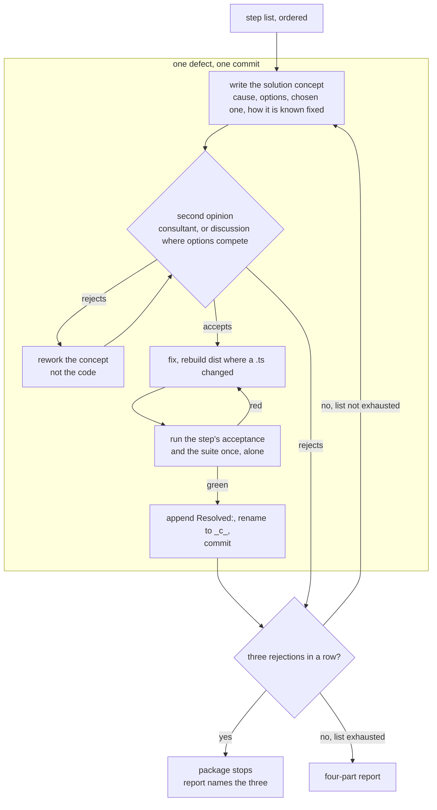
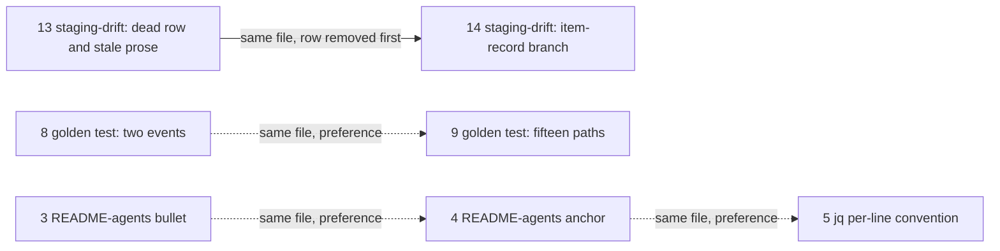

# Implementation Plan: autonomous defect package, fifteen fixes with a second opinion each

**Date:** 2026-09-18
**Status:** Draft
**Spec:** none — planned from the work item's `## Directive` (`260918-1048-defekte-selbstaendig-abarbeiten-mit-zweitmeinung.md`) and the three defect surveys in this item's analyses store (`260918-1112-defect-survey-group-1.md`, `260918-1112-defect-survey-group-2.md`, `260918-1109-defect-survey-group-3.md`)
**Decidability:** The load-bearing question is whether each selected defect is still present at HEAD and closable by one bounded edit whose acceptance is a command the executor can run. It is decidable from the inputs the steps have: every step's presence claim was measured by a survey at HEAD `f14506554f6a7bdbf3f1b1b5500e217b1cd04b90`, and every acceptance below is a `grep`, a `wc`, a helper call or the suite, each with a stated expected result. One input is not decidable from the plan: whether the second opinion accepts a concept. That question is not approximated; it is handed to the stop rule in `## Where this work stops` (three rejections in a row end the package), which is the directive's own mechanism for it.
**Domain:** code

## Directive

The work item's directive, read as the mandate: work open defects one at a time for three days without asking; select 10 to 15 of the 110 open records; for each one, write a solution concept (cause, defensible options, the chosen one, how a reader knows it is fixed), get a second opinion on the concept before any code changes (`fusion:consultant`, or `/fusion:discuss` where more than one option is seriously in play), fix, verify, close the defect with its `Resolved:` line, one commit per defect. Decide everything about the solution yourself and file a decision record where a later reader would otherwise re-derive the reasoning. Do not decide what is consent (ontology, removing or rebuilding something that exists, an ambiguous mandate): file the decision open, skip, continue. Stop when the list is exhausted or when the second opinion rejects three concepts in a row. Push nothing; do not run `/fusion:cleanup`. Close with a four-part report.

This plan is the list the directive asks to be written first. It selects fifteen defects, orders them, and states for each what is touched, what is not, and how it is verified.

## Current State

Three surveys read all 110 open defect records against the tree at HEAD `f1450655` and classified 49 as `IN`, 18 as `RESOLVED-AT-HEAD`, and 43 as out under one of four exclusions. The surveys' findings tables are the evidence for every presence claim below; this plan re-read the code sites of the fifteen selected records and found each as the survey describes it.

Three measured constraints shape the selection more than any single defect:

| Constraint | Measured (survey group 2, HEAD `f1450655`) | Consequence for this plan |
|---|---|---|
| `skills/*/SKILL.md` head-room | 2 bytes | No selected step touches a skill body. |
| `hooks/lib/__tests__/**.ts` head-room | 12 lines | Two steps add test lines; each names a funding cut in the same file and its acceptance holds the file's line count at or below HEAD's. |
| `agents/*.md` head-room | 16 689 bytes | Two steps edit a prompt; one shrinks it, one adds a clause well inside the room. |

Whether a comment line on the hook-test surface counts is an open decision (`260822-1154_*_does-the-hook-test-line-budget-cover-comment-prose.md`); the status quo it records is that a line is a line, so a cut of comment prose funds an added case. The two funding cuts below rely on that status quo and nothing else.

The hook suite is not isolated from a second copy of itself (`260905-2356_*_the-hook-suite-is-not-isolated-from-a-second-copy-of-itself-and-fails-at-forty-percent-under-one.md`). Every acceptance below that runs `cd hooks && npm test` means one run, alone, on an idle tree. No selected step's acceptance depends on a flaky case: the two load-sensitive records (survey group 3, rows 1 and 33) are out.

Every edit to a `.ts` file under `hooks/` or `hooks/lib/` carries `cd hooks && npm run build` and the rebuilt `hooks/dist/` in the same commit, because `committed-dist.test.ts` compares the two. Comment-only edits are not exempt: the compiler keeps comments, so `dist` changes with them.

## Approach

One loop, run fifteen times, with the directive's counter around it. The loop is the directive's own sequence; the plan adds nothing to it except the order of the list and the acceptance per step.

The graph has one intentional cycle, concept to opinion to rework, which is the directive's rule that a concept failing its review is reworked rather than the code. The rejection counter is reset by an accepted concept, which the graph shows as the path through `close`.

**Order.** Safest and smallest first, then the code steps, then the two steps that add test lines, then the one discussion. Steps that share a file sit next to each other so the second reuses the first's reading: steps 3 to 5 in `README-agents.md`, steps 8 and 9 in `rules-emission-golden.test.ts`, steps 13 and 14 in `hooks/lib/staging-drift.ts`. Only one of those adjacencies is a dependency (step 14 on step 13); the rest are preferences.

**Executor.** Every step goes to `coder`. Nothing in this package carries data, ontology, a manifest or a schema; the prompt, rule, README and header edits are documentation describing code and the plugin's own behaviour, which the routing table assigns to `coder`. `analyst` is in the active set and no step produces a strategic deliverable, so none is assigned to it.

**Second opinion.** Fourteen steps carry one clear option and go to `fusion:consultant` on the concept. Step 15 carries two serious options and goes to `/fusion:discuss`, with the decision record filed for it as the register's starting claim.

**What the executor writes per step.** The concept (in the dispatch return, not a record: the commit message is the per-commit record); the fix; the `Resolved:` line on the defect, citing the commit; the marker move to `_c_`. A decision record only where the directive's condition holds, and step 15 is the one place this plan already sees it holding.

## Implementation Steps

Field key. **Record** is the storeless citation and where the file stands (container directory and store, named in words so no citation carries a store segment). **Survey reason** is the survey's own sentence for `IN`, quoted. **Growth** names the bounded surface touched, if any, and the funding cut where one is owed.

1. [DONE] **Drop the symptom-row count from `CLAUDE.md`'s troubleshooting pointer**
   - Executor: `coder`
   - Record: `260916-2204_*_claude-mds-pointer-asserts-nineteen-symptom-rows-and-the-table-it-points-at-has-seventeen.md`, in the issues store of the container `260912-0438-human-facing-docs-leave-claude-md`
   - Survey reason (group 2, row 13): "`CLAUDE.md:66` still says nineteen and the table has 17 data rows (re-derived at HEAD with the record's `awk`); dropping the count satisfies `rules/critical-stance.md` §5 and shrinks a file every dispatch path loads."
   - Files: `CLAUDE.md` (the sentence under `## Where to look when something breaks`)
   - Do not touch: `README-hooks.md`
   - Changes: the sentence stops stating a count ("The symptom rows — what each failure looks like and what causes it — are in …"). Do not re-assert a digit: §5 forbids a number beside a list.
   - Acceptance: `grep -c nineteen CLAUDE.md` prints `0`; `wc -c CLAUDE.md` is at or below 8 114 (HEAD); `cd hooks && npm test` exits 0.
   - Growth: none (a shrink on a file the dispatch-path bound counts with 78 022 bytes of slack).
   - **Second opinion:** consultant
   - Dependencies: none

2. [DONE] **Name `CLAUDE.md` where the relocated growth-bounds bullet says "this file"**
   - Executor: `coder`
   - Record: `260916-2205_*_the-relocated-growth-bounds-bullet-says-the-zero-head-room-bound-reaches-this-file-and-at-its-new-home-that-is-false.md`, in the issues store of the container `260912-0438-human-facing-docs-leave-claude-md`
   - Survey reason (group 2, row 14): "`README-hooks.md:517` still says the zero-head-room bound 'reaches this file' and 'into this file' two lines after `:515` says nothing bounds the READMEs; naming `CLAUDE.md` explicitly is one edit on an unbounded file."
   - Files: `README-hooks.md` (the bullet at `:517`, under `### Growth bounds on the shipped text`)
   - Do not touch: `CLAUDE.md`, `hooks/lib/__tests__/rules-emission-golden.test.ts`
   - Changes: the two deictic phrases name `CLAUDE.md` as the file the zero-head-room dispatch-path bound reaches; nothing else in the bullet moves.
   - Acceptance: `awk '/^### Growth bounds on the shipped text/,/^### [^G]/' README-hooks.md | grep -c 'this file'` prints `0`; the same range names `CLAUDE.md` in the dispatch-path sentence; `cd hooks && npm test` exits 0 (`reference-resolution-lint` resolves the unchanged path tokens).
   - Growth: none.
   - **Second opinion:** consultant
   - Dependencies: none

3. [DONE] **Stop the dispatch-parameters bullet in `README-agents.md` from pointing at itself**
   - Executor: `coder`
   - Record: `260916-2206_*_the-relocated-dispatch-parameters-bullet-names-its-own-section-as-the-roster-it-must-not-restate.md`, in the issues store of the container `260912-0438-human-facing-docs-leave-claude-md`
   - Survey reason (group 2, row 15): "`README-agents.md:80` still sends the reader of `## Dispatch parameters` to `README-agents.md` `## Dispatch parameters` and says 'do not restate it here'; stating the two facts without the argument is one bullet edit."
   - Files: `README-agents.md` (the bullet at `:80`)
   - Do not touch: the `## Dispatch parameters` table itself, `CLAUDE.md`
   - Changes: the bullet states the two facts it carries (the `**Domain:**` reach and the `**Deliverable language:**` halt) and drops the self-referential pointer and the "do not restate it here" argument that only made sense in `CLAUDE.md`.
   - Acceptance: `sed -n '51,81p' README-agents.md | grep -cE 'README-agents.md. .## Dispatch parameters|restate it here|belong in this file'` prints `0` (line range as at HEAD; steps 4 and 5 edit lines below it); both facts still appear in the section; `cd hooks && npm test` exits 0.
   - Growth: none.
   - **Second opinion:** consultant
   - Dependencies: none

4. [DONE] **Retarget the skills row's anchor to a heading `README-agents.md` has**
   - Executor: `coder`
   - Record: `260916-2207_*_the-relocated-skills-row-points-at-a-what-this-is-section-that-its-new-file-does-not-have.md`, in the issues store of the container `260912-0438-human-facing-docs-leave-claude-md`
   - Survey reason (group 2, row 16): "`README-agents.md:200` still names `## What this is`, which the file lacks, while the enumeration sits under `README-agents.md:241` `### skills/ — one file per slash command`; retargeting the anchor is one edit and `reference-resolution-lint` verifies it."
   - Files: `README-agents.md` (the row at `:200`)
   - Do not touch: the `### skills/ — one file per slash command` section
   - Changes: the row cites `README-agents.md` `### skills/ — one file per slash command`.
   - Acceptance: `grep -c '## What this is' README-agents.md` prints `0`; `grep -n '^### .skills/' README-agents.md` returns the heading the row now cites; `cd hooks && npm test` exits 0 (`reference-resolution-lint` resolves the new anchor).
   - Growth: none.
   - **Second opinion:** consultant
   - Dependencies: none (after step 3 by preference: same file)

5. [DONE] **State the per-line read of the event logs once, and use it in every shipped `jq` example**
   - Executor: `coder`
   - Record: `260909-2215_*_four-truncated-lines-make-a-streaming-jq-read-of-the-event-log-stop-at-forty-percent.md`, in the shared store's issues directory
   - Survey reason (group 3, row 15): "Two shipped surfaces still recommend a streaming read (`README-agents.md:170` 'or `jq` for queries', `README-hooks.md:453`, `:459` `| jq .`) and neither states the per-line convention `hooks/lib/events-query.ts:121` implements; a docs edit closes it."
   - Files: `README-agents.md` (the event-log row at `:170`), `README-hooks.md` (`:453`, `:459`)
   - Do not touch: `hooks/lib/events-query.ts` (already reads per line and reports skipped lines), `agents/ontocoder.md` (its `jq` reads a JSON file, not a log)
   - Changes: the event-log row in `README-agents.md` states the convention once, where a reader meets the log: a log is read per line, `jq -R 'fromjson? // empty' <file>`, because an append may leave a malformed line and streaming `jq` stops at the first one without a visible non-zero exit. The two `README-hooks.md` commands use the per-line form and point at that row rather than restating it.
   - Acceptance: `grep -rn 'jq' README.md README-agents.md README-hooks.md docs skills rules bin` returns no `jq` invocation over a `.jsonl` log without `fromjson?` (the two `agents/ontocoder.md` hits are JSON-file usage and stay); the convention sentence appears once; `cd hooks && npm test` exits 0.
   - Growth: none.
   - **Second opinion:** consultant
   - Dependencies: none (after step 4 by preference: same file)

6. [DONE] **Reduce the orchestrator's "two open questions" sentence to the one that is open**
   - Executor: `coder`
   - Record: `260913-1108_*_the-orchestrator-prompt-still-calls-the-askuserquestion-grant-an-open-question-and-calls-it-yours.md`, in the shared store's issues directory
   - Survey reason (group 3, row 25): "`agents/orchestrator.md:34` still presents the `tools:` grant question as open while `:170` and `:604` say the grant is gone; the sentence shrinks to one open question, and the `_d_` record's leaving can be recorded rather than ruled."
   - Files: `agents/orchestrator.md` (the sentence at `:34`)
   - Do not touch: `260824-2013_*_does-the-orchestrators-tools-grant-of-askuserquestion-go-now-that-the-orchestrator-may-not-call-it.md` (carries a deferred marker, which is terminal; it is left where it stands and the leaving is written into this defect's `Resolved:` line, citing `260913-0909_*_may-the-orchestrator-reach-every-tool-and-may-an-agent-dispatch-another.md` as the ruling that made its options moot)
   - Changes: the sentence names one filed question, the skill-body dialog one, and no longer attributes a `tools:` grant to the reader.
   - Acceptance: `grep -n 'tools:' agents/orchestrator.md` returns only the two lines that say the grant is gone (`:170` and `:604` at HEAD); line 34 names one record; `wc -c agents/orchestrator.md` is at or below 89 188 (HEAD); `cd hooks && npm test` exits 0.
   - Growth: `agents/*.md`, a shrink.
   - **Second opinion:** consultant
   - Dependencies: none

7. [DONE] **Put the do-not-improvise instruction into `bin/fusion-source-root`'s exit-2 paragraph**
   - Executor: `coder`
   - Record: `260908-1855_*_the-source-root-cut-left-two-of-four-bodies-without-the-do-not-improvise-instruction.md`, in the issues store of the container `260908-1410-cut-skills-surface-add-post-body`
   - Survey reason (group 1, row 33): "`skills/next/` is gone (`2a785ba2`) and `skills/cleanup/SKILL.md` no longer reads the source root, but `skills/setup/SKILL.md:147` still stops at 'nothing here reads through it', and the record's own recommended home, the exit-2 paragraph of `bin/fusion-source-root:25-27`, still says only 'reads NOTHING through it'."
   - Files: `bin/fusion-source-root` (the exit-2 paragraph in the header, lines 22 to 27 at HEAD)
   - Do not touch: `skills/setup/SKILL.md` (already cites the helper's header for the branch; 2 bytes of head-room), every other skill body
   - Changes: the paragraph gains the behaviour, not only the report: a caller reports the root as `UNRESOLVED`, reads nothing through it, and writes nothing in its place from memory. Header comment only; no executable line changes.
   - Acceptance: `grep -c 'from memory' bin/fusion-source-root` prints at least `1`, inside the exit-2 paragraph; `bash -n bin/fusion-source-root` exits 0; every body `grep -l fusion-source-root skills/*/SKILL.md` lists (archive, check, help, news, setup at HEAD) either carries the instruction or cites the helper's header (setup `:147` and news `:36` cite it; help `:65` carries its own); a body that does neither is named in the `Resolved:` line as outside this record's four, not repaired here; `cd hooks && npm test` exits 0.
   - Growth: none (`bin/` is unbounded).
   - **Second opinion:** consultant
   - Dependencies: none

8. [DONE] **Make the golden test's re-baselining citation say three events**
   - Executor: `coder`
   - Record: `260908-0104_*_a-doc-comment-cites-two-re-baselining-events-while-the-helper-defines-three.md`, in the shared store's issues directory
   - Survey reason (group 3, row 2): "Still present: `hooks/lib/__tests__/rules-emission-golden.test.ts:235`, `:490`, `:693-694` say 'two events' while `helpers/growth-bound.ts:18` and the same file's `:1162-1163` say three; a word swap in comments and one message string closes it."
   - Files: `hooks/lib/__tests__/rules-emission-golden.test.ts` (`:235`, `:490`, `:693-694`)
   - Do not touch: `hooks/lib/__tests__/helpers/growth-bound.ts`
   - Changes: the three sites say three events and cite the heading as `growth-bound.ts:18` spells it, `## Re-baselining: the three events at which a baseline moves`. Word replacement inside existing lines.
   - Acceptance: `grep -c 'two events' hooks/lib/__tests__/rules-emission-golden.test.ts` prints `0`; `wc -l hooks/lib/__tests__/rules-emission-golden.test.ts` prints 1 330 (HEAD); `cd hooks && npm test` exits 0.
   - Growth: hook tests, line-neutral by construction.
   - **Second opinion:** consultant
   - Dependencies: none

9. [DONE] **Derive the dispatch-path count in the golden test instead of writing "fifteen"**
   - Executor: `coder`
   - Record: `260917-1115_*_the-dispatch-path-bounds-prose-counts-fifteen-paths-against-a-fixture-holding-eleven-rows.md`, in the issues store of the container `260916-1050-neues-discuss-feature`
   - Survey reason (group 2, row 22): "Four `fifteen` and the present-tense 'measures the UNIVERSAL CORE' survive in `hooks/lib/__tests__/rules-emission-golden.test.ts` (`:1033`, `:1044`, `:1075`, `:1156`, `:1273`) against eleven fixture rows; word replacement inside existing lines and `agentNames().length` in the failure string is line-neutral."
   - Files: `hooks/lib/__tests__/rules-emission-golden.test.ts` (`:1033`, `:1044`, `:1075`, `:1156`, `:1273`)
   - Do not touch: `hooks/lib/__tests__/fixtures/dispatch-path.baseline`
   - Changes: comments state the count as "one per agent" or derive it; the failure string at `:1156` interpolates `agentNames().length` (already imported at `:15`); the sentence at `:1033` on what the hard bound "measures" is put in the past tense or names the retirement, since that bound is gone.
   - Acceptance: `grep -c fifteen hooks/lib/__tests__/rules-emission-golden.test.ts` prints `0`; `wc -l` on the file prints 1 330; `cd hooks && npm test` exits 0.
   - Growth: hook tests, line-neutral by construction.
   - **Second opinion:** consultant
   - Dependencies: none (after step 8 by preference: same file)

10. [DONE] **Stamp the sweep's head-field counts with the tree each was counted at**
    - Executor: `coder`
    - Record: `260829-1812_*_the-sweep-header-states-the-head-field-count-as-42-and-38-in-one-file-and-the-issue-it-cites-says-29.md`, in the issues store of the container `260828-2342-citation-form-drops-store-segment`
    - Survey reason (group 1, row 6): "`hooks/citation-sweep.ts:56` says 42 and `:129` says 38, `hooks/lib/citation-scan.ts:127` says 42, none stamped with the tree it counts; the fix is comment text only."
    - Files: `hooks/citation-sweep.ts` (`:56`, `:129`), `hooks/lib/citation-scan.ts` (`:127`), `hooks/dist/` (rebuilt)
    - Do not touch: the sweep's executable code, the issue record the comments cite
    - Changes: each figure carries the commit it was counted at (the survey names the committed tree at `e9f2ed0b` for one figure and the working tree before `3276b1e1` for the other), or the three sites reduce to one figure with one stamp. `cd hooks && npm run build`.
    - Acceptance: `grep -n -E '\b42\b|\b38\b' hooks/citation-sweep.ts hooks/lib/citation-scan.ts` shows every hit beside a commit stamp; `cd hooks && npm test` exits 0 (`committed-dist.test.ts` sees the rebuilt `dist`).
    - Growth: none.
    - **Second opinion:** consultant
    - Dependencies: none

11. [DONE] **Replace the seven surviving `Step 3b` addresses with the step the prompt has**
    - Executor: `coder`
    - Record: `260911-1423_*_the-dead-step-3b-address-survives-in-seven-places-outside-the-file-its-repair-covered.md`, in the shared store's issues directory
    - Survey reason (group 3, row 22): "`/usr/bin/grep -rn 'Step 3b' hooks agents skills rules` at HEAD returns the same seven sites (`hooks/tracker.ts:395`, `commit-message-path.test.ts:136`, `:155`, `:160`, `:189`, `:222`, `staging-drift.test.ts:8`) plus `hooks/dist/tracker.js`; the repair is label text."
    - Files: `hooks/tracker.ts` (`:395`), `hooks/lib/__tests__/commit-message-path.test.ts` (`:136`, `:155`, `:160`, `:189`, `:222`), `hooks/lib/__tests__/staging-drift.test.ts` (`:8`), `hooks/dist/tracker.js` (rebuilt)
    - Do not touch: `agents/orchestrator.md`
    - Changes: each site cites `agents/orchestrator.md` `### Step 4 — commit`, with the item number where one applies (the `/tmp` path sits in that step's numbered items). Labels and comments only; the parser reads `/tmp` paths out of the prompt text, not a heading. `cd hooks && npm run build`.
    - Acceptance: `grep -rn 'Step 3b' hooks agents skills rules` returns nothing (the rebuilt `dist` included); `wc -l hooks/lib/__tests__/commit-message-path.test.ts hooks/lib/__tests__/staging-drift.test.ts` prints 385 and 653 (HEAD); `cd hooks && npm test` exits 0.
    - Growth: hook tests, line-neutral by construction.
    - **Second opinion:** consultant
    - Dependencies: none

12. **Gate the second "agent prompts" digit in `README-agents.md`**
    - Executor: `coder`
    - Record: `260916-2211_*_the-agent-prompts-digit-now-stands-in-two-files-and-the-claims-parser-gates-one-of-them.md`, in the issues store of the container `260912-0438-human-facing-docs-leave-claude-md`
    - Survey reason (group 2, row 20): "`hooks/lib/__tests__/derivable-enumerations-lint.test.ts:166` still gates the phrase in `CLAUDE.md` only while `README-agents.md:49` carries a second live occurrence; one array entry, one line, inside the 12 left."
    - Files: `hooks/lib/__tests__/derivable-enumerations-lint.test.ts` (the `CLAIMS` array under `describe("enumeration lint: agent counts stated as closed numbers")`)
    - Do not touch: `CLAUDE.md`, `README-agents.md`
    - Changes: one row, `{ rel: "README-agents.md", re: /\bThe (\d+) agent prompts\b/g, expected: n, what: "agent-prompts count" }`. The existing `CLAUDE.md` row stays: the two rows gate different sentences in different files, so neither is a duplicate.
    - Growth: **hook tests, +1 line.** Funding cut in the same file: at least one line of comment prose (the file carries 116 comment lines at HEAD; the RETARGETED block above `CLAIMS` is one candidate). Acceptance holds the file at or below its HEAD length.
    - Acceptance: with one `agents/*.md` moved aside and restored in the same command (`mv agents/editor.md /tmp/editor.md; (cd hooks && npx vitest run derivable-enumerations-lint); mv /tmp/editor.md agents/editor.md`), the run fails on `README-agents.md`'s agent-prompts claim as well as its inheriting-agents claim; restored, `wc -l hooks/lib/__tests__/derivable-enumerations-lint.test.ts` prints at most 476 (HEAD); `cd hooks && npm test` exits 0.
    - **Second opinion:** consultant
    - Dependencies: none

13. **Remove the `.active-circle` classification row and correct the stale trigger prose in staging-drift**
    - Executor: `coder`
    - Record: `260911-1339_*_staging-drift-still-classifies-a-pointer-a-rule-says-nothing-creates-and-names-a-turn-boundary-trigger-it-does-not-have.md`, in the shared store's issues directory
    - Survey reason (group 3, row 20): "Every site stands: the dead `.active-circle` row at `hooks/lib/staging-drift.ts:214`, the Turn/Phase 1/Step 3e/`turn_end` prose at `:113`, `:130-131`, `:700`, `hooks/staging-drift.ts:11-12`, `:28`, `hooks/lib/review-coverage.ts:134`; removing a row that can never match and correcting comments is the stated defect, not a rebuild."
    - Files: `hooks/lib/staging-drift.ts` (`:214` row in `LIVE_STATE`; `:183`; prose at `:92`, `:113`, `:130-131`, `:230`, `:422`, `:534`; the runtime string at `:700`), `hooks/staging-drift.ts` (`:11-12`, `:28`, `:44`), `hooks/lib/review-coverage.ts` (`:134`), `hooks/dist/` (rebuilt)
    - Do not touch: the `why` string at `hooks/lib/staging-drift.ts:461` (the record's reconciliation note of 260911-1418 found it accurate for the branch it sits under; the gap it points at is step 14), `rules/workbench-tracking.md` (the authority the record cites; the row goes, not the rule), `hooks/lib/__tests__/staging-drift.test.ts` (no case names `.active-circle`, `Phase 1`, `Step 3e` or `turn_end` at HEAD, verified by `grep`)
    - Changes: the `.active-circle` row leaves `LIVE_STATE`; the comment at `:183` that justifies the row goes with it; the trigger prose says the read is at HEAD movement and names the callers the tree has; the `:700` message loses "queue rebuild at Phase 1"; `review-coverage.ts:134` states the pointer as retired. A sentence that names the retired loop as retired is true and stays. This is dead-code removal against a rule that states nothing creates the file, not the removal of a behaviour anybody holds; the consultant's read confirms or refuses that reading before the edit. `cd hooks && npm run build`.
    - Acceptance: `grep -c 'active-circle' hooks/lib/staging-drift.ts` prints `0`; `grep -n 'Circle\|Turn\|Phase 1\|Step 3e\|turn_end' hooks/lib/staging-drift.ts hooks/staging-drift.ts hooks/lib/review-coverage.ts` returns only sentences true at HEAD, each judged and named in the commit message; `cd hooks && npm test` exits 0.
    - Growth: none.
    - **Second opinion:** consultant
    - Dependencies: none

14. **Classify a work item's own record as a record**
    - Executor: `coder`
    - Record: `260911-1421_*_a-work-items-own-record-classifies-as-unclassified-so-staging-drift-claims-nothing-about-the-unit-of-work.md`, in the shared store's issues directory
    - Survey reason (group 3, row 21): "`classify()` still has only the `_circle.md` branch at `hooks/lib/staging-drift.ts:461` and `STORES` still lists `backlog` at `:247`; adding the item-record branch with a pinned test is decidable from the record's own four-path measurement."
    - Files: `hooks/lib/staging-drift.ts` (`classify()`, beside the `_circle.md` branch at `:461`), `hooks/lib/__tests__/staging-drift.test.ts` (two cases), `hooks/dist/` (rebuilt)
    - Do not touch: `STORES` (`backlog` stays: `fusion-workbench/shared/backlog/` holds two entries at HEAD, `staging-drift.test.ts:405-423` pins the store, and the question of when it empties is `260910-2020_*_the-two-existing-backlog-entries-keep-the-retired-marker-form-that-d1-migrates-into.md`, which is out for consent; the record's "decided in the same commit or filed as its own record" is met by this reason, written into the `Resolved:` line), `rules/fusion-workbench-conventions.md`
    - Changes: one branch before the `STORES` loop: a path `circles/<dir>/<dir>.md` (three segments, basename equal to the container's name plus `.md`) returns `{ klass: "record", why: "a work item's own record" }`. Two test cases in the existing `describe` for `classify`: the equal-basename shape returns `record` with that `why`; a sibling `circles/<dir>/other.md` returns what it returns at HEAD. `cd hooks && npm run build`.
    - Growth: **hook tests, the two cases' lines.** Funding cut in the same file: comment prose of at least the added length (the file carries 139 comment lines at HEAD; the header block at `:1-40` restates the classification rationale the module's own header already carries). Acceptance holds the file at or below its HEAD length.
    - Acceptance: the compiled `classify()` called on this work item's own record path (`<container>/<container>.md` under the container store, the container being `260918-1048-defekte-selbstaendig-abarbeiten-mit-zweitmeinung`) returns `klass: "record"`; the two new cases pass; `wc -l hooks/lib/__tests__/staging-drift.test.ts` prints at most 653 (HEAD); `cd hooks && npm test` exits 0.
    - **Second opinion:** consultant
    - Dependencies: step 13 (same file; the dead row and the stale prose go before a branch is added beside them)

15. **Write `**Active spec/plan:**` onto the record the dispatch wrote into**
    - Executor: `coder`
    - Record: `260915-2142_*_the-active-spec-plan-write-rule-keys-on-the-claimed-item-while-the-item-parameter-sends-a-plan-elsewhere.md`, in the shared store's issues directory
    - Survey reason (group 3, row 27): "`agents/orchestrator.md:217` still keys the field write on the claimed item while `:147` sends `**Item:**` dispatches into an unclaimed one; the acceptance names two prompt-text resolutions, both decidable."
    - Files: `agents/orchestrator.md` (`### Shaping and planning`, the write rule at `:217`; the closure paragraph at `:438` only if the chosen option changes what closure reads)
    - Do not touch: `rules/fusion-workbench-conventions.md` (its field paragraph does not key on the claim, so it is not the site of the contradiction), `agents/shaper.md`, `agents/planner.md`
    - Changes: the write rule names the item the field is written onto as the one the dispatch wrote into: the `**Item:**` value where the dispatch carried one, the claimed item otherwise. That is option 1 of the decision record filed for this step, `260918-1124_*_which-record-carries-the-active-spec-plan-field-when-a-dispatch-names-an-item.md`; option 2 (the `**Item:**` path writes no field and closure looks in the store) is the other serious one. The discussion runs over that record before the prompt is edited; its outcome is written onto the record as its `Answered:` line, ruled by the orchestrator under the directive's own authority, and the prompt edit follows the ruling, whichever option it is.
    - Acceptance: a reader answers, from `agents/orchestrator.md` alone, which record names a plan dispatched with `**Item:**`; `grep -n 'Item:' agents/orchestrator.md` shows the write rule naming the parameter; `cd hooks && npm test` exits 0 (`surface-growth-bound` sees a clause inside 16 689 bytes of head-room).
    - Growth: `agents/*.md`, roughly one clause, inside the measured head-room; no funding cut owed.
    - **Second opinion:** discussion (`/fusion:discuss`), over the decision record named above
    - Dependencies: none

Step counts, enumerated: executor `coder` on steps 1 to 15; `**Second opinion:** consultant` on steps 1 to 14; `**Second opinion:** discussion` on step 15; a funding cut on steps 12 and 14; a `dist` rebuild on steps 10, 11, 13 and 14; a shrink of a bounded surface on steps 1 (dispatch path) and 6 (`agents/`).

## Where this work stops

- Every step above is `[DONE]` with its defect renamed to `_c_` and one commit per defect, or is named in the final report's "skipped" part with the reason, and no step is left `[IN PROGRESS]`.
- The second opinion has not rejected three concepts in a row. If it has, the package stops at that point: the remaining steps stay unstarted, are named in the report as unstarted, and the report names the three rejected concepts and what each rejection said.
- Nothing is pushed: `git status -sb` at the end shows `main` ahead of `origin/main` by the package's commits and no `git push` was run.
- `/fusion:cleanup` was not run.
- Every commit's suite run was one run, alone, on an idle tree, and exited 0.
- The `Resolved:` line of every closed defect cites its commit.
- The eighteen records under `## Already resolved at HEAD` are not touched by this package; their marker moves are a later closing pass, named in the report's "waiting on your return" part.
- The final report carries the directive's four parts: what is fixed, what was skipped and why, every non-trivial decision with one sentence of reasoning, and what waits on the user's return.

## Not selected

Every survey `IN` record this plan passed over, one clause each. The first three reserves are safe at HEAD and were passed over only for the cap of fifteen; if a selected step is skipped before its concept is written, a reserve may take its slot in the order given, and the report says so.

Reserves, safe at HEAD:

- `260908-1612_*_readme-agents-calls-curate-the-only-path-to-claude-md-while-a-lint-forces-a-hand-edit.md` (group 1, row 28): README-only and one option; over the cap; first reserve.
- `260916-2209_*_the-division-rule-says-what-applies-it-restates-none-of-it-and-the-curator-restates-three-of-its-clauses.md` (group 2, row 18): a shrink on `agents/curator.md` with one option; over the cap; second reserve.
- `260911-0752_*_the-user-facing-style-rule-bans-a-noun-in-one-line-and-requires-it-in-another.md` (group 3, row 19): one byte-neutral line in a rule file; over the cap; third reserve.

Passed over on the bounded surfaces:

- `260908-2112_*_unstamped-counts-over-the-whole-log-while-every-other-dispatch-figure-is-filtered.md` (group 1, row 15): a new test case against 12 lines, and the two funding cuts went to steps 12 and 14.
- `260908-2113_*_an-unparseable-cutoff-is-reported-to-the-user-as-unstamped-dispatches.md` (group 1, row 16): two serious options and a new test case.
- `260908-0848_*_an-untracked-workbench-answers-new-equals-zero-forever-and-no-state-names-it.md` (group 1, row 22): two options, and both bounded surfaces at zero (skill body plus test).
- `260908-0848_*_the-mark-helper-is-guarded-in-new-and-unguarded-in-seen-and-both-branches-are-wrong.md` (group 1, row 23): one option, but its acceptance needs a stub `bin/` fixture and a new case on the full test surface.
- `260908-0849_*_the-store-listing-admits-every-path-and-the-reader-parses-a-hex-out-of-whatever-it-gets.md` (group 1, row 24): skill bytes and test lines, both at zero.
- `260908-0849_*_the-twenty-line-cap-counts-a-draft-that-is-never-the-file-that-gets-written.md` (group 1, row 25): two options on a skill body, and the survey's lowest confidence.
- `260908-0850_*_the-read-mark-advances-over-entries-that-failed-to-render.md` (group 1, row 26): two options on a skill body at 2 bytes.
- `260908-1612_*_the-migrate-carve-outs-authoring-home-has-no-heading-a-citation-can-address.md` (group 1, row 29): a rule heading, a skill edit and a pin re-approval whose attribution lines land on the test surface.
- `260908-1854_*_archives-marker-cut-cites-a-list-of-markerless-kinds-that-does-not-carry-the-forum-entry.md` (group 1, row 32): a skill body edit and a possible pin re-approval.
- `260913-0818_*_the-new-cross-references-field-has-two-unswept-consumers-and-one-is-a-safety-filter.md` (group 1, row 36): skill bytes at zero, on a safety filter.
- `260913-0821_*_an-item-record-whose-head-the-parser-cannot-read-vanishes-from-the-order-with-no-report.md` (group 2, row 2): two fixtures on the test surface after its sibling spends the lines.
- `260913-0822_*_the-migrations-new-drop-rule-justifies-itself-with-a-claim-that-is-false-on-a-re-run.md` (group 2, row 3): a restatement on a skill body with 2 bytes, not byte-neutral by construction.
- `260913-0823_*_the-fixture-test-carries-one-tautological-assertion-and-leaves-three-branches-unexercised.md` (group 2, row 4): three cases and two fixture items against 12 lines.
- `260911-0638_*_migrates-record-field-repair-writes-a-store-prefixed-citation-into-fields-the-format-no-longer-defines.md` (group 2, row 12): new text on a skill body at 2 bytes.
- `260908-0027_*_the-write-time-citation-check-is-silent-on-the-class-that-produced-every-violation-of-this-session.md` (group 2, row 37): a new status in a union several consumers read, medium to large, plus test lines.
- `260915-2144_*_a-compressed-sentence-in-migrate-now-says-the-conventions-admit-the-shape-they-forbid.md` (group 3, row 29): one clause on a skill body at 2 bytes; byte-neutrality would have to be engineered.
- `260916-0830_*_a-guardrail-citation-is-truncated-so-no-gate-reads-it-and-no-reader-resolves-it.md` (group 3, row 31): roughly 55 bytes onto a skill body at 2.
- `260916-0831_*_the-memo-body-does-not-carry-the-empty-checkout-clause-the-conventions-now-bind-it-by.md` (group 3, row 32): roughly 60 bytes onto a skill body at 2.
- `260911-0752_*_a-citation-wrapped-across-a-line-break-is-checked-by-neither-class-and-fails-silently.md` (group 3, row 18): two options and a pin re-approval whose attribution lands on the test surface.
- `260910-2144_*_presence-cannot-name-what-another-checkout-is-working-on-because-no-event-row-carries-it-any-more.md` (group 3, row 17): two options and a new test case.
- `260918-0834_*_the-lock-reads-any-head-movement-as-a-landed-commit-so-a-reset-inside-the-held-region-writes-a-row.md` (group 3, row 36): a mechanism choice with two open sibling records on the same region, plus a new test case.

Passed over on options or reach:

- `260829-1810_*_the-repair-pass-rewrites-two-unfenced-exhibits-in-a-closed-issue-record-and-no-gate-holds-repairs-at-zero.md` (group 1, row 4): edits a terminal workbench record, which the conventions read as evidence, plus a test case.
- `260905-0933_*_the-presence-join-key-is-free-text-so-two-humans-claiming-one-person-string-merge-into-one-party.md` (group 1, row 10): two options (report, or document as accepted) and a new test case.
- `260913-0819_*_ready-is-claimed-to-be-optimistic-by-exactly-one-count-and-a-dangling-entry-inflates-it-too.md` (group 1, row 37): two options and a pinned row that changes.
- `260916-2210_*_step-1s-two-branches-leave-a-file-with-no-headings-undivided-while-the-helper-answers-heading-level-0.md` (group 2, row 19): a new sentence in a rule file; safe, but a rule-text addition is the class the package keeps out beyond the cap.
- `260917-1308_*_the-staging-classifiers-store-list-omits-forum-and-its-comment-states-a-relation-that-is-false-by-that-element.md` (group 2, row 24): rests on an inference about the reach of a ruling, which is a reading the user should confirm.
- `260908-1324_*_a-work-tree-behind-the-install-hides-skills-the-install-has-and-nothing-warns.md` (group 3, row 6): two options (extend the exit-2 message, or warn at SessionStart) across two helpers.
- `260915-2143_*_the-active-spec-plan-field-is-append-only-and-nothing-says-what-a-second-plan-does-to-it.md` (group 3, row 28): changes an established write rule (append to replace) in the prompt and the always-on conventions, which reads as rebuilding what exists.
- `260915-2145_*_the-v11-upgrade-note-is-maintained-as-live-in-one-commit-of-this-range-and-frozen-in-the-other.md` (group 3, row 30): two options (track or freeze), one of which reverses a landed commit's direction.
- `260916-2144_*_the-holder-naming-section-documents-a-command-a-consumer-and-a-field-shape-that-are-all-gone.md` (group 3, row 34): a header section rewrite, medium; over the cap.
- `260916-2145_*_a-gates-remediation-text-names-two-commands-that-do-not-exist-and-no-gate-resolves-a-command-token.md` (group 3, row 35): the lint half is a new gate with an exemption grammar to decide.

Enumerated: 3 reserves, 21 passed over on the bounded surfaces, 10 passed over on options or reach, 34 in all; with the 15 selected that is the 49 the surveys marked `IN`.

## Already resolved at HEAD

Eighteen records the surveys found resolved or subject-less at HEAD `f1450655`. None is a fix step. Each owes a `Resolved:` line and a marker move in a later closing pass; the evidence pointer is the survey's.

| Record | Survey | Evidence |
|---|---|---|
| `260829-1348_*_circle-records-names-playmaker-as-a-resolver-of-the-head-field-and-the-playmaker-prompt-never-reads-it.md` | group 1, row 2 | `rules/circle-records.md` deleted at `76d833be`, `agents/playmaker.md` at `2a785ba2` |
| `260829-1811_*_a-nonexistent-extra-path-under-write-is-a-stack-trace-from-refusal-not-the-usage-line.md` | group 1, row 5 | `hooks/citation-sweep.ts:686` checks the path before `refusal()` at `:704`; probed at HEAD (the test case the record also asks for is absent) |
| `260829-1812_*_the-sweep-rewrites-a-marker-plus-wildcard-token-into-a-double-wildcard.md` | group 1, row 7 | scratch probe at HEAD leaves the token untouched; the collapse rewrite is not implemented (survey's open question) |
| `260908-0030_*_every-agents-history-file-can-redden-the-citation-gate-and-two-have-in-one-turn.md` | group 1, row 12 | history store closed at `0ec15cb9`; citation form measured at the write in `hooks/lib/citation-form.ts` |
| `260908-1828_*_no-dispatch-of-this-session-reaches-an-executor-with-the-bounded-dispatch-rule-attached-by-setup.md` | group 1, row 14 | `rules/bounded-dispatch.md` retired at `1e367195` |
| `260908-2115_*_the-bounded-returns-four-statements-and-nothing-else-leaves-the-verification-result-two-other-passages-read-off-it-nowhere-to-be-written.md` | group 1, row 17 | bounded return removed at `1e367195` |
| `260908-2118_*_the-older-install-fallback-continues-a-bounded-return-with-no-stall-guard-and-that-is-every-consumers-state-until-they-update.md` | group 1, row 18 | removed at `1e367195`; no such sentence in `agents/orchestrator.md` |
| `260908-2122_*_the-unit-row-gate-is-satisfied-by-the-rules-intro-sentence-so-deleting-the-whole-unit-table-would-not-fail-it.md` | group 1, row 19 | `bound-agent-set.test.ts` deleted at `1e367195` |
| `260908-0850_*_two-selector-names-share-one-step-and-the-coupling-runs-in-only-one-direction.md` | group 1, row 27 | cleanup is commit and push only since `115be68d` |
| `260908-1856_*_the-message-pass-is-missing-from-both-user-facing-enumerations-of-what-cleanup-does.md` | group 1, row 34 | no message pass since `115be68d`; `skills/help/SKILL.md:71-73` |
| `260907-2332_*_two-descriptions-of-the-cleanup-run-order-reverse-the-last-two-steps.md` | group 2, row 36 | `skills/cleanup/SKILL.md:2`, `README-agents.md:256`; the pipeline whose order they reversed went on 260910 |
| `260908-0845_*_two-roles-are-over-the-reporting-budget-on-circle-records-after-the-merge.md` | group 3, row 3 | no `rules/circle-records.md`, no `agents/playmaker.md` |
| `260908-0851_*_three-surfaces-enumerate-the-configuration-leaves-and-no-plan-step-names-any-of-them.md` | group 3, row 4 | `skills/help/SKILL.md:112`, `docs/working-model.md:142`, `docs/fusion-intro.md:77`, `hooks/lib/config.ts:22` |
| `260909-1454_*_a-dispatch-outside-a-recorded-session-writes-no-event-row-and-nothing-reports-it.md` | group 3, row 11 | `hooks/lib/orchestrator-events.ts:42-57` admits rows without the state file since 260910 |
| `260909-1631_*_the-cut-spec-removes-agentstate-yaml-whose-existence-gates-every-machine-written-event-row.md` | group 3, row 12 | `260909-1843_*_which-sentinel-replaces-the-state-files-existence-as-the-gate-on-machine-written-rows.md` is implemented; the closed plan's checklist names the transition |
| `260909-1632_*_the-cut-specs-analyst-row-forbids-the-project-writes-its-own-claude-md-gate-requires.md` | group 3, row 13 | the closed plan's C8 and C3 steps; `agents/curator.md` and `agents/reconciler.md` still exist |
| `260909-1633_*_the-zero-sum-bounds-baseline-is-armed-at-the-moment-that-absolves-the-cut-it-must-measure.md` | group 3, row 14 | `hooks/lib/__tests__/dispatch-bytes.test.ts` and `fixtures/dispatch-path.baseline` armed at the pre-cut totals |
| `260910-1033_*_the-citation-sweep-gate-is-red-at-head-again-and-the-drift-came-from-this-circles-own-sessions.md` | group 3, row 16 | repaired at `e6a0dc67`, measured green at `07961552`; the record's own note of 260910-2020 states the second clause |

## Data Structures

None. Step 14 adds one branch to an existing classifier and no type; step 12 adds one row to an existing array.

## API Changes

None. No helper's exit codes, output keys or arguments change. Step 13 changes one operator message (`hooks/lib/staging-drift.ts:700`) by removing a clause that names a step the prompt no longer has.

## Testing Strategy

The suite is the floor for every step: `cd hooks && npm test` exits 0, run once and alone. Each step adds its own check above that floor, stated in the step. Two classes:

- Steps that change no executable line (1 to 11) are verified by `grep` and `wc` against the stated site and by the suite's lints (`reference-resolution-lint`, `derivable-enumerations-lint`, `surface-growth-bound`, `committed-dist`).
- Steps that change executable code (13, 14) or a gate (12) are verified by calling the compiled function or by making the gate fail on purpose and watching it fail, then restoring.

No step's acceptance is a rate over repeated runs. The line-count assertions (`wc -l` at or below HEAD's figure) are how the two funding cuts are checked without running the bound twice.

## Risks & Mitigations

| Risk | Mitigation |
|------|------------|
| The consultant reads step 13's row removal as removing something that exists (consent), not as dead code | The concept states the rule (`rules/workbench-tracking.md`: nothing creates the file, `/fusion:migrate` deletes one) before the edit; a rejection there counts toward the stop rule and the step is skipped, not forced. |
| A funding cut in a test file removes a comment somebody's re-approval convention asked for | Cut restated rationale, not attribution: the two files named carry header blocks that repeat what the module's own header states; leave pin attributions alone. |
| The suite is run twice at once (two sessions) and fails at forty percent | One run per acceptance, alone; a red that a second run alone turns green is load, and the acceptance is the lone run. |
| Step 12's temporary `mv` of a prompt file leaves the tree wrong if the command is interrupted | The move and the restore are one shell command; the acceptance ends with `git status --short agents/` empty. |
| Step 15's discussion does not converge in its rounds | The decision record carries the fork and a recommendation; an unconverged discussion is a rejection for the counter, and the step is skipped with the record left open. |
| `dist` drifts from source because a comment-only edit was thought not to need a rebuild | Steps 10, 11, 13 and 14 each carry the rebuild in their commit; `committed-dist.test.ts` is in the suite floor. |

## Open Questions

- [ ] Step 15's fork, which record carries `**Active spec/plan:**` on the `**Item:**` path, is filed as `260918-1124_*_which-record-carries-the-active-spec-plan-field-when-a-dispatch-names-an-item.md` and is answered by the discussion, not here.
- [ ] Whether the eighteen `RESOLVED-AT-HEAD` records are closed by this session's final pass or left to `/fusion:reconcile`: this plan assumes the latter and names them in the report's fourth part.
- [ ] Whether a reserve may take a skipped step's slot without the user's word: the directive fixes the list first; this plan reads a swap before a concept is written as staying inside that list's size, and says so in the report.
