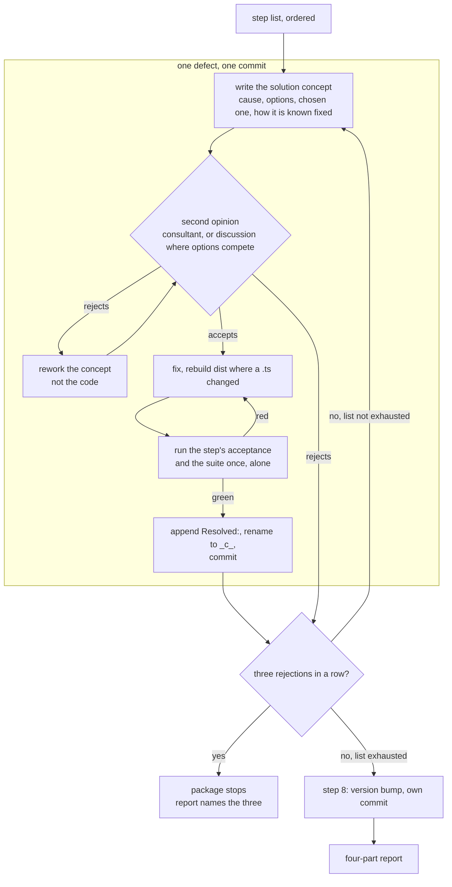
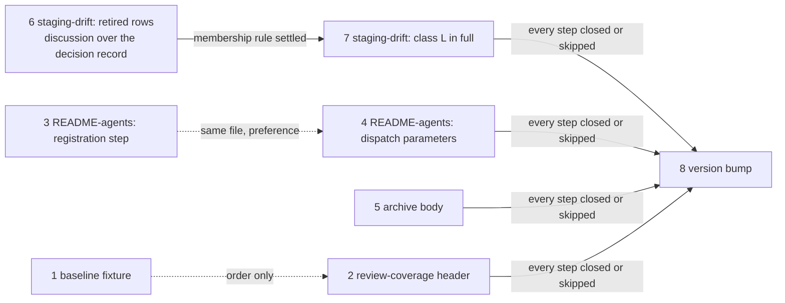

# Implementation Plan: seven new defects, worked autonomously with a second opinion each, then a version bump

**Date:** 2026-09-20
**Status:** In progress
**Spec:** none — planned from the work item's `## Directive` (`260920-2151-sieben-neue-defekte-selbstaendig-abarbeiten.md`), on the model of `260918-1124_*_autonomous-defect-package-fifteen-fixes-with-a-second-opinion-each.md`
**Decidability:** The load-bearing question is whether each of the seven defects is still present at HEAD `80bebc96` and closable by one bounded edit whose acceptance is a command the executor can run. It is decidable from the inputs the steps have: every presence claim below was measured by this plan against the tree at that commit (the command and its output are quoted per step), and every acceptance is a `grep`, a `wc`, a `node -e` probe or the suite, each with a stated expected result. Two inputs are not decidable from the plan. Whether the second opinion accepts a concept is handed to the stop rule in `## Where this work stops`, the directive's own mechanism. Whether the retired rows in `LIVE_STATE` go or stay is a choice binding two steps and every later retirement, so it is filed as `260920-2228_*_does-the-staging-classifiers-live-state-list-keep-rows-for-retired-surfaces.md` and answered by the discussion step 6 runs over it, not approximated here.
**Domain:** code

## Directive

The work item names seven defect records, all `_o_` in the issues store of the container `260918-1048-defekte-selbstaendig-abarbeiten-mit-zweitmeinung`, and asks that they be worked by the previous package's pattern: per defect a solution concept (cause, defensible options, the chosen one, how a reader knows it is fixed), a second opinion on the concept before any code changes (`fusion:consultant`, or `/fusion:discuss` where more than one option is seriously in play; a rejected concept is reworked, not the code), then fix, verify, close the defect with its `Resolved:` line citing the commit, one commit per defect, nothing pushed, `/fusion:cleanup` not run. Two additions over the previous package: the plugin version in `.claude-plugin/plugin.json` is bumped as one final step, and structured-data files may be edited despite the previous package's JSON/YAML exclusion. The previous package's stop rule (three rejections in a row end the package) is carried over unchanged, since the directive says "nach demselben Muster".

## Current State

All seven defects stand at HEAD `80bebc96`. Each was re-measured by this plan; the measurement is quoted in the step. None is already resolved, so `## Already resolved at HEAD` below is a statement of that, not a list.

Two records filed on 260920 sit in the same issues store beside the seven (`260920-2216_*_the-scope-bullet-says-the-work-item-operations-and-nothing-else-then-permits-a-filing-the-operations-table-does-not-list.md`, `260920-2217_*_the-who-filed-it-enumeration-omits-the-work-item-whose-template-carries-filed-by-and-now-has-a-second-writer.md`). The directive does not name them and this plan does not select them.

The three measured constraints, re-taken at HEAD rather than copied from the previous plan (the computation is the one `hooks/lib/__tests__/surface-growth-bound.test.ts` runs: the measured total of each surface against its baseline sum plus its head-room constant):

| Surface | Measured at `80bebc96` | Floor + head-room | Head-room left | Consequence for this plan |
|---|---|---|---|---|
| `skills/*/SKILL.md` (bytes) | 228 026 | 188 768 + 39 260 = 228 028 | 2 | Step 5 edits `skills/archive/SKILL.md` and names a funding cut in that file; its acceptance holds the file at or below its HEAD size. |
| `hooks/lib/__tests__/**.ts` (lines) | 22 246 | 19 228 + 3 030 = 22 258 | 12 | Step 7 adds test lines and names a funding cut in the same file; step 6 may remove lines. |
| `agents/*.md` (bytes) | 312 083 | 310 567 + 18 000 = 328 567 | 16 484 | No step edits a prompt. |

Two gates move on several steps and are stated once here:

- **`committed-dist.test.ts`** compares `hooks/dist/` with a fresh build. Every edit to a `.ts` under `hooks/` carries `cd hooks && npm run build` and the rebuilt `dist/` in the same commit, comment-only edits included (steps 2, 6, 7).
- **`reference-resolution-lint.test.ts`** pins how many path and anchor citations resolve (`const BASELINE = { paths: 1680, anchors: 290, stampBare: 11 }` at HEAD) and scans `README*.md`, `hooks/*.ts` and `hooks/lib/*.ts` among others. A step that adds or removes an anchor citation (a backticked path followed by a backticked heading) moves the count, and the move is re-approved on the `BASELINE` line itself, measured by restoring the edited file to HEAD in place rather than by subtraction, as every entry on that line does. Steps 2, 3, 4 and possibly 6 and 7 move it; none adds a line to the test file by doing so.

The hook suite is not isolated from a second copy of itself (`260905-2356_*_the-hook-suite-is-not-isolated-from-a-second-copy-of-itself-and-fails-at-forty-percent-under-one.md`). Every `cd hooks && npm test` below means one run, alone, on an idle tree.

## Approach

The loop is the previous plan's, unchanged, run seven times with one more step after it that is not a defect.

The one intentional cycle, concept to opinion to rework, is the directive's rule that a rejected concept is reworked rather than the code. An accepted concept resets the rejection counter, shown as the path through `close`.

**Order.** Safest and smallest first: a fixture comment, a wrapper header, two README sections, then the one skill-body edit on a surface at 2 bytes, then the two staging-drift steps that share a comment block, then the bump. Steps sharing a file sit together: 3 and 4 in `README-agents.md`, 6 and 7 in `hooks/lib/staging-drift.ts` and its test. Step 7 depends on step 6 (the membership rule step 6 settles decides how step 7's claim is written); step 8 depends on every other step being closed or skipped. The remaining adjacencies are preferences.

**Executor.** Seven of eight steps go to `coder`: TypeScript headers and a constant, README text, a skill body, and a test fixture. The fixture (`hooks/lib/__tests__/fixtures/dispatch-path.baseline`) is test data for the build, read only by the hook tests, and the dispatch's routing rule assigns it to `coder` with the tests that read it; the record's own `**Route:** ontocoder` line is overridden by that rule, and the step says so. Step 8 edits `.claude-plugin/plugin.json`, the plugin manifest, which is build configuration whatever its extension and therefore `coder`'s. The directive's release of the JSON/YAML exclusion is what lets the bump be a step at all. `analyst` is in the active set and no step produces a strategic deliverable, so none is assigned to it.

**Second opinion.** Six defect steps carry one clear option and go to `fusion:consultant` on the concept. Step 6 carries two serious options and goes to `/fusion:discuss` over the decision record this plan filed, `260920-2228_*_does-the-staging-classifiers-live-state-list-keep-rows-for-retired-surfaces.md`. Step 8 is not a defect and takes no second opinion.

**What the executor writes per step.** The concept, in the dispatch return rather than a record (the commit message is the per-commit record); the fix; the `Resolved:` line on the defect, citing the commit; the marker move to `_c_`. A decision record only where the directive's condition holds; this plan already filed the one it saw.

## Implementation Steps

Field key. **Record** is the storeless citation and where the file stands, in words. **Present at HEAD** quotes the measurement this plan took at `80bebc96`. **Growth** names the bounded surface touched, if any, and the funding cut where one is owed. **Pin** says whether the reference-resolution counts move.

1. [DONE] **Stamp the fixture's "fifteen rows" as the fleet size at the arming**
   - Executor: `coder`
   - Record: `260918-1250_*_the-dispatch-path-baseline-fixture-says-fifteen-rows-below-while-it-holds-eleven.md`, in the issues store of the container `260918-1048-defekte-selbstaendig-abarbeiten-mit-zweitmeinung`. The record routes to `ontocoder`; the dispatch's routing rule for `.baseline` fixtures under `hooks/lib/__tests__/fixtures/` sends it to `coder`, and the `Resolved:` line names the override.
   - Present at HEAD: `grep -c '^\[' hooks/lib/__tests__/fixtures/dispatch-path.baseline` prints `11`; `grep -n fifteen` on the file prints line 40, "Every one of the fifteen rows below therefore carries growth nobody cut."
   - Files: `hooks/lib/__tests__/fixtures/dispatch-path.baseline` (line 40, in the 2026-09-09 arming section)
   - Do not touch: any `[…]` row, any baseline value, `hooks/lib/__tests__/rules-emission-golden.test.ts`, `hooks/lib/__tests__/dispatch-bytes.test.ts`
   - Changes: the sentence stops pointing at the current row set. Chosen shape: stamp the count to the arming ("every one of the fifteen rows the fleet had at the 2026-09-09 arming carried growth nobody cut"), which keeps the historical argument true; the fixture's own `## The v11 roster cut` section already records the move from fifteen to eleven. Dropping the number is the other admissible shape and is not preferred, because the sentence is about the arming and the count is part of that record. Both parsers skip `#` lines (`rules-emission-golden.test.ts:644`, `:1091`), so no value changes.
   - Acceptance: `sed -n 40,41p hooks/lib/__tests__/fixtures/dispatch-path.baseline` shows the count beside its date or no count; `grep -c 'rows below' hooks/lib/__tests__/fixtures/dispatch-path.baseline` prints `0`; `grep -c '^\[' hooks/lib/__tests__/fixtures/dispatch-path.baseline` prints `11`; `cd hooks && npm test` exits 0.
   - Growth: none (a fixture is not a `.ts` on the hook-test surface).
   - Pin: unmoved (the file is not scanned).
   - **Second opinion:** consultant
   - Dependencies: none

2. [DONE] **Name the callers the orchestrator prompt has in the review-coverage wrapper's header**
   - Executor: `coder`
   - Record: `260918-1334_*_the-review-coverage-cli-header-names-step-3c-and-phase-4-which-the-orchestrator-prompt-does-not-have.md`, in the issues store of the container `260918-1048-defekte-selbstaendig-abarbeiten-mit-zweitmeinung`
   - Present at HEAD: `grep -n 'Step 3c\|Phase 4' hooks/review-coverage.ts` prints line 12; `grep -c 'Step 3c\|Phase 4' agents/orchestrator.md` prints `0`; `grep -n '^## Review coverage\|^## Closing a work item' agents/orchestrator.md` prints 322 and 422.
   - Files: `hooks/review-coverage.ts` (the header paragraph at lines 11 to 14), `hooks/dist/review-coverage.js` and `hooks/dist/review-coverage.d.ts` (rebuilt)
   - Do not touch: `hooks/lib/review-coverage.ts`, `agents/orchestrator.md`, `bin/fusion-review-coverage`
   - Changes: the paragraph names the three places the prompt calls the helper at HEAD, each by heading anchor: `agents/orchestrator.md` `## Review coverage` (the guarded call at line 327, which widens the next review's scope), `## Closing a work item` step 2 ("take the coverage read once more"), and `## Ending the session` (the summary's review-coverage section is read off the helper, line 460). The record's acceptance names the first two; the third is the direct successor of "Phase 4 (to state the session's coverage)" and is named so the header does not trade one omission for another. `cd hooks && npm run build`.
   - Acceptance: `grep -c 'Step 3c\|Phase 4' hooks/review-coverage.ts hooks/dist/review-coverage.js` prints `0` for both; `grep -c 'Review coverage\|Closing a work item\|Ending the session' hooks/review-coverage.ts` prints at least `3`; `cd hooks && npm test` exits 0 (`committed-dist` sees the rebuilt `dist`; `reference-resolution-lint` resolves the new anchors with the pin re-approved on its line).
   - Growth: none (`hooks/*.ts` is unbounded).
   - Pin: anchors move up by the anchors the header gains (three at most); paths unmoved or up by the repeated path token. Re-approve on the `BASELINE` line.
   - **Second opinion:** consultant
   - Dependencies: none

3. [DONE] **Point the new-agent registration step at the surfaces that carry the names and the gated digits**
   - Executor: `coder`
   - Record: `260918-1206_*_the-new-agent-registration-step-points-at-a-claude-md-listing-bullet-that-no-longer-names-any-agent.md`, in the issues store of the container `260918-1048-defekte-selbstaendig-abarbeiten-mit-zweitmeinung`
   - Present at HEAD: `grep -n 'What this is' README-agents.md` prints line 320 (step 5's first bullet); `CLAUDE.md:12` names no agent; the names and "11 specialized agents" stand at `README-agents.md:47` under `## The agents`; `derivable-enumerations-lint.test.ts:164-170` gates six phrases, four in `README-agents.md`, one in `CLAUDE.md`, one in `README.md`.
   - Files: `README-agents.md` (`## Adding a new agent`, step 5 and the paragraph under it)
   - Do not touch: `CLAUDE.md`, `README.md`, `hooks/lib/__tests__/derivable-enumerations-lint.test.ts`
   - Changes: step 5's registration list names the surfaces as they stand: the "N specialized agents" bullet under `README-agents.md` `## The agents` (names and count), the `agents/*.md` row under the same heading ("The N agent prompts", "all N inherit"), the `## Layout` row in `CLAUDE.md` ("The N agent prompts"), the "N specialized agents" sentence in `README.md`, and the agent table under `## The agents`. The paragraph under it attributes each gated phrase to the file the lint reads it from, as enumerated in the `CLAIMS` array, and drops "the two `CLAUDE.md` surfaces". No digit is written beside a list (`rules/critical-stance.md` §5).
   - Acceptance: `grep -n 'What this is' README-agents.md` prints nothing; `awk '/^## Adding a new agent/,/^## Releasing/' README-agents.md | grep -c 'README-agents.md. .## The agents'` prints at least `1`; the same range names `CLAUDE.md`, `README.md` and `README-agents.md` as the three files the lint reads; `cd hooks && npm test` exits 0.
   - Growth: none (READMEs are unbounded).
   - Pin: the `CLAUDE.md` `## What this is` anchor leaves (minus one), `README-agents.md` `## The agents` arrives (plus one or more). Re-approve on the `BASELINE` line.
   - **Second opinion:** consultant
   - Dependencies: none

4. **Retire the three parameters the dispatch-parameters intro still bounds, and cite the table's prompt sites by anchor**
   - Executor: `coder`
   - Record: `260918-1410_*_the-dispatch-parameters-section-describes-three-retired-parameters-as-live-and-five-of-its-line-citations-are-stale.md`, in the issues store of the container `260918-1048-defekte-selbstaendig-abarbeiten-mit-zweitmeinung`
   - Present at HEAD: `grep -nE 'agents/[a-z]+\.md:[0-9]' README-agents.md` prints lines 53, 57, 59, 63 and 70; line 53 still bounds `**Draft:**`, `**Answers:**` and `**Initiated by:**` in the present tense while line 72 retires them; `agents/orchestrator.md` has 617 lines, so `:1321` at line 63 is past its end. The anchors the rewrite needs exist: `agents/reconciler.md` `### Parameter parsing` (line 38), `agents/orchestrator.md` `### Shaping and planning, when the task needs them` (213) and `## Agent Routing Table` (185, the `**Deliverable language:**` prefix rule sits at 201 inside it), `agents/planner.md` `## Parameter parsing` (46), `agents/editor.md` `## Deliverable language — named in the dispatch, or you halt` (18), and `## Setup` in each of `analyst`, `coder`, `ontocoder`, `planner`, `reconciler`, `reviewer`.
   - Files: `README-agents.md` (`## Dispatch parameters`: the intro at line 53 and the `Passed by` / `Declared at` cells at 57, 59, 63, 70)
   - Do not touch: the paragraph at line 72 (the true statement), every agent prompt, `hooks/lib/__tests__/reference-resolution-lint.test.ts` beyond the `BASELINE` line
   - Changes: the intro's bound sentences drop the three retired parameters (the sentence that survives says a value may run past its own line and that the v11 paragraph below names the ones that did; or the three are named in the past tense beside that paragraph). Every `path:line` cell becomes a heading anchor: `reconciler` → `agents/reconciler.md` `### Parameter parsing`; `planner` `Passed by` → `agents/orchestrator.md` `### Shaping and planning, when the task needs them`; `planner` `Declared at` → `agents/planner.md` `## Parameter parsing`; `editor` `Passed by` → `agents/orchestrator.md` `## Agent Routing Table` (the prefix rule and the routing row both sit under it); `editor` `Declared at` → `agents/editor.md` `## Deliverable language — named in the dispatch, or you halt`; the `**Audience:**` row → each prompt's `## Setup`. The intro's "names the prompt lines each row was read against" becomes "names the prompt section".
   - Acceptance: `grep -nE 'agents/[a-z]+\.md:[0-9]' README-agents.md` prints nothing; `sed -n 53p README-agents.md | grep -c 'Draft\|Answers\|Initiated by'` prints `0` or every hit is past-tense beside a citation of the v11 paragraph; `cd hooks && npm test` exits 0, with the pin re-approved for the anchors the rewrite adds.
   - Growth: none.
   - Pin: anchors up by roughly the number of cells rewritten (about eleven, six of them `## Setup`); paths unmoved (each `path:line` token already counted as a path). Re-approve on the `BASELINE` line.
   - **Second opinion:** consultant
   - Dependencies: none (after step 3 by preference: same file)

5. **Give the archive body an `UNRESOLVED` branch, guard the read, and cite the do-not-improvise rule**
   - Executor: `coder`
   - Record: `260918-1234_*_the-archive-body-reads-a-rule-through-the-source-root-with-no-unresolved-branch-and-no-do-not-improvise-rule.md`, in the issues store of the container `260918-1048-defekte-selbstaendig-abarbeiten-mit-zweitmeinung`
   - Present at HEAD: `sed -n 30,36p skills/archive/SKILL.md` shows the two-branch block whose else branch assigns `FUSION_SRC="$FUSION_PLUGIN_ROOT"` and the unguarded `cat "$FUSION_SRC/rules/workbench-tracking.md"`; line 39 stops at "unread". The inline re-resolution at line 159 is already guarded (`[ -n "$FUSION_SRC" ] || echo "filter 3 skipped …"`, and the loop tests `[ -n "$FUSION_SRC" ]`), so the record's remark on it describes the shape and not a defect; the step leaves it alone and the `Resolved:` line says so. The shape to copy is `skills/news/SKILL.md:25-36`: three branches, `FUSION_SRC=""` on the last, an `UNRESOLVED` report line, and a sentence citing the helper's header.
   - Files: `skills/archive/SKILL.md` (Step 1's block at lines 30 to 36 and the sentence at line 39; the funding cut elsewhere in the same file)
   - Do not touch: `bin/fusion-source-root` (its exit-2 paragraph already carries the rule, since the previous package's step 7), `skills/news/SKILL.md`, every other skill body, the inline re-resolution at `skills/archive/SKILL.md:159`
   - Changes: the block gains the `elif [ -n "${FUSION_PLUGIN_ROOT:-}" ]` middle branch and an `else FUSION_SRC=""` branch; the `cat` runs only when `FUSION_SRC` is non-empty and the file exists, and otherwise prints the root as `UNRESOLVED` (or the file as absent). A helper exit 2 leaves `FUSION_SRC` empty by substitution and takes the same guard. Line 39's sentence says the classification is then unread and is not written from memory, citing `bin/fusion-source-root`'s header for the rule rather than restating it.
   - Growth: **`skills/`, at 2 bytes.** Funding cut in `skills/archive/SKILL.md` of at least the bytes the block gains (roughly 250). Candidate: the last sentence of line 11 ("**This skill reads `rules/workbench-tracking.md` at Step 1** — …", about 280 bytes), which restates what Step 1's own paragraph says two lines below the block. A second candidate if more is needed: the last two sentences of line 204 (the `bin/monitor` warnings-panel behaviour, which `bin/monitor`'s own code is the authority for). Acceptance holds the file at or below its HEAD size.
   - Acceptance: `bash -n` on the extracted Step 1 block exits 0; with `FUSION_PLUGIN_ROOT` unset, running the block prints `UNRESOLVED` and no `cat: /rules/workbench-tracking.md` error (`env -u FUSION_PLUGIN_ROOT bash -c '<block>' 2>&1 | grep -c '^cat:'` prints `0`); `grep -c 'fusion-source-root' skills/archive/SKILL.md` is at least `3` (the guard, the call, the header citation); `wc -c skills/archive/SKILL.md` prints at most 24 473 (HEAD); `cd hooks && npm test` exits 0 (`surface-growth-bound` holds `skills/` inside 2 bytes).
   - Pin: a path citation of `bin/fusion-source-root` may arrive; re-approve if the count moves.
   - **Second opinion:** consultant
   - Dependencies: none

6. **Settle whether `LIVE_STATE` keeps rows for retired surfaces, then make the comment true**
   - Executor: `coder`
   - Record: `260918-1335_*_the-live-state-comment-keeps-two-retired-rows-for-a-consequence-classify-cannot-produce.md`, in the issues store of the container `260918-1048-defekte-selbstaendig-abarbeiten-mit-zweitmeinung`
   - Present at HEAD: `grep -n 'const ROOT_RECORDS' hooks/lib/staging-drift.ts` prints line 270 with an empty array; the "Two entries are held" paragraph sits at line 189; `node -e 'import("./hooks/dist/lib/staging-drift.js").then(m=>console.log(JSON.stringify(m.classify("some-root-leftover.md",""))))'` prints `klass` `unclassified`, and the same call on `agentstate.yaml` prints `in-flight`.
   - Files: `hooks/lib/staging-drift.ts` (the `LIVE_STATE` comment block at lines 175 to 212 and, under option 1, rows 214, 215 and 218 of the constant); `hooks/lib/__tests__/staging-drift.test.ts` (under option 1: the `portfolio.md` entry in the loop at lines 337 to 341 and the `toContain("until v11 removed both")` line at 346, plus the comment at 326 to 329, all removed; the fixture line 56 and the `agentstate.yaml` fixture at 62 stay, since a file the harness writes and the classifier prints under `unclassified` is the case the property "does not cry wolf" covers); `hooks/dist/lib/staging-drift.*` (rebuilt)
   - Do not touch: the `.session-marker`, `monitor`, `orchestrator-events.jsonl`, `.fusion-setup`, `.asset-provenance` rows; `LIVE_PREFIXES`; `STORES`; `classify()`; `rules/workbench-tracking.md`
   - Changes: the discussion runs over `260920-2228_*_does-the-staging-classifiers-live-state-list-keep-rows-for-retired-surfaces.md` before any edit, and its outcome is written onto the record as its `Answered:` line, ruled by the orchestrator under the directive's own authority. Under option 1 (recommended): the three retired rows (`agentstate.yaml`, `orchestrator-live.md`, `portfolio.md`) and the paragraph that keeps the first two leave; the class-L span sentence is rewritten by step 7. Under option 2: the rows stay and the paragraph states the true consequence (a dropped row sends a leftover to `unclassified`, printed and unclaimed) and the true reason for keeping them (the `why` names the file as retired). Either way the removal of rows that exist is the reason the discussion, not the consultant, is the second opinion, and an unconverged discussion leaves the record open and this step and step 7 skipped. `cd hooks && npm run build`.
   - Acceptance: the compiled `classify()` called on `agentstate.yaml` returns the class the answered record names (`unclassified` under option 1, `in-flight` under option 2); `grep -c 'to .record., where the report' hooks/lib/staging-drift.ts` prints `0`; under option 1 `grep -c 'agentstate.yaml\|orchestrator-live.md\|portfolio.md' hooks/lib/staging-drift.ts` prints `0` outside sentences that name them as removed, and `wc -l hooks/lib/__tests__/staging-drift.test.ts` prints below 653; `cd hooks && npm test` exits 0.
   - Growth: hook tests, a shrink under option 1 and unchanged under option 2.
   - Pin: unmoved unless the comment gains or loses a citation; re-approve if it does.
   - **Second opinion:** discussion (`/fusion:discuss`), over the decision record named above
   - Dependencies: none

7. **Make `LIVE_STATE` class L in full, and hold it there against the rule text**
   - Executor: `coder`
   - Record: `260918-1409_*_the-live-state-list-claims-class-l-in-full-while-two-class-l-entries-classify-as-unclassified.md`, in the issues store of the container `260918-1048-defekte-selbstaendig-abarbeiten-mit-zweitmeinung`
   - Present at HEAD: `rules/workbench-tracking.md:24` names `.session-marker`, `.checkout-id`, `.cadence-anchors`, `.commit-lock/`, `monitor` and `.guard-state/` as class L; the same `node -e` probe on `.checkout-id` and `.cadence-anchors` prints `unclassified` for both; line 182 of `hooks/lib/staging-drift.ts` spans class L as "`.session-marker` through `portfolio.md`".
   - Files: `hooks/lib/staging-drift.ts` (two rows in `LIVE_STATE`; the comment's "in full" and span sentences at lines 176 to 187), `hooks/lib/__tests__/staging-drift.test.ts` (one new case), `hooks/dist/lib/staging-drift.*` (rebuilt); `rules/fusion-workbench-conventions.md` `## fusion-workbench Layout` only if the concept takes the one-line edit named below
   - Do not touch: `LIVE_PREFIXES` (`.guard-state/` and `.commit-lock/` are already there), `classify()`, `rules/workbench-tracking.md`, `.gitignore`
   - Changes: two rows, `.checkout-id` ("this checkout's identifier — minted once by bin/fusion-identity, never travels") and `.cadence-anchors` ("the per-checkout cadence marks — written by bin/fusion-cadence-anchor"). The comment's span sentence names the class by the rule's own row rather than by a first-through-last of the list, and the "in full" claim is written to match what step 6 decided (exactly the rule's classes under option 1; the rule's classes plus the named retired rows under option 2). One test case in the existing `describe` for the classifier: it reads the class L row out of `rules/workbench-tracking.md` `## The four classes` (the table row whose first cell starts `**L.`), extracts every backticked token, and asserts `classify()` returns `in-flight` for each file token and for `<prefix>x` of each token ending in `/`. That case is what turns "the property to check when the layout gains a root-anchored entry" from a comment into a check, and it is the reason the two entries can not slip past a third time. The conventions' same-commit sentence (`## fusion-workbench Layout`, "lands in this tree and in the record-or-live-state split … both in the same commit") gains the classifier as its third site only if the consultant reads the case above as insufficient on its own; with the case in place the sentence is enforced rather than stated, and the concept says which it chose.
   - Growth: **hook tests, roughly 12 to 15 lines for the case.** Funding cut in `hooks/lib/__tests__/staging-drift.test.ts` of at least that many comment lines (118 comment lines at HEAD; the header's `## The properties under test` block at lines 8 to 30 restates what the module's own header states and is the candidate). Acceptance holds the file at or below 653 lines (HEAD), or below the figure step 6 left it at.
   - Acceptance: the compiled `classify()` on `.checkout-id` and `.cadence-anchors` returns `in-flight`; the new case passes and, with `.checkout-id` temporarily removed from `LIVE_STATE` in a scratch copy, fails naming that token; `grep -c 'through .portfolio.md' hooks/lib/staging-drift.ts` prints `0`; `wc -l hooks/lib/__tests__/staging-drift.test.ts` prints at most 653; `cd hooks && npm test` exits 0.
   - Pin: a citation of `rules/workbench-tracking.md` `## The four classes` may arrive in the test; re-approve if the count moves.
   - **Second opinion:** consultant
   - Dependencies: step 6 (same file and same comment block; the membership rule it settles is what this step's "in full" sentence states)

8. **Bump the plugin version**
   - Executor: `coder`
   - Record: none (the directive's own final instruction, "Versionsnummer am Ende erhöhen")
   - Present at HEAD: `.claude-plugin/plugin.json` reads `"version": "11.8.0"`; the last bump was the 11.8.0 release commit `5cd86276`.
   - Files: `.claude-plugin/plugin.json` (the `version` field only)
   - Do not touch: the `description` field, `install.sh`, the marketplace repository, `README-agents.md` `## Releasing`
   - Changes: `11.8.0` → `11.8.1`. A patch increment, because every commit in the package is a defect fix and none adds a capability; the executor states the reasoning in the commit message. This is step 1 of `README-agents.md` `## Releasing` and nothing more: no tag, no marketplace bump, no push. Structured data is in scope by the directive's own release of the exclusion.
   - Acceptance: `node -e 'console.log(JSON.parse(require("fs").readFileSync(".claude-plugin/plugin.json","utf8")).version)'` prints `11.8.1`; `git diff HEAD~1 --stat` for the bump commit names only `.claude-plugin/plugin.json`; `cd hooks && npm test` exits 0.
   - Growth: none.
   - Pin: unmoved.
   - **Second opinion:** none (not a defect; the directive names the step)
   - Dependencies: steps 1 to 7 each closed or skipped with its reason, so the bump is the package's last commit

Step counts, enumerated: executor `coder` on steps 1 to 8; `**Second opinion:** consultant` on steps 1, 2, 3, 4, 5 and 7; `**Second opinion:** discussion` on step 6; none on step 8; a funding cut on steps 5 and 7; a `dist` rebuild on steps 2, 6 and 7; a pin re-approval expected on steps 2, 3 and 4 and possible on 5, 6 and 7.

## Where this work stops

- Every step above is `[DONE]` with its defect renamed to `_c_` and one commit per defect (step 8 with its one commit and no defect), or is named in the final report's "skipped" part with the reason, and no step is left `[IN PROGRESS]`.
- The second opinion has not rejected three concepts in a row. If it has, the package stops at that point: the remaining defect steps stay unstarted and are named in the report as unstarted, the report names the three rejected concepts and what each rejection said, and step 8 still runs if at least one defect commit landed, since the directive asks for the bump at the end of whatever was worked.
- Step 6's discussion converged on one option, written onto `260920-2228_*_does-the-staging-classifiers-live-state-list-keep-rows-for-retired-surfaces.md` as its `Answered:` line; or it did not, the record is still `_o_`, and steps 6 and 7 are named in the report as skipped for that reason.
- Nothing is pushed: `git status -sb` at the end shows `main` ahead of `origin/main` by the package's commits and no `git push` was run.
- `/fusion:cleanup` was not run.
- Every commit's suite run was one run, alone, on an idle tree, and exited 0.
- The `Resolved:` line of every closed defect cites its commit.
- The version in `.claude-plugin/plugin.json` is higher than `11.8.0` and the bump is the package's last commit.
- The two records of 260920 in the same issues store are not touched by this package and are named in the report's "waiting on your return" part.
- The final report carries the directive's four parts: what is fixed, what was skipped and why, every non-trivial decision with one sentence of reasoning, and what waits on the user's return.

## Already resolved at HEAD

None. All seven records describe defects present at `80bebc96`; the measurement per record is the `Present at HEAD` line of its step. One partial finding is worth stating so the executor does not repeat it: the inline re-resolution `260918-1234_*` names at `skills/archive/SKILL.md:159` is already guarded against an empty root, so step 5 covers Step 1's block only.

## Data Structures

None. Step 7 adds two rows to an existing array and no type; step 6 may remove three.

## API Changes

None. No helper's exit codes, output keys or arguments change. Under step 6's option 1, three root-level basenames that classified `in-flight` classify `unclassified`; both classes are printed and neither is a fault, so `bin/fusion-staging-drift`'s verdict is unchanged for every input.

## Testing Strategy

The suite is the floor for every step: `cd hooks && npm test` exits 0, run once and alone. Each step adds its own check above that floor, stated in the step. Three classes:

- Steps that change no executable line (1, 2, 3, 4, 8) are verified by `grep`, `wc` or a JSON read against the stated site and by the suite's lints (`reference-resolution-lint`, `derivable-enumerations-lint`, `committed-dist`).
- Step 5 changes shell inside a skill body and is verified by running the block with the variable unset and watching it report `UNRESOLVED` instead of reaching `cat`.
- Steps 6 and 7 change a constant the classifier reads and are verified by calling the compiled `classify()` and, for step 7, by making the new case fail on a scratch copy and watching it name the token.

No step's acceptance is a rate over repeated runs. The size assertions (`wc -c` and `wc -l` at or below HEAD's figure) are how the two funding cuts are checked without running the bound twice.

## Risks & Mitigations

| Risk | Mitigation |
|------|------------|
| Step 6's discussion does not converge, or converges on option 2 while step 7's case was drafted for option 1 | The decision record carries both options and a recommendation; the step 7 concept is written after step 6's `Answered:` line exists and states the "in full" sentence for the option chosen. An unconverged discussion counts as a rejection for the stop rule and skips both steps. |
| Step 5's funding cut removes a sentence some other body cites | Both candidates are prose inside `skills/archive/SKILL.md` and neither carries a heading; `grep -rn 'reads .rules/workbench-tracking.md. at Step 1' skills agents rules docs README*.md` before the cut confirms no citer. |
| Step 7's rule-text parse breaks on a later edit to the class L cell | The parse keys on the row's first cell (`**L.`) and on backticks, the two things the table cannot lose without ceasing to be the class L row; a failure names the token it could not classify, so the reader sees the cell and the list side by side. |
| A pin re-approval is written as a new line on the hook-test surface at 12 lines of head-room | Every entry goes on the `BASELINE` line itself, as the line's own convention states; no step adds a line to `reference-resolution-lint.test.ts`. |
| The suite is run twice at once (two sessions) and fails at forty percent | One run per acceptance, alone; a red that a second run alone turns green is load, and the acceptance is the lone run. |
| `dist` drifts from source because a comment-only edit was thought not to need a rebuild | Steps 2, 6 and 7 each carry the rebuild in their commit; `committed-dist.test.ts` is in the suite floor. |
| Step 8 is read as a release | The step names itself as step 1 of `## Releasing` alone; the stop conditions forbid the push, and no tag is written. |

## Open Questions

- [ ] Step 6's fork, whether `LIVE_STATE` keeps rows for retired surfaces, is filed as `260920-2228_*_does-the-staging-classifiers-live-state-list-keep-rows-for-retired-surfaces.md` and is answered by the discussion, not here.
- [ ] Whether the version increment is a patch (`11.8.1`, this plan's reading: fixes only) or a minor: the executor decides in the commit message and the report names it; nothing in the directive fixes the size of the increment.
- [ ] Whether the two 260920 records beside the seven are worked in a following package or closed by hand: outside this directive; named in the report's fourth part.
