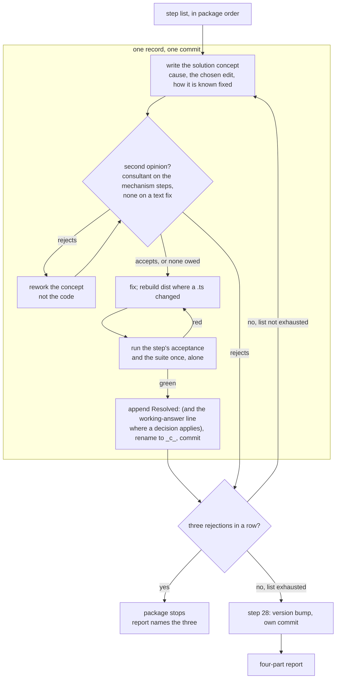
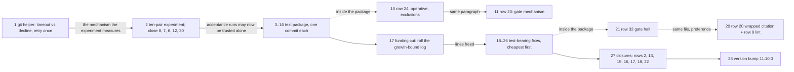

# Implementation Plan: the 33 open defect records of the 11.9.1 survey, worked autonomously as one package

**Date:** 2026-09-21
**Status:** Draft
**Spec:** none — planned from the work item's `## Directive` (`260921-1709-fixes-aus-der-defektbestandsaufnahme-autonom-abarbeiten.md`) against the survey `260921-1653-open-defect-survey-at-11-9-1.md`, on the model of `260920-2228_*_seven-new-defects-worked-autonomously-with-a-second-opinion-each.md`
**Decidability:** The load-bearing question is whether each of the 26 still-present records is closable at HEAD `3d02c7fd` by one bounded edit whose acceptance is a command the executor can run, and whether the six fixes that add hook-test lines fit the surface after one funding cut. Both are decidable from the inputs the steps have: every presence claim below was re-read against the tree at that commit (the site is quoted per step, taken from the survey and re-checked where the plan differs from it), every acceptance is a `grep`, a `wc`, a `node -e` probe, a helper run or the suite with a stated result, and the line budget is a subtraction the bound test performs on every run (14 lines of head-room at HEAD, measured by `hooks/lib/__tests__/surface-growth-bound.test.ts`; step 17 frees roughly 146). Three inputs are not decidable from the plan and are handed on rather than approximated. (1) Whether the ten-pair experiment of step 2 reads 0 of 20 after step 1: the plan states both outcomes and what each does to the five load records. (2) Whether a working answer taken under an open decision is the one the user wants: every one is named in `## Working answers` below and in the decision record it hangs on, no marker moves, and the user rules with the implementation in front of them, which is the directive's own mechanism. (3) Whether a second opinion accepts a concept: the directive's stop rule, three rejections in a row, ends the package.
**Domain:** code

## Working answers

Every working answer this plan takes, at a glance. None moves a decision marker; each step that rests on one appends `Working answer (plan 260921-1726): <option> — <one clause>; implemented at <commit>` to the record it hangs on, after the fix, so the user finds the answer beside the question when they rule.

| Row | Decision record | Working answer taken | Filed by |
|---|---|---|---|
| 8 (and 7, 6, 12, 30 through it) | `260906-0035_*_what-should-the-git-helpers-budget-be-and-is-a-timeout-retried.md` | Option 1, the record's own recommendation: the helper distinguishes a timeout from a decline, retries a timeout once, and the budget is 10 000 ms per attempt, chosen from the measured tail (7 580 ms under two suites) with margin rather than from habit | existing |
| 5 | `260831-2142_*_which-property-separates-a-head-field-identifier-from-a-head-field-citation.md` | The record carries no standing recommendation (its own measurement refuted options 1 and 3). The plan takes the fourth direction the record names, narrowed by option 3's shape test so the cost the record feared does not arise: in a head field, a `stamp-name` token that carries no `.md` and resolves to nothing is `undecidable`, not `dangling`; a token carrying `.md` or a marker slot (`**Active spec/plan:**`, `**Session:** …-session.md`) is judged exactly as today | existing, no recommendation |
| 10 | `260906-0416_*_should-a-project-be-able-to-declare-a-record-an-exhibit-and-what-does-that-declaration-cover.md` | Option 2, the record's recommendation: a subtractive leaf, `citations.exhibits`, per record, the checker printing the count beside its verdict; option 4 (the addendum's) is not taken and not foreclosed | existing |
| 3 | `260921-1718_*_which-decidable-property-if-any-exempts-a-realistic-probe-fixture-from-the-citation-gate.md` | Option 1: no new exemption; the scanner's header states the bound and the record closes on it | this plan |
| 4 | `260921-1718_*_does-the-grammar-read-a-storeless-bracket-marked-citation-or-state-the-asymmetry-as-a-decision.md` | Option 1: `BARE_RE` reads `[x]` in the marker position as a marker spelling; found under the wildcard it is `stale-marker`, else `dangling`; `MARKER_SLOT` untouched | this plan |
| 19 | `260921-1718_*_where-does-presence-read-what-another-checkout-is-working-on-now-that-no-session-row-carries-it.md` | Option 1: presence reads the party's latest `task_start` row's `work_item`, which the guard already writes; no row shape changes | this plan |
| 23 | `260921-1718_*_how-does-a-dispatched-agent-learn-the-gate-conditions-before-it-dispatches-another-agent.md` | Option 1: the agent reads `agents/orchestrator.md` `## Human Gate Rules` through `$FUSION_PLUGIN_ROOT` before it dispatches; a row that applies means it returns the question to its dispatcher; no analyst | this plan |
| 27 | `260921-1718_*_does-the-v11-upgrade-note-track-live-v11-behaviour-or-stay-frozen-at-v11-0-0.md` | Option 1: live; the note says so under its title, `:25` names five values, and `## Releasing` step 0 carries the obligation | this plan |
| 32, gate half | `260921-1718_*_does-a-slash-command-token-in-shipped-text-become-a-pinned-class-and-what-exempts-a-historical-mention.md` | Option 1: a pinned existence class over the lint's surface with an enumerated `RETIRED_COMMANDS` map and a guard that its entries are load-bearing | this plan |

Two choices the plan makes without a record, because each is bounded to one sentence and the record's own acceptance offers both readings: row 24 drops the word "operative" rather than defining it, and states the two exclusions as project-wide; row 25 makes the plan half of `**Active spec/plan:**` a replace (at most one plan, the spec kept). Both are named in the step and in the `Resolved:` line.

## Directive

The work item asks that every fix the survey `260921-1653-open-defect-survey-at-11-9-1.md` names be planned as one package and executed autonomously: all 26 still-present records closed with evidence in a commit; the six already-fixed and the one obsolete record closed; the side finding in `hooks/vitest.config.mjs` fixed; where a record hangs on an open decision, the recommendation of that record (or, where none existed, of a record this plan files) taken as the working answer, the record left open for the user to rule on with the implementation in front of them; and the plugin version bumped at the end. The item runs under `**Mode:** autonomous`, so there is no plan-review gate: every step below names its files, its edit and its acceptance command.

## Current State

HEAD `3d02c7fd`, fusion 11.9.1, `main` level with `origin/main`. The 33 records stand `_o_` in the shared issues store (`ls fusion-workbench/shared/issues/*_o_*.md | wc -l` prints `33`). The survey's classification is taken as read for the six fixed and one obsolete rows; every present row's site was re-read for this plan and is quoted in its step.

The bounded surfaces at HEAD, computed the way `hooks/lib/__tests__/surface-growth-bound.test.ts` computes them (measured total, baseline sum plus head-room, the difference):

| Surface | Measured | Floor + head-room | Head-room left | Consequence |
|---|---|---|---|---|
| hook tests (`hooks/lib/__tests__/**/*.ts`, lines, `wc -l` semantics, helpers included, fixtures excluded) | 22 244 | 19 228 + 3 030 = 22 258 | **14** | Nine steps add lines (9, 18 to 26). Step 17 is the funding cut and precedes them all. |
| `skills/*/SKILL.md` (bytes) | 227 258 | 188 768 + 39 260 = 228 028 | 770 | Steps 5, 6, 7 land here (about 220 bytes together); step 28's help-topic rotation drops a paragraph as it adds one. |
| `agents/*.md` (bytes) | 316 995 | 310 567 + 18 000 = 328 567 | 11 572 | Step 12 edits `agents/orchestrator.md`. |

The dispatch-path bound (`hooks/lib/__tests__/rules-emission-golden.test.ts`, `DISPATCH_HEAD_ROOM = 0`) charges every always-on byte to all eleven paths, but its rows still carry `CLAUDE.md` at 93 432 bytes while the file measures 8 105, so every path stands roughly 85 kB under its row (`hooks/lib/__tests__/fixtures/dispatch-path.baseline`, the paragraph "THE SURVIVING ROWS WERE NOT RE-CUT"). The always-on edits below (steps 3, 10, 11, 12) are a few hundred bytes each and the suite reports the exact figure; no cut is owed on that bound.

Three gates move on several steps and are stated once:

- **`committed-dist.test.ts`** compares `hooks/dist/` with a fresh build. Every edit to a `.ts` under `hooks/` carries `cd hooks && npm run build` and the rebuilt `dist/` in the same commit, comment-only edits included.
- **`reference-resolution-lint.test.ts`** pins `const BASELINE = { paths: 1686, anchors: 308, stampBare: 11 }` at HEAD and scans `rules/`, `agents/`, `docs/`, `templates/`, `skills/*/SKILL.md`, the root READMEs and `CLAUDE.md`, `bin/` shell comment lines and `install.sh`, and the `hooks/*.ts` and `hooks/lib/*.ts` comment lines for record citations only. A step that adds or removes a path token or a `` `file.md` `## Section` `` anchor on that surface moves the count, and the move is re-approved on the `BASELINE` line itself (line 464, one physical line: every entry is appended to it, never a new line), measured by restoring the edited file to HEAD in place rather than by subtraction, as every entry on that line does.
- **`bin/fusion-citation-check`** and the sweep gate read every workbench `.md` plus `fusion.json`'s `citations.extraPaths` (`bin/*`, `hooks/*.ts`, `hooks/lib/*.ts`). A record this package writes or closes is inside that corpus: `Resolved:` lines cite storeless basenames with the marker wildcarded, and a verbatim wrong spelling goes in a fence.

The suite is not isolated from load (`260905-2356_*_the-hook-suite-is-not-isolated-from-a-second-copy-of-itself-and-fails-at-forty-percent-under-one.md`), and step 1 is the repair of the mechanism behind that. Every `cd hooks && npm test` below means one run, alone, on an idle tree, until step 2 has reported; after step 2 the same rule holds for acceptance runs, and the ten-pair experiment is the one deliberate exception.

Two records in this container's own stores were written by this plan and are inputs to it: the five decision records and one issue under `260921-1718_*`, cited where they apply.

## Approach

The loop is the previous package's, run once per record, with the second opinion kept for the steps that change a mechanism and dropped for the one-line text fixes, as the directive allows.

The one intentional cycle, concept to opinion to rework, is the directive's rule that a rejected concept is reworked rather than the code.

**Order.** Five packages, in the order the dispatch fixes: the load block as a unit (steps 1, 2); the text and message package, one commit per record (steps 3 to 16); the funding cut and the code and test steps it pays for (17 to 26); the closures (27); the bump (28). Inside package C the cheapest cases go first so that, if the freed lines run out, what is deferred is the largest and latest.

**Executor.** Every step is `coder`. The package edits TypeScript, bash helpers, test files, rule and prompt text, skill bodies, READMEs, a doc, `fusion.json` and `templates/fusion.json` (plugin configuration, which is build configuration whatever the extension and therefore `coder`'s under `README-agents.md`'s role rule), `.claude-plugin/plugin.json` (the manifest, same rule) and workbench records. No step edits ontology, manifest data or a schema, so `ontocoder` receives nothing; `analyst` is in the active set and no step produces a strategic deliverable, so it receives nothing either. The one written deliverable, step 17's rolled log, is a verbatim move of existing text and is the coder's, in the commit that cuts it.

**Second opinion.** `fusion:consultant` on the concept of steps 1, 11, 18, 19, 21, 23, 24, 25 and 26 (each changes a mechanism or a grammar); none on the text fixes (3 to 10, 12 to 16), the experiment (2), the cut (17), the two lint additions (20, 22), the closures (27) and the bump (28). No step has two options seriously competing after the working answers above, so no `/fusion:discuss` is planned.

**What the executor writes per step.** The concept, in the dispatch return rather than a record; the fix; the `Resolved:` line on the record, citing the commit and, where a decision applies, the working-answer line on that decision record; the marker move to `_c_`; the commit. A new record only where the directive's condition holds; this plan has already filed the ones it saw.

## Implementation Steps

Field key. **Record** is the storeless citation of the defect closed. **Site at HEAD** quotes what this plan read at `3d02c7fd`. **Growth** names the bounded surface touched and the budget. **Pin** says whether the reference-resolution counts move. **Second opinion** names consultant or none.

### Package A — the load block

1. [DONE] **Make the git helper distinguish a timeout from a decline, retry a timeout once, and budget it from the measured tail**
   - Executor: `coder`
   - Record: `260906-0035_*_the-git-helper-reports-a-timeout-as-not-a-repository-in-every-consuming-project.md` (closed at step 2, not here: its acceptance is the experiment); working answer per `260906-0035_*_what-should-the-git-helpers-budget-be-and-is-a-timeout-retried.md` option 1
   - Site at HEAD: `hooks/lib/git.ts` `export const GIT_TIMEOUT_MS = 5_000;` and `git()` returning `string | null` from one `try { execFileSync(...) } catch { return null; }`; its docstring enumerates the four conditions the `null` collapses. Callers: `hooks/lib/staging-drift.ts` (`rev-parse --show-toplevel`, `status --porcelain` under `GIT_STATUS_TIMEOUT_MS = 10_000`, `rev-parse HEAD` in `currentHead`), `hooks/lib/review-coverage.ts` (`log`, `rev-list`, `show -s --format=%ct`), `hooks/lib/citation-scan.ts` (`rev-parse --show-toplevel`, `ls-files`, both inside `declaredCitationFiles()`, off the hook path). On this Node a timeout throws `err.code === "ETIMEDOUT"`, `err.signal === "SIGTERM"` (probed: `node -e 'try{require("child_process").execFileSync("sleep",["2"],{timeout:100,stdio:["ignore","pipe","ignore"]})}catch(e){console.log(e.code,e.signal)}'` prints `ETIMEDOUT SIGTERM`).
   - Files: `hooks/lib/git.ts`; `hooks/lib/staging-drift.ts`; `hooks/lib/review-coverage.ts`; `hooks/lib/citation-scan.ts`; `hooks/dist/**` (rebuilt)
   - Do not touch: `hooks/vitest.config.mjs` (its `testTimeout` and `maxForks` are the other two budgets and already moved), the callers' sentences for the `null` case, any test file
   - Changes: `git()` returns `string | null | typeof GIT_TIMED_OUT`, where `export const GIT_TIMED_OUT: unique symbol = Symbol("git timed out")`; the catch reads `err.code === "ETIMEDOUT"` (or `err.signal === "SIGTERM"` with `err.status === null`) and on a timeout runs the command once more under the same budget before returning the symbol; any other failure returns `null` as today. `GIT_TIMEOUT_MS` becomes `10_000` with a comment naming the measurement it is drawn from (23 ms quiet, up to 7 580 ms under two suites, `260906-0026-what-shared-state-the-hook-suite-reaches.md` finding 2) and the decision it realises; `GIT_STATUS_TIMEOUT_MS` in `staging-drift.ts` doubles to `20_000` for the same reason, stated at its site. The docstring's "`null` covers every way git can decline" gains the one exception. Each caller handles the symbol: where the `null` path produces a sentence, the timeout gets its own (`measureStagingDrift`: `git timed out twice at ${GIT_TIMEOUT_MS} ms reading the toplevel`, and the same for the status call; `measureReviewCoverage`'s `windowCommits`: `git timed out listing ${since}..${head}`), and the verdict stays `unchecked`; where the `null` path already claims nothing and widens (`anchorDate`, `expand`, `currentHead`, and the two `citation-scan.ts` calls, whose `unavailable`/`refused` shapes are kept), the symbol takes that same path with a comment saying so. TypeScript's union is what enumerates the sites: the build fails until every caller handles the symbol. The tracker joins its three sentences (`hooks/tracker.ts`, `const parts = [coverage, staging, citations]` joined with a space), so the "single output slot" lead in `260908-0032_*` is refuted by reading: a coverage sentence missing beside a present staging sentence is what a timed-out coverage measurement produced. The concept states this and step 2's `Resolved:` line on that record carries it. `cd hooks && npm run build`.
   - Acceptance: `cd hooks && npm run build` exits 0; a fake `git` on `PATH` that sleeps (`d=$(mktemp -d); printf '#!/bin/sh\nsleep 2\n' > "$d/git"; chmod +x "$d/git"; PATH="$d:$PATH" node -e 'import("./hooks/dist/lib/git.js").then(m=>{const t=Date.now();const r=m.git(process.cwd(),["--version"],100);console.log(r===m.GIT_TIMED_OUT, Date.now()-t>=200)})'` prints `true true` (two attempts of 100 ms); the same probe with a `git` that exits 1 prints `false` on the first value (a decline is still `null`); `node -e 'import("./hooks/dist/lib/git.js").then(m=>console.log(m.GIT_TIMEOUT_MS))'` prints `10000`; `cd hooks && npm test` exits 0 once, alone.
   - Growth: none (`hooks/lib/*.ts` is unbounded).
   - Pin: unmoved unless the new comments cite a record; re-approve if the count moves.
   - **Second opinion:** consultant
   - Dependencies: none

2. [DONE] **Run the ten-pair experiment at step 1's commit, and close the five load records on what it reads**
   - Executor: `coder`
   - Records: `260906-0035_*_the-git-helper-reports-a-timeout-as-not-a-repository-in-every-consuming-project.md`, `260905-2356_*_the-hook-suite-is-not-isolated-from-a-second-copy-of-itself-and-fails-at-forty-percent-under-one.md`, `260905-2134_*_review-coverage-test-fails-in-a-full-suite-run-and-passes-in-isolation.md`, `260908-0032_*_two-hook-tests-are-load-sensitive-and-fail-only-in-the-parallel-full-run.md`, `260916-1943_*_guard-state-shape-fails-three-cases-under-suite-load-and-passes-in-isolation.md`
   - Site at HEAD: `260905-2356_*`'s acceptance is ten pairs of concurrent `npm test` runs at one commit, counting red runs out of twenty; the other four close on it by their own text (`260905-2356_*` `## What this record replaces`, `260908-0032_*`'s six-run acceptance is subsumed, `260916-1943_*` asks for a deliberate reproduction). Nothing has run it since `ea17e354`.
   - Files: the five records; no source file
   - Changes: on an otherwise idle machine, ten times: two `cd hooks && npm test` started together (`for i in $(seq 1 10); do (npm test > "$d/a$i.log" 2>&1; echo $? > "$d/a$i.rc") & (npm test > "$d/b$i.log" 2>&1; echo $? > "$d/b$i.rc") & wait; done`), then count the non-zero `.rc` files out of twenty and, for each red run, the failing files and whether a failing assertion carries the new timeout sentence. **Read 0 of 20:** close all five, the `Resolved:` line on `260905-2356_*` stating the figure, the commit it was taken at, and that it certifies a rate below roughly five percent on this machine under that load and not zero (`260906-0026-what-shared-state-the-hook-suite-reaches.md` `### On the acceptance, honestly`); on `260908-0032_*` also the refutation of the single-slot lead from step 1; on `260905-2134_*`, `260908-0032_*` and `260916-1943_*` that each was an observation of the mechanism step 1 repaired. **Read more than 0:** close none of the five; append to `260905-2356_*` a dated measurement block (the figure, the files, the sentences seen) and to the other four one `Also seen:` line pointing at it; name the outcome in the final report as a stop condition. The single-instance route the record's second branch offers is not taken either way, for the three reasons `260906-0026-what-shared-state-the-hook-suite-reaches.md` `### The route: repair, not a single-instance declaration` gives.
   - Acceptance: twenty `.rc` files exist; the count of non-zero ones is stated in the commit message with the commit hash the runs were taken at; on the 0-of-20 branch `ls fusion-workbench/shared/issues/ | grep -cE '^(260906-0035|260905-2356|260905-2134|260908-0032|260916-1943)_o_'` prints `0` and the same names carry `_c_`; on the other branch the five stay `_o_` and each carries the new line.
   - Growth: none.
   - Pin: unmoved.
   - **Second opinion:** none (a measurement)
   - Dependencies: step 1

### Package B — text and message fixes, one commit per record

3. [DONE] **Rewrite the two remaining line-number citations in shipped text as anchors and prose** (row 9, text half; the record closes at step 20 with its lint half)
   - Executor: `coder`
   - Record: `260906-0335_*_nine-of-twelve-line-number-citations-in-shipped-text-name-the-wrong-line-and-no-gate-resolves-one.md` (closed at step 20)
   - Site at HEAD: `grep -rnoE '`[A-Za-z0-9_./-]+\.(md|ts|sh|json|mjs):[0-9]+(-[0-9]+)?`' agents skills rules README*.md CLAUDE.md docs` prints three hits: `rules/fusion-workbench-conventions.md:68` twice (`skills/setup/SKILL.md:49`) and `README-hooks.md:292` (`docs/philosophy.md:19`). Line 49 of `skills/setup/SKILL.md` is the Probe 2 bullet; the claim the conventions make (two live trees, refuses permanently, routes to a migration with nothing to do) is the Probe 3 bullet at line 50.
   - Files: `rules/fusion-workbench-conventions.md` (line 68), `README-hooks.md` (line 292)
   - Changes: the two `skills/setup/SKILL.md:49` tokens become `skills/setup/SKILL.md`'s Probe 3 bullet named in words ("the Probe 3 bullet under the migration probes in `skills/setup/SKILL.md`"; the second occurrence "that same bullet records the cost"); `docs/philosophy.md:19` becomes "a line in `docs/philosophy.md`" (the sentence is past tense and describes a former state).
   - Acceptance: the grep above prints nothing; `cd hooks && npm test` exits 0.
   - Growth: always-on bytes, roughly neutral.
   - Pin: paths unmoved (each token already counted as a path and the path token survives); re-approve if the count moves.
   - **Second opinion:** none
   - Dependencies: none

4. [DONE] **Make the style rule name the unit of work by something the design has** (row 21)
   - Executor: `coder`
   - Record: `260911-0752_*_the-user-facing-style-rule-bans-a-noun-in-one-line-and-requires-it-in-another.md`
   - Site at HEAD: `rules/user-facing-output.md:45` "**No fusion noun.** Not Circle, …"; `:60` "**Every `AskUserQuestion` is self-contained**: Circle name, path or task title inside the question text".
   - Files: `rules/user-facing-output.md` (line 60)
   - Changes: "Circle name, path or task title" becomes "the work item's title or the user's own words for the job, the path, or the task title". Line 45 is untouched; it now covers line 60.
   - Acceptance: `grep -c 'Circle name' rules/user-facing-output.md` prints `0`; `grep -c 'Not Circle' rules/user-facing-output.md` prints `1`; `cd hooks && npm test` exits 0.
   - Growth: none bounded (emitted to six agents; the dispatch-path bound reports it).
   - Pin: unmoved.
   - **Second opinion:** none
   - Dependencies: none

5. [DONE] **Say in the migrate body that the conventions do not admit a container holding two records** (row 26)
   - Executor: `coder`
   - Record: `260915-2144_*_a-compressed-sentence-in-migrate-now-says-the-conventions-admit-the-shape-they-forbid.md`
   - Site at HEAD: `skills/migrate/SKILL.md:183` "… producing one container holding two records and therefore no defined state, which the conventions admit and no consumer handles."
   - Files: `skills/migrate/SKILL.md` (line 183)
   - Changes: "which the conventions admit and no consumer handles" becomes "a shape the conventions do not admit and no consumer handles" (+9 bytes).
   - Acceptance: `grep -c 'which the conventions admit' skills/migrate/SKILL.md` prints `0`; `grep -c 'do not admit and no consumer handles' skills/migrate/SKILL.md` prints `1`; `cd hooks && npm test` exits 0.
   - Growth: `skills/`, +9 bytes of 770.
   - Pin: unmoved.
   - **Second opinion:** none
   - Dependencies: none

6. [DONE] **Restore the truncated guardrail citation in the archive body** (row 28)
   - Executor: `coder`
   - Record: `260916-0830_*_a-guardrail-citation-is-truncated-so-no-gate-reads-it-and-no-reader-resolves-it.md`
   - Site at HEAD: `skills/archive/SKILL.md:258` ends "(fusion's own record `260811-1534_*_does-the-guard-event-log-get-an-upper-bound…`)"; line 112 carries the full basename, `260811-1534_*_does-the-guard-event-log-get-an-upper-bound-and-what-happens-to-the-evidence-in-it.md`.
   - Files: `skills/archive/SKILL.md` (line 258)
   - Changes: the ellipsis token becomes the full basename with `.md` (about +55 bytes).
   - Acceptance: `grep -c 'upper-bound…' skills/archive/SKILL.md` prints `0`; `grep -c 'upper-bound-and-what-happens-to-the-evidence-in-it.md' skills/archive/SKILL.md` prints `2`; `find fusion-workbench -name '260811-1534_*_does-the-guard-event-log-get-an-upper-bound-and-what-happens-to-the-evidence-in-it.md' | wc -l` prints `1`; `cd hooks && npm test` exits 0.
   - Growth: `skills/`, about +55 bytes.
   - Pin: unmoved (a record citation is not pinned).
   - **Second opinion:** none
   - Dependencies: none

7. [DONE] **Give the memo body the empty-checkout halt at the point it composes a filename** (row 29)
   - Executor: `coder`
   - Record: `260916-0831_*_the-memo-body-does-not-carry-the-empty-checkout-clause-the-conventions-now-bind-it-by.md`
   - Site at HEAD: `skills/memo/SKILL.md:37` "`$CO` is the `CHECKOUT=` line of …, never `$USER`; the rest is `rules/fusion-workbench-conventions.md` `## Filename Patterns`." No halt clause (`grep -in 'halt\|exit 3\|exit 5\|no line' skills/memo/SKILL.md` prints nothing). The wording to copy is `skills/cadence/SKILL.md:42`.
   - Files: `skills/memo/SKILL.md` (a new bullet after line 37)
   - Changes: one bullet: "**No `CHECKOUT=` line, no write.** Exit 3, exit 5 and the `[ -x ]` miss branch each leave `$CO` empty, and none means the workbench is absent. Halt and name which one: an empty key writes `memos-.md` and `tasks-.md`, the one pair of names every checkout would share." (about 260 bytes; the answer is the conventions', not a second one).
   - Acceptance: `grep -c 'No .CHECKOUT=. line, no write' skills/memo/SKILL.md` prints `1`; `cd hooks && npm test` exits 0 (`surface-growth-bound` holds `skills/` inside its 770 with steps 5 and 6 landed).
   - Growth: `skills/`, about +260 bytes. If the bound fires, the funding cut is in the same file: the second sentence of line 36 ("Either file may be hand-edited later; work items are project-wide, not per checkout.") restates what line 35 says.
   - Pin: unmoved.
   - **Second opinion:** none
   - Dependencies: none

8. [DONE] **Cut the holder-naming section down to the bound it still carries** (row 31)
   - Executor: `coder`
   - Record: `260916-2144_*_the-holder-naming-section-documents-a-command-a-consumer-and-a-field-shape-that-are-all-gone.md`
   - Site at HEAD: `bin/fusion-checkout-name:225-245`, the section `## Naming a holder, and why the name never enters a comparison`: "`/fusion:next` Step 6.1 is the worked case: it reads the claim's `<person>, checkout <id>` … renders `held by <person> on <alias>`". `skills/next/` is absent from `ls -1 skills/`; no shipped file carries `held by`; the claim's shape is `**Claim:** <8 hex> — <person>, YYMMDD-HHMM`.
   - Files: `bin/fusion-checkout-name` (lines 225 to 245)
   - Changes: the section keeps its heading and its bound (the last paragraph: the comparison runs on the hex and no caller routes one through `resolve`) and replaces the worked case with the general rule in the present tense: a site that renders another checkout's holder reads the hex off the claim (`**Claim:** <8 hex> — <person>, …`, the record template in `rules/fusion-workbench-conventions.md` `## Backlog entries — work items`), calls `resolve <hex>` behind `[ -x ]`, and renders the `person=` and `alias=` lines it gets, each absent when the entry lacks it; no such refusing site ships today, and the four `resolve` callers are named as what does exist (`skills/cadence/SKILL.md`, `skills/check/SKILL.md`, `hooks/hooks.json`, `skills/news/SKILL.md`). The `/fusion:next` sentence and the `checkout <id>` parse go.
   - Acceptance: `grep -c '/fusion:next\|checkout <id>\|held by' bin/fusion-checkout-name` prints `0`; `grep -c 'never enters a comparison' bin/fusion-checkout-name` is at least `1`; `bash -n bin/fusion-checkout-name` exits 0; `cd hooks && npm test` exits 0.
   - Growth: none (`bin/` is unbounded).
   - Pin: paths may move by the four caller citations if written as backticked paths; re-approve on the line.
   - **Second opinion:** none
   - Dependencies: none

9. [DONE] **Name only a command that exists in the domain-cascade remediation text** (row 32, text half; the record closes at step 21 with its gate half)
   - Executor: `coder`
   - Record: `260916-2145_*_a-gates-remediation-text-names-two-commands-that-do-not-exist-and-no-gate-resolves-a-command-token.md` (closed at step 21)
   - Site at HEAD: `hooks/lib/__tests__/domain-cascade.test.ts:519-520` "run bin/fusion-session-domain (the route /fusion:next,\n       /fusion:direct and /fusion:reconcile take), or take it from a".
   - Files: `hooks/lib/__tests__/domain-cascade.test.ts` (lines 519 to 520)
   - Changes: "(the route /fusion:next, /fusion:direct and /fusion:reconcile take)" becomes "(the route /fusion:reconcile takes)", the two lines reflowed so the file keeps its line count.
   - Acceptance: `grep -c '/fusion:next\|/fusion:direct' hooks/lib/__tests__/domain-cascade.test.ts` prints `0`; `wc -l hooks/lib/__tests__/domain-cascade.test.ts` prints `888`; `cd hooks && npm test` exits 0.
   - Growth: hook tests, zero net lines.
   - Pin: unmoved (test files are not scanned).
   - **Second opinion:** none
   - Dependencies: none

10. [DONE] **Drop "operative" and state the two dispatch exclusions as project-wide** (row 24)
    - Executor: `coder`
    - Record: `260913-1108_*_the-positive-dispatch-rule-turns-on-an-undefined-word-and-leaves-both-exclusions-bound-to-the-orchestrator-alone.md`
    - Site at HEAD: "operative agent" at `rules/fusion-workbench-conventions.md` `## Dispatching another agent` (first paragraph), `README-agents.md:45` and `:300`; nowhere defined (`grep -rn "operative agent" CLAUDE.md README*.md agents rules docs skills hooks/lib` prints those three). The exclusions live at `agents/orchestrator.md:608-609` only ("Never invokes … `orchestrator` — no recursion"); the consultant-side line the record cited is gone.
    - Files: `rules/fusion-workbench-conventions.md` (`## Dispatching another agent`, first paragraph), `README-agents.md` (lines 45, 300)
    - Changes: "another operative agent" becomes "another agent" in all three places, and the conventions paragraph gains one sentence stating the two exclusions for every agent: the `consultant` is user-initiated only and is dispatched by no agent except through `/fusion:discuss`, and the `orchestrator` is dispatched by no agent at all. A reader of that section alone can then answer both questions the record's acceptance names. `agents/orchestrator.md:608` stays as the orchestrator's own restatement.
    - Acceptance: `grep -rc "operative agent" rules README-agents.md skills agents | grep -v ':0'` prints nothing; `awk '/^## Dispatching another agent/,/^## Timestamps/' rules/fusion-workbench-conventions.md | grep -c 'consultant'` is at least `1` and the same range names `orchestrator` as never dispatched; `cd hooks && npm test` exits 0.
    - Growth: always-on bytes, about +200.
    - Pin: unmoved unless a path token is added; re-approve if so.
    - **Second opinion:** none
    - Dependencies: none (before step 11 by necessity: same paragraph)

11. [DONE] **Replace the analyst delegation with a read of the gate list by the dispatching agent** (row 23)
    - Executor: `coder`
    - Record: `260913-1108_*_the-gate-determination-is-delegated-to-an-analyst-that-holds-no-more-of-the-gate-list-than-the-caller.md`; working answer per `260921-1718_*_how-does-a-dispatched-agent-learn-the-gate-conditions-before-it-dispatches-another-agent.md` option 1
    - Site at HEAD: `rules/fusion-workbench-conventions.md` `## Dispatching another agent`, second paragraph: "So an agent that may be approaching a gate condition **halts and does not proceed**. An `analyst` determines whether one is present: no condition, and the work goes on; a condition, and it travels up to the orchestrator, where the user answers as before." `bin/fusion-rules <any agent>` emits no `agents/*.md`; `agents/analyst.md` carries no gate-determination type. `README-agents.md:45` and `:300` restate the halt.
    - Files: `rules/fusion-workbench-conventions.md` (that paragraph), `README-agents.md` (lines 45 and 300, the halt clause)
    - Changes: the two sentences become: before an agent dispatches another agent, it reads `agents/orchestrator.md` `## Human Gate Rules` through `$FUSION_PLUGIN_ROOT`; a row that applies to the dispatch it is about to make means it does not make it and returns the question, with the row named, to whoever dispatched it, who carries it up to the orchestrator, where the user answers as before; no row applying, the work goes on. The `analyst` sentence goes. The README sentences say the same in one clause each. The third paragraph (determination versus decision, `260913-0909_*`) stays as it is.
    - Acceptance: `awk '/^## Dispatching another agent/,/^## Timestamps/' rules/fusion-workbench-conventions.md | grep -c 'An .analyst. determines'` prints `0`; the same range contains "Human Gate Rules" and "FUSION_PLUGIN_ROOT"; `cd hooks && npm test` exits 0 (the anchor `agents/orchestrator.md` `## Human Gate Rules` resolves).
    - Growth: always-on bytes, roughly neutral.
    - Pin: anchors up by one; re-approve on the line.
    - **Second opinion:** consultant
    - Dependencies: step 10

12. [DONE] **State what a second plan does to `**Active spec/plan:**`** (row 25)
    - Executor: `coder`
    - Record: `260915-2143_*_the-active-spec-plan-field-is-append-only-and-nothing-says-what-a-second-plan-does-to-it.md`
    - Site at HEAD: `agents/orchestrator.md:217` "… beside any value already there — a spec and the plan drawn from it both stand, each with a short clause saying which"; `:441` "where it names a spec and a plan both, the one carrying `## Where this work stops`"; `rules/fusion-workbench-conventions.md` `## Backlog entries — work items` "comma-separated where a spec and the plan drawn from it both stand".
    - Files: `agents/orchestrator.md` (lines 217, 441), `rules/fusion-workbench-conventions.md` (the `**Active spec/plan:**` paragraph)
    - Changes: the plan half is a replace: the field holds at most one spec and at most one plan; a plan the session adopts replaces the plan value already there and keeps the spec, and the replaced plan's basename goes into `**Cross-references:**` so the trail survives. Line 441's disambiguation then reads one plan. The conventions sentence states the same bound in one clause. This is the record's first option; the alternative (keep both, qualify which is in force) is not taken because the closure step would still need a tie-break.
    - Acceptance: `grep -c 'replaces the plan value' agents/orchestrator.md` is at least `1`; `grep -c 'at most one plan' rules/fusion-workbench-conventions.md` is at least `1`; `cd hooks && npm test` exits 0.
    - Growth: `agents/`, about +250 bytes of 11 572; always-on bytes, about +100.
    - Pin: unmoved.
    - **Second opinion:** none
    - Dependencies: none

13. [DONE] **Let the resolver's unknown-name message name the work-tree preference and the two remedies** (row 14)
    - Executor: `coder`
    - Record: `260908-1324_*_a-work-tree-behind-the-install-hides-skills-the-install-has-and-nothing-warns.md`
    - Site at HEAD: `bin/fusion-paths:212` and `:233`, the two exit-2 messages, name the agent/skill shape and not which root was searched; `:197-199` set `PLUGIN_ROOT="$PWD"` when `bin/fusion-plugin-cwd` says the cwd is the plugin repo.
    - Files: `bin/fusion-paths` (lines 212, 233)
    - Changes: both messages name the root that was searched (`$PLUGIN_ROOT`) and, when it is the work tree (`$PLUGIN_ROOT` equals `$PWD`), add: "resolved from this repository's work tree rather than the install; a name the install has and this tree lacks means the tree is behind — `git pull`; the reverse case is `fusion --update`". A one-line helper composing the clause keeps the two sites identical.
    - Acceptance: `cd /Users/k1/Projects/productive/fusion && "$FUSION_PLUGIN_ROOT/bin/fusion-paths" no-such-name; echo $?` prints a message containing "work tree", "git pull" and "fusion --update" and then `2`; the same call from a scratch directory outside the repo prints a message naming the install root and neither remedy; `bash -n bin/fusion-paths` exits 0; `cd hooks && npm test` exits 0 (`fusion-paths.test.ts` asserts the exit code and may assert the message prefix, which is kept).
    - Growth: none.
    - Pin: unmoved.
    - **Second opinion:** none
    - Dependencies: none

14. [DONE] **Declare the v11 upgrade note live, and make it true** (row 27)
    - Executor: `coder`
    - Record: `260915-2145_*_the-v11-upgrade-note-is-maintained-as-live-in-one-commit-of-this-range-and-frozen-in-the-other.md`; working answer per `260921-1718_*_does-the-v11-upgrade-note-track-live-v11-behaviour-or-stay-frozen-at-v11-0-0.md` option 1
    - Site at HEAD: `docs/upgrading-to-v11.md:25` "taking `open`, `claimed`, `done` or `dropped`" (four; the set is five with `paused`); `:17` "The release is tagged `v11.0.0`"; the file was edited on the live side by `950a606e`, `9d5b1e80`, `4d692c57`; `README-agents.md` `## Releasing` step 0 carries the help-topic obligation and no upgrade-note one.
    - Files: `docs/upgrading-to-v11.md` (a sentence after the title paragraph, line 25), `README-agents.md` (`## Releasing` step 0)
    - Changes: one sentence under the title says the note describes v11 as it stands at the latest v11.x release and is edited by any release that changes what it describes; `:25` names the five values with `paused` ("set aside, expected back"); `:17` keeps `v11.0.0` as the first tag and adds that a later `v11.x` pin works the same way. Step 0 of `## Releasing` gains one sentence beside the help-topic one: a release that changes something `docs/upgrading-to-v11.md` describes edits it in the same commit.
    - Acceptance: `grep -c 'paused' docs/upgrading-to-v11.md` is at least `1`; `grep -c 'as it stands at the latest' docs/upgrading-to-v11.md` prints `1`; `awk '/^## Releasing/,/^## Migration note/' README-agents.md | grep -c 'upgrading-to-v11.md'` is at least `1`; `cd hooks && npm test` exits 0.
    - Growth: none bounded.
    - Pin: paths up by one (`docs/upgrading-to-v11.md` in README-agents); re-approve on the line.
    - **Second opinion:** none
    - Dependencies: none

15. [DONE] **State the fabricated-name bound in the scanner's header and close on it** (row 3)
    - Executor: `coder`
    - Record: `260830-2235_*_the-fabricated-name-exemption-keys-on-the-literal-foo-so-every-realistic-probe-fixture-is-read-as-a-real-citation.md`; working answer per `260921-1718_*_which-decidable-property-if-any-exempts-a-realistic-probe-fixture-from-the-citation-gate.md` option 1
    - Site at HEAD: `hooks/lib/citation-scan.ts:511-527`, `FABRICATED_NAME` and its docstring; the header's exemption list; `hooks/lib/citation-form.ts:65-75` already names the record as the reason `dangling` is not reported at write time.
    - Files: `hooks/lib/citation-scan.ts` (the `FABRICATED_NAME` docstring), `hooks/dist/**` (rebuilt)
    - Changes: the docstring gains one paragraph: `foo` is the one placeholder the grammar reads because it is the one decidable one; a fixture written to look like a record is judged like one and reported `dangling` until it is fenced or restated naming file and line (`rules/fusion-workbench-conventions.md` `## Marker globs`), and no wider list is admitted, citing the decision record. No code changes. `cd hooks && npm run build`.
    - Acceptance: `grep -c 'the one decidable' hooks/lib/citation-scan.ts` prints `1`; `cd hooks && npm test` exits 0.
    - Growth: none.
    - Pin: a record citation in a `hooks/lib` comment is class (c), not pinned.
    - **Second opinion:** none
    - Dependencies: none

16. [DONE] **Fix the side finding: the vitest config's store-prefixed citation, and put `.mjs` in the corpus**
    - Executor: `coder`
    - Record: `260921-1718_*_the-vitest-config-cites-a-decision-with-its-store-segment-in-a-file-no-citation-corpus-reads.md` (this container's issues store, filed by this plan)
    - Site at HEAD: `hooks/vitest.config.mjs:43` cites the fork-cap decision with the shared decision store's segment in front of it; `fusion.json` `citations.extraPaths` is `["bin/*", "hooks/*.ts", "hooks/lib/*.ts"]`.
    - Files: `hooks/vitest.config.mjs` (line 43), `fusion.json` (`citations.extraPaths`)
    - Changes: the token becomes the storeless basename `260811-2009_*_is-the-hooks-suite-meant-to-be-run-concurrently-with-itself-and-if-not-who-serialises-it.md`; `extraPaths` gains `"hooks/*.mjs"`. The `_note` inside the `citations` entry is not the template-pinned one and may gain a clause; the top-level `_citations` note stays byte-identical to the template's (`config.test.ts` pins it).
    - Acceptance: `grep -c 'shared/decisions/' hooks/vitest.config.mjs` prints `0`; `bin/fusion-citation-check` prints `declared-files=` one higher than at HEAD and `store-prefixed=0`; `cd hooks && npm test` exits 0 (`declared-citation-paths.test.ts` and `config.test.ts` are re-read for any pinned figure and re-approved on their own lines if one moves).
    - Growth: none.
    - Pin: unmoved.
    - **Second opinion:** none
    - Dependencies: none

### Package C — the funding cut, then the test-bearing and code fixes it pays for

17. [DONE] **Roll the three re-baselining log sections out of the growth-bound test into a workbench record**
    - Executor: `coder`
    - Record: none (the funding cut the directive's point 4 asks for; the cut is named, never a baseline edit)
    - Site at HEAD: `hooks/lib/__tests__/surface-growth-bound.test.ts` lines 92 to 243 hold `## The arming, 2026-08-15`, `## The cleanup re-baseline, 2026-08-17 — the hook tests, and them alone` and `## The merge re-baseline, 2026-09-05 — skills/ and the hook tests`, 152 comment lines of dated log; lines 245 to 257 already say the head-room-raise log was moved out of this file into `README-hooks.md` and that "the move is itself a reduction of this surface". No file cites the three headings (`grep -rn` over `README*.md`, `rules`, `agents`, `skills`, `docs`, `hooks/lib` prints nothing). The precedent is the pin log of `reference-resolution-lint.test.ts` (its header, lines 451 to 457: "roll, never drop", decision `260822-1229`, option 2).
    - Files: `hooks/lib/__tests__/surface-growth-bound.test.ts` (lines 92 to 243); a new record `fusion-workbench/circles/260921-1709-fixes-aus-der-defektbestandsaufnahme-autonom-abarbeiten/analyses/<stamp>-surface-growth-bound-arming-and-re-baseline-log-2026-08-15-to-2026-09-05.md` (the container's analysis store, per the origin rule; stamp from `date +%y%m%d-%H%M`)
    - Do not touch: any baseline map, any head-room constant, `fixtures/surface-growth.golden`, `## Where each head-room comes from`, `## What no bound covers`, `## Updating the golden`, `helpers/growth-bound.ts`
    - Changes: the three sections move verbatim into the record (a title, one line saying what it is and where it came from, then the text with its `//` prefixes stripped); in the test they are replaced by one paragraph of at most six lines naming the record by its markerless basename and stating that the three events it logs moved no head-room and that this file keeps only the derivation of each head-room and the rules. The commit message states the lines freed (before and after `wc -l`).
    - Acceptance: `wc -l hooks/lib/__tests__/surface-growth-bound.test.ts` prints at most `580` (723 minus at least 143); the record exists and `grep -c '## The arming, 2026-08-15' <record>` prints `1`; `cd hooks && npm test` exits 0 and the growth-bound test's report shows the hook-test surface at least 140 lines under its budget.
    - Growth: hook tests, a shrink of about 146 lines; the head-room after it is what steps 18 to 26 spend, each stating its cost.
    - Pin: unmoved.
    - **Second opinion:** none
    - Dependencies: step 2 (the suite is trusted alone again)

18. [DONE] **Make the lock write a commit row only for a commit object created in the held region** (row 33)
    - Executor: `coder`
    - Record: `260918-0834_*_the-lock-reads-any-head-movement-as-a-landed-commit-so-a-reset-inside-the-held-region-writes-a-row.md`
    - Site at HEAD: `bin/fusion-commit-lock` `emit_commit_event`: `[ "$head" = "$before" ] && return 0` then `commit_is_log_only "$before" && return 0`; the `with` branch captures `head_before` after `do_acquire`; nothing reads a region start or the reflog. `hooks/lib/__tests__/fusion-commit-lock.test.ts` `describe("fusion-commit-lock: the machine-written commit row")` has no reset case; its five-line model is the case "writes no row when the wrapped command left HEAD where it was".
    - Files: `bin/fusion-commit-lock` (`with` branch, `emit_commit_event`, the header paragraph above `json_escape`), `hooks/lib/__tests__/fusion-commit-lock.test.ts` (one case), `rules/commit-lock.md` (`## The lock writes the commit event`, one sentence)
    - Changes: the `with` branch records `region_start="$(date +%s)"` beside `head_before` and passes both; `emit_commit_event` adds, after the HEAD-moved test, `committed="$(git show -s --format=%ct HEAD 2>/dev/null || true)"; [ -n "$committed" ] && [ "$committed" -ge "$region_start" ] || return 0`: a commit object this command created carries a committer date at or after the region began, while a reset lands on an object committed before it. The executor measures the record's two open questions before writing the header: `git commit --amend` and `git cherry-pick` under the lock each land a fresh committer date (a row), `git reset --hard <older ref>` does not (no row), and a `GIT_COMMITTER_DATE` override older than the region is the stated residual along with a fast-forward onto commits somebody else committed after the region began; both go in the header paragraph and in `rules/commit-lock.md`. The reflog candidate is not taken: it needs an allow-list of actions that lands a commit, which grows. One test case, at most 8 lines: `gitRepo()`, one plain `git commit --allow-empty` outside the lock so HEAD can move back, then `run(["with","coder","--","git","reset","--hard","HEAD~1"], IDENTITY_ENV)` exits 0 and the event log does not exist; the sibling cases (log-only, merge, two-commit region) keep passing unchanged.
    - Acceptance: `grep -c 'region_start' bin/fusion-commit-lock` is at least `2`; `bash -n bin/fusion-commit-lock` exits 0; the new case passes and, with the committer-date line commented out in a scratch copy, fails; `cd hooks && npm test` exits 0; the commit message states the amend and cherry-pick measurements.
    - Growth: hook tests, at most +8 lines.
    - Pin: unmoved (a `bin/` comment citing a record is class (c)).
    - **Second opinion:** consultant
    - Dependencies: step 17

19. [IN PROGRESS] **Report a citation that spells the record's current marker at write time** (row 11)
    - Executor: `coder`
    - Record: `260908-0027_*_the-write-time-citation-check-is-silent-on-the-class-that-produced-every-violation-of-this-session.md`
    - Site at HEAD: `hooks/lib/citation-scan.ts:1150-1152`: `findRecord(stamp + rest)` matches the literal marker, so the test file's `CLOSED_ISSUE` fixture cited with its own current marker letter spelled out returns `found(hit)`, status `resolved`; the `markerM` branch at `:1154` runs only when nothing was found. `hooks/lib/citation-form.ts:168` `REPORTED_STATUSES = ["store-prefixed", "stale-marker"]`. `hooks/lib/__tests__/citation-form.test.ts` `describe("which verdicts reach the writer")` has cases for both reported statuses, for `dangling` (silent) and for the wildcard form (silent), and none for this class; its fixtures are `CLOSED_ISSUE`, `STALE_MARKER`, `STORELESS`.
    - Files: `hooks/lib/citation-scan.ts` (`CitationStatus`, the `BARE_RE` branch, `partition()`, `scanRecordCitations`), `hooks/lib/citation-form.ts` (`REPORTED_STATUSES`, the header section `## Which verdicts, and the one that is deliberately left out`), `hooks/citation-sweep.ts` (only if `candidateFor` keys on the status), `hooks/lib/__tests__/citation-form.test.ts` (one case), `hooks/dist/**` (rebuilt)
    - Changes: a new status `spelled-marker`: the token resolved and spells the record's current single-letter marker; `problem` "spells the marker '_c_', which the record's next transition invalidates", `fix` "cite the marker position as '_*_'" (no fusion stamp in either, per the `CitationHit.fix` docstring). `partition()` puts it in `resolved`; `scanRecordCitations` counts it as resolved; `citation-check`'s figures are therefore unchanged; the sweep's `candidateFor` produces the wildcard form for it as it does today for the same token (the executor reads how it does today and keeps the rewrite count over this tree identical: `bin/fusion-citation-sweep --dry-run` before and after prints the same `rewrites=`). `REPORTED_STATUSES` gains it; the header's split-by-what-the-verdict-is-decided-from gains the sentence: decided by a lookup that found the record under the spelled marker, no invented name reaches it. One case in `citation-form.test.ts`, at most 8 lines: a constant `CURRENT_MARKER` spelling the `CLOSED_ISSUE` fixture's basename with its marker letter `c` written out instead of the wildcard (the sibling of the file's `STALE_MARKER` constant) and an `it` asserting `["spelled-marker"]` and a sentence containing `_*_`. The closure note of `260906-0115_*` needs no edit once the class is reported (the record's fallback branch). `cd hooks && npm run build`.
    - Acceptance: the new case passes; `bin/fusion-citation-check` over this tree prints the same `resolved=`, `dangling=`, `store-prefixed=`, `verdict=` as at HEAD (`spelled-marker` is inside `resolved`); `bin/fusion-citation-sweep --dry-run` prints the same `rewrites=` as at HEAD; `cd hooks && npm test` exits 0.
    - Growth: hook tests, at most +8 lines.
    - Pin: unmoved.
    - **Second opinion:** consultant
    - Dependencies: step 17

20. [IN PROGRESS] **Read a citation wrapped across two lines, refuse a line-number citation, and state the count** (rows 20 and 9, lint half)
    - Executor: `coder`
    - Records: `260911-0752_*_a-citation-wrapped-across-a-line-break-is-checked-by-neither-class-and-fails-silently.md`; `260906-0335_*_nine-of-twelve-line-number-citations-in-shipped-text-name-the-wrong-line-and-no-gate-resolves-one.md` (its text half is step 3)
    - Site at HEAD: `hooks/lib/__tests__/reference-resolution-lint.test.ts` `scanHeadingAnchors` (lines 390 to 432) runs `ANCHOR_RE` per `{ line, text }` and joins nothing; `scanPluginPaths` (303 to 362) resolves a path token and never looks at what follows it. The conventions already mandate anchors and forbid line numbers in living text (`rules/fusion-workbench-conventions.md` `## Filename Patterns`).
    - Files: `hooks/lib/__tests__/reference-resolution-lint.test.ts` (`scanHeadingAnchors`, `scanPluginPaths`, the header's class list, the `BASELINE` line); any shipped file whose wrapped citation turns out dangling, or which the new refusal names
    - Changes: (a) in `scanHeadingAnchors`, a line whose text ends with a backticked `.md` token is scanned again joined to the next line when that line, trimmed, opens with a backticked heading (`` `#`` …), attributed to the first line; the next line alone cannot match, so nothing double-counts; at most 8 lines. (b) in `scanPluginPaths`, a resolved plugin-path token immediately followed by `:` and digits inside the same backticks is a violation with the fix "cite a heading anchor or name the symbol; a line number is not a pointer in living text"; at most 6 lines. The header's class list names both. Then run the gate: the `anchors` count moves up by the number of wrapped citations the corpus held, which the commit message states with the files, and is re-approved on the `BASELINE` line; every wrapped citation that does not resolve is repaired in the same commit and named; every line-number token the refusal finds beyond the two step 3 removed is rewritten in the same commit and named, unless there are more than ten, in which case the refusal is left in and the offending files are named in the report as deferred (a stop condition below).
    - Acceptance: a scratch file with a wrapped anchor put through the two scan functions (the test file exports nothing, so the check is the gate itself: `anchors` moved by exactly the count stated, verified by restoring one edited file to HEAD in place); `grep -rnoE '`[A-Za-z0-9_./-]+\.(md|ts|sh|json|mjs):[0-9]+(-[0-9]+)?`' agents skills rules README*.md CLAUDE.md docs bin install.sh` prints nothing; `cd hooks && npm test` exits 0.
    - Growth: hook tests, at most +14 lines.
    - Pin: anchors up by the wrapped count; paths unmoved; re-approve on the line.
    - **Second opinion:** none
    - Dependencies: step 17

21. **Pin the slash-command class, with an enumerated retired set** (row 32, gate half)
    - Executor: `coder`
    - Record: `260916-2145_*_a-gates-remediation-text-names-two-commands-that-do-not-exist-and-no-gate-resolves-a-command-token.md` (its text half is step 9); working answer per `260921-1718_*_does-a-slash-command-token-in-shipped-text-become-a-pinned-class-and-what-exempts-a-historical-mention.md` option 1
    - Site at HEAD: over the lint's surface, `/fusion:<name>` tokens naming no `skills/<name>/` directory: `bin/fusion-checkout-name:228` (`next`, repaired at step 8), `agents/shaper.md:55` (`direct`, named as removed), `rules/fusion-workbench-conventions.md:68` and `hooks/lib/citation-corpus.ts:202` (`migrate-workbench-v2`, named as retired); `activity-log-k1.md` and two test files are outside the surface. `ls -1 skills/` prints fourteen directories.
    - Files: `hooks/lib/__tests__/reference-resolution-lint.test.ts` (a `COMMAND_RE`, a `RETIRED_COMMANDS` map, a scan over the non-`recordsOnly` surface files, one `it` in the existing describe, one guard `it` asserting every map key names no directory), the header's class list
    - Changes: `COMMAND_RE = /(?<![A-Za-z0-9_])\/fusion:([a-z][a-z0-9-]*)/g`; a placeholder (`/fusion:<name>`) is skipped by `isPlaceholder`; a name is resolved as `existsSync(join(pluginRoot, "skills", name, "SKILL.md"))`; otherwise it must be a key of `RETIRED_COMMANDS`, whose first entries are `direct` (deleted `07961552`), `next` (deleted `2a785ba2`), `migrate-workbench-v2` (retired v2.5), `log-activity` (merged into `cadence`, 2026-09-16), `circle-stash` and `circle-pop` (removed 2026-08-15), each with its reason; no count is pinned. At most 26 lines.
    - Acceptance: the new cases pass; with `"reconcile"` temporarily removed from `skills/` in a scratch copy of the tree (or with a scratch line `/fusion:nosuch` added to a scanned file), the gate fails naming the token; `cd hooks && npm test` exits 0.
    - Growth: hook tests, at most +26 lines.
    - Pin: unmoved (no count for this class).
    - **Second opinion:** consultant
    - Dependencies: step 17; step 8 (the one live pointer in `bin/` is gone) and step 9

22. **Pin the dispatch row's identity, the absent-key rule and the heartbeat's refresh and negatives** (row 1)
    - Executor: `coder`
    - Record: `260827-0410_*_the-machine-written-event-rows-ship-with-wiring-asserts-only-because-the-hook-test-surface-is-full.md`
    - Site at HEAD: `hooks/lib/__tests__/guard-state-shape.test.ts:253-319` asserts `event`, `task`, `agent`, `session_id`, `detail` on a `task_start` row and nothing about `person`/`checkout`; `grep -rln heartbeatSessionMarker hooks/lib/__tests__/` prints nothing. `heartbeatSessionMarker` (`hooks/lib/orchestrator-events.ts:233-240`) refreshes `fusion-workbench/.session-marker`'s mtime when the marker exists and is at least 60 s old, never creates one, and is called from `hooks/tracker.ts` only. The harness (`helpers/guard-harness.ts`) offers `runDispatch(root, payload, overrides)` and `runTracker(root, toolName, toolInput, overrides)`; `overrides` is an env map, so `FUSION_PERSON` and `FUSION_CHECKOUT` can be set per case. The `agentstate.yaml` gate case of the original list is moot (`6357ebfc`).
    - Files: `hooks/lib/__tests__/guard-state-shape.test.ts`
    - Changes: (a) the existing first dispatch case asserts, in addition, that the row carries neither `person` nor `checkout` when nothing exported them (the absent-key rule; the scratch root is not a git tree, so `bin/fusion-identity` owes none); (b) one new case: with overrides `{ FUSION_PERSON: "Test Person <t@example.com>", FUSION_CHECKOUT: "5e8248d7" }` the row carries both; (c) one new case for the heartbeat: a marker written and aged past 60 s with `utimesSync` is younger after one `runTracker` call; a marker younger than 60 s keeps its mtime; no marker means no marker afterwards. At most 24 lines in all.
    - Acceptance: the cases pass; `grep -c 'person' hooks/lib/__tests__/guard-state-shape.test.ts` is at least `2`; `grep -c 'session-marker' hooks/lib/__tests__/guard-state-shape.test.ts` is at least `1`; `cd hooks && npm test` exits 0.
    - Growth: hook tests, at most +24 lines.
    - Pin: unmoved.
    - **Second opinion:** none
    - Dependencies: step 17

23. **Read a storeless bracket-marked citation as a marker spelling** (row 4)
    - Executor: `coder`
    - Record: `260831-0748_*_a-storeless-bracket-marked-citation-is-invisible-while-a-store-prefixed-one-is-reported.md`; working answer per `260921-1718_*_does-the-grammar-read-a-storeless-bracket-marked-citation-or-state-the-asymmetry-as-a-decision.md` option 1
    - Site at HEAD: `hooks/lib/citation-scan.ts:443-446` `BARE_RE` requires `(?:${MARKER_SLOT}|_)` after the stamp; `:468-469` `STAMP_RE`'s lookahead refuses `[`; `:164-190` the header's not-read-on-purpose paragraph; `:1153-1167` the `markerM` branch reads `_x_` only and `storelessBase()` (`:752-754`) rewrites `_x_` only. The sweep's `CHAINED_RE` already handles a bracket tail.
    - Files: `hooks/lib/citation-scan.ts` (`BARE_RE`, the `markerM` regex, `storelessBase`, the header paragraph), `hooks/lib/__tests__/citation-sweep.test.ts` (the case "a truncated citation, a head-field date and a word-marked filename are each one token and never chained": one line in its `before` list and the expected summary line), `hooks/dist/**` (rebuilt)
    - Changes: `BARE_RE`'s marker alternative gains `\[[a-zA-Z]\]` (a local `BRACKET_MARKER` source, not `MARKER_SLOT`); `markerM` matches `^(?:_([a-z])(?:_|$)|\[([a-z])\])` and `storelessBase` maps `[x]-` and `[x]` to `_*_`; a record found under the wildcard is `stale-marker` with the wildcard fix, nothing found is `dangling`; `MARKER_SLOT`, `basenameMatcher` and the index are untouched, so no bracket-named file resolves. The header paragraph is rewritten: the storeless bracket form is read as a marker spelling and reported wherever a store-prefixed one is; it never resolves; the migrate pressure is the report; the frozen-store question stays with `260830-1842_*`. The sweep test row: a storeless bracket token of a record the scratch workbench holds under `_o_` rewrites to `_*_` (the summary line's `rewrites=` and `bare-record=` each one higher). `cd hooks && npm run build`.
    - Acceptance: the scanner needs a workbench, so the probe is `bin/fusion-citation-check` over a scratch workbench whose shared issues store holds one open issue file (the sweep test's own `loader-check` fixture name, stamp `260404-0404`, marker `o`) and a record citing that file in the bracket form (the same token the sweep test row carries): the output has one `stale-marker` row for it, and the same citation with a store segment in front prints `store-prefixed` as at HEAD; `bin/fusion-citation-check` over this tree prints the same `verdict=` as at HEAD and the executor states any change in `dangling=` (a live bracket citation the tree carried unseen); `cd hooks && npm test` exits 0.
    - Growth: hook tests, at most +2 lines.
    - Pin: `stampBare` may move if a bracket-marked token in the shipped surface was counted as a bare stamp; re-approve on the line.
    - **Second opinion:** consultant
    - Dependencies: step 17

24. **Classify an unresolvable head-field identifier `undecidable` rather than `dangling`** (row 5)
    - Executor: `coder`
    - Record: `260831-2121_*_the-head-field-exemption-reads-only-a-bare-stamp-so-a-name-shaped-identifier-in-a-head-field-is-judged.md`; working answer per `260831-2142_*_which-property-separates-a-head-field-identifier-from-a-head-field-citation.md`, the fourth direction narrowed as `## Working answers` states
    - Site at HEAD: `hooks/lib/citation-scan.ts:1084` `kind === "stamp-bare" && isHeadFieldValue(...)` is the whole head-field exemption; `:1192-1227` the `STAMP_RE` branch returns `dangling` for a `stamp-name` token nothing matches; `CitationStatus` (`:857-871`) has no `undecidable` member, `partition()` (`:1505-1524`) builds the `undecidable` bucket from `stamp-bare` and `ambiguous`. `grep -rn IDENTIFIER_HEAD_FIELDS hooks/` prints nothing.
    - Files: `hooks/lib/citation-scan.ts` (`CitationStatus`, the `STAMP_RE` branch, `partition()`, the header's head-field paragraph), `hooks/citation-check.ts` (the header's `undecidable` sentence), `hooks/lib/__tests__/citation-sweep.test.ts` or `citation-form.test.ts` (one case, whichever harness reaches the scanner's statuses in fewer lines), `hooks/dist/**` (rebuilt)
    - Changes: a status `undecidable`: in the `STAMP_RE` branch, when `dashed && !md`, nothing matches, and the token is the whole value of a head field (`isHeadFieldValue(before, after)`, which `consider()` must pass into `check()`), the verdict is `undecidable` with `problem` "a head-field value naming no record: an identifier, or a citation whose record moved; the text cannot say which" and no `fix`. `partition()` puts the status in `undecidable`; `scanRecordCitations` neither counts it resolved nor lists it as a violation; `citation-check` prints it under `--undecidable` as it prints the bucket today. The header names the property: in a head field, a `.md`-less stamp-name that resolves to nothing is undecidable; a value carrying `.md` or a marker slot is a citation and stays judged, so `**Active spec/plan:**` and `**Session:** …-session.md` are unchanged. The case: a scratch workbench record whose head carries a `**Bus session:**` field valued with a stamp plus a dashed name that no file carries (the reporter's shape, quoted in the defect record's fenced block) produces no violation and one undecidable row, and an `**Active spec/plan:**` field in the same record valued with a wildcard-marked `.md` basename no file carries still produces a `dangling` row. At most 10 lines. `cd hooks && npm run build`.
    - Acceptance: the case passes; `bin/fusion-citation-check --undecidable` over this tree prints `verdict=` unchanged from HEAD, and the executor states the `dangling=` and `undecidable=` figures before and after (a legacy `**Circle:**` line naming a moved directory would move from the first to the second; at HEAD the gate is green, so the expected move is zero and any other figure is named); `cd hooks && npm test` exits 0.
    - Growth: hook tests, at most +10 lines.
    - Pin: unmoved (`stamp-name` is not pinned).
    - **Second opinion:** consultant
    - Dependencies: step 17; step 23 by preference (same file, same `consider()` block)

25. **Let presence read the work item off the party's latest dispatch row** (row 19)
    - Executor: `coder`
    - Record: `260910-2144_*_presence-cannot-name-what-another-checkout-is-working-on-because-no-event-row-carries-it-any-more.md`; working answer per `260921-1718_*_where-does-presence-read-what-another-checkout-is-working-on-now-that-no-session-row-carries-it.md` option 1
    - Site at HEAD: `hooks/lib/events-query.ts:307-331` builds parties from `session_start` lines only and sets `circle: circleOf(line.history_file)`; `EventLine` (`:89-118`) parses no `work_item`; `hooks/lib/orchestrator-events.ts:506-516` writes `work_item` on every `task_start` row that carries a `**Work-item:**` line; `bin/fusion-events:65-70` states that every line renders `unknown` since 2026-09-10.
    - Files: `hooks/lib/events-query.ts` (`EventLine`, `STRING_FIELDS`, `measurePresence`, `circleOf`'s docstring), `bin/fusion-events` (lines 65 to 70), `hooks/lib/__tests__/fusion-events.test.ts` (one case in `describe("presence, the figures and the order")`), `hooks/dist/**` (rebuilt)
    - Changes: `EventLine` gains `work_item?: string` (and `STRING_FIELDS` the name); `measurePresence` takes a second pass over the window's `task_start` lines that are not ours, keeping per party key the latest `work_item`; the party's fifth field is that basename where one was found, else `circleOf(history_file)` for a pre-cut row, else `none on record` (a statement, where `unknown` was not). `bin/fusion-events`'s paragraph says so. One case, at most 8 lines, using the file's existing line builders: a foreign `session_start` and a later foreign `task_start` carrying `work_item` render that basename in the fifth field. `cd hooks && npm run build`.
    - Acceptance: the case passes; `bin/fusion-events presence --days 30` over this workbench prints, for any party that has dispatched since 2026-09-10, a fifth field that is a work-item basename (the executor states what it printed); `cd hooks && npm test` exits 0.
    - Growth: hook tests, at most +8 lines.
    - Pin: unmoved.
    - **Second opinion:** consultant
    - Dependencies: step 17

26. **Let a project declare a record an exhibit** (row 10)
    - Executor: `coder`
    - Record: `260906-0416_*_a-project-may-widen-the-citation-corpus-and-never-narrow-it-so-an-exhibit-has-no-declarable-form.md`; working answer per `260906-0416_*_should-a-project-be-able-to-declare-a-record-an-exhibit-and-what-does-that-declaration-cover.md` option 2
    - Site at HEAD: `hooks/lib/config.ts:209-242` and `:625-635` read `citations.extraPaths` and nothing else under `citations`; `hooks/lib/citation-scan.ts:1038` `const fileExempt = rel in RECORD_EXAMPLE_FILES` is the only whole-file exemption and is a literal; `hooks/citation-check.ts:335-353` prints `declared-patterns=` and `declared-files=`; `templates/fusion.json` and `fusion.json` carry the `_citations` note byte-identically (`config.test.ts` pins it).
    - Files: `hooks/lib/config.ts` (type, `DEFAULTS`, validation with `explainArrayOfNonEmptyStrings`, the pick), `hooks/lib/citation-scan.ts` (the scanner factory takes the declared list; `scanCitationTokens` adds the reason `declared-exhibit`), `hooks/citation-check.ts` and `hooks/citation-sweep.ts` (pass the list; the check prints `declared-exhibits=<n>` beside `declared-files=`), `templates/fusion.json` and `fusion.json` (the `_citations` note gains one sentence, identically in both), `README-hooks.md` (the per-project configuration section, one paragraph), `hooks/lib/__tests__/declared-citation-paths.test.ts` or `config.test.ts` (one case), `hooks/dist/**` (rebuilt)
    - Changes: a leaf `citations.exhibits`, an array of storeless record basenames with the marker wildcarded; a record whose basename matches one (by `basenameMatcher`) has every token reported `exempt` with the reason `declared-exhibit`, shape-decided verdicts included, so the declaration is the project's third move for a token nobody may rewrite; the sweep rewrites nothing in it (a reason forbids a rewrite already); the checker prints `declared-exhibits=<n>` so the declaration is visible beside the verdict; the scope is written in the scanner's header and the README paragraph, with the accepted residual (a project can silence a genuine violation by declaring; the same residual `foreign:` carries). `RECORD_EXAMPLE_FILES` and the teaching file's coverage are untouched. One case, at most 14 lines: a scratch project whose `fusion.json` declares one record; the checker's output carries `declared-exhibits=1`, no row for that record's fenced store-prefixed token, and a row for the same token in an undeclared record. `cd hooks && npm run build`.
    - Acceptance: the case passes; `bin/fusion-citation-check` over this tree prints `declared-exhibits=0` and every other figure unchanged; `config.test.ts`'s template drift check passes with both notes edited identically; `cd hooks && npm test` exits 0.
    - Growth: hook tests, at most +14 lines.
    - Pin: paths may move by the README paragraph's tokens; re-approve on the line.
    - **Second opinion:** consultant
    - Dependencies: step 17

### Package D — closures

27. **Close the six already-fixed and the one obsolete record on the survey's evidence**
    - Executor: `coder`
    - Records: `260828-0044_*_thirty-four-of-sixty-two-records-filed-on-260827-carry-no-person-half-after-the-reach-was-settled.md` (fixed: 329 of 330 `2609*` records under `issues/`, `decisions/`, `reviews/` carry the person half, the history kind closed at `0ec15cb9`); `260911-1511_*_coderev-is-a-substring-of-codereview-so-a-sweep-without-word-boundaries-counts-two-retired-folder-names-as-agents.md` (fixed: the convention stands in `260911-1316-five-retired-agents-and-the-container-contradiction-read-site-by-site.md` beside its figures; the other half is a habit no file holds); `260909-1345_*_the-size-analysis-understates-the-always-on-peak-and-the-august-cut.md`, `260909-1347_*_the-eightfold-bookkeeping-rise-excludes-337-legacy-stamped-records-from-the-two-anchor-months.md`, `260909-1348_*_recommendation-7-names-an-archive-confirmation-the-cleanup-pipeline-does-not-put.md`, `260909-1349_*_finding-17s-setup-pointer-claims-name-the-wrong-agents.md` (errata: the analysis is write-once and unchanged; the correction is `260909-1345-verification-of-the-size-versus-bookkeeping-analysis.md` items C1, C2, O1, C6, C7, cited by the analysis's consumer `260909-1615_*_spec-cut-fusion-to-a-working-minimum.md`; nothing in the tree can move further, and the `Resolved:` line says so in those words rather than "fixed"); `260908-0920_*_v10-24-1-is-tagged-and-was-never-entered-in-the-marketplace.md` (obsolete: the marketplace reads `11.9.1`, `install.sh` and `README.md` pin `v11.9.1`, the tag `v10.24.1` exists and never will be entered, as the record itself foresaw; its residual, which tags may be partial, is one sentence the `Resolved:` line adds to `README-agents.md` `## Releasing` step 5 in this same commit: a tag cut from anything but `main` is partial by definition and is not entered).
    - Files: the seven records; `README-agents.md` (`## Releasing` step 5, one sentence)
    - Changes: each record gets its `Resolved:` line with the sentence above and the evidence the survey's row gives, and moves to `_c_`. One commit.
    - Acceptance: `ls fusion-workbench/shared/issues/ | grep -c '_o_'` prints the number this package's earlier steps left plus zero of these seven; each of the seven names carries `_c_`; `grep -c 'partial' README-agents.md` is at least `1`; `cd hooks && npm test` exits 0 (the seven closed records leave the live-record corpus).
    - Growth: none.
    - Pin: unmoved (workbench records are not the lint's surface; the README sentence adds no path).
    - **Second opinion:** none
    - Dependencies: none by content; after step 26 by the dispatch's order

### Package E — the bump

28. **Bump the plugin version to 11.10.0 after the step-0 pre-tag checks**
    - Executor: `coder`
    - Record: none (the directive's own final instruction)
    - Site at HEAD: `.claude-plugin/plugin.json` reads `"version": "11.9.1"`; `skills/help/SKILL.md` `### 4. Update` carries paragraphs for 11.9.0 and 11.8.0 installs.
    - Files: `.claude-plugin/plugin.json` (`version`), `skills/help/SKILL.md` (`### 4. Update`)
    - Do not touch: `install.sh`, `README.md`'s pin, the marketplace repository, any tag
    - Changes: `11.9.1` → `11.10.0`. A minor increment, because the package adds behaviour a consuming project meets: a configuration leaf (`citations.exhibits`), a new write-time report (`spelled-marker`), a changed grammar (the storeless bracket form read; head-field identifiers undecidable), a changed hook budget (the git helper's retry), a changed lock predicate, presence naming a work item again, and a new lint class; none removes a capability. Step 0 of `README-agents.md` `## Releasing` first: `claude plugin validate .` reports passed; `claude --plugin-dir . --agent fusion:orchestrator -p "reply SMOKE-OK"` prints `SMOKE-OK`; `bin/fusion-review-coverage --since v11.9.1` is run and its result stated in the bump commit's message (advisory, never a gate); the help topic gains its 11.10.0 paragraph (labelled by the install a reader comes from, naming the leaf, the report and the retry in one paragraph), the paragraphs below it are relabelled and the oldest dropped, and the `docs/upgrading-to-v11.md` obligation from step 14 is checked (this release changes nothing that note describes). Nothing is tagged, nothing pushed, the marketplace untouched: steps 2 to 6 of `## Releasing` are the user's.
    - Acceptance: `node -e 'console.log(JSON.parse(require("fs").readFileSync(".claude-plugin/plugin.json","utf8")).version)'` prints `11.10.0`; `git diff HEAD~1 --stat` for the bump commit names `.claude-plugin/plugin.json` and `skills/help/SKILL.md` and nothing else; `grep -c '11.10.0' skills/help/SKILL.md` is at least `1`; `git status -sb` shows `main` ahead of `origin/main` and no tag `v11.10.0` exists (`git tag -l v11.10.0` prints nothing); `cd hooks && npm test` exits 0.
    - Growth: `skills/`, the rotation's net (measured by the bound).
    - Pin: paths may move by the new paragraph's tokens; re-approve on the line.
    - **Second opinion:** none
    - Dependencies: steps 1 to 27 each closed or named as skipped with its reason, so the bump is the package's last commit

Step counts, enumerated: executor `coder` on every step, 1 to 28; `**Second opinion:** consultant` on steps 1, 11, 18, 19, 21, 23, 24, 25 and 26; none on the others; a `dist` rebuild on steps 1, 15, 19, 23, 24, 25 and 26; a hook-test line cost on steps 18 to 26 (at most 8, 8, 14, 26, 24, 2, 10, 8 and 14 lines, 114 together, against the roughly 160 step 17 leaves); a pin re-approval expected on steps 11, 14, 20 and possible on 3, 8, 10, 23, 26 and 28.

## Where this work stops

- Every step above is `[DONE]` with its record renamed to `_c_` and one commit per record (steps 2 and 27 with their several records in one commit each, steps 17 and 28 with a commit and no record), or is named in the final report's "skipped" part with the reason, and no step is left `[IN PROGRESS]`.
- Step 2's experiment was run at step 1's commit and its figure out of twenty is stated in a commit message; on a figure above zero the five load records stay `_o_` with the measurement appended, and the report names that as the reason.
- The second opinion has not rejected three concepts in a row. If it has, the package stops at that point: the remaining steps stay unstarted and are named as unstarted, the report names the three rejected concepts and what each rejection said, and step 28 still runs if at least one record commit landed.
- Every working answer in `## Working answers` was taken as written, or the step names why it could not be; each record it hangs on carries the `Working answer (plan 260921-1726): …` line after its step landed; no decision marker moved.
- The hook-test surface stayed inside its bound at every commit, funded by step 17 alone and never by a baseline edit; a test-bearing step whose case did not fit is named in the report as deferred with the lines it needed, and its record stays `_o_` with an `Also seen:` line saying so.
- Step 20's line-number refusal found at most ten tokens beyond the two step 3 removed, all rewritten in that commit; or more, and the report names the files as deferred.
- Nothing is pushed: `git status -sb` at the end shows `main` ahead of `origin/main` by the package's commits and no `git push` was run; no tag was written.
- `/fusion:cleanup` was not run.
- Every commit's suite run was one run, alone, on an idle tree, and exited 0.
- The `Resolved:` line of every closed record cites its commit.
- The version in `.claude-plugin/plugin.json` is `11.10.0` and the bump is the package's last commit.
- The final report carries the directive's four parts: what is fixed, what was skipped and why, every working answer and non-trivial decision with one sentence of reasoning, and what waits on the user's ruling (the eight decision records in `## Working answers`, each `_o_`).

## Data Structures

`hooks/lib/git.ts`: `GIT_TIMED_OUT`, a unique symbol, joins the return union of `git()` (step 1). `hooks/lib/citation-scan.ts`: two new `CitationStatus` members, `spelled-marker` (step 19) and `undecidable` (step 24), and the exemption reason `declared-exhibit` (step 26). `hooks/lib/config.ts`: `citations.exhibits: string[]` (step 26). `hooks/lib/events-query.ts`: `EventLine.work_item` (step 25). No event-log row shape changes.

## API Changes

`git()` returns a third value, and every caller in the tree handles it (step 1). `bin/fusion-citation-check` prints one more `KEY=value` line, `declared-exhibits=` (step 26); every existing key keeps its meaning and `verdict=` reads the same figure. `bin/fusion-events presence` renders a work-item basename or `none on record` in the party line's fifth field where it rendered `unknown` (step 25); the line stays six fields wide. `bin/fusion-paths`'s exit-2 message grows a clause; its exit codes are unchanged (step 13). `bin/fusion-commit-lock with` writes a `commit` row under one more condition, a committer date at or after the region's start (step 18). `fusion.json` accepts `citations.exhibits` (step 26).

## Testing Strategy

The suite is the floor for every step: `cd hooks && npm test` exits 0, run once and alone. Each step adds its own check above that floor, stated in the step. Four classes:

- Steps that change no executable line (3 to 10, 12, 14, 15, 17, 27, 28) are verified by `grep`, `wc` or a JSON read against the stated site and by the suite's lints.
- Steps that change a helper's behaviour (1, 13, 16, 18) are verified by running the compiled helper or the script against a scratch input and reading its output.
- Steps that change a grammar or a reading (19, 23, 24, 25, 26) are verified by one test case each on the existing harness, and by `bin/fusion-citation-check`, `bin/fusion-citation-sweep --dry-run` or `bin/fusion-events` over this tree reporting the figures the step predicts.
- Steps that change a gate (20, 21, 22) are verified by making the gate fail on a scratch copy and pass on the tree.

Step 2 is the one acceptance that is a rate over repeated runs, and the plan says how the rate is read either way.

## Risks & Mitigations

| Risk | Mitigation |
|------|------------|
| Step 2 reads red runs after step 1, through a budget still too small or through a mechanism the helper does not own | The five records stay open with the measurement; the report names it; no budget is widened blindly, because the decision record's constraint is that a timeout stays distinguishable, and the sentences step 1 adds say which case each red run was. |
| Step 17's roll removes text a reader needed in the test | The three sections are moved verbatim and cited by basename from a pointer paragraph; nothing cites their headings today (measured). |
| The freed lines run out before step 26 | Cheapest steps first; each step states its ceiling; a step that does not fit is deferred and named, never funded by a baseline edit. |
| Step 24 moves legacy `**Circle:**` lines from `dangling` to `undecidable` and hides a real broken pointer | The gate is green at HEAD, so no such line is dangling today; the executor states both figures before and after; a value carrying `.md` or a marker slot stays judged. |
| Step 23's bracket reading lets the sweep rewrite a token in a frozen record | The sweep skips the frozen stores and every hit carrying a reason; a rewrite happens only where the record exists under the wildcard form, which is the correct spelling. |
| Step 26's leaf is reached for to silence a genuine violation | The checker prints the declared count beside its verdict; the residual is stated in the header and the README as accepted, the same as `foreign:`. |
| A pin re-approval is written as a new line on the hook-test surface | Every entry goes on the `BASELINE` line itself, as that line's convention states. |
| Step 18's committer-date test misses a fast-forward onto commits made after the region began | Stated as the residual in the header and `rules/commit-lock.md`; the false row it can still write names a commit somebody made during the region, which is narrower than the class the record measured. |
| `dist` drifts from source on a comment-only edit | Every `.ts` edit carries the rebuild; `committed-dist.test.ts` is in the floor. |
| Step 28 is read as a release | The step names itself as step 0 and step 1 of `## Releasing`; the stop conditions forbid the push and the tag. |

## Open Questions

- [ ] The eight working answers in `## Working answers` are the user's to rule on; each record is `_o_` and is answered, not here, by the orchestrator relaying the user's ruling once the implementation is in front of them.
- [ ] Whether the five load records close on step 2's reading is decided by the experiment, not here.
- [ ] Whether `activity-log-k1.md` at the project root stays unadopted on purpose (the survey's third open question) is outside this package and is named in the report's fourth part.
