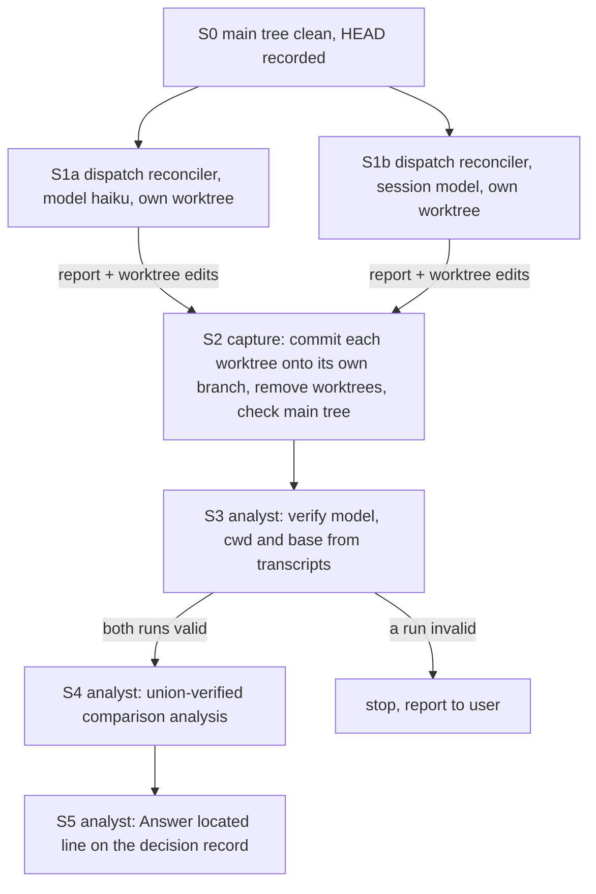

# Implementation Plan: one reconciler run on haiku beside a same-state control run

**Date:** 2026-09-23
**Status:** Complete
**Spec:** none. The work item's Directive is the spec (`260922-0137-measure-the-reconciler-on-a-smaller-model.md`)
**Decidability:** The load-bearing question is whether the reconciler on haiku gets the same verified findings as the session model does, from one identical workbench state. Three parts of it can be decided. First, which model each run used: the transcript's `"model"` field records it. Second, whether a claim a run makes is correct: it is checked against the tree at the base commit. Third, whether one run missed a verified claim the other run made. What cannot be decided from these inputs is the full set of drift neither run found, because no oracle for it exists. The mechanism therefore defines "missed" relative to the union of both runs' verified claims and states that this undercounts misses. It does not pretend to be complete.

## Directive

Produce the evidence that decision `260827-1305_*_which-agents-run-on-a-smaller-model.md` asks for: a candidate run on haiku and a control run on the session model, against the same state and with the same anchor, plus a written comparison. This plan changes the Directive's mechanism in two places. Both need the user's approval at the plan gate (see *Deviations from the Directive*).

## Current State

Everything below was checked in this planning pass.

- `agents/reconciler.md` has no `model:` key. The installed copy under `$FUSION_PLUGIN_ROOT` (11.11.1) is byte-identical to HEAD (`diff -q`). The reconciler writes no log. Its evidence is its report text plus the tracking-file edits it makes: marker renames, appended notes, and possibly new issue files.
- The 260921-2230 control ran over `7a2361aa..cb8776f3`. Its writes landed in the separate commit `6f18884f`, after `cb8776f3`. `cb8776f3..HEAD` holds 87 commits (`git log --oneline cb8776f3..HEAD | wc -l`). Five rule files changed in that range (`git diff --stat cb8776f3 HEAD -- agents/reconciler.md rules/`).
- `fusion-workbench/.fusion-setup` is tracked, so a worktree carries its own marker and `fusion-workbench-root` resolves inside it. `fusion-workbench/.cadence-anchors` is untracked (`last_reconcile_commit=cb8776f3…`). A fresh worktree therefore holds no mark. `fusion-cadence-anchor changed-files` exits 4 there, and Step 1 reads every record.
- Sub-agent transcripts are at `~/.claude/projects/-Users-k1-Projects-productive-fusion/<session-id>/subagents/agent-<id>.jsonl`, and each has a sibling `agent-<id>.meta.json` that names `agentType`. Each JSONL line carries `"model"` and `"cwd"`. Checked on this session's own planner transcript: `claude-opus-5-5`, cwd = repo root.
- `.claude/` is gitignored, so an Agent-tool worktree under it does not show in the main tree's `git status`.

## Approach

### Control state: a fresh pair at current HEAD, not a replay of 260921-2230

A replay at `cb8776f3` does not reproduce the control, for three reasons:

1. **Future history leaks in.** A worktree shares refs and objects with the main repository. The `code` protocol's `git log --all --oneline --grep=…` therefore sees all 87 later commits, including `6f18884f`, which writes down the control's own answers. The haiku run would reconcile a state whose resolution it can read.
2. **The prompt corpus changed.** The installed plugin (11.11.1) emits today's rules, and five rule files differ from what the 260921 run loaded. Model and prompt would change together, and the comparison could not separate them.
3. **The control's claims are not on disk.** Its report text was never written (the reconciler writes no log), and the model it ran on is only in that session's transcript. Its diff in `6f18884f` is mixed with the orchestrator's own bookkeeping.

The Directive's fallback, a fresh control pair on one day, has none of these problems. Both runs are dispatched **in one message, in parallel, at the same HEAD**, so no commit can land between them.

### Model route: the Agent tool's `model` parameter, not frontmatter plus `--plugin-dir`

The decision asks how well the reconciler role does its work on a smaller model. That quality depends on three inputs: the system prompt, the model, and the input state. The route only decides how the model gets selected. With `model: "haiku"` on a `fusion:reconciler` dispatch, haiku receives the same system prompt (the installed `agents/reconciler.md`, identical to HEAD) as frontmatter would give it. Whether the frontmatter key actually reaches a dispatch is a different question, and it has already been measured (`260827-1305-does-agent-frontmatter-model-reach-the-dispatch.md`, finding (a)). The constraint that a tiering change "ships only with transcript evidence" is met the same way on either route, because Step 3 reads the model from the transcript. When a tiering change is later shipped as frontmatter, it still needs its own transcript check under the decision's two-session constraint. That check belongs to realising a ruling, not to this measurement. **No user step is needed:** the orchestrator can issue both dispatches in this session. Route (a) would need a second Claude Code session that the user starts, and it adds nothing to what is measured.

### Isolation: the Agent tool's `isolation: "worktree"`

Each dispatch gets its own worktree, which makes the agent's working directory the worktree. The alternative is a manual `git worktree add` with a prompt that tells the agent to `cd`. That approach is weaker: sub-agent Bash cwd resets on every call, and a single forgotten `cd` would write into the live tree. Isolation is checked afterwards in two places: the transcript's `"cwd"` values, and the main tree's `git status`.



## Implementation Steps

Steps S0 to S2 are dispatches and git housekeeping, which the orchestrator does itself. They are not implementation work, so they name no executor from the set. That is stated here rather than forced onto `coder`, which would have nothing to implement. S3 to S5 each name one executor.

0. [DONE] **Precondition: clean main tree, recorded base** (orchestrator)
   - Commit the pending `fusion-workbench/orchestrator-events.jsonl` change, as the orchestrator routinely does.
   - Record `BASE=$(git rev-parse HEAD)` and the output of `git status --porcelain` (expected empty).
   - Dependencies: none.

1. [DONE] **Dispatch the pair, in one message, in parallel** (orchestrator)
   - S1a: `Agent(subagent_type: "fusion:reconciler", model: "haiku", isolation: "worktree", description: "reconcile, candidate haiku")`.
   - S1b: the same call **without** `model` (it inherits the session model), description `"reconcile, control session model"`.
   - The prompt is identical in both calls, byte for byte:
     ```
     **Domain:** code
     **Directive:** <the work item's Directive paragraph, verbatim>
     **Since:** cb8776f338e4a2df7ddf027af0846afa8bb18514

     Reconcile every tracking file against ground truth and return the three-edge Coherence verdict.
     ```
     `**Since:**` is this checkout's current `last_reconcile_commit`, the same value `/fusion:reconcile` would pass today. The Directive is this session's Directive, the same value the orchestrator would pass. It tests the two Directive edges instead of switching them off.
   - Keep both result texts (the reports), the worktree path and branch each result names, and the agent IDs.
   - Dependencies: S0.

2. [DONE] **Capture, clean up, check the main tree** (orchestrator)
   - In each worktree, run `git -C <wt> add -A && git -C <wt> commit -m "exp: reconciler <haiku|control> run over <BASE>"`, creating the branch first if the worktree is detached: `exp/reconciler-haiku-260923` and `exp/reconciler-control-260923`. Then run `git -C <wt> show --stat -M HEAD`. The commit keeps each run's edits, including renames and new issue files, as a citable hash outside the live workbench, where the citation gates do not scan them. A raw patch filed into the workbench would carry store-prefixed record paths and turn the gates red.
   - Save each report text in the same commit? **No.** The report is the final assistant message in the transcript, which Step 3 already reads. Saving it a second time would create a second copy that could drift.
   - Remove both worktrees with `git worktree remove <wt>`. **The branches stay** until the user decides (see *Where this work stops*).
   - Main-tree check: `git status --porcelain` in the repository root must match S0 apart from machine-written hook rows (the events log). If any other path moved, **stop and report to the user. Restore nothing without their approval.**
   - Dependencies: S1a, S1b.

3. [DONE] **Verify both runs from their transcripts** (Executor: analyst)
   - Files: `~/.claude/projects/-Users-k1-Projects-productive-fusion/<session>/subagents/agent-<id>.{jsonl,meta.json}` for the two agent IDs from S1. Match on `meta.json` `agentType == "fusion:reconciler"` and on `description`.
   - Checks, each recorded with the command and its output:
     - `grep -o '"model":"[^"]*"' <jsonl> | sort | uniq -c`: the candidate shows only a haiku ID, and the control shows only the session model.
     - `grep -o '"cwd":"[^"]*"' <jsonl> | sort -u`: every value lies under that run's own worktree.
     - The first parent of each branch commit is `BASE`.
     - Token use and duration per run, summed from the transcript's `usage` fields.
   - Stop condition: if any check fails, that run is invalid. The analyst reports this and S4 does not run.
   - Dependencies: S2.

4. [DONE] **Write the comparison analysis** (Executor: analyst)
   - Files: `circles/260922-0137-measure-the-reconciler-on-a-smaller-model/analyses/260923-HHMM-reconciler-haiku-versus-session-model.md`
   - Method:
     - (a) Split each run into atomic claims: every marker rename, appended note, filed issue and `Answer located:` line in its branch diff, and every finding and edge line in its report.
     - (b) Take the union and verify each claim once against the tree at `BASE`, using `git show BASE:<path>` and history `≤ BASE`. Neither run is treated as ground truth.
     - (c) Per run, classify each claim: **found** (claim verified true), **wrong** (claim verified false), or **missed** (a verified-true claim from the other run that this run did not make).
     - (d) Compare the two Coherence verdicts and their edge evidence.
     - (e) Record cost: the S3 token and duration figures.
   - Contents also required: the S3 evidence verbatim in a fenced block; a statement that "missed" is a lower bound (union ground truth); and the decision's own bar, "two clean candidate runs" to move a role, with this run counting as **one**.
   - Records are cited as storeless basenames only, never the worktree's raw paths.
   - Dependencies: S3.

5. [DONE] **Point the decision at the analysis** (Executor: analyst)
   - Files: `260827-1305_*_which-agents-run-on-a-smaller-model.md` in the shared decision store.
   - Changes: append one last line, `Answer located: 260923-HHMM-reconciler-haiku-versus-session-model.md ## <result heading> — <one-line result; one of the two candidate runs the bar asks for>`. **No marker move.** The ruling stays the user's.
   - Acceptance: `npm test` passes after this write, specifically the citation lints over the new line and the analysis. Any red test means stop.
   - Dependencies: S4.

## Deviations from the Directive (user approval at the plan gate)

- **Route:** the Agent `model` parameter replaces `model: haiku` in a work tree plus `claude --plugin-dir .`. The reasoning is under *Model route*.
- **Control:** a fresh same-HEAD pair replaces the 260921-2230 state. The Directive allows this, and the reasons are under *Control state*.
- **What is compared:** the reports plus the committed edits. The decision's "two reconciliation history files" no longer exist, because the reconciler writes no log.

## Where this work stops

- Both transcripts show the intended model, and every `cwd` lies inside that run's worktree: yes or no.
- The main tree matched its S0 state after S2, apart from hook rows: yes or no.
- The analysis exists in this container and classifies every claim in the union as found, wrong or missed per run: yes or no.
- The decision record's last line is an `Answer located:` line citing that analysis, and its marker is still `_o_`: yes or no.
- `npm test` is green after S5: yes or no.
- Before the item is closed, the user has decided whether the two `exp/reconciler-*-260923` branches are kept as evidence or deleted: yes or no.
- If S3 finds a run invalid (condition did not arise: one clause), the work stops at the S3 report and the item stays claimed.

## Data Structures / API Changes

None.

## Testing Strategy

No code changes. The checks are the S2 main-tree comparison, the S3 transcript checks, and the S5 `npm test`.

## Risks & Mitigations

| Risk | Mitigation |
|---|---|
| The isolated agent still writes into the main tree (absolute path, stray cwd) | S2 compares `git status` with S0, and S3 checks every transcript `cwd`. On a mismatch: stop and let the user decide |
| An isolated worktree is not based on `HEAD` | S3 checks that each branch's first parent is `BASE`. Two runs on the same other base would still form a valid pair, but that finding is named |
| Haiku hits its context limit on a full inventory with no mark | Both runs get the same full read, so the comparison stays fair. A truncated or failed run is itself a result and is recorded, not re-run |
| One run is a single sample (model non-determinism) | The analysis says so. The decision's bar is two clean candidate runs, and this is one |
| Hook-written rows appear in a worktree diff | The analyst excludes machine-written files by name, as listed in the diff, and never counts them as claims |

## Open Questions

- [ ] Keep the two `exp/reconciler-*-260923` branches as durable evidence (local, not pushed), or delete them once the analysis is written? Only the user can decide.
