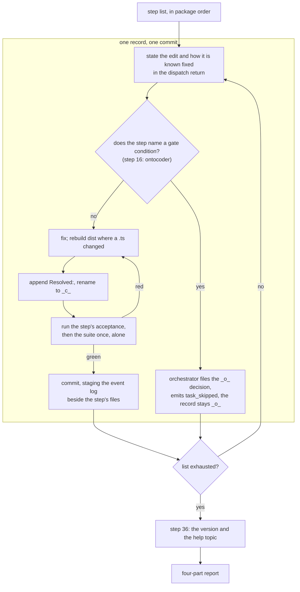
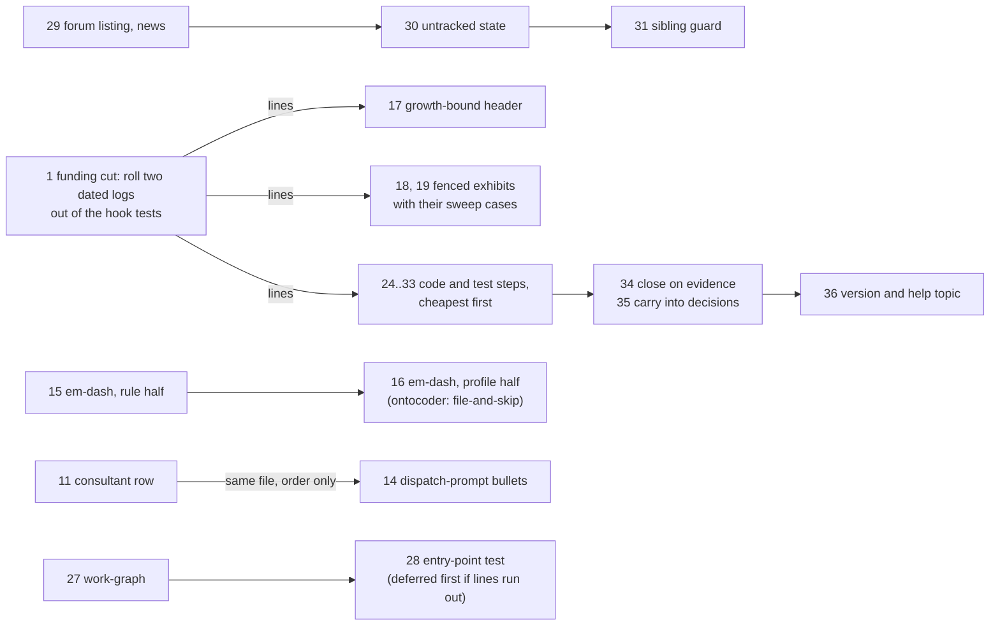

# Implementation Plan: the 51 issues open at `451bb312`, worked autonomously as one package

**Date:** 2026-09-22
**Status:** Draft
**Spec:** none — planned from the work item's `## Directive` and `## Scope` (`260922-0906-fix-package-over-every-open-issue.md`), on the model of `260921-1726_*_the-33-open-defects-of-the-11-9-1-survey-worked-autonomously-as-one-package.md`
**Decidability:** The load-bearing question is whether each of the 51 records can be brought to one of the directive's three end states (closed on a fix, closed on evidence, or carried into a decision) by a bounded edit whose acceptance is a command and an exit code, without any step asking a question the item's `**Mode:** autonomous` field cannot answer. It is decidable from the inputs the steps have: every record was read in full and its site re-read against the tree at `451bb312` (the quote is in the step), every acceptance below is a `grep`, a `wc`, a `node -e` probe, a helper run or the suite with a stated result, the three growth budgets are subtractions the bound test performs on every run (51 hook-test lines, 92 `skills/` bytes and 10 407 `agents/` bytes of head-room at HEAD, measured from `hooks/lib/__tests__/fixtures/surface-growth.golden` against the baseline maps), and the one gate condition a step meets (step 16, a data file under `ontocoder`) is named on the step and lands as the file-and-skip the orchestrator prescribes, so the package needs nothing from a human to finish. Two inputs are not decidable here and are handed on rather than approximated: whether the six decisions this plan files (and the two it cites) are answered the way their recommendations say, which the user rules on with the closed records in front of them; and whether the funding cut of step 1 frees enough lines for the last test-bearing step, which the bound reports at the commit that lands it, with the deferral rule stated in `## Approach`.
**Domain:** code

## Coverage

Every one of the 51 records in the item's `## Scope`, its classification at `451bb312` after a full read and a re-check against the tree, and the step that reaches it. **Live** means the defect stands and a step fixes it; **evidence** means the tree already answers the record and a step closes it on that evidence; **terminal** means the text the record corrects lives in a record the conventions forbid editing, so the record itself is the correction and closes saying so; **ruling** means the record turns on a choice nobody has made, so it is carried into a decision record filed by this plan (or one already standing) and closes naming it.

| # | Record | Class | Step |
|---|---|---|---|
| 1 | `260827-1807_*_the-always-on-corpus-and-the-four-profiles-are-over-the-em-dash-ceiling-again-six-days-after-they-reached-it.md` | live (rules 39 over 11 permitted; profiles 14 over 1) | 15, 16 |
| 2 | `260829-1623_*_the-sweep-starred-both-markers-of-a-shell-illustration-in-a-terminal-circle-record.md` | live (`_c_circle.md:104` still both `_*_`) | 18 |
| 3 | `260829-1810_*_the-repair-pass-rewrites-two-unfenced-exhibits-in-a-closed-issue-record-and-no-gate-holds-repairs-at-zero.md` | live (`--repair --dry-run` prints `files=1 repairs=2`) | 19 |
| 4 | `260905-0933_*_fusion-alias-is-exported-and-read-by-nothing-while-the-release-note-names-it-a-rendering-site.md` | ruling (remove or give a reader; removal is a gate) | 35 |
| 5 | `260905-0933_*_the-new-checkouts-store-is-absent-from-the-two-code-level-enumerations-of-the-artifact-stores.md` | live | 24 |
| 6 | `260905-0933_*_the-presence-join-key-is-free-text-so-two-humans-claiming-one-person-string-merge-into-one-party.md` | live | 33 |
| 7 | `260908-0020_*_the-specs-open-for-planner-states-nine-c5-criteria-where-c5-carries-ten.md` | live (spec line 737 still "states nine") | 22 |
| 8 | `260908-1719_*_three-harness-spawning-tests-fail-intermittently-so-the-suite-cannot-answer-the-circles-green-clause.md` | evidence (0 red of 20 at `73c11cfd`) | 34 |
| 9 | `260908-2112_*_unstamped-counts-over-the-whole-log-while-every-other-dispatch-figure-is-filtered.md` | live | 26 |
| 10 | `260908-2113_*_an-unparseable-cutoff-is-reported-to-the-user-as-unstamped-dispatches.md` | live | 26 |
| 11 | `260907-1234_*_the-spec-review-analysis-ends-with-two-lines-of-tool-markup.md` | live | 21 |
| 12 | `260907-2301_*_the-retention-decisions-cross-reference-cites-the-tier-heading-by-its-pre-edit-wording.md` | terminal record plus ruling (gate or no gate) | 35 |
| 13 | `260908-0848_*_an-untracked-workbench-answers-new-equals-zero-forever-and-no-state-names-it.md` | live | 30 |
| 14 | `260908-0848_*_the-mark-helper-is-guarded-in-new-and-unguarded-in-seen-and-both-branches-are-wrong.md` | live | 31 |
| 15 | `260908-0849_*_the-store-listing-admits-every-path-and-the-reader-parses-a-hex-out-of-whatever-it-gets.md` | live | 29 |
| 16 | `260908-0849_*_the-twenty-line-cap-counts-a-draft-that-is-never-the-file-that-gets-written.md` | live | 32 |
| 17 | `260908-0850_*_the-read-mark-advances-over-entries-that-failed-to-render.md` | live | 29 |
| 18 | `260908-1612_*_readme-agents-calls-curate-the-only-path-to-claude-md-while-a-lint-forces-a-hand-edit.md` | live (reworded to "The one path" at `115be68d`, same claim) | 2 |
| 19 | `260908-1612_*_the-migrate-carve-outs-authoring-home-has-no-heading-a-citation-can-address.md` | live | 3 |
| 20 | `260908-1800_*_three-commits-shipped-a-red-citation-sweep-gate-because-an-expected-red-golden-masked-it.md` | live (class fix) | 13 |
| 21 | `260908-1853_*_the-reference-count-re-approval-omits-the-file-that-carries-its-whole-movement.md` | live, changed shape (the entry was dropped at `b3649305`, not corrected, and sits in no roll record) | 23 |
| 22 | `260908-1854_*_archives-marker-cut-cites-a-list-of-markerless-kinds-that-does-not-carry-the-forum-entry.md` | live | 4 |
| 23 | `260909-1020_*_three-source-aspects-unnamed-and-the-proposal-pass-has-no-agent-or-surface.md` | evidence (the pass has an agent, a surface and re-run semantics since `260917-2253`; the item is `done`) | 34 |
| 24 | `260913-0818_*_the-new-cross-references-field-has-two-unswept-consumers-and-one-is-a-safety-filter.md` | live | 5 |
| 25 | `260913-0819_*_ready-is-claimed-to-be-optimistic-by-exactly-one-count-and-a-dangling-entry-inflates-it-too.md` | live | 27 |
| 26 | `260913-0820_*_the-order-entry-point-ships-with-no-test-so-both-of-its-rulings-are-unpinned.md` | live | 28 |
| 27 | `260913-0821_*_an-item-record-whose-head-the-parser-cannot-read-vanishes-from-the-order-with-no-report.md` | live | 27 |
| 28 | `260913-0822_*_the-migrations-new-drop-rule-justifies-itself-with-a-claim-that-is-false-on-a-re-run.md` | live | 6 |
| 29 | `260913-0823_*_the-fixture-test-carries-one-tautological-assertion-and-leaves-three-branches-unexercised.md` | live (the duplicate-entry case landed for the dangle side only) | 27 |
| 30 | `260909-2215_*_step-a1s-denominator-names-a-field-eleven-rows-carry-and-the-plans-own-figure-uses-ninety-four.md` | terminal (the plan is `_c_`) | 34 |
| 31 | `260909-2215_*_the-plans-current-state-says-every-removed-gate-has-its-own-row-kind-and-three-of-six-have-none.md` | terminal (the plan is `_c_`) | 34 |
| 32 | `260910-0020_*_session-2s-own-additions-do-not-fit-the-hook-test-growth-bound-and-the-plan-does-not-say-so.md` | evidence (suite green; the route R1/R2 is named in the plan at its lines 410 to 460) | 17 |
| 33 | `260910-0445_*_deleting-a-test-file-at-its-baseline-frees-no-head-room-so-the-turn-budget-cut-cannot-pay-the-bound.md` | live (the header still says nothing about deletion) | 17 |
| 34 | `260910-1033_*_step-c1s-acceptance-asks-for-a-green-suite-that-only-step-c2-can-deliver.md` | live (class fix; the plan is `_c_`) | 13 |
| 35 | `260910-2020_*_the-two-existing-backlog-entries-keep-the-retired-marker-form-that-d1-migrates-into.md` | ruling (the store is read by nothing; every closure moves the user's data) | 35 |
| 36 | `260910-2020_*_the-user-facing-fallback-list-is-five-where-the-answered-decision-says-three.md` | evidence plus terminal (the code comment carries the reason; the decision is `_i_`) | 34 |
| 37 | `260911-0638_*_migrates-record-field-repair-writes-a-store-prefixed-citation-into-fields-the-format-no-longer-defines.md` | live, half obsolete (`**Active spec/plan:**` is defined again since `260910-2011`) | 7 |
| 38 | `260916-2208_*_step-3-mandates-one-collected-pointer-table-and-the-criterions-first-application-leaves-eighteen-scattered.md` | ruling (15 of 24 pointers outside the table; the fork is the user's) | 35 |
| 39 | `260916-2209_*_the-division-rule-says-what-applies-it-restates-none-of-it-and-the-curator-restates-three-of-its-clauses.md` | live | 8 |
| 40 | `260916-2210_*_step-1s-two-branches-leave-a-file-with-no-headings-undivided-while-the-helper-answers-heading-level-0.md` | live | 9 |
| 41 | `260917-1115_*_the-claude-md-cut-banked-85-kb-of-slack-into-a-bound-whose-header-says-head-room-is-zero.md` | ruling (rows still at 93 432; `CLAUDE.md` is 8 021) | 35 |
| 42 | `260917-1252_*_four-steps-of-commit-a-carry-a-green-suite-acceptance-criterion-that-only-step-a7-can-satisfy.md` | live (class fix; the plan's item is `done`) | 13 |
| 43 | `260917-1308_*_the-staging-classifiers-store-list-omits-forum-and-its-comment-states-a-relation-that-is-false-by-that-element.md` | live | 24 |
| 44 | `260918-0824_*_the-container-hop-voided-the-only-stated-mitigation-for-flooding-the-gate.md` | ruling (its three clauses are met; the yield question is nobody's) | 35 |
| 45 | `260921-1855_*_readme-hooks-says-the-two-re-baselines-are-logged-in-full-in-the-growth-bound-test-header-after-the-log-rolled-out.md` | live | 10 |
| 46 | `260921-1931_*_a-coder-ran-git-reset-hard-in-the-live-tree-and-an-hour-of-uncommitted-event-log-rows-is-gone.md` | live | 14 |
| 47 | `260921-2049_*_an-ellipsis-truncated-exhibits-entry-passes-the-md-rule-and-declares-a-month-of-records-exhibits.md` | live | 25 |
| 48 | `260921-2049_*_the-conventions-let-any-agent-dispatch-the-consultant-for-a-second-opinion-while-the-orchestrator-table-allows-only-fusion-discuss.md` | live | 11 |
| 49 | `260921-2049_*_the-memo-bodys-checkout-halt-fires-before-the-target-is-chosen-so-an-idea-halts-where-the-conventions-say-file.md` | live | 12 |
| 50 | `260831-0748_*_a-storeless-bracket-marked-citation-is-invisible-while-a-store-prefixed-one-is-reported.md` | ruling (two `_o_` decisions already carry it) | 35 |
| 51 | `260921-2238_*_a-curator-survey-spells-a-decisions-marker-letter-and-the-reconciliation-rename-made-the-row-stale.md` | live (the checker prints the `stale-marker` row) | 20 |

Counted from the table: 36 live, 5 evidence, 3 terminal (two of them also in a step that fixes the class), 7 ruling. Every class is reached by a step; no record is left for a later package.

## Directive

The work item asks that every issue open at `451bb312` be worked as one autonomous package: each of the 51 closed with its resolution note, dropped with its reason, or carried into a decision or a new item with the reason stated, and the tree green at the end (`cd hooks && npm test` exit 0, `node hooks/dist/citation-check.js` reporting `verdict=clean`). The item runs under `**Mode:** autonomous`, so this plan is approved off the field, and a step that would meet a file-and-skip gate condition is named as such rather than shaped to ask.

## Current State

HEAD `451bb312`, fusion `11.10.0` in the manifest and not yet tagged (`git tag -l v11.10.0` prints nothing; the last tag is `v11.9.1`), `main` two commits ahead of `origin/main`. The 51 records stand `_o_` where the item's `## Scope` lists them; the count reproduces with the item's own `find`. Every site below was re-read in this tree.

Three bounded surfaces, computed the way `hooks/lib/__tests__/surface-growth-bound.test.ts` computes them from the checked-in golden and the baseline maps:

| Surface | Measured | Floor + head-room | Head-room left | Consequence |
|---|---|---|---|---|
| hook tests (`hooks/lib/__tests__/**/*.ts`, lines, helpers included) | 22 207 | 19 228 + 3 030 = 22 258 | **51** | Eleven steps add test lines (18 conditionally, 19, 24 to 31, 33), about 180 together. Step 1 is the funding cut and precedes them all. |
| `skills/*/SKILL.md` (bytes) | 227 936 | 188 768 + 39 260 = 228 028 | **92** | Steps 3 to 7, 12, 29, 30, 32 land here. Two of them shrink their file (4, 7); step 29 carries its own cut in `skills/news/SKILL.md`. |
| `agents/*.md` (bytes) | 318 160 | 310 567 + 18 000 = 328 567 | 10 407 | Steps 5, 8, 11, 13, 14 land here; step 8 shrinks `agents/curator.md`. |

The dispatch-path bound (`rules-emission-golden.test.ts`, zero head-room by definition) charges `CLAUDE.md` to every row at 93 432 bytes against a file of 8 021, so every path stands at least 78 022 bytes under its row: record 41 above, carried into a decision this plan files. The always-on edits below (steps 15 and, by a few hundred bytes, 5, 11, 14) are measured by it and none can reach that slack.

Three gates move on several steps and are stated once. **`committed-dist.test.ts`** compares `hooks/dist/` with a fresh build: every edit to a `.ts` under `hooks/` carries `cd hooks && npm run build` and the rebuilt `dist/` in the same commit. **`reference-resolution-lint.test.ts`** pins `const BASELINE = { paths: 1693, anchors: 313, stampBare: 11 }` at line 492 (one physical line; every re-approval entry is appended to it, never a new line) over the shipped surface; a step that adds or removes a plugin-path token or a `` `file.md` `## Section` `` anchor there re-approves on that line, measured by restoring the edited file to HEAD in place. **`bin/fusion-citation-check`** and the sweep gate read every workbench `.md` plus `fusion.json`'s `citations.extraPaths`; a record this package writes or closes is inside that corpus, so `Resolved:` lines cite storeless basenames with the marker wildcarded and a verbatim wrong spelling goes in a fence. At HEAD the checker reads `dangling=302 store-prefixed=404 unedited-violations=706 verdict=clean`; steps 20 and 24 move the first two figures and state the direction.

The load repair of the previous package landed: `hooks/lib/git.ts` carries `GIT_TIMEOUT_MS = 10_000` and `GIT_TIMED_OUT`, `hooks/vitest.config.mjs` `testTimeout: 30_000`, and the ten-pair experiment read 0 red of 20 at `73c11cfd` (record 8 closes on it). Every `cd hooks && npm test` below still means one run, alone, on an idle tree.

Six decision records were written by this plan into this container's decision store and are inputs to step 35; each is cited where it applies. `260921-1726_*_the-33-open-defects-of-the-11-9-1-survey-worked-autonomously-as-one-package.md` still carries `_o_` although its item is `done`; that is outside this package and named in `## Open Questions`.

## Approach

One loop per record, the previous package's with two changes: no second opinion is planned (the item's directive asks for none and every mechanism step below either takes a working reading the record's own acceptance offers or routes the choice to a decision), and the record write comes **before** the verifying run, not after it. Record 20 measured that a record written after the last suite run is the one thing that reddens a gate with no run to catch it; the loop below runs the suite once after the `Resolved:` line and the marker move, so the commit's whole content is what the run saw.



The one cycle, verify to fix, is the ordinary red-suite return; a red that the step's own files cannot clear is a stop, named in the report, never a baseline edit.

**Order.** Six packages: the funding cut alone (A, step 1); the shipped-text fixes, one commit per record (B, steps 2 to 17); the workbench-record fixes (C, 18 to 23); the code and test steps the cut pays for, cheapest first (D, 24 to 33); the closures on evidence and the carries into decisions (E, 34 and 35); the version (F, 36). Package D's order is by test-line ceiling so that, if step 1's lines run out, what is deferred is the largest and last (step 28, the entry-point test at 55 lines); a deferred step is named in the report with the lines it needed, and its record stays `_o_` with an `Also seen:` line saying so.



Steps 27 to 31 are inside package D and are drawn where the prose declares an order among them; every other step of packages B, C and D depends on nothing but step 1's lines where it adds test lines, and the package order is a sequencing choice, not a dependency.

**Executors.** Thirty-five steps are `coder`: TypeScript, bash helpers, test files, rule and prompt text, skill bodies, READMEs, the manifest and workbench records (the same set the previous package's `## Approach` assigned to `coder`, and for the same reason: none of it is ontology, manifest data or a schema). One step is `ontocoder`: step 16 edits the eight voice-profile YAML files, which carry data under `README-agents.md`'s role rule. `analyst` is in the active set and receives nothing: the two records this package writes into the analysis store (steps 1 and 23) are verbatim moves of existing text with one corrected figure, which the precedent (`260921-1726_*`, step 17) gave to `coder`, and no step produces a comparative or feasibility deliverable.

**Gates under `**Mode:** autonomous`.** Step 16 is the one step that meets a file-and-skip row (*Task involves `ontocoder`*). It is placed after step 15 so that the rule half of record 1 lands whatever happens to the profile half; if step 16 is skipped, record 1 stays `_o_` with an `Also seen:` line naming the decision the orchestrator filed, and the report says so. No step deletes a file or removes a feature: the two closures that would (records 4 and 35) are routed to decisions instead. No step is ambiguous by construction: every one names its files, its edit and its command.

**What the executor writes per step.** The edit; the `Resolved:` line on the record, citing the commit and, where the step took one of two readings the record offered, which one and why in one clause; the marker move to `_c_`; the commit, staging `fusion-workbench/orchestrator-events.jsonl` beside the step's files (step 14 is where that rule is written down; this package obeys it from step 1). A new record only where `rules/fusion-workbench-conventions.md` `## Record filing` says one is owed; this plan has already filed the six decisions it saw.

## Implementation Steps

Field key. **Record** is the storeless citation of the defect the step closes. **Site at HEAD** quotes what this plan read at `451bb312`. **Growth** names the bounded surface touched and the ceiling. **Pin** says whether the reference-resolution counts move. **Gate** names a `## Human Gate Rules` row the step meets, or `none`.

### Package A — the funding cut

1. [DONE] **Roll two dated logs out of the hook-test surface into one workbench record**
   - Executor: `coder`
   - Record: none (the funding cut the growth rule asks for; a cut, never a baseline edit)
   - Site at HEAD: `hooks/lib/__tests__/rules-emission-golden.test.ts` lines 71 to 91 (`THE UNIVERSAL-CORE GROWTH BOUND WAS RETIRED ON 2026-09-11, AND THIS IS THE ARGUMENT THAT MADE IT SAFE …`, 21 lines about a bound that no longer exists), lines 93 to 102 (`WHY THE BUDGET ONLY REPORTS`, the 2026-08-05 conversion story), and the cut log inside the `RULE_BASELINE` doc comment, lines 248 to 336, from `The first five figures below are the 2026-08-14 arming sizes` through the 2026-08-14 arming entry and its `THE STANDING CLEANUP REQUEST, KEPT AS TEXT` table (89 lines whose gate was retired on 2026-09-11, as line 157 of the same file says). `hooks/lib/__tests__/surface-growth-bound.test.ts` lines 81 to 90 (`THE ARMING CLAIMED TWO FURTHER PROPERTIES AND A CORROBORATION RATE; all three are gone, named here so nobody restores them`). No shipped file cites any of these by heading (`grep -rn 'STANDING CLEANUP REQUEST\|TWO FURTHER PROPERTIES\|ARGUMENT THAT MADE IT SAFE' README*.md rules agents skills docs hooks/lib` prints nothing). The precedent is the previous package's step 17 and the record it wrote, `260921-1855-surface-growth-bound-arming-and-re-baseline-log-2026-08-15-to-2026-09-05.md`.
   - Files: `hooks/lib/__tests__/rules-emission-golden.test.ts`; `hooks/lib/__tests__/surface-growth-bound.test.ts`; a new record `fusion-workbench/circles/260922-0906-fix-package-over-every-open-issue/analyses/<stamp>-rules-emission-golden-cut-log-and-retired-core-bound-argument-2026-08-05-to-2026-09-11.md` (stamp from `date +%y%m%d-%H%M`)
   - Do not touch: `RULE_BASELINE`'s entries, `RELEASE_CAP`, `GROWTH_BUDGET`, `DRIFT_CEILING`, any head-room constant, `fixtures/rules-emission.golden`, `fixtures/surface-growth.golden`, `helpers/growth-bound.ts`
   - Changes: the four passages move verbatim into the record (a title, one line saying what it is and where each passage came from, then the text with its comment prefixes stripped, the cut-log table kept as a table). In `rules-emission-golden.test.ts` the three passages are replaced by one paragraph of at most five lines: the universal-core bound was retired on 2026-09-11 because the dispatch-path bound dominates it, `RULE_BASELINE`'s first five entries are the 2026-08-14 arming sizes and the last three the 2026-08-05 post-cut sizes, and the argument, the event-by-event log and the standing cleanup table are in the record, named by its markerless basename. In `surface-growth-bound.test.ts` the ten lines become one line naming the record. The commit message states the lines freed (before and after `wc -l` on both files).
   - Acceptance: `wc -l hooks/lib/__tests__/rules-emission-golden.test.ts` prints at most `1215` (1 330 minus at least 115); `wc -l hooks/lib/__tests__/surface-growth-bound.test.ts` prints at most `569`; the record exists and `grep -c 'STANDING CLEANUP REQUEST' <record>` prints `1`; `cd hooks && npm test` exits 0 and the growth-bound test's report shows the hook-test surface at least 170 lines under its budget.
   - Growth: hook tests, a shrink of about 125 lines; the head-room after it (about 176) is what steps 18 to 33 spend, each stating its ceiling.
   - Pin: unmoved (test files are not the lint's surface; the record citation is not pinned).
   - Gate: none
   - Dependencies: none

### Package B — shipped text, one commit per record

2. [DONE] **State what `/fusion:curate` is the one path to**
   - Executor: `coder`
   - Record: `260908-1612_*_readme-agents-calls-curate-the-only-path-to-claude-md-while-a-lint-forces-a-hand-edit.md`
   - Site at HEAD: `README-agents.md:259`, the `/fusion:curate` row: "The one path to `CLAUDE.md`. Reconciles the three normative surfaces …". `hooks/lib/__tests__/derivable-enumerations-lint.test.ts`'s `claudeMdDrift` block fails the suite when `skills/<name>/` exists and `CLAUDE.md` names no `/fusion:<name>`, so a same-commit hand edit is mandatory at every skill addition (`5c240eb7` did it for `/fusion:news`, `115be68d` reworded this row without qualifying it).
   - Files: `README-agents.md` (line 259)
   - Changes: "The one path to `CLAUDE.md`." becomes "The one path to a *reconciliation* of `CLAUDE.md`; the same-commit token a new `skills/<name>/` directory owes it (`derivable-enumerations-lint.test.ts`) is a hand edit and not this skill's."
   - Acceptance: `grep -c 'The one path to `CLAUDE.md`\.' README-agents.md` prints `0`; `grep -c 'reconciliation.*CLAUDE.md' README-agents.md` is at least `1`; `cd hooks && npm test` exits 0.
   - Growth: none bounded.
   - Pin: paths may move by one (`derivable-enumerations-lint.test.ts` as a backticked path); re-approve on the line if so.
   - Gate: none
   - Dependencies: none

3. [DONE] **Give the migrate carve-out a heading and cite it by anchor**
   - Executor: `coder`
   - Record: `260908-1612_*_the-migrate-carve-outs-authoring-home-has-no-heading-a-citation-can-address.md`
   - Site at HEAD: `rules/workbench-path-resolution.md:71`, the paragraph opening "One consumer names the layout literally, and only one: `/fusion:migrate`", under `## The second argument, and what it is for`, with no heading of its own; `skills/migrate/SKILL.md:24` cites it as "in the paragraph beginning "One consumer names the layout literally"".
   - Files: `rules/workbench-path-resolution.md` (a `### ` heading above line 71), `skills/migrate/SKILL.md` (line 24)
   - Changes: the paragraph gains the heading `### The one consumer that names the layout literally`; the migrate sentence becomes "All three reasons are authored in `rules/workbench-path-resolution.md` `### The one consumer that names the layout literally`." (the prose pointer goes, so the skill line is about 20 bytes shorter). The rule file is emitted to no agent, so no dispatch path moves.
   - Acceptance: `grep -c '^### The one consumer that names the layout literally' rules/workbench-path-resolution.md` prints `1`; `grep -c 'paragraph beginning' skills/migrate/SKILL.md` prints `0`; `cd hooks && npm test` exits 0 (the anchor resolves).
   - Growth: `skills/`, about −20 bytes; `rules/` is unbounded.
   - Pin: anchors up by one; re-approve on the line.
   - Gate: none
   - Dependencies: none

4. [DONE] **Cite the one heading that enumerates every markerless kind**
   - Executor: `coder`
   - Record: `260908-1854_*_archives-marker-cut-cites-a-list-of-markerless-kinds-that-does-not-carry-the-forum-entry.md`
   - Site at HEAD: `skills/archive/SKILL.md:66` "Authored in `rules/fusion-workbench-conventions.md` `## State Markers — issues and planning` and `## State Markers — decisions`; the markerless kinds are enumerated there too." The only enumeration in those two sections is the line "History, review, analysis, investigation, consultation, memo, and cadence files do NOT carry state markers." (`rules/fusion-workbench-conventions.md:322`), which carries no forum entry; `## Filename Patterns`'s fourth column answers per kind and its `Forum entry` row reads `no`.
   - Files: `skills/archive/SKILL.md` (line 66)
   - Changes: "; the markerless kinds are enumerated there too" becomes "; which kinds carry no marker is the fourth column of `## Filename Patterns`, the forum entry's row included" (the record's second route, the free one). The two State Markers anchors stay for the vocabularies.
   - Acceptance: `grep -c 'enumerated there too' skills/archive/SKILL.md` prints `0`; `grep -c 'fourth column of `## Filename Patterns`' skills/archive/SKILL.md` prints `1`; `cd hooks && npm test` exits 0.
   - Growth: `skills/`, about +40 bytes.
   - Pin: anchors may rise by one; re-approve on the line.
   - Gate: none
   - Dependencies: none

5. [DONE] **Let the archive safety filter and the orchestrator's field list read `**Cross-references:**`**
   - Executor: `coder`
   - Record: `260913-0818_*_the-new-cross-references-field-has-two-unswept-consumers-and-one-is-a-safety-filter.md`
   - Site at HEAD: `skills/archive/SKILL.md:84` (filter 2, "any item another live item names in its `**Depends-on:**` field"), `:149` ("An item named in a live item's `**Depends-on:**` is excluded in every tier"), `:152` (the walk, `sed -n 's/^\*\*Depends-on:\*\*[[:space:]]*//p'`). `agents/orchestrator.md:402` "its five `**Status:**` values, its `**Claim:**` and its `**Depends-on:**` field are in …" (the record's line 397 moved; the enumeration is this one and names no `**Cross-references:**`).
   - Files: `skills/archive/SKILL.md` (lines 84, 149, 152), `agents/orchestrator.md` (line 402)
   - Changes: the three archive sites read both fields: the prose names `**Depends-on:**` and `**Cross-references:**`, the walk's `sed` matches `^\*\*(Depends-on|Cross-references):\*\*` with `-E` and reads both lines (two `head -n 1` become one pass over both matches). The orchestrator sentence gains ", its `**Cross-references:**` field" after `**Depends-on:**`.
   - Acceptance: `grep -c 'Cross-references' skills/archive/SKILL.md` is at least `3`; a scratch workbench holding a live item whose head carries `**Cross-references:** <target>.md` and a `done` item `<target>`: the archive survey's Step 3 walk (run as the skill body's block against that root) lists `<target>` as excluded and names the citing item; `grep -c 'its `\*\*Cross-references:\*\*` field' agents/orchestrator.md` prints `1`; `cd hooks && npm test` exits 0.
   - Growth: `skills/`, about +90 bytes; `agents/`, about +40.
   - Pin: unmoved.
   - Gate: none
   - Dependencies: none

6. [DONE] **Make the migration's drop rule and its reason agree**
   - Executor: `coder`
   - Record: `260913-0822_*_the-migrations-new-drop-rule-justifies-itself-with-a-claim-that-is-false-on-a-re-run.md`
   - Site at HEAD: `skills/migrate/SKILL.md:162` "Every entry naming a container **this pass also converted** goes to `**Cross-references:**`, comma-separated, which orders nothing; every other entry names no such record and is dropped, because a citation that resolves to nothing degrades without announcing it (`HYG-NO-SILENT-FAIL`)."
   - Files: `skills/migrate/SKILL.md` (line 162)
   - Changes: the reason is restated as what it is (the record's second branch): "every other entry is dropped and reported, whether or not it resolves: a conversion writes only what this pass can verify, and a container an earlier run converted is outside that set." The `**Depends-on:**` sentence beside it is untouched, and the report obligation ("Say in the report which you dropped and why") keeps a "why" every dropped entry can answer.
   - Acceptance: `grep -c 'names no such record and is dropped' skills/migrate/SKILL.md` prints `0`; `grep -c 'only what this pass can verify' skills/migrate/SKILL.md` prints `1`; `cd hooks && npm test` exits 0.
   - Growth: `skills/`, at or below the current byte count (the restatement is shorter by the `HYG-NO-SILENT-FAIL` clause).
   - Pin: unmoved.
   - Gate: none
   - Dependencies: none

7. [DONE] **Make `rewrite_fields` write the storeless wildcarded basename its bullet promises**
   - Executor: `coder`
   - Record: `260911-0638_*_migrates-record-field-repair-writes-a-store-prefixed-citation-into-fields-the-format-no-longer-defines.md`
   - Site at HEAD: `skills/migrate/SKILL.md:118`, inside the Step 4 block, `rewrite_fields()`: the first `sed` writes `\1shared/$t/` (a store segment) and the second writes `_\1_` (the marker letter kept); the bullet at `:185` says the function "rewrites the values to the storeless basename with the marker wildcarded (`260716-1910_*_plan-foo.md`)". The record's second half is half obsolete: `**Active spec/plan:**` is defined again (`rules/fusion-workbench-conventions.md` `## Backlog entries — work items`, and `:155` of the skill carries it into the item head), while `**Active session history:**` is not (`:157` folds it into `**Cross-references:**`). `reformat_one` calls the function on terminal markers too.
   - Files: `skills/migrate/SKILL.md` (line 118, the two `sed` expressions; line 185)
   - Changes: the first `sed` drops the segment (`\1` in place of `\1shared/$t/`), the second writes `_*_` in place of `_\1_`, so the value becomes the storeless wildcarded basename. The bullet loses its sentence "This is not a cosmetic fix: … forbids." (about 190 bytes, restated by the sentence after it) and gains one clause: "It runs on a terminal record too: a format conversion is not a reconciliation (`## Terminal states are history` forbids state writes, not format), which is what the guardrail below already claims." The record's deletion branch is not taken: one of the two fields is live again.
   - Acceptance: `grep -c 'shared/\$t/' skills/migrate/SKILL.md` prints `0`; a scratch pre-v4 record whose `**Active spec/plan:**` reads a store path with a bracket marker, run through the block's `rewrite_fields`, comes out carrying the storeless basename with `_*_` (probe with the two `sed` lines extracted, `printf` input, `grep -c '_\*_'` on the output prints `1` and `grep -c 'shared/'` prints `0`); `cd hooks && npm test` exits 0.
   - Growth: `skills/`, about −120 bytes net.
   - Pin: anchors may rise by one (`## Terminal states are history`); re-approve on the line.
   - Gate: none
   - Dependencies: none

8. [DONE] **Let the curator name Step 1 and restate none of it**
   - Executor: `coder`
   - Record: `260916-2209_*_the-division-rule-says-what-applies-it-restates-none-of-it-and-the-curator-restates-three-of-its-clauses.md`
   - Site at HEAD: `agents/curator.md:418` "the passage as Step 1 of the placement criterion divides it, by one heading level picked once for the whole file, which is not always its top one, and with whatever stands above the first heading of that level counting as a passage of its own"; `rules/context-lean-claude-md.md:181` "what applies it restates none of it".
   - Files: `agents/curator.md` (line 418)
   - Changes: the three clauses go; the sentence reads "the passage as `rules/context-lean-claude-md.md` `### Step 1 — divide the file by heading, before judging anything` divides it". The rule's sentence at `:181` then holds.
   - Acceptance: `grep -c 'one heading level picked once' agents/curator.md` prints `0`; `grep -c 'Step 1 — divide the file by heading' agents/curator.md` is at least `1`; `cd hooks && npm test` exits 0.
   - Growth: `agents/`, about −100 bytes.
   - Pin: anchors up by one; re-approve on the line.
   - Gate: none
   - Dependencies: none

9. [DONE] **Name the no-heading case in Step 1**
   - Executor: `coder`
   - Record: `260916-2210_*_step-1s-two-branches-leave-a-file-with-no-headings-undivided-while-the-helper-answers-heading-level-0.md`
   - Site at HEAD: `rules/context-lean-claude-md.md:153-158`, branches 2 and 3 ("shallowest level that has at least two headings", "shallowest level present at all"); a file with no heading falls through both; `bin/fusion-claude-md-weight` prints `heading-level=0` and one `(preamble)` row for such a file (measured in the record).
   - Files: `rules/context-lean-claude-md.md` (a fourth item after line 158)
   - Changes: "4. A file with no heading at any level is one passage, the preamble, and the level is 0; `bin/fusion-claude-md-weight` prints `heading-level=0` for it." (about 150 bytes).
   - Acceptance: `grep -c 'heading-level=0' rules/context-lean-claude-md.md` is at least `1`; `printf 'prose only\nmore prose\n' > /tmp/nohead-CLAUDE.md` and the helper run against a scratch root holding it prints `heading-level=0`; `cd hooks && npm test` exits 0.
   - Growth: none bounded (the rule is emitted to `curator` only).
   - Pin: paths may rise by one (`bin/fusion-claude-md-weight` already appears in the file; if the token count moves, re-approve on the line).
   - Gate: none
   - Dependencies: none

10. [DONE] **Send the README's two sentences to the rolled record**
    - Executor: `coder`
    - Record: `260921-1855_*_readme-hooks-says-the-two-re-baselines-are-logged-in-full-in-the-growth-bound-test-header-after-the-log-rolled-out.md`
    - Site at HEAD: `README-hooks.md:527` "Each arming reproduces, as text in the file it armed, what its re-baseline let through." and `:529` "are both logged in full, with their per-surface figures and what each absolved, in the header of `hooks/lib/__tests__/surface-growth-bound.test.ts`". The log sits in `260921-1855-surface-growth-bound-arming-and-re-baseline-log-2026-08-15-to-2026-09-05.md`.
    - Files: `README-hooks.md` (lines 527, 529)
    - Changes: both sentences name the record by its markerless basename as where the log is read; the test-file path stays in the sentence as where the pointer to it stands.
    - Acceptance: `grep -c 'logged in full, with their per-surface figures and what each absolved, in the header' README-hooks.md` prints `0`; `grep -c '260921-1855-surface-growth-bound-arming-and-re-baseline-log-2026-08-15-to-2026-09-05.md' README-hooks.md` is at least `1`; `cd hooks && npm test` exits 0.
    - Growth: none bounded.
    - Pin: unmoved (a record citation is not pinned; the test path token survives).
    - Gate: none
    - Dependencies: none (step 1 adds a second rolled record; this step may name both)

11. [DONE] **Let the orchestrator's consultant row name the second-opinion case**
    - Executor: `coder`
    - Record: `260921-2049_*_the-conventions-let-any-agent-dispatch-the-consultant-for-a-second-opinion-while-the-orchestrator-table-allows-only-fusion-discuss.md`
    - Site at HEAD: `agents/orchestrator.md:606`, the `consultant` row's When column "Only while you are running a skill body that dispatches it: `/fusion:discuss` …"; `:170` "and `consultant` when a skill body you are running dispatches it — `/fusion:discuss` does, once per round"; `rules/fusion-workbench-conventions.md:241` "an agent dispatches it only for a second opinion on a concept or, through `/fusion:discuss`, as the second discussion partner". `grep -c 'second opinion' agents/orchestrator.md` prints `0`.
    - Files: `agents/orchestrator.md` (lines 170, 606)
    - Changes: both gain "or for a second opinion on a concept a plan step names" (the record's fix direction; the rule is the wider text and the row moves toward it, which is what the 40 recorded dispatches of 2026-09-21 ran on).
    - Acceptance: `grep -c 'second opinion' agents/orchestrator.md` is at least `2`; `awk '/^## Dispatching another agent/,/^## Timestamps/' rules/fusion-workbench-conventions.md | grep -c 'second opinion'` is at least `1`; `cd hooks && npm test` exits 0.
    - Growth: `agents/`, about +120 bytes.
    - Pin: unmoved.
    - Gate: none
    - Dependencies: none (before step 14 by convenience: same file)

12. [DONE] **Scope the memo body's checkout halt to the two keyed targets** (the named cut of line 36 did not cover the bytes; two Step 0 sentences restating the resolver contract went as well, net −13 bytes)
    - Executor: `coder`
    - Record: `260921-2049_*_the-memo-bodys-checkout-halt-fires-before-the-target-is-chosen-so-an-idea-halts-where-the-conventions-say-file.md`
    - Site at HEAD: `skills/memo/SKILL.md:38` "**No `CHECKOUT=` line, no write.** …"; `## Process` step 2 resolves `$CO`, step 5 picks memo, task or idea; `grep -c 'no keyed write\|never an idea' skills/memo/SKILL.md` prints `0`.
    - Files: `skills/memo/SKILL.md` (line 38; `## Process` step 2)
    - Changes: the bullet opens "**No `CHECKOUT=` line, no keyed write.**" and closes with "An idea is a work item and proceeds under `### Who filed it`, never halted here."; step 2 gains ", and an empty `$CO` halts only when step 5 picks a memo or a task".
    - Acceptance: `grep -c 'no keyed write' skills/memo/SKILL.md` prints `1`; `grep -c 'never halted here\|never an idea' skills/memo/SKILL.md` is at least `1`; `cd hooks && npm test` exits 0.
    - Growth: `skills/`, about +110 bytes; if the bound fires, the cut is in the same file: the second sentence of line 36 ("Either file may be hand-edited later; work items are project-wide, not per checkout.") restates line 35.
    - Pin: anchors may rise by one (`### Who filed it`); re-approve on the line.
    - Gate: none
    - Dependencies: none

13. [DONE] **Bind a plan step's acceptance to the suite state its own files can reach**
    - Executor: `coder`
    - Records: `260908-1800_*_three-commits-shipped-a-red-citation-sweep-gate-because-an-expected-red-golden-masked-it.md`, `260910-1033_*_step-c1s-acceptance-asks-for-a-green-suite-that-only-step-c2-can-deliver.md`, `260917-1252_*_four-steps-of-commit-a-carry-a-green-suite-acceptance-criterion-that-only-step-a7-can-satisfy.md`
    - Site at HEAD: the three records describe one class, measured five times across three packages: a step whose edit is covered by a generated fixture, a pin or a text another step owns is given "the suite is green" as its criterion, which it cannot meet with the files it may touch; and (the 2026-09-08 refinement) a record written after the last suite run reddens a gate with no run to catch it. `agents/planner.md` `## Plan Output Format`'s parenthetical after the step list states the endpoint rule and nothing about acceptance reach; the plans the records cite are `_c_` (`260909-1843_*`) or belong to a `done` item (`260917-1124_*`), so the text is not repaired there.
    - Files: `agents/planner.md` (the parenthetical after the step list in `## Plan Output Format`), the three records
    - Changes: one sentence pair in the parenthetical: "A step's acceptance names only a suite state the step's own files can reach: where a later step's regeneration (a golden, a fixture, a pin re-approval) or a file another step owns clears a red this step causes, the criterion names that one test file as the expected red and any other red as a stop, and never a green suite alone. A record the step writes (a `Resolved:` line, a history note) is inside the gates' corpus, so the run that verifies the step comes after every record write the step makes." Each record's `Resolved:` line cites the commit and states which of its sites is left as it stands and why (the `_c_` plan is history; the discuss plan's item is done).
    - Acceptance: `grep -c 'names only a suite state the step.s own files can reach' agents/planner.md` prints `1`; `grep -c 'comes after every record write' agents/planner.md` prints `1`; `cd hooks && npm test` exits 0.
    - Growth: `agents/`, about +450 bytes.
    - Pin: unmoved unless a path token is added.
    - Gate: none
    - Dependencies: none

14. [DONE] **Tell an executor how it enters a scratch repository, and what it stages when it commits under the lock**
    - Executor: `coder`
    - Record: `260921-1931_*_a-coder-ran-git-reset-hard-in-the-live-tree-and-an-hour-of-uncommitted-event-log-rows-is-gone.md`
    - Site at HEAD: `agents/orchestrator.md` `### Step 2 — dispatch`, the bullet list the dispatch prompt carries (lines 248 to 253), whose last bullet is the whole-tree git prohibition; no bullet says how a scratch repository is entered. `bin/fusion-commit-lock` `with` appends the `commit` row after the wrapped command exits and stages nothing (`rules/commit-lock.md` `### The lock writes the commit event`: the tree is dirty after a landed commit, by design, so the record's first branch, staging the row into the same commit, contradicts the lock's own predicate and is not taken). The second branch is the fix: the executor's staging list names the log.
    - Files: `agents/orchestrator.md` (two bullets after line 253)
    - Changes: "- **A scratch repository is entered with an absolute `cd` on its own line, verified by `pwd`, before any command that resets, amends, cherry-picks or checks out.** A `cd` inside an `&&` chain that fails upstream never runs, and the commands after it run here (`260921-1931_*_a-coder-ran-git-reset-hard-in-the-live-tree-and-an-hour-of-uncommitted-event-log-rows-is-gone.md`)." and "- **When the dispatch tells the executor to commit under the lock, its staging list names `fusion-workbench/orchestrator-events.jsonl` beside its own paths.** The lock appends the previous commit's row to a tracked file and stages nothing; a package committing per step would otherwise leave the log unstaged for the package's length."
    - Acceptance: `grep -c 'absolute `cd` on its own line' agents/orchestrator.md` prints `1`; `grep -c 'staging list names `fusion-workbench/orchestrator-events.jsonl`' agents/orchestrator.md` prints `1`; `cd hooks && npm test` exits 0.
    - Growth: `agents/`, about +600 bytes.
    - Pin: unmoved (a record citation and a workbench path are not pinned classes).
    - Gate: none
    - Dependencies: step 11 (same file, ordering only)

15. **Bring the two always-on rule files under the em-dash ceiling** (record 1, rule half; the record closes at step 16)
    - Executor: `coder`
    - Record: `260827-1807_*_the-always-on-corpus-and-the-four-profiles-are-over-the-em-dash-ceiling-again-six-days-after-they-reached-it.md` (closed at step 16, or left `_o_` with the note step 16 prescribes)
    - Site at HEAD: `bin/fusion-rules coder | xargs bin/fusion-prose-metric` prints `rules/agent-setup.md 2 over 632 words, permit 0`, `rules/fusion-workbench-conventions.md 31 over 9 431, permit 9`, `rules/critical-stance.md 1, permit 1, ok`, `./fusion-workbench/stilwerk/chat-voice-de.yaml 5, permit 0`, total `over`. `rules/user-facing-output.md` is no longer in the emitted set and is outside the record's acceptance.
    - Files: `rules/agent-setup.md` (both prose em-dashes), `rules/fusion-workbench-conventions.md` (at least 22 of the 31 prose em-dashes; the sites are listed by `grep -n '—' rules/fusion-workbench-conventions.md`, and a mark inside a fenced block or a quoted verbatim form is not counted by the metric and is left alone)
    - Changes: each prose em-dash becomes a comma, a colon, parentheses or two sentences, meaning unchanged, no sentence lengthened by more than a few bytes. The two files' section headings and every citation token stay byte-identical (the `## State Markers — issues and planning` and `## State Markers — decisions` headings carry an em-dash and are anchors: they are not touched, and the metric's permit of 9 covers them).
    - Acceptance: `bin/fusion-prose-metric rules/agent-setup.md rules/fusion-workbench-conventions.md rules/critical-stance.md` prints `ok` in every row; `grep -c '^## State Markers — ' rules/fusion-workbench-conventions.md` prints `2`; `cd hooks && npm test` exits 0 (the dispatch-path bound reports the byte delta; the pin is unmoved because no token changes).
    - Growth: always-on bytes, roughly neutral.
    - Pin: unmoved.
    - Gate: none
    - Dependencies: none

16. **Bring the eight voice-profile files under the ceiling** (record 1, profile half)
    - Executor: `ontocoder`
    - Record: `260827-1807_*_the-always-on-corpus-and-the-four-profiles-are-over-the-em-dash-ceiling-again-six-days-after-they-reached-it.md`
    - Site at HEAD: `bin/fusion-prose-metric stilwerk/*.yaml` prints 5, 5, 2, 2 marks over four files whose permit is 0 each; the workbench copies under `fusion-workbench/stilwerk/` carry the same lines (`chat-voice-de.yaml` lines 1, 11, 16, 23; `chat-voice-en.yaml` the same four; `default-voice-*.yaml` lines 1 and 30/32). Line 16 of each chat profile is the AI02 rule and quotes the pattern it bans (`Klausel — Jargon — Grund`); the metric counts those two as prose.
    - Files: `stilwerk/chat-voice-de.yaml`, `stilwerk/chat-voice-en.yaml`, `stilwerk/default-voice-de.yaml`, `stilwerk/default-voice-en.yaml`, and the four copies under `fusion-workbench/stilwerk/` (read `fusion-workbench/.asset-provenance` first: a copy whose checksum matches its line is stale-shipped and takes the same edit; one that differs was adapted by the project and takes the edit on the lines that still match the shipped text, the rest reported)
    - Changes: the header line's em-dash becomes a colon; C04 and L04 lose theirs to a colon or parentheses; AI02's specimen is written without the character it bans ("das Telegramm-Muster (Klausel, Jargon, Grund, jeweils durch U+2014 getrennt)"), so the rule still names the pattern and the file carries no instance of it. Rule identifiers and list order are unchanged.
    - Acceptance: `bin/fusion-prose-metric stilwerk/*.yaml` and `bin/fusion-prose-metric fusion-workbench/stilwerk/*.yaml` print `ok` in every row; `bin/fusion-rules coder | xargs bin/fusion-prose-metric` prints `ok` in every row (with step 15 landed); `grep -c 'AI02' stilwerk/chat-voice-de.yaml` prints `1`; `cd hooks && npm test` exits 0 (`rules-voice-profile.test.ts` reads the profiles; re-approve any pinned figure on its own line if one moves). The record then closes on both halves.
    - Growth: none bounded.
    - Pin: unmoved.
    - **Gate: *Task involves `ontocoder`*, a file-and-skip row under `**Mode:** autonomous`.** The orchestrator files the `_o_` decision the gate would have put, emits `task_skipped`, and goes on; the record stays `_o_` with `Also seen: <stamp> by orchestrator — the rule half landed at <commit of step 15>; the profile half waits on <decision>`, and the report names it. No shape avoids the row: the profiles are data files by the routing rule, and editing them as `coder` would be the misrouting the rule exists to prevent.
    - Dependencies: step 15

17. **State in the instrument's header that a deleted file refunds nothing, and close the two head-room records**
    - Executor: `coder`
    - Records: `260910-0445_*_deleting-a-test-file-at-its-baseline-frees-no-head-room-so-the-turn-budget-cut-cannot-pay-the-bound.md`, `260910-0020_*_session-2s-own-additions-do-not-fit-the-hook-test-growth-bound-and-the-plan-does-not-say-so.md`
    - Site at HEAD: `hooks/lib/__tests__/helpers/growth-bound.ts` `growth()` sums `total` and `floor` over the files present, so a deleted baselined file leaves `delta` unmoved; the header states the new-file rule ("nobody granted the new file a budget") and nothing about deletion (`grep -c 'delet' hooks/lib/__tests__/helpers/growth-bound.ts` prints `0`). The record's second branch asks for a ruling; the tree has one already: `surface-growth-bound.test.ts` `it("carries no baseline entry for a file that is gone")` fails the suite on a baseline entry naming a deleted file, so there is never an entry to refund from, and "no refund" is the only behaviour consistent with that test. The other record's acceptance is met: `npm test` is green and the route R1/R2 is named in `260909-1843_*_implementation-cut-fusion-to-a-working-minimum.md` at its lines 410 to 460 (`grep -c 'R1' <plan>` is above 0); its closing sentence's inference is what the first record falsified.
    - Files: `hooks/lib/__tests__/helpers/growth-bound.ts` (the `growth()` doc comment), the two records
    - Changes: two sentences after "nobody granted it a budget": "And a deleted file refunds nothing: its size and its baseline leave the two sums together, and `surface-growth-bound.test.ts` fails on a baseline entry naming a file that is gone, so there is no entry left to refund from. Room comes from a file that stays and shrinks, or from one added after the last re-baseline and never granted a budget (`260910-0445_*_deleting-a-test-file-at-its-baseline-frees-no-head-room-so-the-turn-budget-cut-cannot-pay-the-bound.md`)." The first record's `Resolved:` line states that the ruling branch was answered by the existing test rather than by a new decision; the second's states that its closing-sentence inference was false, cites the first record and the plan lines that name the route.
    - Acceptance: `grep -c 'a deleted file refunds nothing' hooks/lib/__tests__/helpers/growth-bound.ts` prints `1`; `cd hooks && npm test` exits 0.
    - Growth: hook tests, +4 lines (the helper is on the surface).
    - Pin: unmoved (a record citation in a test comment is not pinned).
    - Gate: none
    - Dependencies: step 1 (lines)

### Package C — workbench records

18. **Fence the shell illustration the sweep starred, and prove the fence holds against the sweep**
    - Executor: `coder`
    - Record: `260829-1623_*_the-sweep-starred-both-markers-of-a-shell-illustration-in-a-terminal-circle-record.md`
    - Site at HEAD: the container record of `260805-2005-textschicht-gegen-code-nachziehen` (its `_c_circle.md`, line 104) reads the `mv` example inline with both markers starred; at `66b486e0` the two markers were the open and the closed letter. The record is terminal; what is written back is evidence a machine rewrite destroyed, not a state, which `## Terminal states are history` does not reach. `hooks/citation-sweep.ts:269` leaves fenced and blockquoted lines alone; `hooks/lib/__tests__/citation-sweep.test.ts` carries no fenced-shell case (`grep -c fenced` prints `0`).
    - Files: the Circle record (line 104); `hooks/lib/__tests__/citation-sweep.test.ts` (one case, only if the executor confirms none exists)
    - Changes: the inline example becomes a three-line fenced block carrying the original spelling, with the sentence around it kept; the fence is what `rules/fusion-workbench-conventions.md` `## Marker globs` prescribes for a marker that is the statement. One sweep case: a fixture record whose fenced line carries a bare marker letter in `mv` form, `--write` over it rewrites nothing.
    - Acceptance: the fenced block in the record carries the `mv` line with the open letter on its first argument and the closed letter on its second (`sed -n '/^```/,/^```/p' <record> | grep -c '^mv "'` prints `1`, and the line read by eye shows the two letters, not stars); `bin/fusion-citation-sweep --dry-run` over the tree still prints `rewrites=0`; `cd hooks && npm test` exits 0.
    - Growth: hook tests, at most +8 lines.
    - Pin: unmoved.
    - Gate: none
    - Dependencies: step 1

19. **Fence the two exhibits the repair pass rewrites, and pin `repairs=0` over the own tree**
    - Executor: `coder`
    - Record: `260829-1810_*_the-repair-pass-rewrites-two-unfenced-exhibits-in-a-closed-issue-record-and-no-gate-holds-repairs-at-zero.md`
    - Site at HEAD: `bin/fusion-citation-sweep --repair --dry-run` prints `files=1 repairs=2 … chained-tail=1 doubled=1`, both in `260829-1346_*_the-committed-sweep-rewrote-29-date-head-fields-into-filenames-and-left-181-chained-tails-in-the-tree.md` lines 24 and 26 (inline backticks); `citation-sweep.test.ts:518-537`, the own-tree describe block, has one case (`rewrites=0` for `--dry-run`) and none for `--repair`.
    - Files: the issue record (lines 24, 26); `hooks/lib/__tests__/citation-sweep.test.ts` (the own-tree block)
    - Changes: each example token moves out of its sentence into a fenced line directly below it, the sentence pointing at "the line below". A second `it.skipIf(!ownRepo)` case runs `--repair --dry-run` over the repository's workbench and asserts `repairs=0`.
    - Acceptance: `bin/fusion-citation-sweep --repair --dry-run` prints `files=0 repairs=0`; `grep -c 'repairs=0' hooks/lib/__tests__/citation-sweep.test.ts` is at least `1`; `cd hooks && npm test` exits 0.
    - Growth: hook tests, at most +8 lines.
    - Pin: unmoved.
    - Gate: none
    - Dependencies: step 1

20. **Fence the spelled marker in the curator survey**
    - Executor: `coder`
    - Record: `260921-2238_*_a-curator-survey-spells-a-decisions-marker-letter-and-the-reconciliation-rename-made-the-row-stale.md`
    - Site at HEAD: `node hooks/dist/citation-check.js` prints one row for `260918-0738-curator-run.md:616`, status `stale-marker`: the token is the stamp `260822-1102` followed by the answered-marker letter and no slug (the record it names now stands `_i_`); the file is an analysis, markerless, and the line is a statement about the record's state at survey time.
    - Files: `260918-0738-curator-run.md` in the container of `260917-2253-depends-on-edges-proposed-and-confirmed` (line 616)
    - Changes: the token moves into a fenced line (the conventions' remedy for a statement about a citation), the surrounding sentence unchanged.
    - Acceptance: `node hooks/dist/citation-check.js | grep -c '260918-0738-curator-run.md.*stale-marker'` prints `0`; the checker's `dangling=` reads `301` over this tree (302 at HEAD, and no other step moves it before this one; state the figure read); `cd hooks && npm test` exits 0.
    - Growth: none.
    - Pin: unmoved.
    - Gate: none
    - Dependencies: none

21. **Strip the two tool-markup lines from the spec-review analysis**
    - Executor: `coder`
    - Record: `260907-1234_*_the-spec-review-analysis-ends-with-two-lines-of-tool-markup.md`
    - Site at HEAD: `260907-0840-spec-review-message-between-checkouts.md` (in the container of `260907-0829-message-between-checkouts-read-before-pull`), lines 450 to 451, read `</content>` and `</invoke>`.
    - Files: that analysis (its last two lines)
    - Changes: the two lines go; the file ends on line 449, the last `## Open Questions` item.
    - Acceptance: `grep -cE '^</[a-z]+>$' <file>` prints `0`; `tail -n 1 <file> | grep -c '^- \[ \]'` prints `1`; `cd hooks && npm test` exits 0.
    - Growth: none.
    - Pin: unmoved.
    - Gate: none
    - Dependencies: none

22. **Let the spec's sentence carry the count its list has**
    - Executor: `coder`
    - Record: `260908-0020_*_the-specs-open-for-planner-states-nine-c5-criteria-where-c5-carries-ten.md`
    - Site at HEAD: `260907-0820_*_spec-bounded-executor-dispatches.md` (in the container of `260906-2258-bounded-executor-dispatches`), lines 737 to 738: "its step 1 calls C5's acceptance criteria eight where the specification states nine"; C5's section carries ten `- [ ]` items.
    - Files: the spec (lines 737 to 738)
    - Changes: "where the specification states nine" becomes "where C5's own list carries ten (`grep -c '^- \[ \]'` over its section)", which is `rules/critical-stance.md` §5's derived form.
    - Acceptance: `grep -c 'the specification states nine' <spec>` prints `0`; `grep -c "C5's own list carries ten" <spec>` prints `1`; the `grep -c` named in the sentence, run over C5's section, prints `10`; `cd hooks && npm test` exits 0.
    - Growth: none.
    - Pin: unmoved.
    - Gate: none
    - Dependencies: none

23. **Recover the dropped 2026-09-08 pin entries into a roll record, with the attribution the defect asked for**
    - Executor: `coder`
    - Record: `260908-1853_*_the-reference-count-re-approval-omits-the-file-that-carries-its-whole-movement.md`
    - Site at HEAD: the entry the record corrects (`paths 1703 -> 1702, anchors 242 -> 240`) is on no line of `hooks/lib/__tests__/reference-resolution-lint.test.ts` and in none of the six roll records under `fusion-workbench/shared/analyses/` (`grep -rl '1703 -> 1702\|1692 -> 1702' …` prints nothing). `git show b3649305 -- hooks/lib/__tests__/reference-resolution-lint.test.ts` shows the `BASELINE` line replaced whole: the removed line carried the 2026-09-08 chain `1692/237 → 1703/242 → 1702/240 → 1707/245` and the added line opens at `1713 -> 1721`. The header's "roll, never drop" rule was broken by that replacement, and two roll records already exist for the same fault (`260904-2202-…-the-two-dropped-2026-08-29-entries.md`, `260915-2006-…-the-two-2026-09-09-entries.md`).
    - Files: a new record `fusion-workbench/circles/260922-0906-fix-package-over-every-open-issue/analyses/<stamp>-reference-resolution-pin-re-approval-log-the-2026-09-08-entries-dropped-at-b3649305.md`; the `BASELINE` line's own pointer paragraph in the test header only if it enumerates the roll records (the executor checks; if it does, one basename is appended there)
    - Changes: the record carries, verbatim from `git show 22d6f839:hooks/lib/__tests__/reference-resolution-lint.test.ts` and `git show b3649305^:…`, every entry that stood on the line and is in no roll record, then one corrected entry for `22d6f839` in the record's own words: the pin it replaced was 1692/237/14; `skills/post/SKILL.md` carried +11 paths and +5 anchors (the enumeration in the defect record), the cleanup body −2/−2, the agents README +1/0, the instructions file 0/0; the four shares sum to +10/+3, which is 1702/240. A reader can then walk 1692 → 1702 → 1707 with no "from" the pin never held.
    - Acceptance: the record exists; `grep -c '1692' <record>` is at least `2` and `grep -c 'skills/post/SKILL.md' <record>` is at least `1`; `bin/fusion-citation-check` stays `verdict=clean` (the record cites by storeless basename); `cd hooks && npm test` exits 0.
    - Growth: none (a test comment line may grow by one basename; the surface counts lines).
    - Pin: unmoved.
    - Gate: none
    - Dependencies: none

### Package D — the code and test steps the cut pays for, cheapest first

24. **One source for the store names, read by the classifier, the scanner and the literal lint, and checked against the layout tree**
    - Executor: `coder`
    - Records: `260905-0933_*_the-new-checkouts-store-is-absent-from-the-two-code-level-enumerations-of-the-artifact-stores.md`, `260917-1308_*_the-staging-classifiers-store-list-omits-forum-and-its-comment-states-a-relation-that-is-false-by-that-element.md`
    - Site at HEAD: three hand-kept lists. `hooks/lib/staging-drift.ts:245-257` `STORES` (eleven names, no `forum`, no `checkouts`) under a comment saying it is `TYPE_FOLDERS` minus the three retired review folders, false by `forum`; `hooks/lib/citation-scan.ts:317-318` `STORES` alternation (eleven names, no `forum`, no `checkouts`); `hooks/lib/__tests__/path-literal-lint.test.ts:35-50` `TYPE_FOLDERS` (`forum` present, `checkouts` absent, plus the three retired folders). The layout tree in `rules/fusion-workbench-conventions.md` `## fusion-workbench Layout` names twelve stores under `shared/` (`awk '/^├── shared\//,/^├── archive\//' … | grep -oE '[├└]── [a-z]+/'`), `forum` and `checkouts` among them. No test compares the lists with each other or with the tree. The record's design question about `checkouts` is answered by `rules/workbench-tracking.md` (class R1, tracked): a registry entry `register` rewrites is a tracked record whose change is a staging obligation, and `bin/fusion-staging-drift` reports it as one; the stamp keeps its meaning (when setup last ran). Four live-tree citations carry a `forum/` segment and none is in a file this package edits, so `store-prefixed=` rises by four and `verdict` stays `clean`.
    - Files: new `hooks/lib/stores.ts`; `hooks/lib/staging-drift.ts`; `hooks/lib/citation-scan.ts`; `hooks/lib/__tests__/path-literal-lint.test.ts`; `hooks/dist/**` (rebuilt)
    - Changes: `stores.ts` exports `RECORD_STORES` (the twelve names of the layout tree, in the tree's order), `LEGACY_STORES = ["backlog"]` (the two files of record 35 still sit there, and a citation of one must stay reportable), and `RETIRED_REVIEW_FOLDERS = ["codereview", "ontoreview", "conceptreview"]`. `staging-drift.ts` reads `[...RECORD_STORES, ...LEGACY_STORES]` and its comment says so; `citation-scan.ts` builds its alternation from the same two arrays minus `checkouts`, with a comment naming the absence and the reason (a registry entry is `<hex>.md`, no stamp, so no record citation can name it); `TYPE_FOLDERS` becomes `[...RECORD_STORES, ...LEGACY_STORES, ...RETIRED_REVIEW_FOLDERS]`. One test in `path-literal-lint.test.ts`: `RECORD_STORES` equals the names parsed from the layout tree's `shared/` subtree in `rules/fusion-workbench-conventions.md`, so a store added to the tree without a list entry, or the reverse, fails the suite. `cd hooks && npm run build`.
    - Acceptance: `node -e 'import("./hooks/dist/lib/stores.js").then(m=>console.log(m.RECORD_STORES.length, m.RECORD_STORES.includes("forum"), m.RECORD_STORES.includes("checkouts")))'` prints `12 true true`; `touch fusion-workbench/shared/checkouts/probe-test.md && bin/fusion-staging-drift; rm fusion-workbench/shared/checkouts/probe-test.md` prints a `record` row for the probe and no `unclassified` row; `node hooks/dist/citation-check.js` prints `store-prefixed=408` (404 plus the four `forum/` tokens; state the figure read) and `verdict=clean`; `cd hooks && npm test` exits 0.
    - Growth: hook tests, at most +15 lines (the agreement test; the derived `TYPE_FOLDERS` is shorter than the literal).
    - Pin: unmoved.
    - Gate: none
    - Dependencies: step 1

25. **Refuse an ellipsis in a `citations.exhibits` entry**
    - Executor: `coder`
    - Record: `260921-2049_*_an-ellipsis-truncated-exhibits-entry-passes-the-md-rule-and-declares-a-month-of-records-exhibits.md`
    - Site at HEAD: `hooks/lib/config.ts:392-401` `explainArrayOfRecordBasenames` tests `entry.endsWith(".md")` only; `hooks/lib/citation-scan.ts:805-811` `basenameMatcher` splits on `…|\.\.\.` and joins with `.*`, so `"2601….md"` silences a month; no test covers an ellipsis entry (`config.test.ts` 942 lines, `declared-citation-paths.test.ts` 84).
    - Files: `hooks/lib/config.ts`; `hooks/lib/__tests__/config.test.ts` (one case beside the existing `.md` miss); `hooks/dist/**`
    - Changes: the rule refuses an entry containing `…` or `...` with the index named, in the same sentence shape as the `.md` miss ("the element at index N carries an ellipsis, which the matcher reads as a wildcard"). The four sites the record lists (the `config.ts` paragraph, the scanner header, `README-hooks.md` `#### citations.exhibits`, the `_citations` note) are then true as written and are not edited.
    - Acceptance: the record's probe (a scratch project, two records, `{"citations":{"exhibits":["2601….md"]}}`) prints the advisory, `declared-exhibits=0` and `store-prefixed=2`; `cd hooks && npm test` exits 0.
    - Growth: hook tests, at most +8 lines.
    - Pin: unmoved.
    - Gate: none
    - Dependencies: step 1

26. **Count `unstamped` under the same filters as every other dispatch figure, and report an unparseable cutoff as what it is**
    - Executor: `coder`
    - Records: `260908-2112_*_unstamped-counts-over-the-whole-log-while-every-other-dispatch-figure-is-filtered.md`, `260908-2113_*_an-unparseable-cutoff-is-reported-to-the-user-as-unstamped-dispatches.md`
    - Site at HEAD: `hooks/lib/events-query.ts:627-633`, `measureDispatchDurations`: `if (startMs === null || cutoffMs === null) { unstamped++; continue; }` above both `if (startMs < cutoffMs) continue;` and the agent filter; a second `unstamped++` at `:649` (the end row) below them; `DispatchReport` (`:521-543`) has no field for an unparseable cutoff; `hooks/events-query.ts:450-452` prints "carry no readable ts on one of their two rows … They are in no figure below." for both causes.
    - Files: `hooks/lib/events-query.ts`; `hooks/events-query.ts`; `bin/fusion-events` (the `dispatches` header block); `hooks/lib/__tests__/fusion-events.test.ts` (two cases in the dispatches block); `hooks/dist/**`
    - Changes: `cutoffMs === null` is tested once before the loop and returns a report with `cutoffUnparseable: true` and every count zero (the empty reading the doc block argues for); the wrapper prints one sentence naming the `--since` value as the thing that could not be read and nothing about stamps. Inside the loop the order becomes agent filter, parse, cutoff test, with `unstamped++` on a null parse of a start row that passed the agent filter (a start with no readable stamp cannot be placed against the cutoff, so it stays counted there, but only for the agents in scope); the end-row increment is unchanged. The `bin/fusion-events` header and the wrapper's `unstamped` sentence say what the figure now counts. `cd hooks && npm run build`.
    - Acceptance: over a scratch log holding a `planner` `task_start` with a truncated `ts` before the cutoff, `bin/fusion-events dispatches --since 2026-09-08` prints `unstamped=0`; the same helper with `--since 2026-13-45` prints the cutoff sentence and no "carry no readable ts" line, exit 0; `cd hooks && npm test` exits 0.
    - Growth: hook tests, at most +15 lines.
    - Pin: unmoved.
    - Gate: none
    - Dependencies: step 1

27. **Let the work graph report an unreadable head, state its readiness error term, and prove the branches the fixture never entered**
    - Executor: `coder`
    - Records: `260913-0821_*_an-item-record-whose-head-the-parser-cannot-read-vanishes-from-the-order-with-no-report.md`, `260913-0819_*_ready-is-claimed-to-be-optimistic-by-exactly-one-count-and-a-dangling-entry-inflates-it-too.md`, `260913-0823_*_the-fixture-test-carries-one-tautological-assertion-and-leaves-three-branches-unexercised.md`
    - Site at HEAD: `hooks/lib/work-graph.ts:285-287` skips a record whose `**Status:**` is unreadable with the same `continue` as a terminal one and counts nothing; `:429-434` `readiness` reads `ready` for an item whose only entry is unresolvable, while `:74-79` says "optimistic by exactly that count" (`noDependsOnField`); `hooks/order.ts:38` and `bin/fusion-work-order:32` repeat "no unmet prerequisite"; `hooks/order.ts:110-117` `caveat()` fires on `noDependsOnField > 0` only. `work-graph.test.ts` (156 lines): the tautology at `:113` stands; the duplicate entry exists on the dangle side only (`:55`); no self-edge, no empty store, no unreadable-head, no unclosed-head fixture.
    - Files: `hooks/lib/work-graph.ts`; `hooks/order.ts`; `bin/fusion-work-order` (header); `hooks/lib/__tests__/work-graph.test.ts`; `hooks/dist/**`
    - Changes: (a) a record in item form whose head yields no readable `**Status:**` is counted in a new `unreadableHead` figure and named in a new `unreadable=` row kind, printed by `order.ts` and documented in the helper's header; a terminal item and a terminal Circle container stay silent; the module header at `:261` separates the two reasons. (b) readiness gains no third value; instead the `note=` caveat fires also when `unresolvedEdges` is above zero, naming that count, and the three headers state the error term as the two counts (the record's second reading, chosen because the terminal-target case must keep reading `ready` under the G1 ruling and a third value would have to distinguish it from a typo, which the grammar does not). (c) the test: the tautology becomes `expect(report.rows.map((r) => r.order)).toEqual([...Array(report.rows.length)].map((_, i) => i + 1))` on a row count asserted separately; one fixture item names the same resolvable prerequisite twice and `edges` counts it once; one names itself and its cycle row, readiness and `blocks` are asserted; a root with no `circles/` returns `verdict: "empty"`; one item-form record with no closing `---` and no body heading proves the heading bound (deleting the `/^#{2,6}\s/` line reddens the suite); one item-form record with `**Status:** garbage` is counted `unreadableHead: 1` and named. `cd hooks && npm run build`.
    - Acceptance: with `seenEdge`, the `selfEdge` term or the heading test removed from `work-graph.ts` in a scratch copy, `npx vitest run work-graph` goes red on the named case each time; `bin/fusion-work-order` over a scratch store holding one open item whose sole entry is a container name without `.md` prints a `note=` line naming `unresolved-edges=1`; `cd hooks && npm test` exits 0.
    - Growth: hook tests, at most +30 lines.
    - Pin: unmoved.
    - Gate: none
    - Dependencies: step 1

28. **Run the order entry point under test**
    - Executor: `coder`
    - Record: `260913-0820_*_the-order-entry-point-ships-with-no-test-so-both-of-its-rulings-are-unpinned.md`
    - Site at HEAD: no test opens `hooks/dist/order.js` or `bin/fusion-work-order` (`grep -rln 'order\.js\|work-order' hooks/lib/__tests__/` prints only the reference lint); `plan-size.test.ts` is the precedent shape.
    - Files: new `hooks/lib/__tests__/fusion-work-order.test.ts`
    - Changes: five cases against scratch workbench roots, in `plan-size.test.ts`'s shape: a cyclic store exits 0 with `verdict=cyclic`; a store with one item lacking `**Depends-on:**` prints exactly one `note=` line naming the count, and a store where every item carries the field prints none; a workbench with no `circles/` prints `verdict=empty` at exit 0; an argument is exit 1 and a working directory with no workbench above it is exit 2; `roots=` equals `ready=` on an acyclic fixture and differs on one with a cycle at depth 0. The fixture builder is shared with `work-graph.test.ts` where that file exports one; otherwise the smallest local one.
    - Acceptance: `npx vitest run fusion-work-order` reports 5 passed; `cd hooks && npm test` exits 0.
    - Growth: hook tests, at most +55 lines. **This is the step deferred if step 1's lines run out**: the report names it with the lines it needed and the record gains an `Also seen:` line.
    - Pin: unmoved.
    - Gate: none
    - Dependencies: steps 1, 27

29. **Admit only a message-shaped path, name its writer, and never mark an unrendered entry seen**
    - Executor: `coder`
    - Records: `260908-0849_*_the-store-listing-admits-every-path-and-the-reader-parses-a-hex-out-of-whatever-it-gets.md`, `260908-0850_*_the-read-mark-advances-over-entries-that-failed-to-render.md`
    - Site at HEAD: `bin/fusion-forum:319,323` list the store with `git ls-tree -r` unfiltered; `:332` excludes this checkout's entries by hex and admits everything else (a `README.md`, a subdirectory); `skills/news/SKILL.md:95` derives the hex with `cut -d- -f3`; Step 4 (`:81-100`) has no branch for `show` exiting 1; Step 5 (`:102-110`) runs `seen "$HEAD"` once, unconditionally.
    - Files: `bin/fusion-forum` (the `new` listing, the `entry=` emission); `skills/news/SKILL.md` (Steps 4 and 5); `hooks/lib/__tests__/fusion-forum.test.ts` (one case)
    - Changes: `new` keeps only basenames matching `^[0-9]{6}-[0-9]{4}-[0-9a-f]{8}-[a-z0-9-]+\.md$` under the store's top level, prints each as `entry=<path>` **and** `writer=<hex>` on the next line, and reports the rest as `skipped=<path>`; the header's KEY list gains both. Step 4 reads `writer=` instead of cutting the basename, and gains: "`show` exiting 1 means the blob could not be read at `$HEAD`; say so, name the entry, and add it to `$UNRENDERED`". Step 5 runs `seen "$HEAD"` only when `$UNRENDERED` is empty; otherwise it says which entries were not shown and that the mark stays where it was, so they come back next time (the one-sentence alternative the record allows is not taken: a message never shown was never seen). The funding cut in the same file: Step 4's paragraph "**Never expand a glob in a shell loop** … (`rules/fusion-workbench-conventions.md` `## Marker globs`)" (about 330 bytes) becomes one clause, "the listing comes from the helper's own output, never a glob (`## Marker globs`)".
    - Acceptance: the record's fixture (three seeded files, reader `abcdef01`) prints one `entry=` line, one `writer=99999999` line and one `skipped=…/README.md` line; `hooks/lib/__tests__/fusion-forum.test.ts` gains the case and is green; `grep -c 'writer=' skills/news/SKILL.md` is at least `1`; `grep -c 'cut -d- -f3' skills/news/SKILL.md` prints `0`; `grep -c 'UNRENDERED' skills/news/SKILL.md` is at least `2`; `cd hooks && npm test` exits 0 (`surface-growth-bound` reports `skills/` inside its head-room after the cut).
    - Growth: hook tests, at most +12 lines; `skills/`, about −60 bytes net after the cut.
    - Pin: unmoved (`## Marker globs` is already cited from that file).
    - Gate: none
    - Dependencies: step 1

30. **Name the untracked-workbench condition instead of answering `new=0`**
    - Executor: `coder`
    - Record: `260908-0848_*_an-untracked-workbench-answers-new-equals-zero-forever-and-no-state-names-it.md`
    - Site at HEAD: `bin/fusion-forum` `new` compares two `git ls-tree` listings and never asks whether the store is in any tree (`:283-293` checks only that the workbench lies under the toplevel); the state vocabulary (`:99-119`) has no value for it; `skills/news/SKILL.md` says nothing about an untracked workbench.
    - Files: `bin/fusion-forum` (the `new` branch, the state vocabulary, the `## Why the no-mark case needs no rule of its own` paragraph); `skills/news/SKILL.md` (Step 2's exit handling); `hooks/lib/__tests__/fusion-forum.test.ts` (one case)
    - Changes: after resolving `head_sha`, `new` runs `git ls-tree -d "$head_sha" -- "$wbpath"` and, when it prints nothing, emits `state=workbench-untracked` and exits 5 (the exit the table already reserves for "nothing to read against"), so the vocabulary stays total and no `new=` is printed; the header paragraph on the no-mark case gains one sentence saying both halves need a tracked workbench and this state is where the untracked one lands. Step 2 of the news body names the state and tells the user in one sentence: this project does not track its workbench, so nothing another checkout wrote can arrive by `git fetch`; tracking is that project's decision.
    - Acceptance: the record's untracked fixture prints `state=workbench-untracked` and exits 5; the tracked fixture still prints `new=2` with no new `note=`; `grep -c 'workbench-untracked' skills/news/SKILL.md` is at least `1`; `cd hooks && npm test` exits 0.
    - Growth: hook tests, at most +12 lines; `skills/`, about +150 bytes (inside the room step 29's cut left; the bound reports).
    - Pin: unmoved.
    - Gate: none
    - Dependencies: steps 1, 29

31. **Guard the sibling helper in both subcommands and report the miss**
    - Executor: `coder`
    - Record: `260908-0848_*_the-mark-helper-is-guarded-in-new-and-unguarded-in-seen-and-both-branches-are-wrong.md`
    - Site at HEAD: `bin/fusion-forum:304-306` guards `fusion-cadence-anchor get` with `[ -x ]` and adds no `note=` on the miss; `:358` calls `fusion-cadence-anchor set` bare, so an absent sibling exits 127 through `status`, a code the table (`:73-93`) does not define.
    - Files: `bin/fusion-forum` (lines 304 to 306, 355 to 360, the `note=` vocabulary at 51 to 58, the exit table); `hooks/lib/__tests__/fusion-forum.test.ts` (one case)
    - Changes: the `new` miss calls `add_note` with a fourth sentence ("the mark helper is not installed beside this one, so no mark could be read and the whole store reads as new"); `seen` guards the call and, on the miss, prints one line naming the missing helper and exits 5, which the table gains as a fifth `5` cause ("the mark could not be written: `bin/fusion-cadence-anchor` is absent"); the three-note vocabulary becomes four.
    - Acceptance: the record's stub directory (only `fusion-forum`, `fusion-workbench-root`, `fusion-identity`) prints a `note=` line from `new` and exit 5 with a one-line message from `seen`; with the sibling present the existing nine cases are unchanged; `cd hooks && npm test` exits 0.
    - Growth: hook tests, at most +12 lines.
    - Pin: unmoved.
    - Gate: none
    - Dependencies: steps 1, 30 (same file)

32. **Count the bytes that get written**
    - Executor: `coder`
    - Record: `260908-0849_*_the-twenty-line-cap-counts-a-draft-that-is-never-the-file-that-gets-written.md`
    - Site at HEAD: `skills/post/SKILL.md` `## Step 2: compose the draft` says "The entry is **twenty lines in the file**" beside a `1 / blank / ≤8 / blank / ≤9` split and counts `$DRAFT`, a variable no step assigns (the only occurrence is line 42); `## Step 5: write the entry` writes "On yes, and only then" with no command binding the counted text to the file.
    - Files: `skills/post/SKILL.md` (Steps 2 and 5)
    - Changes: Step 2 writes the draft to `"$WORKBENCH/.post-draft-$CHECKOUT"` with the `Write` tool (a dotfile at the workbench root, which no staging list names and `/fusion:cleanup` does not commit), counts it with `wc -l <`, and states the cap as a ceiling: "at most twenty lines, and `wc -l` counts newlines, so the file ends in one". Step 4 shows that file's content; Step 5, on yes, moves the counted file onto the entry's path with `mv`, so the bytes counted are the bytes written, and removes nothing else; on no, removes the draft file. The three gaps and the ceiling question then have one answer each in the text.
    - Acceptance: `grep -c '\$DRAFT' skills/post/SKILL.md` prints `0`; `grep -c 'at most twenty lines' skills/post/SKILL.md` prints `1`; `grep -c 'mv ' skills/post/SKILL.md` is at least `1`; `cd hooks && npm test` exits 0.
    - Growth: `skills/`, roughly neutral (the `Write`-and-`mv` shape replaces the `printf | wc` block and its warning sentence).
    - Pin: unmoved.
    - Gate: none
    - Dependencies: none

33. **Report a person collision the way an alias collision is reported**
    - Executor: `coder`
    - Record: `260905-0933_*_the-presence-join-key-is-free-text-so-two-humans-claiming-one-person-string-merge-into-one-party.md`
    - Site at HEAD: `bin/fusion-checkout-name:534-541` loops the store for an equal `Alias` on another stem and prints `collision=<stem>`; no loop compares `Person`; the header's collision section (`:199-213`) is about the alias alone; `hooks/events-query.ts:267-275` warns on one git identity claimed by two persons and not the reverse.
    - Files: `bin/fusion-checkout-name` (the `register` loop, the header section); `hooks/lib/__tests__/fusion-checkout-name.test.ts` (one case)
    - Changes: the same loop prints `person-collision=<stem>` when another entry carries this entry's `**Person:**` under a different `**Git identity:**`; reported, never enforced, for the reason the alias section gives, and that section gains a paragraph saying so and naming what a collision costs (`presence` counts the two as one party). The record's first branch, taken because it is symmetrical with what the helper already does.
    - Acceptance: a scratch registry with two entries carrying one `**Person:**` and two git identities: `register` prints `person-collision=` naming the other stem and exits 0; `cd hooks && npm test` exits 0.
    - Growth: hook tests, at most +8 lines.
    - Pin: unmoved.
    - Gate: none
    - Dependencies: step 1

### Package E — closures on evidence, and the carries into decisions

34. **Close five records on what the tree already shows**
    - Executor: `coder`
    - Records: `260908-1719_*_three-harness-spawning-tests-fail-intermittently-so-the-suite-cannot-answer-the-circles-green-clause.md` (0 red of 20 at `73c11cfd`, `Resolved:` line of `260905-2356_*_the-hook-suite-is-not-isolated-from-a-second-copy-of-itself-and-fails-at-forty-percent-under-one.md`, with the repair in `hooks/lib/git.ts` and `hooks/vitest.config.mjs`); `260909-1020_*_three-source-aspects-unnamed-and-the-proposal-pass-has-no-agent-or-surface.md` (the pass has an agent, `curator`, a surface, `/fusion:curate` with `**Edges:** on`, and re-run semantics, `agents/curator.md` `### Pass 2 — apply. Approved entries only.`, "A basename already present is `applied` with nothing written"; the three absent aspects belong to a `done` item whose record is terminal and are named in the successor item `260917-2253-depends-on-edges-proposed-and-confirmed.md`'s Directive); `260909-2215_*_step-a1s-denominator-names-a-field-eleven-rows-carry-and-the-plans-own-figure-uses-ninety-four.md` and `260909-2215_*_the-plans-current-state-says-every-removed-gate-has-its-own-row-kind-and-three-of-six-have-none.md` (the plan is `_c_`; `rules/fusion-workbench-conventions.md` `## Terminal states are history` forbids the edit, so each record is the correction, read beside the plan); `260910-2020_*_the-user-facing-fallback-list-is-five-where-the-answered-decision-says-three.md` (the reason is written where the list is, `bin/fusion-rules:301-319`; the decision is `_i_` and its `Implemented:` line is history under the same rule).
    - Files: the five records
    - Changes: each gets its `Resolved:` line with the evidence above, cited by storeless basename or by file and heading, and moves to `_c_`. One commit.
    - Acceptance: the five names carry `_c_`; `cd hooks && npm test` exits 0.
    - Growth: none.
    - Pin: unmoved.
    - Gate: none
    - Dependencies: none by content; after step 33 by the package's order

35. **Carry seven records into the decisions that hold their choice**
    - Executor: `coder`
    - Records and the decision each is carried into: `260905-0933_*_fusion-alias-is-exported-and-read-by-nothing-while-the-release-note-names-it-a-rendering-site.md` → `260922-0922_*_does-fusion-alias-get-a-reader-or-does-the-export-go.md`; `260917-1115_*_the-claude-md-cut-banked-85-kb-of-slack-into-a-bound-whose-header-says-head-room-is-zero.md` → `260922-0922_*_are-the-dispatch-path-rows-re-armed-at-the-post-cut-totals-and-under-which-event.md`; `260916-2208_*_step-3-mandates-one-collected-pointer-table-and-the-criterions-first-application-leaves-eighteen-scattered.md` → `260922-0922_*_does-claude-md-collect-its-pointers-into-one-table-or-does-step-3-stop-mandating-it.md`; `260910-2020_*_the-two-existing-backlog-entries-keep-the-retired-marker-form-that-d1-migrates-into.md` → `260922-0922_*_what-becomes-of-the-two-entries-in-the-unread-shared-backlog-store.md`; `260907-2301_*_the-retention-decisions-cross-reference-cites-the-tier-heading-by-its-pre-edit-wording.md` → `260922-0922_*_does-a-records-heading-anchor-citation-into-shipped-text-get-a-gate.md` (its first half, the stale anchor in an `_i_` record, is history under `## Terminal states are history` and is stated so); `260918-0824_*_the-container-hop-voided-the-only-stated-mitigation-for-flooding-the-gate.md` → `260922-0922_*_does-the-edge-passs-citation-yield-need-a-mechanism-or-is-the-gate-the-bound.md` (its three acceptance clauses are met, as its own partial note records); `260831-0748_*_a-storeless-bracket-marked-citation-is-invisible-while-a-store-prefixed-one-is-reported.md` → the two standing decisions `260921-1718_*_does-the-grammar-read-a-storeless-bracket-marked-citation-or-state-the-asymmetry-as-a-decision.md` and `260921-2002_*_does-reading-the-bracket-marker-form-sweep-the-frozen-stores-or-does-the-sweep-first-learn-to-skip-them.md`.
    - Files: the seven records
    - Changes: each gets `Resolved: carried into <decision> — <one clause: which choice the record turns on, and that the fix lands when that decision is implemented>` and moves to `_c_`, which is the directive's third end state. No decision marker moves: every one is `_o_` and the user rules on them with this package's report in front of them. One commit.
    - Acceptance: the seven names carry `_c_`; `ls fusion-workbench/circles/260922-0906-fix-package-over-every-open-issue/decisions/ | grep -c '_o_'` prints `6`; `bin/fusion-citation-check` stays `verdict=clean`; `cd hooks && npm test` exits 0.
    - Growth: none.
    - Pin: unmoved.
    - Gate: none
    - Dependencies: step 34 (order only)

### Package F — the version

36. **Fold the package into the unreleased 11.10.0, or bump past it if it was tagged meanwhile**
    - Executor: `coder`
    - Record: none (the release surface's own obligation; `CLAUDE.md` `## Layout`: bump on every change)
    - Site at HEAD: `.claude-plugin/plugin.json` reads `"version": "11.10.0"`, `git tag -l v11.10.0` prints nothing, and `skills/help/SKILL.md:96` carries the 11.10.0 paragraph ("adds one optional setting, changes six readings").
    - Files: `skills/help/SKILL.md` (`### 4. Update`); `.claude-plugin/plugin.json` only on the second branch
    - Do not touch: `install.sh`, `README.md`'s pin, the marketplace repository, any tag
    - Changes: **`git tag -l v11.10.0` empty:** the version stays `11.10.0` and its help paragraph gains one sentence naming what this package adds for a consuming project (the `workbench-untracked` state and the `writer=`/`skipped=` lines of `bin/fusion-forum new`, the `unreadable=` row and the widened `note=` of `bin/fusion-work-order`, the `cutoff` sentence of `bin/fusion-events dispatches`, `person-collision=` from `register`, the refused ellipsis in `citations.exhibits`, `forum` and `checkouts` in the store classifier). **The tag exists:** `11.10.0` → `11.11.0`, a new paragraph labelled "Coming from an 11.10.0 install", the paragraphs below relabelled and the oldest dropped. On either branch step 0 of `README-agents.md` `## Releasing` runs first: `claude plugin validate .` reports passed; `claude --plugin-dir . --agent fusion:orchestrator -p "reply SMOKE-OK"` prints `SMOKE-OK`; the `docs/upgrading-to-v11.md` obligation is checked (this package changes nothing that note describes). Nothing is tagged or pushed.
    - Acceptance: `node -e 'console.log(JSON.parse(require("fs").readFileSync(".claude-plugin/plugin.json","utf8")).version)'` prints the version the branch taken prescribes and the commit message names the branch; `grep -c 'workbench-untracked' skills/help/SKILL.md` is at least `1`; `git tag -l 'v11.1[01].0'` prints what it printed before the step; `git status -sb` shows `main` ahead of `origin/main`; `cd hooks && npm test` exits 0.
    - Growth: `skills/`, the paragraph's net (the bound reports; a rotation drops as it adds).
    - Pin: paths may move by the new sentence's tokens; re-approve on the line.
    - Gate: none
    - Dependencies: steps 1 to 35 each closed or named as skipped or deferred with its reason, so this is the package's last commit

Step counts, enumerated: executor `coder` on steps 1 to 15 and 17 to 36, `ontocoder` on step 16; a gate row met on step 16 alone; a `dist` rebuild on steps 24, 25, 26, 27; a hook-test line cost on steps 17 (4), 18 (at most 8, conditional), 19 (8), 24 (15), 25 (8), 26 (15), 27 (30), 28 (55), 29 (12), 30 (12), 31 (12), 33 (8), at most 187 together against the roughly 176 step 1 leaves, so step 28 is the one that may not fit; `skills/` bytes on steps 3 (−20), 4 (+40), 5 (+90), 6 (≤0), 7 (−120), 12 (+110), 29 (−60), 30 (+150), 32 (0), 36 (rotation), about +190 together against 92 of head-room, funded by the cuts in steps 7 and 29 that precede the additions in the package order; a pin re-approval expected on steps 3, 8 and possible on 2, 4, 7, 9, 12, 36.

## Where this work stops

- Every step above is `[DONE]` with its record renamed to `_c_` and one commit per record (steps 13, 17, 24, 26, 27, 29, 34 and 35 with their several records in one commit each; steps 1, 23 and 36 with a commit and no record), or is named in the final report's "skipped" part with the reason, and no step is left `[IN PROGRESS]`.
- Step 16 either landed as an `ontocoder` dispatch or was skipped at the *Task involves `ontocoder`* row with an `_o_` decision filed by the orchestrator and `task_skipped` emitted; in the second case record 1 stays `_o_` carrying the `Also seen:` line step 16 prescribes, and the report names it. (This is the one step whose skip is expected rather than a fault.)
- The hook-test surface stayed inside its bound at every commit, funded by step 1 alone and never by a baseline edit; a test-bearing step whose case did not fit (step 28 first) is named in the report as deferred with the lines it needed, and its record stays `_o_` with an `Also seen:` line saying so.
- The `skills/` surface stayed inside its bound at every commit, funded by the cuts in steps 7 and 29 and never by a baseline edit; a skills step whose bytes did not fit names in the report the further cut it looked for and did not take.
- The seven records of step 35 carry `Resolved: carried into …` naming a decision that stands `_o_`, and no decision marker moved in this package.
- Every record closed on evidence (step 34) cites the commit, the record or the heading that is its evidence, and none of the four terminal records named in steps 13, 34 and 35 (the `_c_` plan, the `_i_` decision, the `_i_` retention decision, the `done` item) was edited.
- `bin/fusion-citation-sweep --repair --dry-run` prints `files=0 repairs=0` from step 19 on, and `node hooks/dist/citation-check.js` prints `verdict=clean` at every commit; the `dangling=` and `store-prefixed=` figures moved only where steps 20 and 24 say they do.
- Nothing is pushed: `git status -sb` at the end shows `main` ahead of `origin/main` by the package's commits and no `git push` was run; no tag was written.
- `/fusion:cleanup` was not run.
- Every commit's suite run was one run, alone, on an idle tree, after every record write the step made, and exited 0.
- The `Resolved:` line of every closed record cites its commit.
- The version in `.claude-plugin/plugin.json` is what step 36's branch prescribes, and the commit message names which branch was taken.
- The final report carries the directive's four parts: what is fixed, what was skipped or deferred and why, every reading this plan took where a record offered two (steps 6, 7, 14, 17, 27, 29, 33 name theirs), and what waits on the user's ruling (the six decision records this plan filed and the two it cites, each `_o_`).

## Data Structures

`hooks/lib/stores.ts`: `RECORD_STORES`, `LEGACY_STORES`, `RETIRED_REVIEW_FOLDERS` (step 24). `hooks/lib/events-query.ts`: `DispatchReport.cutoffUnparseable: boolean` (step 26). `hooks/lib/work-graph.ts`: `WorkGraphReport.unreadableHead: number` and the names behind it (step 27). No event-log row shape changes.

## API Changes

`bin/fusion-forum new` prints `writer=` after every `entry=`, `skipped=` for a non-message path, and a new `state=workbench-untracked` at exit 5 (steps 29, 30); `seen` exits 5 with a message when its sibling is absent (step 31). `bin/fusion-work-order` prints an `unreadable=` row kind and its `note=` fires on unresolved edges too (step 27). `bin/fusion-events dispatches` prints a cutoff sentence in place of a false `unstamped` one (step 26). `bin/fusion-checkout-name register` prints `person-collision=` (step 33). `fusion.json` refuses an ellipsis in `citations.exhibits` (step 25). `bin/fusion-staging-drift` classifies `shared/forum/` and `shared/checkouts/` entries as records (step 24). Every existing key keeps its meaning.

## Testing Strategy

The suite is the floor for every step: `cd hooks && npm test` exits 0, run once and alone, after the step's record writes. Each step adds its own check above that floor, stated in the step. Four classes:

- Steps that change no executable line (2 to 15, 17 to 23, 34, 35, 36) are verified by `grep`, `wc`, `sed` or a JSON read against the stated site and by the suite's lints (the anchor and path pins, the citation gates, the growth bounds).
- Steps that change a helper's behaviour (26, 29, 30, 31, 33) are verified by running the script or the compiled entry point against the scratch fixture the record itself describes and reading its output.
- Steps that change a reading or a classification (24, 25, 27) are verified by one test case each on the existing harness and by `bin/fusion-citation-check`, `bin/fusion-staging-drift` or `bin/fusion-work-order` over this tree reporting the figures the step predicts.
- Step 28 is a test alone and is verified by its own five cases; step 16 is verified by `bin/fusion-prose-metric` over the eight files.

## Risks & Mitigations

| Risk | Mitigation |
|------|------------|
| Step 1 frees fewer than 130 lines because a passage turns out to be cited | The step's grep over every shipped surface found no citation of the three headings; the executor re-runs it and, on a hit, keeps that passage and states the shortfall, which step 28's deferral rule absorbs. |
| Step 24 adds `forum` to the citation alternation and reddens the sweep gate | Store-prefixed tokens are `unrewritable`, so `rewrites=0` holds; the four live-tree tokens are in files no step edits, so `edited-violations` stays 0; the executor states both figures before and after. |
| Step 26's reorder changes what `unstamped` counts for a log a consuming project reads | The wrapper sentence and the helper header say what the figure counts now; the figure is reported and gates nothing (`bin/fusion-events dispatches` is report-only). |
| Step 27's caveat on unresolved edges fires on every store carrying a typo and reads as noise | It fires where `unresolved-edges=` is already above zero on the same page, so it names a figure the reader already has; the terminal-target case is excluded by construction. |
| Step 29's `UNRENDERED` branch leaves a mark that never advances when one blob is permanently unreadable | The body says the mark stays and why; a permanently unreadable entry is a real fault at a pinned commit (`bin/fusion-forum:38-41`), which is what the user should see every time until it is fixed, not once. |
| Step 32's draft dotfile at the workbench root is picked up by a staging list | No list names a dotfile, `/fusion:cleanup` stages by name, and the file is removed on both branches of the gate; `bin/fusion-staging-drift` would report it as `unclassified` in the window, which is a report and not a fault. |
| Step 16 is skipped and record 1 stays half-closed | Expected under `**Mode:** autonomous`; the rule half lands in step 15 regardless, and the report names the decision the orchestrator filed. |
| A `Resolved:` line spells a marker letter and reddens the citation gate at the commit | The loop runs the suite after the record write; the line cites the wildcarded form and fences any verbatim spelling. |
| Step 23's roll record reads as the pin's authority | It says in its first line that it is a recovery of dropped entries and that the `BASELINE` line's figure at HEAD is the authority; it names `b3649305` as the commit that dropped them. |
| Step 36 is read as a release | The step names itself as step 0 of `## Releasing`; the stop conditions forbid the push and the tag; the branch taken is in the commit message. |

## Open Questions

- [ ] The six decisions in this container's decision store and the two of 2026-09-21 are the user's to rule on; each is `_o_` and is answered, not here, by the orchestrator relaying the ruling once this package's closures are in front of them.
- [ ] Whether step 28 fits is decided by the bound at its commit, not here.
- [ ] `260921-1726_*_the-33-open-defects-of-the-11-9-1-survey-worked-autonomously-as-one-package.md` and `260917-1124_*_implementation-fusion-discuss-a-two-agent-discussion-loop.md` still carry `_o_` while their items are `done`; both are reconciliation matters outside this package and are named in the report's fourth part.
