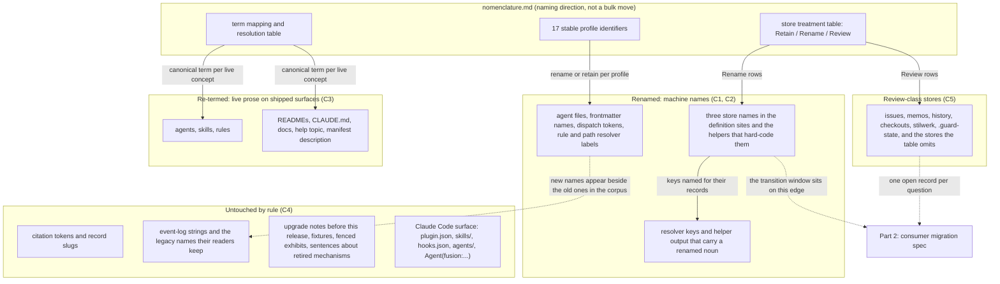

# Spec: Adapt the fusion plugin source to the PRIOR/Fusion nomenclature (part 1 of 2)

**Date:** 2026-09-22
**Status:** Decided (three questions ruled by the user on 2026-09-22; the defaults in the last section stand unless vetoed)
**Source:** Work item `260922-1038-prior-mapping.md`, Directive part (1): "spezifiziere und plane die fusion anpassungen an die neue nomenklatur". The authoritative input is `nomenclature.md` in the same container. Part (2), the migration tooling for consuming projects, is a separate spec; this one names the boundary and nothing past it.
**Cross-references:** 260922-1038-prior-mapping.md, nomenclature.md (this container), 260910-2145_*_does-the-container-store-keep-the-directory-name-circles.md, 260822-1154_*_does-a-cut-only-circle-re-baseline-the-surfaces-it-cuts.md, 260910-2256_*_may-the-growth-bounds-be-raised-for-the-duration-of-the-container-restoration.md, 260922-1059_*_is-a-record-in-issues-a-candidate-or-an-admitted-work-item.md, 260922-1059_*_what-becomes-of-memos-which-the-concept-has-no-type-for.md, 260922-1059_*_is-the-frozen-history-store-audit-evidence-or-typed-record-history.md, 260922-1059_*_is-the-checkout-registry-a-fusion-reference-or-a-prior-authority-source.md, 260922-1059_*_which-english-name-does-stilwerk-take-and-when.md, 260922-1059_*_does-guard-state-become-a-prior-runtime-record-or-go.md, 260922-1059_*_which-treatment-do-the-stores-and-root-files-the-nomenclature-table-omits-take.md
**Survey commit:** `9ff0f9fc`. Every count below was taken there with `grep -rEo` over the shipped surfaces and is stamped to that commit; the counting script is not shipped and the counts are evidence for scope, not acceptance figures.

## Directive

After this work the plugin source in this repository names its stores, its agent profiles and its concepts in the PRIOR/Fusion vocabulary that `nomenclature.md` defines: `work-packages/` where `circles/` stands, `plans/` and `consultations/` for the two other renamed stores, the stable profile identifiers for the renamed agents, and the canonical terms in every live sentence of the shipped text. What the nomenclature marks Retain stays; what it marks Review stays as it stands in this item, with the classification question filed rather than answered; and every surface that is Claude Code's rather than fusion's keeps its official term.

## Shape of the work

The diagram is a treatment map, not a dependency order. The one edge that is a genuine dependency is the dotted one from the store renames to part (2): the plugin reads both names during a bounded transition window (C9), which is what lets part (1) ship and be tested on its own while part (2) is built.

## The boundary with part (2)

Part (1), this spec, changes files in the plugin source: `agents/`, `skills/`, `rules/`, `bin/`, `hooks/`, `templates/`, `docs/`, the three READMEs, `CLAUDE.md`, `.claude-plugin/plugin.json`, `fusion.json`, `install.sh` and the shipped `stilwerk/` templates. Part (2) changes files in a consuming project's `fusion-workbench/`, its `CLAUDE.md` declarations and the citations in its records. No file under `fusion-workbench/` in this or any project moves under part (1), and this repository's own workbench is a consumer's workbench for that purpose. The one place the two parts touch is the transition window (C9): the plugin reads both store names from the release that ships the rename until the release that ends the window, and part (2)'s migration is what a consumer runs inside that window. A plugin that read only the new names could not be run against an unmigrated workbench, this repository's included, which is why the window exists.

## Capabilities

### C1: The three renamed stores are renamed in the plugin's definition sites and helpers

**Description:** Everything shipped that defines or hard-codes a store name says `work-packages/` for the container store, `plans/` for the planning store (in `shared/` and in every container alike, since a kind has one name), and `consultations/` for the consultation store. The user sees the new names in every resolver output, every helper message, every layout tree and every document.

Evidence of where the names live today (at `9ff0f9fc`): the executable definition `bin/fusion-paths:404` (`OUT_BACKLOG|SCAN_BACKLOG` → `circles`), `:384` (`OUT_PLAN` → `planning`), `:400` (`OUT_CONSULT` → `shared/consult`), and its second-argument check at `:302`-`:309`; `bin/fusion-claimed-item:231` printing `ITEM=circles/...` and `CONTAINER=circles/...`; the layout tree at `rules/fusion-workbench-conventions.md:27` and the clause at `:66` that keeps `circles/` by name; the third definition site `rules/workbench-path-resolution.md`; six `bin/` helpers carrying the literal (`fusion-paths` 9, `fusion-claimed-item` 4, `monitor` 2 as comment citations, `fusion-events`, `fusion-plan-size`, `fusion-staging-drift` 1 each); the hooks source at `hooks/lib/plan-size.ts:101` (walks `circles/<dir>/planning`), `hooks/lib/citation-scan.ts:1237` and `:1290` (`storePrefixed("circles/", ...)`) with the citation kinds `circle-record` and `circle-dir` declared at `:838`, `:875` and `:905`; and the lint's `TYPE_FOLDERS` list at `hooks/lib/__tests__/path-literal-lint.test.ts:35`-`:49`, which names `planning` and `consult`. Across the tree the literal `circles/` occurs 44 times in `skills/`, 10 in `rules/`, 19 in `bin/`, 32 in the hooks source, 81 in the hook tests, 11 in `docs/` and 13 in the READMEs; `planning/` 8, 2, 2, 5, 19, 2 and 10 on the same surfaces; `consult/` once each in `rules/`, `bin/` and the hooks source, 5 in the tests, 1 in `docs/`, 3 in the READMEs.

**Acceptance criteria:**
- [ ] `bin/fusion-paths <any agent>` run in a project whose workbench holds the new layout prints `SCAN_BACKLOG=work-packages`, `OUT_PLAN=…/plans`, `OUT_CONSULT=shared/consultations`, and no emitted value contains `circles`, `planning` or `consult`. In a workbench that still holds the legacy layout, every `OUT_*` value still names the new store, and the legacy one is reached only through the reads C9 defines.
- [ ] `bin/fusion-claimed-item` prints its two lines with `work-packages/` as the store segment and with key names that carry the work-package noun (exact spelling: planner, under naming rule 7 of `nomenclature.md`).
- [ ] The layout tree in `rules/fusion-workbench-conventions.md` `## fusion-workbench Layout` shows the three new names and no longer carries the clause that keeps `circles/` by name; the clause is replaced by one sentence citing the superseding decision (C6).
- [ ] `grep -rn 'circles/' agents skills rules bin hooks/*.ts hooks/lib/*.ts` returns only lines that C4 classifies as untouched (citation tokens, event-log strings, fenced exhibits, sentences about the retired Circle mechanism) plus the one definition site that carries the legacy read for the window (C9), and the plan lists every surviving line with its class.
- [ ] The path-literal lint (`hooks/lib/__tests__/path-literal-lint.test.ts`) fails on a `work-packages/`, `plans/` or `consultations/` literal in an agent prompt or a non-exempt skill body exactly as it fails on the old names today, and `npm test` in `hooks/` is green at the end of the work.
- [ ] The citation grammar reports a `work-packages/<dir>` token as `store-prefixed` with the same verdict it gives `circles/<dir>` today, and the two citation kinds named after the Circle carry names that no longer say `circle` (exact identifiers: planner).
- [ ] `/fusion:setup` and `/fusion:migrate`, the two skills allowed to name a superseded layout, name `circles/` as the layout they detect and convert, and no other skill body names it.

**Decisions made:**
- Store names inside a container follow the shared store's name: `plans/` in both places. The nomenclature table lists only `shared/` paths, and one kind with two names in two stores would be the drift `## fusion-workbench Layout` exists to prevent (default; the user may override).
- `forum/`, `discussions/`, `analyses/`, `reviews/`, `decisions/`, `investigations/` and `archive/` keep their names. The first two are absent from the nomenclature's table and are named as a gap in C5; the rest are marked Retain.
- The plugin reads the old names beside the new ones for a bounded window: ruled by the user on 2026-09-22, and specified as C9.

### C2: The agent files carry the stable profile identifiers

**Description:** Each agent whose current name differs from its nomenclature identifier is renamed, file and frontmatter and every reference: `shaper` → `requirements-designer`, `planner` → `implementation-planner`, `coder` → `code-implementer`, `ontocoder` → `data-implementer`, `reconciler` → `state-auditor`, `editor` → `document-editor`, `curator` → `policy-curator`. `orchestrator`, `consultant` and `analyst` already carry their identifier and stay. **`reviewer` stays one prompt under its current name**, parameterised by `**Review domain:**` as today, and `README-agents.md` `## The agents` records that it serves both nomenclature identifiers, `code-reviewer` and `data-reviewer`; the split belongs to the item that builds the Prior module's profile set (ruled by the user on 2026-09-22). The five identifiers that name no current agent (`explorer`, `plan-reviewer`, `work-planner`, `defect-fixer`, `work-package-manager`) are not created: this item renames and re-labels roles it has, and three of those five (`work-planner`, `defect-fixer`, `work-package-manager`) are the roles `taskplanner`, `bugfixer` and `playmaker` that v11 removed on measurement (`README-agents.md` `## The agents`, the "Five prompts went at v11" paragraph), so reintroducing any of them is a separate item with its own case.

The rename reaches every place an agent name is a key or a token, and the survey found these: the `case` labels in `bin/fusion-rules:225`-`:319` that map a name to its rule patterns and audience flags; the resolver's name namespace (`agents/<name>.md`, `bin/fusion-paths:160`); the dispatch tokens `fusion:<name>` (30 occurrences in the shipped text at `9ff0f9fc`, 10 of them `fusion:orchestrator`); the review filename's `<sender>` slot and `REVIEW_SENDERS` at `hooks/lib/review-coverage.ts:195`; `MARKER_WORDS` at `hooks/lib/citation-scan.ts:327` (`coder`, `ontocoder`, `planner` as words the marker slot may carry); `MEASURED_AGENTS` at `hooks/lib/events-query.ts:482`; the per-agent rows of `hooks/lib/__tests__/fixtures/rules-emission.golden` and `dispatch-path.baseline`, and the per-file `AGENT_BASELINE` map at `hooks/lib/__tests__/surface-growth-bound.test.ts:172`; the six registration surfaces `README-agents.md` `## Adding a new agent` lists, which the derivable-enumerations lint holds to the tree by count; `install.sh`'s launcher, which takes an agent argument and defaults to `orchestrator`; and the `fusion.json` `_retired` note, which names the `orchestrator` container.

**Acceptance criteria:**
- [ ] `ls agents/` lists exactly the seven renamed identifiers plus `orchestrator`, `consultant`, `analyst` and `reviewer`, eleven files, and each file's `name:` frontmatter equals its basename.
- [ ] The `reviewer` row of `README-agents.md` `## The agents` names `code-reviewer` and `data-reviewer` as the two identifiers the one prompt serves, selected by `**Review domain:**`, and no other shipped surface claims a split.
- [ ] `claude plugin validate .` passes, and `claude --plugin-dir . --agent fusion:<name> -p "reply SMOKE-OK"` answers for every renamed name (the release step already mandated in `README-agents.md` `## Releasing`, step 0).
- [ ] `bin/fusion-rules <new name>` and `bin/fusion-paths <new name>` exit 0 with the same emission and the same key set the old name produced at `9ff0f9fc`, and the old name exits 2 (unknown name).
- [ ] `grep -rEo 'fusion:(shaper|planner|coder|ontocoder|reconciler|editor|curator)\b' agents skills rules README*.md docs bin hooks` returns only lines C4 classifies as untouched.
- [ ] Every reader over a persisted corpus that filters by agent name (`MEASURED_AGENTS`, `REVIEW_SENDERS`, the review-file sender check, `bin/fusion-review-coverage`) accepts the new name and keeps every name it accepted before, so a range spanning the rename reports one continuous series rather than two.
- [ ] The count phrases the derivable-enumerations lint checks still agree with `agents/*.md`, and `npm test` is green.
- [ ] `fusion --update` followed by `fusion <new name>` starts the renamed agent through the installed launcher.

**Decisions made:**
- `reconciler` → `state-auditor` is a rename with the write scope unchanged. The nomenclature describes the auditor as changing nothing, while the reconciler renames state markers and appends reconciliation notes (`README-agents.md` `## The agents`, reconciler row). The mismatch is real and is filed as an open decision record in this container rather than resolved by narrowing the agent here (default; listed under pending for veto).
- The legacy agent names that the event log already holds (`coderev`, `ontorev`, `bugfixer`, `playmaker`, and the seven names being renamed) stay readable: a reader adds the new name and drops none, which is the pattern `REVIEW_SENDERS` already follows.
- The reviewer is not split: one prompt, one name, two identifiers recorded in the README (user, 2026-09-22, over the split that would have reversed the v11 merge and cost a second prompt on the `agents/` surface).

### C3: Live prose on every shipped surface uses the canonical terms

**Description:** A reader of any shipped document, prompt, rule, helper header or message meets the nomenclature's terms for fusion's live concepts and the Claude Code terms only where the sentence is about Claude Code's own mechanism. The rule is applied per sentence, and its cases are disjoint:

1. **A live fusion concept takes its canonical term.** Circle → work package (and `circles/` → `work-packages/` in prose that names the store); Circle record → work-package record; Directive → brief; Grounding → evidence base (the pair "Grounding-Stand / Grounding-Historie" at `rules/fusion-workbench-conventions.md:340` included); Turn → work round where a batch of work is meant; queue → work queue; artifact → artefact; a durable agent configuration → agent profile; Task or sub-agent execution → run or child run. **Fusion's own noun "work item" is renamed to "work package"** wherever it names the container and its record, because that is what the nomenclature calls a bounded unit with a brief and a completion state, and the nomenclature reserves "work item" for an admitted item inside a package, which fusion does not yet have. At `9ff0f9fc` "work item" stands 65 times in `agents/`, 42 in `skills/`, 44 in `rules/`, 16 in `bin/`, 36 in the READMEs and 2 in `CLAUDE.md`; "work-item" a further 23, 3, 13, 4, 18 and 1. The dispatch parameter `**Item:**` (10 occurrences in `agents/`, 3 in the READMEs) and the helper `bin/fusion-claimed-item` follow the noun (exact spellings: planner).
2. **Gate and Verdict are resolved by function, never swapped one for one.** Each live occurrence is classified against the nomenclature's "How to resolve the ambiguous legacy terms" table: a user authorising an action is an approval; tests or policy deciding a transition is a validation check or a named completion condition; a reviewer's assessment is a review result; the reconciler's three-edge Coherence reading is an audit result; a binding project choice is a decision. The capitalised forms stand 18 times in `agents/`, 16 in `rules/`, 9 in `docs/` (Gate) and 2, 2, 0 (Verdict); the lowercase forms are counted in the survey (103, 22, 61, 36, 52 and 79 for `gate` across `agents/`, `skills/`, `rules/`, `bin/`, `docs/` and the READMEs) and include the event-type strings and identifiers that case 3 of C4 freezes. The classification of each live instance is the planner's work; the acceptance test below is what it must satisfy.
3. **Plugin, skill, hook and subagent are retained only where the sentence is about the Claude Code mechanism.** "fusion is a Claude Code plugin", "`skills/<name>/SKILL.md` is where Claude Code reads a slash command", "the SessionStart hook" keep their words. "The plugin's rules", "the fourteen skills", "the shaper skill" become the module's rules, the fourteen workflows, and an agent profile or workflow as the nomenclature's Skill row directs. `plugin` stands 15 times in `agents/`, 32 in `skills/`, 18 in `rules/`, 68 in `bin/`, 81 in the READMEs, 8 in `CLAUDE.md` and 22 in `install.sh`; `skill`/`skills` 23, 74, 70, 66, 118, 11 and 1.
4. **British spelling** for artefact throughout the prose; the head label `**Artifact language:**` in `CLAUDE.md` is a declared compatibility surface in this item (see C4 and the pending defaults), read by `bin/fusion-rules` and two tests and carried by every consumer's `CLAUDE.md`.
5. **`Fusion` in prose, `fusion` in paths, namespaces and commands; `Prior`/`prior` likewise; `work package` in prose, `work-package` in machine names.** The rule is the nomenclature's own opening paragraph and is written once into `rules/user-facing-output.md` `## Vocabulary` in the form that binds the chat surface: the anti-pattern list there (and `L07` in both `stilwerk/chat-voice-*.yaml` templates) names the legacy nouns it bans, and those names move to the canonical ones so the ban keeps matching what the prompts now say.

**Acceptance criteria:**
- [ ] For each of Circle, Directive, Grounding, Turn, Artifact (the spelling), Plugin, Skill, Gate, Verdict: a `grep -rnw` over `agents skills rules bin hooks/*.ts hooks/lib/*.ts templates docs README*.md CLAUDE.md .claude-plugin install.sh stilwerk` returns only lines the plan has classified under C4's untouched cases, and the plan's classification lists each surviving line with its case.
- [ ] No live sentence on those surfaces uses `gate` or `verdict` as an unqualified noun for a fusion mechanism; every surviving instance is an event-type string, an identifier, a citation, a fenced exhibit, or a sentence about a retired mechanism.
- [ ] "work item" survives only in the nomenclature's own sense (an admitted item inside a package) or in a C4 case; the container and its record are "work package" and "work-package record" everywhere else.
- [ ] `rules/user-facing-output.md` `## Vocabulary` and the two shipped `chat-voice-*.yaml` templates ban the canonical nouns (work package, brief, evidence base, work round, approval, review result, artefact) in chat exactly as they ban the legacy ones today, and the legacy nouns stay in the ban list so a prompt that slips back is still caught.
- [ ] A reader who opens `README.md`, `README-agents.md`, `docs/philosophy.md` and `/fusion:help`'s output meets the same term for the same thing in all four (one name per thing), and the name is the canonical one.
- [ ] The `description` in `.claude-plugin/plugin.json` describes the module in the canonical terms and states the agent count that `ls agents/` gives.

**Decisions made:**
- "work item" → "work package" is applied (default; the alternative, keeping fusion's noun and letting it contradict the nomenclature's definition of the same words, was not offered because it leaves two meanings for one term on the always-on surface).
- Existing records in any workbench are not translated (`rules/fusion-workbench-conventions.md` `## Project language`, "Existing artifacts are not translated"): the rule reaches shipped text only.

### C4: What the rename does not touch, stated as a rule with disjoint cases

**Description:** Four classes of text keep their legacy words, and the plan classifies every surviving occurrence into exactly one of them.

1. **A citation token or a record slug.** A record is cited by its storeless basename with the marker wildcarded (`## Filename Patterns`), and the basename is what the lookup resolves. Slugs that carry `circle`, `directive`, `gate` or `verdict` (for example `260815-2109_*_may-a-circle-close-over-an-uncovered-review-range-and-who-decides.md`, cited in `README-agents.md` `## Releasing`) stay letter for letter; renaming one would kill every citation of it. The same holds for `circles/<dir>` inside a fenced exhibit, which the citation gate already treats as a datum rather than a pointer.
2. **A string persisted into a corpus, and the legacy names its readers keep.** `orchestrator-events.jsonl` is append-only across sessions and is the measurement corpus for at least one decision; `agents/orchestrator.md:447` already binds the string `Circle stop conditions` with the sentence "Do not modernise either string to match the section's new name", and the same reasoning covers the event types `gate_hit` and `gate_response` (15 occurrences in `agents/`), the `agent` field's values (the log in this repository holds `coder` 1302 times, `coderev` 166, `bugfixer` 32, `playmaker` 20 beside the live names), and the reader lists `MEASURED_AGENTS`, `REVIEW_SENDERS` and `MARKER_WORDS`. New names are added beside the old ones (C2); nothing is renamed in a corpus and nothing is dropped from a reader.
3. **Text that records history.** `docs/upgrading-to-v9.md` through `docs/upgrading-to-v11-4.md` describe releases as they were and keep their words (92 capitalised `Circle` in `docs/`, 88 of them in the upgrade notes); the v11 note tracks live v11 (`260921-1718_*_does-the-v11-upgrade-note-track-live-v11-behaviour-or-stay-frozen-at-v11-0-0.md`, option 1) and is closed by this release's own note rather than rewritten. A sentence in any live document that names a retired mechanism by the name it had ("the Phase-2 Turn loop went on 260910", "`bugfixer` was the one agent permitted to edit both", the `_retired` note in `fusion.json` naming a "Turn budget") keeps that name: history is evidence, and the term identifies what was removed. Test fixtures and goldens (`rules-emission.golden`, `surface-growth.golden`, `dispatch-path.baseline`) are regenerated or re-keyed by the instrument that owns them, never hand-edited for vocabulary.
4. **Claude Code's own surface.** `.claude-plugin/plugin.json` and its `name`, the marketplace entry, `hooks/hooks.json` and the `hooks/` directory as the mechanism that file wires, the `agents/` and `skills/` directories as the locations Claude Code reads, `Agent(fusion:<name>)` and `/fusion:<name>` as the dispatch and command syntax, `CLAUDE_PLUGIN_ROOT`, and `install.sh`'s marketplace steps. The nomenclature's Prior-terms section allows an external compatibility surface to retain its official term, and Claude Code's terms are plugin, skill, agent, hook and subagent. The fusion-owned names derived from that surface, `FUSION_PLUGIN_ROOT` (exported at `hooks/hooks.json:8`, read in every Setup) and `bin/fusion-plugin-cwd`, are kept in this item as part of the same surface (default; pending for veto), because they name the location of the Claude Code install and nothing in the nomenclature's tree corresponds to it yet.

**Acceptance criteria:**
- [ ] The plan carries one table of every legacy-word occurrence that survives on a shipped surface, each row naming `path:line` and one of the four classes, and no row names two classes.
- [ ] `bin/fusion-citation-check` reports the same dangling and store-prefixed counts over the shipped text before and after the work (a rename that broke a citation would raise the first).
- [ ] `bin/fusion-events` and `bin/fusion-review-coverage` run over a range that spans the rename and report one series per role, with no role split into an old-name and a new-name half.
- [ ] `docs/upgrading-to-v9.md` through `docs/upgrading-to-v11-4.md` are byte-identical before and after, and a new note `docs/upgrading-to-v12.md` (or whatever version the release takes, see pending) exists and is pointed at from `README.md` `## Install` and `/fusion:help`'s update topic.

### C5: The Review-class stores are kept as they stand and their classification is filed

**Description:** `issues/`, `memos/`, `history/`, `checkouts/`, `stilwerk/` and `.guard-state/` are marked Review in `nomenclature.md` `### Fusion workbench migration`: their records must be classified by meaning before any move, and the table says so in its closing sentence. In this item none of them changes name or content, and the plugin keeps reading and writing them where it does today. The open classification is filed rather than answered (ruled by the user on 2026-09-22): one open decision record per Review row in this container's decision store, and one more for what the table omits, seven records that part (2) closes or supersedes. The nomenclature's table omits stores and root-anchored surfaces the layout tree defines: `forum/`, `discussions/`, `orchestrator-events.jsonl`, `.commit-lock/`, `.cadence-anchors`, `.session-marker`, `.checkout-id`, `.asset-provenance` and the `monitor` binary. The runtime files are Prior's by the ownership boundary (sessions, runtime events, persistence), and the two stores are Fusion record kinds the concept has not named. The seventh record states that gap so the nomenclature's author can be asked, and nothing here names them.

The seven records, filed with this spec:

- `260922-1059_*_is-a-record-in-issues-a-candidate-or-an-admitted-work-item.md`
- `260922-1059_*_what-becomes-of-memos-which-the-concept-has-no-type-for.md`
- `260922-1059_*_is-the-frozen-history-store-audit-evidence-or-typed-record-history.md`
- `260922-1059_*_is-the-checkout-registry-a-fusion-reference-or-a-prior-authority-source.md`
- `260922-1059_*_which-english-name-does-stilwerk-take-and-when.md`
- `260922-1059_*_does-guard-state-become-a-prior-runtime-record-or-go.md`
- `260922-1059_*_which-treatment-do-the-stores-and-root-files-the-nomenclature-table-omits-take.md`

**Acceptance criteria:**
- [ ] After the work, `ls fusion-workbench/shared/` in a migrated project still lists `issues`, `memos`, `history`, `checkouts`, `forum`, `discussions`, and the workbench root still holds `stilwerk/` and `.guard-state/`, with every helper and hook reading them at the same path as before.
- [ ] The seven records above stand at `_o_` in this container until part (2)'s spec answers them, and each carries the table's question, its options, and the constraint that no move happens before the answer.
- [ ] The part (2) spec cites all seven by basename in its `**Cross-references:**` header.

**Decisions made:**
- File the classification as records now rather than leave it to part (2)'s spec (user, 2026-09-22): the question becomes citable, and the nomenclature's gap is reported rather than implied.

### C6: The `circles/` decision is superseded on the record

**Description:** `260910-2145_*_does-the-container-store-keep-the-directory-name-circles.md` stands at `_a_` with option 1, keep `circles/`, and its recommendation says the debt is "named rather than paid" so that "a later cleanup with a quiet tree can take option 2 as one commit". The nomenclature is that later ruling, with `work-packages/` where the record's option 2 said `work/`. The conventions require a new record that supersedes it rather than an edit back (`## State Markers — decisions`, `_a_` is not terminal but a reversal is a new record; the `Superseded by:` line and the `_s_` rename go on the old one). The old record's cost measurement (1414 tracked files in this repository, the `circle-dir` citation class, four helpers and the monitor) is the evidence the part (2) spec inherits.

**Acceptance criteria:**
- [ ] A new decision record in this container states the question, cites `nomenclature.md` as the ruling's source and the user as who ruled, and is at `_a_` once the user confirms it at the gate.
- [ ] The old record carries `Superseded by: <the new record's citation> — <reason>` and its marker reads `_s_`; the transition is performed by the orchestrator at the user's word, never by an executor.
- [ ] `rules/fusion-workbench-conventions.md` `## fusion-workbench Layout` cites the new record where it cited the old one.

### C7: The growth bounds are measured, and the file renames are re-keyed without moving a floor

**Description:** `README-hooks.md` `### Growth bounds on the shipped text` bounds `agents/*.md` and `skills/*/SKILL.md` in bytes and the hook tests in lines, each against a per-file baseline map keyed by filename (`AGENT_BASELINE`, `SKILL_BASELINE` at `hooks/lib/__tests__/surface-growth-bound.test.ts:172` and `:191`), and the per-dispatch-path bound in `hooks/lib/__tests__/fixtures/dispatch-path.baseline` is keyed by agent name at zero head-room. The work is **not byte-neutral by design**: the canonical terms are longer than some legacy ones ("work package" for "Circle", "validation check" for "gate", "workflow" for "skill") and shorter than others ("brief" for "Directive"), so the net is measured, not assumed. Two things follow.

First, growth above a bound is answered by a cut in the same surface, never by a baseline move or a head-room raise; that is the standing rule (`260822-1154_*`, option 1; `hooks/lib/__tests__/helpers/growth-bound.ts` `## Re-baselining`). The plan measures each bounded surface after the term pass and names the cut if one is needed; if no honest cut exists, the head-room question goes to the user as a separate ruling, the way `260910-2256_*` was asked.

Second, **a renamed file is a case the re-baselining rule does not name.** Renaming `agents/shaper.md` drops the `shaper.md` entry from the map (the floor falls by that file's baseline) and adds a file with no entry, which counts as growth in full: the same bytes read as a shrink and a growth at once. The defensible treatment is to **re-key** the entry, the new filename with the old figure, in the same commit as the rename, for `AGENT_BASELINE`, the eleven rows of `dispatch-path.baseline` and the per-agent blocks of `rules-emission.golden`. A re-key moves no figure, so it is none of the three floor-moving events and not a head-room raise; but the rule's heading says the count of events is meant literally, so the treatment is written into that rule as a named non-event rather than left implicit (default; pending for the user's confirmation).

**Acceptance criteria:**
- [ ] `npm test` in `hooks/` is green at the last commit of the work, with no baseline figure changed and no head-room constant raised, or with a head-room raise the user ruled and the section's log records.
- [ ] Every baseline entry keyed by a renamed file carries the new key and the figure it carried under the old one, in the commit that renames the file, and `README-hooks.md` `### Growth bounds on the shipped text` records the re-key as a named treatment that moves no floor.
- [ ] The plan states, per bounded surface, the byte or line delta the term pass produced and where any cut was taken.

### C8: The documentation and release surfaces are coherent in the new vocabulary

**Description:** The release that ships the rename is a breaking one for every consumer (a store rename is a layout change, the kind `/fusion:setup` refuses when it detects one), so it takes a major version and a migration note, and every surface the release keeps coherent (`README-agents.md` `## Releasing`) reads in the new vocabulary: the agent roster in `README-agents.md` `## The agents` and its count bullets, `CLAUDE.md` `## Layout`, `README.md`'s opening paragraph, `/fusion:help`'s update topic (last three releases, this one on top), the `plugin.json` description, and `docs/philosophy.md` and `docs/working-model.md` where they describe live mechanisms.

**Acceptance criteria:**
- [ ] `.claude-plugin/plugin.json` `version` is bumped to the major the user chooses (default `12.0.0`, pending), and a `docs/upgrading-to-v<N>.md` names every renamed store, agent and dispatch parameter, tells a consumer that part (2)'s migration is run inside the window (C9), and says what a consumer sees if it updates without migrating.
- [ ] `/fusion:help` update topic carries this release on top and drops the oldest of its three.
- [ ] `README-agents.md` `## Dispatch parameters` lists the renamed parameter lines, and every agent that reads one parses the new spelling and no longer parses the old.
- [ ] Every count phrase the derivable-enumerations lint checks agrees with the tree.

### C9: A bounded transition window, during which the plugin reads both store names and writes only the new ones

**Description:** From the release that ships the rename (the major in C8, default `12.0.0`) until the release that ends the window, every read the plugin performs over a workbench finds a record whether it sits under the legacy name or the new one: the claim scan, every `SCAN_*` store pair, the hooks that walk stores (`plan-size`, `staging-drift`, `review-coverage`, the citation corpus), `bin/monitor`, `/fusion:cadence` and `/fusion:archive`. Every write lands under the new name only. A consumer therefore updates the plugin first and runs part (2)'s migration at any point inside the window; a workbench that has not migrated works, with the one visible consequence that new records land beside the legacy store rather than inside it until the migration folds the two. `/fusion:setup` reports a legacy store it finds and names `/fusion:migrate` as the way to fold it, and does not refuse, since a workbench of either shape is readable throughout the window.

**The window's end is a release, named here: the next major after the one that ships the rename** (default `13.0.0`; the number is a pending default, the rule is not). That release removes the legacy read everywhere it was added, and from it on `/fusion:setup` refuses a legacy store the way it refuses a pre-v4 layout today. The end is written into three places that a later reader meets: the migration note of the shipping release (C8), the definition site that carries the legacy read (`rules/fusion-workbench-conventions.md` `## fusion-workbench Layout`, which already carries the two absent-on-purpose legacy stores as a pattern), and `/fusion:help`'s update topic. Nothing detects an unclosed window, exactly as nothing detects a raised head-room, so the closing release carries the removal as its own named step in `README-agents.md` `## Releasing`.

**Two costs are accepted with the ruling.** The single resolution point (`## Path Resolution`) holds a second name for one store for the window's duration, and the citation grammar accepts both prefixes for `store-prefixed`; both are removed at the closing release. And the bytes of the legacy read are paid twice on the bounded surfaces, once added and once cut, which C7 measures rather than assumes.

**Acceptance criteria:**
- [ ] In a workbench that holds only the legacy layout, `bin/fusion-claimed-item` finds this checkout's claimed record, every `SCAN_*` value resolves to a directory that exists or is read through the legacy name, and `bin/fusion-paths` exits 0.
- [ ] In the same workbench, a record written by any agent lands under `work-packages/`, `plans/` or `consultations/` and never under the legacy name; `git status` after one dispatch shows no new file under `circles/`, `planning/` or `consult/`.
- [ ] In a workbench that holds both names side by side (the state between plugin update and migration), a citation of a record under either resolves, `bin/fusion-citation-check` reports the same counts as over the migrated form, and `bin/fusion-events` and `bin/monitor` show every work package once.
- [ ] `/fusion:setup` in a legacy workbench prints one line naming the legacy store and `/fusion:migrate`, and continues.
- [ ] The closing release is named, as a version, in `docs/upgrading-to-v<N>.md`, in `rules/fusion-workbench-conventions.md` `## fusion-workbench Layout` and in `README-agents.md` `## Releasing`, and the three agree.
- [ ] The legacy read is a single mechanism (one table or one branch, the planner's choice) that a grep for the legacy store name finds at one definition site, so its removal at the closing release is one commit.

**Decisions made:**
- Bounded window over hard cut-over and over a permanent alias (user, 2026-09-22): the nomenclature requires compatibility readers to be designed before files migrate, part (1) becomes shippable and testable in this repository on its own, and two checkouts of one project can straddle the release. The permanent alias stays rejected on the reasoning of `260910-2145_*_does-the-container-store-keep-the-directory-name-circles.md`, option 3.

## Stops when

- If the measurement C7 takes after the term pass shows a bounded surface over its head-room and the plan can name no cut in that surface that removes only the growth this work added, the work stops at that surface and the head-room question goes to the user as its own ruling; it does not proceed on a baseline move.
- If `claude plugin validate .` or the smoke run in C2 fails for a renamed agent because Claude Code rejects a hyphenated agent name or the `fusion:<name>` token for it, the work stops before any further rename and the naming question goes back to the user with the error, since every identifier in the nomenclature is hyphenated.
- If the plan's classification pass (C4) finds a persisted corpus, a reader, or a citation form this spec did not list, and renaming its words would split or break it, that surface joins the untouched table and the finding is reported rather than renamed through.
- If the legacy read of C9 cannot be kept to one definition site (the plan finds a consumer of a store name that has no path to the resolver and must carry its own branch), the work stops at that consumer and reports it, because a window spread over several sites is one nobody closes in one commit.

## Constraints

- This repository is the plugin source; nothing in this item moves a file under `fusion-workbench/` here or in any project. The nomenclature's table "defines naming direction, not an authorised bulk move", and the item record binds both specs to that sentence.
- No agent files, claims, closes or edits the work item; the spec and the seven decision records are the only outputs of this dispatch.
- The store-directory path-literal lint keeps its shape: agent prompts and non-exempt skill bodies resolve every store through `bin/fusion-paths`, and `/fusion:setup` and `/fusion:migrate` stay the only two skills that may name a superseded layout.
- A citation is never rewritten for vocabulary; the corpus at `9ff0f9fc` (2 235 marker-normalised basenames, 0 collisions) stays resolvable at every citing line.
- Shipped text is English whatever the project declares (`## Project language`, the exempt-surface case); the nomenclature adds British spelling for artefact.
- The one-release-behind pin: a helper renamed in a session is absent from `$FUSION_PLUGIN_ROOT` until `fusion --update`, so every guarded call site takes its miss branch for that session, and an agent renamed in a session cannot be dispatched by name in the same session (`README-agents.md` `## Releasing`, the two-session shape). The plan sequences proof runs accordingly.
- The event log's strings and the readers' legacy names are held (C4 case 2), so the measurement decisions resting on them stay valid.
- The transition window is bounded and its end is a named release (C9); the legacy read lives at one definition site and is removed there. No release inside the window writes a legacy store name.
- The reviewer stays one prompt named `reviewer` (C2); no shipped surface introduces `code-reviewer` or `data-reviewer` as a dispatchable name in this item.
- The six Review-class stores and the surfaces the table omits change neither name nor content in this item (C5); the seven decision records are their only output here.

## Out of Scope

- Part (2): moving, renaming or reclassifying anything in a consumer's `fusion-workbench/`, rewriting citations in records, migrating `CLAUDE.md` declarations, and the closing release's removal of the legacy read is part (1)'s successor release, not this item's implementation.
- Creating `explorer`, `plan-reviewer`, `work-planner`, `defect-fixer` or `work-package-manager`, or any of the Fusion concepts the nomenclature defines and fusion does not have (campaign, candidate register, disposition, agreement, realignment as a record type, the work-item lifecycle states).
- Adopting the state-name families in `nomenclature.md` `## State-name boundaries`: the work-package record keeps its five `**Status:**` values and the marker vocabularies stay.
- Changing what any agent does: every rename keeps the prompt's scope, reads and writes as they stand, the reconciler's write scope included.
- Building the Prior module tree (`modules/fusion/`, `schemas/`, `.prior/project.yaml`): the plugin stays a Claude Code plugin in shape.
- Renaming `fusion-workbench/` itself (Retain), `archive/` (Retain), or the root-anchored runtime files.
- The workbench of this repository, including the 24 legacy Circle containers and their records, which stay exactly as they stand until part (2) runs here.

## Open for Planner

- The exact key names and helper output keys that carry the work-package noun (`OUT_BACKLOG`/`SCAN_BACKLOG`, `ITEM=`/`CONTAINER=`, `bin/fusion-claimed-item`, `bin/fusion-work-order`) and the renamed spelling of the `**Item:**` dispatch parameter, under naming rules 6 and 7 of `nomenclature.md`.
- The identifiers that replace the citation kinds `circle-record` and `circle-dir`, and whether the corpus type's legacy record form (`circles/<dir>/_<marker>_circle.md`) keeps a distinct kind.
- The order of the renames against the two-session pin, and which proof runs go headless (`claude --plugin-dir . --agent fusion:<name>`).
- Per-occurrence classification of `Gate`/`Verdict` and of `plugin`/`skill` by function and by subject (C3 cases 2 and 3), and the surviving-occurrence table (C4).
- Whether the growth-bound re-key (C7) is implemented as a map edit or as a rename-aware instrument; the spec only fixes that no figure moves.
- How the legacy read of C9 is expressed: one table keyed by layout version in the single definition site, or a fallback branch there, provided the single-resolution-point principle in `## Path Resolution` holds and the removal is one commit.
- The shape and wording of `docs/upgrading-to-v<N>.md`, within C8's acceptance criteria.

## User Decisions Pending

The three questions that shaped this spec were ruled by the user on 2026-09-22, each on the recommended option, and now stand in the body: the bounded transition window (C9), the reviewer kept as one prompt (C2), and the seven decision records for the Review-class stores (C5). What remains here are the defaults this spec took; each stands unless the user vetoes it.

- [ ] Fusion's noun "work item" becomes "work package" for the container and its record (C3, case 1), and the `**Item:**` dispatch parameter and `bin/fusion-claimed-item` follow the noun.
- [ ] `reconciler` → `state-auditor` keeps the reconciler's write scope; the auditor-changes-nothing mismatch is filed as an open decision record for a later item (C2).
- [ ] `FUSION_PLUGIN_ROOT`, `bin/fusion-plugin-cwd` and the head label `**Artifact language:**` are treated as compatibility surfaces in this item and keep their spelling (C4 case 4, C3 case 4); renaming the label is part (2)'s, since every consumer's `CLAUDE.md` carries it.
- [ ] The event log's vocabulary (`gate_hit`, `gate_response`, `Circle stop conditions`, the `agent` values) is untouched, and readers add the new agent names beside the old (C4 case 2).
- [ ] The renamed agent files are re-keyed in every baseline map with their old figures, and the treatment is written into the growth-bound rule as a named non-event (C7).
- [ ] The release is a major version, `12.0.0`, with `docs/upgrading-to-v12.md` (C8), and the window closes at the next major, `13.0.0` (C9); the rule that the window ends at a named release is decided, the two numbers are defaults.
- [ ] `plans/` is the planning store's name inside a container as well as under `shared/` (C1).
- [ ] The five nomenclature roles fusion does not have are not created (C2).
