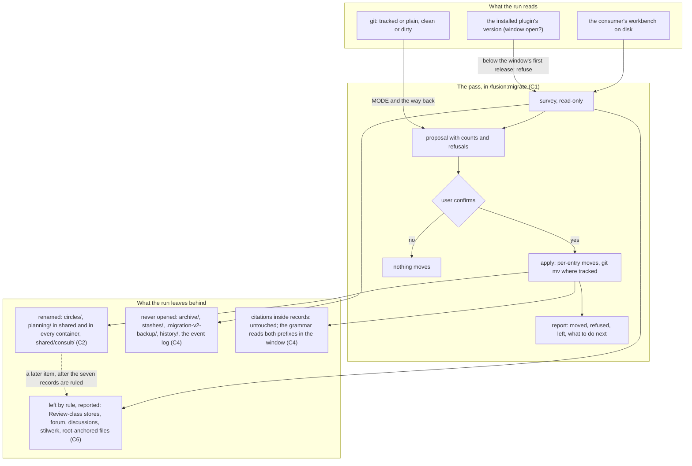

# Spec: Migrate a consuming project's workbench to the PRIOR/Fusion store names (part 2 of 2)

**Date:** 2026-09-22
**Status:** Decided (two questions ruled by the user on 2026-09-22; the defaults in the last section stand unless vetoed)
**Source:** Work item `260922-1038-prior-mapping.md`, Directive part (2): "spezifiziere und plane die migrationstools, so dass consumer an die neue nomenklatur angepasst werden können". The authoritative input is `nomenclature.md` in this container, above all `### Fusion workbench migration` and its closing sentence, and `## Naming rules for new work` rule 8. Part (1), the plugin source, is `260922-1045_*_spec-prior-nomenclature-plugin-source.md` in the same container; this spec builds on its rulings and names the boundary.
**Cross-references:** 260922-1038-prior-mapping.md, nomenclature.md (this container), 260922-1045_*_spec-prior-nomenclature-plugin-source.md, 260922-1059_*_is-a-record-in-issues-a-candidate-or-an-admitted-work-item.md, 260922-1059_*_what-becomes-of-memos-which-the-concept-has-no-type-for.md, 260922-1059_*_is-the-frozen-history-store-audit-evidence-or-typed-record-history.md, 260922-1059_*_is-the-checkout-registry-a-fusion-reference-or-a-prior-authority-source.md, 260922-1059_*_which-english-name-does-stilwerk-take-and-when.md, 260922-1059_*_does-guard-state-become-a-prior-runtime-record-or-go.md, 260922-1059_*_which-treatment-do-the-stores-and-root-files-the-nomenclature-table-omits-take.md, 260910-2145_*_does-the-container-store-keep-the-directory-name-circles.md, 260830-1816_*_do-the-frozen-stores-enter-the-sweeps-and-the-checkers-corpus-the-way-the-live-tree-does.md, 260830-1842_*_may-the-grammar-resolve-a-bracket-marked-record-that-a-frozen-store-keeps-permanently.md, 260830-1841_*_where-may-a-store-prefixed-citation-begin-and-which-rooting-forms-does-the-grammar-name.md
**Survey commit:** `6420c14e`, working tree of 2026-09-22 11:03. Every count below names the command that produced it, and the counts are evidence for scope, not acceptance figures.

## Directive

After this work a consuming project runs one command inside the transition window part (1) opens, sees what would move, confirms, and its workbench then carries the three renamed stores (`work-packages/`, `plans/`, `consultations/`) with every file where the plugin at that release expects it, its git history following each file. Nothing the nomenclature marks Review moves, nothing frozen is opened, no record's text is rewritten, and a second checkout of the same project needs nothing beyond a pull.

## Shape of the work

The diagram is the one run's flow, not a dependency order. The dotted edge is the only forward reference: the Review-class stores get their own pass in a later item once the seven decision records are ruled, and this tool is shaped so that pass is a further survey/propose/confirm/apply cycle rather than a redesign.

## The boundary with part (1)

Part (1) changes what the plugin *says and reads*; part (2) changes what a consumer's workbench *is*. Both are implemented in this repository, because the migration is a skill body and a skill body is plugin source, so the boundary runs by subject and not by repository.

Part (1) ships, and this spec relies on without restating: the three new store names in every definition site and helper (its C1); a plugin that reads both the old and the new store names and writes only the new ones from release `12.0.0` until a named later release, `13.0.0` by default (its C9); a citation grammar that reports `work-packages/<dir>` as store-prefixed the way it reports `circles/<dir>` today and resolves a basename wherever it sits; and `/fusion:setup` and `/fusion:migrate` as the two skills that may name a superseded layout literally. Part (1) also hands two items across explicitly: the head label `**Artifact language:**` in a consumer's `CLAUDE.md`, and the seven open decision records for the Review-class stores and the stores the nomenclature's table omits. Both are answered below (C4 and C6).

Part (2), this spec: the migration pass itself (where it lives, what it moves, what it refuses, how it reports), what happens to every surface that carries a store path, the multi-checkout procedure, and the first run on this repository's own workbench. Nothing here changes a helper's output, a rule's wording or an agent's vocabulary: where the tool needs the plugin to behave a certain way (a reader accepting both spellings, a probe not firing during the window), the requirement is stated here as a constraint on part (1) and cited, not built here twice.

**One seam runs through `skills/setup/SKILL.md`, and the two parts each own one side of it.** Setup's superseded-format check carries four probes today (`skills/setup/SKILL.md:40`-`:43`: root type folders, a flat markered `circles/*.md`, a bracket-marked filename, a live `_a_`/`_t_` Circle record), each matching only what `/fusion:migrate` can remove. Part (1) adds the fifth, the legacy store names, which reports and continues inside the window and refuses after it (its C1 acceptance, "name `circles/` as the layout they detect", and its C9). Part (2) **removes the four**, in the same commit that removes the passes they route to (C10 below): a probe that routes to a conversion the skill no longer performs "refuses Setup permanently and routes the user to a migration that reports nothing to do", which is the failure setup's own Probe 3 bullet names. `EXEMPT_SKILLS` in the path-literal lint stays `setup` and `migrate` and is nobody's to change: both bodies still name `circles/` after the work, setup for the fifth probe and migrate for the store-name pass; the comment beside the set that explains the exemption by the pre-v4 layout is reworded by the planner of part (2) when the passes go.

## What exists already, and what the survey found

`skills/migrate/SKILL.md` (39 701 bytes at the working tree, `wc -c`) is the current migration: pre-v4 root type folders into `shared/`, the three review folders merged, a flat `circles/*.md` file into a container, a live `_a_`/`_t_` Circle record into its container's item record, bracket markers into the underscore form. Its shape is survey → propose → confirm → apply → report; detection is by artifact presence and never by version (its Step 2, first paragraph); a detector may only look for what the executor removes, which is its idempotency guarantee; a destination that exists means the source stays (`move_one`); moves are `git mv` where the workbench is tracked and `mv` otherwise, with `MODE` said out loud; it never commits. `CLAUDE.md` `## Conventions` names it as the only consumer allowed to name a superseded layout literally, enumerated with `/fusion:setup` in `EXEMPT_SKILLS` at `hooks/lib/__tests__/path-literal-lint.test.ts:44`. Part (1)'s C1 acceptance criteria already require that these two skills, and no other, name `circles/` as the layout they detect and refuse or convert.

Where a store path is persisted or read, measured at `6420c14e` (the grep commands are in the survey the planner inherits; the figures here are the ones the treatment table in C4 rests on):

- Every `**Active spec/plan:**` value in every work-item record is a bare basename: 32 value lines over `fusion-workbench/circles/*/*.md`, 0 carrying `planning/`, `shared/` or `circles/`, one reading `(none yet)`. `**Cross-references:**` likewise (9 files, all basenames).
- `bin/fusion-claimed-item` prints `ITEM=circles/…` and `CONTAINER=circles/…` to stdout (`bin/fusion-claimed-item:231`), read by `bin/fusion-paths:340` and `bin/fusion-rules:498` at run time; nothing persists the lines.
- `.fusion-setup` (JSON: timestamp, version, per-check dates), `.cadence-anchors` (three `KEY=<commit>` lines), `.asset-provenance` (five lines, all `stilwerk/*` and `monitor`), `.checkout-id`, `.session-marker` and `shared/checkouts/*.md` (2 files) carry no store path at all.
- `.guard-state/citation-form.json:2` and `.guard-state/staging-drift.json:3` carry `circles/…` paths in their `reported` strings; both are class L throttle records rewritten by the hooks each session (`rules/workbench-tracking.md` `## The four classes`).
- `orchestrator-events.jsonl`: 4 546 rows, 82 with `circles/`, 43 with `planning/`, 77 with `shared/`, always inside `detail` (`grep -c` per pattern). Class R2, append-only, `merge=union`.
- `shared/forum/`: 3 entries, 0 store paths. `.gitattributes`: one line, the event log's merge driver. `.gitignore`: 10 `fusion-workbench/` lines (`:89`-`:105`), all class L exclusions, no negation line naming a store; `/fusion:check`'s `gitignore` selector writes negations only for `orchestrator-events.jsonl`, `.fusion-setup` and `.asset-provenance` (`skills/check/SKILL.md:257`).
- Store-prefixed citations inside records: `grep -rEn '(shared|circles)/[a-z-]+/[0-9]{6}-[0-9]{4}' fusion-workbench --include='*.md'` gives 542 lines in 217 files; 38 of the files are under `archive/`, 100 under a `history/` directory, 79 are live. Every one is already a `store-prefixed` violation to the grammar (`hooks/lib/citation-scan.ts:1240`, `:1293`), and `bin/fusion-citation-sweep` is the existing hand-run rewriter for them.
- `archive/`: 4 sweeps; the earliest holds `circles/<dir>/planning/` and `shared/planning/` subtrees, the others `shared/planning/` and a `shared/backlog/`. `stashes/` and `.migration-v2-backup/` are absent here and may exist in an older consumer's workbench.
- This workbench: 37 containers, 34 with a `planning/` directory, 18 empty per-kind directories under containers (git tracks none of them), 1 606 files under `circles/` of which 11 are untracked, 8 files under `shared/planning/`, 2 under `shared/consult/`; 2 976 tracked files under `fusion-workbench/` in all. One item is claimed by this checkout.
- The skill surface's growth bound: the skill bodies total 227 974 bytes against a budget of 228 028 (floor 188 768 from the map at `hooks/lib/__tests__/surface-growth-bound.test.ts:191`-`:210` plus `SKILL_HEAD_ROOM` 39 260 at `:278`), so 54 bytes of head-room remain at the working tree; `npx vitest run lib/__tests__/surface-growth-bound.test.ts` is green there. `skills/migrate/SKILL.md` alone stands 13 081 bytes above its own baseline entry.

## Capabilities

### C1: The store-name migration is a pass of `/fusion:migrate`, not a second skill

**Description:** The user runs `/fusion:migrate` and it brings the workbench to the current format, which from `12.0.0` on includes the three store names. Extending the existing skill is what the evidence decides: its description is "bring a fusion workbench to the current format", its four-step shape and its guardrails are exactly the ones this work needs, the two-skill exemption in the path-literal lint is a closed enumeration a third skill would have to widen, and part (1) already binds `/fusion:setup` and `/fusion:migrate` as the two bodies that name the superseded `circles/`. A separate skill would be a second mechanism for one job (`rules/critical-stance.md` §2) and would count in full against the skill surface's bound, since it has no baseline entry.

What the evidence did not decide is what becomes of the passes the skill carries today, and the user ruled it: they go (C10). The skill surface has 54 bytes of head-room, so a new pass is paid for by a cut of its own size on the same surface, and the cut is the pre-v4 conversion inside this very skill.

**Acceptance criteria:**
- [ ] `ls -1d skills/*/` after the work lists no new directory: the store-name migration is reached through `/fusion:migrate` and through nothing else.
- [ ] `EXEMPT_SKILLS` in `hooks/lib/__tests__/path-literal-lint.test.ts` still holds exactly `setup` and `migrate`, and `npm test` in `hooks/` is green with the skill surface within its bound and no baseline figure or head-room constant changed (`README-hooks.md` `### Growth bounds on the shipped text`).
- [ ] On a workbench already in the `12.0.0` format the skill surveys, finds nothing, and stops without a question (the existing idempotency rule, unchanged).
- [ ] The skill's description line and `README-agents.md`'s skill row say the store-name pass and nothing else, with no conversion promised that the body no longer carries.

**Decisions made:**
- Extend `/fusion:migrate` (decided by the evidence above; not re-asked).
- The pre-v4 passes leave the skill at `12.0.0` (user, 2026-09-22; C10).

### C2: The rename set, and everything the pass does not rename

**Description:** The pass renames exactly the three stores the nomenclature marks Rename, at every place the layout puts them:

| From | To | Where |
|---|---|---|
| `circles/` | `work-packages/` | the workbench root |
| `planning/` | `plans/` | `shared/planning/` and `<container>/planning/` in every container (part (1) C1: one kind, one name in both stores) |
| `shared/consult/` | `shared/consultations/` | the workbench root |

A container directory keeps its own name (`YYMMDD-HHMM-<slug>`), and every file inside it keeps its basename: the rename touches directory names only, so every citation, which is a storeless basename (`rules/fusion-workbench-conventions.md` `## Filename Patterns`), resolves after the move exactly as before.

The pass does **not** rename, and says so in its survey and its report:

1. **`archive/` and its contents.** A sweep froze its subtrees under the names they had (`circles/`, `planning/`), and frozen content is not live content (`## fusion-workbench Layout`, the two-legacy-stores paragraph); the bracket-to-underscore reformat left the archive alone on the same reasoning (`skills/setup/SKILL.md` Probe 3 bullet), the grammar reads the frozen stores as they are (`260830-1816_*`, implemented at `32fe0d49`), and a bracket-marked record kept permanently by a frozen store is a deferred question rather than a rename (`260830-1842_*`). Sweeps made after the migration carry the new names, so the archive holds both shapes from then on, which is what "frozen" means. Consequence for part (1), stated as a constraint below: the citation index walks both `circles` and `work-packages` under `archive/<sweep>/` permanently, not only for the window.
2. **`stashes/` and `.migration-v2-backup/`.** Frozen since 2026-08-15 and v2.5; nothing shipped writes to them and the layout tree names them only to keep consumers out.
3. **The root-anchored surfaces.** `orchestrator-events.jsonl`, `.guard-state/`, `.commit-lock/`, `.cadence-anchors`, `.session-marker`, `.checkout-id`, `.asset-provenance`, `.fusion-setup`, `monitor`: bound to fixed paths by consumers with no fallback ("not negotiable", `## fusion-workbench Layout`), and the seven the nomenclature omits are an open record (C6).
4. **`stilwerk/`** and the six Review-class stores (C6), and the two record stores the table omits, `forum/` and `discussions/`.
5. **Every file's basename.** A `_c_circle.md` record inside a legacy container (24 such containers here) stays as it is: it is terminal, and the existing skill never opens one.

**Acceptance criteria:**
- [ ] After a confirmed run on a workbench in the `11.x` format, `ls fusion-workbench/` shows `work-packages/` and no `circles/`; `ls fusion-workbench/shared/` shows `plans/` and `consultations/` and neither `planning/` nor `consult/`; and `find fusion-workbench/work-packages -mindepth 2 -maxdepth 2 -type d -name planning` is empty while every container that had a `planning/` has a `plans/` with the same entries.
- [ ] `find fusion-workbench -type f | sed 's#.*/##' | sort` is identical before and after the run (no basename created, dropped or changed), and `find fusion-workbench/archive fusion-workbench/stashes fusion-workbench/.migration-v2-backup` (where present) is byte-for-byte the same listing before and after.
- [ ] `git status --porcelain fusion-workbench` after a run on a tracked workbench shows only renames (`R`) for tracked entries and no deletion (`D`) of any file; `git log --follow` on any moved file reaches its pre-migration history.
- [ ] Every root-anchored surface, `stilwerk/`, the Review-class stores, `forum/` and `discussions/` have the same path and the same content after the run as before.
- [ ] `bin/fusion-citation-check` run before and after the migration reports the same `dangling` count; a rise is a defect of the pass.

**Decisions made:**
- `archive/` contents stay frozen under their old inner names (default, pending veto; the alternative, renaming inside every sweep so the archive has one shape, is one-way over 609 tracked files here and contradicts every precedent the frozen stores carry).
- The container-level `planning/` follows the shared store to `plans/` (part (1) C1's default, followed).

### C3: Survey, propose, confirm, apply, report; idempotent, refusing, never overwriting

**Description:** The pass takes the existing skill's shape and its counter discipline unchanged, and adds its own detector and its own move list.

**Detection** is by artifact presence: a `circles/` directory at the workbench root, a `planning/` directory under `shared/` or directly inside a container, or a `shared/consult/` directory. Each is something the executor removes, so a failed or refused move leaves the detector firing on the next run and the filesystem stays the only state (the skill's Step 2 rule). The `plugin_version` in `.fusion-setup` is not the detector.

**Version guard.** The pass runs only when the installed plugin, the one `$FUSION_PLUGIN_ROOT` names, is at or above the release that opens the window (`12.0.0`), read from that copy's `.claude-plugin/plugin.json`. Below it, the helpers every agent runs at Setup resolve only `circles/`, so a migrated workbench would make every `OUT_*` and `SCAN_*` point at a directory that no longer exists; the pass refuses with one line naming the installed version and the required one, and tells the user to run `fusion --update` and restart. This case is reachable in this repository specifically, where a skill body is opened from the work tree while the helpers come from the installed copy (`README-agents.md` `## Releasing`, the two-session shape). Above the window's end the pass still runs: a consumer that skipped releases arrives with the old layout, and the plugin then reads only the new names, so the migration is the only way in (C8).

**Survey (read-only)** prints, per rename, the source, the destination and the entry count; the containers whose `planning/` moves; empty directories (git tracks none, so they move by plain `mv`, counted separately); untracked entries under a tracked workbench (moved by `mv`, not in the diff, counted as today's `mv-fallbacks`); every collision, meaning an entry whose destination path already exists (the same container name under both `circles/` and `work-packages/`, the same basename under both `planning/` and `plans/` of one container), which is refused entry by entry and left for the user. A destination *directory* that already exists is not a collision but the ordinary side-by-side state part (1)'s C9 describes, where the plugin has been writing new records under the new name since the update: the pass folds the legacy entries into it one by one; the Review-class stores and root surfaces it leaves, each with the record that owns its question (C6); the `MODE` (`git` or `plain`); and, in `git` mode, whether any uncommitted change touches a path the pass would move, which is a refusal (below).

**Refusals** are three, and each names what the user does: the installed plugin is below the window; a path the pass would move carries an uncommitted change in `git` mode (`git status --porcelain` over `circles/`, `shared/planning/`, `shared/consult/` is non-empty, untracked entries excepted, because a rename over a modified file mixes the migration's diff with work in flight and leaves no clean revert; the user commits or stashes first); a collision as defined above (the user decides which side is real).

**Confirmation** is one `AskUserQuestion` in the project's chat language with the survey above it, three options at most: convert as listed, cancel, and, in `git` mode with untracked entries, convert the tracked entries only and leave the untracked ones named. Nothing moves before the answer.

**Apply** moves entry by entry into a destination it creates, never a directory over a directory (the existing skill's reason: `git mv dir shared/dir` nests when the destination exists), then removes the drained source with `rmdir` and reports a source that would not drain. Tracked entries go by `git mv`, untracked and empty ones by `mv`, and both counts are printed. Order: `shared/consult/` → `shared/consultations/`, `shared/planning/` → `shared/plans/`, each container's `planning/` → `plans/` inside `circles/`, and last `circles/` → `work-packages/` as one rename of the store directory. Doing the container-level renames before the store rename keeps every intermediate state one the detector recognises, so an interruption between two steps is resumed by the next run rather than repaired by hand. The pass runs no `git add` and no `git commit`; the user commits the migration as one commit, which is the revert point.

**Report** prints the counters (`moved`, `mv-fallbacks`, `collisions`, `left`), the list of what was left by rule with its record, and what to do next: commit the migration as its own commit and push it (C7); run `/fusion:setup`; and optionally run `bin/fusion-citation-sweep --dry-run`, which is the existing hand-run tool for the store-prefixed citations the migration deliberately did not touch (C4). In `plain` mode it says that the move appears in no diff and has no `git revert`.

**Rollback** is `git revert` of the migration commit in `git` mode, which reverses every `git mv`; the `mv`-moved untracked entries are named in the report so the user can move them back by hand. In `plain` mode there is no rollback and the confirmation says so before the user answers.

**Acceptance criteria:**
- [ ] Running the pass twice in a row on any workbench: the second run reports nothing to do and asks nothing.
- [ ] A run interrupted after any single move, then re-run, reaches the same end state as an uninterrupted run, with no entry duplicated or lost (`find … -type f | sed 's#.*/##' | sort` identical to the pre-migration listing).
- [ ] On a workbench where `work-packages/` already exists beside `circles/` with one colliding container name, the colliding container is refused and named, every other entry moves, and `circles/` survives holding only the refused container.
- [ ] With an uncommitted modification under `circles/` in `git` mode, the pass refuses before the confirmation and names the file.
- [ ] With the installed plugin at `11.10.0` and the work-tree skill body at `12.0.0`, the pass refuses before surveying and names both versions.
- [ ] `git revert` of the migration commit restores the pre-migration tree for every tracked entry, and the report of the original run names every untracked entry that `revert` does not restore.
- [ ] No `git add`, `git commit`, `cp` or `rm -r` occurs in the pass; `rmdir` is the only removal, and it fails loudly on a non-empty source.

**Decisions made:**
- Refuse on uncommitted changes in the moved paths rather than migrate around them (default, pending veto; the alternative leaves a migration commit that carries somebody's half-written record).
- Untracked entries under a tracked workbench move with `mv` and are named, as the existing skill does (unchanged).
- Empty per-kind directories are moved rather than dropped or recreated, so the container's tree looks the same to a user after the move (default).

### C4: What carries a store path, and what the pass does with each

**Description:** The survey found every surface that persists or reads a store path, and each falls in exactly one of three treatments. The rule behind the table is the conventions' own: a citation carries the basename and never the store (`## Filename Patterns`), so a store rename leaves every conforming citation valid, and the tokens that do carry a store segment are already violations the grammar reports and a hand-run sweep repairs. The pass therefore rewrites **no line inside any workbench record**.

| Surface | Carries a store path? | Treatment |
|---|---|---|
| `**Active spec/plan:**`, `**Cross-references:**`, `**Depends-on:**` in work-item records | No: 32 values, all basenames, 0 store segments | Nothing to rewrite. A consumer whose records do carry one (the pre-v4 form `planning/<stamp>…`) is covered by the existing `rewrite_fields` pass, which drops a known type-folder prefix; it learns nothing new here |
| Store-prefixed citations in record prose (542 lines, 217 files here) | Yes, and each is already `store-prefixed` to the grammar | **Reader.** Part (1)'s grammar reads `circles/` and `work-packages/` alike during the window and resolves the basename wherever it sits; the token stays a violation as it was. Repair is `bin/fusion-citation-sweep`, hand-run, named in the report; a record at a terminal marker, under `history/` or under `archive/` is never rewritten by anybody (`## Terminal states are history`) |
| `bin/fusion-claimed-item` output (`ITEM=`, `CONTAINER=`) | Yes, at run time only | Part (1) (its C1); nothing on disk holds the lines |
| `.fusion-setup`, `.cadence-anchors`, `.asset-provenance`, `.checkout-id`, `.session-marker`, `shared/checkouts/*.md` | No | Untouched |
| `.guard-state/citation-form.json`, `.guard-state/staging-drift.json` | Yes (`reported` strings) | **Never rewritten.** Class L, rewritten by the hooks each session; a stale path there costs one throttle miss and nothing else. Part (1)'s `staging-drift.ts` reads `segments[0] === "circles"` (`hooks/lib/staging-drift.ts:464`, `:469`) and is its concern |
| `orchestrator-events.jsonl` (82 rows with `circles/`, 43 with `planning/`) | Yes, in `detail` | **History.** Append-only, `merge=union`, the measurement corpus for decisions; part (1) C4 case 2 freezes its strings and the same reasoning covers its paths |
| `shared/forum/*` | No (0 of 3 here) | **History** where one does: a message says what was true when it was left |
| `archive/**` including each sweep's `MANIFEST.md` | Yes (inner directory names; 4 lines in one manifest) | **Never opened** (C2) |
| `.gitignore` | Only if the project wrote one; fusion's own lines and `/fusion:check`'s negations name no store | **Reported, not rewritten.** The survey greps the project's `.gitignore` for `fusion-workbench/(circles|shared/planning|shared/consult)` and names each hit; a project's own ignore rule is the project's to edit |
| `.gitattributes` | No (the event log's merge line only) | Untouched |
| A consumer's `CLAUDE.md` (`**Language:**`, `**Artifact language:**`; here also one prose mention of `shared/`) | No store path; one head label part (1) hands over | **Untouched by this pass** (default, pending veto). Part (1) says "renaming the label is part (2)'s" and in the same breath keeps the current spelling as the one `bin/fusion-rules` and two tests read; a rewrite by this pass before the reader accepts `**Artefact language:**` would silence the writing-profile resolution in every agent of that project. This spec therefore places the label rename in the release that ends the window, reader and label in one commit, and the report names the line so the user knows it is deliberate. Where the two specs differ, this is the place, and the reason is the reader |
| Hook tests and fixtures naming `fusion-workbench/circles/…` (81 occurrences at `9ff0f9fc`, part (1)'s count) | Yes | Part (1); the first run here (C8) is what proves them |

**Acceptance criteria:**
- [ ] `git diff --stat` of a migration commit on a tracked workbench lists renames only: no file's content changes (`git diff -M --numstat` shows `0 0` on every row).
- [ ] `bin/fusion-citation-check` before and after the run reports equal `dangling` and equal `store-prefixed` figures over the workbench, so the migration neither broke a citation nor silently repaired one.
- [ ] The report names every surface in the table's "reported" and "history" rows that the survey found present, with the count found, and names the sweep as the repair for the citation rows.
- [ ] `orchestrator-events.jsonl`, every `history/` directory, `archive/` and `.guard-state/` are byte-identical before and after.

**Decisions made:**
- Records are never rewritten by this pass, including their head fields (there is nothing to rewrite in the measured corpus, and the case that could exist is the existing `rewrite_fields`'s).
- The `CLAUDE.md` label stays until the window-closing release (default, pending veto).

### C5: Record text and field names are not translated

**Description:** The pass rewrites no prose inside any record: not Circle to work package, not Directive to brief, not Grounding to evidence base. The nomenclature's rule 8 asks for classification by meaning before an old umbrella term is replaced, `## Terminal states are history` forbids a header change in a terminal record outright, and part (1) already states that existing artifacts are not translated (its C3, decisions). A record's words are evidence of what the project thought when it wrote them.

One case is not prose and was the user's to decide: the `## Directive` heading of a **live** work-item record (`**Status:**` `open`, `claimed` or `paused`), which the shaper reads as the raw request and which part (1) renames to `## Brief` in the shipped template. The user ruled on 2026-09-22 that no record is touched: the heading stays as written in live and terminal records alike, and the migration commit is a pure directory rename. Terminal records keep `## Directive` for good in any case, so every reader of the heading accepts both spellings permanently, and the ruling adds no write to buy the readers nothing. No `bin/` helper reads the heading (`grep -rn '## Directive' bin hooks/lib/*.ts` is empty); `**Status:**` and `**Claim:**`, the fields helpers do read, are not renamed by the nomenclature.

**Acceptance criteria:**
- [ ] Every `.md` under the workbench is byte-identical before and after the run; `git diff -M --numstat` of the migration commit shows `0 0` on every row.
- [ ] Every agent prompt that reads the heading names both spellings; the reader rule is part (1)'s to write, and the tool's acceptance is the byte comparison above.

**Decisions made:**
- Prose is never rewritten (decided by the rules cited; not asked).
- The live-record heading is not rewritten either (user, 2026-09-22, the recommended option).

### C6: The Review-class stores are left in place, reported, and their records stay open for a later item

**Description:** The seven decision records filed in this container on 2026-09-22 (issues, memos, history, checkouts, stilwerk, `.guard-state/`, and the omitted stores and root files) each say "the answer is realised by part (2), whose spec cites this record". This spec cites them and answers none: each needs a classification by meaning that this item's Directive does not authorise, the nomenclature says so in its closing sentence, and fusion has no candidate register, no admission step and no typed history for the records to move into. The tool therefore does the three direct renames and **leaves every Review-class store, `forum/`, `discussions/`, `stilwerk/` and every root-anchored file exactly where it is**, and its survey and report name each one with the basename of the record that holds its question, so a user reading the report sees that the omission is a ruling waiting to be made and not an oversight.

The tool is shaped for the sequel: the classifying pass, once the seven are ruled, is another detector, another move list and the same confirmation, inside the same skill. Nothing here should be built so that a classifying move needs a different mechanism.

**Acceptance criteria:**
- [ ] After the run, `ls fusion-workbench/shared/` still lists `issues`, `memos`, `history`, `checkouts`, `forum`, `discussions`, and the root still holds `stilwerk/` and `.guard-state/`, each with unchanged content.
- [ ] The report carries one line per Review-class store present in the workbench, and the line names the decision record (`260922-1059_*_…`) that holds its question.
- [ ] The seven records stay at `_o_` at the end of this work; none is answered, deferred or superseded by it.

**Decisions made:**
- Renames only; the Review-class stores are deferred to a later item (default, not asked: the classification each needs is a user ruling, and none of the seven has one).

### C7: A consumer with several checkouts migrates once, and every other checkout pulls

**Description:** The migration is one commit in one checkout, pushed. Every other checkout of the project gets it by a pull, which is the only transport a multi-checkout arrangement has (`rules/workbench-tracking.md` `## Whether to track the workbench at all`). What a pulling checkout holds locally and what happens to it:

- **Class L files** (`.checkout-id`, `.cadence-anchors`, `.session-marker`, `.commit-lock/`, `monitor`, `.guard-state/`): none carries a renamed store path except the two throttle records, which the hooks rewrite; nothing to do. `.cadence-anchors` keys on commits, so `/fusion:news`'s mark and the reconcile mark survive the rename untouched.
- **A claim** travels in the record (`**Claim:**`), so the checkout that holds an item still holds it after the pull; `bin/fusion-claimed-item` finds the record under the new store because the plugin at that release reads it there.
- **Untracked local files under the old store** (a container this checkout filed and has not committed, an in-flight record): `git pull` moves nothing untracked, so after the pull the workbench holds `work-packages/` from the remote and a residual `circles/` with the local files. That is the partially migrated state C3's detector recognises: the user runs `/fusion:migrate`, which surveys the residue and moves it into the new store entry by entry, refusing a collision. `/fusion:setup`'s superseded-format probe does not fire on it during the window (part (1) reads both names) and reports it as a note pointing at `/fusion:migrate`.
- **Tracked local modifications under the old store**: `git pull` itself refuses ("your local changes would be overwritten"), which is git's ordinary answer and needs no fusion rule; the user commits or stashes, pulls, and git's rename detection carries the modification across to the new path. Where it cannot, the conflict is git's to show and the user's to resolve, and `/fusion:migrate` afterwards sweeps any residue as above.
- **`/fusion:news`** reads `shared/forum/`, which is not renamed, out of a fetched ref; it is unaffected, and the migration commit itself is ordinary content in that ref.
- **A second checkout that migrates independently** before pulling produces two migration commits that rename the same paths; git merges two identical renames cleanly, and any file both sides moved and one side edited is an ordinary rename-plus-modify merge. The instruction in the report and the upgrade note is nevertheless: one checkout migrates, the others pull, because two migrations give the project two revert points for one change.

**Acceptance criteria:**
- [ ] A second clone that pulls the migration commit while holding an untracked `circles/<new-item>/` directory ends, after one `/fusion:migrate` run, with that container under `work-packages/` and no `circles/` directory, with no question asked beyond the one confirmation.
- [ ] A second clone that pulls the migration commit with a claimed item resolves `bin/fusion-paths <agent>` into that item's container under the new store with no edit to the record.
- [ ] `/fusion:setup` on a clone holding both `work-packages/` and a residual `circles/` during the window proceeds and prints one note naming `/fusion:migrate`; after the window it refuses and routes to `/fusion:migrate`, as it does for a pre-v4 layout today.
- [ ] `/fusion:news` on a clone before and after pulling the migration commit shows the same entries.

**Decisions made:**
- During the window `/fusion:setup` proceeds on a legacy or partially migrated layout with a note; after the window it refuses (default, pending veto; it follows from part (1)'s "reads both" and is stated here because the probe is setup's).

### C8: The window, and what the tool does at its edges

**Description:** Part (1) opens the window at `12.0.0` and closes it at a named release, `13.0.0` by default. The tool's relation to the window is three statements. Before the window's first release the pass does not exist, and when the body is reached from a work tree ahead of the installed copy it refuses (C3's version guard). Inside the window a consumer migrates at leisure: the plugin reads the old names, so an unmigrated workbench works, and `/fusion:setup` says once per run that the migration is due before the closing release. After the window's end the plugin reads only the new names; `/fusion:setup` then refuses an unmigrated workbench and routes to `/fusion:migrate`, which still carries the pass, because a consumer that skipped every `12.x` release still needs a way in. The pass is therefore permanent, and from `12.0.0` it is the only pass the skill carries (C10).

The upgrade note part (1) writes (`docs/upgrading-to-v12.md`) carries the consumer's procedure in this order: `fusion --update`, restart, `/fusion:migrate`, commit and push the migration as one commit, tell the other checkouts to pull.

**Acceptance criteria:**
- [ ] `docs/upgrading-to-v12.md` names the window's closing release, the five-step procedure above, and what a consumer sees when it updates without migrating (nothing breaks inside the window; setup refuses after it).
- [ ] `/fusion:setup` inside the window prints the migration-due note exactly once per run on a legacy layout and not at all on a migrated one.

### C9: This repository is the first consumer, and the order of work follows from that

**Description:** The plugin source's own `fusion-workbench/` is a consumer workbench (part (1)'s boundary paragraph says so), tracked in git with 2 976 files, and the tool's first confirmed run is here. That fixes the order:

1. Part (1) lands first in the work tree: the dual reader, the new names in every definition site and helper, the hook tests re-keyed, `npm test` green on this repository's **unmigrated** workbench.
2. The pass (this spec) lands in `skills/migrate/SKILL.md`, and `npm test` is still green, still on the unmigrated workbench.
3. Release `12.0.0`, `fusion --update`, restart: the version guard in C3 now passes here.
4. `/fusion:migrate` runs here, the migration is committed as one commit, and `npm test` is green on the **migrated** workbench. Any test that read `fusion-workbench/circles/…` and was not re-keyed in step 1 fails here and nowhere earlier, which is the point of running it here first.
5. The 79 live records with store-prefixed citations stay as they are; `bin/fusion-citation-sweep --dry-run` is run and its census filed with the run's report, and a `--write` run is a separate commit on the user's word, as the sweep's own header requires.

Steps 1 and 2 are one release; step 4 cannot precede step 3 in an interactive session because of the version guard, and can precede it only through a headless `claude --plugin-dir .` run, which the plan may choose for the proof.

**Acceptance criteria:**
- [ ] `git log --oneline` shows the migration of this repository's workbench as one commit with renames only, after the commit that ships `12.0.0`.
- [ ] `npm test` in `hooks/` is green at the commit before the migration and at the migration commit.
- [ ] `bin/fusion-paths shaper` in this repository at the migration commit prints `SCAN_BACKLOG=work-packages` and `OUT_PLAN` ending in `plans`.

### C10: The pre-v4 conversions leave `/fusion:migrate` at `12.0.0`, and the route for an older workbench is the `v11.10.0` tag

**Description:** From `12.0.0` the skill performs the store-name pass and nothing else. The passes that convert a workbench of an earlier shape (root type folders into `shared/`, the three review folders merged, a flat markered `circles/*.md` into a container, a live `_a_`/`_t_` Circle record into its container's item record, bracket-marked filenames into the underscore form) are removed from the body, not disabled. A workbench still in one of those shapes converts with the last release that carries them: the user checks out the tag `v11.10.0` of the plugin source, loads it with `claude --plugin-dir <that checkout>`, runs `/fusion:migrate` there, and then updates to `12.0.0` and runs `/fusion:migrate` again for the store names. The `12.0.0` skill still **recognises** those shapes, because refusing loudly is cheaper than converting silently wrong: when its survey meets a root type folder, a flat markered `circles/*.md`, a bracket-marked filename in the two live trees, or a live `_a_`/`_t_` record, it stops before the confirmation and prints that route, tag and command, in one message. Recognising costs a few detector lines; converting cost the text that is being removed.

**The user chose this against the recommendation, and the cost it buys is the bytes.** The recommendation was to keep every conversion on the grounds that dropping one withdraws a promise from consumers whose state nobody measured. The measurement behind the ruling: the skill surface has 54 bytes of head-room in total, and `skills/migrate/SKILL.md` carries 33 925 bytes between `## Step 2` and `## Guardrails` (`awk` over the section, working tree of 2026-09-22), which is the pre-v4 conversion's text; the rest of the body (2 977 bytes of preamble, 366 of Step 1, 1 897 of guardrails) largely survives. Removing the four passes therefore frees up to about 33 900 bytes on a surface that had 54, and that freed text is the whole budget the new pass, its refusal message and setup's fifth probe run on. Keeping the conversions would have meant finding the same budget in a skill that has nothing to do with this item, or moving mechanics out of the body into a helper the bound does not measure; the user took the withdrawn promise over either.

What follows on the other surfaces: setup's four pre-v4 probes go with the passes, in the same commit (the boundary section says which side owns what); `EXEMPT_SKILLS` is unchanged; `LEGACY_STORES` and `RETIRED_REVIEW_FOLDERS` in `hooks/lib/stores.ts` stay, since they forbid a literal in a prompt rather than promise a conversion; `README-agents.md`'s skill row, `README.md`, `/fusion:help`'s update topic and `docs/upgrading-to-v12.md` say what `/fusion:migrate` now does and name the `v11.10.0` route; and the `_c_circle.md` records in the 24 legacy containers here are unaffected, since no pass ever opened a terminal record.

**Acceptance criteria:**
- [ ] `skills/migrate/SKILL.md` at `12.0.0` contains no shell block that moves a root type folder, merges a review folder, converts a flat `circles/*.md`, re-heads a Circle record or renames a bracket marker; its description line names the store-name pass only.
- [ ] On a workbench holding a root `planning/` directory, a flat `circles/<stamp>[t]-<slug>.md`, a bracket-marked filename under `shared/`, or a `circles/<dir>/_t_circle.md`, the `12.0.0` skill stops before its confirmation and prints one message naming the tag `v11.10.0`, `claude --plugin-dir`, and the two-run order (convert there, then update and migrate the store names).
- [ ] `skills/setup/SKILL.md` at `12.0.0` carries no probe for those four shapes and one probe for the legacy store names (part (1)'s), and `/fusion:setup` on a pre-v4 workbench neither refuses for a pre-v4 reason nor loops the user to a migration that has nothing to do.
- [ ] `npm test` in `hooks/` is green with the skill surface under its bound, the baseline map and `SKILL_HEAD_ROOM` unchanged, and the plan states the byte delta of `skills/migrate/SKILL.md` and `skills/setup/SKILL.md` against the working tree of 2026-09-22.
- [ ] `docs/upgrading-to-v12.md` and `/fusion:help`'s update topic name the `v11.10.0` route in one sentence each.

**Decisions made:**
- Replace, not keep or freeze (user, 2026-09-22, against the recommendation; the reasoning above).
- The `12.0.0` skill recognises and refuses the four shapes rather than ignoring them (default, pending veto; ignoring would let the store-name pass run over a flat `circles/*.md` and produce a `work-packages/` holding a file where every consumer expects a directory).

## Stops when

- If the survey on any workbench finds a persisted store path on a surface the C4 table does not list, the pass stops before the confirmation and reports the surface; the table is extended by a ruling, not by the pass guessing a treatment.
- If the version guard finds the installed plugin below the window's first release, the pass stops before surveying (C3).
- If a move fails midway, the pass stops, prints what moved and what did not, and the next run resumes from the filesystem (C3); nothing is undone automatically.
- If, after the pass is written, the skill surface is over its bound and the plan can name no cut on that surface that removes only what this work added, the work stops and the head-room question goes to the user as its own ruling (`260910-2256_*`'s shape), never a baseline move.
- If the first run here (C9 step 4) turns `npm test` red on a test that reads the old store literally, the work stops at that test and it is re-keyed under part (1)'s C1, not patched around in the migration.

## Constraints

- The nomenclature's table "defines naming direction, not an authorised bulk move"; this spec authorises exactly the three Rename rows and nothing marked Review or Retain.
- No agent files, claims, closes or edits the work item; this spec is the only output of the dispatch, and no decision record is filed by it (part (1)'s shaper filed the seven).
- The pass never overwrites, never deletes a file, never commits, never claims an item, never opens a terminal record, never touches a root-anchored surface: the existing skill's guardrails, extended to the new moves.
- A citation is never rewritten by the pass; the corpus (2 235 marker-normalised basenames, 0 collisions at `4b8f769d`, re-measured on every `npm test`) stays resolvable at every citing line.
- Constraint on part (1), stated once here: the citation index and every reader over `archive/` accept both `circles` and `work-packages` under a sweep directory permanently, since the archive is never renamed (C2); inside the live tree, both names only for the window.
- Constraint on part (1): `/fusion:setup`'s superseded-format probe does not fire on `circles/`, `planning/` or `shared/consult/` during the window and does fire after it, and its scaffold creates the new names only.
- The skill surface's growth bound holds without a floor move or a head-room raise (`README-hooks.md` `### Growth bounds on the shipped text`); the budget the new pass runs on is the text of the four removed passes, about 33 900 bytes at the working tree of 2026-09-22, and nothing else on the surface is cut for it.
- `/fusion:migrate` at `12.0.0` converts no pre-v4, v4-era or bracket-marked shape; the route for such a workbench is the tag `v11.10.0` via `claude --plugin-dir`, and the skill's refusal names it (C10).
- Every message the pass prints in a shell block is English; every sentence it puts to the user follows the project's chat language and profile, as the existing skill states.
- The one-release-behind pin: the pass ships in the same release as the dual reader and is provable in this repository only after `fusion --update` or through a headless run (C9).

## Out of Scope

- Classifying or moving anything in `issues/`, `memos/`, `history/`, `checkouts/`, `stilwerk/`, `.guard-state/`, `forum/`, `discussions/`, or any root-anchored file: seven open records, a later item.
- Rewriting any citation, any prose, any head field or any heading in any record.
- Converting a pre-v4, v4-era or bracket-marked workbench with fusion `12.x`: that is the `v11.10.0` tag's job (C10).
- Renaming inside `archive/`, `stashes/` or `.migration-v2-backup/`.
- Renaming the `**Artifact language:**` label in a consumer's `CLAUDE.md` (the window-closing release's, with its reader).
- Removing the dual reader at the window's end: that release's own item.
- Adopting the nomenclature's state families, the candidate register, dispositions or any concept fusion does not have.
- Migrating a workbench that is not a git work tree in any way beyond what `MODE=plain` already offers (plain `mv`, no revert).

## Open for Planner

- How the pass's shell blocks are laid out within the skill body once the four passes are removed, and whether a `bin/` helper carries the mechanical part so the body carries only the flow, provided the two-skill exemption stays closed and the path literals stay in the two exempt bodies.
- The wording of the C10 refusal and the four detector expressions that trigger it, kept to the shapes the removed passes converted and nothing wider.
- The exact detector expressions, counter names and report wording, within the existing skill's counter table.
- How the version guard reads the installed copy's version (`$FUSION_PLUGIN_ROOT/.claude-plugin/plugin.json`) and how the comparison is written.
- The order of the four renames inside `apply` and the resumption proof (C3's interruption criterion).
- The wording and placement of `/fusion:setup`'s window note and the post-window refusal, within part (1)'s C8 and this spec's C7.
- Whether the first run here is proven headless before `12.0.0` or interactively after it (C9).
- The upgrade note's procedure text (C8).

## User Decisions Pending

The two questions that shaped this spec were ruled by the user on 2026-09-22 and now stand in the body: the pre-v4 conversions leave `/fusion:migrate` at `12.0.0`, option 2 against the recommendation, with the route for an older workbench and the byte reasoning in C10; and no record is touched by the pass, option 1 as recommended, in C5. What remains here are the defaults this spec took; each stands unless the user vetoes it.

Defaults taken in this draft, each open to veto:

- [ ] `archive/` contents stay frozen under `circles/` and `planning/`; sweeps made after the migration carry the new names (C2).
- [ ] The pass refuses on an uncommitted change under a path it would move, rather than migrating around it (C3).
- [ ] The Review-class stores, `forum/`, `discussions/`, `stilwerk/` and the root-anchored files are left where they stand and reported with their decision record; the seven records stay open for a later item (C6).
- [ ] No record line is rewritten by the pass; the store-prefixed citations stay for the hand-run sweep (C4).
- [ ] A consumer's `CLAUDE.md` is not touched; the `**Artifact language:**` label moves with its reader at the window-closing release (C4).
- [ ] `/fusion:setup` proceeds with one note on a legacy or partially migrated layout during the window and refuses after it (C7).
- [ ] The pass is permanent in `/fusion:migrate`, so a consumer arriving after the window still has a way in (C8).
- [ ] The version guard refuses below `12.0.0` and never above any release (C3).
- [ ] The `12.0.0` skill recognises the four pre-v4 shapes and refuses with the `v11.10.0` route rather than ignoring them (C10).
