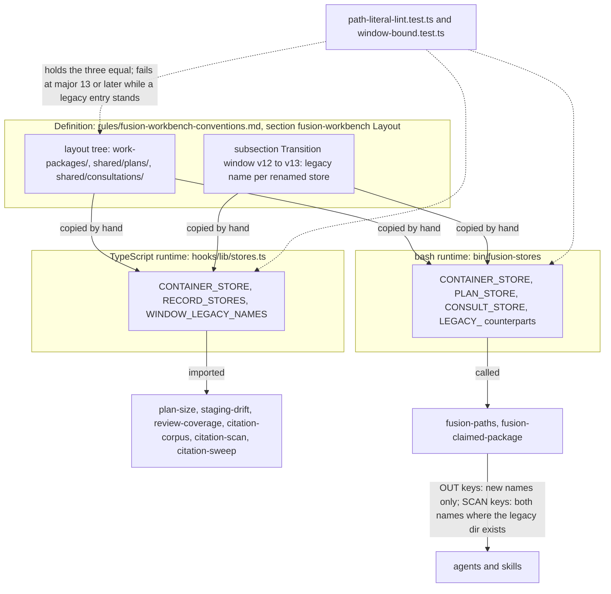
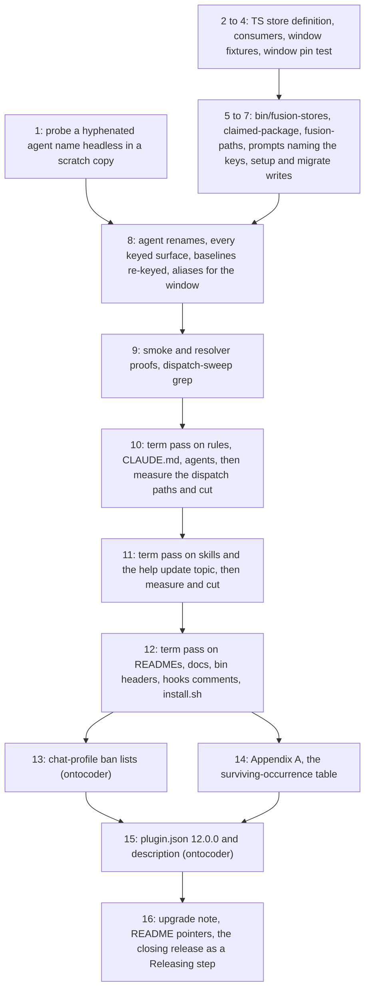

# Implementation Plan: Adapt the fusion plugin source to the PRIOR/Fusion nomenclature (part 1 of 2)

**Date:** 2026-09-22
**Status:** Approved at the plan gate on 2026-09-23; revised in place against `eef3ced0` the same day
**Spec:** 260922-1045_*_spec-prior-nomenclature-plugin-source.md (Decided; the three user rulings of 2026-09-22 and the defaults of its `## User Decisions Pending` stand)
**Cross-references:** 260922-1038-prior-mapping.md, nomenclature.md (this container), 260922-1114_*_does-the-container-store-take-the-name-work-packages-superseding-circles.md, 260922-1114_*_does-the-transition-windows-legacy-read-live-at-one-site-per-runtime.md, 260922-1114_*_does-state-auditor-keep-the-reconcilers-write-scope.md, 260910-2145_*_does-the-container-store-keep-the-directory-name-circles.md, 260822-1154_*_does-a-cut-only-circle-re-baseline-the-surfaces-it-cuts.md, 260822-1154_*_does-the-hook-test-line-budget-cover-comment-prose.md, 260910-2256_*_may-the-growth-bounds-be-raised-for-the-duration-of-the-container-restoration.md, and the seven `260922-1059_*` records this container holds (planning input; none is answered here)
**Survey commit:** `eef3ced0` (first surveyed at `57e2b7eb`; 34 commits touched shipped surfaces between the two, release 11.11.1 among them). Working tree clean on every shipped surface; `npm test` in `hooks/` green at `eef3ced0` (exit 0; 58 files, 987 tests). Every `path:line` below was re-read at `eef3ced0`.
**Decidability:** Two questions carry this plan. First, *which occurrence of a legacy word on a shipped surface names a live fusion concept, and which sits in one of the spec's four untouched classes?* Classes 1, 2 and 4 are decidable from inputs a mechanism has (the token's shape, the reader lists, the sentence's subject); class 3 and the Gate/Verdict function split are decided by a reader per sentence and by nothing mechanical. So the mechanism is an enumeration (one `grep`, stated in Appendix A) plus a per-line classification a coder writes into Appendix A, and every gate this plan sets checks the enumeration's *completeness* (every hit is rewritten or listed), never the classification's *correctness*, which stays a human reading at the plan gate and at review. Second, *does an emitted or walked store path refer to the legacy or the new layout during the window?* Decidable: by existence on disk, checked at the one place per runtime that names the store (`## Approach`, the definition-site pattern). No question here needs a change of mechanism.

## Directive

Rename, on the plugin source in this repository and nowhere else, the three stores, the seven agent files and the concepts the spec's C1 to C4 name; keep what C4 and C5 keep; open the bounded transition window C9 defines at v12.0.0 and name its close at v13.0.0; measure every bounded surface and pay growth with cuts (C7); supersede the `circles/` decision on the record (C6); and ship the release surfaces coherent (C8). The spec is not restated here; each step cites the capability it realises. Part (2), the consumer migration, is a second spec and plan in this container; where a step touches a file both parts need, the step names the seam and stops at it.

## Current State

What the survey re-verified at `eef3ced0`, and where it differs from the spec's survey at `9ff0f9fc`:

- **The hooks' store names already live once.** `hooks/lib/stores.ts` (`eabde08e`, after the spec's survey) holds `RECORD_STORES` (`planning` at `:24`, `consult` at `:32`), `LEGACY_STORES = ["backlog"]` and `RETIRED_REVIEW_FOLDERS`; `hooks/lib/__tests__/path-literal-lint.test.ts:324-330` parses the `shared/` subtree of the layout tree in `rules/fusion-workbench-conventions.md` and holds `RECORD_STORES` equal to it. The **container store is not in that file**: `circles` is hard-coded in `hooks/lib/plan-size.ts:97-105`, `hooks/lib/staging-drift.ts:464,469`, `hooks/lib/review-coverage.ts:141`, `hooks/lib/citation-corpus.ts:133,175` (and `planning/` at `:255`), `hooks/lib/citation-scan.ts:515,561,597,1177,1183,1325,1379` (moved by `78328863`, which taught the grammar the pre-v4 bracket marker), `hooks/citation-sweep.ts:612`, **`hooks/lib/work-graph.ts:286-299`** (the `bin/fusion-work-order` graph walks `fusion-workbench/circles/` directly; missed by the first survey), and as a corpus reader in `hooks/lib/events-query.ts:191` (`circleOf`, reads pre-cut `history_file` values, C4 class 2). `hooks/lib/work-graph.ts` and `hooks/lib/edge-answers.ts` hold a literal NUL byte (`:351`, `:234`), so plain `grep` reports them as binary and prints no hit line: every `grep` this plan runs over `hooks/lib/*.ts` takes `-a`.
- **The bash side names the stores in two helpers.** `bin/fusion-paths:384,391,400,404` value the kinds; `:298,:302,:306,:309` resolve the second argument under `circles/`; `bin/fusion-claimed-item:198` enumerates `fusion-workbench/circles`, `:225` and `:231` print `circles/` in its messages and its `ITEM=`/`CONTAINER=` lines. `bin/monitor` walks no store (`circles` at `:1664,:1831` are comment citations of an issue path); `bin/fusion-workbench-root` and `hooks/lib/workbench-root.ts` name no store. No `bin/` script sources another; helpers call one another as executables (`fusion-paths` → `fusion-claimed-item`, `fusion-workbench-root`).
- **Prompts resolve every store through the resolver**, except the two exempt skills: `circles/` stands 44 times in `skills/` (the first survey miscounted 45), 43 of them in `setup` (`:36,:41,:43,:49,:50,:54,:74`) and `migrate` (`:12,:38,:48,:54,:59,:75,:118,:123,:129,:182-185`), one in `help:63`; `planning/` 8 times, all prose in `setup:40` and `migrate`; `consult` only in the shell store lists at `setup:54,:69` and `migrate:59,:118`. `path-literal-lint.test.ts:273-287` pins the probe expression byte-identical across `setup:54`, `migrate:59` and `migrate:118`, so a probe edit in setup forces the same edit in migrate. `agents/` carries no store literal. `$OUT_BACKLOG`/`$SCAN_BACKLOG` are named by `agents/orchestrator.md` (7), `agents/shaper.md` (2), `agents/curator.md` (2), `skills/archive/SKILL.md` (5), `skills/memo/SKILL.md` (5), `rules/workbench-path-resolution.md` (3), `rules/fusion-workbench-conventions.md` (2), `README-hooks.md` (1).
- **Agent names as keys.** `bin/fusion-rules:226,227,233,234,248,249,260,270,284,292,319` (case arms), `:645` and `:657` (literal equality on `orchestrator`, `editor`); `bin/fusion-paths:226-231` (shape guard admits hyphens: `*[![:lower:][:digit:]-]*`), `:233`. `hooks/lib/__tests__/derivable-enumerations-lint.test.ts:247` parses case arms with `[a-z|]+` and `:258` equality tests with `[a-z]+`: **both exclude hyphens** and fail loudly on a renamed arm. Tests holding the roster by name: `context-manifest.test.ts:21-24,183`, `fusion-paths.test.ts:13-15`, `rules-emission-golden.test.ts:858-860,884,897-898,1207`, `rules-voice-profile.test.ts` (`planner`, `coder` as run arguments), `dispatch-bytes.test.ts:58-188`, `executor-verification-report-lint.test.ts:29,125,131`, `deliverable-language-lint.test.ts:22,118`, `marker-format-lint.test.ts:150-164`, `path-literal-lint.test.ts:209-223`, `plan-stopping-section-lint.test.ts:52,132-143` (expected failure text citing `agents/planner.md:131` and `agents/shaper.md:183`). Readers of persisted corpora: `MEASURED_AGENTS` (`hooks/lib/events-query.ts:482-490`, deliberately the historical population), `REVIEW_SENDERS` (`review-coverage.ts:195`, `reviewSender()` at `:205` stops at a hyphen, which only the unrenamed `reviewer` reaches), `MARKER_WORDS` (`citation-scan.ts:346`, historical file stamps). `install.sh:143-148` prefixes `fusion:` and validates nothing. `fusion.json:12` and `templates/fusion.json:8` name `orchestrator` only. Every `agents/*.md` has `name: <basename>` and no `tools:` line. Dispatch tokens `fusion:<renamed name>`: `CLAUDE.md:38` (coder, ontocoder), `install.sh` (coder, planner), `README.md:71` (coder), `docs/upgrading-to-v10-4.md:113` (shaper, history), `skills/curate/SKILL.md:3` (curator), `skills/reconcile/SKILL.md:4` (reconciler), tests `dispatch-bytes.test.ts:150,171,188`, `guard-state-shape.test.ts:237`. `**Executors:**` values are agent names (`agents/orchestrator.md:231,:600`, `agents/planner.md:50`); consumer plans on disk carry `Executor: coder` per step, and consumers' `rules/context-manifest.yaml` key `agents:` by name (`rules/context-manifest.md:53,63`).
- **The bounds** (as of `eef3ced0`). `agents/*.md` 322 611 bytes against floor 310 567 + 18 000 (`AGENT_BASELINE`, ten keys, `reviewer.md` deliberately unkeyed, `surface-growth-bound.test.ts:172-183`): **5 956 bytes** of room. `skills/*/SKILL.md` 227 956 against 188 768 + 39 260: **72 bytes** of room. Hook tests 22 243 lines against 19 228 + 3 030: **15 lines** of room (138 at `57e2b7eb`; `fusion-work-order.test.ts`, `work-graph.test.ts`, `citation-sweep.test.ts` and `fusion-forum.test.ts` grew since). The per-dispatch-path bound (`fixtures/dispatch-path.baseline`, read by `rules-emission-golden.test.ts:943-1210`, re-armed by `c34c7896` under the fourth re-baselining event that bound alone carries) holds eleven blocks keyed `[<agent>]` with the inner keys `agents/<name>.md` and `rules emitted to <name>`, at **zero head-room**; every path measures 2 bytes under its row, and `CLAUDE.md` (8 022 bytes, charged at 8 021 in every row) is charged to all eleven. The header regex at `:978` is `^\[([a-z-]+)\]$`, so a hyphenated block name parses. A file with no baseline entry counts as growth in full (`helpers/growth-bound.ts:156-159`), and a baseline key naming an absent file fails outright (`surface-growth-bound.test.ts:452-466`): an unkeyed rename of `agents/shaper.md` reads as 17 017 bytes of growth and one stale key at once. `rules-emission.golden` and `surface-growth.golden` are keyed by agent filename and regenerated with `UPDATE_RULES_GOLDEN=1` / `UPDATE_SURFACE_GOLDEN=1` (`README-hooks.md:517-520`). `reference-resolution-lint.test.ts:492` pins `{ paths: 1716, anchors: 320, stampBare: 11 }` by equality; every commit that adds or removes a shipped citation re-approves it with an attributed line above the constant.
- **Heading anchors are resolved by the lint.** `reference-resolution-lint.test.ts:376-377,429` resolves `` `file.md` `## Section` `` against the target's headings (equal or prefix). Cited headings carrying a legacy word (occurrences on the shipped surfaces, tests excluded): `## Directive` (17, mostly in upgrade notes; defined in `agents/shaper.md:132`, `agents/planner.md:102`, `skills/memo/SKILL.md:122`, `rules/fusion-workbench-conventions.md:199`, `docs/working-model.md:27`), `## Plugin structure` (7, target `README-agents.md:179`), `## Human Gate Rules` (6: `rules/fusion-workbench-conventions.md` 3, `agents/curator.md` 1, `docs/working-model.md` 1, `README-agents.md` 1; target `agents/orchestrator.md:364`), and `## Backlog entries — work items` (34 lines over 16 files, 3 of them in the migrate text plan (2) cuts; heading at `rules/fusion-workbench-conventions.md:178`). No `Verdict`, `Grounding`, `Turn` or `Skill` heading is cited.
- **Legacy-word counts** (stamped `eef3ced0`; scope evidence, not acceptance figures). Command: `grep -rowE '<word>' <dir> | wc -l` for agents / skills / rules / bin / docs, `cat hooks/*.ts hooks/lib/*.ts | grep -owE` for hooks (tests excluded), `cat README*.md | grep -owE` for READMEs, `grep -ro` for the two-word forms. The `57e2b7eb` figures came from a command the first survey did not record and are not comparable. `Circle` agents 6 / skills 17 / rules 20 / bin 10 / hooks 47 / docs 92 / READMEs 34; `Directive` 75 / 20 / 27 / 1 / 1 / 43 / 6; `Grounding` 27 / 2 / 20 / 0 / 3 / 6 / 2; `Turn` 1 / 3 / 11 / 14 / 16 / 21 / 15; `Artifact` 28 / 0 / 18 / 4 / 0 / 3 / 4 and `artifact` 15 / 25 / 28 / 8 / 9 / 7 / 14; `plugin` 15 / 31 / 18 / 68 / 23 / 19 / 81 (+8 `CLAUDE.md`, +22 `install.sh`); `skill` 16 / 68 / 53 / 37 / 13 / 32 / 50; `Gate` 19 / 0 / 17 / 0 / 0 / 10 / 2 and `gate` 106 / 26 / 63 / 36 / 112 / 52 / 79; `Verdict` 2 / 0 / 2 / 0 / 6 / 0 / 0 and `verdict` 55 / 23 / 14 / 44 / 105 / 27 / 50; `work item` 67 / 40 / 44 / 16 / 4 / 18 / 36; `work-item` 23 / 3 / 14 / 4 / 4 / 2 / 18; `**Item:**` 10 in agents, 3 in `README-agents.md`; `sub-agent` 13 / 2 / 0 / 0 / 8 / 2 / 25. The `docs/` figure for `Circle` is 85 parts upgrade notes (class 3, whole files).

## Approach

One integral pattern carries the store rename and the window: **the layout tree defines, one table per runtime copies, one test holds the three equal.** The repository already runs that pattern for the shared stores (tree → `stores.ts` → `path-literal-lint`); this plan extends it to the container store, to the legacy names for the window's duration, and to the bash side through one new helper the two bash consumers call. The closing release then deletes the window subsection in the tree, and the test refuses to pass until both runtime copies drop their legacy entries: one commit, forced rather than remembered. Binding record for the reading of the spec's single-site clause: `260922-1114_*_does-the-transition-windows-legacy-read-live-at-one-site-per-runtime.md` (option 1, ruled by the user at the plan gate on 2026-09-23).



Every write lands under a new name; a read lists the legacy directory beside the new one only when it exists on disk, so a migrated workbench sees output with no legacy name in it (C1, first criterion) and an unmigrated one keeps working (C9). The item-in-scope's container is looked up under both roots; its write base is always the new root, which is the "records land beside the legacy store" consequence the spec accepts.

The work is ordered so that the tree is green after each commit group, and so that the one condition that would send the naming question back to the user (a hyphenated agent name Claude Code rejects) is tested before anything is renamed:



The one edge not in the spec's shape: step 2 to 4 (TypeScript) precedes 5 to 7 (bash) because the window pin test and the tree parse land with the TypeScript group, and the bash helper is then held to a table that already exists.

### Names this plan fixes (the spec's `## Open for Planner`)

| Legacy | Fixed here | Rule |
|---|---|---|
| `OUT_BACKLOG` / `SCAN_BACKLOG` | `OUT_PACKAGES` / `SCAN_PACKAGES` | naming rule 7, a collection named for its records; the key grammar `[A-Z][A-Z_]*` admits it |
| `bin/fusion-claimed-item`, `ITEM=` | `bin/fusion-claimed-package`, `PACKAGE=` (`CONTAINER=` unchanged) | the noun follows the record kind |
| `**Item:**` dispatch parameter | `**Work package:**` | the same shape `**Review domain:**` already has; a space inside a label is established |
| `## Backlog entries — work items` | `## Work packages` | every citation moves with it in the same commit |
| `## Human Gate Rules` | `## Human approval rules` | resolution table: the user authorising an action is an approval |
| citation kinds `circle-record`, `circle-dir` | `package-record`, `package-dir` | one kind each, covering the record under either root and, for `package-record`, the retired `_<m>_circle.md` form beside the item form: the kind names the container, not the record's era, so no third kind |
| `hooks/lib/citation-scan.ts` `circleDirs()`, `CIRCLE_DIR`, `CIRCLE_RECORD_RE` and every other non-persisted code identifier | unchanged | code is an exempt surface and an identifier is not vocabulary; only the two kind names are persisted in verdict output and are therefore renamed |
| `## Directive` as the heading of the work-package record and of the spec/plan templates | unchanged in this item | a template label carried by every consumer's records, treated like `**Artifact language:**` (spec C3 case 4, C4 class 4 by the same reasoning); prose beside it says brief; renaming it is part (2)'s, since part (2) is what may rewrite records. The user accepted this default at the plan gate on 2026-09-23 |
| `bin/fusion-work-order`, `bin/fusion-plan-size` | unchanged | neither carries a legacy noun in its name |
| the window's legacy read | one document definition, one table per runtime, one test | `260922-1114_*_does-the-transition-windows-legacy-read-live-at-one-site-per-runtime.md`, option 1 |
| the growth-bound re-key | a map edit, in the rename commit, named as a non-event in the rule's authoring home | `helpers/growth-bound.ts` `## Re-baselining` is the home; `README-hooks.md` restates it |

## Preconditions performed by the orchestrator at the user's word (no executor)

These are workbench writes an executor may not perform (`rules/fusion-workbench-conventions.md` `## Inline State Tracking`, decision files; `## Dispatching another agent`). They gate the steps named beside them.

- **P1. Performed** (`eef3ced0`). `260922-1114_*_does-the-container-store-take-the-name-work-packages-superseding-circles.md` is `_a_` on option 1 with its `Answered:` line; `260910-2145_*_does-the-container-store-keep-the-directory-name-circles.md` carries `Superseded by:` and is `_s_`. Step 2 is no longer gated. (Spec C6.)
- **P2. Performed** (`eef3ced0`). `260922-1114_*_does-the-transition-windows-legacy-read-live-at-one-site-per-runtime.md` is `_a_` on option 1. Steps 2 and 5 are no longer gated.
- **P3.** `260922-1114_*_does-state-auditor-keep-the-reconcilers-write-scope.md`: stays `_o_` for the profile-set item; step 8 cites it in the `state-auditor` roster row and answers nothing.
- **P4.** The seven `260922-1059_*` records stay `_o_`; no step reads their answers.

## Execution order across both plans

One list for both parts; "(1)" is this plan, "(2)" is `260922-1129_*_plan-prior-nomenclature-consumer-migration.md`. Each numbered line is one commit unless it says otherwise; `npm test` is green at every commit. The order satisfies every edge of (2) `## Sequencing against plan (1)`, re-checked at `eef3ced0`.

1. (1) step 1: the headless probe. No commit.
2. (2) steps 1 to 4, one commit: the migrate cut and the store-name pass, setup's four probes out, the tests. It goes first because it returns the skill bytes and the hook-test lines every later commit spends, and it deletes the three-site pin and `live-circle-record-detection.test.ts` before (1) steps 2, 3 and 7 would edit them.
3. (1) steps 2 to 4, one commit.
4. (1) step 5.
5. (1) step 6.
6. (1) step 7 (setup only).
7. (2) step 5 (after (1) steps 2 and 7).
8. (1) step 8.
9. (1) step 9: proofs. No tree commit; Appendix B is written in this plan.
10. (1) step 10.
11. (2) step 6 (after (1) step 10).
12. (1) step 11.
13. (1) step 12.
14. (1) step 13.
15. (1) step 14: Appendix A in this plan. No tree commit.
16. (1) step 15: `plugin.json` 12.0.0.
17. (1) step 16.
18. (2) step 7 (after (1) steps 11 and 16).
19. The 12.0.0 release by `README-agents.md` `## Releasing`, at the user's word; then `fusion --update` and a restart.
20. (2) step 8, then (2) step U (the user runs `/fusion:migrate`), then (2) step 9: the one migration commit.

## Implementation Steps

1. [DONE] **Probe: does Claude Code accept a hyphenated agent name and its `fusion:<name>` token?**
   - Executor: `coder`
   - Files: none in the tree; a copy of the repository under the scratchpad directory
   - Changes: copy the work tree, `git mv agents/shaper.md agents/requirements-designer.md` in the copy and set its `name:` line, then run `claude plugin validate <copy>` and `claude --plugin-dir <copy> --agent fusion:requirements-designer -p "reply SMOKE-OK"`. Report both outputs verbatim. Delete the copy.
   - Dependencies: none
   - Acceptance: validation passes and the run answers `SMOKE-OK`. On any other outcome the plan stops (`## Where this work stops`, clause 2) and the outputs go to the user with the naming question.
   - Result 260923: passed. Claude Code 2.1.280, `claude plugin validate <copy>` exit 0 (one unrelated warning about the root `CLAUDE.md`), `claude --plugin-dir <copy> --agent fusion:requirements-designer -p "reply SMOKE-OK"` exit 0 answering `SMOKE-OK`; negative control `--agent fusion:no-such-agent` exit 1 listing `fusion:requirements-designer` and no `fusion:shaper`.

2. [DONE] **TypeScript store definition and the window table**
   - Executor: `coder`
   - Files: `hooks/lib/stores.ts`, `rules/fusion-workbench-conventions.md` (`## fusion-workbench Layout` only), `hooks/lib/__tests__/path-literal-lint.test.ts`
   - Changes: in `stores.ts`, `RECORD_STORES` reads `plans` and `consultations` where it read `planning` and `consult`; add `CONTAINER_STORE = "work-packages"` and `WINDOW_LEGACY_NAMES = { "work-packages": "circles", plans: "planning", consultations: "consult" } as const` with a header sentence naming the closing release (`13.0.0`) and the record; add two exported helpers, `containerRoots(wb)` (the new root, plus the legacy root when it exists on disk) and `storeDirs(base, kind)` (the new name, plus the legacy name when it exists). In the tree: `work-packages/` for `circles/`, `plans/` in the container and under `shared/`, `consultations/` for `consult/`; replace the paragraph that keeps `circles/` by name (`:66` at the survey commit) with one sentence citing `260922-1114_*_does-the-container-store-take-the-name-work-packages-superseding-circles.md`; add `### Transition window (v12.0.0 to v13.0.0)` listing the three legacy names, the rule (read beside the new name where the directory exists, never written), the three sites that copy the table, and the closing release by version. Extend the lint: `TYPE_FOLDERS` also takes `Object.values(WINDOW_LEGACY_NAMES)` so `planning/` and `consult/` in a prompt still fail; the tree parse also reads the `work-packages/` line and the window subsection's names and holds `CONTAINER_STORE` and `WINDOW_LEGACY_NAMES` equal to them; `DEFINITION_SITES` gains `bin/fusion-stores` (created in step 5; the existence assertion is added there).
   - Dependencies: P1, P2
   - Acceptance: `path-literal-lint.test.ts` holds `RECORD_STORES`, `CONTAINER_STORE` and `WINDOW_LEGACY_NAMES` equal to the tree and fails on a `work-packages/`, `plans/` or `consultations/` literal in an agent prompt or non-exempt skill (fixture rows added for all three). The layout tree shows the three new names and the clause keeping `circles/` is gone (C1, third criterion). Lands in the same commit as steps 3 and 4.

3. [DONE] **Route every TypeScript consumer through the definition; rename the two citation kinds**
   - Executor: `coder`
   - Files: `hooks/lib/plan-size.ts`, `hooks/lib/staging-drift.ts`, `hooks/lib/review-coverage.ts`, `hooks/lib/citation-corpus.ts`, `hooks/lib/citation-scan.ts`, `hooks/citation-sweep.ts`, `hooks/lib/work-graph.ts`, `hooks/lib/events-query.ts` (comment only), their tests and fixtures, `hooks/dist/`
   - Changes: `plan-size.ts:97-105` walks `containerRoots()` and `storeDirs(·, "plans")`; `staging-drift.ts:464,469` tests `segments[0]` against both roots and `STORES` includes the legacy kind names; `review-coverage.ts:141` enumerates both roots; `work-graph.ts:286-299` reads every container under `containerRoots()` and tests `ITEM_RECORD_RE` against the root it read; `citation-corpus.ts:133,175,255` regexes take the root and kind alternations from `stores.ts`; `citation-scan.ts` builds the `:515,:561,:597` regexes from the same alternation, `circleDirs()` (`:1158`) adds both roots at `:1177` and, for every archive sweep at `:1183`, both `archive/<sweep>/<root>` forms (old sweeps keep `circles/` for ever), `storePrefixed()` at `:1325,:1379` reports the segment it matched rather than the literal `"circles/"`, and `CitationKind`, `GATE_KINDS`, `SHAPE_DECIDED_KINDS` carry `package-record` / `package-dir`; `citation-sweep.ts:612` extracts the directory from either prefix through the shared alternation. `events-query.ts:191` keeps `"circles"`: it reads pre-cut `history_file` values (C4 class 2); its comment says so and cites the window subsection. Test fixtures that build a workbench (`fusion-paths.test.ts`, `plan-size.test.ts`, `staging-drift.test.ts`, `citation-grammar-boundaries.test.ts`, `review-coverage.test.ts:517`, `reference-resolution-lint.test.ts:838-975`, `workbench-citation-lint.test.ts:229-269`, `work-graph.test.ts:85-94`, `fusion-work-order.test.ts:24-25,46`) move to the new names; `live-circle-record-detection.test.ts` is gone by then (plan (2) step 4 deletes it, `## Execution order across both plans`); assertions on verdict strings (`citation-grammar-boundaries.test.ts:99-126,205-237`) read `work-packages/`. Rebuild `dist/` and commit it (`committed-dist.test.ts`).
   - Dependencies: step 2 (same commit)
   - Acceptance: `npm test` green; `grep -arn '"circles"\|circles\\\\/\|"planning"\|"consult"' hooks/*.ts hooks/lib/*.ts` (`-a`: `work-graph.ts` reads as binary) returns `stores.ts` and `events-query.ts:191` only, plus comments; `bin/fusion-citation-check` reports the dangling and store-prefixed counts Appendix B records for `eef3ced0` (C4, second criterion).

4. [DONE] **Window fixtures and the window pin**
   - Executor: `coder`
   - Files: `hooks/lib/__tests__/plan-size.test.ts`, `citation-grammar-boundaries.test.ts`, `staging-drift.test.ts`, `work-graph.test.ts`, a new `hooks/lib/__tests__/window-bound.test.ts`
   - Changes: one legacy-only fixture (a workbench holding `circles/<dir>/planning` and `shared/planning`, `shared/consult`) and one mixed fixture (both names side by side) per consumer above, asserting the legacy records are found and reported with their own prefix, and that a mixed tree reports every package once (C9, third criterion). `window-bound.test.ts` reads `.claude-plugin/plugin.json` and asserts: while the major is below 13, `WINDOW_LEGACY_NAMES` names exactly the three stores the tree's window subsection names; from major 13 on, the subsection is absent and the table is empty. Re-key `TEST_LINE_BASELINE` for any keyed test file renamed in this group.
   - Dependencies: step 3 (same commit)
   - Acceptance: `npm test` green; the hook-test line total measured against its bound and recorded in Appendix B. The room is 15 lines at `eef3ced0` plus what plan (2) step 4 left, so a comment-prose cut of the test surface (`260822-1154_*_does-the-hook-test-line-budget-cover-comment-prose.md`; 6 154 comment lines stand in `hooks/lib/__tests__/*.test.ts` and `helpers/*.ts`) is **expected** in this commit, not contingent, and each is named in Appendix B.

   - Carried from steps 2–4 (260923): add `bin/fusion-stores` to `DEFINITION_SITES` in `path-literal-lint.test.ts`, and name `bin/fusion-stores` by path in the layout's `### Transition window (v12.0.0 to v13.0.0)` subsection, which says "one bash helper" until the file exists. Measured after steps 2–4: hook-test lines 22 253 of 22 258; `fusion-workbench-conventions.md` 68 965 bytes (−256); reference pin unchanged at {1702, 313, 11}.
5. [DONE] **`bin/fusion-stores`, the bash definition**
   - Executor: `coder`
   - Files: `bin/fusion-stores` (new), `hooks/lib/__tests__/fusion-stores.test.ts` (new), `README-hooks.md` `### The bin/ helper roster`, `hooks/lib/__tests__/path-literal-lint.test.ts` (`DEFINITION_SITES` existence assertion)
   - Changes: a helper in the style of `bin/fusion-workbench-root` (header documentation, `KEY=value` on stdout, exit 0/1) printing `CONTAINER_STORE=work-packages`, `PLAN_STORE=plans`, `CONSULT_STORE=consultations`, `LEGACY_CONTAINER_STORE=circles`, `LEGACY_PLAN_STORE=planning`, `LEGACY_CONSULT_STORE=consult`; its header names the closing release and says the table is a copy of the tree's. The test runs it and holds its output equal to `stores.ts`. Roster row added.
   - Dependencies: step 2, P2
   - Acceptance: `fusion-stores.test.ts` green; the hook-test line total measured and any comment-prose cut named in Appendix B (as in step 4); `grep -rn 'circles' bin/*` returns, after step 6, `bin/fusion-stores`, the two `bin/monitor` comment citations, `bin/fusion-events:76` (class 2, the pre-cut `history_file` reader's comment), and the header example lines `bin/fusion-plan-size:18` and `bin/fusion-staging-drift:14`, which step 12 rewrites; nothing else.

6. [DONE] **`bin/fusion-claimed-package` and `bin/fusion-paths` read both names, write one**
   - Executor: `coder`
   - Files: `bin/fusion-claimed-item` → `bin/fusion-claimed-package` (`git mv`), `bin/fusion-paths`, `bin/fusion-rules` (its call site), `hooks/lib/__tests__/fusion-claimed-item.test.ts` → `fusion-claimed-package.test.ts` (no `TEST_LINE_BASELINE` entry exists for it, so nothing is re-keyed; its 192 lines count in full under either name), `fusion-paths.test.ts`, `README-hooks.md` roster row
   - Changes: the claim scan enumerates every root `fusion-stores` names that exists (`work-packages/*/` and `circles/*/`), prints `PACKAGE=<root>/<dir>/<dir>.md` and `CONTAINER=<root>/<dir>` for the record where it stands, and refuses two claims across both roots as it refuses two today (exit 3). `fusion-paths`: reads the six values from `fusion-stores`; the second argument is looked up under the new root, then the legacy root, and is exit 1 when under neither; `OUT_BASE` is always `<new root>/<dir>` (or `shared`), so every `OUT_*` names a new store (C9, second criterion); `scan_value()` emits `<base>/<new> [<base>/<legacy> if that directory exists] shared/<new> [shared/<legacy> if it exists]`; `OUT_PACKAGES|SCAN_PACKAGES` replace the `BACKLOG` pair, `SCAN_PACKAGES` adding the legacy root when it exists; `OUT_CONSULT` is `shared/consultations`; usage text, messages and the `ORDER` list follow. Every prompt naming the old keys moves to the new ones in this commit (`agents/orchestrator.md`, `agents/shaper.md`, `agents/curator.md`, `skills/archive/SKILL.md`, `skills/memo/SKILL.md`, `rules/workbench-path-resolution.md`, `rules/fusion-workbench-conventions.md`, `README-hooks.md`), or the resolver exits 4 on the first Setup after it. Tests: the existing cases on the new names; a legacy-only fixture (claim found under `circles/`, every `OUT_*` under `work-packages/`, exit 0) and a mixed fixture; the byte-for-byte assertions at `fusion-paths.test.ts:106-435` and `fusion-claimed-item.test.ts:109-125` rewritten to the new output.
   - Dependencies: step 5
   - Acceptance: C1 first and second criteria as stated in the spec, run in a fixture holding the new layout and in one holding the legacy layout; C9 first and second criteria; `npm test` green, the hook-test line total measured and any comment-prose cut named in Appendix B; `bin/fusion-paths planner 260922-1038-prior-mapping` run in this repository (legacy workbench) exits 0 with `OUT_PLAN=work-packages/260922-1038-prior-mapping/plans` and `SCAN_PLANS` naming both that directory and `circles/260922-1038-prior-mapping/planning`.

7. [DONE] **Setup and migrate: new names in every write, legacy names only in the probe and the report**
   - Executor: `coder`
   - Files: `skills/setup/SKILL.md`, `hooks/lib/__tests__/store-name-migration.test.ts` (created by plan (2) step 4)
   - Changes: this step runs after plan (2) steps 1 to 4 (`## Execution order across both plans`), which leave setup's probe block as the skeleton `WB=./fusion-workbench; OLD=0; … echo "OLD=$OLD"`, delete migrate's pre-v4 blocks at `:59,:118` together with the three-site pin at `path-literal-lint.test.ts:273-287`, and delete `live-circle-record-detection.test.ts`. So the step is setup's half only: setup's `mkdir -p` (`:69` at `eef3ced0`) creates `work-packages/`, `shared/plans/`, `shared/consultations/`; the probe skeleton gains a case for a legacy v11 layout (a `circles/` root, a `shared/planning/` or `shared/consult/` store) that prints one line naming the store and `/fusion:migrate` and **continues** (C9, fourth criterion); the remaining prose names `work-packages/` as the layout it creates and `circles/` as the layout it detects. The probe's cases join `store-name-migration.test.ts` in that file's pattern (`extractBashBlock`, `mkdtempSync`, real `bash`): a `work-packages/` fixture reports nothing, a `circles/` fixture prints the one line and `OLD=0`. Migrate needs nothing here: plan (2) step 2's blocks already write only the new names.
   - Dependencies: step 6; plan (2) step 4
   - Acceptance: `path-literal-lint` green; the two setup cases pass; `grep -rn 'circles/' skills/` returns lines in `setup` and `migrate` only, plus `skills/help/SKILL.md` where the sentence is about the upgrade (C1, seventh criterion). Skills byte total and hook-test line total recorded in Appendix B; plan (2) steps 1 to 3 leave the skill surface some 25 000 bytes of room, so no skill cut is expected here, and a hook-test comment-prose cut is taken if the added cases do not fit.

8. [DONE] **Rename the seven agents and every surface keyed by their names, re-keying the baselines**
   - Executor: `coder`
   - Files: `agents/{shaper,planner,coder,ontocoder,reconciler,editor,curator}.md` (`git mv` to the seven identifiers); every file listed under `## Current State`, third bullet; `hooks/lib/__tests__/surface-growth-bound.test.ts:172-183`, `fixtures/dispatch-path.baseline`, `fixtures/rules-emission.golden`, `fixtures/surface-growth.golden`, `helpers/growth-bound.ts` `## Re-baselining`, `README-hooks.md` `### Growth bounds on the shipped text`; `hooks/lib/events-query.ts`; `hooks/lib/plan-size.ts` (the message text citing `agents/planner.md`); `bin/fusion-paths` `unknown_name_note()`, `bin/fusion-rules` exit-2 message; `agents/orchestrator.md`; `agents/planner.md`; `agents/shaper.md`; `README-agents.md`; `CLAUDE.md:38`; `install.sh:120-127`; `skills/curate/SKILL.md:3`, `skills/reconcile/SKILL.md:4`; `docs/working-model.md`
   - Changes, in one commit: `name:` frontmatter equals the new basename; descriptions naming other agents use the new names; `bin/fusion-rules` case arms and the two equality tests; `derivable-enumerations-lint.test.ts:247,258` admit `-` in the name class; every test in the third bullet of `## Current State` uses the new names; `AGENT_BASELINE` keys re-keyed with their old figures; `dispatch-path.baseline` block headers and the two inner keys re-keyed, figures untouched; both goldens regenerated and their diffs reviewed to be key-only; `helpers/growth-bound.ts` `## Re-baselining` gains the paragraph "a rename re-keys the entry and moves no floor: it is none of the three events here, nor the fourth `fixtures/dispatch-path.baseline` carries for that bound alone (`c34c7896`), and not a head-room raise", `README-hooks.md` restates it in one sentence (C7, second criterion). The orchestrator's routing table, invocation table, `**Executors:** code-implementer, data-implementer, analyst`, and a **window alias for persisted plans**: a step whose `Executor:` names a pre-v12 identifier is dispatched as its v12 identifier, in one sentence with the seven-row table, removed at the closing release. `**Item:**` → `**Work package:**` in the planner and shaper parsers, the orchestrator's dispatch text and `README-agents.md` `## Dispatch parameters` (the old spelling is no longer parsed, C8 third criterion). `MEASURED_AGENTS` gains `code-implementer`, `data-implementer`, `state-auditor`, `policy-curator` and `bin/fusion-events` reports by role through a seven-row old-to-new map so a range spanning the rename gives one series per role (C2 sixth, C4 third criteria); `REVIEW_SENDERS` and `MARKER_WORDS` unchanged, with a comment saying why. `unknown_name_note()` and the `fusion-rules` exit-2 message name the seven-row rename table, so a user or a stale prompt asking for `shaper` is told the new name. `install.sh` help text; the `Agent(fusion:…)` frontmatter lines; `README-agents.md` `## The agents` rows, including the `reviewer` row naming `code-reviewer` and `data-reviewer` as the two identifiers it serves under `**Review domain:**` (C2 second criterion) and the `state-auditor` row citing `260922-1114_*_does-state-auditor-keep-the-reconcilers-write-scope.md`; every `agents/<old>.md` path citation on every surface (the lint resolves them; occurrences of the seven old paths at `eef3ced0`: `README-agents.md` 18, `skills/curate/SKILL.md` 7, `skills/reconcile/SKILL.md` 3, `README-hooks.md` 2, `rules/orchestrator-rebalance.md` 1; in tests `plan-stopping-section-lint.test.ts` 6, `path-literal-lint.test.ts` 3, `marker-format-lint.test.ts` 3; the first survey's figures counted every `agents/*.md` path). The reference pin is re-approved with its attribution line.
   - Dependencies: steps 1, 7
   - Acceptance: `ls agents/` lists the eleven names of C2's first criterion, `name:` equals basename in each; `npm test` green with no baseline figure changed and no head-room constant raised (C7 first criterion; `git diff` of the two baseline files shows key lines only); `grep -rEo 'fusion:(shaper|planner|coder|ontocoder|reconciler|editor|curator)\b' agents skills rules README*.md docs bin hooks CLAUDE.md install.sh templates` returns only `docs/upgrading-to-v10-4.md:113` and the test rows that write synthetic event values (class 2), listed in Appendix A (C2 fifth criterion); `grep -rn 'agents/\(shaper\|planner\|coder\|ontocoder\|reconciler\|editor\|curator\)\.md'` over the same surfaces returns only upgrade notes.

9. [DONE] **Proofs of the rename**
   - Executor: `coder`
   - Files: none
   - Changes: run `claude plugin validate .`; run `claude --plugin-dir . --agent fusion:<name> -p "reply SMOKE-OK"` for each of the eleven names, headless (the two-session pin does not bind a headless run, which loads the tree afresh); run `bin/fusion-rules <name>` and `bin/fusion-paths <name>` for each new name and compare the emission and key set with the same commands at the commit before step 8 (`git stash` is not used; run the old commands from a `git worktree` of that commit); run each old name and record the exit 2 and its note. Record all outputs in Appendix B.
   - Dependencies: step 8
   - Acceptance: C2 third and fourth criteria as stated. `fusion --update` followed by `fusion <new name>` (C2 eighth criterion) is proved after the release, in the next session; it is a clause under `## Where this work stops`.

10. [DONE] **Term pass over the dispatch-path-bounded surfaces: `rules/`, `CLAUDE.md`, `agents/`**
    - Executor: `coder`
    - Files: `rules/*.md`, `CLAUDE.md`, `agents/*.md`, `hooks/lib/__tests__/reference-resolution-lint.test.ts:492` (re-approval), any test asserting a sentence of these files (`review-coverage-mandate.test.ts`, `executor-verification-report-lint.test.ts`, `deliverable-language-lint.test.ts`, `plan-stopping-section-lint.test.ts`)
    - Changes: apply the classification rule of Appendix A per sentence. Headings: `## Backlog entries — work items` → `## Work packages`, `## Human Gate Rules` → `## Human approval rules`, with every citation moved in the same commit (including the three that `32700002` and `0d39b2fd` added in `agents/curator.md`, `docs/working-model.md` and the conventions after the first survey, and the heading citations in `bin/*` header comments, which the reference lint also scans); `## Directive` stays (`### Names this plan fixes`). `rules/user-facing-output.md` `## Vocabulary` bans the canonical nouns beside the legacy ones (C3 fourth criterion). `rules/fusion-workbench-conventions.md` `## State Markers — decisions`: "Grounding-Stand / Grounding-Historie" → the evidence-base pair, keeping the `foundation_V3 §1.2` citation as history. Provenance headers untouched. Then **measure**: `npm test`; the dispatch-path assertion names every path over its total. Pay each overage by a cut in a file on that path (a rule emitted to it, the agent's own prompt, or `CLAUDE.md`), preferring narrative that restates a binding record over the record's citation, and never a sentence a test asserts. Every cut is a row in Appendix B with the bytes it returned.
    - Dependencies: step 9
    - Acceptance: `npm test` green with no baseline or head-room change; Appendix B carries, for each of the eleven paths, the byte delta of the term pass and the cuts taken (C7 third criterion); the C3 first, second and third criteria hold over `agents rules CLAUDE.md` for the words the criteria name, against Appendix A.

11. [DONE] **Term pass over `skills/`, and the help topic's release entry**
    - Executor: `coder`
    - Files: `skills/*/SKILL.md`
    - Changes: the classification rule per sentence; `skills/help/SKILL.md` `### 4. Update` carries v12 on top and drops the oldest of its three (C8 second criterion; the drop funds bytes), its philosophy and daily topics say work package, brief, module, workflow; `skills/setup/SKILL.md` and `migrate` prose already touched in step 7 are re-read for the remaining words. Measure the skills byte total; a cut is taken in the same skill that grew.
    - Dependencies: step 10
    - Acceptance: `npm test` green; Appendix B carries the skills delta and cuts; C3 criteria over `skills/`.

   - Carried from step 7 (260923): `skills/help/SKILL.md` still describes the container store as `circles/` ("each work item's own container under `circles/`"); step 7's `grep` criterion holds once this step renames it.
12. [DONE] **Term pass over the unbounded surfaces: READMEs, live docs, `bin/` headers, hooks comments, `install.sh`, `templates/`**
    - Executor: `coder`
    - Files: `README.md`, `README-agents.md`, `README-hooks.md`, `docs/philosophy.md`, `docs/working-model.md`, `docs/fusion-intro.md`, `docs/messages-between-checkouts.md`, `bin/*` header comments, `hooks/*.ts` and `hooks/lib/*.ts` comments, `install.sh` (prose only; its marketplace steps are Claude Code's surface), `templates/fusion.json` (its `_retired` note is history and stays), `hooks/dist/` (rebuilt if a `.ts` comment changed)
    - Changes: the classification rule per sentence; `README-agents.md` `## The agents` count bullets and the six registration surfaces agree with `ls agents/`; the co-mention lines the derivable-enumerations lint checks (`:340`) name the new identifiers; `docs/upgrading-to-v9.md` through `docs/upgrading-to-v11-4.md` are not opened. Reference pin re-approved.
    - Dependencies: step 11
    - Acceptance: `derivable-enumerations-lint` green; `git diff --stat` shows no `docs/upgrading-to-*` file (C4 fourth criterion, first half); C3 fifth criterion (one name per thing across `README.md`, `README-agents.md`, `docs/philosophy.md`, `/fusion:help`) checked by reading the four.

13. [DONE] **Chat-profile ban lists**
    - Executor: `ontocoder`
    - Files: `stilwerk/chat-voice-en.yaml:25`, `stilwerk/chat-voice-de.yaml:25` (the shipped templates; a consumer's copies are part (2)'s)
    - Changes: `L07` names the canonical nouns beside the legacy ones (work package, brief, evidence base, work round, approval, review result, artefact; German: Arbeitspaket, Auftrag, Evidenzbasis, Arbeitsrunde, Freigabe, Prüfergebnis, Artefakt) and keeps every legacy noun it names today (C3 fourth criterion).
    - Dependencies: step 12
    - Acceptance: `rules-voice-profile.test.ts` green; both files parse as YAML; `bin/fusion-rules planner` still emits both profile paths.

14. [DONE] **Appendix A: the surviving-occurrence table**
    - Executor: `coder`
    - Files: this plan (Appendix A)
    - Changes: run the enumeration command of Appendix A over the surfaces the spec's C3 names; write one row per surviving line, `path:line`, the word, and exactly one class; one row `path:*` per file wholly in class 3 (the upgrade notes), with the count. The enumeration's output and the table's row count are equal, or the difference is a listed rewrite the executor missed and fixes.
    - Dependencies: step 12
    - Acceptance: C4 first criterion; C3 first and second criteria checked against the table; C2 fifth criterion's survivors are rows.

   - Carried from step 8 (260923): `.claude-plugin/plugin.json`'s description still names "curator"; this step renames it to policy-curator with the rest of the description.
   - Carried from step 12 (260923): `skills/help/SKILL.md` says "work package in the project backlog" (:57) where the READMEs and philosophy doc now say "work-package store", and uses "item" as shorthand at :57 and :63; `docs/messages-between-checkouts.md` "Writing" still describes the pre-v11 cleanup pipeline; the `README-hooks.md` `lib/stores.ts` row does not name `CONTAINER_STORE` or `WINDOW_LEGACY_NAMES`. Step 16 touches these files and takes them.
15. **Manifest: version and description**
    - Executor: `ontocoder`
    - Files: `.claude-plugin/plugin.json`
    - Changes: `version` `12.0.0`; `description` in the canonical terms, stating the agent count `ls agents/` gives, eleven (C3 sixth, C8 first criteria).
    - Dependencies: steps 13, 14
    - Acceptance: `derivable-enumerations-lint` green (it reads the count); `window-bound.test.ts` green at major 12.

16. **Release surfaces: the upgrade note, the pointers, and the closing release as a named step**
    - Executor: `coder`
    - Files: `docs/upgrading-to-v12.md` (new), `README.md` (the upgrade paragraph at `:28-54`, the opening paragraph, the version pin), `README-agents.md` `## Releasing`, `README-hooks.md` (where it states that no store name is read twice), `install.sh` header version
    - Changes: the note names every renamed store, agent and dispatch parameter with a seven-row and a three-row table, the key renames (`OUT_PACKAGES`, `PACKAGE=`, `bin/fusion-claimed-package`), the window's rule and its closing release `13.0.0`, that a consumer updates first and runs part (2)'s migration inside the window, what a consumer sees when it updates without migrating (records beside the legacy store, setup's one-line report), that a consumer's `rules/context-manifest.yaml` and its live plans' `Executor:` lines carry old names the window still reads, and that `Agent(fusion:shaper)` and the six others no longer resolve (the old-name exit 2 note). `README.md` points at it from the upgrade paragraph. `## Releasing` gains, after step 6, the closing release as its own step: "v13.0.0 deletes `### Transition window` from the layout tree, the legacy entries from `stores.ts` and `bin/fusion-stores`, the `Executor:` alias from the orchestrator, and setup's continue-on-legacy case; `window-bound.test.ts` refuses the version bump until it is done"; its step 0 keeps `docs/upgrading-to-v12.md` live where it kept v11's. The three places that name the closing version (the note, the tree's subsection, `## Releasing`) are read together.
    - Dependencies: step 15
    - Acceptance: C8 first criterion and C9 fifth criterion as stated; C4 fourth criterion, second half; `npm test` green; the reference pin re-approved for the new file's citations.

(Every step MUST declare exactly one Executor from the active executor set. See "Executor Agents" above for the set and routing rules. Steps are updated inline by agents per `fusion-workbench-conventions.md`. **A step's stated endpoint is a state the artifact can occupy, or the step names the write that makes it one.**)

## Where this work stops

- Steps 1 to 16 are `[DONE]`, `npm test` is green at the last commit with no baseline figure changed and no head-room constant raised, or with a head-room raise the user ruled and `README-hooks.md` `### Growth bounds on the shipped text` logs.
- If the measurement of step 10, 11 or 4 shows a bounded surface over its room and the executor can name no cut in that surface that removes only what this work added, the work stops at that surface and the head-room question goes to the user as its own ruling; no baseline moves. (Spec `## Stops when`, clause 1.)
- If step 1's probe fails, or `claude plugin validate .` or a smoke run in step 9 fails for a renamed agent because Claude Code rejects the hyphenated name or its `fusion:<name>` token, the work stops before any rename and the naming question goes back to the user with the error. (Spec clause 2.)
- If step 14's enumeration finds a persisted corpus, a reader or a citation form the spec did not list and renaming its words would split or break it, that surface joins Appendix A as untouched and is reported, not renamed through. (Spec clause 3.)
- If the user rules option 3 on `260922-1114_*_does-the-transition-windows-legacy-read-live-at-one-site-per-runtime.md`, the work stops after step 1 and the window's shape is re-ruled (condition did not arise: option 1 was ruled on 2026-09-23); if a consumer of a store name turns up that has no path to either runtime's table and must carry its own branch, the work stops at that consumer and reports it. (Spec clause 4.)
- The release that opens the window is performed by the steps of `README-agents.md` `## Releasing` at the user's word, after step 16; `fusion --update` followed by `fusion state-auditor` starting the renamed agent in the next session (C2 eighth criterion) is a precondition of closing this plan, not of tagging.
- The closing release v13.0.0 is not this plan's work: it is named in three places and pinned by a test, and it is the successor item's.
- No file under `fusion-workbench/` in this repository moves; this checkout's own workbench stays a legacy layout until part (2) runs here, and every step above is proved against it in that state.

## Data Structures

`hooks/lib/stores.ts` after step 2:

```ts
export const CONTAINER_STORE = "work-packages" as const;
export const RECORD_STORES = ["plans", "issues", "decisions", "discussions", "analyses", "reviews",
  "investigations", "history", "consultations", "memos", "forum", "checkouts"] as const;
export const LEGACY_STORES = ["backlog"] as const;                  // unchanged
export const RETIRED_REVIEW_FOLDERS = [...] as const;               // unchanged
/** Read beside the new name while the directory exists; never written. Removed at 13.0.0. */
export const WINDOW_LEGACY_NAMES = { "work-packages": "circles", plans: "planning", consultations: "consult" } as const;
export function containerRoots(wb: string): string[];               // ["work-packages", "circles"?]
export function storeDirs(base: string, kind: string): string[];    // ["<base>/plans", "<base>/planning"?]
```

`bin/fusion-stores` output (six lines, fixed order):

```
CONTAINER_STORE=work-packages
PLAN_STORE=plans
CONSULT_STORE=consultations
LEGACY_CONTAINER_STORE=circles
LEGACY_PLAN_STORE=planning
LEGACY_CONSULT_STORE=consult
```

`bin/fusion-claimed-package` output: `PACKAGE=<root>/<dir>/<dir>.md` and `CONTAINER=<root>/<dir>`, `<root>` being whichever of the two the record stands under.

The rename table, written once in `docs/upgrading-to-v12.md` and copied into `unknown_name_note()`, the `fusion-rules` exit-2 message, the orchestrator's `Executor:` alias sentence and `bin/fusion-events`' role map: `shaper→requirements-designer`, `planner→implementation-planner`, `coder→code-implementer`, `ontocoder→data-implementer`, `reconciler→state-auditor`, `editor→document-editor`, `curator→policy-curator`.

## API Changes

- `bin/fusion-paths`: keys `OUT_PACKAGES`, `SCAN_PACKAGES` replace `OUT_BACKLOG`, `SCAN_BACKLOG`; `OUT_CONSULT=shared/consultations`; `OUT_PLAN` ends in `plans`; every `SCAN_*` may carry up to four space-separated entries during the window (the contract already admits more than one, `rules/agent-setup.md` `## What fusion-paths emits`). Exit codes unchanged.
- `bin/fusion-claimed-item` → `bin/fusion-claimed-package`; `ITEM=` → `PACKAGE=`. Exit codes unchanged.
- `bin/fusion-stores`: new; exit 0 with six lines, exit 1 on usage.
- Dispatch parameter `**Item:**` → `**Work package:**` (planner, shaper); `**Executors:**` values are the new identifiers; `Executor:` lines in persisted plans are read through the alias until v13.
- Agent names: the seven identifiers; `Agent(fusion:<old>)` does not resolve; `fusion-rules <old>` and `fusion-paths <old>` exit 2 with the rename in the note.
- Citation verdict kinds `package-record`, `package-dir`; `store-prefixed` reports the segment it matched.
- `bin/fusion-events`: one series per role across the rename.

## Testing Strategy

- `npm test` in `hooks/` after every commit; it builds `dist/` first and `committed-dist.test.ts` holds the commit to it.
- Definition equality: `path-literal-lint.test.ts` (tree ↔ `stores.ts`), `fusion-stores.test.ts` (`bin/fusion-stores` ↔ `stores.ts`), `window-bound.test.ts` (table ↔ version).
- Window behaviour: legacy-only and mixed fixtures in `fusion-paths.test.ts`, `fusion-claimed-package.test.ts`, `plan-size.test.ts`, `staging-drift.test.ts`, `citation-grammar-boundaries.test.ts`, `live-circle-record-detection.test.ts`; this repository's own workbench (legacy layout) as the live proof in steps 6 and 9.
- Rename integrity: the roster tests, both goldens regenerated and diffed to key-only changes, `derivable-enumerations-lint` with the widened name class, the reference-resolution lint over every `agents/<name>.md` and heading citation, the smoke runs of step 9.
- Vocabulary: the `grep` of Appendix A as the completeness check; the classification's correctness is read at the plan gate and by the reviewer.
- Bounds: the four bounds as they stand; Appendix B is the measurement record C7 asks for.

## Risks & Mitigations

| Risk | Mitigation |
|------|------------|
| Skills have 72 bytes of room at `eef3ced0` until plan (2) steps 1 to 3 free some 25 000; rules and `CLAUDE.md` sit at zero head-room on every dispatch path (2 bytes under each row at `eef3ced0`), and the window subsection is new text emitted to all eleven | Plan (2) steps 1 to 4 run before any skill edit here (`## Execution order across both plans`). Steps 7, 10 and 11 each end with the measurement and take the cut in the same surface, recorded in Appendix B; the help topic's dropped release and the replaced `circles/` paragraph are cuts the spec already asks for. If a surface is red with no honest cut, the work stops there and the head-room question goes to the user (`## Where this work stops`, second clause); no baseline moves and no constant is raised without that ruling. |
| The hook-test surface has 15 lines of room at `eef3ced0` (138 at `57e2b7eb`) and the window needs new tests in steps 4 to 7 | Steps 4 to 7 each measure and pay with comment prose in the test surface, a cut `260822-1154_*_does-the-hook-test-line-budget-cover-comment-prose.md` covers; plan (2) step 4's net return lands first. If no honest comment-prose cut remains, the second clause of `## Where this work stops` fires. |
| An unkeyed rename reads as 177 550 bytes of agent growth (the seven files at `eef3ced0`) and seven stale keys in each of the two baselines at once | Step 8 re-keys `AGENT_BASELINE`, `dispatch-path.baseline` and `TEST_LINE_BASELINE` in the rename commit and writes the non-event into the rule's home; the diff of the two baseline files is checked to be key-only. |
| The derivable-enumerations lint's `[a-z]` classes reject hyphens | Widened in step 8, in the same commit as the first hyphenated case arm. |
| A consumer's `rules/context-manifest.yaml` keys `agents:` by old names, and its live plans carry `Executor: coder` | The `Executor:` alias in the orchestrator for the window; the manifest is named in the upgrade note and is part (2)'s to rewrite (seam). |
| `Agent(fusion:shaper)` from a user or a stale prompt aborts Claude at startup with no fusion message | `install.sh` cannot intercept it; `unknown_name_note()` and the `fusion-rules` exit-2 text carry the table for every helper path, and the upgrade note says which names stop resolving, as the v11 note did for five. |
| Old archive sweeps hold `archive/<sweep>/circles/` for ever | `circleDirs()` adds both forms per sweep permanently; `WINDOW_LEGACY_NAMES` governs the live tree only, and the closing release keeps the archive form (named in the subsection so the closing commit does not delete it). |
| The reference pin moves in nearly every commit of this plan | Each commit re-approves it with its attribution line, the mechanism the file prescribes; the executor reports the three figures per commit. |
| The two-session pin: the orchestrator executing this plan keeps dispatching `fusion:coder` from its own loaded roster after step 8 lands | That is the pin working as designed; the orchestrator's session dispatches the old names until restart, the headless proofs of step 9 do not depend on it, and the next session dispatches the new names. |
| Step 7's byte-identical pin forces a migrate edit into part (1) | Gone by ordering: plan (2) step 4 deletes the pin before step 7 runs, so step 7 edits setup alone. |

## Open Questions

- [x] `260922-1114_*_does-the-transition-windows-legacy-read-live-at-one-site-per-runtime.md`: ruled option 1 at the plan gate on 2026-09-23 (P2).
- [x] `260922-1114_*_does-the-container-store-take-the-name-work-packages-superseding-circles.md`: ruled option 1 on 2026-09-23; the `circles/` record is `_s_` (P1).
- [x] `## Directive` as the record and template heading stays in this item: the default, accepted on 2026-09-23.
- [x] Appendix A keeps one `path:*` row per file wholly in class 3: the default, accepted on 2026-09-23.
- [x] The German nouns in step 13 stand as written: the default, accepted on 2026-09-23.

## Appendix A: classification rule and the surviving-occurrence table

**The rule, per sentence, disjoint by construction.** A line the enumeration returns is either rewritten or classified into exactly one of:

1. **Citation token or record slug, or a fenced exhibit:** the storeless basename, the store-prefixed form inside a fence, a heading cited as it stands in a frozen record.
2. **Persisted string or its reader:** an event type (`gate_hit`, `gate_response`), an `agent` value or the reader lists that keep it (`MEASURED_AGENTS`, `REVIEW_SENDERS`, `MARKER_WORDS`), the `Circle stop conditions` string, `circleOf()`'s prefix, a synthetic event row in a test.
3. **History:** a sentence naming a retired mechanism by the name it had, and every `docs/upgrading-to-*.md` before v12 as a whole.
4. **Claude Code's own surface:** plugin, skill, agent, hook, subagent where the sentence is about the Claude Code mechanism (`plugin.json`, `hooks.json`, `skills/<name>/SKILL.md` as the place a slash command is read, `Agent(fusion:…)`, `subagent_type`, `CLAUDE_PLUGIN_ROOT`, `FUSION_PLUGIN_ROOT`, `bin/fusion-plugin-cwd`, `install.sh`'s marketplace steps, `**Artifact language:**`).

A code identifier that persists nowhere is not a sentence and is not enumerated; the two citation kinds are the exception the spec names. `Gate` and `Verdict` are rewritten by the resolution table in `nomenclature.md` `### How to resolve the ambiguous legacy terms`: user authorises → approval; tests or policy decide → validation check or the named completion condition; a reviewer's assessment → review result; the three-edge Coherence reading → audit result; a binding project choice → decision. `sub-agent` → child run except in a class-4 sentence. `artifact` → artefact in prose; the label `**Artifact language:**` is class 4.

**Enumeration** (run at step 14 from the repository root; the row count of the table below equals its line count):

```
grep -arnE '\b(Circles?|Directive|Grounding|Turn|Artifacts?|artifacts?|Plugin|plugin|Skills?|skills?|Gate|gate|Verdict|verdict|work[ -]items?|sub-agents?)\b|circles/|\*\*Item:\*\*' agents skills rules bin hooks/*.ts hooks/lib/*.ts templates docs README*.md CLAUDE.md .claude-plugin install.sh stilwerk | grep -v '^docs/upgrading-to-v\(9\|10\|11\)'
```

(`-w` is not used: it would refuse `circles/260922-…`, whose `/` is followed by a word character. `-a` is used because `hooks/lib/work-graph.ts` and `hooks/lib/edge-answers.ts` hold a NUL byte and would otherwise print "Binary file … matches" instead of their lines.)

**Run at step 14** (260923) over `0d6305aa` plus the two rewrites listed below: **816 lines, 816 per-line rows**, and one `path:*` row for each of the 17 upgrade notes the command filters out (227 lines, class 3 whole). Per class: 1 = 75, 2 = 169, 3 = 136, 4 = 418. Eighteen rows carry no class and say why: `— code` (13) is a code identifier the paragraph above keeps out of the classes (`Verdict` types in `citation-scan.ts` and `domain-cascade.ts`, the `verdict` callback in `fail-open.ts`); `— stilwerk` (4) is live prose in a shipped profile that no term pass reached, which `stilwerk/` makes the data-implementer's; `— step 15` (1) is the manifest description step 15 rewrites. A line holding words of two classes takes the class of its legacy concept word (`Circle`, `Turn`, `gate`, …) over `plugin`/`skill`, and of `verdict=` over `plugin`. Rewritten here rather than classified: `agents/orchestrator.md:160` `<Directive and mode>` → `<brief and mode>` (−4 bytes on the orchestrator path), `hooks/lib/guard-state-file.ts:140` `Turn an arbitrary` → `Convert an arbitrary` (a verb, not the concept; `dist/` does not carry the comment).

| `path:line` | word | class |
|---|---|---|
| `.claude-plugin/plugin.json:4` | `work-item` | — step 15 |
| `CLAUDE.md:1` | `plugin` | 4 |
| `CLAUDE.md:4` | `Artifact` | 4 |
| `CLAUDE.md:6` | `plugin` | 4 |
| `CLAUDE.md:10` | `Plugin` | 4 |
| `CLAUDE.md:17` | `skills` | 4 |
| `CLAUDE.md:23` | `plugin` | 4 |
| `CLAUDE.md:27` | `skill` | 4 |
| `CLAUDE.md:29` | `Plugin` | 4 |
| `CLAUDE.md:30` | `Plugin` | 4 |
| `CLAUDE.md:31` | `Plugin` | 4 |
| `CLAUDE.md:32` | `skills`, `Skill` | 4 |
| `CLAUDE.md:38` | `sub-agents`, `plugin` | 4 |
| `CLAUDE.md:41` | `Plugin` | 4 |
| `CLAUDE.md:42` | `Plugin` | 4 |
| `CLAUDE.md:44` | `skills` | 4 |
| `CLAUDE.md:45` | `Plugin` | 4 |
| `CLAUDE.md:46` | `skills`, `skill` | 4 |
| `CLAUDE.md:48` | `plugin` | 4 |
| `CLAUDE.md:62` | `plugin` | 4 |
| `README-agents.md:1` | `sub-agents` | 4 |
| `README-agents.md:3` | `sub-agent` | 4 |
| `README-agents.md:5` | `sub-agents` | 4 |
| `README-agents.md:15` | `sub-agent` | 4 |
| `README-agents.md:17` | `sub-agent` | 4 |
| `README-agents.md:43` | `gate` | 3 |
| `README-agents.md:47` | `Circle` | 3 |
| `README-agents.md:53` | `skill`, `skills` | 4 |
| `README-agents.md:57` | `skills` | 4 |
| `README-agents.md:64` | `skills` | 4 |
| `README-agents.md:65` | `skills` | 4 |
| `README-agents.md:66` | `skills` | 4 |
| `README-agents.md:67` | `skills` | 4 |
| `README-agents.md:69` | `skills` | 4 |
| `README-agents.md:70` | `skill` | 4 |
| `README-agents.md:72` | `Circle` | 3 |
| `README-agents.md:80` | `skill` | 4 |
| `README-agents.md:84` | `sub-agent` | 4 |
| `README-agents.md:95` | `sub-agent` | 4 |
| `README-agents.md:96` | `sub-agent` | 4 |
| `README-agents.md:162` | `Turn` | 3 |
| `README-agents.md:179` | `Plugin` | 4 |
| `README-agents.md:184` | `Circle` | 3 |
| `README-agents.md:193` | `skill` | 4 |
| `README-agents.md:196` | `plugin` | 4 |
| `README-agents.md:198` | `gate` | 1 |
| `README-agents.md:199` | `skills` | 4 |
| `README-agents.md:200` | `skills`, `Skill`, `skill` | 4 |
| `README-agents.md:225` | `skill` | 4 |
| `README-agents.md:226` | `skill` | 4 |
| `README-agents.md:227` | `Circle` | 3 |
| `README-agents.md:229` | `skills`, `skill` | 4 |
| `README-agents.md:235` | `Plugin`, `Circle`, `skill`, `plugin` | 3 |
| `README-agents.md:239` | `Artifact` | 4 |
| `README-agents.md:241` | `skills` | 4 |
| `README-agents.md:247` | `skills` | 4 |
| `README-agents.md:248` | `skills`, `plugin` | 4 |
| `README-agents.md:249` | `skills` | 4 |
| `README-agents.md:250` | `skills` | 4 |
| `README-agents.md:251` | `skills` | 4 |
| `README-agents.md:252` | `skills` | 4 |
| `README-agents.md:253` | `skills` | 4 |
| `README-agents.md:254` | `skills` | 4 |
| `README-agents.md:255` | `skills` | 4 |
| `README-agents.md:256` | `skills` | 4 |
| `README-agents.md:257` | `skills` | 4 |
| `README-agents.md:258` | `skills` | 4 |
| `README-agents.md:259` | `skills` | 4 |
| `README-agents.md:260` | `skills` | 4 |
| `README-agents.md:262` | `sub-agent` | 4 |
| `README-agents.md:264` | `Skill`, `skills` | 4 |
| `README-agents.md:286` | `Circle` | 3 |
| `README-agents.md:290` | `skill`, `circles/`, `Circle` | 3 |
| `README-agents.md:294` | `work item`, `Circle`, `circles/`, `verdict`, `Circles` | 3 |
| `README-agents.md:305` | `Turn` | 3 |
| `README-agents.md:323` | `Plugin` | 4 |
| `README-agents.md:333` | `plugin` | 4 |
| `README-agents.md:335` | `plugin` | 4 |
| `README-agents.md:339` | `plugin`, `skills` | 4 |
| `README-agents.md:340` | `plugin` | 4 |
| `README-agents.md:342` | `plugin` | 4 |
| `README-agents.md:349` | `plugin` | 4 |
| `README-agents.md:351` | `plugin`, `skill`, `Circle` | 3 |
| `README-agents.md:353` | `plugin` | 4 |
| `README-agents.md:357` | `plugin` | 4 |
| `README-agents.md:362` | `plugin` | 4 |
| `README-agents.md:363` | `plugin` | 4 |
| `README-agents.md:365` | `plugin` | 4 |
| `README-agents.md:367` | `plugin` | 4 |
| `README-hooks.md:3` | `sub-agent` | 4 |
| `README-hooks.md:14` | `sub-agent` | 4 |
| `README-hooks.md:18` | `plugin`, `verdict` | 3 |
| `README-hooks.md:20` | `verdict`, `plugin` | 3 |
| `README-hooks.md:24` | `sub-agent` | 4 |
| `README-hooks.md:43` | `plugin` | 3 |
| `README-hooks.md:84` | `sub-agent` | 4 |
| `README-hooks.md:117` | `plugin` | 4 |
| `README-hooks.md:157` | `plugin` | 4 |
| `README-hooks.md:194` | `plugin` | 4 |
| `README-hooks.md:196` | `plugin` | 4 |
| `README-hooks.md:221` | `sub-agent` | 4 |
| `README-hooks.md:222` | `sub-agent` | 4 |
| `README-hooks.md:223` | `sub-agent` | 4 |
| `README-hooks.md:224` | `verdict` | 2 |
| `README-hooks.md:225` | `Turn` | 3 |
| `README-hooks.md:226` | `verdict` | 2 |
| `README-hooks.md:227` | `verdict` | 2 |
| `README-hooks.md:229` | `verdict` | 2 |
| `README-hooks.md:230` | `verdict` | 2 |
| `README-hooks.md:234` | `sub-agent` | 4 |
| `README-hooks.md:238` | `gate` | 1 |
| `README-hooks.md:241` | `Turn` | 3 |
| `README-hooks.md:243` | `plugin`, `verdict` | 3 |
| `README-hooks.md:244` | `skills`, `skill`, `gate` | 4 |
| `README-hooks.md:245` | `verdict` | 2 |
| `README-hooks.md:247` | `gate` | 1 |
| `README-hooks.md:248` | `plugin` | 4 |
| `README-hooks.md:249` | `Circle` | 2 |
| `README-hooks.md:254` | `plugin`, `verdict`, `sub-agent` | 3 |
| `README-hooks.md:255` | `Turn`, `plugin` | 3 |
| `README-hooks.md:261` | `skill` | 4 |
| `README-hooks.md:273` | `skills`, `skill` | 4 |
| `README-hooks.md:316` | `skill`, `Circle` | 3 |
| `README-hooks.md:317` | `skill` | 4 |
| `README-hooks.md:320` | `plugin`, `skill`, `Circle` | 3 |
| `README-hooks.md:321` | `plugin`, `skill`, `skills` | 4 |
| `README-hooks.md:326` | `verdict` | 2 |
| `README-hooks.md:329` | `Circle`, `Turn` | 2 |
| `README-hooks.md:331` | `skill`, `skills`, `Circle` | 3 |
| `README-hooks.md:332` | `verdict` | 2 |
| `README-hooks.md:333` | `verdict` | 2 |
| `README-hooks.md:334` | `verdict` | 2 |
| `README-hooks.md:337` | `verdict` | 2 |
| `README-hooks.md:338` | `verdict` | 2 |
| `README-hooks.md:339` | `verdict` | 2 |
| `README-hooks.md:340` | `skill` | 4 |
| `README-hooks.md:386` | `plugin` | 4 |
| `README-hooks.md:409` | `Turn` | 3 |
| `README-hooks.md:411` | `plugin` | 3 |
| `README-hooks.md:429` | `verdict` | 2 |
| `README-hooks.md:435` | `Turn` | 3 |
| `README-hooks.md:505` | `skills` | 4 |
| `README-hooks.md:510` | `skills` | 4 |
| `README-hooks.md:512` | `skills` | 4 |
| `README-hooks.md:525` | `skills` | 4 |
| `README-hooks.md:538` | `skills` | 4 |
| `README-hooks.md:558` | `skills` | 4 |
| `README-hooks.md:561` | `skills` | 4 |
| `README-hooks.md:563` | `skills`, `skill` | 4 |
| `README-hooks.md:567` | `work-item`, `skills` | 1 |
| `README-hooks.md:569` | `work-item`, `skills` | 3 |
| `README-hooks.md:571` | `skills` | 4 |
| `README-hooks.md:573` | `Circle` | 3 |
| `README-hooks.md:575` | `skills`, `skill` | 4 |
| `README-hooks.md:577` | `skill` | 4 |
| `README-hooks.md:579` | `skills` | 4 |
| `README-hooks.md:583` | `gate` | 3 |
| `README-hooks.md:585` | `skill`, `gate` | 3 |
| `README-hooks.md:594` | `gate`, `skill` | 3 |
| `README-hooks.md:595` | `gate`, `skills` | 1 |
| `README-hooks.md:603` | `skill`, `skills` | 4 |
| `README-hooks.md:611` | `skills` | 4 |
| `README-hooks.md:613` | `skills` | 1 |
| `README-hooks.md:615` | `skill` | 4 |
| `README-hooks.md:617` | `skill` | 1 |
| `README-hooks.md:619` | `skills` | 4 |
| `README-hooks.md:631` | `skills` | 4 |
| `README-hooks.md:665` | `plugin` | 4 |
| `README-hooks.md:677` | `plugin` | 4 |
| `README-hooks.md:681` | `sub-agents`, `sub-agent` | 4 |
| `README-hooks.md:683` | `plugin` | 4 |
| `README-hooks.md:685` | `plugin` | 4 |
| `README-hooks.md:687` | `gate`, `Grounding`, `skill`, `sub-agents` | 3 |
| `README-hooks.md:691` | `Turn` | 3 |
| `README-hooks.md:693` | `skills` | 4 |
| `README-hooks.md:698` | `verdict` | 3 |
| `README.md:17` | `plugin` | 4 |
| `README.md:30` | `Circle`, `work item`, `Turn` | 3 |
| `README.md:36` | `gate`, `verdict` | 3 |
| `README.md:38` | `skill` | 3 |
| `README.md:40` | `verdict` | 3 |
| `README.md:42` | `Circle` | 3 |
| `README.md:44` | `verdict`, `Directive`, `gate` | 3 |
| `README.md:48` | `Circle` | 3 |
| `README.md:50` | `Circle`, `Directive` | 3 |
| `README.md:52` | `Turn` | 3 |
| `README.md:54` | `skills`, `plugin` | 3 |
| `README.md:59` | `plugin` | 4 |
| `README.md:60` | `plugin` | 4 |
| `README.md:63` | `plugin` | 4 |
| `README.md:67` | `plugin` | 4 |
| `README.md:136` | `Turn` | 3 |
| `README.md:142` | `Artifact` | 4 |
| `README.md:162` | `Circle` | 3 |
| `agents/document-editor.md:3` | `skills` | 4 |
| `agents/document-editor.md:37` | `skill` | 4 |
| `agents/document-editor.md:72` | `Skill`, `skill` | 4 |
| `agents/implementation-planner.md:102` | `Directive` | 4 |
| `agents/orchestrator.md:34` | `skill` | 4 |
| `agents/orchestrator.md:56` | `plugin` | 4 |
| `agents/orchestrator.md:62` | `plugin` | 4 |
| `agents/orchestrator.md:102` | `plugin` | 4 |
| `agents/orchestrator.md:108` | `plugin` | 4 |
| `agents/orchestrator.md:131` | `plugin` | 4 |
| `agents/orchestrator.md:143` | `Circle` | 3 |
| `agents/orchestrator.md:170` | `skill` | 4 |
| `agents/orchestrator.md:294` | `skills` | 4 |
| `agents/orchestrator.md:343` | `plugin` | 4 |
| `agents/orchestrator.md:352` | `verdict` | 2 |
| `agents/orchestrator.md:356` | `verdict` | 2 |
| `agents/orchestrator.md:366` | `verdict` | 2 |
| `agents/orchestrator.md:368` | `verdict` | 2 |
| `agents/orchestrator.md:372` | `gate` | 1 |
| `agents/orchestrator.md:408` | `gate` | 1 |
| `agents/orchestrator.md:457` | `Circle` | 2 |
| `agents/orchestrator.md:514` | `plugin` | 4 |
| `agents/orchestrator.md:520` | `verdict` | 2 |
| `agents/orchestrator.md:529` | `verdict` | 2 |
| `agents/orchestrator.md:531` | `verdict`, `plugin` | 2 |
| `agents/orchestrator.md:586` | `Circle` | 2 |
| `agents/orchestrator.md:592` | `verdict` | 2 |
| `agents/orchestrator.md:618` | `skill` | 4 |
| `agents/policy-curator.md:48` | `gate` | 3 |
| `agents/policy-curator.md:70` | `skill`, `work-items` | 1 |
| `agents/policy-curator.md:72` | `plugin` | 4 |
| `agents/policy-curator.md:81` | `skill` | 4 |
| `agents/policy-curator.md:182` | `skills` | 4 |
| `agents/policy-curator.md:194` | `Circle` | 3 |
| `agents/policy-curator.md:198` | `gate` | 1 |
| `agents/policy-curator.md:225` | `work-item` | 2 |
| `agents/policy-curator.md:232` | `work-item` | 2 |
| `agents/policy-curator.md:233` | `work-item` | 2 |
| `agents/policy-curator.md:281` | `work-item` | 2 |
| `agents/policy-curator.md:282` | `work-item` | 2 |
| `agents/policy-curator.md:295` | `skill` | 4 |
| `agents/policy-curator.md:309` | `skills` | 4 |
| `agents/policy-curator.md:362` | `skill` | 4 |
| `agents/policy-curator.md:371` | `skills` | 4 |
| `agents/policy-curator.md:396` | `skills` | 4 |
| `agents/policy-curator.md:398` | `skills` | 4 |
| `agents/policy-curator.md:434` | `work item` | 2 |
| `agents/policy-curator.md:438` | `work-item` | 2 |
| `agents/policy-curator.md:456` | `plugin` | 4 |
| `agents/policy-curator.md:458` | `work item` | 2 |
| `agents/policy-curator.md:460` | `work-item` | 2 |
| `agents/policy-curator.md:508` | `skill` | 4 |
| `agents/policy-curator.md:509` | `plugin` | 4 |
| `agents/requirements-designer.md:45` | `Directive` | 4 |
| `agents/requirements-designer.md:55` | `Directive` | 3 |
| `agents/requirements-designer.md:132` | `Directive` | 4 |
| `agents/requirements-designer.md:212` | `Directive` | 4 |
| `agents/state-auditor.md:18` | `Directive` | 4 |
| `agents/state-auditor.md:21` | `Directive` | 4 |
| `agents/state-auditor.md:98` | `Directive` | 4 |
| `bin/fusion-cadence-anchor:7` | `skills` | 4 |
| `bin/fusion-cadence-anchor:100` | `skill` | 4 |
| `bin/fusion-cadence-anchor:102` | `skills` | 4 |
| `bin/fusion-checkout-name:7` | `skill` | 4 |
| `bin/fusion-checkout-name:255` | `skills` | 4 |
| `bin/fusion-checkout-name:257` | `skills` | 4 |
| `bin/fusion-checkout-name:279` | `skill` | 1 |
| `bin/fusion-checkout-name:331` | `plugin` | 4 |
| `bin/fusion-checkout-name:384` | `plugin` | 4 |
| `bin/fusion-citation-check:26` | `verdict` | 2 |
| `bin/fusion-citation-check:29` | `verdict` | 2 |
| `bin/fusion-citation-check:30` | `verdict` | 1 |
| `bin/fusion-citation-check:32` | `verdict` | 2 |
| `bin/fusion-citation-check:53` | `verdict` | 2 |
| `bin/fusion-citation-check:72` | `verdict` | 2 |
| `bin/fusion-citation-check:110` | `verdict` | 2 |
| `bin/fusion-citation-check:115` | `plugin` | 4 |
| `bin/fusion-citation-check:130` | `plugin` | 4 |
| `bin/fusion-citation-sweep:61` | `plugin` | 4 |
| `bin/fusion-citation-sweep:81` | `plugin` | 4 |
| `bin/fusion-claimed-package:75` | `work-item` | 1 |
| `bin/fusion-claimed-package:138` | `plugin` | 4 |
| `bin/fusion-edge-answers:16` | `verdict` | 2 |
| `bin/fusion-edge-answers:42` | `verdict` | 2 |
| `bin/fusion-edge-answers:55` | `verdict` | 2 |
| `bin/fusion-edge-answers:59` | `plugin` | 4 |
| `bin/fusion-edge-answers:65` | `plugin` | 4 |
| `bin/fusion-edge-answers:74` | `plugin` | 4 |
| `bin/fusion-events:76` | `circles/` | 2 |
| `bin/fusion-events:117` | `skill` | 4 |
| `bin/fusion-events:208` | `plugin` | 4 |
| `bin/fusion-events:305` | `plugin` | 4 |
| `bin/fusion-forum:86` | `skill` | 4 |
| `bin/fusion-forum:182` | `skills` | 4 |
| `bin/fusion-forum:215` | `skill` | 4 |
| `bin/fusion-forum:217` | `skills` | 4 |
| `bin/fusion-identity:62` | `skills` | 4 |
| `bin/fusion-identity:238` | `plugin` | 4 |
| `bin/fusion-paths:6` | `skill`, `skills` | 4 |
| `bin/fusion-paths:19` | `skill` | 4 |
| `bin/fusion-paths:46` | `skill` | 4 |
| `bin/fusion-paths:52` | `skill` | 4 |
| `bin/fusion-paths:153` | `gate` | 1 |
| `bin/fusion-paths:160` | `skills`, `skill` | 4 |
| `bin/fusion-paths:161` | `skills` | 4 |
| `bin/fusion-paths:163` | `skill` | 4 |
| `bin/fusion-paths:170` | `skill`, `skills` | 4 |
| `bin/fusion-paths:195` | `plugin` | 4 |
| `bin/fusion-paths:198` | `skills` | 4 |
| `bin/fusion-paths:200` | `plugin` | 4 |
| `bin/fusion-paths:203` | `plugin` | 4 |
| `bin/fusion-paths:207` | `plugin` | 4 |
| `bin/fusion-paths:218` | `skills` | 1 |
| `bin/fusion-paths:241` | `skills` | 4 |
| `bin/fusion-paths:250` | `skill`, `skills` | 4 |
| `bin/fusion-paths:256` | `skills` | 4 |
| `bin/fusion-paths:259` | `skills` | 4 |
| `bin/fusion-paths:264` | `skill`, `skills` | 4 |
| `bin/fusion-paths:271` | `skill`, `skills` | 4 |
| `bin/fusion-paths:317` | `plugin` | 4 |
| `bin/fusion-paths:363` | `plugin` | 4 |
| `bin/fusion-plan-size:17` | `verdict` | 2 |
| `bin/fusion-plan-size:26` | `verdict` | 2 |
| `bin/fusion-plan-size:27` | `verdict` | 2 |
| `bin/fusion-plan-size:31` | `plugin` | 4 |
| `bin/fusion-plan-size:66` | `plugin` | 4 |
| `bin/fusion-plugin-cwd:2` | `plugin` | 4 |
| `bin/fusion-plugin-cwd:5` | `plugin` | 4 |
| `bin/fusion-plugin-cwd:7` | `plugin` | 4 |
| `bin/fusion-plugin-cwd:32` | `skill` | 4 |
| `bin/fusion-plugin-cwd:35` | `Circle` | 3 |
| `bin/fusion-plugin-cwd:38` | `plugin` | 4 |
| `bin/fusion-prose-metric:11` | `verdict` | 2 |
| `bin/fusion-prose-metric:26` | `verdict` | 2 |
| `bin/fusion-prose-metric:29` | `verdict` | 2 |
| `bin/fusion-prose-metric:43` | `verdict` | 2 |
| `bin/fusion-prose-metric:132` | `verdict` | 2 |
| `bin/fusion-prose-metric:283` | `verdict` | 2 |
| `bin/fusion-review-coverage:29` | `verdict` | 2 |
| `bin/fusion-review-coverage:32` | `skills` | 4 |
| `bin/fusion-review-coverage:36` | `verdict` | 2 |
| `bin/fusion-review-coverage:42` | `plugin` | 4 |
| `bin/fusion-review-coverage:53` | `Turn` | 3 |
| `bin/fusion-review-coverage:77` | `plugin` | 4 |
| `bin/fusion-rules:8` | `plugin` | 4 |
| `bin/fusion-rules:54` | `Circle` | 3 |
| `bin/fusion-rules:62` | `plugin` | 4 |
| `bin/fusion-rules:87` | `skill` | 4 |
| `bin/fusion-rules:114` | `Artifact` | 4 |
| `bin/fusion-rules:121` | `Artifact` | 4 |
| `bin/fusion-rules:204` | `plugin` | 4 |
| `bin/fusion-rules:208` | `plugin` | 4 |
| `bin/fusion-rules:209` | `plugin` | 4 |
| `bin/fusion-rules:215` | `plugin` | 4 |
| `bin/fusion-rules:219` | `plugin` | 4 |
| `bin/fusion-rules:237` | `Circle` | 1 |
| `bin/fusion-rules:359` | `Artifact` | 4 |
| `bin/fusion-rules:547` | `plugin` | 4 |
| `bin/fusion-rules:567` | `Artifact` | 4 |
| `bin/fusion-rules:648` | `skills` | 4 |
| `bin/fusion-rules:662` | `work item`, `Circle` | 3 |
| `bin/fusion-rules:686` | `plugin` | 4 |
| `bin/fusion-rules:747` | `skill` | 4 |
| `bin/fusion-rules:784` | `skill` | 4 |
| `bin/fusion-rules:805` | `skill` | 4 |
| `bin/fusion-session-domain:2` | `skill` | 4 |
| `bin/fusion-session-domain:3` | `skill` | 1 |
| `bin/fusion-session-domain:4` | `skill` | 4 |
| `bin/fusion-session-domain:5` | `skill` | 1 |
| `bin/fusion-session-domain:51` | `skills` | 4 |
| `bin/fusion-source-root:4` | `skills` | 4 |
| `bin/fusion-source-root:11` | `skills` | 4 |
| `bin/fusion-source-root:14` | `plugin` | 4 |
| `bin/fusion-source-root:15` | `plugin` | 4 |
| `bin/fusion-source-root:23` | `plugin` | 4 |
| `bin/fusion-source-root:32` | `skill` | 4 |
| `bin/fusion-source-root:34` | `skill` | 4 |
| `bin/fusion-source-root:39` | `skills` | 1 |
| `bin/fusion-source-root:40` | `skill` | 1 |
| `bin/fusion-source-root:43` | `plugin` | 4 |
| `bin/fusion-source-root:49` | `skill` | 4 |
| `bin/fusion-source-root:60` | `plugin` | 4 |
| `bin/fusion-source-root:74` | `plugin` | 4 |
| `bin/fusion-source-root:80` | `plugin` | 4 |
| `bin/fusion-source-root:88` | `plugin` | 4 |
| `bin/fusion-source-root:89` | `plugin` | 4 |
| `bin/fusion-source-root:103` | `plugin` | 4 |
| `bin/fusion-source-root:113` | `plugin` | 4 |
| `bin/fusion-staging-drift:13` | `verdict` | 2 |
| `bin/fusion-staging-drift:20` | `verdict` | 2 |
| `bin/fusion-staging-drift:28` | `verdict` | 2 |
| `bin/fusion-staging-drift:33` | `plugin` | 4 |
| `bin/fusion-staging-drift:73` | `plugin` | 4 |
| `bin/fusion-work-order:20` | `verdict` | 2 |
| `bin/fusion-work-order:67` | `verdict` | 2 |
| `bin/fusion-work-order:68` | `verdict` | 2 |
| `bin/fusion-work-order:72` | `plugin` | 4 |
| `bin/fusion-work-order:79` | `work-items` | 1 |
| `bin/fusion-work-order:86` | `verdict` | 2 |
| `bin/fusion-work-order:96` | `plugin` | 4 |
| `bin/fusion-work-order:105` | `plugin` | 4 |
| `bin/fusion-workbench-root:20` | `skill` | 4 |
| `bin/monitor:185` | `Circle`, `Turn` | 3 |
| `bin/monitor:367` | `gate` | 2 |
| `bin/monitor:566` | `Turn` | 2 |
| `bin/monitor:569` | `gate`, `Turn` | 2 |
| `bin/monitor:576` | `gate` | 2 |
| `bin/monitor:582` | `Turn` | 2 |
| `bin/monitor:585` | `Turn` | 2 |
| `bin/monitor:586` | `Turn` | 2 |
| `bin/monitor:588` | `Turn` | 2 |
| `bin/monitor:1019` | `gate` | 2 |
| `bin/monitor:1020` | `gate` | 2 |
| `bin/monitor:1287` | `gate` | 2 |
| `bin/monitor:1525` | `Turn` | 3 |
| `bin/monitor:1587` | `Turn` | 3 |
| `bin/monitor:1610` | `Turn` | 3 |
| `bin/monitor:1664` | `circles/` | 1 |
| `bin/monitor:1831` | `circles/` | 1 |
| `docs/fusion-intro.md:3` | `Plugin` | 4 |
| `docs/fusion-intro.md:71` | `Turn` | 3 |
| `docs/fusion-intro.md:97` | `Circle`, `circles/` | 3 |
| `docs/fusion-intro.md:126` | `Gate` | 3 |
| `docs/fusion-intro.md:161` | `Circle` | 3 |
| `docs/fusion-intro.md:208` | `plugin` | 4 |
| `docs/fusion-intro.md:210` | `Artifact` | 4 |
| `docs/fusion-intro.md:229` | `skills` | 4 |
| `docs/messages-between-checkouts.md:33` | `Circle` | 3 |
| `docs/messages-between-checkouts.md:37` | `skills` | 4 |
| `docs/messages-between-checkouts.md:108` | `skills` | 4 |
| `docs/working-model.md:27` | `Directive` | 4 |
| `docs/working-model.md:54` | `skills` | 4 |
| `docs/working-model.md:60` | `Circle` | 3 |
| `docs/working-model.md:100` | `Directive` | 3 |
| `docs/working-model.md:118` | `Turn` | 3 |
| `hooks/citation-check.ts:38` | `verdict` | 2 |
| `hooks/citation-check.ts:73` | `Circle` | 2 |
| `hooks/citation-check.ts:91` | `verdict` | 2 |
| `hooks/citation-check.ts:94` | `verdict` | 1 |
| `hooks/citation-check.ts:95` | `verdict` | 2 |
| `hooks/citation-check.ts:99` | `verdict` | 2 |
| `hooks/citation-check.ts:112` | `Circle` | 2 |
| `hooks/citation-check.ts:125` | `verdict` | 2 |
| `hooks/citation-check.ts:141` | `verdict` | 2 |
| `hooks/citation-check.ts:144` | `verdict` | 2 |
| `hooks/citation-check.ts:147` | `verdict` | 2 |
| `hooks/citation-check.ts:177` | `verdict` | 2 |
| `hooks/citation-check.ts:178` | `verdict` | 2 |
| `hooks/citation-check.ts:200` | `verdict` | 2 |
| `hooks/citation-check.ts:201` | `verdict` | 2 |
| `hooks/citation-check.ts:213` | `verdict` | 2 |
| `hooks/citation-check.ts:242` | `verdict` | 2 |
| `hooks/citation-check.ts:243` | `verdict` | 2 |
| `hooks/citation-check.ts:316` | `verdict` | 2 |
| `hooks/citation-check.ts:370` | `verdict` | 2 |
| `hooks/citation-sweep.ts:7` | `Circle` | 1 |
| `hooks/citation-sweep.ts:59` | `Turn` | 3 |
| `hooks/citation-sweep.ts:65` | `artifacts` | 1 |
| `hooks/citation-sweep.ts:343` | `circles/` | 2 |
| `hooks/edge-answers.ts:18` | `verdict` | 2 |
| `hooks/edge-answers.ts:36` | `verdict` | 2 |
| `hooks/edge-answers.ts:40` | `verdict` | 2 |
| `hooks/edge-answers.ts:90` | `verdict` | 2 |
| `hooks/events-query.ts:3` | `skill` | 4 |
| `hooks/events-query.ts:193` | `plugin` | 4 |
| `hooks/guard.ts:5` | `sub-agent` | 4 |
| `hooks/lib/citation-corpus.ts:10` | `verdict` | 2 |
| `hooks/lib/citation-corpus.ts:13` | `verdict` | 1 |
| `hooks/lib/citation-corpus.ts:15` | `verdict` | 2 |
| `hooks/lib/citation-corpus.ts:19` | `gate` | 1 |
| `hooks/lib/citation-corpus.ts:70` | `verdict` | 2 |
| `hooks/lib/citation-corpus.ts:97` | `Circle` | 3 |
| `hooks/lib/citation-corpus.ts:123` | `Circle` | 3 |
| `hooks/lib/citation-corpus.ts:142` | `Circle` | 2 |
| `hooks/lib/citation-corpus.ts:149` | `work-item` | 1 |
| `hooks/lib/citation-corpus.ts:150` | `artifacts` | 1 |
| `hooks/lib/citation-corpus.ts:176` | `Circle` | 2 |
| `hooks/lib/citation-corpus.ts:195` | `Circle` | 3 |
| `hooks/lib/citation-corpus.ts:211` | `Circle`, `skills` | 3 |
| `hooks/lib/citation-corpus.ts:218` | `skills` | 4 |
| `hooks/lib/citation-corpus.ts:260` | `Circle` | 3 |
| `hooks/lib/citation-corpus.ts:273` | `skills` | 4 |
| `hooks/lib/citation-form.ts:3` | `gate` | 1 |
| `hooks/lib/citation-scan.ts:18` | `Circle` | 1 |
| `hooks/lib/citation-scan.ts:61` | `circles/` | 1 |
| `hooks/lib/citation-scan.ts:81` | `Circle` | 2 |
| `hooks/lib/citation-scan.ts:87` | `artifacts` | 1 |
| `hooks/lib/citation-scan.ts:152` | `Circle` | 3 |
| `hooks/lib/citation-scan.ts:282` | `verdict` | 2 |
| `hooks/lib/citation-scan.ts:348` | `Circle` | 2 |
| `hooks/lib/citation-scan.ts:366` | `Circle` | 2 |
| `hooks/lib/citation-scan.ts:396` | `skill` | 4 |
| `hooks/lib/citation-scan.ts:493` | `circles/` | 2 |
| `hooks/lib/citation-scan.ts:534` | `Circle` | 2 |
| `hooks/lib/citation-scan.ts:550` | `circles/` | 2 |
| `hooks/lib/citation-scan.ts:559` | `work-item` | 1 |
| `hooks/lib/citation-scan.ts:634` | `verdict` | 1 |
| `hooks/lib/citation-scan.ts:645` | `skills` | 4 |
| `hooks/lib/citation-scan.ts:646` | `circles/` | 2 |
| `hooks/lib/citation-scan.ts:658` | `skills` | 4 |
| `hooks/lib/citation-scan.ts:691` | `gate` | 1 |
| `hooks/lib/citation-scan.ts:909` | `circles/` | 2 |
| `hooks/lib/citation-scan.ts:942` | `gate` | 1 |
| `hooks/lib/citation-scan.ts:982` | `verdict` | 1 |
| `hooks/lib/citation-scan.ts:1014` | `verdict` | 1 |
| `hooks/lib/citation-scan.ts:1085` | `Verdict` | — code |
| `hooks/lib/citation-scan.ts:1137` | `circles/` | 2 |
| `hooks/lib/citation-scan.ts:1138` | `circles/` | 2 |
| `hooks/lib/citation-scan.ts:1141` | `circles/` | 2 |
| `hooks/lib/citation-scan.ts:1147` | `circles/` | 2 |
| `hooks/lib/citation-scan.ts:1232` | `Verdict` | — code |
| `hooks/lib/citation-scan.ts:1295` | `Verdict` | — code |
| `hooks/lib/citation-scan.ts:1300` | `Verdict` | — code |
| `hooks/lib/citation-scan.ts:1325` | `Circle` | 2 |
| `hooks/lib/citation-scan.ts:1512` | `skill` | 4 |
| `hooks/lib/citation-scan.ts:1513` | `skill` | 4 |
| `hooks/lib/citation-scan.ts:1525` | `skills` | 4 |
| `hooks/lib/citation-scan.ts:1527` | `skills` | 4 |
| `hooks/lib/citation-scan.ts:1528` | `skills` | 4 |
| `hooks/lib/config.ts:9` | `plugin` | 4 |
| `hooks/lib/config.ts:11` | `plugin` | 4 |
| `hooks/lib/config.ts:26` | `Turn` | 3 |
| `hooks/lib/config.ts:46` | `Turn` | 3 |
| `hooks/lib/config.ts:114` | `verdict` | 3 |
| `hooks/lib/config.ts:162` | `Turn` | 3 |
| `hooks/lib/config.ts:191` | `plugin` | 4 |
| `hooks/lib/config.ts:192` | `plugin` | 1 |
| `hooks/lib/config.ts:462` | `Turn` | 3 |
| `hooks/lib/config.ts:483` | `verdict` | 3 |
| `hooks/lib/config.ts:485` | `verdict` | 3 |
| `hooks/lib/config.ts:487` | `plugin` | 4 |
| `hooks/lib/config.ts:501` | `Turn` | 3 |
| `hooks/lib/config.ts:508` | `Turn` | 3 |
| `hooks/lib/config.ts:517` | `Turn` | 3 |
| `hooks/lib/config.ts:540` | `plugin` | 4 |
| `hooks/lib/dispatch-bytes.ts:23` | `skill` | 4 |
| `hooks/lib/dispatch-bytes.ts:38` | `plugin` | 4 |
| `hooks/lib/dispatch-bytes.ts:134` | `plugin` | 4 |
| `hooks/lib/dispatch-bytes.ts:200` | `skill` | 4 |
| `hooks/lib/dispatch-bytes.ts:208` | `skill` | 4 |
| `hooks/lib/domain-cascade.ts:36` | `skills` | 4 |
| `hooks/lib/domain-cascade.ts:39` | `skill`, `gate` | 1 |
| `hooks/lib/domain-cascade.ts:104` | `gate` | 1 |
| `hooks/lib/domain-cascade.ts:112` | `skill`, `gate` | 1 |
| `hooks/lib/domain-cascade.ts:602` | `Verdict` | — code |
| `hooks/lib/domain-cascade.ts:610` | `Verdict` | — code |
| `hooks/lib/domain-cascade.ts:694` | `skills`, `skill`, `gate` | 4 |
| `hooks/lib/domain-cascade.ts:698` | `gate` | 1 |
| `hooks/lib/domain-cascade.ts:886` | `plugin` | 4 |
| `hooks/lib/domain-cascade.ts:903` | `skills` | 4 |
| `hooks/lib/domain-cascade.ts:1074` | `skill` | 4 |
| `hooks/lib/edge-answers.ts:27` | `verdict` | 2 |
| `hooks/lib/edge-answers.ts:98` | `verdict` | 2 |
| `hooks/lib/edge-answers.ts:250` | `verdict` | 2 |
| `hooks/lib/events-query.ts:131` | `Circle` | 3 |
| `hooks/lib/events-query.ts:178` | `Circle` | 2 |
| `hooks/lib/events-query.ts:179` | `circles/`, `Circle` | 2 |
| `hooks/lib/events-query.ts:185` | `circles/` | 2 |
| `hooks/lib/events-query.ts:238` | `Circle` | 2 |
| `hooks/lib/events-query.ts:462` | `gate` | 3 |
| `hooks/lib/events-query.ts:463` | `gate` | 3 |
| `hooks/lib/events-query.ts:524` | `skill` | 4 |
| `hooks/lib/fail-open.ts:81` | `verdict` | — code |
| `hooks/lib/fail-open.ts:141` | `verdict` | — code |
| `hooks/lib/fail-open.ts:152` | `verdict` | — code |
| `hooks/lib/fail-open.ts:155` | `verdict` | — code |
| `hooks/lib/fail-open.ts:166` | `verdict` | — code |
| `hooks/lib/fail-open.ts:174` | `verdict` | — code |
| `hooks/lib/fail-open.ts:177` | `verdict` | — code |
| `hooks/lib/orchestrator-events.ts:21` | `sub-agent` | 4 |
| `hooks/lib/orchestrator-events.ts:56` | `Turn` | 3 |
| `hooks/lib/orchestrator-events.ts:148` | `sub-agent` | 4 |
| `hooks/lib/orchestrator-events.ts:212` | `Turn` | 3 |
| `hooks/lib/orchestrator-events.ts:257` | `plugin` | 4 |
| `hooks/lib/orchestrator-events.ts:304` | `sub-agent` | 4 |
| `hooks/lib/orchestrator-events.ts:317` | `sub-agent` | 1 |
| `hooks/lib/paths.ts:19` | `verdict` | 3 |
| `hooks/lib/plan-size.ts:22` | `verdict` | 2 |
| `hooks/lib/plan-size.ts:75` | `verdict` | 2 |
| `hooks/lib/plan-size.ts:153` | `verdict` | 2 |
| `hooks/lib/plan-size.ts:156` | `verdict` | 2 |
| `hooks/lib/review-coverage.ts:11` | `Turn` | 3 |
| `hooks/lib/review-coverage.ts:16` | `Turn` | 3 |
| `hooks/lib/review-coverage.ts:17` | `skills` | 4 |
| `hooks/lib/review-coverage.ts:18` | `Circle`, `skill` | 3 |
| `hooks/lib/review-coverage.ts:55` | `Circle` | 3 |
| `hooks/lib/review-coverage.ts:56` | `plugin` | 4 |
| `hooks/lib/review-coverage.ts:174` | `gate`, `Turn` | 3 |
| `hooks/lib/review-coverage.ts:483` | `Turn` | 3 |
| `hooks/lib/self-detect.ts:2` | `plugin` | 4 |
| `hooks/lib/self-detect.ts:37` | `plugin` | 4 |
| `hooks/lib/self-detect.ts:44` | `plugin` | 4 |
| `hooks/lib/self-detect.ts:45` | `plugin` | 4 |
| `hooks/lib/self-detect.ts:52` | `plugin` | 4 |
| `hooks/lib/self-detect.ts:59` | `plugin` | 4 |
| `hooks/lib/staging-drift.ts:17` | `plugin` | 4 |
| `hooks/lib/staging-drift.ts:93` | `Circle` | 2 |
| `hooks/lib/staging-drift.ts:279` | `skills` | 4 |
| `hooks/lib/staging-drift.ts:310` | `gate` | 1 |
| `hooks/lib/staging-drift.ts:403` | `skills` | 4 |
| `hooks/lib/staging-drift.ts:457` | `skills` | 4 |
| `hooks/lib/staging-drift.ts:466` | `Circle` | 2 |
| `hooks/lib/staging-drift.ts:551` | `Turn` | 3 |
| `hooks/lib/stores.ts:9` | `artifact` | 1 |
| `hooks/lib/stores.ts:46` | `work items` | 3 |
| `hooks/lib/stores.ts:62` | `plugin` | 4 |
| `hooks/lib/stores.ts:84` | `circles/` | 2 |
| `hooks/lib/work-graph.ts:17` | `work-items` | 1 |
| `hooks/lib/work-graph.ts:28` | `work-items` | 1 |
| `hooks/lib/work-graph.ts:43` | `circles/` | 2 |
| `hooks/lib/work-graph.ts:47` | `Circle` | 2 |
| `hooks/lib/work-graph.ts:68` | `verdict` | 2 |
| `hooks/lib/work-graph.ts:172` | `verdict` | 2 |
| `hooks/lib/work-graph.ts:272` | `verdict` | 2 |
| `hooks/lib/work-graph.ts:275` | `Circle` | 2 |
| `hooks/lib/work-graph.ts:473` | `verdict` | 2 |
| `hooks/lib/work-graph.ts:485` | `verdict` | 2 |
| `hooks/order.ts:22` | `verdict` | 2 |
| `hooks/order.ts:75` | `verdict` | 2 |
| `hooks/order.ts:79` | `verdict` | 2 |
| `hooks/order.ts:85` | `verdict` | 2 |
| `hooks/order.ts:173` | `verdict` | 2 |
| `hooks/plan-size.ts:18` | `verdict` | 2 |
| `hooks/plan-size.ts:24` | `verdict` | 2 |
| `hooks/plan-size.ts:33` | `verdict` | 2 |
| `hooks/plan-size.ts:87` | `verdict` | 2 |
| `hooks/review-coverage.ts:29` | `verdict` | 2 |
| `hooks/review-coverage.ts:33` | `skills` | 4 |
| `hooks/review-coverage.ts:44` | `verdict` | 2 |
| `hooks/review-coverage.ts:116` | `verdict` | 2 |
| `hooks/review-coverage.ts:132` | `verdict` | 2 |
| `hooks/session-start.ts:14` | `plugin` | 4 |
| `hooks/session-start.ts:17` | `plugin`, `skill` | 4 |
| `hooks/session-start.ts:179` | `plugin` | 4 |
| `hooks/session-start.ts:216` | `plugin` | 4 |
| `hooks/session-start.ts:217` | `plugin` | 4 |
| `hooks/session-start.ts:231` | `plugin` | 4 |
| `hooks/staging-drift.ts:22` | `verdict` | 2 |
| `hooks/staging-drift.ts:23` | `circles/`, `Circle` | 1 |
| `hooks/staging-drift.ts:32` | `verdict` | 2 |
| `hooks/staging-drift.ts:37` | `verdict` | 2 |
| `hooks/staging-drift.ts:83` | `verdict` | 2 |
| `hooks/staging-drift.ts:93` | `verdict` | 2 |
| `hooks/subagent-stop.ts:4` | `sub-agent` | 4 |
| `hooks/subagent-stop.ts:7` | `sub-agent` | 1 |
| `hooks/subagent-stop.ts:8` | `sub-agent` | 4 |
| `hooks/tracker.ts:39` | `Circle`, `Turn` | 3 |
| `hooks/tracker.ts:48` | `Directive` | 3 |
| `hooks/tracker.ts:49` | `Circle`, `Turn` | 3 |
| `hooks/tracker.ts:62` | `plugin` | 4 |
| `hooks/tracker.ts:68` | `verdict` | 3 |
| `hooks/tracker.ts:360` | `verdict`, `gate` | 3 |
| `hooks/tracker.ts:468` | `gate` | 1 |
| `hooks/tracker.ts:623` | `plugin`, `gate` | 3 |
| `hooks/tracker.ts:628` | `gate` | 3 |
| `hooks/tracker.ts:632` | `verdict` | 3 |
| `install.sh:5` | `plugin` | 4 |
| `install.sh:6` | `plugin` | 4 |
| `install.sh:8` | `plugin` | 4 |
| `install.sh:68` | `plugin` | 4 |
| `install.sh:69` | `plugin` | 4 |
| `install.sh:71` | `plugin` | 4 |
| `install.sh:77` | `plugin` | 4 |
| `install.sh:78` | `plugin` | 4 |
| `install.sh:82` | `plugin`, `skills` | 4 |
| `install.sh:86` | `plugin` | 4 |
| `install.sh:100` | `plugin` | 4 |
| `install.sh:120` | `plugin` | 4 |
| `install.sh:150` | `plugin` | 4 |
| `install.sh:153` | `plugin` | 4 |
| `install.sh:155` | `plugin` | 4 |
| `rules/agent-setup.md:14` | `skill` | 4 |
| `rules/agent-setup.md:15` | `skill` | 4 |
| `rules/commit-lock.md:16` | `Circle`, `skills` | 3 |
| `rules/commit-lock.md:17` | `plugin`, `Circle` | 3 |
| `rules/context-lean-claude-md.md:38` | `Artifact` | 4 |
| `rules/context-lean-claude-md.md:49` | `Skill` | 4 |
| `rules/context-lean-claude-md.md:60` | `skill` | 4 |
| `rules/context-lean-claude-md.md:61` | `Skill` | 4 |
| `rules/context-lean-claude-md.md:105` | `artifacts` | 1 |
| `rules/context-lean-claude-md.md:106` | `plugin` | 1 |
| `rules/context-lean-claude-md.md:114` | `Skill`, `skill` | 1 |
| `rules/context-lean-claude-md.md:129` | `skill` | 1 |
| `rules/context-lean-claude-md.md:134` | `skill` | 4 |
| `rules/context-lean-claude-md.md:215` | `skill` | 4 |
| `rules/context-lean-claude-md.md:274` | `Artifact` | 4 |
| `rules/context-manifest.md:28` | `Skill` | 4 |
| `rules/context-manifest.md:29` | `skill` | 4 |
| `rules/context-manifest.md:45` | `skill` | 4 |
| `rules/context-manifest.md:50` | `plugin` | 1 |
| `rules/context-manifest.md:52` | `skill` | 1 |
| `rules/context-manifest.md:57` | `skill` | 1 |
| `rules/context-manifest.md:71` | `skill` | 4 |
| `rules/context-manifest.md:72` | `skill` | 4 |
| `rules/context-manifest.md:77` | `skill` | 4 |
| `rules/context-manifest.md:78` | `skill` | 4 |
| `rules/context-manifest.md:88` | `skill` | 4 |
| `rules/context-manifest.md:141` | `Circle` | 3 |
| `rules/context-manifest.md:158` | `Skill` | 4 |
| `rules/context-manifest.md:162` | `skill` | 4 |
| `rules/context-manifest.md:164` | `skill`, `skills` | 4 |
| `rules/context-manifest.md:165` | `skill` | 4 |
| `rules/context-manifest.md:180` | `skill` | 4 |
| `rules/critical-stance.md:65` | `Circle` | 1 |
| `rules/fusion-workbench-conventions.md:17` | `skill` | 4 |
| `rules/fusion-workbench-conventions.md:19` | `skills` | 4 |
| `rules/fusion-workbench-conventions.md:53` | `plugin` | 4 |
| `rules/fusion-workbench-conventions.md:66` | `circles/` | 3 |
| `rules/fusion-workbench-conventions.md:68` | `skills` | 4 |
| `rules/fusion-workbench-conventions.md:80` | `circles/` | 2 |
| `rules/fusion-workbench-conventions.md:84` | `circles/` | 2 |
| `rules/fusion-workbench-conventions.md:100` | `plugin` | 4 |
| `rules/fusion-workbench-conventions.md:119` | `skill` | 4 |
| `rules/fusion-workbench-conventions.md:125` | `skill` | 4 |
| `rules/fusion-workbench-conventions.md:132` | `skill` | 4 |
| `rules/fusion-workbench-conventions.md:136` | `skill` | 4 |
| `rules/fusion-workbench-conventions.md:144` | `work-item` | 1 |
| `rules/fusion-workbench-conventions.md:154` | `skill` | 4 |
| `rules/fusion-workbench-conventions.md:156` | `skill` | 4 |
| `rules/fusion-workbench-conventions.md:209` | `Directive` | 4 |
| `rules/fusion-workbench-conventions.md:238` | `work-items` | 1 |
| `rules/fusion-workbench-conventions.md:242` | `work-item` | 1 |
| `rules/fusion-workbench-conventions.md:244` | `work-item` | 1 |
| `rules/fusion-workbench-conventions.md:267` | `plugin`, `skill` | 4 |
| `rules/fusion-workbench-conventions.md:269` | `Artifact` | 4 |
| `rules/fusion-workbench-conventions.md:351` | `Grounding` | 3 |
| `rules/fusion-workbench-conventions.md:373` | `skill` | 4 |
| `rules/orchestrator-rebalance.md:3` | `Turn` | 3 |
| `rules/orchestrator-rebalance.md:9` | `Turn` | 3 |
| `rules/orchestrator-rebalance.md:13` | `Turn` | 3 |
| `rules/orchestrator-rebalance.md:15` | `gate`, `Turn` | 3 |
| `rules/orchestrator-rebalance.md:24` | `gate` | 1 |
| `rules/orchestrator-rebalance.md:31` | `Turn` | 3 |
| `rules/orchestrator-rebalance.md:41` | `Turn`, `gate`, `verdict` | 3 |
| `rules/orchestrator-rebalance.md:47` | `Turn` | 3 |
| `rules/orchestrator-rebalance.md:68` | `Circle` | 3 |
| `rules/orchestrator-rebalance.md:70` | `Circle` | 3 |
| `rules/project-language.md:17` | `skill` | 4 |
| `rules/review-contract.md:42` | `skills` | 4 |
| `rules/user-facing-output.md:45` | `Circle`, `Directive`, `Grounding`, `Gate`, `Artifact`, `Verdict` | 1 |
| `rules/user-facing-output.md:88` | `gate` | 1 |
| `rules/user-facing-output.md:94` | `Gate` | 1 |
| `rules/user-facing-output.md:96` | `Gate` | 1 |
| `rules/workbench-path-resolution.md:24` | `skill`, `skills` | 4 |
| `rules/workbench-path-resolution.md:26` | `skill` | 4 |
| `rules/workbench-path-resolution.md:28` | `skill` | 4 |
| `rules/workbench-path-resolution.md:30` | `skill` | 4 |
| `rules/workbench-path-resolution.md:53` | `Circle` | 3 |
| `rules/workbench-path-resolution.md:57` | `Circle` | 3 |
| `rules/workbench-path-resolution.md:76` | `circles/` | 2 |
| `rules/workbench-path-resolution.md:110` | `skill` | 4 |
| `rules/workbench-path-resolution.md:122` | `Circle` | 3 |
| `rules/workbench-path-resolution.md:126` | `circles/` | 3 |
| `rules/workbench-path-resolution.md:146` | `Circle`, `circles/` | 3 |
| `rules/workbench-path-resolution.md:165` | `skills` | 4 |
| `rules/workbench-tracking.md:3` | `skill` | 1 |
| `rules/workbench-tracking.md:7` | `skills` | 4 |
| `rules/workbench-tracking.md:32` | `Circle`, `Turn` | 3 |
| `rules/workbench-tracking.md:36` | `skills` | 4 |
| `rules/workbench-tracking.md:61` | `Circle` | 3 |
| `rules/workbench-tracking.md:63` | `Circle` | 3 |
| `rules/workbench-tracking.md:69` | `plugin` | 4 |
| `rules/workbench-tracking.md:71` | `plugin` | 4 |
| `rules/workbench-tracking.md:77` | `skills` | 3 |
| `skills/archive/SKILL.md:29` | `skill` | 4 |
| `skills/archive/SKILL.md:33` | `plugin` | 4 |
| `skills/archive/SKILL.md:86` | `skills` | 4 |
| `skills/archive/SKILL.md:167` | `skills` | 4 |
| `skills/cadence/SKILL.md:31` | `skill` | 4 |
| `skills/cadence/SKILL.md:200` | `Turn` | 3 |
| `skills/check/SKILL.md:8` | `plugin` | 4 |
| `skills/check/SKILL.md:32` | `plugin` | 4 |
| `skills/check/SKILL.md:44` | `plugin` | 4 |
| `skills/check/SKILL.md:349` | `plugin` | 4 |
| `skills/check/SKILL.md:350` | `plugin` | 4 |
| `skills/commit/SKILL.md:89` | `skills` | 4 |
| `skills/curate/SKILL.md:16` | `skill` | 4 |
| `skills/help/SKILL.md:23` | `plugin` | 4 |
| `skills/help/SKILL.md:81` | `plugin` | 4 |
| `skills/help/SKILL.md:89` | `plugin` | 4 |
| `skills/help/SKILL.md:90` | `plugin` | 4 |
| `skills/help/SKILL.md:93` | `plugin` | 4 |
| `skills/help/SKILL.md:95` | `**Item:**`, `Circle`, `Directive`, `Grounding`, `gate` | 3 |
| `skills/help/SKILL.md:97` | `gate` | 3 |
| `skills/help/SKILL.md:99` | `gate`, `skill` | 3 |
| `skills/help/SKILL.md:103` | `plugin` | 4 |
| `skills/help/SKILL.md:105` | `plugin` | 4 |
| `skills/help/SKILL.md:115` | `skill` | 4 |
| `skills/memo/SKILL.md:29` | `skill` | 4 |
| `skills/memo/SKILL.md:122` | `Directive` | 4 |
| `skills/migrate/SKILL.md:2` | `circles/` | 2 |
| `skills/migrate/SKILL.md:12` | `circles/` | 2 |
| `skills/migrate/SKILL.md:20` | `circles/`, `Circle`, `plugin` | 3 |
| `skills/migrate/SKILL.md:24` | `skill` | 4 |
| `skills/migrate/SKILL.md:26` | `skill` | 4 |
| `skills/migrate/SKILL.md:40` | `plugin`, `circles/` | 2 |
| `skills/migrate/SKILL.md:43` | `plugin` | 4 |
| `skills/migrate/SKILL.md:48` | `circles/` | 2 |
| `skills/migrate/SKILL.md:56` | `work item` | 3 |
| `skills/migrate/SKILL.md:58` | `Circle` | 3 |
| `skills/migrate/SKILL.md:59` | `plugin` | 4 |
| `skills/migrate/SKILL.md:63` | `work-item` | 1 |
| `skills/migrate/SKILL.md:73` | `circles/` | 2 |
| `skills/migrate/SKILL.md:114` | `circles/` | 2 |
| `skills/migrate/SKILL.md:151` | `circles/` | 2 |
| `skills/reconcile/SKILL.md:9` | `skill` | 4 |
| `skills/reconcile/SKILL.md:45` | `Directive` | 4 |
| `skills/reconcile/SKILL.md:69` | `Directive` | 4 |
| `skills/setup/SKILL.md:36` | `circles/` | 2 |
| `skills/setup/SKILL.md:63` | `plugin` | 4 |
| `skills/setup/SKILL.md:119` | `skill`, `skills` | 4 |
| `skills/setup/SKILL.md:142` | `skill` | 4 |
| `skills/setup/SKILL.md:151` | `plugin` | 4 |
| `stilwerk/chat-voice-de.yaml:25` | `Circle`, `Directive`, `Grounding`, `Turn`, `Gate` | 1 |
| `stilwerk/chat-voice-de.yaml:27` | `Gate` | — stilwerk |
| `stilwerk/chat-voice-en.yaml:2` | `artifacts` | — stilwerk |
| `stilwerk/chat-voice-en.yaml:25` | `Circle`, `Directive`, `Grounding`, `Turn`, `Gate`, `Artifact`, `Verdict` | 1 |
| `stilwerk/chat-voice-en.yaml:26` | `gate`, `verdict` | — stilwerk |
| `stilwerk/default-voice-en.yaml:1` | `artifacts` | — stilwerk |
| `templates/fusion.json:4` | `plugin` | 4 |
| `templates/fusion.json:6` | `verdict` | 2 |
| `templates/fusion.json:8` | `Turn` | 3 |
| `docs/upgrading-to-v9.md:*` | all, 16 lines | 3 |
| `docs/upgrading-to-v10.md:*` | all, 10 lines | 3 |
| `docs/upgrading-to-v10-2.md:*` | all, 32 lines | 3 |
| `docs/upgrading-to-v10-3.md:*` | all, 21 lines | 3 |
| `docs/upgrading-to-v10-4.md:*` | all, 32 lines | 3 |
| `docs/upgrading-to-v10-5.md:*` | all, 7 lines | 3 |
| `docs/upgrading-to-v10-6.md:*` | all, 23 lines | 3 |
| `docs/upgrading-to-v10-7.md:*` | all, 18 lines | 3 |
| `docs/upgrading-to-v10-8.md:*` | all, 2 lines | 3 |
| `docs/upgrading-to-v10-14.md:*` | all, 3 lines | 3 |
| `docs/upgrading-to-v10-20.md:*` | all, 5 lines | 3 |
| `docs/upgrading-to-v10-23.md:*` | all, 7 lines | 3 |
| `docs/upgrading-to-v10-24.md:*` | all, 20 lines | 3 |
| `docs/upgrading-to-v10-25.md:*` | all, 7 lines | 3 |
| `docs/upgrading-to-v10-26.md:*` | all, 2 lines | 3 |
| `docs/upgrading-to-v11.md:*` | all, 20 lines | 3 |
| `docs/upgrading-to-v11-4.md:*` | all, 2 lines | 3 |

## Appendix B: measurement record (C7)

Filled by the executor at the end of steps 3, 4, 5, 6, 7, 8, 9, 10, 11; one row per bounded surface per step, and one row per cut.

| Step | Surface | Before | After | Room | Cut taken (file, bytes or lines returned) |
|---|---|---|---|---|---|
| baseline `eef3ced0` | `agents/*.md` bytes | 322 611 | | 5 956 | |
| baseline `eef3ced0` | `skills/*/SKILL.md` bytes | 227 956 | | 72 | |
| baseline `eef3ced0` | hook tests lines | 22 243 | | 15 | |
| baseline `eef3ced0` | dispatch paths (eleven totals, `dispatch-path.baseline`) | as keyed, each path 2 bytes under its row | | 0 | |
| baseline `eef3ced0` | `bin/fusion-citation-check` dangling / store-prefixed, run from the repository root | 298 / 405 | | | |
| baseline `eef3ced0` | reference pin `{paths, anchors, stampBare}` | 1716 / 320 / 11 | | | |
| (2) 1–4 `f4addc3f` | `skills/*/SKILL.md` bytes / hook tests lines | 202 734 / 22 250 | | 25 294 / 8 | |
| (1) 2–4 `3954992a` | hook tests lines / conventions bytes | 22 253 / 68 965 | −59 comment lines cut | 5 | |
| (1) 5–6 `2c05cd6b` | hook tests lines / conventions bytes / pin | 22 252 / 68 931 / 1717·314·11 | comment cuts in two tests | 6 | |
| (1) 7 `ce095467`, (2) 5 `7161c6be` | skills bytes / hook tests / conventions / pin | 203 238 / 22 256 / 68 928 / 1718·315·11 | | 2 | |
| (1) 8 `7727987a` | agents bytes / skills / hook tests / CLAUDE.md / pin | 324 581 / 203 540 / 22 257 / 8 040 / 1713·312·11 | orchestrator −1 114, conventions −472 | 1 | per-path room: analyst 472, code-implementer 541, consultant 511, data-implementer 519, document-editor 507, implementation-planner 160, orchestrator 135, policy-curator 419, requirements-designer 121, reviewer 542, state-auditor 522 |
| (1) 10 (260923) | per-path term-pass delta, then after the cut | analyst +84/−169, code-implementer +77/−176, consultant +233/−20, data-implementer +77/−176, document-editor +233/−20, implementation-planner +84/−169, orchestrator +292/+39, policy-curator +297/+44, requirements-designer +223/−30, reviewer +77/−176, state-auditor +24/−229 | conventions `**Active spec/plan:**` paragraph drops its restatement of `260910-2011_*_a-work-item-has-no-field-for-the-plan-it-runs-on-so-the-closure-step-lost-its-source.md`, −253 on all eleven paths | orchestrator 96, requirements-designer 151, policy-curator 375, implementation-planner 329, others ≥ 527 | before the cut orchestrator was 157 over and requirements-designer 102 over; agents 324 682 bytes, CLAUDE.md 8 035, hook tests 22 257, pin unchanged |
| (1) 11 + (2) 6 (260923) | skills bytes; CLAUDE.md; per-path delta of the eleven heading renames plus the CLAUDE.md bullet | skills 203 472 → 203 454; CLAUDE.md 8 035 → 7 987; orchestrator −10, policy-curator −11, state-auditor −32, requirements-designer −42, every other path −45 | help −26 (11.10.0 entry and a restated v9 example), curate −15 (restated tool discipline), archive −108 (invariant 2 restatement → citation) | orchestrator 106 | eleven headings renamed, `## What went with the Circle container` kept as history; pin 1713 → 1712 (the dropped help entry's `bin/fusion-events`) |

### Step 9 proofs (260923, HEAD `6ef77dc1`, Claude Code 2.1.280)

- `claude plugin validate .` exit 0, one warning unrelated to the rename (root `CLAUDE.md` not loaded as plugin context).
- `claude --plugin-dir . --agent fusion:<name> -p "reply SMOKE-OK"`: 11 of 11 names exit 0 answering `SMOKE-OK`.
- For each of the seven renames, `bin/fusion-rules <new>` equals `bin/fusion-rules <old>` at `7161c6be` (a `git worktree`, since removed), and `bin/fusion-paths <new> 260923-0839-implement-prior-nomenclature` equals the old name's output there, key set included. Run bare, the two sides differ only because the old worktree holds no claim.
- Every old name exits 2 on both helpers, and each note names the rename and all seven pairs.
