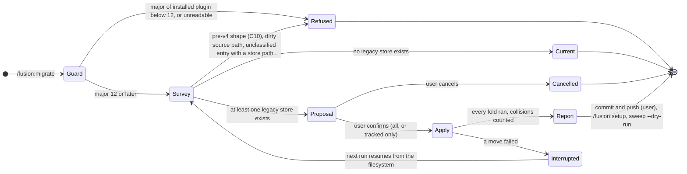
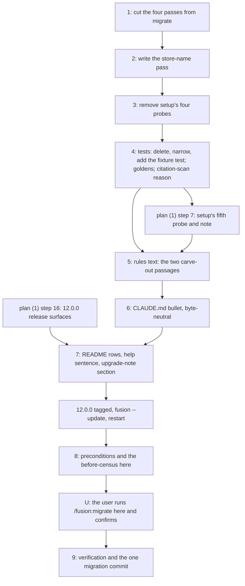

# Implementation Plan: Migrate a consuming project's workbench to the PRIOR/Fusion store names (part 2 of 2)

**Date:** 2026-09-22
**Status:** Approved at the plan gate on 2026-09-23; revised in place against `eef3ced0` the same day
**Spec:** 260922-1106_*_spec-prior-nomenclature-consumer-migration.md (Decided; the two user rulings of 2026-09-22, C5 and C10, and the nine defaults of its `## User Decisions Pending` stand)
**Cross-references:** 260922-1038-prior-mapping.md, nomenclature.md (this container), 260922-1045_*_spec-prior-nomenclature-plugin-source.md, 260922-1114_*_plan-prior-nomenclature-plugin-source.md, 260922-1125_*_does-the-store-name-migration-carry-its-mechanics-in-the-skill-body-or-in-a-bin-helper.md, 260910-2145_*_does-the-container-store-keep-the-directory-name-circles.md, 260822-1154_*_does-a-cut-only-circle-re-baseline-the-surfaces-it-cuts.md, 260822-1154_*_does-the-hook-test-line-budget-cover-comment-prose.md, 260910-2256_*_may-the-growth-bounds-be-raised-for-the-duration-of-the-container-restoration.md, and the seven `260922-1059_*` records this container holds (planning input; none is answered here and no step depends on an answer)
**Survey commit:** `eef3ced0` (first surveyed at `ad5535df`). Working tree clean on every shipped surface (only `fusion-workbench/orchestrator-events.jsonl` modified); the `work-graph` work the first survey found uncommitted has since landed. `npm test` in `hooks/` green at `eef3ced0` (exit 0; 58 files, 987 tests). Every figure below was re-measured at `eef3ced0` and names the command that produced it.
**Decidability:** The load-bearing question is *is this entry one the pass renames, one it leaves by rule, one it never opens, or one nobody has classified?* It is decidable: the pass enumerates the entries at exactly two directory levels (the workbench root and `shared/`) and the container-level `planning/` directories, and every entry falls in one of five named classes (`## Approach`, the classification table), the fifth being "unclassified". The spec's first stop condition, "a persisted store path on a surface the C4 table does not list", is not decidable in the general form (542 record lines carry such paths by design, and any file anywhere may) and is asked here in the form the mechanism can answer: an *unclassified* entry is grepped for a legacy store path, a hit stops the pass before the confirmation, and no hit leaves it reported. Two secondary questions are decidable from the filesystem alone: "does a legacy store still exist" (the detector, by directory presence, which is what makes the pass idempotent and resumable) and "is the installed plugin inside the window" (the major of `$FUSION_PLUGIN_ROOT/.claude-plugin/plugin.json`). No question here needs a change of mechanism.

## Directive

Make `/fusion:migrate` the one command a consumer runs inside the window part (1) opens: it surveys, proposes, asks, and then renames exactly `circles/`→`work-packages/`, `planning/`→`plans/` (under `shared/` and inside every container) and `shared/consult/`→`shared/consultations/`, moving directory entries only, rewriting no record, leaving the Review-class stores, `archive/`, the frozen stores and every root file where they stand, refusing what it cannot do safely, and resuming from the filesystem after an interruption. The four pre-v4 conversions leave the skill in the same commit, their setup probes with them, and the `v11.10.0` tag is named as the route for an older workbench (C10). The first confirmed run is on this repository's own workbench, after `12.0.0` is installed here (C9). The spec is not restated; each step cites the capability it realises.

## Current State

What was re-verified at `eef3ced0`, and where it differs from the spec's survey at `6420c14e`:

- **The skill body's byte figures moved.** `wc -c skills/migrate/SKILL.md` = 39 790. Since the first survey `8032ee97` and `35c775a9` added **`## Step 6 — Sweep the citations`** (771 bytes, `:199-203`): it runs `$FUSION_PLUGIN_ROOT/bin/fusion-citation-sweep --dry-run` behind an `-x` guard and asks before `--write --yes`, and it funded itself by compressing the bracket-reformat bullet in Step 4. `awk '/^## Step 2/{f=1} /^## Step 6/{f=0} f' skills/migrate/SKILL.md | wc -c` = **33 243**, the pre-v4 conversion text (Step 2 through Step 5). The rest: 3 513 bytes before `## Step 1` (535 of them the frontmatter), 366 for Step 1, 771 for Step 6, 1 897 for the guardrails. `skills/setup/SKILL.md` = 19 424, unchanged, of which the four probes' list and bullets (`:38-52`) are 3 209 bytes, the probe block (`:54`) 1 137, and the refusal text (`:56-64`) 1 346.
- **The skill surface's head-room is 72 bytes.** `cat skills/*/SKILL.md | wc -c` = 227 956 over 14 bodies; `SKILL_BASELINE` (`hooks/lib/__tests__/surface-growth-bound.test.ts:191-210`, nine entries, the five bodies with no entry counting in full) sums to 188 768, `SKILL_HEAD_ROOM` (`:278`) is 39 260, budget 228 028. `migrate/SKILL.md`'s own entry is 26 620, so it stands 13 170 above it.
- **The hook-test surface has 15 lines of room** (138 at the first survey's HEAD). `TEST_LINE_BASELINE` sums to 19 228, `TEST_LINE_HEAD_ROOM` (`:294`) is 3 030, budget 22 258; `surface-growth.golden` records 22 243. `live-circle-record-detection.test.ts` (77 lines) still has **no baseline entry**, so deleting it returns 77 lines of room.
- **The store-path carriers of C4 hold.** `**Active spec/plan:**` over `fusion-workbench/circles/*/*.md`: 36 value lines, 0 carrying `planning/`, `shared/` or `circles/`. `.guard-state/`: `circles/` stands in `citation-form.json` and `events.jsonl` (no longer in `staging-drift.json`); the directory is class L in full (`rules/workbench-tracking.md` `## The four classes`). `orchestrator-events.jsonl`: 4 767 rows, 84 with `circles/`, 45 with `planning/`. `shared/forum/`: 0 of 3 with a store path. `.gitignore`: 0 lines naming `circles`, `shared/planning` or `shared/consult`. `archive/`: **five** sweeps (`260922-1514-backlog-store-frozen` added by `e47977ca`), two of them (`260817-1907`, `260828-0043`) holding a `circles` subtree; never opened either way.
- **This workbench's root carries entries the spec's table does not name.** `agentstate.yaml`, `orchestrator-live.md`, `portfolio.md` (retired root files, listed in `.gitignore:89-105` as class L, and since `5d21d85f` named in `rules/workbench-tracking.md` as entries that left the layout; `portfolio.md` carries 0 `circles/` lines) and `shared/.DS_Store`. **`shared/backlog/` is gone from this workbench**: `e47977ca` moved its two entries into the archive sweep above, and `rules/fusion-workbench-conventions.md:68` now names it the third frozen store beside `stashes/` and `.migration-v2-backup/`. A consumer's workbench may still hold one, so it stays in the classification table, now in the frozen row.
- **Counts** (as of `eef3ced0`; step 8 re-takes them). 40 containers, 37 with `planning/`, 18 empty directories under `circles/`, 8 files under `shared/planning/`, 2 under `shared/consult/`, 3 019 tracked files under `fusion-workbench/`, 0 untracked entries under `circles/`, one item claimed by this checkout (`260923-0839-implement-prior-nomenclature`). `stashes/` and `.migration-v2-backup/` are absent here.
- **The existing tests and code that read the pre-v4 passes.** `hooks/lib/__tests__/live-circle-record-detection.test.ts` lifts setup's probe block and migrate's second survey block by heading anchor (`helpers/prompt-blocks.ts` `extractBashBlock`), builds a throwaway workbench under `mkdtempSync`, and runs them with a real `bash`: **that is the fixture-based shell-level pattern the dispatch asked for, and the repository already has it.** `path-literal-lint.test.ts:273-287` pins the bracket-probe `find` expression byte-identical across setup's probe, migrate's survey and migrate's reformat pass (three sites). `marker-format-lint.test.ts:43` exempts `setup` and `migrate` and `:94-105` asserts both still name the bracket form. `fenced-code-exemption.test.ts:190-194` reads `RETIRED_LAYOUT_FILES["skills/migrate/SKILL.md"]` (`hooks/lib/citation-scan.ts:648-654`, doc comment `:632-647`), whose reason string describes "the pre-v4 -> v4 layout conversion". **New since the first survey (`78328863`):** `citation-scan.ts:383-389` says `markerAtHead()`'s bracket-to-underscore rule, `s/\[([oatcibspd])\]-/_\1_/g`, is "read off" migrate's bracket-marker bullet under Step 4, and `citation-sweep.test.ts:196` says the hyphen is absorbed "exactly as `/fusion:migrate` absorbs it"; both are comments, no test reads the skill for the rule, and both go stale when step 1 deletes that bullet. `hooks/citation-sweep.ts:213-221` says migrate runs the sweep as a dry run and asks, which stays true while Step 6 stands. `derivable-enumerations-lint.test.ts` parses `const SEL = [...]` in setup and the skill-row table in `README-agents.md`; neither the probes nor migrate's prose are enumerations it holds.
- **The version-read idiom exists.** `skills/setup/SKILL.md:72`: `V="$(grep '"version"' "$FUSION_PLUGIN_ROOT/.claude-plugin/plugin.json" | head -1 | sed -E 's/.*"version": *"([^"]+)".*/\1/')"`. The installed copy here (`~/.fusion/.claude-plugin/plugin.json`) reads `11.11.1`, equal to HEAD; the newest tag is `v11.11.1`, not `v11.10.0` (`## Open Questions` on which tag the C10 route names).
- **The move machinery exists.** `move_one` in migrate's Step 4 (refuse an existing destination, `git mv` in `git` mode, `mv` fallback counted, error on stderr) and the type-folder loop's "move by content, then `rmdir`" are the two pieces the new pass reuses verbatim; the reason for moving by content (`git mv dir shared/dir` nests when the destination exists) is stated at migrate `:178` and holds for every rename here.
- **Plan (1) has landed beside this plan** (`260922-1114_*_plan-prior-nomenclature-plugin-source.md`) and fixes names this plan uses: `OUT_PACKAGES`/`SCAN_PACKAGES` for the container keys, `bin/fusion-claimed-package` with `PACKAGE=`, `bin/fusion-stores` as the bash definition, and `hooks/lib/stores.ts` `WINDOW_LEGACY_NAMES`. Its step 7 names edits to migrate's blocks that this plan deletes; `## Sequencing against plan (1)` resolves the overlap.

## Approach

One mechanism carries every rename: **`fold_store SRC DST`**, which creates `DST`, moves each entry of `SRC` into it with the existing `move_one` (an existing destination entry is a refused collision, never an overwrite), and removes the drained `SRC` with `rmdir`. Applied four times over (`shared/consult`, `shared/planning`, each container's `planning`, and last `circles` itself), it gives the side-by-side fold of C3, the per-entry collision refusal, and the resume-from-filesystem property in one function: an interrupted fold leaves the rest of `SRC` where it was, the detector (directory presence) fires on the next run, and the fold continues into the `DST` that now exists. Nothing is copied, nothing is deleted, nothing is rewritten. The pairs are spelled in the body rather than read from `bin/fusion-stores`, because the closing release deletes the legacy entries from every definition site and the pass must outlive it (`260922-1125_*_does-the-store-name-migration-carry-its-mechanics-in-the-skill-body-or-in-a-bin-helper.md`, option 1, this plan's default). **No `bin/` helper is planned**, and the mechanics stay in the two exempt skill bodies; the freed pre-v4 text is the budget (spec C10).

The pass has five stop conditions before the confirmation, disjoint and complete over what the survey can find, and each names what the user does:

| Condition | Found by | The user does |
|---|---|---|
| installed plugin below the window, or its version unreadable | the major of `$FUSION_PLUGIN_ROOT/.claude-plugin/plugin.json` is under 12, or the file or the variable is missing | `fusion --update`, restart, run again (C3) |
| a pre-v4, v4-era or bracket-marked shape | the four C10 detectors (`## Data Structures`) | check out `v11.10.0`, `claude --plugin-dir <that checkout>`, `/fusion:migrate` there, then update and run again (C10) |
| an uncommitted change under a path the pass would move (`git` mode) | `git status --porcelain` over the sources, `??` rows excepted | commit or stash, run again (C3) |
| an unclassified entry at the root or under `shared/` that carries a legacy store path | the classification table below, then `grep -rlE` over the unclassified entries | rule on the entry; the table gains a row (spec `## Stops when`, first clause) |
| a collision (an entry whose destination exists) | the survey's per-entry check | decide which side is real; the rest of the run proceeds and the refused entries are named (C3) |

Only the last one lets the run continue; the first four stop it before the question. Every message the blocks print is English; every sentence put to the user follows the chat language and profile, as the existing skill states.

**The classification table**, applied to every entry `ls -A` returns at the workbench root and under `shared/`, plus every `planning/` directly inside a container under `circles/` or `work-packages/`:

| Class | Entries | Treatment |
|---|---|---|
| rename | `circles`, `shared/planning`, `shared/consult`, `<container>/planning` | folded into its new name |
| new name (side-by-side) | `work-packages`, `shared/plans`, `shared/consultations`, `<container>/plans` | the fold's destination; its existence is the ordinary post-update state, not a collision |
| left by rule, with the record that holds its question | `shared/issues`, `shared/memos`, `shared/history`, `shared/checkouts`, `stilwerk`, `.guard-state` (one `260922-1059_*` record each); `shared/forum`, `shared/discussions`, `orchestrator-events.jsonl`, `.commit-lock`, `.cadence-anchors`, `.session-marker`, `.checkout-id`, `.asset-provenance`, `monitor` (the seventh record) | reported with its basename, never opened |
| left, no record owed | `shared/analyses`, `shared/investigations`, `shared/decisions`, `shared/reviews` (Retain), `.fusion-setup` (the marker), `agentstate.yaml`, `orchestrator-live.md`, `portfolio.md`, `.active-circle` (retired root files `.gitignore` already names as class L; nothing reads them) | reported in one line each; the retired four named as deletable by hand |
| frozen | `archive`, `stashes`, `.migration-v2-backup`, `shared/backlog` (the three frozen stores `rules/fusion-workbench-conventions.md:68` names) | never opened, listed byte-identical before and after (C2) |
| unclassified | anything else | grepped for `circles/|planning/|consult/`; a hit stops the run, no hit is reported and left |



The step order puts the cut and the new pass first, in one commit, because the freed bytes are the only budget the skill surface has and plan (1)'s own edits to `skills/` draw on the same surface. The docs land after plan (1)'s release surfaces exist, and the first run here waits for `12.0.0` to be installed.



## Sequencing against plan (1)

Both plans edit `skills/migrate/SKILL.md`, `skills/setup/SKILL.md`, `hooks/lib/__tests__/path-literal-lint.test.ts`, `hooks/lib/__tests__/live-circle-record-detection.test.ts`, `rules/fusion-workbench-conventions.md`, `CLAUDE.md`, `README-agents.md`, `skills/help/SKILL.md` and `docs/upgrading-to-v12.md`. The dependencies, in both directions:

Re-checked at `eef3ced0`: every edge below still holds. Plan (1) now carries the one interleaved list both plans execute from (`260922-1114_*_plan-prior-nomenclature-plugin-source.md` `## Execution order across both plans`); it places steps 1 to 4 here directly after plan (1) step 1, the probe, and before any tree edit of plan (1).

- **Steps 1 to 4 here land before plan (1) step 7, and before plan (1) steps 2 and 3.** Plan (1) step 7 was written to retarget `mkdir -p` and `printf` targets in migrate's Step 2 and Step 4 blocks (`:59`, `:118`), keep the three-site pin at `path-literal-lint.test.ts:273-287` byte-identical, and re-fixture `live-circle-record-detection.test.ts`; steps 1, 2 and 4 here delete all three, and plan (1) step 7 is now amended to its setup half only (the `mkdir` retarget and the fifth probe with its window note, whose test cases join `store-name-migration.test.ts`). It has some 25 000 bytes of skill room instead of the 72 at `eef3ced0`. Plan (1) step 2 edits `path-literal-lint.test.ts` and plan (1) step 3 edits `citation-scan.ts`, the two files step 4 here also edits; landing here first keeps each edit on the text it was planned against.
- **Step 3 here leaves the probe block's skeleton for plan (1) step 7 to fill**: `WB=./fusion-workbench; OLD=0; … echo "OLD=$OLD"` with no detector inside, and the `OLD=0` continue line. Plan (1) step 7 adds the legacy-store case that prints one note and continues; the post-window refusal is the closing release's (`13.0.0`, plan (1) step 16's `## Releasing` step, which should name it; `## Open Questions`).
- **Step 5 here lands after plan (1) step 7** (it cites setup's probe as it then stands) and after plan (1) step 2 (which edits `## fusion-workbench Layout`, the section holding the paragraph step 5 rewords).
- **Step 6 here lands after plan (1) step 10** (its `CLAUDE.md` term pass), so the bullet is rewritten once.
- **Step 7 here lands after plan (1) step 16** (which creates `docs/upgrading-to-v12.md` and the `README.md` upgrade paragraph) and after plan (1) step 11 (help's release entry); this plan owns one section of the note and one sentence of the help topic.
- **Steps 8, U and 9 land after the `12.0.0` release, `fusion --update` and a restart.** They use plan (1)'s names: `bin/fusion-claimed-package`, `SCAN_PACKAGES` (the spec's C9 criterion spells `SCAN_BACKLOG`; plan (1) renamed the key after the spec was written).
- **Shared budgets.** The skill surface: steps 1 to 3 free some 38 500 bytes and step 2 spends at most 14 000; what remains is what plan (1) steps 7 and 11 draw on. The hook-test surface: step 4 returns 93 lines (77 + 16) against **15 lines of room** at `eef3ced0` (138 at the first survey), so the new test fits without a cut only at 108 lines or fewer; every line above that is paid by a comment-prose cut (`260822-1154_*_does-the-hook-test-line-budget-cover-comment-prose.md`) in the same commit. Plan (1) steps 4 to 7 then add tests against what is left and are planned to take comment-prose cuts of their own. A cut is the remedy for whichever plan runs short, never a baseline move.

## Byte budget

Measured with `cat skills/*/SKILL.md | wc -c` against 228 028; every figure past the first row is an estimate to be replaced by the measurement in the appendix at the step's commit.

| After step | `migrate/SKILL.md` | `setup/SKILL.md` | `help/SKILL.md` | surface total | room |
|---|---|---|---|---|---|
| HEAD `eef3ced0` (measured) | 39 790 | 19 424 | 16 141 | 227 956 | 72 |
| 1 (cut, frees 33 243 plus the rewritten preamble and guardrails; Step 6 kept) | ≈ 5 900 | 19 424 | 16 141 | ≈ 194 100 | ≈ 33 900 |
| 2 (write, spends ≤ 14 000) | ≤ 19 900 | 19 424 | 16 141 | ≤ 208 100 | ≥ 19 900 |
| 3 (setup cut, frees ≈ 5 400 of the 5 692 measured) | ≤ 19 900 | ≈ 14 000 | 16 141 | ≤ 202 700 | ≥ 25 300 |
| 7 (help sentence, spends ≤ 300) | ≤ 19 900 | ≈ 14 000 | ≤ 16 450 | ≤ 203 000 | ≥ 25 000 |

Steps 1 to 3 are one commit, so the surface is measured once at that commit; the row split says which step frees and which spends. `CLAUDE.md` and `rules/fusion-workbench-conventions.md` are charged to every dispatch path at zero head-room (`hooks/lib/__tests__/fixtures/dispatch-path.baseline`), so steps 5 and 6 are byte-neutral or shrinking on those two files, measured with `wc -c` before and after.

## Implementation Steps

1. **Cut the four pre-v4 conversions from `/fusion:migrate`**
   - Executor: `coder`
   - Files: `skills/migrate/SKILL.md`
   - Changes: delete everything from `## Step 2 — Survey what would move` up to `## Step 6 — Sweep the citations` (the 33 243 bytes: the two survey blocks and the counter table, the status mapping, Step 3's question, Step 4's block, Step 4b, the "what the moves do" list, Step 5). **`## Step 6 — Sweep the citations` stays** (added by `8032ee97`, `35c775a9` after the first survey): it is the existing, guarded call of `bin/fusion-citation-sweep` through the plugin root, and it is what the new pass's report would otherwise re-describe; step 2 re-grounds its first sentence. Rewrite the frontmatter `description` to name the store-name pass and nothing else (C1, fourth criterion): "Bring a fusion workbench to the v12 store names: `circles/` to `work-packages/`, `planning/` to `plans/` in `shared/` and in every container, `shared/consult/` to `shared/consultations/`. Directory renames only; no record is rewritten, nothing in `archive/` or the Review-class stores moves. Surveys first, asks before moving, never overwrites, resumes after an interruption. A pre-v4 workbench is refused and routed to the `v11.10.0` tag." Rewrite the preamble's "three parts" paragraphs to the one part the skill now has, keep `## Why this skill does not call bin/fusion-paths` and `## Step 1` as they stand, and rewrite `## Guardrails` (drop the status, container, claim and head-block rules that belonged to the removed passes; keep never-without-a-choice, never-overwrite, never-touch-the-root-anchored-surfaces without the `.active-circle` exception, never-commit; add never-open-a-record and never-rename-inside-`archive/`).
   - Dependencies: none
   - Acceptance: `grep -cE 'rewrite_fields|reformat_one|_circle\.md|codereview|\.active-circle' skills/migrate/SKILL.md` is 0 except in the C10 detector step 2 adds (`_[at]_circle.md`); `grep -c '^## Step 6 — Sweep the citations' skills/migrate/SKILL.md` is 1; `wc -c` recorded in Appendix A. Commits with steps 2 and 3.

2. **Write the store-name pass**
   - Executor: `coder`
   - Files: `skills/migrate/SKILL.md`
   - Changes, in the skill's existing shape and counter discipline:
     - `## Step 2 — Guard and survey`. First block: the version guard (`## Data Structures`), which prints `INSTALLED=<version>` and `WINDOW=open|closed` and stops the skill on `closed` with one line naming the installed and the required version and the two commands. Second block, read-only: the four C10 detectors, printing one line per shape found and `LEGACY=0|1`; the classification of every root and `shared/` entry into the six classes of `## Approach`, one line per entry with its class and, for the left-by-rule class, the record's basename; the rename survey, one line per source (`shared/consult/ -> shared/consultations/  N entries`, `shared/planning/ -> shared/plans/  N entries`, `<container>/planning/ -> plans/  N entries` per container, `circles/ -> work-packages/  N entries`), the collision lines (`COLLISION: <dst> exists; <src> stays`), the empty-directory count, the untracked-entry count in `git` mode, and `MODE=git|plain`; the `.gitignore` grep (`grep -nE 'fusion-workbench/(circles|shared/planning|shared/consult)' .gitignore`, each hit reported, never rewritten); the dirty check in `git` mode (`git status --porcelain` over the sources, `??` excluded, each row printed as `DIRTY: <path>`); the unclassified grep. Tail: `FOUND=`, `LEGACY=`, `COLLISIONS=`, `EMPTY=`, `UNTRACKED=`, `DIRTY=`, `UNKNOWN=`, `LEFT=`. A counter table says which counters trigger the question (`FOUND`, `COLLISIONS`) and which stop it (`LEGACY`, `DIRTY`, `UNKNOWN`).
     - The prose after the block: the refusal texts for `LEGACY=1` (one message naming the tag `v11.10.0`, `claude --plugin-dir <checkout of that tag>`, `/fusion:migrate` there, then `fusion --update` and `/fusion:migrate` again), for `DIRTY>0` and for `UNKNOWN>0`; `FOUND=0` stops with "already in the v12 format", asking nothing.
     - `## Step 3 — Ask before moving`: `MODE` said out loud as today; one `AskUserQuestion` in the chat language with the survey above it and at most three options: convert as listed (recommended); in `git` mode with `UNTRACKED>0`, convert the tracked entries only and leave the untracked ones named; cancel. The question states that no file's content changes and every basename survives, that `archive/`, the Review-class stores, `stilwerk/` and the root files stay, and in `plain` mode that the move appears in no diff and has no `git revert`.
     - `## Step 4 — Apply`: one block with `set -u`, `MODE` recomputed, `move_one` verbatim from the current skill, `fold_store` (`## Data Structures`), and the four calls in the spec's order: `shared/consult`→`shared/consultations`, `shared/planning`→`shared/plans`, every `<root>/<container>/planning`→`plans` for both roots, then `circles`→`work-packages`. With "tracked only" chosen, `move_one` skips an entry `git ls-files` does not list and counts it as `left`. No `git add`, no `git commit`, no `cp`, no `rm -r`; `rmdir` is the only removal and its failure is printed. Tail: `moved= mv-fallbacks= collisions= left= mode=`.
     - `## Step 5 — Report`: the counters; one line per left-by-rule entry with its record; the `.gitignore` hits; every untracked entry moved by `mv` (what `git revert` will not restore); what to do next in this order: commit the migration as one commit and push it, tell the other checkouts to pull (C7), run `/fusion:setup`. In `plain` mode, that nothing here is in a diff.
     - `## Step 6 — Sweep the citations`, kept from step 1: its first sentence says the pass moves directories and rewrites no record, so citations spelling a moved store segment (C4) or a pre-v4 marker are the other half; one sentence says a yes writes record content, which stays unstaged beside the staged renames and is committed separately after the migration commit (spec C9 step 5). The guard, the dry run, the ask and its `260830-1842_*` paragraph stand as written.
     - `## Guardrails` as step 1 left them, plus: never rename inside `archive/`, `stashes/`, `.migration-v2-backup/` or `shared/backlog/`; never open a record.
   - Dependencies: step 1 (same commit)
   - Acceptance: the four C10 acceptance criteria of the spec that concern the skill body (first and second bullets); C2's acceptance over a fixture (step 4 proves it); every `find` in the body is anchored at `./fusion-workbench` and none reaches `archive/`; `wc -c skills/migrate/SKILL.md` ≤ 19 900 and the surface total recorded in Appendix A; `bash -n` on every extracted block exits 0.

3. **Remove the four pre-v4 probes from `/fusion:setup`**
   - Executor: `coder`
   - Files: `skills/setup/SKILL.md`
   - Changes: in `### Superseded-format check`, delete the numbered four shapes (`:38-43`), the three probe bullets (`:47-51`), the four detectors inside the block (`:54`) and the `OLD=1` refusal text (`:56-64`). Keep the heading, the paragraph saying the container store is the current layout (plan (1) re-terms it), one sentence "Detection is by artifact presence, not by version", the block reduced to `WB=./fusion-workbench; OLD=0; echo "OLD=$OLD"` and the `OLD=0` continue line, and add one sentence: a pre-v4, v4-era or bracket-marked shape is `/fusion:migrate`'s to recognise, and it refuses with the `v11.10.0` route. The `mkdir` retarget to the new names is plan (1) step 7's.
   - Dependencies: step 2 (same commit; spec C10: the probes go in the commit that removes the passes they route to)
   - Acceptance: `grep -cE '\[[oatcibspd]\]|_\[at\]_circle|codereview|type folder' skills/setup/SKILL.md` is 0; `/fusion:setup` on a pre-v4 fixture proceeds (C10, third criterion, the `12.0.0` half; the fifth probe is plan (1)'s); `wc -c` recorded.

4. **The tests: delete, narrow, add; regenerate the golden; reword the citation-scan reason**
   - Executor: `coder`
   - Files: `hooks/lib/__tests__/live-circle-record-detection.test.ts` (deleted), `hooks/lib/__tests__/path-literal-lint.test.ts`, `hooks/lib/__tests__/marker-format-lint.test.ts`, `hooks/lib/__tests__/store-name-migration.test.ts` (new), `hooks/lib/__tests__/fixtures/surface-growth.golden` (regenerated), `hooks/lib/__tests__/reference-resolution-lint.test.ts:492` (the pin, re-approved), `hooks/lib/__tests__/citation-sweep.test.ts:196` (comment), `hooks/lib/citation-scan.ts` (the header's bracket paragraph at `:185-221`, the `markerAtHead()` comment at `:383-389`, and `RETIRED_LAYOUT_FILES` with its doc comment at `:632-654`), `hooks/dist/` (rebuilt)
   - Changes: delete `live-circle-record-detection.test.ts` (both blocks it lifts are gone). The step 1 cut removes shipped citations, so the reference pin moves: re-approve it with an attributed line above the constant, as the file prescribes. In `path-literal-lint.test.ts` delete the describe "setup's bracket probe and migrate's reformat list are one string" (`:273-287`; one site cannot be held equal to itself) and reword the `EXEMPT_SKILLS` comment (`:39-44`): setup names the stores it scaffolds and, during the window, the legacy store it reports; migrate names both sides of the rename. `EXEMPT_SKILLS` itself stays `setup, migrate` (C1, second criterion). In `marker-format-lint.test.ts`, `EXEMPT_SKILLS` becomes `["migrate"]` and the load-bearing block iterates migrate alone (setup no longer names the bracket form, and the test's own message says a dead exemption is dropped); the header comment follows. New `store-name-migration.test.ts`, at most 180 lines, of which only the first 108 fit the 15 lines of room at `eef3ced0` plus the 93 this step returns; every line above 108 is paid in this commit by a comment-prose cut on the test surface, each named in Appendix A. In the deleted file's pattern (`extractBashBlock` by heading anchor, `mkdtempSync` workbench, real `bash`, the claimed-item test's `env` with git config pointed at `/dev/null`): (a) a v12-format tree gives `FOUND=0`; (b) a legacy tree with two containers, `shared/planning`, `shared/consult`, one empty per-kind directory and one container `planning/` proposes the four renames with the right counts, and apply leaves no `circles/`, `planning/` or `consult/` directory, an identical sorted basename listing, and the empty directory as `plans/`; (c) a second apply moves nothing and the survey gives `FOUND=0`; (d) `work-packages/<c>` pre-existing beside `circles/<c>` is refused and named, everything else moves, `circles/` survives holding only `<c>`; (e) one entry pre-moved by hand, then apply, reaches the same end state as (b); (f) each of the four pre-v4 shapes gives `LEGACY=1` and the refusal text names `v11.10.0`; (g) `FUSION_PLUGIN_ROOT` pointing at a scratch `.claude-plugin/plugin.json` at `11.10.0` gives `WINDOW=closed` naming both versions, and at `12.0.0` gives `open`; (h) in a `git init` tree with the fixture committed, apply yields only `R` rows in `git status --porcelain`, and a modified tracked file under `circles/` gives `DIRTY=1` in the survey. Regenerate `surface-growth.golden` with `UPDATE_SURFACE_GOLDEN=1` on a tree where only this commit's changes are uncommitted, and read the diff. In `citation-scan.ts`, the `RETIRED_LAYOUT_FILES` reason and its doc comment read "the v11 -> v12 store-name migration, the transition between two layouts, both named literally"; the `markerAtHead()` comment states the rename rule in place and names it as `/fusion:migrate`'s up to the last v11 tag, since the skill no longer carries it; the header's bracket paragraph drops "where `/fusion:migrate` is the pressure to rewrite one" for the past tense, and `citation-sweep.test.ts:196` likewise. Line-neutral or shorter. Rebuild `dist/` and commit it.
   - Dependencies: step 3 (same commit)
   - Acceptance: `npm test` in `hooks/` green at the commit, with no baseline figure changed and no head-room constant raised; the hook-test surface's line total and any comment-prose cut recorded in Appendix A; the reference pin re-approved with its attribution line; `fenced-code-exemption.test.ts` still green on the reworded entry; C1 second and third criteria, C3 first, second, third and fifth criteria, and C10 second criterion hold on the fixtures.

5. **The two rule passages that describe the carve-out**
   - Executor: `coder`
   - Files: `rules/fusion-workbench-conventions.md` (`## fusion-workbench Layout`, the paragraph at `:68`, which `e47977ca` turned into "Three legacy stores are absent" by adding `shared/backlog/`), `rules/workbench-path-resolution.md` (`### The one consumer that names the layout literally`, and the setup sentence at `:84`)
   - Changes: the conventions paragraph cites "the Probe 3 bullet under the migration probes in `skills/setup/SKILL.md`" for the cost of a probe reaching a frozen store; that bullet is gone, so the sentence cites `/fusion:migrate`'s frozen-store rule instead and keeps the cost in its own words, net ≤ 0 bytes. The resolution rule's carve-out paragraph names the pre-v4 shapes as "the old sides"; it names the v11 store names instead, keeps the reasoning (the resolver's answers do not describe a tree being moved), and the `:84` sentence says setup names the stores it scaffolds and, for the window, the legacy store it reports. Provenance headers untouched.
   - Dependencies: step 4; plan (1) step 2 and step 7
   - Acceptance: `wc -c rules/fusion-workbench-conventions.md` not above its figure before the edit; `rules-emission-golden.test.ts` and `reference-resolution-lint.test.ts` green (the pin re-approved with its attribution line if a citation moved); `grep -n 'Probe 3' rules/*.md` empty.

6. **The `CLAUDE.md` bootstrap bullet**
   - Executor: `coder`
   - Files: `CLAUDE.md` (`## Conventions`, the "Workbench bootstrap is exclusive to `/fusion:setup`" bullet)
   - Changes: the sentences from "Since v4.0.0, setup also detects a pre-v4 (type-folder) workbench" to the end of the bullet say what holds at `12.0.0`: setup reports a legacy store during the window and does not refuse; `/fusion:migrate` performs the store-name migration and is the only skill that names both layouts literally; the pre-v4 conversions live at the `v11.10.0` tag; `EXEMPT_SKILLS` still enumerates the two. Net bytes ≤ 0 (the bullet is charged to all eleven dispatch paths at zero head-room).
   - Dependencies: step 5; plan (1) step 10
   - Acceptance: `wc -c CLAUDE.md` not above its figure before the edit; `rules-emission-golden.test.ts` green; `claude-md-weight.test.ts` green.

7. **The release surfaces this plan owns: two README rows, one help sentence, one upgrade-note section**
   - Executor: `coder`
   - Files: `README-agents.md` (the `/fusion:setup` and `/fusion:migrate` rows of the skill table, `:247` and `:249`), `skills/help/SKILL.md` (`### 4. Update`), `docs/upgrading-to-v12.md` (a section `## Migrating your workbench`), `README.md` only if plan (1) step 16's upgrade paragraph does not already name `/fusion:migrate`
   - Changes: the migrate row says the store-name pass, the refusals, and the `v11.10.0` route; the setup row says it reports a legacy store and continues during the window. The help topic gains one sentence: an older workbench converts with the `v11.10.0` tag via `claude --plugin-dir` before updating (C10, fifth criterion). The note's section carries, in order: `fusion --update`, restart, `/fusion:migrate`, commit and push the migration as one commit, tell the other checkouts to pull (C8); what a consumer sees when it updates without migrating (nothing breaks inside the window, new records land under the new names beside the legacy store, setup prints one note; after `13.0.0` setup refuses); the multi-checkout procedure of C7 (one checkout migrates, the others pull; an untracked local container is folded by a second `/fusion:migrate` run; a tracked modification is git's ordinary pull refusal); that no record is rewritten and `bin/fusion-citation-sweep --dry-run` is the hand-run repair for store-prefixed citations; that `archive/` keeps its old inner names for good; and the `v11.10.0` route in one sentence. The closing release is named as `13.0.0`, the same figure plan (1) writes.
   - Dependencies: step 6; plan (1) steps 11 and 16
   - Acceptance: C8 first criterion and C10 fifth criterion as stated; `derivable-enumerations-lint` green (it parses the skill-row table); the reference pin re-approved for the new section's citations; `wc -c skills/help/SKILL.md` delta ≤ 300 and the surface total recorded.

8. **Preconditions and the before-census for the first run on this repository's workbench**
   - Executor: `coder`
   - Files: none in the tree; census files under the scratchpad directory
   - Changes: verify and report each precondition as a yes/no line: plan (1) steps 1 to 16 are `[DONE]` and `12.0.0` is tagged and pushed (`git tag --sort=-v:refname | head -1` is `v12.0.0`); `fusion --update` has been run and the session restarted so that `grep '"version"' "$FUSION_PLUGIN_ROOT/.claude-plugin/plugin.json"` reads `12.0.0`; `git status --porcelain` is empty (the other item's `work-graph` work committed, this container committed); `npm test` in `hooks/` is green on the unmigrated workbench; the claim state of this checkout (`bin/fusion-claimed-package` output) is recorded. Take the census: `find fusion-workbench -type f | sed 's#.*/##' | sort > before-basenames.txt`; `find fusion-workbench/archive | sort > before-archive.txt`; `bin/fusion-citation-check` over the workbench with its `dangling` and `store-prefixed` figures; `shasum` over `orchestrator-events.jsonl`, `.guard-state/*` and every `history/` directory's file list.
   - Dependencies: step 7, and the `12.0.0` release performed by the steps of `README-agents.md` `## Releasing` at the user's word
   - Acceptance: every precondition line reads yes; a no stops here and names the line.

U. **The run** (performed by the user, not an executor: `/fusion:migrate` is a slash command with its own confirmation, and the version guard makes it runnable only in a session whose installed plugin is `12.0.0`). The user runs it in this repository, reads the survey (expected as of `eef3ced0`, re-taken at step 8: 40 containers of which 37 fold a `planning/`, 8 and 2 entries under the two shared stores, 18 empty directories, 0 collisions, 0 untracked entries, `LEFT` naming the three retired root files and the Review-class stores with their records; `shared/backlog` is no longer present here), and confirms. The confirmation gate is the skill's own `AskUserQuestion`; nothing in this plan pre-answers it. Step 6's separate write offer is answered no in this run, so that step 9 measures the renames alone; the `--write` run stays a later act on the user's word (`## Open Questions`).

9. **Verification of the first run, and the migration commit**
   - Executor: `coder`
   - Files: none edited; the migration's staged renames committed as one commit at the user's word, under the commit lock
   - Changes: run and report, each as a yes/no line with the command: `git diff -M --cached --numstat` shows `0 0` on every row and no `D` row (C4 first, C5 first criteria); `find fusion-workbench -type f | sed 's#.*/##' | sort` equals `before-basenames.txt`; `find fusion-workbench/archive | sort` equals `before-archive.txt`; `ls fusion-workbench` shows `work-packages` and no `circles`; `ls fusion-workbench/shared` shows `plans` and `consultations` and neither `planning` nor `consult`; `find fusion-workbench/work-packages -mindepth 2 -maxdepth 2 -type d -name planning` is empty and the `plans` count equals the `planning/` count step 8 recorded (37 at `eef3ced0`); the `shasum` lines of step 8 are unchanged; `bin/fusion-citation-check` reports the same `dangling` and `store-prefixed` figures as step 8 (C4 second criterion); `npm test` in `hooks/` is green on the migrated workbench (C9 second criterion; a red test that reads the old store literally stops the work, `## Where this work stops`); `bin/fusion-paths shaper` prints `SCAN_PACKAGES=work-packages` and `OUT_PLAN` ending in `plans` (C9 third criterion, under plan (1)'s key name); `bin/fusion-claimed-package` answers with the item recorded in step 8 under `work-packages/`, or with the empty answer if none was claimed; `/fusion:migrate` run a second time surveys and stops with nothing to do (C3 first criterion). Then the commit: the staged renames only, message `chore(workbench): migrate this repository's workbench to the v12 store names`, and `git log --follow` on one moved file reaches its pre-migration history (C2 third criterion). Finally `bin/fusion-citation-sweep --dry-run` over the workbench; its census goes into the step's report verbatim, and no `--write` run happens (C9 step 5; a write is the user's separate word).
   - Dependencies: step 8, U
   - Acceptance: every line reads yes; the commit is one commit of renames only after the `12.0.0` commit (C9 first criterion).

(Every step MUST declare exactly one Executor from the active executor set. See "Executor Agents" above for the set and routing rules. Steps are updated inline by agents per `fusion-workbench-conventions.md`. **A step's stated endpoint is a state the artifact can occupy, or the step names the write that makes it one.** No step routes to `ontocoder`: the plan touches no data file. `surface-growth.golden` is regenerated by its instrument in step 4, never edited, and `.claude-plugin/plugin.json` is plan (1) step 15's.)

## Where this work stops

- Steps 1 to 9 are `[DONE]`, and `npm test` in `hooks/` is green at the migration commit with no baseline figure changed and no head-room constant raised, or with a raise the user ruled and `README-hooks.md` `### Growth bounds on the shipped text` logs.
- If the survey on any workbench finds an unclassified entry at the root or under `shared/` that carries a legacy store path, the pass stops before the confirmation and reports the entry; the classification table is extended by a ruling, never by the pass guessing. (Spec `## Stops when`, first clause, in the decidable form `**Decidability:**` states.)
- If the version guard finds the installed plugin below `12.0.0`, or cannot read its version, the pass stops before surveying. (Spec, second clause.)
- If a move fails midway, the pass stops, prints what moved and what did not, and the next run resumes from the filesystem; nothing is undone automatically. (Spec, third clause.)
- If, after step 2 is written, the skill surface is over its bound and the executor can name no cut on that surface that removes only what this work added, the work stops and the head-room question goes to the user as its own ruling (`260910-2256_*_may-the-growth-bounds-be-raised-for-the-duration-of-the-container-restoration.md`'s shape), never a baseline move. (Spec, fourth clause.) The same holds for the hook-test surface at step 4, with the comment-prose cut as the first remedy.
- If the first run here (step 9) turns `npm test` red on a test that reads the old store literally, the work stops at that test and it is re-keyed under plan (1)'s C1, not patched around in the migration. (Spec, fifth clause.)
- If the user rules option 2 or 3 on `260922-1125_*_does-the-store-name-migration-carry-its-mechanics-in-the-skill-body-or-in-a-bin-helper.md`, the work stops after step 1 and steps 2 and 4 are re-planned around the helper (condition did not arise: option 1 was ruled on 2026-09-23).
- The `12.0.0` release itself is performed by the steps of `README-agents.md` `## Releasing` at the user's word, after plan (1) step 16 and step 7 here; it is a precondition of step 8, not of this plan's closure alone.
- The seven `260922-1059_*` records stay `_o_` at the end of this work (C6, third criterion); the Review-class pass is a later item.
- The `--write` run of `bin/fusion-citation-sweep` over the 79 live records is not this plan's work; step 9 files the dry-run census and stops.

## Data Structures

The version guard (Step 2, first block), reusing setup's idiom:

```bash
V="$(grep '"version"' "$FUSION_PLUGIN_ROOT/.claude-plugin/plugin.json" 2>/dev/null | head -1 | sed -E 's/.*"version": *"([^"]+)".*/\1/')"
M="${V%%.*}"
if [ -n "$V" ] && [ "$M" -ge 12 ] 2>/dev/null; then echo "INSTALLED=$V"; echo "WINDOW=open"; else echo "INSTALLED=${V:-unreadable}"; echo "WINDOW=closed"; fi
```

Comparison on the major alone: the window opens at a major, closes at a major, and the pass runs at every later major (C8), so no minor or patch component decides anything.

The four C10 detectors (Step 2, second block; each the shape a removed pass converted, and nothing wider):

```bash
LEGACY=0
for d in planning issues decisions history analyses investigations consult memos codereview ontoreview conceptreview; do [ -d "$WB/$d" ] && { echo "  $d/ (root type folder)"; LEGACY=1; }; done
find "$WB/circles" -mindepth 1 -maxdepth 1 -type f -name '*.md' 2>/dev/null | grep -E '/[0-9]{6}-[0-9]{4}\[[a-z]\][^/]*\.md$' | head -1 | grep . && LEGACY=1
{ [ -d "$WB/shared" ] && find "$WB/shared" -type f -name '*[[]*[]]*.md' 2>/dev/null; [ -d "$WB/circles" ] && find "$WB/circles" -mindepth 2 -type f -name '*[[]*[]]*.md' 2>/dev/null; } | grep -E '\[[oatcibspd]\]-[^/]*$' | head -1 | grep . && LEGACY=1
find "$WB/circles" -mindepth 2 -maxdepth 2 -type f -name '_[at]_circle.md' 2>/dev/null | head -1 | grep . && LEGACY=1
```

The store-name detector (directory presence, the idempotency and resume guarantee):

```bash
FOUND=0
[ -d "$WB/circles" ] && FOUND=1
[ -d "$WB/shared/planning" ] && FOUND=1
[ -d "$WB/shared/consult" ] && FOUND=1
find "$WB/circles" "$WB/work-packages" -mindepth 2 -maxdepth 2 -type d -name planning 2>/dev/null | head -1 | grep -q . && FOUND=1
```

`work-packages/<c>/planning` is in the detector because the pass itself produces it: a container whose `planning/` fold was refused for a collision moves under `work-packages/` with the directory still inside, and the next run must see it.

The fold (Step 4), with `move_one` verbatim from the current skill:

```bash
fold_store() { src="$1"; dst="$2"; [ -d "$src" ] || return 0; mkdir -p "$dst"; while IFS= read -r e; do move_one "$e" "$dst/$(basename "$e")" || true; done < <(find "$src" -mindepth 1 -maxdepth 1 | sort); rmdir "$src" 2>/dev/null || echo "NOTE: $src is not empty and stays (collisions above)." >&2; }
fold_store "$WB/shared/consult" "$WB/shared/consultations"
fold_store "$WB/shared/planning" "$WB/shared/plans"
for c in "$WB"/circles/*/ "$WB"/work-packages/*/; do [ -d "$c/planning" ] && fold_store "$c/planning" "$c/plans"; done
fold_store "$WB/circles" "$WB/work-packages"
```

Resume proof, for the acceptance in step 4 (e): every state between two `move_one` calls is "some entries under `dst`, the rest under `src`"; the detector fires on `src` existing; the next run's `fold_store` finds `dst` present and moves the rest one by one, and no entry can collide with itself because a move leaves no copy behind. The `rmdir` fails loudly on a source a collision kept non-empty, which is the state the survey reports as `COLLISIONS` on the next run.

Counters, and which trigger the question: `FOUND` (yes), `COLLISIONS` (yes, resolvable), `EMPTY` and `UNTRACKED` (informational, folded into `FOUND`'s entries), `LEFT` (no: nothing here ever moves), `LEGACY`, `DIRTY`, `UNKNOWN` (stop before the question). Apply's tail: `moved`, `mv-fallbacks` (untracked and empty entries in `git` mode), `collisions`, `left` (entries skipped under "tracked only"), `mode`.

## API Changes

None to any helper or hook. `skills/migrate/SKILL.md` keeps its frontmatter tools (`Bash`, `Read`, `AskUserQuestion`) and changes its `description`. `skills/setup/SKILL.md` loses four probes; the fifth and the scaffold retarget are plan (1) step 7's. `EXEMPT_SKILLS` in `path-literal-lint.test.ts` is unchanged; `EXEMPT_SKILLS` in `marker-format-lint.test.ts` narrows to `migrate`.

## Testing Strategy

- **The shipped blocks, as shipped.** `store-name-migration.test.ts` lifts Step 2's two blocks and Step 4's block by heading anchor and runs them against throwaway workbenches with a real `bash`, the pattern `live-circle-record-detection.test.ts` established; a pasted copy would prove the copy. The eight cases of step 4 cover C2's acceptance (listing equality, no deletion, renames only), C3's (idempotent, resumed, collision refused, dirty refused, version guard both ways) and C10's (four shapes refused with the route).
- **The lints that read the two skills.** `path-literal-lint` (exemption unchanged, the three-site pin gone), `marker-format-lint` (migrate alone names the bracket form, in the C10 detector), `fenced-code-exemption` (the reworded `RETIRED_LAYOUT_FILES` entry), `derivable-enumerations-lint` (the skill-row table).
- **The bounds.** `surface-growth-bound.test.ts` at the commit of steps 1 to 4 and at step 7; `rules-emission-golden.test.ts` at steps 5 and 6; Appendix A is the measurement record.
- **The live proof.** Steps 8 and 9 on this repository's workbench: the census before, the `0 0` diff, the sorted basenames, the archive listing, the checksums, `npm test`, the two helpers under the new names, the second run's "nothing to do".
- **What is not tested mechanically.** The confirmation text in the chat language and the report's wording are read at the plan gate and in the first run; `AskUserQuestion` is not driven by a test.

## Risks & Mitigations

| Risk | Mitigation |
|------|------------|
| Plan (1) step 7 lands first and rewrites blocks this plan deletes | `## Sequencing against plan (1)`: steps 1 to 4 here go first; the orchestrator orders the dispatches, and plan (1) step 7's migrate half then has nothing to do. |
| The hook-test surface is shared with plan (1) steps 4 to 7 and has 15 lines of room at `eef3ced0` | The new test fits uncut at 108 lines (93 returned), is capped at 180 with the excess paid by comment-prose cuts in the same commit, and the comment-prose cut is the named remedy for either plan; no baseline moves. |
| The version guard reads the installed copy, so the pass cannot be run here before `12.0.0` is installed | That is the guard working; the fixture test proves the blocks before the release, and steps 8 to 9 prove the run after it (C9's order). |
| An empty per-kind directory is untracked, so `git mv` fails on it and `mv` carries it | Counted as `mv-fallbacks` and `EMPTY` in the survey; the report names them; the sorted basename listing does not see directories and stays the acceptance for files. |
| A container's `planning/` and `plans/` both exist with one shared basename | Refused per entry, the container moves with its `planning/` residue, and the detector's `work-packages/*/planning` case surveys it on the next run. |
| `.guard-state/events.jsonl` and the retired root files carry `circles/` and would trip a naive "any store path" check | Classified explicitly (class L in full; retired files named from `.gitignore`), so only an *unclassified* entry is grepped. |
| A second checkout migrates independently before pulling | Two identical renames merge cleanly; the note and the report say one checkout migrates and the others pull, so the project has one revert point. |
| The spec's C9 criterion spells `SCAN_BACKLOG` and plan (1) renamed the key | Step 9 verifies `SCAN_PACKAGES`; the spec's spelling predates plan (1). |
| Setup between step 3 and plan (1) step 7 has no probe at all | Inside one unreleased sequence; the version guard keeps the migration from running on any installed copy, and the fifth probe lands before `12.0.0`. |

## Open Questions

- [x] `260922-1125_*_does-the-store-name-migration-carry-its-mechanics-in-the-skill-body-or-in-a-bin-helper.md`: ruled option 1 at the plan gate on 2026-09-23 (`_a_`).
- [ ] **The route tag.** Spec C10, ruled on 2026-09-22, names `v11.10.0`, then the newest tag. The newest is now `v11.11.1`, whose migrate also offers the citation sweep after the bracket rename (Step 6). `v11.10.0` still converts every pre-v4 shape, and the 12.0.0 migrate's kept Step 6 offers the sweep afterwards, so the plan keeps `v11.10.0` as ruled. Naming `v11.11.1` (or "the last v11 tag") instead is the user's call, since it changes a ruled literal: in this plan's `## Directive`, the stop table in `## Approach`, and steps 1, 2, 3, 4 (case f), 6 and 7, and in the spec's C10.
- [ ] **Step 6's write offer in the first run here.** Step U answers it no, so that step 9's citation figures and the one-commit rename measure the renames alone; a yes would leave unstaged record edits beside the staged renames, which step 9's `--cached` check still passes but its citation-figure equality does not. The default stands unless the user wants the write in the same session, as a second commit after step 9.
- [ ] The post-window refusal in `/fusion:setup` (spec C7, "after the window it refuses") is `13.0.0`'s work; plan (1) step 16's `## Releasing` step should name it beside the other closing-release deletions. For plan (1)'s executor or the orchestrator to carry across.
- [x] Step U expects the user to run `/fusion:migrate` interactively after `fusion --update`; no headless proof run is planned. The default, accepted on 2026-09-23.
- [ ] The unclassified-entry rule greps for `circles/|planning/|consult/`; a project's own file at the workbench root that legitimately mentions a store in prose would stop the pass until it is classified. Accepted as the spec's first stop condition; a narrower pattern is a veto.

## Appendix A: measurement record

Filled by the executor at the commit of steps 1 to 4, at step 7, and at step 9; one row per bounded surface, and one row per cut.

| Step | Surface | Before | After | Room | Cut taken |
|---|---|---|---|---|---|
| baseline `eef3ced0` | `skills/*/SKILL.md` bytes | 227 956 | | 72 | |
| baseline `eef3ced0` | hook tests lines (golden) | 22 243 | | 15 | |
| baseline `eef3ced0` | `CLAUDE.md` bytes | 8 022 (step 6 re-measures) | | 0 on every dispatch path (each path 2 bytes under its row) | |
| baseline `eef3ced0` | `rules/fusion-workbench-conventions.md` bytes | 69 221 (step 5 re-measures) | | 0 on every dispatch path | |
| baseline (step 8) | `bin/fusion-citation-check` dangling / store-prefixed over the workbench | (step 8 records) | (step 9 records) | equal | |
