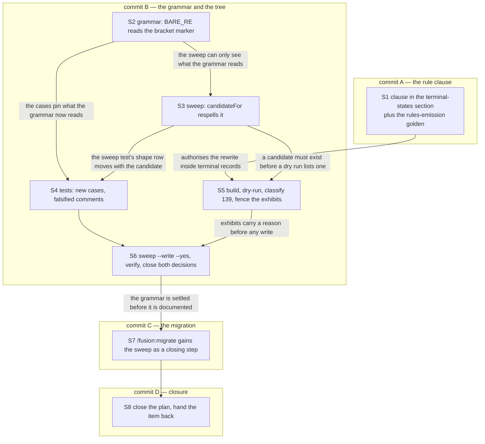
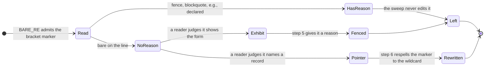

# Implementation Plan: the grammar reads the bracket marker, and the tree is swept once

**Date:** 2026-09-22
**Status:** Approved (`**Mode:** autonomous` on the item answers the plan review)
**Spec:** none, planned from the work item's `## Directive` in `260922-1420-bracket-citations-read-and-swept-once.md` and the two rulings it rests on, `260921-1718_*_does-the-grammar-read-a-storeless-bracket-marked-citation-or-state-the-asymmetry-as-a-decision.md` and `260921-2002_*_does-reading-the-bracket-marker-form-sweep-the-frozen-stores-or-does-the-sweep-first-learn-to-skip-them.md`
**Decidability:** The load-bearing question is whether a bracket-marked token in the tree is a **pointer** to be respelled or an **exhibit** that must survive verbatim. It is **not decidable** from the inputs the sweep has. The token text of a pointer and of an exhibit are the same string, and resolution does not separate them either: of the 139 tokens measured here, exhibits appear on both sides of the resolution boundary (13 resolve to nothing and are all exhibits, and at least 12 that resolve under the wildcard are exhibits too). That is `rules/critical-stance.md` §4 exactly. So the mechanism changes rather than the approximation improving: the deciding input is **writer-supplied and read off the line before any lookup**, which is the mechanism `hooks/lib/citation-scan.ts` already carries as `fenced-code`, `blockquote`, `announced-illustration` and `declared-exhibit`. Step 5 therefore does not ask the sweep to decide. It puts the dry-run listing in front of a reader, the reader marks the exhibits, and only then does the sweep run, whose remaining question ("does this hit carry a `reason`?") is decided from inputs it holds. Two further inputs are handed on rather than approximated. Whether the clause in step 1 and the closing step in step 7 fit their bounded surfaces is reported by the bounds at their own commits, and each step names the cut it takes; where no acceptable cut exists the step is gated and says so.
**Domain:** code

## Directive

Make `BARE_RE` in `hooks/lib/citation-scan.ts` read the pre-v4 bracket marker in the marker position beside the underscore form, so a storeless bracket citation is judged exactly as a store-prefixed one already is. Then sweep the whole workbench once, `archive/` included, repair by hand what resolves to nothing, give `rules/fusion-workbench-conventions.md` `## Terminal states are history` the clause the ruling rests on, and give `/fusion:migrate` the sweep as a closing step. The work item states it in full; nothing is restated here.

## Current State

HEAD `7294e06f`, `.claude-plugin/plugin.json` at `11.11.0`. The working tree carries the item's container, three modified workbench files and nothing else.

### The figures, re-measured at HEAD

The two rulings carry figures taken at `f0f4c9c6`. The tree has moved by roughly sixty commits since, so every number below was taken again here, by running the real scanner against a patched copy of `hooks/lib/citation-scan.ts` in a scratch directory over the corpus `hooks/citation-check.ts` assembles: 2 998 workbench `.md` files plus 37 project files (`CLAUDE.md`, `rules/*.md`, `docs/**/*.md`), and separately the 61 files `fusion.json`'s `citations.extraPaths` declares.

| Measure | Ruling, at `f0f4c9c6` | Measured here, at `7294e06f` |
|---|---|---|
| unfenced bracket tokens the widening produces | 142 | **139** |
| files carrying them | 51 | **59** |
| resolving under the wildcard (`stale-marker`) | 125 | **126**, in 51 files |
| of those, inside a frozen store | 37 | **37**, in 21 files |
| resolving to nothing (`dangling`) | 17 | **13**, in 11 files |
| already exempt (fence, blockquote, fabricated name) | not stated | 14, in 12 files |
| tokens the widening **removes** | not stated | **0** |
| bracket-named files on disk in the workbench index | 0 (at `bb44a56f`) | **0** |
| new tokens in the declared code corpus | not stated | **1** |

Read the two columns against each other rather than as a contradiction. The `stale-marker` count and its archived share are effectively unchanged (125 to 126, 37 to 37), and the ruling's "51 files" is the `stale-marker` file count, which is still 51. What moved is the dangling set, from 17 to 13, because four of the records that carried a dangling bracket specimen have since been fenced or reworded by the two packages that ran between the two commits. The union of `stale-marker` and `dangling` is 139 tokens in 59 files: 41 tokens in 21 files sit in a frozen store, 98 tokens in 38 files in the live tree.

The one new token in the declared code corpus is `hooks/lib/citation-scan.ts:185`, inside the header paragraph step 2 rewrites anyway. No token appears anywhere else in `hooks/`, `bin/`, `rules/`, `docs/` or `CLAUDE.md`.

### Which gates move, and when

Measured, not inferred. With the grammar widened and nothing else changed:

- **`hooks/lib/__tests__/workbench-citation-lint.test.ts`**, case `passes on the whole corpus — no dangling citation in any live record`, goes red. Exactly two tokens reach it, both `stale-marker`, both in one live record, and both genuine pointers the sweep repairs. No dangling token lands in a live record at all.
- **`bin/fusion-citation-check`** goes from `verdict=clean` to `verdict=violations` on the same two tokens: `edited-violations` counts `stale-marker`, `store-prefixed` and `dangling` inside `isLiveRecord()` files.
- **`hooks/lib/__tests__/citation-sweep.test.ts`**, case `--dry-run over this repository's workbench reports rewrites=0`, goes red as soon as step 3 lands, because 139 tokens then have a candidate. It is the release gate `README-hooks.md` names.
- **`hooks/lib/__tests__/citation-grammar-boundaries.test.ts`** stays green, but the comment above its bracket case ("only `REC_RE` admits a bracket") becomes false and is edited with it.

`reference-resolution-lint.test.ts`'s `BASELINE` does not move: every new token lands in the workbench, which that lint does not scan, and no token is lost anywhere.

### The three bounded surfaces, and the eleven dispatch rows

Head-room at HEAD, as `hooks/lib/__tests__/surface-growth-bound.test.ts` computes it: `agents/` **5 956 bytes**, `skills/` **120 bytes**, hook tests **54 lines**. The eleven dispatch-path rows in `hooks/lib/__tests__/fixtures/dispatch-path.baseline` were re-armed on 2026-09-22 at the measured sizes, so every row stands at **slack 0** with `DISPATCH_HEAD_ROOM = 0`.

Two steps here touch a bounded surface and each names its cut at the step. No step touches `agents/`, so the 5 956 bytes are not drawn on. Step 4 draws on the hook-test lines. Step 1 draws on a shared always-on component and step 7 on `skills/`.

### What the sweep would and would not touch

`hooks/citation-sweep.ts` refuses a rewrite for any hit carrying a `reason`, whatever its status, and computes a candidate per **kind**, not per status. Two consequences settle the design below.

First, the `bare-record` branch of `candidateFor()` requires a literal single-letter underscore marker, so with the grammar alone the sweep proposes nothing for a bracket token and the whole-tree sweep the ruling asks for would be vacuous. Step 3 is therefore not optional.

Second, all 13 store-prefixed bracket tokens already read by `REC_RE` in this tree carry `reason=fenced-code`, so none of them is rewritten here whatever `candidateFor()` does. That is measured, and it is why the `record` branch's widening in step 3 is exercised only by a consuming project.

## Approach

Four commits, eight steps. The grammar, the sweep's candidate, the exhibit fences and the swept tree land in **one commit**, because three gates read the same grammar and every intermediate state is red. The rule clause precedes them in a commit of its own, since it is the authority for what the sweep then does inside terminal records and it reddens nothing. The migrate step follows in a third, and the closure in a fourth.

### Why one commit and not two adjacent ones

The constraint is that no gate is red across a commit boundary. Consider the three candidate splits.

Grammar first, sweep second leaves `workbench-citation-lint`, `bin/fusion-citation-check` and, once `candidateFor()` moves, the `rewrites=0` release gate red at the intermediate commit. Sweep first, grammar second is not available: the sweep cannot see a token the grammar does not read, so there is nothing to sweep. Grammar plus live-tree sweep first, archive sweep second leaves `rewrites=0` red at the boundary, because that gate runs `bin/fusion-citation-sweep` with no `--root` over the whole tree, `archive/` included.

All three gates are functions of the pair (grammar, tree), and the pair is consistent only at the two endpoints. One commit is the only ordering that keeps every endpoint green. The commit is large in files (roughly 60 workbench records plus four source files) and small in kinds of change, and the dry-run listing in step 5 is what makes it reviewable.

### The dependency order



### What the classification in step 5 decides



## Implementation Steps

1. [DONE] **The clause in `## Terminal states are history`**
   - Executor: `coder`
   - Files: `rules/fusion-workbench-conventions.md`, `hooks/lib/__tests__/fixtures/rules-emission.golden`
   - Changes: append to the paragraph that begins "A terminal record is read as evidence" one sentence saying that the rule governs **state**, not spelling: a step mark, a ticked criterion and a head field are state, and a citation respelled from the pre-v4 bracket form to the storeless wildcard names the same target, writes no state, and is what the sweep already does for spelled underscore markers inside closed records. Cite `260921-2002_*_does-reading-the-bracket-marker-form-sweep-the-frozen-stores-or-does-the-sweep-first-learn-to-skip-them.md` as the binding record. Then regenerate the golden with `UPDATE_RULES_GOLDEN=1`.
   - **The bound, and the cut.** This file is a shared always-on component charged to all eleven dispatch rows at slack 0, so N bytes added puts all eleven N over at once and the offset must be taken **once in a shared component**: this file or `CLAUDE.md`, nothing else. Write the clause at **150 bytes or less** and take at least as many bytes back in the same file, by compressing prose whose authoring home is elsewhere (the header table at the top of the file names five such topics). Do not edit a baseline or a head-room: `hooks/lib/__tests__/helpers/growth-bound.ts` names the only three events at which either moves, and none of them is this.
   - Acceptance: `cd hooks && npx vitest run rules-emission-golden` exits 0 with `dispatch-path byte bound` green and `git diff --stat rules/fusion-workbench-conventions.md` showing a net change of zero or fewer bytes (`git show HEAD:rules/fusion-workbench-conventions.md | wc -c` against `wc -c` on the working file, 69 224 at HEAD). `bin/fusion-prose-metric rules/fusion-workbench-conventions.md` reads `ok`.
   - Gated if no cut of the clause's size can be taken without losing a statement: the way out would be a head-room raise, which is a user ruling and not this plan's to make. File the finding in the item's `issues/` store and skip, leaving steps 2 to 6 to proceed; they do not depend on the clause for correctness, only for authority.
   - Dependencies: none.

2. **`BARE_RE` reads the bracket marker**
   - Executor: `coder`
   - Files: `hooks/lib/citation-scan.ts`
   - Changes, four edits in one file:
     - Add a `BRACKET_SLOT` constant beside `MARKER_SLOT`, the bracket spelling of the same one-letter alphabet. **`MARKER_SLOT` is not widened**: `workbench-citation-lint.test.ts` reads it for the uniqueness measurement and its normalisation key is a separate literal, so widening it would let `STAMPED_RE` admit a basename the key does not normalise. The ruling says the same thing.
     - `BARE_RE`'s required position after the stamp gains `BRACKET_SLOT` as a third alternative beside `MARKER_SLOT` and the bare `_`. The **tail class is unchanged**, so a token such as the third specimen below still stops before the bracket exactly as it does today.
     - `BARE_RE`'s trailing stop becomes `REC_TAIL.stop` instead of `BARE_TAIL.stop`, with a comment saying why. Measured, both ways, over the specimens in the fence below: with `BARE_TAIL.stop` a bracket citation that ends a sentence eats the sentence's full stop, because the derived lookbehind's character class does not contain `]`; with `REC_TAIL.stop` it does not, and no token anywhere in the 3 035-file corpus is lost by the wider stop. That is the class `260901-0320_*_the-sentence-stop-lookbehind-does-not-cover-the-bracket-characters-the-record-tail-admits.md` repaired on the other tail, arriving here for the same reason.
     - The marker match inside the `bare-record` branch and `storelessBase()` learn the bracket spelling, so the lookup reaches `stale-marker` rather than falling straight through to `dangling`. Factor the respelling into one exported helper and have step 3 call it, rather than writing the bracket alternative twice: it is the same rule read by two callers, and two copies of it would drift.
   - Rewrite the header's not-read-on-purpose paragraph. It says the stance moved and why: the reason was written for workbench filenames, where `/fusion:migrate` is the pressure, and the population that bit is citations inside source files, which no migration opens. Keep its neighbour paragraph's account of `REC_RE`'s tail, which is now the narrower half of one rule rather than an exception to a prohibition. Spell the paragraph's own bracket example so it does not become a citation: at HEAD it is the one new token the declared code corpus gains.
   - Verification: the five specimens in `### The five specimens step 2 pins` below, each run against the patched scanner in a scratch copy before the edit lands.
   - Acceptance: `cd hooks && npx vitest run citation` exits 0 except for the two whole-tree cases step 6 settles, and `node -e` against the built scanner reproduces the five rows below.
   - Dependencies: none.

3. **`candidateFor()` respells the bracket marker**
   - Executor: `coder`
   - Files: `hooks/citation-sweep.ts`
   - Changes: the `bare-record` branch and the `record` branch of `candidateFor()` call the helper step 2 exports, so both produce the storeless wildcard form for either marker spelling. Without this the sweep proposes nothing for a bracket token and the ruling's whole-tree sweep is a no-op. The `record` branch is included deliberately: **the sweep applies the fix the checker prints**, and for these tokens the checker prints "cite the marker position as `_*_`". A candidate that dropped only the store segment and kept the bracket would be a fix no gate ever proposed.
   - Rewrite the header's `## The visibility guard` closing paragraph, which states that the guard deliberately does not make the bracket form rewritable. It now does, and the paragraph says so and says what did not change: nothing here **resolves** a bracket-named record, which is the question `260830-1842_*_may-the-grammar-resolve-a-bracket-marked-record-that-a-frozen-store-keeps-permanently.md` holds, deferred by the user on 2026-09-22 and untouched by this plan.
   - Acceptance: `cd hooks && npm run build && node hooks/dist/citation-sweep.js --dry-run` prints a non-zero `rewrites=` over this tree, which is the state step 5 reads and step 6 clears.
   - Dependencies: 2.

4. **The tests, and the comments the change falsifies**
   - Executor: `coder`
   - Files: `hooks/lib/__tests__/citation-grammar-boundaries.test.ts`, `hooks/lib/__tests__/citation-sweep.test.ts`
   - Changes: add cases pinning the five specimens in step 2, the sweep's candidate for a bracket `bare-record`, and the sentence-stop case, which is the one a future edit to `recordTail()` would silently undo. Edit the comment above the existing bracket boundary case, which reads that only `REC_RE` admits a bracket, and the `SHAPES` table comment in the sweep test if the change makes its row rewritable.
   - **The bound.** Hook tests have **54 lines** of head-room. Write the cases as table rows against the existing parametrised describes rather than as new blocks, measure with the surface bound at the commit, and if the addition does not fit, cut the same number of lines by collapsing the two whole-tree bracket assertions into one parametrised case. Do not move `TEST_LINE_BASELINE` or `TEST_LINE_HEAD_ROOM`.
   - Acceptance: `cd hooks && npx vitest run surface-growth-bound` exits 0 with `holds hook-tests inside its own head-room of 3030 lines` green.
   - Dependencies: 2, 3.

5. **Build, dry-run, classify the 139, fence the exhibits**
   - Executor: `coder`
   - Files: `hooks/dist/**` (rebuilt), and the workbench records the classification marks, roughly 25 of them.
   - Changes: run `cd hooks && npm run build`, then `bin/fusion-citation-sweep --dry-run` and read **every** proposed rewrite. Each is a pointer or an exhibit, and the sweep cannot tell them apart, which is what the Decidability line above says. Mark each exhibit so it carries a `reason` before any write: move it into a fenced block, exactly as `260831-0748_*_a-storeless-bracket-marked-citation-is-invisible-while-a-store-prefixed-one-is-reported.md` already does for its own four specimens and for the same stated reason. A blockquote or an `e.g.` announcement on the line is the cheaper instrument where the sentence allows it. Do **not** use `citations.exhibits`: it silences a whole record, and every one of these records carries genuine citations beside the exhibit.
   - The classification measured here, at HEAD, is the starting point and is listed in `### The 25 exhibit sites measured at HEAD` below. All **13 dangling** tokens are exhibits without exception: each shows the bracket form inside a record about the marker format, the migration, the setup probe or the citation grammar, and none is a pointer to a record that ever existed. At least **12 of the 126 resolving** tokens are exhibits too, which is the finding this plan adds to the ruling: the ruling assumed only the dangling needed hands.
   - That list is provisional and is not a substitute for reading the dry run. The tree may have moved between this measurement and the run, and the executor classifies every row the run prints rather than only these.
   - **Nothing here is destructive.** Every repair is a fence, a blockquote or an announcement added around text that stays; not one of the 139 can be resolved only by deleting a citation, so the *Destructive operations* gate row is not met. That was checked case by case against the 13 dangling, which are the only candidates for a deletion, and each of them is a specimen the record exists to show.
   - Acceptance: `bin/fusion-citation-sweep --dry-run` lists no proposed rewrite that a reader has not classified, and the count of proposed rewrites has fallen by the number of exhibits fenced (roughly 139 to 114).
   - Dependencies: 1, 3.

6. **Sweep the tree, verify, close both decisions**
   - Executor: `coder`
   - Files: the workbench records the sweep rewrites (roughly 114 tokens in some 50 files, `archive/` included), plus the two decision records.
   - Changes: run `bin/fusion-citation-sweep --write --yes`, then `bin/fusion-citation-sweep --dry-run` again and confirm it has settled. Append an `Implemented:` line to `260921-1718_*_does-the-grammar-read-a-storeless-bracket-marked-citation-or-state-the-asymmetry-as-a-decision.md` and to `260921-2002_*_does-reading-the-bracket-marker-form-sweep-the-frozen-stores-or-does-the-sweep-first-learn-to-skip-them.md`, naming the commit, and rename both from `_a_` to `_i_`. Write the record lines **before** the verifying run, so the suite sees the commit's whole content. `260831-0748_*_a-storeless-bracket-marked-citation-is-invisible-while-a-store-prefixed-one-is-reported.md` is already `_c_` and terminal and is not touched; `260830-1842_*_may-the-grammar-resolve-a-bracket-marked-record-that-a-frozen-store-keeps-permanently.md` is `_d_` and terminal and stays deferred.
   - Acceptance, and the package's verification: `cd hooks && npm test` exits 0; `node hooks/dist/citation-check.js` prints `verdict=clean`; `bin/fusion-citation-sweep --dry-run` prints a summary beginning `files=0 rewrites=0`; `bin/fusion-citation-sweep --repair --dry-run` prints a summary beginning `files=0 repairs=0`.
   - Dependencies: 4, 5.

7. **`/fusion:migrate` gains the sweep as a closing step**
   - Executor: `coder`
   - Files: `skills/migrate/SKILL.md`
   - Changes: add a closing step after `## Step 5 — Report` and before `## Guardrails`, which runs `bin/fusion-citation-sweep --dry-run`, reports the proposed rewrites, asks, and on a yes runs `--write --yes`. The ask is not ceremony: a consuming project may hold bracket-named files in a frozen store (one measured 226), and a citation of such a file respells to a form that then resolves to nothing, which is precisely the open half `260830-1842_*_may-the-grammar-resolve-a-bracket-marked-record-that-a-frozen-store-keeps-permanently.md` holds. Step 3 of the same skill already asks before moving, so the shape is the skill's own.
   - **The bound, and the cut.** `skills/` has **120 bytes** of head-room, so the step funds itself. Take the cut from the bracket-reformat bullet in Step 4's prose, the longest single line in the file at 1 422 bytes, by compressing it to the rule it states rather than the four reasons it gives for it. `marker-format-lint.test.ts` requires this file to keep **at least one** bracket-form occurrence, and it carries seven, so the compression has room. Do **not** add a `find ... | grep -E ...` expression in the shape `path-literal-lint.test.ts` pins: that test requires exactly three such expressions across `skills/setup/SKILL.md` and this file, byte-identical, and a fourth fails it on the count.
   - Acceptance: `cd hooks && npx vitest run surface-growth-bound marker-format-lint path-literal-lint` exits 0, and `wc -c skills/migrate/SKILL.md` is at or below 39 701.
   - Dependencies: 6.

8. **Close the plan and hand the item back**
   - Executor: `coder`
   - Files: this plan, the item record's head fields
   - Changes: mark every step `[DONE]`, set `**Status:** Complete`, rename this file from `_o_` to `_c_`. Report to the orchestrator that the item is ready to move to `done`; moving it is the orchestrator's, at the user's word, and no agent dispatch performs it.
   - Acceptance: `bin/fusion-citation-check` still reads `verdict=clean` with this plan in the corpus, and `cd hooks && npm test` exits 0.
   - Dependencies: 7.

### The five specimens step 2 pins

Measured against the patched scanner over this workbench at `7294e06f`. Fenced because each row is an exhibit of a retired spelling, not a pointer.

```
260519-0438[o]-loader-check.md      bare-record, dangling (no such record in this tree)
260716-1910[a]                      bare-record, stale-marker, resolves to the _i_ record
260519-0438[o].                     the token stops before the sentence's stop
260519-0438_o_slug[x]               the token stops before the bracket, unchanged
260519-0438[foo]-x.md               no token at all: the slot is one letter
```

The third row is the one that decides `BARE_RE`'s trailing stop. With the stop derived from the bare tail, the token swallows the sentence's full stop along with the marker, because the derived character class holds no closing bracket and the lookbehind therefore never fires. With the record tail's stop, which is the same derivation over a class that does hold one, the token ends where the citation ends. Both readings are in the fence above, third row.

### The 25 exhibit sites measured at HEAD

Cited storelessly with the marker wildcarded, which is the form that resolves; the number after the colon is the line. **Dangling, and all thirteen are exhibits:** `260717-1638-marker-format-ohne-glob-metazeichen`'s own container record:16, `260717-1959_*_plan-marker-format-underscore.md`:9 and :33, `260812-2136_*_the-citation-grammar-reads-one-ellipsis-and-one-marker-syntax-and-the-workbench-uses-two-of-each.md`:28, `260805-1841_*_wpr-und-migrate-falscher-mechanismus-fuer-prae-v4-pointer-ablehnung.md`:3, `260806-0022-coder-track1-vier-code-fixes.md`:32, `260805-2353_*_plan-textschicht-gegen-code.md`:151, `260829-1347_*_the-grammars-marker-slot-is-one-letter-while-24-indexed-artifacts-carry-a-word-there-and-the-stamp-bare-rewrite-checks-no-boundary.md`:17, `260830-1842_*_may-the-grammar-resolve-a-bracket-marked-record-that-a-frozen-store-keeps-permanently.md`:12, `260816-0058-coder-setup-resume-bullet-and-probe-scope.md`:76 and :77, `260830-2228-the-tripwire-no-rewrite-hides-a-reported-token.md`:107, `260806-1154-coderev-implementation-vs-intention-textschicht-delta.md`:23.

**Resolving under the wildcard and still exhibits, twelve tokens in eight files:** `260812-2136_*_the-citation-grammar-reads-one-ellipsis-and-one-marker-syntax-and-the-workbench-uses-two-of-each.md`:24 and :31, `260812-1720_*_circle-first-placement-and-the-backlog-store.md`:14 and :684, `260717-1959_*_plan-marker-format-underscore.md`:119, `260717-1945-reconciliation.md`:33 to :37 (five tokens, the p-to-c transition notation, where a respelling would garble the arrow), `260805-1839_*_kommentar-drift-in-den-beiden-bin-helfern-klammer-marker-und-veraltete-zaehlungen.md`:6, `260816-2315_*_hooks-wiring-test-was-in-step-9s-list-was-not-edited-and-justifies-bash-by-a-mechanism-removed-on-260812.md`:54, `260812-2136-coder-the-citation-verifier-and-the-baseline.md`:120, `260812-1720_*_the-reference-resolution-lint-does-not-scan-the-workbench-where-citations-are-densest.md`:34.

### Why no step goes to `ontocoder` or `analyst`

Both are in the active executor set and neither is used, which the plan decides rather than the dispatch. No step touches a `.yaml`, a manifest, a schema, a fixture of data or `fusion.json`: the one structured-data instrument that could have carried the exhibit exemption, `citations.exhibits`, is rejected in step 5 on its own merits, because it is file-wide and these records carry genuine citations beside their exhibits. And no step produces a strategic deliverable: the classification in step 5 is an input to a mechanical edit in step 6, carried in this plan, not a report anybody reads afterwards. `hooks/lib/__tests__/fixtures/rules-emission.golden` and `dispatch-path.baseline` are test fixtures generated by and read by the suite, which the routing table puts with `coder` beside the build manifests.

## Where this work stops

- `cd hooks && npm test` exits 0 at the last commit of the package.
- `node hooks/dist/citation-check.js` prints `verdict=clean`.
- `bin/fusion-citation-sweep --dry-run` prints a summary beginning `files=0 rewrites=0`, and `--repair --dry-run` one beginning `files=0 repairs=0`.
- Every bracket-marked token remaining in the tree either resolves or carries a `reason` the scanner reports; none resolves to nothing unannotated.
- Both `260921-1718_*_does-the-grammar-read-a-storeless-bracket-marked-citation-or-state-the-asymmetry-as-a-decision.md` and `260921-2002_*_does-reading-the-bracket-marker-form-sweep-the-frozen-stores-or-does-the-sweep-first-learn-to-skip-them.md` stand at `_i_` with an `Implemented:` line naming a commit in this package.
- `skills/migrate/SKILL.md` names the sweep in a step of its own.
- No baseline and no head-room in `hooks/lib/__tests__/` has moved.
- **Precondition on any release of this work:** the version in `.claude-plugin/plugin.json` is bumped and the five surfaces `README-agents.md` `## Releasing` names are coherent before a tag is cut. This plan bumps nothing and tags nothing, so a release is a separate act with its own gate.
- The resolution question stays open where it was: `260830-1842_*_may-the-grammar-resolve-a-bracket-marked-record-that-a-frozen-store-keeps-permanently.md` is `_d_` at the end of this package as it is at the start, and no step here answers it.

## Data Structures

One new exported constant and one new exported function in `hooks/lib/citation-scan.ts`: the bracket spelling of the marker slot, and the respelling of a storeless basename's marker position to the wildcard, which `hooks/citation-sweep.ts` imports so the grammar and the sweep cannot disagree about what a rewrite produces. No other type, schema or file format changes.

## API Changes

`bin/fusion-citation-sweep` and `bin/fusion-citation-check` keep their flags, their exit codes and their output shapes. What changes is what they report over the same tree.

## Testing Strategy

The new cases pin the five grammar specimens in step 2, the sweep's candidate for a bracket `bare-record`, and the sentence-stop behaviour, which is the one property a later edit to `recordTail()` would undo without any other case noticing. The whole-tree gates are the real test and they already exist: `rewrites=0` and `repairs=0` over this repository's own workbench, and no dangling citation in any live record. Every case is written as a row in an existing parametrised describe rather than as a new block, because the hook-test surface has 54 lines of head-room and a new describe spends most of it on scaffolding.

## Risks & Mitigations

| Risk | Mitigation |
|---|---|
| The sweep rewrites an exhibit and destroys the sentence it illustrates. | Step 5 is the whole mitigation: a dry run, a reader, a `reason` on every exhibit before any write. The 25 sites measured here are the starting list, not the list. |
| A consuming project's frozen store holds bracket-named files, so a swept citation of one stops resolving. | Step 7's migrate step asks before writing, and the plan leaves `260830-1842_*_may-the-grammar-resolve-a-bracket-marked-record-that-a-frozen-store-keeps-permanently.md` deferred rather than pre-empting it. Fusion's own tree holds 0 such files, so this cannot be exercised here. |
| Step 1's clause finds no cut of its size and the eleven dispatch rows refuse it. | The step is gated and says so: file the finding, skip, and let steps 2 to 6 proceed. A head-room raise is a user ruling. |
| The single large commit is hard to review. | The dry-run listing from step 5 is the review artifact, and the diff inside the workbench is one token shape respelled. The four source files are separable by path in `git show --stat`. |
| `hooks/dist/` and its source drift, so `committed-dist.test.ts` fails. | Step 5 rebuilds before the sweep runs, and the rebuilt `dist/` is in the same commit as its source. |
| The measurement in `## Current State` goes stale before the executor starts. | Every figure is stamped at `7294e06f` and every step's acceptance is a command, not a number. The executor re-runs the dry run and reads what it prints. |

## Open Questions

- [ ] Step 1's offset. The clause is 150 bytes or less and the cut of the same size has to come out of `rules/fusion-workbench-conventions.md` or `CLAUDE.md`, both shared components at slack 0. Which passage gives way is the executor's to find and is not decided here; if none does, the step is gated as described and the question reaches the user as a head-room raise.
- [ ] The ruling counted 17 dangling tokens needing hands and this plan measures 13, all of them exhibits, plus 12 resolving tokens that are exhibits too. The total hand-repaired set is therefore larger than the ruling anticipated (25 rather than 17) and its character is different: fencing a specimen rather than repairing a pointer. Nothing here needs a new ruling, since no citation is removed and the mechanism used is the one the grammar already carries, but the user may want to know that the number moved and why.
