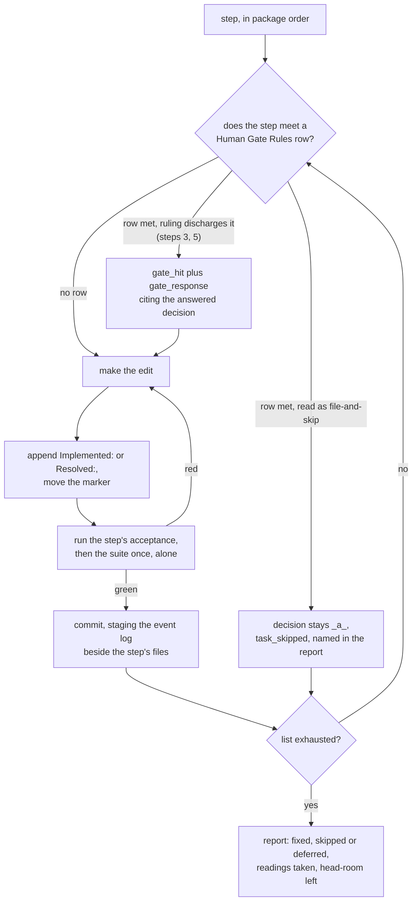
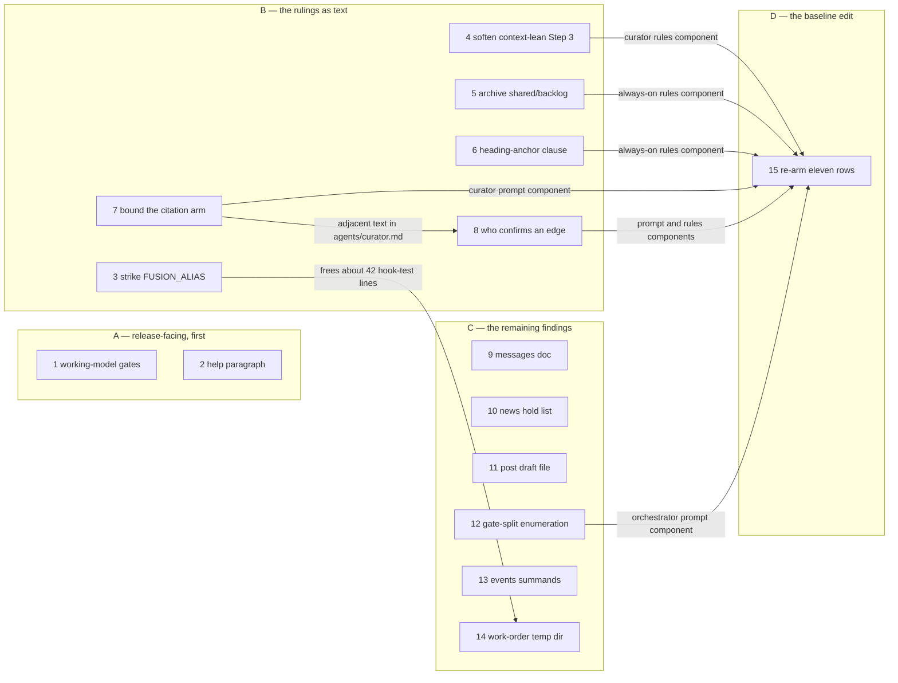

# Implementation Plan: the six rulings of 260922 and the nine findings of the closing review

**Date:** 2026-09-22
**Status:** Draft
**Spec:** none — planned from the work item's `## Directive` (`260922-1438-the-seven-rulings-and-the-closing-reviews-nine.md`), on the model of `260922-0922_*_the-51-open-issues-at-451bb312-worked-autonomously-as-one-package.md`
**Decidability:** The load-bearing question is whether each of the fifteen records reaches its end state (`_i_` with an `Implemented:` line for the six answered decisions, `_c_` with a `Resolved:` line for the nine issues) through a bounded edit whose acceptance is a command and an exit code, funded inside the three bounded surfaces, without a step needing an answer the item's `**Mode:** autonomous` field cannot give. It is decidable from the inputs the steps have. All fifteen records were read in full, every site was re-read against the tree at `49ab50e4` and is quoted in its step, every acceptance below is a `grep`, a `wc`, a `node` read, a helper run or the suite with a stated result, and the three head-rooms were measured here rather than quoted: 15 hook-test lines, 72 `skills/` bytes, 8 493 `agents/` bytes, with the eleven dispatch-path rows measured row by row in `## Current State`. Two inputs are not decidable in this document and are handed on rather than approximated. Whether step 2's compressed help paragraph lands inside 72 bytes is reported by the bound at its own commit, and the step names the further cut it takes if it does not. Whether the orchestrator reads step 3 as a *Destructive operations* row already discharged by the user's ruling, or as a file-and-skip row that no ruling reaches, is a determination made at the dispatch and not here; step 3 names both branches and what each leaves behind.
**Domain:** code

## Coverage

Fifteen records, six rulings and nine findings, each reached by exactly one step. **Ruling** means an `_a_` decision in `circles/260922-0906-fix-package-over-every-open-issue/decisions/` whose answer the step realises, closing it to `_i_`. **Finding** means a `260922-1208_o_*` issue in that container's `issues/`, closing to `_c_`.

| # | Record | Class | Step |
|---|---|---|---|
| 1 | `260922-1208_*_working-model-doc-describes-the-gate-set-before-57e2b7eb-moved-the-ontocoder-row.md` | finding, release-facing | 1 |
| 2 | `260922-1208_*_the-11-11-0-help-paragraph-says-helper-output-only-while-the-release-changes-a-gate-and-two-skill-bodies.md` | finding, release-facing | 2 |
| 3 | `260922-0922_*_does-fusion-alias-get-a-reader-or-does-the-export-go.md` | ruling (option 1: the export goes) | 3 |
| 4 | `260922-0922_*_does-claude-md-collect-its-pointers-into-one-table-or-does-step-3-stop-mandating-it.md` | ruling (option 2: Step 3 softens) | 4 |
| 5 | `260922-0922_*_what-becomes-of-the-two-entries-in-the-unread-shared-backlog-store.md` | ruling (option 1: archive both by hand) | 5 |
| 6 | `260922-0922_*_does-a-records-heading-anchor-citation-into-shipped-text-get-a-gate.md` | ruling (option 1: no gate, one clause) | 6 |
| 7 | `260922-0922_*_does-the-edge-passs-citation-yield-need-a-mechanism-or-is-the-gate-the-bound.md` | ruling (option 2: bound by relation) | 7 |
| 8 | `260922-1208_*_the-depends-on-confirmation-rule-still-says-every-edge-waits-on-a-user-ruling-after-the-ledger-applies-whole-under-the-field.md` | finding, overlapping record 7 | 8 |
| 9 | `260922-1208_*_the-messages-doc-says-an-untracked-workbench-answers-new-0-permanently-after-step-30-made-it-exit-5.md` | finding | 9 |
| 10 | `260922-1208_*_the-news-body-holds-no-writer-line-and-says-nothing-about-a-skipped-path.md` | finding | 10 |
| 11 | `260922-1208_*_the-post-draft-dotfile-survives-step-3s-stop-and-an-interrupted-run-and-nothing-removes-it.md` | finding | 11 |
| 12 | `260922-1208_*_the-three-set-gate-split-names-no-set-for-the-planner-without-claimed-item-row.md` | finding | 12 |
| 13 | `260922-1208_*_the-events-header-says-the-four-sum-without-naming-which-four.md` | finding | 13 |
| 14 | `260922-1208_*_the-work-order-tests-bare-directory-is-never-removed.md` | finding | 14 |
| 15 | `260922-0922_*_are-the-dispatch-path-rows-re-armed-at-the-post-cut-totals-and-under-which-event.md` | ruling (option 1: re-arm as a named event) | 15 |

The seventh ruling of 260922, the bracket citation form, belongs to `260922-1420-bracket-citations-read-and-swept-once.md` and is out of scope here, as the item's Directive states.

## Directive

Realise the six rulings the user made on 260922 and fix the nine findings the closing review of the 51-issue package filed, as one package, with the version held at 11.11.0 and nothing tagged or pushed. The item runs under `**Mode:** autonomous`, so this plan is approved off the field. Two of the nine findings are the release's own description surfaces and come first, which is the review's own sequencing recommendation. One ruling, the dispatch-path re-arming, is a baseline edit, and it is the only step in this package permitted to move a baseline.

## Current State

HEAD `49ab50e4`, `.claude-plugin/plugin.json` at `11.11.0`, untagged (`git tag -l v11.11.0` prints nothing; `v11.10.0` exists). The working tree carries the item's own container, three modified workbench files and nothing else. All fifteen records stand at the marker the Coverage table names, re-read in full here.

### The three bounded surfaces, measured at HEAD

Computed the way `hooks/lib/__tests__/surface-growth-bound.test.ts` computes them, from the tree against the baseline maps in that file.

| Surface | Measured | Floor + head-room | Head-room left | Consequence |
|---|---|---|---|---|
| hook tests (`hooks/lib/__tests__/**/*.ts`, lines) | 22 243 | 19 228 + 3 030 = 22 258 | **15** | Step 3 frees about 42 lines by removing the alias describe block. Steps 14 and 15 spend two and at most two. Step 3 precedes both. |
| `skills/*/SKILL.md` (bytes) | 227 956 | 188 768 + 39 260 = 228 028 | **72** | Steps 2, 10 and 11 land here. Step 2 is the tight one: it carries two cuts of its own (389 bytes together) against a rewrite of about 438. Step 10 is a net cut of about 157. |
| `agents/*.md` (bytes) | 320 074 | 310 567 + 18 000 = 328 567 | **8 493** | Steps 7, 8 and 12 land here, about 700 bytes together. No step approaches the bound. |

`rules/` carries no failing bound: the release cap and drift ceiling in `rules-emission-golden.test.ts` are historical facts about what `origin/main` once shipped, and the always-on core bound was retired on 2026-09-11. `docs/`, `bin/` and the READMEs are bounded by nothing, which `README-hooks.md` `### Growth bounds on the shipped text` states under *What no bound covers*.

### The dispatch-path bound, measured row by row

`hooks/lib/__tests__/fixtures/dispatch-path.baseline` charges `CLAUDE.md` to all eleven rows at 93 432 bytes. The file measures **8 021** at HEAD. Every row therefore stands well under its baseline, so the instrument refuses nothing at present. The measurement below was taken here, by summing `statSync` over each component exactly as `dispatchComponents()` does, running `bin/fusion-rules <agent>` from the repository root with `FUSION_PLUGIN_ROOT` set to it.

| Path | prompt now / row | rules now / row | `CLAUDE.md` now / row | total now / row | slack |
|---|---|---|---|---|---|
| analyst | 21 032 / 21 038 | 93 120 / 84 319 | 8 021 / 93 432 | 122 173 / 198 789 | 76 616 |
| coder | 12 165 / 9 649 | 84 828 / 85 175 | 8 021 / 93 432 | 105 014 / 188 256 | 83 242 |
| consultant | 13 432 / 14 329 | 98 771 / 89 918 | 8 021 / 93 432 | 120 224 / 197 679 | 77 455 |
| curator | 76 738 / 34 554 | 98 771 / 99 080 | 8 021 / 93 432 | 183 530 / 227 066 | 43 536 |
| editor | 13 156 / 13 635 | 104 525 / 95 672 | 8 021 / 93 432 | 125 702 / 202 739 | 77 037 |
| ontocoder | 15 875 / 13 262 | 84 828 / 85 175 | 8 021 / 93 432 | 108 724 / 191 869 | 83 145 |
| orchestrator | 96 992 / 155 302 | 114 986 / 131 331 | 8 021 / 93 432 | 219 999 / 380 065 | 160 066 |
| planner | 19 659 / 19 725 | 98 091 / 89 271 | 8 021 / 93 432 | 125 771 / 202 428 | 76 657 |
| reconciler | 21 171 / 22 825 | 89 799 / 90 127 | 8 021 / 93 432 | 118 991 / 206 384 | 87 393 |
| reviewer | 12 837 / 12 837 | 91 629 / 82 743 | 8 021 / 93 432 | 112 487 / 189 012 | 76 525 |
| shaper | 17 017 / 29 057 | 109 012 / 128 279 | 8 021 / 93 432 | 134 050 / 250 768 | 116 718 |

The slack runs from 43 536 on the curator row to 160 066 on the orchestrator row, so the tightest of the eleven admits a 43 kB addition before the bound says anything. That is the state record 15 rules on. Note the two directions inside one row: the shared `CLAUDE.md` component fell by 85 411 on every path, while three prompt components rose above their arming figures (curator 34 554 to 76 738, ontocoder 13 262 to 15 875, coder 9 649 to 12 165). Re-arming reduces every total and raises three prompt components, and the log step 15 writes says so rather than reporting a reduction and leaving the rises unnamed.

### Gates and checks that move on several steps

**`bin/fusion-citation-check`** reads every workbench `.md` plus `fusion.json`'s declared paths. At HEAD it prints `files=3095 dangling=300 store-prefixed=405 edited-violations=0 verdict=clean`. Every record this package closes is inside that corpus, so each `Resolved:` and `Implemented:` line cites a storeless basename with the marker wildcarded, and a verbatim wrong spelling goes inside a fence. Step 5 moves two records between stores; its own acceptance states what it does to the first two figures.

**`hooks/lib/__tests__/reference-resolution-lint.test.ts`** pins `const BASELINE = { paths: 1701, anchors: 317, stampBare: 11 }` on line 492, one physical line to which every re-approval is appended. Steps 1, 2, 4, 6, 7, 8 and 9 may move a count; each re-approves on that line, measuring by restoring the edited file to HEAD in place rather than by subtraction.

**`committed-dist.test.ts`** compares `hooks/dist/` with a fresh build. `hooks/tsconfig.json` excludes `lib/__tests__`, so no step in this package changes a compiled source: steps 3, 14 and 15 touch test files and a fixture only, and step 3's other file is `hooks/hooks.json`, which is data the wiring test reads rather than a module. No step owes a rebuild.

**`bin/fusion-prose-metric`** reports and never gates. `rules/fusion-workbench-conventions.md` reads `4 em-dashes / 9 407 words / 0.4 per 1000` against a permit of 9 at HEAD. Steps 4, 5, 6 and 8 add rule and prompt prose; each keeps its file at `ok`, which the previous package's record 1 is the reason for stating.

### What the rulings' own constraints add

Record 15 requires that `rules-emission-golden.test.ts`'s dispatch-path case be green at the commit that lands it and that `README-hooks.md` carry the event with per-row figures. Record 5 requires that the citation gate stay clean over whichever store the two files end in, and that the `backlog` segment stay in the store lists until the store is empty. Record 7 leaves `**Depends-on:**` proposals untouched and reaches the `**Cross-references:**` arm alone. Record 3 notes that the wiring test sits on the hook-test bound and that removing the export frees lines.

## Approach

One record per step, one commit per step, in four packages. The loop is the previous package's, unchanged in the one respect that mattered there: the record write comes before the verifying run, so the suite sees the commit's whole content.

The one cycle, verify back to fix, is the ordinary red-suite return. A red the step's own files cannot clear is a stop named in the report, never a baseline edit: step 15 is the only step in this package that moves a baseline, and it moves exactly one.

**Order.** Package A is the two release-facing surfaces, which the review asks for before any tag. Package B is the five rulings that are text edits, plus the finding that overlaps one of them. Package C is the six remaining findings. Package D is the re-arming, last, because it is the only step whose correctness depends on every other step having landed.

Every edge in that graph is a dependency the step below declares, and every dependency a step declares is an edge. A step drawn with no incoming edge depends on nothing; the package boxes are sequencing, not ordering constraints, which is why no edge joins them.

Step 15's fan-in of six is the design rather than a god-node: the re-arm writes the measurement, so it must see every change that moves a charged component. Steps 1, 2, 9, 10, 11 and 13 touch `docs/`, `skills/` and `bin/`, none of which is a dispatch-path component, so none of them reaches it.

**Executors.** Fifteen steps, all `coder`: prompt and rule text, skill bodies, documentation, a bash helper header, a test file, a hand-edited fixture, `hooks/hooks.json`, and two workbench records moved between stores. None of it is ontology, manifest data or a schema, which is the routing rule `README-agents.md` states and the previous package applied to the same kinds of file. `ontocoder` receives nothing. `analyst` is in the active set and receives nothing either: no step produces a comparative, feasibility or risk deliverable, and the one record this package writes outside the two closing stores is a README log entry, which is shipped documentation and therefore `coder`'s.

**Gates under `**Mode:** autonomous`.** Two steps meet a row and are named on the step rather than shaped around it. Step 3 removes a shipped export, which the decision record itself reads as *Destructive operations*. Step 5 moves two of the user's workbench files. Neither is deletion: step 3 removes an export nothing reads, and step 5's files stay on disk, citable at their new path. Both questions were put to the user and answered on 260922, so the row's purpose is discharged by a ruling rather than by an agent answering on the user's behalf. Step 3 sets out both readings and what each leaves behind. No step in this package is ambiguous by construction: every one names its files, its edit and its command.

**What the executor writes per step.** The edit; the `Implemented:` line on a decision (citing the commit) or the `Resolved:` line on an issue; the marker move, `_a_` to `_i_` or `_o_` to `_c_`; the commit, staging `fusion-workbench/orchestrator-events.jsonl` beside the step's files. No new record file unless `rules/fusion-workbench-conventions.md` `## Record filing` says one is owed, and this plan has filed none.

## Implementation Steps

Field key. **Record** is the storeless citation of the decision or defect the step closes. **Site at HEAD** quotes what this plan read at `49ab50e4`. **Growth** names the bounded surface touched and the ceiling. **Pin** says whether the reference-resolution counts move. **Gate** names a `## Human Gate Rules` row the step meets, or `none`.

### Package A — the two release-facing surfaces

1. [DONE] **Bring `docs/working-model.md` `## 3. The gates` to the gate set `57e2b7eb` left**
   - Executor: `coder`
   - Record: `260922-1208_*_working-model-doc-describes-the-gate-set-before-57e2b7eb-moved-the-ontocoder-row.md`
   - Site at HEAD: `docs/working-model.md:105` ("answers the stops that are about the *solution* of that item, and no other: the plan review, the item's claim and its finish, and the read of its plan's stop conditions at closure"), `:111` (the bullet "any **ontology or structured-data change** (every `ontocoder` task, and especially structural changes to entities, relations, or schemas)"), `:115` ("Under `**Mode:** autonomous` the ontology, destructive-operation and ambiguous-task gates put no question at all: the orchestrator files an open decision carrying the question the gate would have asked, skips the task, and goes on"). `agents/orchestrator.md:383` carries the set that actually runs: *Task involves `ontocoder`* is an answered row with detail `proceed — answered by **Mode:** autonomous on <container>`, and the file-and-skip set is *Structural ontology changes*, *Destructive operations*, *Ambiguous task instruction*.
   - Files: `docs/working-model.md` (lines 105, 111, 115)
   - Do not touch: `agents/orchestrator.md`, which is the authority `rules/fusion-workbench-conventions.md:207` names; the Coherence and Rebalance paragraphs below line 115
   - Changes: `:105` names the `ontocoder` task among the stops the field answers, alongside the plan review, the claim, the finish and the stop-conditions read. `:111` keeps the bullet and qualifies it: a structured-data change is a stop, and under the field an ordinary `ontocoder` task proceeds while a structural change to entities, relations or schemas still files and skips. `:115` names the file-and-skip set as three rows and states the other two readings of `57e2b7eb`: a curator change ledger is applied whole under the field, and a held item's pause is confirmed by the instruction to claim another. The paragraph cites `agents/orchestrator.md` `## Human Gate Rules` as the authority.
   - Acceptance: `grep -c 'ontology, destructive-operation and ambiguous-task gates put no question' docs/working-model.md` prints `0`; `grep -c 'ontocoder' docs/working-model.md` is at least `2`; `cd hooks && npm test` exits 0.
   - Growth: none bounded (`docs/` is covered by no bound).
   - Pin: paths and anchors rise by at most one each if the orchestrator anchor is added; re-approve on line 492 of `reference-resolution-lint.test.ts`.
   - Gate: none
   - Dependencies: none
   - **Landed with one deviation.** `## Current State` records the suite as green at `49ab50e4`; it was not. `citation-sweep.test.ts` was already red there, the closing review spelling each of its nine `Filed:` markers literally (`bare-record=9`, `files=1`), and that red blocks every commit in this package. It was repaired first and alone in `0cacf3c0`, by the rewrite `bin/fusion-citation-sweep --write` produces on a clean tree, before this step's commit.

2. [DONE] **Say in the 11.11.0 help paragraph what the release actually changes**
   - Executor: `coder`
   - Record: `260922-1208_*_the-11-11-0-help-paragraph-says-helper-output-only-while-the-release-changes-a-gate-and-two-skill-bodies.md`
   - Site at HEAD: `skills/help/SKILL.md:96`, 732 bytes, opening "**Coming from an 11.10.0 install:** 11.11.0 changes helper output only and asks nothing of the user." and then listing six helper changes. The range `451bb312..bf515cad` also ships `57e2b7eb` (the gate change), `2bb9088a` (`/fusion:cleanup` carries the registry entry in a split), `5f544591` (`/fusion:post` writes a draft file), `cfb70cc5` (`/fusion:news` holds the mark back on an unrendered entry). The section's own rule at `:102` is that it carries the last three releases and no more, so no paragraph rotates out here.
   - Files: `skills/help/SKILL.md` (line 96, and the two cut sites named below)
   - Do not touch: the 11.10.0 and 11.9.1 paragraphs; `.claude-plugin/plugin.json`; any tag
   - Changes: the paragraph is rewritten to open "11.11.0 changes one gate reading, three skill bodies and six helper outputs", to carry one sentence on the gate change of `57e2b7eb` (under the field the orchestrator answers the `ontocoder` gate and applies a curator ledger whole, where 11.10.0 filed an open decision and skipped, and that is the one change a user meets at a gate) and one sentence naming the three skill-body changes, with the six helper readings kept and compressed. The rewrite measures about +438 bytes, so the step carries **two cuts in the same file**: the sentence at the end of the *Older than that* paragraph, "The v10 note's own copy-the-budget step no longer applies … nothing is copied out of it" (187 bytes, text that states of itself that it no longer applies), and the duplicate pointer at the end of topic 2, " For the working model behind the day-to-day flow … point them at `$FUSION_SRC/docs/working-model.md`." (202 bytes, a verbatim restatement of the same pointer at `:40`). Net about +49 against 72 of head-room. No backticked plugin path is added: `/fusion:cleanup`, `/fusion:post` and `/fusion:news` are slash-command tokens, which the lint reads as a class of their own.
   - Acceptance: `grep -c 'changes helper output only' skills/help/SKILL.md` prints `0`; `grep -c 'answers the `ontocoder` gate\|applies a curator ledger whole' skills/help/SKILL.md` is at least `1`; `grep -c 'fusion:cleanup' skills/help/SKILL.md` is at least `1`; `cd hooks && npm test` exits 0 with the `skills/` surface at or below 228 028 bytes.
   - Growth: `skills/`, ceiling +72 bytes net, expected about +49 after the two cuts. **If the bound is red at this commit**, the step takes step 10's first cut in `skills/news/SKILL.md` into this same commit (the bullet at `:16`, 181 bytes, restated verbatim at `:121`) and says so in the commit message; step 10 then states the smaller cut it has left. The step is not landed over the bound under any branch.
   - Pin: paths fall by one (the cut pointer to `$FUSION_SRC/docs/working-model.md`); re-approve on line 492.
   - Gate: none
   - Dependencies: none

### Package B — the rulings, as text

3. [DONE] **Strike the `FUSION_ALIAS` export, its wiring assertions and the v10.23 note's claim**
   - Executor: `coder`
   - Record: `260922-0922_*_does-fusion-alias-get-a-reader-or-does-the-export-go.md` (`_a_`, option 1, ruled by the user at 260922-1218)
   - Site at HEAD: `hooks/hooks.json:24`, the tail of the SessionStart identity command, `[ -n "$c" ] && [ -x "${CLAUDE_PLUGIN_ROOT}/bin/fusion-checkout-name" ] && { a="$(… resolve "$c" … sed -n 's/^alias=//p' …)"; [ -n "$a" ] && printf 'export FUSION_ALIAS=%q\n' "$a" >> "$CLAUDE_ENV_FILE"; }`. `hooks/lib/__tests__/hooks-wiring.test.ts` lines 139 to 180, the whole `describe("hooks.json wiring — SessionStart resolves the checkout's alias")` block (42 lines), whose two cases assert the export at `:151`, `:175` and `:178`. `docs/upgrading-to-v10-23.md:11` names `FUSION_ALIAS` as the fourth rendering site and `:33` says it is not exported without a registry entry. Nothing else in the tree reads the variable: the only hits outside the writer, its test and that note are none.
   - Files: `hooks/hooks.json` (line 24), `hooks/lib/__tests__/hooks-wiring.test.ts` (the describe block at 139 to 180, and any import left unused by its removal), `docs/upgrading-to-v10-23.md` (lines 11 and 33)
   - Do not touch: the `FUSION_PERSON` and `FUSION_CHECKOUT` clauses of the same command, which `hooks-wiring.test.ts:82` and `identity-mint-notice.test.ts:113` pin; `bin/fusion-checkout-name`, whose `resolve` subcommand keeps every other reader
   - Changes: the alias clause is removed from the identity command, leaving the `PERSON` and `CHECKOUT` exports and the `identity-notice.js` pipe as they stand, and the command still ends `|| true`. The describe block goes whole, since both its cases are about the alias and the two assertions inside them that are not (`FUSION_CHECKOUT` and `FUSION_PERSON` reaching the env file) are covered by `identity-mint-notice.test.ts:113` and by the token check at `:82`. The v10.23 note keeps its account of what v10.23 did and gains a dated clause saying the export was removed on 2026-09-22 because nothing read it, so the note's four rendering sites are three in the tree as it now stands.
   - Acceptance: `grep -c FUSION_ALIAS hooks/hooks.json` prints `0`; `grep -rc FUSION_ALIAS hooks/lib/__tests__/hooks-wiring.test.ts` prints `0`; `grep -c '2026-09-22' docs/upgrading-to-v10-23.md` is at least `1`; a bash run of the edited identity command against a scratch `CLAUDE_PLUGIN_ROOT` writes `export FUSION_CHECKOUT=` and `export FUSION_PERSON=` into the env file and no third line; `cd hooks && npm test` exits 0.
   - Growth: hook tests, a shrink of about 42 lines. Head-room after the step is about 57, which steps 14 and 15 spend. **Landed:** the shrink measured 44 lines (`hooks-wiring.test.ts` 180 -> 136, three imports going with the block), hook tests 22 243 -> 22 199, head-room 59.
   - Pin: unmoved (test files and `hooks.json` are not the lint's surface; the note's tokens do not change). **Landed: paths moved 1701 -> 1702.** The test file and `hooks.json` were indeed unmoved; the note's tokens did change, the dated clause naming `bin/fusion-checkout-name` where it says the `resolve` subcommand is untouched. Re-approved on line 492.
   - Gate: ***Destructive operations*** (feature removal). The row's condition holds, and the record itself says so. The question the row would put is `260922-0922_*_does-fusion-alias-get-a-reader-or-does-the-export-go.md`, which is already on disk and already answered by the user. **Expected branch:** the orchestrator emits `gate_hit` and a `gate_response` whose detail cites that ruling, writes no second decision (a duplicate of a record already carrying the answer is the duplication `## Record filing` refuses), and runs the step. **Alternative branch:** the orchestrator reads the file-and-skip rule as admitting no discharge, emits `gate_hit` and `task_skipped`, files nothing new because the question is already filed, and the decision stays `_a_`; the report names the step as skipped, and the hook-test funding it would have provided is not available, which defers step 14 in turn. Say in the report which branch was taken. This is put rather than decided silently, which is the item's own instruction.
   - Dependencies: none

4. [DONE] **Soften `rules/context-lean-claude-md.md` Step 3 so a pointer may stay in a surviving passage**
   - Executor: `coder`
   - Record: `260922-0922_*_does-claude-md-collect-its-pointers-into-one-table-or-does-step-3-stop-mandating-it.md` (`_a_`, option 2, ruled by the user at 260922-1221)
   - Site at HEAD: `rules/context-lean-claude-md.md:246-249`, under `### Step 3 — what a passage that fails the test becomes`: "Collect the pointer lines into the one table described under *What stays always-on* above, rather than leaving each one stranded where its section used to be. The table is what a reader scans; a scatter of orphan lines is the old file with the text removed." Fusion's own `CLAUDE.md` carries 24 pointer lines, 9 inside the `## Layout` table and 15 outside it, and is the rule's worked example.
   - Files: `rules/context-lean-claude-md.md` (lines 246 to 249)
   - Do not touch: `CLAUDE.md`, whose shape the ruling leaves as it stands; Steps 1 and 2 of the same rule; the two worked classifications below
   - Changes: the paragraph gains the ruled condition. A pointer may stay where its passage stood when the section around it survives with content of its own, a passage being the text under one heading at the chosen level, which is Step 1's own definition and is what makes the condition decidable. The one-table mandate holds for pointers whose sections the cut emptied, and a scatter of orphan lines under emptied headings is still the failure named. The rule cites fusion's own `CLAUDE.md` as the case the condition is written for rather than as a violation.
   - Acceptance: `grep -c 'survives with content of its own' rules/context-lean-claude-md.md` prints `1`; `grep -c 'a scatter of orphan lines is the old file with the text removed' rules/context-lean-claude-md.md` prints at most `1`; `bin/fusion-prose-metric rules/context-lean-claude-md.md` reads `ok`; `cd hooks && npm test` exits 0. **Landed:** the first prints `1`, the second `0`, the suite exits 0. The prose reading is `over` and was `over` at `49ab50e4` too, 37 em-dashes against a permit of 2; this file has never been `ok`, so the plan's expectation was wrong about the tree rather than about the edit. The step added no em-dash and the rate fell 16.2 -> 15.3 per 1 000 words.
   - Growth: `rules/` is unbounded; the file is emitted to `curator` only, so one dispatch-path row moves by about +250 bytes against 43 536 of slack.
   - Pin: anchors may rise by one if the Step 1 anchor is cited; re-approve on line 492.
   - Gate: none
   - Dependencies: none

5. [DONE] **Archive the two `shared/backlog/` entries and name the store as a third frozen legacy store**
   - Executor: `coder`
   - Record: `260922-0922_*_what-becomes-of-the-two-entries-in-the-unread-shared-backlog-store.md` (`_a_`, option 1, ruled by the user at 260922-1223)
   - Site at HEAD: `fusion-workbench/shared/backlog/` holds two tracked files stamped 260814-1733, `_c_bounded-executor-dispatches.md` (1 599 bytes) and `_p_attach-the-rule-to-the-act.md` (1 514 bytes). Neither carries a `**Status:**` head field. No consumer reads the store: `bin/fusion-paths` emits no key naming it, the layout tree in `rules/fusion-workbench-conventions.md` `## fusion-workbench Layout` does not list it, and `backlog` survives only in the store-segment lists of `hooks/lib/staging-drift.ts` and `hooks/lib/citation-scan.ts`. `rules/fusion-workbench-conventions.md:68` names two frozen legacy stores, `stashes/` and `.migration-v2-backup/`, and says the three exclusions that remain are not to be dropped. `archive/` already holds four sweep directories in the shape `archive/<stamp>-<label>/shared/<store>/`.
   - Files: the two records, moved with `git mv` into `fusion-workbench/archive/<stamp>-backlog-store-frozen/shared/backlog/` (stamp from `date +%y%m%d-%H%M`); `rules/fusion-workbench-conventions.md` (the paragraph at line 68)
   - Do not touch: the bodies of the two records, which are evidence and are moved unedited; `hooks/lib/stores.ts`, where `backlog` stays in the legacy list, since the ruling's own constraint holds it there and a citation of either file must keep reading as store-prefixed rather than becoming invisible; `skills/cadence/SKILL.md` and `skills/archive/SKILL.md`, whose two path exclusions stay two, because the store is empty after the move and an empty directory excludes itself
   - Changes: both files move by hand, which is what the ruling prescribes, the `_p_` marker being live and therefore selected by no archive tier. The commit message states the `_p_` entry's reading in the words the ruling gives it: recommended on 2026-08-14, realised by the conventions' write-with-the-act rule, never claimed as an item. The layout paragraph names `shared/backlog/` as a third frozen legacy store beside the two it already carries, with its own reason (the container store took the work item and the grammar changed under it), and the paragraph's cardinality words move with it, `Two` to `Three` and `both` to the three named stores, per `rules/critical-stance.md` §5.
   - Acceptance: `ls fusion-workbench/shared/backlog/ 2>&1 | grep -c 'No such file'` prints `1`; `find fusion-workbench/archive -name '260814-1733_*' | wc -l` prints `2`; `grep -c 'shared/backlog/' rules/fusion-workbench-conventions.md` is at least `1`; `node hooks/dist/citation-check.js` prints `verdict=clean` with `dangling=` unchanged at `300` (the citations of both files are storeless and wildcarded, so the workbench-wide lookup resolves them at the new path) and `edited-violations=0`; `cd hooks && npm test` exits 0.
   - Growth: `rules/` is unbounded; the paragraph adds about +200 bytes to an always-on file, charged to all eleven dispatch paths against a minimum slack of 43 536. **Landed: +648 bytes**, 67 402 -> 68 050, three times the estimate and still far inside the slack; the emission golden was regenerated by its own failing-on-purpose run.
   - Pin: unmoved. **Landed: paths 1703 -> 1705**, the two new spellings being `hooks/lib/staging-drift.ts` and `hooks/lib/citation-scan.ts`, which the paragraph names where it says the `backlog` segment stays in their store lists. Re-approved on line 492.
   - **Two acceptance readings differ from the plan's.** `find fusion-workbench/archive -name '260814-1733_*' | wc -l` prints `3`, not `2`: `260814-1733_*_radical-simplification.md` was archived in an earlier sweep and carries the same stamp. The two entries this step moved are both under `archive/260922-1514-backlog-store-frozen/`. The `Implemented:` line's first draft spelled both basenames with their marker letters and reddened the sweep; both are wildcarded, and the live marker is named in prose instead.
   - Gate: none met, and the reading is stated rather than assumed. A `git mv` is not *Destructive operations*: nothing is deleted, both files stay on disk and stay citable, which is the difference `## Filename Patterns` draws between an archive sweep and a deletion. The step touches workbench records rather than ontology, manifest or schema data, so it is `coder`'s; were the orchestrator to read it as a *Task involves `ontocoder`* row instead, that row is answered under the field since `57e2b7eb` and the step proceeds either way.
   - Dependencies: none

6. [DONE] **Say in `## Filename Patterns` how a record's heading anchor into shipped text reads**
   - Executor: `coder`
   - Record: `260922-0922_*_does-a-records-heading-anchor-citation-into-shipped-text-get-a-gate.md` (`_a_`, option 1, ruled by the user at 260922-1225)
   - Site at HEAD: `rules/fusion-workbench-conventions.md:288`, the `## Filename Patterns` paragraph that already says living text cites a rule file by heading anchor and never by line number, because an edit above the line moves it silently. `reference-resolution-lint.test.ts` resolves such anchors over the shipped surface and excludes the workbench; `workbench-citation-lint.test.ts` and `bin/fusion-citation-check` resolve record citations inside the workbench and read no heading anchor. A record citing a shipped heading falls between the two, which is how `260907-0902_*` came to cite a tier heading by its pre-rename wording.
   - Files: `rules/fusion-workbench-conventions.md` (`## Filename Patterns`, one clause beside the existing anchor sentence)
   - Do not touch: `hooks/lib/__tests__/reference-resolution-lint.test.ts`, `hooks/lib/__tests__/workbench-citation-lint.test.ts`, `bin/fusion-citation-check`; no scanner gains a class, which is the whole of what the ruling decided
   - Changes: one clause saying that a workbench record's heading anchor into shipped text reads as the heading stood when the record was written, the anchor form having been chosen for living text that outlives its target while a record is point-in-time and carried by its commit, and that no gate resolves such an anchor in either direction. The clause names the measurement that would reopen it, a count of stale anchors in live records above a handful, which nobody has taken.
   - Acceptance: `grep -c 'as the heading stood when the record was written' rules/fusion-workbench-conventions.md` prints `1`; `bin/fusion-prose-metric rules/fusion-workbench-conventions.md` reads `ok`; `node hooks/dist/citation-check.js` prints `verdict=clean`; `cd hooks && npm test` exits 0.
   - Growth: `rules/` is unbounded; about +300 bytes on an always-on file, charged eleven times against 43 536 of slack. **Landed: +809 bytes**, 68 050 -> 68 859.
   - Pin: anchors may rise by one; re-approve on line 492. **Landed: paths 1705 -> 1708, anchors unmoved.** The clause cites no heading and names three files: the two gates that resolve nothing across the record/shipped boundary and `bin/fusion-citation-check` beside the second.
   - Gate: none
   - Dependencies: none

7. **Bound the edge pass's citation arm to item records, specs and plans**
   - Executor: `coder`
   - Record: `260922-0922_*_does-the-edge-passs-citation-yield-need-a-mechanism-or-is-the-gate-the-bound.md` (`_a_`, option 2, ruled by the user at 260922-1228)
   - Site at HEAD: `agents/curator.md:198`, under `### The corpus, and the live/terminal bound`: "**Nothing in this prompt bounds that yield, and the two things once named here as bounding it do not.** … **The legacy exclusion and a store holding seven items are doing the work, and neither scales** … The bound that holds at any size is the gate, where a citation group too large to read is refused as a group and nothing reaches a work item." The classification table's third row (`non-empty | no`) produces "a `**Cross-references:**` entry on the corpus owner, consequence group **work-item citation edge**" with no condition on what kind of record the citation resolved through.
   - Files: `agents/curator.md` (the yield paragraph at 198, the classification row, and the `**Edge:**` line's `hop` value description at 458 if the condition changes what `hop` may report)
   - Do not touch: the `**Depends-on:**` arm and the node-set ruling under it; the one-hop rule itself, which stops recursion and is unaffected; `### Pass 2 — apply`'s preconditions
   - Changes: the yield paragraph keeps its measurement (70 basenames, 27 resolving into a container, 11 containers, 6 falling out under the legacy rule, 5 work items, 2 already in the field) and replaces its closing claim with the bound the user ruled: the citation arm proposes an entry only where the cited record is a work item's own record, or a spec or plan an item runs on as named in its `**Active spec/plan:**`, and never for a decision, review or analysis cited in passing. The classification row carries the same condition, and a citation that resolves into a container through any other record kind becomes residue with the reason, reported and not proposed. The paragraph states the check against the one run on record: all four edges the 260922-0703 run wrote had item targets and survive the bound unchanged.
   - Acceptance: `grep -c 'a work item.s own record, or a spec or plan' agents/curator.md` is at least `1`; `grep -c 'The bound that holds at any size is the gate' agents/curator.md` prints `0`; `bin/fusion-prose-metric agents/curator.md` reads `ok`; `cd hooks && npm test` exits 0.
   - Growth: `agents/`, about +350 bytes against 8 493 of head-room.
   - Pin: anchors may rise by one (`## Backlog entries — work items` for the field); re-approve on line 492.
   - Gate: none
   - Dependencies: none

8. **Say in all four places which route writes an edge without a per-entry ruling**
   - Executor: `coder`
   - Record: `260922-1208_*_the-depends-on-confirmation-rule-still-says-every-edge-waits-on-a-user-ruling-after-the-ledger-applies-whole-under-the-field.md`
   - Site at HEAD: four sites state the pre-`57e2b7eb` reading. `rules/fusion-workbench-conventions.md:229`: "**An entry stands on the user's confirmation, and no agent writes one without it** … whose proposals are inert until the user rules at its gate, so the write still stands on the user's confirmation." `agents/curator.md:240`: "inert until the user rules: nothing reaches a work item before the gate"; `:242`: "as a proposal the user confirms". `docs/working-model.md:46`: "**`**Depends-on:**` carries edges you confirmed**". Against them, `agents/orchestrator.md:610`: "Under `**Mode:** autonomous` on the item the survey targets, the ledger is applied whole: the apply dispatch carries `**Approved:** all`", which under an `**Edges:** on` survey writes `**Depends-on:**` entries with no per-entry ruling.
   - Files: `rules/fusion-workbench-conventions.md` (line 229), `agents/curator.md` (lines 240 and 242), `docs/working-model.md` (line 46), `agents/orchestrator.md` (line 610)
   - Do not touch: the ruling itself, which stands; the `**Cross-references:**` arm's own bound, which step 7 writes
   - Changes: each of the three normative sites keeps its rule and names the one exception in the shape `:207` of the conventions already uses for the field, citing `agents/orchestrator.md` `## Human Gate Rules` as the authority for which gate conditions the field answers: an entry stands on the user's confirmation, and `**Mode:** autonomous` on the item the survey targets is the one route by which a proposed entry is written without a per-entry ruling. The working-model line reads "carries edges you confirmed, or that your `**Mode:** autonomous` field confirmed for you". The orchestrator paragraph gains the missing identification: the item whose field is read is the one the `**Edges:** on` survey targets, named on the dispatch, and a survey carrying no `**Edges:**` line targets no item and reads no field.
   - Acceptance: `awk '/^## Backlog entries/,/^## Dispatching/' rules/fusion-workbench-conventions.md | grep -c 'Mode:\*\* autonomous'` is at least `2`; `grep -c 'inert until the user rules: nothing reaches a work item before the gate' agents/curator.md` prints `0`; `grep -c 'edges you confirmed' docs/working-model.md` prints `0`; `grep -c 'the item the survey targets' agents/orchestrator.md` is at least `1` and the sentence around it says how that item is named; `bin/fusion-prose-metric rules/fusion-workbench-conventions.md agents/curator.md agents/orchestrator.md` reads `ok` on every row; `cd hooks && npm test` exits 0.
   - Growth: `agents/`, about +250 bytes; `rules/` is unbounded, about +150 bytes on an always-on file.
   - Pin: paths and anchors may each rise by one or two (the orchestrator anchor cited from three files); re-approve on line 492.
   - Gate: none
   - Dependencies: step 7. The two edit adjacent paragraphs of `agents/curator.md`, and they answer different questions: step 7 bounds *what the pass proposes*, this step states *who confirms what it proposed*. Keeping them apart is the item's own question, answered here: **a step beside it, not the same step**. The finding reaches three files step 7 never opens, and this project commits one record per commit, so folding them would put four files and two unrelated closures behind one message. Ordering them adjacently with this dependency is what the shared file costs.

### Package C — the remaining findings

9. **Say in `docs/messages-between-checkouts.md` that an untracked workbench is named**
   - Executor: `coder`
   - Record: `260922-1208_*_the-messages-doc-says-an-untracked-workbench-answers-new-0-permanently-after-step-30-made-it-exit-5.md`
   - Site at HEAD: `docs/messages-between-checkouts.md:68`, under `## What it does not do`: "**A project that does not track its workbench in git gets nothing, and is told nothing.** … the answer is `new=0` on a successful exit, permanently. … the untracked configuration is supported and the whole feature is inert and silent inside it. Filed as `260908-0848_*_an-untracked-workbench-answers-new-equals-zero-forever-and-no-state-names-it.md`." Since `d29c5947` the helper runs `git ls-tree -d --full-tree` over the workbench path and, on an empty listing, prints `state=workbench-untracked` and exits 5 (`bin/fusion-forum:331-338`); `skills/news/SKILL.md:54` names the state to the user.
   - Files: `docs/messages-between-checkouts.md` (line 68)
   - Do not touch: `bin/fusion-forum`; the two paragraphs beside it, which are still true
   - Changes: the paragraph says an untracked workbench is named rather than silent: the command exits 5 with `state=workbench-untracked`, the news body tells the user which state came back, and whether to track the workbench stays the project's own decision, with fusion shipping no rule either way. The citation of `260908-0848_*` stays and reads as the record the fix closed rather than as the state of the tree.
   - Acceptance: `grep -c 'new=0.*permanently' docs/messages-between-checkouts.md` prints `0`; `grep -c 'workbench-untracked' docs/messages-between-checkouts.md` is at least `1`; `node hooks/dist/citation-check.js` prints `verdict=clean`; `cd hooks && npm test` exits 0.
   - Growth: none bounded.
   - Pin: paths may rise by one (`bin/fusion-forum`); re-approve on line 492.
   - Gate: none
   - Dependencies: none

10. **Hold the `writer=` and `skipped=` lines in the news body, and tell the user about a skipped path**
    - Executor: `coder`
    - Record: `260922-1208_*_the-news-body-holds-no-writer-line-and-says-nothing-about-a-skipped-path.md`
    - Site at HEAD: `skills/news/SKILL.md:51`, "Hold `ref=`, `head=`, `new=` and every `entry=` line", while Step 4 at `:77` reads "`$HEX` is the `writer=` line the helper printed under this entry". `grep -c 'skipped' skills/news/SKILL.md` prints `0`, although `bin/fusion-forum:56-62` prints `skipped=<git-path>` under *Reported, never rendered*.
    - Files: `skills/news/SKILL.md` (lines 51, the Step 4 or Step 7 sentence, and the two cut sites named below)
    - Do not touch: `bin/fusion-forum`; the exit-code list at `:53-57`; the mark ordering at `:89`
    - Changes: the hold list at `:51` names `writer=` under every `entry=` line and every `skipped=` line. One sentence is added where the user reads the result (Step 7's report, so the skipped paths sit beside the count of entries shown rather than inside the render): where the helper printed any `skipped=` line, name those paths in one sentence and say they are files in the store that are not messages, so nothing was lost by not rendering them. The step is funded by two cuts in the same file: the bullet at `:14` (216 bytes, restated at `:95`) and the bullet at `:16` (181 bytes, restated verbatim at `:121`), with the preamble at `:12` reworded from three things to the one that remains.
    - Acceptance: `grep -c 'skipped=' skills/news/SKILL.md` is at least `2`; `grep -c 'writer=' skills/news/SKILL.md` is at least `2`; `cd hooks && npm test` exits 0 with the `skills/` surface at or below 228 028 bytes.
    - Growth: `skills/`, about −157 net (about +240 against 397 of cuts). If step 2 took the `:16` bullet forward, the cut here is 216 and the net is about +24, stated in the commit message.
    - Pin: unmoved.
    - Gate: none
    - Dependencies: none

11. **Give the post draft file an exit on every path that leaves the gate unanswered**
    - Executor: `coder`
    - Record: `260922-1208_*_the-post-draft-dotfile-survives-step-3s-stop-and-an-interrupted-run-and-nothing-removes-it.md`
    - Site at HEAD: `skills/post/SKILL.md:52` writes the draft to `"$WORKBENCH/.post-draft-$CHECKOUT"` in Step 2. `:74` moves it into the store on yes and `:77` removes it on change or cancel. Step 3 at `:62` ("**Compose nothing** when … Say that in one line and stop") comes after the write and removes nothing, and a run interrupted between Step 2 and Step 4 removes nothing either. A leftover sits at the workbench root in none of `rules/workbench-tracking.md`'s four classes, so `bin/fusion-staging-drift` reports it `unclassified` on every commit from then on.
    - Files: `skills/post/SKILL.md` (Step 2 at 52, Step 3 at 62, and the two cut sites named below)
    - Do not touch: the twenty-line ceiling and the `wc -l` count, which must keep counting the file that gets written; Step 5's `mv`; `bin/fusion-staging-drift`
    - Changes: Step 2 removes any leftover `.post-draft-$CHECKOUT` before writing and says so in one line, so an interrupted run's file is cleared by the next run rather than surviving it. Step 3's stop removes the draft where one was written, in the same clause that says to stop. The file then exists only between a write and the gate's answer, which is what the plan's original risk row claimed and what the two missing paths falsified. Funded by two cuts in the same file: the cross-reference at `:66`, " That is the same shape `skills/archive/SKILL.md` `## Process` step 6 puts." (75 bytes, a pointer that changes no instruction), and the Boundaries bullet at `:91` (137 bytes, restated in the body's own opening at `:8` and in `skills/news/SKILL.md`).
    - Acceptance: `grep -c 'post-draft' skills/post/SKILL.md` is at least `5`; `awk '/^## Step 3/,/^## Step 4/' skills/post/SKILL.md | grep -c 'post-draft'` is at least `1`; `cd hooks && npm test` exits 0 with the `skills/` surface at or below 228 028 bytes.
    - Growth: `skills/`, about +78 net (about +290 against 212 of cuts).
    - Pin: paths fall by one (the cut `skills/archive/SKILL.md` pointer) and anchors by one; re-approve on line 492.
    - Gate: none
    - Dependencies: none

12. **Close the gap in the orchestrator's three-set gate split**
    - Executor: `coder`
    - Record: `260922-1208_*_the-three-set-gate-split-names-no-set-for-the-planner-without-claimed-item-row.md`
    - Site at HEAD: `agents/orchestrator.md:383` sorts the `## Human Gate Rules` table "into three disjoint sets" and ends "**Every other row** (the spec, the flagged step, files outside the tree, the reconciliation verdict) stops and asks as written, field or no field." The row at `:381`, *The planner is about to be dispatched and this checkout holds no claimed work item*, appears in none of the three enumerations. `rules/critical-stance.md` §4 calls a gap in a case split a defect of the same kind as a wrong result.
    - Files: `agents/orchestrator.md` (line 383)
    - Do not touch: the answered set and the file-and-skip set, both of which `57e2b7eb` settled; the table rows themselves
    - Changes: the parenthetical names the planner-without-item row among the rows that ask as written, with the reason the row exists stated in the clause: the field says nothing about which checkout holds the work, and the row is what stops two checkouts planning one job in parallel. Taking the alternative the record offers, dropping the enumeration for "every row not named above", is not chosen: the enumeration is what lets a reader check the split is complete, and an enumeration with the gap closed does that better than a sentence that cannot be checked.
    - Acceptance: `grep -c 'holds no claimed work item' agents/orchestrator.md` is at least `2`; `sed -n '383p' agents/orchestrator.md | grep -c 'Every other row'` prints `1`; `bin/fusion-prose-metric agents/orchestrator.md` reads `ok`; `cd hooks && npm test` exits 0.
    - Growth: `agents/`, about +150 bytes.
    - Pin: unmoved.
    - Gate: none
    - Dependencies: none

13. **Name the four summands in `bin/fusion-events`' header**
    - Executor: `coder`
    - Record: `260922-1208_*_the-events-header-says-the-four-sum-without-naming-which-four.md`
    - Site at HEAD: `bin/fusion-events:43-45`: "The second is under the same agent and cutoff filters as every figure on stdout, so the four sum to the dispatches in scope." The stdout block prints `counted=`, `longer_than_threshold=`, `unattributable=` and `unpaired=` (`hooks/events-query.ts:463-470`), and those four do not sum, `longer_than_threshold` being a subset of `counted`. The identity that holds is `counted + unpaired + unattributable + unstamped`, with `unstamped` on stderr (`hooks/lib/events-query.ts:655-700`).
    - Files: `bin/fusion-events` (lines 43 to 45)
    - Do not touch: `hooks/lib/events-query.ts` and `hooks/events-query.ts`; no figure changes and no rebuild is owed
    - Changes: the sentence names its summands and says where each is printed: `counted`, `unpaired` and `unattributable` on stdout and `unstamped` on stderr sum to the dispatches in scope, while `longer_than_threshold` is a subset of `counted` and is in no sum.
    - Acceptance: `grep -c 'counted.*unpaired.*unattributable.*unstamped\|unstamped.*counted' bin/fusion-events` is at least `1`; `grep -c 'so the four sum to the dispatches' bin/fusion-events` prints `0`; `cd hooks && npm test` exits 0.
    - Growth: none bounded (`bin/` is covered by no bound).
    - Pin: unmoved.
    - Gate: none
    - Dependencies: none

14. **Push the work-order test's bare directory onto the roots it is cleaned from**
    - Executor: `coder`
    - Record: `260922-1208_*_the-work-order-tests-bare-directory-is-never-removed.md`
    - Site at HEAD: `hooks/lib/__tests__/fusion-work-order.test.ts:52`, `expect(run(mkdtempSync(join(tmpdir(), "fusion-work-order-bare-"))).status).toBe(2);`. Every other fixture goes through `scratch()` at `:18`, which pushes its root onto `roots` for the `afterAll` at `:15`; this one is created inline and pushed nowhere, so each suite run leaves one `fusion-work-order-bare-*` directory under the OS temp directory.
    - Files: `hooks/lib/__tests__/fusion-work-order.test.ts` (a one-line helper beside `scratch()`, and line 52)
    - Do not touch: `scratch()`, whose shape the other five cases depend on; `bin/fusion-work-order`
    - Changes: a one-line `bare()` helper creates the directory, pushes it onto `roots` and returns it, and line 52 calls it. The dense in-place form that keeps the file line-neutral is not chosen: step 3 frees about 42 lines, so the readable helper is funded, and a test whose cleanup is legible is the point of the fix.
    - Acceptance: `npx vitest run fusion-work-order` from `hooks/` exits 0 and `ls "${TMPDIR:-/tmp}" | grep -c fusion-work-order-bare` prints `0` afterwards; `grep -c 'roots.push' hooks/lib/__tests__/fusion-work-order.test.ts` is at least `2`; `cd hooks && npm test` exits 0.
    - Growth: hook tests, at most +2 lines against about 57 after step 3. **If step 3 was skipped at its gate**, the head-room is 15 and the two lines still fit, so this step is not deferred by that branch; it is deferred only if the bound is red at its own commit, in which case the record stays `_o_` with an `Also seen:` line naming the lines it needed.
    - Pin: unmoved.
    - Gate: none
    - Dependencies: step 3 (hook-test lines)

### Package D — the one baseline edit

15. **Re-arm the eleven dispatch-path rows at the post-cut measurement, as a named event of that bound alone**
    - Executor: `coder`
    - Record: `260922-0922_*_are-the-dispatch-path-rows-re-armed-at-the-post-cut-totals-and-under-which-event.md` (`_a_`, option 1, ruled by the user at 260922-1220)
    - Site at HEAD: `hooks/lib/__tests__/fixtures/dispatch-path.baseline` charges `CLAUDE.md` to all eleven rows at 93 432 bytes against a file of 8 021, so the tightest row carries 43 536 bytes of slack on a bound whose header says head-room is zero. The fixture's own header closes with "THE SURVIVING ROWS WERE NOT RE-CUT. Nine commits took real bytes off the rule set between the arming and this cut, so every surviving path now measures well under its row. Following the measurement down is none of the three events and is deliberately not done here." `DISPATCH_HEAD_ROOM`'s doc comment at `rules-emission-golden.test.ts:955-963` says a row "is set at the event that wrote it … and never follows the cut this instrument was built to keep down". `README-hooks.md:497` documents the three rate surfaces and states that the dispatch-path bound is authored where it is enforced rather than there.
    - Files: `hooks/lib/__tests__/fixtures/dispatch-path.baseline` (the header paragraph named above, and all eleven rows), `hooks/lib/__tests__/rules-emission-golden.test.ts` (the `DISPATCH_HEAD_ROOM` doc comment), `README-hooks.md` (`### Growth bounds on the shipped text`, a new log subsection)
    - Do not touch: `DISPATCH_HEAD_ROOM` itself, which stays `0`; `hooks/lib/__tests__/helpers/growth-bound.ts` and its heading `## Re-baselining: the three events at which a baseline moves`, which five sites cite verbatim (`dispatch-path.baseline:33`, `surface-growth-bound.test.ts:367`, `rules-emission-golden.test.ts:209`, and the pair at `rules-emission-golden.test.ts:1046` and `:1211`, where the second asserts that the failure message the first builds contains the string), so the new event is authored where this bound is authored and the three-event rule for the rate surfaces is left exactly as it stands; `AGENT_BASELINE`, `SKILL_BASELINE`, `TEST_LINE_BASELINE`, any head-room constant, `fixtures/surface-growth.golden`, `fixtures/rules-emission.golden`
    - Changes: the fixture header's closing paragraph is replaced by the event the user named, scoped to this bound and to no other: after a cut of a component shared by every row, a zero-sum bound follows the measurement down, because a zero-sum bound standing above the measurement refuses nothing and is not the instrument its header describes. The paragraph says why the event does not reach the three rate surfaces (`260822-1154_*_does-a-cut-only-circle-re-baseline-the-surfaces-it-cuts.md` stands for them and is not superseded) and that the event is used once here. All eleven rows are then rewritten at the sizes measured at this commit, component by component, by the same summation `dispatchComponents()` performs: `statSync` on `agents/<name>.md`, the sum of `statSync` over every path `bin/fusion-rules <name>` emits when run from the repository root, and `statSync` on `CLAUDE.md`. `DISPATCH_HEAD_ROOM`'s comment keeps its argument for zero head-room and drops the clause saying a row never follows a cut, replacing it with the event's one condition. `README-hooks.md` gains the log the ruling requires: the event, its scope, and a table of all eleven rows before and after with the per-component figures, including the two directions inside one row (the shared `CLAUDE.md` component falls 93 432 to 8 021 on every path, while the curator, ontocoder and coder prompt components stand above their arming figures).
    - Acceptance: `grep -c 'CLAUDE.md 93432' hooks/lib/__tests__/fixtures/dispatch-path.baseline` prints `0`; `grep -c 'Following the measurement down is none of the three events' hooks/lib/__tests__/fixtures/dispatch-path.baseline` prints `0`; `grep -c 'dispatch-path' README-hooks.md` is at least `2` and the new subsection names eleven rows; a `node` read of the fixture against a fresh measurement shows every row's total equal to the measured total (slack `0` on all eleven); `cd hooks && npm test` exits 0, the dispatch-path case green at zero head-room; `node hooks/dist/citation-check.js` prints `verdict=clean`.
    - Growth: hook tests, at most +2 lines in `rules-emission-golden.test.ts` (the fixture is not a `.ts` and `README-hooks.md` is covered by no bound), against about 55 after step 14. The dispatch-path bound itself goes to zero slack on every row by construction, which is the point of the step; no later step in this package touches a charged component.
    - Pin: paths and anchors may rise by one or two in `README-hooks.md`; re-approve on line 492.
    - Gate: none. This is a baseline edit under a named and logged event, which is what separates it from the silent raise the growth rule exists to prevent; it is not a *Destructive operations* row, and it is the only step in this package permitted to move a baseline.
    - Dependencies: steps 4, 5, 6, 7, 8, 12. Each of those moves a prompt or rules component of at least one row, so the measurement this step writes is only correct once all six have landed. Steps 1, 2, 9, 10, 11 and 13 touch `docs/`, `skills/` and `bin/`, none of which is charged to any row, so none of them blocks this step.

Step counts, enumerated: fifteen steps, executor `coder` on every one; a gate row met on steps 3 and 5, and on neither is a question left unanswered by an existing ruling; no `dist` rebuild owed anywhere, `hooks/tsconfig.json` excluding `lib/__tests__` and no compiled source being touched; a hook-test line movement on steps 3 (about −42), 14 (+2) and 15 (at most +2); `skills/` bytes on steps 2 (about +49 after 389 of cuts), 10 (about −157 after 397) and 11 (about +78 after 212), about −30 together against 72 of head-room; `agents/` bytes on steps 7 (+350), 8 (+250) and 12 (+150), about +750 against 8 493; a pin re-approval expected on steps 2 and 11 and possible on 1, 4, 6, 7, 8, 9 and 15.

## Where this work stops

- Every step above is `[DONE]` with its record at the marker the Coverage table's class prescribes, `_i_` with an `Implemented:` line citing the commit for the six decisions and `_c_` with a `Resolved:` line for the nine issues, or is named in the final report's skipped or deferred part with its reason; no step is left `[IN PROGRESS]`.
- Step 3 either landed with a `gate_response` citing the user's ruling of 260922-1218, or was skipped at the *Destructive operations* row with `task_skipped` emitted and the decision left `_a_`; the report names which, and no second decision record was filed for a question already on disk and already answered.
- No baseline moved except the eleven rows of `hooks/lib/__tests__/fixtures/dispatch-path.baseline` at step 15, and no head-room constant moved at all. `helpers/growth-bound.ts` `## Re-baselining: the three events at which a baseline moves` stands unedited, heading and body, and the two failure-message assertions that pin that string still pass.
- The hook-test surface stayed inside its bound at every commit, funded by step 3 and never by a baseline edit; a test-bearing step whose lines did not fit is named in the report as deferred with the lines it needed, and its record stays `_o_` with an `Also seen:` line saying so.
- The `skills/` surface stayed inside its bound at every commit, funded by the six cuts steps 2, 10 and 11 name in their own files; where step 2 took step 10's cut forward, both commit messages say so.
- `node hooks/dist/citation-check.js` printed `verdict=clean` at every commit, and `dangling=` and `store-prefixed=` moved only where step 5 says they may.
- `cd hooks && npm test` exited 0 at every commit, one run, alone, on an idle tree, taken after the step's record write rather than before it.
- The two `shared/backlog/` records are under `archive/` with their bodies unedited, the commit message carries the `_p_` entry's reading in the ruling's own words, and `backlog` is still in the store-segment lists.
- `.claude-plugin/plugin.json` still reads `11.11.0`, `git tag -l` prints what it printed at `49ab50e4`, and `git status -sb` shows `main` ahead of `origin/main` by this package's commits with no `git push` run. `/fusion:cleanup` was not run.
- The final report carries the head-room left on all three bounded surfaces and the slack left on all eleven dispatch-path rows, which after step 15 is zero by construction.

## Data Structures

None. No type, schema, event-log row shape or fixture format changes. `hooks/lib/__tests__/fixtures/dispatch-path.baseline` keeps its grammar exactly (`[agent]` blocks, three `rel size` lines and a `total`, parsed by `parseDispatchBaseline()`); only its values and one header paragraph move.

## API Changes

None. No helper gains or loses a key, an exit code or a subcommand. `bin/fusion-events`' header sentence at step 13 describes figures that already print and changes none of them. The one behavioural removal is `FUSION_ALIAS` at step 3, which is an environment export no shipped consumer reads; `bin/fusion-checkout-name resolve` is untouched and every other renderer of the alias keeps working.

## Testing Strategy

`cd hooks && npm test` exiting 0 is the floor for every step, run once and alone after the step's record write. Above that floor each step names its own check, and the fifteen fall into four classes:

- Steps that change no executable line (1, 2, 4, 5, 6, 7, 8, 9, 10, 11, 12, 13) are verified by the `grep`, `awk` or `find` the step states, and by the suite's own lints: the anchor and path pin, the two citation gates, the growth bounds, `bin/fusion-prose-metric` where rule or prompt prose moved.
- Step 3 is verified by running the edited SessionStart identity command under `bash` against a scratch `CLAUDE_PLUGIN_ROOT`, reading the env file it writes, which is the same shape the removed test used and is what tells a passing suite from a suite that lost its subject.
- Step 14 is verified by running its own file alone and then listing the OS temp directory, which is the only check that distinguishes a cleaned fixture from an uncleaned one.
- Step 15 is verified by re-measuring all eleven paths after the write and reading every row's slack as `0`, and by the dispatch-path case staying green at that commit, which the ruling makes a constraint rather than a hope.

## Risks & Mitigations

| Risk | Mitigation |
|------|------------|
| Step 2's rewritten paragraph does not fit inside 72 bytes even after its two cuts | The step states the ceiling and the fallback: take step 10's `:16` bullet forward into the same commit, say so in both commit messages, and land inside the bound or not at all. The bound reports the exact delta at the commit. |
| Step 3's gate is read as file-and-skip, and the 42 lines it frees never arrive | Step 14 costs two lines against 15 of head-room at HEAD, so it fits on either branch; the step says so. Nothing else in the package depends on those lines. |
| Step 15 is measured before a later step moves a component, so the re-armed rows are wrong the moment they land | The step declares six dependencies and is last in the package; its acceptance re-measures at its own commit rather than trusting this plan's table, and every row must read slack `0` against that fresh measurement. |
| Re-arming to zero slack makes the next package's first always-on addition unlandable | That is the instrument working, and it is what the ruling chose: a zero-sum bound at the measurement refuses what it was built to refuse. The README log names the figures, so the next package sees what it must cut rather than discovering it from a red suite. |
| Step 5's `git mv` makes the two records count as edited and reddens `edited-violations` | Both files carry only storeless wildcarded citations, checked here; the step's acceptance reads `edited-violations=0` and `dangling=300` explicitly, and a move that changes either figure is a stop, not something to explain afterwards. |
| The new event at step 15 is read as a fourth event of `## Re-baselining`, and the heading's "three" becomes false | The event is authored in the fixture header and in `DISPATCH_HEAD_ROOM`'s comment, where this bound is already authored, and the step's *Do not touch* line names the heading and the two assertions that pin its exact string. |
| Steps 7 and 8 collide in `agents/curator.md` | Step 8 declares the dependency; step 7 edits `### The corpus, and the live/terminal bound` and the classification table, step 8 the two inertness sentences at `:240` and `:242`, and the step texts name their lines. |
| Step 12's parenthetical grows the enumeration until the next added row is forgotten again | The gap closed here came from rewriting the paragraph without re-reading the table. The step's acceptance greps for the row's own wording, which is what makes the omission visible the next time the paragraph moves. |
| A `Resolved:` or `Implemented:` line spells a marker letter and reddens the citation gate at the commit | The loop runs the suite after the record write; every line cites the wildcarded form, and a verbatim wrong spelling goes inside a fence. |

## Open Questions

- [ ] Whether step 2 fits inside 72 bytes is decided by the bound at its commit, not here; the step names what it does on either answer.
- [ ] Whether the orchestrator treats step 3's *Destructive operations* row as discharged by the user's ruling is a determination made at the dispatch. Both branches are written into the step, and the report says which was taken. Nothing in this plan answers a gate on the user's behalf.
- [ ] After step 15 every dispatch-path row stands at zero slack, so the next always-on addition in this repository needs a cut of its own. No record asks for that cut yet, and this plan does not file one: the measurement the README log carries is the input somebody will need, and filing a defect against a bound that is working as ruled would be the wrong record.
